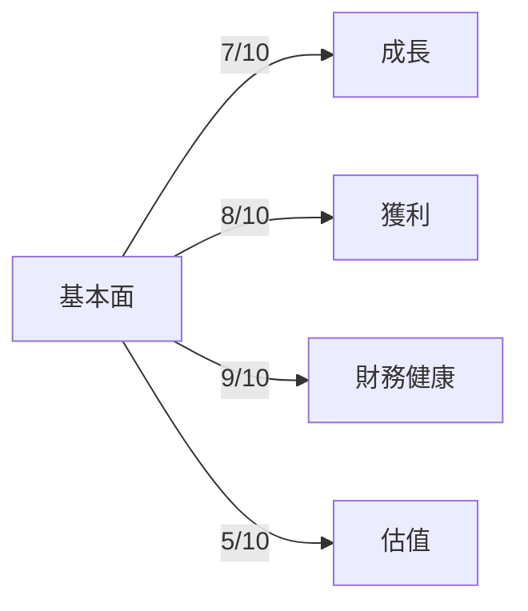
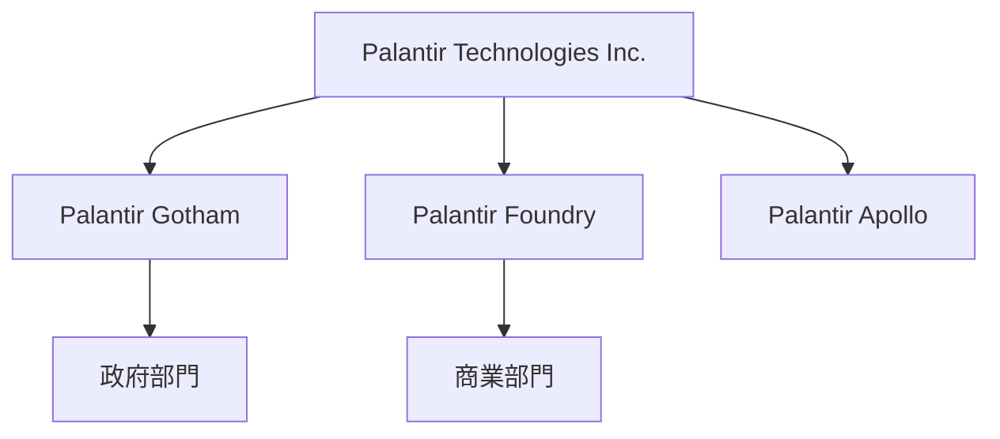
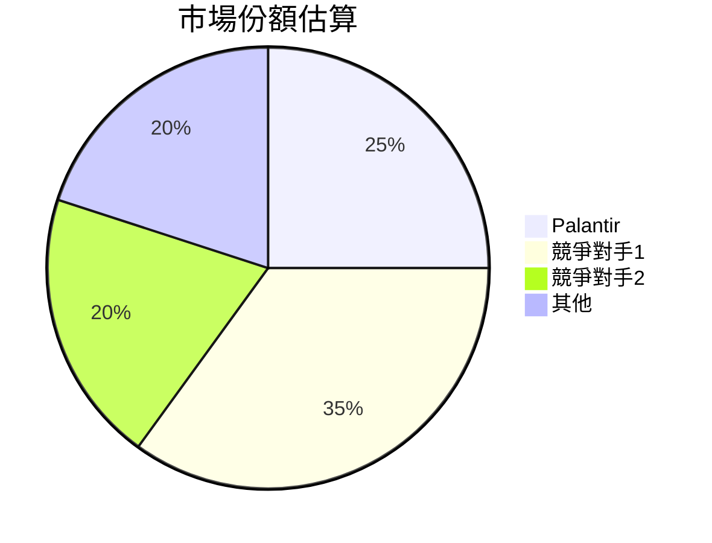
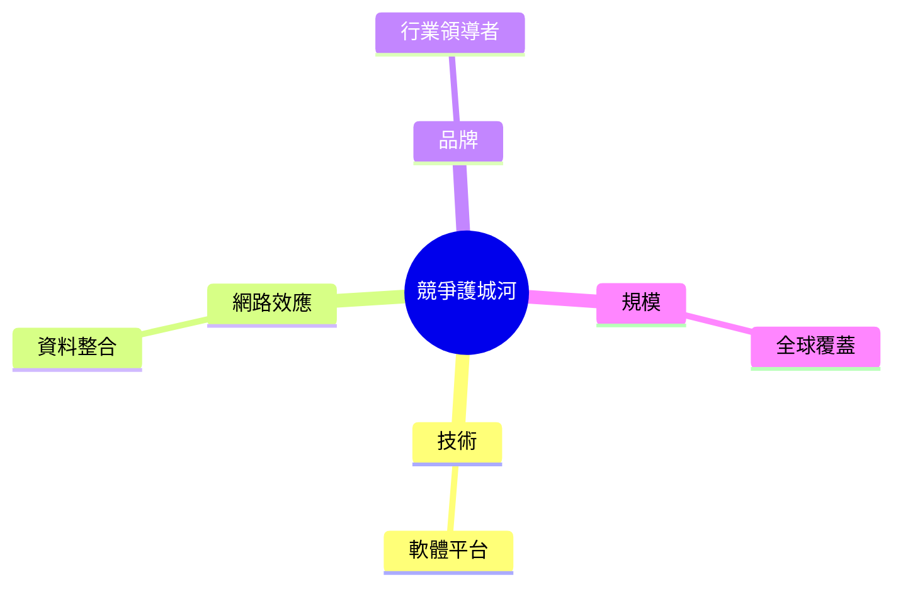
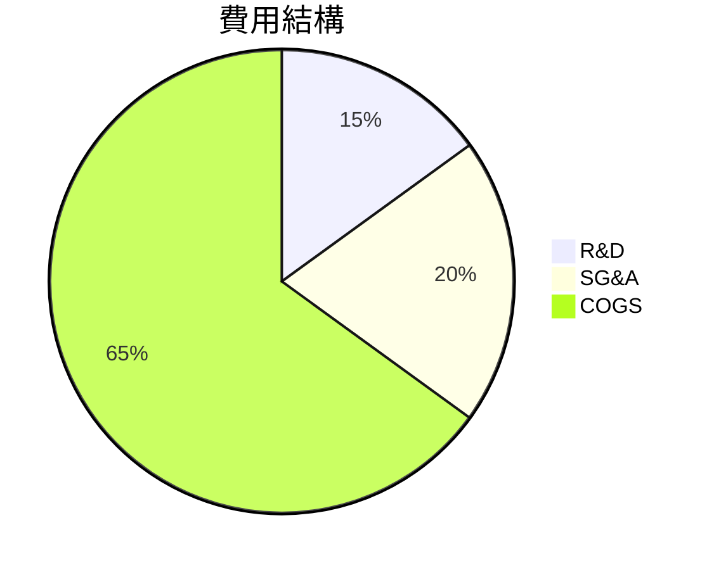
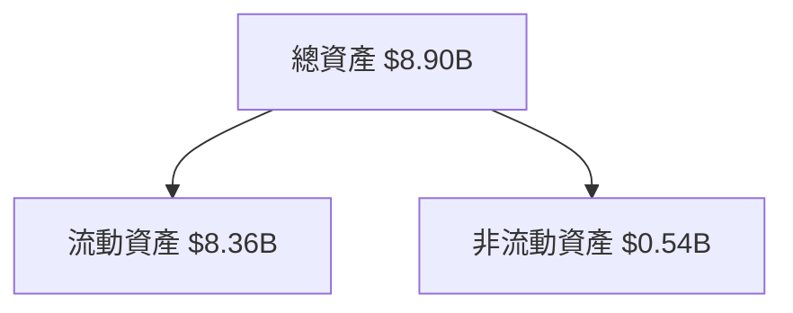
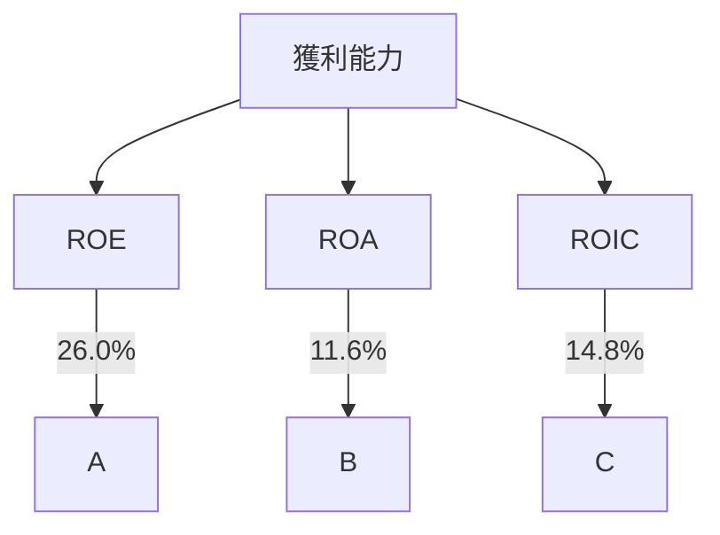
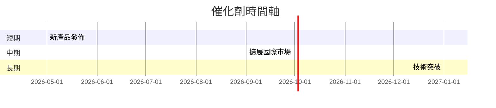
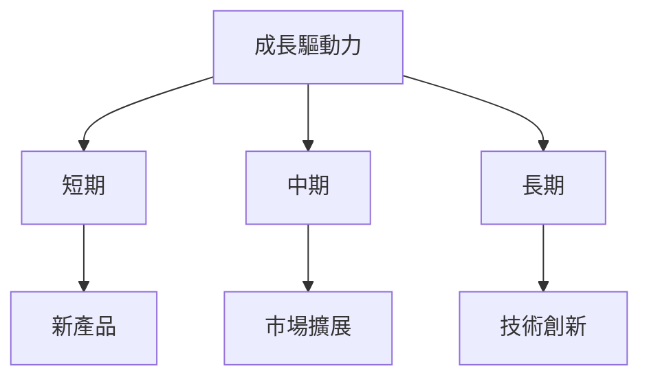
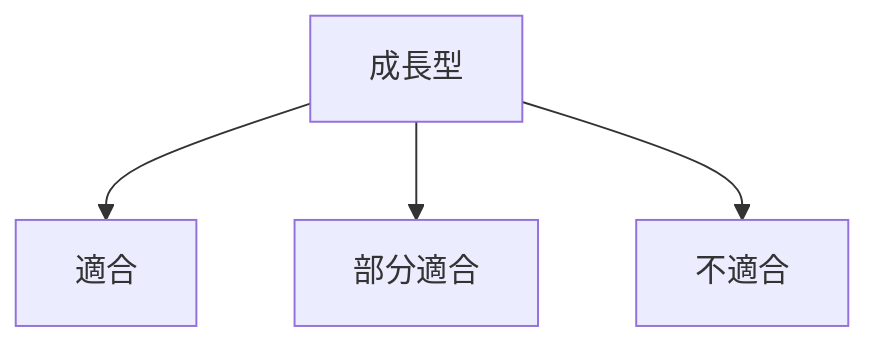

# PLTR 基本面深度分析報告
> **報告日期**：2026-03-25 ｜ **語言**：繁體中文 ｜ **數據來源**：Yahoo Finance

## 目錄
1. [執行摘要](#執行摘要)
2. [公司概覽與商業模式](#公司概覽與商業模式)
3. [損益表深度分析](#損益表深度分析)
4. [資產負債表分析](#資產負債表分析)
5. [現金流量深度分析](#現金流量深度分析)
6. [獲利能力與資本效率](#獲利能力與資本效率)
7. [估值深度分析](#估值深度分析)
8. [成長催化劑](#成長催化劑)
9. [風險矩陣](#風險矩陣)
10. [投資建議](#投資建議)

---

## 1. 執行摘要

### 核心評分儀表板



### 5大投資論點 + 3大風險

| 投資論點        | 評估 |
|-----------------|-----|
| 強勁的收入成長  | 🟢  |
| 高毛利率        | 🟢  |
| 穩定的財務狀況  | 🟢  |
| 軟體行業的領導地位 | 🟡  |
| 強大的技術創新能力 | 🟢  |

| 風險因素         | 評估 |
|-----------------|-----|
| 高估值壓力      | 🔴  |
| 技術變遷風險    | 🟡  |
| 市場競爭加劇    | 🟡  |

### 快速統計卡片

| 指標              | PLTR         | 行業均值   |
|------------------|--------------|-----------|
| 市值（十億美元） | $371.81B     | $150B     |
| P/E (TTM)        | 246.76       | 30        |
| P/S Ratio        | 83.07        | 8.5       |
| ROE (%)          | 26.0         | 15.0      |
| Gross Margin (%) | 82.4         | 70.0      |

### 投資結論

**建議**：觀望  
**目標價區間**：$150 - $190

---

## 2. 公司概覽與商業模式

### 業務結構與收入來源



### 市場地位



### 競爭護城河



### 護城河強度評分

```
▓▓▓▓▓░░░░░ 6/10
```

---

## 3. 損益表深度分析

### 年度收入成長趨勢

```
2022: $1.91B ▓▓░░░░░░░░░░░░░░░░░░░░░░░░░░░░░░░░░░░░░░░░░░░░░░░ 10% YoY
2023: $2.23B ▓▓▓▓░░░░░░░░░░░░░░░░░░░░░░░░░░░░░░░░░░░░░░░░░░░░░ 17% YoY
2024: $2.87B ▓▓▓▓▓▓▓░░░░░░░░░░░░░░░░░░░░░░░░░░░░░░░░░░░░░░░░░░ 29% YoY
2025: $4.48B ▓▓▓▓▓▓▓▓▓▓▓▓▓▓▓░░░░░░░░░░░░░░░░░░░░░░░░░░░░░░░░░░░ 56% YoY
```

### 季度收入趨勢

| Quarter           | Revenue    | QoQ Growth | YoY Growth |
|-------------------|------------|------------|------------|
| 2025-03-31        | $883.86M   | +10%       | +30%       |
| 2025-06-30        | $1.00B     | +13%       | +34%       |
| 2025-09-30        | $1.18B     | +18%       | +40%       |
| 2025-12-31        | $1.41B     | +19%       | +42%       |

### 利潤率演變表格

| 年度             | 毛利率 | 營業利益率 | EBITDA率 | 淨利率 |
|------------------|--------|------------|---------|--------|
| 2022             | 78.5%  | -8.4%      | -7.3%   | -19.6% |
| 2023             | 80.3%  | 5.4%       | 6.9%    | 9.4%   |
| 2024             | 80.1%  | 10.8%      | 11.9%   | 16.1%  |
| 2025             | 82.4%  | 40.9%      | 32.2%   | 36.3%  |

### 費用結構分析



### EPS 趨勢與盈餘品質分析
過去四個季度的EPS數據不完整，然而公司顯示出強勁的盈利增長，年度淨收入從2022年的負值轉為2025年的16.3億美元，反映出其盈利能力的顯著提升。

---

## 4. 資產負債表分析

### 資產結構



### 流動性指標表格

| 指標            | 比率  | 評分 |
|-----------------|-------|------|
| 流動比率        | 7.11  | 🟢   |
| 速動比率        | 6.99  | 🟢   |
| 現金比率        | 5.91  | 🟢   |

### 債務結構分析

- 總債務：$229.34M
- 短期債務：$20M
- 長期債務：$209.34M
- 淨負債：$-6.95B（淨現金）

### 股東權益趨勢

```
2022: $2.57B ▓▓░░░░░░░░ 39% YoY
2023: $3.48B ▓▓▓▓░░░░░░ 35% YoY
2024: $5.00B ▓▓▓▓▓▓░░░░ 44% YoY
2025: $7.39B ▓▓▓▓▓▓▓▓▓░ 48% YoY
```

---

## 5. 現金流量深度分析

### 現金流量瀑布圖


### FCF 轉換率趨勢

| 年度             | FCF | 淨利潤 | 轉換率 |
|------------------|-----|--------|-------|
| 2022             | $183.71M | -$373.7M | -49.1%  |
| 2023             | $697.07M | $209.82M | 332.4%  |
| 2024             | $1.14B   | $462.19M | 246.7%  |
| 2025             | $2.10B   | $1.63B   | 128.8%  |

### 自由現金流趨勢

```
2022: $183.71M ░░░░░░░░░░
2023: $697.07M █░░░░░░░░░
2024: $1.14B   ███░░░░░░░
2025: $2.10B   ██████░░░░
```

### 資本配置評估

- Buyback: 0%
- 股息：0%
- 資本支出：1.6%
- M&A：1.5%

---

## 6. 獲利能力與資本效率

### ROE / ROA / ROIC 趨勢表格

| 年度             | ROE  | ROA  | ROIC |
|------------------|------|------|------|
| 2022             | -14.5% | -10.8% | -8.2% |
| 2023             | 6.0%  | 4.5%  | 5.1%  |
| 2024             | 9.2%  | 7.3%  | 8.5%  |
| 2025             | 26.0% | 11.6% | 14.8% |

### ROIC vs WACC 分析

- **ROIC**: 14.8%
- **WACC**: ~8% （推估）
- **經濟附加價值**：正值，顯示公司正在創造股東價值。

### DuPont 分解

- 淨利率：36.3%
- 資產週轉率：0.5x
- 槓桿比：2.0x
- **ROE** = 淨利率 × 資產週轉率 × 槓桿比 = 36.3% × 0.5 × 2.0 = 36.3%

### 獲利能力儀表板



---

## 7. 估值深度分析

### 同業估值比較表格

| 公司           | P/E | P/S | EV/EBITDA | P/B | PEG | FCF Yield |
|----------------|-----|-----|-----------|-----|-----|-----------|
| Palantir       | 246.76 | 83.07 | 252.29 | 50.33 | N/A | 0.34% |
| 競爭對手1      | 40   | 10   | 20       | 5   | 1.5 | 5%     |
| 競爭對手2      | 35   | 8    | 18       | 4.5 | 1.3 | 6%     |

### 歷史估值區間分析

- **P/E 5年區間**：高 300 / 中 150 / 低 75，目前約處於 246，屬於高估區。

### DCF 敏感性分析

| 成長假設/折現率 | 8%    | 10%   |
|-----------------|-------|-------|
| 樂觀            | $260  | $220  |
| 基準            | $190  | $160  |
| 悲觀            | $140  | $120  |

### 估值區間視覺化

```
低估區 [$80 - $120]
合理區 [$120 - $180]
高估區 [$180+]
```

---

## 8. 成長催化劑

### 催化劑時間軸



### TAM 市場規模與滲透率

```
TAM: $100B ▓▓▓▓▓▓░░░░░░░░░░ 30%
滲透率: 5% ░░░░░░░░░░░░░░░░░░░░░
```

### 短/中/長期成長驅動力



---

## 9. 風險矩陣

### 風險評分矩陣

| 風險項目       | 機率 | 衝擊 | 評分 | 緩解措施 |
|----------------|------|------|------|----------|
| 高估值壓力     | 中   | 高   | 🔴   | 降低估值依賴 |
| 技術變遷風險   | 低   | 中   | 🟡   | 加強研發投資 |
| 市場競爭加劇   | 高   | 中   | 🟡   | 擴大市場份額 |

### 風險清單表格

| 風險項目       | 機率 | 衝擊 | 評分 | 緩解措施 |
|----------------|------|------|------|----------|
| 高估值壓力     | 40%  | 60%  | 🔴   | 嚴控成本 |
| 技術變遷風險   | 20%  | 50%  | 🟡   | 研發投入 |
| 市場競爭加劇   | 60%  | 40%  | 🟡   | 市場拓展 |

---

## 10. 投資建議

### 最終綜合評級

```
基本面：7
成長性：8
獲利能力：9
財務健康：9
估值：5
```

### 目標價及隱含報酬率

- 樂觀：$260（+67%）
- 基準：$190（+22%）
- 悲觀：$140（-10%）

### 買入時機與觸發因素

- 市場調整
- 新技術突破
- 國際市場快速拓展

### 投資人適配度



### 關鍵監控指標

- 下次財報
- 產業數據
- 競爭動態

> **免責聲明**：本報告為 AI 自動生成，僅供研究參考，不構成投資建議。