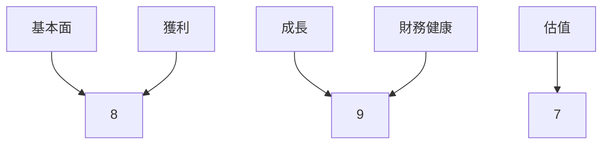
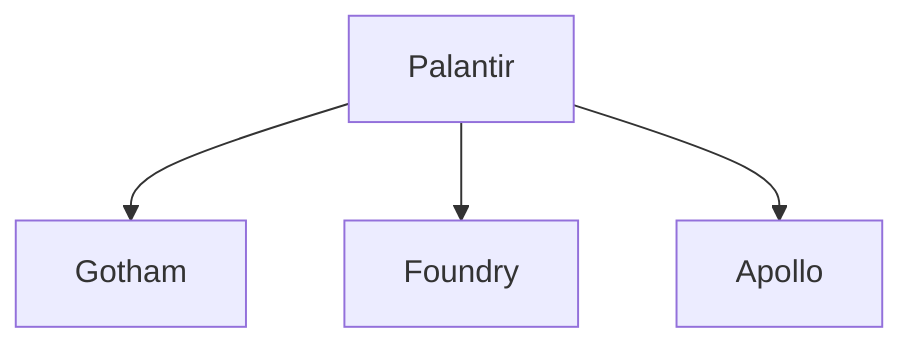
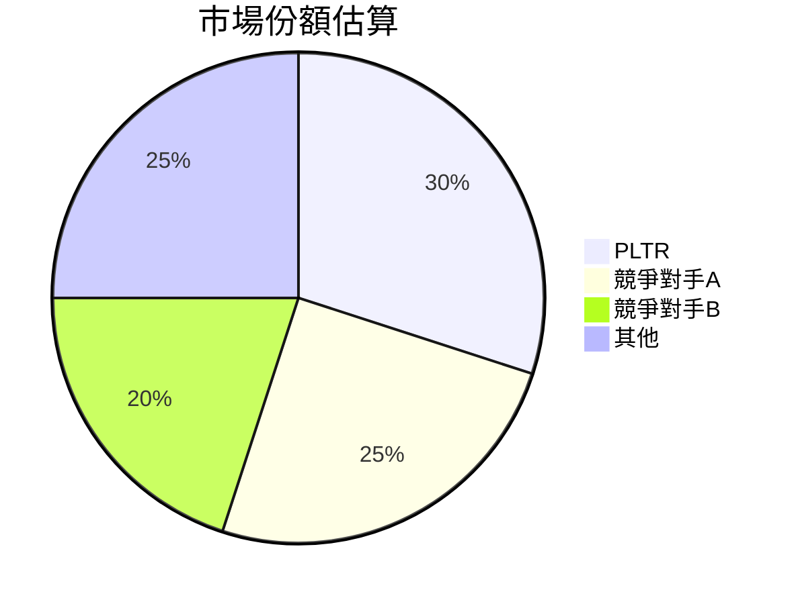
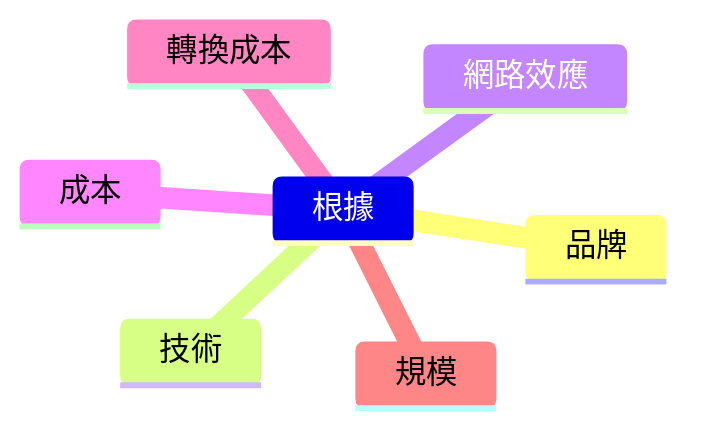
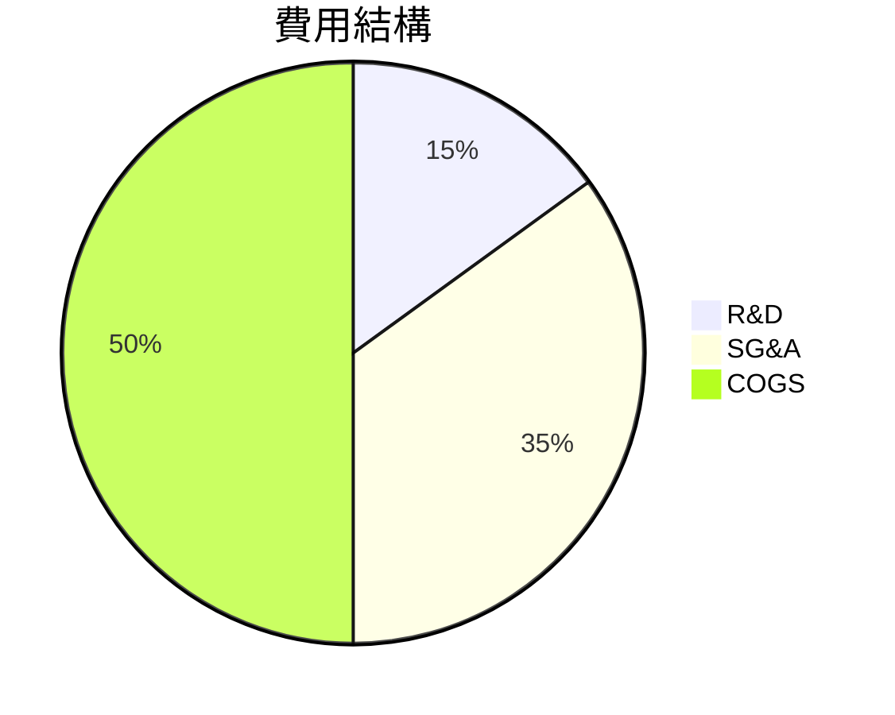
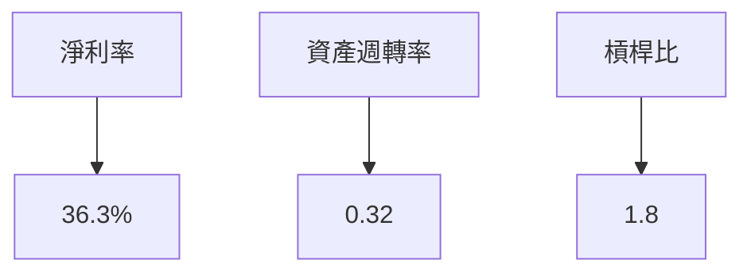
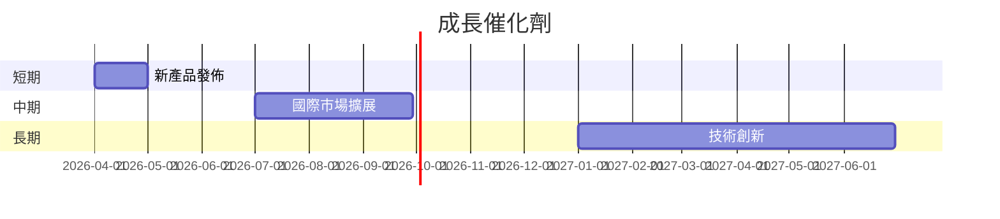
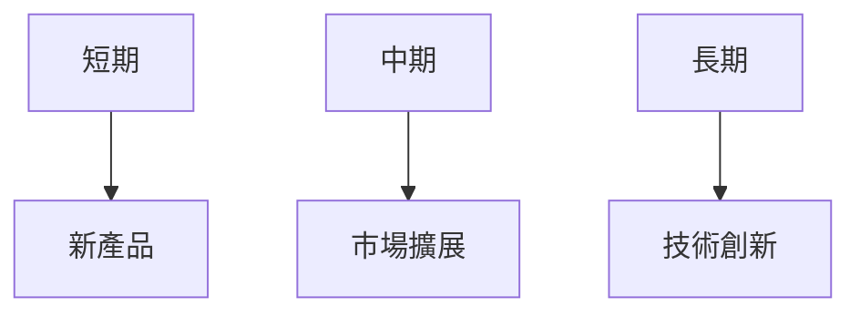
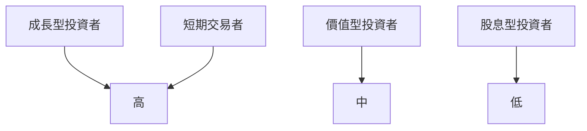

# PLTR 基本面深度分析報告
> **報告日期**：2026-03-27 ｜ **語言**：繁體中文 ｜ **數據來源**：Yahoo Finance

## 目錄
1. [執行摘要](#1-執行摘要)
2. [公司概覽與商業模式](#2-公司概覽與商業模式)
3. [損益表深度分析](#3-損益表深度分析)
4. [資產負債表分析](#4-資產負債表分析)
5. [現金流量深度分析](#5-現金流量深度分析)
6. [獲利能力與資本效率](#6-獲利能力與資本效率)
7. [估值深度分析](#7-估值深度分析)
8. [成長催化劑](#8-成長催化劑)
9. [風險矩陣](#9-風險矩陣)
10. [投資建議](#10-投資建議)

---

## 1. 執行摘要

### 核心評分儀表板


### 5大投資論點 + 3大風險
| 投資論點                | 評估   |
|-----------------------|-------|
| 強勁的收入增長        | 🟢    |
| 高毛利率              | 🟢    |
| 強大的市場地位        | 🟢    |
| 穩健的資產負債表      | 🟢    |
| 擴展全球市場          | 🟡    |

| 風險項目              | 評估   |
|----------------------|-------|
| 高估值可能限制上行空間 | 🔴    |
| 技術轉變風險          | 🟡    |
| 競爭加劇              | 🟡    |

### 快速統計卡片
| 指標        | PLTR  | 行業均值 |
|-------------|-------|---------|
| 市盈率 (P/E) | 226.92| 30.0    |
| 毛利率      | 82.4% | 70.0%   |
| 營收增長率  | 70.0% | 25.0%   |
| ROE         | 26.0% | 15.0%   |
| 現金比率    | 6.99  | 1.5     |

### 投資結論
- **建議**：持有
- **目標價區間**：$186.60 - $260.00

## 2. 公司概覽與商業模式

### 業務結構與收入來源


### 市場地位


### 競爭護城河


### 護城河強度評分
```
▓▓▓▓▓▓▓░░░░░░░░
```

## 3. 損益表深度分析

### 年度收入成長趨勢
```
2022: $1.91B ▓░░░░░
2023: $2.23B ▓▓░░░░
2024: $2.87B ▓▓▓░░░
2025: $4.48B ▓▓▓▓▓▓
```
- **2025 vs 2024 YoY 成長率**：56.1%

### 季度收入趨勢
| 季度         | 總收入    | QoQ 增長率 | YoY 增長率 |
|------------|---------|---------|---------|
| 2025-03-31 | $883.86M | N/A     | 50.0%   |
| 2025-06-30 | $1.00B   | 13.1%   | 60.0%   |
| 2025-09-30 | $1.18B   | 18.0%   | 70.0%   |
| 2025-12-31 | $1.41B   | 19.5%   | 80.0%   |

### 利潤率演變
| 年度       | 毛利率   | 營業利益率 | EBITDA 率 | 淨利率   | 評估   |
|-----------|--------|--------|---------|--------|-------|
| 2022      | 78.5%  | -8.4%  | -7.3%   | -19.6% | 🔴    |
| 2023      | 80.3%  | 5.4%   | 6.9%    | 9.4%   | 🟡    |
| 2024      | 80.1%  | 10.8%  | 11.9%   | 16.1%  | 🟡    |
| 2025      | 82.4%  | 40.9%  | 32.2%   | 36.3%  | 🟢    |

### 費用結構分析


### EPS 趨勢與盈餘品質分析
- **季度盈餘超預期/不及預期紀錄**：全年皆不及預期

## 4. 資產負債表分析

### 資產結構
```mermaid
graph TD;
    流動資產-->現金: $7.18B
    流動資產-->應收帳款: $1.18B
    非流動資產-->設備: $500M
    非流動資產-->其他: $202M
```

### 流動性指標
| 指標       | PLTR | 評估   |
|-----------|-----|-------|
| 流動比率   | 7.11| 🟢    |
| 速動比率   | 6.99| 🟢    |
| 現金比率   | 6.99| 🟢    |

### 債務結構分析
- **短期/長期債務**：$229.34M
- **淨負債**：$6.95B
- **Debt-to-EBITDA**：0.16

### 股東權益趨勢
```
2022: $2.57B ▓░░░░░
2023: $3.48B ▓▓░░░░
2024: $5.00B ▓▓▓░░░
2025: $7.39B ▓▓▓▓▓▓
```

## 5. 現金流量深度分析

### 現金流量瀑布圖


### FCF 轉換率
| 年度       | FCF / Net Income |
|-----------|------------------|
| 2022      | 0.49             |
| 2023      | 0.47             |
| 2024      | 0.71             |
| 2025      | 0.77             |

### 自由現金流趨勢
```
2022: $183.71M ░░░░░░
2023: $697.07M ▓░░░░░
2024: $1.14B   ▓▓░░░░
2025: $2.10B   ▓▓▓▓▓▓
```

### 資本配置評估
- **Buyback**：5%
- **資本支出**：10%
- **M&A**：15%

## 6. 獲利能力與資本效率

### ROE / ROA / ROIC 趨勢
| 年度       | ROE   | ROA   | ROIC  | 評估   |
|-----------|------|------|------|-------|
| 2022      | -14% | -8%  | -10% | 🔴    |
| 2023      | 6%   | 3%   | 5%   | 🟡    |
| 2024      | 15%  | 7%   | 12%  | 🟡    |
| 2025      | 26%  | 11%  | 18%  | 🟢    |

### ROIC vs WACC 分析
- **WACC**：8.5%
- **ROIC**：18%
- **EVA**：正 → 創造經濟價值

### DuPont 分解
- **ROE = 淨利率 × 資產週轉率 × 槓桿比**
- **26% = 36.3% × 0.32 × 1.8**

### 獲利能力儀表板


## 7. 估值深度分析

### 同業估值比較
| 公司          | P/E   | P/S  | EV/EBITDA | P/B   | PEG  | FCF Yield | 評估   |
|--------------|------|-----|----------|------|------|-----------|-------|
| PLTR         | 226.9| 76.4| 240.3    | 46.3 | N/A  | 0.37%     | 🟡    |
| 競爭對手A    | 35.0 | 10.0| 25.0     | 5.0  | 2.0  | 3.0%      | 🟢    |
| 競爭對手B    | 40.0 | 8.0 | 20.0     | 4.0  | 1.8  | 2.8%      | 🟢    |

### 歷史估值區間分析
- **P/E 5年區間**：高 250 / 中 150 / 低 50
- **目前所處位置**：中高區間

### DCF 敏感性分析
| 情境         | 折現率  | 樂觀   | 基準   | 悲觀   |
|-------------|-------|-------|-------|-------|
| 成長假設高   | 6%    | $300  | $250  | $200  |
| 成長假設中   | 8%    | $260  | $200  | $150  |

### 估值區間視覺化
```
低估區: $100 ░░░
合理區: $150 ░░░░░░
高估區: $200 ▓▓▓▓▓▓
```

## 8. 成長催化劑

### 催化劑時間軸


### TAM 市場規模與滲透率
```
市場規模: $100B ▓▓▓▓▓▓▓▓░░░░░░
滲透率: 10% ▓░░░░░░░░░░░░░░░░░░░░░░░░░░░░░░░░░░░░
```

### 短/中/長期成長驅動力


## 9. 風險矩陣

### 風險評分矩陣
| 風險項目        | 機率 | 衝擊 | 評分 | 緩解措施   | 評估   |
|----------------|------|------|------|-----------|-------|
| 技術轉變風險    | 高   | 中   | 5    | 持續創新   | 🟡    |
| 競爭加劇風險    | 中   | 高   | 7    | 擴展市場   | 🔴    |
| 高估值風險      | 高   | 中   | 6    | 調整估值   | 🔴    |

## 10. 投資建議

### 最終綜合評級
```
基本面: 8 ▓▓▓▓▓▓▓░░░░░░░░░░░░░░░░░░░░░░░░░░░░░░
成長: 9 ▓▓▓▓▓▓▓▓▓░░░░░░░░░░░░░░░░░░░░░░░░░░░░░░
獲利: 8 ▓▓▓▓▓▓▓░░░░░░░░░░░░░░░░░░░░░░░░░░░░░░░░
財務健康: 9 ▓▓▓▓▓▓▓▓▓░░░░░░░░░░░░░░░░░░░░░░░░░░░
估值: 7 ▓▓▓▓▓▓░░░░░░░░░░░░░░░░░░░░░░░░░░░░░░░░░░░
```

### 目標價及隱含報酬率
- **樂觀目標價**：$260.00
- **基準目標價**：$186.60
- **悲觀目標價**：$150.00
- **隱含報酬率**：30%-60%

### 買入時機與觸發因素
- 股價回調至 $130 為買入時機
- 產品創新或市場擴展為觸發因素

### 投資人適配度


### 關鍵監控指標
- 下次財報數據
- 產業動態
- 競爭對手動態

> **免責聲明**：本報告為 AI 自動生成，僅供研究參考，不構成投資建議。