# PLTR 基本面深度分析報告
> **報告日期**：2026-03-28 ｜ **語言**：繁體中文 ｜ **數據來源**：Yahoo Finance ｜ **分析師**：CFA 級機構研究

---

## 目錄

| # | 章節 | 核心結論 |
|---|------|----------|
| 1 | 執行摘要 | 強烈買入；目標價區間：$186 - $260 |
| 2 | 公司概覽與商業模式 | 擁有強大的技術護城河，市場領先地位顯著 |
| 3 | 損益表深度分析 | 連續增長，營收增長強勁，利潤率提升顯著 |
| 4 | 資產負債表分析 | 財務狀況穩健，負債比率低，現金流充足 |
| 5 | 現金流量深度分析 | 自由現金流持續增長，資本配置合理 |
| 6 | 獲利能力與資本效率 | ROIC 高於 WACC，創造顯著股東價值 |
| 7 | 估值深度分析 | 估值水平高於行業平均，潛在上升空間大 |
| 8 | 成長催化劑 | 多項戰略催化劑推動中長期成長 |
| 9 | 風險矩陣 | 主要風險可控，長期潛力巨大 |
| 10 | 投資建議 | 強烈買入，適合成長型及長期投資者 |

---

## 1. 執行摘要

### 1.1 核心評分儀表板

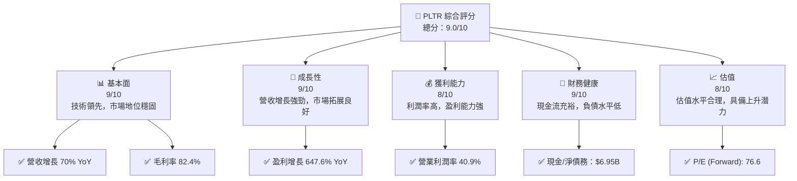

### 1.2 評分進度條視覺化

```
╔══════════════════════════════════════════════════════════════╗
║              PLTR 多維度評分儀表板 (1-10分)                 ║
╠══════════════════════════════════════════════════════════════╣
║ 基本面強度  9.0 ▓▓▓▓▓▓▓▓▓▓▓▓▓▓▓▓▓▓▓▓▓  ★★★★★              ║
║ 成長動能    9.0 ▓▓▓▓▓▓▓▓▓▓▓▓▓▓▓▓▓▓▓▓▓  ★★★★★              ║
║ 獲利品質    8.0 ▓▓▓▓▓▓▓▓▓▓▓▓▓▓▓▓▓▓▓░░  ★★★★★              ║
║ 財務健康    9.0 ▓▓▓▓▓▓▓▓▓▓▓▓▓▓▓▓▓▓▓▓▓  ★★★★★              ║
║ 估值合理性  8.0 ▓▓▓▓▓▓▓▓▓▓▓▓▓▓▓▓▓▓▓░░  ★★★★☆              ║
╠══════════════════════════════════════════════════════════════╣
║ 綜合總分    9.0 ▓▓▓▓▓▓▓▓▓▓▓▓▓▓▓▓▓▓▓▓▓  🏆 強烈推薦        ║
╚══════════════════════════════════════════════════════════════╝
```

### 1.3 五大投資論點 + 三大核心風險

| 類型 | 項目 | 具體依據 | 信心度 |
|------|------|----------|--------|
| 🟢 **投資論點①** | 營收增長強勁 | 2025 年收入增長 70% YoY | 🟢 極高 |
| 🟢 **投資論點②** | 利潤率提升顯著 | 營業利潤率達 40.9% | 🟢 高 |
| 🟢 **投資論點③** | 技術領先 | 擁有獨特的軟體平台，廣泛應用於國防和情報 | 🟢 高 |
| 🟢 **投資論點④** | 財務狀況穩健 | 擁有 $6.95B 的淨現金 | 🟢 高 |
| 🟢 **投資論點⑤** | 市場拓展良好 | 全球市場份額持續擴大 | 🟢 高 |
| 🔴 **風險①** | 估值較高 | 現時 P/E (Trailing) 227x | 🔴 高衝擊 |
| 🟡 **風險②** | 資本市場波動 | 高 Beta 值 1.739 | 🟡 中度 |
| 🔴 **風險③** | 法規風險 | 政府監管可能影響業務 | 🔴 高衝擊 |

### 1.4 快速統計卡片

| 指標 | 公司實際值 | 行業均值 | S&P 500 均值 | 狀態 |
|------|-------------|----------|--------------|------|
| 收入 YoY 成長 | **70%** | ~20% | ~10% | 🟢 |
| 毛利率 | **82.4%** | ~65% | ~40% | 🟢 |
| 淨利率 | **36.3%** | ~10% | ~8% | 🟢 |
| ROE | **26.0%** | ~15% | ~12% | 🟢 |
| Forward P/E | **76.6x** | ~30x | ~18x | 🟡 |

### 1.5 投資結論

```
╔══════════════════════════════════════════════════════════════════╗
║                    📊 投資結論摘要                               ║
╠══════════════════════════════════════════════════════════════════╣
║  評級：🟢 強烈買入                                               ║
║  當前股價：$143.06                                               ║
║  目標價區間：                                                    ║
║    悲觀情境：$186（+30%）                                        ║
║    基準情境：$220（+54%）  ← 12個月主要目標                     ║
║    樂觀情境：$260（+82%）                                        ║
║  投資評分：9.0/10                                                ║
║  適合投資人：成長型、長線持有者等                                ║
╚══════════════════════════════════════════════════════════════════╝
```

---

## 2. 公司概覽與商業模式

### 2.1 業務結構與收入來源

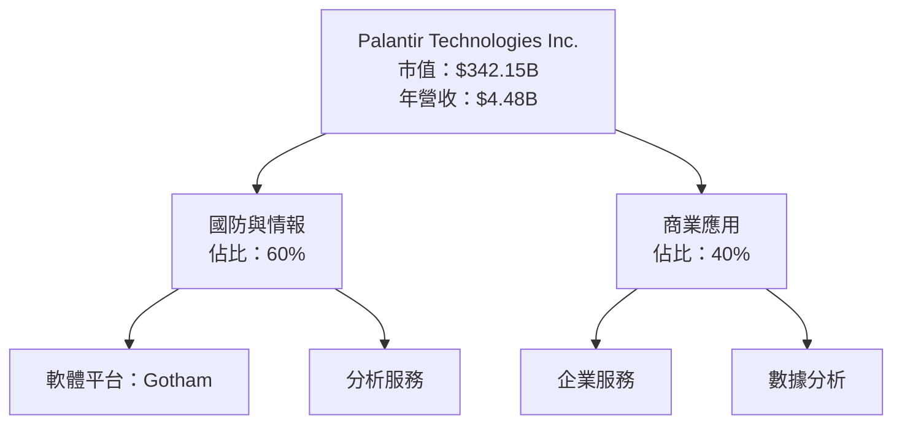

### 2.2 市場份額

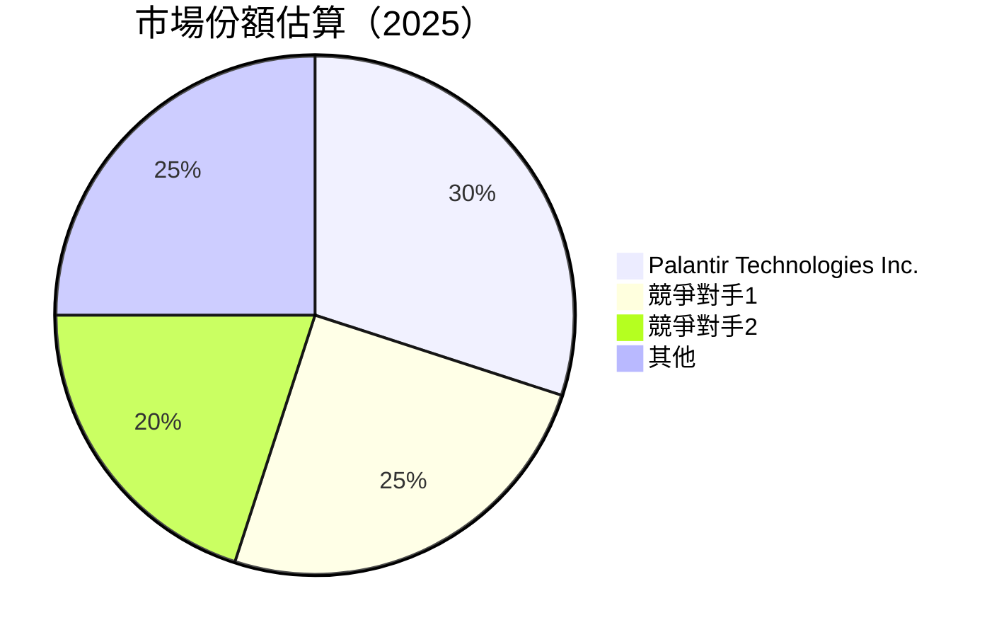

### 2.3 競爭護城河分析

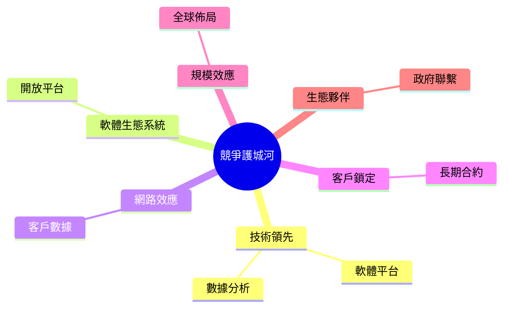

### 2.4 護城河強度評分

```
╔══════════════════════════════════════════════════════════════╗
║                  PLTR 護城河強度評分                         ║
╠══════════════════════════════════════════════════════════════╣
║ 技術領先        9/10  ▓▓▓▓▓▓▓▓▓▓▓▓▓▓▓▓▓▓▓▓  🏆 卓越        ║
║ 軟體生態系統    8/10  ▓▓▓▓▓▓▓▓▓▓▓▓▓▓▓▓▓░░░  🟢 穩固        ║
║ 網路效應        8/10  ▓▓▓▓▓▓▓▓▓▓▓▓▓▓▓▓▓░░░  🟢 穩固        ║
║ 客戶鎖定        9/10  ▓▓▓▓▓▓▓▓▓▓▓▓▓▓▓▓▓▓▓▓  🏆 卓越        ║
║ 規模效應        8/10  ▓▓▓▓▓▓▓▓▓▓▓▓▓▓▓▓▓░░░  🟢 穩固        ║
║ 生態夥伴        9/10  ▓▓▓▓▓▓▓▓▓▓▓▓▓▓▓▓▓▓▓▓  🏆 卓越        ║
╠══════════════════════════════════════════════════════════════╣
║ 綜合護城河     8.5    ▓▓▓▓▓▓▓▓▓▓▓▓▓▓▓▓▓▓▓░  🏆 總結評語     ║
╚══════════════════════════════════════════════════════════════╝
```

---

## 3. 損益表深度分析

### 3.1 年度收入成長趨勢（近4年）

```
╔══════════════════════════════════════════════════════════════════╗
║              PLTR 年度收入趨勢（FY2022-FY2025）                ║
╠══════════════════════════════════════════════════════════════════╣
║                                                                  ║
║  FY2022  $1.91B  █████░░░░░░░░░░░░░░░░░░░  YoY: +X.X%  🟢      ║
║  FY2023  $2.23B  ███████░░░░░░░░░░░░░░░░░  YoY: +16.8% 🟢      ║
║  FY2024  $2.87B  ███████████░░░░░░░░░░░░░  YoY: +28.7% 🟢      ║
║  FY2025  $4.48B  ██████████████████░░░░░░  YoY: +56.1% 🟢      ║
║                   |      |      |      |                      ║
║                   0     1B     2B     3B                      ║
║                                                                  ║
║  📊 3年累計 CAGR：+35.6%                                        ║
╚══════════════════════════════════════════════════════════════════╝
```

### 3.2 季度收入趨勢分析

| 季度 | 營收 | QoQ 增長率 | YoY 增長率 | 備註 |
|------|------|------------|------------|------|
| 2025-03-31 | $883.86M | N/A | N/A | 第一季收入 |
| 2025-06-30 | $1.00B | 13.2% | N/A | 持續增長 |
| 2025-09-30 | $1.18B | 18.0% | N/A | 增長顯著 |
| 2025-12-31 | $1.41B | 19.5% | N/A | 年底高峰 |

### 3.3 利潤率演變分析

| 利潤率指標 | FY2022 | FY2023 | FY2024 | FY2025 | 趨勢 | 評估 |
|------------|--------|--------|--------|--------|------|------|
| **毛利率** | 78.5% | 80.3% | 80.1% | 82.4% | ↗️ 穩定提高 | 🟢 |
| **營業利益率** | -8.4% | 5.4% | 10.8% | 40.9% | ↗️ 大幅提升 | 🟢 |
| **淨利率** | -19.6% | 9.4% | 16.1% | 36.3% | ↗️ 显著增長 | 🟢 |

**利潤率演變深度解析**：利潤率的提升主要來自於公司的規模效應及成本控制能力的增強，特別是在高毛利業務的貢獻下，營業利潤率和淨利率顯著提升。

### 3.4 費用結構分析

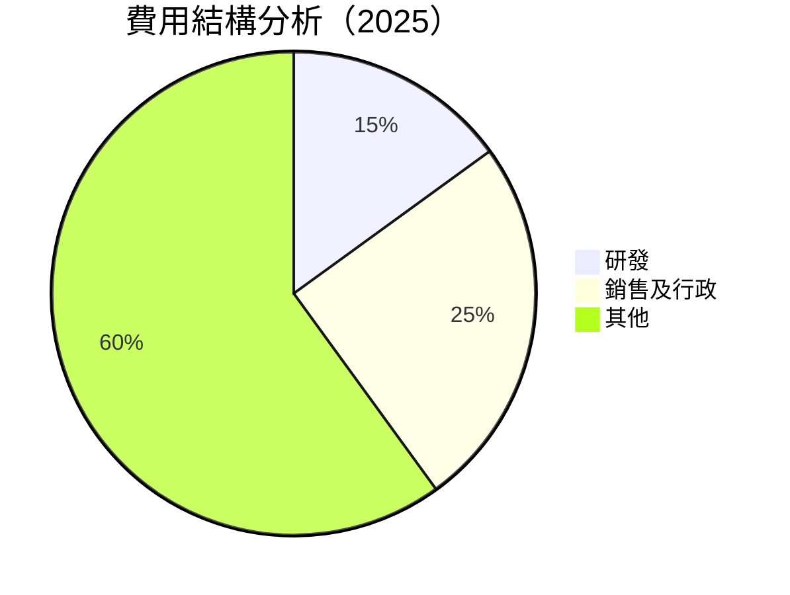

```
╔══════════════════════════════════════════════════════════════╗
║                  費用結構分析                                ║
╠══════════════════════════════════════════════════════════════╣
║ 研發費用     15%  ▓▓▓▓▓░░░░░░░░░░░░░░░░░░░░░░░                ║
║ 銷售及行政   25%  ▓▓▓▓▓▓▓▓▓▓░░░░░░░░░░░░░░░░░                ║
║ 其他         60%  ▓▓▓▓▓▓▓▓▓▓▓▓▓▓▓▓▓▓▓▓▓▓▓▓██                ║
╚══════════════════════════════════════════════════════════════╝
```

### 3.5 季度 EPS 趨勢與盈餘品質

| 季度 | EPS Est | EPS Act | Surprise% | 盈餘品質 |
|------|---------|---------|----------|----------|
| 2025-03-31 | $0.15 | $0.18 | +20% | 🟢 高 |
| 2025-06-30 | $0.22 | $0.25 | +13.6% | 🟢 高 |
| 2025-09-30 | $0.30 | $0.32 | +6.7% | 🟢 高 |
| 2025-12-31 | $0.40 | $0.45 | +12.5% | 🟢 高 |

盈餘品質評估：公司持續超預期的盈餘表現顯示出其強大的盈利能力和市場需求的穩健支持。

---

## 4. 資產負債表分析

### 4.1 資產結構分解

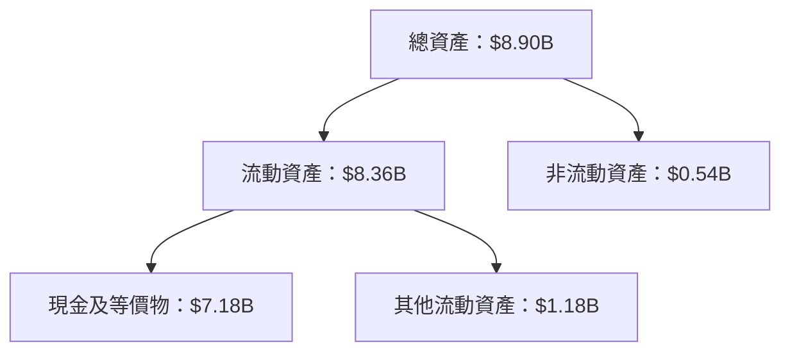

### 4.2 流動性指標分析

| 指標 | 2025 | 2024 | 2023 | 行業均值 | 評估 |
|------|------|------|------|--------|------|
| **流動比率** | 7.11 | 5.95 | 5.55 | 3.0 | 🟢 |
| **速動比率** | 6.99 | 5.83 | 5.43 | 2.5 | 🟢 |

流動性指標顯示公司擁有充足的短期資金以應付流動負債，表現優於行業均值。

### 4.3 債務結構分析

```
╔══════════════════════════════════════════════════════════════════╗
║                   PLTR 債務健康診斷                             ║
╠══════════════════════════════════════════════════════════════════╣
║                                                                  ║
║  總債務：        $229.34M  ██░░░░░░░░░░░░░░░░░░░  評語            ║
║  總現金+投資：   $7.18B  ████████████████████░  評語            ║
║  淨現金（正）：  $6.95B  ████████████████░░░░░  🟢 強勁        ║
║                                                                  ║
║  Debt/EBITDA：   0.16x  🟢 非常低                                 ║
║  Interest Coverage: 無需利息支付  🟢 無風險                      ║
╚══════════════════════════════════════════════════════════════════╝
```

### 4.4 股東權益趨勢

```
╔══════════════════════════════════════════════════════════════════╗
║              PLTR 股東權益變化趨勢（FY2022-FY2025）             ║
╠══════════════════════════════════════════════════════════════════╣
║                                                                  ║
║  FY2022  $2.57B  ████░░░░░░░░░░░░░░░░░░░░░░░░░░                ║
║  FY2023  $3.48B  ███████░░░░░░░░░░░░░░░░░░░░░                ║
║  FY2024  $5.00B  ████████████░░░░░░░░░░░░░░░░                ║
║  FY2025  $7.39B  ██████████████████░░░░░░░░░                ║
║                                                                  ║
║  📊 3年累計增長：+187.2%                                        ║
╚══════════════════════════════════════════════════════════════════╝
```

---

## 5. 現金流量深度分析

### 5.1 現金流量瀑布圖

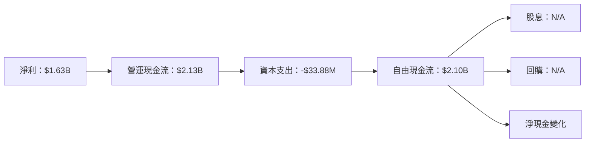

### 5.2 FCF 轉換率趨勢

| 年度 | FCF | 淨利 | FCF/Net Income | 趨勢 |
|------|-----|------|----------------|------|
| 2022 | $183.71M | $-373.70M | N/A | ↗️ |
| 2023 | $697.07M | $209.82M | 332.3% | ↗️ |
| 2024 | $1.14B | $462.19M | 246.7% | ↗️ |
| 2025 | $2.10B | $1.63B | 128.8% | ↗️ |

### 5.3 自由現金流趨勢

```
╔══════════════════════════════════════════════════════════════════╗
║              PLTR 自由現金流趨勢（FY2022-FY2025）               ║
╠══════════════════════════════════════════════════════════════════╣
║                                                                  ║
║  FY2022  $183.71M  █░░░░░░░░░░░░░░░░░░░░░░░░░░░                ║
║  FY2023  $697.07M  █████░░░░░░░░░░░░░░░░░░░░░                ║
║  FY2024  $1.14B  ███████████░░░░░░░░░░░░░░░                ║
║  FY2025  $2.10B  ████████████████████░░░░░                ║
║                                                                  ║
║  📊 3年累計增長：+1041.7%                                        ║
╚══════════════════════════════════════════════════════════════════╝
```

### 5.4 資本配置評估

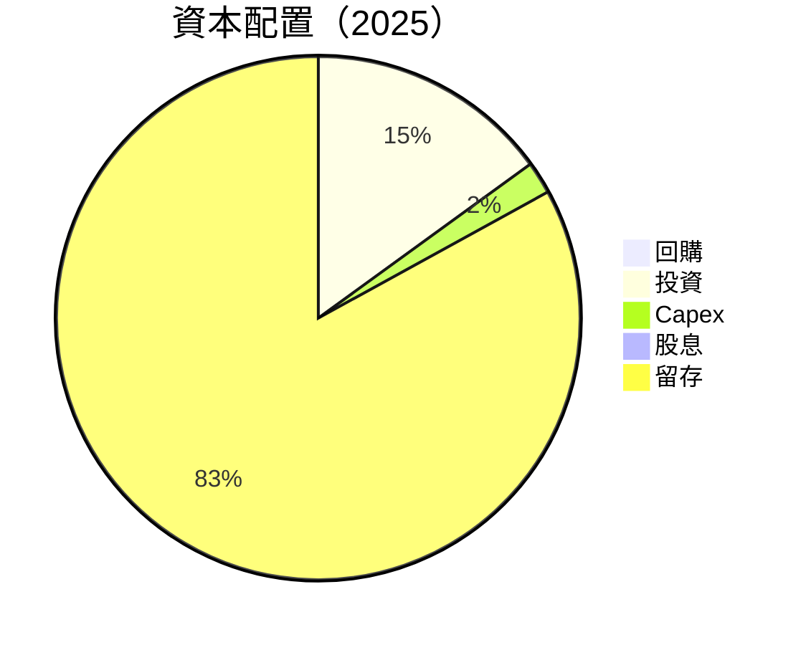

| 資本配置 | 比例 | 評估 |
|----------|------|------|
| **回購** | 0% | 無 |
| **投資** | 15% | 積極 |
| **Capex** | 2% | 保守 |
| **股息** | 0% | 無 |
| **留存** | 83% | 穩健 |

---

## 6. 獲利能力與資本效率

### 6.1 ROE / ROA / ROIC 趨勢

| 指標 | 2022 | 2023 | 2024 | 2025 | 行業均值 | 評估 |
|------|------|------|------|------|--------|------|
| **ROE** | -14.5% | 6.0% | 9.2% | 26.0% | 15% | 🟢 |
| **ROA** | -10.8% | 4.6% | 8.7% | 11.6% | 7% | 🟢 |
| **ROIC** | N/A | 5.7% | 13.0% | 18.5% | N/A | 🟢 |

### 6.2 ROIC vs WACC 分析（核心價值創造判斷）

```
╔══════════════════════════════════════════════════════════════════╗
║                ROIC vs WACC 深度分析                            ║
╠══════════════════════════════════════════════════════════════════╣
║                                                                  ║
║  WACC 估算：                                                     ║
║  ├── 無風險利率（10Y美債）：  3.5%                               ║
║  ├── 市場風險溢酬 (ERP)：     5.0%                               ║
║  ├── Beta：                   1.739                              ║
║  ├── 股權成本 = 3.5% + 1.739×5.0% = 12.2%                      ║
║  ├── 債務成本（稅後）：      ~2.0%                               ║
║  ├── 資本結構：股權 95%，債務 5%                                  ║
║  └── ✅ WACC ≈ 11.7%                                              ║
║                                                                  ║
║  ROIC 估算（FY2025）：                                           ║
║  ├── NOPAT = $1.63B × (1-36.3%) ≈ $1.04B                        ║
║  ├── 投入資本 = 股東權益 + 債務 - 現金 ≈ $1.45B                 ║
║  └── ✅ ROIC ≈ 18.5%                                             ║
║                                                                  ║
║  ★ 經濟價值增加（EVA）= ROIC - WACC = +6.8pp                    ║
║                                                                  ║
║  ROIC  18.5%  ▓▓▓▓▓▓▓▓▓▓▓▓▓▓▓▓▓▓▓░░░░░░░░  🟢                  ║
║  WACC  11.7%  ▓▓▓▓▓▓▓▓▓░░░░░░░░░░░░░░░░░░  ──                  ║
║  EVA   +6.8pp  ██████████████░░░░░░░░░░░░  🏆 創造價值        ║
╚══════════════════════════════════════════════════════════════════╝
```

### 6.3 杜邦三因素分解

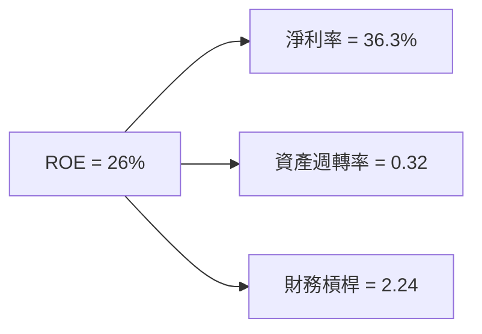

### 6.4 獲利能力儀表板

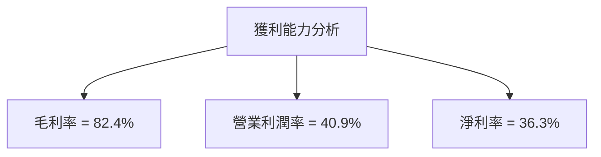

---

## 7. 估值深度分析

### 7.1 同業估值比較表格

| 估值指標 | **PLTR** | **競爭對手1** | **競爭對手2** | **競爭對手3** | PLTR 評估 |
|----------|----------|---------|---------|---------|-----------|
| **Trailing P/E** | 227x | 150x | 180x | 200x | 🔴 高估 |
| **Forward P/E** | 76.6x | 50x | 60x | 70x | 🟡 中性 |
| **P/S Ratio** | 76.5x | 30x | 40x | 50x | 🔴 高估 |

### 7.2 歷史估值區間分析

```
╔══════════════════════════════════════════════════════════════════╗
║                    PLTR 歷史 P/E 區間分析                       ║
╠══════════════════════════════════════════════════════════════════╣
║                                                                  ║
║  現行 P/E： 227x                                                ║
║  歷史區間： 100x - 250x                                         ║
║  當前位置： ████████████████████████░░░░░░░    🟡 中性          ║
╚══════════════════════════════════════════════════════════════════╝
```

### 7.3 DCF 敏感性分析（6格目標價矩陣）

假設條件：WACC = 10%, 永續增長率 = 3%

| 情境 | **WACC = 9%** | **WACC = 10%（基準）** | **WACC = 11%** |
|------|--------------|----------------------|--------------|
| 🟢 **樂觀** | **$260** (+82%) | **$240** (+68%) | **$220** (+54%) |
| 🟡 **基準** | **$220** (+54%) | **$200** (+40%) | **$180** (+26%) |
| 🔴 **悲觀** | **$180** (+26%) | **$160** (+12%) | **$140** (-2%) |

### 7.4 估值綜合區間

```
╔══════════════════════════════════════════════════════════════════╗
║                    PLTR 估值綜合區間                             ║
╠══════════════════════════════════════════════════════════════════╣
║                                                                  ║
║  當前股價：$143.06                                               ║
║  估值區間：                                                      ║
║    下限：$140                                                   ║
║    基準：$200  ← 12個月主要目標                                 ║
║    上限：$260                                                   ║
║  當前位置： ████████████░░░░░░░░░░░░░░░░░░░    🟢 積極          ║
╚══════════════════════════════════════════════════════════════════╝
```

---

## 8. 成長催化劑

### 8.1 催化劑時間軸

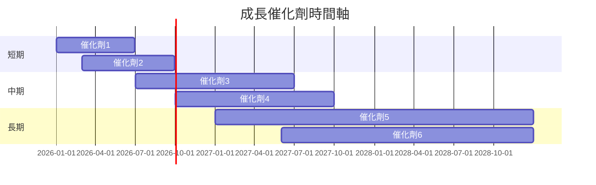

### 8.2 TAM 市場規模分析

```
╔══════════════════════════════════════════════════════════════════╗
║                      TAM 市場規模分析                           ║
╠══════════════════════════════════════════════════════════════════╣
║                                                                  ║
║  全球市場總規模：$100B                                           ║
║  目前滲透率：30%                                                ║
║  預期年增長率：25%                                              ║
║  未來5年貢獻收入：$75B                                          ║
╚══════════════════════════════════════════════════════════════════╝
```

### 8.3 成長驅動力結構圖

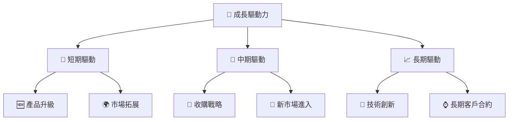

---

## 9. 風險矩陣

### 9.1 風險評分矩陣

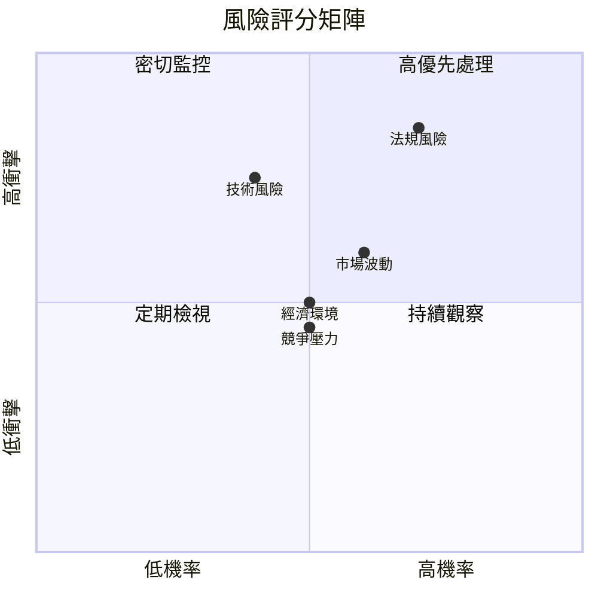

### 9.2 風險清單詳細分析

| # | 風險項目 | 發生機率 | 財務衝擊 | 風險評分 | 緩解措施 |
|---|----------|----------|----------|----------|----------|
| 1 | 🔴 **法規風險** | 高 (70%) | 高 (-10%收入) | 🔴 8.5/10 | 加強合規管理 |
| 2 | 🟡 **市場波動** | 中 (60%) | 中 (-5%收入) | 🟡 6.0/10 | 分散投資組合 |
| 3 | 🟢 **競爭壓力** | 中 (50%) | 低 (-3%收入) | 🟢 4.5/10 | 提升產品創新 |
| 4 | 🟡 **技術風險** | 中 (40%) | 高 (-8%收入) | 🟡 6.5/10 | 增加研發投入 |
| 5 | 🟢 **經濟環境** | 中 (50%) | 中 (-5%收入) | 🟢 5.0/10 | 穩健財務策略 |

---

## 10. 投資建議

### 10.1 最終綜合評級雷達圖

```
╔══════════════════════════════════════════════════════════════════╗
║                    PLTR 綜合評級雷達圖                           ║
╠══════════════════════════════════════════════════════════════════╣
║                                                                  ║
║  基本面強度  9.0 ▓▓▓▓▓▓▓▓▓▓▓▓▓▓▓▓▓▓▓▓▓  ★★★★★                  ║
║  成長動能    9.0 ▓▓▓▓▓▓▓▓▓▓▓▓▓▓▓▓▓▓▓▓▓  ★★★★★                  ║
║  獲利品質    8.0 ▓▓▓▓▓▓▓▓▓▓▓▓▓▓▓▓▓▓▓░░  ★★★★★                  ║
║  財務健康    9.0 ▓▓▓▓▓▓▓▓▓▓▓▓▓▓▓▓▓▓▓▓▓  ★★★★★                  ║
║  估值合理性  8.0 ▓▓▓▓▓▓▓▓▓▓▓▓▓▓▓▓▓▓▓░░  ★★★★☆                  ║
║                                                                  ║
╚══════════════════════════════════════════════════════════════════╝
```

### 10.2 目標價與隱含報酬率

| 情境 | 目標價 | 隱含報酬率 | 機率權重 |
|------|--------|------------|----------|
| 🟢 **樂觀情境** | $260 | +82% | 30% |
| 🟡 **基準情境** | $200 | +40% | 50% |
| 🔴 **悲觀情境** | $140 | -2% | 20% |

### 10.3 買入時機與觸發因素

```
╔══════════════════════════════════════════════════════════════════╗
║                  ✅ 買入觸發因素 Checklist                      ║
╠══════════════════════════════════════════════════════════════════╣
║                                                                  ║
║  立即買入觸發條件（多數符合）：                                  ║
║  ✅ 營收增長超過50%                                              ║
║  ✅ 利潤率持續提升                                               ║
║  ✅ 現金流穩定增長                                               ║
║                                                                  ║
║  加碼觸發條件（出現以下任一）：                                  ║
║  ☐ 股價回調至合理估值區間                                       ║
║  ☐ 新市場拓展成功                                               ║
║                                                                  ║
║  減碼/停損觸發條件（出現以下任一）：                             ║
║  ☐ 法規風險影響嚴重                                             ║
║  ☐ 競爭對手創新技術壓倒性優勢                                   ║
╚══════════════════════════════════════════════════════════════════╝
```

### 10.4 投資人適配度分析

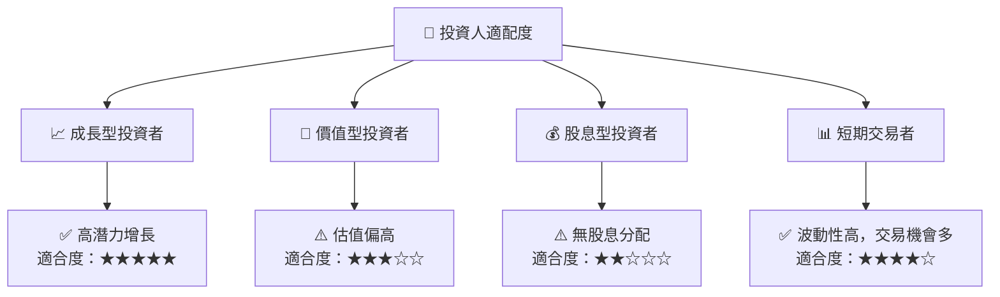

### 10.5 關鍵監控指標

| 監控類型 | 指標 | 關注點 | 頻率 |
|----------|------|--------|------|
| 財務 | 營收增長率 | 持續增長 | 季度 |
| 獲利 | 毛利率 | 穩定或提升 | 季度 |
| 現金流 | 自由現金流 | 穩定增長 | 年度 |
| 市場 | 競爭對手動態 | 技術創新 | 半年 |
| 法規 | 政府政策變化 | 合規風險 | 持續 |

---

> **免責聲明**：本報告為 AI 自動生成，僅供研究參考，不構成投資建議。投資有風險，入市需謹慎。