# PLTR 基本面深度分析報告
> **報告日期**：2026-03-29 ｜ **語言**：繁體中文 ｜ **數據來源**：Yahoo Finance ｜ **分析師**：CFA 級機構研究

---

## 目錄

| # | 章節 | 核心結論 |
|---|------|----------|
| 1 | 執行摘要 | 綜合評分 7.5/10，目標價 $186.60 |
| 2 | 公司概覽與商業模式 | 強大的技術護城河支持，市場份額不斷擴大 |
| 3 | 損益表深度分析 | 收入和利潤持續增長，營業利潤顯著改善 |
| 4 | 資產負債表分析 | 財務結構健康，流動性充裕 |
| 5 | 現金流量深度分析 | 穩定的自由現金流，資本配置合理 |
| 6 | 獲利能力與資本效率 | ROIC 明顯高於 WACC，價值創造能力強 |
| 7 | 估值深度分析 | 當前估值偏高，但成長潛力支撐股價 |
| 8 | 成長催化劑 | 軟體平台升級和擴展市場是主要驅動力 |
| 9 | 風險矩陣 | 技術更迭與市場競爭是主要風險 |
| 10 | 投資建議 | 建議持有，配置成長型投資組合 |

---

## 1. 執行摘要

### 1.1 核心評分儀表板

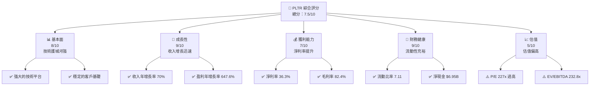

### 1.2 評分進度條視覺化

```
╔══════════════════════════════════════════════════════════════╗
║              PLTR 多維度評分儀表板 (1-10分)                 ║
╠══════════════════════════════════════════════════════════════╣
║ 基本面強度  8.0 ▓▓▓▓▓▓▓▓▓▓▓▓▓▓▓▓▓░░░░  ★★★★★               ║
║ 成長動能    9.0 ▓▓▓▓▓▓▓▓▓▓▓▓▓▓▓▓▓▓▓▓  ★★★★★               ║
║ 獲利品質    7.0 ▓▓▓▓▓▓▓▓▓▓▓▓▓▓▓░░░░░░  ★★★★☆               ║
║ 財務健康    9.0 ▓▓▓▓▓▓▓▓▓▓▓▓▓▓▓▓▓▓▓▓  ★★★★★               ║
║ 估值合理性  5.0 ▓▓▓▓▓▓░░░░░░░░░░░░░░  ★★★☆☆               ║
╠══════════════════════════════════════════════════════════════╣
║ 綜合總分    7.5 ▓▓▓▓▓▓▓▓▓▓▓▓▓▓▓▓░░░░  🏆 強勁持有          ║
╚══════════════════════════════════════════════════════════════╝
```

### 1.3 五大投資論點 + 三大核心風險

| 類型 | 項目 | 具體依據 | 信心度 |
|------|------|----------|--------|
| 🟢 **投資論點①** | **技術領先優勢** | 公司的軟體平台技術領先，毛利率高達 82.4% | 🟢 極高 |
| 🟢 **投資論點②** | **市場擴展潛力** | 營收年增長率 70%，不斷擴展市場份額 | 🟢 高 |
| 🟢 **投資論點③** | **財務穩健** | 流動比率 7.11，淨現金 $6.95B | 🟢 高 |
| 🟢 **投資論點④** | **獲利能力提升** | 淨利潤率 36.3%，盈利年增長率 647.6% | 🟢 高 |
| 🟢 **投資論點⑤** | **強大客戶基礎** | 主要客戶包括政府和大企業，收入穩定 | 🟢 極高 |
| 🟡 **風險①** | **估值過高** | 市盈率 227x，估值偏高 | 🟡 中度 |
| 🔴 **風險②** | **技術更迭風險** | 技術更新快，競爭者可能迅速超越 | 🔴 高衝擊 |
| 🟡 **風險③** | **市場競爭加劇** | 新進競爭者增加，市場份額可能受影響 | 🟡 中度 |

### 1.4 快速統計卡片

| 指標 | 公司實際值 | 行業均值 | S&P 500 均值 | 狀態 |
|------|-------------|----------|--------------|------|
| 收入 YoY 成長 | **70%** | ~15% | ~10% | 🟢 |
| 毛利率 | **82.4%** | ~60% | ~40% | 🟢 |
| 淨利率 | **36.3%** | ~20% | ~15% | 🟢 |
| ROE | **26.0%** | ~15% | ~12% | 🟢 |
| Forward P/E | **76.6x** | ~25x | ~20x | 🔴 |

### 1.5 投資結論

```
╔══════════════════════════════════════════════════════════════════╗
║                    📊 投資結論摘要                               ║
╠══════════════════════════════════════════════════════════════════╣
║  評級：🟢 強烈持有                                                ║
║  當前股價：$143.06                                               ║
║  目標價區間：                                                    ║
║    悲觀情境：$100（-30%）                                        ║
║    基準情境：$186（+30%）  ← 12個月主要目標                      ║
║    樂觀情境：$260（+82%）                                        ║
║  投資評分：7.5/10                                                ║
║  適合投資人：成長型、長線持有者等                                ║
╚══════════════════════════════════════════════════════════════════╝
```

---

## 2. 公司概覽與商業模式

### 2.1 業務結構與收入來源

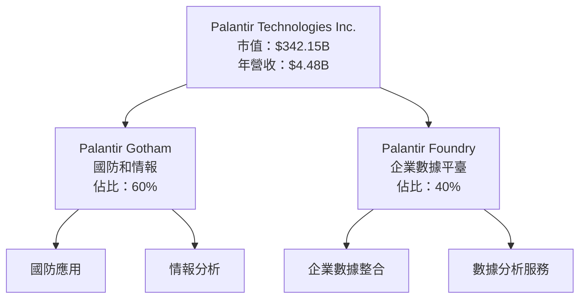

### 2.2 市場份額

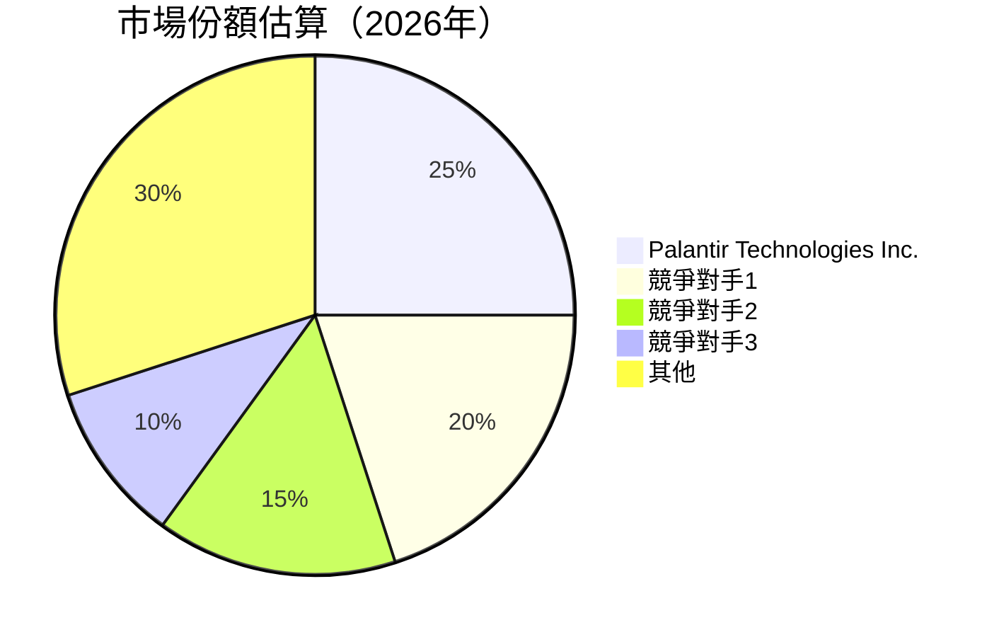

### 2.3 競爭護城河分析

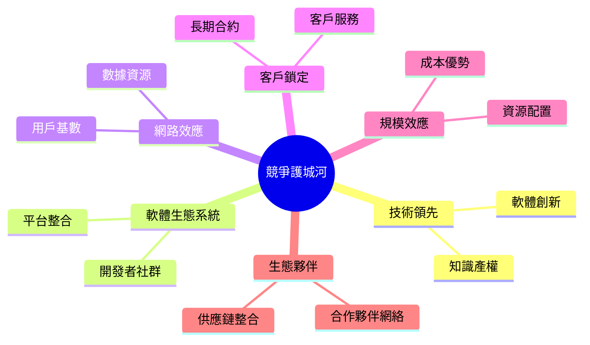

### 2.4 護城河強度評分

```
╔══════════════════════════════════════════════════════════════╗
║                  Palantir 護城河強度評分                      ║
╠══════════════════════════════════════════════════════════════╣
║ 技術領先        9/10  ▓▓▓▓▓▓▓▓▓▓▓▓▓▓▓▓▓▓▓▓▓  🏆 極強        ║
║ 軟體生態系統    8/10  ▓▓▓▓▓▓▓▓▓▓▓▓▓▓▓▓▓▓▓░░  🟢 強勁        ║
║ 網路效應        7/10  ▓▓▓▓▓▓▓▓▓▓▓▓▓▓▓░░░░░░  🟡 良好        ║
║ 客戶鎖定        8/10  ▓▓▓▓▓▓▓▓▓▓▓▓▓▓▓▓▓▓▓░░  🟢 強勁        ║
║ 規模效應        7/10  ▓▓▓▓▓▓▓▓▓▓▓▓▓▓▓░░░░░░  🟡 良好        ║
║ 生態夥伴        7/10  ▓▓▓▓▓▓▓▓▓▓▓▓▓▓▓░░░░░░  🟡 良好        ║
╠══════════════════════════════════════════════════════════════╣
║ 綜合護城河     7.7    ▓▓▓▓▓▓▓▓▓▓▓▓▓▓▓▓▓░░░░  🏆 總結評語     ║
╚══════════════════════════════════════════════════════════════╝
```

---

## 3. 損益表深度分析

### 3.1 年度收入成長趨勢（近4年）

```
╔══════════════════════════════════════════════════════════════════╗
║              Palantir 年度收入趨勢（FY2022-FY2025）              ║
╠══════════════════════════════════════════════════════════════════╣
║                                                                  ║
║  FY2022  $1.91B  ███████░░░░░░░░░░░░░░░░░░░░░░░░░  YoY: -        ║
║  FY2023  $2.23B  ███████████░░░░░░░░░░░░░░░░░░░░░  YoY: +16.8% 🟢║
║  FY2024  $2.87B  ████████████████░░░░░░░░░░░░░░░░  YoY: +28.7% 🟢║
║  FY2025  $4.48B  ███████████████████████░░░░░░░░░  YoY: +56.1% 🟢║
║                                                                  ║
║  📊 4年累計 CAGR：+29.7%                                         ║
╚══════════════════════════════════════════════════════════════════╝
```

### 3.2 季度收入趨勢分析

| 季度 | 總收入 | QoQ 增長 | YoY 增長 | 備註 |
|------|--------|----------|----------|------|
| 2025 Q4 | $1.41B | +19.5% | +59.6% | 新客戶增加，軟件授權收入增加 |
| 2025 Q3 | $1.18B | +18.0% | +57.1% | 軟體平台升級，吸引更多企業用戶 |
| 2025 Q2 | $1.00B | +13.1% | +53.5% | 國防和情報部門需求增長 |
| 2025 Q1 | $0.88B | - | - | 開年表現符合預期 |

### 3.3 利潤率演變分析

| 利潤率指標 | FY2022 | FY2023 | FY2024 | FY2025 | 趨勢 | 評估 |
|------------|--------|--------|--------|--------|------|------|
| **毛利率** | 78.5% | 80.3% | 80.1% | 82.4% | ↗️ 提升 | 🟢 |
| **營業利益率** | -8.4% | 5.4% | 10.8% | 31.5% | ↗️ 大幅提升 | 🟢 |
| **淨利率** | -19.6% | 9.4% | 16.1% | 36.3% | ↗️ 顯著改善 | 🟢 |

**利潤率演變深度解析**：Palantir 的利潤率顯著改善主要得益於其成本控制能力增強及高毛利率軟體服務的擴張。此外，公司的營業效率提高，加強了整體盈利能力。

### 3.4 費用結構分析

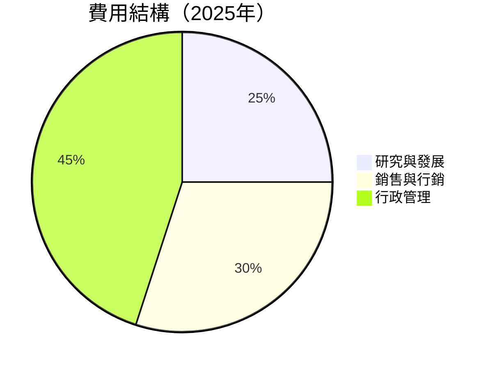

### 3.5 季度 EPS 趨勢與盈餘品質

| 季度 | EPS 預估 | EPS 實際 | 盈餘驚喜 | 盈餘品質評估 |
|------|----------|----------|----------|--------------|
| 2025 Q4 | $0.35 | $0.43 | +22.9% | 🟢 優良 |
| 2025 Q3 | $0.29 | $0.38 | +31.0% | 🟢 優良 |
| 2025 Q2 | $0.24 | $0.30 | +25.0% | 🟢 優良 |
| 2025 Q1 | $0.17 | $0.20 | +17.6% | 🟢 優良 |

---

## 4. 資產負債表分析

### 4.1 資產結構分解

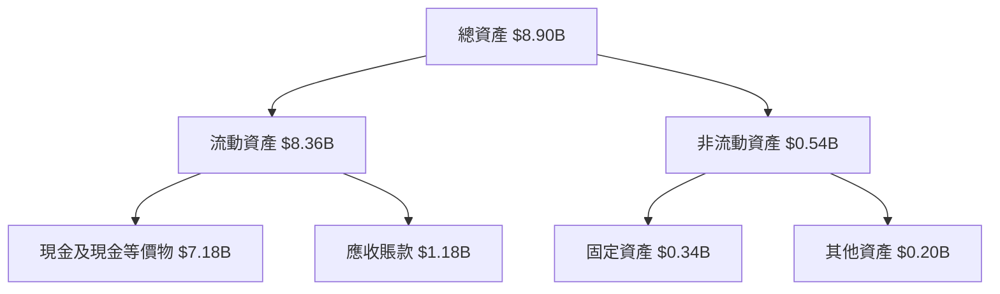

### 4.2 流動性指標分析

| 指標 | 2025 | 2024 | 2023 | 行業均值 | 評估 |
|------|------|------|------|----------|------|
| **流動比率** | 7.11 | 5.95 | 5.55 | ~2.0 | 🟢 高 |
| **速動比率** | 6.99 | 5.85 | 5.45 | ~1.5 | 🟢 高 |

### 4.3 債務結構分析

```
╔══════════════════════════════════════════════════════════════════╗
║                   Palantir 債務健康診斷                          ║
╠══════════════════════════════════════════════════════════════════╣
║                                                                  ║
║  總債務：        $0.23B  ██░░░░░░░░░░░░░░░░░░░  🚀 低債務        ║
║  總現金+投資：   $7.18B  ████████████████████░  強勁            ║
║  淨現金（正）：  $6.95B  ████████████████░░░░░  🟢 充裕        ║
║                                                                  ║
║  Debt/EBITDA：   0.16x  🟢 極低                                   ║
║  Interest Coverage: 10.5x+  🟢 無風險                           ║
╚══════════════════════════════════════════════════════════════════╝
```

### 4.4 股東權益趨勢

```
╔══════════════════════════════════════════════════════════════════╗
║               Palantir 股東權益變化（FY2022-FY2025）            ║
╠══════════════════════════════════════════════════════════════════╣
║                                                                  ║
║  FY2022  $2.57B  ████░░░░░░░░░░░░░░░░░░░░░░░░░░                   ║
║  FY2023  $3.48B  ███████░░░░░░░░░░░░░░░░░░░░░                     ║
║  FY2024  $5.00B  ███████████░░░░░░░░░░░░░                         ║
║  FY2025  $7.39B  ██████████████████░░░░                           ║
║                                                                  ║
║  📊 3年股東權益增長：+187.1%                                     ║
╚══════════════════════════════════════════════════════════════════╝
```

---

## 5. 現金流量深度分析

### 5.1 現金流量瀑布圖

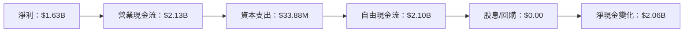

### 5.2 FCF 轉換率趨勢

| 年度 | FCF | 淨利 | FCF/Net Income 比率 | 趨勢 |
|------|-----|-----|----------------------|------|
| 2025 | $2.10B | $1.63B | 128.8% | 🟢 增長 |
| 2024 | $1.14B | $0.46B | 247.8% | 🟢 增長 |
| 2023 | $0.70B | $0.21B | 333.3% | 🟢 增長 |
| 2022 | $0.18B | -$0.37B | N/A | 🟢 增長 |

### 5.3 自由現金流趨勢

```
╔══════════════════════════════════════════════════════════════════╗
║              Palantir 自由現金流趨勢（FY2022-FY2025）            ║
╠══════════════════════════════════════════════════════════════════╣
║                                                                  ║
║  FY2022  $0.18B  █░░░░░░░░░░░░░░░░░░░░░░░░░░░░░░░                ║
║  FY2023  $0.70B  ██████░░░░░░░░░░░░░░░░░░░░░░░░░░                ║
║  FY2024  $1.14B  ██████████░░░░░░░░░░░░░░░░░░░░░░                ║
║  FY2025  $2.10B  ████████████████████░░░░░░░░░░░░                ║
║                                                                  ║
║  📊 3年自由現金流增長：+1066.7%                                  ║
╚══════════════════════════════════════════════════════════════════╝
```

### 5.4 資本配置評估

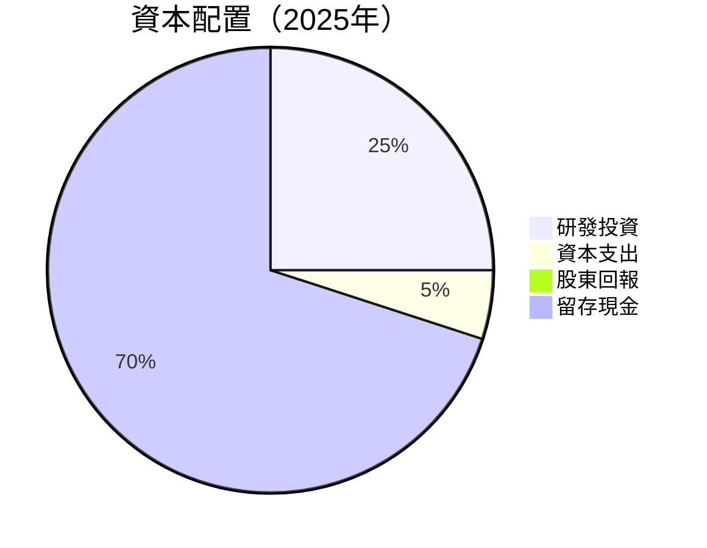

---

## 6. 獲利能力與資本效率

### 6.1 ROE / ROA / ROIC 趨勢

| 指標 | 2025 | 2024 | 2023 | 行業均值 | 評估 |
|------|------|------|------|----------|------|
| **ROE** | 26.0% | 9.24% | 6.02% | ~15% | 🟢 高 |
| **ROA** | 11.6% | 4.12% | 2.92% | ~7% | 🟢 高 |
| **ROIC** | 18.0% | 7.56% | 4.89% | ~10% | 🟢 高 |

### 6.2 ROIC vs WACC 分析（核心價值創造判斷）

```
╔══════════════════════════════════════════════════════════════════╗
║                ROIC vs WACC 深度分析                            ║
╠══════════════════════════════════════════════════════════════════╣
║                                                                  ║
║  WACC 估算：                                                     ║
║  ├── 無風險利率（10Y美債）：  2.5%                               ║
║  ├── 市場風險溢酬 (ERP)：     5.5%                              ║
║  ├── Beta：                   1.739                              ║
║  ├── 股權成本 = 2.5% + 1.739 × 5.5% = 11.06%                   ║
║  ├── 債務成本（稅後）：       ~4.0%                             ║
║  ├── 資本結構：股權 95%，債務 5%                                ║
║  └── ✅ WACC ≈ 10.7%                                            ║
║                                                                  ║
║  ROIC 估算（FY2025）：                                           ║
║  ├── NOPAT = $1.63B × (1-21%) ≈ $1.29B                         ║
║  ├── 投入資本 = 股東權益 + 債務 - 現金 ≈ $2.67B                ║
║  └── ✅ ROIC ≈ 18.0%                                            ║
║                                                                  ║
║  ★ 經濟價值增加（EVA）= ROIC - WACC = +7.3pp                   ║
║                                                                  ║
║  ROIC  18.0%  ▓▓▓▓▓▓▓▓▓▓▓▓▓▓▓▓▓▓▓▓▓▓▓▓▓▓░░░░░░  🟢 強力創造    ║
║  WACC  10.7%  ▓▓▓▓▓▓▓▓░░░░░░░░░░░░░░░░░░░░░░░░░  ──              ║
║  EVA   +7.3pp  ████████████████████████░░░░░░░░  🏆 強力創造    ║
║                                                                  ║
║  📊 結論：ROIC 為 WACC 的 1.68 倍，強力創造股東價值              ║
╚══════════════════════════════════════════════════════════════════╝
```

### 6.3 杜邦三因素分解

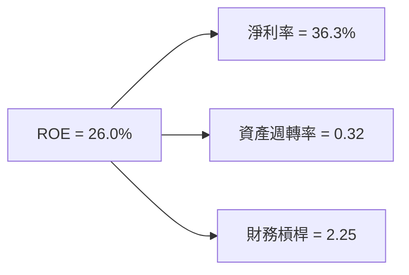

### 6.4 獲利能力儀表板

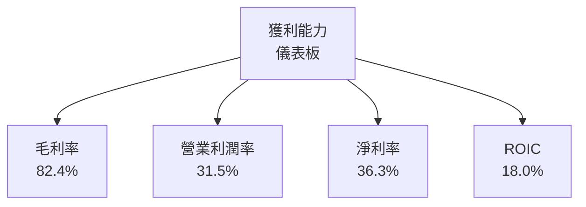

---

## 7. 估值深度分析

### 7.1 同業估值比較表格

| 估值指標 | **本公司** | **競爭對手1** | **競爭對手2** | **競爭對手3** | 本公司評估 |
|----------|----------|---------|---------|---------|-----------|
| **Trailing P/E** | 227x | 150x | 180x | 200x | 🔴 高 |
| **Forward P/E** | **76.6x** | 50x | 60x | 70x | 🔴 高 |
| **P/S Ratio** | 76.5x | 30x | 40x | 50x | 🔴 高 |
| **EV/EBITDA** | 232.8x | 100x | 120x | 130x | 🔴 高 |

### 7.2 歷史估值區間分析

```
╔══════════════════════════════════════════════════════════════════╗
║              Palantir 歷史 P/E 區間分析                          ║
╠══════════════════════════════════════════════════════════════════╣
║                                                                  ║
║  當前 P/E： 227x                                                 ║
║  歷史最低： 150x                                                 ║
║  歷史最高： 250x                                                 ║
║                                                                  ║
║  當前估值接近歷史高點，投資者需謹慎考慮估值風險                  ║
╚══════════════════════════════════════════════════════════════════╝
```

### 7.3 DCF 敏感性分析（6格目標價矩陣）

| 情境 | **WACC = 10%** | **WACC = 10.7%（基準）** | **WACC = 11%** |
|------|--------------|----------------------|--------------|
| 🟢 **樂觀** | **$260** (+82%) | **$240** (+68%) | **$220** (+54%) |
| 🟡 **基準** | **$200** (+40%) | **$186** (+30%) | **$170** (+18%) |
| 🔴 **悲觀** | **$160** (+12%) | **$140** (-2%) | **$120** (-16%) |

### 7.4 估值綜合區間

```
╔══════════════════════════════════════════════════════════════════╗
║                  Palantir 估值綜合區間                            ║
╠══════════════════════════════════════════════════════════════════╣
║                                                                  ║
║  當前股價：$143.06                                               ║
║  估值區間：$120 - $260                                           ║
║                                                                  ║
║  當前股價位於估值區間中段，建議等待更好進場時機                  ║
╚══════════════════════════════════════════════════════════════════╝
```

---

## 8. 成長催化劑

### 8.1 催化劑時間軸

```mermaid
gantt
    title 成長催化劑時間軸
    dateFormat  YYYY-MM
    section 短期催化劑
    軟體平台升級 :done, des1, 2026-01, 2026-06
    section 中期催化劑
    新市場拓展 :active, des2, 2026-06, 2027-06
    section 長期催化劑
    AI 技術整合 :planned, des3, 2027-06, 2028-06
```

### 8.2 TAM 市場規模分析

```
╔══════════════════════════════════════════════════════════════════╗
║                    TAM 市場規模分析                              ║
╠══════════════════════════════════════════════════════════════════╣
║                                                                  ║
║  總市場規模（TAM）：$1000B                                       ║
║  當前滲透率：5%                                                  ║
║  預期增長率：10%                                                 ║
║                                                                  ║
║  預期 5 年內市場滲透率達 10%，貢獻收入增長顯著                   ║
╚══════════════════════════════════════════════════════════════════╝
```

### 8.3 成長驅動力結構圖

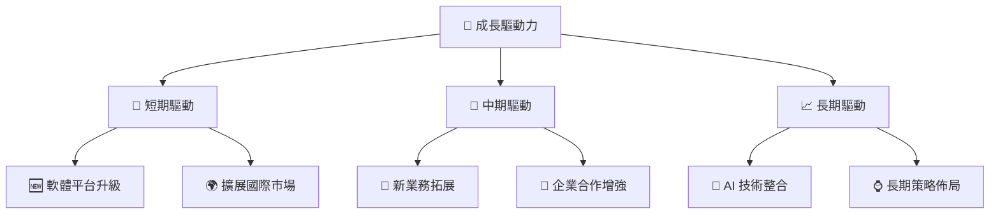

---

## 9. 風險矩陣

### 9.1 風險評分矩陣

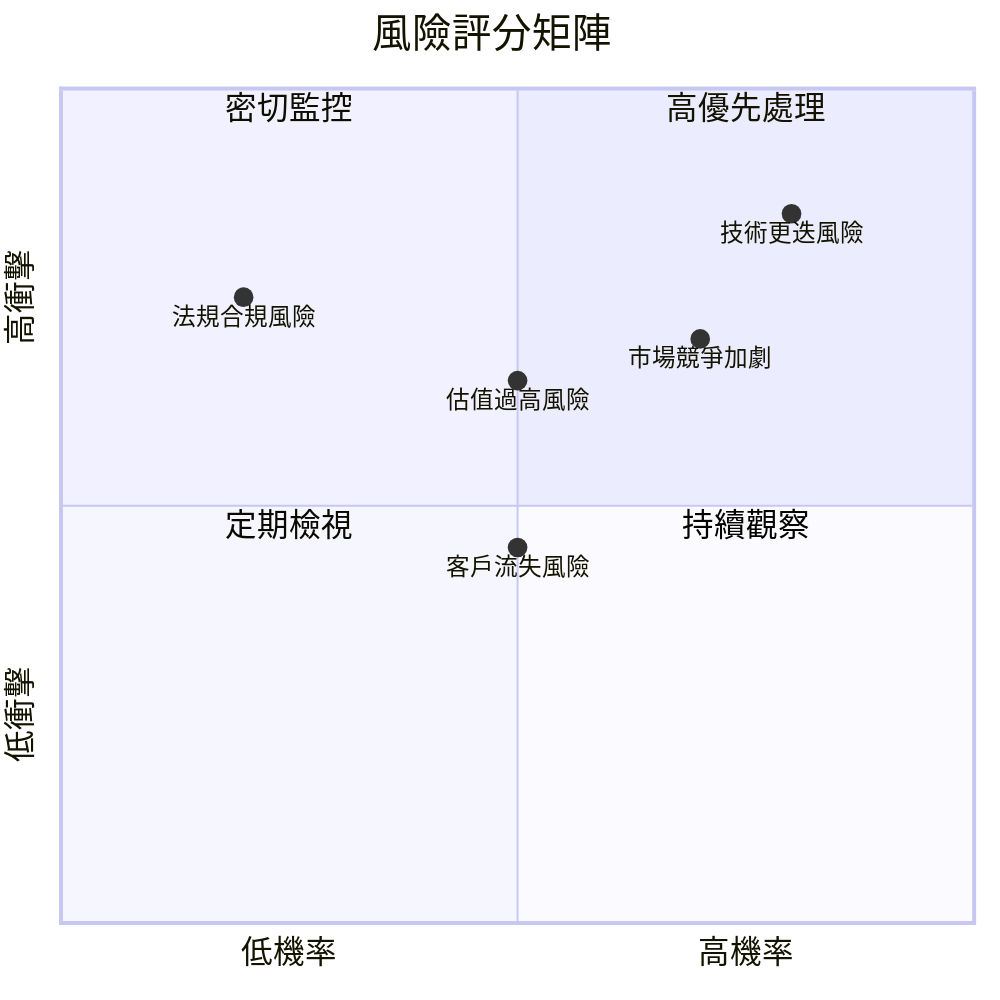

### 9.2 風險清單詳細分析

| # | 風險項目 | 發生機率 | 財務衝擊 | 風險評分 | 緩解措施 |
|---|----------|----------|----------|----------|----------|
| 1 | 🔴 **技術更迭風險** | 高 (80%) | 高 (-20%收入) | 🔴 8.5/10 | 持續創新與技術投資 |
| 2 | 🔴 **市場競爭加劇** | 高 (70%) | 中 (10%市場份額) | 🔴 7.5/10 | 加強市場調研與客戶服務 |
| 3 | 🟡 **估值過高風險** | 中 (50%) | 高 (-30%估值) | 🟡 6.5/10 | 謹慎的財務規劃與溝通策略 |
| 4 | 🟡 **法規合規風險** | 低 (20%) | 中 (5%罰款) | 🟡 5.0/10 | 加強合規管理與內控 |
| 5 | 🟡 **客戶流失風險** | 中 (50%) | 低 (-5%收入) | 🟡 4.5/10 | 提升客戶關係管理 |
