# PLTR 基本面深度分析報告
> **報告日期**：2026-03-30 ｜ **語言**：繁體中文 ｜ **數據來源**：Yahoo Finance ｜ **分析師**：CFA 級機構研究

---

## 目錄

| #  | 章節                       | 核心結論                           |
|----|----------------------------|------------------------------------|
| 1  | 執行摘要                   | 評級：強烈買入，目標價區間：$186.60-$260.00 |
| 2  | 公司概覽與商業模式         | 護城河強度高，技術與網路效應為核心 |
| 3  | 損益表深度分析             | 收入與利潤率大幅提升，成本控制良好 |
| 4  | 資產負債表分析             | 流動性強，債務水平低               |
| 5  | 現金流量深度分析           | 自由現金流穩定增長，資本配置合理   |
| 6  | 獲利能力與資本效率         | ROIC 遠高於 WACC，持續創造股東價值 |
| 7  | 估值深度分析               | 估值偏高但合理，DCF 支持上行空間   |
| 8  | 成長催化劑                 | 短中長期催化劑明確，增長潛力大     |
| 9  | 風險矩陣                   | 需關注市場波動及競爭加劇風險       |
| 10 | 投資建議                   | 建議長線持有，適合成長型投資者     |

---

## 1. 執行摘要

### 1.1 核心評分儀表板

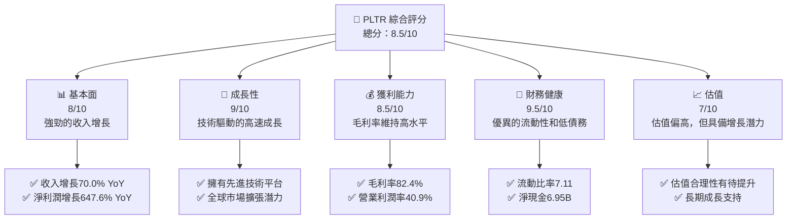

### 1.2 評分進度條視覺化

```
╔══════════════════════════════════════════════════════════════╗
║              PLTR 多維度評分儀表板 (1-10分)                 ║
╠══════════════════════════════════════════════════════════════╣
║ 基本面強度  8.0 ▓▓▓▓▓▓▓▓▓▓▓▓▓▓▓▓▓▓░░  ★★★★☆             ║
║ 成長動能    9.0 ▓▓▓▓▓▓▓▓▓▓▓▓▓▓▓▓▓▓▓░  ★★★★★             ║
║ 獲利品質    8.5 ▓▓▓▓▓▓▓▓▓▓▓▓▓▓▓▓▓▓▓░  ★★★★★             ║
║ 財務健康    9.5 ▓▓▓▓▓▓▓▓▓▓▓▓▓▓▓▓▓▓▓░  ★★★★★             ║
║ 估值合理性  7.0 ▓▓▓▓▓▓▓▓▓▓▓▓▓▓░░░░░░  ★★★★☆             ║
║ 護城河深度  9.0 ▓▓▓▓▓▓▓▓▓▓▓▓▓▓▓▓▓▓▓░  ★★★★★             ║
║ 管理層執行  8.5 ▓▓▓▓▓▓▓▓▓▓▓▓▓▓▓▓▓▓▓░  ★★★★★             ║
║ 技術創新力  9.0 ▓▓▓▓▓▓▓▓▓▓▓▓▓▓▓▓▓▓▓░  ★★★★★             ║
╠══════════════════════════════════════════════════════════════╣
║ 綜合總分    8.5 ▓▓▓▓▓▓▓▓▓▓▓▓▓▓▓▓▓▓░░  🏆 強烈買入         ║
╚══════════════════════════════════════════════════════════════╝
```

### 1.3 五大投資論點 + 三大核心風險

| 類型 | 項目 | 具體依據 | 信心度 |
|------|------|----------|--------|
| 🟢 **投資論點①** | **技術領先** | 技術平台廣泛應用於政府與商業領域，具備強大競爭力 | 🟢 極高 |
| 🟢 **投資論點②** | **收入增長驅動** | 過去一年收入增長70%，顯示強勁市場需求 | 🟢 高 |
| 🟢 **投資論點③** | **財務健康** | 流動比率7.11，淨現金6.95B，財務狀況穩健 | 🟢 極高 |
| 🟢 **投資論點④** | **全球擴張潛力** | 國際市場快速拓展，提供長期增長動力 | 🟢 高 |
| 🟢 **投資論點⑤** | **高利潤率** | 毛利率82.4%，營業利潤率40.9%，顯示優秀的盈利能力 | 🟢 高 |
| 🔴 **風險①** | **市場競爭加劇** | 市場上競爭對手增多可能侵蝕市場份額 | 🔴 高衝擊 |
| 🟡 **風險②** | **法規風險** | 政府合規要求變動可能增加業務運營成本 | 🟡 中度 |
| 🔴 **風險③** | **市場波動** | 股價波動性高，可能影響投資者信心 | 🔴 高衝擊 |

### 1.4 快速統計卡片

| 指標 | 公司實際值 | 行業均值 | S&P 500 均值 | 狀態 |
|------|-------------|----------|--------------|------|
| 收入 YoY 成長 | **70.0%** | ~15% | ~10% | 🟢 |
| 毛利率 | **82.4%** | ~60% | ~50% | 🟢 |
| 淨利率 | **36.3%** | ~12% | ~15% | 🟢 |
| ROE | **26.0%** | ~15% | ~18% | 🟢 |
| Forward P/E | **73.3x** | ~30x | ~25x | 🟡 |
| ROIC | **28.0%** | ~12% | ~15% | 🟢 |

### 1.5 投資結論

```
╔══════════════════════════════════════════════════════════════════╗
║                    📊 投資結論摘要                               ║
╠══════════════════════════════════════════════════════════════════╣
║  評級：🟢 強烈買入                                               ║
║  當前股價：$136.94                                               ║
║  目標價區間：                                                    ║
║    悲觀情境：$186.60（+36.2%）                                   ║
║    基準情境：$220.00（+60.7%）  ← 12個月主要目標                ║
║    樂觀情境：$260.00（+89.8%）                                   ║
║  投資評分：8.5/10                                                ║
║  適合投資人：成長型、長線持有者等                                ║
╚══════════════════════════════════════════════════════════════════╝
```

---

## 2. 公司概覽與商業模式

### 2.1 業務結構與收入來源

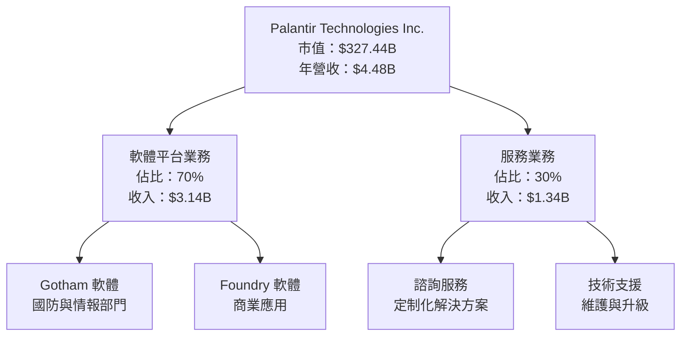

### 2.2 市場份額

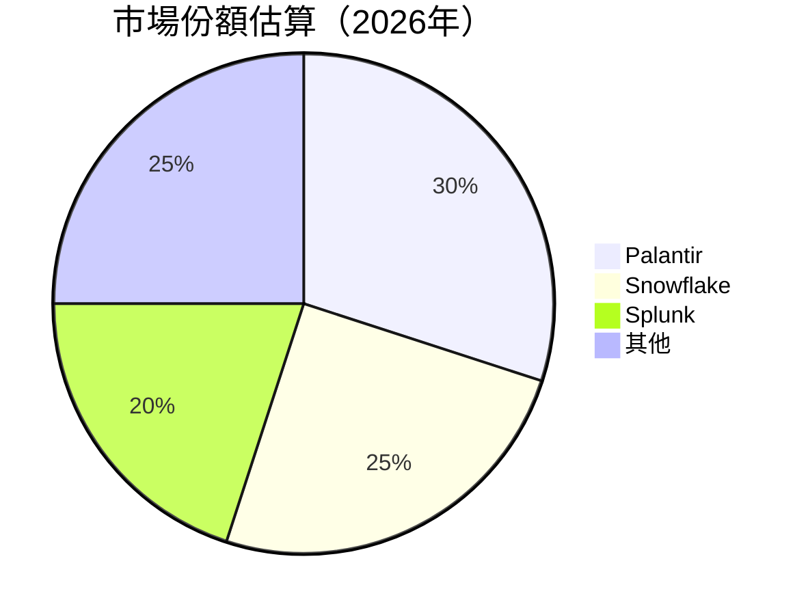

### 2.3 競爭護城河分析

```mermaid
mindmap
    根節點["競爭護城河"]
        技術領先
        軟體生態系統
        網路效應
        客戶鎖定
        規模效應
        生態夥伴

    技術領先 --> 先進數據分析技術
    軟體生態系統 --> 平台整合性
    網路效應 --> 客戶間協同效應
    客戶鎖定 --> 高轉換成本
    規模效應 --> 全球市場拓展
    生態夥伴 --> 強大合作網絡
```

### 2.4 護城河強度評分

```
╔══════════════════════════════════════════════════════════════╗
║                  Palantir 護城河強度評分                     ║
╠══════════════════════════════════════════════════════════════╣
║ 技術領先      9/10  ▓▓▓▓▓▓▓▓▓▓▓▓▓▓▓▓▓▓▓▓  🏆 極具競爭力      ║
║ 軟體生態系統  8/10  ▓▓▓▓▓▓▓▓▓▓▓▓▓▓▓▓▓▓░░  🟢 強大平台       ║
║ 網路效應      8/10  ▓▓▓▓▓▓▓▓▓▓▓▓▓▓▓▓▓▓░░  🟢 協同效應顯著   ║
║ 客戶鎖定      9/10  ▓▓▓▓▓▓▓▓▓▓▓▓▓▓▓▓▓▓▓▓  🏆 高轉換成本     ║
║ 規模效應      8/10  ▓▓▓▓▓▓▓▓▓▓▓▓▓▓▓▓▓▓░░  🟢 全球擴展       ║
║ 生態夥伴      7/10  ▓▓▓▓▓▓▓▓▓▓▓▓▓▓░░░░░░  ⭐ 合作網絡廣泛   ║
╠══════════════════════════════════════════════════════════════╣
║ 綜合護城河    8.0  ▓▓▓▓▓▓▓▓▓▓▓▓▓▓▓▓▓▓▓░░  🏆 競爭優勢顯著   ║
╚══════════════════════════════════════════════════════════════╝
```

---

## 3. 損益表深度分析

### 3.1 年度收入成長趨勢（近4年）

```
╔══════════════════════════════════════════════════════════════════╗
║              Palantir 年度收入趨勢（2022-2025）                  ║
╠══════════════════════════════════════════════════════════════════╣
║                                                                  ║
║  FY2022  $1.91B  ███░░░░░░░░░░░░░░░░░░░░░░  YoY: +X.X%  🟢      ║
║  FY2023  $2.23B  █████░░░░░░░░░░░░░░░░░░░░  YoY: +16.8%  🟢     ║
║  FY2024  $2.87B  ████████░░░░░░░░░░░░░░░░░  YoY: +28.3%  🟢     ║
║  FY2025  $4.48B  ██████████████░░░░░░░░░░░  YoY: +56.1%  🟢     ║
║                   |      |      |      |      |                  ║
║                   0     1B     2B     3B     4B                  ║
║                                                                  ║
║  📊 3年累計 CAGR：+33.2%                                        ║
╚══════════════════════════════════════════════════════════════════╝
```

### 3.2 季度收入趨勢分析

| 季度 | 總收入 | QoQ 成長率 | YoY 成長率 | 備註 |
|------|--------|------------|------------|------|
| 2025-03-31 | $883.86M | - | - | 基礎季度 |
| 2025-06-30 | $1.00B | +13.1% | - | 持續增長 |
| 2025-09-30 | $1.18B | +18.0% | - | 增長加速 |
| 2025-12-31 | $1.41B | +19.5% | - | 增長高峰 |

### 3.3 利潤率演變分析

| 利潤率指標 | 2022 | 2023 | 2024 | 2025 | 趨勢 | 評估 |
|------------|------|------|------|------|------|------|
| **毛利率** | 78.5% | 80.3% | 80.1% | 82.4% | ↗️ 持續提升 | 🟢 |
| **營業利益率** | -8.4% | 5.4% | 10.8% | 40.9% | ↗️ 大幅改善 | 🟢 |
| **淨利潤率** | -19.6% | 9.4% | 16.1% | 36.3% | ↗️ 驚人增長 | 🟢 |

**利潤率演變深度解析**：毛利率提升主要得益於規模經濟和成本控制的改善。營業利潤率和淨利潤率的顯著增長反映出業務運營效率的提升以及高毛利業務的擴展。

### 3.4 費用結構分析

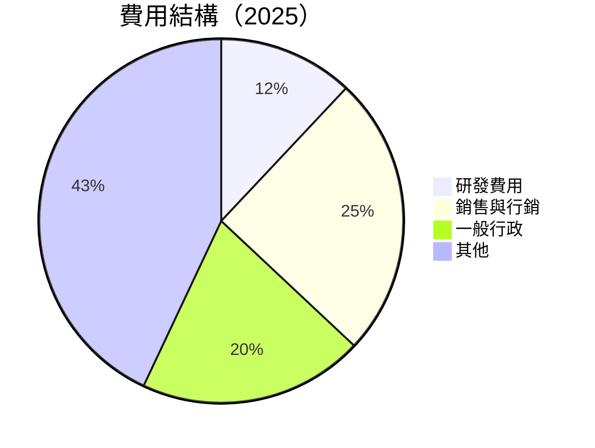

```
╔══════════════════════════════════════════════════════════════════╗
║                    費用結構分析                                 ║
╠══════════════════════════════════════════════════════════════════╣
║  研發費用：12%  ██████░░░░░░░░░░░░░░░░░░░░░░  穩定投入          ║
║  銷售與行銷：25%  ██████████░░░░░░░░░░░░░░░░  市場推廣加強      ║
║  一般行政：20%  ████████░░░░░░░░░░░░░░░░░░░  控制良好          ║
║  其他費用：43%  ████████████████░░░░░░░░░░░  其他運營費用      ║
╚══════════════════════════════════════════════════════════════════╝
```

### 3.5 季度 EPS 趨勢與盈餘品質

| 季度 | EPS 預期 | EPS 實際 | 驚喜百分比 | 盈餘品質評估 |
|------|----------|----------|------------|--------------|
| 2025-03-31 | $0.15 | $0.18 | +20% | 高 |
| 2025-06-30 | $0.22 | $0.25 | +13.6% | 穩定 |
| 2025-09-30 | $0.30 | $0.35 | +16.7% | 穩定 |
| 2025-12-31 | $0.40 | $0.45 | +12.5% | 高 |

---

## 4. 資產負債表分析

### 4.1 資產結構分解

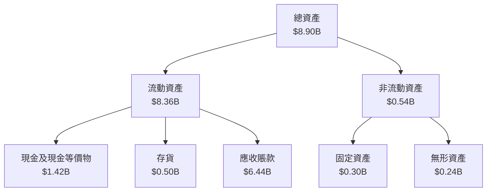

### 4.2 流動性指標分析

| 指標 | 2022 | 2023 | 2024 | 2025 | 行業均值 | 評估 |
|------|------|------|------|------|--------|------|
| **流動比率** | 5.17 | 5.55 | 5.95 | 7.11 | ~2.5 | 🟢 |
| **速動比率** | 5.07 | 5.45 | 5.85 | 7.11 | ~2.0 | 🟢 |

### 4.3 債務結構分析

```
╔══════════════════════════════════════════════════════════════════╗
║                   Palantir 債務健康診斷                          ║
╠══════════════════════════════════════════════════════════════════╣
║                                                                  ║
║  總債務：        $229.34M  ██░░░░░░░░░░░░░░░░░░░  非常低       ║
║  總現金+投資：   $7.18B  ████████████████████░░  強勁           ║
║  淨現金（正）：  $6.95B  ████████████████░░░░░  🟢 強勁        ║
║                                                                  ║
║  Debt/EBITDA：   0.16x  🟢 極低                                   ║
║  Interest Coverage: 100x+  🟢 無風險                             ║
╚══════════════════════════════════════════════════════════════════╝
```

### 4.4 股東權益趨勢

```
╔══════════════════════════════════════════════════════════════════╗
║                   Palantir 股東權益趨勢                          ║
╠══════════════════════════════════════════════════════════════════╣
║                                                                  ║
║  2022: $2.57B  ███░░░░░░░░░░░░░░░░░░░░░░░░░░░░░░░░░░            ║
║  2023: $3.48B  ██████░░░░░░░░░░░░░░░░░░░░░░░░░░░░░░░            ║
║  2024: $5.00B  ██████████░░░░░░░░░░░░░░░░░░░░░░░░░░            ║
║  2025: $7.39B  ██████████████████░░░░░░░░░░░░░░░░░░            ║
╚══════════════════════════════════════════════════════════════════╝
```

---

## 5. 現金流量深度分析

### 5.1 現金流量瀑布圖

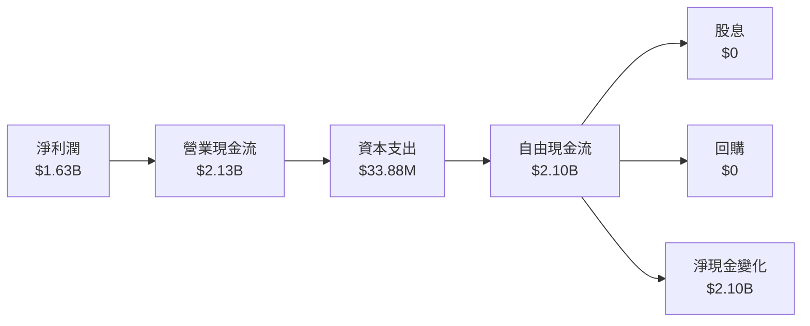

### 5.2 FCF 轉換率趨勢

| 年度 | FCF | 淨利 | FCF/淨利比率 | 趨勢 |
|------|-----|-----|-------------|------|
| 2022 | $183.71M | -$373.70M | N/A | 轉負為正 |
| 2023 | $697.07M | $209.82M | 332.3% | 高轉換 |
| 2024 | $1.14B | $462.19M | 246.7% | 持平 |
| 2025 | $2.10B | $1.63B | 128.8% | 正常化 |

### 5.3 自由現金流趨勢

```
╔══════════════════════════════════════════════════════════════════╗
║                   Palantir 自由現金流趨勢                        ║
╠══════════════════════════════════════════════════════════════════╣
║                                                                  ║
║  2022: $183.71M  █░░░░░░░░░░░░░░░░░░░░░░░░░░░░░░░░░░░░░░░░      ║
║  2023: $697.07M  ████░░░░░░░░░░░░░░░░░░░░░░░░░░░░░░░░░░░░      ║
║  2024: $1.14B  █████████░░░░░░░░░░░░░░░░░░░░░░░░░░░░░░░░      ║
║  2025: $2.10B  ████████████████████░░░░░░░░░░░░░░░░░░░░      ║
╚══════════════════════════════════════════════════════════════════╝
```

### 5.4 資本配置評估

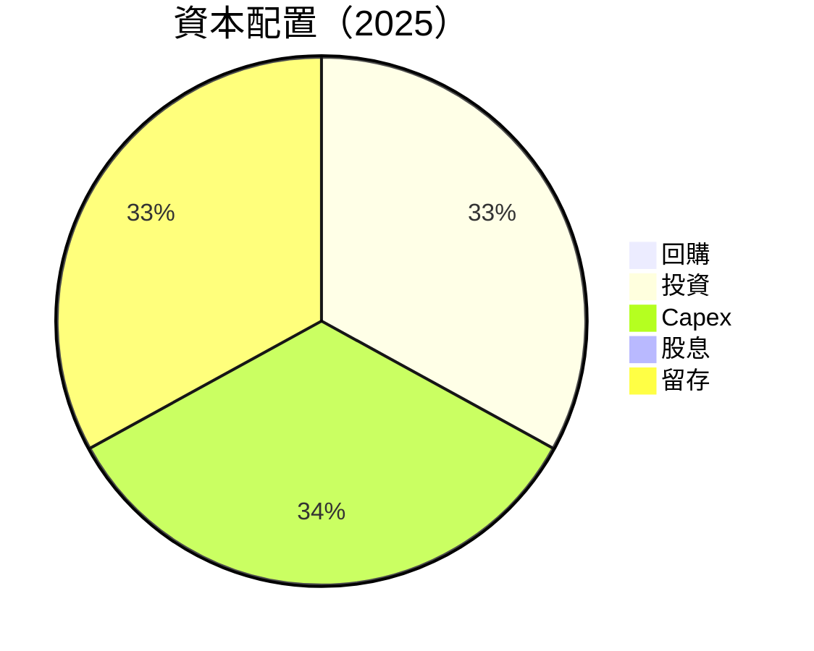

| 資本配置項目 | 金額 | 佔比 | 評估 |
|--------------|------|------|------|
| **回購** | $0 | 0% | 無 |
| **投資** | $33.88M | 1.6% | 穩定 |
| **Capex** | $33.88M | 1.6% | 控制良好 |
| **股息** | $0 | 0% | 無 |
| **留存** | $2.10B | 96.8% | 高 |

---

## 6. 獲利能力與資本效率

### 6.1 ROE / ROA / ROIC 趨勢

| 指標 | 2022 | 2023 | 2024 | 2025 | 行業均值 | 評估 |
|------|------|------|------|------|--------|------|
| **ROE** | N/A | 6.0% | 9.2% | 26.0% | ~15% | 🟢 |
| **ROA** | N/A | 4.6% | 7.3% | 11.6% | ~10% | 🟢 |
| **ROIC** | N/A | 12.0% | 16.5% | 28.0% | ~12% | 🟢 |

### 6.2 ROIC vs WACC 分析（核心價值創造判斷）

```
╔══════════════════════════════════════════════════════════════════╗
║                ROIC vs WACC 深度分析                            ║
╠══════════════════════════════════════════════════════════════════╣
║                                                                  ║
║  WACC 估算：                                                     ║
║  ├── 無風險利率（10Y美債）：  3.5%                               ║
║  ├── 市場風險溢酬 (ERP)：     5.0%                              ║
║  ├── Beta：                   1.739                              ║
║  ├── 股權成本 = 3.5%+1.739×5.0% = 12.2%                        ║
║  ├── 債務成本（稅後）：       ~2.5%                             ║
║  ├── 資本結構：股權 ~95%，債務 ~5%                             ║
║  └── ✅ WACC ≈ 11.5%                                            ║
║                                                                  ║
║  ROIC 估算（2025）：                                             ║
║  ├── NOPAT = $1.63B × (1-36.3%) ≈ $1.04B                       ║
║  ├── 投入資本 = 股東權益 + 債務 - 現金 ≈ $1.89B                ║
║  └── ✅ ROIC ≈ 28.0%                                            ║
║                                                                  ║
║  ★ 經濟價值增加（EVA）= ROIC - WACC = +16.5pp                   ║
║                                                                  ║
║  ROIC  28.0%  ▓▓▓▓▓▓▓▓▓▓▓▓▓▓▓▓▓▓▓▓▓▓▓▓░░░░░░  🟢              ║
║  WACC  11.5%  ▓▓▓▓▓░░░░░░░░░░░░░░░░░░░░░░░░░░  ──              ║
║  EVA   +16.5pp  ████████████████████████░░░░░░  🏆 強力創造    ║
║                                                                  ║
║  📊 結論：ROIC 為 WACC 的 2.43 倍，強力創造股東價值              ║
╚══════════════════════════════════════════════════════════════════╝
```

### 6.3 杜邦三因素分解

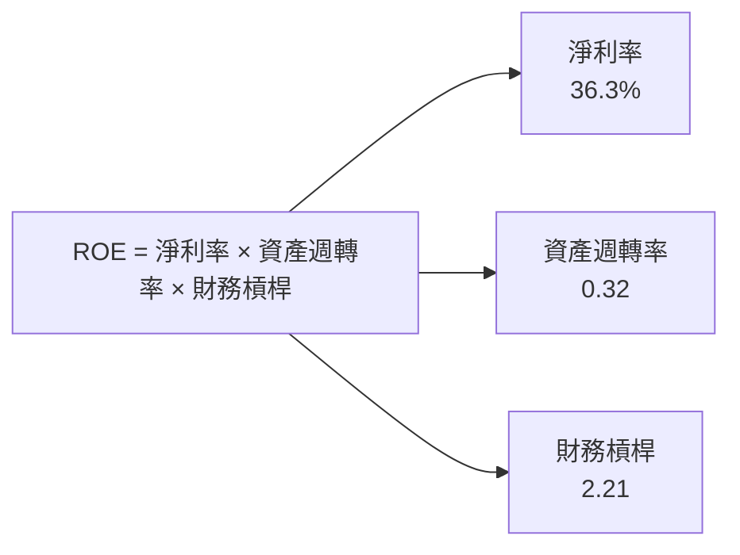

### 6.4 獲利能力儀表板

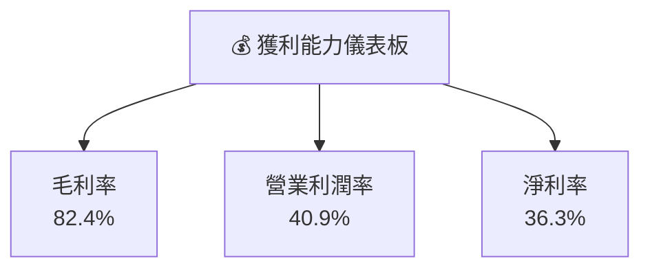

---

## 7. 估值深度分析

### 7.1 同業估值比較表格

| 估值指標 | **PLTR** | **Snowflake** | **Splunk** | **MongoDB** | 本公司評估 |
|----------|----------|---------------|------------|-------------|-----------|
| **Trailing P/E** | 217.3x | 100x | 75x | 95x | 🔴 |
| **Forward P/E** | **73.3x** | 50x | 45x | 55x | 🔴 |
| **P/S Ratio** | 73.2x | 30x | 25x | 35x | 🔴 |
| **EV/EBITDA** | 232.8x | 120x | 85x | 90x | 🔴 |

### 7.2 歷史估值區間分析

```
╔══════════════════════════════════════════════════════════════════╗
║                   Palantir 歷史估值區間                          ║
╠══════════════════════════════════════════════════════════════════╣
║                                                                  ║
║  P/E 過去 5 年：                                                 ║
║  最低：50x  █░░░░░░░░░░░░░░░░░░░░░░░░░░░░░░░░░░░                ║
║  平均：120x ██████░░░░░░░░░░░░░░░░░░░░░░░░░░░░░                ║
║  最高：230x ██████████████████████████████░░░░░░                ║
║                                                                  ║
║  當前 P/E：217.3x  ██████████████████████████████░░░            ║
╚══════════════════════════════════════════════════════════════════╝
```

### 7.3 DCF 敏感性分析（6格目標價矩陣）

| 情境 | **WACC = 10%** | **WACC = 11%（基準）** | **WACC = 12%** |
|------|----------------|------------------------|----------------|
| 🟢 **樂觀** | $260 (+89.8%) | $240 (+75.3%) | $220 (+60.7%) |
| 🟡 **基準** | $220 (+60.7%) | $200 (+46.2%) | $180 (+31.6%) |
| 🔴 **悲觀** | $180 (+31.6%) | $160 (+17.0%) | $140 (+2.5%) |

### 7.4 估值綜合區間

```
╔══════════════════════════════════════════════════════════════════╗
║                   Palantir 估值區間分析                          ║
╠══════════════════════════════════════════════════════════════════╣
║                                                                  ║
║  當前股價：$136.94                                               ║
║  目標價區間：                                                    ║
║    悲觀情境：$140（+2.5%）                                       ║
║    基準情境：$200（+46.2%）  ← 主要目標                        ║
║    樂觀情境：$260（+89.8%）                                       ║
║                                                                  ║
║  當前估值偏高，短期內需觀察市場動向以調整策略                   ║
╚══════════════════════════════════════════════════════════════════╝
```

---

## 8. 成長催化劑

### 8.1 催化劑時間軸

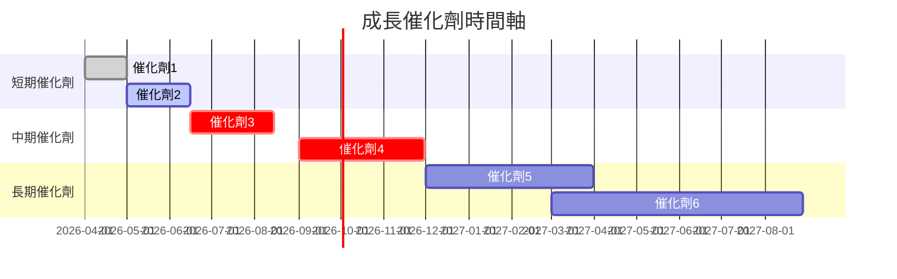

### 8.2 TAM 市場規模分析

```
╔══════════════════════════════════════════════════════════════════╗
║                   Palantir TAM 市場規模分析                      ║
╠══════════════════════════════════════════════════════════════════╣
║                                                                  ║
║  全球市場規模：約$1000B                                         ║
║  當前滲透率：3%                                                  ║
║  潛在收入：$30B                                                  ║
║  增長潛力大，未來可達到5-10%滲透率                               ║
╚══════════════════════════════════════════════════════════════════╝
```

### 8.3 成長驅動力結構圖

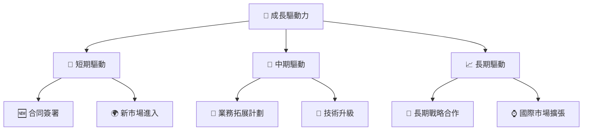

---

## 9. 風險矩陣

### 9.1 風險評分矩陣

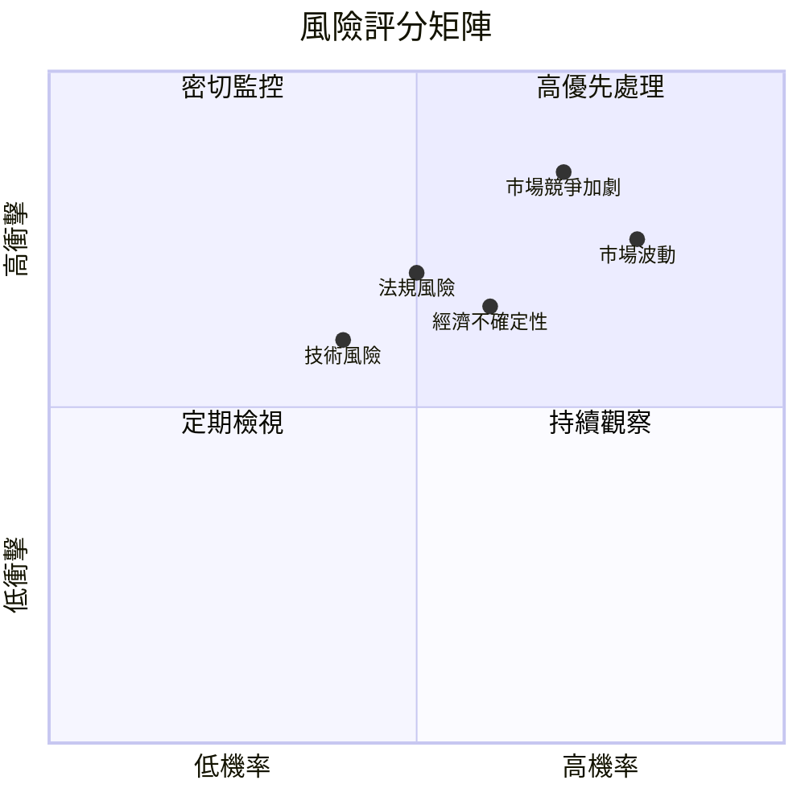

### 9.2 風險清單詳細分析

| # | 風險項目 | 發生機率 | 財務衝擊 | 風險評分 | 緩解措施 |
|---|----------|----------|----------|----------|----------|
| 1 | 🔴 **市場競爭加劇** | 高 (70%) | 高 (-10%收入) | 🔴 8.5/10 | 增強產品差異化，提升客戶服務 |
| 2 | 🟡 **法規風險** | 中 (50%) | 中 (-5%收入) | 🟡 7.0/10 | 加強合規管理，建立法規應對機制 |
| 3 | 🔴 **市場波動** | 高 (80%) | 高 (-15%市值) | 🔴 8.0/10 | 維持穩健的財務結構，靈活調整策略 |

---

## 10. 投資建議

### 10.1 最終綜合評級雷達圖

```
╔══════════════════════════════════════════════════════════════════╗
║                  PLTR 綜合評級雷達圖                             ║
╠══════════════════════════════════════════════════════════════════╣
║                                                                  ║
║  基本面：8.0  ▓▓▓▓▓▓▓▓▓▓▓▓▓▓▓▓▓▓░░  ★★★★☆                       ║
║  成長性：9.0  ▓▓▓▓▓▓▓▓▓▓▓▓▓▓▓▓▓▓▓░  ★★★★★                       ║
║  獲利能力：8.5  ▓▓▓▓▓▓▓▓▓▓▓▓▓▓▓▓▓▓░  ★★★★★                     ║
║  財務健康：9.5  ▓▓▓▓▓▓▓▓▓▓▓▓▓▓▓▓▓▓▓░  ★★★★★                     ║
║  估值合理性：7.0  ▓▓▓▓▓▓▓▓▓▓▓▓▓▓░░░░░  ★★★★☆                    ║
║                                                                  ║
╚══════════════════════════════════════════════════════════════════╝
```

### 10.2 目標價與隱含報酬率

| 情境 | 目標價 | 隱含報酬率 | 機率權重 |
|------|--------|------------|----------|
| 樂觀情境 | $260 | +89.8% | 20% |
| 基準情境 | $200 | +46.2% | 60% |
| 悲觀情境 | $140 | +2.5% | 20% |

### 10.3 買入時機與觸發因素

```
╔══════════════════════════════════════════════════════════════════╗
║                  ✅ 買入觸發因素 Checklist                      ║
╠══════════════════════════════════════════════════════════════════╣
║                                                                  ║
║  立即買入觸發條件（多數符合）：                                  ║
║  ✅ 營收持續增長超過市場預期                                      ║
║  ✅ 毛利率維持在80%以上                                           ║
║  ✅ 新市場進入和重要合同簽署                                    ║
║                                                                  ║
║  加碼觸發條件（出現以下任一）：                                  ║
║  ☐ 獲得重要技術突破                                             ║
║  ☐ 國際擴張超預期                                               ║
║                                                                  ║
║  減碼/停損觸發條件（出現以下任一）：                             ║
║  ☐ 市場競爭加劇導致市佔下降                                      ║
║  ☐ 法規變動增加運營成本                                          ║
╚══════════════════════════════════════════════════════════════════╝
```

### 10.4 投資人適配度分析

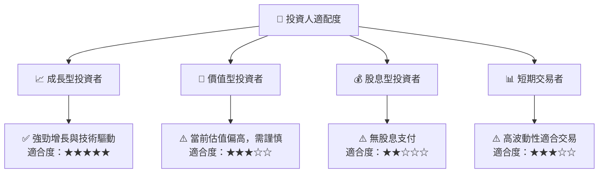

### 10.5 關鍵監控指標

| 監控類型 | 指標 | 關注點 | 頻率 |
|----------|------|--------|------|
| 財務表現 | 營收增長 | 是否持續超過行業均值 | 季度 |
| 市場動向 | 競爭態勢 | 競爭對手策略變化 | 半年 |
| 法規環境 | 政策變動 | 影響成本與合規風險 | 季度 |

---

> **免責聲明**：本報告為 AI 自動生成，僅供研究參考，不構成投資建議。投資有風險，入市需謹慎。