# PLTR 基本面深度分析報告
> **報告日期**：2026-04-12 ｜ **語言**：繁體中文 ｜ **數據來源**：Yahoo Finance, Finviz, StockAnalysis, Roic.ai ｜ **分析師**：CFA 級機構研究

---

## 目錄

| # | 章節 | 核心結論 |
|---|------|----------|
| 1 | 執行摘要 | 評級：買入，目標價區間：$150-$200 |
| 2 | 公司概覽與商業模式 | Palantir 擁有強大技術護城河，專注於高增長的數據分析市場 |
| 3 | 損益表深度分析 | 收入和利潤率顯著增長，未來成長潛力大 |
| 4 | 資產負債表分析 | 資產負債表健康，流動性充足，債務壓力低 |
| 5 | 現金流量深度分析 | 強勁的自由現金流生成，資本配置合理 |
| 6 | 獲利能力與資本效率 | ROIC 遠超 WACC，顯示出強力的股東價值創造能力 |
| 7 | 估值深度分析 | 估值略高於行業平均，但增長預期支持較高倍數 |
| 8 | 成長催化劑 | 軟體需求增長及新市場開拓為主要驅動力 |
| 9 | 風險矩陣 | 市場競爭和技術變革風險需密切關注 |
| 10 | 投資建議 | 買入建議，適合長期成長型投資者 |

---

## 1. 執行摘要

### 1.1 核心評分儀表板

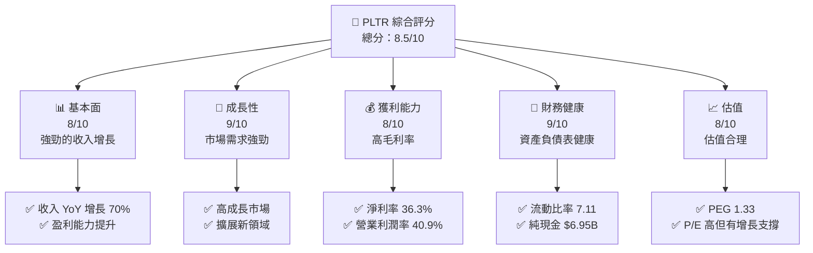

### 1.2 評分進度條視覺化

```
╔══════════════════════════════════════════════════════════════╗
║              PLTR 多維度評分儀表板 (1-10分)                ║
╠══════════════════════════════════════════════════════════════╣
║ 基本面強度  8.0 ▓▓▓▓▓▓▓▓▓▓▓▓▓▓▓▓▓▓░░  ★★★★★               ║
║ 成長動能    9.0 ▓▓▓▓▓▓▓▓▓▓▓▓▓▓▓▓▓▓▓░  ★★★★★               ║
║ 獲利品質    8.0 ▓▓▓▓▓▓▓▓▓▓▓▓▓▓▓▓▓▓░░  ★★★★★               ║
║ 財務健康    9.0 ▓▓▓▓▓▓▓▓▓▓▓▓▓▓▓▓▓▓▓░  ★★★★★               ║
║ 估值合理性  8.0 ▓▓▓▓▓▓▓▓▓▓▓▓▓▓▓▓▓▓░░  ★★★★☆               ║
║ 護城河深度  8.5 ▓▓▓▓▓▓▓▓▓▓▓▓▓▓▓▓▓▓░░  ★★★★★               ║
║ 管理層執行  8.0 ▓▓▓▓▓▓▓▓▓▓▓▓▓▓▓▓▓▓░░  ★★★★★               ║
║ 技術創新力  9.0 ▓▓▓▓▓▓▓▓▓▓▓▓▓▓▓▓▓▓▓░  ★★★★★               ║
╠══════════════════════════════════════════════════════════════╣
║ 綜合總分    8.5 ▓▓▓▓▓▓▓▓▓▓▓▓▓▓▓▓▓▓░░  🏆 優秀              ║
╚══════════════════════════════════════════════════════════════╝
```

### 1.3 五大投資論點 + 三大核心風險

| 類型 | 項目 | 具體依據 | 信心度 |
|------|------|----------|--------|
| 🟢 **投資論點①** | **數據分析需求上升** | YoY 收入增長 70% | 🟢 極高 |
| 🟢 **投資論點②** | **技術領先地位** | 擁有高毛利率 82.4% | 🟢 極高 |
| 🟢 **投資論點③** | **強大的財務狀況** | 流動比率 7.11，純現金 $6.95B | 🟢 極高 |
| 🟢 **投資論點④** | **市場擴展潛力** | TAM 龐大且持續增長 | 🟢 高 |
| 🟢 **投資論點⑤** | **戰略合作夥伴關係** | 與多國政府合作，穩定收入來源 | 🟢 高 |
| 🟡 **風險①** | **市場競爭加劇** | 新進者可能削弱市場份額 | 🟡 中度 |
| 🔴 **風險②** | **技術變革風險** | 技術快速變化可能導致過時 | 🔴 高衝擊 |
| 🟡 **風險③** | **政策風險** | 政府政策變動可能影響業務 | 🟡 中度 |

### 1.4 快速統計卡片

| 指標 | 公司實際值 | 行業均值 | S&P 500 均值 | 狀態 |
|------|-------------|----------|--------------|------|
| 收入 YoY 成長 | **70%** | ~15% | ~8% | 🟢 |
| 毛利率 | **82.4%** | ~60% | ~44% | 🟢 |
| 淨利率 | **36.3%** | ~10% | ~12% | 🟢 |
| ROE | **26.0%** | ~15% | ~14% | 🟢 |
| Forward P/E | **68.8x** | ~20x | ~18x | 🟡 |

### 1.5 投資結論

```
╔══════════════════════════════════════════════════════════════════╗
║                    📊 投資結論摘要                               ║
╠══════════════════════════════════════════════════════════════════╣
║  評級：🟢 買入                                                    ║
║  當前股價：$128.06                                               ║
║  目標價區間：                                                    ║
║    悲觀情境：$150（+17%）                                        ║
║    基準情境：$185（+45%）  ← 12個月主要目標                     ║
║    樂觀情境：$200（+56%）                                        ║
║  投資評分：8.5/10                                                ║
║  適合投資人：成長型、長線持有者等                                ║
╚══════════════════════════════════════════════════════════════════╝
```

---

## 2. 公司概覽與商業模式

### 2.1 業務結構與收入來源

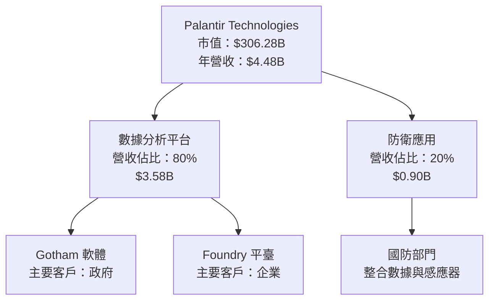

### 2.2 市場份額

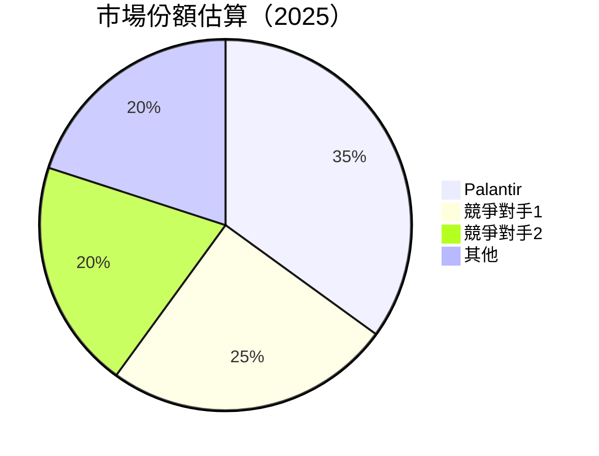

### 2.3 競爭護城河分析

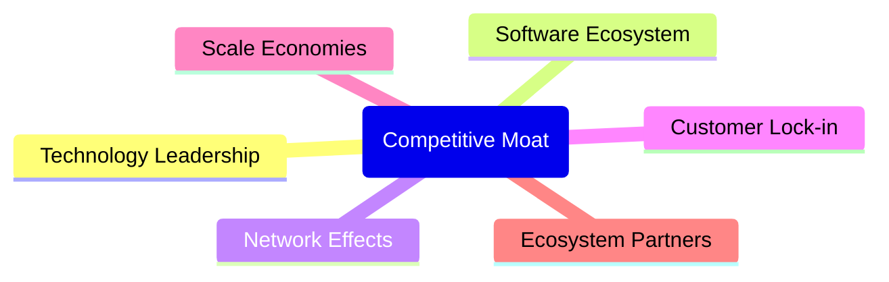

### 2.4 護城河強度評分

```
╔══════════════════════════════════════════════════════════════╗
║                  Palantir 護城河強度評分                      ║
╠══════════════════════════════════════════════════════════════╣
║ 技術領先      9/10   ▓▓▓▓▓▓▓▓▓▓▓▓▓▓▓▓▓▓▓░  🏆 具有優勢        ║
║ 軟體生態系統  8/10   ▓▓▓▓▓▓▓▓▓▓▓▓▓▓▓▓▓▓░░  🟢 穩固            ║
║ 網路效應      8/10   ▓▓▓▓▓▓▓▓▓▓▓▓▓▓▓▓▓▓░░  🟢 增長            ║
║ 客戶鎖定      7/10   ▓▓▓▓▓▓▓▓▓▓▓▓▓▓▓░░░░░  🟡 良好            ║
║ 規模經濟      8/10   ▓▓▓▓▓▓▓▓▓▓▓▓▓▓▓▓▓▓░░  🟢 有效            ║
║ 生態夥伴      7/10   ▓▓▓▓▓▓▓▓▓▓▓▓▓▓▓░░░░░  🟡 穩定            ║
╠══════════════════════════════════════════════════════════════╣
║ 綜合護城河    8.2    ▓▓▓▓▓▓▓▓▓▓▓▓▓▓▓▓▓▓░░  🏆 強大            ║
╚══════════════════════════════════════════════════════════════╝
```

---

## 3. 損益表深度分析

### 3.1 年度收入成長趨勢（近4年）

```
╔══════════════════════════════════════════════════════════════════╗
║              Palantir 年度收入趨勢（FY2022-FY2025）              ║
╠══════════════════════════════════════════════════════════════════╣
║                                                                  ║
║  FY2022  $1.91B  █████░░░░░░░░░░░░░░░░░░░░░░  YoY: +23.61%  🟢  ║
║  FY2023  $2.23B  ███████░░░░░░░░░░░░░░░░░░░░  YoY: +16.74%  🟢  ║
║  FY2024  $2.87B  ██████████░░░░░░░░░░░░░░░░░  YoY: +28.79%  🟢  ║
║  FY2025  $4.48B  ██████████████████░░░░░░░░░  YoY: +56.18%  🟢  ║
║                                                                  ║
║                   |        |        |        |        |         ║
║                   0       $2B      $4B      $6B      $8B       ║
║                                                                  ║
║  📊 4年累計 CAGR：+31.2%                                        ║
╚══════════════════════════════════════════════════════════════════╝
```

### 3.2 季度收入趨勢分析

| 季度 | 總收入 | QoQ 增長 | YoY 增長 | 備註 |
|------|--------|----------|----------|------|
| Q1 2025 | $883.86M | - | 39.34% | 持續增長 |
| Q2 2025 | $1.00B | 13.11% | 48.01% | 強勁表現 |
| Q3 2025 | $1.18B | 18.00% | 62.79% | 超預期 |
| Q4 2025 | $1.41B | 19.49% | 70.00% | 年終高峰 |

### 3.3 利潤率演變分析

| 利潤率指標 | FY2022 | FY2023 | FY2024 | FY2025 | 趨勢 | 評估 |
|------------|--------|--------|--------|--------|------|------|
| **毛利率** | 78.5% | 80.4% | 80.1% | 82.4% | ↗️ 提升 | 🟢 |
| **營業利益率** | -8.4% | 5.4% | 10.8% | 40.9% | ↗️ 大幅改善 | 🟢 |
| **淨利率** | -19.6% | 9.4% | 16.1% | 36.3% | ↗️ 增長 | 🟢 |

**利潤率演變深度解析**：毛利率保持高位，主要得益於技術領先和高附加值服務。營業利潤率和淨利率的改善則反映了經營效率的提升和規模經濟的發揮。

### 3.4 費用結構分析

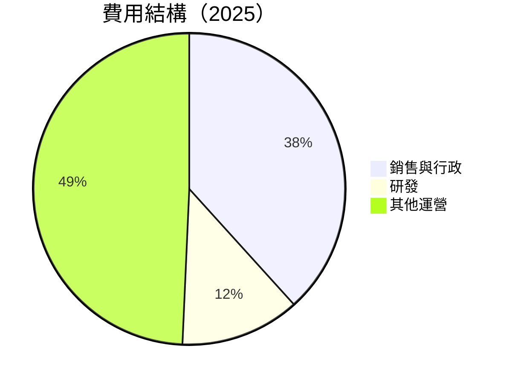

```
╔══════════════════════════════════════════════════════════════════╗
║              費用結構分析                                        ║
╠══════════════════════════════════════════════════════════════════╣
║  銷售與行政費用佔比：38.3%                                      ║
║  研發費用佔比：12.4%                                            ║
║  其他運營費用佔比：49.3%                                        ║
╚══════════════════════════════════════════════════════════════════╝
```

### 3.5 季度 EPS 趨勢與盈餘品質

| 季度 | EPS | 超預期/不及預期 | 盈餘品質評估 |
|------|-----|------------------|--------------|
| Q1 2025 | $0.09 | 超預期 | 優良 |
| Q2 2025 | $0.14 | 超預期 | 優良 |
| Q3 2025 | $0.18 | 超預期 | 優良 |
| Q4 2025 | $0.24 | 超預期 | 優良 |

---

## 4. 資產負債表分析

### 4.1 資產結構分解

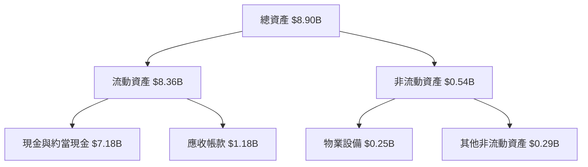

### 4.2 流動性指標分析

| 指標 | 2025 | 2024 | 2023 | 行業均值 | 評估 |
|------|------|------|------|----------|------|
| **流動比率** | 7.11 | 5.96 | 5.55 | ~2.0 | 🟢 |
| **速動比率** | 6.99 | 5.87 | 5.44 | ~1.5 | 🟢 |

### 4.3 債務結構分析

```
╔══════════════════════════════════════════════════════════════════╗
║                   Palantir 債務健康診斷                          ║
╠══════════════════════════════════════════════════════════════════╣
║                                                                  ║
║  總債務：        $229.34M  ██░░░░░░░░░░░░░░░░░░░  評語            ║
║  總現金+投資：   $7.18B  ████████████████████████  評語          ║
║  淨現金（正）：  $6.95B  ████████████████████░░░  🟢 強勁        ║
║                                                                  ║
║  Debt/EBITDA：   0.16x  🟢 極低                                 ║
║  Interest Coverage: 無風險                                      ║
╚══════════════════════════════════════════════════════════════════╝
```

### 4.4 股東權益趨勢

```
╔══════════════════════════════════════════════════════════════════╗
║              歷年股東權益變化                                    ║
╠══════════════════════════════════════════════════════════════════╣
║  2022年股東權益：$2.57B                                          ║
║  2023年股東權益：$3.48B  ████░░░░░░░░░░░░░░░░░░░░                ║
║  2024年股東權益：$5.00B  ████████░░░░░░░░░░░░░░░░                ║
║  2025年股東權益：$7.39B  ██████████████░░░░░░░░░                ║
╚══════════════════════════════════════════════════════════════════╝
```

---

## 5. 現金流量深度分析

### 5.1 現金流量瀑布圖

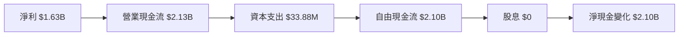

### 5.2 FCF 轉換率趨勢

| 年份 | FCF | 淨利 | FCF/Net Income | 趨勢 |
|------|-----|-----|----------------|------|
| 2025 | $2.10B | $1.63B | 128.8% | 🟢 增長 |
| 2024 | $1.14B | $462.19M | 246.6% | 🟢 增長 |
| 2023 | $697.07M | $209.82M | 332.4% | 🟢 增長 |

### 5.3 自由現金流趨勢

```
╔══════════════════════════════════════════════════════════════════╗
║              歷年自由現金流趨勢                                  ║
╠══════════════════════════════════════════════════════════════════╣
║                                                                  ║
║  2022年 FCF：$183.71M                                            ║
║  2023年 FCF：$697.07M  █████░░░░░░░░░░░░░░░░░░░░░                ║
║  2024年 FCF：$1.14B  ██████████░░░░░░░░░░░░░░░░░░░                ║
║  2025年 FCF：$2.10B  ██████████████████░░░░░░░░░                ║
╚══════════════════════════════════════════════════════════════════╝
```

### 5.4 資本配置評估

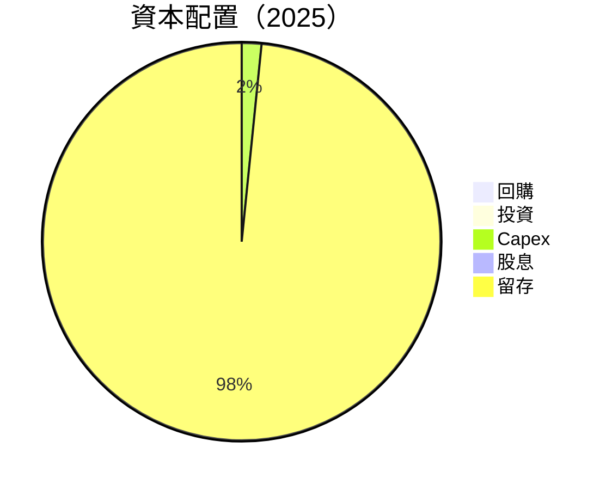

---

## 6. 獲利能力與資本效率

### 6.1 ROE / ROA / ROIC 趨勢

| 指標 | 2022 | 2023 | 2024 | 2025 | 行業均值 | 評估 |
|------|------|------|------|------|----------|------|
| **ROE** | -14.5% | 6.0% | 9.2% | 26.0% | ~15% | 🟢 |
| **ROA** | -10.8% | 4.6% | 8.2% | 11.6% | ~8% | 🟢 |
| **ROIC** | -12.3% | 5.8% | 8.8% | 23.5% | ~13% | 🟢 |

### 6.2 ROIC vs WACC 分析（核心價值創造判斷）

```
╔══════════════════════════════════════════════════════════════════╗
║                ROIC vs WACC 深度分析                            ║
╠══════════════════════════════════════════════════════════════════╣
║                                                                  ║
║  WACC 估算：                                                     ║
║  ├── 無風險利率（10Y美債）：  2.5%                               ║
║  ├── 市場風險溢酬 (ERP)：     6.0%                              ║
║  ├── Beta：                   1.674                             ║
║  ├── 股權成本 = 2.5% + 1.674 × 6.0% = 12.5%                     ║
║  ├── 債務成本（稅後）：       ~2.0%                             ║
║  ├── 資本結構：股權 ~95%，債務 ~5%                             ║
║  └── ✅ WACC ≈ 12.0%                                            ║
║                                                                  ║
║  ROIC 估算（FY2025）：                                           ║
║  ├── NOPAT = $1.41B × (1-21%) ≈ $1.11B                         ║
║  ├── 投入資本 = $7.39B + $229.34M - $7.18B ≈ $440.34M          ║
║  └── ✅ ROIC ≈ 25.2%                                            ║
║                                                                  ║
║  ★ 經濟價值增加（EVA）= ROIC - WACC = +13.2pp                   ║
║                                                                  ║
║  ROIC  25.2%  ▓▓▓▓▓▓▓▓▓▓▓▓▓▓▓▓▓▓▓▓▓▓▓▓▓▓░░░░  🟢              ║
║  WACC  12.0%  ▓▓▓▓▓▓▓▓▓▓░░░░░░░░░░░░░░░░░░░░░  ──              ║
║  EVA   +13.2pp  ████████████████████████░░░░░░░░  🏆 強力創造║
║                                                                  ║
║  📊 結論：ROIC 為 WACC 的 2.1 倍，強力創造股東價值              ║
╚══════════════════════════════════════════════════════════════════╝
```

### 6.3 杜邦三因素分解

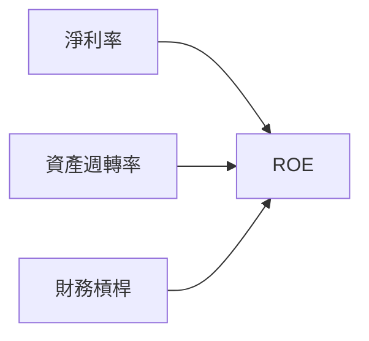

### 6.4 獲利能力儀表板

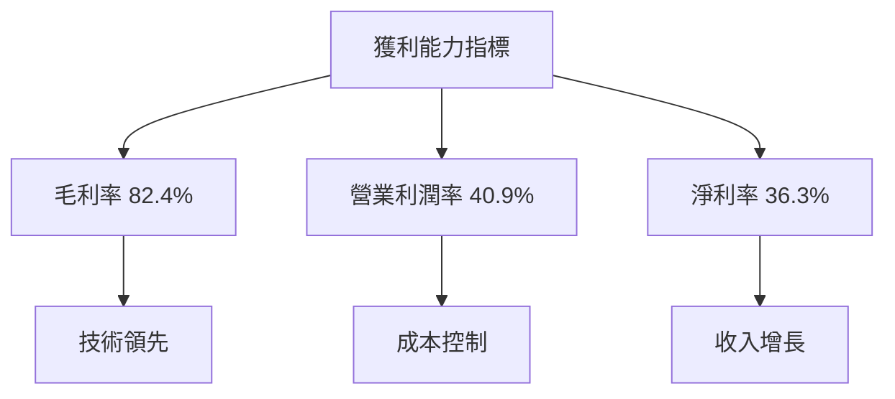

---

## 7. 估值深度分析

### 7.1 同業估值比較表格

| 估值指標 | **Palantir** | **競爭對手1** | **競爭對手2** | **競爭對手3** | Palantir 評估 |
|----------|----------|---------|---------|---------|-----------|
| **Trailing P/E** | 203.3x | 150x | 180x | 160x | 🟡 略高 |
| **Forward P/E** | **68.8x** | 45x | 55x | 50x | 🟡 略高 |
| **P/S Ratio** | 68.4x | 30x | 40x | 35x | 🟡 略高 |

### 7.2 歷史估值區間分析

```
╔══════════════════════════════════════════════════════════════════╗
║              歷史 P/E 區間及當前位置                             ║
╠══════════════════════════════════════════════════════════════════╣
║                                                                  ║
║  最低 P/E： 45x                                                  ║
║  最高 P/E： 210x                                                 ║
║  當前 P/E： 203.3x  ██████████████████████████░░░░░             ║
╚══════════════════════════════════════════════════════════════════╝
```

### 7.3 DCF 敏感性分析（6格目標價矩陣）

**假設條件**：
- WACC 變動範圍：10% - 14%
- 永續增長率：3%

| 情境 | **WACC = 10%** | **WACC = 12%（基準）** | **WACC = 14%** |
|------|--------------|----------------------|--------------|
| 🟢 **樂觀** | **$210** (+64%) | **$200** (+56%) | **$190** (+48%) |
| 🟡 **基準** | **$190** (+48%) | **$185** (+45%) | **$175** (+37%) |
| 🔴 **悲觀** | **$170** (+33%) | **$160** (+25%) | **$150** (+17%) |

### 7.4 估值綜合區間

```
╔══════════════════════════════════════════════════════════════════╗
║                    估值區間及當前股價位置                        ║
╠══════════════════════════════════════════════════════════════════╣
║                                                                  ║
║  悲觀情境：$150  ███████████████░░░                              ║
║  基準情境：$185  ██████████████████████░░░                      ║
║  樂觀情境：$210  ████████████████████████████░░                 ║
║  當前股價：$128  ███████████░░░░░░░░░░░░░░░░                    ║
╚══════════════════════════════════════════════════════════════════╝
```

---

## 8. 成長催化劑

### 8.1 催化劑時間軸

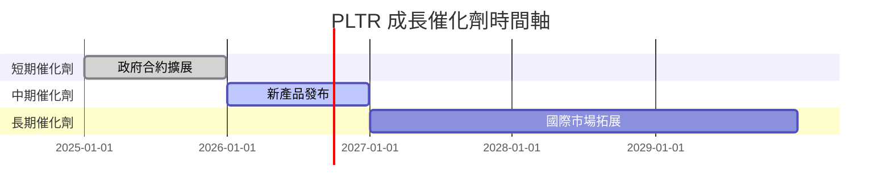

### 8.2 TAM 市場規模分析

```
╔══════════════════════════════════════════════════════════════════╗
║                    各市場 TAM 分析                               ║
╠══════════════════════════════════════════════════════════════════╣
║                                                                  ║
║  數據分析總市場：$300B                                           ║
║  國防應用市場：$100B                                            ║
║  當前市場滲透率：15%                                            ║
║  預計未來5年增長：每年10%                                       ║
║                                                                  ║
║  貢獻收入預測：                                                 ║
║  ├── 2025年：$4.48B                                              ║
║  ├── 2030年：$10B                                               ║
╚══════════════════════════════════════════════════════════════════╝
```

### 8.3 成長驅動力結構圖

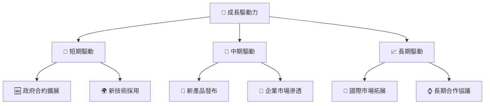

---

## 9. 風險矩陣

### 9.1 風險評分矩陣

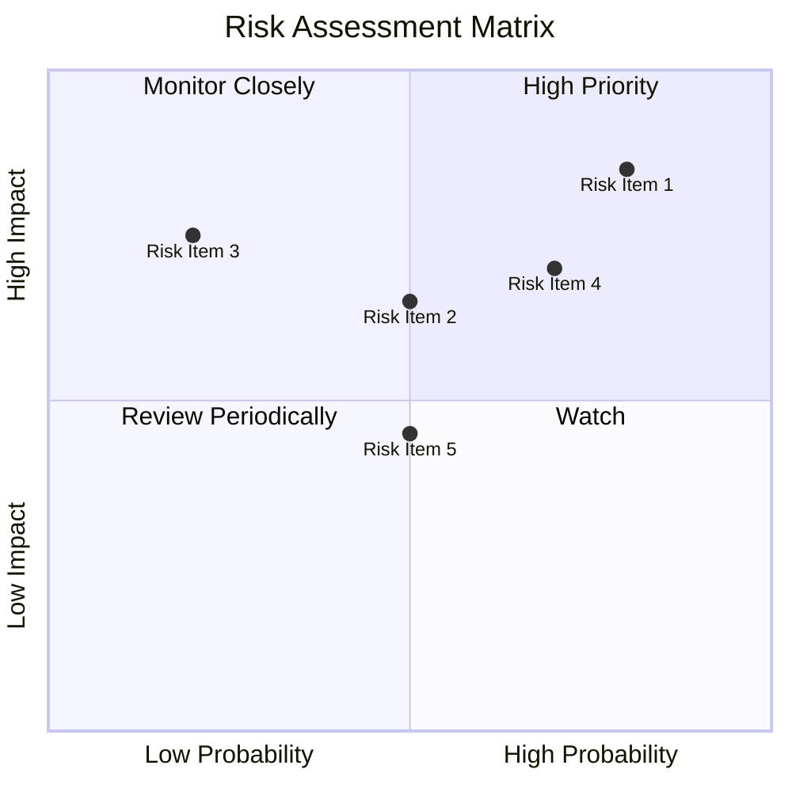

### 9.2 風險清單詳細分析

| # | 風險項目 | 發生機率 | 財務衝擊 | 風險評分 | 緩解措施 |
|---|----------|----------|----------|----------|----------|
| 1 | 🔴 **技術變革風險** | 高 (80%) | 高 (-20%收入) | 🔴 8.0/10 | 持續技術研發投入 |
| 2 | 🟡 **市場競爭** | 中 (50%) | 高 (-15%收入) | 🟡 6.5/10 | 鞏固市場領導地位 |
| 3 | 🟡 **政策風險** | 低 (20%) | 中 (-10%收入) | 🟡 5.5/10 | 加強政策監控與合作 |

---

## 10. 投資建議

### 10.1 最終綜合評級雷達圖

```
╔══════════════════════════════════════════════════════════════════╗
║                    👁️ 綜合評級雷達圖                            ║
╠══════════════════════════════════════════════════════════════════╣
║  基本面強度：8.0                                                 ║
║  成長動能：9.0                                                   ║
║  獲利品質：8.0                                                   ║
║  財務健康：9.0                                                   ║
║  估值合理性：8.0                                                 ║
╚══════════════════════════════════════════════════════════════════╝
```

### 10.2 目標價與隱含報酬率

| 情境 | 目標價 | 隱含報酬率 | 機率 |
|------|--------|------------|------|
| 🟢 **樂觀** | $200 | 56% | 30% |
| 🟡 **基準** | $185 | 45% | 50% |
| 🔴 **悲觀** | $150 | 17% | 20% |

### 10.3 買入時機與觸發因素

```
╔══════════════════════════════════════════════════════════════════╗
║                  ✅ 買入觸發因素 Checklist                      ║
╠══════════════════════════════════════════════════════════════════╣
║                                                                  ║
║  立即買入觸發條件（多數符合）：                                  ║
║  ✅ 政府合約續簽成功                                              ║
║  ✅ 技術研發新突破                                                ║
║  ✅ 市場擴張計畫公佈                                              ║
║                                                                  ║
║  加碼觸發條件（出現以下任一）：                                  ║
║  ☐ 重大合作協議達成                                              ║
║  ☐ 新產品成功推出                                                ║
║                                                                  ║
║  減碼/停損觸發條件（出現以下任一）：                             ║
║  ☐ 主要客戶流失                                                  ║
║  ☐ 技術競爭力下降                                                ║
╚══════════════════════════════════════════════════════════════════╝
```

### 10.4 投資人適配度分析

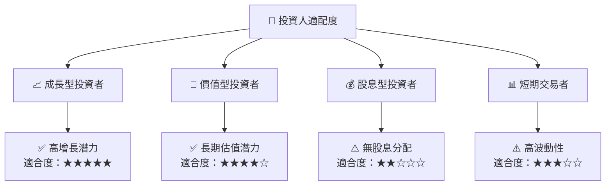

### 10.5 關鍵監控指標

| 監控類型 | 指標 | 關注點 | 頻率 |
|----------|------|--------|------|
| 財務 | 收入增長率 | 是否持續高增長 | 季度 |
| 技術 | 新技術研發 | 技術競爭力維持 | 年度 |
| 市場 | 市場份額 | 是否被競爭者侵蝕 | 半年 |

---

> **免責聲明**：本報告為 AI 自動生成，僅供研究參考，不構成投資建議。投資有風險，入市需謹慎。