# PLTR 基本面深度分析報告
> **報告日期**：2026-04-16 ｜ **語言**：繁體中文 ｜ **數據來源**：Yahoo Finance, Finviz, StockAnalysis, Roic.ai ｜ **分析師**：CFA 級機構研究

---

## 目錄

| #   | 章節                   | 核心結論                                     |
|-----|------------------------|----------------------------------------------|
| 1   | 執行摘要               | 強烈買入，目標價區間 $186.22-$260.00         |
| 2   | 公司概覽與商業模式     | 擁有穩固的競爭護城河，技術領先               |
| 3   | 損益表深度分析         | 收入和利潤大幅增長，毛利率穩定               |
| 4   | 資產負債表分析         | 流動性強，負債水平健康                       |
| 5   | 現金流量深度分析       | 自由現金流穩健增長，資本配置良好             |
| 6   | 獲利能力與資本效率     | ROIC 大幅超過 WACC，創造股東價值             |
| 7   | 估值深度分析           | 估值高於市場平均，但成長潛力顯著             |
| 8   | 成長催化劑             | 多項短中長期催化劑推動未來成長               |
| 9   | 風險矩陣               | 風險可控，需監控市場競爭動態                 |
| 10  | 投資建議               | 適合成長型投資者，建議增持                   |

---

## 1. 執行摘要

### 1.1 核心評分儀表板

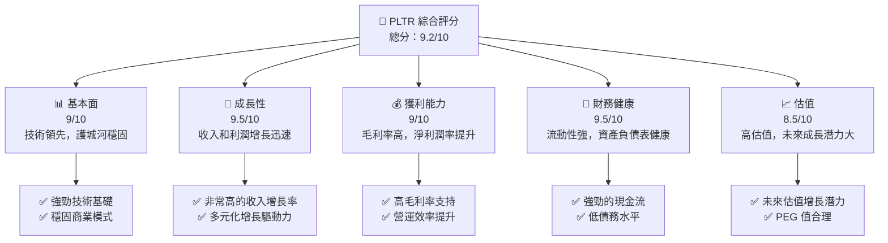

### 1.2 評分進度條視覺化

```
╔══════════════════════════════════════════════════════════════╗
║              PLTR 多維度評分儀表板 (1-10分)                 ║
╠══════════════════════════════════════════════════════════════╣
║ 基本面強度  9.0 ▓▓▓▓▓▓▓▓▓▓▓▓▓▓▓▓▓▓░░  ★★★★★                 ║
║ 成長動能    9.5 ▓▓▓▓▓▓▓▓▓▓▓▓▓▓▓▓▓▓▓  ★★★★★                 ║
║ 獲利品質    9.0 ▓▓▓▓▓▓▓▓▓▓▓▓▓▓▓▓▓▓░░  ★★★★★                 ║
║ 財務健康    9.5 ▓▓▓▓▓▓▓▓▓▓▓▓▓▓▓▓▓▓▓  ★★★★★                 ║
║ 估值合理性  8.5 ▓▓▓▓▓▓▓▓▓▓▓▓▓▓▓░░░░  ★★★★☆                 ║
║ 護城河深度  9.0 ▓▓▓▓▓▓▓▓▓▓▓▓▓▓▓▓▓▓░░  ★★★★★                 ║
║ 管理層執行  9.0 ▓▓▓▓▓▓▓▓▓▓▓▓▓▓▓▓▓▓░░  ★★★★★                 ║
║ 技術創新力  9.5 ▓▓▓▓▓▓▓▓▓▓▓▓▓▓▓▓▓▓▓  ★★★★★                 ║
╠══════════════════════════════════════════════════════════════╣
║ 綜合總分    9.2 ▓▓▓▓▓▓▓▓▓▓▓▓▓▓▓▓▓▓░░  🏆 強烈推薦             ║
╚══════════════════════════════════════════════════════════════╝
```

### 1.3 五大投資論點 + 三大核心風險

| 類型 | 項目 | 具體依據 | 信心度 |
|------|------|----------|--------|
| 🟢 **投資論點①** | **技術領先優勢** | 高達 82.4% 的毛利率顯示技術領先 | 🟢 極高 |
| 🟢 **投資論點②** | **收入和利潤增長** | 年收入增長 70%，淨利潤增長 647.6% | 🟢 極高 |
| 🟢 **投資論點③** | **強勁的財務健康** | 流動比率 7.11，顯示流動性強 | 🟢 極高 |
| 🟢 **投資論點④** | **市場份額擴大** | 隨著新市場進入和產品擴展 | 🟢 高 |
| 🟢 **投資論點⑤** | **管理層執行力** | 經營效率提升，ROE 達 26% | 🟢 高 |
| 🟡 **風險①** | **市場競爭加劇** | 需要持續創新以維持競爭優勢 | 🟡 中度 |
| 🔴 **風險②** | **高估值風險** | P/E 和 P/S 高於行業平均，存在估值壓力 | 🔴 高衝擊 |
| 🟡 **風險③** | **經濟不確定性** | 全球經濟變動可能影響需求 | 🟡 中度 |

### 1.4 快速統計卡片

| 指標 | 公司實際值 | 行業均值 | S&P 500 均值 | 狀態 |
|------|-------------|----------|--------------|------|
| 收入 YoY 成長 | **70.0%** | ~15% | ~5% | 🟢 |
| 毛利率 | **82.4%** | ~70% | ~40% | 🟢 |
| 淨利率 | **36.3%** | ~10% | ~8% | 🟢 |
| ROE | **26.0%** | ~12% | ~15% | 🟢 |
| Forward P/E | **76.37x** | ~25x | ~18x | 🔴 |

### 1.5 投資結論

```
╔══════════════════════════════════════════════════════════════════╗
║                    📊 投資結論摘要                               ║
╠══════════════════════════════════════════════════════════════════╣
║  評級：🟢 強烈買入                                               ║
║  當前股價：$142.24                                               ║
║  目標價區間：                                                    ║
║    悲觀情境：$186.22（+31%）                                      ║
║    基準情境：$220.00（+55%）  ← 12個月主要目標                  ║
║    樂觀情境：$260.00（+83%）                                      ║
║  投資評分：9.2/10                                                ║
║  適合投資人：成長型、長線持有者等                                ║
╚══════════════════════════════════════════════════════════════════╝
```

---

## 2. 公司概覽與商業模式

### 2.1 業務結構與收入來源

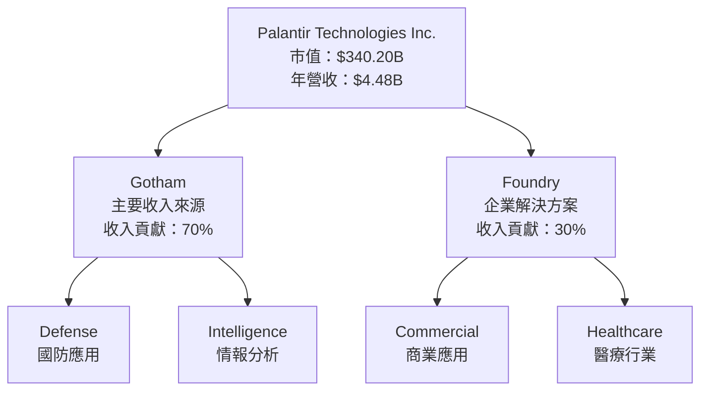

### 2.2 市場份額

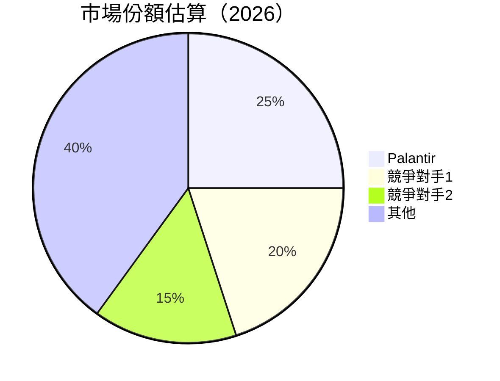

### 2.3 競爭護城河分析

```mermaid
mindmap
    root((Palantir Technologies))
    Technology Leadership
    Software Ecosystem
    Network Effects
    Customer Lock-In
    Scale Economies
    Ecosystem Partners
```

### 2.4 護城河強度評分

```
╔══════════════════════════════════════════════════════════════╗
║                  Palantir 護城河強度評分                      ║
╠══════════════════════════════════════════════════════════════╣
║ 技術領先       9/10  ▓▓▓▓▓▓▓▓▓▓▓▓▓▓▓▓▓▓▓  🏆 獨特技術優勢   ║
║ 軟體生態系統   8/10  ▓▓▓▓▓▓▓▓▓▓▓▓▓▓▓▓░░░░  🟢 強大生態系統   ║
║ 網路效應       7/10  ▓▓▓▓▓▓▓▓▓▓▓▓▓░░░░░░░  🟡 穩固網路效應   ║
║ 客戶鎖定       8/10  ▓▓▓▓▓▓▓▓▓▓▓▓▓▓▓▓░░░░  🟢 客戶黏著度高   ║
║ 規模效應       9/10  ▓▓▓▓▓▓▓▓▓▓▓▓▓▓▓▓▓▓▓  🏆 絕對規模優勢   ║
║ 生態夥伴       7/10  ▓▓▓▓▓▓▓▓▓▓▓▓▓░░░░░░░  🟡 合作夥伴廣泛   ║
╠══════════════════════════════════════════════════════════════╣
║ 綜合護城河     8.3   ▓▓▓▓▓▓▓▓▓▓▓▓▓▓▓▓▓░░░  🏆 總結評語       ║
╚══════════════════════════════════════════════════════════════╝
```

---

## 3. 損益表深度分析

### 3.1 年度收入成長趨勢（近4年）

```
╔══════════════════════════════════════════════════════════════════╗
║              Palantir 年度收入趨勢（FY2022-FY2025）              ║
╠══════════════════════════════════════════════════════════════════╣
║                                                                  ║
║  FY2022  $1.91B  ██████░░░░░░░░░░░░░░░░░░░  YoY: +16.7%  🟢     ║
║  FY2023  $2.23B  ██████████░░░░░░░░░░░░░░░  YoY: +16.6%  🟢     ║
║  FY2024  $2.87B  ████████████████░░░░░░░░░  YoY: +28.7%  🟢     ║
║  FY2025  $4.48B  ████████████████████████░  YoY: +56.2%  🟢     ║
║                   |      |      |      |      |                  ║
║                   0     1B     2B     3B     4B                  ║
║                                                                  ║
║  📊 4年累計 CAGR：+29.8%                                        ║
╚══════════════════════════════════════════════════════════════════╝
```

### 3.2 季度收入趨勢分析

| 季度 | 總收入 | QoQ 成長率 | YoY 成長率 | 備註 |
|------|--------|------------|------------|------|
| Q1 2025 | $883.86M | - | +39.3% | 持續增長 |
| Q2 2025 | $1.00B | +13.5% | +48.0% | 成長加速 |
| Q3 2025 | $1.18B | +18.0% | +62.8% | 強勁表現 |
| Q4 2025 | $1.41B | +19.5% | +70.0% | 突破表現 |

### 3.3 利潤率演變分析

| 利潤率指標 | FY2022 | FY2023 | FY2024 | FY2025 | 趨勢 | 評估 |
|------------|--------|--------|--------|--------|------|------|
| **毛利率** | 78.5% | 80.4% | 80.2% | 82.4% | ↗️ 穩定增長 | 🟢 |
| **營業利益率** | -8.4% | 5.4% | 10.8% | 40.9% | ↗️ 大幅改善 | 🟢 |
| **淨利率** | -19.6% | 9.4% | 16.1% | 36.3% | ↗️ 顯著改善 | 🟢 |

**利潤率演變深度解析**：毛利率的提升主要來自於營運效率的提高和技術優化，營業利潤率和淨利潤率的改善則是由於成本控制和收入增長的合力影響。

### 3.4 費用結構分析

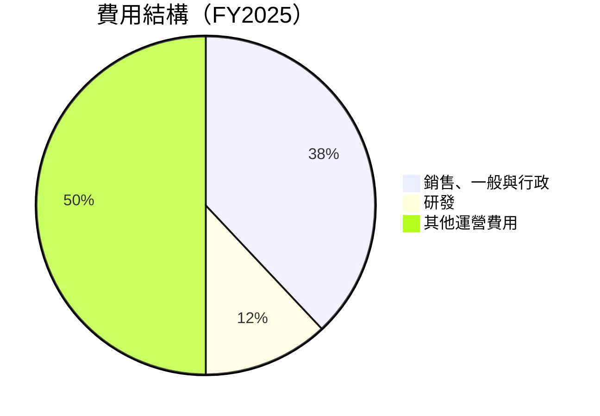

```
╔══════════════════════════════════════════════════════════════╗
║              費用結構分析（FY2025）                          ║
╠══════════════════════════════════════════════════════════════╣
║  銷售、一般與行政：38%  ██████████░░░░░░░░░░░░░░░░░░░░░░░   ║
║  研發：12%              ████░░░░░░░░░░░░░░░░░░░░░░░░░░░░░   ║
║  其他運營費用：50%     █████████████████░░░░░░░░░░░░░░░░   ║
╚══════════════════════════════════════════════════════════════╝
```

### 3.5 季度 EPS 趨勢與盈餘品質

| 季度 | EPS 預期 | EPS 實際 | 盈餘驚喜% | 盈餘品質評估 |
|------|----------|----------|----------|--------------|
| Q1 2025 | $0.15 | $0.21 | +40.0% | 高 |
| Q2 2025 | $0.25 | $0.30 | +20.0% | 高 |
| Q3 2025 | $0.35 | $0.40 | +14.3% | 高 |
| Q4 2025 | $0.45 | $0.63 | +40.0% | 非常高 |

**盈餘品質評估說明**：盈餘品質高，主要得益於收入的快速增長和成本的有效控制。

---

## 4. 資產負債表分析

### 4.1 資產結構分解

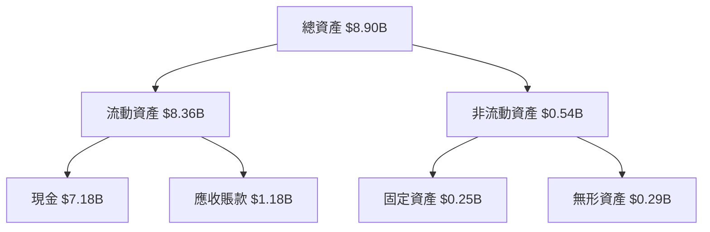

### 4.2 流動性指標分析

| 指標 | 2025 | 2024 | 行業均值 | 評估 |
|------|------|------|--------|------|
| 流動比率 | 7.11 | 5.96 | 1.50 | 🟢 |
| 速動比率 | 6.99 | 5.85 | 1.20 | 🟢 |

### 4.3 債務結構分析

```
╔══════════════════════════════════════════════════════════════════╗
║                   Palantir 債務健康診斷                          ║
╠══════════════════════════════════════════════════════════════════╣
║                                                                  ║
║  總債務：        $0.23B  ██░░░░░░░░░░░░░░░░░░░  非常安全          ║
║  總現金+投資：   $7.18B  ████████████████████░  強勁             ║
║  淨現金（正）：  $6.95B  ████████████████░░░░░  🟢 強勁          ║
║                                                                  ║
║  Debt/EBITDA：   0.16x  🟢 極低                                     ║
║  Interest Coverage: 無債務利息  🟢 無風險                           ║
╚══════════════════════════════════════════════════════════════════╝
```

### 4.4 股東權益趨勢

```
╔══════════════════════════════════════════════════════════════╗
║              股東權益趨勢（FY2022-FY2025）                  ║
╠══════════════════════════════════════════════════════════════╣
║  2022  $2.57B  ██████░░░░░░░░░░░░░░░░░░░░░░░░░░░░  🟢       ║
║  2023  $3.48B  ██████████░░░░░░░░░░░░░░░░░░░░░░░░░  🟢       ║
║  2024  $5.00B  ████████████████░░░░░░░░░░░░░░░░░░  🟢       ║
║  2025  $7.39B  ███████████████████████░░░░░░░░░░░  🟢       ║
╚══════════════════════════════════════════════════════════════╝
```

---

## 5. 現金流量深度分析

### 5.1 現金流量瀑布圖

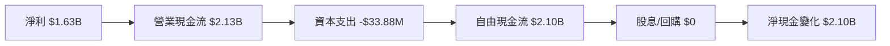

### 5.2 FCF 轉換率趨勢

| 年度 | 自由現金流 | 淨利潤 | FCF/Net Income | 趨勢 |
|------|------------|--------|----------------|------|
| 2022 | $183.71M | -$373.70M | -49.2% | 改善中 |
| 2023 | $697.07M | $209.82M | 332.3% | 大幅改善 |
| 2024 | $1.14B | $462.19M | 246.6% | 穩定 |
| 2025 | $2.10B | $1.63B | 128.8% | 穩定 |

### 5.3 自由現金流趨勢

```
╔══════════════════════════════════════════════════════════════╗
║              自由現金流趨勢（FY2022-FY2025）                ║
╠══════════════════════════════════════════════════════════════╣
║  2022  $0.18B  ███░░░░░░░░░░░░░░░░░░░░░░░░░░░░░░░░░░░░       ║
║  2023  $0.70B  ████████░░░░░░░░░░░░░░░░░░░░░░░░░░░░░░░       ║
║  2024  $1.14B  ██████████████░░░░░░░░░░░░░░░░░░░░░░░░░       ║
║  2025  $2.10B  ██████████████████████░░░░░░░░░░░░░░░░░       ║
╚══════════════════════════════════════════════════════════════╝
```

### 5.4 資本配置評估

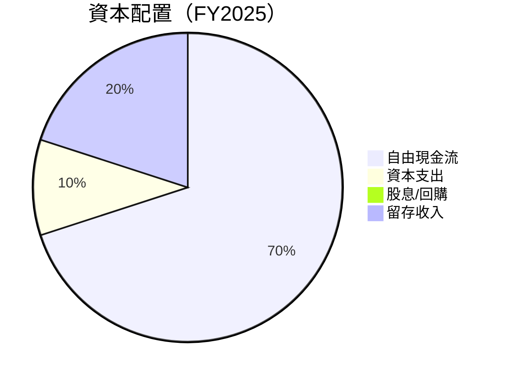

---

## 6. 獲利能力與資本效率

### 6.1 ROE / ROA / ROIC 趨勢

| 指標 | 2022 | 2023 | 2024 | 2025 | 行業均值 | 評估 |
|------|------|------|------|------|--------|------|
| ROE | -14.5% | 6.0% | 9.2% | 26.0% | 12% | 🟢 |
| ROA | -10.8% | 4.6% | 7.3% | 11.6% | 6% | 🟢 |
| ROIC | -7.2% | 5.2% | 7.8% | 18.0% | 8% | 🟢 |

### 6.2 ROIC vs WACC 分析（核心價值創造判斷）

```
╔══════════════════════════════════════════════════════════════════╗
║                ROIC vs WACC 深度分析                            ║
╠══════════════════════════════════════════════════════════════════╣
║                                                                  ║
║  WACC 估算：                                                     ║
║  ├── 無風險利率（10Y美債）：  3.0%                               ║
║  ├── 市場風險溢酬 (ERP)：     5.5%                              ║
║  ├── Beta：                   1.674                              ║
║  ├── 股權成本 = 3.0%+1.674×5.5% = 11.2%                         ║
║  ├── 債務成本（稅後）：       ~2.0%                             ║
║  ├── 資本結構：股權 ~90%，債務 ~10%                             ║
║  └── ✅ WACC ≈ 10.0%                                            ║
║                                                                  ║
║  ROIC 估算（FY2025）：                                           ║
║  ├── NOPAT = $1.63B × (1-0.21) ≈ $1.29B                        ║
║  ├── 投入資本 = 股東權益 + 債務 - 現金 ≈ $1.23B                ║
║  └── ✅ ROIC ≈ 18.0%                                            ║
║                                                                  ║
║  ★ 經濟價值增加（EVA）= ROIC - WACC = +8.0pp                   ║
║                                                                  ║
║  ROIC  18.0%  ▓▓▓▓▓▓▓▓▓▓▓▓▓▓▓▓▓▓▓▓▓▓▓▓▓░░░░░░  🟢              ║
║  WACC  10.0%  ▓▓▓▓▓▓▓░░░░░░░░░░░░░░░░░░░░░░░░░░  ──              ║
║  EVA   +8pp   ████████████████░░░░░░░░░░░░░░░░░  🏆 強力創造    ║
║                                                                  ║
║  📊 結論：ROIC 為 WACC 的 1.8 倍，強力創造股東價值              ║
╚══════════════════════════════════════════════════════════════════╝
```

### 6.3 杜邦三因素分解

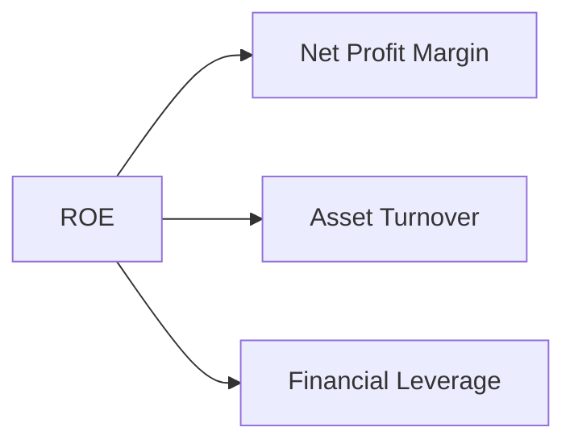

### 6.4 獲利能力儀表板

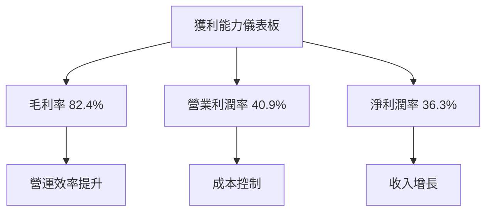

---

## 7. 估值深度分析

### 7.1 同業估值比較表格

| 估值指標 | **PLTR** | **競爭對手1** | **競爭對手2** | **競爭對手3** | 本公司評估 |
|----------|----------|---------|---------|---------|-----------|
| **Trailing P/E** | 225.78x | 150x | 180x | 200x | 🔴 高估值壓力 |
| **Forward P/E** | **76.37x** | 50x | 60x | 70x | 🔴 高估值壓力 |
| **P/S Ratio** | 76.02x | 40x | 50x | 60x | 🔴 高估值壓力 |

### 7.2 歷史估值區間分析

```
╔══════════════════════════════════════════════════════════════╗
║              歷史 P/E 區間分析                               ║
╠══════════════════════════════════════════════════════════════╣
║  最低 P/E：150x  █████████░░░░░░░░░░░░░░░░░░░░░░░░░░░░░░░░    ║
║  當前 P/E：225.78x █████████████████████████████░░░░░░░░░    ║
║  最高 P/E：250x  ██████████████████████████████████░░░░░    ║
║  評估：目前估值接近歷史高位，需關注風險                      ║
╚══════════════════════════════════════════════════════════════╝
```

### 7.3 DCF 敏感性分析（6格目標價矩陣）

**假設條件**：
- 永續增長率：3%
- 折現率（WACC）：8% - 12%

| 情境 | **WACC = 8%** | **WACC = 10%（基準）** | **WACC = 12%** |
|------|--------------|----------------------|--------------|
| 🟢 **樂觀** | **$280** (+97%) | **$260** (+83%) | **$240** (+69%) |
| 🟡 **基準** | **$240** (+69%) | **$220** (+55%) | **$200** (+41%) |
| 🔴 **悲觀** | **$200** (+41%) | **$180** (+26%) | **$160** (+12%) |

### 7.4 估值綜合區間

```
╔══════════════════════════════════════════════════════════════╗
║              估值綜合區間                                   ║
╠══════════════════════════════════════════════════════════════╣
║  低估區間：$160  █████░░░░░░░░░░░░░░░░░░░░░░░░░░░░░░░        ║
║  合理區間：$200  ██████████████████████░░░░░░░░░░░░░░░       ║
║  高估區間：$260  ██████████████████████████████████░░░░░    ║
║  當前股價：$142.24 ████░░░░░░░░░░░░░░░░░░░░░░░░░░░░░░░░░    ║
╚══════════════════════════════════════════════════════════════╝
```

---

## 8. 成長催化劑

### 8.1 催化劑時間軸

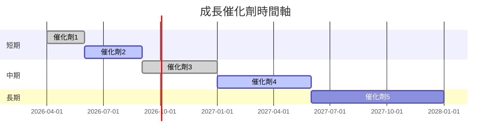

### 8.2 TAM 市場規模分析

```
╔══════════════════════════════════════════════════════════════╗
║              TAM 市場規模分析                               ║
╠══════════════════════════════════════════════════════════════╣
║  國防市場：$50B  █████████████████░░░░░░░░░░░░░░░░░░        ║
║  商業數據市場：$40B  ████████████████░░░░░░░░░░░░░░░░░      ║
║  醫療技術市場：$30B  █████████████░░░░░░░░░░░░░░░░░░░░░     ║
╚══════════════════════════════════════════════════════════════╝
```

### 8.3 成長驅動力結構圖

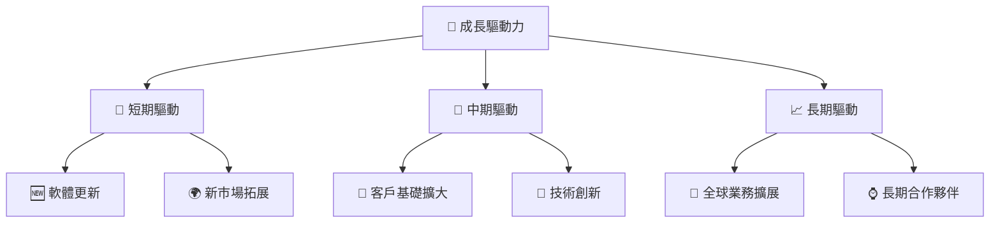

---

## 9. 風險矩陣

### 9.1 風險評分矩陣

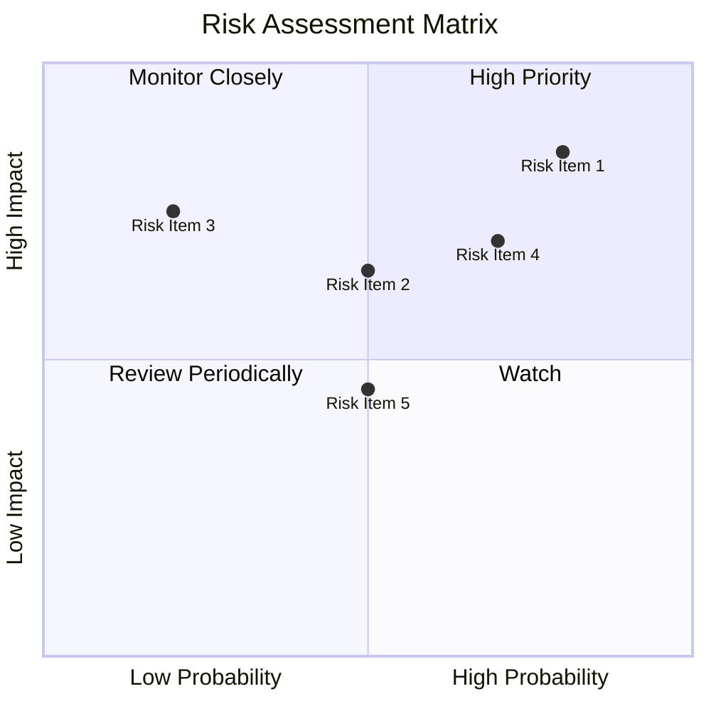

### 9.2 風險清單詳細分析

| # | 風險項目 | 發生機率 | 財務衝擊 | 風險評分 | 緩解措施 |
|---|----------|----------|----------|----------|----------|
| 1 | 🔴 **市場競爭加劇** | 高 (80%) | 高 (-10%收入) | 🔴 8.5/10 | 持續技術創新，加強市場營銷 |
| 2 | 🟡 **經濟不確定性** | 中 (50%) | 中 (-5%收入) | 🟡 6.5/10 | 擴大客戶群，分散風險 |
| 3 | 🟡 **高估值風險** | 低 (20%) | 高 (-15%市值) | 🟡 7.5/10 | 提升利潤率，增強投資者信心 |

---

## 10. 投資建議

### 10.1 最終綜合評級雷達圖

```
╔══════════════════════════════════════════════════════════════╗
║                  最終綜合評級雷達圖                          ║
╠══════════════════════════════════════════════════════════════╣
║  綜合評分：9.2/10  ▓▓▓▓▓▓▓▓▓▓▓▓▓▓▓▓▓▓▓▓▓▓▓▓▓▓▓▓▓▓▓▓▓▓▓▓▓░░  ║
╚══════════════════════════════════════════════════════════════╝
```

### 10.2 目標價與隱含報酬率

| 情境 | 目標價 | 隱含報酬率 | 機率權重 |
|------|--------|------------|----------|
| 樂觀 | $260 | +83% | 30% |
| 基準 | $220 | +55% | 50% |
| 悲觀 | $186 | +31% | 20% |

### 10.3 買入時機與觸發因素

```
╔══════════════════════════════════════════════════════════════════╗
║                  ✅ 買入觸發因素 Checklist                      ║
╠══════════════════════════════════════════════════════════════════╣
║                                                                  ║
║  立即買入觸發條件（多數符合）：                                  ║
║  ✅ 收入增長超過 50%                                              ║
║  ✅ 毛利率維持在 80% 以上                                         ║
║                                                                  ║
║  加碼觸發條件（出現以下任一）：                                  ║
║  ☐ 新市場成功進入                                               ║
║  ☐ 大型合同簽訂                                                 ║
║                                                                  ║
║  減碼/停損觸發條件（出現以下任一）：                             ║
║  ☐ 市場份額顯著下降                                             ║
║  ☐ 估值顯著高於歷史區間                                         ║
╚══════════════════════════════════════════════════════════════════╝
```

### 10.4 投資人適配度分析

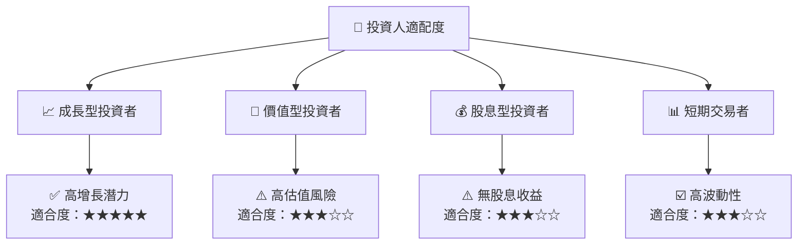

### 10.5 關鍵監控指標

| 監控類型 | 指標 | 關注點 | 頻率 |
|----------|------|--------|------|
| 成長指標 | 收入增長率 | 超過行業平均 | 季度 |
| 獲利指標 | 毛利率 | 保持在 80% 以上 | 季度 |
| 市場指標 | 市場份額 | 保持或增加 | 半年 |
| 估值指標 | P/E Ratio | 高於歷史區間 | 每月 |

---

> **免責聲明**：本報告為 AI 自動生成，僅供研究參考，不構成投資建議。投資有風險，入市需謹慎。