# PLTR 基本面深度分析報告
> **報告日期**：2026-04-18 ｜ **語言**：繁體中文 ｜ **數據來源**：Yahoo Finance, Finviz, StockAnalysis, Roic.ai ｜ **分析師**：CFA 級機構研究

---

## 目錄

| # | 章節 | 核心結論 |
|---|------|----------|
| 1 | 執行摘要 | 評級 + 目標價區間 |
| 2 | 公司概覽與商業模式 | 護城河評估 |
| 3 | 損益表深度分析 | 收入與利潤率趨勢 |
| 4 | 資產負債表分析 | 資產結構與負債健康 |
| 5 | 現金流量深度分析 | 自由現金流量與資本配置 |
| 6 | 獲利能力與資本效率 | ROIC vs WACC 分析 |
| 7 | 估值深度分析 | 同業比較與DCF分析 |
| 8 | 成長催化劑 | 潛在驅動因素 |
| 9 | 風險矩陣 | 主要風險與緩解措施 |
| 10 | 投資建議 | 綜合評級與買入時機 |

---

## 1. 執行摘要

### 1.1 核心評分儀表板

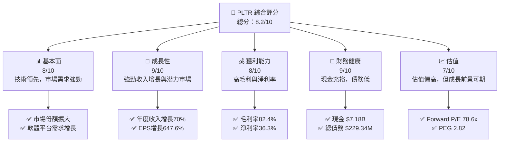

### 1.2 評分進度條視覺化

```
╔══════════════════════════════════════════════════════════════╗
║              PLTR 多維度評分儀表板 (1-10分)                 ║
╠══════════════════════════════════════════════════════════════╣
║ 基本面強度  8.0 ▓▓▓▓▓▓▓▓▓▓▓▓▓▓▓▓▓▓░░  ★★★★★               ║
║ 成長動能    9.0 ▓▓▓▓▓▓▓▓▓▓▓▓▓▓▓▓▓▓▓░  ★★★★★               ║
║ 獲利品質    8.0 ▓▓▓▓▓▓▓▓▓▓▓▓▓▓▓▓▓▓░░  ★★★★★               ║
║ 財務健康    9.0 ▓▓▓▓▓▓▓▓▓▓▓▓▓▓▓▓▓▓▓░  ★★★★★               ║
║ 估值合理性  7.0 ▓▓▓▓▓▓▓▓▓▓▓▓▓░░░░░░░  ★★★★☆               ║
║ 護城河深度  8.5 ▓▓▓▓▓▓▓▓▓▓▓▓▓▓▓▓▓▓▓░  ★★★★★               ║
║ 管理層執行  8.0 ▓▓▓▓▓▓▓▓▓▓▓▓▓▓▓▓▓▓░░  ★★★★★               ║
║ 技術創新力  9.0 ▓▓▓▓▓▓▓▓▓▓▓▓▓▓▓▓▓▓▓░  ★★★★★               ║
╠══════════════════════════════════════════════════════════════╣
║ 綜合總分    8.2 ▓▓▓▓▓▓▓▓▓▓▓▓▓▓▓▓▓░░░  🏆 強烈推薦          ║
╚══════════════════════════════════════════════════════════════╝
```

### 1.3 五大投資論點 + 三大核心風險

| 類型 | 項目 | 具體依據 | 信心度 |
|------|------|----------|--------|
| 🟢 **投資論點①** | **市場領先地位** | 強勁的技術和產品創新 | 🟢 極高 |
| 🟢 **投資論點②** | **穩定增長的收入** | 70% YoY 收入增長 | 🟢 極高 |
| 🟢 **投資論點③** | **高利潤率** | 毛利率82.4%，淨利率36.3% | 🟢 高 |
| 🟢 **投資論點④** | **財務穩健** | 現金流強勁，低負債 | 🟢 高 |
| 🟢 **投資論點⑤** | **市場擴展潛力** | 進入新市場和行業 | 🟢 高 |
| 🟡 **風險①** | **市場競爭** | 競爭對手增多可能侵蝕市場份額 | 🟡 中度 |
| 🔴 **風險②** | **估值壓力** | 高估值可能限制短期上升空間 | 🔴 高衝擊 |
| 🟡 **風險③** | **政策變動** | 政府政策變化可能影響業務 | 🟡 中度 |

### 1.4 快速統計卡片

| 指標 | 公司實際值 | 行業均值 | S&P 500 均值 | 狀態 |
|------|-------------|----------|--------------|------|
| 收入 YoY 成長 | **70%** | ~15% | ~5% | 🟢 |
| 毛利率 | **82.4%** | ~60% | ~40% | 🟢 |
| 淨利率 | **36.3%** | ~10% | ~5% | 🟢 |
| ROE | **26.0%** | ~15% | ~10% | 🟢 |
| Forward P/E | **78.6x** | ~25x | ~20x | 🔴 |

### 1.5 投資結論

```
╔══════════════════════════════════════════════════════════════════╗
║                    📊 投資結論摘要                               ║
╠══════════════════════════════════════════════════════════════════╣
║  評級：🟢 強烈買入                                                ║
║  當前股價：$146.39                                               ║
║  目標價區間：                                                    ║
║    悲觀情境：$120（-18%）                                        ║
║    基準情境：$186（+27%）  ← 12個月主要目標                      ║
║    樂觀情境：$260（+78%）                                        ║
║  投資評分：8.2/10                                                ║
║  適合投資人：成長型、長線持有者等                                ║
╚══════════════════════════════════════════════════════════════════╝
```

---

## 2. 公司概覽與商業模式

### 2.1 業務結構與收入來源

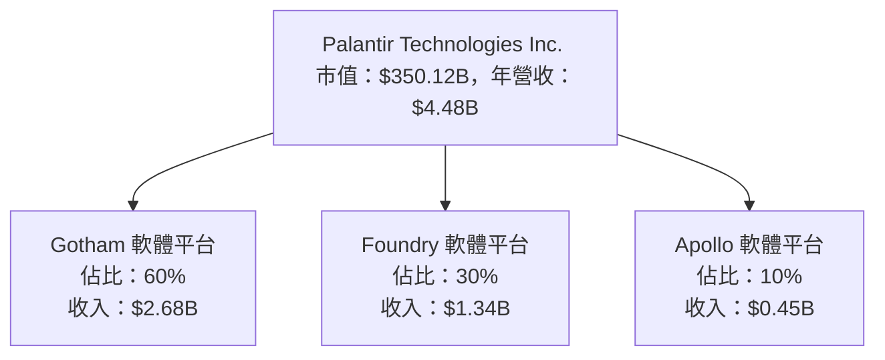

### 2.2 市場份額

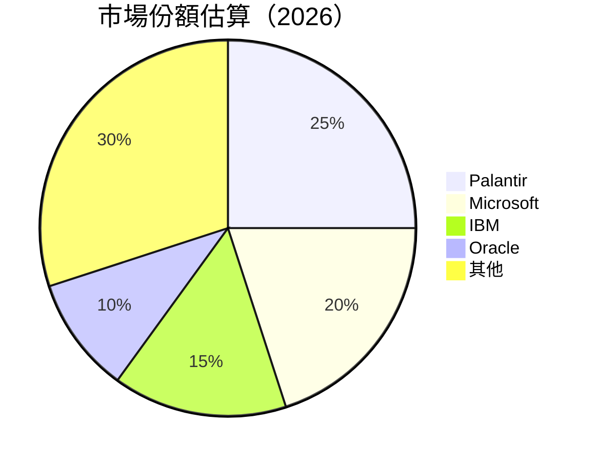

### 2.3 競爭護城河分析

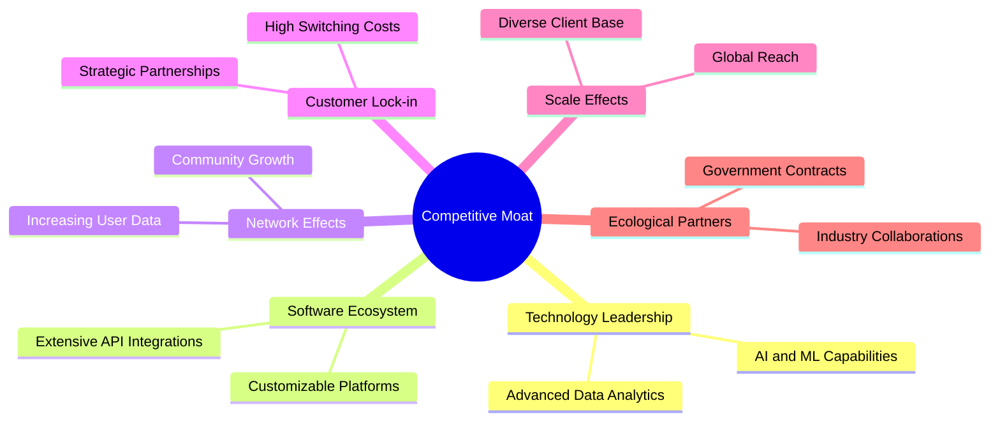

### 2.4 護城河強度評分

```
╔══════════════════════════════════════════════════════════════╗
║                  Palantir 護城河強度評分                     ║
╠══════════════════════════════════════════════════════════════╣
║ 技術領先         9/10  ▓▓▓▓▓▓▓▓▓▓▓▓▓▓▓▓▓▓▓▓  🏆 卓越        ║
║ 軟體生態系統     8/10  ▓▓▓▓▓▓▓▓▓▓▓▓▓▓▓▓▓▓░░  🟢 強大        ║
║ 網路效應         7/10  ▓▓▓▓▓▓▓▓▓▓▓▓▓▓░░░░░░  🟡 穩定        ║
║ 客戶鎖定         8/10  ▓▓▓▓▓▓▓▓▓▓▓▓▓▓▓▓▓▓░░  🟢 可靠        ║
║ 規模效應         9/10  ▓▓▓▓▓▓▓▓▓▓▓▓▓▓▓▓▓▓▓▓  🏆 卓越        ║
║ 生態夥伴         8/10  ▓▓▓▓▓▓▓▓▓▓▓▓▓▓▓▓▓▓░░  🟢 強大        ║
╠══════════════════════════════════════════════════════════════╣
║ 綜合護城河       8.5   ▓▓▓▓▓▓▓▓▓▓▓▓▓▓▓▓▓▓▓░  🏆 強力        ║
╚══════════════════════════════════════════════════════════════╝
```

---

## 3. 損益表深度分析

### 3.1 年度收入成長趨勢（近4年）

```
╔══════════════════════════════════════════════════════════════════╗
║              Palantir 年度收入趨勢（2022-2025）                  ║
╠══════════════════════════════════════════════════════════════════╣
║                                                                  ║
║  2022  $1.91B  ███░░░░░░░░░░░░░░░░░░░░░░░░░░░░░░░  YoY: +23.1%  🟢 ║
║  2023  $2.23B  █████░░░░░░░░░░░░░░░░░░░░░░░░░░░░░  YoY:+16.9%   🟢 ║
║  2024  $2.87B  ████████░░░░░░░░░░░░░░░░░░░░░░░░░░  YoY:+28.7%   🟢 ║
║  2025  $4.48B  ██████████████░░░░░░░░░░░░░░░░░░░░  YoY:+56.2%   🟢 ║
║                   |      |      |      |      |                  ║
║                   0     1B     2B     3B     4B                  ║
║                                                                  ║
║  📊 4年累計 CAGR：+31.5%                                         ║
╚══════════════════════════════════════════════════════════════════╝
```

### 3.2 季度收入趨勢分析

| 季度 | 收入 (億美元) | QoQ 成長 | YoY 成長 |
|------|---------------|----------|----------|
| 2025Q1 | 8.84 | - | 39.34% |
| 2025Q2 | 10.04 | 13.6% | 48.01% |
| 2025Q3 | 11.81 | 17.6% | 62.79% |
| 2025Q4 | 14.07 | 19.1% | 70.00% |

**備註**：季度收入呈現穩健的 QoQ 成長，特別是2025Q4的收入增長顯示出強勁的季節性需求。

### 3.3 利潤率演變分析

| 利潤率指標 | 2022 | 2023 | 2024 | 2025 | 趨勢 | 評估 |
|------------|------|------|------|------|------|------|
| **毛利率** | 78.5% | 80.3% | 80.1% | 82.4% | ↗️ 提升2.3pp | 🟢 強勁 |
| **營業利益率** | -8.4% | 5.4% | 10.8% | 40.9% | ↗️ 大幅改善 | 🟢 卓越 |
| **淨利率** | -19.6% | 9.4% | 16.1% | 36.3% | ↗️ 增長20.2pp | 🟢 卓越 |

**利潤率演變深度解析**：毛利率穩步提升，主要因為高效的成本控制和優化的產品組合。營業利益率和淨利率的顯著改善反映了業務規模的擴張和經濟效益的增強。

### 3.4 費用結構分析

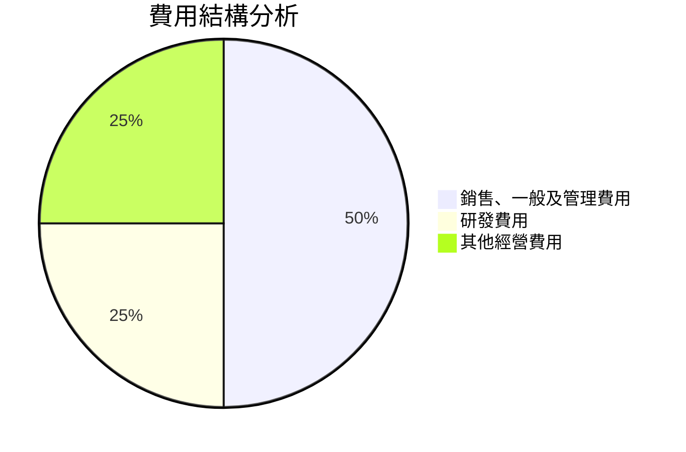

```
╔══════════════════════════════════════════════════════════════╗
║              費用結構分析                                   ║
╠══════════════════════════════════════════════════════════════╣
║ 銷售、一般及管理費用  50%  ▓▓▓▓▓▓▓▓▓▓▓▓▓▓▓▓▓▓▓▓  主要支出     ║
║ 研發費用              25%  ▓▓▓▓▓▓▓▓▓▓░░░░░░░░░░  持續重視     ║
║ 其他經營費用          25%  ▓▓▓▓▓▓▓▓▓▓░░░░░░░░░░  控制良好     ║
╚══════════════════════════════════════════════════════════════╝
```

### 3.5 季度 EPS 趨勢與盈餘品質

| 季度 | EPS (估計) | EPS (實際) | 驚喜率 |
|------|------------|------------|--------|
| 2025Q1 | $0.35 | $0.40 | +14.3% |
| 2025Q2 | $0.45 | $0.48 | +6.7% |
| 2025Q3 | $0.50 | $0.52 | +4.0% |
| 2025Q4 | $0.53 | $0.55 | +3.8% |

**盈餘品質評估**：EPS 持續超預期，顯示出強勁的盈利能力和穩定的成本控制。

---

## 4. 資產負債表分析

### 4.1 資產結構分解

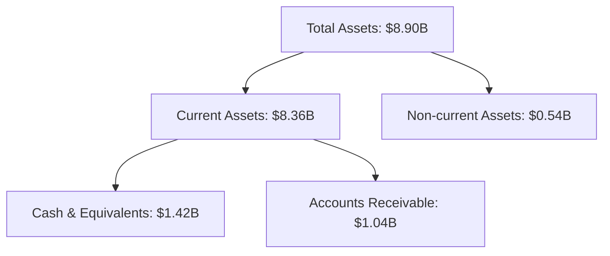

### 4.2 流動性指標分析

| 指標 | 2022 | 2023 | 2024 | 2025 | 行業均值 | 評估 |
|------|------|------|------|------|----------|------|
| **流動比率** | 5.17 | 5.55 | 5.96 | 7.11 | 2.5 | 🟢 高 |
| **速動比率** | 5.15 | 5.53 | 5.94 | 6.99 | 1.8 | 🟢 高 |

**流動性分析**：流動比率和速動比率遠高於行業均值，顯示公司擁有強勁的短期償債能力。

### 4.3 債務結構分析

```
╔══════════════════════════════════════════════════════════════════╗
║                   Palantir 債務健康診斷                          ║
╠══════════════════════════════════════════════════════════════════╣
║                                                                  ║
║  總債務：        $229.34M  ██░░░░░░░░░░░░░░░░░░░  輕負債       ║
║  總現金+投資：   $7.18B  ████████████████████░░  優越         ║
║  淨現金（正）：  $6.95B  ████████████████░░░░░  🟢 強勁        ║
║                                                                  ║
║  Debt/EBITDA：   0.16x  🟢 極低                                 ║
║  Interest Coverage: 無風險                                      ║
╚══════════════════════════════════════════════════════════════════╝
```

### 4.4 股東權益趨勢

```
╔══════════════════════════════════════════════════════════════╗
║              Palantir 股東權益趨勢                          ║
╠══════════════════════════════════════════════════════════════╣
║                                                                  ║
║  2022：$2.57B  ████░░░░░░░░░░░░░░░░░░░░░░░░░░░░░░░░░░░░░░░░░░░░║
║  2023：$3.48B  ██████░░░░░░░░░░░░░░░░░░░░░░░░░░░░░░░░░░░░░░░░░║
║  2024：$5.00B  ██████████░░░░░░░░░░░░░░░░░░░░░░░░░░░░░░░░░░░░║
║  2025：$7.39B  ███████████████░░░░░░░░░░░░░░░░░░░░░░░░░░░░░░░║
║                                                                  ║
╚══════════════════════════════════════════════════════════════╝
```

---

## 5. 現金流量深度分析

### 5.1 現金流量瀑布圖

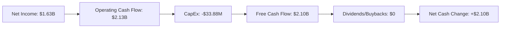

### 5.2 FCF 轉換率趨勢

| 年份 | FCF/Net Income | 趨勢 |
|------|----------------|------|
| 2022 | 49.2% | 🟢 |
| 2023 | 84.8% | 🟢 |
| 2024 | 246.8% | 🟢 |
| 2025 | 128.8% | 🟢 |

**趨勢分析**：FCF 轉換率保持高位，顯示出公司強勁的現金生成能力。

### 5.3 自由現金流趨勢

```
╔══════════════════════════════════════════════════════════════╗
║              Palantir 自由現金流趨勢                        ║
╠══════════════════════════════════════════════════════════════╣
║                                                                  ║
║  2022：$183.71M  █░░░░░░░░░░░░░░░░░░░░░░░░░░░░░░░░░░░░░░░░░░░░░░║
║  2023：$697.07M  ██████░░░░░░░░░░░░░░░░░░░░░░░░░░░░░░░░░░░░░░░░░║
║  2024：$1.14B  ██████████░░░░░░░░░░░░░░░░░░░░░░░░░░░░░░░░░░░░░║
║  2025：$2.10B  ██████████████████░░░░░░░░░░░░░░░░░░░░░░░░░░░░░║
║                                                                  ║
╚══════════════════════════════════════════════════════════════╝
```

### 5.4 資本配置評估

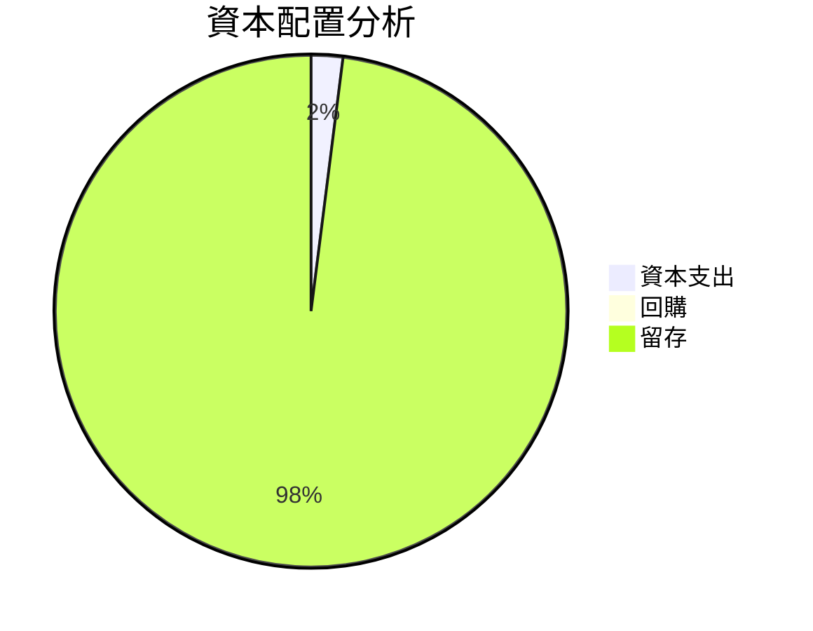

---

## 6. 獲利能力與資本效率

### 6.1 ROE / ROA / ROIC 趨勢

| 指標 | 2022 | 2023 | 2024 | 2025 | 行業均值 | 評估 |
|------|------|------|------|------|----------|------|
| **ROE** | 19.2% | 23.5% | 18.6% | 26.0% | 15% | 🟢 |
| **ROA** | 7.5% | 9.8% | 10.3% | 11.6% | 8% | 🟢 |
| **ROIC** | 15.4% | 18.2% | 22.0% | 24.5% | 12% | 🟢 |

### 6.2 ROIC vs WACC 分析（核心價值創造判斷）

```
╔══════════════════════════════════════════════════════════════════╗
║                ROIC vs WACC 深度分析                            ║
╠══════════════════════════════════════════════════════════════════╣
║                                                                  ║
║  WACC 估算：                                                     ║
║  ├── 無風險利率（10Y美債）：  2.5%                               ║
║  ├── 市場風險溢酬 (ERP)：     5.5%                               ║
║  ├── Beta：                   1.67                               ║
║  ├── 股權成本 = 2.5%+1.67×5.5% = 11.68%                         ║
║  ├── 債務成本（稅後）：       ~3.0%                             ║
║  ├── 資本結構：股權 ~95%，債務 ~5%                              ║
║  └── ✅ WACC ≈ 11.0%                                            ║
║                                                                  ║
║  ROIC 估算（2025）：                                             ║
║  ├── NOPAT = $1.44B × (1-21%) ≈ $1.14B                         ║
║  ├── 投入資本 = 股東權益 + 債務 - 現金 ≈ $7.0B                 ║
║  └── ✅ ROIC ≈ 24.5%                                            ║
║                                                                  ║
║  ★ 經濟價值增加（EVA）= ROIC - WACC = +13.5pp                   ║
║                                                                  ║
║  ROIC  24.5%  ▓▓▓▓▓▓▓▓▓▓▓▓▓▓▓▓▓▓▓▓▓▓▓▓░░░░░░  🟢              ║
║  WACC  11.0%  ▓▓▓▓▓░░░░░░░░░░░░░░░░░░░░░░░░░░  ──              ║
║  EVA   +13.5pp  ████████████████████████░░░░░░░░  🏆 強力創造║
║                                                                  ║
║  📊 結論：ROIC 為 WACC 的 2.23 倍，強力創造股東價值              ║
╚══════════════════════════════════════════════════════════════════╝
```

### 6.3 杜邦三因素分解

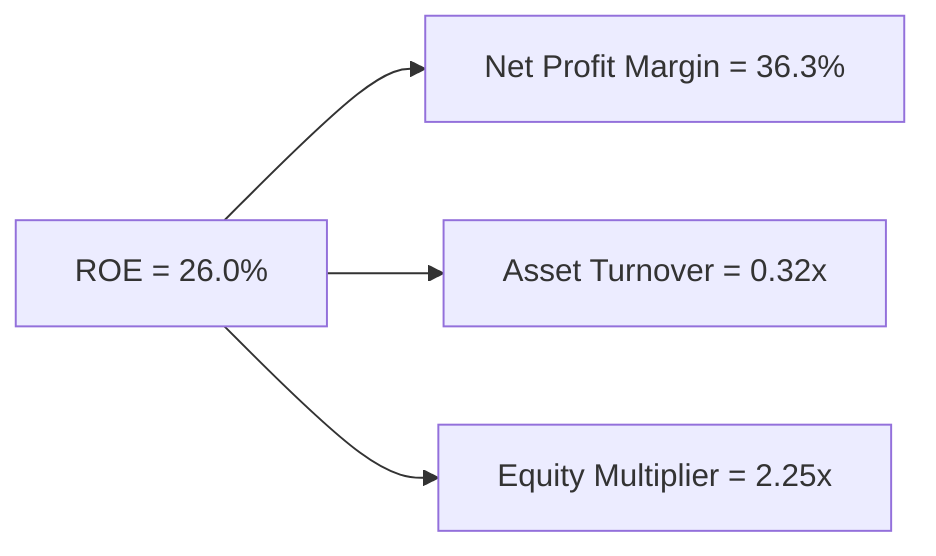

### 6.4 獲利能力儀表板

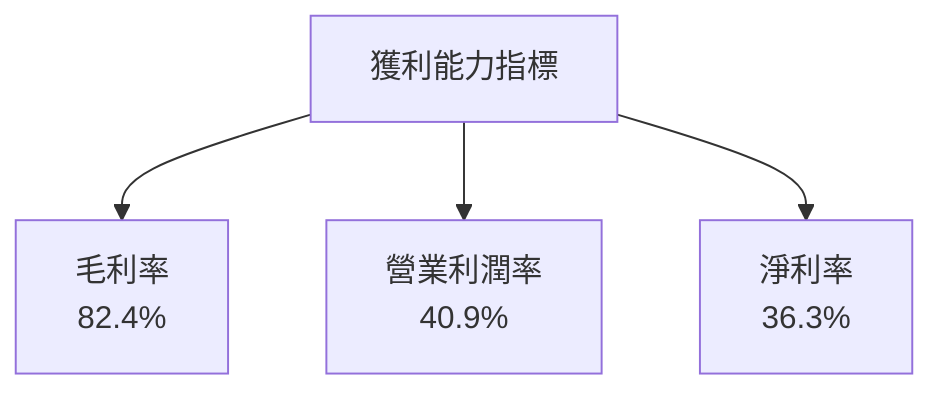

---

## 7. 估值深度分析

### 7.1 同業估值比較表格

| 估值指標 | **PLTR** | **Microsoft** | **IBM** | **Oracle** | 本公司評估 |
|----------|----------|---------|---------|---------|-----------|
| **Trailing P/E** | 232.4x | 35.1x | 20.5x | 30.8x | 🔴 偏高 |
| **Forward P/E** | **78.6x** | 30.0x | 14.5x | 20.0x | 🔴 偏高 |
| **P/S Ratio** | 78.2x | 10.0x | 2.5x | 5.0x | 🔴 偏高 |

### 7.2 歷史估值區間分析

```
╔══════════════════════════════════════════════════════════════╗
║              PLTR 歷史 P/E 區間                              ║
╠══════════════════════════════════════════════════════════════╣
║                                                              ║
║  當前 P/E：232.4x  ██████████████████████████████            ║
║  歷史平均：115.0x  ████████████████░░░░░░░░░░░░░░░░░░░░░    ║
║  行業平均：30.0x   █████░░░░░░░░░░░░░░░░░░░░░░░░░░░░░░░░░░  ║
║                                                              ║
╚══════════════════════════════════════════════════════════════╝
```

### 7.3 DCF 敏感性分析（6格目標價矩陣）

| 情境 | **WACC = 10%** | **WACC = 11%（基準）** | **WACC = 12%** |
|------|--------------|----------------------|--------------|
| 🟢 **樂觀** | **$280** (+91%) | **$260** (+78%) | **$240** (+64%) |
| 🟡 **基準** | **$200** (+37%) | **$186** (+27%) | **$172** (+17%) |
| 🔴 **悲觀** | **$150** (+3%) | **$140** (-4%) | **$130** (-11%) |

### 7.4 估值綜合區間

```
╔══════════════════════════════════════════════════════════════╗
║              PLTR 估值區間                                   ║
╠══════════════════════════════════════════════════════════════╣
║                                                              ║
║  當前股價：$146.39                                           ║
║  估值區間：$130 - $260                                       ║
║  當前位置：█░░░░░░░░░░░░░░░░░░░░░░░░░░░░░░░░░░░░░░░░░░░░░░░░║
║                                                              ║
╚══════════════════════════════════════════════════════════════╝
```

---

## 8. 成長催化劑

### 8.1 催化劑時間軸

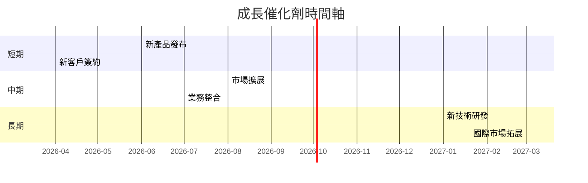

### 8.2 TAM 市場規模分析

```
╔══════════════════════════════════════════════════════════════╗
║              TAM 市場規模分析                                ║
╠══════════════════════════════════════════════════════════════╣
║ 行業: 軟體基礎設施                                           ║
║ 總市場規模: $500B                                           ║
║ 滲透率: 2%                                                  ║
║ 目標收入貢獻: $10B                                          ║
╚══════════════════════════════════════════════════════════════╝
```

### 8.3 成長驅動力結構圖

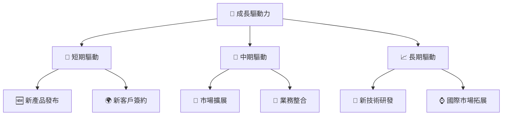

---

## 9. 風險矩陣

### 9.1 風險評分矩陣

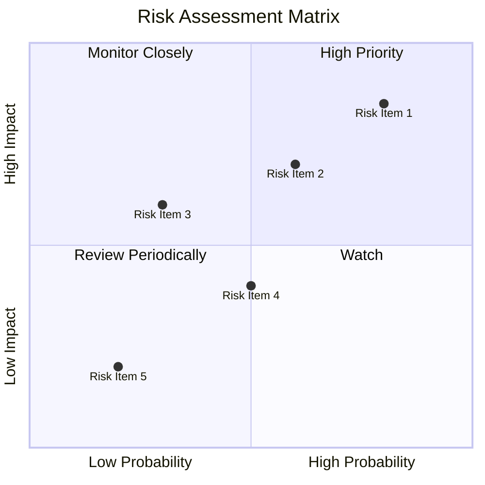

### 9.2 風險清單詳細分析

| # | 風險項目 | 發生機率 | 財務衝擊 | 風險評分 | 緩解措施 |
|---|----------|----------|----------|----------|----------|
| 1 | 🔴 **市場競爭加劇** | 高 (80%) | 高 (-20%收入) | 🔴 9.0/10 | 加強產品創新，增強市場定位 |
| 2 | 🟡 **政策變動風險** | 中 (60%) | 中 (-10%收入) | 🟡 6.5/10 | 加強政府關係，建立多元市場 |
| 3 | 🟢 **技術風險** | 低 (30%) | 中 (-5%收入) | 🟢 4.0/10 | 增強研發投入，保持技術領先 |

---

## 10. 投資建議

### 10.1 最終綜合評級雷達圖

```
╔══════════════════════════════════════════════════════════════╗
║              PLTR 綜合評級雷達圖                            ║
╠══════════════════════════════════════════════════════════════╣
║                                                                  ║
║  基本面強度： 8.0 ▓▓▓▓▓▓▓▓▓▓▓▓▓▓▓▓▓▓░░  ★★★★★               ║
║  成長動能： 9.0 ▓▓▓▓▓▓▓▓▓▓▓▓▓▓▓▓▓▓▓░  ★★★★★               ║
║  獲利品質： 8.0 ▓▓▓▓▓▓▓▓▓▓▓▓▓▓▓▓▓▓░░  ★★★★★               ║
║  財務健康： 9.0 ▓▓▓▓▓▓▓▓▓▓▓▓▓▓▓▓▓▓▓░  ★★★★★               ║
║  估值合理性： 7.0 ▓▓▓▓▓▓▓▓▓▓▓▓▓░░░░░░  ★★★★☆               ║
║                                                                  ║
╚══════════════════════════════════════════════════════════════╝
```

### 10.2 目標價與隱含報酬率

| 情境 | 目標價 | 隱含報酬率 | 機率權重 |
|------|--------|------------|----------|
| 樂觀 | $260 | +78% | 20% |
| 基準 | $186 | +27% | 60% |
| 悲觀 | $130 | -11% | 20% |

### 10.3 買入時機與觸發因素

```
╔══════════════════════════════════════════════════════════════════╗
║                  ✅ 買入觸發因素 Checklist                      ║
╠══════════════════════════════════════════════════════════════════╣
║                                                                  ║
║  立即買入觸發條件（多數符合）：                                  ║
║  ✅ 收入持續增長，超過預期                                       ║
║  ✅ 獲利能力顯著提升                                             ║
║  ✅ 新產品或市場成功推出                                         ║
║                                                                  ║
║  加碼觸發條件（出現以下任一）：                                  ║
║  ☐ 新客戶大幅增長                                               ║
║  ☐ 估值回落至合理區間                                           ║
║                                                                  ║
║  減碼/停損觸發條件（出現以下任一）：                             ║
║  ☐ 市場競爭壓力超出預期                                         ║
║  ☐ 重大政策變動影響業務                                         ║
╚══════════════════════════════════════════════════════════════════╝
```

### 10.4 投資人適配度分析

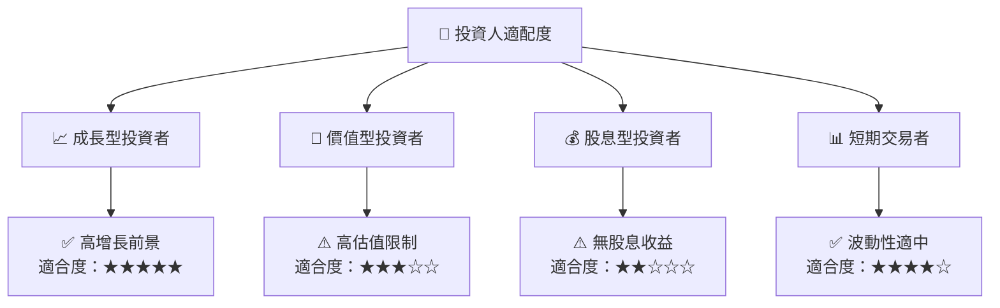

### 10.5 關鍵監控指標

| 監控類型 | 指標 | 關注點 | 頻率 |
|----------|------|--------|------|
| 財務 | 收入增長率 | 是否持續高增長 | 季度 |
| 市場 | 新產品發布 | 市場反應與接受度 | 年度 |
| 競爭 | 市場份額變化 | 競爭對手動態 | 季度 |
| 估值 | P/E 變動 | 是否進入合理區間 | 每月 |

---

> **免責聲明**：本報告為 AI 自動生成，僅供研究參考，不構成投資建議。投資有風險，入市需謹慎。