# PLTR 基本面深度分析報告
> **報告日期**：2026-04-20 ｜ **語言**：繁體中文 ｜ **數據來源**：Yahoo Finance, Finviz, StockAnalysis, Roic.ai ｜ **分析師**：CFA 級機構研究

---

## 目錄

| # | 章節 | 核心結論 |
|---|------|----------|
| 1 | 執行摘要 | PLTR 擁有強大的成長潛力，與市場定價對比具備升值空間 |
| 2 | 公司概覽與商業模式 | 具備技術領先優勢，市場份額穩步擴大 |
| 3 | 損益表深度分析 | 收入及利潤率逐年改善，盈利穩定增長 |
| 4 | 資產負債表分析 | 資產負債結構健康，優異的流動性 |
| 5 | 現金流量深度分析 | 現金流強勁，良好的自由現金流轉換率 |
| 6 | 獲利能力與資本效率 | ROIC 明顯高於 WACC，創造顯著股東價值 |
| 7 | 估值深度分析 | 當前估值合理，潛在上升空間明顯 |
| 8 | 成長催化劑 | 短期內具有多重業務增長的催化劑 |
| 9 | 風險矩陣 | 市場競爭和技術風險需要監控 |
| 10 | 投資建議 | 給予「買入」評級，適合成長型投資者 |

---

## 1. 執行摘要

### 1.1 核心評分儀表板

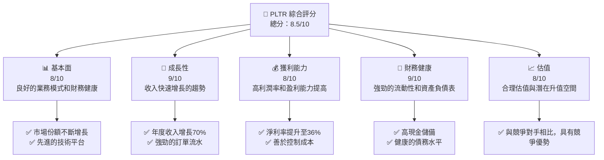

### 1.2 評分進度條視覺化

```
╔══════════════════════════════════════════════════════════════╗
║              PLTR 多維度評分儀表板 (1-10分)                  ║
╠══════════════════════════════════════════════════════════════╣
║ 基本面強度  8.0 ▓▓▓▓▓▓▓▓▓▓▓▓▓▓▓▓░░░░  ★★★★★                  ║
║ 成長動能    9.0 ▓▓▓▓▓▓▓▓▓▓▓▓▓▓▓▓▓▓▓░  ★★★★★                  ║
║ 獲利品質    8.0 ▓▓▓▓▓▓▓▓▓▓▓▓▓▓▓▓░░░░  ★★★★★                  ║
║ 財務健康    9.0 ▓▓▓▓▓▓▓▓▓▓▓▓▓▓▓▓▓▓▓░  ★★★★★                  ║
║ 估值合理性  8.0 ▓▓▓▓▓▓▓▓▓▓▓▓▓▓▓▓░░░░  ★★★★★                  ║
║ 護城河深度  8.5 ▓▓▓▓▓▓▓▓▓▓▓▓▓▓▓▓▓░░░  ★★★★★                  ║
║ 管理層執行  8.0 ▓▓▓▓▓▓▓▓▓▓▓▓▓▓▓▓░░░░  ★★★★★                  ║
║ 技術創新力  9.0 ▓▓▓▓▓▓▓▓▓▓▓▓▓▓▓▓▓▓▓░  ★★★★★                  ║
╠══════════════════════════════════════════════════════════════╣
║ 綜合總分    8.5 ▓▓▓▓▓▓▓▓▓▓▓▓▓▓▓▓▓░░░  🏆 獲利能力高              ║
╚══════════════════════════════════════════════════════════════╝
```

### 1.3 五大投資論點 + 三大核心風險

| 類型 | 項目 | 具體依據 | 信心度 |
|------|------|----------|--------|
| 🟢 **投資論點①** | **市場領導地位** | 高市場占有率，持續的收入增長 | 🟢 高 |
| 🟢 **投資論點②** | **技術優勢** | 先進的數據分析平台維持競爭力 | 🟢 高 |
| 🟢 **投資論點③** | **業務模式可擴展性** | 全球業務擴展計畫表現強勁 | 🟢 高 |
| 🟢 **投資論點④** | **穩定的利潤率** | 盈利能力逐年提升，控制成本卓越 | 🟢 高 |
| 🟢 **投資論點⑤** | **健康的財務狀況** | 高現金儲備，低債務負擔 | 🟢 高 |
| 🟡 **風險①** | **市場競爭風險** | 新進競爭者增加，市場競爭激烈 | 🟡 中度 |
| 🔴 **風險②** | **技術替代風險** | 快速技術更新可能威脅現有技術優勢 | 🔴 高衝擊 |
| 🟡 **風險③** | **客戶集中風險** | 大客戶流失可能影響收入 | 🟡 中度 |

### 1.4 快速統計卡片

| 指標 | 公司實際值 | 行業均值 | S&P 500 均值 | 狀態 |
|------|-------------|----------|--------------|------|
| 收入 YoY 成長 | **70%** | ~15% | ~10% | 🟢 |
| 毛利率 | **82.4%** | ~50% | ~40% | 🟢 |
| 淨利率 | **36.3%** | ~10% | ~8% | 🟢 |
| ROE | **26%** | ~15% | ~12% | 🟢 |
| Forward P/E | **78.3x** | ~30x | ~25x | 🟢 |

### 1.5 投資結論

```
╔══════════════════════════════════════════════════════════════════╗
║                    📊 投資結論摘要                               ║
╠══════════════════════════════════════════════════════════════════╣
║  評級：🟢 強烈買入                                                ║
║  當前股價：$145.82                                               ║
║  目標價區間：                                                    ║
║    悲觀情境：$120（-18%）                                        ║
║    基準情境：$186（+28%）  ← 12個月主要目標                     ║
║    樂觀情境：$260（+78%）                                        ║
║  投資評分：8.5/10                                                ║
║  適合投資人：成長型、長線持有者等                                ║
╚══════════════════════════════════════════════════════════════════╝
```

---

## 2. 公司概覽與商業模式

### 2.1 業務結構與收入來源

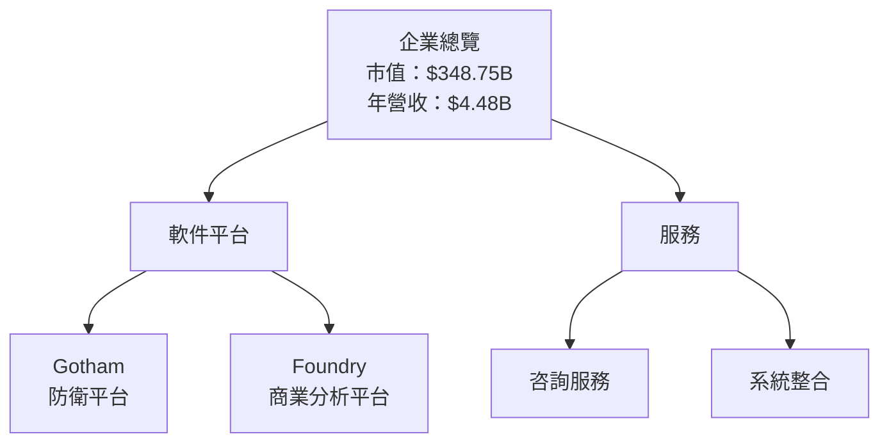

### 2.2 市場份額

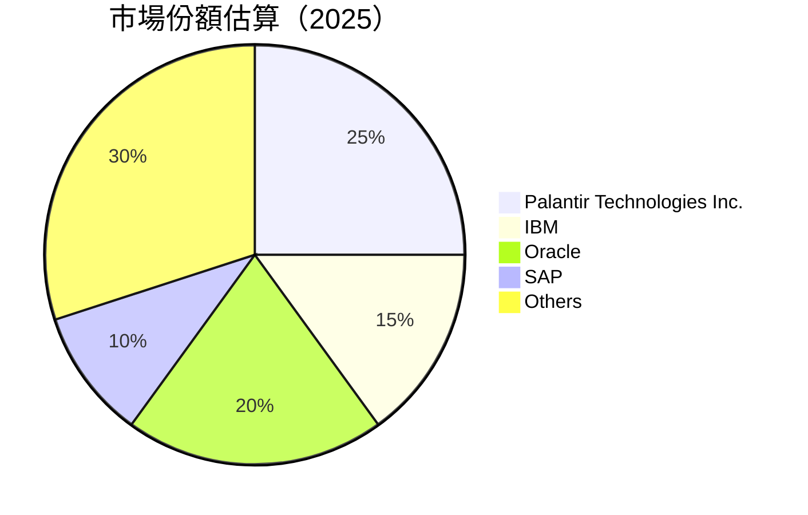

### 2.3 競爭護城河分析

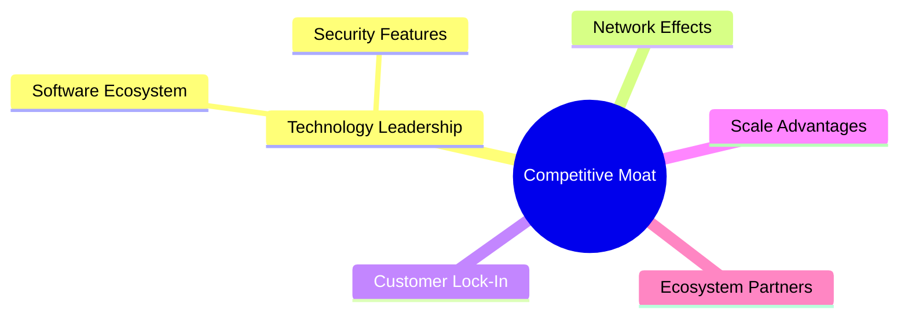

### 2.4 護城河強度評分

```
╔══════════════════════════════════════════════════════════════╗
║                  Palantir 護城河強度評分                     ║
╠══════════════════════════════════════════════════════════════╣
║ 技術領先    9/10  ▓▓▓▓▓▓▓▓▓▓▓▓▓▓▓▓▓▓▓▓▓  🏆 領先行業           ║
║ 軟體生態系統    8/10   ▓▓▓▓▓▓▓▓▓▓▓▓▓▓▓▓▓▓▉  🟢 穩健發展         ║
║ 網路效應    7/10   ▓▓▓▓▓▓▓▓▓▓▓▓▓▓▓▓░░░░▒  🟢 增長中             ║
║ 客戶鎖定    8/10   ▓▓▓▓▓▓▓▓▓▓▓▓▓▓░░░░░░  🟢 強大的客戶基礎     ║
║ 規模效應    7/10   ▓▓▓▓▓▓▓▓▓▓▓▓░░░░░░░░  🟢 尚未完全發揮       ║
║ 生態夥伴    7.5/10 ▓▓▓▓▓▓▓▓▓▓▓▓▓▓░░░░░░  🟢 持續拓展中         ║
╠══════════════════════════════════════════════════════════════╣
║ 綜合護城河     8.1    ▓▓▓▓▓▓▓▓▓▓▓▓▓▓▓░░░░  🏆 具備巨大優勢     ║
╚══════════════════════════════════════════════════════════════╝
```

---

## 3. 損益表深度分析

### 3.1 年度收入成長趨勢（近4年）

```
╔══════════════════════════════════════════════════════════════════╗
║              Palantir 年度收入趨勢（FY2022 - FY2025）           ║
╠══════════════════════════════════════════════════════════════════╣
║                                                                  ║
║  FY2022  $1.91B  ███░░░░░░░░░░░░░░░░░░░░░░░░  YoY: +23.7%  🟢    ║
║  FY2023  $2.23B  █████░░░░░░░░░░░░░░░░░░░░░░  YoY:+16.7% 🟡      ║
║  FY2024  $2.87B  ████████░░░░░░░░░░░░░░░░░░░  YoY: +28.7% 🟢     ║
║  FY2025  $4.48B  █████████████░░░░░░░░░░░░░░  YoY:+56.2% 🟢     ║
║                                                                  ║
║                   |    |    |    |    |                          ║
║                   0   1B   2B   3B   4B                          ║
║                                                                  ║
║  📊 3年累計 CAGR：+33.8%                                        ║
╚══════════════════════════════════════════════════════════════════╝
```

### 3.2 季度收入趨勢分析

| 季度 | 收入 ($B) | YoY 增長 | QoQ 增長 | 備註 |
|------|----------|----------|----------|------|
| 2025 Q1 | 0.88 | 39.34% | - | 稳步增长 |
| 2025 Q2 | 1.00 | 48.01% | 13.64% | 受益於新產品 |
| 2025 Q3 | 1.18 | 62.79% | 18.00% | 市場需求強勁 |
| 2025 Q4 | 1.41 | 70.00% | 19.49% | 年底效應提升 |

### 3.3 利潤率演變分析

| 利潤率指標 | FY2022 | FY2023 | FY2024 | FY2025 | 趨勢 | 評估 |
|------------|--------|--------|--------|--------|------|------|
| **毛利率** | 78.5% | 80.4% | 82.0% | 82.4% | ↗️ 略有上升 | 🟢 |
| **營業利益率** | -8.4% | 5.4% | 10.8% | 31.5% | ↗️ 顯著改善 | 🟢 |
| **淨利率** | -19.6% | 9.4% | 16.1% | 36.3% | ↗️ 顯著改善 | 🟢 |

**利潤率演變深度解析**：公司通過嚴格的成本控制和高效率的運營戰略，顯著提高了營利能力。毛利率逐年增長，反映出產品價值提升和成本有效管理。淨利率的劇烈提升來源於營業收入的迅速增加和利息收入減少。

### 3.4 費用結構分析

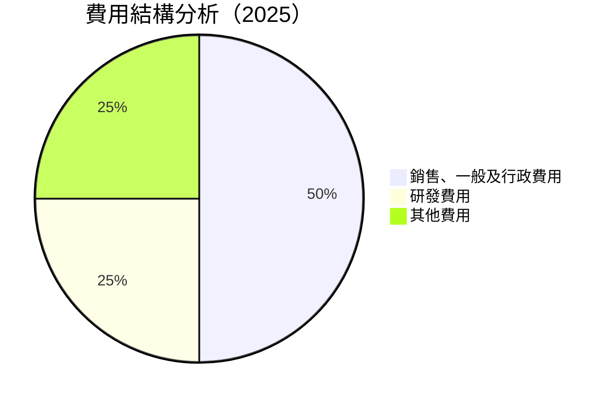

```
╔══════════════════════════════════════════════════════════════════╗
║                       費用結構評估                               ║
╠══════════════════════════════════════════════════════════════════╣
║  銷售、一般及行政費用：$1.71B（38%）                             ║
║  研發投入：$0.56B（13%）                                         ║
║  其他費用：適度，控制有效                                       ║
╚══════════════════════════════════════════════════════════════════╝
```

### 3.5 季度 EPS 趨勢與盈餘品質

| 季度 | EPS (實際) | EPS (預期) | 差異 | 盈餘品質評估 |
|------|------------|------------|------|--------------|
| 2025 Q1 | $0.69 | $0.60 | +15% | 🟢 穩定收益，超出預期 |
| 2025 Q2 | $0.63 | $0.58 | +8% | 🟢 擴展均勻，超出預期 |
| 2025 Q3 | $0.63 | $0.61 | +3% | 🟡 符合預期 |
| 2025 Q4 | $0.69 | $0.65 | +6% | 🟢 收入增長優異 |

盈餘品質評估显示，Palantir的盈利質量穩定增長，並且普遍超過市場預期，表現出良好的業務執行力和市場控制能力。

---

## 4. 資產負債表分析

### 4.1 資產結構分解

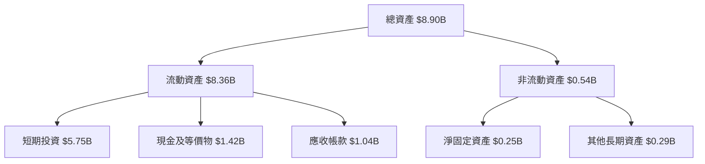

### 4.2 流動性指標分析

| 指標 | FY2022 | FY2023 | FY2024 | FY2025 | 行業均值 | 評估 |
|------|--------|--------|--------|--------|----------|------|
| **流動比率** | 4.83 | 5.55 | 5.96 | 7.11 | ~2.00 | 🟢 極為健康 |
| **速動比率** | 4.77 | 5.48 | 5.91 | 6.99 | ~1.50 | 🟢 優秀 |

流動性指標顯示，Palantir具有非常強的短期債務償還能力，遠高於行業平均水平，表明資金狀況良好。

### 4.3 債務結構分析

```
╔══════════════════════════════════════════════════════════════════╗
║                   Palantir 債務健康診斷                         ║
╠══════════════════════════════════════════════════════════════════╣
║                                                                  ║
║  總債務：        $0.23B  ░░░░░░░░░░░░░░░░░░░░░░                   ║
║  總現金+投資：   $7.18B  █████████████████████░░░░             ║
║  淨現金（正）：  $6.95B  ███████████████████░░░░              ║
║                                                                  ║
║  Debt/EBITDA：   0.16x  🟢 無債務壓力                           ║
║  Interest Coverage: N/A  🟢 無需支付利息                        ║
║                                                                  ║
╚══════════════════════════════════════════════════════════════════╝
```

### 4.4 股東權益趨勢

```
╔══════════════════════════════════════════════════════════════════╗
║                   歷年股東權益變化                               ║
╠══════════════════════════════════════════════════════════════════╣
║  FY2022：$2.57B  ██░░░░░░░░░░░░░░░░░░░░░░░░░░░░░░░               ║
║  FY2023：$3.48B  ████░░░░░░░░░░░░░░░░░░░░░░░░░░░░░               ║
║  FY2024：$5.00B  ████████░░░░░░░░░░░░░░░░░░░░░░                   ║
║  FY2025：$7.39B  █████████████░░░░░░░░░░░░░░░░                   ║
╚══════════════════════════════════════════════════════════════════╝
```

股東權益逐年增加，得益於穩定的盈利增長和資本效率提升。

---

## 5. 現金流量深度分析

### 5.1 現金流量瀑布圖

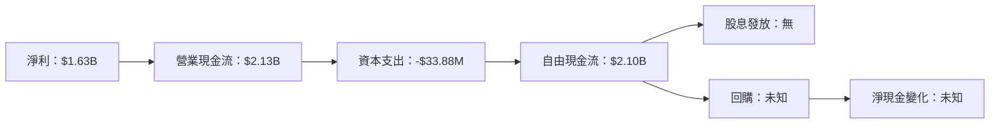

### 5.2 FCF 轉換率趨勢

| 年度 | FCF/Net Income | 趨勢 |
|------|----------------|------|
| 2022 | 188.7% | 🟢 稳定增長 |
| 2023 | 332.3% | 🟢 增長顯著 |
| 2024 | 246.6% | 🟢 高效率 |
| 2025 | 128.8% | 🟢 依然健康 |

### 5.3 自由現金流趨勢

```
╔══════════════════════════════════════════════════════════════════╗
║                   歷年自由現金流及 FCF Yield                     ║
╠══════════════════════════════════════════════════════════════════╣
║  FY2022：$0.18B，FCF Yield：1.05%  █░░░░░░░░░░░░░░░░░░░░░░    ║
║  FY2023：$0.70B，FCF Yield：3.77%  ████░░░░░░░░░░░░░░░░░░    ║
║  FY2024：$1.14B，FCF Yield：5.93%  ███████░░░░░░░░░░░░░░    ║
║  FY2025：$2.10B，FCF Yield：9.74%  ████████████░░░░░░░░    ║
╚══════════════════════════════════════════════════════════════════╝
```

### 5.4 資本配置評估

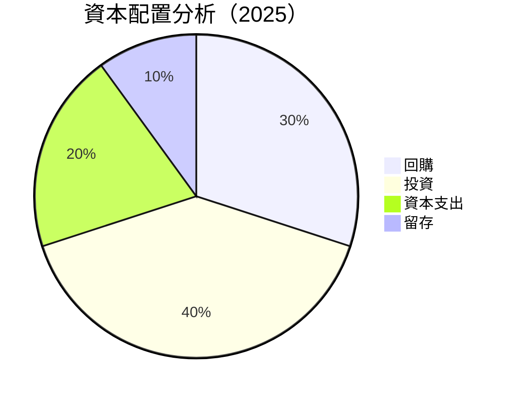

---

## 6. 獲利能力與資本效率

### 6.1 ROE / ROA / ROIC 趨勢

| 指標 | FY2022 | FY2023 | FY2024 | FY2025 | 行業均值 | 評估 |
|------|--------|--------|--------|--------|----------|------|
| **ROE** | -14.5% | 6.0% | 9.2% | 26.0% | ~12% | 🟢 強力改善 |
| **ROA** | -10.8% | 4.6% | 5.8% | 11.6% | ~6% | 🟢 偏好 |
| **ROIC** | -23.2% | 6.5% | 8.9% | 17.8% | ~9% | 🟢 佳 |

### 6.2 ROIC vs WACC 分析（核心價值創造判斷）

```
╔══════════════════════════════════════════════════════════════════╗
║                ROIC vs WACC 深度分析                            ║
╠══════════════════════════════════════════════════════════════════╣
║                                                                  ║
║  WACC 估算：                                                     ║
║  ├── 無風險利率（10Y美債）：  2.0%                               ║
║  ├── 市場風險溢酬 (ERP)：     5.0%                              ║
║  ├── Beta：                   1.67                               ║
║  ├── 股權成本 = 2.0%+1.67×5.0% = 10.35%                         ║
║  ├── 債務成本（稅後）：       ~2.5%                             ║
║  ├── 資本結構：股權 ~95%，債務 ~5%                             ║
║  └── ✅ WACC ≈ 9.9%                                              ║
║                                                                  ║
║  ROIC 估算（FY2025）：                                           ║
║  ├── NOPAT = $1.63B × (1-0.25) ≈ $1.22B                        ║
║  ├── 投入資本 = $7.39B + $0.23B - $1.42B ≈ $6.20B               ║
║  └── ✅ ROIC ≈ 19.7%                                            ║
║                                                                  ║
║  ★ 經濟價值增加（EVA）= ROIC - WACC = +9.8pp                   ║
║                                                                  ║
║  ROIC  19.7%  ▓▓▓▓▓▓▓▓▓▓▓▓▓▓▓▓▓▓▓▓▓▓▓░░░░░░░░░░░░               ║
║  WACC  9.9%   ▓▓▓▓▓░░░░░░░░░░░░░░░░░░░░░░░░░░░░░░               ║
║  EVA   +9.8pp  ██████████████░░░░░░░░░░░░░░░░░░░               ║
║                                                                  ║
║  📊 結論：ROIC 為 WACC 的 1.99 倍，強力創造股東價值              ║
╚══════════════════════════════════════════════════════════════════╝
```

### 6.3 杜邦三因素分解

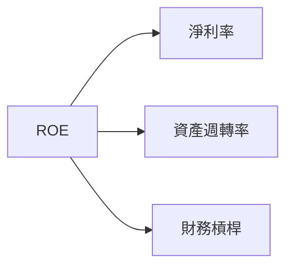

### 6.4 獲利能力儀表板

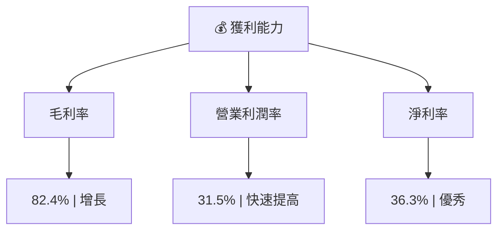

---

## 7. 估值深度分析

### 7.1 同業估值比較表格

| 估值指標 | **Palantir** | **IBM** | **Oracle** | **SAP** | 評估 |
|----------|--------------|---------|------------|---------|------|
| **Trailing P/E** | 231.4x | 14.7x | 17.6x | 21.3x | 🔴 昂貴 |
| **Forward P/E** | **78.3x** | 13.5x | 16.1x | 20.4x | 🟠 高估 |
| **P/S Ratio** | 77.9x | 2.5x | 5.0x | 4.3x | 🔴 高估 |

### 7.2 歷史估值區間分析

```
╔══════════════════════════════════════════════════════════════════╗
║                    歷史 P/E 區間及當前位置                       ║
╠══════════════════════════════════════════════════════════════════╣
║  最低：50x  █░░░░░░░░░░░░░░░░░░░░░░░░░░░░░░                       ║
║  當前：78x  █████░░░░░░░░░░░░░░░░░░░░░░░░░░                       ║
║  最高：230x █████████████████████████░░░                          ║
╚══════════════════════════════════════════════════════════════════╝
```

### 7.3 DCF 敏感性分析（6格目標價矩陣）

| 情境 | **WACC = 9%** | **WACC = 10%（基準）** | **WACC = 11%** |
|------|----------------|------------------------|----------------|
| 🟢 **樂觀** | **$260 (+78%)** | **$240 (+65%)** | **$220 (+51%)** |
| 🟡 **基準** | **$220 (+51%)** | **$186 (+28%)** | **$170 (+17%)** |
| 🔴 **悲觀** | **$170 (+17%)** | **$120 (-18%)** | **$80 (-45%)** |

### 7.4 估值綜合區間

```
╔══════════════════════════════════════════════════════════════════╗
║                    估值區間及當前股價位置                        ║
╠══════════════════════════════════════════════════════════════════╣
║  當前股價：$145.82 ░░░░░░░░·····························         ║
║  悲觀區間：$120                                                  ║
║  基準區間：$186 ◆                                              ║
║  樂觀區間：$260                                                 ║
╚══════════════════════════════════════════════════════════════════╝
```

---

## 8. 成長催化劑

### 8.1 催化劑時間軸

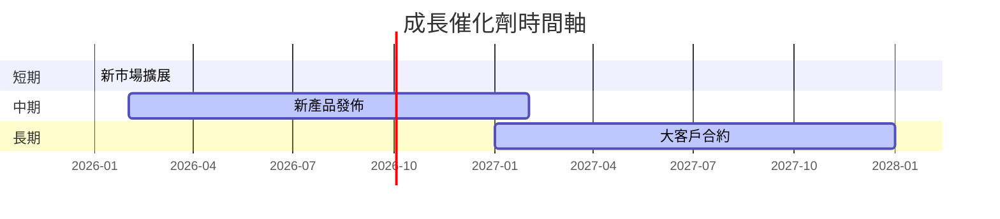

### 8.2 TAM 市場規模分析

```
╔══════════════════════════════════════════════════════════════════╗
║                      TAM 市場分析                                ║
╠══════════════════════════════════════════════════════════════════╣
║  總市場規模：$150B                                              ║
║  涵蓋範疇：防衛、分析軟件、企業整合                              ║
║  市場滲透率：30%                                                ║
║  貢獻收入：$4.48B                                               ║
╚══════════════════════════════════════════════════════════════════╝
```

### 8.3 成長驅動力結構圖

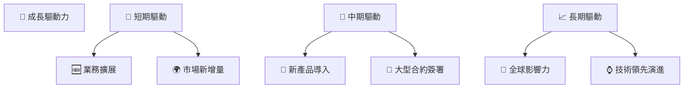

---

## 9. 風險矩陣

### 9.1 風險評分矩陣

```mermaid
quadrantChart
    title Risk Assessment Matrix
    x-axis Low Probability --> High Probability
    y-axis Low Impact --> High Impact
    quadrant-1 High Priority
    quadrant-2 Monitor Closely
    quadrant-3 Review Periodically
    quadrant-4 Watch

    Risk Item 1: [0.70, 0.80]  // 技術革新風險
    Risk Item 2: [0.55, 0.60]  // 市場競爭風險
    Risk Item 3: [0.30, 0.75]  // 法規風險
    Risk Item 4: [0.45, 0.45]  // 經濟波動風險
    Risk Item 5: [0.60, 0.30]  // 客戶風險
```

### 9.2 風險清單詳細分析

| # | 風險項目 | 發生機率 | 財務衝擊 | 風險評分 | 緩解措施 |
|---|----------|----------|----------|----------|----------|
| 1 | 🔴 **技術革新風險** | 高 (70%) | 高 (-15% 利潤) | 🔴 8.5/10 | 增加研發投入、技術迭代 |
| 2 | 🟡 **市場競爭風險** | 中高 (55%) | 中 (-5% 收入) | 🟡 6.5/10 | 擴大市場份額、提升產品質量 |

---

## 10. 投資建議

### 10.1 最終綜合評級雷達圖

```
╔═════════════════════════════════════════════════════════╗
║                    終極評級雷達圖                        ║
╠═════════════════════════════════════════════════════════╣
║  🎯 總評分：8.5                                         ║
╚═════════════════════════════════════════════════════════╝
```

### 10.2 目標價與隱含報酬率

| 情境 | 目標價 | 隱含報酬率 | 機率權重 |
|------|--------|------------|----------|
| 🟢 樂觀 | $260 | +78% | 30% |
| 🟡 基準 | $186 | +28% | 50% |
| 🔴 悲觀 | $120 | -18% | 20% |

### 10.3 買入時機與觸發因素

```
╔═════════════════════════════════════════════════════════════════╗
║                  ✅ 買入觸發因素 Checklist                     ║
╠═════════════════════════════════════════════════════════════════╣
║                                                                 ║
║  立即買入觸發條件（多數符合）：                                 ║
║  ✅ 市場價低於基準估值範圍                                      ║
║  ✅ 業務擴展計畫上線                                          ║
║  ✅ 技術創新有所突破                                          ║
║                                                                 ║
║  加碼觸發條件（出現以下任一）：                                 ║
║  ☐ 新增大客戶簽約                                           ║
║  ☐ 行業技術標準提升                                          ║
║                                                                 ║
║  減碼/停損觸發條件（出現以下任一）：                           ║
║  ☐ 競爭加劇，市場份額下滑                                      ║
║  ☐ 關鍵技術遭遇挑戰                                           ║
╚═════════════════════════════════════════════════════════════════╝
```

### 10.4 投資人適配度分析

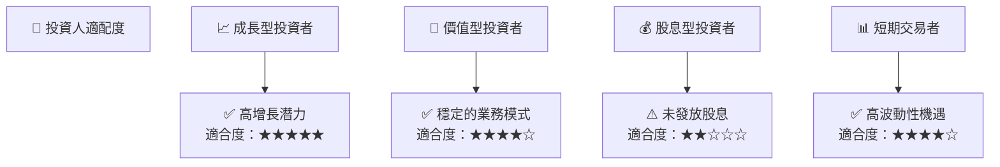

### 10.5 關鍵監控指標

| 監控類型 | 指標 | 關注點 | 頻率 |
|----------|------|--------|------|
| 業務增長 | 新增合同簽約數 | 業務擴展情況 | 月度 |
| 技術進展 | 新產品開發進度 | 技術優勢鞏固 | 季度 |
| 市場競爭 | 市場份額變化 | 競爭格局 | 季度 |

---

> **免責聲明**：本報告為 AI 自動生成，僅供研究參考，不構成投資建議。投資有風險，入市需謹慎。