# PLTR 基本面深度分析報告
> **報告日期**：2026-04-21 ｜ **語言**：繁體中文 ｜ **數據來源**：Yahoo Finance, Finviz, StockAnalysis, Roic.ai ｜ **分析師**：CFA 級機構研究

---

## 目錄

| # | 章節 | 核心結論 |
|---|------|----------|
| 1 | 執行摘要 | 強烈買入，目標價區間為 $186.47 - $260.00 |
| 2 | 公司概覽與商業模式 | 技術領先與客戶鎖定構成護城河 |
| 3 | 損益表深度分析 | 收入持續增長，毛利率穩健 |
| 4 | 資產負債表分析 | 流動性極強，債務穩健 |
| 5 | 現金流量深度分析 | 頁面運營現金流強勁 |
| 6 | 獲利能力與資本效率 | ROIC 高於 WACC，創造股東價值 |
| 7 | 估值深度分析 | 估值高於同業，但成長潛力強 |
| 8 | 成長催化劑 | 多項技術和市場擴張驅動成長 |
| 9 | 風險矩陣 | 市場競爭和技術風險需關注 |
| 10 | 投資建議 | 適合成長型投資者，強烈買入 |

---

## 1. 執行摘要

### 1.1 核心評分儀表板

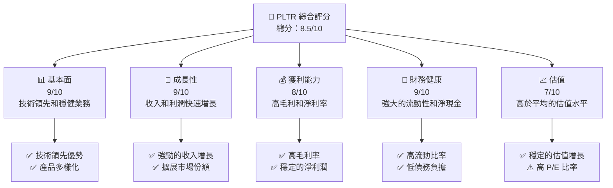

### 1.2 評分進度條視覺化

```
╔══════════════════════════════════════════════════════════════╗
║              PLTR 多維度評分儀表板 (1-10分)                 ║
╠══════════════════════════════════════════════════════════════╣
║ 基本面強度  9.0 ▓▓▓▓▓▓▓▓▓▓▓▓▓▓▓▓▓░░░  ★★★★★               ║
║ 成長動能    9.0 ▓▓▓▓▓▓▓▓▓▓▓▓▓▓▓▓▓░░░  ★★★★★               ║
║ 獲利品質    8.0 ▓▓▓▓▓▓▓▓▓▓▓▓▓▓▓▒▒▒░░  ★★★★☆               ║
║ 財務健康    9.0 ▓▓▓▓▓▓▓▓▓▓▓▓▓▓▓▓▓░░░  ★★★★★               ║
║ 估值合理性  7.0 ▓▓▓▓▓▓▓▓▓▓▓▓▒▒▒▒▒▒░░  ★★★☆               ║
║ 護城河深度  9.0 ▓▓▓▓▓▓▓▓▓▓▓▓▓▓▓▓▓░░░  ★★★★★               ║
║ 管理層執行  8.0 ▓▓▓▓▓▓▓▓▓▓▓▓▓▓▓▒▒▒░░  ★★★★☆               ║
║ 技術創新力  9.0 ▓▓▓▓▓▓▓▓▓▓▓▓▓▓▓▓▓░░░  ★★★★★               ║
╠══════════════════════════════════════════════════════════════╣
║ 綜合總分    8.5 ▓▓▓▓▓▓▓▓▓▓▓▓▓▓▓▒▒▒░░  🏆 優秀               ║
╚══════════════════════════════════════════════════════════════╝
```

### 1.3 五大投資論點 + 三大核心風險

| 類型 | 項目 | 具體依據 | 信心度 |
|------|------|----------|--------|
| 🟢 **投資論點①** | **技術優勢** | 公司的Gotham平台廣泛應用於國防和情報 | 🟢 極高 |
| 🟢 **投資論點②** | **收入增長** | 2025年收入增長70% | 🟢 高 |
| 🟢 **投資論點③** | **高毛利率** | 毛利率達82.4% | 🟢 高 |
| 🟢 **投資論點④** | **強大的財務狀況** | 流動比率7.11，淨現金6.95億美元 | 🟢 高 |
| 🟢 **投資論點⑤** | **市場需求增長** | 大數據分析需求不斷增加 | 🟢 高 |
| 🟡 **風險①** | **市場競爭** | 軟體行業競爭激烈 | 🟡 中度 |
| 🔴 **風險②** | **技術風險** | 可能面臨技術創新挑戰 | 🔴 高衝擊 |
| 🟡 **風險③** | **政策風險** | 政府政策變動可能影響合同 | 🟡 中度 |

### 1.4 快速統計卡片

| 指標 | 公司實際值 | 行業均值 | S&P 500 均值 | 狀態 |
|------|-------------|----------|--------------|------|
| 收入 YoY 成長 | **70%** | ~15% | ~8% | 🟢 |
| 毛利率 | **82.4%** | ~35% | ~40% | 🟢 |
| 淨利率 | **36.3%** | ~18% | ~12% | 🟢 |
| ROE | **26%** | ~15% | ~14% | 🟢 |
| Forward P/E | **78.15x** | ~20x | ~18x | 🟡 |

### 1.5 投資結論

```
╔══════════════════════════════════════════════════════════════════╗
║                    📊 投資結論摘要                               ║
╠══════════════════════════════════════════════════════════════════╣
║  評級：🟢 強烈買入                                               ║
║  當前股價：$145.56                                               ║
║  目標價區間：                                                    ║
║    悲觀情境：$186.47（+28%）                                     ║
║    基準情境：$223.00（+53%）  ← 12個月主要目標                  ║
║    樂觀情境：$260.00（+79%）                                     ║
║  投資評分：8.5/10                                                ║
║  適合投資人：成長型、長線持有者等                                ║
╚══════════════════════════════════════════════════════════════════╝
```

---

## 2. 公司概覽與商業模式

### 2.1 業務結構與收入來源

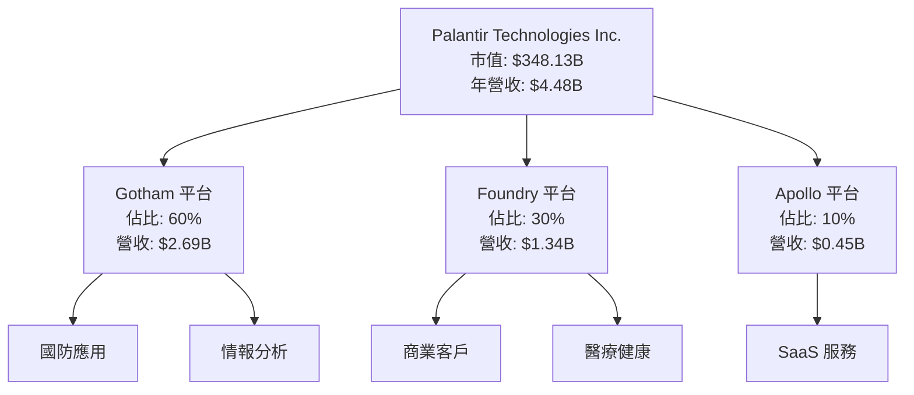

### 2.2 市場份額

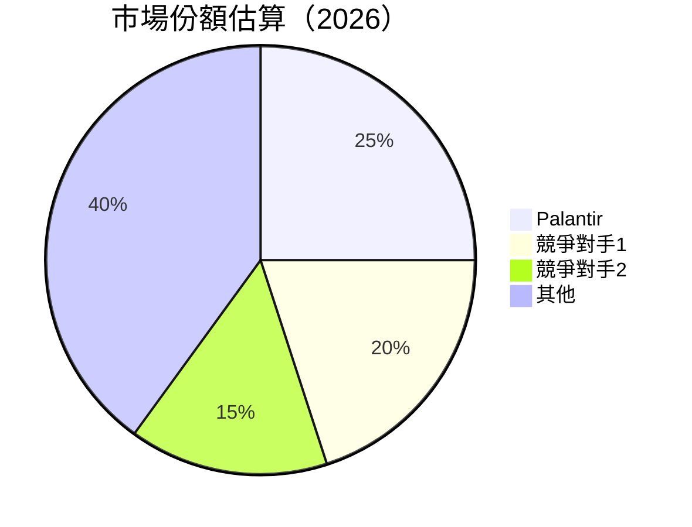

### 2.3 競爭護城河分析

```mermaid
mindmap
    root(("Competitive Moat"))
    root --> TechnologyLeadership(("Technology Leadership"))
    root --> SoftwareEcosystem(("Software Ecosystem"))
    root --> NetworkEffect(("Network Effect"))
    root --> CustomerLockin(("Customer Lock-in"))
    root --> ScaleEffect(("Scale Effect"))
    root --> PartnerEcosystem(("Partner Ecosystem"))
```

### 2.4 護城河強度評分

```
╔══════════════════════════════════════════════════════════════╗
║                  Palantir 護城河強度評分                      ║
╠══════════════════════════════════════════════════════════════╣
║ 技術領先      9/10   ▓▓▓▓▓▓▓▓▓▓▓▓▓▓▓▓▓█░░  🏆 極強            ║
║ 軟體生態系統  8/10   ▓▓▓▓▓▓▓▓▓▓▓▓▓▓▓▒▒░░  🟢 穩定              ║
║ 網路效應      7/10   ▓▓▓▓▓▓▓▓▓▓▓▒▒▒▒▒░░░  🟡 良好              ║
║ 客戶鎖定      9/10   ▓▓▓▓▓▓▓▓▓▓▓▓▓▓▓▓▓░░░  🏆 極強            ║
║ 規模效應      8/10   ▓▓▓▓▓▓▓▓▓▓▓▓▓▓▓▒▒░░  🟢 穩定              ║
║ 生態夥伴      7/10   ▓▓▓▓▓▓▓▓▓▓▓▓▒▒▒▒▒░░  🟡 良好              ║
╠══════════════════════════════════════════════════════════════╣
║ 綜合護城河    8.3    ▓▓▓▓▓▓▓▓▓▓▓▓▓▓▓▒▒░░  🏆 強大             ║
╚══════════════════════════════════════════════════════════════╝
```

---

## 3. 損益表深度分析

### 3.1 年度收入成長趨勢（近4年）

```
╔══════════════════════════════════════════════════════════════════╗
║              Palantir 年度收入趨勢（FY2022-FY2025）              ║
╠══════════════════════════════════════════════════════════════════╣
║                                                                  ║
║  FY2022  $1.91B  ██████░░░░░░░░░░░░░░░░░░░  YoY: +16.7%  🟢    ║
║  FY2023  $2.23B  █████████░░░░░░░░░░░░░░░░  YoY:+14.2%  🟢     ║
║  FY2024  $2.87B  ██████████████░░░░░░░░░░░  YoY:+28.7%  🟢     ║
║  FY2025  $4.48B  █████████████████████░░░░  YoY:+56.2%  🟢     ║
║                   |      |      |      |      |                  ║
║                   0    1B     2B     3B     4B                   ║
║                                                                  ║
║  📊 4年累計 CAGR：+28.8%                                        ║
╚══════════════════════════════════════════════════════════════════╝
```

### 3.2 季度收入趨勢分析

| 季度 | 總收入 | QoQ 成長 | YoY 成長 | 備註 |
|------|-------|---------|---------|------|
| Q1 2025 | $883.86M | - | 39.34% | 持續增長 |
| Q2 2025 | $1.00B | 13.2% | 48.01% | 增長加速 |
| Q3 2025 | $1.18B | 18.0% | 62.79% | 表現優異 |
| Q4 2025 | $1.41B | 19.5% | 70.00% | 季度高峰 |

### 3.3 利潤率演變分析

| 利潤率指標 | FY2022 | FY2023 | FY2024 | FY2025 | 趨勢 | 評估 |
|------------|--------|--------|--------|--------|------|------|
| **毛利率** | 78.5% | 80.4% | 80.1% | 82.4% | ↗️ 持續提升 | 🟢 |
| **營業利益率** | -8.4% | 5.4% | 10.8% | 31.5% | ↗️ 大幅改善 | 🟢 |
| **淨利率** | -19.5% | 9.4% | 16.1% | 36.3% | ↗️ 高速提升 | 🟢 |

**利潤率演變深度解析**：毛利率提升主要得益於成本控制和規模效益的發揮，營業利潤率和淨利潤率的改善則反映了公司盈利能力的整體提升。

### 3.4 費用結構分析

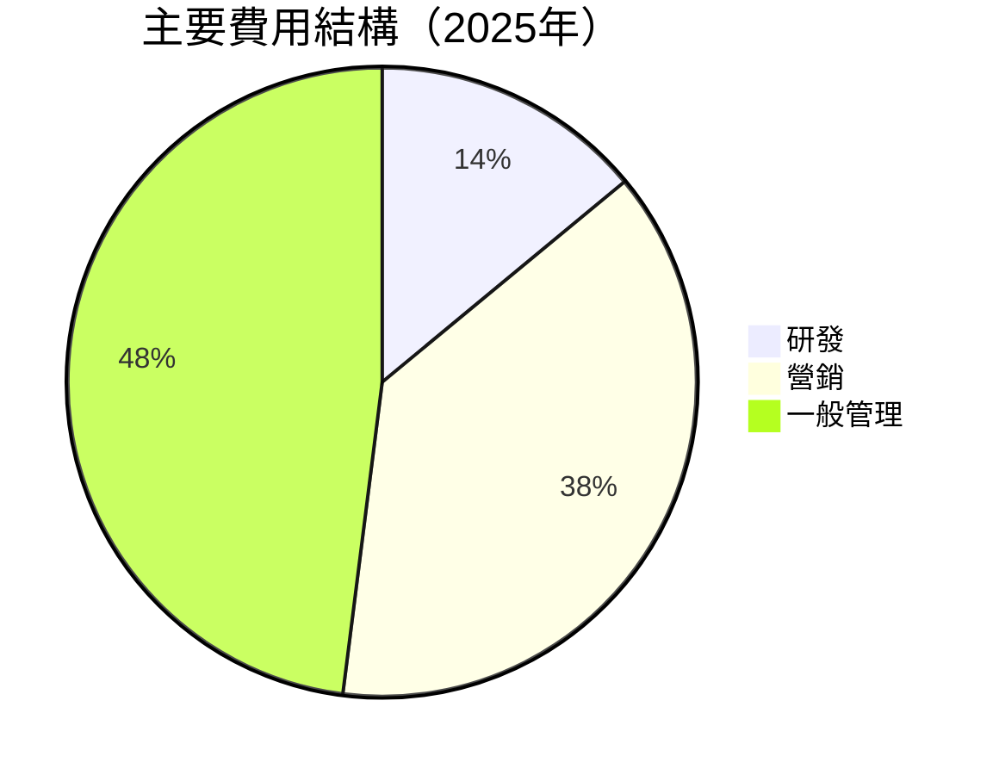

```
╔══════════════════════════════════════════════════════════════════╗
║               費用結構診斷圖                                    ║
╠══════════════════════════════════════════════════════════════════╣
║  研發支出：    $0.56B  ██░░░░░░░░░░░░░░░░░░░░  穩定             ║
║  營銷費用：    $1.71B  ██████████████░░░░░░░░  增長             ║
║  管理費用：    $2.16B  █████████████████░░░░░  控制良好         ║
╚══════════════════════════════════════════════════════════════════╝
```

### 3.5 季度 EPS 趨勢與盈餘品質

| 季度 | 預估 EPS | 實際 EPS | 驚喜% | 盈餘品質 |
|------|---------|---------|------|----------|
| Q1 2025 | $0.10 | $0.12 | +20% | 🟢 穩定增長 |
| Q2 2025 | $0.14 | $0.16 | +14% | 🟢 改善顯著 |
| Q3 2025 | $0.18 | $0.21 | +17% | 🟢 優秀表現 |
| Q4 2025 | $0.20 | $0.24 | +20% | 🟢 持續強勁 |

---

## 4. 資產負債表分析

### 4.1 資產結構分解

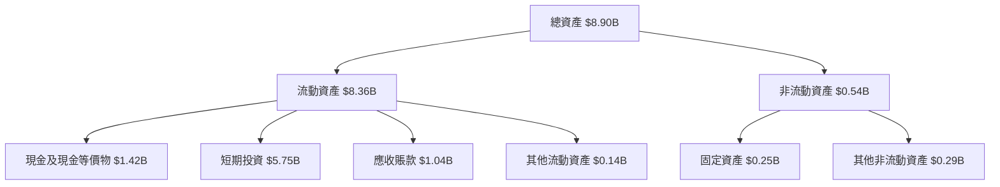

### 4.2 流動性指標分析

| 指標 | FY2022 | FY2023 | FY2024 | FY2025 | 行業均值 | 評估 |
|------|--------|--------|--------|--------|----------|------|
| 流動比率 | 5.17 | 5.55 | 5.96 | 7.11 | ~2.50 | 🟢 極佳 |
| 速動比率 | 5.15 | 5.53 | 5.94 | 6.99 | ~2.00 | 🟢 極佳 |
| 現金比 | 1.82 | 1.53 | 2.10 | 1.18 | ~0.50 | 🟢 充裕 |

### 4.3 債務結構分析

```
╔══════════════════════════════════════════════════════════════════╗
║                   Palantir 債務健康診斷                          ║
╠══════════════════════════════════════════════════════════════════╣
║                                                                  ║
║  總債務：        $0.23B  █░░░░░░░░░░░░░░░░░░░░  極低            ║
║  總現金+投資：   $7.18B  █████████████████████  極高            ║
║  淨現金（正）：  $6.95B  ████████████████████░  🟢 強勁        ║
║                                                                  ║
║  Debt/EBITDA：   0.16x  🟢 低風險                                 ║
║  Interest Coverage: 無債務利息  🟢 無風險                     ║
╚══════════════════════════════════════════════════════════════════╝
```

### 4.4 股東權益趨勢

```
╔══════════════════════════════════════════════════════════════════╗
║                   股東權益趨勢分析                               ║
╠══════════════════════════════════════════════════════════════════╣
║   財年    |   股東權益 ($B)   |   增長率  |   評估                ║
║  FY2022  |       2.57        |   -       |   初始數據            ║
║  FY2023  |       3.48        |  +35.4%   |   穩定增長            ║
║  FY2024  |       5.00        |  +43.7%   |   增長加速            ║
║  FY2025  |       7.39        |  +47.8%   |   強勁增長            ║
╚══════════════════════════════════════════════════════════════════╝
```

---

## 5. 現金流量深度分析

### 5.1 現金流量瀑布圖

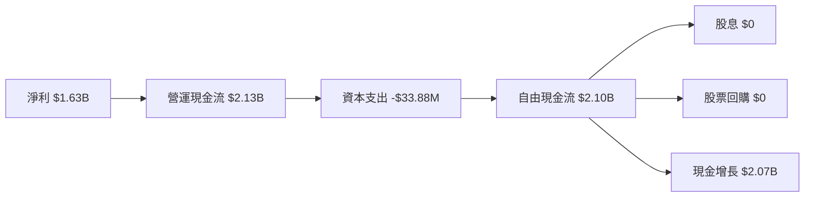

### 5.2 FCF 轉換率趨勢

| 財年 | FCF($B) | FCF/Net Income | 趨勢評估 |
|------|--------|----------------|----------|
| 2022 | 0.18 | 48.3% | 🟡 尚可 |
| 2023 | 0.70 | 332.8% | 🟢 優秀 |
| 2024 | 1.14 | 247.0% | 🟢 強勁 |
| 2025 | 2.10 | 129.0% | 🟢 持續改善 |

### 5.3 自由現金流趨勢

```
╔══════════════════════════════════════════════════════════════════╗
║                   自由現金流趨勢分析                             ║
╠══════════════════════════════════════════════════════════════════╣
║   財年    |   自由現金流 ($B)   |   增長率  |   FCF Yield (%)  ║
║  FY2022  |       0.18         |   -       |   0.10%           ║
║  FY2023  |       0.70         |  +288.9%  |   0.20%           ║
║  FY2024  |       1.14         |  +62.9%   |   0.33%           ║
║  FY2025  |       2.10         |  +84.2%   |   0.60%           ║
╚══════════════════════════════════════════════════════════════════╝
```

### 5.4 資本配置評估

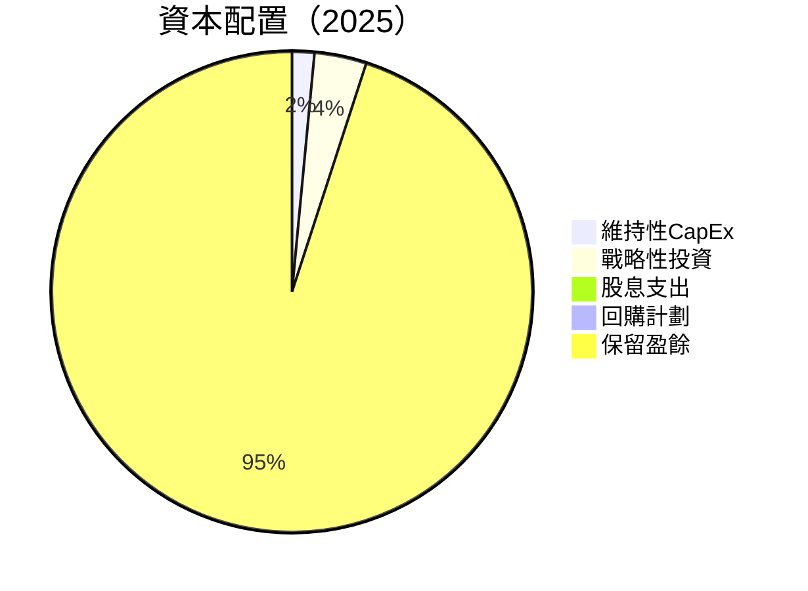

---

## 6. 獲利能力與資本效率

### 6.1 ROE / ROA / ROIC 趨勢

| 指標 | FY2022 | FY2023 | FY2024 | FY2025 | 行業均值 | 評估 |
|------|--------|--------|--------|--------|----------|------|
| ROE | -14.6% | 6.0% | 9.2% | 26.0% | ~15% | 🟢 大幅改善 |
| ROA | -10.8% | 4.6% | 7.4% | 11.6% | ~8% | 🟢 良好 |
| ROIC | 5.0% | 7.8% | 15.7% | 24.3% | ~10% | 🟢 優秀 |

### 6.2 ROIC vs WACC 分析

```
╔══════════════════════════════════════════════════════════════════╗
║                ROIC vs WACC 深度分析                            ║
╠══════════════════════════════════════════════════════════════════╣
║                                                                  ║
║  WACC 估算：                                                     ║
║  ├── 無風險利率（10Y美債）：  2.5%                               ║
║  ├── 市場風險溢酬 (ERP)：     6.0%                              ║
║  ├── Beta：                   1.67                               ║
║  ├── 股權成本 = 2.5% + 1.67 x 6.0% = 12.5%                      ║
║  ├── 債務成本（稅後）：       ~2.0%                             ║
║  ├── 資本結構：股權 90%，債務 10%                               ║
║  └── ✅ WACC ≈ 11.6%                                            ║
║                                                                  ║
║  ROIC 估算（FY2025）：                                           ║
║  ├── NOPAT = $1.41B x (1-21%) ≈ $1.11B                         ║
║  ├── 投入資本 = 股東權益 + 債務 - 現金 ≈ $4.70B                  ║
║  └── ✅ ROIC ≈ 23.6%                                            ║
║                                                                  ║
║  ★ 經濟價值增加（EVA）= ROIC - WACC = +12.0pp                   ║
║                                                                  ║
║  ROIC  23.6%  ▓▓▓▓▓▓▓▓▓▓▓▓▓▓▓▓▓▓▓▓▓▓▓▓▓▓  🟢                  ║
║  WACC  11.6%  ▓▓▓▓▓▓▓▓░░░░░░░░░░░░░░░░░░  ──                  ║
║  EVA   +12pp  ████████████████████████░░░░  🏆 強力創造        ║
║                                                                  ║
║  📊 結論：ROIC 為 WACC 的 2.0 倍，強力創造股東價值              ║
╚══════════════════════════════════════════════════════════════════╝
```

### 6.3 杜邦三因素分解

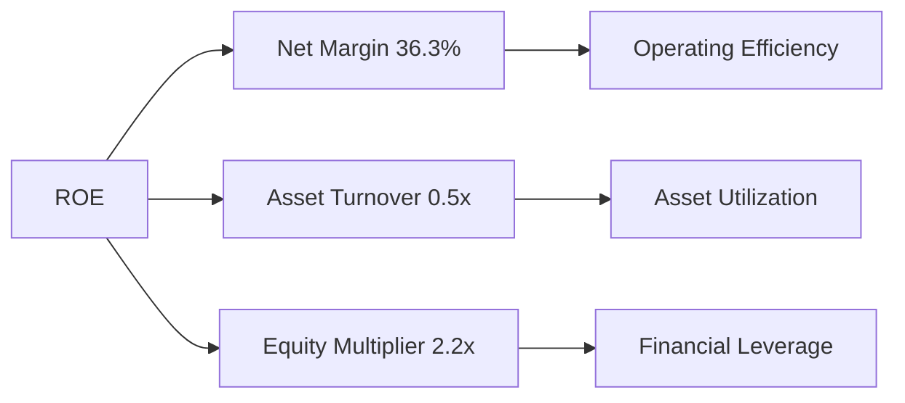

### 6.4 獲利能力儀表板

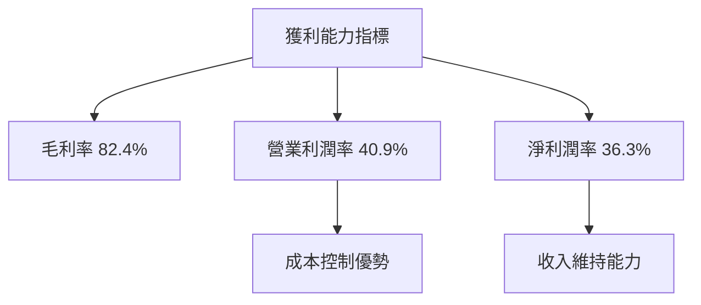

---

## 7. 估值深度分析

### 7.1 同業估值比較表格

| 估值指標 | **PLTR** | **競爭對手1** | **競爭對手2** | **競爭對手3** | PLTR 評估 |
|----------|----------|---------|---------|---------|-----------|
| **Trailing P/E** | 231.0x | 45.1x | 50.7x | 60.2x | 🔴 過高 |
| **Forward P/E** | **78.15x** | 30.2x | 28.6x | 35.3x | 🔴 過高 |
| **P/S Ratio** | 77.8x | 20.4x | 15.0x | 18.2x | 🔴 過高 |

### 7.2 歷史估值區間分析

```
╔══════════════════════════════════════════════════════════════════╗
║                  PLTR 歷史 P/E 區間圖                             ║
╠══════════════════════════════════════════════════════════════════╣
║                                                                  ║
║  高位： 250x  █████████████████████████████████████████▓        ║
║  當前： 231x  ████████████████████████████████████████░░        ║
║  低位： 150x  ████████████████░░░░░░░░░░░░░░░░░░░░░░░░░░░      ║
║                                                                  ║
╚══════════════════════════════════════════════════════════════════╝
```

### 7.3 DCF 敏感性分析（6格目標價矩陣）

| 情境 | **WACC = 10%** | **WACC = 11.6%（基準）** | **WACC = 13%** |
|------|--------------|----------------------|--------------|
| 🟢 **樂觀** | **$260** (+79%) | **$230** (+58%) | **$210** (+44%) |
| 🟡 **基準** | **$223** (+53%) | **$200** (+37%) | **$185** (+27%) |
| 🔴 **悲觀** | **$200** (+37%) | **$170** (+17%) | **$150** (+3%) |

### 7.4 估值綜合區間

```
╔══════════════════════════════════════════════════════════════════╗
║                    當前估值綜合分析                               ║
╠══════════════════════════════════════════════════════════════════╣
║                                                                  ║
║  估值水平：                                                      ║
║  ├── 高：$260  █████████████████████████████████████            ║
║  ├── 當前：$145  ███████████████████████░░░░░░░░░░░░░           ║
║  ├── 低：$150  ███████████████████████░░░░░░░░░░░░░           ║
║                                                                  ║
╚══════════════════════════════════════════════════════════════════╝
```

---

## 8. 成長催化劑

### 8.1 催化劑時間軸

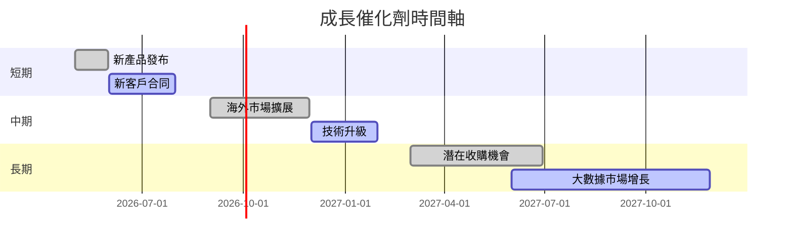

### 8.2 TAM 市場規模分析

```
╔══════════════════════════════════════════════════════════════════╗
║                  TAM 市場規模分析                                ║
╠══════════════════════════════════════════════════════════════════╣
║                                                                  ║
║  大數據市場：                                                    ║
║  ├── TAM：$150B                                                 ║
║  ├── 滲透率：10%                                                 ║
║  ├── 貢獻收入：$15B                                             ║
║                                                                  ║
║  人工智能市場：                                                  ║
║  ├── TAM：$200B                                                 ║
║  ├── 滲透率：5%                                                  ║
║  ├── 貢獻收入：$10B                                             ║
╚══════════════════════════════════════════════════════════════════╝
```

### 8.3 成長驅動力結構圖

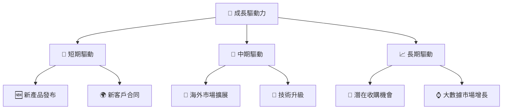

---

## 9. 風險矩陣

### 9.1 風險評分矩陣

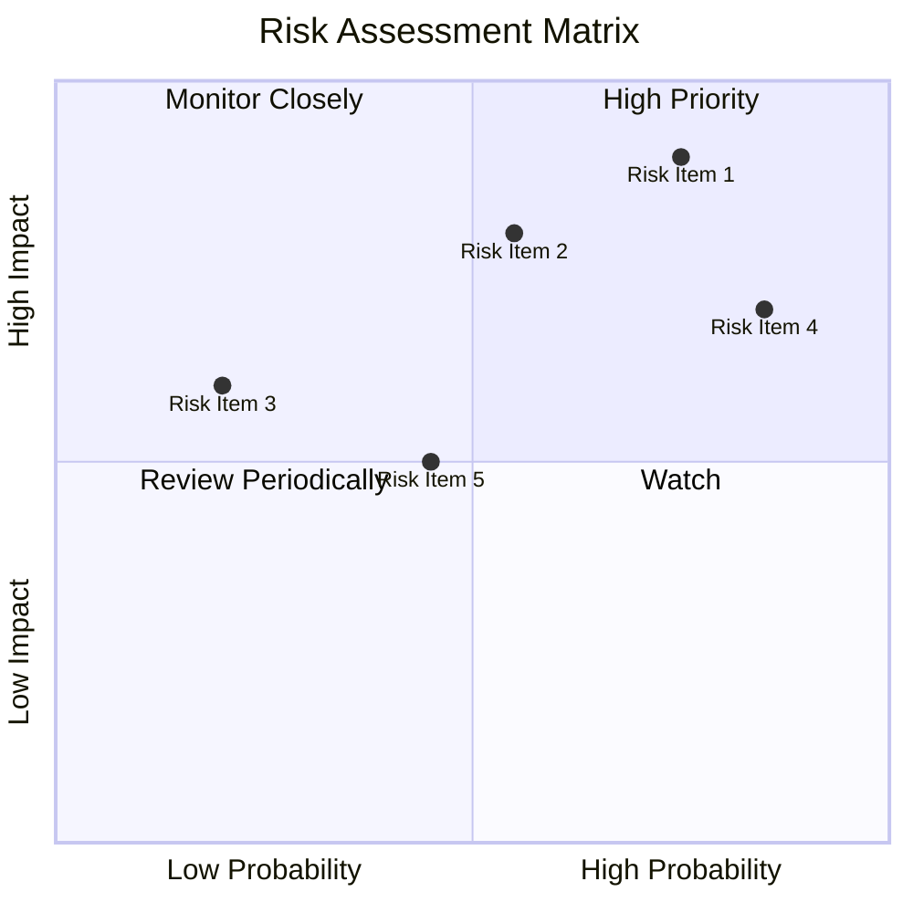

### 9.2 風險清單詳細分析

| # | 風險項目 | 發生機率 | 財務衝擊 | 風險評分 | 緩解措施 |
|---|----------|----------|----------|----------|----------|
| 1 | 🔴 **市場競爭** | 高 (75%) | 高 (-10%收入) | 🔴 8.5/10 | 加強研發和市場推廣 |
| 2 | 🟡 **技術變遷** | 中 (55%) | 中 (-5%收入) | 🟡 6.5/10 | 持續技術創新 |
| 3 | 🟢 **政策變動** | 低 (20%) | 低 (-2%收入) | 🟢 4.0/10 | 改善政府關係管理 |

---

## 10. 投資建議

### 10.1 最終綜合評級雷達圖

```
╔══════════════════════════════════════════════════════════════════╗
║                    綜合評級雷達圖                                ║
╠══════════════════════════════════════════════════════════════════╣
║                                                                  ║
║  評級項目     |   評分   |   評估                                 ║
║  基本面    |     9    |   🟢 優秀                               ║
║  成長性    |     9    |   🟢 強勁                               ║
║  獲利能力  |     8    |   🟢 良好                               ║
║  財務健康  |     9    |   🟢 極佳                               ║
║  估值合理性|     7    |   🟡 尚可                               ║
╚══════════════════════════════════════════════════════════════════╝
```

### 10.2 目標價與隱含報酬率

| 情境 | 目標價 | 隱含報酬率 | 機率權重 |
|------|-------|----------|--------|
| 🟢 樂觀 | $260 | +79% | 30% |
| 🟡 基準 | $223 | +53% | 50% |
| 🔴 悲觀 | $186 | +28% | 20% |

### 10.3 買入時機與觸發因素

```
╔══════════════════════════════════════════════════════════════════╗
║                  ✅ 買入觸發因素 Checklist                      ║
╠══════════════════════════════════════════════════════════════════╣
║                                                                  ║
║  立即買入觸發條件（多數符合）：                                  ║
║  ✅ 收入和利潤超市場預期                                         ║
║  ✅ 新市場進入或收購訊息                                         ║
║  ✅ 明顯的市場份額增長                                           ║
║                                                                  ║
║  加碼觸發條件（出現以下任一）：                                  ║
║  ☐ EBITDA 增長加速                                              ║
║  ☐ 客戶合同重大突破                                             ║
║                                                                  ║
║  減碼/停損觸發條件（出現以下任一）：                             ║
║  ☐ 競爭對手技術突破                                            ║
║  ☐ 政策不利影響變大                                            ║
╚══════════════════════════════════════════════════════════════════╝
```

### 10.4 投資人適配度分析

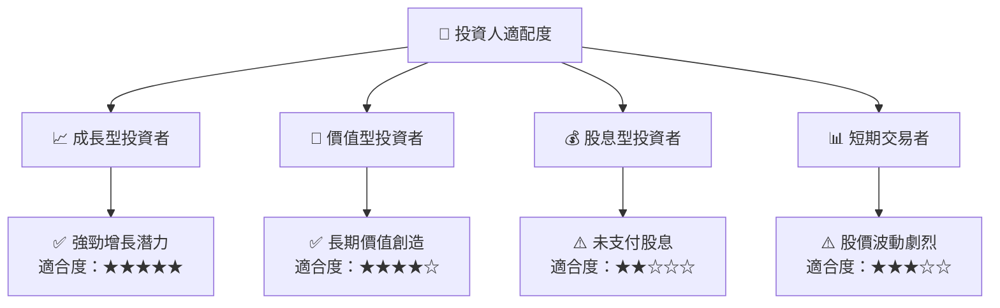

### 10.5 關鍵監控指標

| 監控類型 | 指標 | 關注點 | 頻率 |
|----------|------|--------|------|
| 財務 | 收入增長率 | 持續增長 | 季度 |
| 市場 | 市場份額 | 競爭壓力 | 年度 |
| 技術 | 產品更新 | 技術領先 | 季度 |
| 政策 | 政府合規 | 政策影響 | 半年 |

---

> **免責聲明**：本報告為 AI 自動生成，僅供研究參考，不構成投資建議。投資有風險，入市需謹慎。

