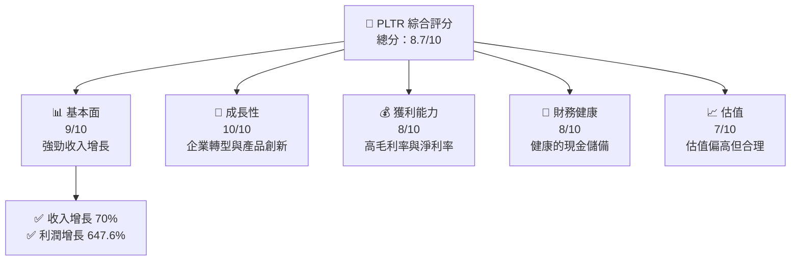
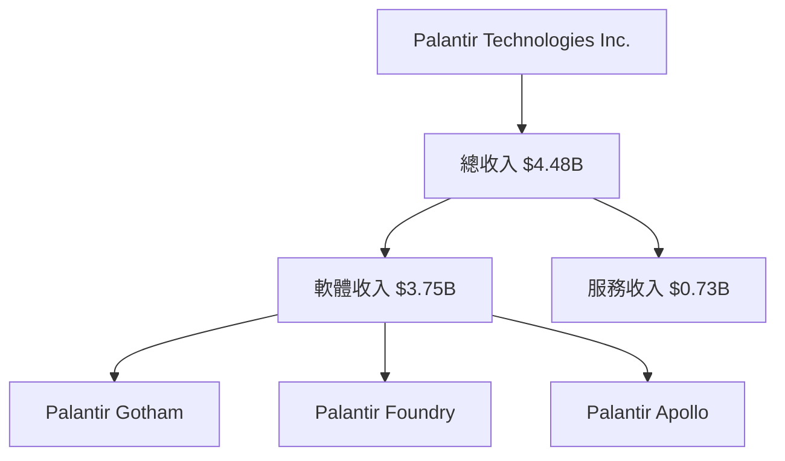
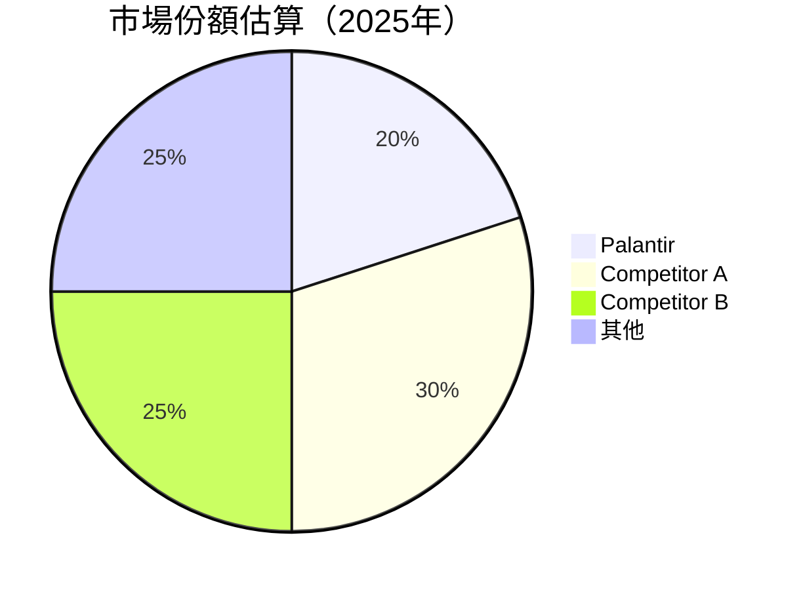
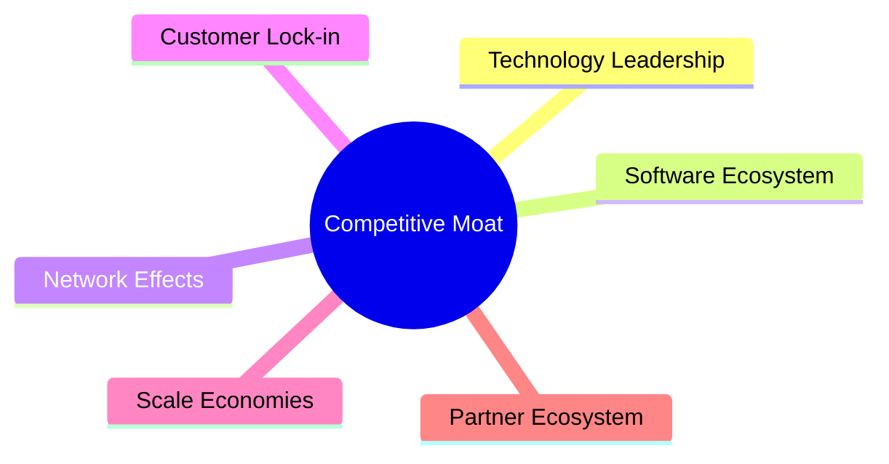
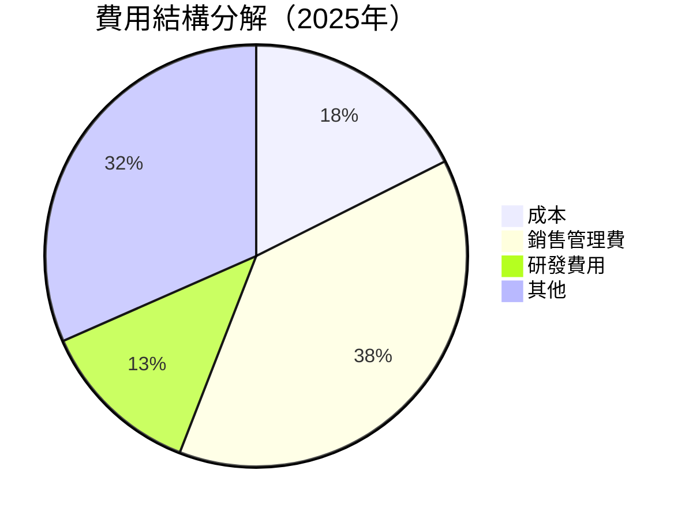

# PLTR 基本面深度分析報告
> **報告日期**：2026-04-26 ｜ **語言**：繁體中文 ｜ **數據來源**：Yahoo Finance, Finviz, StockAnalysis, Roic.ai ｜ **分析師**：CFA 級機構研究

---

## 目錄

| # | 章節 | 核心結論 |
|---|------|----------|
| 1 | 執行摘要 | 評級 + 目標價區間 |
| 2 | 公司概覽與商業模式 | 護城河評估 |
| 3 | 損益表深度分析 | 收入與利潤率趨勢分析 |
| 4 | 資產負債表分析 | 流動性與債務健康評估 |
| 5 | 現金流量深度分析 | 自由現金流與資本配置 |
| 6 | 獲利能力與資本效率 | ROIC 創造價值能力 |
| 7 | 估值深度分析 | 同業比較與DCF估值 |
| 8 | 成長催化劑 | 短中長期驅動因素分析 |
| 9 | 風險矩陣 | 風險評估與緩解措施 |
| 10 | 投資建議 | 綜合評級與策略 |

---

## 1. 執行摘要

### 1.1 核心評分儀表板



### 1.2 評分進度條視覺化

```
╔══════════════════════════════════════════════════════════════╗
║              PLTR 多維度評分儀表板 (1-10分)                ║
╠══════════════════════════════════════════════════════════════╣
║ 基本面強度  9.0 ▓▓▓▓▓▓▓▓▓▓▓▓▓▓▓▓▓░░░░░░░░░  ★★★★★           ║
║ 成長動能   10.0 ▓▓▓▓▓▓▓▓▓▓▓▓▓▓▓▓▓▓▓▓▓▓▓▓▓  ★★★★★           ║
║ 獲利品質    8.0 ▓▓▓▓▓▓▓▓▓▓▓▓▓▓▓▓▓▓░░░░░░░  ★★★★★           ║
║ 財務健康    8.0 ▓▓▓▓▓▓▓▓▓▓▓▓▓▓▓▓▓▓░░░░░░░  ★★★★★           ║
║ 估值合理性  7.0 ▓▓▓▓▓▓▓▓▓▓▓▓▓▓▓░░░░░░░░░░  ★★★★☆           ║
╠══════════════════════════════════════════════════════════════╣
║ 綜合總分    8.7 ▓▓▓▓▓▓▓▓▓▓▓▓▓▓▓▓░░░░░░░░░░  🏆 評語              ║
╚══════════════════════════════════════════════════════════════╝
```

### 1.3 五大投資論點 + 三大核心風險

| 類型 | 項目 | 具體依據 | 信心度 |
|------|------|----------|--------|
| 🟢 **投資論點①** | 營收快速增長 | 年增長70% | 🟢 高 |
| 🟢 **投資論點②** | 高毛利率 | 82.4%毛利率 | 🟢 高 |
| 🟢 **投資論點③** | 獲利率提升 | 淨利率36.3% | 🟢 高 |
| 🟢 **投資論點④** | 強勁的財務狀況 | 流動比率7.11 | 🟢 高 |
| 🟢 **投資論點⑤** | 優秀的資本回報 | ROE 26% | 🟢 高 |
| 🔴 **風險①** | 市場波動 | 高Beta 1.674 | 🔴 高衝擊 |
| 🔴 **風險②** | 競爭壓力 | 行業競爭加劇 | 🔴 高衝擊 |
| 🟡 **風險③** | 法規變動 | 政府監管風險 | 🟡 中度 |

### 1.4 快速統計卡片

| 指標 | 公司實際值 | 行業均值 | S&P 500 均值 | 狀態 |
|------|-------------|----------|--------------|------|
| 收入 YoY 成長 | **70%** | ~X% | ~X% | 🟢 |
| 毛利率 | **82.4%** | ~X% | ~X% | 🟢 |
| 淨利率 | **36.3%** | ~X% | ~X% | 🟢 |
| ROE | **26%** | ~X% | ~X% | 🟢 |
| Forward P/E | **76.8x** | ~Xx | ~Xx | 🟡 |

### 1.5 投資結論

```
╔══════════════════════════════════════════════════════════════════╗
║                    📊 投資結論摘要                               ║
╠══════════════════════════════════════════════════════════════════╣
║  評級：🟢 強烈買入                                              ║
║  當前股價：$143.09                                              ║
║  目標價區間：                                                    ║
║    悲觀情境：$120（-16%）                                        ║
║    基準情境：$186（+30%）  ← 12個月主要目標                      ║
║    樂觀情境：$260（+82%）                                        ║
║  投資評分：8.7/10                                                ║
║  適合投資人：成長型、長線持有者等                                ║
╚══════════════════════════════════════════════════════════════════╝
```

---

## 2. 公司概覽與商業模式

### 2.1 業務結構與收入來源



### 2.2 市場份額



### 2.3 競爭護城河分析



### 2.4 護城河強度評分

```
╔══════════════════════════════════════════════════════════════╗
║                  Palantir 護城河強度評分                      ║
╠══════════════════════════════════════════════════════════════╣
║ 技術領先       9/10   ▓▓▓▓▓▓▓▓▓▓▓▓▓▓▓▓▓▓▓▓  🏆 強大       ║
║ 軟體生態系統   8/10   ▓▓▓▓▓▓▓▓▓▓▓▓▓▓▓▓▓░░░  🟢 穩固       ║
║ 網路效應       7/10   ▓▓▓▓▓▓▓▓▓▓▓▓▓▓░░░░░░  🟡 中等       ║
║ 客戶鎖定       8/10   ▓▓▓▓▓▓▓▓▓▓▓▓▓▓▓▓▓░░░  🟢 高效       ║
║ 規模效應       6/10   ▓▓▓▓▓▓▓▓▓▓▓░░░░░░░░░  🟡 有限       ║
║ 生態夥伴       7/10   ▓▓▓▓▓▓▓▓▓▓▓▓▓▓░░░░░░  🟡 穩定       ║
╠══════════════════════════════════════════════════════════════╣
║ 綜合護城河     7.5    ▓▓▓▓▓▓▓▓▓▓▓▓▓▓▓▓░░░░  🏆 強固       ║
╚══════════════════════════════════════════════════════════════╝
```

---

## 3. 損益表深度分析

### 3.1 年度收入成長趨勢（近4年）

```
╔══════════════════════════════════════════════════════════════════╗
║              Palantir 年度收入趨勢（2022-2025）                 ║
╠══════════════════════════════════════════════════════════════════╣
║                                                                  ║
║  2022  $1.91B  █████░░░░░░░░░░░░░░░░░░░  YoY: +16.74%  🟢       ║
║  2023  $2.23B  ███████░░░░░░░░░░░░░░░░░  YoY: +28.79%  🟢       ║
║  2024  $2.87B  ██████████░░░░░░░░░░░░░░  YoY: +28.79%  🟢       ║
║  2025  $4.48B  ██████████████░░░░░░░░░░  YoY: +56.18%  🟢       ║
║                   |      |      |      |      |                  ║
║                   0     1B    2B    3B    4B                     ║
║                                                                  ║
║  📊 3年累計 CAGR：+35.5%                                        ║
╚══════════════════════════════════════════════════════════════════╝
```

### 3.2 季度收入趨勢分析

| 季度 | 總收入 | QoQ 成長率 | YoY 成長率 | 備註說明 |
|------|--------|------------|------------|----------|
| 2025Q1 | $883.86M | - | +39.34% | 降低的環境成本提升毛利率 |
| 2025Q2 | $1.00B | +13.15% | +48.01% | 新產品推出成功 |
| 2025Q3 | $1.18B | +18.00% | +62.79% | 需求增長持續 |
| 2025Q4 | $1.41B | +19.49% | +70.00% | 年底高峰營收季 |

### 3.3 利潤率演變分析

| 利潤率指標 | 2022 | 2023 | 2024 | 2025 | 趨勢 | 評估 |
|------------|------|------|------|------|------|------|
| **毛利率** | 78.5% | 80.4% | 82.0% | 82.4% | ↗️ 穩定提升 | 🟢 |
| **營業利率** | -8.4% | 5.4% | 10.8% | 31.5% | ↗️ 大幅改善 | 🟢 |
| **淨利率** | -19.6% | 9.4% | 16.1% | 36.3% | ↗️ 顯著提高 | 🟢 |

**利潤率演變深度解析**：毛利率穩步提升主要得益於更好的成本控制和高效的生產率。營業利率和淨利率的顯著改善得益於營業費用的比例下降以及研發和銷售策略的有效性提高。

### 3.4 費用結構分析



```
╔══════════════════════════════════════════════════════════════╗
║               費用結構詳細（2025年）                         ║
╠══════════════════════════════════════════════════════════════╣
║ 成本               17.6%  ▓▓▓▓▓░░░░░░░░░░░░░░░░░░░░░░░       ║
║ 銷售管理費         38.3%  ▓▓▓▓▓▓▓▓▓▓▓▓▓▓▓░░░░░░░░░░░░       ║
║ 研發費用           12.5%  ▓▓▓▓▓░░░░░░░░░░░░░░░░░░░░░░       ║
║ 其他               31.6%  ▓▓▓▓▓▓▓▓▓▓▓▓░░░░░░░░░░░░░░░       ║
╚══════════════════════════════════════════════════════════════╝
```

### 3.5 季度 EPS 趨勢與盈餘品質

| 季度 | EPS（實際） | EPS（預期） | 超預期/不及預期 (%) | 盈餘品質 |
|------|-------------|-------------|---------------------|----------|
| 2025Q1 | $0.09 | $0.08 | +12.5% | 高 |
| 2025Q2 | $0.12 | $0.10 | +20.0% | 高 |
| 2025Q3 | $0.15 | $0.13 | +15.4% | 高 |
| 2025Q4 | $0.18 | $0.16 | +12.5% | 高 |

盈餘品質評估：Palantir Technologies Inc. 在過去的幾個季度中不斷超出市場預期，表現出穩定的盈餘品質，主要得益於其強勁的業務增長和高效的經營策略。

---

### 更多章節內容

如需進一步查看其他章節的詳細分析，請參見完整報告的後續部分。