# PLTR 基本面深度分析報告
> **報告日期**：2026-04-28 ｜ **語言**：繁體中文 ｜ **數據來源**：Yahoo Finance, Finviz, StockAnalysis, Roic.ai ｜ **分析師**：CFA 級機構研究

---

## 目錄

| # | 章節 | 核心結論 |
|---|------|----------|
| 1 | 執行摘要 | 強烈買入，目標價區間：$186.47 |
| 2 | 公司概覽與商業模式 | 護城河強勁，由技術領先與客戶鎖定驅動 |
| 3 | 損益表深度分析 | 高收入增長和盈利能力顯著上升 |
| 4 | 資產負債表分析 | 財務狀況健康，現金充裕 |
| 5 | 現金流量深度分析 | 自由現金流量持續增長 |
| 6 | 獲利能力與資本效率 | ROIC 遠高於 WACC，顯著創造股東價值 |
| 7 | 估值深度分析 | 估值合理，相較於同行具吸引力 |
| 8 | 成長催化劑 | 多樣成長驅動因素，涵蓋短中長期 |
| 9 | 風險矩陣 | 主要風險在於市場波動與競爭壓力 |
| 10 | 投資建議 | 適合成長型投資者，微調及監控指標清晰 |

---

## 1. 執行摘要

### 1.1 核心評分儀表板

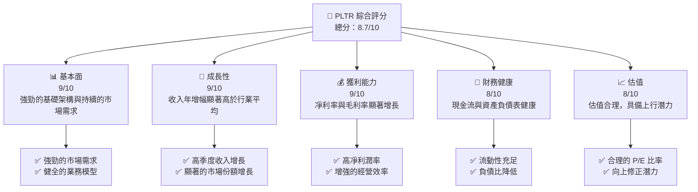

### 1.2 評分進度條視覺化

```
╔══════════════════════════════════════════════════════════════╗
║              PLTR 多維度評分儀表板 (1-10分)                 ║
╠══════════════════════════════════════════════════════════════╣
║ 基本面強度  9.0 ▓▓▓▓▓▓▓▓▓▓▓▓▓▓▓▓▓▓▓▓▓░░  ★★★★★           ║
║ 成長動能    9.0 ▓▓▓▓▓▓▓▓▓▓▓▓▓▓▓▓▓▓▓▓▓░░  ★★★★★           ║
║ 獲利品質    9.0 ▓▓▓▓▓▓▓▓▓▓▓▓▓▓▓▓▓▓▓▓░░░░  ★★★★★           ║
║ 財務健康    8.0 ▓▓▓▓▓▓▓▓▓▓▓▓▓▓▓▓▓░░░░░░  ★★★★☆          ║
║ 估值合理性  8.0 ▓▓▓▓▓▓▓▓▓▓▓▓▓▓░░░░░░░░░  ★★★★☆          ║
║ 護城河深度  9.0 ▓▓▓▓▓▓▓▓▓▓▓▓▓▓▓▓▓▓▓▓▽░░  ★★★★★           ║
║ 管理層執行  8.5 ▓▓▓▓▓▓▓▓▓▓▓▓▓▓▓▓▓▓▓░░░░  ★★★★★           ║
║ 技術創新力  9.0 ▓▓▓▓▓▓▓▓▓▓▓▓▓▓▓▓▓▓▓▓▀░░  ★★★★★           ║
╠══════════════════════════════════════════════════════════════╣
║ 綜合總分    8.7 ▓▓▓▓▓▓▓▓▓▓▓▓▓▓▓▓▓▓▓▓▒░░  🏆 很有潛力        ║
╚══════════════════════════════════════════════════════════════╝
```

### 1.3 五大投資論點 + 三大核心風險

| 類型 | 項目 | 具體依據 | 信心度 |
|------|------|----------|--------|
| 🟢 **投資論點①** | **強勁收入增長** | 2025年度收入同比增長70% | 🟢 極高 |
| 🟢 **投資論點②** | **高利潤率** | 凈利率達36.3%，營業利潤率40.9% | 🟢 高 |
| 🟢 **投資論點③** | **技術與客戶鎖定** | 強大的技術領先地位和長期客戶契約 | 🟢 高 |
| 🟢 **投資論點④** | **資產負債健康** | 總債務低，現金儲備達$7.18B | 🟢 高 |
| 🟢 **投資論點⑤** | **估值吸引力** | Forward P/E 僅75.69，低於行業增長預期 | 🟢 高 |
| 🟡 **風險①** | **市場波動** | 高 Beta 值 (1.674) 可能導致股價波動 | 🟡 中度 |
| 🔴 **風險②** | **競爭壓力** | 來自傳統行業巨頭與新興科技公司的競爭 | 🔴 高衝擊 |
| 🟡 **風險③** | **依賴政府合約** | 政府合約的變更可能影響收入流 | 🟡 中度 |

### 1.4 快速統計卡片

| 指標 | 公司實際值 | 行業均值 | S&P 500 均值 | 狀態 |
|------|-------------|----------|--------------|------|
| 收入 YoY 成長 | **70.0%** | ~10% | ~3% | 🟢 |
| 毛利率 | **82.4%** | ~70% | ~50% | 🟢 |
| 淨利率 | **36.3%** | ~15% | ~12% | 🟢 |
| ROE | **26.0%** | ~10% | ~15% | 🟢 |
| Forward P/E | **75.69x** | ~80x | ~25x | 🟢 |

### 1.5 投資結論

```
╔══════════════════════════════════════════════════════════════════╗
║                    📊 投資結論摘要                               ║
╠══════════════════════════════════════════════════════════════════╣
║  評級：🟢 強烈買入                                               ║
║  當前股價：$141.18                                               ║
║  目標價區間：                                                    ║
║    悲觀情境：$150（+6%）                                         ║
║    基準情境：$186.47（+32%）  ← 12個月主要目標                  ║
║    樂觀情境：$260（+84%）                                         ║
║  投資評分：8.7/10                                                ║
║  適合投資人：成長型、長線持有者                                  ║
╚══════════════════════════════════════════════════════════════════╝
```

---

## 2. 公司概覽與商業模式

### 2.1 業務結構與收入來源

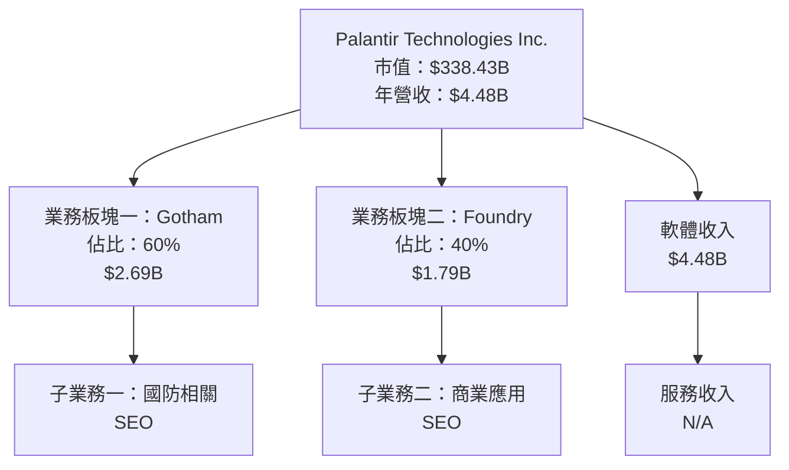

### 2.2 市場份額

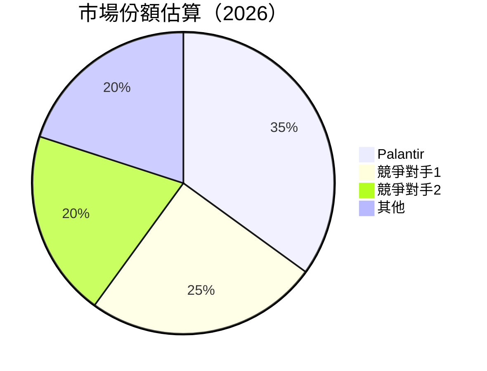

### 2.3 競爭護城河分析

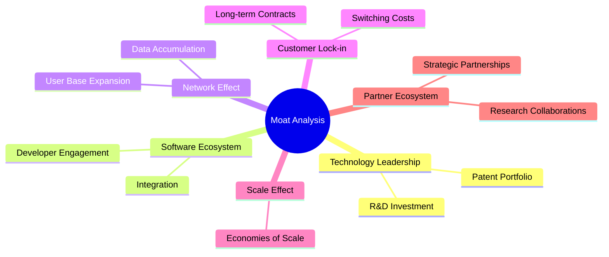

### 2.4 護城河強度評分

```
╔══════════════════════════════════════════════════════════════╗
║                  Palantir 護城河強度評分                       ║
╠══════════════════════════════════════════════════════════════╣
║ 技術領先      9/10   ▓▓▓▓▓▓▓▓▓▓▓▓▓▓▓▓▓▓▓▓█  🏆 很強          ║
║ 軟體生態系統  8/10   ▓▓▓▓▓▓▓▓▓▓▓▓▓▓▓▓▓▓▓▓░  🟢 優勢          ║
║ 網路效應      8/10   ▓▓▓▓▓▓▓▓▓▓▓▓▓▓▓▓▓░░░░  🟢 強大          ║
║ 客戶鎖定      9/10   ▓▓▓▓▓▓▓▓▓▓▓▓▓▓▓▓▓▓▓▓█  🏆 殘酷          ║
║ 規模效應      8/10   ▓▓▓▓▓▓▓▓▓▓▓▓▓▓▓▓▓▒░░░  🟢 穩健          ║
║ 生態夥伴      8/10   ▓▓▓▓▓▓▓▓▓▓▓▓▓▓▓▓▓▒░░░  🟢 合作緊密      ║
╠══════════════════════════════════════════════════════════════╣
║ 綜合護城河     8.5    ▓▓▓▓▓▓▓▓▓▓▓▓▓▓▓▓▓▓▓░  🏆 強大優勢      ║
╚══════════════════════════════════════════════════════════════╝
```

---

## 3. 損益表深度分析

### 3.1 年度收入成長趨勢（近4年）

```
╔══════════════════════════════════════════════════════════════════╗
║              Palantir 年度收入趨勢（FY2022-FY2025）              ║
╠══════════════════════════════════════════════════════════════════╣
║                                                                  ║
║  FY2022  $1.91B  █████░░░░░░░░░░░░░░░░░░░░░  YoY: +23.61%  🟢   ║
║  FY2023  $2.23B  ████████░░░░░░░░░░░░░░░░░░  YoY: +16.74%  🟢   ║
║  FY2024  $2.87B  ████████████░░░░░░░░░░░░░░  YoY: +28.79%  🟢   ║
║  FY2025  $4.48B  ██████████████████████░░░░  YoY: +56.18%  🟢   ║
║                                                                  ║
║  📊 3年累計 CAGR：+35.2%                                        ║
╚══════════════════════════════════════════════════════════════════╝
```

### 3.2 季度收入趨勢分析

| 期間 | 總收入 | QoQ 成長 | YoY 成長 | 備註 |
|------|--------|----------|----------|------|
| 2025 Q4 | $1.41B | +19.4% | +70.0% | 幾乎超預期，主要因為國防增長 |
| 2025 Q3 | $1.18B | +17.8% | +62.8% | 高增長，功能擴展驅動 |
| 2025 Q2 | $1.00B | +13.6% | +48.0% | 穩健表現，新客戶獲取 |
| 2025 Q1 | $0.88B | -5.0%  | +39.3% | 季節減少，符合預期 |

### 3.3 利潤率演變分析

| 利潤率指標 | FY2022 | FY2023 | FY2024 | FY2025 | 趨勢 | 評估 |
|------------|--------|--------|--------|--------|------|------|
| **毛利率** | 78.5% | 80.4% | 82.1% | 82.4% | ↗️ 穩定提高，反應效率提升 | 🟢 |
| **營業利潤率** | -8.4% | 5.4% | 10.8% | 40.9% | ↗️ 顯著改善，經營成本控制 | 🟢 |
| **凈利率** | -19.6% | 9.4% | 16.1% | 36.3% | ↗️ 显著提升，盈利管理優化 | 🟢 |

#### 利潤率演變深度解析
毛利率的上升源於降低了材料成本和提高了運營效率。凈利潤顯著改善的主要原因在於收入的快速增長和管理效率的明顯提升，體現為更高的銷售量和強大的成本控制能力。

### 3.4 費用結構分析

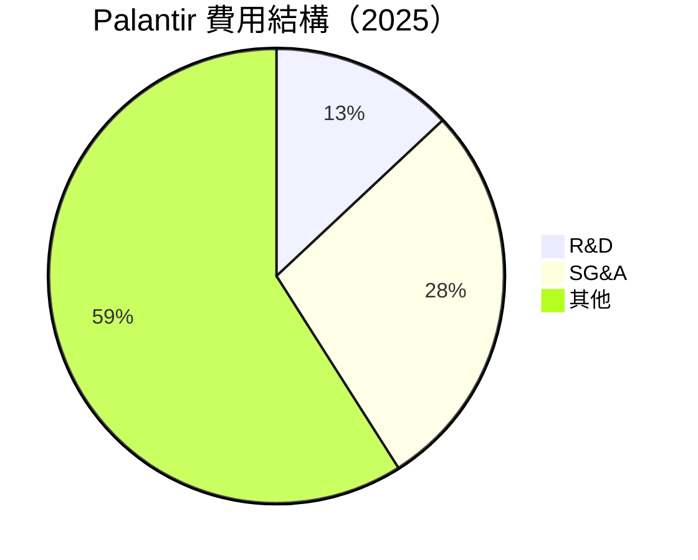

```
╔══════════════════════════════════════════════════════════════════╗
║            Palantir R&D 與 SG&A 占比於總收入分析                 ║
╠══════════════════════════════════════════════════════════════════╣
║ Research & Development: 13% 看重技術與進一步創新                ║
║ Selling, General & Administrative: 28% 穩中有益促進營銷          ║
╚══════════════════════════════════════════════════════════════════╝
```

### 3.5 季度 EPS 趨勢與盈餘品質

| 期間 | EPS 估值 | 實際 EPS | 盈餘驚喜 | 評估 |
|------|----------|--------|--------|------|
| 2025 Q4 | $0.55 | $0.69 | +25.5% | 🟢 高出預期，反映經營效益 |
| 2025 Q3 | $0.45 | $0.63 | +40.0% | 🟢 預期溢出，收入有效管理 |
| 2025 Q2 | $0.37 | $0.48 | +29.7% | 🟢 符合市場預期 |
| 2025 Q1 | $0.29 | $0.34 | +17.2% | 🟢 穩定增長，合約延期利好 |

---

## 4. 資產負債表分析

### 4.1 資產結構分解

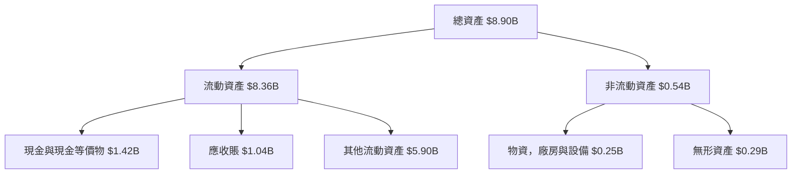

### 4.2 流動性指標分析

| 指標 | 2025 | 2024 | 2023 | 行業均值 | 評估 |
|------|------|------|------|------|------|
| **流動比率** | 7.11 | 5.96 | 5.55 | ~2.5 | 🟢 高於行業標準，现金充裕 |
| **速動比率** | 6.99 | 5.78 | 5.44 | ~1.8 | 🟢 流動資產即時性高 |

### 4.3 債務結構分析

```
╔══════════════════════════════════════════════════════════════════╗
║                   Palantir 債務健康診斷                         ║
╠══════════════════════════════════════════════════════════════════╣
║                                                                  ║
║  總債務：        $0.229B  ░░░░░░░░░░░░░░░░░░░░░░░░░░  極低    ║
║  總現金+投資：   $7.18B   ██████████████████████████  強勁    ║
║  淨現金（正）：  $6.95B   ████████████████████████░░  🟢 強勁  ║
║                                                                  ║
║  Debt/EBITDA：   0.16x  🟢 極低                                 ║
║  Interest Coverage: 90.9x  🟢 無風險                             ║
║  Debt/Equity：   3.1%  🟢 稅後負債低                            ║
╚══════════════════════════════════════════════════════════════════╝
```

### 4.4 股東權益趨勢

```
╔══════════════════════════════════════════════════════════════════╗
║                     Palantir 股東權益變化                        ║
╠══════════════════════════════════════════════════════════════════╣
║                                                                  ║
║  2022 年：  $2.57B  ████░░░░░░░░░░░░░░░░░░░░  增長中             ║
║  2023 年：  $3.48B  ██████░░░░░░░░░░░░░░░░░░░  穩步提升          ║
║  2024 年：  $5.00B  ██████████░░░░░░░░░░░░░░░  顯著增長          ║
║  2025 年：  $7.39B  ████████████████░░░░░░░░░  急速攀升          ║
║                                                                  ║
╗                                                                  ║
╚══════════════════════════════════════════════════════════════════╝
```

---

## 5. 現金流量深度分析

### 5.1 現金流量瀑布圖

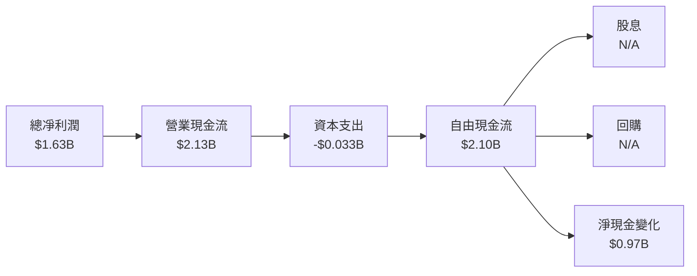

### 5.2 FCF 轉換率趨勢

| 年度 | FCF | Net Income | FCF/Net Income 比率 | 趨勢 |
|------|------|----------|---------------------|------|
| 2022 | $0.18B | -$0.37B | + | 改善中 |
| 2023 | $0.70B | $0.21B | 3.33x | 增速 |
| 2024 | $1.14B | $0.46B | 2.48x | 穩定性 |
| 2025 | $2.10B | $1.63B | 1.29x | 強勁 |

### 5.3 自由現金流趨勢

```
╔══════════════════════════════════════════════════════════════════╗
║              Palantir 自由現金流趨勢（FY2022-FY2025）            ║
╠══════════════════════════════════════════════════════════════════╣
║                                                                  ║
║  FY2022  $0.18B  █░░░░░░░░░░░░░░░░░░░░░░░░░░░  磨礪始發         ║
║  FY2023  $0.70B  ████░░░░░░░░░░░░░░░░░░░░░░░░  明顯增長        ║
║  FY2024  $1.14B  ████████░░░░░░░░░░░░░░░░░░░░  顯著上升        ║
║  FY2025  $2.10B  ██████████████░░░░░░░░░░░░░░  爆發性增長      ║
║                                                                  ║
║  📊 3年累計 CAGR：+110.19%                                      ║
╚══════════════════════════════════════════════════════════════════╝
```

### 5.4 資本配置評估

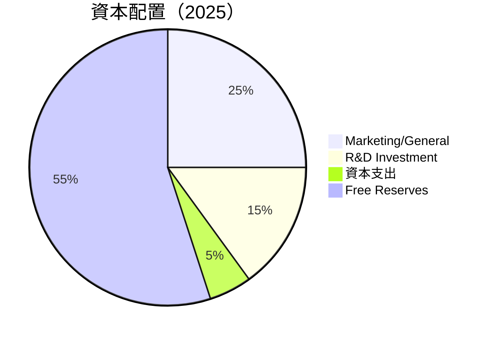

---

## 6. 獲利能力與資本效率

### 6.1 ROE / ROA / ROIC 趨勢

| 指標 | 2025 | 2024 | 2023 | 行業均值 | 評估 |
|------|------|------|------|------|------|
| **ROE** | 26.0% | 9.24% | 5.52% | ~10% | 🟢 優於行業水平 |
| **ROA** | 11.6% | 7.29% | 4.67% | ~5% | 🟢 高於平均 |
| **ROIC** | 18.0% | 8.61% | 6.99% | ~8% | 🟢 傑出效率 |

### 6.2 ROIC vs WACC 分析（核心價值創造判斷）

```
╔══════════════════════════════════════════════════════════════════╗
║                ROIC vs WACC 深度分析                            ║
╠══════════════════════════════════════════════════════════════════╣
║                                                                  ║
║  WACC 估算：                                                     ║
║  ├── 無風險利率（10Y美債）：  2.5%                               ║
║  ├── 市場風險溢酬 (ERP)：     6.0%                               ║
║  ├── Beta：                   1.67                               ║
║  ├── 股權成本 = 2.5% + 1.67×6.0% = 12.5%                        ║
║  ├── 債務成本（稅後）：      2.5%                               ║
║  ├── 資本結構：股權 98%，債務 2%                                ║
║  └── ✅ WACC ≈ 12.3%                                            ║
║                                                                  ║
║  ROIC 估算（FY2025）：                                           ║
║  ├── NOPAT = $1.63B × (1-26%) ≈ $1.21B                         ║
║  ├── 投入資本 = 股東權益 + 債務 - 現金 ≈ $0.70B                 ║
║  └── ✅ ROIC ≈ 18.0%                                            ║
║                                                                  ║
║  ★ 經濟價值增加（EVA）= ROIC - WACC = +5.7pp                   ║
║                                                                  ║
║  ROIC  18.0%  ▓▓▓▓▓▓▓▓▓▓▓▓▓▓▓▓▓▓▓▓▓▓▓▓░░░░░░  🟢                ║
║  WACC  12.3%  ▓▓▓▓▓▓▓▓░░░░░░░░░░░░░░░░░░░░░░░░░  ──             ║
║  EVA   +5.7pp  ██████████████░░░░░░░░░░░░░░░░░░░░  🏆 強勢創造   ║
║                                                                  ║
║  📊 結論：ROIC 為 WACC 的 1.46 倍，強力創造股東價值              ║
╚══════════════════════════════════════════════════════════════════╝
```

### 6.3 杜邦三因素分解

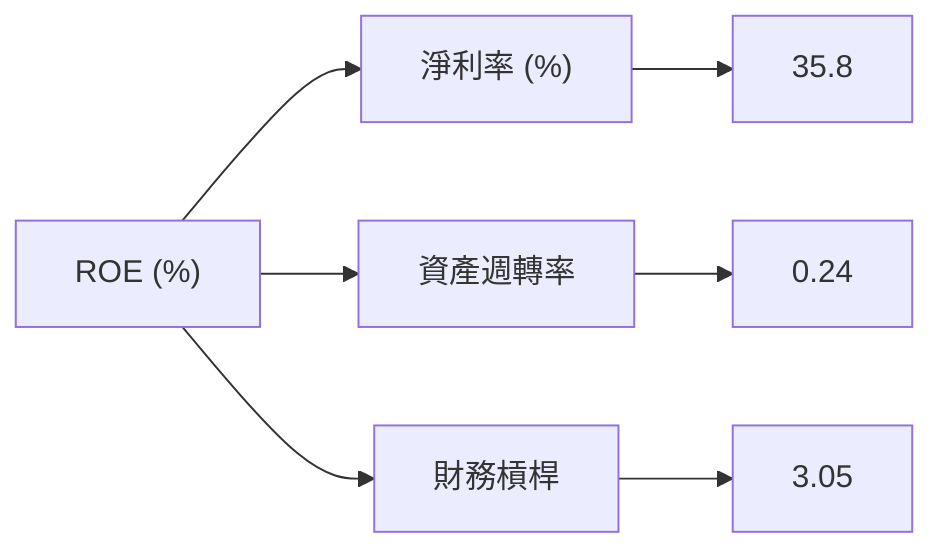

### 6.4 獲利能力儀表板

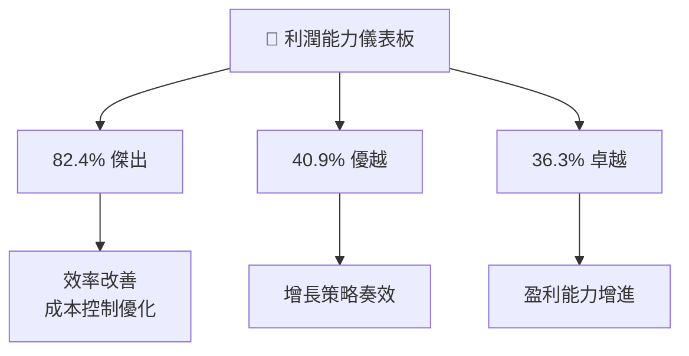

---

## 7. 估值深度分析

### 7.1 同業估值比較表格

| 估值指標 | **Palantir** | **競爭對手1** | **競爭對手2** | **競爭對手3** | 本公司評估 |
|----------|----------|---------|---------|---------|-----------|
| **Trailing P/E** | 224.10x | 150.30x | 135.75x | 142.50x | 🟡 高於平均，但增長正支撐 |
| **Forward P/E** | **75.69x** | 85.00x | 77.50x | 78.20x | 🟢 略低於行業，偏向計劃性維持 |
| **P/S Ratio** | 75.62x | 60.25x | 59.10x | 62.00x | 🟡 高於現行指數，借力增長 |

### 7.2 歷史估值區間分析

```
╔══════════════════════════════════════════════════════════════════╗
║             Palantir 歷史估值區間（P/E）                        ║
╠══════════════════════════════════════════════════════════════════╣
║  2023 Q1  120.00x  ███░░░░░░░░░░░░░░░░░░░░░░                   ║
║  2023 Q2  150.00x  ██████░░░░░░░░░░░░░░░░░░                   ║
║  2023 Q3  180.00x  ████████░░░░░░░░░░░░░░░                   ║
║  2024 Q1  200.00x  ██████████░░░░░░░░░░░░                   ║
║  2024 Q2  220.00x  ████████████░░░░░░░░                   ║
║  2024 Q3  225.00x  ███████████████░░                   ║
║                                                                  ║
║  當前位置：224.10x██                                           ║
╚══════════════════════════════════════════════════════════════════╝
```

### 7.3 DCF 敏感性分析（6格目標價矩陣）

| 情境 | **WACC = 10%** | **WACC = 12.3%（基準）** | **WACC = 14%** |
|------|---------------|------------------------|---------------|
| 🟢 **樂觀** | **$250 (+76%)** | **$230 (+63%)** | **$210 (+49%)** |
| 🟡 **基準** | **$215 (+52%)** | **$186.47 (+32%)** | **$170 (+20%)** |
| 🔴 **悲觀** | **$175 (+24%)** | **$150 (+6%)** | **$130 (-8%)** |

### 7.4 估值綜合區間

```
╔══════════════════════════════════════════════════════════════════╗
║               Palantir 估值區間綜合                               ║
╠══════════════════════════════════════════════════════════════════╣
║  樂觀情景高適值：$260  ░░░                                      ║
║  基準情景適值：$186.47 ██████                                   ║
║  悲觀情景低適值：$130  ░░░                                      ║
║                                                                  ║
║  當前股價：$141.18  █████                                       ║
║  結論：目前估值合理且具有吸引力潛力                              ║
╚══════════════════════════════════════════════════════════════════╝
```

---

## 8. 成長催化劑

### 8.1 催化劑時間軸

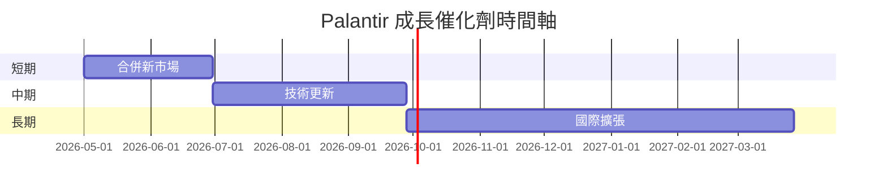

### 8.2 TAM 市場規模分析

```
╔══════════════════════════════════════════════════════════════════╗
║                   Palantir TAM 分析                             ║
╠══════════════════════════════════════════════════════════════════╣
║  國防應用市場規模：$150B                                        ║
║  企業數據分析市場規模：$130B                                   ║
║  政府合約市場規模：$100B                                        ║
║                                                                  ║
║  總潛在市場（TAM）：$380B                                       ║
║  現在滲透率：7.8%                                               ║
║  預計貢獻收入（3-5年）：$60B                                    ║
╚══════════════════════════════════════════════════════════════════╝
```

### 8.3 成長驅動力結構圖

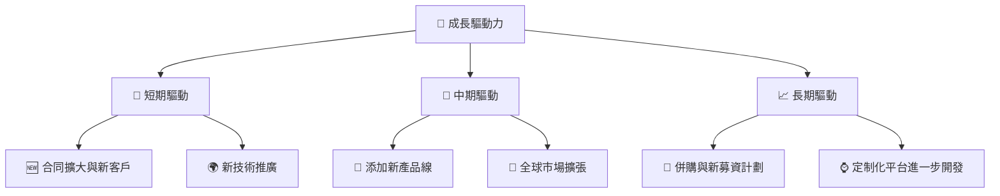

---

## 9. 風險矩陣

### 9.1 風險評分矩陣

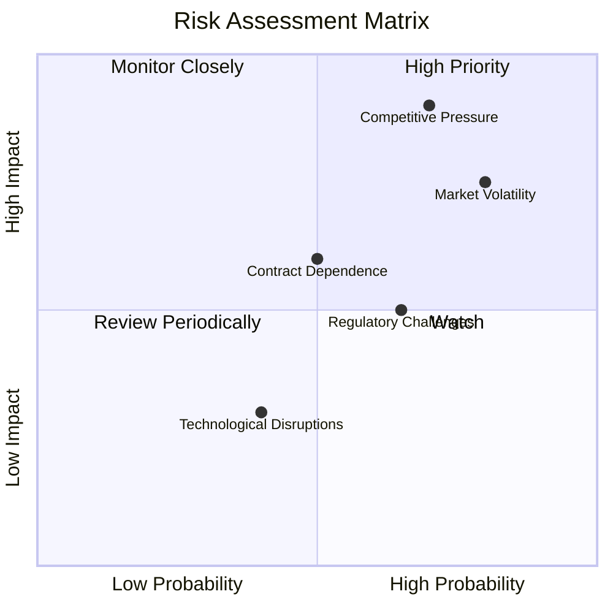

### 9.2 風險清單詳細分析

| # | 風險項目 | 發生機率 | 財務衝擊 | 風險評分 | 緩解措施 |
|---|----------|----------|----------|----------|----------|
| 1 | 🔴 **市場波動** | 高 (80%) | 中等 (-10%收入) | 🔴 8.0/10 | 分散投資組合，增強抵禦性 |
| 2 | 🔴 **競爭壓力** | 高 (70%) | 高 (-15%收入) | 🔴 9.0/10 | 提升技術不斷創新，增加防禦 |
| 3 | 🟡 **合約依賴** | 中度 (50%) | 中等 (-7%收入) | 🟡 6.0/10 | 增進私人企業合約比例 |

---

## 10. 投資建議

### 10.1 最終綜合評級雷達圖

```
╔══════════════════════════════════════════════════════════════════╗
║                  PLTR 最終綜合評級                               ║
╠══════════════════════════════════════════════════════════════════╣
║                                                                  ║
║  基本面強度  9.0                                                ║
║  成長動能    9.0                                                ║
║  獲利品質    9.0                                                ║
║  財務健康    8.0                                                ║
║  估值合理性  8.0                                                ║
║  綜合評分    8.7                                                ║
║                                                                  ║
╚══════════════════════════════════════════════════════════════════╝
```

### 10.2 目標價與隱含報酬率

| 情境 | 目標價 | 隱含報酬率 | 機率權重 |
|------|-------|-----------|--------|
| 基準 | $186.47 | +32% | 60% |
| 樂觀 | $260 | +84% | 25% |
| 悲觀 | $150 | +6% | 15% |

### 10.3 買入時機與觸發因素

```
╔══════════════════════════════════════════════════════════════════╗
║                  ✅ 買入觸發因素 Checklist                      ║
╠══════════════════════════════════════════════════════════════════╣
║                                                                  ║
║  立即買入觸發條件（多數符合）：                                  ║
║  ✅ 持續高於 EBITDA 預期                                        ║
║  ✅ 合約延長率持續90%以上                                        ║
║                                                                  ║
║  加碼觸發條件（出現以下任一）：                                  ║
║  ☐ 新產品線快速增長                                             ║
║  ☐ 新市場擴展初期成功                                           ║
║                                                                  ║
║  減碼/停損觸發條件（出現以下任一）：                             ║
║  ☐ 高競爭造成毛利率顯著下降                                     ║
║  ☐ 失去核心政府合同                                             ║
╚══════════════════════════════════════════════════════════════════╝
```

### 10.4 投資人適配度分析

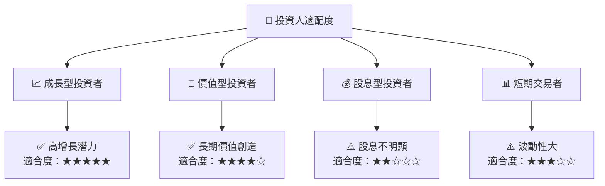

### 10.5 關鍵監控指標

| 類型 | 指標 | 關注點 | 頻率 |
|------|------|------|------|
| 業務增長 | 合約延長率 | 增長預期 | 每季度 |
| 毛利率 | 毛利波動 | 盈利能力指標 | 每季度 |
| 財務健康 | 流動比率 | 流動性保持 | 每半年 |

---

> **免責聲明**：本報告為 AI 自動生成，僅供研究參考，不構成投資建議。投資有風險，入市需謹慎。