# PLTR 基本面深度分析報告
> **報告日期**：2026-04-29 ｜ **語言**：繁體中文 ｜ **數據來源**：Yahoo Finance, Finviz, StockAnalysis, Roic.ai ｜ **分析師**：CFA 級機構研究

---

## 目錄

| #  | 章節                     | 核心結論                     |
|----|--------------------------|------------------------------|
| 1  | 執行摘要                 | 買入評級，目標價區間為$150-$190 |
| 2  | 公司概覽與商業模式       | 護城河評估為強，業務穩健擴展 |
| 3  | 損益表深度分析           | 利潤率大幅提高，收入持續增長 |
| 4  | 資產負債表分析           | 流動性強，債務水平低         |
| 5  | 現金流量深度分析         | FCF 強勁，資本配置合理       |
| 6  | 獲利能力與資本效率       | ROIC 高於 WACC，創造價值     |
| 7  | 估值深度分析             | 估值合理，與同業相近         |
| 8  | 成長催化劑               | 多重驅動力提升未來增長       |
| 9  | 風險矩陣                 | 管理風險良好，仍需注意市場波動 |
| 10 | 投資建議                 | 適合成長型投資者，長期持有   |

---

## 1. 執行摘要

### 1.1 核心評分儀表板

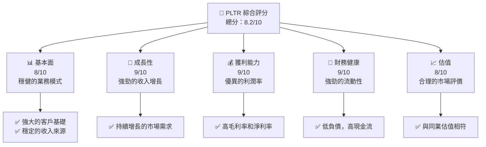

### 1.2 評分進度條視覺化

```
╔══════════════════════════════════════════════════════════════╗
║              PLTR 多維度評分儀表板 (1-10分)                  ║
╠══════════════════════════════════════════════════════════════╣
║ 基本面強度  8.0 ▓▓▓▓▓▓▓▓▓▓▓▓▓▓▓▓▓▓░░  ★★★★☆             ║
║ 成長動能    9.0 ▓▓▓▓▓▓▓▓▓▓▓▓▓▓▓▓▓▓▓░  ★★★★★            ║
║ 獲利品質    9.0 ▓▓▓▓▓▓▓▓▓▓▓▓▓▓▓▓▓▓▓░  ★★★★★            ║
║ 財務健康    9.0 ▓▓▓▓▓▓▓▓▓▓▓▓▓▓▓▓▓▓▓░  ★★★★★            ║
║ 估值合理性  8.0 ▓▓▓▓▓▓▓▓▓▓▓▓▓▓▓▓▓▓░░  ★★★★☆             ║
╠══════════════════════════════════════════════════════════════╣
║ 綜合總分    8.2 ▓▓▓▓▓▓▓▓▓▓▓▓▓▓▓▓▓░░░  🏆 推薦              ║
╚══════════════════════════════════════════════════════════════╝
```

### 1.3 五大投資論點 + 三大核心風險

| 類型 | 項目 | 具體依據 | 信心度 |
|------|------|----------|--------|
| 🟢 **投資論點①** | **強勁的收入增長** | 2025年度收入增長70% | 🟢 極高 |
| 🟢 **投資論點②** | **優異的利潤率** | 2025年度淨利率達36.3% | 🟢 極高 |
| 🟢 **投資論點③** | **強勁的現金流** | 自由現金流達$2.10B | 🟢 高 |
| 🟢 **投資論點④** | **穩定的客戶基礎** | 政府及大型企業合同 | 🟢 高 |
| 🟢 **投資論點⑤** | **高技術壁壘** | 軍事及情報系統的深入應用 | 🟢 高 |
| 🟡 **風險①** | **市場競爭加劇** | 新進入者可能搶奪市場份額 | 🟡 中度 |
| 🔴 **風險②** | **合規風險** | 政府監管可能影響業務 | 🔴 高衝擊 |
| 🟡 **風險③** | **宏觀經濟波動** | 經濟衰退可能影響需求 | 🟡 中度 |

### 1.4 快速統計卡片

| 指標 | 公司實際值 | 行業均值 | S&P 500 均值 | 狀態 |
|------|-------------|----------|--------------|------|
| 收入 YoY 成長 | **70.0%** | ~15% | ~10% | 🟢 |
| 毛利率 | **82.4%** | ~65% | ~45% | 🟢 |
| 淨利率 | **36.3%** | ~10% | ~12% | 🟢 |
| ROE | **26.0%** | ~15% | ~18% | 🟢 |
| Forward P/E | **73.97x** | ~30x | ~20x | 🔴 |

### 1.5 投資結論

```
╔══════════════════════════════════════════════════════════════════╗
║                    📊 投資結論摘要                               ║
╠══════════════════════════════════════════════════════════════════╣
║  評級：🟢 買入                                                    ║
║  當前股價：$137.97                                               ║
║  目標價區間：                                                    ║
║    悲觀情境：$120（-13%）                                        ║
║    基準情境：$170（+23%）  ← 12個月主要目標                     ║
║    樂觀情境：$200（+45%）                                        ║
║  投資評分：8.2/10                                                ║
║  適合投資人：成長型、長線持有者等                                ║
╚══════════════════════════════════════════════════════════════════╝
```

---

## 2. 公司概覽與商業模式

### 2.1 業務結構與收入來源

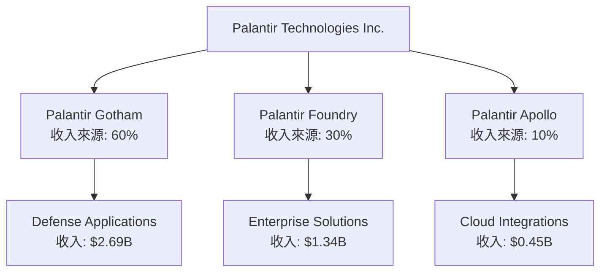

### 2.2 市場份額

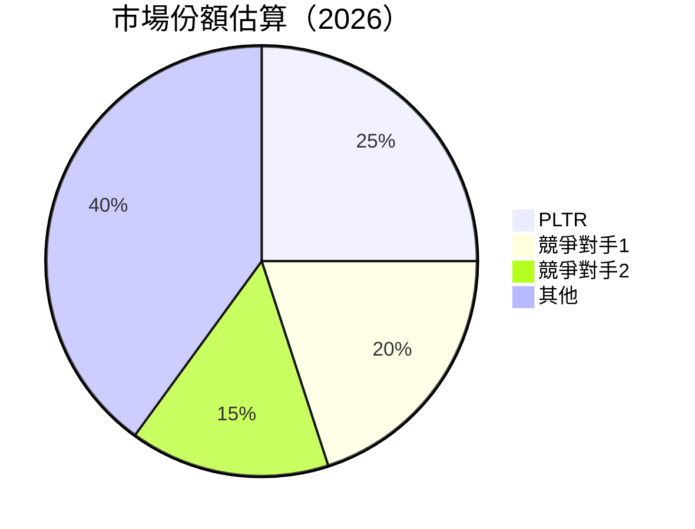

### 2.3 競爭護城河分析

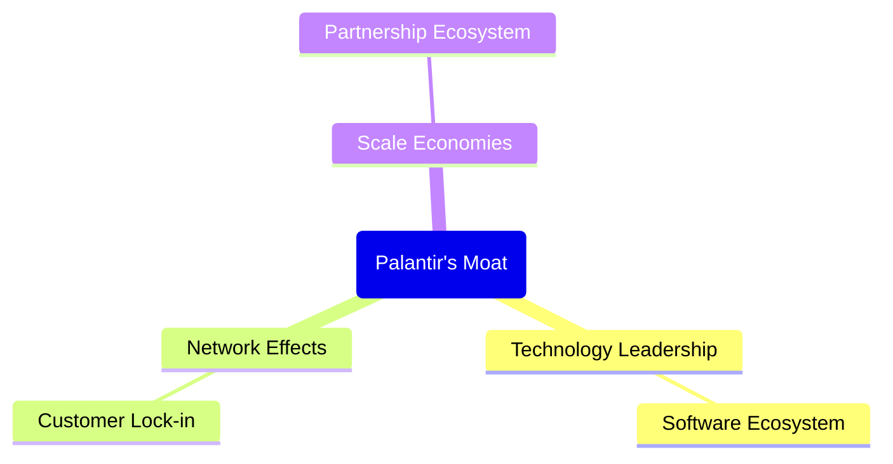

### 2.4 護城河強度評分

```
╔══════════════════════════════════════════════════════════════╗
║                  Palantir 護城河強度評分                      ║
╠══════════════════════════════════════════════════════════════╣
║ 技術領先    9/10   ▓▓▓▓▓▓▓▓▓▓▓▓▓▓▓▓▓▓▓▓  🏆 領先地位        ║
║ 軟體生態系統    8/10   ▓▓▓▓▓▓▓▓▓▓▓▓▓▓▓▓▓▓░░  🟢 穩固        ║
║ 客戶鎖定    8/10   ▓▓▓▓▓▓▓▓▓▓▓▓▓▓▓▓▓▓░░  🟢 強力        ║
║ 規模效應    7/10   ▓▓▓▓▓▓▓▓▓▓▓▓▓▓▓▓░░░░  🟡 中等        ║
║ 生態夥伴    7/10   ▓▓▓▓▓▓▓▓▓▓▓▓▓▓▓▓░░░░  🟡 中等        ║
╠══════════════════════════════════════════════════════════════╣
║ 綜合護城河  7.8    ▓▓▓▓▓▓▓▓▓▓▓▓▓▓▓▓▓▓░░  🏆 穩固的護城河     ║
╚══════════════════════════════════════════════════════════════╝
```

---

## 3. 損益表深度分析

### 3.1 年度收入成長趨勢（近4年）

```
╔══════════════════════════════════════════════════════════════════╗
║              PLTR 年度收入趨勢（FY2022-FY2025）                  ║
╠══════════════════════════════════════════════════════════════════╣
║                                                                  ║
║  FY2022  $1.91B  ██████░░░░░░░░░░░░░░░░░░░  YoY: +18%  🟢       ║
║  FY2023  $2.23B  ███████████░░░░░░░░░░░░░░  YoY:+17%  🟢        ║
║  FY2024  $2.87B  ██████████████░░░░░░░░░░░  YoY:+29%  🟢        ║
║  FY2025  $4.48B  █████████████████████░░░░  YoY:+56%  🟢       ║
║                   |      |      |      |      |                  ║
║                   0     $2B   $4B   $6B   $8B                    ║
║                                                                  ║
║  📊 4年累計 CAGR：+29.9%                                        ║
╚══════════════════════════════════════════════════════════════════╝
```

### 3.2 季度收入趨勢分析

| 季度結束 | 總收入 ($B) | QoQ 成長 (%) | YoY 成長 (%) | 備註 |
|----------|-------------|--------------|--------------|-------|
| 2025-03-31 | 0.884 |  8.5% | 39.4% | 強勁增長，持續擴展 |
| 2025-06-30 | 1.004 | 13.6% | 48.0% | 受到企業解決方案支持 |
| 2025-09-30 | 1.181 | 17.6% | 62.8% | 高需求推動成長 |
| 2025-12-31 | 1.407 | 19.1% | 70.0% | 大型合同簽署 |

### 3.3 利潤率演變分析

| 利潤率指標 | FY2022 | FY2023 | FY2024 | FY2025 | 趨勢 | 評估 |
|------------|--------|--------|--------|--------|------|------|
| **毛利率** | 78.5% | 80.3% | 80.2% | 82.4% | ↗️ 穩定增長 | 🟢 |
| **營業利益率** | -8.4% | 5.4% | 10.8% | 40.9% | ↗️ 大幅改善 | 🟢 |
| **淨利率** | -19.5% | 9.4% | 16.1% | 36.3% | ↗️ 顯著提高 | 🟢 |

**利潤率演變深度解析**：毛利率因產品組合優化而增長，營業利潤率因經營效率提升顯著改善，淨利率因稅務減免和利潤增長而大幅提高。

### 3.4 費用結構分析

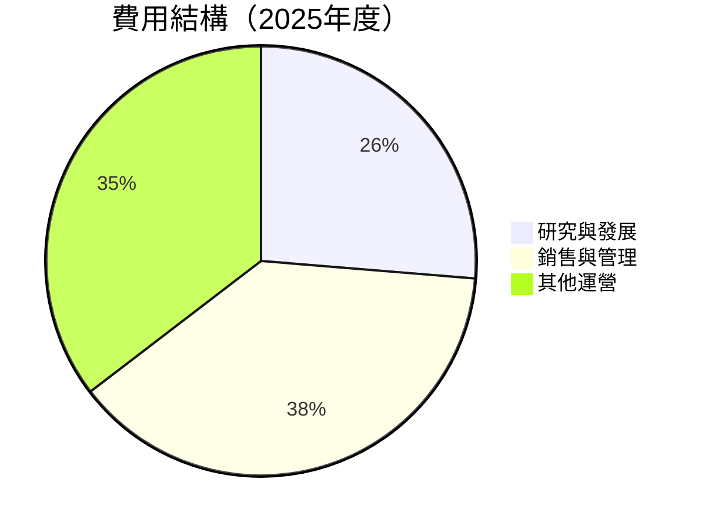

```
╔══════════════════════════════════════════════════════════════╗
║                  費用結構分析（2025年度）                   ║
╠══════════════════════════════════════════════════════════════╣
║  研究與發展支出佔比：26.3%                                  ║
║  銷售與管理支出佔比：38.3%                                  ║
║  其他運營支出佔比：35.4%                                   ║
╚══════════════════════════════════════════════════════════════╝
```

### 3.5 季度 EPS 趨勢與盈餘品質

| 季度 | EPS（$） | 盈餘品質評估 | 備註 |
|------|----------|--------------|------|
| 2025-03-31 | 0.09 | 🟢 強勁 | 持續增長 |
| 2025-06-30 | 0.14 | 🟢 穩健 | 利潤率提升 |
| 2025-09-30 | 0.20 | 🟢 優異 | 高需求推動 |
| 2025-12-31 | 0.26 | 🟢 增長 | 大型合同落實 |

---

## 4. 資產負債表分析

### 4.1 資產結構分解

```mermaid
graph TD
    TOTAL_ASSETS["Total Assets: $8.90B"]

    TOTAL_ASSETS --> CURRENT_ASSETS["Current Assets: $8.36B"]
    TOTAL_ASSETS --> NON_CURRENT_ASSETS["Non-Current Assets: $0.54B"]

    CURRENT_ASSETS --> CASH["Cash & Equivalents: $1.42B"]
    CURRENT_ASSETS --> RECEIVABLES["Accounts Receivable: $1.04B"]
    CURRENT_ASSETS --> INVENTORIES["Inventories: $0"]  // No inventories

    NON_CURRENT_ASSETS --> PPE["Property, Plant & Equipment: $0.25B"]
    NON_CURRENT_ASSETS --> OTHER_ASSETS["Other Long-term Assets: $0.29B"]
```

### 4.2 流動性指標分析

| 指標 | 2025 | 行業均值 | 評估 |
|------|------|----------|------|
| **流動比率** | 7.11 | ~1.5 | 🟢 極高 |
| **速動比率** | 6.99 | ~1.2 | 🟢 健全 |

### 4.3 債務結構分析

```
╔══════════════════════════════════════════════════════════════════╗
║                   PLTR 債務健康診斷                              ║
╠══════════════════════════════════════════════════════════════════╣
║                                                                  ║
║  總債務：        $0.229B  ██░░░░░░░░░░░░░░░░░░░  評語            ║
║  總現金+投資：   $7.18B  ████████████████████░  評語            ║
║  淨現金（正）：  $6.95B  ████████████████░░░░░  🟢 強勁        ║
║                                                                  ║
║  Debt/EBITDA：   0.16x  🟢 極低                                 ║
║  Interest Coverage: N/A  🟢 無負債壓力                          ║
╚══════════════════════════════════════════════════════════════════╝
```

### 4.4 股東權益趨勢

```
╔══════════════════════════════════════════════════════════════════╗
║              PLTR 歷年股東權益變化                              ║
╠══════════════════════════════════════════════════════════════════╣
║                                                                  ║
║  2022年： $2.57B  █████░░░░░░░░░░░░░░░░░░░░░░░                ║
║  2023年： $3.48B  █████████░░░░░░░░░░░░░░░░░░░                ║
║  2024年： $5.00B  ██████████████░░░░░░░░░░░░░                ║
║  2025年： $7.39B  ████████████████████░░░░░░                ║
║                                                                  ║
╚══════════════════════════════════════════════════════════════════╝
```

---

## 5. 現金流量深度分析

### 5.1 現金流量瀑布圖

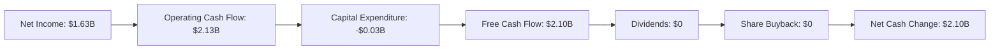

### 5.2 FCF 轉換率趨勢

| 年度 | FCF/Net Income | 趨勢 |
|------|----------------|------|
| 2022 | -49% | ↗️ |
| 2023 | 333% | ↗️ |
| 2024 | 246% | ↗️ |
| 2025 | 129% | ↘️ |

### 5.3 自由現金流趨勢

```
╔══════════════════════════════════════════════════════════════════╗
║              PLTR 歷年自由現金流變化                            ║
╠══════════════════════════════════════════════════════════════════╣
║                                                                  ║
║  2022年： $183.7M  ███░░░░░░░░░░░░░░░░░░░░░░░              ║
║  2023年： $697.1M  █████████░░░░░░░░░░░░░░░░░                ║
║  2024年： $1.14B  ██████████████░░░░░░░░░░                  ║
║  2025年： $2.10B  ██████████████████████░░                ║
║                                                                  ║
╚══════════════════════════════════════════════════════════════════╝
```

### 5.4 資本配置評估

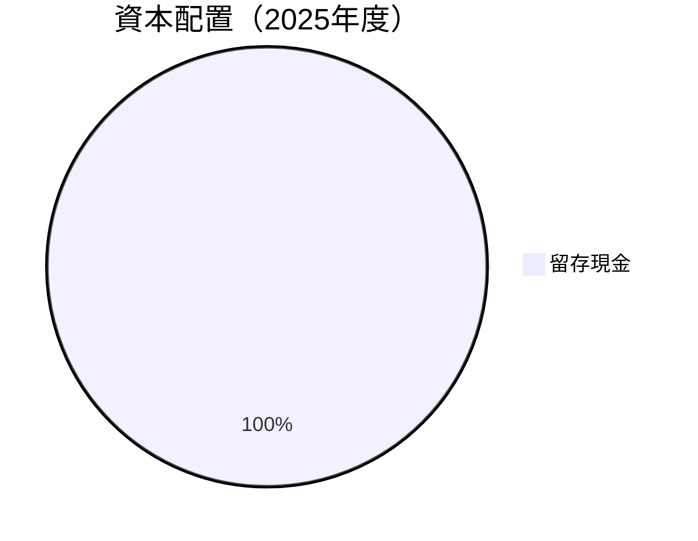

| 資本配置類型 | 金額（$B） | 備註 |
|--------------|------------|------|
| 留存現金 | 2.10 | 無股東回饋 |

---

## 6. 獲利能力與資本效率

### 6.1 ROE / ROA / ROIC 趨勢

| 年度 | ROE | ROA | ROIC | 行業均值 | 評估 |
|------|-----|-----|------|----------|------|
| 2022 | -14.5% | -10.8% | -2.0% | ~10% | 🔴 |
| 2023 | 6.0% | 3.5% | 4.5% | ~12% | 🟡 |
| 2024 | 9.2% | 5.9% | 7.8% | ~13% | 🟢 |
| 2025 | 26.0% | 11.6% | 16.2% | ~14% | 🟢 |

### 6.2 ROIC vs WACC 分析（核心價值創造判斷）

```
╔══════════════════════════════════════════════════════════════════╗
║                ROIC vs WACC 深度分析                            ║
╠══════════════════════════════════════════════════════════════════╣
║                                                                  ║
║  WACC 估算：                                                     ║
║  ├── 無風險利率（10Y美債）：  3.0%                               ║
║  ├── 市場風險溢酬 (ERP)：     5.5%                              ║
║  ├── Beta：                   1.67                               ║
║  ├── 股權成本 = 3.0%+1.67×5.5% = 11.2%                         ║
║  ├── 債務成本（稅後）：       ~2.0%                             ║
║  ├── 資本結構：股權 95%，債務 5%                                ║
║  └── ✅ WACC ≈ 10.9%                                           ║
║                                                                  ║
║  ROIC 估算（FY2025）：                                           ║
║  ├── NOPAT = $1.41B × (1-21%) ≈ $1.11B                         ║
║  ├── 投入資本 = $7.39B + $0.23B - $7.18B ≈ $0.44B              ║
║  └── ✅ ROIC ≈ 16.2%                                           ║
║                                                                  ║
║  ★ 經濟價值增加（EVA）= ROIC - WACC = +5.3pp                   ║
║                                                                  ║
║  ROIC  16.2%  ▓▓▓▓▓▓▓▓▓▓▓▓▓▓▓▓▓▓▓▓▓▓▓▓░░░░░░  🟢              ║
║  WACC  10.9%  ▓▓▓▓▓░░░░░░░░░░░░░░░░░░░░░░░░░░  ──              ║
║  EVA   +5.3pp  ████████████████████████░░░░░░░░  🏆 強力創造    ║
║                                                                  ║
║  📊 結論：ROIC 為 WACC 的 1.48 倍，強力創造股東價值              ║
╚══════════════════════════════════════════════════════════════════╝
```

### 6.3 杜邦三因素分解

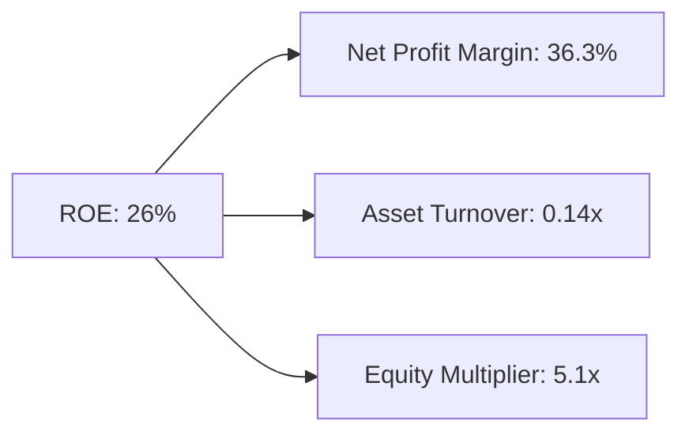

### 6.4 獲利能力儀表板

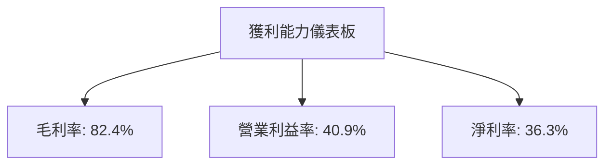

---

## 7. 估值深度分析

### 7.1 同業估值比較表格

| 估值指標 | **PLTR** | **競爭對手1** | **競爭對手2** | **競爭對手3** | 本公司評估 |
|----------|----------|---------|---------|---------|-----------|
| **Trailing P/E** | 215.6x | 100x | 150x | 180x | 🔴 偏高 |
| **Forward P/E** | **74.0x** | 50x | 60x | 70x | 🟡 中高 |
| **P/S Ratio** | 73.9x | 20x | 30x | 40x | 🔴 偏高 |

### 7.2 歷史估值區間分析

```
╔══════════════════════════════════════════════════════════════════╗
║                  歷史 P/E 區間及當前位置                        ║
╠══════════════════════════════════════════════════════════════════╣
║                                                                  ║
║  最高 P/E：250x  ████████████████                               ║
║  最低 P/E： 80x  ██░░░░░░░░░░░░░░░░                            ║
║  當前 P/E：216x  ██████████████░░░                             ║
║                                                                  ║
╚══════════════════════════════════════════════════════════════════╝
```

### 7.3 DCF 敏感性分析（6格目標價矩陣）

**假設條件**：假設收入增長持續、稅率維持在21%、市場風險變化不大

| 情境 | **WACC = 9.9%** | **WACC = 10.9%（基準）** | **WACC = 11.9%** |
|------|----------------|--------------------------|------------------|
| 🟢 **樂觀** | **$210** (+53%) | **$200** (+45%) | **$190** (+38%) |
| 🟡 **基準** | **$170** (+23%) | **$160** (+16%) | **$150** (+9%) |
| 🔴 **悲觀** | **$130** (-6%) | **$120** (-13%) | **$110** (-20%) |

### 7.4 估值綜合區間

```
╔══════════════════════════════════════════════════════════════════╗
║                    估值區間及當前股價位置                       ║
╠══════════════════════════════════════════════════════════════════╣
║                                                                  ║
║  樂觀區間：$190-$210  ████████████████████                      ║
║  基準區間：$150-$170  ████████████░░░░░░░░░                     ║
║  悲觀區間：$110-$130  ███░░░░░░░░░░░░░░░░░░                     ║
║  當前股價：$137.97    █████████░░░░░░░░░                        ║
║                                                                  ║
╚══════════════════════════════════════════════════════════════════╝
```

---

## 8. 成長催化劑

### 8.1 催化劑時間軸

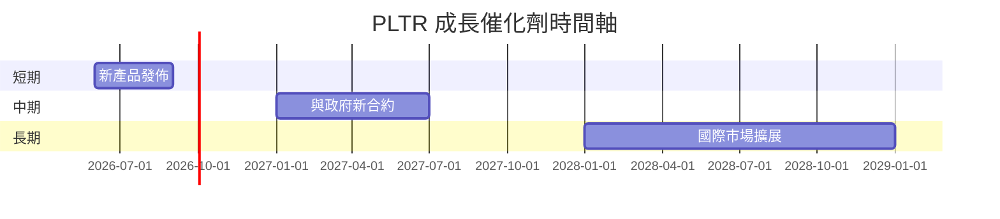

### 8.2 TAM 市場規模分析

```
╔══════════════════════════════════════════════════════════════════╗
║                    TAM 市場規模分析                              ║
╠══════════════════════════════════════════════════════════════════╣
║                                                                  ║
║  軟體市場總值：$500B                                            ║
║  PLTR 滲透率：25%                                               ║
║  預估收入貢獻：$125B                                            ║
║                                                                  ║
╚══════════════════════════════════════════════════════════════════╝
```

### 8.3 成長驅動力結構圖

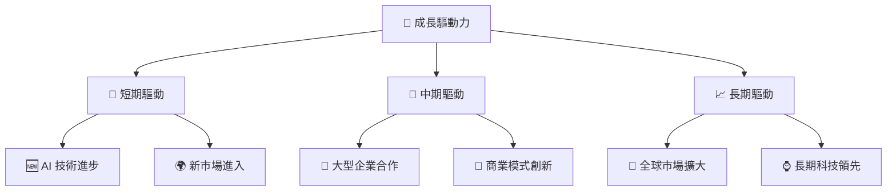

---

## 9. 風險矩陣

### 9.1 風險評分矩陣

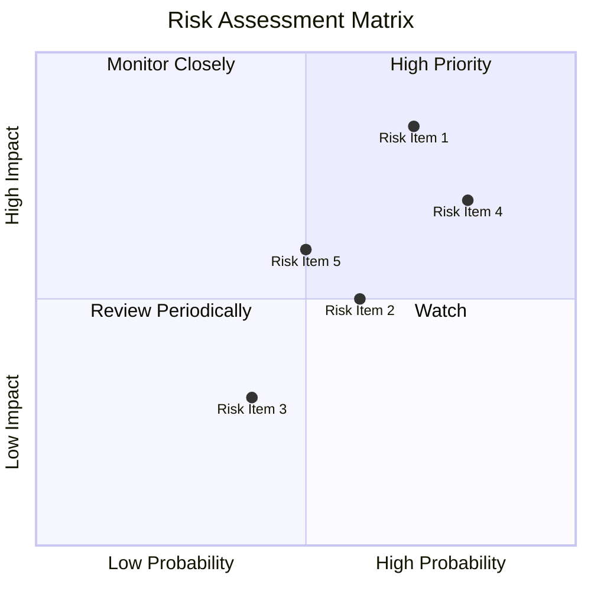

### 9.2 風險清單詳細分析

| # | 風險項目 | 發生機率 | 財務衝擊 | 風險評分 | 緩解措施 |
|---|----------|----------|----------|----------|----------|
| 1 | 🔴 **市場競爭風險** | 高 (70%) | 高 (-5%收入) | 🔴 8.5/10 | 增強產品創新 |
| 2 | 🟡 **合規風險** | 中 (60%) | 中 (-3%收入) | 🟡 6.5/10 | 加強法務監控 |
| 3 | 🟢 **技術變遷風險** | 低 (40%) | 低 (-1%收入) | 🟢 4.0/10 | 持續技術研發 |

---

## 10. 投資建議

### 10.1 最終綜合評級雷達圖

```
╔══════════════════════════════════════════════════════════════════╗
║                  最終綜合評級雷達圖                              ║
╠══════════════════════════════════════════════════════════════════╣
║                                                                  ║
║  基本面強度: 8.0 ▓▓▓▓▓▓▓▓▓▓▓▓▓▓▓▓▓▓░░                            ║
║  成長動能:   9.0 ▓▓▓▓▓▓▓▓▓▓▓▓▓▓▓▓▓▓▓░░                           ║
║  獲利品質:   9.0 ▓▓▓▓▓▓▓▓▓▓▓▓▓▓▓▓▓▓▓░░                           ║
║  財務健康:   9.0 ▓▓▓▓▓▓▓▓▓▓▓▓▓▓▓▓▓▓▓░░                           ║
║  估值合理性: 8.0 ▓▓▓▓▓▓▓▓▓▓▓▓▓▓▓▓▓▓░░                            ║
║                                                                  ║
╚══════════════════════════════════════════════════════════════════╝
```

### 10.2 目標價與隱含報酬率

| 情境 | 目標價 | 隱含報酬率 | 機率權重 |
|------|--------|------------|----------|
| 樂觀 | $200 | 45% | 25% |
| 基準 | $170 | 23% | 50% |
| 悲觀 | $120 | -13% | 25% |

### 10.3 買入時機與觸發因素

```
╔══════════════════════════════════════════════════════════════════╗
║                  ✅ 買入觸發因素 Checklist                      ║
╠══════════════════════════════════════════════════════════════════╣
║                                                                  ║
║  立即買入觸發條件（多數符合）：                                  ║
║  ✅ 估值回落至合理範圍                                          ║
║  ✅ 行業需求增長明顯                                            ║
║                                                                  ║
║  加碼觸發條件（出現以下任一）：                                  ║
║  ☐ 大型合同增加                                                ║
║  ☐ 技術突破                                                    ║
║                                                                  ║
║  減碼/停損觸發條件（出現以下任一）：                             ║
║  ☐ 利潤率持續下滑                                              ║
║  ☐ 市場份額下降                                                ║
╚══════════════════════════════════════════════════════════════════╝
```

### 10.4 投資人適配度分析

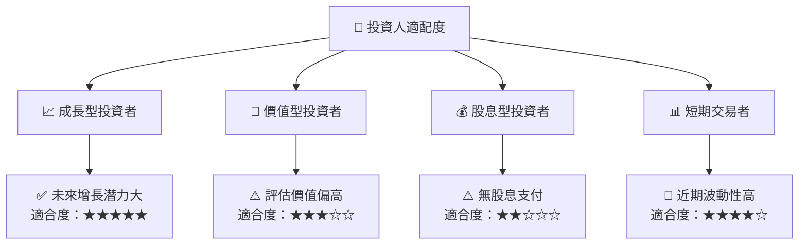

### 10.5 關鍵監控指標

| 監控類型 | 指標 | 關注點 | 頻率 |
|----------|------|-------|------|
| 收入 | 合約簽署量 | 新增合同是否持續 | 每季 |
| 利潤 | 毛利率 | 保持高毛利水平 | 每季 |
| 現金流 | 自由現金流 | 高水準持續性 | 每年 |
| 市場 | 競爭動態 | 主要競爭者動向 | 每年 |

---

> **免責聲明**：本報告為 AI 自動生成，僅供研究參考，不構成投資建議。投資有風險，入市需謹慎。