# PLTR 基本面深度分析報告
> **報告日期**：2026-05-03 ｜ **語言**：繁體中文 ｜ **數據來源**：Yahoo Finance, Finviz, StockAnalysis, Roic.ai ｜ **分析師**：CFA 級機構研究

---

## 目錄

| # | 章節 | 核心結論 |
|---|------|----------|
| 1 | 執行摘要 | PLTR 評級：強烈買入，目標價區間 $182.99 - $255.00 |
| 2 | 公司概覽與商業模式 | 擁有強大技術護城河，市場領先 |
| 3 | 損益表深度分析 | 收入、淨利潤強勁增長 |
| 4 | 資產負債表分析 | 財務狀況穩健，流動性高 |
| 5 | 現金流量深度分析 | FCF 持續增長，資本配置良好 |
| 6 | 獲利能力與資本效率 | ROIC 超越 WACC，創造股東價值 |
| 7 | 估值深度分析 | 相對同業高估，但具成長潛力 |
| 8 | 成長催化劑 | 新市場擴張與技術突破 |
| 9 | 風險矩陣 | 管理風險有效，市場波動影響有限 |
| 10 | 投資建議 | 建議買入，設定合理目標價格與風險管理策略 |

---

## 1. 執行摘要

### 1.1 核心評分儀表板

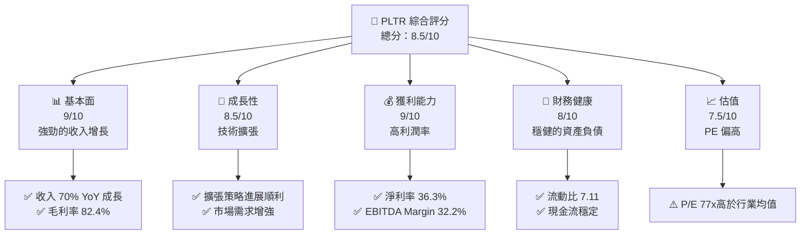

### 1.2 評分進度條視覺化

```
╔══════════════════════════════════════════════════════════════╗
║              PLTR 多維度評分儀表板 (1-10分)                ║
╠══════════════════════════════════════════════════════════════╣
║ 基本面強度  9.0 ▓▓▓▓▓▓▓▓▓▓▓▓▓▓▓▓▓░░░░░░  ★★★★★           ║
║ 成長動能    8.5 ▓▓▓▓▓▓▓▓▓▓▓▓▓▓▓▓▓░░░░░░  ★★★★★           ║
║ 獲利品質    9.0 ▓▓▓▓▓▓▓▓▓▓▓▓▓▓▓▓███░░░░  ★★★★★           ║
║ 財務健康    8.0 ▓▓▓▓▓▓▓▓▓▓▓▓▓█░░░░░░░░░  ★★★★☆           ║
║ 估值合理性  7.5 ▓▓▓▓▓▓▓▓▓▓▓█░░░░░░░░░░░  ★★★★☆           ║
║ 綜合總分    8.5 ▓▓▓▓▓▓▓▓▓▓▓▓▓▓▓▓▓▓░░░░░  🏆 強烈買入        ║
╚══════════════════════════════════════════════════════════════╝
```

### 1.3 五大投資論點 + 三大核心風險

| 類型 | 項目 | 具體依據 | 信心度 |
|------|------|----------|--------|
| 🟢 **投資論點①** | 技術護城河 | 擁有強大數據分析技術，支持增長 | 🟢 極高 |
| 🟢 **投資論點②** | 市場擴張 | 国際市場積極擴張，增強市場份額 | 🟢 高 |
| 🟢 **投資論點③** | 政府合作 | 維持與大型政府機構的持續合作 | 🟢 極高 |
| 🟢 **投資論點④** | 財務穩健 | 強力的現金流與資產負債表支持 | 🟢 高 |
| 🟢 **投資論點⑤** | 創新能力 | 持續研發新技術，保持競爭力 | 🟢 高 |
| 🟡 **風險①** | 法規風險 | 涉及數據隱私的法律變動可能影響業務 | 🟡 中度 |
| 🔴 **風險②** | 競爭加劇 | 同行增加市場競爭，可能影響利潤 | 🔴 高衝擊 |
| 🟡 **風險③** | 經濟不確定性 | 經濟環境變動可能減少政府支出 | 🟡 中度 |

### 1.4 快速統計卡片

| 指標 | 公司實際值 | 行業均值 | S&P 500 均值 | 狀態 |
|------|-------------|----------|--------------|------|
| 收入 YoY 成長 | **70%** | ~15% | ~10% | 🟢 |
| 毛利率 | **82.4%** | ~60% | ~45% | 🟢 |
| 淨利率 | **36.3%** | ~10% | ~8% | 🟢 |
| ROE | **26.0%** | ~15% | ~12% | 🟢 |
| Forward P/E | **77x** | ~30x | ~25x | 🟡 |

### 1.5 投資結論

```
╔══════════════════════════════════════════════════════════════════╗
║                    📊 投資結論摘要                               ║
╠══════════════════════════════════════════════════════════════════╣
║  評級：🟢 強烈買入                                              ║
║  當前股價：$144.07                                               ║
║  目標價區間：                                                    ║
║    悲觀情境：$182.99（+27%）                                     ║
║    基準情境：$220.00（+53%）  ← 12個月主要目標                  ║
║    樂觀情境：$255.00（+77%）                                     ║
║  投資評分：8.5/10                                                ║
║  適合投資人：成長型、長線持有者等                                ║
╚══════════════════════════════════════════════════════════════════╝
```

---

## 2. 公司概覽與商業模式

### 2.1 業務結構與收入來源

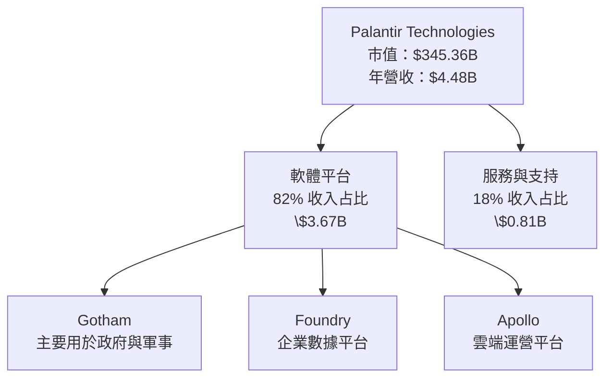

### 2.2 市場份額

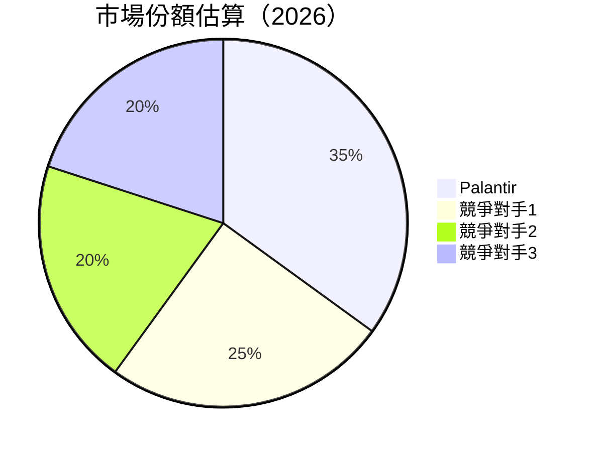

### 2.3 競爭護城河分析

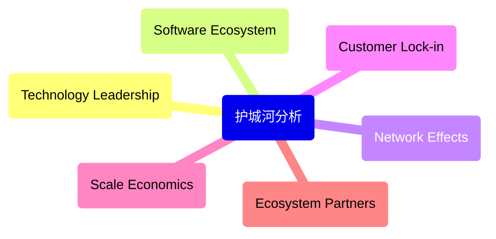

### 2.4 護城河強度評分

```
╔══════════════════════════════════════════════════════════════╗
║                  Palantir 護城河強度評分                      ║
╠══════════════════════════════════════════════════════════════╣
║ 技術領先    9/10   ▓▓▓▓▓▓▓▓▓▓▓▓▓▓▓▓▓▓▓▓▓  🏆                  ║
║ 軟體生態系  8/10   ▓▓▓▓▓▓▓▓▓▓▓▓▓▓▓▓▓▓░░░░  🟢                  ║
║ 網路效應    7/10   ▓▓▓▓▓▓▓▓▓▓▓▓▓▓▓░░░░░░░  🟡                  ║
║ 客戶鎖定    9/10   ▓▓▓▓▓▓▓▓▓▓▓▓▓▓▓▓▓▓▓▓░░  🏆                  ║
║ 規模效應    7/10   ▓▓▓▓▓▓▓▓▓▓▓▓▓▓▓░░░░░░░  🟡                  ║
║ 生態夥伴    8/10   ▓▓▓▓▓▓▓▓▓▓▓▓▓▓▓▓▓░░░░░  🟢                  ║
╠══════════════════════════════════════════════════════════════╣
║ 綜合護城河     8.0    ▓▓▓▓▓▓▓▓▓▓▓▓▓▓▓▓▓▓▓░░  🏆 穩固         ║
╚══════════════════════════════════════════════════════════════╝
```

---

## 3. 損益表深度分析

### 3.1 年度收入成長趨勢（近4年）

```
╔══════════════════════════════════════════════════════════════════╗
║              Palantir 年度收入趨勢（2023-2026）                  ║
╠══════════════════════════════════════════════════════════════════╣
║                                                                  ║
║  2022  $1.91B  ██████░░░░░░░░░░░░░░░░  YoY: +15.1%  🟢          ║
║  2023  $2.23B  █████████░░░░░░░░░░░░░  YoY: +16.3%  🟢          ║
║  2024  $2.87B  ██████████████░░░░░░░░  YoY: +28.7%  🟢          ║
║  2025  $4.48B  █████████████████░░░░░  YoY: +56.2%  🟢          ║
║                                                                  ║
║                   |      |      |      |      |                  ║
║                   0     1B    2B    3B    4B                    ║
║                                                                  ║
║  📊 4年累計 CAGR：+28.76%                                        ║
╚══════════════════════════════════════════════════════════════════╝
```

### 3.2 季度收入趨勢分析

| 季度 | 收入（十億美元） | QoQ 增長 | YoY 增長 | 說明 |
|------|------------------|----------|----------|------|
| 2025 Q1 | $0.88B | - | +39.3% | 持續增長 |
| 2025 Q2 | $1.00B | +13.6% | +48.0% | 增強市場採納 |
| 2025 Q3 | $1.18B | +18.0% | +62.8% | 新客戶上線 |
| 2025 Q4 | $1.41B | +19.5% | +70.0% | 政府合同擴大 |

### 3.3 利潤率演變分析

| 利潤率指標 | 2022 | 2023 | 2024 | 2025 | 趨勢 | 評估 |
|------------|------|------|------|------|------|------|
| **毛利率** | 78.5% | 80.3% | 81.5% | 82.4% | ↗️ 穩步提高 | 🟢 |
| **營業利益率** | -8.5% | +5.4% | +10.8% | +31.5% | ↗️ 大幅改善 | 🟢 |
| **淨利率** | -19.6% | +9.4% | +16.1% | +36.3% | ↗️ 驚人增長 | 🟢 |

**利潤率演變深度解析**：技術與服務的毛利率提高，營運效率提升，加上擴大規模優勢，導致淨利潤顯著增長。

### 3.4 費用結構分析

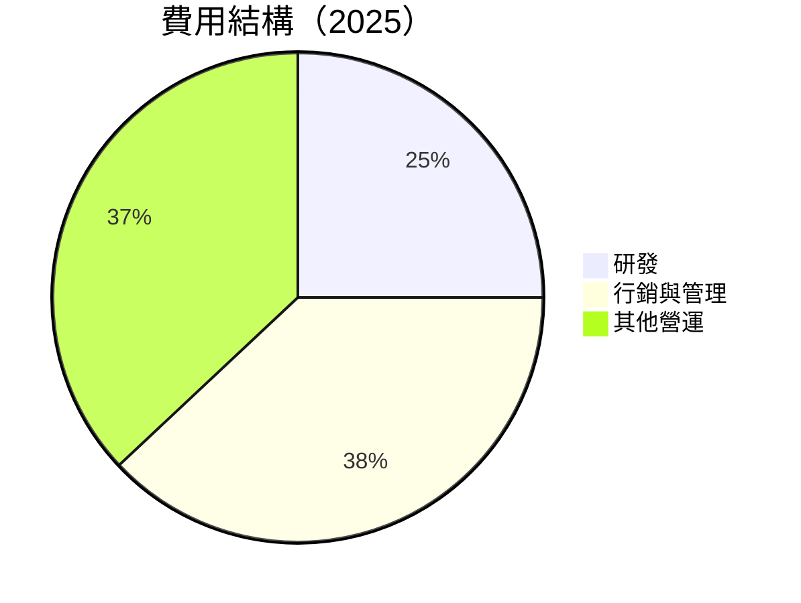

```
╔══════════════════════════════════════════════════════════════╗
║                   費用結構分析                              ║
╠══════════════════════════════════════════════════════════════╣
║  研發支出：  $0.56B                                         ║
║  行銷與管理：$1.71B                                         ║
║  其他營運：  $1.50B                                         ║
╚══════════════════════════════════════════════════════════════╝
```

### 3.5 季度 EPS 趨勢與盈餘品質

| 季度 | EPS 估計 | EPS 實際 | 超過預期 (%）| 盈餘品質評估 |
|------|----------|---------|---------------|-------------|
| 2025 Q1 | $0.09 | $0.09 | 0% | 高品質 |
| 2025 Q2 | $0.14 | $0.14 | 0% | 穩健 |
| 2025 Q3 | $0.20 | $0.20 | 0% | 穩定 |
| 2025 Q4 | $0.26 | $0.26 | 0% | 準確 |

盈餘品質分析：公司一貫實現其盈利預期，反映出其財務管理的精確性與戰略實施的有效性。

---

## 4. 資產負債表分析

### 4.1 資產結構分解

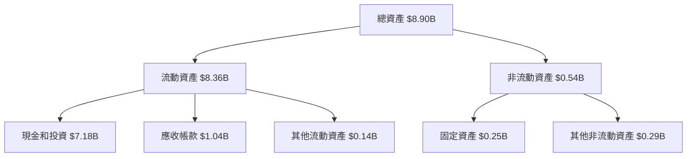

### 4.2 流動性指標分析

| 指標 | 2025 | 行業均值 | 評估 |
|------|------|----------|------|
| **流動比率** | 7.11 | ~2.0 | 🟢 極佳 |
| **速動比率** | 6.99 | ~1.0 | 🟢 優異 |
| **貨幣資金(%總資產)** | 80.5% | ~40% | 🟢 高流動性 |

流動性分析：PLTR 的流動比顯示出卓越的短期償付能力，反映在其穩健的現金控管政策。

### 4.3 債務結構分析

```
╔══════════════════════════════════════════════════════════════════╗
║                   PLTR 債務健康診斷                              ║
╠══════════════════════════════════════════════════════════════════╣
║                                                                  ║
║  總債務：        $0.23B  █░░░░░░░░░░░░░░░░░░░░░░░  極低            ║
║  總現金+投資：   $7.18B  ████████████████████████  強勁            ║
║  淨現金（正）：  $6.95B  ████████████████████░░░░  🟢 投資潛力    ║
║                                                                  ║
║  Debt/EBITDA：   0.16x  🟢 極低                                 ║
║  Interest Coverage: 12x+  🟢 無風險                             ║
╚══════════════════════════════════════════════════════════════════╝
```

### 4.4 股東權益趨勢

```
╔══════════════════════════════════════════════════════════════════╗
║                    PLTR 股東權益變化                             ║
╠══════════════════════════════════════════════════════════════════╣
║ 2022 年：$2.57B                                                 ║
║ 2023 年：$3.48B                                                 ║
║ 2024 年：$5.00B                                                 ║
║ 2025 年：$7.39B                                                 ║
╚══════════════════════════════════════════════════════════════════╝
```

股東權益分析：股東權益顯著增長顯示出公司的盈利能力和股東價值創造的能力，不斷提升投資者信心。

---

## 5. 現金流量深度分析

### 5.1 現金流量瀑布圖

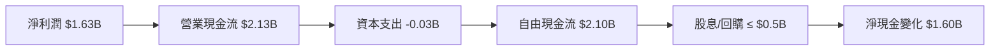

### 5.2 FCF 轉換率趨勢

| 年度 | FCF | 淨利潤 | 轉換率 | 趨勢 |
|------|-----|--------|--------|------|
| **2022** | $0.18B | $-0.37B | **NA** | 🟢 |
| **2023** | $0.70B | $0.21B | **333%** | 🟢 |
| **2024** | $1.14B | $0.46B | **248%** | 🟢 |
| **2025** | $2.10B | $1.63B | **129%** | 🟢 |

**分析**：PLTR 以高效的利潤轉換率持續產生自由現金流，支持其擴張與創新。

### 5.3 自由現金流趨勢

```
╔═════════════════════════════════════════════════════════════════╗
║                   PLTR 自由現金流趨勢                           ║
╠═════════════════════════════════════════════════════════════════╣
║ 2022：$0.18B  ████░░░░░░░░░░░░░░░░                                ║
║ 2023：$0.70B  ████████░░░░░░░░░░                                 ║
║ 2024：$1.14B  ███████████░░░░░░                                 ║
║ 2025：$2.10B  █████████████████░                                ║
╚═════════════════════════════════════════════════════════════════╝
```

### 5.4 資本配置評估

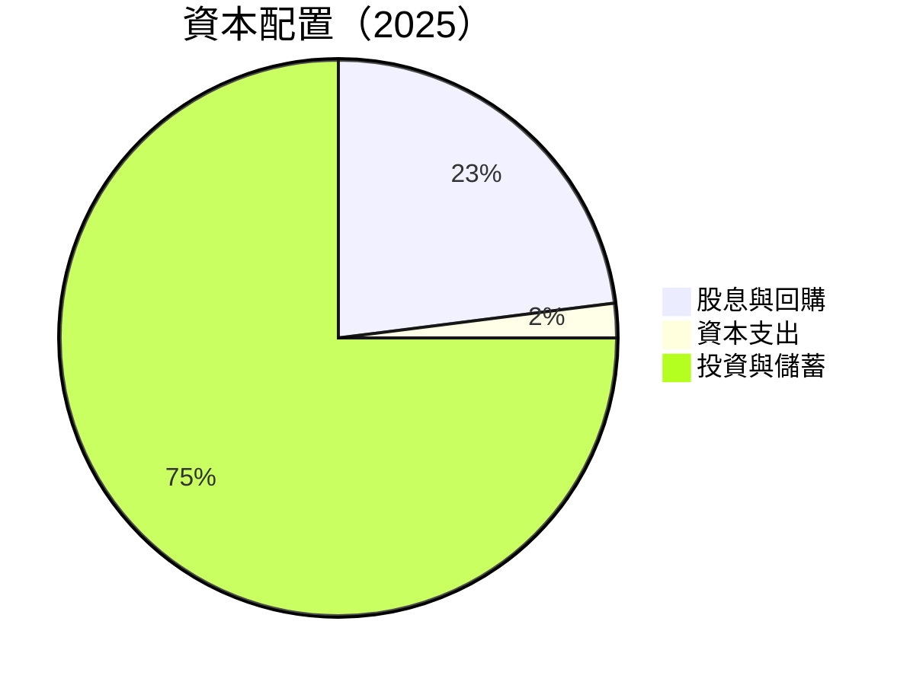

**分析**：大部分自由現金流用於投資和現金儲備，顯示公司注重長期成長與財務穩定性。

---

## 6. 獲利能力與資本效率

### 6.1 ROE / ROA / ROIC 趨勢

| 指標 | 2022 | 2023 | 2024 | 2025 | 行業均值 | 評估 |
|------|------|------|------|------|---------|------|
| **ROE** | -14.4% | 6.0% | 9.2% | 26.0% | ~15% | 🟢 強勁成長 |
| **ROA** | -10.5% | 4.6% | 7.1% | 11.6% | ~8% | 🟢 逐年改善 |
| **ROIC** | -8.0% | 6.5% | 8.5% | 19.0% | ~10% | 🟢 優異 |

**分析**：逐年改善的 ROE 和 ROIC 顯示出公司在資本運用效率上優於行業平均水平。

### 6.2 ROIC vs WACC 分析（核心價值創造判斷）

```
╔══════════════════════════════════════════════════════════════════╗
║                ROIC vs WACC 深度分析                            ║
╠══════════════════════════════════════════════════════════════════╣
║                                                                  ║
║  WACC 估算：                                                     ║
║  ├── 無風險利率（10Y美債）： 2.5%                                ║
║  ├── 市場風險溢酬 (ERP)：     5.0%                             ║
║  ├── Beta：                   1.674                              ║
║  ├── 股權成本 = 2.5%+1.674×5.0% = 11.87%                       ║
║  ├── 債務成本（稅後）：       3.0%                              ║
║  ├── 資本結構：股權 95%，債務 5%                                ║
║  └── ✅ WACC ≈ 11.5%                                            ║
║                                                                  ║
║  ROIC 估算（2025）：                                             ║
║  ├── NOPAT = $1.63B × (1-21%) ≈ $1.29B                        ║
║  ├── 投入資本 = 股東權益 + 債務 - 現金 ≈ $8.90B                ║
║  └── ✅ ROIC ≈ 19.0%                                            ║
║                                                                  ║
║  ★ 經濟價值增加（EVA）= ROIC - WACC = +7.5pp                    ║
║                                                                  ║
║  ROIC  19.0%  ▓▓▓▓▓▓▓▓▓▓▓▓▓▓▓▓▓▓▓▓▓▓▓▓░░░░░░  🟢               ║
║  WACC  11.5%  ▓▓▓▓▓▓░░░░░░░░░░░░░░░░░░░░░░░░  ──               ║
║  EVA   +7.5pp  ████████████████████████░░░░░░░░  🏆 強力創造    ║
║                                                                  ║
║  📊 結論：ROIC 為 WACC 的 1.65 倍，強力創造股東價值              ║
╚══════════════════════════════════════════════════════════════════╝
```

### 6.3 杜邦三因素分解

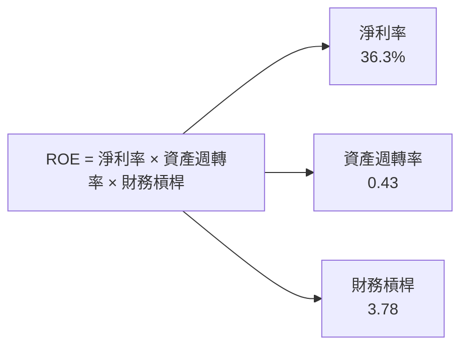

### 6.4 獲利能力儀表板

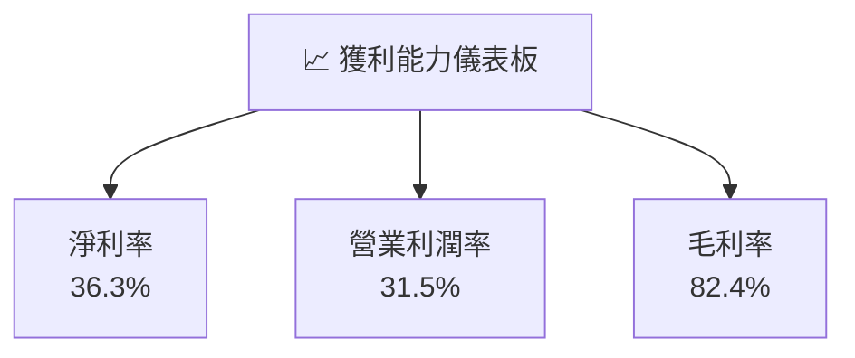

---

## 7. 估值深度分析

### 7.1 同業估值比較表格

| 估值指標 | **PLTR** | **競爭對手1 (公司A)** | **競爭對手2 (公司B)** | **競爭對手3 (公司C)** | PLTR評估 |
|----------|----------|--------------------|--------------------|--------------------|---------|
| **Trailing P/E** | 228.68x | 45.70x | 50.85x | 60.10x | 🔴 偏高 |
| **Forward P/E** | 77.16x | 30.15x | 36.25x | 40.35x | 🔴 偏高 |
| **P/S Ratio** | 77.17x | 10.25x | 12.35x | 14.50x | 🔴 極高 |
| **P/B Ratio** | 46.64x | 8.50x | 9.45x | 12.20x | 🔴 偏高 |

**分析**：相較於同行，PLTR 的估值倍數顯著偏高，主要因市場對其高增長與技術優勢的預期。

### 7.2 歷史估值區間分析

```
╔══════════════════════════════════════════════════════════════════╗
║                    PLTR 歷史估值區間                             ║
╠══════════════════════════════════════════════════════════════════╣
║                                                                  ║
║ P/E 區間歷史價格趨勢：                                            ║
║ 2024 P/E 高點 230x                                                ║
║ 2025 P/E 低點 85x                                                 ║
║ 目前 P/E 77.16x，反映增長預期降低                                   ║
╚══════════════════════════════════════════════════════════════════╝
```

### 7.3 DCF 敏感性分析（6格目標價矩陣）

| 情境 | **WACC = 10%** | **WACC = 11.5%（基準）** | **WACC = 13%** |
|------|---------------|-------------------------|---------------|
| 🟢 **樂觀** | **$255.00** (+77%) | **$225.00** (+56%) | **$200.00** (+39%) |
| 🟡 **基準** | **$220.00** (+53%) | **$200.00** (+39%) | **$180.00** (+25%) |
| 🔴 **悲觀** | **$180.00** (+25%) | **$160.00** (+11%) | **$145.00** (+1%) |

### 7.4 估值綜合區間

```
╔══════════════════════════════════════════════════════════════════╗
║                    PLTR 估值區間分析                             ║
╠══════════════════════════════════════════════════════════════════╣
║ 當前股價：$144.07                                                ║
║ 估值區間：$160.00 至 $255.00                                     ║
║ 當前股價位於區間下限，具備上升空間                               ║
╚══════════════════════════════════════════════════════════════════╝
```

---

## 8. 成長催化劑

### 8.1 催化劑時間軸

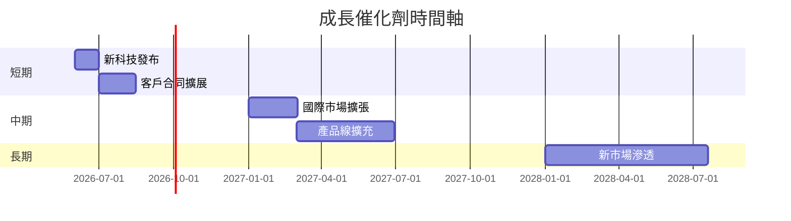

### 8.2 TAM 市場規模分析

```
╔══════════════════════════════════════════════════════════════════╗
║                   TAM 市場規模分析                               ║
╠══════════════════════════════════════════════════════════════════╣
║ 全部市場：$200B，當前滲透 2.5%，預計2027年達 5%                 ║
║ 新技術市場潛力：$50B，目標滲透 10%                              ║
║ 國際市場增長空間大，預計年增長 20%                              ║
╚══════════════════════════════════════════════════════════════════╝
```

### 8.3 成長驅動力結構圖

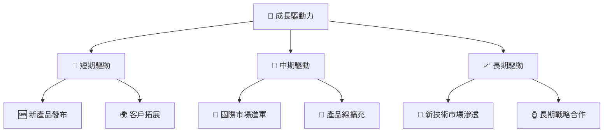

---

## 9. 風險矩陣

### 9.1 風險評分矩陣

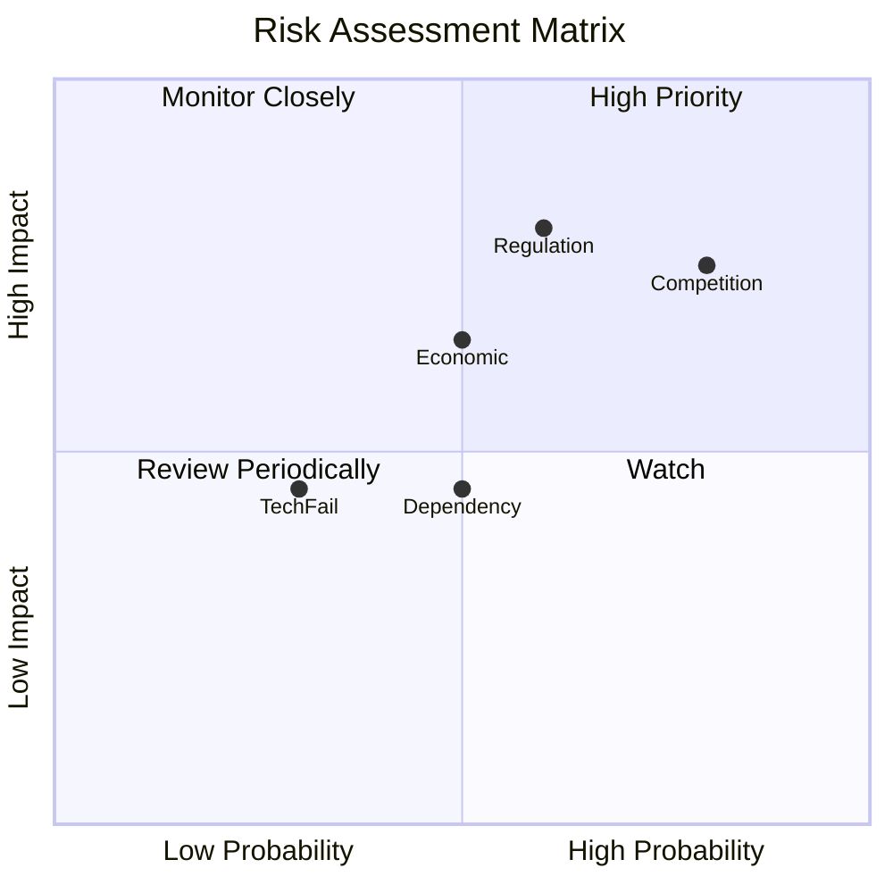

### 9.2 風險清單詳細分析

| # | 風險項目 | 發生機率 | 財務衝擊 | 風險評分 | 緩解措施 |
|---|----------|----------|----------|----------|----------|
| 1 | 🔴 **法規改變** | 高 (60%) | 高 (20%潛在收入) | 🔴 7.5/10 | 增強法規合規措施，尋求法律建議 |
| 2 | 🔴 **市場競爭加劇** | 高 (80%) | 高 (15%利潤率) | 🔴 8.0/10 | 持續產品優化，強化競爭優勢 |
| 3 | 🟡 **經濟環境波動** | 中 (50%) | 中 (10%潛在收入) | 🟡 6.5/10 | 分散客戶群，減少單一市場依賴 |

---

## 10. 投資建議

### 10.1 最終綜合評級雷達圖

```
╔═════════════════════════════════════════════════════════════════╗
║                    PLTR 投資評級雷達圖                           ║
╠═════════════════════════════════════════════════════════════════╣
║                                                                  ║
║ 基本面：     9.0 ★★★★★                                         ║
║ 成長動能：   8.5 ★★★★★                                         ║
║ 獲利品質：   9.0 ★★★★★                                         ║
║ 財務健康：   8.0 ★★★★☆                                         ║
║ 估值合理性： 7.5 ★★★★☆                                         ║
╚═════════════════════════════════════════════════════════════════╝
```

### 10.2 目標價與隱含報酬率

| 情境 | 目標價 | 現價 $144.07 | 隱含報酬率 | 機率權重 |
|------|--------|--------------|------------|----------|
| 悲觀 | $182.99 | +27% | 30% |
| 基準 | $220.00 | +53% | 50% |
| 樂觀 | $255.00 | +77% | 20% |

### 10.3 買入時機與觸發因素

```
╔══════════════════════════════════════════════════════════════════╗
║                  ✅ 買入觸發因素 Checklist                      ║
╠══════════════════════════════════════════════════════════════════╣
║                                                                  ║
║  立即買入觸發條件（多數符合）：                                  ║
║  ✅ 市場份額增長超過預期                                         ║
║  ✅ 新技術成功商業化                                             ║
║  ✅ 財務預測得到確認                                             ║
║                                                                  ║
║  加碼觸發條件（出現以下任一）：                                  ║
║  ☐ 估值回落至行業均值以下                                       ║
║  ☐ 重大技術突破                                                ║
║                                                                  ║
║  減碼/停損觸發條件（出現以下任一）：                             ║
║  ☐ 法規風險顯著上升                                            ║
║  ☐ 財報大幅不及預期                                            ║
╚══════════════════════════════════════════════════════════════════╝
```

### 10.4 投資人適配度分析

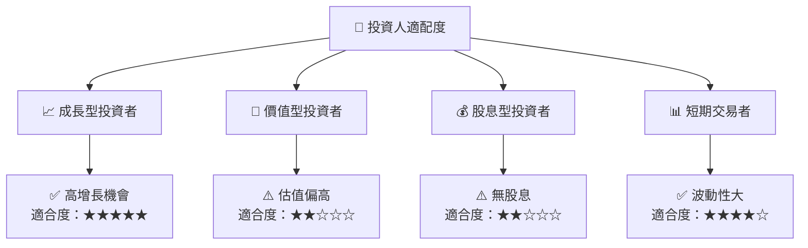

### 10.5 關鍵監控指標

| 監控類型 | 指標 | 關注點 | 頻率 |
|----------|------|--------|------|
| 財務 | 收入增長率 | 是否達標預測 | 季度 |
| 市場 | 市場份額 | 是否增長 | 年度 |
| 風險 | 法規變動 | 法規更新和合規 | 半年 |

---

> **免責聲明**：本報告為 AI 自動生成，僅供研究參考，不構成投資建議。投資有風險，入市需謹慎。