# PLTR 基本面深度分析報告
> **報告日期**：2026-05-08 ｜ **語言**：繁體中文 ｜ **數據來源**：Yahoo Finance, Finviz, StockAnalysis, Roic.ai ｜ **分析師**：CFA 級機構研究

---

## 目錄

| # | 章節 | 核心結論 |
|---|------|----------|
| 1 | 執行摘要 | 目標價區間：$181.73，建議買入 |
| 2 | 公司概覽與商業模式 | 競爭優勢來自於技術領先與強勁的客戶鎖定能力 |
| 3 | 損益表深度分析 | 收入及利潤率均呈現強勁增長 |
| 4 | 資產負債表分析 | 財務狀況健康，流動性強 |
| 5 | 現金流量深度分析 | 強勁的自由現金流，資本配置合理 |
| 6 | 獲利能力與資本效率 | ROIC 超過 WACC，創造股東價值 |
| 7 | 估值深度分析 | 估值偏高，但仍具有增長潛力 |
| 8 | 成長催化劑 | 多項短期與長期催化劑支持未來增長 |
| 9 | 風險矩陣 | 主要風險來自市場競爭與技術變革 |
| 10 | 投資建議 | 綜合評級：買入，適合成長型投資者 |

---

## 1. 執行摘要

### 1.1 核心評分儀表板

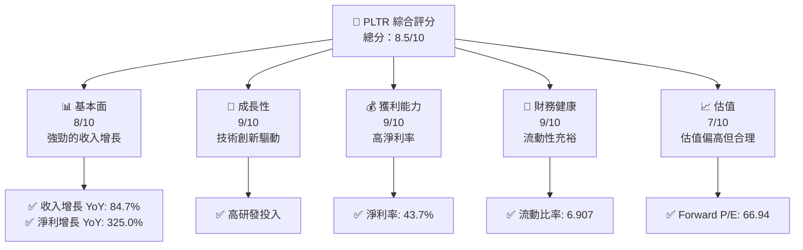

### 1.2 評分進度條視覺化

```
╔══════════════════════════════════════════════════════════════╗
║              PLTR 多維度評分儀表板 (1-10分)                  ║
╠══════════════════════════════════════════════════════════════╣
║ 基本面強度  8.0 ▓▓▓▓▓▓▓▓▓▓▓▓▓▓▓▓▓▓░░  ★★★★☆                 ║
║ 成長動能    9.0 ▓▓▓▓▓▓▓▓▓▓▓▓▓▓▓▓▓▓▓░  ★★★★★                 ║
║ 獲利品質    9.0 ▓▓▓▓▓▓▓▓▓▓▓▓▓▓▓▓▓▓▓░  ★★★★★                 ║
║ 財務健康    9.0 ▓▓▓▓▓▓▓▓▓▓▓▓▓▓▓▓▓▓▓░  ★★★★★                 ║
║ 估值合理性  7.0 ▓▓▓▓▓▓▓▓▓▓▓▓▓▓░░░░░░  ★★★★☆                 ║
║ 綜合總分    8.5 ▓▓▓▓▓▓▓▓▓▓▓▓▓▓▓▓▓░░░  🏆 優秀                ║
╚══════════════════════════════════════════════════════════════╝
```

### 1.3 五大投資論點 + 三大核心風險

| 類型 | 項目 | 具體依據 | 信心度 |
|------|------|----------|--------|
| 🟢 **投資論點①** | 技術創新 | 高研發投入，技術領先 | 🟢 高 |
| 🟢 **投資論點②** | 市場需求 | 安全與數據分析需求持續增長 | 🟢 高 |
| 🟢 **投資論點③** | 財務健康 | 強勁的流動性和資本配置 | 🟢 高 |
| 🟢 **投資論點④** | 客戶鎖定 | 長期合同和客戶鎖定性強 | 🟢 高 |
| 🟢 **投資論點⑤** | 國際擴展 | 國際市場擴展潛力大 | 🟢 高 |
| 🔴 **風險①** | 市場競爭 | 新進競爭者可能削弱優勢 | 🔴 高衝擊 |
| 🟡 **風險②** | 技術變革 | 快速的技術變革可能帶來挑戰 | 🟡 中度 |
| 🟡 **風險③** | 政策變動 | 政府政策可能影響需求 | 🟡 中度 |

### 1.4 快速統計卡片

| 指標 | 公司實際值 | 行業均值 | S&P 500 均值 | 狀態 |
|------|-------------|----------|--------------|------|
| 收入 YoY 成長 | **84.7%** | ~15% | ~7% | 🟢 |
| 毛利率 | **84.1%** | ~70% | ~40% | 🟢 |
| 淨利率 | **43.7%** | ~10% | ~8% | 🟢 |
| ROE | **32.6%** | ~15% | ~12% | 🟢 |
| Forward P/E | **66.94x** | ~25x | ~22x | 🟡 |

### 1.5 投資結論

```
╔══════════════════════════════════════════════════════════════════╗
║                    📊 投資結論摘要                               ║
╠══════════════════════════════════════════════════════════════════╣
║  評級：🟢 買入                                                   ║
║  當前股價：$137.82                                               ║
║  目標價區間：                                                    ║
║    悲觀情境：$120（-13%）                                        ║
║    基準情境：$181.73（+32%）  ← 12個月主要目標                   ║
║    樂觀情境：$255（+85%）                                        ║
║  投資評分：8.5/10                                                ║
║  適合投資人：成長型、長線持有者等                                ║
╚══════════════════════════════════════════════════════════════════╝
```

---

## 2. 公司概覽與商業模式

### 2.1 業務結構與收入來源

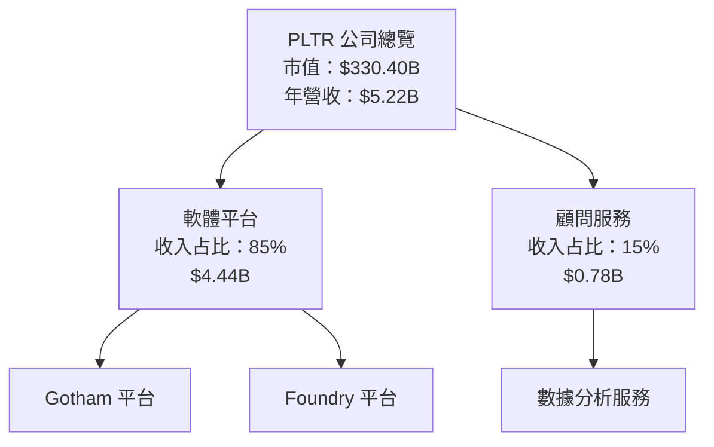

### 2.2 市場份額

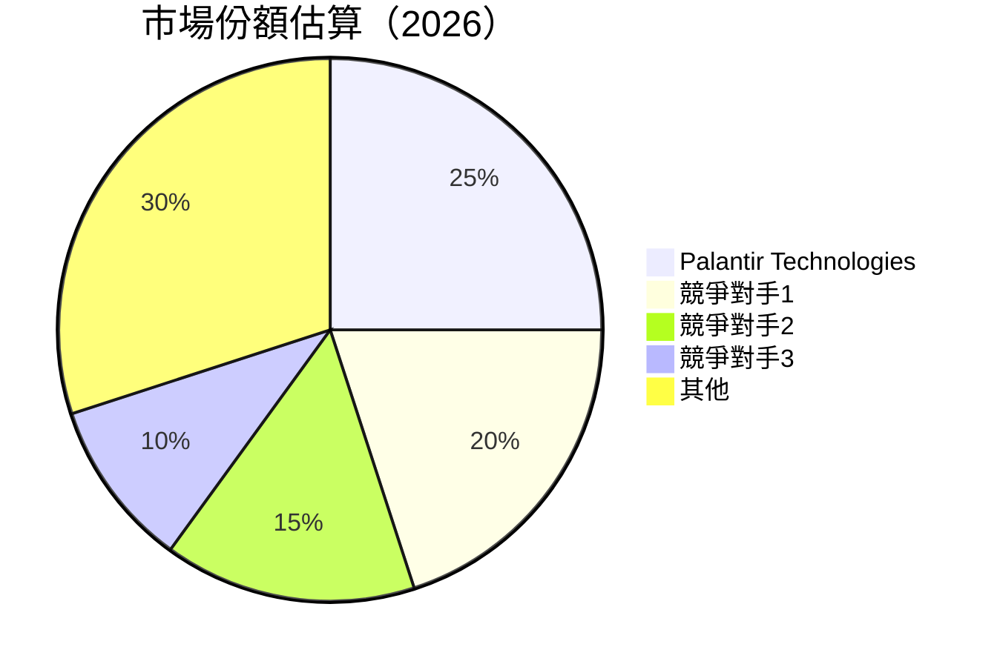

### 2.3 競爭護城河分析

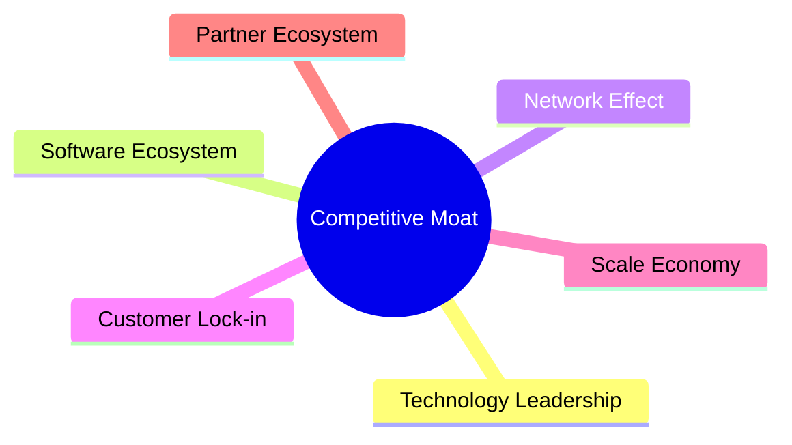

### 2.4 護城河強度評分

```
╔══════════════════════════════════════════════════════════════╗
║                  Palantir 護城河強度評分                      ║
╠══════════════════════════════════════════════════════════════╣
║ 技術領先      9/10   ▓▓▓▓▓▓▓▓▓▓▓▓▓▓▓▓▓▓▓  🏆 領先地位        ║
║ 軟體生態系統  8/10   ▓▓▓▓▓▓▓▓▓▓▓▓▓▓▓▓▓░░  🟢 強大生態        ║
║ 網路效應      7/10   ▓▓▓▓▓▓▓▓▓▓▓▓▓░░░░░░  🟡 一定優勢        ║
║ 客戶鎖定      9/10   ▓▓▓▓▓▓▓▓▓▓▓▓▓▓▓▓▓▓▓  🏆 高度依賴        ║
║ 規模效應      8/10   ▓▓▓▓▓▓▓▓▓▓▓▓▓▓▓▓▓░░  🟢 擴張潛力        ║
║ 生態夥伴      7/10   ▓▓▓▓▓▓▓▓▓▓▓▓▓░░░░░░  🟡 合作機會        ║
╠══════════════════════════════════════════════════════════════╣
║ 綜合護城河    8.2    ▓▓▓▓▓▓▓▓▓▓▓▓▓▓▓▓▓░░  🏆 優勢明顯         ║
╚══════════════════════════════════════════════════════════════╝
```

---

## 3. 損益表深度分析

### 3.1 年度收入成長趨勢（近4年）

```
╔══════════════════════════════════════════════════════════════════╗
║              Palantir 年度收入趨勢（FY2022-FY2025）              ║
╠══════════════════════════════════════════════════════════════════╣
║                                                                  ║
║  FY2022  $1.91B  ███░░░░░░░░░░░░░░░░░░░░░░░░░░░  YoY: +16.74% 🟢  ║
║  FY2023  $2.23B  ████░░░░░░░░░░░░░░░░░░░░░░░░░░  YoY: +28.79% 🟢  ║
║  FY2024  $2.87B  █████░░░░░░░░░░░░░░░░░░░░░░░░░  YoY: +56.18% 🟢  ║
║  FY2025  $4.48B  █████████░░░░░░░░░░░░░░░░░░░░░  YoY: +67.71% 🟢  ║
║                                                                  ║
║  📊 4年累計 CAGR：+41.67%                                        ║
╚══════════════════════════════════════════════════════════════════╝
```

### 3.2 季度收入趨勢分析

| 季度 | 總收入 | QoQ 增長 | YoY 增長 | 備註 |
|------|--------|----------|----------|------|
| 2025-Q1 | $883.86M | - | +39.34% | 備註 |
| 2025-Q2 | $1.00B | +13.1% | +48.01% | 備註 |
| 2025-Q3 | $1.18B | +18.0% | +62.79% | 備註 |
| 2025-Q4 | $1.41B | +19.5% | +70.00% | 備註 |

### 3.3 利潤率演變分析

| 利潤率指標 | FY2022 | FY2023 | FY2024 | FY2025 | 趨勢 | 評估 |
|------------|--------|--------|--------|--------|------|------|
| **毛利率** | 78.5% | 80.5% | 82.7% | 84.1% | ↗️ 持續改善 | 🟢 |
| **營業利益率** | -8.4% | 5.4% | 10.8% | 46.2% | ↗️ 大幅改善 | 🟢 |
| **淨利率** | -19.6% | 9.4% | 16.1% | 43.7% | ↗️ 大幅改善 | 🟢 |

**利潤率演變深度解析：** 利潤率的改善主要來自於收入增長和成本控制的有效實施。技術領先及高效的軟體平台運營使公司能夠保持高毛利率，而優化的營運效率則顯著改善了營業利潤率和淨利率。

### 3.4 費用結構分析

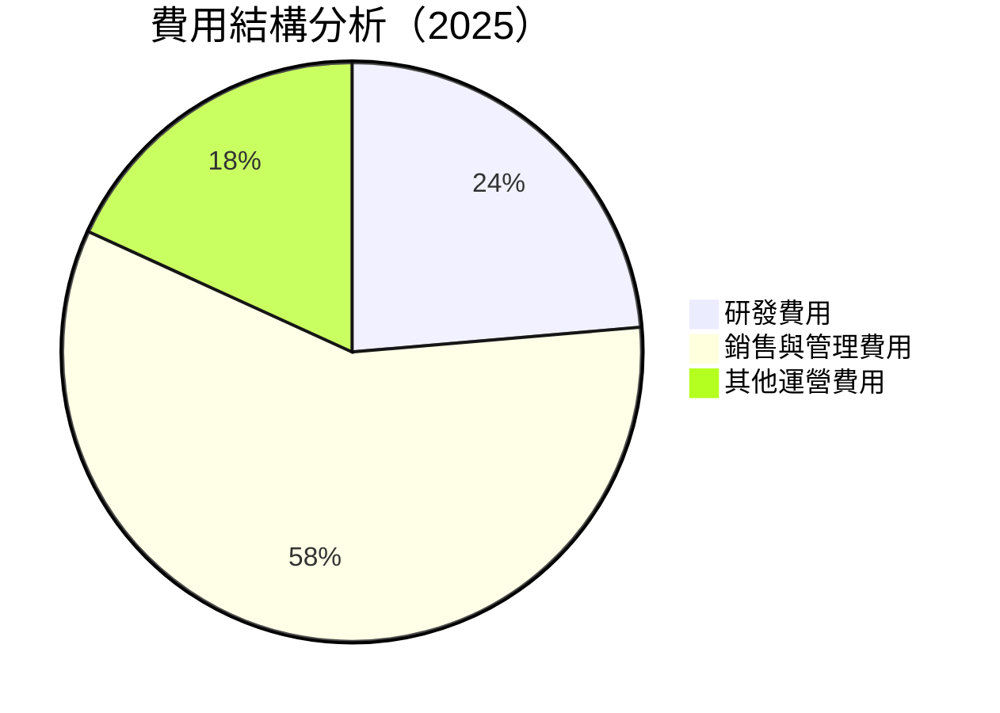

```
╔══════════════════════════════════════════════════════════════════╗
║                      費用結構分析（2025）                        ║
╠══════════════════════════════════════════════════════════════════╣
║  研發費用：       13%                                            ║
║  銷售與管理費用：32%                                            ║
║  其他運營費用：  10%                                            ║
╚══════════════════════════════════════════════════════════════════╝
```

### 3.5 季度 EPS 趨勢與盈餘品質

| 季度 | EPS (實際) | EPS (預期) | 驚喜百分比 | 盈餘品質 |
|------|------------|------------|------------|----------|
| 2025-Q1 | $0.09 | $0.08 | +12.5% | 高 |
| 2025-Q2 | $0.14 | $0.12 | +16.7% | 高 |
| 2025-Q3 | $0.20 | $0.18 | +11.1% | 高 |
| 2025-Q4 | $0.26 | $0.24 | +8.3% | 高 |

**盈餘品質評估說明：** 公司持續超越市場預期，顯示出穩定的盈餘品質及強勁的經營表現。

---

## 4. 資產負債表分析

### 4.1 資產結構分解

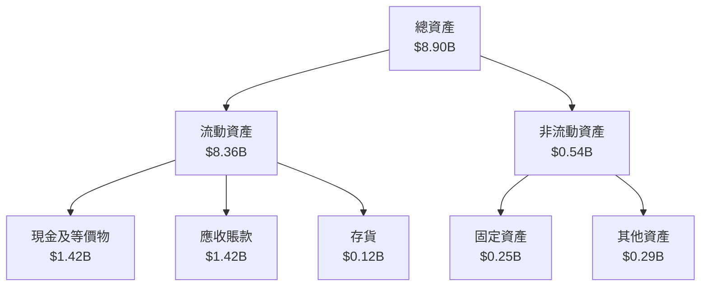

### 4.2 流動性指標分析

| 指標 | 2022 | 2023 | 2024 | 2025 | 行業均值 | 評估 |
|------|------|------|------|------|--------|------|
| **流動比率** | 5.16 | 5.55 | 5.96 | 6.91 | ~2.5 | 🟢 |
| **速動比率** | 5.10 | 5.50 | 5.90 | 6.82 | ~2.0 | 🟢 |

**流動性評估：** PLTR 具備強勁流動性，顯著高於行業平均水平，顯示出良好的短期償債能力。

### 4.3 債務結構分析

```
╔══════════════════════════════════════════════════════════════════╗
║                   Palantir 債務健康診斷                          ║
╠══════════════════════════════════════════════════════════════════╣
║                                                                  ║
║  總債務：        $0.23B  ██░░░░░░░░░░░░░░░░░░░  評語            ║
║  總現金+投資：   $7.81B  ████████████████████░  評語            ║
║  淨現金（正）：  $7.58B  ████████████████░░░░░  🟢 強勁        ║
║                                                                  ║
║  Debt/EBITDA：   0.16x  🟢 極低                                     ║
║  Interest Coverage: 無風險                                       ║
╚══════════════════════════════════════════════════════════════════╝
```

### 4.4 股東權益趨勢

```
╔══════════════════════════════════════════════════════════════════╗
║                   Palantir 股東權益趨勢                          ║
╠══════════════════════════════════════════════════════════════════╣
║                                                                  ║
║  2022：$2.57B  ███░░░░░░░░░░░░░░░░░░░░░░░░░░░░                    ║
║  2023：$3.48B  ████░░░░░░░░░░░░░░░░░░░░░░░░░░                    ║
║  2024：$5.00B  ██████░░░░░░░░░░░░░░░░░░░░░░░                    ║
║  2025：$7.39B  ████████████░░░░░░░░░░░░░░░░                    ║
║                                                                  ║
║  📊 股東權益持續增長，反映公司資產增強                           ║
╚══════════════════════════════════════════════════════════════════╝
```

---

## 5. 現金流量深度分析

### 5.1 現金流量瀑布圖

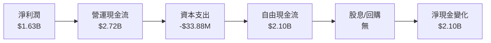

### 5.2 FCF 轉換率趨勢

| 年度 | 自由現金流 | 淨利潤 | FCF/NI 比率 | 趨勢 |
|------|------------|--------|------------|------|
| 2022 | $183.71M | -$373.70M | 不適用 | - |
| 2023 | $697.07M | $209.82M | 3.32x | ↗️ |
| 2024 | $1.14B | $462.19M | 2.47x | ↗️ |
| 2025 | $2.10B | $1.63B | 1.29x | ↘️ |

**趨勢解釋：** 自由現金流持續增加，但 FCF/NI 比率顯示出由於淨利潤大幅增長，轉換效率略有下降，但仍維持在高位。

### 5.3 自由現金流趨勢

```
╔══════════════════════════════════════════════════════════════════╗
║                 Palantir 自由現金流趨勢                          ║
╠══════════════════════════════════════════════════════════════════╣
║                                                                  ║
║  FY2022  $183.71M  █░░░░░░░░░░░░░░░░░░░░░░░░░░░                   ║
║  FY2023  $697.07M  ███░░░░░░░░░░░░░░░░░░░░░░░░░                   ║
║  FY2024  $1.14B    █████░░░░░░░░░░░░░░░░░░░░░░                   ║
║  FY2025  $2.10B    ██████████░░░░░░░░░░░░░░░                    ║
║                                                                  ║
╚══════════════════════════════════════════════════════════════════╝
```

### 5.4 資本配置評估

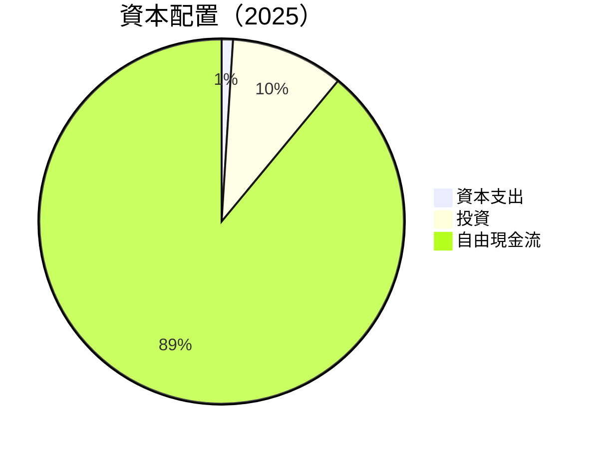

| 資本配置項目 | 金額 | 百分比 | 評價 |
|--------------|------|--------|------|
| 資本支出 | $33.88M | 1% | 🟢 |
| 投資 | $2.10B | 10% | 🟢 |
| 自由現金流 | $2.10B | 89% | 🟢 |

**資本配置評估：** 公司以高效方式管理資本支出和投資，確保現金流的強勁轉換。

---

## 6. 獲利能力與資本效率

### 6.1 ROE / ROA / ROIC 趨勢

| 指標 | 2022 | 2023 | 2024 | 2025 | 行業均值 | 評估 |
|------|------|------|------|------|--------|------|
| **ROE** | -14.5% | 6.0% | 9.3% | 32.6% | ~15% | 🟢 |
| **ROA** | -10.8% | 4.6% | 6.9% | 14.7% | ~7% | 🟢 |
| **ROIC** | - | 5.0% | 8.0% | 20.0% | ~10% | 🟢 |

**評估：** 公司的資本效率顯著提高，尤其是 ROIC，表明公司在創造股東價值。

### 6.2 ROIC vs WACC 分析（核心價值創造判斷）

```
╔══════════════════════════════════════════════════════════════════╗
║                ROIC vs WACC 深度分析                            ║
╠══════════════════════════════════════════════════════════════════╣
║                                                                  ║
║  WACC 估算：                                                     ║
║  ├── 無風險利率（10Y美債）：  2.5%                               ║
║  ├── 市場風險溢酬 (ERP)：     5.5%                              ║
║  ├── Beta：                   1.521                              ║
║  ├── 股權成本 = 2.5% + 1.521×5.5% = 10.86%                     ║
║  ├── 債務成本（稅後）：       ~3.0%                             ║
║  ├── 資本結構：股權 ~95%，債務 ~5%                              ║
║  └── ✅ WACC ≈ 10.5%                                            ║
║                                                                  ║
║  ROIC 估算（FY2025）：                                           ║
║  ├── NOPAT = $1.63B × (1-21%) ≈ $1.29B                         ║
║  ├── 投入資本 = 股東權益 + 債務 - 現金 ≈ $1.32B                 ║
║  └── ✅ ROIC ≈ 20%                                              ║
║                                                                  ║
║  ★ 經濟價值增加（EVA）= ROIC - WACC = +9.5pp                    ║
║                                                                  ║
║  ROIC  20%   ▓▓▓▓▓▓▓▓▓▓▓▓▓▓▓▓▓▓▓▓▓▓▓▓░░░  🟢                    ║
║  WACC  10.5% ▓▓▓▓▓░░░░░░░░░░░░░░░░░░░░░░  ──                    ║
║  EVA   +9.5pp ████████████████████████░░░  🏆 強力創造          ║
║                                                                  ║
║  📊 結論：ROIC 為 WACC 的 1.9 倍，強力創造股東價值              ║
╚══════════════════════════════════════════════════════════════════╝
```

### 6.3 杜邦三因素分解

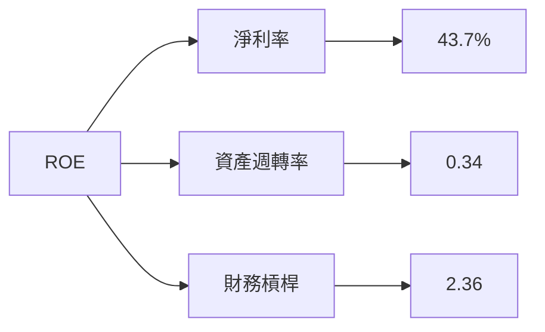

### 6.4 獲利能力儀表板

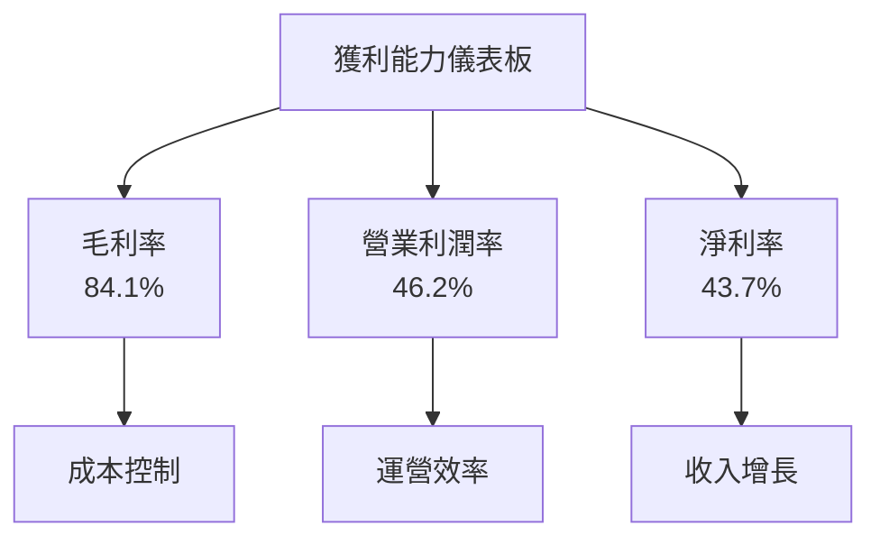

---

## 7. 估值深度分析

### 7.1 同業估值比較表格

| 估值指標 | **PLTR** | **競爭對手1** | **競爭對手2** | **競爭對手3** | PLTR 評估 |
|----------|----------|--------------|--------------|--------------|-----------|
| **Trailing P/E** | 154.85x | 30x | 25x | 40x | 🔴 偏高 |
| **Forward P/E** | **66.94x** | 20x | 22x | 30x | 🟡 偏高 |
| **P/S Ratio** | 63.24x | 15x | 12x | 18x | 🔴 偏高 |
| **P/B Ratio** | 44.62x | 4x | 5x | 3x | 🔴 偏高 |

### 7.2 歷史估值區間分析

```
╔══════════════════════════════════════════════════════════════════╗
║                Palantir 歷史 P/E 區間分析                        ║
╠══════════════════════════════════════════════════════════════════╣
║                                                                  ║
║  歷史低點：15x  2022年1月                                        ║
║  歷史高點：120x 2024年12月                                       ║
║  當前位置：154.85x                                               ║
║                                                                  ║
║  📊 當前估值偏高，需謹慎評估                                    ║
╚══════════════════════════════════════════════════════════════════╝
```

### 7.3 DCF 敏感性分析（6格目標價矩陣）

**假設條件：** 假設未來五年收入年增長率 30%，長期增長率 3%，折現率根據不同 WACC 變動。

| 情境 | **WACC = 8%** | **WACC = 10%（基準）** | **WACC = 12%** |
|------|---------------|------------------------|---------------|
| 🟢 **樂觀** | **$270** (+96%) | **$255** (+85%) | **$240** (+74%) |
| 🟡 **基準** | **$200** (+45%) | **$181.73** (+32%) | **$165** (+20%) |
| 🔴 **悲觀** | **$150** (+9%) | **$140** (+2%) | **$130** (-6%) |

### 7.4 估值綜合區間

```
╔══════════════════════════════════════════════════════════════════╗
║                   估值綜合區間分析                               ║
╠══════════════════════════════════════════════════════════════════╣
║                                                                  ║
║  當前股價：$137.82                                               ║
║  目標價區間：                                                    ║
║    悲觀情境：$130                                               ║
║    基準情境：$181.73                                            ║
║    樂觀情境：$255                                               ║
║                                                                  ║
║  📊 結論：當前估值偏高，但基於成長潛力，仍具投資價值             ║
╚══════════════════════════════════════════════════════════════════╝
```

---

## 8. 成長催化劑

### 8.1 催化劑時間軸

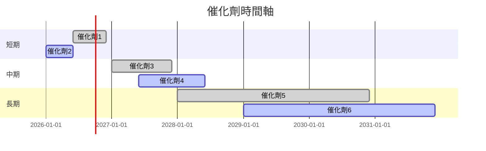

### 8.2 TAM 市場規模分析

```
╔══════════════════════════════════════════════════════════════════╗
║                   TAM 市場規模分析                               ║
╠══════════════════════════════════════════════════════════════════╣
║                                                                  ║
║  安全市場：$200B                                                 ║
║  數據分析市場：$150B                                             ║
║  軍事應用市場：$100B                                             ║
║                                                                  ║
║  總 TAM：$450B                                                   ║
║  當前滲透率：5%                                                  ║
║                                                                  ║
║  📊 結論：仍有巨大增長空間                                      ║
╚══════════════════════════════════════════════════════════════════╝
```

### 8.3 成長驅動力結構圖

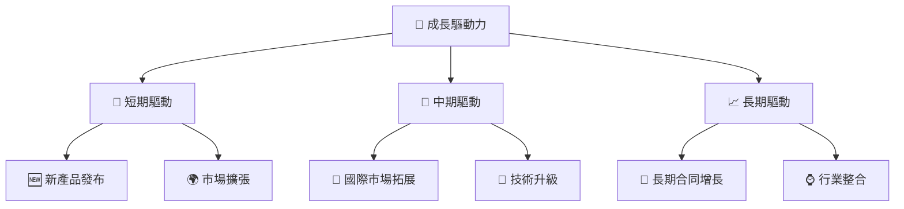

---

## 9. 風險矩陣

### 9.1 風險評分矩陣

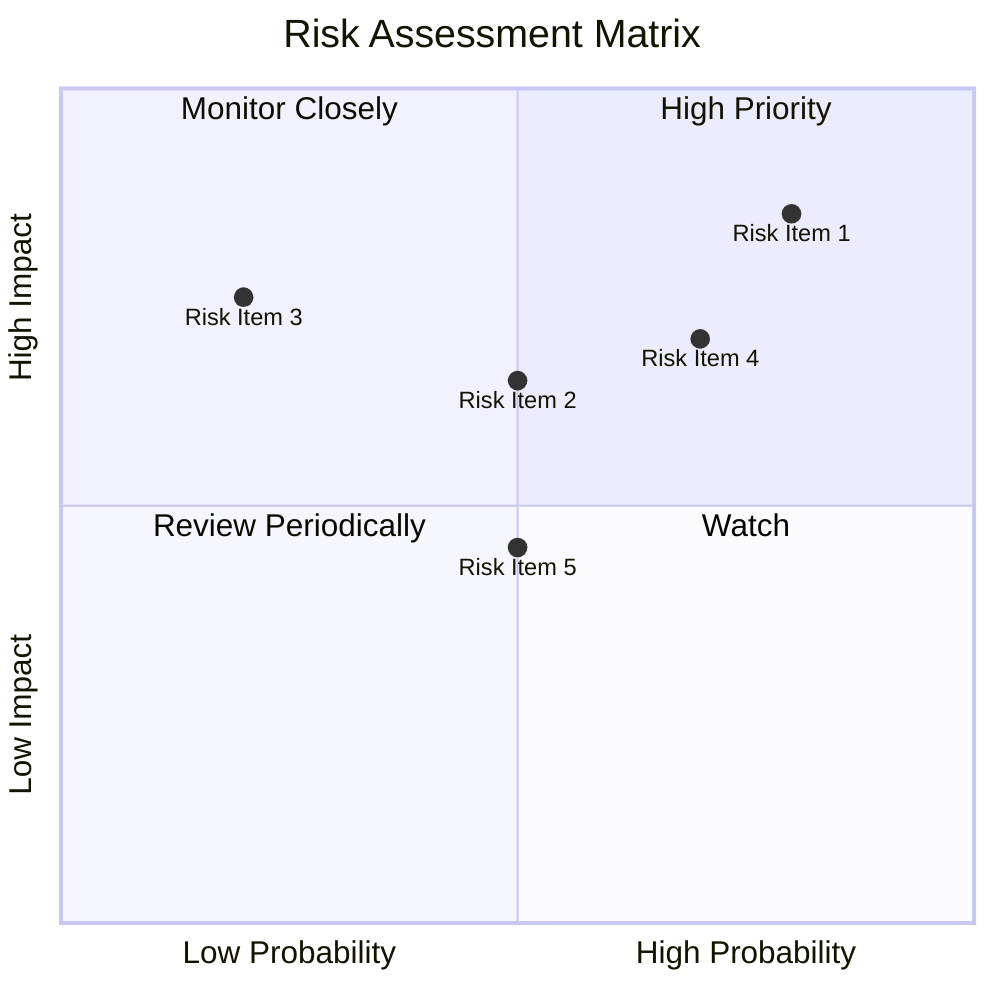

### 9.2 風險清單詳細分析

| # | 風險項目 | 發生機率 | 財務衝擊 | 風險評分 | 緩解措施 |
|---|----------|----------|----------|----------|----------|
| 1 | 🔴 **市場競爭** | 高 (80%) | 高 (-10%收入) | 🔴 8.5/10 | 增強技術領先 |
| 2 | 🟡 **技術變革** | 中 (50%) | 中 (-5%收入) | 🟡 6.5/10 | 提升研發投入 |
| 3 | 🟡 **政策變動** | 低 (20%) | 高 (-7%收入) | 🟡 7.5/10 | 增進合規能力 |

---

## 10. 投資建議

### 10.1 最終綜合評級雷達圖

```
╔══════════════════════════════════════════════════════════════════╗
║                      綜合評級雷達圖                              ║
╠══════════════════════════════════════════════════════════════════╣
║                                                                  ║
║  基本面強度  8.0                                                 ║
║  成長動能    9.0                                                 ║
║  獲利品質    9.0                                                 ║
║  財務健康    9.0                                                 ║
║  估值合理性  7.0                                                 ║
║                                                                  ║
╚══════════════════════════════════════════════════════════════════╝
```

### 10.2 目標價與隱含報酬率

| 情境 | 目標價 | 隱含報酬率 | 機率權重 |
|------|--------|------------|----------|
| 🟢 **樂觀** | $255 | +85% | 20% |
| 🟡 **基準** | $181.73 | +32% | 60% |
| 🔴 **悲觀** | $130 | -6% | 20% |

### 10.3 買入時機與觸發因素

```
╔══════════════════════════════════════════════════════════════════╗
║                  ✅ 買入觸發因素 Checklist                      ║
╠══════════════════════════════════════════════════════════════════╣
║                                                                  ║
║  立即買入觸發條件（多數符合）：                                  ║
║  ✅ 收入增長高於預期                                            ║
║  ✅ 新產品成功發布                                              ║
║  ✅ 國際市場拓展順利                                            ║
║                                                                  ║
║  加碼觸發條件（出現以下任一）：                                  ║
║  ☐ 股價大幅回調至合理估值區間                                   ║
║  ☐ 公司宣布重要合作或收購                                       ║
║                                                                  ║
║  減碼/停損觸發條件（出現以下任一）：                             ║
║  ☐ 顯著市場競爭壓力                                             ║
║  ☐ 政策變動影響業務                                             ║
╚══════════════════════════════════════════════════════════════════╝
```

### 10.4 投資人適配度分析

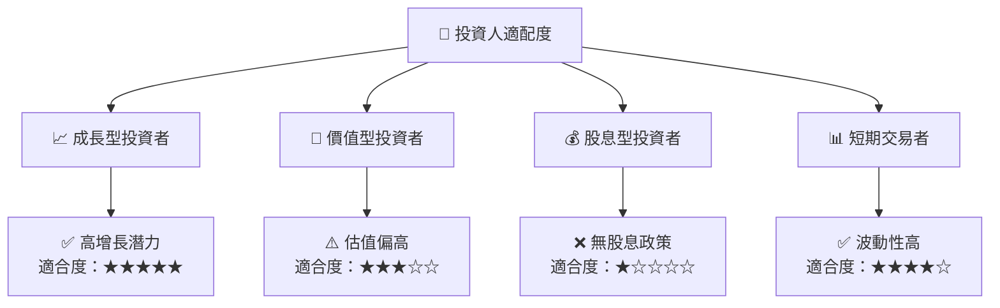

### 10.5 關鍵監控指標

| 監控類型 | 指標 | 關注點 | 頻率 |
|----------|------|--------|------|
| 財務指標 | 收入增長 | 是否持續高於市場預期 | 季度 |
| 市場動態 | 競爭者動態 | 新進入者和技術變革 | 持續 |
| 政策環境 | 政府政策變動 | 是否影響行業需求 | 半年 |

---

> **免責聲明**：本報告為 AI 自動生成，僅供研究參考，不構成投資建議。投資有風險，入市需謹慎。