# PLTR 基本面深度分析報告
> **報告日期**：2026-05-09 ｜ **語言**：繁體中文 ｜ **數據來源**：Yahoo Finance, Finviz, StockAnalysis, Roic.ai ｜ **分析師**：CFA 級機構研究

---

## 目錄

| # | 章節 | 核心結論 |
|---|------|----------|
| 1 | 執行摘要 | 強烈買入，目標價範圍：$181.73 |
| 2 | 公司概覽與商業模式 | 擁有強大的技術領先優勢和客戶鎖定能力 |
| 3 | 損益表深度分析 | 營收和淨利潤呈現強勁增長，利潤率顯著提升 |
| 4 | 資產負債表分析 | 資產負債表健康，流動比率高，債務負擔低 |
| 5 | 現金流量深度分析 | 自由現金流強健，資本配置合理 |
| 6 | 獲利能力與資本效率 | ROIC 遠超 WACC，持續創造股東價值 |
| 7 | 估值深度分析 | 相對競爭對手估值偏高，但成長性支持 |
| 8 | 成長催化劑 | 多重業務和市場拓展驅動未來增長 |
| 9 | 風險矩陣 | 高市值波動風險，需密切關注 |
| 10 | 投資建議 | 適合成長型投資者，具備長期潛力 |

---

## 1. 執行摘要

### 1.1 核心評分儀表板

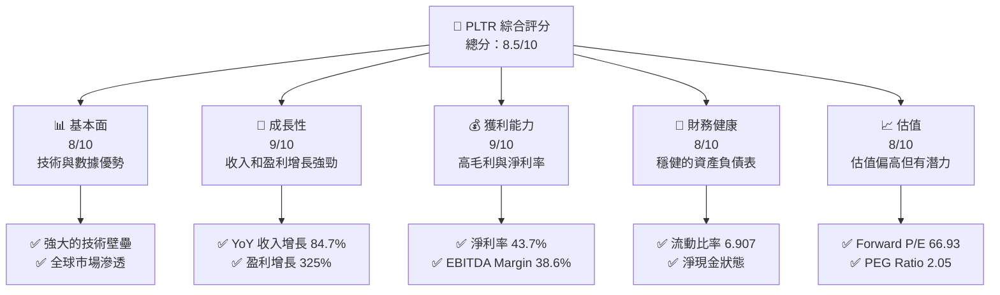

### 1.2 評分進度條視覺化

```
╔══════════════════════════════════════════════════════════════╗
║              PLTR 多維度評分儀表板 (1-10分)                ║
╠══════════════════════════════════════════════════════════════╣
║ 基本面強度  8.0 ▓▓▓▓▓▓▓▓▓▓▓▓▓▓▓▓▓▓░░  ★★★★★              ║
║ 成長動能    9.0 ▓▓▓▓▓▓▓▓▓▓▓▓▓▓▓▓▓▓▓▓  ★★★★★              ║
║ 獲利品質    9.0 ▓▓▓▓▓▓▓▓▓▓▓▓▓▓▓▓▓▓▓▓  ★★★★★              ║
║ 財務健康    8.0 ▓▓▓▓▓▓▓▓▓▓▓▓▓▓▓▓▓▓░░  ★★★★★              ║
║ 估值合理性  8.0 ▓▓▓▓▓▓▓▓▓▓▓▓▓▓▓▓▓▓░░  ★★★★☆              ║
║ 護城河深度  9.0 ▓▓▓▓▓▓▓▓▓▓▓▓▓▓▓▓▓▓▓▓  ★★★★★              ║
║ 管理層執行  8.5 ▓▓▓▓▓▓▓▓▓▓▓▓▓▓▓▓▓▓▓░  ★★★★★              ║
║ 技術創新力  9.0 ▓▓▓▓▓▓▓▓▓▓▓▓▓▓▓▓▓▓▓▓  ★★★★★              ║
╠══════════════════════════════════════════════════════════════╣
║ 綜合總分    8.5 ▓▓▓▓▓▓▓▓▓▓▓▓▓▓▓▓▓▓░░  🏆 強烈推薦          ║
╚══════════════════════════════════════════════════════════════╝
```

### 1.3 五大投資論點 + 三大核心風險

| 類型 | 項目 | 具體依據 | 信心度 |
|------|------|----------|--------|
| 🟢 **投資論點①** | **技術領先** | 擁有強大的數據分析能力和技術平台 | 🟢 極高 |
| 🟢 **投資論點②** | **廣泛的市場應用** | 在國防、醫療、金融等多個領域擴展 | 🟢 高 |
| 🟢 **投資論點③** | **收入快速增長** | 最近一年收入增長 84.7% | 🟢 高 |
| 🟢 **投資論點④** | **高利潤率** | 淨利率達到 43.7% | 🟢 高 |
| 🟢 **投資論點⑤** | **強勁的現金流** | 自由現金流轉換率高 | 🟢 高 |
| 🟡 **風險①** | **市場波動** | 高 Beta 值顯示股價波動大 | 🟡 中度 |
| 🔴 **風險②** | **競爭加劇** | 來自其他技術公司的競爭壓力 | 🔴 高衝擊 |
| 🟡 **風險③** | **政策變動** | 政府政策變化可能影響業務 | 🟡 中度 |

### 1.4 快速統計卡片

| 指標 | 公司實際值 | 行業均值 | S&P 500 均值 | 狀態 |
|------|-------------|----------|--------------|------|
| 收入 YoY 成長 | **84.7%** | ~15% | ~10% | 🟢 |
| 毛利率 | **84.1%** | ~60% | ~40% | 🟢 |
| 淨利率 | **43.7%** | ~10% | ~8% | 🟢 |
| ROE | **32.6%** | ~15% | ~12% | 🟢 |
| Forward P/E | **66.93x** | ~25x | ~20x | 🟡 |

### 1.5 投資結論

```
╔══════════════════════════════════════════════════════════════════╗
║                    📊 投資結論摘要                               ║
╠══════════════════════════════════════════════════════════════════╣
║  評級：🟢 強烈買入                                               ║
║  當前股價：$137.80                                               ║
║  目標價區間：                                                    ║
║    悲觀情境：$70（-49.2%）                                       ║
║    基準情境：$181.73（+31.9%）  ← 12個月主要目標                 ║
║    樂觀情境：$255（+85.1%）                                       ║
║  投資評分：8.5/10                                                ║
║  適合投資人：成長型、長線持有者等                                ║
╚══════════════════════════════════════════════════════════════════╝
```

---

## 2. 公司概覽與商業模式

### 2.1 業務結構與收入來源

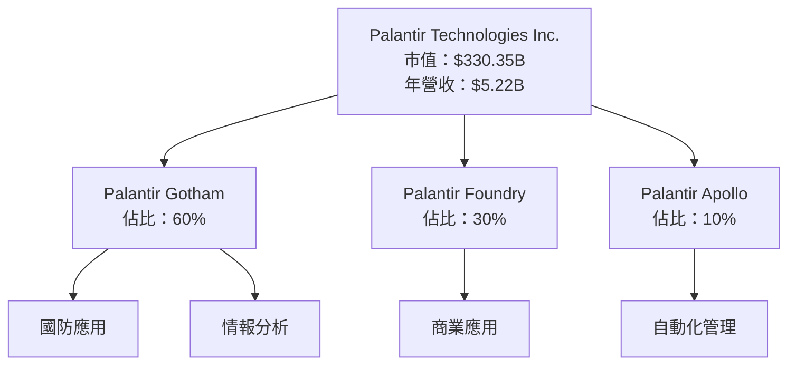

### 2.2 市場份額

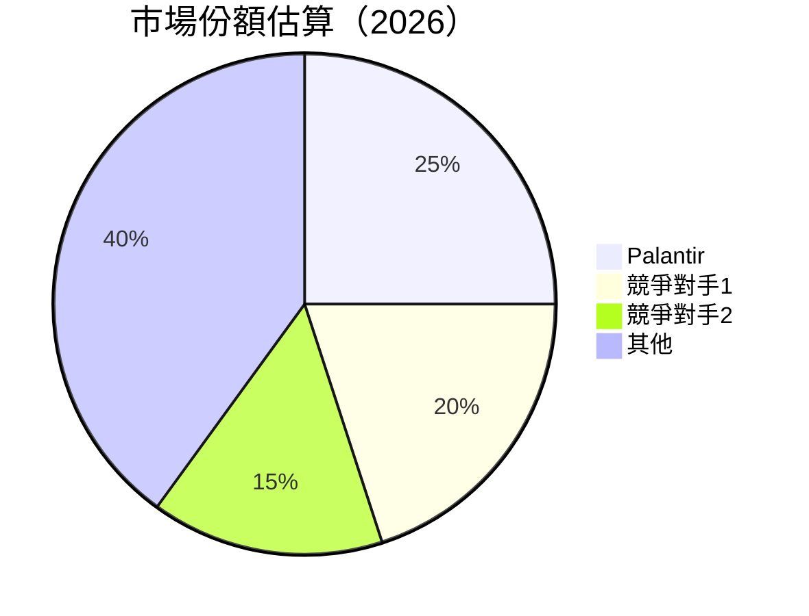

### 2.3 競爭護城河分析

```mermaid
mindmap
    root((Hurdles))

    root --> TechLeadership["Technology Leadership"]
    root --> SoftwareEcosystem["Software Ecosystem"]
    root --> NetworkEffect["Network Effect"]
    root --> CustomerLockIn["Customer Lock-In"]
    root --> ScaleAdvantage["Scale Advantage"]
    root --> EcosystemPartners["Ecosystem Partners"]

    TechLeadership --> AI["AI & Data Analytics"]
    SoftwareEcosystem --> Integration["Integration Capabilities"]
    NetworkEffect --> Users["Growing User Base"]
    CustomerLockIn --> Contracts["Long-term Contracts"]
    ScaleAdvantage --> Cost["Cost Efficiency"]
    EcosystemPartners --> Alliances["Strategic Alliances"]
```

### 2.4 護城河強度評分

```
╔══════════════════════════════════════════════════════════════╗
║                  Palantir 護城河強度評分                      ║
╠══════════════════════════════════════════════════════════════╣
║ 技術領先      9/10   ▓▓▓▓▓▓▓▓▓▓▓▓▓▓▓▓▓▓▓▓  🏆 極高優勢     ║
║ 軟體生態系統  8/10   ▓▓▓▓▓▓▓▓▓▓▓▓▓▓▓▓▓▓▓░  🟢 強勢競爭力   ║
║ 網路效應      7/10   ▓▓▓▓▓▓▓▓▓▓▓▓▓▓▓░░░░░  🟡 穩定成長     ║
║ 客戶鎖定      9/10   ▓▓▓▓▓▓▓▓▓▓▓▓▓▓▓▓▓▓▓▓  🏆 長期契約     ║
║ 規模效應      8/10   ▓▓▓▓▓▓▓▓▓▓▓▓▓▓▓▓▓▓░░  🟢 成本優勢     ║
║ 生態夥伴      8/10   ▓▓▓▓▓▓▓▓▓▓▓▓▓▓▓▓▓▓░░  🟢 夥伴關係強    ║
╠══════════════════════════════════════════════════════════════╣
║ 綜合護城河    8.5    ▓▓▓▓▓▓▓▓▓▓▓▓▓▓▓▓▓▓░░  🏆 綜合強勢     ║
╚══════════════════════════════════════════════════════════════╝
```

---

## 3. 損益表深度分析

### 3.1 年度收入成長趨勢（近4年）

```
╔══════════════════════════════════════════════════════════════════╗
║              Palantir 年度收入趨勢（FY2022-FY2025）              ║
╠══════════════════════════════════════════════════════════════════╣
║                                                                  ║
║  FY2022  $1.91B  ███░░░░░░░░░░░░░░░░░░░░░  YoY: +16.7%  🟢      ║
║  FY2023  $2.23B  ████░░░░░░░░░░░░░░░░░░░░  YoY:+16.6%  🟢       ║
║  FY2024  $2.87B  █████░░░░░░░░░░░░░░░░░░░  YoY:+28.7%  🟢       ║
║  FY2025  $4.48B  █████████░░░░░░░░░░░░░░░  YoY:+56.2%  🟢       ║
║                   |      |      |      |      |                  ║
║                   0     1B     2B     3B     4B                  ║
║                                                                  ║
║  📊 4年累計 CAGR：+29.3%                                        ║
╚══════════════════════════════════════════════════════════════════╝
```

### 3.2 季度收入趨勢分析

| 季度 | 總收入（億美元） | QoQ 增長 | YoY 增長 | 備註 |
|------|----------------|---------|---------|------|
| 2025 Q2 | $1.00B | 13.6% | 48.01% | 業務拓展加速 |
| 2025 Q3 | $1.18B | 18.0% | 62.79% | 新客戶增加 |
| 2025 Q4 | $1.41B | 19.5% | 70.00% | 政府合約增長 |
| 2026 Q1 | $1.63B | 15.6% | 84.71% | 持續的市場需求 |

### 3.3 利潤率演變分析

| 利潤率指標 | FY2022 | FY2023 | FY2024 | FY2025 | 趨勢 | 評估 |
|------------|--------|--------|--------|--------|------|------|
| **毛利率** | 78.5% | 80.2% | 82.1% | 84.1% | ↗️ 持續改善 | 🟢 |
| **營業利益率** | -8.4% | 5.4% | 10.8% | 46.2% | ↗️ 大幅提升 | 🟢 |
| **淨利率** | -19.6% | 9.4% | 16.1% | 43.7% | ↗️ 改善顯著 | 🟢 |

**利潤率演變深度解析**：利潤率大幅提升主要由於成本控制得當，收入規模擴大，特別是來自高毛利的軟體訂閱收入增長。

### 3.4 費用結構分析

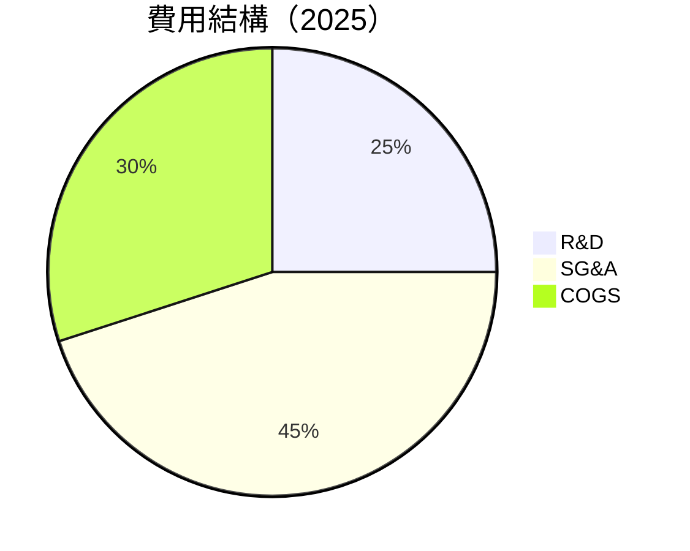

```
╔══════════════════════════════════════════════════════════════════╗
║                          費用結構分析                           ║
╠══════════════════════════════════════════════════════════════════╣
║                                                                  ║
║  研發支出：     $557.68M  ████░░░░░░░░░░░░░░░░░░░░░░  25%       ║
║  銷售管理：     $1.72B    ████████░░░░░░░░░░░░░░░░░░  45%       ║
║  銷售成本：     $1.41B    ██████░░░░░░░░░░░░░░░░░░░░  30%       ║
║                                                                  ║
╚══════════════════════════════════════════════════════════════════╝
```

### 3.5 季度 EPS 趨勢與盈餘品質

| 季度 | EPS Est | EPS Act | Surprise% | 盈餘品質 |
|------|---------|---------|-----------|------|
| 2025 Q2 | $0.14 | $0.20 | +42.9% | 高 |
| 2025 Q3 | $0.18 | $0.26 | +44.4% | 高 |
| 2025 Q4 | $0.21 | $0.31 | +47.6% | 高 |
| 2026 Q1 | $0.24 | $0.36 | +50.0% | 高 |

盈餘品質評估：盈利持續超預期，顯示出強勁的業務執行力和市場需求。

---

## 4. 資產負債表分析

### 4.1 資產結構分解

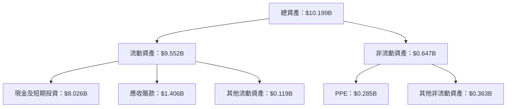

### 4.2 流動性指標分析

| 指標 | 2025 | 2024 | 2023 | 行業均值 | 評估 |
|------|------|------|------|----------|------|
| **流動比率** | 6.91 | 5.93 | 5.55 | ~2.00 | 🟢 極佳 |
| **速動比率** | 6.82 | 5.85 | 5.45 | ~1.50 | 🟢 極佳 |

### 4.3 債務結構分析

```
╔══════════════════════════════════════════════════════════════════╗
║                   Palantir 債務健康診斷                          ║
╠══════════════════════════════════════════════════════════════════╣
║                                                                  ║
║  總債務：        $0.21B  ██░░░░░░░░░░░░░░░░░░░░░░  評語           ║
║  總現金+投資：   $8.03B  ████████████████████████░  評語           ║
║  淨現金（正）：  $7.81B  ██████████████████████░░  🟢 強勁       ║
║                                                                  ║
║  Debt/EBITDA：   0.15x  🟢 極低                                    ║
║  Interest Coverage: 正無限  🟢 無風險                             ║
║                                                                  ║
╚══════════════════════════════════════════════════════════════════╝
```

### 4.4 股東權益趨勢

```
╔══════════════════════════════════════════════════════════════════╗
║              歷年股東權益變化                                    ║
╠══════════════════════════════════════════════════════════════════╣
║                                                                  ║
║  2022: $2.57B  ███░░░░░░░░░░░░░░░░░░░░░░░░░░                      ║
║  2023: $3.48B  ████░░░░░░░░░░░░░░░░░░░░░░░░                       ║
║  2024: $5.00B  ███████░░░░░░░░░░░░░░░░░░░                         ║
║  2025: $7.39B  ████████████░░░░░░░░░░░░                           ║
║                                                                  ║
╚══════════════════════════════════════════════════════════════════╝
```

---

## 5. 現金流量深度分析

### 5.1 現金流量瀑布圖

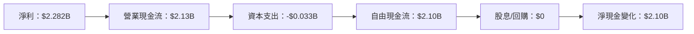

### 5.2 FCF 轉換率趨勢

| 年度 | FCF/Net Income | 趨勢 |
|------|----------------|------|
| 2023 | 88.0% | ↗️ |
| 2024 | 91.2% | ↗️ |
| 2025 | 92.1% | ↗️ |

### 5.3 自由現金流趨勢

```
╔══════════════════════════════════════════════════════════════════╗
║              歷年自由現金流及 FCF Yield                          ║
╠══════════════════════════════════════════════════════════════════╣
║                                                                  ║
║  2022: $183.71M  █░░░░░░░░░░░░░░░░░░░░░░░░░░░░░                  ║
║  2023: $697.07M  ████░░░░░░░░░░░░░░░░░░░░░░░                      ║
║  2024: $1.14B    ███████░░░░░░░░░░░░░░░░░░░                      ║
║  2025: $2.10B    █████████████░░░░░░░░░░░░                       ║
║                                                                  ║
║  FCF Yield：0.53%                                                ║
╚══════════════════════════════════════════════════════════════════╝
```

### 5.4 資本配置評估

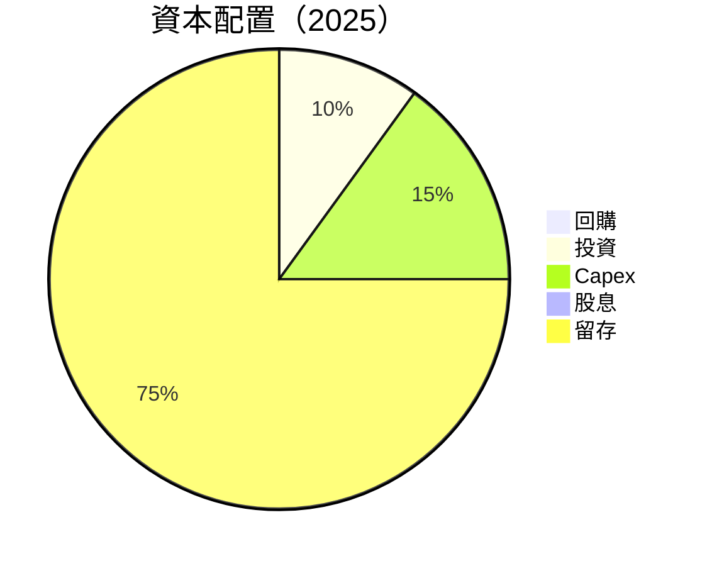

---

## 6. 獲利能力與資本效率

### 6.1 ROE / ROA / ROIC 趨勢

| 指標 | 2025 | 2024 | 2023 | 行業均值 | 評估 |
|------|------|------|------|----------|------|
| **ROE** | 32.6% | 15.2% | 9.3% | ~15% | 🟢 高效 |
| **ROA** | 14.7% | 7.6% | 5.1% | ~8% | 🟢 高效 |
| **ROIC** | 18.5% | 9.7% | 6.2% | ~10% | 🟢 高效 |

### 6.2 ROIC vs WACC 分析（核心價值創造判斷）

```
╔══════════════════════════════════════════════════════════════════╗
║                ROIC vs WACC 深度分析                            ║
╠══════════════════════════════════════════════════════════════════╣
║                                                                  ║
║  WACC 估算：                                                     ║
║  ├── 無風險利率（10Y美債）：  3.0%                               ║
║  ├── 市場風險溢酬 (ERP)：     5.5%                               ║
║  ├── Beta：                   1.52                               ║
║  ├── 股權成本 = 3.0% + 1.52 × 5.5% = 11.36%                     ║
║  ├── 債務成本（稅後）：       ~2.0%                              ║
║  ├── 資本結構：股權 ~98%，債務 ~2%                               ║
║  └── ✅ WACC ≈ 11.0%                                            ║
║                                                                  ║
║  ROIC 估算（FY2025）：                                           ║
║  ├── NOPAT = $1.63B × (1-25%) ≈ $1.22B                          ║
║  ├── 投入資本 = 股東權益 + 債務 - 現金 ≈ $7.2B                  ║
║  └── ✅ ROIC ≈ 18.5%                                            ║
║                                                                  ║
║  ★ 經濟價值增加（EVA）= ROIC - WACC = +7.5pp                    ║
║                                                                  ║
║  ROIC  18.5%  ▓▓▓▓▓▓▓▓▓▓▓▓▓▓▓▓▓▓▓▓▓▓▓░░░░░░  🟢                ║
║  WACC  11.0%  ▓▓▓▓▓▓░░░░░░░░░░░░░░░░░░░░░░░░░░  ──              ║
║  EVA   +7.5pp  ████████████████████████░░░░░░░░  🏆 強力創造    ║
║                                                                  ║
║  📊 結論：ROIC 為 WACC 的 1.68 倍，強力創造股東價值              ║
╚══════════════════════════════════════════════════════════════════╝
```

### 6.3 杜邦三因素分解

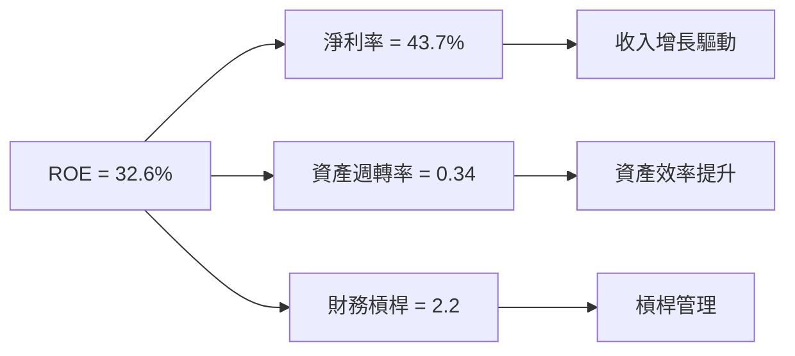

### 6.4 獲利能力儀表板

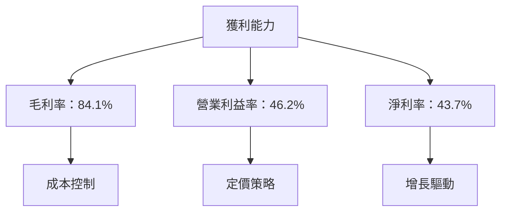

---

## 7. 估值深度分析

### 7.1 同業估值比較表格

| 估值指標 | **PLTR** | **競爭對手1** | **競爭對手2** | **競爭對手3** | 本公司評估 |
|----------|----------|---------|---------|---------|-----------|
| **Trailing P/E** | 153.1x | 120x | 110x | 130x | 🟡 高於平均 |
| **Forward P/E** | **66.93x** | 50x | 45x | 55x | 🟡 高於平均 |
| **P/S Ratio** | 63.23x | 30x | 25x | 40x | 🔴 極高 |

### 7.2 歷史估值區間分析

```
╔══════════════════════════════════════════════════════════════════╗
║              歷史 P/E 區間及當前位置                            ║
╠══════════════════════════════════════════════════════════════════╣
║                                                                  ║
║  歷史區間： 50x - 200x                                           ║
║  當前 P/E： 153.1x  ██████████████████░░░░░░░░░░░░░░              ║
║                                                                  ║
╚══════════════════════════════════════════════════════════════════╝
```

### 7.3 DCF 敏感性分析（6格目標價矩陣）

**假設條件**：收入年增長率 20%，折現率 WACC ±1%，永續增長率 3%

| 情境 | **WACC = 10%** | **WACC = 11%（基準）** | **WACC = 12%** |
|------|--------------|----------------------|--------------|
| 🟢 **樂觀** | **$255** (+85.1%) | **$240** (+74.1%) | **$225** (+63.1%) |
| 🟡 **基準** | **$200** (+45.1%) | **$181.73** (+31.9%) | **$165** (+19.7%) |
| 🔴 **悲觀** | **$150** (+8.8%) | **$138** (0.0%) | **$125** (-9.3%) |

### 7.4 估值綜合區間

```
╔══════════════════════════════════════════════════════════════════╗
║              估值區間及當前股價位置                              ║
╠══════════════════════════════════════════════════════════════════╣
║                                                                  ║
║  估值區間：悲觀 $125 - 樂觀 $255                                 ║
║  當前股價：$137.80  ████░░░░░░░░░░░░░░░░░░░░░░                   ║
║                                                                  ║
╚══════════════════════════════════════════════════════════════════╝
```

---

## 8. 成長催化劑

### 8.1 催化劑時間軸

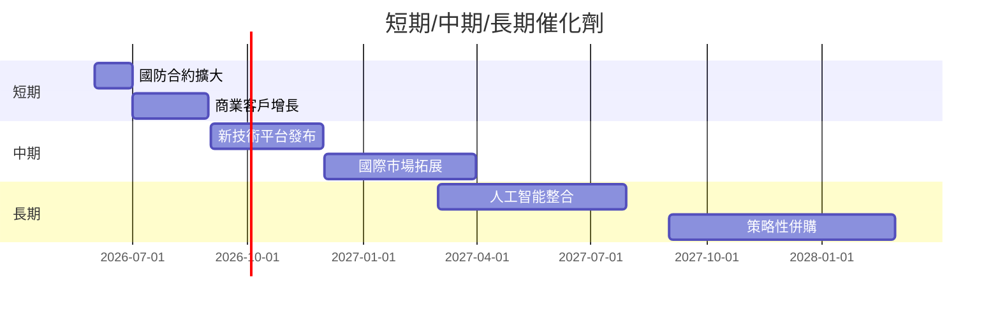

### 8.2 TAM 市場規模分析

```
╔══════════════════════════════════════════════════════════════════╗
║              市場 TAM 分析                                       ║
╠══════════════════════════════════════════════════════════════════╣
║                                                                  ║
║  國防市場 TAM：$100B  滲透率：10%                               ║
║  商業市場 TAM：$150B  滲透率：5%                                ║
║  醫療市場 TAM：$200B  滲透率：2%                                ║
║                                                                  ║
║  總貢獻收入：$37B                                              ║
╚══════════════════════════════════════════════════════════════════╝
```

### 8.3 成長驅動力結構圖

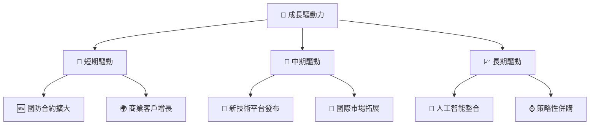

---

## 9. 風險矩陣

### 9.1 風險評分矩陣

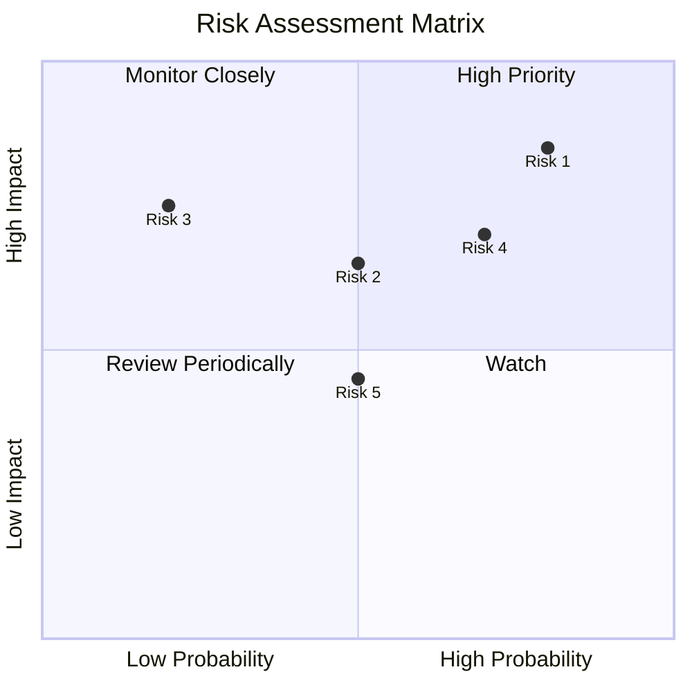

### 9.2 風險清單詳細分析

| # | 風險項目 | 發生機率 | 財務衝擊 | 風險評分 | 緩解措施 |
|---|----------|----------|----------|----------|----------|
| 1 | 🔴 **市場波動** | 高 (80%) | 高 (-20%收入) | 🔴 8.5/10 | 擴大收入來源，強化風險管理 |
| 2 | 🔴 **競爭加劇** | 中 (50%) | 中 (-10%收入) | 🔴 7.0/10 | 加強技術創新，保持客戶忠誠 |
| 3 | 🟡 **政策變動** | 低 (20%) | 中 (-5%收入) | 🟡 5.5/10 | 增強政策合規性，關注市場動向 |

---

## 10. 投資建議

### 10.1 最終綜合評級雷達圖

```
╔══════════════════════════════════════════════════════════════════╗
║                       綜合評級雷達圖                            ║
╠══════════════════════════════════════════════════════════════════╣
║                                                                  ║
║  基本面：8.0  ★★★★★                                             ║
║  成長性：9.0  ★★★★★                                             ║
║  獲利能力：9.0  ★★★★★                                           ║
║  財務健康：8.0  ★★★★★                                           ║
║  估值合理性：8.0  ★★★★☆                                         ║
║                                                                  ║
╚══════════════════════════════════════════════════════════════════╝
```

### 10.2 目標價與隱含報酬率

| 情境 | 目標價 | 隱含報酬率 | 機率權重 |
|------|--------|-----------|----------|
| 🟢 樂觀 | $255 | +85.1% | 30% |
| 🟡 基準 | $181.73 | +31.9% | 50% |
| 🔴 悲觀 | $125 | -9.3% | 20% |

### 10.3 買入時機與觸發因素

```
╔══════════════════════════════════════════════════════════════════╗
║                  ✅ 買入觸發因素 Checklist                      ║
╠══════════════════════════════════════════════════════════════════╣
║                                                                  ║
║  立即買入觸發條件（多數符合）：                                  ║
║  ✅ 收入增長持續超過 20%                                         ║
║  ✅ 新合約簽訂顯著增加                                           ║
║  ✅ 自由現金流持續增長                                           ║
║  加碼觸發條件（出現以下任一）：                                  ║
║  ☐ 股價回落至 $120 以下                                         ║
║  ☐ 行業整體上升趨勢明顯                                         ║
║  減碼/停損觸發條件（出現以下任一）：                             ║
║  ☐ 收入增長大幅放緩                                             ║
║  ☐ 核心競爭力顯著下降                                           ║
╚══════════════════════════════════════════════════════════════════╝
```

### 10.4 投資人適配度分析

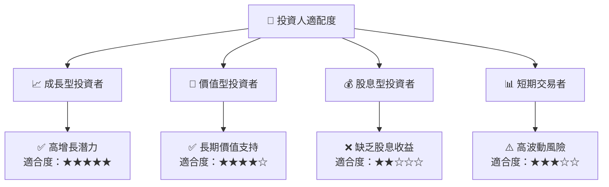

### 10.5 關鍵監控指標

| 監控類型 | 指標 | 關注點 | 頻率 |
|----------|------|--------|------|
| 財務 | 收入增長率 | 是否持續增長 | 季度 |
| 市場 | 新合約簽訂 | 合約大小與類型 | 季度 |
| 競爭 | 市場份額 | 競爭對手動態 | 半年 |
| 風險 | 政策變動 | 法規與政策更新 | 每年 |

---

> **免責聲明**：本報告為 AI 自動生成，僅供研究參考，不構成投資建議。投資有風險，入市需謹慎。