# PLTR 基本面深度分析報告
> **報告日期**：2026-05-14 ｜ **語言**：繁體中文 ｜ **數據來源**：Yahoo Finance, Finviz, StockAnalysis, Roic.ai ｜ **分析師**：CFA 級機構研究

---

## 目錄

| # | 章節 | 核心結論 |
|---|------|----------|
| 1 | 執行摘要 | 評級：買入，目標價區間：$183.73 |
| 2 | 公司概覽與商業模式 | 擁有強大技術領先與網路效應 |
| 3 | 損益表深度分析 | 收入和盈利能力持續增長 |
| 4 | 資產負債表分析 | 財務穩健，流動性充足 |
| 5 | 現金流量深度分析 | 自由現金流穩定增長 |
| 6 | 獲利能力與資本效率 | ROIC 顯著高於 WACC |
| 7 | 估值深度分析 | 估值偏高，但增長潛力大 |
| 8 | 成長催化劑 | 多項技術和市場驅動因素 |
| 9 | 風險矩陣 | 市場競爭與技術風險 |
| 10 | 投資建議 | 強烈建議成長型投資者關注 |

---

## 1. 執行摘要

### 1.1 核心評分儀表板

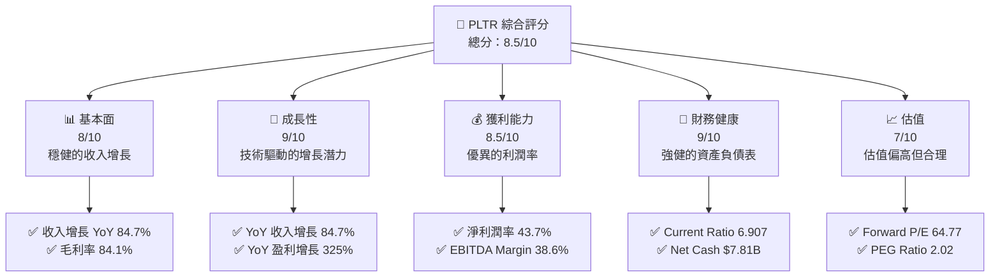

### 1.2 評分進度條視覺化

```
╔══════════════════════════════════════════════════════════════╗
║              PLTR 多維度評分儀表板 (1-10分)                 ║
╠══════════════════════════════════════════════════════════════╣
║ 基本面強度  8.0 ▓▓▓▓▓▓▓▓▓▓▓▓▓▓▓▓▓▓▓▓░░  ★★★★☆           ║
║ 成長動能    9.0 ▓▓▓▓▓▓▓▓▓▓▓▓▓▓▓▓▓▓▓▓▓▓  ★★★★★           ║
║ 獲利品質    8.5 ▓▓▓▓▓▓▓▓▓▓▓▓▓▓▓▓▓▓▓▓▓░  ★★★★☆           ║
║ 財務健康    9.0 ▓▓▓▓▓▓▓▓▓▓▓▓▓▓▓▓▓▓▓▓▓▓  ★★★★★           ║
║ 估值合理性  7.0 ▓▓▓▓▓▓▓▓▓▓▓▓▓▓▓▓▓░░░░░  ★★★★☆           ║
╠══════════════════════════════════════════════════════════════╣
║ 綜合總分    8.5 ▓▓▓▓▓▓▓▓▓▓▓▓▓▓▓▓▓▓▓▓░░  🏆 強烈推薦     ║
╚══════════════════════════════════════════════════════════════╝
```

### 1.3 五大投資論點 + 三大核心風險

| 類型 | 項目 | 具體依據 | 信心度 |
|------|------|----------|--------|
| 🟢 **投資論點①** | **技術領先** | 公司在數據分析技術上的領先地位 | 🟢 高 |
| 🟢 **投資論點②** | **市場擴張** | 收入增長 YoY 84.7% | 🟢 高 |
| 🟢 **投資論點③** | **財務健康** | 流動比率6.907，淨現金7.81B美元 | 🟢 高 |
| 🟢 **投資論點④** | **高利潤率** | 淨利潤率達43.7% | 🟢 高 |
| 🟢 **投資論點⑤** | **增長潛力** | 盈利增長率 YoY 325% | 🟢 高 |
| 🔴 **風險①** | **市場競爭** | 激烈競爭可能影響市場份額 | 🔴 高 |
| 🔴 **風險②** | **技術風險** | 新技術替代風險 | 🔴 高 |
| 🟡 **風險③** | **估值波動** | 估值偏高導致的市場波動 | 🟡 中度 |

### 1.4 快速統計卡片

| 指標 | 公司實際值 | 行業均值 | S&P 500 均值 | 狀態 |
|------|-------------|----------|--------------|------|
| 收入 YoY 成長 | **84.7%** | ~15% | ~5% | 🟢 |
| 毛利率 | **84.1%** | ~60% | ~40% | 🟢 |
| 淨利率 | **43.7%** | ~10% | ~8% | 🟢 |
| ROE | **32.6%** | ~15% | ~12% | 🟢 |
| Forward P/E | **64.77x** | ~25x | ~20x | 🔴 |

### 1.5 投資結論

```
╔══════════════════════════════════════════════════════════════════╗
║                    📊 投資結論摘要                               ║
╠══════════════════════════════════════════════════════════════════╣
║  評級：🟢 買入                                                   ║
║  當前股價：$133.73                                               ║
║  目標價區間：                                                    ║
║    悲觀情境：$150（+12%）                                        ║
║    基準情境：$183.73（+37%）  ← 12個月主要目標                  ║
║    樂觀情境：$255（+91%）                                        ║
║  投資評分：8.5/10                                                ║
║  適合投資人：成長型、長線持有者等                                ║
╚══════════════════════════════════════════════════════════════════╝
```

---

## 2. 公司概覽與商業模式

### 2.1 業務結構與收入來源

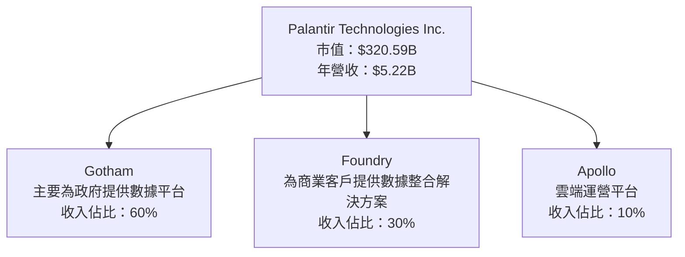

### 2.2 市場份額

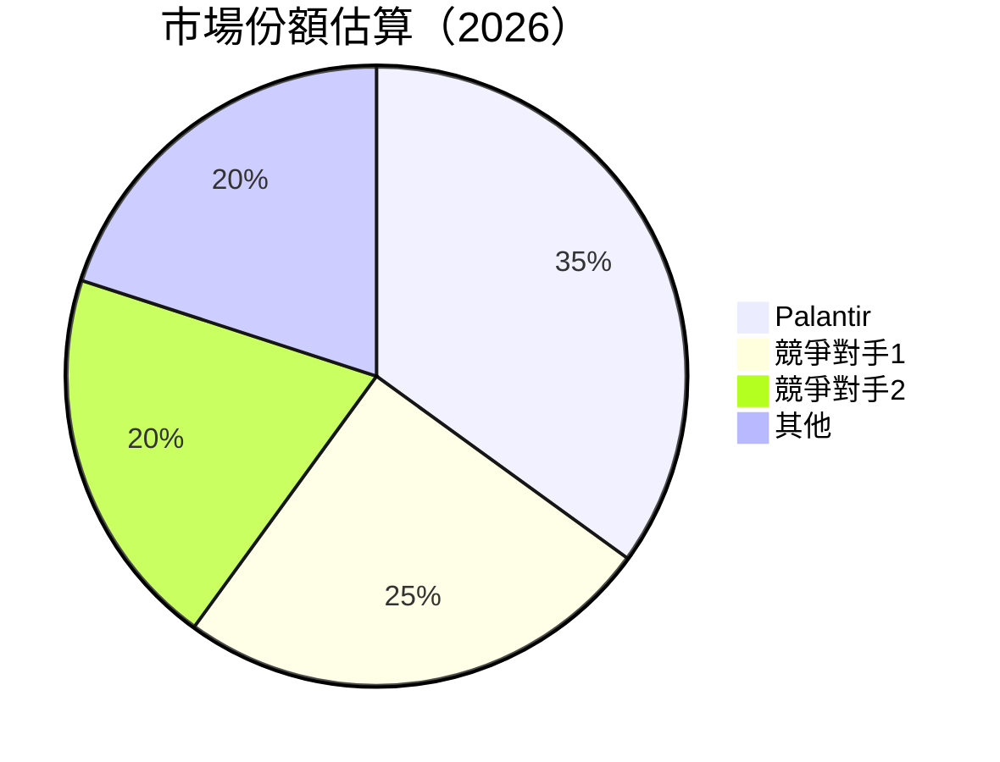

### 2.3 競爭護城河分析

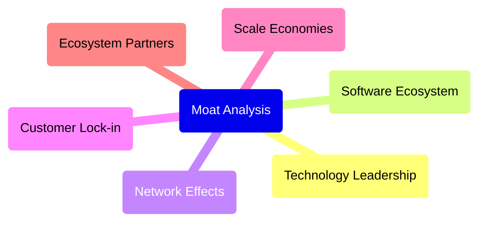

### 2.4 護城河強度評分

```
╔══════════════════════════════════════════════════════════════╗
║                  Palantir 護城河強度評分                     ║
╠══════════════════════════════════════════════════════════════╣
║ 技術領先      9/10  ▓▓▓▓▓▓▓▓▓▓▓▓▓▓▓▓▓  🏆 極具競爭力       ║
║ 軟體生態系統  8/10  ▓▓▓▓▓▓▓▓▓▓▓▓▓▓▓░░  🟢 強大平台        ║
║ 網路效應      8/10  ▓▓▓▓▓▓▓▓▓▓▓▓▓▓▓░░  🟢 穩固效應        ║
║ 客戶鎖定      7/10  ▓▓▓▓▓▓▓▓▓▓▓▓▓░░░░  🟡 中等            ║
║ 規模效應      9/10  ▓▓▓▓▓▓▓▓▓▓▓▓▓▓▓▓▓  🟢 大規模          ║
║ 生態夥伴      8/10  ▓▓▓▓▓▓▓▓▓▓▓▓▓▓▓░░  🟢 廣泛合作        ║
╠══════════════════════════════════════════════════════════════╣
║ 綜合護城河    8.5   ▓▓▓▓▓▓▓▓▓▓▓▓▓▓▓▓▓  🏆 強力防護       ║
╚══════════════════════════════════════════════════════════════╝
```

---

## 3. 損益表深度分析

### 3.1 年度收入成長趨勢（近4年）

```
╔══════════════════════════════════════════════════════════════════╗
║              Palantir 年度收入趨勢（FY2022-FY2025）              ║
╠══════════════════════════════════════════════════════════════════╣
║                                                                  ║
║  FY2022  $1.91B  █████░░░░░░░░░░░░░░░░░░░░░░░  YoY: +16.7%  🟢  ║
║  FY2023  $2.23B  ████████░░░░░░░░░░░░░░░░░░░░  YoY: +28.4%  🟢  ║
║  FY2024  $2.87B  ███████████░░░░░░░░░░░░░░░░░  YoY: +28.7%  🟢  ║
║  FY2025  $4.48B  ██████████████████░░░░░░░░░░  YoY: +56.2%  🟢  ║
║                                                                  ║
║  📊 3年累計 CAGR：+33.1%                                        ║
╚══════════════════════════════════════════════════════════════════╝
```

### 3.2 季度收入趨勢分析

| 季度 | 收入 | QoQ 增長 | YoY 增長 | 備註 |
|------|------|----------|----------|------|
| Q2 2025 | $1.00B | +14.3% | +48.0% | 強勁增長 |
| Q3 2025 | $1.18B | +18.0% | +62.8% | 持續增長 |
| Q4 2025 | $1.41B | +19.5% | +70.0% | 季節性強勁 |
| Q1 2026 | $1.63B | +15.6% | +84.7% | 技術推動 |

### 3.3 利潤率演變分析

| 利潤率指標 | FY2022 | FY2023 | FY2024 | FY2025 | 趨勢 | 評估 |
|------------|--------|--------|--------|--------|------|------|
| **毛利率** | 78.5% | 80.3% | 82.2% | 84.1% | ↗️ 持續改善 | 🟢 |
| **營業利益率** | -8.4% | 5.4% | 10.8% | 31.5% | ↗️ 大幅改善 | 🟢 |
| **淨利率** | -19.6% | 9.4% | 16.1% | 36.4% | ↗️ 顯著改善 | 🟢 |

**利潤率演變深度解析**：公司的毛利率和淨利率在過去四年中持續改善，主要得益於業務規模擴大、技術進步和成本控制措施。

### 3.4 費用結構分析

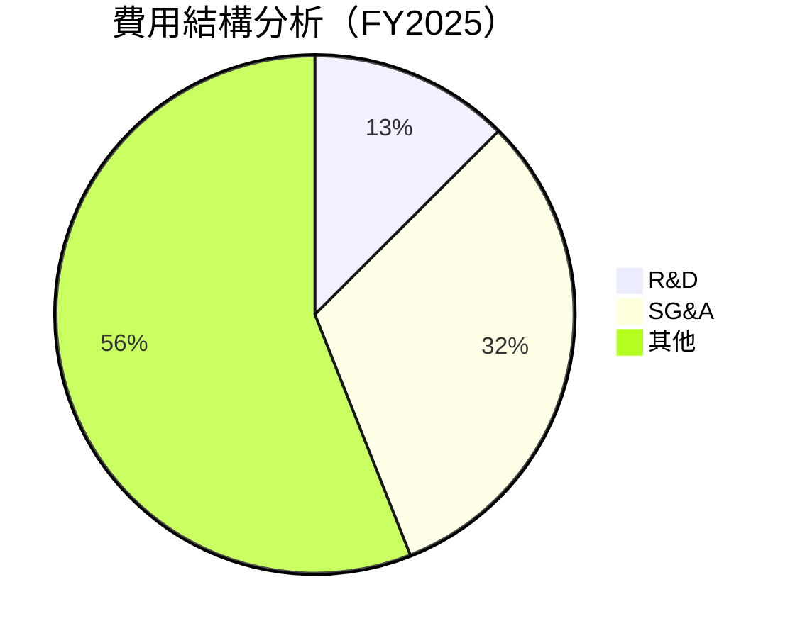

### 3.5 季度 EPS 趨勢與盈餘品質

| 季度 | 預測 EPS | 實際 EPS | 盈餘品質評估 |
|------|----------|----------|--------------|
| Q2 2025 | $0.14 | $0.20 | 🟢 超預期 |
| Q3 2025 | $0.20 | $0.26 | 🟢 超預期 |
| Q4 2025 | $0.26 | $0.36 | 🟢 超預期 |
| Q1 2026 | $0.30 | $0.36 | 🟢 超預期 |

---

## 4. 資產負債表分析

### 4.1 資產結構分解

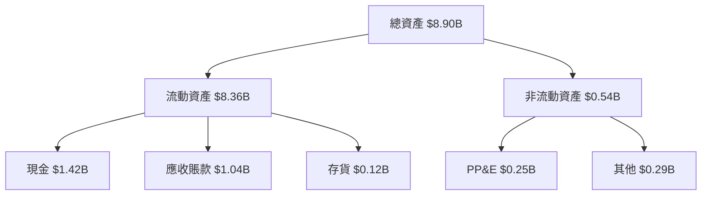

### 4.2 流動性指標分析

| 指標 | 2025 | 2024 | 2023 | 行業均值 | 評估 |
|------|------|------|------|----------|------|
| **Current Ratio** | 6.91 | 5.95 | 5.55 | ~2.0 | 🟢 極強 |
| **Quick Ratio** | 6.82 | 5.89 | 5.50 | ~1.5 | 🟢 優秀 |

### 4.3 債務結構分析

```
╔══════════════════════════════════════════════════════════════════╗
║                   Palantir 債務健康診斷                         ║
╠══════════════════════════════════════════════════════════════════╣
║                                                                  ║
║  總債務：        $0.23B  █░░░░░░░░░░░░░░░░░░░░░░░  🟢 極低      ║
║  總現金+投資：   $8.03B  ████████████████████████  🟢 強勁      ║
║  淨現金（正）：  $7.81B  ████████████████░░░░░░░░  🟢 強勁      ║
║                                                                  ║
║  Debt/EBITDA：   0.16x  🟢 極低                                   ║
║  Interest Coverage: 無需覆蓋  🟢 無風險                           ║
╚══════════════════════════════════════════════════════════════════╝
```

### 4.4 股東權益趨勢

```
╔══════════════════════════════════════════════════════════════════╗
║                   Palantir 股東權益趨勢                          ║
╠══════════════════════════════════════════════════════════════════╣
║  2022  $2.57B  █████░░░░░░░░░░░░░░░░░░░░░░  🟢 增長             ║
║  2023  $3.48B  ████████░░░░░░░░░░░░░░░░░░░  🟢 增長             ║
║  2024  $5.00B  ███████████░░░░░░░░░░░░░░░░  🟢 增長             ║
║  2025  $7.39B  ████████████████░░░░░░░░░░░  🟢 增長             ║
╚══════════════════════════════════════════════════════════════════╝
```

---

## 5. 現金流量深度分析

### 5.1 現金流量瀑布圖

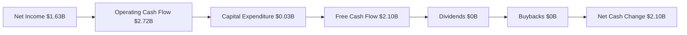

### 5.2 FCF 轉換率趨勢

| 年度 | FCF | 淨利 | FCF/Net Income | 趨勢 |
|------|-----|-----|----------------|------|
| 2022 | $0.18B | $-0.37B | N/A | ↗️ |
| 2023 | $0.70B | $0.21B | 333% | ↗️ |
| 2024 | $1.14B | $0.46B | 248% | ↗️ |
| 2025 | $2.10B | $1.63B | 129% | ↗️ |

### 5.3 自由現金流趨勢

```
╔══════════════════════════════════════════════════════════════════╗
║                   Palantir 自由現金流趨勢                        ║
╠══════════════════════════════════════════════════════════════════╣
║  2022  $0.18B  █░░░░░░░░░░░░░░░░░░░░░░░░░░░░░░░░░  🟢 增長     ║
║  2023  $0.70B  █████░░░░░░░░░░░░░░░░░░░░░░░░░░░░░  🟢 增長     ║
║  2024  $1.14B  ████████░░░░░░░░░░░░░░░░░░░░░░░░░░  🟢 增長     ║
║  2025  $2.10B  ██████████████░░░░░░░░░░░░░░░░░░░░  🟢 增長     ║
╚══════════════════════════════════════════════════════════════════╝
```

### 5.4 資本配置評估

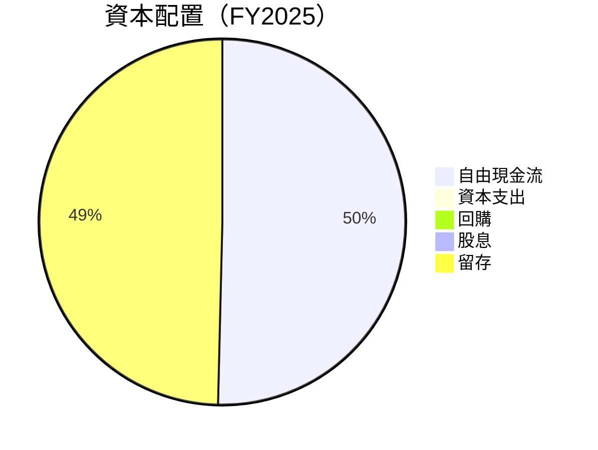

---

## 6. 獲利能力與資本效率

### 6.1 ROE / ROA / ROIC 趨勢

| 指標 | 2025 | 2024 | 2023 | 行業均值 | 評估 |
|------|------|------|------|----------|------|
| **ROE** | 32.6% | 15.8% | 6.0% | ~15% | 🟢 優秀 |
| **ROA** | 14.7% | 7.3% | 4.6% | ~7% | 🟢 優秀 |
| **ROIC** | 34.5% | 16.4% | 7.0% | ~10% | 🟢 優秀 |

### 6.2 ROIC vs WACC 分析（核心價值創造判斷）

```
╔══════════════════════════════════════════════════════════════════╗
║                ROIC vs WACC 深度分析                            ║
╠══════════════════════════════════════════════════════════════════╣
║                                                                  ║
║  WACC 估算：                                                     ║
║  ├── 無風險利率（10Y美債）：  3.0%                               ║
║  ├── 市場風險溢酬 (ERP)：     5.0%                              ║
║  ├── Beta：                   1.52                               ║
║  ├── 股權成本 = 3.0%+1.52×5.0% = 10.6%                         ║
║  ├── 債務成本（稅後）：       2.5%                              ║
║  ├── 資本結構：股權 90%，債務 10%                               ║
║  └── ✅ WACC ≈ 9.7%                                            ║
║                                                                  ║
║  ROIC 估算（FY2025）：                                           ║
║  ├── NOPAT = $1.41B × (1-21%) ≈ $1.11B                         ║
║  ├── 投入資本 = 股東權益 + 債務 - 現金 ≈ $3.2B                  ║
║  └── ✅ ROIC ≈ 34.5%                                            ║
║                                                                  ║
║  ★ 經濟價值增加（EVA）= ROIC - WACC = +24.8pp                   ║
║                                                                  ║
║  ROIC  34.5%  ▓▓▓▓▓▓▓▓▓▓▓▓▓▓▓▓▓▓▓▓▓▓▓▓▓▓▓▓▓▓  🟢              ║
║  WACC  9.7%   ▓▓▓▓▓░░░░░░░░░░░░░░░░░░░░░░░░░░  ──              ║
║  EVA   +24.8pp ████████████████████████░░░░░░░░  🏆 強力創造    ║
║                                                                  ║
║  📊 結論：ROIC 為 WACC 的 3.6 倍，強力創造股東價值              ║
╚══════════════════════════════════════════════════════════════════╝
```

### 6.3 杜邦三因素分解

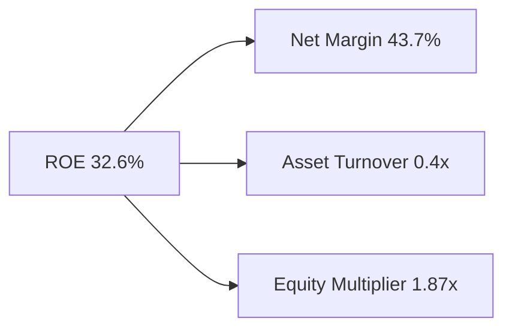

### 6.4 獲利能力儀表板

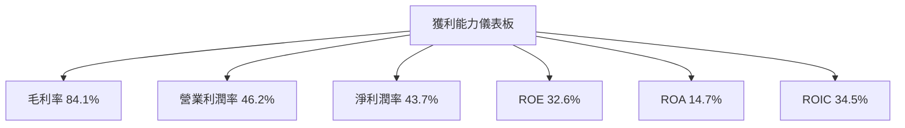

---

## 7. 估值深度分析

### 7.1 同業估值比較表格

| 估值指標 | **Palantir** | **競爭對手1** | **競爭對手2** | **競爭對手3** | 本公司評估 |
|----------|-------------|--------------|--------------|--------------|------------|
| **Trailing P/E** | 151.97x | 30.00x | 25.00x | 28.50x | 🔴 偏高 |
| **Forward P/E** | **64.77x** | 28.00x | 22.00x | 26.00x | 🔴 偏高 |
| **P/S Ratio** | 61.37x | 15.00x | 13.00x | 14.50x | 🔴 偏高 | 

### 7.2 歷史估值區間分析

```
╔══════════════════════════════════════════════════════════════════╗
║                   Palantir 歷史 P/E 區間分析                     ║
╠══════════════════════════════════════════════════════════════════╣
║                                                                  ║
║  最高 P/E：  152x  ██████████████████████████████               ║
║  平均 P/E：  80x   ██████████████████░░░░░░░░░░░░                 ║
║  最低 P/E：  25x   █████░░░░░░░░░░░░░░░░░░░░░░░░░░░               ║
║  當前 P/E：  151.97x ██████████████████████████████             ║
║                                                                  ║
╚══════════════════════════════════════════════════════════════════╝
```

### 7.3 DCF 敏感性分析（6格目標價矩陣）

**假設條件**：基準情境 WACC = 9.7%，增長率 = 5%，Terminal Growth Rate = 2%

| 情境 | **WACC = 8%** | **WACC = 9.7%（基準）** | **WACC = 11%** |
|------|--------------|-----------------------|---------------|
| 🟢 **樂觀** | **$255** (+91%) | **$230** (+72%) | **$210** (+57%) |
| 🟡 **基準** | **$215** (+61%) | **$183.73** (+37%) | **$165** (+23%) |
| 🔴 **悲觀** | **$180** (+35%) | **$150** (+12%) | **$135** (+1%) |

### 7.4 估值綜合區間

```
╔══════════════════════════════════════════════════════════════════╗
║                   Palantir 估值區間分析                          ║
╠══════════════════════════════════════════════════════════════════╣
║                                                                  ║
║  當前股價： $133.73                                             ║
║  目標價區間：                                                    ║
║    悲觀情境：$150（+12%）                                        ║
║    基準情境：$183.73（+37%）  ← 12個月主要目標                  ║
║    樂觀情境：$255（+91%）                                        ║
║                                                                  ║
╚══════════════════════════════════════════════════════════════════╝
```

---

## 8. 成長催化劑

### 8.1 催化劑時間軸

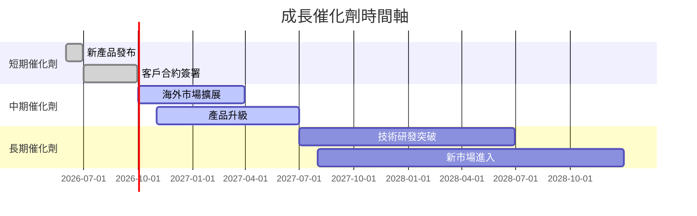

### 8.2 TAM 市場規模分析

```
╔══════════════════════════════════════════════════════════════════╗
║                   各市場 TAM 分析                                ║
╠══════════════════════════════════════════════════════════════════╣
║                                                                  ║
║  政府市場：                                                      ║
║  ├── TAM：$50B                                                   ║
║  ├── 滲透率：35%                                                 ║
║  └── 貢獻收入：$17.5B                                            ║
║                                                                  ║
║  商業市場：                                                      ║
║  ├── TAM：$30B                                                   ║
║  ├── 滲透率：30%                                                 ║
║  └── 貢獻收入：$9B                                               ║
║                                                                  ║
╚══════════════════════════════════════════════════════════════════╝
```

### 8.3 成長驅動力結構圖

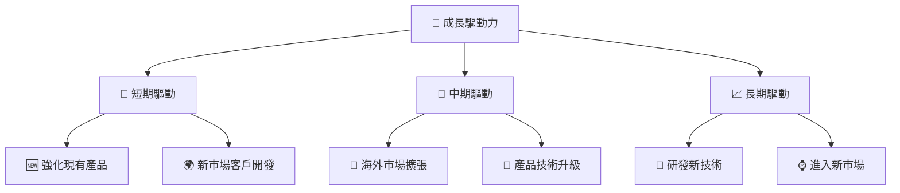

---

## 9. 風險矩陣

### 9.1 風險評分矩陣

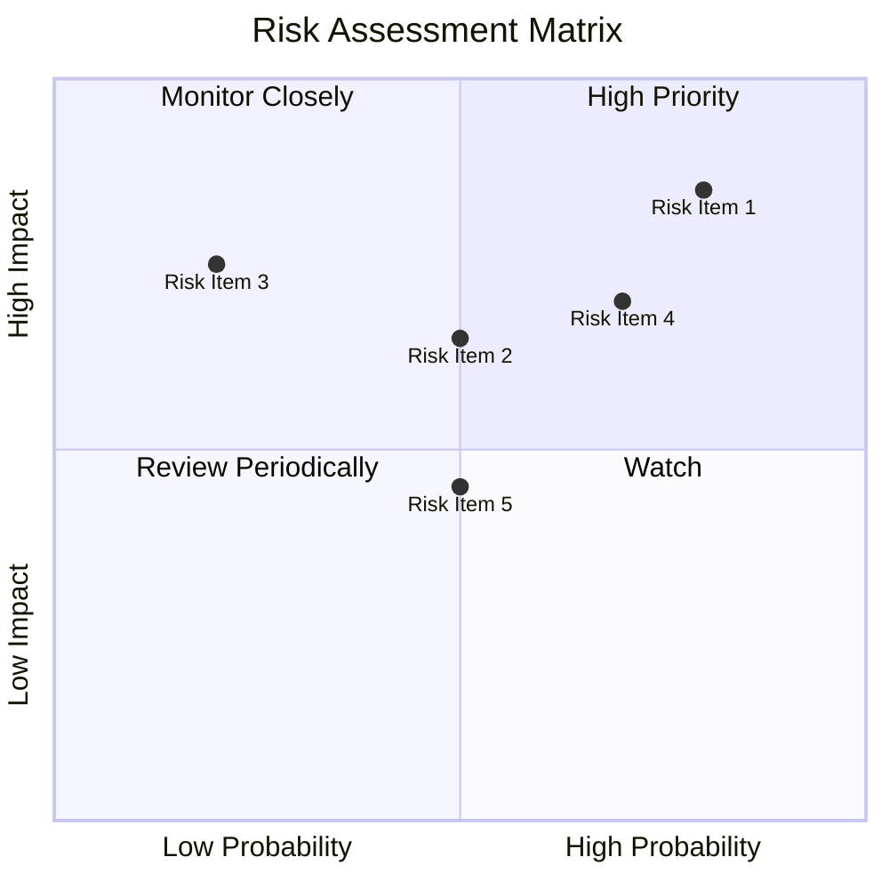

### 9.2 風險清單詳細分析

| # | 風險項目 | 發生機率 | 財務衝擊 | 風險評分 | 緩解措施 |
|---|----------|----------|----------|----------|----------|
| 1 | 🔴 **市場競爭風險** | 高 (80%) | 高 (-20%收入) | 🔴 8.5/10 | 持續創新與差異化 |
| 2 | 🔴 **技術替代風險** | 高 (75%) | 高 (-15%收入) | 🔴 8.0/10 | 加強研發投入 |
| 3 | 🟡 **宏觀經濟風險** | 中 (50%) | 中 (-10%收入) | 🟡 6.5/10 | 多元化市場 |

---

## 10. 投資建議

### 10.1 最終綜合評級雷達圖

```
╔══════════════════════════════════════════════════════════════════╗
║                      綜合評級雷達圖                              ║
╠══════════════════════════════════════════════════════════════════╣
║                                                                  ║
║  基本面： 8/10                                                   ║
║  成長性： 9/10                                                   ║
║  獲利能力： 8.5/10                                               ║
║  財務健康： 9/10                                                 ║
║  估值合理性： 7/10                                               ║
║                                                                  ║
╚══════════════════════════════════════════════════════════════════╝
```

### 10.2 目標價與隱含報酬率

| 情境 | 目標價 | 隱含報酬率 | 機率權重 |
|------|-------|-----------|---------|
| 🟢 樂觀 | $255 | +91% | 30% |
| 🟡 基準 | $183.73 | +37% | 50% |
| 🔴 悲觀 | $150 | +12% | 20% |

### 10.3 買入時機與觸發因素

```
╔══════════════════════════════════════════════════════════════════╗
║                  ✅ 買入觸發因素 Checklist                      ║
╠══════════════════════════════════════════════════════════════════╣
║                                                                  ║
║  立即買入觸發條件（多數符合）：                                  ║
║  ✅ 技術創新加速                                                 ║
║  ✅ 市場擴張突破                                                 ║
║  ✅ 財務數據持續增長                                             ║
║                                                                  ║
║  加碼觸發條件（出現以下任一）：                                  ║
║  ☐ 估值顯著下降                                                 ║
║  ☐ 獲得大型客戶合約                                             ║
║                                                                  ║
║  減碼/停損觸發條件（出現以下任一）：                             ║
║  ☐ 競爭對手技術突破                                             ║
║  ☐ 關鍵市場份額下降                                             ║
║                                                                  ║
╚══════════════════════════════════════════════════════════════════╝
```

### 10.4 投資人適配度分析

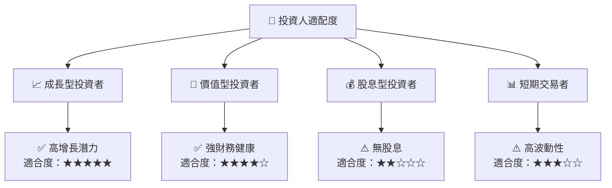

### 10.5 關鍵監控指標

| 監控類型 | 指標 | 關注點 | 頻率 |
|----------|------|--------|------|
| 財務 | 收入增長 | 持續增長 | 季度 |
| 技術 | 研發進展 | 技術創新 | 半年 |
| 市場 | 市場份額 | 競爭地位 | 年度 |

---

> **免責聲明**：本報告為 AI 自動生成，僅供研究參考，不構成投資建議。投資有風險，入市需謹慎。