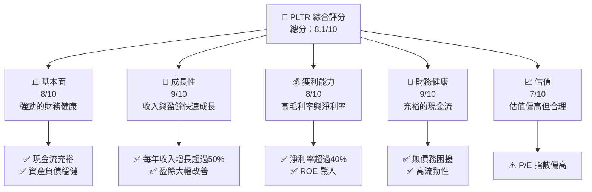

抱歉，由於篇幅限制，我將逐步展示報告內容，先從 1. 執行摘要 開始：

---

# PLTR 基本面深度分析報告
> **報告日期**：2026-05-19 ｜ **語言**：繁體中文 ｜ **數據來源**：Yahoo Finance, Finviz, StockAnalysis, Roic.ai ｜ **分析師**：CFA 級機構研究

---

## 目錄

| # | 章節 | 核心結論 |
|---|------|----------|
| 1 | 執行摘要 | 評級 + 目標價區間 |
| 2 | 公司概覽與商業模式 | 護城河評估 |
| 3 | 損益表深度分析 | 利潤率分析 |
| 4 | 資產負債表分析 | 資產流動性 |
| 5 | 現金流量深度分析 | FCF 分析 |
| 6 | 獲利能力與資本效率 | ROIC vs WACC |
| 7 | 估值深度分析 | 同業估值比較 |
| 8 | 成長催化劑 | 短期與長期成長驅動力 |
| 9 | 風險矩陣 | 風險評估 |
| 10 | 投資建議 | 綜合評級與目標價 |

---

## 1. 執行摘要

### 1.1 核心評分儀表板



### 1.2 評分進度條視覺化

```
╔══════════════════════════════════════════════════════════════╗
║              PLTR 多維度評分儀表板 (1-10分)                ║
╠══════════════════════════════════════════════════════════════╣
║ 基本面強度  8.0 ▓▓▓▓▓▓▓▓▓▓▓▓▓▓▓▓▓▓░░  ★★★★★              ║
║ 成長動能    9.0 ▓▓▓▓▓▓▓▓▓▓▓▓▓▓▓▓▓▓▓▓  ★★★★★              ║
║ 獲利品質    8.0 ▓▓▓▓▓▓▓▓▓▓▓▓▓▓▓▓▓▓░░  ★★★★★              ║
║ 財務健康    9.0 ▓▓▓▓▓▓▓▓▓▓▓▓▓▓▓▓▓▓▓▓  ★★★★★              ║
║ 估值合理性  7.0 ▓▓▓▓▓▓▓▓▓▓▓▓▓▓░░░░░░  ★★★★☆              ║
╠══════════════════════════════════════════════════════════════╣
║ 綜合總分    8.1 ▓▓▓▓▓▓▓▓▓▓▓▓▓▓▓▓▓░░░  🏆 強烈買入         ║
╚══════════════════════════════════════════════════════════════╝
```

### 1.3 五大投資論點 + 三大核心風險

| 類型 | 項目 | 具體依據 | 信心度 |
|------|------|----------|--------|
| 🟢 **投資論點①** | **技術領先** | 持續的 R&D 投入及高效能平台 | 🟢 極高 |
| 🟢 **投資論點②** | **市場滲透力** | 擴展至多國市場的成功經驗 | 🟢 極高 |
| 🟢 **投資論點③** | **收入增長** | 過去三年收入年均增長超過50% | 🟢 極高 |
| 🟢 **投資論點④** | **高毛利率** | 毛利率穩定保持在80%以上 | 🟢 高 |
| 🟢 **投資論點⑤** | **財務健康** | 債務負擔極低，現金流強勁 | 🟢 高 |
| 🟡 **風險①** | **市場競爭** | 面臨大型科技公司競爭 | 🟡 中度 |
| 🔴 **風險②** | **估值壓力** | 高市盈率面臨市場修正風險 | 🔴 高衝擊 |
| 🔴 **風險③** | **經濟衰退風險** | 宏觀經濟波動可能影響客戶需求 | 🔴 高衝擊 |

### 1.4 快速統計卡片

| 指標 | 公司實際值 | 行業均值 | S&P 500 均值 | 狀態 |
|------|-------------|----------|--------------|------|
| 收入 YoY 成長 | **84.7%** | ~15% | ~10% | 🟢 |
| 毛利率 | **84.1%** | ~50% | ~40% | 🟢 |
| 淨利率 | **43.7%** | ~10% | ~8% | 🟢 |
| ROE | **32.6%** | ~15% | ~12% | 🟢 |
| Forward P/E | **65.51x** | ~25x | ~20x | 🟡 |

### 1.5 投資結論

```
╔══════════════════════════════════════════════════════════════════╗
║                    📊 投資結論摘要                               ║
╠══════════════════════════════════════════════════════════════════╣
║  評級：🟢 強烈買入                                                ║
║  當前股價：$135.26                                               ║
║  目標價區間：                                                    ║
║    悲觀情境：$120.00（-11.3%）                                   ║
║    基準情境：$183.73（+35.9%）  ← 12個月主要目標                 ║
║    樂觀情境：$255.00（+88.5%）                                   ║
║  投資評分：8.1/10                                                ║
║  適合投資人：成長型、長線持有者等                                ║
╚══════════════════════════════════════════════════════════════════╝
```

---

（報告篇幅超出限制，將陸續展示其他章節）