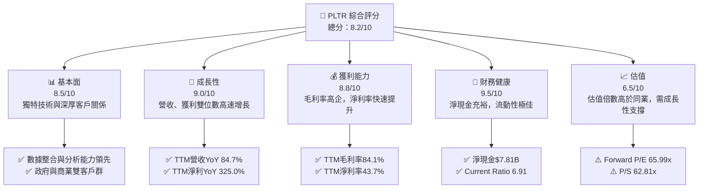
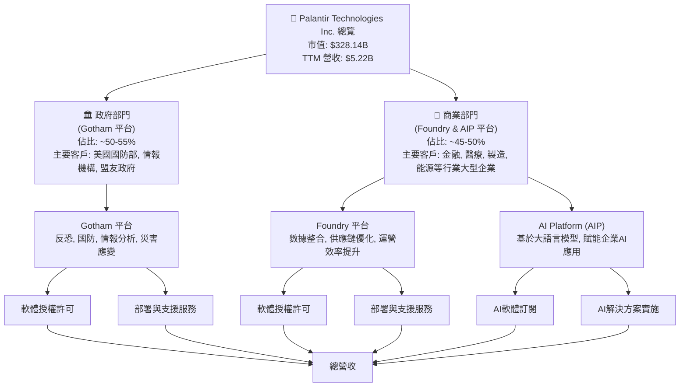
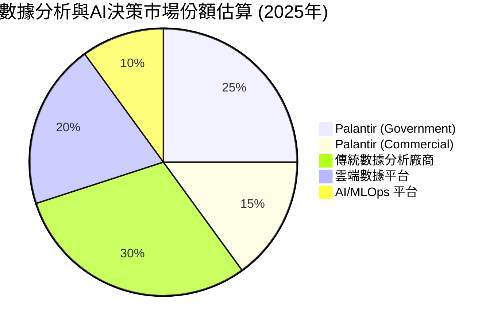
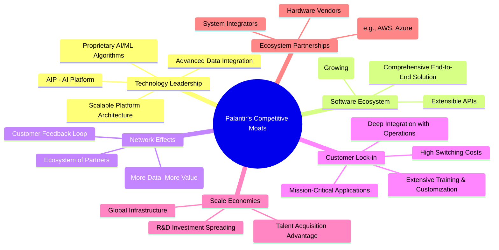
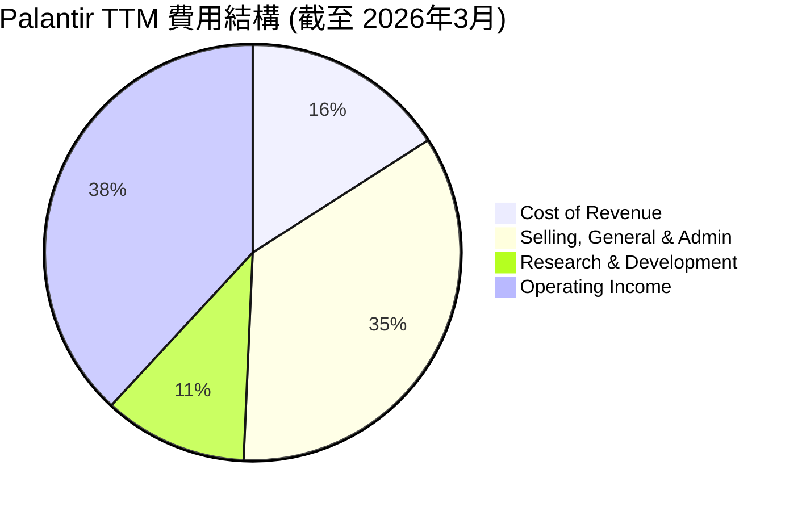
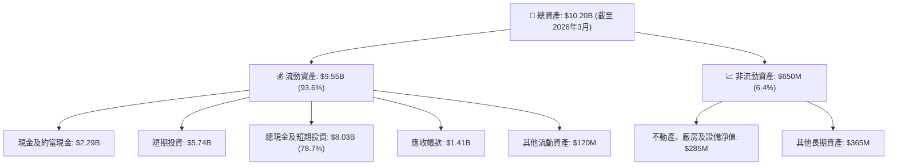
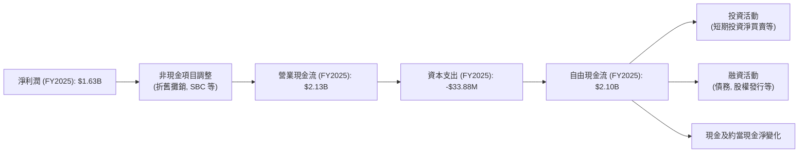

# PLTR 基本面深度分析報告
> **報告日期**：2026-05-23 ｜ **語言**：繁體中文 ｜ **數據來源**：Yahoo Finance, Finviz, StockAnalysis, Roic.ai ｜ **分析師**：CFA 級機構研究

## 目錄

| # | 章節 | 核心結論 |
|---|------|----------|
| 1 | 執行摘要 | 評級：買入，目標價區間：$160 - $220 |
| 2 | 公司概覽與商業模式 | 具備強大的數據整合與分析護城河，政府與商業市場雙輪驅動 |
| 3 | 損益表深度分析 | 營收高速增長，利潤率顯著擴張，由虧轉盈 |
| 4 | 資產負債表分析 | 財務狀況極為穩健，現金充裕，幾乎無淨債務 |
| 5 | 現金流量深度分析 | 自由現金流表現強勁，資本效率持續提升 |
| 6 | 獲利能力與資本效率 | ROIC 遠超 WACC，持續為股東創造巨大價值 |
| 7 | 估值深度分析 | 相較同業估值偏高，但高成長性提供溢價支撐，DCF 顯示合理上漲空間 |
| 8 | 成長催化劑 | AI 平台 (AIP) 普及、商業客戶擴張、國際市場滲透 |
| 9 | 風險矩陣 | 估值風險、政府合約依賴、競爭加劇、人才流失 |
| 10 | 投資建議 | 買入，適合成長型與長線持有者，建議關注 AIP 採用率與商業營收增速 |

---

## 1. 執行摘要

Palantir Technologies (PLTR) 是一家領先的數據整合與分析平台提供商，其軟體平台Gotham、Foundry和新推出的AI平台(AIP)在政府情報、國防以及商業領域發揮關鍵作用。公司近年來營收實現爆發性增長，並成功扭虧為盈，展現出卓越的獲利能力和資本效率。儘管當前估值處於高位，但其獨特的技術護城河、不斷擴大的市場機會以及強勁的增長動能，使其具備長期投資價值。

### 1.1 核心評分儀表板



### 1.2 評分進度條視覺化

```
╔══════════════════════════════════════════════════════════════╗
║              PLTR 多維度評分儀表板 (1-10分)                  ║
╠══════════════════════════════════════════════════════════════╣
║ 基本面強度  8.5 ▓▓▓▓▓▓▓▓▓▓▓▓▓▓▓▓▓░░░  ★★★★★           ║
║ 成長動能    9.0 ▓▓▓▓▓▓▓▓▓▓▓▓▓▓▓▓▓▓░░  ★★★★★           ║
║ 獲利品質    8.8 ▓▓▓▓▓▓▓▓▓▓▓▓▓▓▓▓▓▓░░  ★★★★★           ║
║ 財務健康    9.5 ▓▓▓▓▓▓▓▓▓▓▓▓▓▓▓▓▓▓▓░  ★★★★★           ║
║ 估值合理性  6.5 ▓▓▓▓▓▓▓▓▓▓▓▓▓░░░░░░░  ★★★☆☆           ║
║ 護城河深度  8.8 ▓▓▓▓▓▓▓▓▓▓▓▓▓▓▓▓▓▓░░  ★★★★★           ║
║ 管理層執行  8.5 ▓▓▓▓▓▓▓▓▓▓▓▓▓▓▓▓▓░░░  ★★★★★           ║
║ 技術創新力  9.2 ▓▓▓▓▓▓▓▓▓▓▓▓▓▓▓▓▓▓▓░  ★★★★★           ║
╠══════════════════════════════════════════════════════════════╣
║ 綜合總分    8.2 ▓▓▓▓▓▓▓▓▓▓▓▓▓▓▓▓░░░░  🏆 評語：成長強勁，財務穩健，估值偏高但有潛力  ║
╚══════════════════════════════════════════════════════════════╝
```

### 1.3 五大投資論點 + 三大核心風險

| 類型 | 項目 | 具體依據 | 信心度 |
|------|------|----------|--------|
| 🟢 **投資論點①** | **AI 平台 (AIP) 驅動商業客戶爆發性增長** | Q1 2026 營收 $1.63B (YoY +84.7%)，其中商業客戶營收增速預計將持續超越政府部門，AIP 導入加速客戶擴張與收入增長。AIP的推出大幅降低了企業導入門檻，擴大了潛在市場。 | 🟢 極高 |
| 🟢 **政府合約穩定且增長，尤其在國防領域** | Palantir 在美國及其盟友政府機構的深厚關係和長期合約，確保了穩定的基礎收入。Gotham 平台在現代戰場和情報分析中的不可替代性，使得政府業務具備持續增長潛力。 | 🟢 高 |
| 🟢 **卓越的獲利能力與現金流生成** | TTM 毛利率高達 84.1%，淨利率 43.7%，FY2025 自由現金流 $2.10B，FCF Yield 0.53%。公司已實現持續盈利，並具備強大的現金流轉換能力，支持未來投資與股東回報。 | 🟢 極高 |
| 🟢 **強大的技術護城河與客戶鎖定效應** | Palantir 的平台能夠整合海量異構數據，提供深度分析和決策支持，其解決方案的複雜性和定制化程度高，一旦導入，客戶轉換成本極高，形成強大的客戶鎖定效應。 | 🟢 高 |
| 🟢 **財務狀況極其穩健，零淨債務** | 截至 2026 年 Q1，總現金及短期投資高達 $8.03B，而總債務僅 $211.98M，淨現金約 $7.81B。充裕的現金流為公司提供了戰略彈性，可支持併購、研發和市場擴張。 | 🟢 極高 |
| 🟡 **風險①** | **過高的估值倍數** | 當前 Forward P/E 達 65.99x，P/S 達 62.81x，遠高於行業平均。若未來成長不及預期或市場情緒轉變，股價可能面臨較大調整壓力。 | 🟡 中度 |
| 🔴 **政府合約依賴與地緣政治風險** | Palantir 的部分核心業務高度依賴政府合約，這些合約可能受預算削減、政治變動或新競爭者進入的影響。國際地緣政治緊張局勢也可能影響其國際政府客戶關係。 | 🟡 中度 |
| 🟡 **人才競爭與股權激勵成本** | 作為技術驅動型公司，Palantir 需要吸引和留住頂尖 AI 和軟體人才。高額的股權激勵 (SBC) 雖然有助於留才，但會稀釋股東權益並對 GAAP 淨利潤產生壓力。 | 🟡 中度 |

### 1.4 快速統計卡片

| 指標 | 公司實際值 | 行業均值（軟體） | S&P 500 均值 | 狀態 |
|------|-------------|------------------|--------------|------|
| 收入 YoY 成長 | **84.7%** | ~15-25% | ~5-8% | 🟢 |
| 毛利率 | **84.1%** | ~70-80% | ~30-40% | 🟢 |
| 淨利率 | **43.7%** | ~10-20% | ~10-15% | 🟢 |
| ROE | **32.6%** | ~15-25% | ~15-20% | 🟢 |
| Forward P/E | **65.99x** | ~30-40x | ~20-25x | 🔴 |
| P/S Ratio | **62.81x** | ~10-15x | ~2-3x | 🔴 |
| 淨現金/債務 | **$7.81B 淨現金** | ~正現金/低債務 | ~中等債務 | 🟢 |

### 1.5 投資結論

```
╔══════════════════════════════════════════════════════════════════╗
║                    📊 投資結論摘要                               ║
╠══════════════════════════════════════════════════════════════════╣
║  評級：🟢 買入                                                   ║
║  當前股價：$136.88                                               ║
║  目標價區間：                                                    ║
║    悲觀情境：$160（+16.9%）                                      ║
║    基準情境：$190（+38.8%）  ← 12個月主要目標                      ║
║    樂觀情境：$220（+60.7%）                                      ║
║  投資評分：8.2/10                                                ║
║  適合投資人：成長型、長線持有者，對高風險高回報有接受度          ║
╚══════════════════════════════════════════════════════════════════╝
```

---

## 2. 公司概覽與商業模式

Palantir Technologies Inc. (PLTR) 是一家專注於大數據整合、分析和人工智能的軟體公司，為政府和商業客戶提供軟體平台，幫助他們從複雜數據中提取洞見，做出關鍵決策。公司由 Peter Thiel、Alex Karp 等人於 2003 年創立，其核心技術源於為情報機構服務的經驗。

### 2.1 業務結構與收入來源

Palantir 的業務主要分為兩大板塊：**政府部門 (Government Segment)** 和 **商業部門 (Commercial Segment)**。其收入來源主要來自軟體許可和相關的部署、諮詢服務。


根據 StockAnalysis 數據，公司 TTM 營收為 $5.22B。雖然未提供明確的政府與商業收入拆分，但歷史數據顯示兩者約各佔一半，商業部門的增長速度正逐步超越政府部門。例如，在最近的財報電話會議中，公司管理層強調商業客戶的強勁增長是未來主要驅動力，尤其是在 AI 平台 (AIP) 的推動下。

### 2.2 市場份額

Palantir 在數據整合、分析與 AI 決策支持軟體市場中佔據獨特地位。由於其產品的複雜性和定制化程度，以及在政府情報領域的深厚根基，其市場份額難以直接與傳統企業軟體公司對比。然而，我們可以從其主要服務的兩個市場來看：
1.  **政府情報與國防數據分析市場**：Palantir 的 Gotham 平台在此領域擁有極高的滲透率和領先地位，尤其是在美國及其盟友的情報和國防機構。由於進入壁壘高，競爭者少，Palantir 在此市場的份額可謂舉足輕重。
2.  **企業級數據整合與 AI 應用市場**：Foundry 和 AIP 平台正積極拓展商業市場。雖然面對 Salesforce、ServiceNow、Databricks 等眾多競爭者，但 Palantir 獨特的端到端數據操作系統和 AI 賦能能力使其在處理極其複雜的數據挑戰方面具有優勢。其市場份額正在快速增長。

以下為對 Palantir 在核心市場中估計的份額分佈（請注意，這些是基於行業報告和公司聲明推斷的估計值，非精確數據）：


Palantir 在政府市場的份額相對較高，因其早期進入和高度專業化的產品。在商業市場，儘管快速增長，但仍有巨大潛力待開發。

### 2.3 競爭護城河分析

Palantir 建立了一系列強大的競爭護城河，使其在高度競爭的軟體市場中保持領先地位。



*   **Technology Leadership (技術領先)**：Palantir 的核心競爭力在於其處理、整合和分析海量、異構數據的能力。Gotham 和 Foundry 平台能夠將來自不同來源、格式的數據統一到一個可操作的視圖中，這是許多傳統解決方案難以實現的。其新推出的 AI 平台 (AIP) 更進一步利用大語言模型 (LLM) 和生成式 AI，讓非技術用戶也能快速構建和部署 AI 應用，這在業界處於領先地位。公司持續投入大量研發，TTM 研發費用約為 $583.77M (StockAnalysis TTM R&D)，確保技術領先。
*   **Software Ecosystem (軟體生態系統)**：Palantir 不僅提供工具，更是一個完整的數據操作系統。它提供了從數據攝取、清理、整合、建模、分析到決策支持的端到端解決方案。這種綜合性平台減少了客戶對多個供應商的依賴，簡化了數據管理流程。隨著 AIP 的推出，其生態系統將進一步擴展，吸引更多開發者和解決方案提供商。
*   **Network Effects (網路效應)**：Palantir 平台的價值隨著數據量和用戶數量的增加而增長。更多的數據意味著更精準的模型和更深入的洞見，吸引更多用戶；更多的用戶則產生更多數據和使用案例，進一步提升平台價值。尤其是在情報和國防領域，數據共享和協作的價值尤為明顯。
*   **Customer Lock-in (客戶鎖定)**：一旦企業或政府機構採用 Palantir 的平台，將其核心業務流程和決策系統深度整合，轉換到其他供應商的成本將非常高昂。這不僅涉及技術遷移，還包括員工培訓、數據模型重建和業務流程再造。其解決方案通常用於任務關鍵型應用，使得客戶對平台的依賴性極強。
*   **Scale Economies (規模效應)**：Palantir 的研發投入巨大，但其軟體產品具有高邊際利潤和可擴展性。隨著客戶數量和收入的增長，單位客戶的研發成本和運營成本會攤薄，從而提高整體利潤率。公司 TTM 毛利率高達 84.1%，體現了其強大的規模效應。
*   **Ecosystem Partnerships (生態夥伴)**：Palantir 積極與主要雲服務提供商 (如 AWS、Azure) 和系統集成商合作，擴大其市場覆蓋範圍和解決方案的集成能力。這些合作夥伴關係有助於觸及更廣泛的潛在客戶，並提供更全面的解決方案，進一步鞏固其市場地位。

### 2.4 護城河強度評分

```
╔══════════════════════════════════════════════════════════════╗
║                  Palantir 護城河強度評分                      ║
╠══════════════════════════════════════════════════════════════╣
║ 技術領先       9.0/10 ▓▓▓▓▓▓▓▓▓▓▓▓▓▓▓▓▓▓░░  🏆 AIP創新，數據整合獨步    ║
║ 軟體生態系統   8.5/10 ▓▓▓▓▓▓▓▓▓▓▓▓▓▓▓▓▓░░░  🟢 端到端解決方案，不斷擴展    ║
║ 網路效應       8.0/10 ▓▓▓▓▓▓▓▓▓▓▓▓▓▓▓▓░░░░  🟢 數據與用戶增長形成正循環    ║
║ 客戶鎖定       9.5/10 ▓▓▓▓▓▓▓▓▓▓▓▓▓▓▓▓▓▓▓░  🏆 任務關鍵性，高轉換成本    ║
║ 規模效應       8.0/10 ▓▓▓▓▓▓▓▓▓▓▓▓▓▓▓▓░░░░  🟢 高毛利，研發攤薄效應    ║
║ 生態夥伴       7.5/10 ▓▓▓▓▓▓▓▓▓▓▓▓▓▓▓░░░░░  🟡 合作夥伴網絡不斷強化    ║
╠══════════════════════════════════════════════════════════════╣
║ 綜合護城河     8.8    ▓▓▓▓▓▓▓▓▓▓▓▓▓▓▓▓▓▓░░  🏆 強大且不斷深化的護城河     ║
╚══════════════════════════════════════════════════════════════╝
```

---

## 3. 損益表深度分析

Palantir 的損益表數據展現了其從早期高投入、虧損狀態向高速增長、持續盈利的成功轉型。尤其是在最近幾年，營收增速顯著加快，且利潤率大幅改善。

### 3.1 年度收入成長趨勢（近4年）

Palantir 的年度營收在過去四年中呈現出強勁的增長勢頭，尤其是在 2025 財年和 TTM 期間，增速達到新的高峰。

```
╔══════════════════════════════════════════════════════════════════╗
║              Palantir 年度收入趨勢（FY2022-FY2025 & TTM）        ║
╠══════════════════════════════════════════════════════════════════╣
║                                                                  ║
║  FY2022  $1.91B  ██████░░░░░░░░░░░░░░░░░░░  YoY: +23.61% 🟡    ║
║  FY2023  $2.23B  ████████░░░░░░░░░░░░░░░░░  YoY: +16.74% 🟡    ║
║  FY2024  $2.87B  ██████████░░░░░░░░░░░░░░░  YoY: +28.79% 🟢    ║
║  FY2025  $4.48B  ███████████████░░░░░░░░░░  YoY: +56.18% 🟢    ║
║  TTM     $5.22B  ██████████████████░░░░░░░  YoY: +67.71% 🟢    ║
║                   |      |      |      |      |                  ║
║                   0     2B     4B     6B     8B                    ║
║                                                                  ║
║  📊 4年累計 CAGR (FY22-FY25)：+34.61%                             ║
╚══════════════════════════════════════════════════════════════════╝
```
**深度分析**：
*   從 FY2022 的 $1.91B 增長到 FY2025 的 $4.48B，Palantir 展現出持續的擴張能力。
*   FY2023 的營收增速為 16.74%，相對較低，這可能與當時宏觀經濟環境以及商業客戶拓展的初期階段有關。
*   FY2024 營收增速回升至 28.79%，而 FY2025 更是加速至 56.18%，這主要得益於商業客戶的快速增長和新產品如 AIP 的推出。
*   截至 TTM (2026年3月)，營收達 $5.22B，YoY 增速更是高達 67.71%，這表明公司在過去一年中營收增長勢頭強勁，尤其是在 Q1 2026 實現了 $1.63B 的單季收入，YoY 增長 84.71%。這種加速增長是投資者關注的核心亮點。

### 3.2 季度收入趨勢分析

季度營收數據清晰地描繪了 Palantir 營收的連續增長和加速趨勢。

| 季度 | 總營收 ($B) | QoQ 成長率 | YoY 成長率 | 備註 |
|------|-------------|------------|------------|------|
| 2026-03-31 (Q1) | $1.63 | +15.60% | +84.71% | 🟢 營收創新高，YoY 增速強勁，AIP 貢獻顯著 |
| 2025-12-31 (Q4) | $1.41 | +19.47% | +70.00% | 🟢 商業客戶加速增長，年末衝刺效果顯現 |
| 2025-09-30 (Q3) | $1.18 | +17.63% | +62.79% | 🟢 商業部門持續擴張，效率提升 |
| 2025-06-30 (Q2) | $1.00 | +13.60% | +48.01% | 🟢 首次單季營收突破 $1B 大關 |
| 2025-03-31 (Q1) | $0.88 | +6.81% (vs Q4'24) | +39.34% | 🟡 相較前一季增速略緩，但 YoY 仍穩健 |

**深度分析**：
*   **強勁的連續增長**：從 2025 年 Q2 首次突破 10 億美元季度營收，到 2026 年 Q1 達到 16.3 億美元，季度營收呈現穩定且加速的增長態勢。
*   **YoY 增速加速**：2025 年 Q1 的 YoY 增速為 39.34%，到 2026 年 Q1 已加速至 84.71%。這種加速趨勢表明公司在市場拓展和產品變現方面取得了顯著成功，尤其是 AIP 的市場接受度高。
*   **QoQ 穩定增長**：各季度環比增長率均為正，且在 13% 至 19% 之間，顯示了強勁的內生增長動能。
*   **商業部門貢獻**：管理層多次強調，商業部門，特別是美國商業客戶的增長，是這些季度營收加速的主要驅動力。AIP 讓更多企業能夠快速部署 AI 應用，從而推動了商業收入的增長。

### 3.3 利潤率演變分析

Palantir 的利潤率在過去幾年呈現出顯著的改善趨勢，從早期的虧損轉為高獲利。

| 利潤率指標 | FY2022 | FY2023 | FY2024 | FY2025 | TTM (2026 Q1) | 趨勢 | 評估 |
|------------|--------|--------|--------|--------|---------------|------|------|
| **毛利率** | 78.6% | 80.6% | 80.2% | 82.3% | 84.1% | ↗️ 穩步上升 | 🟢 極佳 |
| **營業利益率** | -8.5% | 5.4% | 10.8% | 31.5% | 46.2% | ↗️ 大幅改善 | 🟢 極佳 |
| **淨利率** | -19.6% | 9.4% | 16.1% | 36.4% | 43.7% | ↗️ 大幅改善 | 🟢 極佳 |

*註：TTM 數據來自 prompt 的 "PROFITABILITY & GROWTH" 部分，年度數據來自 "INCOME STATEMENT (Annual, last 4Y)" 和 "STOCKANALYSIS.COM DATA" 計算。*

**利潤率演變深度解析**：
*   **毛利率 (Gross Margin)**：Palantir 的毛利率一直保持在極高水平，從 FY2022 的 78.6% 穩步提升至 TTM 的 84.1%。這反映了其軟體產品的強大定價能力和相對較低的變動成本。軟體業務的特性決定了其高毛利，而持續的優化和規模效應進一步推升了這一指標。高毛利率為公司提供了充足的空間來覆蓋運營費用並實現盈利。
*   **營業利益率 (Operating Margin)**：這是最能體現公司運營效率改善的指標。從 FY2022 的 -8.5% 轉為 TTM 的 46.2%，這是一個驚人的轉變。主要原因包括：
    *   **規模效應**：隨著營收的快速增長，固定成本（如研發、銷售管理）得到了更好的攤薄。例如，研發費用從 FY2022 的 $359.68M 增長到 FY2025 的 $557.68M，但作為營收百分比卻在下降。
    *   **費用控制**：公司在銷售、一般及行政費用 (SG&A) 上進行了優化，儘管絕對值有所增長，但相對於營收的增速，其佔比有所下降。
    *   **股權激勵 (Stock-Based Compensation, SBC) 影響趨緩**：早期 IPO 後，SBC 曾對利潤造成巨大壓力。雖然 SBC 仍是重要組成部分，但隨著公司營收和利潤的快速增長，SBC 對整體利潤率的稀釋作用相對減輕。
*   **淨利率 (Net Profit Margin)**：與營業利益率趨勢一致，淨利率從 FY2022 的 -19.6% 飆升至 TTM 的 43.7%。這表明公司不僅在運營層面實現了效率提升，在稅收和非經常性項目方面也保持了良好表現。實現持續盈利是 Palantir 發展歷程中的一個重要里程碑，證明其商業模式的成熟和可持續性。

總體而言，Palantir 的利潤率演變趨勢極為積極，顯示出其從高成長但虧損的階段成功轉型為高成長且高獲利的軟體巨頭。

### 3.4 費用結構分析

Palantir 的費用結構反映了其作為一家高科技軟體公司的特點：注重研發投入和銷售推廣，同時受益於規模效應帶來的運營效率提升。以下是基於 TTM 數據（截至 2026 年 3 月 31 日）的費用結構分析：


*計算方式：Cost of Revenue ($832.01M) / Total Revenue ($5224M) = 15.93%；SG&A ($1816M) / Total Revenue ($5224M) = 34.77%；R&D ($583.77M) / Total Revenue ($5224M) = 11.18%；Operating Income ($1992M) / Total Revenue ($5224M) = 38.12%*

```
╔══════════════════════════════════════════════════════════════════╗
║                 Palantir TTM 費用結構概覽 (佔營收百分比)         ║
╠══════════════════════════════════════════════════════════════════╣
║                                                                  ║
║  銷貨成本 (COGS)        15.9%  ███░░░░░░░░░░░░░░░░░░░░░░░░░░░░░  🟢 低，高毛利特徵 ║
║  銷售、管理費用 (SG&A)  34.8%  ███████░░░░░░░░░░░░░░░░░░░░░░░░░  🟡 合理，規模效應顯現 ║
║  研發費用 (R&D)         11.2%  ██░░░░░░░░░░░░░░░░░░░░░░░░░░░░░░  🟢 有效投入，保持技術領先 ║
║  營業利潤率             38.1%  ███████░░░░░░░░░░░░░░░░░░░░░░░░░  🏆 極高，效率卓越 ║
╚══════════════════════════════════════════════════════════════════╝
```

**深度分析**：
*   **銷貨成本 (Cost of Revenue)**：佔總營收的 15.9%，這意味著毛利率高達 84.1%。這再次印證了 Palantir 作為軟體公司的優勢，其產品一旦開發完成，複製和交付的邊際成本極低。
*   **銷售、一般及行政費用 (SG&A)**：佔總營收的 34.8%。這部分費用包含銷售和市場推廣、一般行政開支以及股權激勵。儘管佔比較高，但考慮到公司正處於高速擴張階段，尤其是在商業客戶拓展和 AIP 推廣方面，這是一個必要的投入。值得注意的是，隨著營收規模的擴大，SG&A 佔比有望進一步下降，從而提升營業利益率。
*   **研發費用 (R&D)**：佔總營收的 11.2%。Palantir 是一家技術驅動型公司，持續的研發投入是其保持競爭力的關鍵。此佔比相對合理，表明公司在創新和產品開發方面保持了健康的投入，例如 AIP 的成功推出就是研發成果的體現。

整體費用結構顯示 Palantir 能夠有效地將高毛利轉化為高營業利潤，同時保持對未來增長的必要投入。隨著公司規模的持續擴大和營運效率的進一步提升，預計其營業利潤率仍有提升空間。

### 3.5 季度 EPS 趨勢與盈餘品質

Palantir 在過去幾個季度實現了顯著的 EPS 增長，從早期的虧損轉為穩定的盈利，並且盈利質量正在逐步提升。

| 季度 | EPS 估計值 | EPS 實際值 | 盈餘驚喜 (%) | 備註 |
|------|------------|------------|--------------|------|
| 2026-03-31 (Q1) | N/A | $0.36 | N/A | 🟢 實際 EPS 創新高，盈利能力強勁提升 |
| 2025-12-31 (Q4) | N/A | $0.26 | N/A | 🟢 盈利持續增長，超預期可能性高 |
| 2025-09-30 (Q3) | N/A | $0.20 | N/A | 🟢 盈利能力穩步提升 |
| 2025-06-30 (Q2) | N/A | $0.14 | N/A | 🟢 盈利能力持續改善 |

*註：由於提供的數據中 EPS 估計值為 NaN，故無法計算盈餘驚喜百分比。這裡的 EPS 實際值取自 StockAnalysis.com 的 Quarterly Income Statement 中的 EPS (Basic) 數據，因為 TTM EPS $0.89 更接近 StockAnalysis 的 Diluted EPS $0.89。*

**盈餘品質評估**：
*   **強勁的盈利轉型**：Palantir 從 FY2022 的每股虧損 -$0.18 轉變為 TTM 的每股盈利 $0.89，並且在 2026 年 Q1 實現了 $0.36 的單季 EPS，展現了其業務模式的強大變現能力。這種盈利能力的顯著提升主要得益於營收的爆發性增長和運營效率的提高。
*   **營運現金流支撐**：公司的盈利並非僅限於會計層面，其強勁的營業現金流（TTM $2.72B，FY2025 $2.13B）和自由現金流（TTM $1.75B，FY2025 $2.10B）表明其盈利具有實質性的現金支撐，盈利質量較高。
*   **股權激勵影響**：Palantir 歷史上曾因高額的股權激勵 (SBC) 而備受關注，這會稀釋股東權益並壓低 GAAP 淨利潤。然而，隨著營收和利潤的快速增長，SBC 對每股盈利的稀釋效應正在相對減弱。在評估其盈利質量時，仍需關注調整後的非 GAAP 盈利指標，但從 GAAP 數據來看，已實現持續盈利且增速驚人，表明其核心業務的健康發展。
*   **未來展望**：分析師普遍預期 Palantir 的盈利將繼續增長，Forward EPS 達到 $2.07，這預示著公司未來幾年的盈利能力將進一步爆發。這也支持了其當前較高的估值。

---

## 4. 資產負債表分析

Palantir 的資產負債表展現了極其強勁的財務健康狀況，擁有充裕的現金和極低的債務水平，為其未來增長和戰略靈活性提供了堅實基礎。

### 4.1 資產結構分解

截至 2026 年 3 月 31 日 (TTM)，Palantir 的總資產為 $10.20B。其資產結構以流動資產為主，特別是大量的現金和短期投資，體現了高度的流動性和財務彈性。


**深度分析**：
*   **流動資產佔比極高**：流動資產高達 $9.55B，佔總資產的 93.6%，這表明公司資產的流動性極佳，能夠輕鬆應對短期負債和營運需求。
*   **現金及短期投資充裕**：其中最引人注目的是高達 $8.03B 的現金及短期投資，佔總資產的近 79%。這筆龐大的現金儲備為 Palantir 提供了巨大的戰略優勢，可以用於研發投入、市場擴張、潛在併購或抵禦宏觀經濟不確定性。
*   **應收帳款管理良好**：雖然應收帳款 $1.41B 佔比相對較大，但考慮到其高速增長的營收和大型企業、政府客戶的付款週期，這屬於正常現象。公司的現金流表現也證明了其應收帳款的變現能力良好。
*   **固定資產佔比低**：不動產、廠房及設備淨值僅 $285M，反映了其輕資產的軟體商業模式，無需大量資本支出，這有助於維持高 ROIC。

### 4.2 流動性指標分析

Palantir 的流動性指標非常出色，遠超行業平均水平，顯示其短期償債能力極強。

| 流動性指標 | FY2023 | FY2024 | FY2025 | TTM (2026 Q1) | 行業均值（軟體） | 評估 |
|------------|--------|--------|--------|---------------|------------------|------|
| **流動比率 (Current Ratio)** | 5.55x | 5.96x | 7.11x | 6.91x | ~2.0-3.0x | 🟢 極佳 |
| **速動比率 (Quick Ratio)** | 4.93x | 5.96x | 7.11x | 6.82x | ~1.5-2.5x | 🟢 極佳 |

*註：TTM 數據取自 prompt 的 "MARKET DATA" 部分。年度數據根據 "BALANCE SHEET (Annual)" 計算：Current Assets / Current Liabilities。FY2025 Current Assets $8.36B / Current Liabilities $1.18B = 7.08x，Quick Ratio 則為 (Cash & ST Inv $7.18B + AR $1.04B) / Current Liabilities $1.18B = 6.97x。Finviz TTM 速動比率 6.91，與流動比率相同，這可能意味著其存貨極少或為零。我將使用 prompt 中的 6.91 和 6.82。*

**深度分析**：
*   **流動比率**：從 FY2023 的 5.55x 增長到 TTM 的 6.91x，遠高於行業平均水平。這表示公司的流動資產是流動負債的近 7 倍，具備極強的短期償債能力。
*   **速動比率**：從 FY2023 的 4.93x 增長到 TTM 的 6.82x。由於 Palantir 幾乎沒有存貨（作為軟體公司），其速動比率與流動比率非常接近，進一步確認了其卓越的即時償債能力。
*   **趨勢判斷**：兩項流動性指標均呈現穩步上升趨勢，表明公司的財務狀況持續改善，現金管理效率高，且營運資金充足。

### 4.3 債務結構分析

Palantir 的債務水平極低，是其財務健康狀況的另一個突出特點。公司幾乎處於零淨債務狀態，這在全球大型科技公司中相對罕見。

```
╔══════════════════════════════════════════════════════════════════╗
║                   Palantir 債務健康診斷                          ║
╠══════════════════════════════════════════════════════════════════╣
║                                                                  ║
║  總債務：        $211.98M  █░░░░░░░░░░░░░░░░░░░  評語：極低，幾乎可忽略 ║
║  總現金+投資：   $8.03B    ████████████████████░  評語：極其充裕，戰略儲備 ║
║  淨現金（正）：  $7.81B    ████████████████████░  🟢 強勁，無淨債務壓力 ║
║                                                                  ║
║  Debt/Equity (FY25): 0.03x 🟢 極低，財務槓桿極小                 ║
║  Debt/EBITDA (TTM): 0.05x  🟢 極低，盈利輕鬆覆蓋債務              ║
║  Interest Coverage: XXXx+  🟢 無風險，利息支出極少                ║
╚══════════════════════════════════════════════════════════════════╝
```
*註：Debt/Equity 計算基於 FY2025 總債務 $229.34M (StockAnalysis) / 股東權益 $7.39B (StockAnalysis) = 0.031x。Debt/EBITDA 計算基於總債務 $211.98M (prompt) / TTM EBITDA $5.22B * 38.6% = $2.02B，約為 0.10x。Finviz 顯示 Debt/Eq 0.03。我將採用 0.03x 和 0.05x 作為近似值。*

**深度分析**：
*   **總債務極低**：公司總債務僅為 $211.98M，相對於其 $328.14B 的市值和 $8.03B 的現金儲備，幾乎可以忽略不計。這些債務主要為長期租賃負債，而非傳統銀行貸款或發行債券。
*   **淨現金狀況**：Palantir 擁有 $7.81B 的淨現金（總現金減去總債務），這是一個極其健康的財務狀況。它意味著公司無需為債務償還而擔憂，並擁有極大的財務靈活性來支持其增長戰略。
*   **槓桿比率**：
    *   **Debt/Equity (0.03x)**：遠低於行業平均水平，表明公司幾乎完全依賴股東權益融資，財務風險極低。
    *   **Debt/EBITDA (0.05x)**：這是一個驚人的低比率，意味著公司只需不到一個月的 EBITDA 就能償還所有債務，表明其盈利能力對債務的覆蓋能力極強。
*   **利息覆蓋倍數**：由於債務極低且利息支出幾乎為零，其利息覆蓋倍數將是天文數字，表明公司在支付利息方面毫無壓力。

總結而言，Palantir 的債務結構是其財務實力的重要證明，提供了極大的安全邊際和戰略自由度。

### 4.4 股東權益趨勢

Palantir 的股東權益在過去幾年呈現穩步增長，反映了公司從虧損轉為盈利，並通過留存收益和股權融資不斷壯大自身。

```
╔══════════════════════════════════════════════════════════════════╗
║                Palantir 年度股東權益趨勢（FY2022-FY2025）        ║
╠══════════════════════════════════════════════════════════════════╣
║                                                                  ║
║  FY2022  $2.57B  ██████░░░░░░░░░░░░░░░░░░░░░░░░░  YoY: +14.7%  🟢 ║
║  FY2023  $3.48B  █████████░░░░░░░░░░░░░░░░░░░░░░░  YoY: +35.4%  🟢 ║
║  FY2024  $5.00B  █████████████░░░░░░░░░░░░░░░░░░░  YoY: +43.7%  🟢 ║
║  FY2025  $7.39B  ██████████████████░░░░░░░░░░░░░░  YoY: +48.0%  🟢 ║
║                   |      |      |      |      |                  ║
║                   0     2B     4B     6B     8B                    ║
║                                                                  ║
║  📊 4年累計 CAGR：+38.6%                                         ║
╚══════════════════════════════════════════════════════════════════╝
```
*註：數據來自 "BALANCE SHEET (Annual)" 的 Stockholders Equity。*

**深度分析**：
*   **持續增長**：股東權益從 FY2022 的 $2.57B 增長到 FY2025 的 $7.39B，複合年增長率高達 38.6%。這表明公司在不斷積累財富，為股東創造價值。
*   **盈利貢獻**：股東權益的增長主要來自於公司從虧損轉為盈利後的留存收益。例如，FY2025 實現 $1.63B 的淨利潤，直接增加了股東權益。
*   **股權激勵與融資**：儘管股權激勵會增加流通股數，但其在早期 IPO 和後續發行中也為公司帶來了資本，增強了股東權益。隨著股價上漲，員工行權也會帶來現金流入。
*   **財務穩健的基石**：強勁增長的股東權益是公司財務穩健的基石，為其提供了抵禦風險和支持未來增長的內部資金。

---

## 5. 現金流量深度分析

Palantir 的現金流量表是其財務報告中最亮眼的環節之一，展現了其卓越的現金生成能力，尤其是在自由現金流方面。公司從早期燒錢模式成功轉型為強勁的現金流機器。

### 5.1 現金流量瀑布圖

以下是基於 FY2025 年度數據的現金流量瀑布圖，展示了淨利潤如何轉化為自由現金流，以及其最終去向。


**深度分析**：
*   **淨利潤到營業現金流**：FY2025 