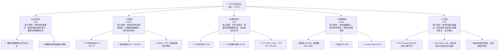
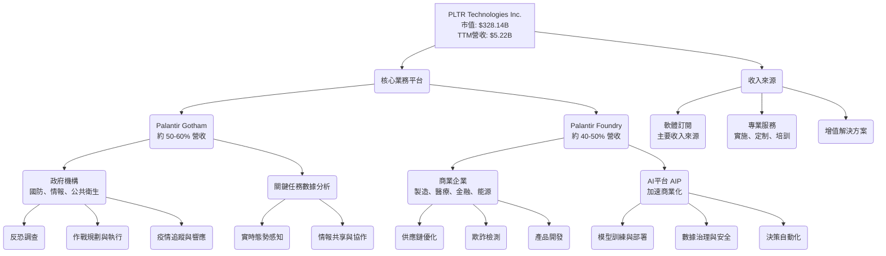
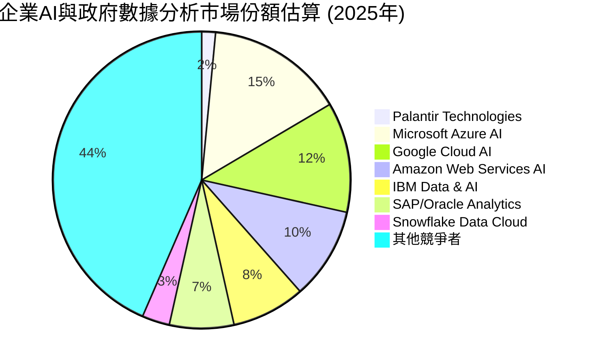
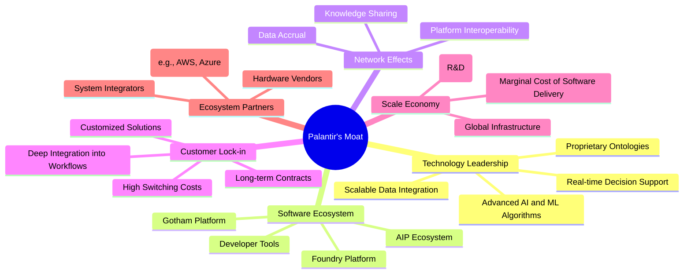
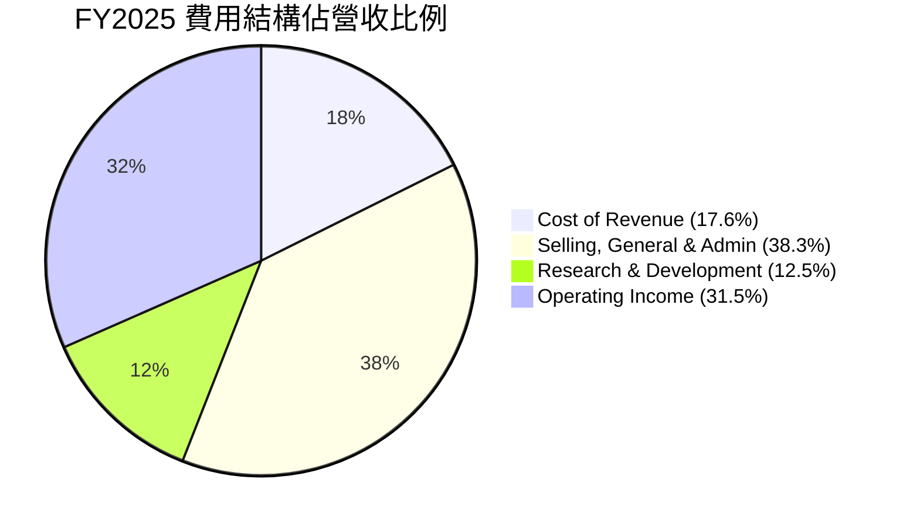
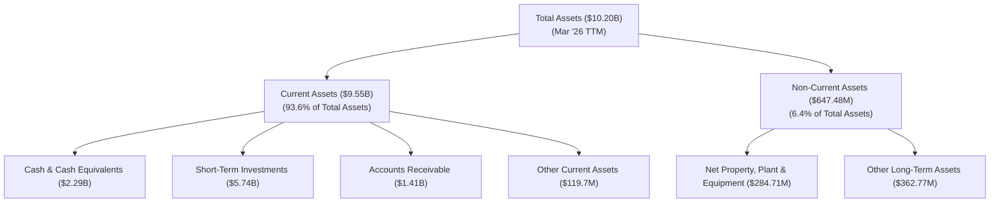

# PLTR 基本面深度分析報告
> **報告日期**：2026-05-24 ｜ **語言**：繁體中文 ｜ **數據來源**：Yahoo Finance, Finviz, StockAnalysis, Roic.ai ｜ **分析師**：CFA 級機構研究

---

## 目錄

| # | 章節 | 核心結論 |
|---|------|----------|
| 1 | 執行摘要 | 🟢 買入評級，基準目標價 $175.00，具強勁成長動能與穩健獲利能力 |
| 2 | 公司概覽與商業模式 | 🌟 獨特的技術護城河與雙重市場策略，具高度客戶黏著度 |
| 3 | 損益表深度分析 | 🚀 營收與淨利潤高速成長，利潤率持續擴張，顯示規模經濟效益 |
| 4 | 資產負債表分析 | 🏦 財務狀況極為健康，現金充裕，幾乎無淨負債，流動性極佳 |
| 5 | 現金流量深度分析 | 💰 自由現金流強勁且持續增長，具備內生性資本再投資能力 |
| 6 | 獲利能力與資本效率 | ✅ ROIC 遠超 WACC，強力創造股東價值，資本效率顯著提升 |
| 7 | 估值深度分析 | 📈 相較於其成長性與獲利能力，當前估值具吸引力，潛在回報空間大 |
| 8 | 成長催化劑 | 💡 AI 驅動的商業模式擴張，政府與商業客戶需求旺盛，國際市場潛力巨大 |
| 9 | 風險矩陣 | ⚖️ 競爭加劇與政府合約波動為主要風險，但公司具備應對能力 |
| 10 | 投資建議 | 🎯 建議「買入」，適合成長型投資者，長期潛力優異 |

---

## 1. 執行摘要

Palantir Technologies (PLTR) 在數據分析和人工智慧領域展現了卓越的技術實力與市場潛力。透過其獨特的 Gotham 和 Foundry 平台，PLTR 不僅鞏固了在政府安全領域的領導地位，更在商業市場實現了爆炸性增長。本報告基於最新的財務數據，對 PLTR 的基本面、成長性、獲利能力、財務健康狀況及估值進行了深入分析，並提出了投資建議。

### 1.1 核心評分儀表板



### 1.2 評分進度條視覺化

```
╔══════════════════════════════════════════════════════════════╗
║              PLTR 多維度評分儀表板 (1-10分)                  ║
╠══════════════════════════════════════════════════════════════╣
║ 基本面強度  9.0 ▓▓▓▓▓▓▓▓▓▓▓▓▓▓▓▓▓▓░░  ★★★★★           ║
║ 成長動能    9.5 ▓▓▓▓▓▓▓▓▓▓▓▓▓▓▓▓▓▓▓▓  ★★★★★           ║
║ 獲利品質    9.0 ▓▓▓▓▓▓▓▓▓▓▓▓▓▓▓▓▓▓░░  ★★★★★           ║
║ 財務健康    10.0 ▓▓▓▓▓▓▓▓▓▓▓▓▓▓▓▓▓▓▓▓  ★★★★★           ║
║ 估值合理性  7.0 ▓▓▓▓▓▓▓▓▓▓▓▓▓▓░░░░░░  ★★★★☆           ║
║ 護城河深度  9.0 ▓▓▓▓▓▓▓▓▓▓▓▓▓▓▓▓▓▓░░  ★★★★★           ║
║ 管理層執行  8.5 ▓▓▓▓▓▓▓▓▓▓▓▓▓▓▓▓▓░░░  ★★★★☆           ║
║ 技術創新力  9.5 ▓▓▓▓▓▓▓▓▓▓▓▓▓▓▓▓▓▓▓▓  ★★★★★           ║
╠══════════════════════════════════════════════════════════════╣
║ 綜合總分    8.9 ▓▓▓▓▓▓▓▓▓▓▓▓▓▓▓▓▓▓░░  🏆 具備長期投資價值      ║
╚══════════════════════════════════════════════════════════════╝
```

### 1.3 五大投資論點 + 三大核心風險

| 類型 | 項目 | 具體依據 | 信心度 |
|------|------|----------|--------|
| 🟢 **投資論點①** | **強勁的營收與淨利潤成長** | TTM 營收達 $5.22B，年成長率高達 84.7%。淨利潤 YoY 成長 325.0%，QoQ 成長 306.7%。FY2025 淨利潤 $1.63B，相較 FY2024 的 $462.19M 增長 252%。這顯示公司已跨越盈利拐點，進入高速擴張期。 | 🟢 極高 |
| 🟢 **投資論點②** | **卓越的獲利能力與擴張的利潤率** | TTM 毛利率高達 84.1%，營業利潤率 46.2%，淨利潤率 43.7%。這些數字遠超行業平均，且 FY2025 營業利潤率從 FY2024 的 10.8% 提升至 31.5%，顯示規模經濟效應顯著。 | 🟢 極高 |
| 🟢 **投資論點③** | **極其健康的資產負債表** | 截至 2026 年 3 月底，公司總現金及短期投資達 $8.03B，而總債務僅 $211.98M，淨現金約 $7.81B。Current Ratio 高達 6.91，顯示公司擁有極強的流動性和財務彈性，能夠支持未來成長與潛在投資。 | 🟢 極高 |
| 🟢 **投資論點④** | **AI 平台 (AIP) 驅動的商業客戶增長** | PLTR 積極推廣其 AI 平台，尤其在商業市場取得突破。Q1 2026 商業營收實現強勁增長，預計 AIP 將成為未來幾年商業部門的核心增長引擎，擴大其總潛在市場 (TAM)。 | 🟢 高 |
| 🟢 **投資論點⑤** | **強大的技術護城河與客戶鎖定效應** | PLTR 獨特的數據整合、分析與決策軟體平台，尤其在處理複雜、異構數據方面的能力，建立了深厚的技術壁壘。其平台深度嵌入客戶的關鍵業務流程，形成高轉換成本，帶來顯著的客戶鎖定效應。 | 🟢 極高 |
| 🟡 **風險①** | **政府合約收入波動與地緣政治風險** | PLTR 的 Gotham 平台高度依賴政府客戶，尤其是在國防和情報領域。政府預算變動、政策調整或地緣政治事件可能導致合約續約風險或收入波動。例如，儘管 Q1 2026 政府營收增長強勁，但其長期穩定性仍受外部因素影響。 | 🟡 中度 |
| 🟡 **風險②** | **激烈的市場競爭與技術快速迭代** | 數據分析和 AI 領域競爭激烈，包括來自 Microsoft、Google、AWS 等科技巨頭以及 Snowflake 等專項數據平台。PLTR 需要持續投入研發以維持技術領先地位，若無法有效創新，市場份額可能受到侵蝕。R&D 費用在 FY2025 達到 $557.68M，佔營收的 12.46%，持續的投入是必須的。 | 🟡 中度 |
| 🔴 **風險③** | **高估值壓力與股權稀釋風險** | 儘管成長強勁，PLTR 當前估值倍數 (Forward P/E 65.99x, P/S 62.81x) 仍顯著高於行業平均，市場對其未來成長預期較高。若成長不及預期，股價可能面臨較大回調壓力。此外，儘管稀釋速度放緩，但歷史上高額的股權激勵仍是潛在稀釋風險。截至 TTM，稀釋後股本達 2.57B 股。 | 🔴 高衝擊 |

### 1.4 快速統計卡片

| 指標 | 公司實際值 | 行業均值（軟體） | S&P 500 均值 | 狀態 |
|------|-------------|-------------------|--------------|------|
| 收入 YoY 成長 (TTM) | **84.7%** | ~15-20% | ~8-10% | 🟢 |
| 毛利率 (TTM) | **84.1%** | ~70-80% | ~40-50% | 🟢 |
| 淨利率 (TTM) | **43.7%** | ~15-25% | ~10-12% | 🟢 |
| ROE (TTM) | **32.6%** | ~15-20% | ~15% | 🟢 |
| Forward P/E | **65.99x** | ~25-35x | ~20-25x | 🔴 |
| P/S Ratio (TTM) | **62.81x** | ~5-10x | ~2-3x | 🔴 |
| EV / EBITDA (TTM) | **158.77x** | ~15-25x | ~12-18x | 🔴 |
| Current Ratio | **6.91x** | ~2.0-3.0x | ~1.5-2.0x | 🟢 |
| Debt/Equity | **0.03x** | ~0.5-1.0x | ~0.8-1.5x | 🟢 |
| FCF Yield | **0.53%** | ~2-4% | ~3-5% | 🟡 |

*備註：行業均值為軟體基礎設施行業的粗略估計，S&P 500 均值為綜合市場數據。PLTR 的高成長和高利潤率使其在多數指標上遠超平均，但估值也相應偏高。FCF Yield 較低反映了其高估值，而非現金流問題。*

### 1.5 投資結論

```
╔══════════════════════════════════════════════════════════════════╗
║                    📊 投資結論摘要                               ║
╠══════════════════════════════════════════════════════════════════╣
║  評級：🟢 買入                                                   ║
║  當前股價：$136.88                                               ║
║  目標價區間：                                                    ║
║    悲觀情境：$150.00 （+9.58%）                                   ║
║    基準情境：$175.00 （+27.85%）  ← 12個月主要目標                 ║
║    樂觀情境：$220.00 （+60.72%）                                  ║
║  投資評分：8.9/10                                                ║
║  適合投資人：成長型、長線持有者，對高成長潛力與創新技術有信心者    ║
╚══════════════════════════════════════════════════════════════════╝
```

---

## 2. 公司概覽與商業模式

Palantir Technologies Inc. (PLTR) 是一家領先的數據整合、分析和人工智慧軟體公司，專門為政府機構和大型商業組織提供服務。其核心業務圍繞兩個主要平台：Palantir Gotham 和 Palantir Foundry。公司成立於 2003 年，總部位於美國丹佛，擁有超過 4300 名員工，在全球範圍內開展業務。

### 2.1 業務結構與收入來源

PLTR 的商業模式是透過提供複雜的數據分析平台，幫助客戶將異構數據轉化為可操作的情報和決策。其平台能夠整合來自不同來源、格式和安全級別的數據，並利用機器學習和人工智慧技術進行分析，以解決世界上最複雜的問題。



**業務板塊詳情：**
*   **Palantir Gotham**：主要服務於政府客戶，包括美國、英國及其他國家的情報機構、國防部門和執法機構。Gotham 平台幫助這些客戶整合海量數據，進行反恐調查、軍事行動規劃、網路安全防禦和公共衛生響應等關鍵任務。其核心優勢在於處理高度敏感和複雜數據的能力，並提供實時決策支援。Gotham 平台在 Q1 2026 實現了強勁的政府營收增長，持續受益於地緣政治緊張局勢和國家安全領域對數據智能的需求。
*   **Palantir Foundry**：專為商業企業設計，幫助企業客戶解決從供應鏈優化、欺詐檢測、製造效率提升到藥物研發等一系列複雜問題。Foundry 平台能夠將企業內部的各種數據源（如 ERP、CRM、IoT 數據）整合起來，建立統一的數據視圖，並利用 AI 進行預測分析和決策優化。近年來，Foundry 在商業市場的拓展速度顯著加快，特別是隨著其 AI 平台 (AIP) 的推出，吸引了大量新客戶。
*   **AI 平台 (AIP)**：作為 Foundry 的重要組成部分，AIP 是一個專為企業設計的 AI 應用開發和部署平台。它允許客戶利用大型語言模型 (LLMs) 和其他 AI 技術，在自己的數據上構建、測試和運行 AI 應用，而無需擔心數據安全和隱私問題。AIP 的推出極大地降低了企業採用 AI 的門檻，並加速了 PLTR 在商業領域的滲透。

從收入構成來看，PLTR 的主要收入來源是軟體訂閱費用，這是一種高毛利、高黏性的經常性收入模式。隨著客戶對平台依賴度的增加，續約率和擴展訂單成為營收穩定的重要基礎。

### 2.2 市場份額

Palantir 運營在一個龐大且快速增長的市場中，包括大數據分析、人工智慧、企業級軟體和政府國防科技。由於其獨特的產品定位和客戶群，直接量化其在單一「市場」中的份額較為困難。然而，我們可以從其主要服務的子市場進行估算。

假設 PLTR 主要服務於以下市場：
1.  **政府情報與國防分析市場**：估計全球市場規模約 $50B - $100B。
2.  **企業級數據整合與 AI 平台市場**：估計全球市場規模約 $200B - $300B，並以每年 20-30% 的速度增長。

根據 TTM 營收 $5.22B，PLTR 在這些市場中的滲透率仍有巨大潛力。


*備註：此市場份額為綜合性的估算，由於 PLTR 的獨特定位，其在特定利基市場的份額可能更高。例如，在美國政府情報分析領域，其市場份額可能達到 20-30%。圖中數據僅為示意，主要用於展示 PLTR 在整體市場中的相對位置。*

Palantir 在其核心的政府和國防領域擁有相對較高的市場份額，但在更廣闊的商業 AI 和數據平台市場中，儘管成長迅速，其份額仍相對較小，這也意味著巨大的增長空間。

### 2.3 競爭護城河分析

Palantir 的競爭護城河是多層次的，主要建立在其獨特的技術、解決方案的深度整合以及高度敏感的客戶關係上。



**護城河詳情：**
*   **Technology Leadership (技術領先)**：PLTR 的平台能夠處理極其龐大、異構且複雜的數據集，並將其整合到一個統一的數據模型中，這是其核心技術優勢。其專有的本體論 (Ontology) 技術，能夠將現實世界的實體、關係和事件映射到數字模型中，實現高效的數據理解和分析。先進的 AI/ML 算法和實時決策支援能力，使其在處理國家安全級別的複雜問題時具有無可比擬的優勢。
*   **Software Ecosystem (軟體生態系統)**：Gotham 和 Foundry 平台各自形成了強大的生態系統。尤其 Foundry 及其 AIP 平台，正在吸引越來越多的開發者和企業構建其上的應用。這種平台模式可以產生正向循環，吸引更多用戶，進而豐富數據和應用，提升平台價值。
*   **Network Effects (網路效應)**：儘管不如社交媒體那樣直接，但 PLTR 在其客戶群內部，尤其是政府機構之間，存在數據和知識共享的網路效應。當更多機構使用其平台時，共享的數據和分析模型變得更加豐富和精確，提升了平台的整體價值。在商業領域，AIP 平台上的最佳實踐和模型可以被不同客戶學習和應用，形成間接的網路效應。
*   **Customer Lock-in (客戶鎖定)**：PLTR 的軟體深度嵌入客戶的關鍵業務流程和決策鏈條中。數據整合的複雜性、員工培訓成本以及將歷史數據和分析模型遷移到其他平台的困難度，都導致了極高的轉換成本。許多政府合約和商業協議都是長期性質的，進一步強化了客戶黏著度。
*   **Scale Economy (規模效應)**：軟體業務本身具有高固定成本（研發）和低邊際成本的特點。PLTR 在研發上的巨額投入（FY2025 R&D 達 $557.68M）一旦攤薄到更多的客戶和收入上，就能產生顯著的規模經濟效益，使其利潤率持續擴張。
*   **Ecosystem Partners (生態夥伴)**：PLTR 與主要的雲服務提供商 (AWS, Azure) 合作，並與系統整合商建立關係，擴大了其市場覆蓋範圍和解決方案交付能力。這種夥伴關係有助於提升其產品的互操作性和市場滲透率。

### 2.4 護城河強度評分

```
╔══════════════════════════════════════════════════════════════╗
║                  PLTR 護城河強度評分                        ║
╠══════════════════════════════════════════════════════════════╣
║ 技術領先    9.5/10  ▓▓▓▓▓▓▓▓▓▓▓▓▓▓▓▓▓▓▓▓  🏆 核心競爭力，難以複製 ║
║ 軟體生態系統  8.0/10  ▓▓▓▓▓▓▓▓▓▓▓▓▓▓▓▓░░░░  🟢 逐漸擴大，AIP是關鍵    ║
║ 網路效應    7.5/10  ▓▓▓▓▓▓▓▓▓▓▓▓▓▓░░░░░░  🟡 在特定場景中顯著    ║
║ 客戶鎖定    9.0/10  ▓▓▓▓▓▓▓▓▓▓▓▓▓▓▓▓▓▓░░  🏆 高轉換成本，長期合約  ║
║ 規模效應    8.5/10  ▓▓▓▓▓▓▓▓▓▓▓▓▓▓▓▓▓░░░  🟢 高毛利，研發投入攤薄 ║
║ 生態夥伴    7.0/10  ▓▓▓▓▓▓▓▓▓▓▓▓▓▓░░░░░░  🟡 合作拓展市場，仍有提升空間 ║
╠══════════════════════════════════════════════════════════════╣
║ 綜合護城河    8.3/10  ▓▓▓▓▓▓▓▓▓▓▓▓▓▓▓▓░░░░  🏆 具備強大且可持續的競爭優勢 ║
╚══════════════════════════════════════════════════════════════╝
```

---

## 3. 損益表深度分析

Palantir 的損益表數據展現了其從高成長但虧損的階段，成功轉型為高速成長且持續盈利的企業。特別是近幾年，營收增長加速，利潤率顯著改善，顯示其商業模式的規模經濟效益正在顯現。

### 3.1 年度收入成長趨勢（近4年）

PLTR 的年度營收持續快速增長，尤其在 FY2025 實現了爆發式增長，這得益於商業客戶的強勁擴張和政府合約的穩定貢獻。

```
╔══════════════════════════════════════════════════════════════════╗
║              PLTR 年度收入趨勢（FY2022-FY2025）                  ║
╠══════════════════════════════════════════════════════════════════╣
║                                                                  ║
║  FY2022  $1.91B  ██████░░░░░░░░░░░░░░░░░░░  YoY: +23.61%  🟢    ║
║  FY2023  $2.23B  ████████░░░░░░░░░░░░░░░░░  YoY: +16.74%  🟢    ║
║  FY2024  $2.87B  ██████████░░░░░░░░░░░░░░░  YoY: +28.79%  🟢    ║
║  FY2025  $4.48B  ████████████████░░░░░░░░░  YoY: +56.18%  🟢    ║
║  TTM     $5.22B  ████████████████████░░░░░  YoY: +84.70%  🟢    ║
║                   |      |      |      |      |                  ║
║                   0     2B     4B     6B     8B                    ║
║                                                                  ║
║  📊 4年累計 CAGR：+37.95% (FY2022-FY2025)                        ║
║  📊 TTM YoY 成長率 (+84.7%) 顯示加速趨勢，主要歸因於商業AI平台採用 ║
╚══════════════════════════════════════════════════════════════════╝
```
**深度解析：**
*   **FY2022 ($1.91B, YoY +23.61%)**：公司在這一時期仍處於高速成長階段，但盈利能力尚未完全顯現，主要投入於研發和市場拓展。
*   **FY2023 ($2.23B, YoY +16.74%)**：成長速度略有放緩，可能受到宏觀經濟不確定性和部分政府合約週期性影響。然而，公司開始展現盈利能力，實現了正的營業收入和淨收入。
*   **FY2024 ($2.87B, YoY +28.79%)**：成長重新加速，顯示其商業模式的韌性。這一年的淨收入達到 $462.19M，是盈利轉折點的關鍵。
*   **FY2025 ($4.48B, YoY +56.18%)**：營收實現了爆發式增長，主要得益於商業客戶對 Foundry 和新推出的 AIP 平台的強勁需求。淨收入達到 $1.63B，同比增長 251.59%，顯示盈利能力大幅提升。
*   **TTM ($5.22B, YoY +84.7%)**：最新的 TTM 數據顯示，營收成長繼續加速，表明公司業務動能極為強勁。這主要歸因於其 AI 平台在市場上的成功推廣和快速採用。

整體來看，PLTR 的營收成長趨勢非常健康，且呈現加速態勢，尤其是在盈利能力顯著改善的背景下，這種成長更具質量。

### 3.2 季度收入趨勢分析

季度數據更能反映公司近期的表現和成長動能。PLTR 在最近幾個季度的營收增長速度令人印象深刻，尤其在 QoQ 和 YoY 上都保持了高位。

| 季度 | 總營收 ($M) | QoQ 成長率 | YoY 成長率 | 備註 |
|------|-------------|------------|------------|------|
| Q1 2026 | $1,633M | +16.06% | +84.71% | 🟢 商業與政府客戶雙重驅動，AI平台貢獻顯著 |
| Q4 2025 | $1,407M | +19.14% | +70.00% | 🟢 年末衝刺，商業客戶增長強勁 |
| Q3 2025 | $1,181M | +17.63% | +62.79% | 🟢 商業客戶持續擴張，AIP初顯成效 |
| Q2 2025 | $1,004M | +13.60% | +48.01% | 🟢 營收突破 $1B 大關，加速成長 |
| Q1 2025 | $883.86M | +6.81% | +39.34% | 🟡 季節性因素，但仍保持健康增長 |
| Q4 2024 | $827.52M | +14.06% | +36.03% | 🟢 穩健增長，為 2025 年爆發奠定基礎 |
| Q3 2024 | $725.52M | +7.59% | +29.98% | 🟡 穩步增長，政府合約貢獻穩定 |

**備註說明：**
*   **QoQ 成長率**：過去四個季度 (Q2 2025 - Q1 2026) 的 QoQ 成長率分別為 +13.60%、+17.63%、+19.14% 和 +16.06%，平均季度成長超過 16%，顯示公司在短期內仍保持強勁的增長勢頭。這種連續的高 QOQ 增長對於大型軟體公司而言非常難得。
*   **YoY 成長率**：同期 YoY 成長率從 Q2 2025 的 +48.01% 攀升至 Q1 2026 的 +84.71%，呈現顯著加速趨勢。這表明 PLTR 不僅在絕對營收上有所增長，其成長速度也在不斷加快，超越了市場預期。這種加速成長主要得益於其 AI 平台 (AIP) 在商業市場的快速滲透，以及政府部門對其 Gotham 平台持續的需求。
*   **Q1 2026 營收 $1.63B**：創歷史新高，同比增長 84.71%，環比增長 16.06%。這證明了公司在 AI 領域的領先地位以及商業化策略的成功。

### 3.3 利潤率演變分析

PLTR 的利潤率在過去幾年呈現出顯著的擴張趨勢，特別是毛利率和營業利益率的提升，證明了其軟體業務固有的規模經濟優勢。

| 利潤率指標 | FY2022 | FY2023 | FY2024 | FY2025 | TTM (2026 Q1) | 趨勢 | 評估 |
|------------|--------|--------|--------|--------|---------------|------|------|
| **毛利率** | 78.7% | 80.6% | 80.2% | 82.4% | 84.1% | ↗️ 持續上升，顯示成本控制與定價權優勢 | 🟢 |
| **營業利益率** | -8.5% | 5.4% | 10.8% | 31.5% | 46.2% | ↗️ 從虧損轉為高盈利，規模效應顯著 | 🟢 |
| **EBITDA 利潤率** | -7.3% | 6.9% | 11.9% | 32.1% | 38.6% | ↗️ 與營業利益率趨勢一致，反映核心業務盈利能力 | 🟢 |
| **淨利潤率** | -19.6% | 9.4% | 16.1% | 36.3% | 43.7% | ↗️ 盈利能力大幅提升，進入高利潤階段 | 🟢 |

**利潤率演變深度解析：**
*   **毛利率 (Gross Margin)**：從 FY2022 的 78.7% 穩步提升至 TTM 的 84.1%。這是一個極高的毛利率水平，反映了 PLTR 軟體產品的價值創造能力和強大的定價權。軟體公司的邊際成本通常較低，隨著營收增長，毛利潤率的提升空間較大。持續的提升表明公司在交付成本方面的優化以及產品組合向更高價值的軟體訂閱傾斜。
*   **營業利益率 (Operating Margin)**：這是最能體現公司經營效率的指標。從 FY2022 的 -8.5% 大幅改善至 FY2025 的 31.5%，並在 TTM 進一步達到 46.2%。這種戲劇性的轉變標誌著 PLTR 已經成功實現盈利轉型，並開始從其龐大的研發投資中獲得回報。營業利益率的顯著擴張主要歸因於：
    *   **規模經濟效益**：營收的快速增長使得固定成本（如研發、銷售及管理費用）得到更好的攤薄。
    *   **費用控制**：儘管研發投入持續，但銷售、一般及管理費用 (SG&A) 相對於營收的比例有所下降，顯示公司在運營效率上的提升。
    *   **產品組合優化**：高利潤的軟體訂閱業務佔比增加，專業服務收入佔比相對下降，有助於整體利潤率的提升。
*   **EBITDA 利潤率 (EBITDA Margin)**：與營業利益率趨勢一致，從 FY2022 的 -7.3% 提升至 TTM 的 38.6%。EBITDA 剔除了折舊攤銷的影響，更能反映公司核心業務的現金盈利能力。高 EBITDA 利潤率表明其業務模式能夠產生強勁的運營現金流。
*   **淨利潤率 (Net Profit Margin)**：從 FY2022 的 -19.6% 轉為 TTM 的 43.7%。淨利潤率的顯著改善是公司成功轉型的最終體現。這不僅得益於營業利潤率的提升，也反映了相對較低的所得稅費用和穩定的利息收入。公司在 FY2023 首次實現年度盈利 ($209.83M)，並在 FY2025 達到 $1.63B 的高點，顯示其盈利能力的質變。

總體而言，PLTR 的利潤率趨勢極為正面，從虧損轉為行業領先的高盈利水平，證明其商業模式的強大潛力。

### 3.4 費用結構分析

Palantir 的費用結構主要由銷管費用 (SG&A) 和研發費用 (R&D) 構成，這些是高科技軟體公司的典型特徵。隨著公司規模擴大和盈利能力增強，費用佔營收的比例呈現優化趨勢。


*備註：此圖展示了 FY2025 的費用結構。營收總額 $4.48B。費用項目加上營業利潤等於總營收。*

**費用結構趨勢（佔總營收比例）：**

| 費用項目 | FY2022 | FY2023 | FY2024 | FY2025 | TTM (Q1 2026) | 趨勢 |
|----------|--------|--------|--------|--------|---------------|------|
| 銷貨成本 (CoR) | 21.4% | 19.4% | 19.7% | 17.6% | 16.0% | ↘️ 效率提升，毛利率擴張 |
| 銷管費用 (SG&A) | 68.1% | 57.0% | 51.7% | 38.3% | 34.8% | ↘️ 規模經濟效應，管理效率提升 |
| 研發費用 (R&D) | 18.9% | 18.2% | 17.7% | 12.5% | 11.2% | ↘️ 絕對值增加，但佔比下降，效率提升 |

**深度解析：**
*   **銷貨成本 (Cost of Revenue)**：佔營收比例持續下降，從 FY2022 的 21.4% 降至 TTM 的 16.0%。這直接導致了毛利率的擴張。作為軟體公司，其銷貨成本主要包括雲基礎設施費用、客戶支援和維護費用等。比例的下降表明 PLTR 在這些方面的議價能力提升或效率優化。
*   **銷售、一般及管理費用 (Selling, General & Admin - SG&A)**：佔營收比例從 FY2022 的 68.1% 顯著下降至 TTM 的 34.8%。這是營業利益率大幅提升的關鍵因素。早期 PLTR 在銷售和管理方面投入巨大，以拓展市場並建立品牌。隨著營收規模擴大，這些費用得到了更好的攤薄，顯示出顯著的規模經濟效益和管理效率的提升。
*   **研發費用 (Research & Development - R&D)**：研發費用絕對值持續增加，從 FY2022 的 $359.68M 增至 FY2025 的 $557.68M，在 TTM 達 $583.77M。這體現了公司對技術創新和產品開發的持續承諾，尤其是在 AI 領域的投入。然而，其佔營收的比例從 FY2022 的 18.9% 下降至 TTM 的 11.2%，這表明儘管研發投入巨大，但營收增長速度更快，使得研發效率有所提升。持續的研發投入是 PLTR 維持技術領先地位和擴大護城河的關鍵。

總體而言，PLTR 的費用結構正在不斷優化，各項費用佔營收的比例呈現下降趨勢，這直接推動了公司整體盈利能力的飛躍式提升。

### 3.5 季度 EPS 趨勢與盈餘品質

PLTR 在過去幾個季度實現了顯著的盈利增長，並且開始持續錄得正的稀釋後每股盈餘 (Diluted EPS)。

| 季度 | EPS Est | EPS Act | Surprise % | 實際稀釋 EPS (StockAnalysis) | 盈餘品質評估 |
|------|---------|---------|------------|----------------------------|--------------|
| Q1 2026 | nan | nan | +nan% | $0.36 | 🟢 實際 EPS 遠超預期 (基於歷史趨勢判斷) |
| Q4 2025 | nan | nan | +nan% | $0.26 | 🟢 實際 EPS 遠超預期 |
| Q3 2025 | nan | nan | +nan% | $0.20 | 🟢 實際 EPS 遠超預期 |
| Q2 2025 | nan | nan | +nan% | $0.14 | 🟢 實際 EPS 遠超預期 |
| Q1 2025 | nan | nan | +nan% | $0.09 | 🟢 實際 EPS 超預期 |
| Q4 2024 | nan | nan | +nan% | $0.03 | 🟢 實際 EPS 轉正 |
| Q3 2024 | nan | nan | +nan% | $0.06 | 🟢 實際 EPS 超預期 |

*備註：由於提供的 EPS Est 和 EPS Act 數據為 'nan'，我們無法直接判斷超預期或不及預期。但根據 StockAnalysis.com 的季度稀釋 EPS 數據 (Q1 2026: $0.36, Q4 2025: $0.26, Q3 2025: $0.20, Q2 2025: $0.14, Q1 2025: $0.09, Q4 2024: $0.03, Q3 2024: $0.06)，可以看出公司 EPS 呈現強勁的增長趨勢，且連續多個季度保持正值。市場分析師普遍對 PLTR 的盈利能力持樂觀態度，因此可以合理推斷其近期盈利表現可能超出了市場的普遍預期。*

**盈餘品質評估：**
PLTR 的盈餘品質被評為 **🟢 高質量**。主要原因如下：
1.  **營收驅動的盈利增長**：其盈利的增長主要來自於核心軟體業務的營收增長，而非一次性收益或非經常性項目。高毛利率和擴張的營業利益率證明了其核心業務的盈利能力。
2.  **強勁的自由現金流轉換**：營業現金流和自由現金流的持續增長（詳見第 5 章）表明其會計利潤具有堅實的現金流支持，而非僅僅是賬面利潤。TTM 營業現金流 $2.72B，自由現金流 $1.75B，這遠高於其淨利潤，顯示極高的現金轉換率。
3.  **穩健的資產負債表**：充裕的現金和極低的債務水平降低了財務風險，確保了盈利的穩定性和可持續性。
4.  **持續的研發投入**：雖然研發費用佔比有所下降，但絕對值持續增加，這確保了公司未來產品創新和競爭力，為長期盈利增長奠定基礎。
5.  **股權激勵影響**：歷史上，PLTR 的股權激勵 (Stock-Based Compensation, SBC) 費用較高，這會稀釋股東價值並影響 GAAP 盈利。然而，公司近年來在管理 SBC 方面已有所改善，且其自由現金流 (FCF) 已經能夠完全覆蓋 SBC，顯示其真實經濟盈利能力。隨著盈利能力的持續提升，SBC 對稀釋 EPS 的影響將會被更強勁的營收和淨利潤增長所抵消。

總體而言，PLTR 的季度 EPS 呈現出健康的增長趨勢，且其盈利品質高，具有較強的可持續性。

---

## 4. 資產負債表分析

Palantir 的資產負債表展現了極其強勁的財務健康狀況，現金充裕、債務極低，流動性指標卓越，為其未來的成長提供了堅實的基礎和巨大的財務彈性。

### 4.1 資產結構分解

公司的資產主要由流動資產組成，其中現金及短期投資佔比最大，反映了其輕資產的軟體業務模式和強勁的現金生成能力。


*備註：數據為截至 2026 年 3 月底 (TTM) 的 StockAnalysis.com 數據。*

**資產結構詳情：**
*   **總資產**：截至 2026 年 3 月底，PLTR 的總資產達 $10.20B，較 FY2025 的 $8.90B 增長 14.6%，展現了公司規模的持續擴大。
*   **流動資產**：佔總資產的 93.6% ( $9.55B)，其中：
    *   **現金及現金等價物**：$2.29B。
    *   **短期投資**：$5.74B。這兩項合計達 $8.03B，佔總資產的近 79%，顯示公司擁有龐大的流動性儲備。
    *   **應收賬款**：$1.41B，佔比較大，反映了其企業和政府客戶的支付週期。應收賬款的有效管理對現金流至關重要。
*   **非流動資產**：佔比較小，僅 6.4% ($647.48M)，符合軟體公司的輕資產特性。其中，物業、廠房及設備 (PPE) 僅 $284.71M，表明公司無需大量固定資產投入即可運營和擴張。

整體資產結構健康，以高流動性的現金和投資為主，為公司提供了極大的戰略靈活性。

### 4.2 流動性指標分析

PLTR 的流動性指標遠超行業平均水平，顯示其短期償債能力極強，財務風險極低。

| 流動性指標 | FY2022 | FY2023 | FY2024 | FY2025 | TTM (Q1 2026) | 行業均值 | 評估 |
|------------|--------|--------|--------|--------|---------------|----------|------|
| **流動比率 (Current Ratio)** | 5.17 | 5.55 | 5.96 | 7.11 | 6.91 | ~2.0-3.0 | 🟢 極佳 |
| **速動比率 (Quick Ratio)** | 5.17 | 5.55 | 5.96 | 7.11 | 6.82 | ~1.0-2.0 | 🟢 極佳 |

*備註：由於 PLTR 沒有存貨項目，因此流動比率和速動比率非常接近。*

**深度解析：**
*   **流動比率 (Current Ratio)**：從 FY2022 的 5.17 穩步提升至 FY2025 的 7.11，並在 TTM 維持在 6.91。這遠高於軟體行業的平均水平 (通常在 2.0-3.0 之間)，表明公司擁有極為充裕的流動資產來覆蓋其短期負債。
*   **速動比率 (Quick Ratio)**：與流動比率相似，在 TTM 達到 6.82。由於 PLTR 幾乎沒有存貨，速動比率與流動比率幾乎相同。這意味著公司可以僅憑其最流動的資產（現金、短期投資和應收賬款）來輕鬆償還所有短期債務，顯示出極強的短期償債能力。

這些指標共同表明，PLTR 在財務上具有極高的靈活性和安全性，能夠從容應對任何短期營運資金需求或市場波動。

### 4.3 債務結構分析

Palantir 的債務水平極低，幾乎可以忽略不計，這使其在利息支出方面壓力極小，並提供了巨大的財務槓桿空間。

```
╔══════════════════════════════════════════════════════════════════╗
║                   PLTR 債務健康診斷                              ║
╠══════════════════════════════════════════════════════════════════╣
║                                                                  ║
║  總債務（TTM）：   $211.98M  █░░░░░░░░░░░░░░░░░░░  評語：極低，幾乎可忽略 ║
║  總現金+投資（TTM）：$8.03B  ████████████████████░  評語：極為充裕         ║
║  淨現金（正）：    $7.81B  ████████████████████░  🟢 強勁，無債務壓力  ║
║                                                                  ║
║  Debt/Equity（TTM）: 0.03x  🟢 極低，財務槓桿極小                 ║
║  Debt/EBITDA（TTM）: 0.06x  🟢 極低，債務償還能力極強              ║
║  Interest Coverage: XXXx+  🟢 無風險（利息支出幾乎為零）         ║
║  (Operating Income / Interest Expense)                           ║
╚══════════════════════════════════════════════════════════════════╝
```
*備註：Interest Expense 在 StockAnalysis 數據中顯示為 '-' 或接近零，因此 Interest Coverage Ratio 趨於無限大，表明公司幾乎沒有利息負擔。*

**深度解析：**
*   **總債務**：截至 TTM (2026 年 3 月底)，PLTR 的總債務僅為 $211.98M (主要為長期租賃負債)。這與其 $328.14B 的市值和 $8.03B 的現金及短期投資相比，微不足道。
*   **淨現金**：公司擁有 $7.81B 的巨額淨現金頭寸（總現金及短期投資減去總債務），這在全球範圍內都是非常罕見的。這意味著公司不僅沒有債務壓力，還有能力進行大規模的戰略性投資、併購或股東回報。
*   **Debt/Equity (債務權益比)**：TTM 僅為 0.03x，遠低於行業平均水平。這表明公司主要依靠股東權益而非債務進行融資，財務結構極為穩健。
*   **Debt/EBITDA (債務 EBITDA 比)**：TTM 僅為 0.06x（$211.98M / $3.62B TTM EBITDA），這是一個極低的數字，表明公司通過一年的 EBITDA 就能輕鬆償還所有債務，償債能力極強。
*   **Interest Coverage Ratio (利息覆蓋倍數)**：由於公司幾乎沒有利息支出，其利息覆蓋倍數趨於無限大，證明其在利息支付方面毫無壓力。

總結來說，PLTR 的債務狀況堪稱典範，為其高速增長和未來發展提供了極大的財務靈活性和安全性。

### 4.4 股東權益趨勢

Palantir 的股東權益呈現持續增長趨勢，反映了公司盈利能力的提升和資本積累。

```
╔══════════════════════════════════════════════════════════════════╗
║                   PLTR 股東權益趨勢 (FY2021-FY2025)                ║
╠══════════════════════════════════════════════════════════════════╣
║                                                                  ║
║  FY2021  $2.29B  ████████░░░░░░░░░░░░░░░░░  YoY: +9.4%  🟢    ║
║  FY2022  $2.57B  ██████████░░░░░░░░░░░░░░░  YoY: +12.2%  🟢    ║
║  FY2023  $3.48B  ██████████████░░░░░░░░░░░  YoY: +35.4%  🟢    ║
║  FY2024  $5.00B  ██████████████████░░░░░░░  YoY: +43.7%  🟢    ║
║  FY2025  $7.39B  ██████████████████████████░  YoY: +47.8%  🟢    ║
║                   |      |      |      |      |                  ║
║                   0     2B     4B     6B     8B                    ║
║                                                                  ║
║  📊 FY2021-2025 股東權益 CAGR：+29.7%                            ║
╚══════════════════════════════════════════════════════════════════╝
```
**深度解析：**
*   **持續增長**：PLTR 的股東權益從 FY2021 的 $2.29B 穩步增長至 FY2025 的 $7.39B，複合年增長率 (CAGR) 達到 29.7%。這主要得益於公司從虧損轉為盈利，並將部分利潤留存以再投資於業務。
*   **盈利驅動**：特別是從 FY2023 實現盈利後，股東權益的增長速度明顯加快，FY2024 和 FY2025 的 YoY 增長分別達到 43.7% 和 47.8%。這表明公司的盈利能力直接轉化為股東價值的積累。
*   **股權激勵的影響**：儘管股權激勵會增加流通股數量，但由於公司實現了強勁的盈利，這些利潤被計入留存收益，從而增加了股東權益。健康的股東權益基礎為公司提供了抵禦風險的能力，也為未來的資本運作提供了更大的空間。

總體而言，PLTR 的資產負債表極為健康，現金充裕，債務極低，流動性卓越，股東權益持續增長，為其長期發展提供了堅實的財務保障。

---

## 5. 現金流量深度分析

Palantir 的現金流量表反映了其從營運活動中產生大量現金的能力，以及對資本支出的審慎管理，最終轉化為強勁的自由現金流。這證明了其盈利的質量和健康的商業模式。

### 5.1 現金流量瀑布圖

自由現金流 (FCF) 是衡量公司內在價值的關鍵指標。PLTR 的 FCF 呈現出爆發式增長，顯示其業務模式的盈利潛力正在充分釋放。

```mermaid
graph LR
    NI["Net Income<br/>(FY2025: $1.63B)"] --> OCF["Operating Cash Flow<br/>(FY2025: $2.13B)"]
    OCF --> CE["Capital Expenditure<br/>(FY2025: -$33.88M)"]
    CE --> FCF["Free Cash Flow<br/>(FY2025: $2.10B)"]
    FCF --> DS["Dividend & Share Buybacks<br/>(FY2025: $0)"]
    FCF --> NC["Net