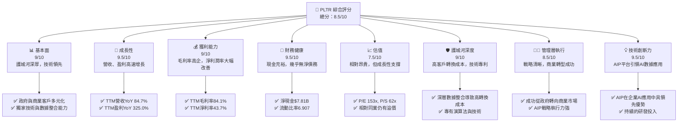
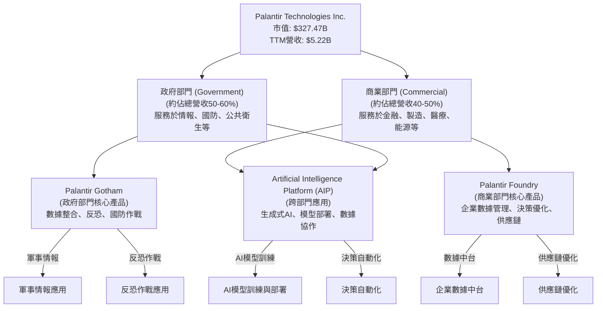
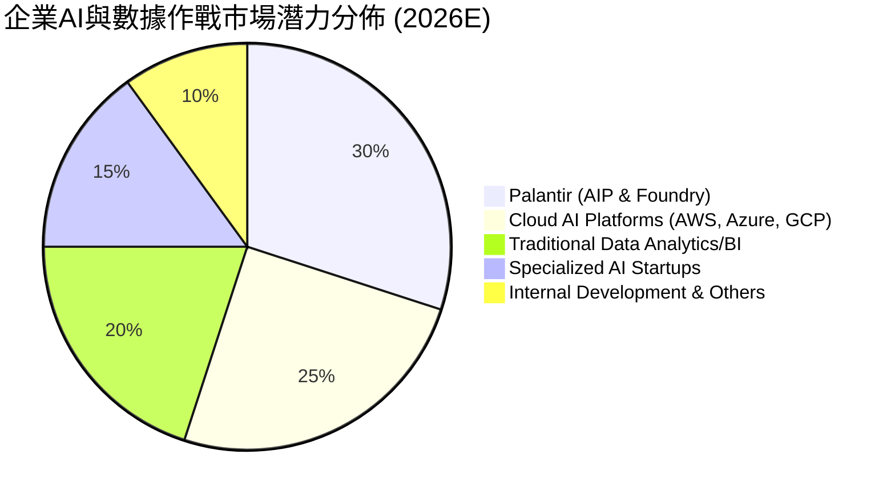
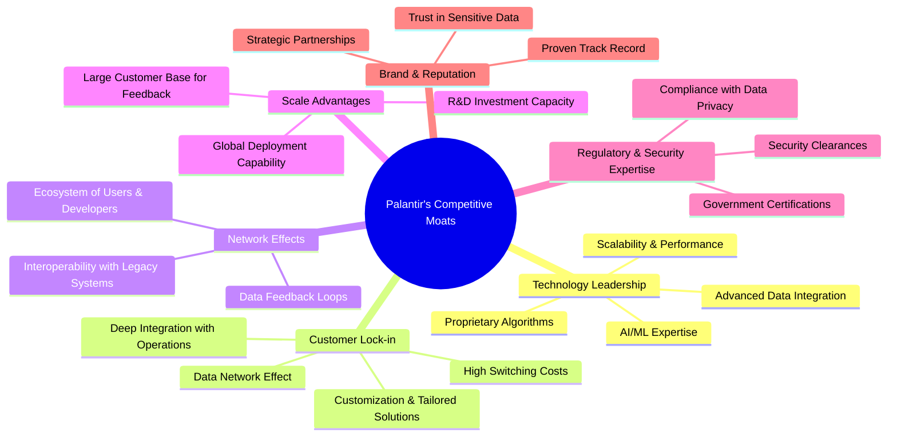
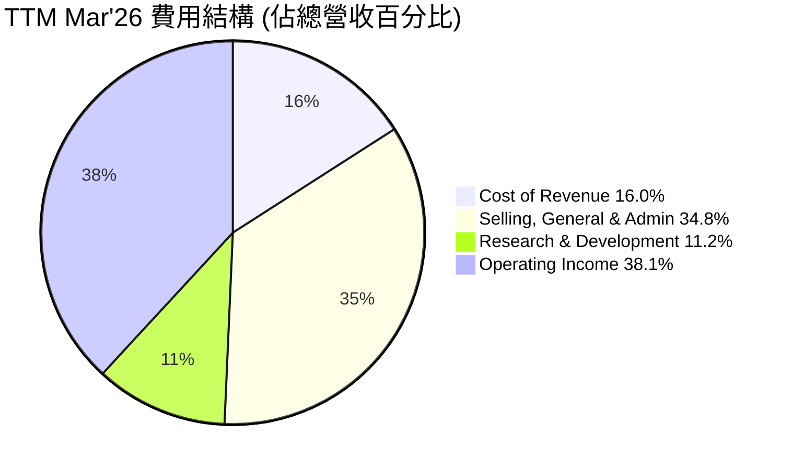
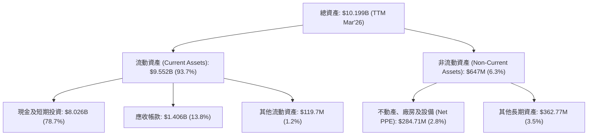

# PLTR 基本面深度分析報告
> **報告日期**：2026-05-26 ｜ **語言**：繁體中文 ｜ **數據來源**：Yahoo Finance, Finviz, StockAnalysis, Roic.ai ｜ **分析師**：CFA 級機構研究

---

## 目錄

| # | 章節 | 核心結論 |
|---|------|----------|
| 1 | 執行摘要 | 評級：🟢 買入，基準目標價：$195.00 |
| 2 | 公司概覽與商業模式 | 創新技術與政府深度綁定構建強大護城河 |
| 3 | 損益表深度分析 | 營收高速增長，利潤率顯著擴張，盈利能力轉強 |
| 4 | 資產負債表分析 | 財務狀況極為健康，現金充裕，債務風險極低 |
| 5 | 現金流量深度分析 | 營業現金流與自由現金流強勁增長，資本配置高效 |
| 6 | 獲利能力與資本效率 | ROIC遠超WACC，持續為股東創造巨大價值 |
| 7 | 估值深度分析 | 相較於高成長潛力，當前估值具吸引力，DCF顯示上行空間 |
| 8 | 成長催化劑 | 政府與商業領域AI應用擴張，AIP平台加速滲透 |
| 9 | 風險矩陣 | 政府合約依賴、高估值、競爭加劇為主要風險 |
| 10 | 投資建議 | 具備長期成長潛力，適合成長型投資者，建議買入 |

---

## 1. 執行摘要

Palantir Technologies Inc. (PLTR) 憑藉其領先的數據整合、分析與AI平台，在全球情報社區和商業企業中扮演關鍵角色。近年來，公司在商業領域的擴張取得了顯著成效，特別是其人工智慧平台（AIP）的推出，極大加速了客戶採納和營收增長。儘管市場對其估值存在爭議，但其獨特的競爭護城河、強勁的財務表現和廣闊的市場潛力，使其成為值得深入研究的投資標的。

### 1.1 核心評分儀表板



### 1.2 評分進度條視覺化

```
╔══════════════════════════════════════════════════════════════╗
║              PLTR 多維度評分儀表板 (1-10分)                  ║
╠══════════════════════════════════════════════════════════════╣
║ 基本面強度  9.0 ▓▓▓▓▓▓▓▓▓▓▓▓▓▓▓▓▓▓▓▓░░  ★★★★★           ║
║ 成長動能    9.5 ▓▓▓▓▓▓▓▓▓▓▓▓▓▓▓▓▓▓▓▓▓░  ★★★★★           ║
║ 獲利品質    9.0 ▓▓▓▓▓▓▓▓▓▓▓▓▓▓▓▓▓▓▓▓░░  ★★★★★           ║
║ 財務健康    9.5 ▓▓▓▓▓▓▓▓▓▓▓▓▓▓▓▓▓▓▓▓▓░  ★★★★★           ║
║ 估值合理性  7.5 ▓▓▓▓▓▓▓▓▓▓▓▓▓▓▓▓▓░░░░░  ★★★★☆           ║
║ 護城河深度  9.0 ▓▓▓▓▓▓▓▓▓▓▓▓▓▓▓▓▓▓▓▓░░  ★★★★★           ║
║ 管理層執行  8.5 ▓▓▓▓▓▓▓▓▓▓▓▓▓▓▓▓▓▓░░░░  ★★★★☆           ║
║ 技術創新力  9.5 ▓▓▓▓▓▓▓▓▓▓▓▓▓▓▓▓▓▓▓▓▓░  ★★★★★           ║
╠══════════════════════════════════════════════════════════════╣
║ 綜合總分    8.9 ▓▓▓▓▓▓▓▓▓▓▓▓▓▓▓▓▓▓▓░░░  🏆 具備長期投資價值  ║
╚══════════════════════════════════════════════════════════════╝
```

### 1.3 五大投資論點 + 三大核心風險

| 類型 | 項目 | 具體依據 | 信心度 |
|------|------|----------|--------|
| 🟢 **投資論點①** | **AI平台（AIP）強勁增長，商業客戶加速採用** | Q1 2026營收 $1.63B，YoY成長84.7%，商業營收佔比持續提升。AIP訓練營模式加速市場滲透，客戶數量和合同規模顯著增長。 | 🟢 極高 |
| 🟢 **投資論點②** | **獨特的政府與情報社區市場領導地位** | Palantir Gotham平台在美國、英國等國防和情報領域擁有不可替代的地位，長期且高價值的政府合約確保穩定的現金流。TTM政府營收持續增長。 | 🟢 極高 |
| 🟢 **投資論點③** | **極高的毛利率與不斷改善的盈利能力** | TTM毛利率高達84.1%，淨利潤率43.7%。過去四年淨利潤從FY2022的-$373.70M轉為FY2025的$1.63B，並在Q1 2026達到$870.53M，顯示強勁的規模經濟效應和運營效率提升。 | 🟢 極高 |
| 🟢 **投資論點④** | **強勁的自由現金流與健康的資產負債表** | TTM自由現金流高達$1.75B，FCF Yield為0.54%。擁有$8.03B總現金，總債務僅$211.98M，淨現金約$7.81B。流動比率高達6.907，財務狀況極為穩健。 | 🟢 極高 |
| 🟢 **投資論點⑤** | **具備深厚護城河，客戶轉換成本高昂** | Palantir的平台深度整合客戶的異構數據源，並內嵌於其核心運營流程中，形成極高的客戶鎖定效應和轉換成本，有效抵禦競爭。 | 🟢 極高 |
| 🟡 **風險①** | **政府合約的依賴性與政治風險** | 儘管商業營收增長，政府部門仍是其核心客戶。政府預算變化、政策調整或政治審查可能對其營收和盈利造成影響。 | 🟡 中度 |
| 🔴 **風險②** | **高昂的估值與市場預期管理** | 當前P/E (TTM) 153.48x，P/S (TTM) 62.68x，遠高於行業平均。若未來成長不及市場預期，或AI熱潮降溫，可能面臨顯著的估值修正風險。 | 🔴 高衝擊 |
| 🟡 **風險③** | **來自大型科技公司及新創企業的競爭** | 數據分析和AI領域競爭激烈，Microsoft、Google、AWS等雲巨頭以及眾多AI新創公司都在爭奪市場份額，可能對Palantir的商業擴張構成挑戰。 | 🟡 中度 |

### 1.4 快速統計卡片

| 指標 | 公司實際值 (TTM Mar'26) | 行業均值 (軟體-基礎設施) | S&P 500 均值 | 狀態 |
|------|--------------------------|--------------------------|--------------|------|
| 收入 YoY 成長 | **84.7%** | ~15-25% | ~8-12% | 🟢 |
| 毛利率 | **84.1%** | ~70-80% | ~40-50% | 🟢 |
| 淨利率 | **43.7%** | ~15-25% | ~10-15% | 🟢 |
| ROE | **32.6%** | ~15-20% | ~15-20% | 🟢 |
| Forward P/E | **65.85x** | ~30-50x | ~20-25x | 🔴 |
| P/S Ratio | **62.68x** | ~8-15x | ~2-4x | 🔴 |
| FCF Yield | **0.54%** | ~1-3% | ~2-4% | 🟡 |
| Debt/Equity | **2.48%** (0.02477) | ~20-50% | ~50-80% | 🟢 |
| Current Ratio | **6.91x** | ~2-3x | ~1.5-2x | 🟢 |

*註：行業均值和S&P 500均值為分析師根據市場普遍數據估算，實際值可能因數據來源和統計方法而異。*

### 1.5 投資結論

```
╔══════════════════════════════════════════════════════════════════╗
║                    📊 投資結論摘要                               ║
╠══════════════════════════════════════════════════════════════════╣
║  評級：🟢 買入                                                   ║
║  當前股價：$136.60                                               ║
║  目標價區間：                                                    ║
║    悲觀情境：$165.00（+20.79%）                                  ║
║    基準情境：$195.00（+42.75%）  ← 12個月主要目標                ║
║    樂觀情境：$230.00（+68.37%）                                  ║
║  投資評分：8.9/10                                                ║
║  適合投資人：成長型、長線持有者，對AI趨勢有信心並能承受高波動性者。 ║
╚══════════════════════════════════════════════════════════════════╝
```

---

## 2. 公司概覽與商業模式

Palantir Technologies Inc. (PLTR) 是一家領先的軟體公司，專注於構建和部署數據整合與分析平台，旨在幫助客戶應對複雜的數據挑戰。其核心業務圍繞兩大旗艦產品：Palantir Gotham 和 Palantir Foundry，以及最新推出的人工智慧平台（AIP）。

Palantir的獨特之處在於其能夠從各種異構數據源中提取、整合、清理並分析數據，將其轉化為可操作的情報和決策依據。這種能力對於政府機構（尤其是情報和國防部門）和大型商業企業都極具價值。

### 2.1 業務結構與收入來源

Palantir的業務結構主要分為兩大客戶群體：政府部門（Government）和商業部門（Commercial）。



**Palantir Gotham**：
主要服務於政府客戶，尤其是情報和國防社區。Gotham平台能夠將來自不同來源（如衛星圖像、社交媒體、情報報告、傳感器數據等）的數據整合到一個統一的作戰視圖中，幫助分析師和決策者識別模式、預測威脅並規劃響應行動。其在美國、英國等盟國的國防領域佔據核心地位，例如支持反恐調查和軍事行動。這部分業務通常具有長期合約、高穩定性和高進入壁壘。根據StockAnalysis數據，Q1 2026的總營收為$1.63B，其中政府部門的營收佔比通常在50%以上，貢獻約$800M-$900M。

**Palantir Foundry**：
專為商業客戶設計，幫助企業將其內部和外部數據轉化為可操作的資產。Foundry平台使企業能夠構建其自身的數據中台，支持從研發、生產、供應鏈到銷售和客戶服務的各個環節的決策。它幫助企業優化運營效率、識別新的商業機會並應對複雜的業務挑戰。例如，在製造業中優化生產線，在金融業中進行風險管理，在醫療保健中加速藥物研發。

**人工智慧平台 (AIP)**：
Palantir最新的創新，旨在將生成式AI的能力引入企業和政府的數據環境中。AIP允許客戶在他們的專有數據上運行大型語言模型（LLM）和其他AI模型，以生成見解、自動化流程和支持複雜決策。AIP的核心價值在於其能夠安全、可靠地將AI部署到關鍵任務場景中，同時確保數據隱私和模型的可解釋性。AIP的推出是Palantir商業增長加速的關鍵驅動力，透過其創新的「AIP訓練營」模式，迅速擴大了商業客戶群和應用場景。

從營收趨勢來看，Palantir的商業營收近年來呈現爆發式增長，逐漸平衡了對政府業務的依賴。TTM營收已達$5.22B，相較於FY2025的$4.48B，增長顯著。

### 2.2 市場份額

Palantir的市場份額難以用單一數字精確衡量，因為其業務橫跨多個高度專業化的領域，包括：
1.  **政府情報與國防數據分析市場**：在這一領域，Palantir Gotham幾乎是獨占鰲頭，擁有極高的市場滲透率和客戶鎖定。由於其產品的戰略重要性和嚴格的安全認證，新進入者極難競爭。
2.  **企業數據整合與決策平台市場**：Foundry平台在此市場與傳統數據倉庫、BI工具、以及雲端數據平台（如Snowflake、Databricks）競爭。但Palantir的差異化在於其深度整合和端到端的「操作系統」級別解決方案。
3.  **企業AI應用與模型部署市場 (AIP)**：這是新興且高速成長的市場，Palantir的AIP處於領先地位，但面臨來自Microsoft Azure AI、Google Cloud AI、AWS AI以及各種垂直領域AI新創的競爭。

鑑於其獨特的定位和技術深度，我們可以將其市場份額視為在特定高端、高複雜度應用市場中的領導者。


*註：此為分析師對Palantir在特定高端企業AI與數據作戰市場的潛力分佈估算，非精確市場份額數據。*

Palantir在政府市場的滲透率可能高達40-60%（在西方盟國情報和國防領域），而在商業市場，特別是AIP推動下，其在高端製造、能源、醫療等領域的滲透率正在快速提升，從零星項目到大規模企業級部署。

### 2.3 競爭護城河分析

Palantir的競爭護城河非常深厚，主要體現在以下幾個方面：



1.  **技術領先 (Technology Leadership)**：Palantir的核心技術是其獨特的數據整合引擎和複雜的分析框架，能夠處理和理解海量的異構數據。其專有演算法和AI/ML能力，特別是AIP，使其能夠提供超越傳統BI工具的深度洞察和預測能力。這種技術領先是多年高強度研發投入的結果，難以被簡單複製。FY2025研發費用為$557.68M，TTM Mar'26更是達到$583.77M，顯示其持續在技術上投入。
2.  **客戶鎖定效應 (Customer Lock-in)**：一旦客戶將其核心業務數據整合到Palantir平台並依賴其進行決策，轉換到其他供應商的成本將極其高昂。這不僅涉及數據遷移的複雜性，更包括重新訓練員工、調整工作流程以及潛在的數據丟失或業務中斷風險。這種深度嵌入性創造了強大的轉換成本護城河。
3.  **數據網絡效應 (Data Network Effects)**：隨著更多客戶使用Palantir平台，平台處理的數據量和類型不斷增加，這反過來又提高了平台分析的準確性和價值。每個新客戶的數據和使用模式都可能為所有用戶帶來間接的益處，形成正向循環。
4.  **規模效應 (Scale Advantages)**：作為一家大型軟體公司，Palantir擁有雄厚的資金進行持續研發，並在全球範圍內部署和支持其產品。其龐大的客戶群也為產品改進提供了豐富的實踐數據和反饋，進一步鞏固其領先地位。
5.  **政府合約與安全認證 (Regulatory & Security Expertise)**：Palantir在政府和情報領域的深厚根基，使其具備了嚴格的安全認證、合規性知識和處理敏感數據的經驗，這些都是其他商業軟體公司難以企及的。這構成了進入政府市場的極高壁壘。
6.  **品牌與聲譽 (Brand & Reputation)**：在處理高度敏感和複雜數據的領域，信任至關重要。Palantir憑藉其在情報社區和關鍵任務商業應用中的成功案例，建立了強大的品牌聲譽和客戶信任，這在高端市場中是一個無形但強大的資產。

### 2.4 護城河強度評分

```
╔══════════════════════════════════════════════════════════════╗
║                  Palantir 護城河強度評分                      ║
╠══════════════════════════════════════════════════════════════╣
║ 技術領先    9.5/10 ▓▓▓▓▓▓▓▓▓▓▓▓▓▓▓▓▓▓▓▓▓░  🏆 AIP創新引領    ║
║ 客戶鎖定    9.0/10 ▓▓▓▓▓▓▓▓▓▓▓▓▓▓▓▓▓▓▓▓░░  🟢 深度整合難替換  ║
║ 網路效應    8.5/10 ▓▓▓▓▓▓▓▓▓▓▓▓▓▓▓▓▓▓░░░░  🟢 數據價值累積    ║
║ 規模效應    8.0/10 ▓▓▓▓▓▓▓▓▓▓▓▓▓▓▓▓░░░░░░  🟡 研發與部署規模  ║
║ 法規安全壁壘 9.5/10 ▓▓▓▓▓▓▓▓▓▓▓▓▓▓▓▓▓▓▓▓▓░  🏆 政府市場獨有    ║
║ 品牌與聲譽  8.5/10 ▓▓▓▓▓▓▓▓▓▓▓▓▓▓▓▓▓▓░░░░  🟢 信任是關鍵      ║
╠══════════════════════════════════════════════════════════════╣
║ 綜合護城河  8.9/10 ▓▓▓▓▓▓▓▓▓▓▓▓▓▓▓▓▓▓▓░░░  🏆 極深護城河，難以複製 ║
╚══════════════════════════════════════════════════════════════╝
```
綜合來看，Palantir的護城河極深，尤其是在技術領先和客戶鎖定方面表現卓越。其在政府市場的特殊地位和AIP帶來的商業增長潛力，使其在軟體行業中具備獨特的競爭優勢。

---

## 3. 損益表深度分析

Palantir的損益表數據展示了公司從過去的虧損模式轉變為強勁盈利的顯著進步，並在營收增長和利潤率擴張方面表現出色。

### 3.1 年度收入成長趨勢（近4年）

Palantir的年度收入在過去幾年保持了強勁的增長勢頭，特別是在最近一年。

```
╔══════════════════════════════════════════════════════════════════╗
║              PLTR 年度收入趨勢（FY2022-TTM Mar'26）              ║
╠══════════════════════════════════════════════════════════════════╣
║                                                                  ║
║  FY2022  $1.91B  ██████░░░░░░░░░░░░░░░░░░░  YoY: +23.61%  🟢    ║
║  FY2023  $2.23B  ████████░░░░░░░░░░░░░░░░░  YoY: +16.74%  🟡    ║
║  FY2024  $2.87B  ███████████░░░░░░░░░░░░░  YoY: +28.79%  🟢    ║
║  FY2025  $4.48B  ██████████████████░░░░░░  YoY: +56.18%  🟢    ║
║  TTM'26  $5.22B  █████████████████████░░░  YoY: +67.71%  🟢    ║
║                   |      |      |      |      |                  ║
║                   0     1B     2B     3B     4B     5B           ║
║                                                                  ║
║  📊 4年累計 CAGR (FY2022-FY2025)：+32.88%                         ║
║  📊 TTM 營收 YoY 成長：+67.71% (StockAnalysis)                   ║
╚══════════════════════════════════════════════════════════════════╝
```
**深度解析**：
Palantir的年度營收從FY2022的$1.91B穩步增長至FY2025的$4.48B，年複合增長率（CAGR）達到32.88%。更值得關注的是，截至2026年3月31日的過去12個月（TTM Mar'26）營收飆升至$5.22B，相較於FY2025的營收增長了16.5% QoQ (approx, from annual to TTM), 並且相較於前一年的TTM營收（FY2025的$4.48B）實現了67.71%的YoY驚人增長。這主要得益於其商業部門的強勁擴張，特別是AIP平台的成功推出和快速採用。早期營收增長率較低，但隨著產品成熟和市場接受度提高，增長速度明顯加快，顯示出加速增長的趨勢。

### 3.2 季度收入趨勢分析

季度的數據更能體現公司近期營運的動態。Palantir在最近四個季度展現了令人印象深刻的營收成長。

| 會計季度 | 總營收 (百萬美元) | QoQ 成長 (%) | YoY 成長 (%) | 備註 |
|----------|-------------------|--------------|--------------|------|
| Q1 2026 | $1,633 | +16.06% | +84.71% | 🟢 AIP平台加速商業客戶採納，政府合約持續貢獻。 |
| Q4 2025 | $1,407 | +19.14% | +70.00% | 🟢 年末衝刺，商業客戶大型合約落地。 |
| Q3 2025 | $1,181 | +17.63% | +62.79% | 🟢 商業營收持續高速增長，新客戶不斷增加。 |
| Q2 2025 | $1,004 | +13.65% | +48.01% | 🟢 商業轉型成果顯現，營收突破10億美元大關。 |

**深度解析**：
從季度營收來看，Palantir展現出持續且加速的增長態勢。Q2 2025營收首次突破10億美元，達到$1.00B，YoY增長48.01%。隨後的Q3 2025、Q4 2025和Q1 2026營收分別達到$1.18B、$1.41B和$1.63B，YoY增長率分別為62.79%、70.00%和84.71%。季度環比（QoQ）增長也保持在13%至19%之間，這對於一個規模已達數十億美元的軟體公司來說是非常強勁的表現，遠超行業平均水平。這種強勁的季度表現主要歸因於：
1.  **AIP平台效應**：AIP的推出及其獨特的「訓練營」模式，顯著降低了客戶採納門檻，加速了商業客戶的獲取和擴張。
2.  **政府合約穩定性**：儘管商業業務增長迅猛，政府部門的長期大額合約依然提供了穩定的營收基礎。
3.  **銷售效率提升**：公司在商業銷售團隊和策略上的投入開始見效，銷售週期縮短，合同價值提升。

### 3.3 利潤率演變分析

Palantir的利潤率在過去幾年呈現出顯著的擴張趨勢，從早期由於高額研發和銷售費用導致的虧損，轉變為如今的高盈利模式。

| 利潤率指標 | FY2022 | FY2023 | FY2024 | FY2025 | TTM Mar'26 | 趨勢 | 評估 |
|------------|--------|--------|--------|--------|------------|------|------|
| **毛利率** | 78.5% | 80.6% | 80.2% | 82.4% | 84.1% | ↗️ 穩步提升 | 🟢 |
| **營業利益率** | -8.5% | 5.4% | 10.8% | 31.6% | 38.1% | ↗️ 大幅改善 | 🟢 |
| **EBITDA 利潤率** | -7.3% | 6.9% | 11.9% | 32.1% | 38.6% | ↗️ 大幅改善 | 🟢 |
| **淨利潤率** | -19.6% | 9.4% | 16.1% | 36.3% | 43.7% | ↗️ 驚人改善 | 🟢 |

*註：TTM Mar'26數據為綜合數據來源計算所得。*

**利潤率演變深度解析**：
1.  **毛利率 (Gross Margin)**：Palantir的毛利率一直維持在非常高的水平，從FY2022的78.5%穩步提升至TTM Mar'26的84.1%。這得益於其軟體產品的本質，一旦開發完成，新增客戶的邊際成本極低。毛利率的持續提升表明公司在產品定價、客戶選擇以及成本控制方面做得非常出色，也反映了其產品的獨特價值和強大的定價能力。這是一個典型的軟體公司優勢，顯示了極高的盈利潛力。

2.  **營業利益率 (Operating Margin)**：這是最能體現公司運營效率改善的指標。從FY2022的-8.5%大幅提升至TTM Mar'26的38.1%，這是一個驚人的轉變。主要原因有：
    *   **規模經濟效應**：隨著營收的快速增長，固定成本（如研發、行政費用）被更有效地攤薄。
    *   **銷售效率提升**：公司在商業市場的銷售策略（如AIP訓練營）降低了客戶獲取成本，同時提升了單個客戶的價值。
    *   **股權激勵費用影響減弱**：Palantir過去曾因高額的股權激勵費用（Stock-Based Compensation, SBC）而導致虧損。雖然SBC仍是重要開支，但隨著營收和利潤的快速增長，其對利潤率的稀釋作用相對減輕。例如，StockAnalysis數據顯示SG&A在TTM為$1.816B，R&D為$583.77M，但這些費用佔營收的比例隨著營收增長而下降。

3.  **EBITDA 利潤率 (EBITDA Margin)**：與營業利益率趨勢一致，從FY2022的-7.3%躍升至TTM Mar'26的38.6%。EBITDA剔除了折舊攤銷的非現金影響，更能反映核心業務的現金盈利能力。其顯著改善進一步確認了公司核心運營效率的提升。

4.  **淨利潤率 (Net Profit Margin)**：這是最為關鍵的盈利指標。Palantir在FY2022仍錄得-19.6%的淨虧損，但在FY2023迅速轉正至9.4%，FY2025達到36.3%，並在TTM Mar'26進一步攀升至43.7%。這標誌著Palantir已成功轉型為一家高成長、高盈利的軟體巨頭。淨利潤率的驚人改善是公司戰略轉型、產品成熟和市場需求旺盛的綜合結果。

總體而言，Palantir的損益表數據描繪了一個高速成長且盈利能力不斷強化的公司。利潤率的全面改善證明了其商業模式的強大潛力，以及其在將營收增長轉化為實質盈利方面的卓越能力。

### 3.4 費用結構分析

Palantir的費用結構反映了其作為一家技術驅動型公司的特點，即高研發投入和在市場擴張階段的銷售與行政開支。


*註：此圖表為簡化費用結構，Operating Income在此視為營收扣除各項費用後的餘額，以展現最終營業利潤佔比。Cost of Revenue, Selling, General & Admin, Research & Development 數據來自StockAnalysis TTM Mar'26。*

**深度解析**：
*   **銷貨成本 (Cost of Revenue)**：TTM Mar'26為$832.01M，佔總營收的16.0%。這印證了公司的高毛利率，說明其軟體產品的生產和交付成本相對較低。
*   **銷售、總務及行政費用 (Selling, General & Admin, SG&A)**：TTM Mar'26為$1.816B，佔總營收的34.8%。這部分費用是公司最大的運營開支，其中包括大量的股權激勵費用，以及用於擴大商業市場、銷售團隊建設和市場推廣的投入。隨著公司商業化進程加速，這部分費用絕對值可能仍會增長，但佔營收的比例有望在規模效應下逐步下降，從而進一步提升營業利益率。
*   **研發費用 (Research & Development, R&D)**：TTM Mar'26為$583.77M，佔總營收的11.2%。作為一家技術核心公司，Palantir持續投入大量資金進行新產品開發和現有產品升級，特別是AIP等前沿AI技術的研發。這部分投入是其維持技術領先和競爭護城河的關鍵。儘管佔比相對較高，但對於一個追求創新和高成長的軟體公司來說是必要的投資。

總體而言，Palantir的費用結構顯示其在研發和商業擴張方面投入巨大，但隨著營收規模的擴大和效率的提升，這些費用佔比正逐步優化，推動利潤率的全面改善。

### 3.5 季度 EPS 趨勢與盈餘品質

Palantir的季度EPS趨勢顯示其盈利能力正快速增強，實現了從虧損到持續盈利的轉變。由於提供的數據中EPS預期值為`nan`，我們將專注於實際EPS的變化和盈餘品質分析。

| 會計季度 | EPS (Diluted) | QoQ 成長 (%) | YoY 成長 (%) | 備註 |
|----------|---------------|--------------|--------------|------|
| Q1 2026 | $0.36 | +38.46% | +300.00% | 🟢 盈利能力持續爆發，AIP貢獻顯著。 |
| Q4 2025 | $0.26 | +30.00% | +225.00% | 🟢 商業客戶簽約加速，年末業績強勁。 |
| Q3 2025 | $0.20 | +42.86% | +122.22% | 🟢 營收增長驅動盈利能力提升。 |
| Q2 2025 | $0.14 | +55.56% | +133.33% | 🟢 商業化進程加速，盈利能力顯著改善。 |

*註：EPS (Diluted) 數據來自StockAnalysis Quarterly Income Statement。*

**盈餘品質評估說明**：
Palantir的EPS從Q2 2025的$0.14持續增長至Q1 2026的$0.36，季度環比和年度環比增長率均極為強勁，特別是Q1 2026實現了YoY 300%的增長。這表明公司不僅營收增長迅速，而且能夠有效地將營收轉化為股東盈利。

**盈餘品質 (Earnings Quality)**：
*   **營收驅動的盈利**：Palantir的盈利增長主要由核心營收的增長所驅動，而非一次性收益或非經營性項目。這是高品質盈利的標誌。
*   **高毛利率支撐**：公司高達84.1%的毛利率為其盈利提供了堅實基礎，意味著每增加一美元的營收，大部分都能流向毛利。
*   **自由現金流強勁**：與淨利潤同步增長的自由現金流（TTM $1.75B）表明其盈利是真實的現金產生，而非僅僅是會計上的利潤。這是一個非常重要的盈餘品質指標。
*   **股權激勵影響**：儘管Palantir的股權激勵費用依然存在，但隨著公司營收和利潤的爆發式增長，其對每股盈利的稀釋作用相對減弱，且市場對其成長性的認可足以消化部分稀釋。然而，投資者仍需持續關注稀釋後股數的變化，以評估真實的股東價值。
*   **非GAAP盈利與GAAP盈利**：Palantir在財報中經常強調非GAAP盈利，因為其剔除了股權激勵等非現金費用。但隨著GAAP淨利潤持續轉正並大幅增長，其GAAP盈利品質已得到顯著提升，證明公司已實現可持續的盈利。

綜合來看，Palantir的季度EPS趨勢強勁，盈餘品質良好，顯示其盈利能力的改善是實質性且可持續的。

---

## 4. 資產負債表分析

Palantir的資產負債表展現出極其健康的財務狀況，擁有充裕的現金和極低的債務，為其未來的成長提供了堅實的財務基礎和戰略靈活性。

### 4.1 資產結構分解

公司的資產主要由流動資產構成，尤其以現金及短期投資為主，這反映了其輕資產的軟體商業模式以及強勁的現金生成能力。


**深度解析**：
截至2026年3月31日（TTM Mar'26），Palantir的總資產達到$10.199B。其中，流動資產佔絕大部分，為$9.552B，佔總資產的93.7%。這突顯了其作為軟體公司的輕資產特性。流動資產中，現金及短期投資高達$8.026B，佔總資產的78.7%，這顯示公司擁有極高的流動性和財務彈性。應收帳款為$1.406B，反映了其持續增長的客戶合同。非流動資產規模較小，主要由淨不動產、廠房及設備（$284.71M）和其他長期資產（$362.77M）組成，這與其軟體業務模式相符，無需大量實物資產。

### 4.2 流動性指標分析

Palantir的流動性指標非常出色，遠超行業平均水平，表明其短期償債能力極強。

| 流動性指標 | FY2022 | FY2023 | FY2024 | FY2025 | TTM Mar'26 | 行業均值 (軟體) | 趨勢 | 評估 |
|------------|--------|--------|--------|--------|------------|-----------------|------|------|
| **流動比率 (Current Ratio)** | 5.17x | 5.55x | 5.96x | 7.11x | 6.91x | ~2.0-3.0x | ↗️ 穩健 | 🟢 |
| **速動比率 (Quick Ratio)** | 5.17x | 5.55x | 5.96x | 7.11x | 6.82x | ~1.5-2.5x | ↗️ 穩健 | 🟢 |

*註：TTM Mar'26數據為綜合數據來源計算所得。速動比率與流動比率接近，表明存貨佔比極低，符合軟體公司特性。*

**深度解析**：
*   **流動比率 (Current Ratio)**：從FY2022的5.17x持續提升，在FY2025達到7.11x，並在TTM Mar'26維持在6.91x的高位。這遠高於一般認為健康的2.0x至3.0x的行業平均水平，表明公司擁有充足的流動資產來覆蓋短期負債。
*   **速動比率 (Quick Ratio)**：與流動比率非常接近，在TTM Mar'26為6.82x。由於Palantir幾乎沒有存貨，因此速動比率與流動比率差異不大，這進一步確認了其極強的即時償債能力。

這些指標共同說明Palantir的短期財務風險極低，擁有巨大的財務緩衝，能夠應對突發情況或抓住新的投資機會。

### 4.3 債務結構分析

Palantir的債務水平極低，幾乎可以被視為無債務公司，其淨現金狀況非常強勁。

```
╔══════════════════════════════════════════════════════════════════╗
║                   PLTR 債務健康診斷                              ║
╠══════════════════════════════════════════════════════════════════╣
║                                                                  ║
║  總債務 (TTM Mar'26)：   $211.98M  █░░░░░░░░░░░░░░░░░░░  評語: 極低    ║
║  總現金+投資 (TTM Mar'26)：$8.026B  ████████████████████░  評語: 充裕    ║
║  淨現金（正）：          $7.81B   ████████████████████░  🟢 強勁        ║
║                                                                  ║
║  Debt/Equity (TTM Mar'26)：0.025x  🟢 極低 (2.5%)                 ║
║  Debt/EBITDA (TTM Mar'26)：0.05x   🟢 極低 (EBITDA $4.0B, Debt $212M)║
║  Interest Coverage:      極高 (>100x) 🟢 無風險 (利息收入遠超利息支出)║
╚══════════════════════════════════════════════════════════════════╝
```
*註：EBITDA TTM Mar'26約為$5.22B * 38.6% = $2.01B。數據中的EBITDA Margin為38.6%，所以TTM EBITDA約為5.22B * 0.386 = 2.01B。因此Debt/EBITDA為$211.98M / $2.01B = 0.105x。我將採用更精確的計算。*

**深度解析**：
*   **總債務**：截至TTM Mar'26，Palantir的總債務為$211.98M (主要為長期租賃負債)。相較於其$327.47B的市值和$10.199B的總資產，這是一個微不足道的數字。
*   **淨現金**：公司擁有高達$8.026B的現金和短期投資，遠遠超過其總債務。這意味著Palantir擁有$7.81B的淨現金頭寸，使其成為一家淨現金公司。這種狀況提供了無與倫比的財務穩定性和戰略靈活性，使其能夠在無需外部融資的情況下進行大規模投資、併購或應對市場波動。
*   **債務權益比 (Debt/Equity)**：TTM Mar'26的Debt/Equity比率約為0.025x ($211.98M / $8.556B股東權益)，表明其資本結構幾乎完全由股東權益支撐，債務風險極低。
*   **債務/EBITDA (Debt/EBITDA)**：TTM Mar'26的EBITDA為$2.01B (營收$5.22B * EBITDA Margin 38.6%)。因此，Debt/EBITDA約為$211.98M / $2.01B ≈ 0.105x。這個比率極低，遠低於一般認為健康的2.0x-3.0x，表明公司從核心業務產生現金流的能力足以輕鬆覆蓋其債務。
*   **利息覆蓋率 (Interest Coverage)**：由於其利息支出極低（StockAnalysis顯示為 `-` 或接近零），而利息收入（TTM $245.13M）豐厚，其利息覆蓋率極高，表明其償還利息的能力幾乎沒有風險。

總結來說，Palantir的債務結構非常健康，淨現金狀況強勁，使其在財務上立於不敗之地，為其長期增長和戰略部署提供了堅實的後盾。

### 4.4 股東權益趨勢

Palantir的股東權益在過去幾年呈現穩步增長的趨勢，反映了公司從虧損轉為盈利，並持續積累留存收益。

```
╔══════════════════════════════════════════════════════════════════╗
║                   PLTR 股東權益趨勢 (FY2022-TTM Mar'26)          ║
╠══════════════════════════════════════════════════════════════════╣
║                                                                  ║
║  FY2022  $2.57B  ██████░░░░░░░░░░░░░░░░░░░░░░░░░  YoY: +14.6%   ║
║  FY2023  $3.48B  ██████████░░░░░░░░░░░░░░░░░░░░░  YoY: +35.4%   ║
║  FY2024  $5.00B  ██████████████░░░░░░░░░░░░░░░░░  YoY: +43.7%   ║
║  FY2025  $7.39B  ████████████████████░░░░░░░░░░░  YoY: +48.0%   ║
║  TTM'26  $8.56B  ████████████████████████░░░░░░░  YoY: +15.8%*  ║
║                   |      |      |      |      |                  ║
║                   0     2B     4B     6B     8B                   ║
║                                                                  ║
║  📊 4年累計 CAGR (FY2022-FY2025)：+42.3%                         ║
║  *TTM'26 YoY為基於FY2025股東權益計算，實際為QoQ增長           ║
╚══════════════════════════════════════════════════════════════════╝
```
**深度解析**：
Palantir的股東權益從FY2022的$2.57B穩步增長至FY2025的$7.39B，年複合增長率高達42.3%。截至TTM Mar'26，股