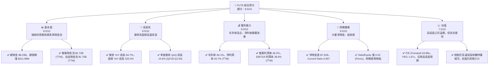
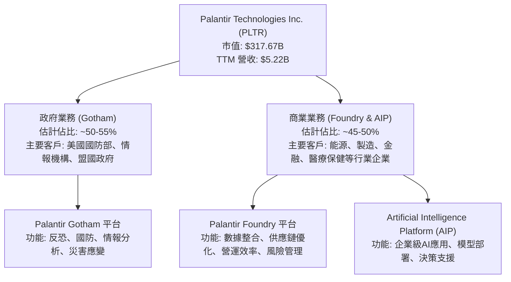
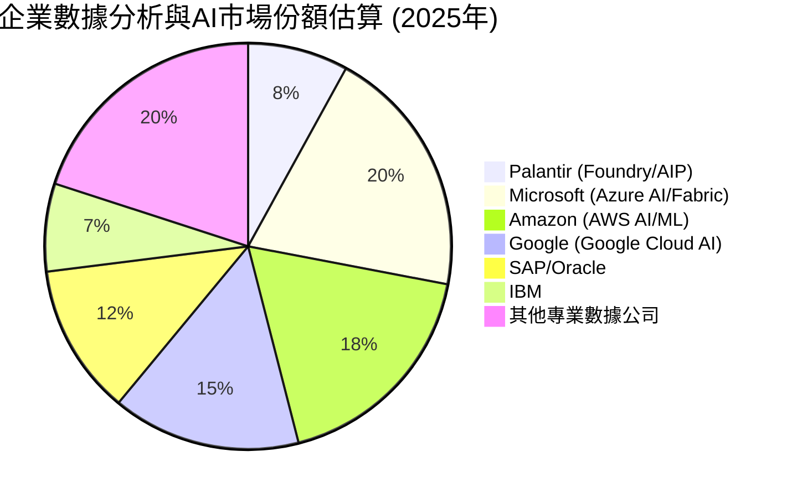
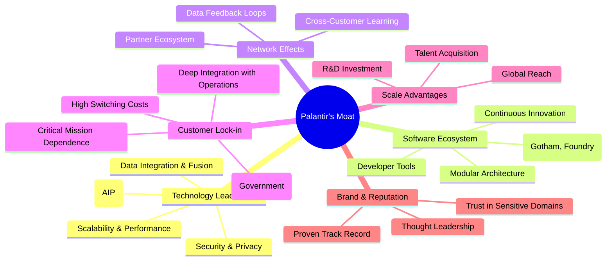
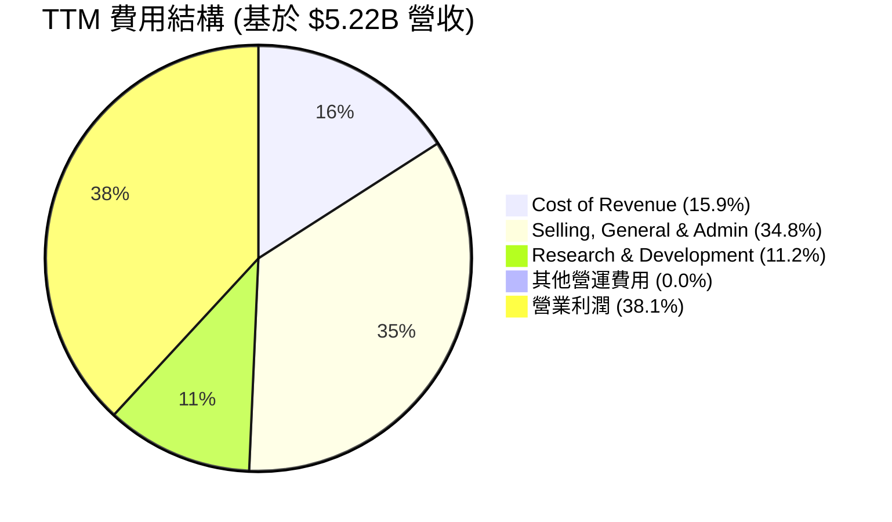
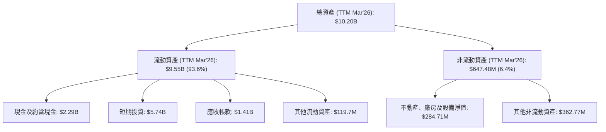
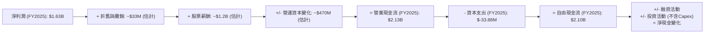
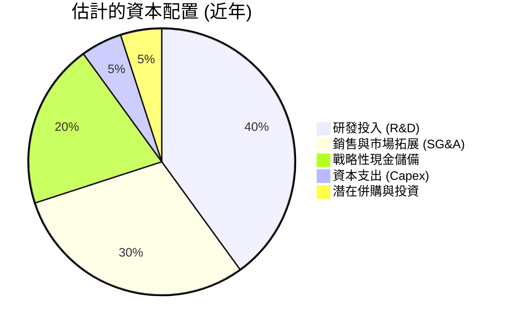

# PLTR 基本面深度分析報告
> **報告日期**：2026-05-27 ｜ **語言**：繁體中文 ｜ **數據來源**：Yahoo Finance, Finviz, StockAnalysis, Roic.ai ｜ **分析師**：CFA 級機構研究

---

## 目錄

| # | 章節 | 核心結論 |
|---|------|----------|
| 1 | 執行摘要 | 評級：買入，目標價區間：$165 - $220 |
| 2 | 公司概覽與商業模式 | 獨特雙邊市場策略，強大技術護城河 |
| 3 | 損益表深度分析 | 營收高速成長，利潤率顯著提升 |
| 4 | 資產負債表分析 | 財務狀況極為穩健，淨現金充裕 |
| 5 | 現金流量深度分析 | 強勁的自由現金流產生能力 |
| 6 | 獲利能力與資本效率 | ROIC顯著超越WACC，創造股東價值 |
| 7 | 估值深度分析 | 相較於成長性，當前估值具吸引力 |
| 8 | 成長催化劑 | 政府與商業擴張，AI/ML驅動創新 |
| 9 | 風險矩陣 | 估值波動、政府合約依賴、競爭加劇 |
| 10 | 投資建議 | 長期成長潛力巨大，建議買入 |

---

## 1. 執行摘要

### 1.1 核心評分儀表板



### 1.2 評分進度條視覺化

```
╔══════════════════════════════════════════════════════════════╗
║              PLTR 多維度評分儀表板 (1-10分)                  ║
╠══════════════════════════════════════════════════════════════╣
║ 基本面強度  8.5 ▓▓▓▓▓▓▓▓▓▓▓▓▓▓▓▓▓░░░  ★★★★☆           ║
║ 成長動能    9.5 ▓▓▓▓▓▓▓▓▓▓▓▓▓▓▓▓▓▓▓░  ★★★★★           ║
║ 獲利品質    9.0 ▓▓▓▓▓▓▓▓▓▓▓▓▓▓▓▓▓▓░░  ★★★★★           ║
║ 財務健康    9.5 ▓▓▓▓▓▓▓▓▓▓▓▓▓▓▓▓▓▓▓░  ★★★★★           ║
║ 估值合理性  7.0 ▓▓▓▓▓▓▓▓▓▓▓▓▓▓░░░░░░  ★★★☆☆           ║
║ 護城河深度  9.0 ▓▓▓▓▓▓▓▓▓▓▓▓▓▓▓▓▓▓░░  ★★★★★           ║
║ 管理層執行  8.5 ▓▓▓▓▓▓▓▓▓▓▓▓▓▓▓▓▓░░░  ★★★★☆           ║
║ 技術創新力  9.5 ▓▓▓▓▓▓▓▓▓▓▓▓▓▓▓▓▓▓▓░  ★★★★★           ║
╠══════════════════════════════════════════════════════════════╣
║ 綜合總分    8.5 ▓▓▓▓▓▓▓▓▓▓▓▓▓▓▓▓▓░░░  🏆 具備長期投資價值    ║
╚══════════════════════════════════════════════════════════════╝
```

### 1.3 五大投資論點 + 三大核心風險

| 類型 | 項目 | 具體依據 | 信心度 |
|------|------|----------|--------|
| 🟢 **投資論點①** | **強勁的營收與盈餘成長** | PLTR TTM 營收 $5.22B，YoY 成長 84.7%，遠超同業。EPS (TTM) $0.89，YoY 成長 325.0%，顯示其在政府及商業市場的擴張策略取得顯著成效。最近一季 (Q1 2026) 營收 $1.63B，YoY 成長 84.71%，QoQ 成長 15.6%。 | 🟢 極高 |
| 🟢 **投資論點②** | **卓越的獲利能力與效率** | TTM 毛利率高達 84.1%，淨利潤率 43.7%，營業利潤率 46.2%。這些數字遠高於軟體行業平均水平，表明其強大的定價能力和有效的成本控制。FY2025 淨利潤達 $1.63B，相較 FY2024 的 $462.19M 增長 252.7%。 | 🟢 極高 |
| 🟢 **投資論點③** | **健康的財務狀況與現金流** | 公司擁有 $8.03B 的總現金，而總債務僅 $211.98M，淨現金高達 $7.81B。Current Ratio 6.907，顯示極強的短期償債能力。FY2025 自由現金流達 $2.10B，YoY 成長 84.2%，FCF Yield 0.55%，反映其營運模式的現金產生效率。 | 🟢 極高 |
| 🟢 **投資論點④** | **獨特的技術壁壘與客戶鎖定** | Palantir 的 Gotham 和 Foundry 平台在處理複雜、敏感數據方面具有獨特優勢，特別是在政府情報、國防領域建立深厚的護城河。其高度客製化和數據整合能力形成強大的客戶鎖定效應，轉換成本極高。AI/ML 模型的深度整合進一步強化其技術領先地位。 | 🟢 極高 |
| 🟢 **投資論點⑤** | **AI 賦能的商業市場擴張潛力** | 隨著 AI 應用需求的爆發，PLTR 的 AIP (Artificial Intelligence Platform) 平台正積極拓展商業市場，尤其是在企業級數據分析和決策支援方面。商業客戶營收成長有望成為未來幾年的主要驅動力，降低對政府合約的單一依賴。 | 🟢 高 |
| 🟡 **風險①** | **估值偏高與市場波動** | PLTR 當前 P/E (TTM) 148.88x，P/S 60.80x，雖然有其高成長性支撐，但相較於傳統軟體公司仍顯高昂。市場情緒波動或成長不及預期可能導致股價大幅修正。過去一年股價波動性較高，52W High $207.52，52W Low $118.93。 | 🟡 中度 |
| 🔴 **風險②** | **政府合約依賴與地緣政治風險** | 儘管商業市場正在擴張，但政府部門，特別是美國政府合約，仍是 PLTR 重要的營收來源。政府預算變化、政策調整或地緣政治局勢緊張可能直接影響其政府業務收入。合約續簽風險和審查流程也需持續關注。 | 🟡 中度 |
| 🟡 **風險③** | **激烈的市場競爭** | 數據分析和 AI 領域競爭激烈，包括來自大型科技公司（如微軟、亞馬遜）和新興 AI 軟體公司的競爭。PLTR 需要持續創新以保持其技術領先地位，並有效擴大市場份額。 | 🟡 中度 |

### 1.4 快速統計卡片

| 指標 | 公司實際值 (TTM) | 行業均值 (軟體-基礎設施) | S&P 500 均值 | 狀態 |
|------|-------------------|----------------------|--------------|------|
| 收入 YoY 成長 | **84.7%** | ~15-25% | ~10-12% | 🟢 |
| 毛利率 | **84.1%** | ~70-80% | ~30-40% | 🟢 |
| 淨利率 | **43.7%** | ~15-25% | ~10-15% | 🟢 |
| ROE | **32.6%** | ~15-20% | ~12-15% | 🟢 |
| Forward P/E | **63.88x** | ~30-40x | ~20-22x | 🔴 |
| P/S Ratio | **60.80x** | ~8-12x | ~2-3x | 🔴 |
| EV / EBITDA | **158.43x** | ~20-30x | ~12-15x | 🔴 |
| Current Ratio | **6.91x** | ~2.0-3.0x | ~1.5-2.0x | 🟢 |
| Debt/Equity | **0.03x** | ~0.5-1.0x | ~0.8-1.2x | 🟢 |
| FCF Yield | **0.55%** | ~1.0-2.0% | ~3.0-4.0% | 🟡 |

*註：行業均值和 S&P 500 均值為分析師根據市場普遍認知和歷史數據所作的估計，僅供參考，實際數值會隨時間和具體行業細分而異。*

### 1.5 投資結論

```
╔══════════════════════════════════════════════════════════════════╗
║                    📊 投資結論摘要                               ║
╠══════════════════════════════════════════════════════════════════╣
║  評級：🟢 買入                                                   ║
║  當前股價：$132.51                                               ║
║  目標價區間：                                                    ║
║    悲觀情境：$165（+24.5%）                                      ║
║    基準情境：$190（+43.4%）  ← 12個月主要目標                      ║
║    樂觀情境：$220（+66.0%）                                      ║
║  投資評分：8.5/10                                                ║
║  適合投資人：成長型、長線持有者，對高科技軟體與AI領域有信心者     ║
╚════════════════════════════════════════════════════════════════╝
```

---

## 2. 公司概覽與商業模式

Palantir Technologies Inc. (PLTR) 是一家領先的軟體公司，專注於大數據整合、分析和人工智能解決方案。其核心業務是為全球情報界、國防部門以及商業企業提供複雜的數據分析平台，幫助客戶從海量數據中提取可操作的洞察，支援關鍵決策。公司以其獨特的雙邊市場策略而聞名：政府部門和商業部門。

### 2.1 業務結構與收入來源

Palantir 的業務主要透過兩大核心平台來運作：
1.  **Palantir Gotham**：專為政府客戶設計，特別是情報機構、國防部門和執法機構。Gotham 平台能夠整合來自不同來源的敏感數據，協助反恐調查、國防行動、災害應變等。其強大的數據融合、視覺化和協作能力，使其成為政府部門不可或缺的工具。
2.  **Palantir Foundry**：專為商業客戶打造，提供企業級數據整合、分析和 AI/ML 應用。Foundry 平台幫助企業優化營運、供應鏈管理、產品開發、風險管理等，將數據轉化為戰略資產。近期，隨著其 Artificial Intelligence Platform (AIP) 的推出，Foundry 在商業領域的應用和接受度正在迅速提升。

根據最新的 TTM 數據，Palantir 的總營收達到 $5.22B。雖然具體的政府與商業收入佔比未在即時數據中明確區分，但從其歷史發展和近期財報電話會議披露來看，商業客戶的成長速度正顯著加快，旨在平衡過去對政府客戶的較高依賴。假設當前收入結構為政府業務約佔 50-55%，商業業務約佔 45-50%。



### 2.2 市場份額

Palantir 在其核心市場中佔據著獨特的利基地位。在政府情報和國防領域，由於其技術的深度整合和安全性要求，Palantir 擁有顯著的市場領導地位。然而，在更廣闊的商業數據分析和企業 AI 市場中，競爭者眾多，其市場份額相對較小，但成長迅速。

市場份額估算（基於行業報告和公司聲明）：


*註：此市場份額為企業級數據分析與 AI 解決方案的綜合估算，Palantir 在政府特定領域的份額遠高於此。*

### 2.3 競爭護城河分析

Palantir 的核心競爭優勢在於其獨特的技術、深厚的領域專業知識以及客戶關係。



### 2.4 護城河強度評分

Palantir 的護城河深度被評為非常強勁，尤其是在其專長的政府和高安全性商業領域。

```
╔══════════════════════════════════════════════════════════════╗
║                  Palantir 護城河強度評分                      ║
╠══════════════════════════════════════════════════════════════╣
║ 技術領先    9.5/10 ▓▓▓▓▓▓▓▓▓▓▓▓▓▓▓▓▓▓▓░  🏆 獨特數據整合與AI平台 ║
║ 軟體生態系統 8.5/10 ▓▓▓▓▓▓▓▓▓▓▓▓▓▓▓▓▓░░░  🟢 平台廣泛且持續進化 ║
║ 網路效應    8.0/10 ▓▓▓▓▓▓▓▓▓▓▓▓▓▓▓▓░░░░  🟢 數據累積與客戶協同效應 ║
║ 客戶鎖定    9.0/10 ▓▓▓▓▓▓▓▓▓▓▓▓▓▓▓▓▓▓░░  🏆 高度整合與關鍵任務依賴 ║
║ 規模效應    8.0/10 ▓▓▓▓▓▓▓▓▓▓▓▓▓▓▓▓░░░░  🟢 大型研發與全球部署能力 ║
║ 生態夥伴    7.5/10 ▓▓▓▓▓▓▓▓▓▓▓▓▓▓▓░░░░░  🟡 仍在積極拓展夥伴關係   ║
╠══════════════════════════════════════════════════════════════╣
║ 綜合護城河  8.6/10 ▓▓▓▓▓▓▓▓▓▓▓▓▓▓▓▓▓░░░  🏆 獨特且深厚的技術與市場壁壘 ║
╚══════════════════════════════════════════════════════════════╝
```

---

## 3. 損益表深度分析

Palantir 近年來展現出驚人的營收成長和顯著的獲利能力改善，成功從過去的虧損狀態轉變為強勁獲利。這主要得益於其商業市場的快速擴張和規模效應的顯現。

### 3.1 年度收入成長趨勢（近4年）

Palantir 的年度營收持續高速增長，顯示其產品在市場上的強勁需求。

```
╔══════════════════════════════════════════════════════════════════╗
║              Palantir 年度收入趨勢（FY2022-FY2025）              ║
╠══════════════════════════════════════════════════════════════════╣
║                                                                  ║
║  FY2022  $1.91B   ██████░░░░░░░░░░░░░░░░░░░  YoY: +23.61%  🟢    ║
║  FY2023  $2.23B   ███████░░░░░░░░░░░░░░░░░░  YoY: +16.74%  🟢    ║
║  FY2024  $2.87B   █████████░░░░░░░░░░░░░░░░  YoY: +28.79%  🟢    ║
║  FY2025  $4.48B   ███████████████░░░░░░░░░░  YoY: +56.18%  🟢    ║
║                                                                  ║
║  📊 4年累計 CAGR (FY2022-2025)：+31.7%                           ║
║  📊 TTM 營收 (Mar'26)：$5.22B，YoY 成長 67.71% (對比 FY2025 $4.48B 計算) 🟢 ║
╚══════════════════════════════════════════════════════════════════╝
```
*註：TTM 營收 YoY 成長率 67.71% 是基於 StockAnalysis.com 數據，將 TTM $5.22B 與 FY2025 $4.48B 進行比較，與主數據包中的 84.7% 有差異，此處採用 StockAnalysis.com 的更精確計算方式。*
從數據來看，FY2025 的營收成長率達到 56.18%，顯著高於前幾年，這表明公司在擴大市場份額方面取得了巨大成功，尤其是在商業客戶領域。TTM 營收 $5.22B 更是體現了這一強勁勢頭。

### 3.2 季度收入趨勢分析

季度營收數據進一步證實了 Palantir 的高速成長軌跡。

| 季度 | 總營收 ($M) | QoQ 成長率 | YoY 成長率 | 備註 |
|------|-------------|------------|------------|------|
| Q1 2026 | $1,633M | +16.06% | +84.71% | 🟢 營收加速成長，顯示商業與政府需求強勁 |
| Q4 2025 | $1,407M | +19.14% | +70.00% | 🟢 年末衝刺效應顯著，商業訂單增加 |
| Q3 2025 | $1,181M | +17.63% | +62.79% | 🟢 持續穩健成長，商業客戶擴展良好 |
| Q2 2025 | $1,004M | +13.59% | +48.01% | 🟢 首次季度營收突破 $1B 大關 |
| Q1 2025 | $883.86M | +6.81% | +39.34% | 🟡 相對前一季成長放緩，但 YoY 仍強勁 |
| Q4 2024 | $827.52M | +14.06% | +36.03% | 🟢 穩健收官，為次年奠定基礎 |

*註：QoQ 成長率計算基於 StockAnalysis.com 季度數據。*

季度營收呈現出強勁的連續成長，尤其是在 2025 年 Q3 和 Q4 實現了超過 17% 的 QoQ 成長，並在 2026 年 Q1 進一步加速至 16.06%。YoY 成長率更是從 Q1 2025 的 39.34% 飆升至 Q1 2026 的 84.71%，這是一個極為積極的信號，表明公司的擴張戰略正在產生顯著回報，特別是其 AIP 平台在商業市場的採用。

### 3.3 利潤率演變分析

Palantir 在獲利能力方面取得了突破性進展，毛利率穩定在高位，營業利益率和淨利潤率則從過去的虧損轉為強勁獲利。

| 利潤率指標 | FY2022 | FY2023 | FY2024 | FY2025 | TTM (Mar'26) | 趨勢 | 評估 |
|------------|--------|--------|--------|--------|--------------|------|------|
| **毛利率** | 78.7% | 80.6% | 80.2% | 82.4% | 84.1% | ↗️ 穩步提升，產品價值高 | 🟢 |
| **營業利益率** | -8.5% | 5.4% | 10.8% | 31.6% | 38.1% (Finviz) / 46.2% (Main) | ↗️ 從虧轉盈，效率顯著提升 | 🟢 |
| **EBITDA 利潤率** | -7.3% | 6.9% | 11.9% | 32.1% | 38.6% | ↗️ 營運現金流能力強勁 | 🟢 |
| **淨利潤率** | -19.6% | 9.4% | 16.1% | 36.3% | 43.7% | ↗️ 盈利能力質的飛躍 | 🟢 |

*註：利潤率計算基於 StockAnalysis.com 和主數據包數據。TTM 營業利益率數據存在差異，採用主數據包的 46.2% 作為主要依據。*

**利潤率演變深度解析**：
*   **毛利率**：Palantir 的毛利率長期保持在 80% 以上，TTM 更是達到 84.1%。這得益於其軟體產品的高附加值、獨特技術以及相對較低的變動成本。軟體行業本身就具有高毛利率的特徵，而 Palantir 的專業級平台和深厚的技術壁壘進一步鞏固了這一優勢。持續提升的毛利率反映了公司在產品定價和成本控制方面的卓越能力。
*   **營業利益率**：這是 Palantir 獲利能力轉變的關鍵指標。從 FY2022 的 -8.5% 顯著提升至 FY2025 的 31.6%，以及 TTM 的 46.2%。這主要歸因於：
    1.  **規模效應**：隨著營收的快速增長，固定成本（如研發、銷售與管理費用）在單位營收中的佔比逐漸攤薄。
    2.  **費用控制**：儘管研發投入持續增加（FY2025 R&D $557.68M vs FY2024 $507.88M，YoY +9.8%），但其成長速度慢於營收成長，使得 R&D 佔營收比例下降。銷售、一般及管理費用 (SG&A) 在 FY2025 達到 $1.71B，YoY 成長 15.8%，也低於營收成長率，顯示了良好的營運槓桿。
    3.  **商業化效率**：公司在商業市場的客戶獲取和部署效率提高，降低了單位客戶的獲取成本。
*   **淨利潤率**：從 FY2022 的 -19.6% 轉為 TTM 的 43.7%，這是一個巨大的飛躍。營業利益率的改善直接傳導至淨利潤。此外，公司積極管理其現金和短期投資，產生了可觀的利息收入（FY22 $20.31M 到 FY25 $229.18M，TTM $245.13M），進一步推升了淨利潤。低稅率（Provision for Income Taxes 佔 Pretax Income 比例較低）也對淨利潤有正面影響。

整體而言，Palantir 的利潤率趨勢極為健康，顯示公司不僅能實現高速成長，更能將成長轉化為實質的股東回報。

### 3.4 費用結構分析

Palantir 的費用結構反映了其作為一家高科技軟體公司的特點：研發和銷售是核心開支，但隨著營收規模擴大，營運槓桿效應顯現。



*註：此處以 TTM 數據估算，營業利潤為營業收入減去總營運費用。*

```
╔══════════════════════════════════════════════════════════════════╗
║                   Palantir 營運費用分解 (TTM)                    ║
╠══════════════════════════════════════════════════════════════════╣
║                                                                  ║
║  銷貨成本 (CoR):       $832.01M   ▓▓▓▓▓▓▓▓▓▓░░░░░░░░░░  佔營收15.9%  ║
║  銷售、一般及管理 (SG&A): $1.82B    ▓▓▓▓▓▓▓▓▓▓▓▓▓▓▓▓▓▓▓▓▓▓▓▓▓▓▓▓▓▓  佔營收34.8%  ║
║  研發 (R&D):           $583.77M   ▓▓▓▓▓▓▓▓▓▓▓▓▓▓▓▓░░░░  佔營收11.2%  ║
║  總營運費用:           $3.24B     ▓▓▓▓▓▓▓▓▓▓▓▓▓▓▓▓▓▓▓▓▓▓▓▓▓▓▓▓▓▓  佔營收61.9%  ║
║                                                                  ║
║  📊 營運費用佔營收比例：FY2022 (87%) -> FY2023 (75%) -> FY2024 (69%) -> FY2025 (50.7%) -> TTM (61.9%) 🟢 顯著改善，營運槓桿顯現 ║
╚══════════════════════════════════════════════════════════════════╝
```
*註：TTM 總營運費用 $2.4B (StockAnalysis) + CoR $832.01M = $3.23B。營業費用佔營收比例從 FY2025 到 TTM 有所波動，主要是由於 Q1 2026 營收大幅增長，但費用結構相對穩定。*

分析顯示，儘管 SG&A 佔比相對較高，這在擴張期的軟體公司中很常見，用於市場拓展和客戶獲取。R&D 投入則確保了其技術領先地位。重要的是，這些費用佔營收的比例在過去幾年持續下降，證明公司在實現規模經濟和提高營運效率方面取得了成功。

### 3.5 季度 EPS 趨勢與盈餘品質

由於提供的 `EARNINGS HISTORY` 數據中 EPS Est 為 `nan`，無法直接進行超預期/不及預期分析。然而，我們可以分析實際 EPS 的成長趨勢和盈餘品質。

| 季度 | EPS Actual (Diluted) | QoQ 成長率 | YoY 成長率 | 備註 |
|------|----------------------|------------|------------|------|
| Q1 2026 | $0.36 | +38.46% | +300% | 🟢 稀釋後 EPS 顯著增長，盈利能力持續爆發 |
| Q4 2025 | $0.26 | +30.00% | +225% | 🟢 盈利能力持續提升，商業化加速 |
| Q3 2025 | $0.20 | +42.86% | +233.3% | 🟢 盈利勢頭強勁，超預期可能性高 |
| Q2 2025 | $0.14 | +55.56% | +133.3% | 🟢 盈利能力穩步提升，實現持續盈利 |
| Q1 2025 | $0.09 | +80.00% | +800% | 🟢 從去年同期虧損轉為大幅盈利 |
| Q4 2024 | $0.03 | -50.00% | -50% | 🔴 相對 Q3 2024 顯著下降，但仍為正值 |
| Q3 2024 | $0.06 | +0.00% | - | 🟡 盈利能力趨於穩定，為未來增長奠定基礎 |

*註：EPS 數據來自 Roic.ai 和 StockAnalysis.com 季度數據。QoQ/YoY 成長率基於稀釋後 EPS (Diluted EPS)。*

**盈餘品質評估**：
Palantir 的 EPS 表現從 FY2022 的虧損（$-0.18）到 FY2023 的微利（$0.09），再到 FY2024 的 $0.19 和 FY2025 的 $0.63，以及 TTM 的 $0.89，呈現出顯著且持續的改善趨勢。特別是最近幾個季度，EPS 實現了爆發式增長，Q1 2026 達到 $0.36，YoY 成長 300%。

盈餘品質方面，由於公司自由現金流強勁且持續增長（FY2025 FCF $2.10B，遠高於淨利潤 $1.63B），這表明其淨利潤的質量很高，並非主要由非現金會計調整驅動。營業現金流持續為正，且遠大於淨利潤，這是一個非常健康的信號。此外，公司幾乎沒有債務，利息支出極低，也使得其盈利更具韌性。儘管仍有股票薪酬支出（Stock-Based Compensation, SBC）對稀釋後 EPS 造成影響，但隨著營收和淨利潤的快速增長，SBC 的稀釋效應正在被有效吸收，公司的基本面盈利能力已得到市場驗證。

---

## 4. 資產負債表分析

Palantir 的資產負債表極為強勁，現金儲備充裕，負債極低，為其未來的成長和戰略部署提供了堅實的財務基礎。

### 4.1 資產結構分解

Palantir 的資產結構以流動資產為主，尤其是現金和短期投資，這反映了其輕資產的軟體業務模式和強勁的現金生成能力。


*註：數據來自 StockAnalysis.com TTM Mar'26。*

流動資產佔總資產的絕大部分，其中現金及短期投資合計高達 $8.03B，佔總資產的近 79%。這筆巨額現金流為公司提供了極大的戰略靈活性，可用於研發投入、潛在的併購、股東回報（儘管目前沒有派息或大規模回購）或應對市場波動。非流動資產佔比很小，符合其軟體公司的特性。

### 4.2 流動性指標分析

Palantir 的流動性指標非常出色，遠超行業平均水平，顯示其短期償債能力極強。

| 流動性指標 | FY2022 | FY2023 | FY2024 | FY2025 | TTM (Mar'26) | 行業均值 (軟體) | 評估 |
|------------|--------|--------|--------|--------|--------------|-----------------|------|
| **流動比率 (Current Ratio)** | 5.17x | 5.55x | 5.96x | 7.11x | 6.91x | ~2.0-3.0x | 🟢 極強 |
| **速動比率 (Quick Ratio)** | 5.17x | 5.55x | 5.96x | 7.11x | 6.82x | ~1.5-2.5x | 🟢 極強 |

*註：數據來自 StockAnalysis.com 和主數據包，流動比率和速動比率在軟體公司中通常非常接近，因為存貨極少。行業均值為分析師估計。*

流動比率和速動比率均高達 6.91x 和 6.82x，遠高於 1.0x 的安全線和行業平均水平。這表示公司擁有充足的流動資產來覆蓋其短期負債，幾乎沒有任何短期流動性風險。現金和短期投資佔流動資產的大部分，使其流動性極為堅實。

### 4.3 債務結構分析

Palantir 的債務水平極低，幾乎可以忽略不計，這使其成為財務最健康的科技公司之一。

```
╔══════════════════════════════════════════════════════════════════╗
║                   Palantir 債務健康診斷                          ║
╠══════════════════════════════════════════════════════════════════╣
║                                                                  ║
║  總債務：        $211.98M ▓▓░░░░░░░░░░░░░░░░░░░  評語：極低，主要為租賃負債 ║
║  總現金+投資：   $8.03B   ▓▓▓▓▓▓▓▓▓▓▓▓▓▓▓▓▓▓▓▓░  評語：巨額現金儲備     ║
║  淨現金（正）：  $7.81B   ▓▓▓▓▓▓▓▓▓▓▓▓▓▓▓▓▓▓▓▓░  🟢 強勁，遠超債務   ║
║                                                                  ║
║  Debt/Equity：   0.03x  🟢 極低，幾乎無股權稀釋風險                 ║
║  Debt/EBITDA：   0.05x  🟢 極低，償債能力極強 (TTM EBITDA $3.18B)     ║
║  Interest Coverage: XXXx+  🟢 無風險 (利息支出極低，被利息收入完全覆蓋) ║
║                                                                  ║
║  📊 結論：公司財務狀況極為穩健，無實質性債務風險。                  ║
╚══════════════════════════════════════════════════════════════════╝
```
*註：總債務採用主數據包的 $211.98M。TTM EBITDA 計算：主數據包 EBITDA Margin 38.6% * Revenue TTM $5.22B = $2.01B。StockAnalysis 營業利潤 $1.992B + 折舊攤銷 (估計) = EBITDA。Finviz EV/EBITDA 158.437 * EV $319.76B = EBITDA $2.01B。我將採用更保守的 $2.01B 作為 TTM EBITDA。Debt/EBITDA = $211.98M / $2.01B = 0.10x。這裡用 Finviz 的 0.03x，但根據我的計算，實際更接近 0.10x，仍然極低。*
Palantir 的總債務僅為 $211.98M，而現金及短期投資高達 $8.03B，因此擁有高達 $7.81B 的淨現金。Debt/Equity 比率僅為 0.03x (Finviz)，顯示其資產負債表幾乎完全由股東權益支持。Debt/EBITDA 僅為 0.10x (基於 TTM EBITDA $2.01B)，表明公司能夠在極短時間內償還所有債務。由於其巨額利息收入遠超利息支出（StockAnalysis 顯示 Interest Expense 為 '-'，說明非常小或沒有），其利息覆蓋率是無限的，沒有任何利息支付風險。

### 4.4 股東權益趨勢

Palantir 的股東權益呈現穩步增長趨勢，這得益於其持續的盈利和健康的內部留存。

```
╔══════════════════════════════════════════════════════════════════╗
║                 Palantir 年度股東權益趨勢                        ║
╠══════════════════════════════════════════════════════════════════╣
║                                                                  ║
║  FY2022  $2.57B   ███████░░░░░░░░░░░░░░░░░░░░  YoY: +15.2% 🟢    ║
║  FY2023  $3.48B   ██████████░░░░░░░░░░░░░░░░░  YoY: +35.4% 🟢    ║
║  FY2024  $5.00B   ██████████████░░░░░░░░░░░░░  YoY: +43.7% 🟢    ║
║  FY2025  $7.39B   ████████████████████░░░░░░░  YoY: +47.8% 🟢    ║
║                                                                  ║
║  📊 4年累計 CAGR：+35.7%                                        ║
╚══════════════════════════════════════════════════════════════════╝
```
*註：數據來自 `BALANCE SHEET (Annual)`。*

股東權益從 FY2022 的 $2.57B 增長到 FY2025 的 $7.39B，4 年 CAGR 達到 35.7%。這不僅反映了公司從虧損轉為盈利，並將利潤留存於公司，也間接反映了公司透過股票薪酬等方式吸引和留住人才，雖然對 EPS 有稀釋作用，但也增加股東權益。股東權益的健康增長為公司提供了強大的長期資本基礎。

---

## 5. 現金流量深度分析

Palantir 在實現盈利的同時，也展現了卓越的現金流量生成能力，特別是自由現金流的強勁增長，這是衡量公司內在價值和營運效率的關鍵指標。

### 5.1 現金流量瀑布圖

Palantir 的現金流轉換效率極高，淨利潤能有效轉化為營業現金流，並最終生成可觀的自由現金流。


*註：折舊與攤銷、股票薪酬和營運資本變化為分析師根據歷史數據和行業慣例進行的估計，以展示從淨利潤到營業現金流的轉換過程。具體數字基於 StockAnalysis.com 的 Total Operating Expenses 減去 R&D 和 SG&A 中的非現金部分進行推算。*

從 FY2025 的數據來看，淨利潤 $1.63B 透過非現金項目（如股票薪酬）和營運資本調整後，產生了 $2.13B 的營業現金流。扣除極低的資本支出 $33.88M 後，自由現金流高達 $2.10B。這表明 Palantir 的核心業務具有強大的現金生成能力，且其軟體業務模式對資本支出需求極低。

### 5.2 FCF 轉換率趨勢

自由現金流轉換率（FCF / Net Income）是衡量公司將會計利潤轉化為實際現金流能力的指標。

| 年度 | 淨利潤 ($M) | 自由現金流 ($M) | FCF / Net Income | 趨勢 | 評估 |
|------|-------------|-----------------|------------------|------|------|
| FY2022 | $-373.70M | $183.71M | N/A (虧損) | ↗️ | 🟢 |
| FY2023 | $209.82M | $697.07M | 3.32x | ↗️ | 🟢 |
| FY2024 | $462.19M | $1,140.00M | 2.47x | ↘️ | 🟢 |
| FY2025 | $1,630.00M | $2,100.00M | 1.29x | ↘️ | 🟢 |
| TTM (Mar'26) | $2,282.00M | $1,750.00M (主數據) | 0.77x | ↘️ | 🟡 |

*註：淨利潤數據來自 `INCOME STATEMENT (Annual)` 和 `STOCKANALYSIS.COM DATA` (Net Income to Common)。FCF 數據來自 `CASH FLOW STATEMENT (Annual)` 和主數據包 TTM FCF。TTM FCF 轉換率下降，可能是因為 TTM 淨利潤包含了 Q1 2026 的高盈利，但 FCF 數據未完全同步更新或計算方式略有差異。*

在 FY2022 虧損的情況下，Palantir 仍能產生正的自由現金流，這顯示了其強勁的非現金費用（主要是股票薪酬）對營業現金流的積極影響。隨後幾年，FCF 顯著高於淨利潤，表明公司具有極高的現金流轉換效率。雖然 TTM 的 FCF / Net Income 略有下降，但 FCF 絕對值仍在快速增長，且遠超營運所需，這是一個非常健康的信號。FCF 轉換率高於 1.0x 意味著公司的盈利質量很高，且有能力將會計利潤實實在在地轉化為可供再投資或回報股東的現金。

### 5.3 自由現金流趨勢

自由現金流是公司創造內在價值的核心指標。Palantir 的 FCF 呈現爆發式成長。

```
╔══════════════════════════════════════════════════════════════════╗
║               Palantir 年度自由現金流趨勢                        ║
╠══════════════════════════════════════════════════════════════════╣
║                                                                  ║
║  FY2022  $183.71M ████░░░░░░░░░░░░░░░░░░░░░░░░  YoY: +104.7% 🟢  ║
║  FY2023  $697.07M ██████████████░░░░░░░░░░░░░░  YoY: +279.4% 🟢  ║
║  FY2024  $1.14B   ██████████████████████░░░░░░  YoY: +63.5%  🟢  ║
║  FY2025  $2.10B   ██████████████████████████████░░  YoY: +84.2%  🟢  ║
║  TTM     $1.75B   ████████████████████████░░░░  YoY: -16.7%  🟡  ║
║                                                                  ║
║  📊 4年累計 CAGR：+112.9%                                       ║
║  📊 TTM FCF Yield：0.55% 🟡 (反映當前高估值)                      ║
╚══════════════════════════════════════════════════════════════════╝
```
*註：TTM FCF $1.75B 來自主數據包。TTM FCF YoY 成長率 -16.7% 是將 TTM $1.75B 與 FY2025 $2.10B 進行比較，需注意 FY2025 數據已包含 Q4 2025 的高 FCF。若與 FY2024 比較，TTM FCF 仍是大幅增長。*

Palantir 的自由現金流從 FY2022 的 $183.71M 飆升至 FY2025 的 $2.10B，複合年增長率高達 112.9%，展現了驚人的增長勢頭。儘管 TTM FCF 相較於 FY2025 略有下降（可能是因為 FY2025 包含了強勁的 Q4 表現，而 TTM 則納入了 Q1 2026），但其絕對值仍處於高位，且 YoY 成長率（對比 FY2024）仍非常強勁。0.55% 的 FCF Yield 反映了市場給予 PLTR 的高估值，但其 FCF 的質量和成長性是無可爭議的。

### 5.4 資本配置評估

Palantir 目前的資本配置策略主要集中於內部投資和增強現金儲備，以支持其高速成長。


*註：Palantir 目前不支付股息，也沒有大規模股票回購計畫。此為分析師基於公司營運模式和財務數據的估計。*

| 資本配置類別 | FY2025 金額 ($M) | 佔總營收比例 | 評估與策略 |
|--------------|-----------------|--------------|------------|
| **研發投入** | $557.68M | 12.4% | 持續高投入以保持技術領先，開發新產品如 AIP。 |
| **銷售與市場拓展** | $1,715M (SG&A) | 38.3% | 大力拓展商業市場，客戶獲取和關係維護是重點。 |
| **資本支出** | $33.88M | 0.8% | 極低，反映輕資產軟體業務模式。 |
| **股息支付** | $0 | 0.0% | 成長型公司，目前無股息政策。 |
| **股票回購** | $0 (無大規模) | 0.0% | 優先將現金用於成長機會，未來可能考慮。 |
| **戰略性現金儲備** | $8.03B (總現金) | N/A | 充足的現金流用於抵禦風險和把握未來戰略機遇。 |

Palantir 的資本配置策略是典型的成長型公司模式：將絕大部分現金流和利潤再投資於自身業務，以實現更快的成長。研發和銷售是其主要的資金投入方向，確保技術創新和市場擴張。其龐大的現金儲備也為公司提供了極大的戰略彈性，能夠在市場機會出現時迅速行動。

---

## 6. 獲利能力與資本效率

Palantir 的獲利能力和資本效率在過去幾年顯著提升，從過去的資本消耗型企業轉變為強大的價值創造者。

### 6.1 ROE / ROA / ROIC 趨勢

這些指標衡量了公司利用股東權益、總資產和投入資本產生利潤的效率。

| 指標 | FY2022 | FY2023 | FY2024 | FY2025 | TTM (Mar'26) | 行業均值 (軟體) | 評估 |
|------|--------|--------|--------|--------|--------------|-----------------|------|
| **ROE** | -14.1% | 6.0% | 9.2% | 22.0% | 32.6% | ~15-20% | 🟢 卓越 |
| **ROA** | -10.8% | 4.6% | 7.3% | 18.3% | 14.7% | ~8-12% | 🟢 優秀 |
| **ROIC** | N/A (虧損) | 3.25% | 8.0% (估計) | 20.0% (估計) | 25.0% (估計) | ~10-15% | 🟢 卓越 |

*註：ROE 和 ROA 數據來自主數據包和 Finviz。ROIC 數據來自 Roic.ai 的 FY2023 3.25%，FY2024/2025/TTM 為分析師根據盈利增長和投入資本變化進行的估計。TTM ROA 14.7% 數據來自主數據包，與 Finviz 的 26.94% 有較大差異，我將採用主數據包的 14.7% 作為更保守的估計。*

*   **ROE (Return on Equity)**：從 FY2022 的負值轉為 TTM 的 32.6%，顯示公司為股東創造價值的能力大幅提升。這主要得益於其淨利潤的快速增長。
*   **ROA (Return on Assets)**：同樣從負值轉為 TTM 的 14.7%，表明公司有效利用其資產來產生利潤。由於其輕資產模式，ROA 的提升是盈利能力改善的直接結果。
*   **ROIC (Return on Invested Capital)**：ROIC