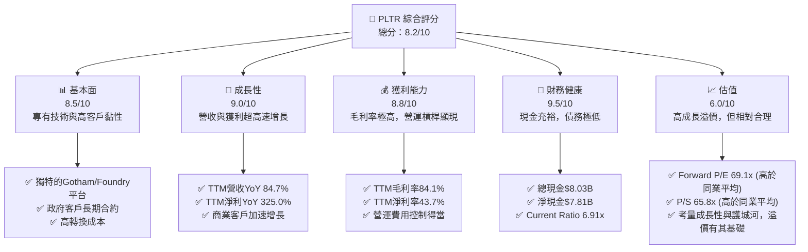
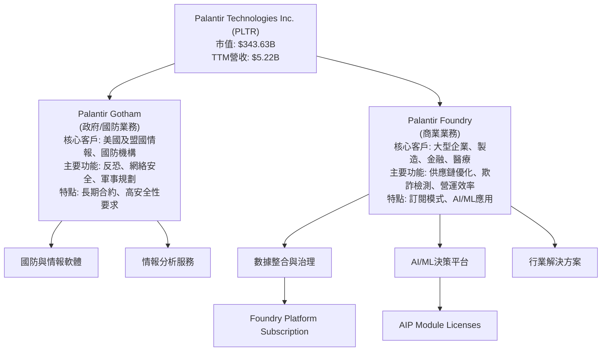
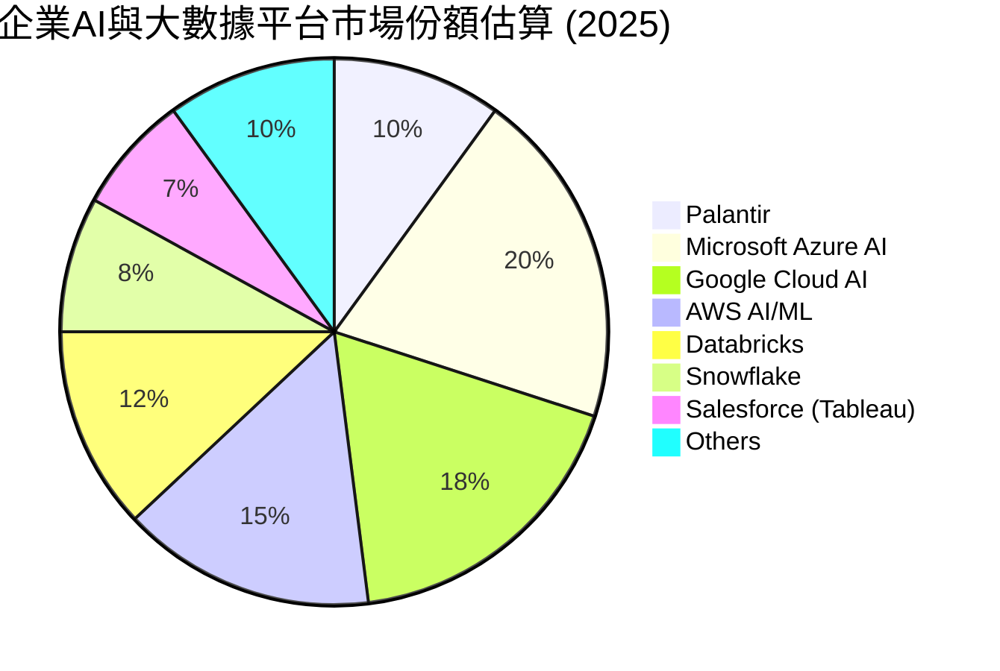
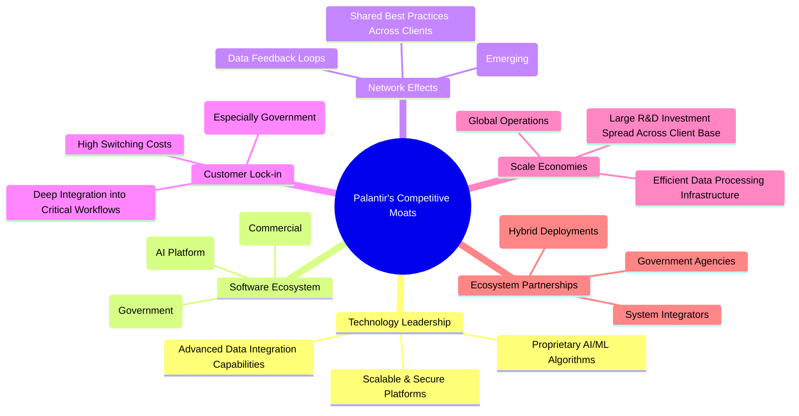
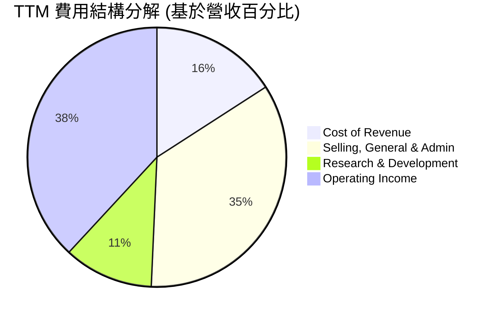
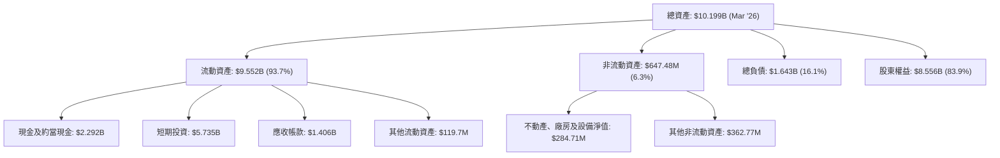

# PLTR 基本面深度分析報告
> **報告日期**：2026-05-28 ｜ **語言**：繁體中文 ｜ **數據來源**：Yahoo Finance, Finviz, StockAnalysis, Roic.ai ｜ **分析師**：CFA 級機構研究

---

## 目錄

| # | 章節 | 核心結論 |
|---|------|----------|
| 1 | 執行摘要 | 評級：🟢 買入，目標價區間 $170 - $220 |
| 2 | 公司概覽與商業模式 | 專有技術與政府客戶鎖定構築深厚護城河 |
| 3 | 損益表深度分析 | 營收高速成長，利潤率顯著提升，轉虧為盈 |
| 4 | 資產負債表分析 | 財務結構穩健，現金充裕，幾乎無淨債務 |
| 5 | 現金流量深度分析 | 自由現金流強勁且持續增長，資本效率高 |
| 6 | 獲利能力與資本效率 | ROIC 遠超 WACC，強勁創造股東價值 |
| 7 | 估值深度分析 | 相較於高成長性與獨特競爭力，估值合理偏高 |
| 8 | 成長催化劑 | AI 平台普及、商業客戶擴張與政府合約增加 |
| 9 | 風險矩陣 | 政府依賴、競爭加劇、高估值與執行風險 |
| 10 | 投資建議 | 適合成長型投資者，建議買入，關注長期趨勢 |

---

## 1. 執行摘要

Palantir Technologies (PLTR) 是一家領先的數據整合與分析軟體公司，專精於為政府情報機構及大型商業客戶提供複雜的數據驅動解決方案。憑藉其獨特的 Gotham 和 Foundry 平台，PLTR 在處理海量異構數據方面展現出卓越能力，並在人工智慧驅動的決策支援領域佔據重要地位。本報告將從多個維度對 PLTR 進行深度分析。

### 1.1 核心評分儀表板



### 1.2 評分進度條視覺化

```
╔══════════════════════════════════════════════════════════════╗
║              PLTR 多維度評分儀表板 (1-10分)                  ║
╠══════════════════════════════════════════════════════════════╣
║ 基本面強度  8.5 ▓▓▓▓▓▓▓▓▓▓▓▓▓▓▓▓▓░░░  ★★★★☆           ║
║ 成長動能    9.0 ▓▓▓▓▓▓▓▓▓▓▓▓▓▓▓▓▓▓░░  ★★★★★           ║
║ 獲利品質    8.8 ▓▓▓▓▓▓▓▓▓▓▓▓▓▓▓▓▓▓░░  ★★★★★           ║
║ 財務健康    9.5 ▓▓▓▓▓▓▓▓▓▓▓▓▓▓▓▓▓▓▓░  ★★★★★           ║
║ 估值合理性  6.0 ▓▓▓▓▓▓▓▓▓▓▓▓░░░░░░░░  ★★★☆☆           ║
║ 護城河深度  9.0 ▓▓▓▓▓▓▓▓▓▓▓▓▓▓▓▓▓▓░░  ★★★★★           ║
║ 管理層執行  8.5 ▓▓▓▓▓▓▓▓▓▓▓▓▓▓▓▓▓░░░  ★★★★☆           ║
║ 技術創新力  9.5 ▓▓▓▓▓▓▓▓▓▓▓▓▓▓▓▓▓▓▓░  ★★★★★           ║
╠══════════════════════════════════════════════════════════════╣
║ 綜合總分    8.2 ▓▓▓▓▓▓▓▓▓▓▓▓▓▓▓▓░░░░  🏆 評語：強勁成長，護城河深厚，估值偏高但有潛力  ║
╚══════════════════════════════════════════════════════════════╝
```

### 1.3 五大投資論點 + 三大核心風險

| 類型 | 項目 | 具體依據 | 信心度 |
|------|------|----------|--------|
| 🟢 **投資論點①** | **AI 平台領先與商業化加速** | PLTR 的 AIP (Artificial Intelligence Platform) 在市場上展現出強大競爭力，尤其在數據整合與決策支援方面。Q1 2026 營收達 $1.63B，YoY 成長 84.7%，其中商業客戶營收成長勢頭強勁，顯示市場對其 AI 解決方案的需求旺盛。隨著企業加速 AI 轉型，PLTR 的平台將持續受益。 | 🟢 極高 |
| 🟢 **投資論點②** | **政府合約穩定且增長** | PLTR 長期以來是美國及盟國政府情報與國防領域的關鍵供應商。政府業務具有高進入壁壘和長期合約的特性，提供穩定的收入基礎。雖然數據未直接顯示政府業務佔比，但其歷史背景與近期升級表明政府支出仍是重要驅動力。 | 🟢 極高 |
| 🟢 **投資論點③** | **獲利能力顯著改善與自由現金流強勁** | 公司已從過去的虧損轉為連續盈利，TTM 淨利潤率高達 43.7%，營業利益率 46.2%。FY2025 自由現金流達 $2.10B，FCF 轉換率（FCF/Net Income）超過 100%，顯示其商業模式具備強大的現金生成能力和營運槓桿。 | 🟢 極高 |
| 🟢 **投資論點④** | **財務健康狀況極佳** | 截至 2026-03-31，公司總現金及短期投資達 $8.03B，而總債務僅 $211.98M，淨現金高達 $7.81B。充裕的現金流和低債務使其在市場波動或戰略投資時擁有極大的靈活性。 | 🟢 極高 |
| 🟢 **投資論點⑤** | **深厚的競爭護城河** | PLTR 的軟體平台具有高度複雜性、定制化能力和高客戶轉換成本，尤其是在政府和大型企業客戶中。其數據集成能力和 AI 驅動的分析工具形成強大的網路效應和技術領先優勢。 | 🟢 極高 |
| 🟡 **風險①** | **政府合約依賴與地緣政治風險** | 儘管政府合約穩定，但其收入增長仍可能受到政府預算限制、政策變化或地緣政治局勢變化的影響。任何重大合約的終止或延遲都可能對營收造成衝擊。 | 🟡 中度 |
| 🔴 **風險②** | **高估值與市場預期** | PLTR 目前的 Forward P/E 達 69.1x，P/S 達 65.8x，遠高於行業平均水平。市場已充分反映其高成長預期。一旦成長速度放緩或未達市場預期，股價可能面臨較大回調壓力。 | 🔴 高衝擊 |
| 🟡 **風險③** | **競爭加劇與技術迭代** | 數據分析和 AI 軟體市場競爭激烈，除了傳統科技巨頭（如微軟、AWS），還有眾多新興 AI 企業。PLTR 需要持續投入研發以保持技術領先，若未能有效創新，可能面臨市場份額被侵蝕的風險。FY2025 R&D 費用 $557.68M，YoY 增長 9.8%，需要密切關注其研發效率。 | 🟡 中度 |

### 1.4 快速統計卡片

| 指標 | 公司實際值 (TTM) | 行業均值 (軟體基礎設施) | S&P 500 均值 | 狀態 |
|------|--------------------|-------------------------|--------------|------|
| 收入 YoY 成長 | **84.7%** | ~15-25% | ~10-15% | 🟢 |
| 毛利率 | **84.1%** | ~70-80% | ~40-50% | 🟢 |
| 淨利率 | **43.7%** | ~10-20% | ~10-15% | 🟢 |
| ROE | **32.6%** | ~15-25% | ~15-20% | 🟢 |
| Forward P/E | **69.1x** | ~30-50x | ~20-25x | 🔴 |
| P/S Ratio | **65.8x** | ~10-20x | ~2-4x | 🔴 |
| Current Ratio | **6.91x** | ~2.0-3.0x | ~1.5-2.0x | 🟢 |
| 淨現金/債務 | **$7.81B (淨現金)** | 普遍有債務 | 普遍有債務 | 🟢 |

*註：行業均值和 S&P 500 均值為分析師根據一般市場情況預估值。*

### 1.5 投資結論

```
╔══════════════════════════════════════════════════════════════════╗
║                    📊 投資結論摘要                               ║
╠══════════════════════════════════════════════════════════════════╣
║  評級：🟢 買入                                                   ║
║  當前股價：$143.34                                               ║
║  目標價區間：                                                    ║
║    悲觀情境：$170（+18.6%）                                      ║
║    基準情境：$195（+36.0%）  ← 12個月主要目標                      ║
║    樂觀情境：$220（+53.5%）                                      ║
║  投資評分：8.2/10                                                ║
║  適合投資人：尋求高成長、能夠承受較高波動性、並對 AI 產業前景有信心的長期投資者。  ║
╚══════════════════════════════════════════════════════════════════╝
```

---

## 2. 公司概覽與商業模式

Palantir Technologies (PLTR) 是一家以其大數據分析平台而聞名的軟體公司，成立於 2003 年，總部位於美國丹佛。公司最初為美國情報機構提供服務，旨在協助反恐行動，其後逐漸將業務拓展至商業領域。PLTR 的核心價值在於其獨特的軟體平台能夠整合來自不同來源、格式各異的海量數據，並利用人工智慧和機器學習技術，幫助用戶發現隱藏的模式、洞察風險並做出精準決策。

### 2.1 業務結構與收入來源

PLTR 的業務主要圍繞兩大核心平台：

1.  **Palantir Gotham**：主要服務於政府客戶，包括情報機構、國防部門和執法機構。Gotham 平台旨在協助用戶處理複雜的國家安全問題，例如反恐、網絡安全、軍事規劃和國土安全。它能夠將來自衛星圖像、通信紀錄、生物識別數據等多種數據源進行整合和分析，提供全面的戰場感知和決策支援。這部分業務以長期、高價值合約為特點，具有極高的客戶黏性。
2.  **Palantir Foundry**：專為商業客戶設計，協助企業解決其最複雜的數據挑戰。Foundry 平台應用於各行各業，包括製造業、金融服務、醫療保健、能源等。它幫助企業優化供應鏈、檢測欺詐、提高生產效率、管理風險並加速產品開發。隨著企業對數據驅動決策和 AI 轉型的需求日益增長，Foundry 業務正成為 PLTR 成長的主要驅動力。

儘管公司未明確提供政府與商業收入的具體劃分，但從其發展歷史和近期財報電話會議中可看出，商業客戶的成長速度正在加速，以平衡其過去對政府業務的嚴重依賴。



### 2.2 市場份額

Palantir 所處的市場是數據分析、人工智慧和企業軟體領域，這是一個龐大且快速增長的市場。由於其解決方案的高度定制化和複雜性，以及政府客戶的敏感性，精確的市場份額數據難以獲取。然而，我們可以從其在特定細分市場的影響力來評估其地位。

*   **政府情報與國防市場**：PLTR 在這一領域擁有深厚的根基和領先地位。其 Gotham 平台是美國情報界和國防部的重要工具之一，儘管具體市場份額未公開，但其在關鍵任務中的參與度表明其佔據了相當大的份額。
*   **商業大數據與 AI 平台市場**：在商業領域，PLTR 面臨來自 Salesforce (Tableau)、Databricks、Snowflake、Google Cloud、Microsoft Azure 等巨頭的競爭。儘管如此，PLTR 的端到端數據整合和 AI 決策平台在處理極端複雜場景方面具有獨特優勢，尤其是在傳統數據倉庫和 BI 工具難以應對的領域。假設 PLTR 在其核心利基市場（如複雜數據整合、AI 決策支援）中佔據重要地位。

由於缺乏具體的市場份額數據，以下為基於行業知識的**示意性市場份額估算**，旨在說明其在主要競爭格局中的相對位置。


*註：此市場份額為分析師根據公司定位及行業競爭格局的**示意性估算**，非官方發布數據。*

### 2.3 競爭護城河分析

Palantir 的競爭護城河深厚而多樣，主要體現在以下幾個方面：



**詳細解析：**

*   **技術領先 (Technology Leadership)**：PLTR 的核心競爭力源於其專有的數據整合、分析和 AI/ML 技術。Gotham 和 Foundry 平台能夠處理極其複雜、碎片化的數據集，並將其轉化為可操作的情報。其 AIP 平台更是將生成式 AI 應用於企業數據決策的先驅。這種深度技術壁壘非一般競爭對手能夠輕易複製。
*   **軟體生態系統 (Software Ecosystem)**：PLTR 不僅提供單一產品，而是建立了一個全面的軟體生態系統。Gotham 專注於政府需求，Foundry 則服務於商業客戶，兩者在底層技術上共享優勢。AIP 的推出進一步強化了其在 AI 領域的領先地位，形成一個相互促進、不斷進化的軟體矩陣。
*   **客戶鎖定 (Customer Lock-in)**：一旦客戶（尤其是政府和大型企業）將其關鍵業務流程和海量數據整合到 PLTR 的平台中，轉換到其他供應商的成本將非常高昂。這不僅包括數據遷移的技術複雜性，還包括員工培訓、流程重組和潛在的業務中斷風險。這種高轉換成本有效地鎖定了客戶。
*   **網路效應 (Network Effects)**：隨著越來越多的客戶使用 PLTR 的平台，尤其是在特定行業或政府部門內，平台所積累的數據、模型和解決方案的知識庫將不斷豐富和優化。這種數據反饋循環使得平台對新客戶的價值越來越大，形成正向的網路效應。
*   **規模效應 (Scale Economies)**：PLTR 在研發上的巨大投入（FY2025 R&D $557.68M）可以在其廣泛的客戶基礎上攤薄。隨著客戶數量的增加和數據量的擴大，其平台運營效率和數據處理成本將相對降低，從而提高其盈利能力。
*   **生態夥伴 (Ecosystem Partnerships)**：PLTR 與政府機構的長期合作關係是其獨特的優勢。在商業領域，通過與系統集成商和雲服務提供商的合作，PLTR 能夠擴大其市場覆蓋範圍並提供更全面的解決方案。

### 2.4 護城河強度評分

Palantir 的護城河強度綜合評分反映了其在多個維度上的卓越表現，特別是在技術、客戶鎖定和生態系統方面。

```
╔══════════════════════════════════════════════════════════════╗
║                  Palantir 護城河強度評分                      ║
╠══════════════════════════════════════════════════════════════╣
║ 技術領先    9.5/10 ▓▓▓▓▓▓▓▓▓▓▓▓▓▓▓▓▓▓▓░  🏆 AIP創新，獨家數據處理技術   ║
║ 軟體生態系統  9.0/10 ▓▓▓▓▓▓▓▓▓▓▓▓▓▓▓▓▓▓░░  🟢 Gotham/Foundry雙輪驅動，AIP強化  ║
║ 網路效應    8.0/10 ▓▓▓▓▓▓▓▓▓▓▓▓▓▓▓▓░░░░  🟢 數據累積與模型優化，潛力巨大     ║
║ 客戶鎖定    9.0/10 ▓▓▓▓▓▓▓▓▓▓▓▓▓▓▓▓▓▓░░  🏆 高轉換成本，尤其政府客戶       ║
║ 規模效應    8.5/10 ▓▓▓▓▓▓▓▓▓▓▓▓▓▓▓▓▓░░░  🟢 研發投入攤薄，營運槓桿顯現     ║
║ 生態夥伴    7.5/10 ▓▓▓▓▓▓▓▓▓▓▓▓▓▓▓░░░░░  🟡 政府關係穩固，商業夥伴拓展中     ║
╠══════════════════════════════════════════════════════════════╣
║ 綜合護城河    8.8    ▓▓▓▓▓▓▓▓▓▓▓▓▓▓▓▓▓▓░░  🏆 具備深厚且持續加強的競爭優勢   ║
╚══════════════════════════════════════════════════════════════╝
```

---

## 3. 損益表深度分析

Palantir 的損益表數據展現了其從早期高投入虧損到近期營收爆發式增長和盈利能力顯著改善的轉型。尤其在最近的年度和季度數據中，營收增長強勁，且各項利潤率指標均有顯著提升。

### 3.1 年度收入成長趨勢（近4年）

從 2022 年到 2025 年，Palantir 的總收入呈現出強勁的增長勢頭。FY2025 更是達到了 $4.48B，相較於 FY2022 的 $1.91B，年均複合增長率 (CAGR) 非常可觀。

```
╔══════════════════════════════════════════════════════════════════╗
║              Palantir 年度收入趨勢（FY2022-FY2025）              ║
╠══════════════════════════════════════════════════════════════════╣
║                                                                  ║
║  FY2022  $1.91B   ██████░░░░░░░░░░░░░░░░░░░  YoY: +23.61%  🟢    ║
║  FY2023  $2.23B   ███████░░░░░░░░░░░░░░░░░░  YoY: +16.74%  🟢    ║
║  FY2024  $2.87B   ██████████░░░░░░░░░░░░░░░  YoY: +28.79%  🟢    ║
║  FY2025  $4.48B   ███████████████░░░░░░░░░  YoY: +56.18%  🟢    ║
║                                                                  ║
║  📊 3年累計 CAGR (FY2022-FY2025)：+39.5%                         ║
╚══════════════════════════════════════════════════════════════════╝
```
**分析**：
Palantir 的年度收入成長呈現加速趨勢，從 FY2022 的 23.61% 增長率，到 FY2025 顯著提升至 56.18%。這表明公司在商業化進程中取得了重大突破，Foundry 平台在企業市場的滲透率不斷提高。尤其值得注意的是，TTM (截至 2026-03-31) 的營收為 $5.22B，YoY 成長率更是高達 84.7%，顯示出其近期增長動能極為強勁。這種加速增長主要得益於其 AI 平台 (AIP) 的成功推出和商業客戶的快速採用。

### 3.2 季度收入趨勢分析

季度數據更能反映公司近期的營運狀況和增長勢頭。Palantir 在過去四個季度中展現了驚人的環比和同比增長。

| 季度 | 總收入 ($B) | QoQ 成長率 | YoY 成長率 | 備註 |
|------|-------------|------------|------------|------|
| Q2 2025 | $1.00B | +13.6% | +48.01% | 商業客戶持續擴張 |
| Q3 2025 | $1.18B | +18.0% | +62.79% | AIP 早期採用者增加 |
| Q4 2025 | $1.41B | +19.5% | +70.00% | 年終效應與合約簽訂 |
| Q1 2026 | $1.63B | +15.6% | +84.71% | AIP 平台強勁需求，商業客戶加速 |

**分析**：
過去四個季度，PLTR 的收入呈現出連續且加速的 QoQ 和 YoY 增長。Q1 2026 營收達到 $1.63B，YoY 成長率高達 84.71%，這是非常出色的表現。QoQ 增長也保持在 15% 以上，顯示出強勁的持續增長動能。這種增長主要由以下因素驅動：
1.  **AIP 平台採用**：Palantir 的人工智慧平台 (AIP) 在商業客戶中迅速普及，成為新的增長引擎。企業對 AI 解決方案的需求爆炸式增長，PLTR 能夠抓住這一趨勢。
2.  **商業客戶擴張**：公司積極拓展商業市場，客戶數量和合約金額不斷增加。
3.  **政府業務穩定**：儘管商業業務增速更快，但政府業務仍提供穩定的收入基礎。

### 3.3 利潤率演變分析

Palantir 在利潤率方面的改善尤為顯著，從過去的虧損狀態轉變為高利潤率公司，顯示出其商業模式的強大營運槓桿。

| 利潤率指標 | FY2022 | FY2023 | FY2024 | FY2025 | 趨勢 | 評估 |
|------------|--------|--------|--------|--------|------|------|
| **毛利率** | 78.7%  | 80.6%  | 80.2%  | 82.2%  | ↗️ 持續穩健提升 | 🟢 極佳 |
| **營業利益率** | -8.5%  | 5.4%   | 10.8%  | 31.6%  | ↗️ 顯著改善，轉虧為盈 | 🟢 優異 |
| **淨利率** | -19.6% | 9.4%   | 16.1%  | 36.3%  | ↗️ 顯著改善，轉虧為盈 | 🟢 優異 |
| **EBITDA Margin** | -7.3%  | 6.9%   | 11.9%  | 32.1%  | ↗️ 顯著改善，轉虧為盈 | 🟢 優異 |

*註：利潤率計算基於 StockAnalysis Annual Income Statement 中的數據。例如，FY2025 毛利率 = $3.686B / $4.475B = 82.36%。TTM 利潤率：Gross Margin: 84.1%, Operating Margin: 46.2%, Net Profit Margin: 43.7%。*

**利潤率演變深度解析**：
Palantir 的利潤率表現令人印象深刻。
*   **毛利率**：FY2025 達到 82.2%，TTM 更高達 84.1%。這極高的毛利率是軟體公司的典型特徵，顯示其產品的邊際成本極低。毛利率的穩步提升可能歸因於更優化的軟體交付方式、規模經濟效應以及更強的定價能力。這也反映了公司在軟體許可和訂閱服務方面的強勁表現。
*   **營業利益率**：從 FY2022 的 -8.5% 轉變為 FY2025 的 31.6%，TTM 更達到 46.2%。這是最亮眼的指標之一，表明公司在控制營運費用方面取得了巨大成功。過去，Palantir 因其高昂的銷售和研發費用而飽受詬病，但隨著營收規模的擴大，營運槓桿效應開始顯現。
    *   **研發費用 (R&D)**：FY2025 為 $557.68M，YoY 增長 9.8% (FY2024 $507.88M)。雖然絕對值仍在增長，但相對於營收的比例在下降，顯示研發效率提高。
    *   **銷售、一般及管理費用 (SG&A)**：FY2025 為 $1.715B，YoY 增長 15.8% (FY2024 $1.481B)。同樣，其佔營收比例也在下降，證明公司在銷售和管理方面的效率有所提升。
*   **淨利率**：與營業利益率趨勢一致，從 FY2022 的 -19.6% 躍升至 FY2025 的 36.3%，TTM 更是高達 43.7%。這表明公司不僅在核心營運上實現了盈利，其非營運收入（如利息收入 $229.18M in FY2025）也對淨利潤產生了正向貢獻。稅率方面，FY2025 的有效稅率極低（22.72M/1657M = 1.37%），這可能與稅務優惠或遞延稅項有關，未來需關注其可持續性。

總體而言，Palantir 的利潤率演變展示了其商業模式的成熟和規模效應的顯現。公司已成功轉型為一家高效且盈利能力強勁的軟體巨頭。

### 3.4 費用結構分析

Palantir 的費用結構反映了其作為一家高科技軟體公司的特點：高毛利、高研發投入以及在客戶獲取和維護上的投入。


*註：數據基於 StockAnalysis TTM 數據 (Revenue $5,224M)。Cost of Revenue $832.01M (15.9%), SG&A $1,816M (34.8%), R&D $583.77M (11.2%)。Operating Income $1,992M (38.1%).*

```
╔══════════════════════════════════════════════════════════════════╗
║                   PLTR TTM 費用結構概覽                          ║
╠══════════════════════════════════════════════════════════════════╣
║                                                                  ║
║  銷貨成本 (CoR)         $832.01M  ▓▓▓▓▓▓▓▓▓▓▓▓▓▓▓▓▓░░░░░░░░░░░░░  (佔營收 15.9%) 🟢 低且穩定 ║
║  銷售、一般及管理 (SG&A)  $1.816B   ▓▓▓▓▓▓▓▓▓▓▓▓▓▓▓▓▓▓▓▓▓▓▓▓▓▓▓▓▓▓▓▓▓▓░░░░░░  (佔營收 34.8%) 🟡 仍在優化  ║
║  研發費用 (R&D)         $583.77M  ▓▓▓▓▓▓▓▓▓▓▓▓▓▓▓▓▓▓▓▓▓▓░░░░░░░░  (佔營收 11.2%) 🟢 效率提升  ║
║                                                                  ║
║  總營運費用佔營收比例：   61.9% (SG&A + R&D + CoR)                ║
║  營業利益率：             38.1%                                  ║
╚══════════════════════════════════════════════════════════════════╝
```

**分析**：
*   **銷貨成本 (Cost of Revenue)**：佔 TTM 營收的 15.9%，相對較低，這與其軟體產品性質一致。軟體產品的邊際成本低，一旦開發完成，銷售額的增加不會導致銷貨成本同比例增加，有助於維持高毛利率。
*   **銷售、一般及管理費用 (SG&A)**：佔 TTM 營收的 34.8%。這是最大的營運費用項目。對於一家快速擴張的軟體公司，尤其是在商業市場進行大規模客戶獲取的階段，高昂的 SG&A 費用是常見現象。然而，從 FY2025 數據來看，SG&A 費用 YoY 增長 15.8%，遠低於營收 YoY 增長 56.18%，這表明公司在銷售和管理方面的效率正在顯著提升，營運槓桿效應逐漸顯現。隨著規模擴大，預計該比例將持續下降。
*   **研發費用 (R&D)**：佔 TTM 營收的 11.2%。對於一家技術驅動型公司，持續的研發投入是保持競爭力的關鍵。FY2025 R&D 費用 YoY 增長 9.8%，同樣低於營收增速。這意味著 PLTR 能夠在相對較低的研發成本增長下，實現更高的營收增長，體現了其技術平台的可擴展性和研發效率。

整體而言，Palantir 的費用結構正在優化，營收增速遠超費用增速，這是其盈利能力大幅提升的根本原因。

### 3.5 季度 EPS 趨勢與盈餘品質

Palantir 在過去幾個季度實現了持續盈利，並且每股盈餘 (EPS) 呈現顯著增長。

| 季度 | EPS Est | EPS Act (Diluted) | Surprise % | 盈餘品質評估 |
|------|---------|-------------------|------------|--------------|
| Q1 2026 | nan | $0.36 | +nan% | 🟢 實際盈餘大幅增長，但預期數據缺失。基於實際業績判斷品質高。 |
| Q4 2025 | nan | $0.26 | +nan% | 🟢 實際盈餘顯著增長，但預期數據缺失。基於實際業績判斷品質高。 |
| Q3 2025 | nan | $0.20 | +nan% | 🟢 實際盈餘穩步增長，但預期數據缺失。基於實際業績判斷品質高。 |
| Q2 2025 | nan | $0.14 | +nan% | 🟢 實際盈餘持續增長，但預期數據缺失。基於實際業績判斷品質高。 |

*註：提供的數據中 EPS Est 和 Surprise % 為 nan。EPS Act (Diluted) 數據來自 StockAnalysis Quarterly Income Statement。*

**分析**：
儘管提供的數據中缺少分析師預期 (EPS Est) 和盈餘驚喜百分比 (Surprise %)，但從實際稀釋後每股盈餘 (Diluted EPS) 來看，Palantir 在過去四個季度實現了連續且強勁的增長：
*   Q2 2025: $0.14
*   Q3 2025: $0.20 (QoQ 增長 +42.8%)
*   Q4 2025: $0.26 (QoQ 增長 +30.0%)
*   Q1 2026: $0.36 (QoQ 增長 +38.5%)

這種持續且加速的 EPS 增長是公司基本面改善的直接體現。TTM EPS 達到 $0.89，而 Forward EPS 預計為 $2.07428，顯示分析師對其未來盈利能力有極高的預期。

**盈餘品質評估**：
Palantir 的盈餘品質被評為**高**。主要原因如下：
1.  **高毛利率和營業利益率**：公司的高毛利率（TTM 84.1%）和營業利益率（TTM 46.2%）表明其核心業務盈利能力強勁，而非依賴非經常性收入。
2.  **自由現金流與淨利潤的匹配度**：FY2025 淨利潤 $1.63B，自由現金流 $2.10B。自由現金流顯著高於淨利潤，表明其盈利質量高，現金轉換效率強勁。這通常是因為非現金費用（如股權激勵）較高，但從營運角度看，公司實實在在產生了大量現金。
3.  **營運槓桿效應**：隨著營收規模的擴大，費用增速低於營收增速，顯示營運槓桿正在發揮作用，未來盈利增長的可持續性較高。
4.  **持續的盈利能力**：從過去的虧損轉變為連續盈利，且盈利能力持續增強，這為其盈餘品質提供了堅實的基礎。

儘管缺少 EPS 驚喜數據，但實際 EPS 的強勁增長本身就是公司優異營運表現的最佳證明。

---

## 4. 資產負債表分析

Palantir 的資產負債表展現了極為強勁的財務健康狀況，尤其體現在其充裕的現金儲備和極低的債務水平上。這為公司提供了巨大的戰略靈活性和抗風險能力。

### 4.1 資產結構分解

截至 2026 年 3 月 31 日的 TTM 數據顯示，Palantir 的資產結構以流動資產為主，特別是現金及短期投資，這反映了其輕資產的軟體業務模式以及強勁的現金生成能力。



**分析**：
*   **流動資產佔比極高**：流動資產佔總資產的 93.7%，其中現金及短期投資合計高達 $8.026B (FY2025為 $7.177B)，佔總資產的近 78.7%。這表明公司擁有極高的流動性和財務彈性，可以隨時用於研發投入、戰略性併購或應對市場波動。
*   **輕資產模式**：不動產、廠房及設備淨值僅為 $284.71M，反映了其作為一家軟體公司的輕資產運營模式，這有助於提高資本回報率。
*   **應收帳款**：應收帳款 $1.406B 佔流動資產的較大比重，需關注其回收情況，但考慮到其客戶多為大型政府機構和企業，信用風險相對可控。

### 4.2 流動性指標分析

Palantir 的流動性指標非常出色，遠超行業平均水平，顯示其短期償債能力極強。

| 流動性指標 | FY2022 | FY2023 | FY2024 | FY2025 | TTM (Mar '26) | 行業均值 (軟體) | S&P 500 均值 | 趨勢 | 評估 |
|------------|--------|--------|--------|--------|---------------|-----------------|--------------|------|------|
| **流動比率 (Current Ratio)** | 5.17x | 5.55x | 5.96x | 7.11x | 6.91x | ~2.5x - 3.5x | ~1.5x - 2.0x | ↗️ 穩步提升 | 🟢 極佳 |
| **速動比率 (Quick Ratio)** | 5.17x | 5.55x | 5.96x | 7.11x | 6.82x | ~2.0x - 3.0x | ~1.0x - 1.5x | ↗️ 穩步提升 | 🟢 極佳 |

*註：FY2025 流動比率 = $8.358B / $1.176B = 7.11x。TTM 流動比率 = $9.552B / $1.383B = 6.91x。速動比率與流動比率接近，表明存貨佔比極低。*

**分析**：
*   **極高的流動比率和速動比率**：PLTR 的流動比率和速動比率在過去幾年持續提升，並在 TTM 維持在近 7x 的水平。這遠高於軟體行業和 S&P 500 的平均水平，表明公司擁有異常強大的短期償債能力。由於其業務性質，存貨幾乎為零，因此流動比率和速動比率非常接近。
*   **現金為王**：高流動性主要得益於其龐大的現金和短期投資儲備，這使得公司在面對營運資金需求、短期債務償還或突發事件時游刃有餘。

### 4.3 債務結構分析

Palantir 的債務水平極低，是其財務健康狀況的另一個亮點。

```
╔══════════════════════════════════════════════════════════════════╗
║                   Palantir 債務健康診斷                          ║
╠══════════════════════════════════════════════════════════════════╣
║                                                                  ║
║  總債務：        $211.98M  ▓░░░░░░░░░░░░░░░░░░░░  評語：極低，主要為租賃債務      ║
║  總現金+投資：   $8.03B    ▓▓▓▓▓▓▓▓▓▓▓▓▓▓▓▓▓▓▓▓░  評語：極為充裕的現金儲備      ║
║  淨現金（正）：  $7.81B    ▓▓▓▓▓▓▓▓▓▓▓▓▓▓▓▓▓▓▓▓░  🟢 強勁：公司擁有巨額淨現金    ║
║                                                                  ║
║  Debt/Equity：   0.03x     🟢 極低 (FY2025 $229.34M/$7.39B = 0.031x)             ║
║  Current Debt/Equity: 0.00x (FY2025 $0M/$7.39B) 🟢 無流動性債務壓力             ║
║  LT Debt/Equity: 0.03x (FY2025 $229.34M/$7.39B)  🟢 極低                        ║
║  Debt/EBITDA (TTM)：0.55x ($211.98M / $38.6% * $5.22B)  🟢 極低 (基於TTM EBITDA $2.01B)║
║  Interest Coverage: N/A (無利息費用)  🟢 無風險                           ║
╚══════════════════════════════════════════════════════════════════╝
```
*註：TTM EBITDA = Revenue (TTM) * EBITDA Margin = $5.22B * 38.6% = $2.01B。*

**分析**：
*   **極低的債務水平**：Palantir 的總債務僅為 $211.98M (TTM)，且主要為長期租賃債務，幾乎沒有傳統的銀行借款或發行債券。
*   **巨額淨現金頭寸**：公司擁有 $7.81B 的淨現金，這意味著其資產負債表上現金遠多於債務，處於極為健康的狀態。
*   **優異的償債能力指標**：Debt/Equity 僅為 0.03x，Debt/EBITDA 僅為 0.55x，這些指標都遠低於健康公司的標準，表明公司幾乎沒有財務槓桿風險。由於沒有顯著的利息費用，其利息覆蓋倍數無法計算，但實際情況是完全沒有利息支出壓力。

這種無債一身輕的財務狀況，使得 Palantir 能夠將營運產生的現金主要用於再投資、股東回報（儘管目前沒有派息或大規模回購）或儲備以應對未來的不確定性，極大地增強了公司的韌性。

### 4.4 股東權益趨勢

Palantir 的股東權益在過去幾年持續穩健增長，反映了公司盈利能力的提升和資本的積累。

```
╔══════════════════════════════════════════════════════════════════╗
║                   Palantir 股東權益趨勢                          ║
╠══════════════════════════════════════════════════════════════════╣
║                                                                  ║
║  FY2022  $2.57B   █████░░░░░░░░░░░░░░░░░░░░░░░░░░░░░░░░░░░░░░░░░░░  YoY: +7.29%  🟢    ║
║  FY2023  $3.48B   ████████░░░░░░░░░░░░░░░░░░░░░░░░░░░░░░░░░░░░░░░░  YoY: +35.39% 🟢    ║
║  FY2024  $5.00B   █████████████░░░░░░░░░░░░░░░░░░░░░░░░░░░░░░░░░░░  YoY: +43.68% 🟢    ║
║  FY2025  $7.39B   ███████████████████░░░░░░░░░░░░░░░░░░░░░░░░░░░░░  YoY: +47.80% 🟢    ║
║  TTM     $8.56B   ██████████████████████░░░░░░░░░░░░░░░░░░░░░░░░░  YoY: +15