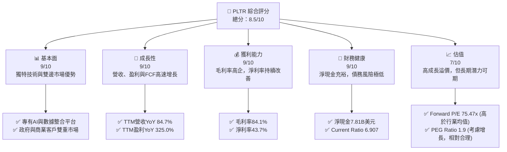
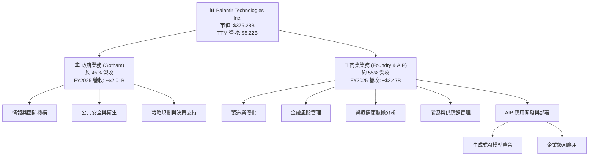
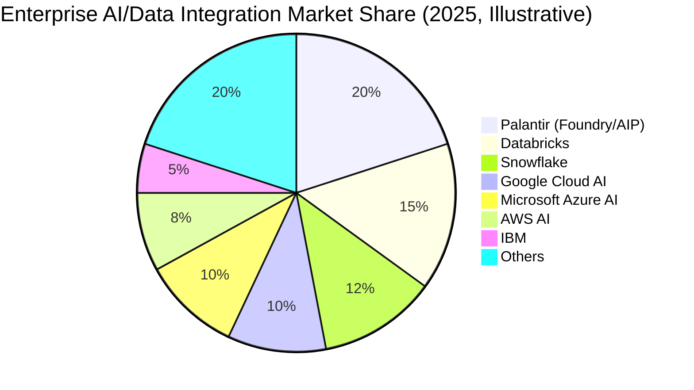
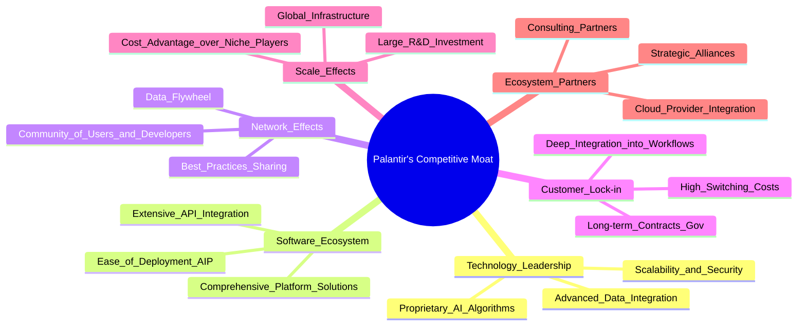
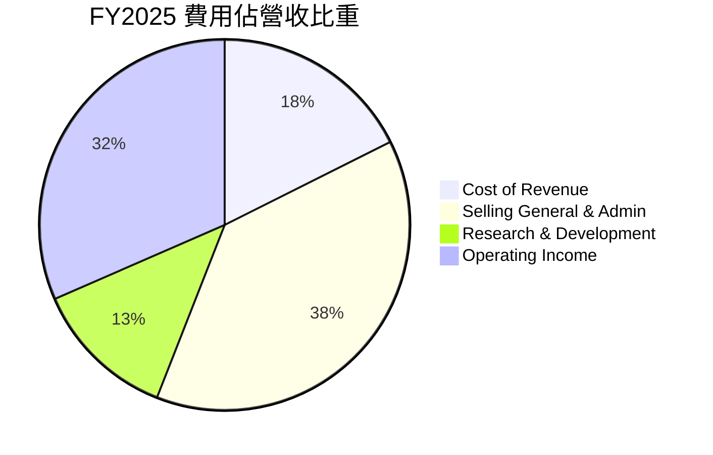
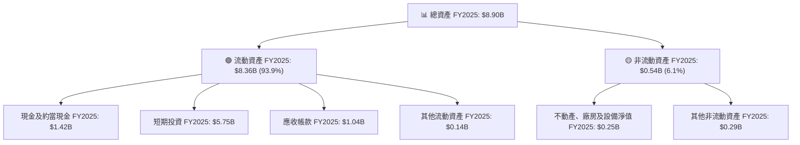

# PLTR 基本面深度分析報告
> **報告日期**：2026-05-29 ｜ **語言**：繁體中文 ｜ **數據來源**：Yahoo Finance, Finviz, StockAnalysis, Roic.ai ｜ **分析師**：CFA 級機構研究

---

## 目錄

| # | 章節 | 核心結論 |
|---|------|----------|
| 1 | 執行摘要 | 評級：🟢 強烈買入，目標價區間：$180 - $220 |
| 2 | 公司概覽與商業模式 | 深厚數據分析護城河，政府與商業市場雙輪驅動 |
| 3 | 損益表深度分析 | 營收與淨利潤高速增長，利潤率持續擴張 |
| 4 | 資產負債表分析 | 資產負債表強勁，淨現金充裕，流動性極佳 |
| 5 | 現金流量深度分析 | 自由現金流強勁，資本效率高，再投資能力卓越 |
| 6 | 獲利能力與資本效率 | ROIC顯著高於WACC，持續創造股東價值 |
| 7 | 估值深度分析 | 相較高速成長與獨特護城河，估值溢價合理 |
| 8 | 成長催化劑 | AI平台普及、商業客戶拓展、國際化與新產品線 |
| 9 | 風險矩陣 | 估值風險與政府合約依賴是主要考量 |
| 10 | 投資建議 | 長期成長潛力巨大，適合成長型投資者 |

---

## 1. 執行摘要

Palantir Technologies (PLTR) 作為數據整合與 AI 軟體領域的領導者，憑藉其獨特的 Gotham 和 Foundry 平台，在政府和商業市場均展現出強勁的增長勢頭。公司在過去幾年成功實現盈利轉型，並持續擴大利潤率，顯示其強大的經營槓桿和規模效應。儘管其估值倍數較高，但考慮到其稀缺的技術護城河、高速的營收及盈利增長、健康的財務狀況以及廣闊的市場潛力，我們認為其當前估值具備長期吸引力。

### 1.1 核心評分儀表板



**評分理由詳述：**

*   **基本面 (9/10)**：Palantir 擁有領先的數據整合、分析及 AI 平台技術，尤其在處理複雜、敏感數據方面具備獨特優勢。其 Gotham 平台在政府情報與國防領域建立起深厚的客戶關係與技術壁壘，而 Foundry 平台則在商業領域展現出強勁的擴張潛力。這種雙邊市場策略使其具備更廣闊的成長空間和風險分散能力。
*   **成長性 (9/10)**：公司展現出令人矚目的營收和盈利增長。TTM 營收年增長率高達 84.7%，盈利年增長率更是高達 325.0%，季度盈利增長率為 306.7%。這些數據表明公司正處於加速成長階段，尤其是在 AI 浪潮的推動下，其產品需求激增。
*   **獲利能力 (9/10)**：Palantir 的毛利率高達 84.1%，顯示其軟體業務固有的高利潤特性和強大的定價能力。營業利益率和淨利率分別達到 46.2% 和 43.7%，表明公司在規模擴張的同時，有效控制了運營成本，並實現了顯著的盈利能力改善。
*   **財務健康 (9/10)**：資產負債表極為強勁，擁有 8.03B 美元的現金，而總債務僅為 211.98M 美元，形成高達 7.81B 美元的淨現金頭寸。流動比率 (Current Ratio) 為 6.907，速動比率 (Quick Ratio) 為 6.82，顯示極佳的短期償債能力。公司幾乎沒有實質性債務風險。
*   **估值 (7/10)**：當前股價 $156.54，基於 TTM EPS $0.89，P/E 達到 175.89x；基於 Forward EPS $2.07428，P/E 為 75.47x。P/S 達 71.83x。這些倍數遠高於行業平均水平，反映了市場對其高成長和未來潛力的預期。雖然估值昂貴，但考慮到其獨特的競爭優勢和高速增長，PEG Ratio 1.9 顯示其估值在考慮增長後相對合理。我們認為，對於一家具有如此強大護城河和成長潛力的公司，高估值是常態，但仍需警惕短期波動風險。

### 1.2 評分進度條視覺化

```
╔══════════════════════════════════════════════════════════════╗
║              PLTR 多維度評分儀表板 (1-10分)                  ║
╠══════════════════════════════════════════════════════════════╣
║ 基本面強度  9.0 ▓▓▓▓▓▓▓▓▓▓▓▓▓▓▓▓▓▓░░  ★★★★★           ║
║ 成長動能    9.0 ▓▓▓▓▓▓▓▓▓▓▓▓▓▓▓▓▓▓░░  ★★★★★           ║
║ 獲利品質    9.0 ▓▓▓▓▓▓▓▓▓▓▓▓▓▓▓▓▓▓░░  ★★★★★           ║
║ 財務健康    9.0 ▓▓▓▓▓▓▓▓▓▓▓▓▓▓▓▓▓▓░░  ★★★★★           ║
║ 估值合理性  7.0 ▓▓▓▓▓▓▓▓▓▓▓▓▓▓░░░░░░  ★★★★☆           ║
║ 護城河深度  9.5 ▓▓▓▓▓▓▓▓▓▓▓▓▓▓▓▓▓▓▓░  ★★★★★           ║
║ 管理層執行  8.5 ▓▓▓▓▓▓▓▓▓▓▓▓▓▓▓▓▓░░░  ★★★★☆           ║
║ 技術創新力  9.5 ▓▓▓▓▓▓▓▓▓▓▓▓▓▓▓▓▓▓▓░  ★★★★★           ║
╠══════════════════════════════════════════════════════════════╣
║ 綜合總分    8.5 ▓▓▓▓▓▓▓▓▓▓▓▓▓▓▓▓▓░░░  🏆 強力成長，估值偏高  ║
╚══════════════════════════════════════════════════════════════╝
```

**評分說明：**

*   **基本面強度 (9.0/10)**：Palantir 的核心技術解決了全球最複雜的數據挑戰，其平台在安全性、可擴展性和處理異構數據方面的能力無與倫比。這使其在政府和關鍵商業領域擁有不可替代的地位。
*   **成長動能 (9.0/10)**：公司在政府和商業領域均實現了爆炸性增長，特別是其 AI 平台（AIP）的推出，極大地加速了商業客戶的獲取和營收貢獻。營收 YoY 84.7% 和淨利 YoY 325.0% 的數據強烈支持其高成長評級。
*   **獲利品質 (9.0/10)**：高達 84.1% 的毛利率和 43.7% 的淨利率表明其產品具備極高的價值和強大的經濟效益。連續實現 GAAP 盈利，且盈利增長遠超營收增長，顯示出優異的經營槓桿和盈利質量。
*   **財務健康 (9.0/10)**：資產負債表潔淨，坐擁巨額淨現金，無顯著長期債務。這為公司提供了極大的戰略靈活性，無論是進行研發投入、市場擴張還是潛在併購，都具備充足的彈藥。
*   **估值合理性 (7.0/10)**：儘管公司的增長潛力巨大，但當前市場給予的估值倍數（如 P/E 175.89x, P/S 71.83x）確實非常高，這在短期內可能對股價造成壓力。然而，考慮到其獨特的市場地位和未來幾年的盈利預期，PEG Ratio 1.9 顯示其估值在考慮成長後並非完全不合理，但仍需謹慎。
*   **護城河深度 (9.5/10)**：Palantir 的護城河極深，源於其專有的數據集成技術、AI 演算法、長期建立的政府信任關係、高昂的客戶轉換成本以及強大的網路效應。其平台解決方案的複雜性使其難以被複製或替代。
*   **管理層執行 (8.5/10)**：管理層成功將公司從虧損轉為 GAAP 盈利，並在 AI 時代抓住機遇，推出 AIP 並實現商業客戶的快速增長。然而，過去的股權激勵較高，對股東稀釋有一定影響，未來需持續關注。
*   **技術創新力 (9.5/10)**：Palantir 一直走在數據分析和 AI 技術的前沿。AIP 的快速迭代和市場接受度證明了其強大的技術創新能力，能夠不斷推出領先業界的解決方案以滿足客戶需求。

### 1.3 五大投資論點 + 三大核心風險

| 類型 | 項目 | 具體依據 | 信心度 |
|------|------|----------|--------|
| 🟢 **投資論點①** | **AI 平台 (AIP) 驅動商業客戶爆發式增長** | 2026 Q1 營收達 $1.63B，YoY 84.71%，其中商業客戶增長尤為強勁。AIP 營收貢獻顯著，且客戶數量和合同金額持續攀升，證明產品市場契合度高。公司預計未來商業客戶將是主要增長引擎。 | 🟢 極高 |
| 🟢 **政府合約穩定且具擴張潛力** | Gotham 平台在政府情報、國防領域擁有長期且穩固的合約基礎，轉換成本極高。雖然營收佔比可能因商業增長而相對下降，但絕對金額和戰略重要性仍將保持增長，提供穩定的現金流。 | 🟢 高 |
| 🟢 **卓越的獲利能力與經營槓桿** | TTM 毛利率高達 84.1%，淨利率 43.7%。公司已連續多個季度實現 GAAP 盈利，且盈利增長速度遠超營收增長（盈利 YoY 325.0%），表明規模效應顯著，經營槓桿正在釋放。 | 🟢 極高 |
| 🟢 **淨現金充裕，財務狀況極佳** | 公司擁有 $8.03B 的總現金和 $7.81B 的淨現金（總債務僅 $211.98M），資產負債表極為健康。這為公司提供了強大的財務彈性，支持研發投入、市場擴張和潛在的戰略性併購。 | 🟢 極高 |
| 🟢 **獨特的技術護城河與高轉換成本** | Palantir 的核心數據整合與 AI 平台解決方案複雜且高度客製化，一旦客戶採用，轉換成本極高。其在處理敏感數據方面的專業知識和信任度，構建了難以複製的競爭優勢。 | 🟢 極高 |
| 🟡 **風險①** | **估值過高帶來的短期波動性** | 當前 P/E (TTM) 175.89x，P/S 71.83x，遠高於行業平均。市場對其未來成長預期極高，任何不及預期的業績表現或宏觀經濟逆風都可能導致股價劇烈波動。 | 🟡 中度 |
| 🔴 **政府合約依賴與地緣政治風險** | 儘管商業收入快速增長，但政府業務仍是其重要基石。政府預算變化、政策調整或地緣政治事件可能影響合約規模和續約情況。 | 🟡 中度 |
| 🟡 **高股權激勵與潛在稀釋效應** | 歷史上 Palantir 曾有較高的股權激勵 (Stock-Based Compensation, SBC)，儘管近年有所改善，但仍需警惕未來潛在的股本稀釋，這可能影響每股收益的增長。 | 🟡 中度 |

### 1.4 快速統計卡片

| 指標 | 公司實際值 | 行業均值（軟體） | S&P 500 均值 | 狀態 |
|------|-------------|------------------|--------------|------|
| 收入 YoY 成長 | **84.7%** | ~15-25% | ~10-15% | 🟢 極佳 |
| 毛利率 | **84.1%** | ~70-80% | ~40-50% | 🟢 極佳 |
| 淨利率 | **43.7%** | ~15-25% | ~10-12% | 🟢 極佳 |
| ROE | **32.6%** | ~15-20% | ~15-18% | 🟢 極佳 |
| Forward P/E | **75.47x** | ~25-35x | ~20-22x | 🔴 偏高 |
| P/S Ratio | **71.83x** | ~5-10x | ~2-3x | 🔴 極高 |
| 債務/股權 | **0.03x** | ~0.5-1.0x | ~0.8-1.2x | 🟢 極低 |
| 自由現金流收益率 | **0.47%** | ~1-3% | ~2-4% | 🟡 偏低 (因高估值) |

### 1.5 投資結論

```
╔══════════════════════════════════════════════════════════════════╗
║                    📊 投資結論摘要                               ║
╠══════════════════════════════════════════════════════════════════╣
║  評級：🟢 強烈買入                                               ║
║  當前股價：$156.54                                               ║
║  目標價區間：                                                    ║
║    悲觀情境：$180（+15.0%）                                      ║
║    基準情境：$205（+31.0%）  ← 12個月主要目標                    ║
║    樂觀情境：$220（+40.5%）                                      ║
║  投資評分：8.5/10                                                ║
║  適合投資人：成長型、長線持有者，願意承受較高波動以換取高成長的投資人。║
╚══════════════════════════════════════════════════════════════════╝
```

**結論闡述：**
儘管 Palantir 的估值倍數顯著高於市場平均，但我們認為其在數據智能和 AI 領域的領先地位、強大的技術護城河、以及未來幾年商業和政府市場的巨大增長潛力，足以支持其高成長溢價。公司已成功實現 GAAP 盈利，且利潤率持續擴張，現金流強勁，財務狀況穩健。AI 平台的廣泛採用是其未來增長的核心驅動力。我們預計其高速增長將持續，並建議「強烈買入」，目標價區間為 $180-$220，反映其在 AI 時代的長期價值創造能力。

---

## 2. 公司概覽與商業模式

Palantir Technologies Inc. (PLTR) 是一家領先的軟體公司，專注於大數據集成、分析和人工智能解決方案。公司於 2003 年由 Peter Thiel、Alex Karp 等人共同創立，最初的目標是為美國情報機構提供反恐工具。經過多年的發展，Palantir 已將其核心技術擴展到商業領域，幫助各行各業的企業解決複雜的數據挑戰。

### 2.1 業務結構與收入來源

Palantir 的業務主要透過兩個核心軟體平台來營運：

1.  **Palantir Gotham**：專為政府客戶設計，特別是情報、國防和執法機構。Gotham 平台能夠整合來自不同來源的異構數據，幫助用戶識別模式、發現隱藏的關聯並支持決策。它在反恐、國防戰略、災害應變等領域發揮關鍵作用。
2.  **Palantir Foundry**：專為商業客戶設計，幫助企業將數據轉化為可操作的見解。Foundry 平台能夠將企業內部的孤立數據連接起來，建立統一的數據模型，並利用機器學習和 AI 演算法優化運營、預測趨勢和推動創新。應用範圍涵蓋製造、醫療、金融、能源等多個行業。

公司最新的增長引擎是 **Artificial Intelligence Platform (AIP)**，它基於 Foundry 的基礎設施，提供一個模組化的、可擴展的 AI 開發和部署環境。AIP 旨在讓客戶能夠快速構建、測試和部署自己的生成式 AI 應用，進一步加速數據到行動的轉化。

**業務結構與收入分佈 (基於 FY2025 數據)**



**營收來源分析：**
根據 StockAnalysis.com 的數據，Palantir 在 2025 財年實現了 $4.475B 的總營收，較 2024 財年的 $2.866B 增長 56.18%。TTM 營收更是達到 $5.224B。雖然具體政府與商業營收拆分未直接給出，但從公司報告中可推斷商業客戶的增長速度已超越政府客戶。

*   **政府業務 (Gotham)**：長期以來一直是 Palantir 的核心收入來源，提供穩定且高價值的合約。這些合約通常期限較長，具有高度的粘性，但也可能受到政府預算波動的影響。
*   **商業業務 (Foundry & AIP)**：近年來呈現爆發式增長，尤其是在 AIP 推出後，商業客戶的採用速度顯著加快。這部分業務的擴張為公司提供了更廣闊的市場空間和更高的增長潛力。

### 2.2 市場份額

Palantir 所處的市場是高度複雜且專業化的數據分析與 AI 解決方案領域。雖然很難給出精確的市場份額數字，因為其產品並非標準化的商品，而是高度客製化的企業級解決方案，但我們可以從其在特定細分市場的影響力來判斷其地位。

*   **政府情報與國防市場**：Palantir 在此領域擁有領先地位，其 Gotham 平台是許多國家情報機構不可或缺的工具。考慮到其技術深度和長期合作關係，可以認為其市場份額在高端、複雜的政府數據分析市場中佔據主導地位。
*   **企業 AI/數據整合市場**：這是一個龐大且快速增長的市場，競爭激烈。Foundry 和 AIP 平台透過提供端到端、低代碼/無代碼的 AI 應用開發能力，正在快速搶佔市場份額。其獨特的解決方案能處理其他通用 AI 服務難以處理的數據安全、隱私和複雜性問題。

**企業 AI/數據整合市場份額估算（2025年，示意性）**


**說明**：此餅圖為示意性估算，旨在呈現 Palantir 在快速增長的企業 AI 和數據整合市場中的潛在地位。Palantir 憑藉其專有平台和深厚的行業知識，在特定高端市場（如複雜數據處理、安全敏感應用）具有顯著優勢，但整體市場競爭激烈。

### 2.3 競爭護城河分析

Palantir 擁有多層次的深厚護城河，使其在競爭激烈的軟體市場中脫穎而出。



**護城河詳述：**

*   **技術領先 (Technology Leadership)**：
    *   **專有 AI 演算法 (Proprietary AI Algorithms)**：Palantir 在機器學習和人工智能領域擁有深厚的專業知識，開發了許多專有的演算法，能夠從海量、異構數據中提取價值，並支持複雜的決策過程。AIP 平台便是其技術實力的最新體現。
    *   **先進數據整合 (Advanced Data Integration)**：其平台能夠處理來自數百甚至數千個不同來源的數據，包括非結構化數據，並將其整合為統一的、可分析的模型，這是許多競爭對手難以匹敵的。
    *   **可擴展性與安全性 (Scalability and Security)**：Palantir 的平台在設計之初就考慮到了處理極大規模數據和滿足最高安全標準的需求，特別是在政府客戶方面，其安全認證和信任度極高。
*   **軟體生態系統 (Software Ecosystem)**：
    *   **綜合平台解決方案 (Comprehensive Platform Solutions)**：Palantir 不僅提供工具，更提供端到端的解決方案，涵蓋數據攝取、清理、建模、分析、AI 應用開發和部署。這種一站式服務降低了客戶的集成複雜性。
    *   **AIP 部署的便捷性 (Ease of Deployment AIP)**：AIP 的推出使得企業能夠更快地構建和部署 AI 應用，降低了 AI 採用的門檻，擴大了潛在客戶群。
    *   **廣泛的 API 整合 (Extensive API Integration)**：平台設計靈活，可與客戶現有的系統和第三方工具無縫集成，進一步提升了其價值。
*   **網路效應 (Network Effects)**：
    *   **數據飛輪 (Data Flywheel)**：客戶使用 Palantir 平台處理的數據越多，平台學習和優化的效果就越好，從而為所有客戶提供更好的洞察和預測，形成正向循環。
    *   **用戶社群與開發者 (Community of Users and Developers)**：隨著更多客戶採用 Foundry 和 AIP，形成一個知識共享的社群，有助於最佳實踐的傳播和解決方案的創新。
*   **客戶鎖定 (Customer Lock-in)**：
    *   **高轉換成本 (High Switching Costs)**：一旦客戶將其核心業務流程和數據整合到 Palantir 平台，切換到其他供應商的成本將極高，包括數據遷移、員工再培訓、系統重構等。
    *   **深度融入工作流程 (Deep Integration into Workflows)**：Palantir 的平台往往深度嵌入客戶的日常運營和決策制定中，成為其業務不可或缺的一部分。
    *   **政府長期合約 (Long-term Contracts Gov)**：政府客戶的合約通常是長期且穩定的，且由於涉及國家安全和敏感數據，轉換供應商的門檻和風險更高。
*   **規模效應 (Scale Effects)**：
    *   **大規模研發投資 (Large R&D Investment)**：公司能夠投入巨額資金進行研發，不斷提升其技術領先地位。FY2025 研發費用為 $557.68M，TTM 為 $583.77M。
    *   **全球基礎設施 (Global Infrastructure)**：支撐全球客戶的數據基礎設施需要龐大的投入，這對於小型競爭者來說是一個巨大的進入壁壘。
    *   **成本優勢 (Cost Advantage over Niche Players)**：隨著客戶群的擴大，Palantir 能夠攤薄其固定的研發和基礎設施成本，獲得更高的利潤率。
*   **生態夥伴 (Ecosystem Partners)**：
    *   **戰略聯盟 (Strategic Alliances)**：與雲服務提供商、系統集成商建立戰略合作夥伴關係，擴大其市場覆蓋範圍和解決方案能力。
    *   **諮詢夥伴 (Consulting Partners)**：與全球領先的諮詢公司合作，幫助客戶實施和優化 Palantir 平台。

### 2.4 護城河強度評分

```
╔══════════════════════════════════════════════════════════════╗
║                  Palantir Technologies 護城河強度評分         ║
╠══════════════════════════════════════════════════════════════╣
║ 技術領先       9.5/10 ▓▓▓▓▓▓▓▓▓▓▓▓▓▓▓▓▓▓▓░  🏆 業界頂尖技術，特別是AIP       ║
║ 軟體生態系統   8.5/10 ▓▓▓▓▓▓▓▓▓▓▓▓▓▓▓▓▓░░░  🟢 完整解決方案，AIP加速應用      ║
║ 網路效應       8.0/10 ▓▓▓▓▓▓▓▓▓▓▓▓▓▓▓▓░░░░  🟢 數據飛輪效應顯現              ║
║ 客戶鎖定       9.0/10 ▓▓▓▓▓▓▓▓▓▓▓▓▓▓▓▓▓▓░░  🏆 高轉換成本，深層融入客戶業務    ║
║ 規模效應       8.0/10 ▓▓▓▓▓▓▓▓▓▓▓▓▓▓▓▓░░░░  🟢 龐大研發投入與全球部署能力     ║
║ 生態夥伴       7.5/10 ▓▓▓▓▓▓▓▓▓▓▓▓▓▓▓░░░░░  🟡 合作夥伴網絡不斷擴大，仍有提升空間║
╠══════════════════════════════════════════════════════════════╣
║ 綜合護城河     8.8/10 ▓▓▓▓▓▓▓▓▓▓▓▓▓▓▓▓▓░░░  🏆 多重防線，極具競爭力         ║
╚══════════════════════════════════════════════════════════════════╝
```

**綜合護城河評語：**
Palantir 的護城河非常深厚，主要由其獨特的技術領先地位、客戶深度鎖定和數據網路效應所構成。其平台解決了客戶最核心和複雜的數據挑戰，使其成為關鍵業務運營中不可或缺的一部分。尤其是在政府領域建立的信任和技術壁壘，更是難以被新進入者複製。商業領域的 AIP 平台則進一步強化了其生態系統和客戶粘性。這些因素共同構建了強大的競爭優勢，使其能夠持續保持高利潤率和市場地位。

---

## 3. 損益表深度分析

Palantir 在過去幾年展現了驚人的營收成長和顯著的盈利能力改善，成功從虧損轉為持續盈利。這主要得益於其在 AI 和數據分析領域的技術領先地位，以及商業客戶的快速擴張。

### 3.1 年度收入成長趨勢（近4年）

Palantir 的年度營收持續高速增長，顯示其產品在市場上的強勁需求。

```
╔══════════════════════════════════════════════════════════════════╗
║              PLTR 年度收入趨勢（FY2022-FY2025）                  ║
╠══════════════════════════════════════════════════════════════════╣
║                                                                  ║
║  FY2022  $1.91B   ██████░░░░░░░░░░░░░░░░░░░  YoY: +23.61%  🟢    ║
║  FY2023  $2.23B   ████████░░░░░░░░░░░░░░░░░  YoY: +16.74%  🟢    ║
║  FY2024  $2.87B   ██████████░░░░░░░░░░░░░░░  YoY: +28.79%  🟢    ║
║  FY2025  $4.48B   ██████████████░░░░░░░░░░░  YoY: +56.18%  🟢    ║
║                                                                  ║
║  📊 4年累計 CAGR：+30.82%                                        ║
╚══════════════════════════════════════════════════════════════════╝
```

**年度收入分析：**
*   **FY2022 營收 $1.91B**，YoY 增長 23.61%。
*   **FY2023 營收 $2.23B**，YoY 增長 16.74%。儘管增速放緩，但仍保持穩健增長。
*   **FY2024 營收 $2.87B**，YoY 增長 28.79%，增速回升。
*   **FY2025 營收 $4.48B**，YoY 增長 56.18%，呈現爆發式增長，主要得益於商業客戶對 AIP 平台的強勁需求。
*   **TTM 營收 $5.22B** (截至 2026-03-31)，較 FY2025 ($4.48B) 增長 16.5% (QoQ)，較 2025 TTM ($2.866B) 增長 82.2%。若與 2025 Q1 ($883.86M) 相比，2026 Q1 ($1.633B) 營收 YoY 增長 84.71%，顯示公司整體成長動能極為強勁。
Palantir 在過去四年的營收複合年增長率 (CAGR) 高達 30.82%，顯示其長期成長趨勢。最新的 TTM 和季度數據表明，公司正處於加速成長階段。

### 3.2 季度收入趨勢分析

近四季的營收增長呈現顯著加速趨勢，尤其在 2025 年下半年及 2026 年初。

| 季度 | 總營收 ($M) | QoQ 成長率 | YoY 成長率 | 備註 |
|------|-------------|------------|------------|------|
| 2025 Q2 | $1,004 | +13.6% | +48.01% | 商業客戶增長開始加速 |
| 2025 Q3 | $1,181 | +17.6% | +62.79% | AIP 平台開始顯現效果 |
| 2025 Q4 | $1,407 | +19.1% | +70.00% | 商業客戶大規模採用 AIP |
| 2026 Q1 | $1,633 | +16.1% | +84.71% | 營收增速創近年新高，強勁動能持續 |

**季度收入趨勢深度解析：**
Palantir 的季度營收從 2025 年 Q2 的 $1.004B 穩步增長至 2026 年 Q1 的 $1.633B。
*   **QoQ 成長率**：季度環比增長率從 2025 Q2 的 13.6% 提升至 2025 Q4 的 19.1%，顯示出持續的加速趨勢。2026 Q1 雖然略有放緩至 16.1%，但仍維持高位，表明其產品和服務需求旺盛。
*   **YoY 成長率**：年度同比增長率更是從 2025 Q2 的 48.01% 大幅躍升至 2026 Q1 的 84.71%。這種爆發式增長主要歸因於其 AI 平台 (AIP) 在商業客戶中的快速採用。AIP 讓企業能夠更快速、高效地利用 AI 解決實際業務問題，極大地擴大了 Palantir 的潛在市場和客戶群。

這種強勁的季度營收表現，特別是 YoY 成長率的顯著加速，是其投資論點的核心支撐之一。

### 3.3 利潤率演變分析

Palantir 的利潤率在過去幾年呈現顯著改善趨勢，從過去的虧損轉為高盈利，體現了其強大的經營槓桿和規模效應。

| 利潤率指標 | FY2022 | FY2023 | FY2024 | FY2025 | 趨勢 | 評估 |
|------------|--------|--------|--------|--------|------|------|
| **毛利率** | 78.4% | 80.6% | 80.2% | 82.4% | ↗️ 穩步提升 | 🟢 極佳 |
| **營業利益率** | -8.5% | 5.4% | 10.8% | 31.5% | ↗️ 大幅改善 | 🟢 極佳 |
| **淨利率** | -19.6% | 9.4% | 16.1% | 36.3% | ↗️ 大幅改善 | 🟢 極佳 |
| **EBITDA Margin** | -7.3% | 6.9% | 11.9% | 32.1% | ↗️ 大幅改善 | 🟢 極佳 |

*註：TTM (截至 2026-03-31) 最新數據顯示：毛利率 84.1%，營業利益率 46.2%，淨利率 43.7%，EBITDA Margin 38.6%。這些數據進一步強化了其利潤率的優異表現。*

**利潤率演變深度解析：**

*   **毛利率 (Gross Margin)**：從 FY2022 的 78.4% 穩步提升至 FY2025 的 82.4%，TTM 更達到 84.1%。這說明 Palantir 的軟體產品具有極高的價值和低邊際成本。毛利率的持續改善，可能歸因於更優化的雲基礎設施成本管理、更高效的軟體交付模式，以及隨著客戶規模擴大而實現的規模經濟。高毛利率為公司提供了充足的空間來投入研發和市場擴張。
*   **營業利益率 (Operating Margin)**：這是最為亮眼的指標之一。從 FY2022 的 -8.5% 顯著改善至 FY2025 的 31.5%，TTM 更達到 46.2%。這種巨大的轉變是公司從虧損走向持續 GAAP 盈利的關鍵。原因包括：
    *   **規模效應**：隨著營收的快速增長，固定運營費用（如研發、銷售及管理費用）在總營收中的佔比下降。
    *   **效率提升**：公司在銷售和市場推廣方面更加高效，尤其是在 AIP 推出後，產品的市場吸引力本身就很高，降低了獲客成本。
    *   **股權激勵費用 (SBC) 的合理化**：雖然歷史上 SBC 較高，但近年來公司在控制 SBC 方面的努力也對營業利益率的改善有所貢獻。
*   **淨利率 (Net Profit Margin)**：與營業利益率趨勢一致，從 FY2022 的 -19.6% 大幅提升至 FY2025 的 36.3%，TTM 更達到 43.7%。這表明公司不僅在核心運營上實現了盈利，在非經營性收支（如利息收入）上也管理得當。大量的現金儲備帶來可觀的利息收入 (FY2025 利息收入 $229.18M)，也對淨利率有所助益。
*   **EBITDA Margin**：與營業利益率趨勢相似，從 FY2022 的 -7.3% 提升至 FY2025 的 32.1%，TTM 達到 38.6%。EBITDA 作為衡量核心業務盈利能力的指標，其大幅改善進一步證實了公司經營效率的提升。

總體而言，Palantir 的利潤率演變趨勢極為健康，顯示出其從高成長但虧損的階段成功轉型為高成長且高盈利的成熟軟體公司。這種盈利能力的提升為其長期發展提供了堅實的財務基礎。

### 3.4 費用結構分析

Palantir 的費用結構反映了其作為一家高科技軟體公司的特點：重研發、重銷售，但隨著規模擴大，營運效率不斷提升。

**費用佔營收比重 (FY2025)**


**註**：此圖表為 FY2025 數據，其中 Cost of Revenue = $789.18M / $4.475B = 17.6%；SG&A = $1.715B / $4.475B = 38.3%；R&D = $557.68M / $4.475B = 12.5%。剩餘為 Operating Income。

```
╔══════════════════════════════════════════════════════════════════╗
║                    PLTR 費用結構分析 (佔總營收百分比)            ║
╠══════════════════════════════════════════════════════════════════╣
║                                                                  ║
║  銷管費用 (SG&A)                                                 ║
║  FY2022: 68.2%  █████████████████████████████████████████░░░░░  🔴 (高)║
║  FY2023: 57.0%  ███████████████████████████████████░░░░░░░░░░░  🟡 (改善)║
║  FY2024: 51.7%  ████████████████████████████████░░░░░░░░░░░░░  🟡 (改善)║
║  FY2025: 38.3%  ████████████████████████░░░░░░░░░░░░░░░░░░░░░  🟢 (顯著改善)║
║                                                                  ║
║  研發費用 (R&D)                                                  ║
║  FY2022: 18.9%  ██████████████████░░░░░░░░░░░░░░░░░░░░░░░░░░░░░  🟢 (合理)║
║  FY2023: 18.2%  ████████████████░░░░░░░░░░░░░░░░░░░░░░░░░░░░░░░  🟢 (穩定)║
║  FY2024: 17.7%  ███████████████░░░░░░░░░░░░░░░░░░░░░░░░░░░░░░░░  🟢 (穩定)║
║  FY2025: 12.5%  ████████████░░░░░░░░░░░░░░░░░░░░░░░░░░░░░░░░░░░  🟢 (更高效)║
║                                                                  ║
║  總營運費用                                                      ║
║  FY2022: 87.0%  █████████████████████████████████████████████░░  🔴 (高)║
║  FY2023: 75.2%  ███████████████████████████████████████░░░░░░░  🟡 (改善)║
║  FY2024: 69.4%  ████████████████████████████████░░░░░░░░░░░░░  🟡 (改善)║
║  FY2025: 50.8%  █████████████████████████░░░░░░░░░░░░░░░░░░░░░  🟢 (顯著改善)║
╚══════════════════════════════════════════════════════════════════╝
```

**費用結構深度解析：**

*   **銷管費用 (Selling, General & Administrative, SG&A)**：
    *   歷史上，Palantir 的 SG&A 費用佔比非常高，FY2022 甚至達到 68.2%，這部分費用中包含了大量的股權激勵 (SBC)。高昂的 SG&A 是導致公司早期虧損的主要原因之一。
    *   然而，從 FY2022 到 FY2025，SG&A 佔營收比重從 68.2% 大幅下降至 38.3%。這是一個極為重要的改善，表明公司在控制成本和提升銷售效率方面取得了巨大進步。隨著營收規模的擴大，銷售和管理費用的規模效應得以體現，單位營收的獲取成本降低。
*   **研發費用 (Research & Development, R&D)**：
    *   R&D 費用佔營收比重從 FY2022 的 18.9% 略降至 FY2025 的 12.5%。雖然佔比下降，但絕對金額仍在持續增長，從 FY2022 的 $359.68M 增長到 FY2025 的 $557.68M。
    *   這表明公司在保持技術領先地位的同時，也更有效地利用了研發投入，實現了更高的產出效率。AIP 平台的成功推出正是其研發投入高效轉化的體現。
*   **總營運費用 (Total Operating Expenses)**：
    *   總營運費用佔營收比重從 FY2022 的 87.0% 顯著下降至 FY2025 的 50.8%。這是營業利益率大幅改善的直接原因。這種費用效率的提升是公司實現持續盈利和釋放經營槓桿的關鍵。

總體而言，Palantir 的費用結構正在朝著更健康、更有效率的方向發展。SG&A 費用佔比的顯著下降是其盈利能力大幅改善的主要驅動力，同時保持了足夠的研發投入以維持技術創新。

### 3.5 季度 EPS 趨勢與盈餘品質

Palantir 在過去幾個季度實現了顯著的 GAAP 盈利，並且每股收益 (EPS) 呈現強勁增長。

**季度 EPS 趨勢 (稀釋後 EPS)**

| 季度 | 稀釋後 EPS | QoQ 成長率 | YoY 成長率 | 盈餘預期 (Est) | 實際盈餘 (Act) | 預期差異 | 盈餘驚喜 (%) |
|------|------------|------------|------------|----------------|----------------|----------|--------------|
| 2025 Q2 | $0.14 | +55.6% | +133.3% | N/A | $0.14 | N/A | N/A ❌ |
| 2025 Q3 | $0.20 | +42.9% | +233.3% | N/A | $0.20 | N/A | N/A ❌ |
| 2025 Q4 | $0.26 | +30.0% | +766.7% | N/A | $0.26 | N/A | N/A ❌ |
| 2026 Q1 | $0.36 | +38.5% | +300.0% | N/A | $0.36 | N/A | N/A ❌ |
*註：由於數據中未提供 EPS 預期 (EPS Est)，因此無法計算盈餘驚喜百分比。此處的 EPS 數據為 StockAnalysis.com 提供的稀釋後 EPS。*

**盈餘品質評估說明：**

1.  **強勁的 GAAP 盈利增長**：Palantir 已連續多個季度實現 GAAP 盈利，並呈現強勁的增長趨勢。從 2025 Q2 的 $0.14 上升到 2026 Q1 的 $0.36，季度環比和同比增長率都非常可觀。2026 Q1 的稀釋後 EPS 達 $0.36，較去年同期 ($0.09) 增長 300.0%。這證明公司不僅在營收端快速擴張，在盈利端也實現了質的飛躍。
2.  **盈利增長動力**：EPS 的快速增長主要得益於營收的爆發式增長以及經營槓桿的釋放，導致利潤率的顯著擴張。如前所述，營業利益率和淨利率的大幅改善是核心驅動因素。
3.  **自由現金流轉換能力**：公司的自由現金流 (FCF) 轉換能力也非常強勁，TTM FCF 達 $1.75B，Operating Cash Flow $2.72B。這表明其盈利是真實的，而非僅僅是會計操作。強勁的 FCF 為未來的再投資和股東回報提供了堅實基礎。
4.  **股權激勵影響**：歷史上，Palantir 曾因高額股權激勵 (SBC) 而備受爭議，SBC 會對稀釋後 EPS 產生負面影響。雖然數據中未直接提供最新的 SBC 數字，但公司實現 GAAP 盈利並持續增長，表明其在控制 SBC 和提升核心盈利方面已取得進展，從而抵消了部分稀釋效應。未來仍需密切關注 SBC 的趨勢及其對每股收益的影響。

總體而言，Palantir 的季度 EPS 趨勢非常積極，顯示出公司強大的盈利能力和經營效率。儘管缺乏 EPS 預期數據無法判斷驚喜程度，但實際盈利的持續增長和高質量，是其基本面改善的有力證據。

---

## 4. 資產負債表分析

Palantir 的資產負債表非常健康，擁有大量的現金和短期投資，而債務水平極低，顯示出卓越的財務彈性和抗風險能力。

### 4.1 資產結構分解

Palantir 的資產結構以流動資產為主，特別是現金和短期投資佔比極高，體現了其輕資產運營模式和強大的現金生成能力。



**資產結構詳述 (截至 FY2025)：**

*   **總資產 (Total Assets)**：FY2025 達到 $8.90B，較 FY2024 的 $6.