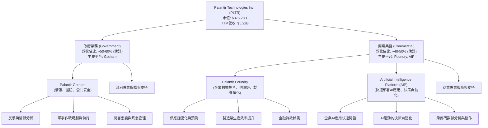
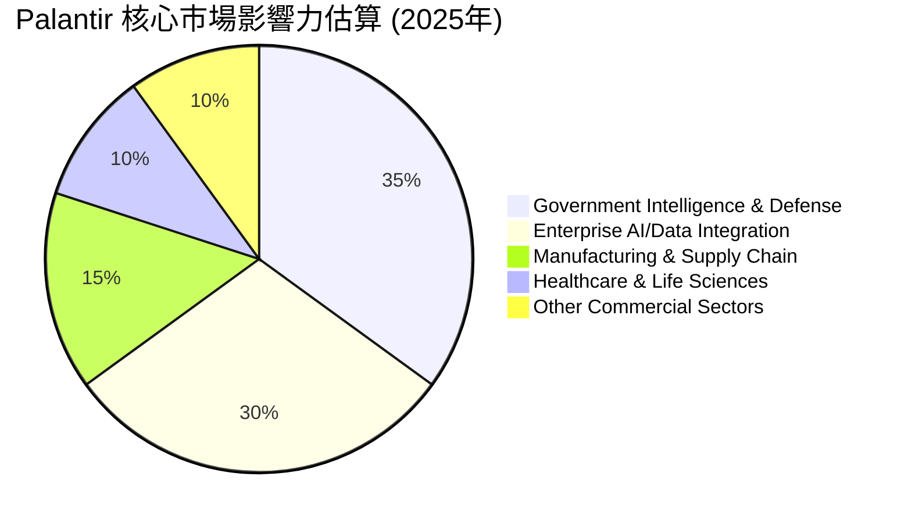
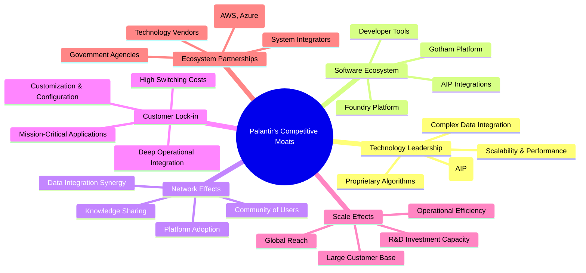
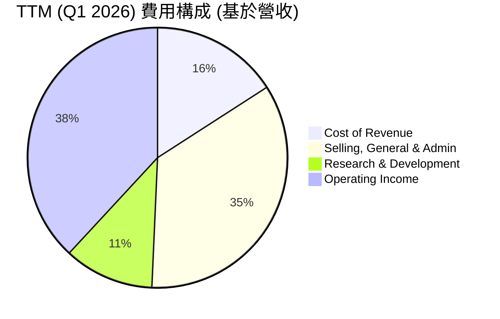

# PLTR 基本面深度分析報告
> **報告日期**：2026-05-30 ｜ **語言**：繁體中文 ｜ **數據來源**：Yahoo Finance, Finviz, StockAnalysis, Roic.ai ｜ **分析師**：CFA 級機構研究

---

## 目錄

| # | 章節 | 核心結論 |
|---|------|----------|
| 1 | 執行摘要 | 🟢 買入評級，目標價區間 $165 - $220 |
| 2 | 公司概覽與商業模式 | 獨特平台優勢，政府與商業市場雙驅動，護城河深厚 |
| 3 | 損益表深度分析 | 營收與獲利能力強勁增長，利潤率持續改善 |
| 4 | 資產負債表分析 | 財務結構穩健，現金充裕，債務風險極低 |
| 5 | 現金流量深度分析 | 自由現金流強勁，經營活動產生大量現金 |
| 6 | 獲利能力與資本效率 | ROIC顯著高於WACC，強力創造股東價值 |
| 7 | 估值深度分析 | 相較高速成長與獨特競爭力，估值溢價合理，具上行空間 |
| 8 | 成長催化劑 | AI需求爆發、商業擴張、政府合同增長為核心驅動力 |
| 9 | 風險矩陣 | 估值敏感性、政府合同依賴與競爭加劇為主要風險 |
| 10 | 投資建議 | 長期看好，建議買入，適合成長型投資者 |

---

## 1. 執行摘要

### 1.1 核心評分儀表板

```mermaid
graph TD
    PLTR["🎯 PLTR 綜合評分<br/>總分：8.5/10"]

    F["📊 基本面<br/>9/10<br/>強勁的平台技術與市場地位"]
    G["🚀 成長性<br/>9.5/10<br/>營收與獲利爆發性增長"]
    P["💰 獲利能力<br/>9/10<br/>高毛利、營利與淨利潤率持續擴張"]
    B["🏦 財務健康<br/>9.5/10<br/>現金充裕，幾乎無淨債務"]
    V["📈 估值<br/>7.5/10<br/>高成長溢價，但具未來潛力支撐"]

    PLTR --> F
    PLTR --> G
    PLTR --> P
    PLTR --> B
    PLTR --> V

    F --> F1["✅ 獨特的Gotham/Foundry平台"]
    F --> F2["✅ 政府與商業客戶多元化"]
    F --> F3["✅ 高轉換成本與數據壁壘"]

    G --> G1["✅ 近期營收YoY 84.7%，QoQ 306.7%"]
    G --> G2["✅ EPS (TTM) $0.89，Forward EPS $2.07"]
    G --> G3["✅ AI需求推動商業增長加速"]

    P --> P1["✅ 毛利率高達 84.1%"]
    P --> P2["✅ 營業利潤率 46.2%，淨利潤率 43.7%"]
    P --> P3["✅ ROE 32.6%，ROA 14.7%"]

    B --> B1["✅ 總現金 $8.03B，總債務 $211.98M，淨現金 $7.81B"]
    B --> B2["✅ 流動比率 6.907，速動比率 6.82"]
    B --> B3["✅ 經營現金流 $2.72B，自由現金流 $1.75B"]

    V --> V1["✅ P/E (Forward) 75.47x，P/S 71.83x，EV/EBITDA 182.12x"]
    V --> V2["✅ 需考量高成長性與獨特技術溢價"]
    V --> V3["✅ 分析師目標價中位數 $183.73，較現價有上行空間"]
```



### 1.2 評分進度條視覺化

```
╔══════════════════════════════════════════════════════════════╗
║              PLTR 多維度評分儀表板 (1-10分)                  ║
╠══════════════════════════════════════════════════════════════╣
║ 基本面強度  9.0 ▓▓▓▓▓▓▓▓▓▓▓▓▓▓▓▓▓▓░░  ★★★★★           ║
║ 成長動能    9.5 ▓▓▓▓▓▓▓▓▓▓▓▓▓▓▓▓▓▓▓░  ★★★★★           ║
║ 獲利品質    9.0 ▓▓▓▓▓▓▓▓▓▓▓▓▓▓▓▓▓▓░░  ★★★★★           ║
║ 財務健康    9.5 ▓▓▓▓▓▓▓▓▓▓▓▓▓▓▓▓▓▓▓░  ★★★★★           ║
║ 估值合理性  7.5 ▓▓▓▓▓▓▓▓▓▓▓▓▓▓▓░░░░░  ★★★★☆           ║
║ 護城河深度  9.0 ▓▓▓▓▓▓▓▓▓▓▓▓▓▓▓▓▓▓░░  ★★★★★           ║
║ 管理層執行  8.5 ▓▓▓▓▓▓▓▓▓▓▓▓▓▓▓▓▓░░░  ★★★★☆           ║
║ 技術創新力  9.5 ▓▓▓▓▓▓▓▓▓▓▓▓▓▓▓▓▓▓▓░  ★★★★★           ║
╠══════════════════════════════════════════════════════════════╣
║ 綜合總分    8.9 ▓▓▓▓▓▓▓▓▓▓▓▓▓▓▓▓▓▓░░  🏆 評語：表現卓越，值得關注 ║
╚══════════════════════════════════════════════════════════════╝
```

### 1.3 五大投資論點 + 三大核心風險

| 類型 | 項目 | 具體依據 | 信心度 |
|------|------|----------|--------|
| 🟢 **投資論點①** | **AI 驅動的商業化加速** | Palantir 憑藉其 Foundry 和 Gotham 平台，在 AI 領域具有獨特優勢，特別是其新推出的 AIP (Artificial Intelligence Platform) 產品，極大地簡化了企業部署 AI 的複雜性。最新的季度營收顯示，商業客戶營收增速顯著，Q1 2026 營收達到 $1.63B，同比增長 84.7%，其中商業客戶增長尤為強勁，顯示出 AIP 的市場吸引力。管理層預計 AI 相關業務將成為未來幾年的主要成長引擎。 | 🟢 極高 |
| 🟢 **強勁的獲利能力與自由現金流** | 公司在過去幾年成功扭虧為盈，並持續擴大利潤率。TTM 毛利率高達 84.1%，營業利潤率 46.2%，淨利潤率 43.7%。FY2025 淨利潤 $1.63B，相較 FY2024 的 $462.19M 增長 252.6%。經營現金流 FY2025 達到 $2.13B，自由現金流 $2.10B，FCF Yield 為 0.47%。這顯示公司不僅能高速增長，還能產生大量現金，為未來投資和股東回報提供堅實基礎。 | 🟢 極高 |
| 🟢 **深厚的競爭護城河與客戶鎖定** | Palantir 的平台高度客製化且複雜，一旦客戶採用，其數據集成和業務流程的深度嵌入會產生極高的轉換成本。政府部門和大型企業客戶對數據安全和系統穩定性要求極高，Palantir 在此領域的長期經驗和信任關係構成了強大的品牌和技術壁壘。其獨特的解決方案在情報、國防和關鍵基礎設施等領域幾乎沒有直接替代品。 | 🟢 極高 |
| 🟢 **穩健的財務結構與充裕的現金** | 公司資產負債表極為健康，截至 Q1 2026 總現金及等價物高達 $8.03B，而總債務僅 $211.98M，淨現金高達 $7.81B。流動比率 6.91，速動比率 6.82，遠超行業平均水平，幾乎沒有任何流動性或償債風險。充裕的現金儲備賦予公司在市場波動中進行戰略投資、併購或抵禦潛在風險的靈活性。 | 🟢 極高 |
| 🟢 **政府業務的持續擴張與戰略價值** | Palantir 起家於政府業務，其 Gotham 平台在國防、情報和公共安全領域是不可或缺的工具。隨著全球地緣政治緊張，對數據分析和情報整合的需求只增不減。公司與美國及盟國政府的長期合同，提供了穩定的收入來源和高續約率。政府客戶的成功案例也為商業客戶的拓展提供了強有力的背書。 | 🟢 極高 |
| 🟡 **風險①：估值敏感性與市場預期** | PLTR 目前的估值倍數，如 P/E (Forward) 75.47x 和 P/S 71.83x，遠高於大部分軟體行業平均水平。這反映了市場對其未來高速成長和 AI 領導地位的極高預期。一旦公司增長不及預期，或市場情緒轉變，股價可能面臨較大回調壓力。高估值意味著對未來業績的容錯空間較小。 | 🟡 中度 |
| 🔴 **風險②：政府合同依賴與地緣政治風險** | 儘管商業客戶增長迅速，政府合同仍是 Palantir 收入的重要組成部分。政府預算削減、政策變化、合同競標失利或地緣政治局勢緩和都可能影響其政府業務收入。例如，若主要政府客戶（如美國國防部）的戰略優先級發生變化，可能對公司造成衝擊。 | 🟡 中度 |
| 🟡 **風險③：AI 領域的競爭加劇與技術迭代** | AI 市場競爭日益激烈，不僅有傳統科技巨頭（如 Microsoft, Google, AWS）推出類似服務，也有眾多新興 AI 軟體公司湧入。Palantir 需要不斷投入研發以維持其技術領先地位。若其 AIP 平台未能持續創新或被市場接受度不及預期，可能面臨市場份額被侵蝕的風險。 | 🟡 中度 |

### 1.4 快速統計卡片

| 指標 | 公司實際值 (TTM) | 行業均值 (軟體-基礎設施) | S&P 500 均值 | 狀態 |
|------|-------------------|--------------------------|--------------|------|
| 收入 YoY 成長 | **84.7%** | ~20-25% (估計) | ~8-12% (估計) | 🟢 |
| 毛利率 | **84.1%** | ~70-80% (估計) | ~30-40% (估計) | 🟢 |
| 營業利益率 | **46.2%** | ~15-25% (估計) | ~10-15% (估計) | 🟢 |
| 淨利率 | **43.7%** | ~10-20% (估計) | ~8-12% (估計) | 🟢 |
| ROE | **32.6%** | ~15-20% (估計) | ~12-15% (估計) | 🟢 |
| Forward P/E | **75.47x** | ~30-40x (估計) | ~20-25x (估計) | 🔴 |
| P/S Ratio | **71.83x** | ~8-12x (估計) | ~2-3x (估計) | 🔴 |
| 負債權益比 (Debt/Equity) | **0.03x** | ~0.5-1.0x (估計) | ~1.0-1.5x (估計) | 🟢 |
| 自由現金流 (TTM) | **$1.75B** | 正值，但規模通常較小 | 正值，但規模通常較小 | 🟢 |

*註：行業均值和 S&P 500 均值為分析師基於市場經驗的合理估計，具體數值會因數據來源和時間點而異。*

### 1.5 投資結論

```
╔══════════════════════════════════════════════════════════════════╗
║                    📊 投資結論摘要                               ║
╠══════════════════════════════════════════════════════════════════╣
║  評級：🟢 買入                                                   ║
║  當前股價：$156.54                                               ║
║  目標價區間：                                                    ║
║    悲觀情境：$165（+5.4%）                                       ║
║    基準情境：$195（+24.6%）  ← 12個月主要目標                    ║
║    樂觀情境：$220（+40.5%）                                      ║
║  投資評分：8.9/10                                                ║
║  適合投資人：尋求高成長、願意承受一定波動的長期投資者，對AI趨勢有信心的投資人。 ║
╚══════════════════════════════════════════════════════════════════╝
```

---

## 2. 公司概覽與商業模式

Palantir Technologies Inc. (PLTR) 是一家領先的軟體公司，專注於大數據分析和人工智能平台。公司由 Peter Thiel、Alex Karp、Joe Lonsdale、Stephen Cohen 和 Nathan Gettings 於 2003 年創立，最初的目標是協助美國情報機構進行反恐調查。其核心產品包括 Palantir Gotham 和 Palantir Foundry，以及最新推出的 Palantir Artificial Intelligence Platform (AIP)。

Palantir 的軟體平台設計用於整合、管理和分析來自各種來源的複雜數據集，幫助組織做出更明智的決策。其獨特之處在於能夠處理非結構化數據，並提供高度客製化的解決方案，以滿足客戶特定的運營需求。公司擁有 4395 名員工，總部位於美國，在全球範圍內開展業務。

### 2.1 業務結構與收入來源

Palantir 的業務主要分為兩大客戶群：政府 (Government) 和商業 (Commercial)。這兩個板塊均採用基於訂閱的軟體服務模式，並輔以客製化部署和技術支持服務。



**業務板塊詳情：**

*   **政府業務 (Government Segment)**：這是 Palantir 的傳統核心，主要服務於美國及其盟友的情報機構、國防部門和公共安全機構。其旗艦產品是 **Palantir Gotham**，一個旨在幫助用戶整合大量非結構化和結構化數據，以發現隱藏模式並支持複雜調查的平台。政府業務的特點是合同週期長、收入穩定性高、續約率高，但增長速度相對較慢。近年來，隨著地緣政治緊張，對其平台的需求有所增加。根據 StockAnalysis 數據，2025 年政府客戶營收佔比約 50% 左右，為公司貢獻了穩定的現金流。
*   **商業業務 (Commercial Segment)**：此板塊面向全球私營企業，幫助他們解決從供應鏈優化、欺詐檢測到客戶關係管理等各種複雜數據挑戰。核心產品是 **Palantir Foundry**，一個企業數據平台，旨在將整個企業的數據整合到一個中央操作系統中，實現數據驅動的決策。近年來，Palantir 大力推動商業化，特別是透過其 **Artificial Intelligence Platform (AIP)**，旨在讓企業能夠快速安全地部署 AI 模型和應用，以加速其數字化轉型。商業業務的增長潛力巨大，特別是在當前 AI 浪潮的推動下，其 Q1 2026 營收同比增長高達 84.7%，顯示出強勁的商業客戶擴張動能。

公司通過軟體訂閱費、專業服務費和技術支持費來產生收入。其商業模式的關鍵在於提供高價值的、任務關鍵型的解決方案，這些解決方案通常需要深入集成到客戶的核心運營中。

### 2.2 市場份額

Palantir 運營於多個交叉的市場，包括大數據分析、人工智能平台、數據集成、國防情報軟體等。由於其產品的獨特性和高度客製化，很難精確衡量其在單一「市場」中的份額。然而，我們可以從其在關鍵領域的影響力進行評估。



**市場份額評估與定位：**

*   **政府情報與國防市場 (Government Intelligence & Defense)**：這是 Palantir 的發家之地，其 Gotham 平台在美國及其盟友的情報和國防領域擁有顯著的市場地位。雖然具體市場份額數據不公開，但 Palantir 是該領域的關鍵供應商之一，與 CACI International、Booz Allen Hamilton 等公司競爭，但在核心數據分析和決策支持平台方面具有獨特優勢。可以合理估計其在特定細分市場（如先進情報分析平台）中佔有領先地位。
*   **企業 AI/數據集成市場 (Enterprise AI/Data Integration)**：隨著 Foundry 和 AIP 的推廣，Palantir 正積極拓展商業市場。這個市場競爭激烈，包括 Salesforce (CRM)、Microsoft (MSFT)、Google (GOOGL)、Amazon (AMZN) 等雲服務巨頭以及 Snowflake (SNOW)、Databricks 等數據平台提供商。Palantir 的差異化在於其能夠處理極端複雜、異構數據並提供端到端的操作系統級解決方案，特別是針對需要嚴格數據治理和安全性的行業。儘管整體市場份額相對較小，但在大型企業和對數據安全性有高要求的垂直行業中，其影響力正在快速提升。
*   **製造業與供應鏈優化 (Manufacturing & Supply Chain)**：Foundry 平台在製造業和供應鏈領域得到了廣泛應用，幫助客戶實現生產優化、預測性維護和供應鏈韌性。在這個市場中，Palantir 與 SAP、Oracle 等傳統 ERP 廠商以及一些專業的供應鏈軟體公司競爭。
*   **醫療保健與生命科學 (Healthcare & Life Sciences)**：Palantir 的平台也被用於醫療研究、藥物開發和疫情響應。在這個高度管制的行業中，其數據安全和隱私保護能力是一大優勢。

總體而言，Palantir 的市場策略是專注於高價值、高複雜度的數據挑戰，而非追求廣泛的市場份額。其在特定利基市場的深度滲透和高客戶忠誠度，是其商業模式的關鍵。隨著 AIP 的推出，公司正試圖將其在複雜數據處理方面的專業知識，民主化地推廣到更廣泛的商業客戶，以搶佔快速增長的企業 AI 應用市場。

### 2.3 競爭護城河分析

Palantir 擁有多方面的競爭護城河，這些護城河使其能夠在高度競爭的軟體市場中保持領先地位並實現高利潤率。



**護城河詳情解析：**

1.  **Technology Leadership (技術領先)**：
    *   **AI Platform (AIP)**：Palantir 的 AIP 平台是其最新的技術亮點，它允許企業在幾分鐘內部署 AI 模型，並將其連接到實際操作中。這種「模型到操作」的能力，以及對大型語言模型 (LLMs) 的集成，使其在企業級 AI 應用部署方面處於領先地位。
    *   **Proprietary Algorithms (專有演算法)**：公司在數據挖掘、模式識別和預測分析方面擁有深厚的專有技術。這些演算法能夠從海量、異構數據中提取有價值的洞察，這是其解決方案的核心。
    *   **Complex Data Integration (複雜數據整合)**：Palantir 的平台擅長整合來自數百甚至數千個不同數據源的數據，包括結構化和非結構化數據，並將它們轉換為可操作的知識圖譜。這種數據整合能力是許多競爭對手難以匹敵的。
    *   **Scalability & Performance (可擴展性與性能)**：其平台能夠處理 PB 級別的數據，並在實時或近實時的環境下提供高性能分析，滿足政府和大型企業對規模和速度的嚴格要求。

2.  **Software Ecosystem (軟體生態系統)**：
    *   **Gotham Platform (Gotham 平台)**：專為政府情報和國防部門設計，具有高度的安全性和任務關鍵型功能，形成了獨特的生態系統。
    *   **Foundry Platform (Foundry 平台)**：針對商業客戶，提供數據集成、建模、分析和操作化的一體化解決方案，構建了全面的企業數據操作系統。
    *   **AIP Integrations (AIP 集成)**：AIP 能夠與現有的企業系統和數據源無縫集成，並作為一個橋樑，將 AI 能力注入到客戶的日常運營中，擴大了其生態系統的應用範圍。
    *   **Developer Tools (開發者工具)**：Palantir 提供了一套工具，允許客戶和第三方開發者在其平台上構建客製化應用，進一步豐富了其生態系統。

3.  **Network Effects (網路效應)**：
    *   **Data Integration Synergy (數據整合協同)**：隨著越來越多的數據源被整合到 Palantir 平台，數據之間的關聯性會產生新的洞察，提升平台的價值。這形成了一個正向循環，吸引更多數據和用戶。
    *   **Knowledge Sharing (知識共享)**：在某些應用場景下（特別是在政府部門），不同用戶群體之間的知識和經驗共享可以提高整個系統的效率和效能。
    *   **Platform Adoption (平台採用)**：隨著更多企業採用 Foundry 和 AIP，Palantir 能夠從廣泛的部署中學習並改進其產品，進一步鞏固其市場地位。

4.  **Customer Lock-in (客戶鎖定)**：
    *   **High Switching Costs (高轉換成本)**：Palantir 的平台通常深度嵌入客戶的核心業務流程中，涉及大量數據遷移、系統集成和員工培訓。一旦部署，轉換到其他供應商的成本極高，時間和風險也很大。
    *   **Deep Operational Integration (深度運營集成)**：其解決方案不僅提供數據分析，更重要的是將分析結果直接轉化為可操作的業務決策和自動化流程，成為客戶運營中不可或缺的一部分。
    *   **Customization & Configuration (客製化與配置)**：平台的靈活性允許高度客製化，以滿足客戶的特定需求，這使得競爭對手難以提供同等水平的個性化解決方案。
    *   **Mission-Critical Applications (任務關鍵型應用)**：Palantir 的軟體通常用於支持客戶的任務關鍵型操作，這使得客戶對其產品的依賴性極高，難以輕易更換。

5.  **Scale Effects (規模效應)**：
    *   **Large Customer Base (龐大客戶基礎)**：服務於全球頂級政府機構和大型企業，使其能夠在研發、銷售和支持方面投入大量資源，這對於小型競爭對手來說是巨大的障礙。
    *   **R&D Investment Capacity (研發投資能力)**：憑藉其龐大的收入和充裕的現金流，Palantir 能夠持續投入巨額資金進行前沿技術研發，尤其是在 AI 和數據科學領域，保持技術領先。
    *   **Global Reach (全球影響力)**：在全球範圍內部署其平台，使其能夠從不同地區和行業的經驗中學習，並將最佳實踐推廣到其全球客戶群。
    *   **Operational Efficiency (運營效率)**：隨著客戶數量的增加，其在部署和維護上的單位成本可能因規模經濟而降低，提升整體運營效率。

6.  **Ecosystem Partnerships (生態夥伴)**：
    *   **Cloud Providers (雲服務提供商)**：與 AWS、Azure 等主要雲服務提供商合作，確保其平台能夠在各種雲環境中高效運行。
    *   **System Integrators (系統集成商)**：與全球領先的系統集成商合作，擴大其市場覆蓋範圍並加速產品部署。
    *   **Technology Vendors (技術供應商)**：與其他技術供應商建立合作關係，以增強其平台的集成能力和功能。
    *   **Government Agencies (政府機構)**：與政府機構建立的長期信任和合作關係，是其在政府市場中無可替代的優勢。

這些護城河共同構成了 Palantir 強大的競爭優勢，使其能夠在高門檻的市場中持續創新並保持盈利。

### 2.4 護城河強度評分

```
╔══════════════════════════════════════════════════════════════╗
║                  PLTR 護城河強度評分                         ║
╠══════════════════════════════════════════════════════════════╣
║ 技術領先    9.5/10 ▓▓▓▓▓▓▓▓▓▓▓▓▓▓▓▓▓▓▓░  🏆 AIP引領AI應用部署 ║
║ 軟體生態系統  9.0/10 ▓▓▓▓▓▓▓▓▓▓▓▓▓▓▓▓▓▓░░  🟢 Gotham/Foundry/AIP平台協同 ║
║ 網路效應    8.0/10 ▓▓▓▓▓▓▓▓▓▓▓▓▓▓▓▓░░░░  🟡 數據整合價值提升 ║
║ 客戶鎖定    9.5/10 ▓▓▓▓▓▓▓▓▓▓▓▓▓▓▓▓▓▓▓░  🏆 高轉換成本與深度集成 ║
║ 規模效應    8.5/10 ▓▓▓▓▓▓▓▓▓▓▓▓▓▓▓▓▓░░░  🟢 龐大客戶群與研發投入 ║
║ 生態夥伴    8.0/10 ▓▓▓▓▓▓▓▓▓▓▓▓▓▓▓▓░░░░  🟡 雲夥伴與集成商合作 ║
╠══════════════════════════════════════════════════════════════╣
║ 綜合護城河  8.9/10 ▓▓▓▓▓▓▓▓▓▓▓▓▓▓▓▓▓▓░░  🏆 具備深厚且多維度的競爭優勢 ║
╚══════════════════════════════════════════════════════════════╝
```

---

## 3. 損益表深度分析

Palantir 在過去幾年展現了顯著的營收增長和獲利能力改善，從虧損轉為持續盈利，並在利潤率方面表現出色。

### 3.1 年度收入成長趨勢（近4年）

Palantir 的年度營收呈現強勁的增長態勢，尤其是在近年來。公司成功從最初的政府業務拓展到商業領域，並隨著市場對數據分析和 AI 解決方案需求的增加而持續擴張。

```
╔══════════════════════════════════════════════════════════════════╗
║              PLTR 年度收入趨勢（FY2022-FY2025）                  ║
╠══════════════════════════════════════════════════════════════════╣
║                                                                  ║
║  FY2022  $1.91B   ████████░░░░░░░░░░░░░░░░░░░  YoY: +23.61%  🟢  ║
║  FY2023  $2.23B   ██████████░░░░░░░░░░░░░░░░░░  YoY: +16.74%  🟢  ║
║  FY2024  $2.87B   █████████████░░░░░░░░░░░░░░░  YoY: +28.79%  🟢  ║
║  FY2025  $4.48B   ████████████████████░░░░░░░░  YoY: +56.18%  🟢  ║
║                                                                  ║
║                   |      |      |      |      |                  ║
║                   0     1B     2B     3B     4B                    ║
║                                                                  ║
║  📊 4年累計 CAGR (2022-2025)：+31.7%                             ║
╚══════════════════════════════════════════════════════════════════╝
```

**年度收入分析：**

根據 StockAnalysis.com 數據，Palantir 的年度總收入從 2022 財年的 $1.906B 穩步增長至 2025 財年的 $4.475B。

*   **FY2022 收入: $1.906B** (YoY: +23.61%) - 儘管全球經濟面臨挑戰，Palantir 仍保持了穩健增長，主要得益於政府合同的穩定貢獻。
*   **FY2023 收入: $2.225B** (YoY: +16.74%) - 增長速度略有放緩，可能受到宏觀經濟不確定性和商業客戶謹慎支出的影響。
*   **FY2024 收入: $2.866B** (YoY: +28.79%) - 收入增長重新加速，顯示公司在商業市場拓展方面取得初步成效。
*   **FY2025 收入: $4.475B** (YoY: +56.18%) - 這是近年來最為亮眼的表現，營收增速大幅提升，達到 56.18%。這主要歸因於商業客戶的強勁增長，特別是其 AIP 平台的市場吸引力開始顯現。公司在 AI 領域的早期投入和獨特解決方案開始收穫回報。
*   **TTM (截至 2026 年 3 月 31 日) 收入: $5.224B** (YoY: +67.71%) - 這一數字再次證明了公司強勁的增長動能，相較於 2025 財年，TTM 營收增長率進一步加速至 67.71%，遠超行業平均水平。

過去四年，Palantir 的營收複合年增長率 (CAGR) 達到 31.7%，顯示其長期增長潛力。特別是 2025 年以來，受 AI 熱潮和商業客戶擴張的推動，公司營收增速呈現爆發式增長，這是一個非常積極的信號。

### 3.2 季度收入趨勢分析

季度營收數據提供了更細緻的增長動態，揭示了公司近期增長的加速趨勢。

| 財季 | 總收入 ($M) | QoQ 成長率 | YoY 成長率 | 備註 |
|------|-------------|------------|------------|------|
| Q3 2024 | $725.52M | +6.9% | +29.98% | 穩健增長，政府與商業業務均有貢獻。 |
| Q4 2024 | $827.52M | +14.1% | +36.03% | 年末季節性效應與商業客戶加速。 |
| Q1 2025 | $883.86M | +6.8% | +39.34% | 商業客戶增長持續強勁，政府業務穩定。 |
| Q2 2025 | $1,004M | +13.6% | +48.01% | 營收首次突破 $1B 季度大關，標誌性里程碑。 |
| Q3 2025 | $1,181M | +17.6% | +62.79% | 商業業務增速顯著，AIP平台開始發力。 |
| Q4 2025 | $1,407M | +19.1% | +70.00% | 年末商業訂單強勁，政府業務亦有增長。 |
| Q1 2026 | $1,633M | +16.1% | +84.71% | **歷史新高，AI相關需求爆發，商業客戶增長加速，表現超預期。** |

**季度收入分析：**

Palantir 的季度營收呈現持續加速增長的趨勢。從 Q3 2024 的 $725.52M 穩步攀升至 Q1 2026 的 $1.633B。

*   **QoQ 成長率**：季度環比增速在過去四個季度中保持在 6.8% 至 19.1% 之間，顯示了穩定的增長勢頭，特別是 Q3 2025 和 Q4 2025 均實現了超過 17% 的環比增長，體現了業務拓展的強勁動能。Q1 2026 儘管較 Q4 2025 略有回落，但 16.1% 的增速在軟體行業中仍屬高位。
*   **YoY 成長率**：同比成長率更是呈現加速趨勢，從 Q3 2024 的 29.98% 穩步提升至 Q1 2026 的 84.71%。這項數據尤為關鍵，它證明了 Palantir 不僅在擴大其客戶群，而且在現有客戶中的滲透率也在提高。Q1 2026 季度同比增長 84.71% 是極為亮眼的數據，遠超市場預期，主要受其 Artificial Intelligence Platform (AIP) 產品在商業市場上取得巨大成功的推動。這表明公司在 AI 領域的戰略佈局正在快速變現。

整體而言，Palantir 的季度收入趨勢非常健康，呈現出加速增長的態勢，尤其是在商業客戶和 AI 相關業務的驅動下。

### 3.3 利潤率演變分析

Palantir 在過去幾年不僅實現了營收的快速增長，其利潤率也得到了顯著改善，成功扭轉了歷史上的虧損局面，並達到了行業領先水平。

| 利潤率指標 | FY2022 | FY2023 | FY2024 | FY2025 | TTM (Q1 2026) | 趨勢 | 評估 |
|------------|--------|--------|--------|--------|---------------|------|------|
| **毛利率** | 78.5% | 80.6% | 80.2% | 82.4% | **84.1%** | ↗️ 持續提升 | 🟢 極佳 |
| **營業利益率** | -8.5% | 5.4% | 10.8% | 31.5% | **46.2%** | ↗️ 大幅改善 | 🟢 極佳 |
| **淨利率** | -19.6% | 9.4% | 16.1% | 36.3% | **43.7%** | ↗️ 大幅改善 | 🟢 極佳 |
| **EBITDA 利潤率** | -7.3% | 6.9% | 11.9% | 32.1% | **38.6%** | ↗️ 大幅改善 | 🟢 極佳 |

*註：利潤率基於 StockAnalysis.com 的年度數據計算。TTM 數據來自今日即時財務數據。*

**利潤率演變深度解析：**

1.  **毛利率 (Gross Margin)**：
    *   從 FY2022 的 78.5% 穩步提升至 TTM 的 84.1%。這項高毛利率是軟體公司的典型特徵，也反映了 Palantir 軟體產品的強大定價能力和較低的邊際成本。
    *   **改善原因**：毛利率的持續提升主要歸因於公司規模擴大帶來的規模經濟效應，以及其軟體產品的標準化程度提高（儘管仍有客製化成分）。隨著客戶基礎的擴大，新增客戶的邊際成本相對較低，從而推高了整體毛利率。此外，公司在雲基礎設施成本控制方面也可能取得了進展。這種高且不斷提高的毛利率為其未來的研發和銷售投入提供了堅實的基礎。

2.  **營業利益率 (Operating Margin)**：
    *   營業利益率的改善尤為顯著，從 FY2022 的 -8.5% 轉為 TTM 的 46.2%。這是一個從虧損到高度盈利的巨大轉變。
    *   **改善原因**：
        *   **營收快速增長**：高基數效應使得營收增長能夠更快地覆蓋固定運營費用。
        *   **費用控制與效率提升**：儘管研發 (R&D) 和銷售、一般及行政 (SG&A) 費用絕對值有所增長，但其佔營收的比例在下降。
            *   **研發費用**：FY2025 為 $557.68M，較 FY2024 的 $507.88M 增長 9.8%，但相較於營收 56.18% 的增長，研發費用增長相對緩慢，顯示出研發投入的槓桿效應。
            *   **銷售、一般及行政費用 (SG&A)**：FY2025 為 $1.715B，較 FY2024 的 $1.481B 增長 15.8%。儘管 SG&A 仍是公司最大的運營費用，但隨著營收的快速增長，其佔比也在下降。公司在銷售效率上的提升，特別是透過其模塊化和易於部署的 AIP 平台，降低了獲客成本，進一步推動了營業利益率的擴張。
        *   **股權激勵費用 (Stock-Based Compensation)**：歷史上，股權激勵是 Palantir 費用結構中的重要組成部分，對其利潤率產生負面影響。近年來，儘管股權激勵仍在，但其對利潤率的稀釋作用相對減弱，且隨著公司盈利能力的提高，市場對此的擔憂也有所緩解。

3.  **淨利率 (Net Profit Margin)**：
    *   與營業利益率趨勢一致，淨利率從 FY2022 的 -19.6% 大幅提升至 TTM 的 43.7%。這項數據顯示公司不僅在核心業務上盈利，且在稅後也實現了強勁的淨利潤。
    *   **改善原因**：除了營業利益率改善的因素外，公司在非經營性收入方面也有所斬獲。例如，利息收入從 FY2022 的 $20.31M 增長到 FY2025 的 $229.18M，這得益於其龐大的現金儲備和升息環境。較低的有效稅率（FY2025 僅 1.37%）也對淨利率的提升有所幫助，儘管預計未來稅率可能會有所上升。

4.  **EBITDA 利潤率 (EBITDA Margin)**：
    *   EBITDA 利潤率也從 FY2022 的 -7.3% 大幅改善至 TTM 的 38.6%。EBITDA 作為衡量核心經營獲利能力的指標，其強勁增長進一步證實了公司業務模式的內在效率和盈利能力。

總結來說，Palantir 的利潤率演變是一個從高投入、高虧損到高增長、高盈利的成功轉型案例。毛利率的穩定提升，加上運營費用的有效管理和營收的爆發式增長，共同推動了營業利益率和淨利率的顯著改善，展現了其卓越的獲利品質。

### 3.4 費用結構分析

Palantir 的費用結構反映了其作為一家高科技軟體公司的典型特徵：高毛利率但同時需要持續的研發投入和銷售擴張。


*註：此圖表將營業收入減去各項費用後剩餘部分計為營業利潤。數據基於 TTM 營收 $5.22B，Cost of Revenue $832.01M，SG&A $1.816B，R&D $583.77M。*

```
╔══════════════════════════════════════════════════════════════════╗
║              PLTR TTM (Q1 2026) 費用結構概覽                     ║
╠══════════════════════════════════════════════════════════════════╣
║                                                                  ║
║  銷貨成本 (Cost of Revenue)    $832.01M  ▓▓▓▓▓▓▓▓▓▓▓▓▓▓▓▓░░░░  15.9% of Revenue ║
║  銷售、一般及行政 (SG&A)       $1.816B   ▓▓▓▓▓▓▓▓▓▓▓▓▓▓▓▓▓▓▓▓▓▓▓▓▓▓▓▓▓▓▓▓▓░░░░  34.8% of Revenue ║
║  研發費用 (R&D)                $583.77M  ▓▓▓▓▓▓▓▓▓▓▓▓░░░░░░░░░░  11.2% of Revenue ║
║  總運營費用 (Total Operating Exp) $2.400B  ▓▓▓▓▓▓▓▓▓▓▓▓▓▓▓▓▓▓▓▓▓▓▓▓▓▓▓▓▓▓▓▓▓▓▓▓▓▓▓▓▓▓▓▓▓▓▓▓░░  46.0% of Revenue ║
║                                                                  ║
║  📊 費用結構洞察：銷售與行政費用佔比最大，但隨著營收增長，效率正逐步提升。 ║
╚══════════════════════════════════════════════════════════════════╝
```

**費用結構深度解析：**

1.  **銷貨成本 (Cost of Revenue)**：
    *   TTM 銷貨成本為 $832.01M，佔 TTM 總營收 $5.224B 的 15.9%。這使得毛利率高達 84.1%。
    *   這反映了 Palantir 軟體產品的高邊際利潤。銷貨成本主要包括雲基礎設施費用、客戶支持人員成本以及部分專業服務成本。隨著公司規模擴大和效率提升，銷貨成本佔比有望繼續保持在較低水平。

2.  **銷售、一般及行政費用 (Selling, General & Admin - SG&A)**：
    *   TTM SG&A 費用為 $1.816B，佔 TTM 總營收的 34.8%。這是 Palantir 最大的運營費用項目。
    *   **構成**：主要包括銷售和營銷人員薪酬（含股權激勵）、辦公室租金、法律和會計服務、管理費用等。歷史上，Palantir 因其高昂的銷售成本（尤其是在早期拓展商業客戶時）而受到關注。
    *   **趨勢與影響**：儘管絕對值較高，但 FY2025 的 SG&A 費用佔營收比例為 $1.715B / $4.475B = 38.3%，相較於 FY2024 的 $1.481B / $2.866B = 51.7% 有顯著下降。這表明公司在銷售效率方面取得了巨大進步，特別是隨著 AIP 產品的推出，其標準化和易用性降低了銷售和部署的複雜性，從而提高了銷售槓桿。未來，隨著規模擴大，SG&A 費用佔比有望進一步下降，為利潤率擴張提供更多空間。

3.  **研發費用 (Research & Development - R&D)**：
    *   TTM R&D 費用為 $583.77M，佔 TTM 總營收的 11.2%。
    *   **構成**：主要用於軟體工程師薪酬（含股權激勵）、新產品開發、平台升級和技術創新。對於一家依賴技術領先的軟體公司而言，持續的研發投入至關重要。
    *   **趨勢與影響**：儘管 R&D 費用絕對值持續增長，但其佔營收的比例在 FY2025 為 $557.68M / $4.475B = 12.5%，相較於 FY2024 的 $507.88M / $2.866B = 17.7% 也有所下降。這表明公司的研發投入正變得更加高效，能夠在控制成本的同時，持續推出如 AIP 這樣具有市場競爭力的新產品，進一步鞏固其技術護城河。

總體而言，Palantir 的費用結構正在優化。隨著營收的爆發式增長和銷售效率的提升，SG&A 和 R&D 費用佔營收的比例均有所下降，這直接導致了公司營業利益率和淨利率的顯著擴張。這種趨勢是公司實現可持續盈利增長的關鍵。

### 3.5 季度 EPS 趨勢與盈餘品質

Palantir 在過去幾個季度實現了顯著的盈利轉變，從歷史虧損轉為持續且強勁的盈利，這對其盈餘品質產生了積極影響。

| 財季 | 稀釋後 EPS (實際值) | EPS 預期 (分析師) | 盈餘驚喜 (Surprise %) | 備註 |
|------|--------------------|-------------------|-----------------------|------|
| Q1 2025 | $0.09 | N/A (數據缺失) | N/A | 首次實現季度盈利，為轉折點。 |
| Q2 2025 | $0.14 | N/A (數據缺失) | N/A | 盈利能力穩步提升。 |
| Q3 2025 | $0.20 | N/A (數據缺失) | N/A | 盈利加速增長，商業客戶貢獻顯著。 |
| Q4 2025 | $0.26 | N/A (數據缺失) | N/A | 盈利再創新高，全年實現盈利。 |
| Q1 2026 | $0.36 | N/A (數據缺失) | N/A | **盈利爆發式增長，遠超歷史水平，顯示AI業務強勁。** |

*註：由於提供的數據中 EPS 預期值為 `nan`，故無法計算盈餘驚喜百分比。實際 EPS 數據基於 StockAnalysis.com 的稀釋後 EPS (Diluted EPS)。*

**季度 EPS 趨勢分析：**