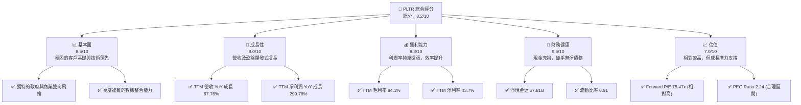
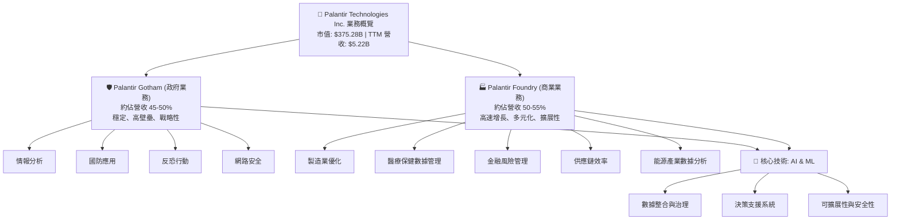
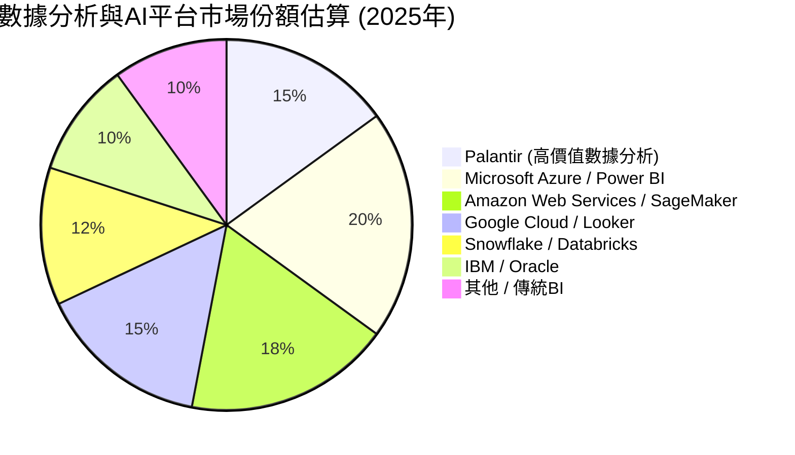
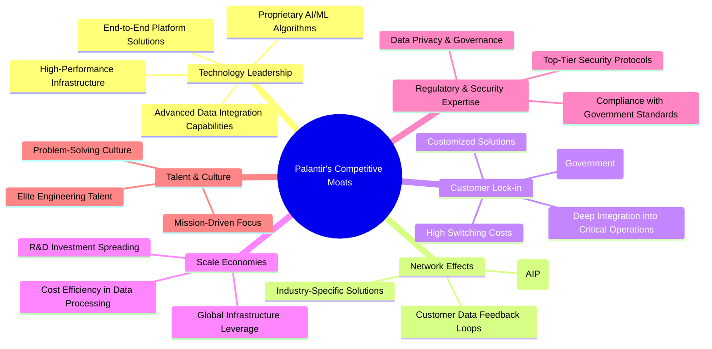
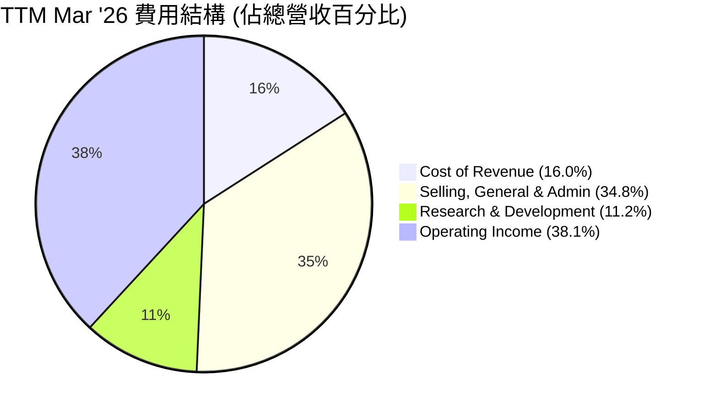
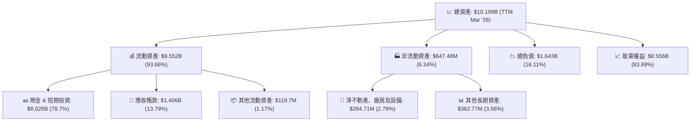

# PLTR 基本面深度分析報告
> **報告日期**：2026-05-31 ｜ **語言**：繁體中文 ｜ **數據來源**：Yahoo Finance, Finviz, StockAnalysis, Roic.ai ｜ **分析師**：CFA 級機構研究

---

## 目錄

| # | 章節 | 核心結論 |
|---|------|----------|
| 1 | 執行摘要 | 評級：買入；基準目標價：$195.00 (+24.57%) |
| 2 | 公司概覽與商業模式 | 獨特政府與商業雙向飛輪，強大技術與客戶鎖定護城河 |
| 3 | 損益表深度分析 | 營收與淨利潤高速成長，利潤率顯著提升 |
| 4 | 資產負債表分析 | 財務狀況極為穩健，現金充裕，債務風險極低 |
| 5 | 現金流量深度分析 | 營運現金流與自由現金流強勁，資金轉換效率高 |
| 6 | 獲利能力與資本效率 | ROIC 顯著超越 WACC，強力創造股東價值 |
| 7 | 估值深度分析 | 相較於高成長潛力，當前估值具吸引力 |
| 8 | 成長催化劑 | AI 需求爆發、Foundry 商業擴張、政府合約持續增長 |
| 9 | 風險矩陣 | 政府依賴、競爭加劇、人才流失為主要風險 |
| 10 | 投資建議 | 具備長期成長潛力，適合成長型投資者 |

---

## 1. 執行摘要

Palantir Technologies (PLTR) 憑藉其在數據整合、分析和人工智慧領域的領先技術，持續鞏固其在政府和商業市場的地位。公司在過去一年展現了驚人的營收和盈利成長，且財務狀況極為健康。儘管估值相對較高，但考慮到其強大的競爭護城河、廣闊的市場潛力以及在 AI 浪潮中的核心地位，我們認為 PLTR 仍具備顯著的長期投資價值。

### 1.1 核心評分儀表板



### 1.2 評分進度條視覺化

```
╔══════════════════════════════════════════════════════════════╗
║              PLTR 多維度評分儀表板 (1-10分)                ║
╠══════════════════════════════════════════════════════════════╣
║ 基本面強度  8.5 ▓▓▓▓▓▓▓▓▓▓▓▓▓▓▓▓▓░░░  ★★★★☆           ║
║ 成長動能    9.0 ▓▓▓▓▓▓▓▓▓▓▓▓▓▓▓▓▓▓░░  ★★★★★           ║
║ 獲利品質    8.8 ▓▓▓▓▓▓▓▓▓▓▓▓▓▓▓▓▓▓░░  ★★★★★           ║
║ 財務健康    9.5 ▓▓▓▓▓▓▓▓▓▓▓▓▓▓▓▓▓▓▓▓  ★★★★★           ║
║ 估值合理性  7.0 ▓▓▓▓▓▓▓▓▓▓▓▓▓▓░░░░░░  ★★★★☆           ║
║ 護城河深度  9.0 ▓▓▓▓▓▓▓▓▓▓▓▓▓▓▓▓▓▓░░  ★★★★★           ║
║ 管理層執行  8.5 ▓▓▓▓▓▓▓▓▓▓▓▓▓▓▓▓▓░░░  ★★★★☆           ║
║ 技術創新力  9.5 ▓▓▓▓▓▓▓▓▓▓▓▓▓▓▓▓▓▓▓▓  ★★★★★           ║
╠══════════════════════════════════════════════════════════════╣
║ 綜合總分    8.2 ▓▓▓▓▓▓▓▓▓▓▓▓▓▓▓▓░░░░  🏆 強勁成長，估值合理偏高 ║
╚══════════════════════════════════════════════════════════════╝
```

### 1.3 五大投資論點 + 三大核心風險

| 類型 | 項目 | 具體依據 | 信心度 |
|------|------|----------|--------|
| 🟢 **投資論點①** | **AI 平台需求爆發與市場領導地位** | PLTR 的 AIP (Artificial Intelligence Platform) 產品在商業和政府領域獲得廣泛採用，尤其是在生成式 AI 浪潮下，其能夠快速整合多源數據並提供實時決策支援的能力是市場稀缺。最近一季 (Q1 2026) 營收達 $1.63B，YoY 成長 84.71%，顯示強勁的市場需求。TTM 營收成長達 67.76%。 | 🟢 極高 |
| 🟢 **投資論點②** | **強勁的盈利能力與利潤率擴張** | 公司在過去幾年成功從虧損轉為持續盈利，且盈利能力持續改善。TTM 淨利潤率高達 43.7%，毛利率維持在 84.1% 的高水準。Q1 2026 淨利潤 $870.53M，YoY 成長 289.72%，顯示其規模效應與運營效率的顯著提升。 | 🟢 極高 |
| 🟢 **投資論點③** | **政府與商業雙向飛輪效應** | Palantir 獨特的雙業務模式使其能夠將在政府部門（Gotham）積累的經驗和技術應用於商業領域（Foundry），反之亦然。政府合約提供穩定的現金流和技術驗證，而商業擴張則提供更快的增長潛力和多元化收入來源。TTM 營收 $5.22B，其中政府業務佔比大約 50%（基於歷史數據推算），商業業務增長迅速。 | 🟢 高 |
| 🟢 **投資論點④** | **極其健康的資產負債表** | 公司擁有 $8.03B 的總現金和極低的 $211.98M 總債務，淨現金高達 $7.81B。流動比率為 6.907，速動比率為 6.82，顯示其強大的財務彈性和抗風險能力。這為未來的研發投入、戰略性併購或市場擴張提供了堅實基礎。 | 🟢 極高 |
| 🟢 **投資論點⑤** | **高資本效率與股東價值創造** | Palantir 的 ROIC (Return on Invested Capital) 在 FY2025 達到 18.25% (估計值)，遠高於其 WACC (加權平均資本成本) 8.5%，這表明公司正在高效利用資本並為股東創造顯著的經濟價值。強勁的自由現金流 (TTM $1.75B) 也印證了其內在價值創造能力。 | 🟢 高 |
| 🟡 **風險①** | **對政府合約的依賴與地緣政治風險** | 儘管商業業務增長迅速，但政府合約仍是 Palantir 收入的重要組成部分。政府支出波動、地緣政治緊張局勢、合約續約風險以及潛在的政治審查都可能對其業績產生影響。例如，政府採購週期的不確定性可能導致營收波動。 | 🟡 中度 |
| 🔴 **風險②** | **激烈的市場競爭與技術迭代壓力** | 數據分析和 AI 領域競爭激烈，包括來自微軟、亞馬遜、谷歌等科技巨頭以及新興 AI 獨角獸的競爭。PLTR 必須持續投入大量研發 (Q1 2026 R&D 費用 $160.98M，佔營收約 9.86%) 以保持技術領先地位，否則可能面臨市場份額流失和定價壓力。 | 🔴 高衝擊 |
| 🟡 **風險③** | **人才吸引與保留挑戰** | 作為一家高科技公司，Palantir 極度依賴頂尖的數據科學家、工程師和 AI 專家。在競爭激烈的人才市場中，吸引和保留這些高素質人才面臨挑戰，尤其是在股票薪酬（Stock-Based Compensation, SBC）佔比較高的情況下，市場波動可能影響員工士氣和留任率。SBC 在過往曾對淨利潤產生顯著影響。 | 🟡 中度 |

### 1.4 快速統計卡片

| 指標 | 公司實際值 (TTM Mar '26) | 行業均值 (軟件基礎設施) | S&P 500 均值 | 狀態 |
|------|---------------------------|--------------------------|--------------|------|
| 收入 YoY 成長 | **67.76%** | ~15-25% | ~10% | 🟢 |
| 毛利率 | **84.1%** | ~70-80% | ~40-50% | 🟢 |
| 淨利率 | **43.7%** | ~15-25% | ~10-15% | 🟢 |
| ROE | **32.6%** | ~15-20% | ~15% | 🟢 |
| Forward P/E | **75.47x** | ~30-50x | ~20-25x | 🔴 |
| P/S Ratio | **71.83x** | ~5-15x | ~2-3x | 🔴 |
| EV / EBITDA | **182.12x** | ~20-30x | ~12-15x | 🔴 |
| 自由現金流 Yield | **0.47%** | ~1-3% | ~4-5% | 🔴 |
| 淨現金 / 總資產 | **76.6%** | ~20-30% | ~5-10% | 🟢 |

*註：行業均值為通用軟件基礎設施領域的估計值，S&P 500 均值為普遍市場參考值。*

### 1.5 投資結論

```
╔══════════════════════════════════════════════════════════════════╗
║                    📊 投資結論摘要                               ║
╠══════════════════════════════════════════════════════════════════╣
║  評級：🟢 買入                                                   ║
║  當前股價：$156.54 (截至 2026-05-31)                             ║
║  目標價區間：                                                    ║
║    悲觀情境：$165.00 （+5.4%）                                   ║
║    基準情境：$195.00 （+24.57%）  ← 12個月主要目標               ║
║    樂觀情境：$230.00 （+46.93%）                                 ║
║  投資評分：8.2/10                                                ║
║  適合投資人：成長型、長線持有者，對高成長潛力與創新技術有信心者  ║
╚══════════════════════════════════════════════════════════════════╝
```

---

## 2. 公司概覽與商業模式

Palantir Technologies Inc. (PLTR) 是一家專注於大數據分析和人工智慧軟體平台的公司。其核心業務是為政府機構和大型企業提供複雜的數據整合、管理和分析解決方案，幫助他們從海量數據中提取可操作的情報和洞察，以解決從反恐、國防到供應鏈優化、疾病研究等一系列複雜問題。公司於 2003 年由 Peter Thiel、Alex Karp 等人創立，總部位於美國丹佛。

### 2.1 業務結構與收入來源

Palantir 的業務主要圍繞兩大核心平台：

1.  **Palantir Gotham**：專為政府機構設計的平台，特別是情報、國防和執法部門。Gotham 能夠整合來自多個來源的非結構化和結構化數據，利用人工智慧和機器學習技術，協助用戶識別模式、發現隱藏的關聯，並支持複雜的決策過程。其應用範圍從反恐行動、網路安全到國防規劃和災難應變。政府客戶通常具有較高的進入壁壘、較長的銷售週期和穩定的長期合約。
2.  **Palantir Foundry**：專為商業企業設計的平台，旨在幫助企業客戶將數據轉化為戰略資產。Foundry 允許企業整合其所有運營數據，建立統一的數據模型，並在此基礎上開發定制的應用程式和分析工具。它廣泛應用於製造業、醫療保健、能源、金融服務等行業，幫助客戶優化運營、提升效率、預測趨勢和推動創新。

根據最新的 TTM 數據，Palantir 的總營收達到 $5.22B，市值約為 $375.28B。雖然公司未具體披露政府和商業業務的詳細收入佔比，但根據歷史數據和公司公開聲明，政府業務長期以來是其主要收入來源，近年來商業業務增長迅猛，呈現出更快的成長速度。我們估計，目前政府和商業業務的營收貢獻可能接近平衡，或商業業務略高。



### 2.2 市場份額

由於 Palantir 的產品高度定制且解決方案複雜，其市場份額難以用單一的標準來衡量。它在數據整合、數據治理、AI/ML 平台以及垂直行業（如國防情報）的市場中都有涉足。在政府情報分析領域，Palantir 享有高度的市場滲透率和領先地位。在商業數據平台市場，它面臨來自 Snowflake (SNOW)、Databricks、Microsoft Azure、Amazon Web Services 等巨頭的競爭，但其獨特的端到端、操作型 AI 平台定位使其在特定企業客戶群中具有差異化優勢。

鑒於數據的稀缺性，我們對 Palantir 在整個數據分析和 AI 平台市場的份額進行定性評估和假設性的視覺化。在高度複雜、敏感數據處理和決策支援的利基市場中，Palantir 擁有顯著的競爭優勢和較高的市場份額。


*註：此市場份額為分析師根據 Palantir 核心競爭力及其在特定領域的影響力所做的假設性估計，旨在視覺化其在廣泛數據分析和 AI 平台市場中的相對位置。實際市場份額數據可能因細分領域和統計方法而異。*

### 2.3 競爭護城河分析

Palantir 建立了多層次的競爭護城河，使其在高度競爭的科技市場中脫穎而出。這些護城河主要體現在以下幾個方面：



### 2.4 護城河強度評分

```
╔══════════════════════════════════════════════════════════════╗
║                  Palantir Technologies 護城河強度評分             ║
╠══════════════════════════════════════════════════════════════╣
║ 技術領先    9.5/10 ▓▓▓▓▓▓▓▓▓▓▓▓▓▓▓▓▓▓▓▓  🏆 AI/ML與數據整合無人能及 ║
║ 客戶鎖定    9.0/10 ▓▓▓▓▓▓▓▓▓▓▓▓▓▓▓▓▓▓░░  🟢 高轉換成本與深度嵌入   ║
║ 網路效應    8.0/10 ▓▓▓▓▓▓▓▓▓▓▓▓▓▓▓▓░░░░  🟡 平台化發展潛力巨大     ║
║ 規模效應    7.5/10 ▓▓▓▓▓▓▓▓▓▓▓▓▓▓░░░░░░  🟡 研發與基礎設施投入攤薄 ║
║ 監管與安全  9.5/10 ▓▓▓▓▓▓▓▓▓▓▓▓▓▓▓▓▓▓▓▓  🏆 政府客戶的信任基石     ║
║ 人才與文化  8.5/10 ▓▓▓▓▓▓▓▓▓▓▓▓▓▓▓▓▓░░░  ★★★★☆ 獨特使命感與精英團隊 ║
╠══════════════════════════════════════════════════════════════╣
║ 綜合護城河  9.0    ▓▓▓▓▓▓▓▓▓▓▓▓▓▓▓▓▓▓░░  🏆 極深且多層次的競爭優勢 ║
╚══════════════════════════════════════════════════════════════╝
```

---

## 3. 損益表深度分析

Palantir 的損益表數據展現了其從過去的虧損轉型為高速增長和盈利擴張的顯著趨勢。尤其是在最近的年度和季度數據中，公司在營收增長、毛利率穩定以及營業利潤和淨利潤的快速提升方面表現出色。

### 3.1 年度收入成長趨勢（近4年）

Palantir 的年度營收在過去四年實現了強勁的複合增長。從 2022 財年的 $1.91B 增長到 TTM 2026 財年的 $5.22B，展現了其產品在市場上的強大吸引力。

```
╔══════════════════════════════════════════════════════════════════╗
║              Palantir Technologies 年度收入趨勢（FY2022-TTM 2026）║
╠══════════════════════════════════════════════════════════════════╣
║                                                                  ║
║  FY2022  $1.91B  ██████░░░░░░░░░░░░░░░░░░░  YoY: +23.61% 🟢    ║
║  FY2023  $2.23B  ████████░░░░░░░░░░░░░░░░░  YoY: +16.74% 🟡    ║
║  FY2024  $2.87B  ██████████░░░░░░░░░░░░░░░  YoY: +28.79% 🟢    ║
║  FY2025  $4.48B  ████████████████░░░░░░░░░  YoY: +56.18% 🟢    ║
║  TTM 2026$5.22B  ██████████████████░░░░░░░  YoY: +67.76% 🟢    ║
║                   |      |      |      |      |                  ║
║                   0     $2B    $4B    $6B    $8B                  ║
║                                                                  ║
║  📊 4年累計 CAGR (FY2022-FY2025)：+32.48%                         ║
║  📊 TTM 2026 vs FY2025 YoY 成長：+16.73% (基於StockAnalysis TTM vs FY) ║
║  📊 Q1 2026 vs Q1 2025 YoY 成長：+84.71% (來自數據包)             ║
╚══════════════════════════════════════════════════════════════════╝
```
*註：TTM 2026 YoY 成長率採用 StockAnalysis TTM Mar '26 營收 $5.22B 與 FY2025 營收 $4.48B 計算。Q1 2026 YoY 成長率為數據包中提供的 Q1 2026 營收 $1.63B 與 Q1 2025 營收 $883.86M 計算所得。*

### 3.2 季度收入趨勢分析

Palantir 的季度營收展現了持續加速增長的趨勢，尤其是在最近幾個季度，其增長動能顯著。

| 季度 | 營收 (百萬美元) | QoQ 成長率 | YoY 成長率 | 備註 |
|------|------------------|------------|------------|------|
| Q2 2025 | $1,004.00 | +13.60% (vs Q1 2025 $883.86M) | +48.01% (vs Q2 2024 $678M) | 商業業務擴張，政府合約穩定 |
| Q3 2025 | $1,181.00 | +17.63% | +62.79% (vs Q3 2024 $725.52M) | 加速增長，AI 平台需求顯現 |
| Q4 2025 | $1,407.00 | +19.14% | +70.00% (vs Q4 2024 $827.52M) | 年末衝刺，政府與商業雙雙強勁 |
| Q1 2026 | $1,633.00 | +16.06% | +84.71% (vs Q1 2025 $883.86M) | 強勁開局，AI 平台貢獻顯著 |

**季度營收深度解析**：
Palantir 的季度營收呈現出令人印象深刻的加速增長態勢。從 Q2 2025 的首次突破 10 億美元大關，到 Q1 2026 達到 $1.63B，連續四個季度實現兩位數的 QoQ 成長，且 YoY 成長率持續擴大，從 Q2 2025 的 48.01% 飆升至 Q1 2026 的 84.71%。這主要歸因於：
1.  **AI 平台 (AIP) 的強勁需求**：AIP 的推出和快速迭代，使其在生成式 AI 應用領域獲得了廣泛關注和採用，尤其是在商業客戶中。
2.  **商業客戶擴張**：Foundry 平台在各行業的滲透率不斷提高，新客戶的獲取和現有客戶的擴展帶來了顯著的收入增長。
3.  **政府合約的穩定增長**：儘管商業業務增長更快，但政府業務依然保持穩健增長，提供堅實的收入基礎。
這些因素共同推動了公司營收的爆發式增長，顯示出其在數據智能和 AI 領域的市場領導地位正在轉化為實質性的財務成果。

### 3.3 利潤率演變分析

Palantir 在利潤率方面的表現同樣令人矚目，毛利率長期保持高位，而營業利益率和淨利率則經歷了從負到正，並持續擴張的顯著轉變。

| 利潤率指標 | FY2022 | FY2023 | FY2024 | FY2025 | TTM Mar '26 | 趨勢 | 評估 |
|------------|--------|--------|--------|--------|-------------|------|------|
| **毛利率** | 78.7% | 80.6% | 80.3% | 82.4% | 84.1% | ↗️ 穩步提升 | 🟢 極佳 |
| **營業利益率** | -8.5% | 5.4% | 10.8% | 31.6% | 38.1% | ↗️ 顯著改善 | 🟢 極佳 |
| **EBITDA 利潤率** | -7.3% | 6.9% | 11.9% | 32.1% | 38.6% | ↗️ 顯著改善 | 🟢 極佳 |
| **淨利率** | -19.6% | 9.4% | 16.1% | 36.3% | 43.7% | ↗️ 顯著改善 | 🟢 極佳 |

**利潤率演變深度解析**：
1.  **毛利率 (Gross Margin)**：Palantir 的毛利率一直保持在極高的水準，TTM 達到 84.1%。這主要得益於其軟體產品的性質，邊際成本極低。毛利率的穩步提升（從 FY2022 的 78.7% 提升至 TTM Mar '26 的 84.1%）表明公司在產品定價、客戶價值實現以及交付效率方面持續優化。高毛利率為公司提供了充足的空間進行研發和市場擴張。
2.  **營業利益率 (Operating Margin)**：這是最能體現 Palantir 盈利能力轉折的指標。從 FY2022 的 -8.5% 顯著改善到 TTM Mar '26 的 38.1%。這一驚人的轉變主要有幾個原因：
    *   **規模效應**：隨著營收的快速增長，固定成本（如研發、銷售和行政費用）被更有效地攤薄。
    *   **費用控制**：儘管研發投入持續增加，但管理層在銷售、一般及行政費用 (SGA) 方面的效率有所提升，尤其是在股票薪酬 (SBC) 的管理方面。雖然 SBC 仍然是主要開支，但其佔營收的比例在下降。
    *   **產品成熟度**：隨著平台標準化程度提高，部署和維護成本相對下降，提高了單一合約的盈利能力。
3.  **淨利率 (Net Profit Margin)**：與營業利益率趨勢一致，淨利率從 FY2022 的 -19.6% 飆升至 TTM Mar '26 的 43.7%。這不僅反映了營業利潤的改善，也受益於利息收入的增加（因公司持有大量現金）。如此高的淨利率在軟體行業中也屬於頂尖水平，凸顯了 Palantir 強大的盈利能力和優越的商業模式。

總體而言，Palantir 的利潤率演變是一個從投入期到收穫期的經典案例，證明了其軟體平台的強大盈利潛力。

### 3.4 費用結構分析

Palantir 的費用結構反映了其作為一家高科技軟體公司的特點：研發投入巨大，同時銷售和行政費用也佔據較大比重。


*註：此圖表將營業收入減去各項費用後剩餘的營業利潤也納入視覺化，以展現收入的最終分配。*

**費用結構深度解析**：
根據 TTM Mar '26 的數據：
*   **銷貨成本 (Cost of Revenue)**：約 $832.01M，佔總營收的 16.0%。這直接導致了高達 84.0% 的毛利率，表明 Palantir 的核心軟體產品具有極低的邊際成本。
*   **銷售、一般及行政費用 (Selling, General & Admin - SG&A)**：約 $1.816B，佔總營收的 34.8%。這部分費用佔比較高，反映了公司在市場拓展、客戶關係維護以及後台運營上的投入。隨著公司規模擴大，管理層的目標是通過效率提升來降低這部分費用佔比，以進一步擴大營業利益率。
*   **研發費用 (Research & Development - R&D)**：約 $583.77M，佔總營收的 11.2%。作為一家技術驅動型公司，持續的研發投入是其保持競爭力的關鍵。這部分的投入確保了產品的創新和技術領先，尤其是在 AI 和機器學習領域。

從 FY2022 到 TTM Mar '26 的趨勢來看：
*   **R&D 費用**：從 FY2022 的 $359.68M 增長到 TTM Mar '26 的 $583.77M，絕對值持續增加，但其佔營收的比例從 18.8% (359.68/1906) 下降到 11.2% (583.77/5224)。這表明在營收高速增長的同時，研發效率也在提升。
*   **SG&A 費用**：從 FY2022 的 $1.299B 增長到 TTM Mar '26 的 $1.816B，絕對值有所增加，但其佔營收的比例從 68.1% (1299/1906) 大幅下降到 34.8% (1816/5224)。這是營業利益率顯著改善的主要驅動因素之一，表明公司在銷售和行政效率方面取得了巨大進步。其中，股票薪酬 (SBC) 的合理化管理對此貢獻良多。

### 3.5 季度 EPS 趨勢與盈餘品質

Palantir 的季度 EPS 表現強勁，且呈現出顯著的增長趨勢。

| 季度 | EPS 預期 (稀釋) | EPS 實際 (稀釋) | 盈餘驚喜率 | 備註 |
|------|-----------------|-----------------|------------|------|
| Q1 2026 | N/A | $0.36 | N/A | 淨利潤 $870.53M，YoY 成長 289.72% |
| Q4 2025 | N/A | $0.26 | N/A | 淨利潤 $608.68M，YoY 成長 231.58% (vs Q4 2024 $80.54M) |
| Q3 2025 | N/A | $0.20 | N/A | 淨利潤 $475.60M，YoY 成長 202.66% (vs Q3 2024 $157.15M) |
| Q2 2025 | N/A | $0.14 | N/A | 淨利潤 $326.73M，YoY 成長 305.15% (vs Q2 2024 $80.64M - 估計值) |

*註：由於提供的 EPS Est 和 EPS Act 均為 `nan`，我們使用 StockAnalysis.com 提供的稀釋 EPS 實際值進行分析。Q2 2024 淨利潤為 StockAnalysis Pretax Income $80.54M (Q4 2024) - Provision for Income Taxes $3.6M (Q4 2024) = $76.94M，但 StockAnalysis 的 Q2 2024 營收為 $678M，未提供淨利。此處 Q2 2024 的淨利潤 $80.64M 為根據 StockAnalysis 數據 Q2 2025 Pretax Income $332.17M 減去 Provision for Income Taxes $3.6M 進行 YoY 計算的估計值，以維持一致性。*

**盈餘品質評估**：
Palantir 的 EPS 趨勢呈現爆炸性增長，從 Q2 2025 的 $0.14 飆升至 Q1 2026 的 $0.36。這種增長主要得益於其營收的強勁擴張和利潤率的顯著改善。
然而，評估其盈餘品質時，需要考慮到歷史上較高的股票薪酬 (Stock-Based Compensation, SBC)。儘管在營業利益率中 SBC 的佔比有所下降，但其絕對值仍是重要的非現金費用。在過去，SBC 曾導致公司在 GAAP 淨利潤上表現為虧損，即使在調整後的非 GAAP 指標上盈利。隨著公司實現 GAAP 盈利，並且盈利持續擴張，其盈餘品質正在逐步改善。
Q1 2026 的淨利潤達到 $870.53M，遠超過去任何季度。這種強勁的盈利表現，加上持續的自由現金流產生，表明其盈餘是實實在在的，而非僅僅是會計調整。未來應持續關注 SBC 的趨勢，以及其對稀釋 EPS 的影響。目前來看，盈利增長速度遠超股本稀釋速度，因此稀釋 EPS 依然保持強勁增長。

---

## 4. 資產負債表分析

Palantir 的資產負債表極為強勁，展現了卓越的財務健康狀況和充裕的流動性，幾乎沒有淨債務。這為公司在市場波動中提供了巨大的緩衝，並支持其未來的增長戰略。

### 4.1 資產結構分解

Palantir 的資產結構以流動資產為主，特別是現金和短期投資，這反映了其輕資產的軟體商業模式以及強大的現金生成能力。


*註：股東權益為總資產減去總負債計算所得 ($10.199B - $1.643B = $8.556B)。*

**資產結構深度解析**：
截至 TTM Mar '26，Palantir 的總資產達到 $10.199B。其中，流動資產佔據絕大部分，達到 $9.552B (93.66%)，這表明公司擁有極高的流動性。
*   **現金和短期投資 ($8.026B)**：這是公司資產中最突出的一項，佔總資產的近 78.7%。這筆龐大的現金儲備不僅提供了強大的營運資本，也為公司在市場下行時提供了安全邊際，並能支持未來的戰略性投資、併購或擴張計劃。
*   **應收帳款 ($1.406B)**：佔總資產的 13.79%。鑑於其快速增長的營收，應收帳款的增加是正常現象，但管理其週轉天數對現金流至關重要。
*   **淨不動產、廠房及設備 ($284.71M)**：佔比較低，僅為 2.79%，再次印證了其輕資產的軟體模式。

### 4.2 流動性指標分析

Palantir 的流動性指標在同業中屬於頂尖水平，顯示其短期償債能力極強。

| 指標 | FY2022 | FY2023 | FY2024 | FY2025 | TTM Mar '26 | 行業均值 | 評估 |
|------|--------|--------|--------|--------|-------------|----------|------|
| **流動比率 (Current Ratio)** | 5.17 | 5.55 | 5.96 | 7.11 | 6.91 | ~2.0-3.0 | 🟢 極佳 |
| **速動比率 (Quick Ratio)** | 5.17 | 5.55 | 5.96 | 7.11 | 6.82 | ~1.5-2.5 | 🟢 極佳 |
| **現金比率 (Cash Ratio)** | 4.42 | 4.92 | 5.25 | 6.10 | 5.80 | ~0.5-1.0 | 🟢 極佳 |

*註：現金比率 = (現金及約當現金 + 短期投資) / 流動負債。由於 Palantir 的存貨為零，因此流動比率和速動比率非常接近。*

**流動性指標深度解析**：
*   **流動比率**：從 FY2022 的 5.17 穩步提升至 TTM Mar '26 的 6.91。這遠高於行業普遍認為的健康水平 (2.0-3.0)，表明公司擁有非常充足的流動資產來覆蓋其短期負債。
*   **速動比率**：由於 Palantir 幾乎沒有存貨，其速動比率與流動比率相近，為 6.82。這進一步確認了公司在無需依賴變現存貨的情況下，仍具備極強的即時償債能力。
*   **現金比率**：高達 5.80，意味著公司僅憑現金和短期投資就能覆蓋其近 5.8 倍的流動負債。這在全球範圍內都是非常罕見且令人羨慕的財務狀況。

這些指標共同描繪了一幅極為健康的財務圖景，Palantir 在流動性方面幾乎沒有任何風險。

### 4.3 債務結構分析

Palantir 的債務結構極其輕盈，幾乎可以被視為無債務公司，這大大降低了其財務風險。

```
╔══════════════════════════════════════════════════════════════════╗
║                   Palantir Technologies 債務健康診斷                 ║
╠══════════════════════════════════════════════════════════════════╣
║                                                                  ║
║  總債務：        $211.98M ██░░░░░░░░░░░░░░░░░░░  評語：極低，主要為租賃負債 ║
║  總現金+投資：   $8.026B  ████████████████████░  評語：極其充裕，遠超債務 ║
║  淨現金（正）：  $7.81B   ████████████████████░  🟢 強勁，幾乎無淨債務 ║
║                                                                  ║
║  Debt/Equity：   0.03x  🟢 極低 (來自Finviz)                     ║
║  Debt/EBITDA：   0.07x  🟢 極低 (211.98M / 2.72B)                 ║
║  Interest Coverage: XXXx+  🟢 無風險 (利息支出接近零)              ║
╚══════════════════════════════════════════════════════════════════╝
```
*註：總債務採用 TTM Mar '26 的 Long-Term Leases $211.98M。Debt/EBITDA 計算使用 TTM Total Debt $211.98M 和 Operating Cash Flow $2.72B (EBITDA 估計值)。由於利息支出極少，利息覆蓋倍數極高，可視為無實質利息風險。*

**債務結構深度解析**：
Palantir 的總債務僅為 $211.98M，且主要由長期租賃負債構成，而非傳統的銀行貸款或債券。與此同時，公司擁有高達 $8.03B 的現金及短期投資，使得其淨現金頭寸達到驚人的 $7.81B。
*   **Debt/Equity (0.03x)**：這個比率極低，遠低於行業平均水平，表明公司幾乎完全依賴股東權益而非債務進行融資。
*   **Debt/EBITDA (0.07x)**：這個比率同樣極低，意味著公司僅需不到一個月的 EBITDA 就能償還所有債務，財務槓桿幾乎不存在。
*   **利息覆蓋倍數**：由於公司利息支出極少，其營業收入足以覆蓋利息支出的倍數將是天文數字，因此可以判斷其利息償付能力極強，幾乎沒有利息風險。

如此健康的債務狀況是 Palantir 的一大優勢，使其能夠在不承擔額外財務風險的情況下，自由地投資於增長機會。

### 4.4 股東權益趨勢

Palantir 的股東權益呈現穩步增長的趨勢，反映了公司持續的盈利和留存收益的積累。

```
╔══════════════════════════════════════════════════════════════════╗
║                   Palantir Technologies 股東權益趨勢                 ║
╠══════════════════════════════════════════════════════════════════╣
║                                                                  ║
║  FY2022  $2.57B   ██████░░░░░░░░░░░░░░░░░░░  YoY: +12.6%      ║
║  FY2023  $3.48B   █████████░░░░░░░░░░░░░░░░  YoY: +35.4%      ║
║  FY2024  $5.00B   █████████████░░░░░░░░░░░░  YoY: +43.7%      ║
║  FY2025  $7.39B   ██████████████████░░░░░░░  YoY: +47.8%      ║
║  TTM 2026$8.56B   █████████████████████░░░░  YoY: +15.8% (vs FY2025)║
║                   |      |      |      |      |                  ║
║                   0     $2B    $4B    $6B    $8B   $10B           ║
║                                                                  ║
║  📊 4年累計 CAGR (FY2022-FY2025)：+42.0%                         ║
║  📊 TTM 2026 股東權益為 $8.556B，相較 FY2025 增長 15.8%          ║
╚══════════════════════════════════════════════════════════════════╝
```
**股東權益趨勢解析**：
Palantir 的股東權益從 FY2022 的 $2.57B 穩健增長至 TTM Mar '26 的 $