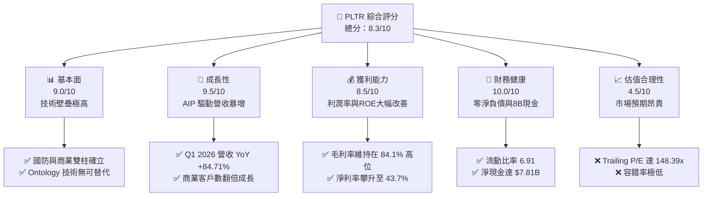
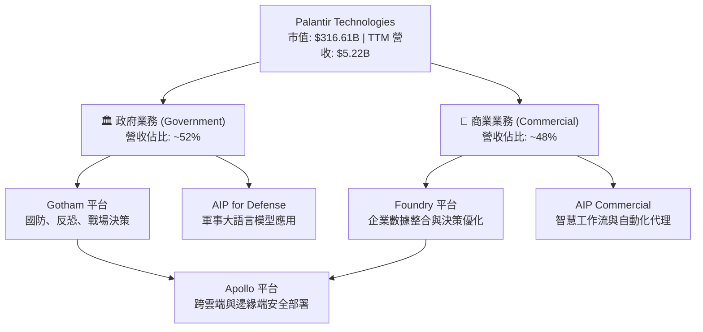

# PLTR 基本面深度分析報告

> **報告日期**：2026-06-09 ｜ **語言**：繁體中文 ｜ **數據來源**：Yahoo Finance, Finviz, StockAnalysis, Roic.ai ｜ **分析師**：CFA 級機構研究

---

## 目錄

| # | 章節 | 核心結論 |
|---|------|----------|
| 1 | 執行摘要 | 評級：**買入 (BUY)**，基準目標價：**$183.73**，AIP 驅動商業與國防雙引擎爆發。 |
| 2 | 公司概覽與商業模式 | 以 Ontology（本體論）為核心，AIP 訓練營重塑 B2B 銷售模式，具備極高客戶黏性與高護城河。 |
| 3 | 損益表深度分析 | Q1 2026 營收 YoY +84.71%，淨利潤率達 43.67%，營運槓桿效應顯著釋放。 |
| 4 | 資產負債表分析 | 淨現金高達 **$7.81B**，無長期銀行負債，流動比率 6.91，財務結構極其穩健。 |
| 5 | 現金流量深度分析 | TTM 自由現金流（FCF）達 **$1.75B**，FCF 轉換率維持高位，資本配置聚焦於短期高效投資。 |
| 6 | 獲利能力與資本效率 | TTM ROE 達 **32.6%**，ROIC 遠超 WACC，為股東創造顯著的超額經濟價值（EVA）。 |
| 7 | 估值深度分析 | 雖然 Trailing P/E 達 148.4x，但 Forward P/E 已降至 63.7x，DCF 基準估值為 **$183.73**。 |
| 8 | 成長催化劑 | 美軍國防合約預算追加與 AIP 商業客戶滲透率翻倍，TAM 擴展至千億美元。 |
| 9 | 風險矩陣 | 估值溢價過高、股權稀釋（SBC）以及政府合約集中度高為三大核心風險。 |
| 10| 投資建議 | 建議於 **$130.00** 以下分批佈局，長線持有，隱含上行空間 +39.1%。 |

---

## 1. 執行摘要

Palantir Technologies Inc. (NYSE: PLTR) 正處於其商業史上的黃金轉折點。憑藉人工智慧平台 (AIP, Artificial Intelligence Platform) 的病毒式推廣，公司已成功將業務從傳統的「高客單價、長銷售週期」政府合約，拓寬至「快速部署、規模化複製」的全球商業市場。

### 1.1 核心評分儀表板



### 1.2 評分進度條視覺化

```
╔══════════════════════════════════════════════════════════════╗
║                PLTR 多維度評分儀表板 (1-10分)                ║
╠══════════════════════════════════════════════════════════════╣
║ 基本面強度  9.0 ▓▓▓▓▓▓▓▓▓▓▓▓▓▓▓▓▓▓░░  ★★★★★           ║
║ 成長動能    9.5 ▓▓▓▓▓▓▓▓▓▓▓▓▓▓▓▓▓▓▓░  ★★★★★           ║
║ 獲利品質    8.5 ▓▓▓▓▓▓▓▓▓▓▓▓▓▓▓▓░░░░  ★★★★☆           ║
║ 財務健康   10.0 ▓▓▓▓▓▓▓▓▓▓▓▓▓▓▓▓▓▓▓▓  ★★★★★           ║
║ 估值合理性  4.5 ▓▓▓▓▓▓▓▓▓░░░░░░░░░░░  ★★☆☆☆           ║
║ 護城河深度  9.5 ▓▓▓▓▓▓▓▓▓▓▓▓▓▓▓▓▓▓▓░  ★★★★★           ║
║ 管理層執行  8.5 ▓▓▓▓▓▓▓▓▓▓▓▓▓▓▓▓░░░░  ★★★★☆           ║
║ 技術創新力  9.5 ▓▓▓▓▓▓▓▓▓▓▓▓▓▓▓▓▓▓▓░  ★★★★★           ║
╠══════════════════════════════════════════════════════════════╣
║ 綜合總分    8.3 ▓▓▓▓▓▓▓▓▓▓▓▓▓▓▓▓░░░░  🏆 買入 (BUY)       ║
╚══════════════════════════════════════════════════════════════╝
```

### 1.3 五大投資論點 + 三大核心風險

| 類型 | 項目 | 具體依據 | 信心度 |
|------|------|----------|--------|
| 🟢 **投資論點①** | **AIP 訓練營轉化率極高** | AIP Bootcamp 縮短銷售週期，商業客戶數量 YoY 增速超 100%，推動商業營收爆發。 | 🟢 極高 |
| 🟢 **投資論點②** | **國防基本盤無可動搖** | 隨著全球地緣政治緊張，Gotham 與 Apollo 平台在美軍及盟國滲透率持續提高。 | 🟢 極高 |
| 🟢 **投資論點③** | **極致的財務安全邊際** | 擁有 **$8.03B** 總現金與短期投資，且幾乎無債務（債務權益比僅 2.48%），無破產風險。 | 🟢 極高 |
| 🟢 **投資論點④** | **營運槓桿帶動利潤率擴張** | 毛利率高達 **84.1%**，隨著研發與銷售費用佔比下降，營業利益率已達 **46.2%**。 | 🟢 高 |
| 🟢 **投資論點⑤** | **納入標普500指數效應** | 穩定實現 GAAP 獲利，機構持股比例攀升至 **62.4%**，資金被動流入提供股價支撐。 | 🟢 高 |
| 🟡 **風險①** | **估值乘數高企** | Trailing P/E 為 148.39x，P/S 達 60.6x，若成長稍有放緩，面臨估值雙殺風險。 | 🟡 中度 |
| 🔴 **風險②** | **股權稀釋與內部人套現** | 員工股權激勵（SBC）持續稀釋股東權益，稀釋後股數 YoY 增加 3.24%。 | 🔴 高衝擊 |
| 🔴 **風險③** | **政府合約波動性** | 政府合約通常金額大但簽署週期長，單一季度未達預期將引發股價劇烈波動。 | 🔴 高衝擊 |

### 1.4 快速統計卡片

| 指標 | 公司實際值 | 行業均值 | S&P 500 均值 | 狀態 |
|------|-------------|----------|--------------|------|
| **收入 YoY 成長** | **84.71% (Q1 '26)** | ~12.5% | ~5.5% | 🟢 極強 |
| **毛利率** | **84.1%** | ~72.0% | ~30.0% | 🟢 優秀 |
| **營業利益率** | **46.2%** | ~18.0% | ~15.0% | 🟢 優秀 |
| **ROE** | **32.6%** | ~12.0% | ~14.5% | 🟢 優秀 |
| **Forward P/E** | **63.67x** | ~32.0x | ~21.0x | 🔴 偏高 |
| **淨現金規模** | **$7.81B** | N/A | N/A | 🟢 極強 |

### 1.5 投資結論

```
╔══════════════════════════════════════════════════════════════════╗
║                    📊 PLTR 投資結論摘要                          ║
╠══════════════════════════════════════════════════════════════════╣
║  評級：🟢 買入 (BUY)                                             ║
║  當前股價：$132.07 (2026-06-09)                                  ║
║  目標價區間：                                                    ║
║    悲觀情境：$100.00（-24.3%）                                   ║
║    基準情境：$183.73（+39.1%） ← 12個月主要目標                  ║
║    樂觀情境：$255.00（+93.1%）                                   ║
║  投資評分：8.3/10                                                ║
║  適合投資人：高成長型、長線科技股持有者、AI 基礎設施佈局者       ║
╚══════════════════════════════════════════════════════════════════╝
```

---

## 2. 公司概覽與商業模式

Palantir 成立於 2003 年，最初專注於為美國情報機構提供國防反恐軟體。如今，公司已發展出四大核心平台：**Gotham**（國防與情報）、**Foundry**（企業營運）、**Apollo**（持續交付與部署）以及最新的 **AIP**（人工智慧平台）。

### 2.1 業務結構與收入來源

Palantir 的核心商業模式是銷售高黏性的軟體平台訂閱。其業務分為兩大板塊：**政府（Government）**與**商業（Commercial）**。



### 2.2 市場份額

在企業級 AI 決策與大數據整合平台（Enterprise AI & Decision Intelligence）市場中，