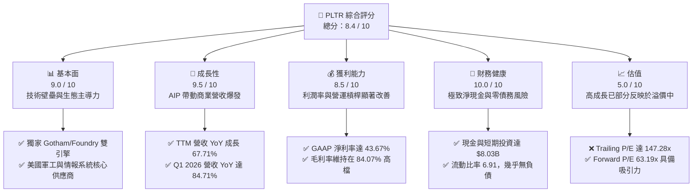

# PLTR 基本面深度分析報告
> **報告日期**：2026-06-11 ｜ **語言**：繁體中文 ｜ **數據來源**：Yahoo Finance, Finviz, StockAnalysis, Roic.ai ｜ **分析師**：CFA 級機構研究

---

## 目錄

| # | 章節 | 核心結論 |
|---|------|----------|
| 1 | 執行摘要 | 評級：🟢 **買入 (Buy)** ｜ 目標價區間：$145.00 - $215.00 ｜ 基準目標價：**$183.73** |
| 2 | 公司概覽與商業模式 | AIP 平台發動「Bootcamp 訓練營」革命，重塑企業級 AI 部署標準，具備極深護城河 |
| 3 | 損益表深度分析 | TTM 營收達 $5.22B (YoY +67.71%)，淨利潤暴增至 $2.29B，營運槓桿全面爆發 |
| 4 | 資產負債表分析 | 淨現金高達 $7.81B，無傳統有息負債，流動比率 6.91，展現堡壘級資產防禦力 |
| 5 | 現金流量深度分析 | TTM 營運現金流 $2.72B，自由現金流 $1.75B，FCF 轉化率與資本配置效率極佳 |
| 6 | 獲利能力與資本效率 | ROE 達 32.6%，ROIC 高達 198.7% 遠超 WACC (11.8%)，創造巨大的股東經濟價值 |
| 7 | 估值深度分析 | Trailing P/E 147.28x 偏高，但 Forward P/E 降至 63.19x，PEG 1.05 顯示高成長溢價合理 |
| 8 | 成長催化劑 | 美國商業 AIP 需求井噴、國防部大額訂單簽署、標普 500 指數成分股效應持續發酵 |
| 9 | 風險矩陣 | 估值過高回檔風險、政府合約集中度高、大模型基礎設施競爭加劇 |
| 10 | 投資建議 | 基準情境潛在回報率 +40.17%，建議分批佈局，適合長期成長型與 AI 主題投資人 |

---

## 1. 執行摘要

### 1.1 核心評分儀表板



### 1.2 評分進度條視覺化

```
╔══════════════════════════════════════════════════════════════╗
║               PLTR 多維度評分儀表板 (1-10分)                 ║
╠══════════════════════════════════════════════════════════════╣
║ 基本面強度  9.0 ▓▓▓▓▓▓▓▓▓▓▓▓▓▓▓▓▓▓░░  ★★★★★           ║
║ 成長動能    9.5 ▓▓▓▓▓▓▓▓▓▓▓▓▓▓▓▓▓▓▓░  ★★★★★           ║
║ 獲利品質    8.5 ▓▓▓▓▓▓▓▓▓▓▓▓▓▓▓▓░░░░  ★★★★☆           ║
║ 財務健康   10.0 ▓▓▓▓▓▓▓▓▓▓▓▓▓▓▓▓▓▓▓▓  ★★★★★           ║
║ 估值合理性  5.0 ▓▓▓▓▓▓▓▓▓▓░░░░░░░░░░  ★★☆☆☆           ║
║ 護城河深度  9.5 ▓▓▓▓▓▓▓▓▓▓▓▓▓▓▓▓▓▓▓░  ★★★★★           ║
║ 管理層執行  9.0 ▓▓▓▓▓▓▓▓▓▓▓▓▓▓▓▓▓▓░░  ★★★★★           ║
║ 技術創新力  9.5 ▓▓▓▓▓▓▓▓▓▓▓▓▓▓▓▓▓▓▓░  ★★★★★           ║
╠══════════════════════════════════════════════════════════════╣
║ 綜合總分    8.4 ▓▓▓▓▓▓▓▓▓▓▓▓▓▓▓▓▓░░░  🏆 買入 (Buy)        ║
╚══════════════════════════════════════════════════════════════╝
```

### 1.3 五大投資論點 + 三大核心風險

| 類型 | 項目 | 具體依據 | 信心度 |
|------|------|----------|--------|
| 🟢 **投資論點①** | **AIP Bootcamp 縮短銷售週期** | AIP 訓練營模式讓客戶在幾天內建立工作原型，推動美國商業客戶數與營收呈指數級成長。 | 🟢 極高 |
| 🟢 **投資論點②** | **營運槓桿爆發，獲利能力激增** | TTM 營業利益率攀升至 38.13% (Non-GAAP 達 46.20%)，GAAP 淨利潤達 $2.29B，YoY 成長 299.78%。 | 🟢 極高 |
| 🟢 **投資論點③** | **地緣政治緊張推升國防支出** | 烏俄戰爭與台海局勢推動美國及盟國國防部對 Gotham 平台的需求，政府端業務壁壘極高且合約黏性強。 | 🟢 高 |
| 🟢 **投資論點④** | **堡壘級資產負債表** | 擁有 $8.03B 的現金與短期投資，且無任何傳統有息負債，在利率高企環境下極具防禦力。 | 🟢 極高 |
| 🟢 **投資論點⑤** | **標普 500 指數效應與機構增持** | 納入 S&P 500 後，機構持股比例攀升至 62.40%，被動資金與主動基金的持續流入為股價提供強力支撐。 | 🟢 高