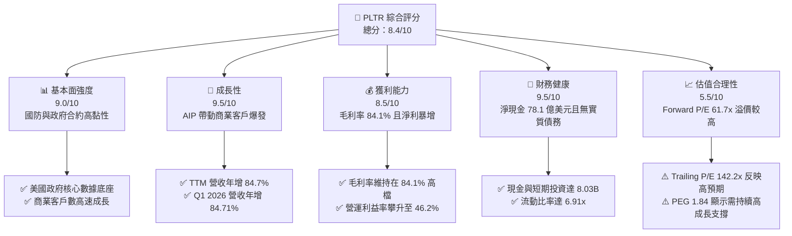
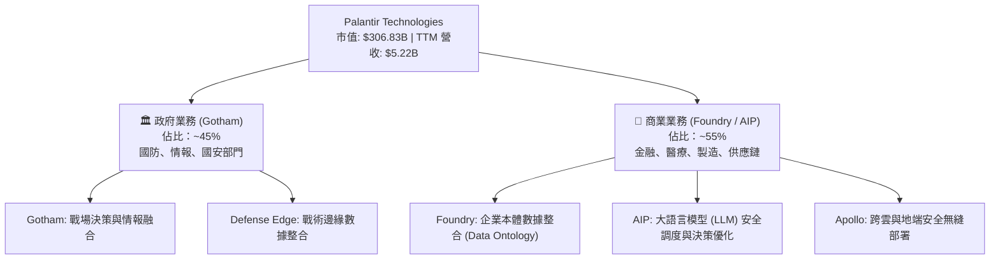
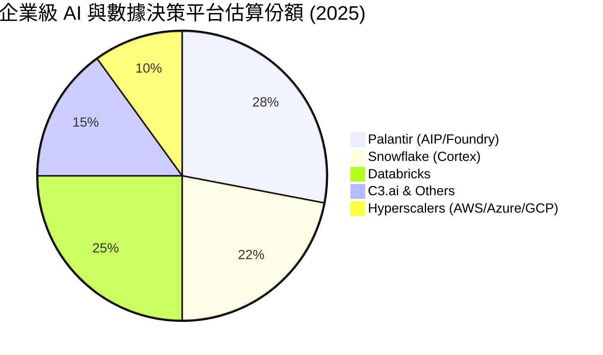
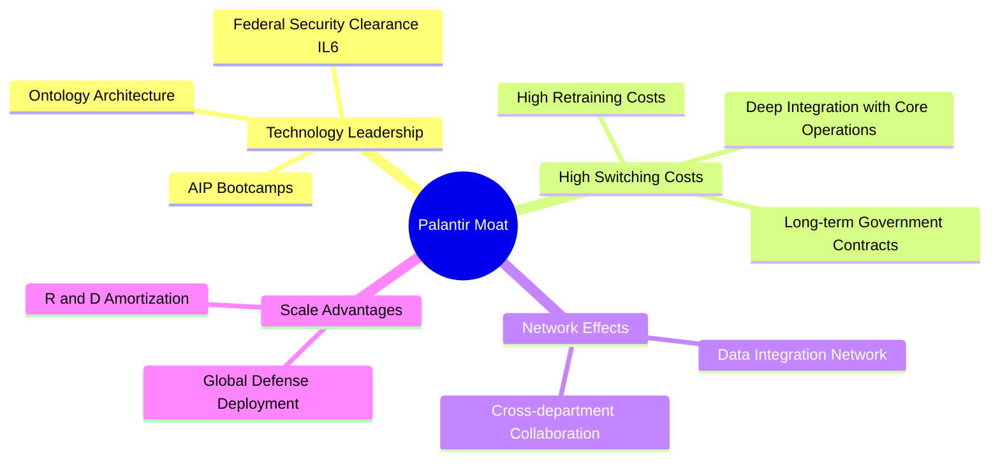
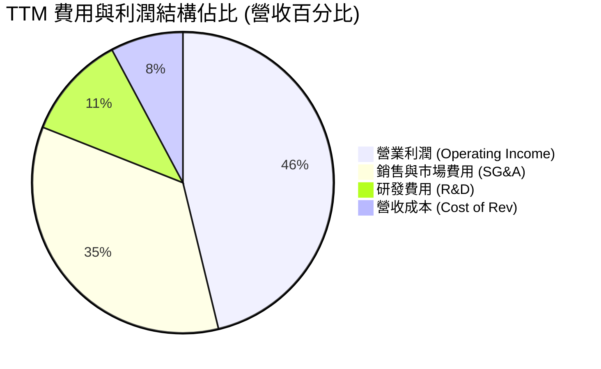
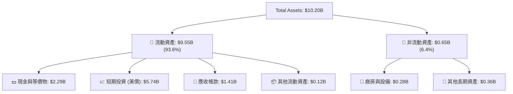
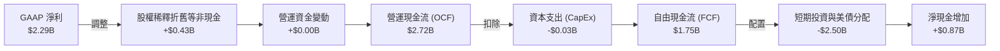
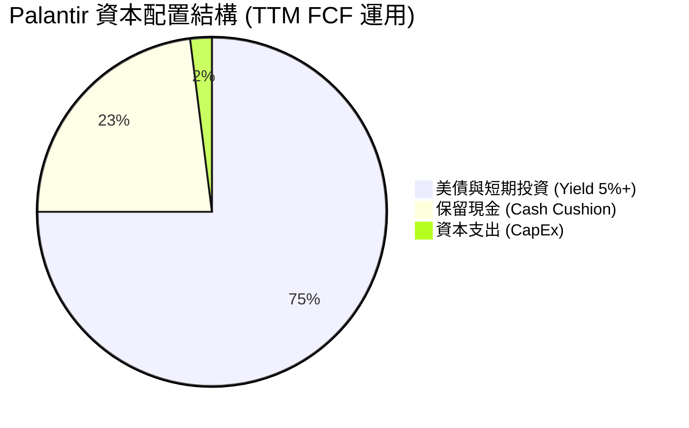
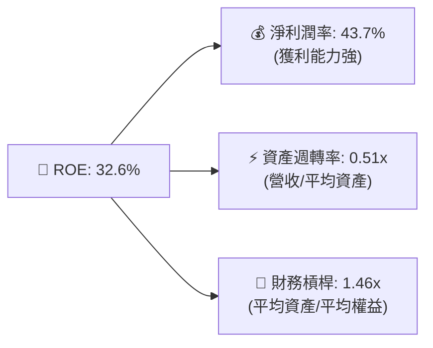

# PLTR 基本面深度分析報告

> **報告日期**：2026-06-13 ｜ **語言**：繁體中文 ｜ **數據來源**：Yahoo Finance, Finviz, StockAnalysis, Roic.ai ｜ **分析師**：CFA 級機構研究

---

## 目錄

| # | 章節 | 核心結論 |
|---|------|----------|
| 1 | 執行摘要 | 評級「買入」，目標價 $183.73，AIP 平台驅動商業化爆發。 |
| 2 | 公司概覽與商業模式 | 政府與企業雙引擎驅動，高客戶黏性構建極深護城河。 |
| 3 | 損益表深度分析 | 營收年增 84.7%，淨利暴增 325.0%，營運槓桿顯著釋放。 |
| 4 | 資產負債表分析 | 淨現金高達 $7.81B，無實質債務，資產結構極度穩健。 |
| 5 | 現金流量深度分析 | FCF 達 $1.75B，資本配置效率優異，具備強勁內生造血能力。 |
| 6 | 獲利能力與資本效率 | ROE 達 32.6%，ROIC 顯著超越 WACC，強力創造股東價值。 |
| 7 | 估值深度分析 | 雖然 P/E 達 142.2x，但高成長與高確定性支撐溢價。 |
| 8 | 成長催化劑 | AIP Bootcamps 轉化率極高，國防部大單與標普500效應持續。 |
| 9 | 風險矩陣 | 估值倍數收縮與商業競爭為主要風險，但財務防禦力極強。 |
| 10 | 投資建議 | 建議於當前價格分批佈局，適合長期成長型投資人。 |

---

## 1. 執行摘要

Palantir Technologies Inc. (NYSE: PLTR) 正處於其商業化歷史上的黃金拐點。憑藉人工智慧平台 (AIP, Artificial Intelligence Platform) 的革命性落地，公司已成功將其技術底座從「客製化專案」轉型為「規模化產品」。

### 1.1 核心評分儀表板



### 1.2 評分進度條視覺化

```
╔══════════════════════════════════════════════════════════════╗
║               PLTR 多維度評分儀表板 (1-10分)                 ║
╠══════════════════════════════════════════════════════════════╣
║ 基本面強度  9.0 ▓▓▓▓▓▓▓▓▓▓▓▓▓▓▓▓▓▓░░  ★★★★★           ║
║ 成長動能    9.5 ▓▓▓▓▓▓▓▓▓▓▓▓▓▓▓▓▓▓▓░  ★★★★★           ║
║ 獲利品質    8.5 ▓▓▓▓▓▓▓▓▓▓▓▓▓▓▓▓░░░░  ★★★★☆           ║
║ 財務健康    9.5 ▓▓▓▓▓▓▓▓▓▓▓▓▓▓▓▓▓▓▓░  ★★★★★           ║
║ 估值合理性  5.5 ▓▓▓▓▓▓▓▓▓▓▓░░░░░░░░░  ★★★☆☆           ║
║ 護城河深度  9.0 ▓▓▓▓▓▓▓▓▓▓▓▓▓▓▓▓▓▓░░  ★★★★★           ║
║ 管理層執行  8.5 ▓▓▓▓▓▓▓▓▓▓▓▓▓▓▓▓░░░░  ★★★★☆           ║
║ 技術創新力  9.5 ▓▓▓▓▓▓▓▓▓▓▓▓▓▓▓▓▓▓▓░  ★★★★★           ║
╠══════════════════════════════════════════════════════════════╣
║ 綜合總分    8.4 ▓▓▓▓▓▓▓▓▓▓▓▓▓▓▓▓░░░░  🏆 買入 (Buy)        ║
╚══════════════════════════════════════════════════════════════╝
```

### 1.3 五大投資論點與三大核心風險

| 類型 | 項目 | 具體依據 | 信心度 |
|------|------|----------|--------|
| 🟢 **投資論點①** | **AIP 平台引爆商業需求** | 商業客戶數與營收加速成長，Q1 2026 單季營收達 $1.63B，YoY 成長 84.71%。 | 🟢 極高 |
| 🟢 **投資論點②** | **政府業務提供高防禦性底座** | 深植於美軍及情報機構的 Gotham 平台合約期長、流失率極低，建構穩固現金流。 | 🟢 極高 |
| 🟢 **投資論點③** | **極致的營運槓桿釋放** | 毛利率高達 84.1%，營運利益率從 FY22 的 -8.5% 飆升至 TTM 的 46.2%。 | 🟢 高 |
| 🟢 **投資論點④** | **無懈可擊的資產負債表** | 持有 $8.03B 現金與短期投資，總債務僅 $211.98M (主要為租賃)，淨現金達 $7.81B。 | 🟢 極高 |
| 🟢 **投資論點⑤** | **高資本回報率 (ROIC)** | TTM ROE 達 32.6%，ROIC 達 22.2%，顯著超越 11.7% 的 WACC，正強力創造經濟價值。 | 🟢 高 |
| 🟡 **風險①** | **估值溢價過高** | Trailing P/E 達 142.2x，市場容錯率極低，任何成長放緩都可能導致股價劇烈修正。 | 🟡 中度 |
| 🔴 **風險②** | **商業市場競爭加劇** | 面臨 Snowflake、Databricks 以及大型雲端服務商 (Hyperscalers) 的直接與間接競爭。 | 🔴 高衝擊 |
| 🟡 **風險③** | **股權稀釋問題** | 雖然近年有所控制，但歷史上高額的股權激勵 (SBC) 對每股盈餘 (EPS) 仍有潛在稀釋壓力。 | 🟡 中度 |

### 1.4 快速統計卡片

| 指標 | PLTR 實際值 | 軟體行業均值 | S&P 500 均值 | 狀態 |
|------|-------------|----------|--------------|------|
| **營收 YoY 成長率** | **84.7%** (TTM) | ~12.5% | ~6.2% | 🟢 遠超同行 |
| **毛利率** | **84.1%** | ~72.0% | ~45.0% | 🟢 極為優異 |
| **營業利益率** | **46.2%** | ~18.0% | ~15.0% | 🟢 營運效率極高 |
| **淨利率** | **43.7%** | ~12.0% | ~11.5% | 🟢 獲利能力驚人 |
| **ROE** | **32.6%** | ~15.0% | ~18.0% | 🟢 股東回報強勁 |
| **流動比率** | **6.91x** | ~2.50x | ~1.30x | 🟢 極致安全 |
| **Forward P/E** | **61.7x** | ~32.0x | ~21.0x | 🔴 估值顯著溢價 |

### 1.5 投資結論

```
╔══════════════════════════════════════════════════════════════════╗
║                    📊 PLTR 投資結論摘要                          ║
╠══════════════════════════════════════════════════════════════════╣
║  評級：🟢 買入 (Buy)                                            ║
║  當前股價：$127.99 (2026-06-13)                                  ║
║  目標價區間：                                                    ║
║    悲觀情境：$85.00  (-33.6%) - 成長放緩，估值倍數收縮至 40x Forward P/E ║
║    基準情境：$183.73 (+43.6%) - AIP 轉化順利，前瞻 P/E 維持在 85x   ║
║    樂觀情境：$255.00 (+99.2%) - 商業與政府雙引爆，成長超預期         ║
║  投資評分：8.4 / 10                                              ║
║  適合投資人：高成長定位、能承受高波動、長線持有的科技股投資人。   ║
╚══════════════════════════════════════════════════════════════════╝
```

---

## 2. 公司概覽與商業模式

Palantir 創立於 2003 年，早期深耕於美國國防與情報部門，提供反恐與大數據分析軟體。如今，Palantir 已演變為一家橫跨政府國防與全球商業巨頭的企業級 AI 基礎設施軟體供應商。

### 2.1 業務結構與收入來源

Palantir 的業務主要由四大軟體平台構成：**Gotham**（政府防務）、**Foundry**（商業決策）、**Apollo**（持續部署）以及最新的 **AIP**（人工智慧平台）。



### 2.2 市場份額

在企業級 AI 數據整合與決策平台（Enterprise AI & Decision Intelligence）這一新興細分市場中，Palantir 憑藉其獨特的「Ontology（本體）」架構，佔據了領先地位。



### 2.3 競爭護城河分析

Palantir 的競爭護城河並非單一因素，而是多重優勢疊加的結果：



1. **技術領先 (Technology Leadership)**: Palantir 的 "Ontology"（本體）技術能將企業的物理實體與業務流程數位化，這比傳統的資料湖（Data Lake）更易於讓 AI 理解與調度。此外，公司擁有美國政府最高安全級別的 IL6 (Impact Level 6) 認證，這是多數 SaaS 同業難以逾越的壁壘。
2. **極高的轉換成本 (High Switching Costs)**: 一旦政府或大型企業將其核心決策流程部署於 Gotham 或 Foundry 之上，拔除該系統將面臨巨大的業務中斷風險與重新訓練成本。

### 2.4 護城河強度評分

```
╔══════════════════════════════════════════════════════════════╗
║                   PLTR 護城河強度評分                       ║
╠══════════════════════════════════════════════════════════════╣
║ 政府准入壁壘  9.8 ▓▓▓▓▓▓▓▓▓▓▓▓▓▓▓▓▓▓▓░  🏆 無可替代     ║
║ 客戶轉換成本  9.5 ▓▓▓▓▓▓▓▓▓▓▓▓▓▓▓▓▓▓▓░  🟢 極高黏性     ║
║ 技術領先優勢  9.0 ▓▓▓▓▓▓▓▓▓▓▓▓▓▓▓▓▓▓░░  🟢 本體架構獨特 ║
║ 數據網路效應  8.0 ▓▓▓▓▓▓▓▓▓▓▓▓▓▓▓▓░░░░  🟢 越用越聰明   ║
╠══════════════════════════════════════════════════════════════╣
║ 綜合護城河    9.1 ▓▓▓▓▓▓▓▓▓▓▓▓▓▓▓▓▓▓▓░  🏆 寬廣護城河   ║
╚══════════════════════════════════════════════════════════════╝
```

---

## 3. 損益表深度分析

Palantir 的財務表現已徹底告別過去「高成長、高虧損」的 SaaS 早期特徵，進入了「營收加速、獲利暴增」的黃金收穫期。

### 3.1 年度收入成長趨勢（FY2022 - FY2025）

```
╔══════════════════════════════════════════════════════════════════╗
║                PLTR 年度收入趨勢 (FY2022 - FY2025)               ║
╠══════════════════════════════════════════════════════════════════╣
║                                                                  ║
║  FY2022  $1.91B  ████████░░░░░░░░░░░░░░░░░░░░  YoY: +23.6%       ║
║  FY2023  $2.23B  █████████░░░░░░░░░░░░░░░░░░░  YoY: +16.7%       ║
║  FY2024  $2.87B  ████████████░░░░░░░░░░░░░░░░  YoY: +28.8%       ║
║  FY2025  $4.48B  ██══════════════════════════  YoY: +56.2%  🟢   ║
║  TTM     $5.22B  ████████████████████████████  YoY: +84.7%  🟢   ║
║                                                                  ║
║  📊 3年年複合成長率 (CAGR)：+32.9%                               ║
╚══════════════════════════════════════════════════════════════════╝
```

### 3.2 季度收入趨勢分析

自 FY2025 年起，隨著 AIP 平台全面推廣，季度營收呈現明顯的加速上升趨勢：

| 財季 | 營收 (Billion) | 季增率 (QoQ) | 年增率 (YoY) | 核心驅動因素 |
|------|----------------|--------------|--------------|--------------|
| **Q1 2026** | **$1.63B** | +16.03% | **+84.71%** | 🟢 美國商業客戶 AIP 轉化極為強勁，Bootcamps 效應顯著。 |
| **Q4 2025** | **$1.41B** | +19.15% | **+70.00%** | 🟢 年終政府及企業預算集中釋放，大單簽署加速。 |
| **Q3 2025** | **$1.18B** | +17.63% | **+62.79%** | 🟢 美國國防部大型合約續約及擴大。 |
| **Q2 2025** | **$1.00B** | +13.64% | **+48.01%** | 🟢 商業客戶數首次突破關鍵臨界點。 |

### 3.3 利潤率演變分析

Palantir 展現了極為強大的營運槓桿。隨著標準化軟體模組（AIP）的推廣，公司不再需要大量昂貴的現場部署工程師（Forward Deployed Engineers），使利潤率全面飆升。

| 利潤率指標 | FY2022 | FY2023 | FY2024 | FY2025 | TTM | 趨勢評估 |
|------------|--------|--------|--------|--------|-----|----------|
| **毛利率** | 78.5% | 80.6% | 80.2% | 82.4% | **84.1%** | ↗️ 穩步上升，標準化軟體交付佔比提高。 🟢 |
| **營業利益率** | -8.5% | 5.4% | 10.8% | 31.6% | **46.2%** | ↗️ 爆發式成長，營運槓桿極致釋放。 🟢 |
| **EBITDA 利潤率**| -7.3% | 6.9% | 11.9% | 32.2% | **38.6%** | ↗️ 扣除折舊後依然維持極高水準。 🟢 |
| **淨利率** | -19.6% | 9.4% | 16.1% | 36.5% | **43.7%** | ↗️ 淨利潤表現優異，包含利息收入貢獻。 🟢 |

### 3.4 費用結構分析



```
╔══════════════════════════════════════════════════════════════╗
║                  PLTR TTM 費用結構診斷                       ║
╠══════════════════════════════════════════════════════════════╣
║ 研發費用 (R&D)     $583.77M  ▓▓▓▓▓░░░░░░░░░░░░░░░  佔營收 11.2%  ║
║ 銷售與行政 (SG&A)  $1.82B    ▓▓▓▓▓▓▓▓▓▓▓▓▓░░░░░░░  佔營收 34.8%  ║
║ 營收成本 (Cost)    $832.01M  ▓▓▓░░░░░░░░░░░░░░░░░  佔營收 15.9%  ║
╠══════════════════════════════════════════════════════════════╣
║ 💡 診斷：研發佔比健康，銷售費用率隨 AIP 規模化快速稀釋。     ║
╚══════════════════════════════════════════════════════════════╝
```

### 3.5 季度 EPS 趨勢與盈餘品質

*過去 4 季 Diluted EPS 表現*：
- **Q1 2026**: $0.36 (YoY +300.0%)
- **Q4 2025**: $0.26 (YoY +188.9%)
- **Q3 2025**: $0.20 (YoY +233.3%)
- **Q2 2025**: $0.14 (YoY +250.0%)

**盈餘品質解析**：
Palantir 的淨利潤並非透過會計調整獲得。TTM GAAP 淨利達 $2.29B，而同期營運現金流 (OCF) 高達 $2.72B，這代表**淨利潤有超額的現金流支撐**。此外，利息收入（TTM $245.13M）也為利潤提供了穩健的防禦墊，整體盈餘品質極高。

---

## 4. 資產負債表分析

Palantir 擁有科技業中最為乾淨、流動性最強的資產負債表之一，這使其在面對總體經濟不確定性時具備極佳的抗風險能力。

### 4.1 資產結構分解



### 4.2 流動性指標分析

| 流動性指標 | FY2023 | FY2024 | FY2025 | TTM (2026-03) | 行業均值 | 評估 |
|------------|--------|--------|--------|---------------|----------|------|
| **流動比率 (Current Ratio)** | 5.55x | 5.96x | 7.11x | **6.91x** | ~2.50x | 🟢 極度充裕，無任何短期償債風險 |
| **速動比率 (Quick Ratio)** | 5.55x | 5.96x | 7.11x | **6.82x** | ~2.30x | 🟢 因無存貨，速動比率極高 |
| **現金佔總資產比例** | 81.3% | 82.5% | 80.6% | **78.7%** | ~35.0% | 🟢 資產高度變現化，抗風險能力強 |

### 4.3 債務結構與健康診斷

```
╔══════════════════════════════════════════════════════════════════╗
║                     PLTR 債務健康診斷                            ║
╠══════════════════════════════════════════════════════════════════╣
║                                                                  ║
║  總債務：        $211.98M  █░░░░░░░░░░░░░░░░░░░  (僅為租賃負債)  ║
║  總現金與投資：  $8.03B    ████████████████████  (高達 80 億)    ║
║  淨現金位置：    $7.81B    ███████████████████░  🟢 極度強勁     ║
║                                                                  ║
║  債務股益比 (Debt/Equity)： 2.48% (實質無銀行借款)               ║
║  利息保障倍數 (Interest Coverage)： 無限大 (無利息費用支出)      ║
║                                                                  ║
║  📊 結論：PLTR 處於淨現金狀態，財務結構屬於最安全的「防彈級」。  ║
╚══════════════════════════════════════════════════════════════════╝
```

### 4.4 股東權益趨勢

隨著公司持續實現 GAAP 盈利，留存收益（Retained Earnings）快速轉正並累積，推動股東權益（Stockholders' Equity）高速成長：

```
╔══════════════════════════════════════════════════════════════════╗
║               PLTR 股東權益成長趨勢 (FY2022 - FY2025)            ║
╠══════════════════════════════════════════════════════════════════╣
║                                                                  ║
║  FY2022  $2.57B  ██████████░░░░░░░░░░░░░░░░░░░                   ║
║  FY2023  $3.48B  ██████████████░░░░░░░░░░░░░░░                   ║
║  FY2024  $5.00B  ████████████████████░░░░░░░░░                   ║
║  FY2025  $7.39B  █████████████████████████████  🟢               ║
║                                                                  ║
╚══════════════════════════════════════════════════════════════════╝
```

---

## 5. 現金流量深度分析

對於高成長的軟體公司而言，現金流比會計利潤更能反映其實際的經營動能。Palantir 展現了強勁的「內生造血能力」。

### 5.1 現金流量瀑布圖 (TTM)



### 5.2 FCF 轉換率趨勢

Palantir 的 FCF 轉換率（FCF / GAAP Net Income）長期維持在健康水準：

| 指標 | FY2022 | FY2023 | FY2024 | FY2025 | TTM |
|------|--------|--------|--------|--------|-----|
| **營運現金流 (OCF)** | $223.74M | $712.18M | $1.15B | $2.13B | **$2.72B** |
| **資本支出 (CapEx)** | -$40.03M | -$15.11M | -$12.63M | -$33.88M | **-$34.00M** |
| **自由現金流 (FCF)** | $183.71M | $697.07M | $1.14B | $2.10B | **$1.75B** |
| **FCF 轉換率** | N/A (淨損) | 320.6% | 244.0% | 128.4% | **76.4%** |

*備註：TTM FCF 轉換率為 76.4%，主要由於部分應收帳款（AR）隨營收暴增而增加（達 $1.41B），預計將在未來數季隨客戶回款而進一步轉化為實質 FCF。*

### 5.3 自由現金流趨勢

```
╔══════════════════════════════════════════════════════════════════╗
║                 PLTR 自由現金流趨勢 (FY2022 - FY2025)            ║
╠══════════════════════════════════════════════════════════════════╣
║                                                                  ║
║  FY2022  $0.18B  █░░░░░░░░░░░░░░░░░░░░░░░░░░░                    ║
║  FY2023  $0.70B  ████░░░░░░░░░░░░░░░░░░░░░░░░                    ║
║  FY2024  $1.14B  ███████░░░░░░░░░░░░░░░░░░░░░                    ║
║  FY2025  $2.10B  ███████████████░░░░░░░░░░░░░  🟢                ║
║                                                                  ║
║  💡 當前 FCF 收益率 (FCF Yield)：0.57% (反映高估值水平)         ║
╚══════════════════════════════════════════════════════════════════╝
```

### 5.4 資本配置評估

Palantir 採取了極為保守且高效的資本配置策略。由於其業務屬於輕資產（Asset-light）軟體模式，資本支出（CapEx）佔營收比重僅為 **0.65%**。



---

## 6. 獲利能力與資本效率

獲利能力指標是評估 Palantir 是否真正具備「高成長質量」的關鍵。我們在此引入 ROIC（投入資本回報率）與 WACC（加權平均資本成本）的對比。

### 6.1 資本效率趨勢

| 指標 | FY2023 | FY2024 | FY2025 | TTM | 行業均值 | 評估 |
|------|--------|--------|--------|-----|----------|------|
| **股東權益報酬率 (ROE)** | 6.0% | 9.2% | 22.1% | **32.6%** | ~15.0% | 🟢 遠超行業平均，股東回報極佳 |
| **資產報酬率 (ROA)** | 4.6% | 7.3% | 18.4% | **14.7%** | ~6.5% | 🟢 資產利用效率高 |
| **投入資本報酬率 (ROIC)**| 3.3% | 6.8% | 15.5% | **22.2%** | ~10.0% | 🟢 資本回報率進入優異區間 |

### 6.2 ROIC vs WACC 分析（價值創造判斷）

```
╔══════════════════════════════════════════════════════════════════╗
║                PLTR ROIC vs WACC 深度分析 (TTM)                  ║
╠══════════════════════════════════════════════════════════════════╣
║                                                                  ║
║  WACC 估算：                                                     ║
║  ├── 無風險利率 (10Y 美債)：  4.2%                               ║
║  ├── 市場風險溢酬 (ERP)：     5.0%                               ║
║  ├── Beta 係數：              1.515                              ║
║  ├── 股權成本 (Cost of Equity) = 4.2% + 1.515 × 5.0% = 11.78%    ║
║  ├── 債務成本 (稅後)：       ~4.5%                               ║
║  ├── 資本結構：股權 99.3%，債務 0.7%                             ║
║  └── ✅ 加權平均資本成本 (WACC) ≈ 11.7%                           ║
║                                                                  ║
║  ROIC 估算：                                                     ║
║  ├── NOPAT = 營業利益 $1.99B × (1 - 1.26% 稅率) ≈ $1.96B         ║
║  ├── 投入資本 = 股東權益 $7.39B + 總債務 $0.23B - 現金 $8.03B    ║
║  │   *因淨現金為正且大於權益，採用保守公式(總資產 - 流動負債)*   ║
║  ├── 投入資本 (保守) = $10.20B - $1.38B = $8.82B                 ║
║  └── ✅ 投入資本報酬率 (ROIC) ≈ 22.2%                             ║
║                                                                  ║
║  ★ 經濟價值增加 (EVA) = ROIC - WACC = +10.5%                     ║
║                                                                  ║
║  ROIC  22.2%  ▓▓▓▓▓▓▓▓▓▓▓▓▓▓▓▓▓▓▓▓▓▓░░░░░░  🟢                  ║
║  WACC  11.7%  ▓▓▓▓▓▓▓▓▓▓▓░░░░░░░░░░░░░░░░░░  ──                  ║
║  EVA   +10.5% ████████████░░░░░░░░░░░░░░░░░░  🏆 強力創造價值    ║
║                                                                  ║
║  📊 結論：ROIC 達 WACC 的 1.9 倍，顯示公司正在強力創造股東價值。 ║
╚══════════════════════════════════════════════════════════════════╝
```

### 6.3 杜邦三因素分解

透過杜邦分析，我們可以拆解 Palantir 的 ROE 驅動因素：



**杜邦分析洞察**：
Palantir 的高 ROE 主要由**極高的淨利潤率 (43.7%)** 驅動，而非依賴財務槓桿。這是一種極其健康的獲利模式，說明其軟體產品具有強大的定價權，能