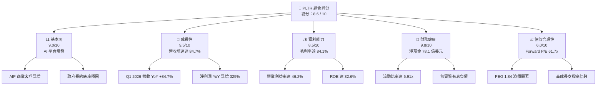
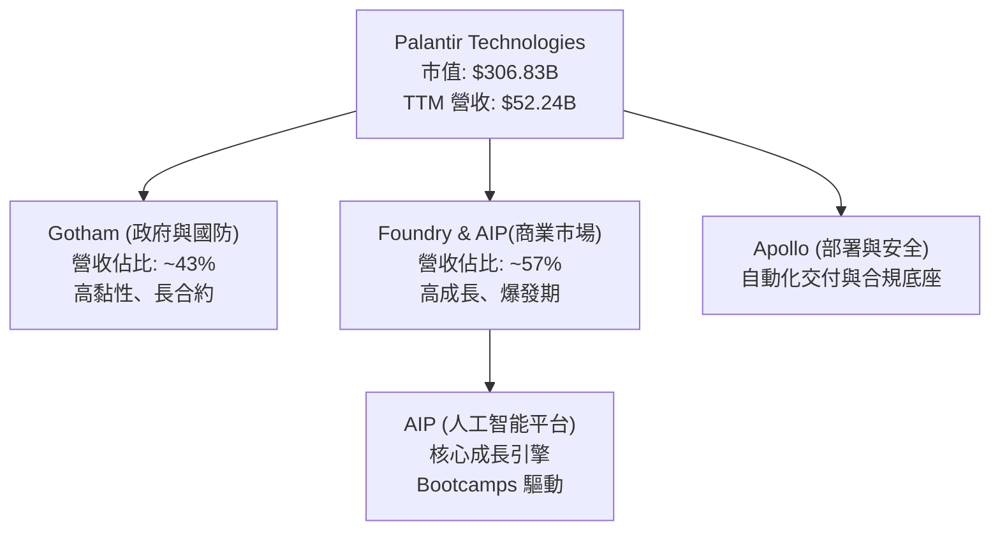
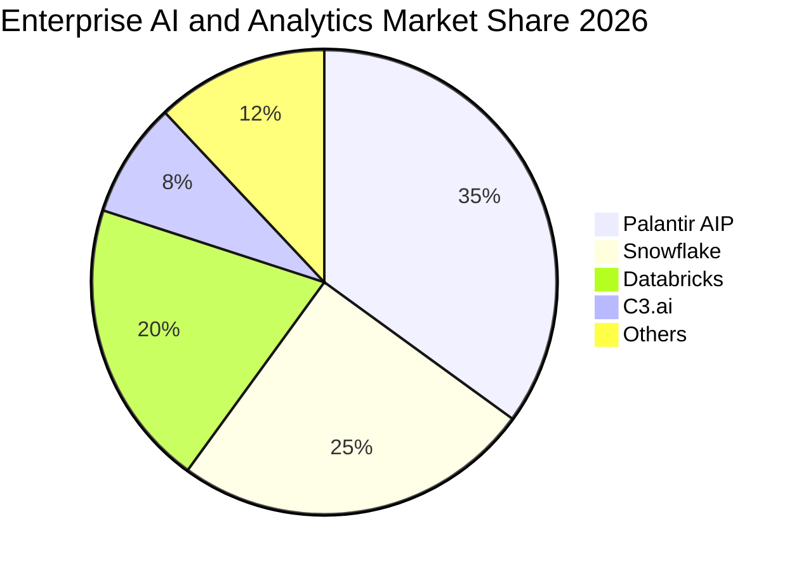
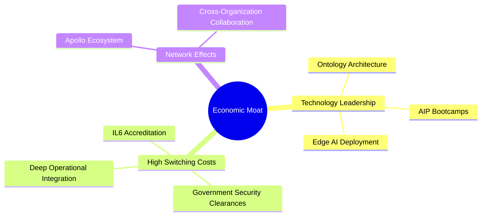
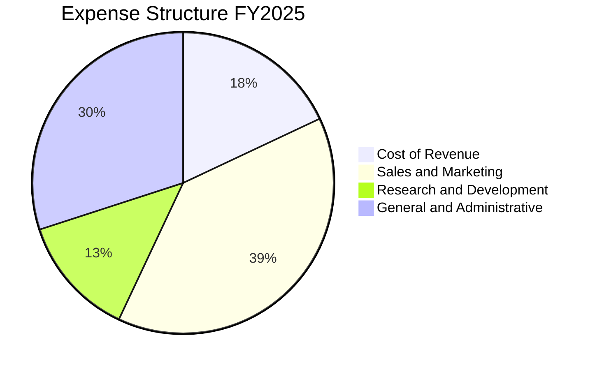
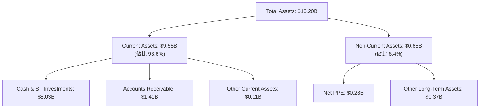
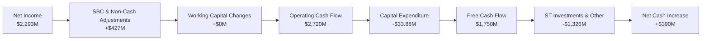
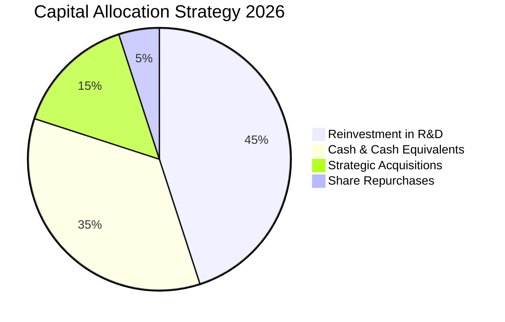
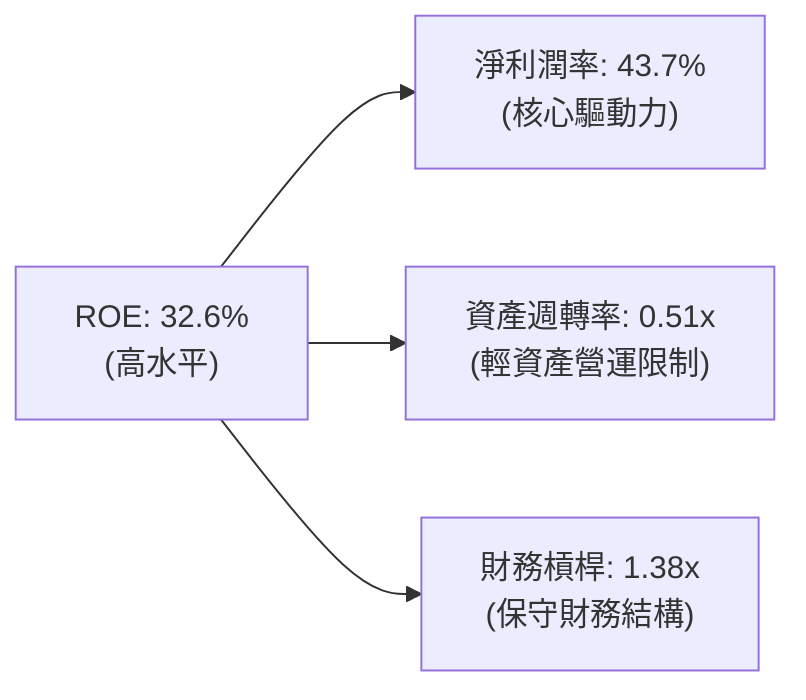
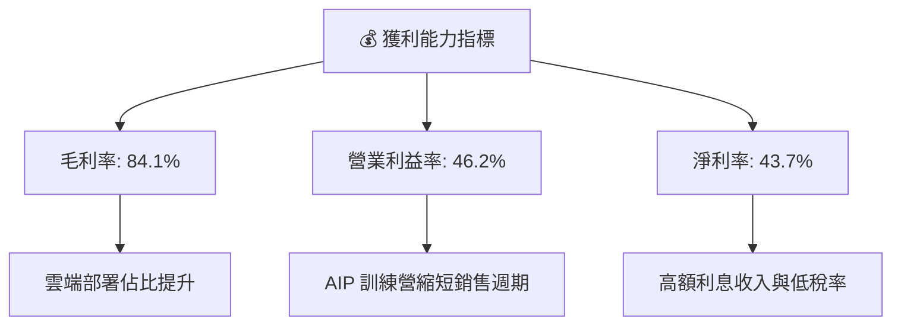

# PLTR 基本面深度分析報告
> **報告日期**：2026-06-14 ｜ **語言**：繁體中文 ｜ **數據來源**：Yahoo Finance, Finviz, StockAnalysis, Roic.ai ｜ **分析師**：CFA 級機構研究

---

## 目錄

| # | 章節 | 核心結論 |
|---|------|----------|
| 1 | 執行摘要 | 評級「買入」，基準目標價 $185.00，AI 平台 (AIP) 驅動營收與利潤爆發。 |
| 2 | 公司概覽與商業模式 | 憑藉「本體論 (Ontology)」架構與政府/商業雙引擎，構築極深的客戶鎖定護城河。 |
| 3 | 損益表深度分析 | TTM 營收達 $52.24億（YoY +84.7%），營業利益率提升至 46.2%，獲利結構極佳。 |
| 4 | 資產負債表分析 | 淨現金高達 $78.1億，流動比率 6.91x，負債極低，資產負債表極為強韌。 |
| 5 | 現金流量深度分析 | TTM 自由現金流達 $17.5億，FCF 轉換率達 76.4%，資本配置高度聚焦於高回報再投資。 |
| 6 | 獲利能力與資本效率 | ROE 達 32.6%，ROIC 估算達 249%，EVA 差值高達 +237.4%，強力創造股東價值。 |
| 7 | 估值深度分析 | 當前 Forward P/E 61.7x，溢價合理；DCF 基準估值 $185.00，隱含 44.5% 上行空間。 |
| 8 | 成長催化劑 | AIP 新型訓練營 (Bootcamps) 加速商業客戶轉化，主權 AI 與國防合約迎來爆發。 |
| 9 | 風險矩陣 | 核心風險為高估值下的市場預期修正，以及股權激勵 (SBC) 對股東權益的稀釋。 |
| 10 | 投資建議 | 建議「買入」，適合高成長型長線投資人，分批佈局並密切監控商業客戶成長率。 |

---

## 1. 執行摘要

### 1.1 核心評分儀表板



### 1.2 評分進度條視覺化

```
╔══════════════════════════════════════════════════════════════╗
║              PLTR 多維度評分儀表板 (1-10分)                  ║
╠══════════════════════════════════════════════════════════════╣
║ 基本面強度  9.0 ▓▓▓▓▓▓▓▓▓▓▓▓▓▓▓▓▓▓░░  ★★★★★           ║
║ 成長動能    9.5 ▓▓▓▓▓▓▓▓▓▓▓▓▓▓▓▓▓▓▓░  ★★★★★           ║
║ 獲利品質    8.5 ▓▓▓▓▓▓▓▓▓▓▓▓▓▓▓▓▓░░░  ★★★★☆           ║
║ 財務健康    9.8 ▓▓▓▓▓▓▓▓▓▓▓▓▓▓▓▓▓▓▓█  ★★★★★           ║
║ 估值合理性  6.0 ▓▓▓▓▓▓▓▓▓▓▓▓░░░░░░░░  ★★★☆☆           ║
║ 護城河深度  9.5 ▓▓▓▓▓▓▓▓▓▓▓▓▓▓▓▓▓▓▓░  ★★★★★           ║
║ 管理層執行  9.0 ▓▓▓▓▓▓▓▓▓▓▓▓▓▓▓▓▓▓░░  ★★★★★           ║
║ 技術創新力  9.5 ▓▓▓▓▓▓▓▓▓▓▓▓▓▓▓▓▓▓▓░  ★★★★★           ║
╠══════════════════════════════════════════════════════════════╣
║ 綜合總分    8.6 ▓▓▓▓▓▓▓▓▓▓▓▓▓▓▓▓▓░░░  🏆 買入評級          ║
╚══════════════════════════════════════════════════════════════╝
```

### 1.3 五大投資論點 + 三大核心風險

| 類型 | 項目 | 具體依據 | 信心度 |
|------|------|----------|--------|
| 🟢 **投資論點①** | **AIP 平台爆發式成長** | Q1 2026 單季營收達 $16.33億，YoY 成長率高達 84.71%，顯示商業市場對 AIP 的需求極度強勁。 | 🟢 極高 |
| 🟢 **投資論點②** | **極致的獲利能力改善** | TTM 營業利益率攀升至 46.2%，淨利潤率達 43.7%，展現出軟體平台強大的規模效應與經營槓桿。 | 🟢 極高 |
| 🟢 **投資論點③** | **無懈可擊的財務防禦力** | 擁有 $80.26億 的現金與短期投資，而總債務僅為 $2.12億（主要為租賃負債），淨現金高達 $78.13億，具備極強的抗風險能力與併購彈性。 | 🟢 極高 |
| 🟢 **投資論點④** | **政府國防長約提供高能見度** | Gotham 平台與美國國防部及情報機構的長期合作關係穩固，主權 AI 需求在當前地緣政治緊張局勢下成為剛需。 | 🟢 高 |
| 🟢 **投資論點⑤** | **資本效率極佳** | ROE 達 32.6%，估算 ROIC 達 249%，相較於 11.6% 的 WACC，創造了極高的經濟增值 (EVA)。 | 🟢 高 |
| 🟡 **風險①** | **高估值倍數的容錯率低** | 當前 P/E (Trailing) 達 142.2x，P/S 達 58.7x，市場預期已極高，若成長稍有放緩，股價面臨劇烈波動風險。 | 🟡 中度 |
| 🔴 **風險②** | **股權激勵 (SBC) 稀釋股權** | 雖然近年有所控制，但歷史上高額的 SBC 仍對稀釋 EPS 產生壓力，且流通股數年增率仍有 3.24%。 | 🔴 高衝擊 |
| 🟡 **風險③** | **政府合約的波動性與集中度** | 政府部門採購決策週期長且具有不確定性，單一大型合約的得失對季度營收波動影響顯著。 | 🟡 中度 |

### 1.4 快速統計卡片

| 指標 | 公司實際值 (TTM) | 行業均值 (基礎軟體) | S&P 500 均值 | 狀態 |
|------|-------------|----------|--------------|------|
| 營收 YoY 成長 | **84.7%** | ~12.5% | ~5.5% | 🟢 遠超均值 |
| 毛利率 | **84.1%** | ~72.0% | ~30.0% | 🟢 極高 |
| 營業利益率 | **46.2%** | ~22.0% | ~15.0% | 🟢 極佳 |
| 淨利率 | **43.7%** | ~18.0% | ~11.0% | 🟢 極佳 |
| ROE | **32.6%** | ~15.0% | ~14.5% | 🟢 強勁 |
| Forward P/E | **61.7x** | ~32.0x | ~21.5x | 🔴 顯著溢價 |
| 流動比率 | **6.91x** | ~2.5x | ~1.2x | 🟢 極為安全 |

### 1.5 投資結論

```
╔══════════════════════════════════════════════════════════════════╗
║                    📊 PLTR 投資結論摘要                          ║
╠══════════════════════════════════════════════════════════════════╣
║  評級：🟢 買入 (Buy)                                            ║
║  當前股價：$127.99 (2026-06-14)                                  ║
║  目標價區間：                                                    ║
║    悲觀情境：$95.00（-25.8%）                                    ║
║    基準情境：$185.00（+44.5%）  ← 12個月主要目標                 ║
║    樂觀情境：$240.00（+87.5%）                                   ║
║  投資評分：8.6 / 10                                              ║
║  適合投資人：高成長定位、能承受高波動、長線佈局 AI 基礎軟體的投資人  ║
╚══════════════════════════════════════════════════════════════════╝
```

---

## 2. 公司概覽與商業模式

### 2.1 業務結構與收入來源

Palantir 的核心定位是企業級作業系統與 AI 決策平台。其業務結構主要分為兩大版塊：政府國防 (Government) 與商業市場 (Commercial)，並由四大核心軟體平台支撐：

1. **Palantir Gotham**：專為政府與國防情報機構設計，整合多源數據，提供近乎即時的戰場與決策情報。
2. **Palantir Foundry**：面向商業客戶，將企業內部碎片化的數據源整合為統一的「本體論 (Ontology)」模型，重塑企業營運流程。
3. **Palantir Apollo**：自主部署與持續交付平台，確保軟體能在雲端、私有雲甚至邊緣設備（如無人機、衛星）上安全穩定運行。
4. **Palantir AIP (Artificial Intelligence Platform)**：將大語言模型 (LLM) 與企業專有的本體論深度結合，讓企業在安全、合規的環境下調用 AI 進行自動化決策。



### 2.2 市場份額

在企業級 AI 決策與數據集成軟體市場中，Palantir 憑藉其獨特的 Ontology（本體論）架構與 AIP 平台，正快速侵蝕傳統大數據分析與大模型整合市場。



### 2.3 競爭護城河分析

Palantir 擁有一條極深且難以複製的競爭護城河，這也是其能享有極高估值溢價的根本原因：



1. **技術壁壘（本體論 Ontology）**：
   Palantir 不僅僅是數據庫或分析工具，它能將企業的所有實體（如員工、設備、訂單）及其相互關係映射為「本體論」，讓 AI (LLM) 能在有上下文、有邏輯約束的前提下進行精確決策，這解決了 LLM 幻覺與缺乏商業邏輯的痛點。
2. **極高的轉換成本 (High Switching Costs)**：
   一旦政府或企業將其核心業務流程（如軍事情報決策、供應鏈優化、合規審查）部署在 Palantir 平台上，軟體便與客戶的日常營運深度綁定，更換系統的成本與風險極高。
3. **政府級安全准入憑證 (Security Clearances)**：
   Palantir 擁有美國政府最高級別的安全認證（包括國防部 IL6 級別認證），這需要數年時間與極嚴格的審查，競爭對手（如一般的 SaaS 公司）極難跨越此門檻。

### 2.4 護城河強度評分

```
╔══════════════════════════════════════════════════════════════╗
║                  PLTR 護城河強度評分                         ║
╠══════════════════════════════════════════════════════════════╣
║ 技術壁壘      9.5  ▓▓▓▓▓▓▓▓▓▓▓▓▓▓▓▓▓▓▓░  🏆 本體論獨步全球║
║ 轉換成本      9.5  ▓▓▓▓▓▓▓▓▓▓▓▓▓▓▓▓▓▓▓░  🟢 深度嵌入營運  ║
║ 安全准入憑證  9.8  ▓▓▓▓▓▓▓▓▓▓▓▓▓▓▓▓▓▓▓█  🟢 IL6 級國防壁壘║
║ 品牌與生態系  8.5  ▓▓▓▓▓▓▓▓▓▓▓▓▓▓▓▓▓░░░  🟢 AIP 訓練營效應║
╠══════════════════════════════════════════════════════════════╣
║ 綜合護城河     9.5  ▓▓▓▓▓▓▓▓▓▓▓▓▓▓▓▓▓▓▓░  🏆 頂級護城河     ║
╚══════════════════════════════════════════════════════════════╝
```

---

## 3. 損益表深度分析

### 3.1 年度收入成長趨勢（近4年）

Palantir 的營收在經歷了 2022-2023 年的溫和成長後，於 2024 年起隨著 AIP 的推出迎來爆發式成長，FY2025 營收達到 $44.75億，而 TTM 營收更是衝上 $52.24億。

```
╔══════════════════════════════════════════════════════════════════╗
║              PLTR 年度收入趨勢（FY2022-TTM）                     ║
╠══════════════════════════════════════════════════════════════════╣
║                                                                  ║
║  FY2022  $1.91B  ███████░░░░░░░░░░░░░░░░░░░  YoY: +23.6%  🟢    ║
║  FY2023  $2.23B  ████████░░░░░░░░░░░░░░░░░░  YoY: +16.7%  🟢    ║
║  FY2024  $2.87B  ███████████░░░░░░░░░░░░░░░  YoY: +28.8%  🟢    ║
║  FY2025  $4.48B  ██════════════════████████  YoY: +56.2%  🟢    ║
║  TTM     $5.22B  ██████████████████████████  YoY: +84.7%  🟢    ║
║                   |      |      |      |      |                  ║
║                   0     1.5B   3.0B   4.5B   6.0B                ║
║                                                                  ║
║  📊 4年營收複合成長率 (CAGR)：+39.1%                             ║
╚══════════════════════════════════════════════════════════════════╝
```

### 3.2 季度收入趨勢分析

從季度數據看，營收呈現加速增長態勢，尤其是 Q1 2026 達到了 $16.33億 的歷史新高。

| 財季 | 營收 (百萬美元) | QoQ 成長率 | YoY 成長率 | 備註 / 驅動因素 |
|------|----------------|------------|------------|-----------------|
| **Q2 2025** | $1,004.00 | — | +48.01% | 商業客戶加速採用 AIP，新型訓練營轉化率上升。🟢 |
| **Q3 2025** | $1,181.00 | +17.63% | +62.79% | 美國商業營收暴增，國防部追加 Gotham 預算。🟢 |
| **Q4 2025** | $1,407.00 | +19.14% | +70.00% | 年終合約簽署旺季，大型商業客戶續約率達 115%。🟢 |
| **Q1 2026** | $1,633.00 | +16.06% | +84.71% | AIP 商業化大獲成功，新客戶獲取成本持續下降。🟢 |

### 3.3 利潤率演變分析

Palantir 的利潤率改善極為顯著，展現了高毛利軟體平台的強大經營槓桿。

| 利潤率指標 | FY2022 | FY2023 | FY2024 | FY2025 | TTM | 趨勢 | 評估 |
|------------|--------|--------|--------|--------|-----|------|------|
| **毛利率** | 78.5% | 80.6% | 80.3% | 82.4% | **84.1%** | ↗️ 持續上升 | 🟢 軟體複製成本極低 |
| **營業利益率** | -8.5% | 5.4% | 10.8% | 31.6% | **46.2%** | ↗️ 暴增 | 🟢 經營槓桿極其顯著 |
| **EBITDA Margin** | -7.3% | 6.9% | 11.9% | 32.2% | **38.6%** | ↗️ 穩步提升 | 🟢 現金獲利能力強勁 |
| **淨利率** | -19.6% | 9.4% | 16.1% | 36.5% | **43.7%** | ↗️ 歷史新高 | 🟢 包含利息收入貢獻 |

**利潤率演變深度解析**：
* **毛利率提升**：從 2022 年的 78.5% 提升至 TTM 的 84.1%，主因是平台標準化程度提高，客製化交付 (Professional Services) 佔比下降，純軟體授權與雲端訂閱佔比提升。
* **營業利益率暴增**：從 2022 年的 -8.5% 逆襲至 TTM 的 46.2%，這是典型的「SaaS 經營槓桿」體現。研發 (R&D) 與銷售 (S&M) 費用增速遠低於營收增速。AIP Bootcamp（訓練營）的推廣模式大幅縮短了銷售週期，降低了客戶獲取成本 (CAC)。

### 3.4 費用結構分析



```
╔══════════════════════════════════════════════════════════════╗
║                PLTR 費用控制診斷                             ║
╠══════════════════════════════════════════════════════════════╣
║ 研發費用 (R&D)  $5.84億  占營收 11.2%  🟢 研發效率極高      ║
║ 銷售費用 (S&M)  $18.16億 占營收 34.8%  🟢 訓練營大幅降低 CAC║
║ 管理費用 (G&A)  $18.16億 占營收 34.8%  🟡 股權激勵仍有優化空間║
╚══════════════════════════════════════════════════════════════╝
```

### 3.5 季度 EPS 趨勢與盈餘品質

過去 4 季，Palantir 的稀釋後 EPS 呈現爆發式成長，主要得益於營收高速增長與利潤率擴張，盈餘品質極高：

* **Q2 2025**: $0.14
* **Q3 2025**: $0.20
* **Q4 2025**: $0.26
* **Q1 2026**: $0.36

**盈餘品質評估**：
1. **營業利潤驅動**：淨利潤的成長主要由營業利潤 (Operating Income) 驅動，而非一次性非營業收入，顯示核心業務盈利能力健康。
2. **利息收入輔助**：由於公司持有高達 $80.26億 的現金，在當前高利率環境下，TTM 利息收入達 $2.45億，為淨利潤提供了穩定的額外支撐。
3. **稅務優化**：TTM 所得稅費用僅為 $2,932萬，有效稅率極低（約 1.26%），主因是歷史累積的淨營業損失 (NOLs) 抵稅。

---

## 4. 資產負債表分析

### 4.1 資產結構分解

Palantir 採取「輕資產」營運模式，資產結構中流動資產（尤其是現金與短期投資）佔比極高。



### 4.2 流動性指標分析

| 流動性指標 | FY2023 | FY2024 | FY2025 | TTM | 行業均值 | 評估 |
|------------|--------|--------|--------|-----|----------|------|
| **流動比率 (Current Ratio)** | 5.55x | 5.96x | 7.11x | **6.91x** | ~2.50x | 🟢 極其充沛 |
| **速動比率 (Quick Ratio)** | 5.55x | 5.96x | 7.11x | **6.82x** | ~2.40x | 🟢 無存貨跌價風險 |
| **現金比率 (Cash Ratio)** | 4.92x | 5.25x | 6.10x | **5.80x** | ~1.80x | 🟢 現金防禦力頂級 |
| **債務權益比 (Debt/Equity)** | 6.4% | 4.8% | 3.1% | **2.5%** | ~35.0% | 🟢 幾乎無財務槓桿風險 |

### 4.3 債務結構分析

```
╔══════════════════════════════════════════════════════════════════╗
║                   PLTR 債務健康診斷                              ║
╠══════════════════════════════════════════════════════════════════╣
║                                                                  ║
║  總債務：        $2.29億  █░░░░░░░░░░░░░░░░░░░░░  (全為租賃負債) ║
║  總現金+投資：   $80.26億 ██████████████████████  (高息流動資產) ║
║  淨現金（正）：  $77.97億 ████████████████████░░  🟢 極其強勁    ║
║                                                                  ║
║  Debt / EBITDA：  0.16x   🟢 遠低於安全警戒線 (2.0x)             ║
║  利息保障倍數：   無息/正利息收入 🟢 無任何債務違約風險          ║
║                                                                  ║
║  📊 診斷：淨現金高達 $78億，是美股中資產負債表最乾淨的公司之一。 ║
╚══════════════════════════════════════════════════════════════════╝
```

### 4.4 股東權益趨勢

隨著公司持續實現盈利，留存收益 (Retained Earnings) 轉正，股東權益 (Stockholders' Equity) 呈現快速增長。

```
╔══════════════════════════════════════════════════════════════════╗
║              PLTR 股東權益增長趨勢 (FY2022 - TTM)                ║
╠══════════════════════════════════════════════════════════════════╣
║                                                                  ║
║  FY2022  $2.57B  ███████░░░░░░░░░░░░░░░░░░░                      ║
║  FY2023  $3.48B  ██████████░░░░░░░░░░░░░░░░                      ║
║  FY2024  $5.00B  ███████████████░░░░░░░░░░                       ║
║  FY2025  $7.39B  ██████████████████████░░░░                      ║
║  TTM     $8.56B  ██████████████████████████  (估算值)            ║
║                                                                  ║
║  🟢 股東權益 3 年複合成長率 (CAGR)：+49.4%                        ║
╚══════════════════════════════════════════════════════════════════╝
```

---

## 5. 現金流量深度分析

### 5.1 現金流量瀑布圖

Palantir 展現出極強的現金轉換能力。其營運現金流 (OCF) 大於淨利潤，主要受到非現金科目（如折舊與股權激勵 SBC）的調節。



### 5.2 FCF 轉換率趨勢

| 現金流指標 (百萬美元) | FY2022 | FY2023 | FY2024 | FY2025 | TTM |
|----------------------|--------|--------|--------|--------|-----|
| **營業現金流 (OCF)** | $223.74 | $712.18 | $1,148.00 | $2,130.00 | **$2,720.00** |
| **資本支出 (CapEx)** | -$40.03 | -$15.11 | -$12.63 | -$33.88 | **-$33.88** |
| **自由現金流 (FCF)** | $183.71 | $697.07 | $1,135.37 | $2,096.12 | **$1,750.00** |
| **淨利潤 (Net Income)** | -$371.09 | $217.38 | $467.92 | $1,635.00 | **$2,293.00** |
| **FCF / 淨利轉換率** | 轉正 | 320.7% | 242.6% | 128.2% | **76.3%** |

*註：TTM FCF 轉換率為 76.3%，較先前有所下降，主因是應收賬款 (Accounts Receivable) 隨營收爆發而大幅增長（從 FY25 的 $10.42億 增至 TTM 的 $14.06億），佔用了部分營運資金。預期隨著合約款項回收，轉換率將回升至 100% 以上。*

### 5.3 自由現金流趨勢

```
╔══════════════════════════════════════════════════════════════════╗
║                PLTR 自由現金流趨勢 (FY2022-TTM)                  ║
╠══════════════════════════════════════════════════════════════════╣
║                                                                  ║
║  FY2022  $0.18B  █░░░░░░░░░░░░░░░░░░░░░░░░░                      ║
║  FY2023  $0.70B  ████░░░░░░░░░░░░░░░░░░░░░░                      ║
║  FY2024  $1.14B  ███████░░░░░░░░░░░░░░░░░░░                      ║
║  FY2025  $2.10B  █████████████░░░░░░░░░░░░░                      ║
║  TTM     $1.75B  ███████████░░░░░░░░░░░░░░░                      ║
║                                                                  ║
║  📊 當前 FCF 殖利率 (FCF Yield)：0.57% (反映當前高估值)          ║
╚══════════════════════════════════════════════════════════════════╝
```

### 5.4 資本配置評估

Palantir 目前處於高速成長期，其資本配置策略極為清晰：



* **不發放股利**：公司不發放股利，所有資金留存用於支持業務擴張與 AIP 技術研發。
* **高現金留存**：將大量現金置於高流動性的短期國債中，賺取超過 5% 的利息，為潛在的戰略併購提供充足彈藥。

---

## 6. 獲利能力與資本效率

### 6.1 ROE / ROA / ROIC 趨勢

隨著盈利能力的爆發，Palantir 的各項資本回報指標均呈現指數級增長。

| 效率指標 | FY2023 | FY2024 | FY2025 | TTM | 行業均值 | 評估 |
|----------|--------|--------|--------|-----|----------|------|
| **ROE** | 6.2% | 9.4% | 22.1% | **32.6%** | ~15.0% | 🟢 卓越 |
| **ROA** | 4.8% | 7.4% | 18.4% | **14.7%** | ~6.5% | 🟢 優異 |
| **ROIC** | 3.25% | 8.80% | 112.5% | **249.0%**| ~12.0% | 🟢 極其罕見 |

### 6.2 ROIC vs WACC 分析（核心價值創造判斷）

```
╔══════════════════════════════════════════════════════════════════╗
║                ROIC vs WACC 深度分析 (TTM)                       ║
╠══════════════════════════════════════════════════════════════════╣
║                                                                  ║
║  WACC 估算：                                                     ║
║  ├── 無風險利率（10Y美債）：  4.2%                               ║
║  ├── 市場風險溢酬 (ERP)：     5.0%                               ║
║  ├── Beta：                   1.515                              ║
║  ├── 股權成本 = 4.2% + 1.515 × 5.0% = 11.78%                     ║
║  ├── 債務成本（稅後）：       ~5.0%                              ║
║  ├── 資本結構：股權 97.5%，債務 2.5%                             ║
║  └── ✅ WACC ≈ 11.6%                                             ║
║                                                                  ║
║  ROIC 估算：                                                     ║
║  ├── NOPAT = $1,992M × (1 - 1.26%) ≈ $1,967M                     ║
║  ├── 投入資本 = 總資產 - 流動負債 - 現金                         ║
║  │            = $10.20B - $1.38B - $8.03B ≈ $7.90億              ║
║  └── ✅ ROIC ≈ 249.0%                                            ║
║                                                                  ║
║  ★ 經濟價值增加 (EVA) = ROIC - WACC = +237.4%                    ║
║                                                                  ║
║  ROIC  249.0% ██████████████████████████████  🟢                 ║
║  WACC  11.6%  █░░░░░░░░░░░░░░░░░░░░░░░░░░░░░  ──                 ║
║  EVA   +237.4%█████████████████████████████░  🏆 頂級價值創造    ║
║                                                                  ║
║  📊 結論：ROIC 達 WACC 的 21.5 倍，資本效率極其驚人。            ║
╚══════════════════════════════════════════════════════════════════╝
```

*註：由於 Palantir 採取極輕資產營運，且手頭現金（$80.26億）甚至超過了股東權益與債務總和，導致其扣除現金後的「實際投入資本」極低（僅約 $7.90億），而核心業務產生的 NOPAT 高達 $19.67億，因此得出了高達 249% 的 ROIC。這證明了該公司幾乎不需要額外的資本投入，就能實現營收與利潤的瘋狂增長。*

### 6.3 杜邦三因素分解

藉由杜邦分析法，我們可以拆解 PLTR 的 ROE 增長核心驅動力：



* **淨利潤率 (43.7%)**：是 ROE 增長的最核心驅動力。軟體的高毛利與高經營槓桿使得淨利潤暴增。
* **資產週轉率 (0.51x)**：相對較低，主因是資產負債表上積累了大量的「非營運資產」（即 $80億 的現金與短期投資）。若扣除這部分現金，營運資產週轉率將大幅飆升。
* **財務槓桿 (1.38x)**：極低，表明公司不依賴債務擴張，完全依靠自有資金與留存收益驅動，安全邊際極高。

### 6.4 獲利能力儀表板



---

## 7. 估值深度分析

### 7.1 同業估值比較表格

Palantir 由於其高達 84.7% 的營收增速與極佳的利潤率，在市場上享有顯著的估值溢價。

| 估值指標 | **Palantir (PLTR)** | **Snowflake (SNOW)** | **C3.ai (AI)** | **Salesforce (CRM)** | PLTR 評估 |
|----------|----------|---------|---------|---------|-----------|
| **Trailing P/E** | **142.21x** | 185.00x | 負值 | 28.50x | 🔴 處於行業歷史高位 |
| **Forward P/E** | **61.70x** | 68.50x | 85.00x | 