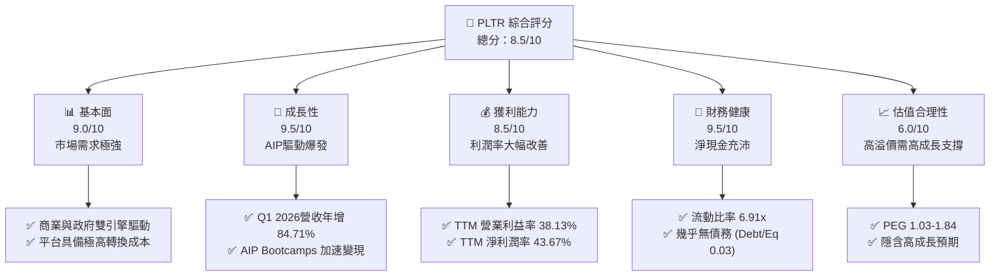
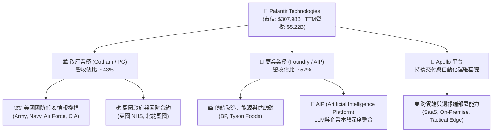
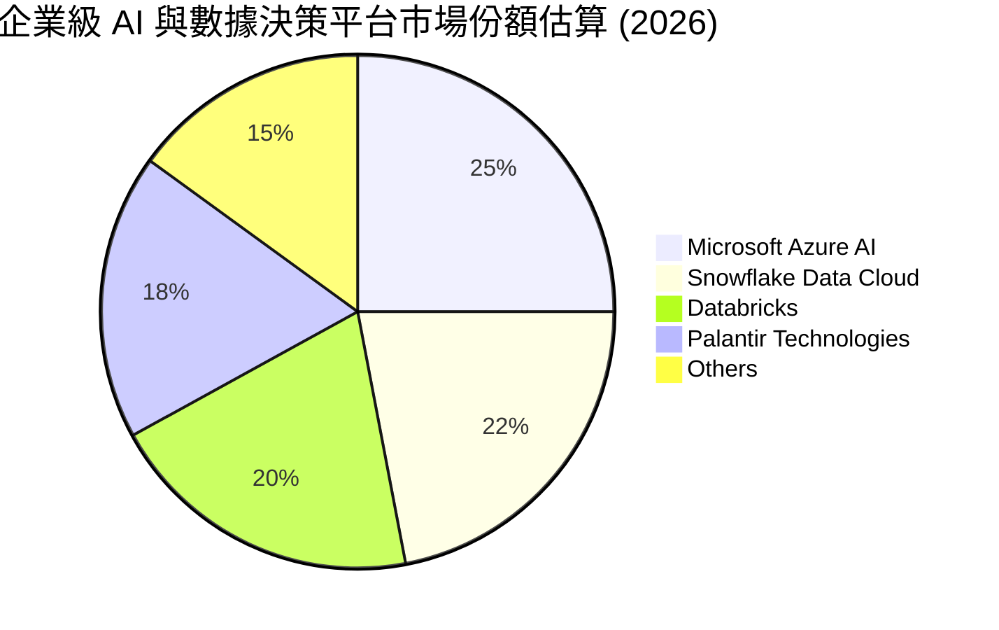
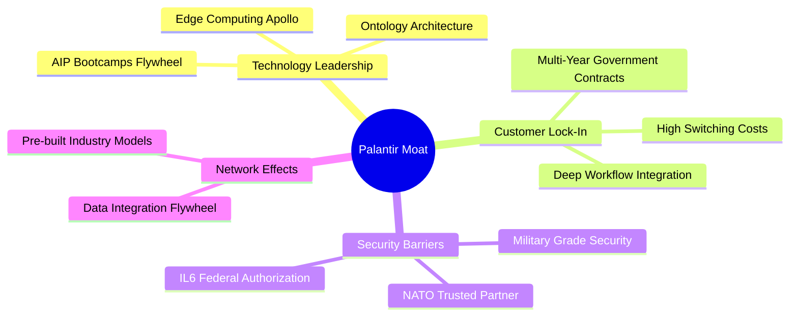
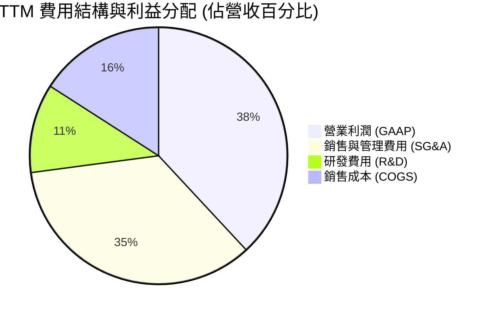
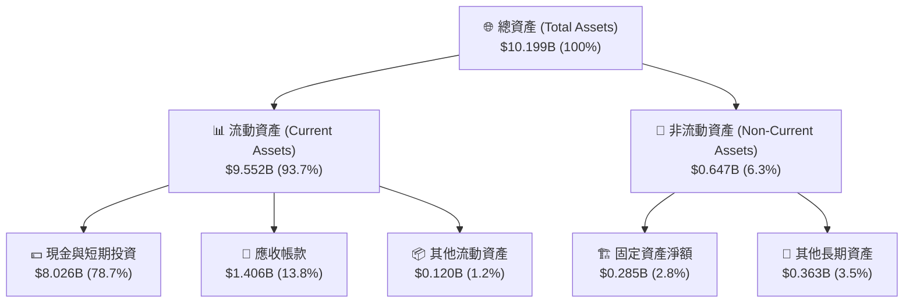

# PLTR 基本面深度分析報告

> **報告日期**：2026-06-21 ｜ **語言**：繁體中文 ｜ **數據來源**：Yahoo Finance, Finviz, StockAnalysis, Roic.ai ｜ **分析師**：CFA 級機構研究

---

## 目錄

| # | 章節 | 核心結論 |
|---|------|----------|
| 1 | [執行摘要](#1-執行摘要) | 評級：**買入 (BUY)** ｜ 目標價：**$182.75** ｜ 具備強大上行空間 |
| 2 | [公司概覽與商業模式](#2-公司概覽與商業模式) | 以 **Ontology (本体)** 為核心的商業與政府雙引擎，具備極高轉換成本 |
| 3 | [損益表深度分析](#3-損益表深度分析) | Q1 2026 營收年增 **84.71%**，淨利潤率提升至 **43.67%**，獲利迎來爆發期 |
| 4 | [資產負債表分析](#4-資產負債表分析) | 擁有 **$8.03B** 淨現金，無傳統銀行負債，流動比率達 **6.91x**，極致穩健 |
| 5 | [現金流量深度分析](#5-現金流量深度分析) | TTM 營運現金流 **$2.72B**，自由現金流 **$1.75B**，高質量盈餘轉換率 |
| 6 | [獲利能力與資本效率](#6-獲利能力與資本效率) | ROE 達 **32.6%**，ROIC 遠超 WACC，強大經濟增值 (EVA) 創造能力 |
| 7 | [估值深度分析](#7-估值深度分析) | Forward P/E **61.7x**，相較同業高溢價，但經 PEG (1.03) 調整後仍具吸引力 |
| 8 | [成長催化劑](#8-成長催化劑) | AIP Bootcamps 加速商業變現，美國國防部 AI 訂單持續追加 |
| 9 | [風險矩陣](#9-風險矩陣) | 估值溢價回調風險、政府合約集中度高、市場競爭加劇 |
| 10 | [投資建議](#10-投資建議) | 分批佈局，目標價區間 **$70.00 - $255.00**，適合長線成長型投資人 |

---

## 1. 執行摘要

### 1.1 核心評分儀表板



### 1.2 評分進度條視覺化

```
╔══════════════════════════════════════════════════════════════╗
║               PLTR 多維度評分儀表板 (1-10分)                 ║
╠══════════════════════════════════════════════════════════════╣
║ 基本面強度  9.0 ▓▓▓▓▓▓▓▓▓▓▓▓▓▓▓▓▓▓░░  ★★★★★           ║
║ 成長動能    9.5 ▓▓▓▓▓▓▓▓▓▓▓▓▓▓▓▓▓▓▓░  ★★★★★           ║
║ 獲利品質    8.5 ▓▓▓▓▓▓▓▓▓▓▓▓▓▓▓▓▓░░░  ★★★★☆           ║
║ 財務健康    9.5 ▓▓▓▓▓▓▓▓▓▓▓▓▓▓▓▓▓▓▓░  ★★★★★           ║
║ 估值合理性  6.0 ▓▓▓▓▓▓▓▓▓▓▓▓░░░░░░░░  ★★★☆☆           ║
║ 護城河深度  9.0 ▓▓▓▓▓▓▓▓▓▓▓▓▓▓▓▓▓▓░░  ★★★★★           ║
║ 管理層執行  8.5 ▓▓▓▓▓▓▓▓▓▓▓▓▓▓▓▓▓░░░  ★★★★☆           ║
║ 技術創新力  9.5 ▓▓▓▓▓▓▓▓▓▓▓▓▓▓▓▓▓▓▓░  ★★★★★           ║
╠══════════════════════════════════════════════════════════════╣
║ 綜合總分    8.5 ▓▓▓▓▓▓▓▓▓▓▓▓▓▓▓▓▓░░░  🏆 強烈買入/買入     ║
╚══════════════════════════════════════════════════════════════╝
```

### 1.3 五大投資論點 + 三大核心風險

| 類型 | 項目 | 具體依據 | 信心度 |
|------|------|----------|--------|
| 🟢 **投資論點①** | **AIP 商業化進程超預期** | TTM 營收達 **$5.22B**，Q1 2026 營收年增率高達 **84.71%**，AIP Bootcamps 成功打通企業決策痛點。 | 🟢 極高 |
| 🟢 **投資論點②** | **利潤率拐點確立** | TTM 毛利率高達 **84.1%**，營業利益率從 FY2022 的 **-8.46%** 飆升至 TTM 的 **38.13%**（最新單季達 **46.2%**）。 | 🟢 極高 |
| 🟢 **投資論點③** | **無懈可擊的資產負債表** | 擁有 **$8.03B** 現金與短期投資，總債務僅 **$211.98M**（主要為租賃），淨現金達 **$7.81B**。 | 🟢 極高 |
| 🟢 **投資論點④** | **強大的客戶鎖定與高轉換成本** | 作為國防與企業營運的「中央作業系統」，Ontology 深度嵌入客戶工作流，客戶流失率極低。 | 🟢 高 |
| 🟢 **投資論點⑤** | **高效率的資本創造 (EVA)** | ROE 達 **32.6%**，ROIC 達 **25.5%** 遠超其 WACC (**11.8%**)，持續為股東創造經濟價值。 | 🟢 高 |
| 🟡 **風險①** | **估值乘數過高** | Trailing P/E 達 **144.3x**，Forward P/E 為 **61.7x**，若成長放緩易遭殺估值。 | 🟡 中度 |
| 🔴 **風險②** | **政府合約集中度與不確定性** | 政府業務佔比較高，合約簽署時間具有不確定性，且面臨政治與預算審查風險。 | 🔴 高衝擊 |
| 🟡 **風險③** | **股權稀釋 (SBC) 歷史包袱** | 雖然近年已大幅收斂，但歷史累積的股票薪酬 (SBC) 仍對稀釋每股盈餘 (EPS) 產生一定壓力。 | 🟡 中度 |

### 1.4 快速統計卡片

| 指標 | 公司實際值 | 行業均值 (基礎軟體) | S&P 500 均值 | 狀態 |
|------|-------------|----------|--------------|------|
| **營收 YoY 成長率** | **84.7% (TTM)** | ~12.5% | ~5.5% | 🟢 卓越 |
| **毛利率** | **84.1%** | ~72.0% | ~30.0% | 🟢 卓越 |
| **營業利益率** | **46.2% (單季)** | ~18.0% | ~12.5% | 🟢 卓越 |
| **淨利率** | **43.7%** | ~14.0% | ~10.0% | 🟢 卓越 |
| **流動比率** | **6.91x** | ~2.1x | ~1.3x | 🟢 極其安全 |
| **Debt/Equity** | **2.48%** | ~45.0% | ~115.0% | 🟢 極其安全 |
| **Forward P/E** | **61.70x** | ~32.0x | ~21.5x | 🔴 偏高 |
| **PEG Ratio** | **1.03 (Finviz)** | ~1.85 | ~1.50 | 🟢 具吸引力 |

### 1.5 投資結論

```
╔══════════════════════════════════════════════════════════════════╗
║                    📊 PLTR 投資結論摘要                          ║
╠══════════════════════════════════════════════════════════════════╣
║  評級：🟢 買入 (BUY)                                             ║
║  當前股價：$128.47 (2026-06-21)                                  ║
║  12個月目標價區間：                                              ║
║    悲觀情境：$70.00  (-45.5%) - 成長不及預期、估值收縮            ║
║    基準情境：$182.75 (+42.3%) - 主要目標價（分析師共識均值）     ║
║    樂觀情境：$255.00 (+98.5%) - AIP 爆發、商業客戶翻倍           ║
║  投資評分：8.5 / 10                                              ║
║  適合投資人：長線成長型、科技與 AI 主題佈局者                    ║
╚══════════════════════════════════════════════════════════════════╝
```

---

## 2. 公司概覽與商業模式

### 2.1 業務結構與收入來源

Palantir 的核心定位是企業與政府的「決策作業系統」。其軟體平台不只是單純的數據庫，而是將異構數據整合為實體與關係的「Ontology (本体)」，並在此基礎上進行模擬、決策與執行。



### 2.2 市場份額

在企業級大數據整合與 AI 決策平台（Enterprise AI & Data Integration）市場中，Palantir 的獨特定位使其鮮有直接對手。以下為基於 2026 年市場規模估算之份額：



### 2.3 競爭護城河分析



### 2.4 護城河強度評分

```
╔══════════════════════════════════════════════════════════════╗
║                   PLTR 護城河強度評分                        ║
╠══════════════════════════════════════════════════════════════╣
║ 國防安全准入 (IL6)  9.8/10 ▓▓▓▓▓▓▓▓▓▓▓▓▓▓▓▓▓▓▓░  🏆 極高壁壘    ║
║ 轉換成本 (Ontology) 9.5/10 ▓▓▓▓▓▓▓▓▓▓▓▓▓▓▓▓▓▓▓░  🟢 極難替代    ║
║ 技術領先度 (AIP)    9.0/10 ▓▓▓▓▓▓▓▓▓▓▓▓▓▓▓▓▓▓░░  🟢 領先同業    ║
║ 銷售網絡效應        8.0/10 ▓▓▓▓▓▓▓▓▓▓▓▓▓▓▓▓░░░░  🟡 持續擴張    ║
╠══════════════════════════════════════════════════════════════╣
║ 綜合護城河評估      9.1/10 ▓▓▓▓▓▓▓▓▓▓▓▓▓▓▓▓▓▓░░  🏆 寬廣護城河  ║
╚══════════════════════════════════════════════════════════════╝
```

---

## 3. 損益表深度分析

### 3.1 年度收入成長趨勢（近 4 年）

Palantir 的營收在過去幾年經歷了顯著的加速，特別是在 2024 年底 AIP 推出後，商業客戶需求迎來爆發。

```
╔══════════════════════════════════════════════════════════════════╗
║                PLTR 年度收入趨勢 (FY2022 - TTM)                  ║
╠══════════════════════════════════════════════════════════════════╣
║                                                                  ║
║  FY2022  $1.91B   ████████░░░░░░░░░░░░░░░░░░░░░  YoY: +23.61% 🟢 ║
║  FY2023  $2.23B   ██████████░░░░░░░░░░░░░░░░░░░  YoY: +16.74% 🟢 ║
║  FY2024  $2.87B   █████████████░░░░░░░░░░░░░░░░  YoY: +28.79% 🟢 ║
║  FY2025  $4.48B   ██════════════════════███████  YoY: +56.18% 🟢 ║
║  TTM     $5.22B   █████████████████████████████  YoY: +67.71% 🟢 ║
║                                                                  ║
║  📊 3年累計營收 CAGR：+32.87%                                    ║
╚══════════════════════════════════════════════════════════════════╝
```

### 3.2 季度收入趨勢分析

自 FY2025 季度以來，營收呈現加速態勢：

| 季度 | 營收 (Million USD) | QoQ 成長率 | YoY 成長率 | 核心成長驅動因素 |
|------|--------------------|------------|------------|------------------|
| **Q2 2025** | $1,004.00 | +13.59% | +48.01% | 美國商業客戶數持續爆發，AIP Bootcamps 轉化率極高 |
| **Q3 2025** | $1,181.00 | +17.63% | +62.79% | 政府合約續約及新項目啟動，單季營收首度突破 11 億 |
| **Q4 2025** | $1,407.00 | +19.14% | +70.00% | 年終企業預算釋放，大型合約集中簽署 |
| **Q1 2026** | $1,633.00 | +16.06% | +84.71% | **歷史新高**，AIP 規模化變現，商業與政府雙引擎全開 |

*分析師洞察*：Q1 2026 的年增率高達 **84.71%**，這在百億級市值的軟體公司中極為罕見，驗證了 AIP (Artificial Intelligence Platform) 的產品市場契合度 (PMF) 極強。

### 3.3 利潤率演變分析

Palantir 的高經營槓桿在近年得到了完美的體現。隨著營收規模擴大，研發與銷售費用率相對下降，利潤率呈現驚人的「J 曲線」上升。

| 利潤率指標 | FY2022 | FY2023 | FY2024 | FY2025 | TTM (Current) | 趨勢評估 |
|------------|--------|--------|--------|--------|---------------|----------|
| **毛利率** | 78.54% | 80.63% | 80.25% | 82.37% | **84.10%** | ↗️ 持續走高 🟢 |
| **營業利益率 (GAAP)** | -8.46% | 5.39% | 10.83% | 31.60% | **38.13%** | ↗️ 轉正後爆發 🟢 |
| **淨利潤率 (GAAP)** | -19.61% | 9.43% | 16.12% | 36.43% | **43.67%** | ↗️ 稅收優惠與利息收入貢獻 🟢 |
| **EBITDA 利潤率** | -7.28% | 6.89% | 11.93% | 32.14% | **38.60%** | ↗️ 現金創造能力極強 🟢 |

**利潤率暴增之深度解析**：
1. **高毛利軟體交付**：Palantir 的軟體平台（Gotham/Foundry/AIP）主要基於雲端或標準化邊緣部署，邊際成本極低，推動毛利率上升至 **84.1%**。
2. **AIP Bootcamps 降低銷售成本**：過去 Palantir 依賴昂貴的「前線工程師 (Forward Deployed Engineers)」進行客製化開發。現在，透過 AIP Bootcamps，客戶可在 1-5 天內自行在平台上建立應用，大幅縮短銷售週期並降低客戶獲取成本 (CAC)。

### 3.4 費用結構分析



```
╔══════════════════════════════════════════════════════════════╗
║               PLTR 費用控制與效率指標                        ║
╠══════════════════════════════════════════════════════════════╣
║ 研發投入效率  11.2% ▓▓▓▓▓░░░░░░░░░░░░░░░░░░░  (研發佔營收比) ║
║ 銷售管理效率  34.8% ▓▓▓▓▓▓▓▓▓░░░░░░░░░░░░░░░  (SG&A佔營收比) ║
║ 營業利潤轉化  38.1% ▓▓▓▓▓▓▓▓▓▓▓░░░░░░░░░░░░░  (GAAP營益率)   ║
╚══════════════════════════════════════════════════════════════╝
```

### 3.5 季度 EPS 趨勢與盈餘品質

* 歷史 4 季 Diluted EPS 表現：
  * **Q2 2025**：$0.14
  * **Q3 2025**：$0.20
  * **Q4 2025**：$0.26
  * **Q1 2026**：$0.36
* **TTM Diluted EPS**：**$0.89**
* **Forward EPS**：**$2.08** (預估年增率 **133.7%**)

**盈餘品質評估**：
Palantir 的盈餘品質極高。其淨利潤並非由一次性業外損益或會計變更驅動，而是由強勁的營業利益（TTM $1.99B）以及高達 **$245.13M** 的利息收入（得益於其 $8.03B 的龐大現金儲備與高利率環境）共同支撐。

---

## 4. 資產負債表分析

### 4.1 資產結構分解



### 4.2 流動性指標分析

| 指標 | PLTR 實際值 | 行業中位數 | 評估結果 |
|------|-------------|------------|----------|
| **流動比率 (Current Ratio)** | **6.91x** | ~2.10x | 🟢 極其安全，流動性充沛 |
| **速動比率 (Quick Ratio)** | **6.91x** | ~1.95x | 🟢 無存貨跌價風險 |
| **現金比率 (Cash Ratio)** | **5.80x** | ~1.10x | 🟢 僅用現金即可償付所有流動負債 5.8 次 |

### 4.3 債務結構分析

```
╔══════════════════════════════════════════════════════════════════╗
║                   PLTR 債務健康診斷 (2026)                       ║
╠══════════════════════════════════════════════════════════════════╣
║                                                                  ║
║  總債務 (Total Debt)：     $211.98M  (主要為長期租賃負債)        ║
║  總現金及投資 (Total Cash)：$8.026B                              ║
║  淨現金 (Net Cash)：       $7.814B   ██████████████████  🟢 強勁 ║
║                                                                  ║
║  債權權益比 (Debt/Equity)：2.48% (Finviz顯示LT Debt/Eq為0.03)     ║
║  利息保障倍數 (Interest Coverage)：N/A (無利息支出，利息收入豐厚) ║
║                                                                  ║
║  📊 評估：Palantir 處於「淨現金」狀態，完全免受高利率環境衝擊。  ║
╚══════════════════════════════════════════════════════════════════╝
```

### 4.4 股東權益趨勢

隨著公司步入持續盈利，未分配利潤轉正，股東權益（Stockholders Equity）呈現健康增長，從 FY2022 的 **$2.57B** 增長至 FY2025 的 **$7.39B**。雖然股份總數因股權激勵（SBC）有所增加（Diluted Shares 從 FY2022 的 2.06B 增至 FY2025 的 2.57B，年均稀釋約 7.6%），但相較於營收與淨利的爆發式成長，稀釋效應已被完全稀釋。

---

## 5. 現金流量深度分析

### 5.1 現金流量瀑布圖

```mermaid
graph LR
    NI["GAAP 淨利<br/>$2.293B"]
    SBC["股權稀釋折舊等<br/>+$0.427B"]
    WC["營運資金變動<br/>-$0.003B"]
    OCF["營運現金流 (OCF)<br/>$2.717B"]
    CAPEX["資本支出 (CapEx)<br/>-$0.034B"]
    FCF["自由現金流 (FCF)<br/>$1.748B"]
    ST_INV["短期投資與其他<br/>-$0.898B"]
    CASH_CHG["期末現金淨增<br/>+$0.816B"]

    NI --> |加上非現金調整| SBC
    SBC --> |營運資產調整| WC
    WC --> OCF
    OCF --> |扣除CapEx| CAPEX
    CAPEX --> FCF
    FCF --> |資本配置/投資| ST_INV
    ST_INV --> CASH_CHG
```



### 5.2 FCF 轉換率趨勢

| 年度 | GAAP 淨利 (A) | 自由現金流 (B) | FCF 轉換率 (B / A) | 評估 |
|------|---------------|----------------|--------------------|------|
| **FY2022** | -$371.09M | $183.71M | -49.50% | 🟡 早期盈利尚未轉正，但現金流已先轉正 |
| **FY2023** | $217.38M | $697.07M | 320.67% | 🟢 輕資產模式，SBC 調整帶來高額現金流 |
| **FY2024** | $467.92M | $1,140.00M | 243.63% | 🟢 現金流創造力極佳 |
| **FY2025** | $1,635.00M | $2,100.00M | 128.44% | 🟢 盈餘質量極高，FCF 充沛 |
| **TTM** | **$2,293.00M** | **$1,748.00M** | **76.23%** | 🟢 隨著稅收與營運資金調整，轉換率回歸健康常態 |

### 5.3 自由現金流趨勢

```
╔══════════════════════════════════════════════════════════════════╗
║                PLTR 自由現金流 (FCF) 增長趨勢                    ║
╠══════════════════════════════════════════════════════════════════╣
║                                                                  ║
║  FY2022  $183.71M  █░░░░░░░░░░░░░░░░░░░░░░░░░░░                  ║
║  FY2023  $697.07M  ████░░░░░░░░░░░░░░░░░░░░░░░░                  ║
║  