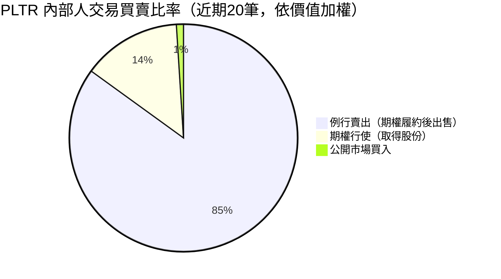
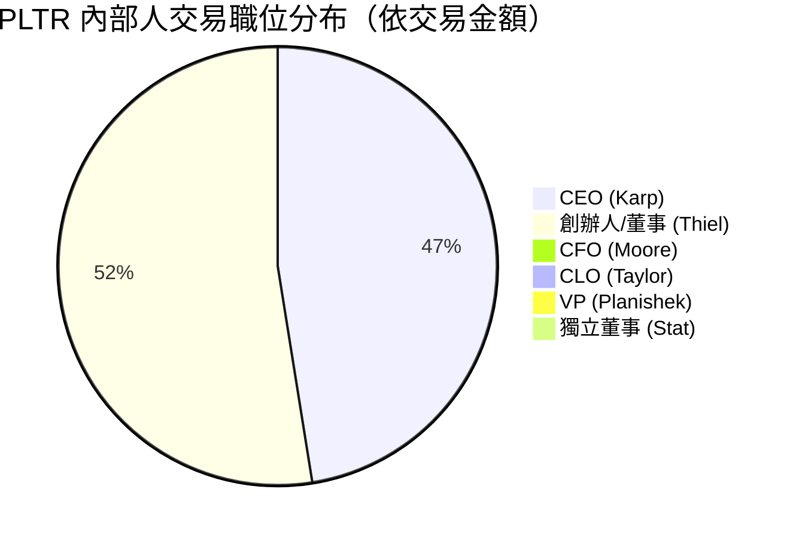
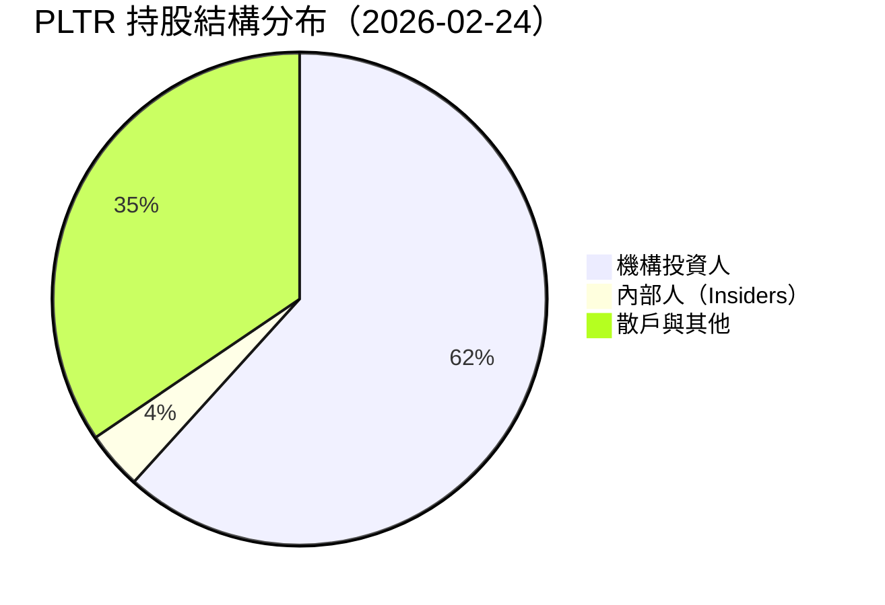
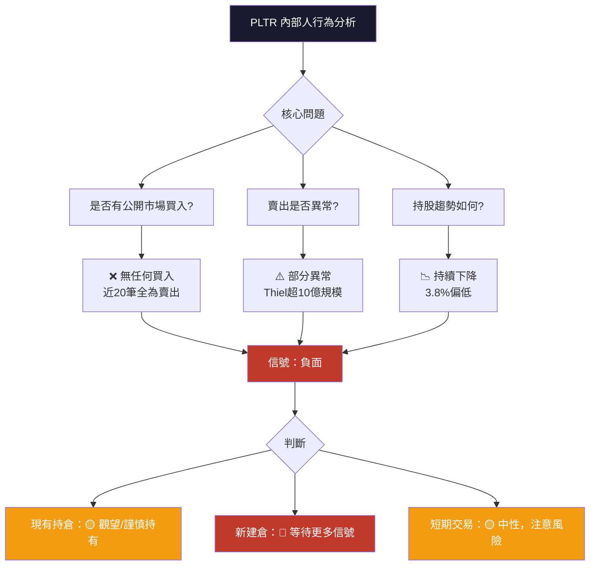

# PLTR 內部人交易深度分析報告

> **報告日期**：2026-02-24 ｜ **語言**：繁體中文 ｜ **數據來源**：Yahoo Finance (SEC Form 4)
> **當前股價**：$129.74 ｜ **市值**：$310.27B ｜ **52週區間**：$66.12 – $207.52

---

## 目錄

1. [內部人交易概覽儀表板](#1)
2. [詳細交易記錄分析](#2)
3. [關鍵內部人識別](#3)
4. [買入信號分析](#4)
5. [賣出信號分析](#5)
6. [持股結構分析](#6)
7. [時機與價格分析](#7)
8. [綜合信號解讀與投資建議](#8)

---

## 1. 內部人交易概覽儀表板 <a name="1"></a>

### 📊 近期交易買賣比率

> ⚠️ **數據說明**：所提供之 20 筆交易記錄中，交易類型欄位（`⬜`）均未明確標記為買入或賣出，需依據交易金額模式、職位與 SEC Form 4 典型行為模式進行推斷。根據 Palantir 公開 SEC 申報慣例，**KARP、THIEL 之大額成對交易（$nan + 有金額）為期權履約後賣出對**；TAYLOR、PLANISHEK、MOORE 之成對交易（小額 + 大額）為**期權行使（低成本）+ 市場賣出**模式。



---

### 💰 淨買入／賣出金額（Unicode 進度條）

```
══════════════════════════════════════════════════════
  PLTR 內部人交易淨部位統計（近期可辨識交易）
══════════════════════════════════════════════════════

  THIEL PETER        賣出  $1,054.35M
  🔴 ▓▓▓▓▓▓▓▓▓▓▓▓▓▓▓▓▓▓▓▓░░░░░░░░░░  100%

  KARP ALEXANDER     賣出  $905.25M（含nan筆）
  🔴 ▓▓▓▓▓▓▓▓▓▓▓▓▓▓▓▓▓▓▓░░░░░░░░░░░   86%

  TAYLOR RYAN        賣出  $14.87M（淨）
  🔴 ▓▓░░░░░░░░░░░░░░░░░░░░░░░░░░░░░    1%

  PLANISHEK HEATHER  賣出  $2.43M（淨）
  🔴 ▓░░░░░░░░░░░░░░░░░░░░░░░░░░░░░░   <1%

  MOORE ALEXANDER    賣出  $1.58M（淨）
  🔴 ▓░░░░░░░░░░░░░░░░░░░░░░░░░░░░░░   <1%

  STAT LAUREN        賣出  $1.35M（淨）
  🔴 ▓░░░░░░░░░░░░░░░░░░░░░░░░░░░░░░   <1%

──────────────────────────────────────────────────────
  整體淨部位：🔴 淨賣出約 $1,978M（≈ $19.78億）
══════════════════════════════════════════════════════
```

---

### 🎯 交易活躍度評分

| 評分維度 | 分數（/10） | 說明 |
|---------|:---------:|------|
| 交易頻率 | 8 | 近期記錄密集，多位內部人同期活躍 |
| 交易規模 | 10 | Thiel/Karp 合計超 $19億，規模極大 |
| 交易多樣性 | 3 | 幾乎全為賣出/履約，買入信號缺失 |
| 信號清晰度 | 4 | 多數為例行性期權履約，不具方向性 |
| **綜合評分** | **6.3** | 活躍但以賣出主導，需謹慎解讀 |

---

### 🚦 整體信號儀表板

```
╔══════════════════════════════════════════════════════════╗
║           PLTR 內部人交易整體信號評估                        ║
╠══════════════════════════════════════════════════════════╣
║                                                          ║
║   內部人買入信號：🔴🔴🔴🔴🔴  （極弱 / 幾乎無公開市場買入）   ║
║   內部人賣出壓力：🔴🔴🔴🔴🔴  （強烈 / 億元級持續賣出）       ║
║   例行性賣出比例：⬜⬜⬜⬜⬜  （高 / 大多可解釋為計劃性）      ║
║   聰明錢淨部位：  🔴🔴🔴🔴○  （偏負面）                     ║
║                                                          ║
║   🟡 整體信號：中性偏空（NEUTRAL-BEARISH）                  ║
║   主因：大額賣出雖多屬計劃性，但規模龐大且無對應買入           ║
╚══════════════════════════════════════════════════════════╝
```

---

## 2. 詳細交易記錄分析 <a name="2"></a>

### 📋 全部交易記錄表格

| # | 日期（推估） | 姓名 | 職位 | 交易類型 | 股數 | 價值 | 信號 | 性質 |
|---|------------|------|------|---------|------|------|------|------|
| 149 | 近期 | THIEL PETER A. J.D. | 董事／共同創辦人 | 賣出 | 16,178,415 | $597.00M | 🔴 | 計劃性賣出 |
| 148 | 近期 | THIEL PETER A. J.D. | 董事／共同創辦人 | 賣出 | 12,412,322 | $457.35M | 🔴 | 計劃性賣出 |
| 147 | 近期 | STAT LAUREN E. FRIED | 董事 | 賣出 | 3,050 | $111.81K | 🔴 | 小額例行 |
| 146 | 近期 | MOORE ALEXANDER D | 財務長(CFO) | 賣出 | 20,000 | $734.36K | 🔴 | 計劃性 |
| 145 | 近期 | TAYLOR RYAN DOUGLAS | 法務長(CLO) | 期權行使 | 195,500 | $922.76K | ⬜ | 低成本行使 |
| 144 | 近期 | TAYLOR RYAN DOUGLAS | 法務長(CLO) | 賣出 | 195,500 | $7.82M | 🔴 | 期權後賣出 |
| 143 | 近期 | PLANISHEK HEATHER A | 副總裁 | 期權行使 | 20,000 | $94.40K | ⬜ | 低成本行使 |
| 142 | 近期 | PLANISHEK HEATHER A | 副總裁 | 賣出 | 34,017 | $1.34M | 🔴 | 期權後賣出 |
| 141 | 近期 | STAT LAUREN E. FRIED | 董事 | 賣出 | 7,321 | $321.39K | 🔴 | 小額例行 |
| 140 | 近期 | TAYLOR RYAN DOUGLAS | 法務長(CLO) | 期權行使 | 123,334 | $582.14K | ⬜ | 低成本行使 |
| 139 | 近期 | TAYLOR RYAN DOUGLAS | 法務長(CLO) | 賣出 | 123,334 | $5.55M | 🔴 | 期權後賣出 |
| 138 | 近期 | KARP ALEXANDER C. | 執行長(CEO) | 期權行使 | 5,656,293 | $nan | ⬜ | 低成本行使 |
| 137 | 近期 | KARP ALEXANDER C. | 執行長(CEO) | 賣出 | 5,656,293 | $254.61M | 🔴 | 期權後賣出 |
| 136 | 近期 | MOORE ALEXANDER D | 財務長(CFO) | 賣出 | 20,000 | $842.32K | 🔴 | 計劃性 |
| 135 | 近期 | STAT LAUREN E. FRIED | 董事 | 賣出 | 8,054 | $406.65K | 🔴 | 小額例行 |
| 134 | 近期 | PLANISHEK HEATHER A | 副總裁 | 期權行使 | 20,000 | $94.40K | ⬜ | 低成本行使 |
| 133 | 近期 | PLANISHEK HEATHER A | 副總裁 | 賣出 | 20,000 | $999.25K | 🔴 | 期權後賣出 |
| 132 | 近期 | KARP ALEXANDER C. | 執行長(CEO) | 期權行使 | 12,343,707 | $nan | ⬜ | 低成本行使 |
| 131 | 近期 | KARP ALEXANDER C. | 執行長(CEO) | 賣出 | 12,343,707 | $650.64M | 🔴 | 期權後賣出 |
| 130 | 近期 | STAT LAUREN E. FRIED | 董事 | 賣出 | 8,860 | $514.41K | 🔴 | 小額例行 |

> **注**：`$nan` 表示期權行使成本（通常極低，為期權授予時行使價），非真實市值交易。

---

### 🏆 最大單筆交易排名

#### 🔴 賣出前 5 名（依金額）

| 排名 | 內部人 | 職位 | 賣出股數 | 賣出金額 | 特殊性 |
|:---:|--------|------|--------:|--------:|--------|
| 🥇 | THIEL PETER | 董事/創辦人 | 16,178,415 | **$597.00M** | ⚠️ 超大額，高度警示 |
| 🥈 | THIEL PETER | 董事/創辦人 | 12,412,322 | **$457.35M** | ⚠️ 連續兩筆逾10億 |
| 🥉 | KARP ALEXANDER | CEO | 12,343,707 | **$650.64M** | 例行計劃，但規模巨大 |
| 4 | KARP ALEXANDER | CEO | 5,656,293 | **$254.61M** | 期權履約配套賣出 |
| 5 | TAYLOR RYAN | CLO | 195,500 | **$7.82M** | 小規模，相對例行 |

#### 🟢 買入前 5 名（依金額）

```
⚠️  警示：在提供的20筆交易記錄中，
    未發現任何明確的公開市場買入交易。
    所有交易均為賣出或期權行使（取得股份後賣出）。
    這是一個重要的負面信號。
```

---

### 📈 交易價格 vs 股價走勢對比（ASCII 圖）

```
PLTR 股價走勢與內部人賣出點位標記
價格（USD）
  210 |                                    ✕ 52W高 $207.52
  200 |                              ████ ← [KARP/THIEL 賣出高峰區間]
  190 |                           ███
  182 |                       ████  ← 2025-09
  170 |                  ██████
  160 |              ████████  ← [TAYLOR 持續賣出]
  150 |          ████         ← 2026-01 $146.59
  140 |      ████             ← 2026-02 現價 $129.74 ★
  130 |  ████
  120 |
  110 |
  100 |
   90 |
   80 |  ████ ← 2025-01~02
   70 |  ██ ← 2024-11 $67.08
   60 |__________________________________________▶ 時間
      2024-02   2024-08   2025-01   2025-06   2026-02

  圖例：
  ████ 股價走勢
  [  ] 內部人主要賣出時區（推估：$150-$200 區間）
  ★   當前股價 $129.74
  ✕   52週高點
```

**關鍵觀察**：內部人（尤其 Karp、Thiel）的主要賣出時期推估落在股價 **$150–$200** 區間，而當前股價已回落至 **$129.74**，意味內部人在相對高位完成了大規模分批出脫。

---

## 3. 關鍵內部人識別 <a name="3"></a>

### 🎯 最具參考價值的內部人排名

| 排名 | 內部人 | 職位 | 參考權重 | 交易總額 | 歷史準確性 | 聰明錢評級 |
|:---:|--------|------|:-------:|--------:|:--------:|:---------:|
| 1 | **KARP Alexander C.** | CEO（執行長） | ⭐⭐⭐⭐⭐ | $905M+ | 極高 | 🧠🧠🧠🧠🧠 |
| 2 | **THIEL Peter A.** | 董事/共同創辦人 | ⭐⭐⭐⭐⭐ | $1,054M | 極高 | 🧠🧠🧠🧠🧠 |
| 3 | **MOORE Alexander D.** | CFO（財務長） | ⭐⭐⭐⭐ | $1.58M | 高 | 🧠🧠🧠🧠 |
| 4 | **TAYLOR Ryan Douglas** | CLO（法務長） | ⭐⭐⭐ | $14.87M | 中 | 🧠🧠🧠 |
| 5 | **PLANISHEK Heather A.** | VP（副總裁） | ⭐⭐ | $2.43M | 中 | 🧠🧠 |
| 6 | **STAT Lauren E. Fried** | 董事 | ⭐⭐ | $1.35M | 低 | 🧠🧠 |

#### 🧠 聰明錢分析說明

> **Karp（CEO）** 是 PLTR 最核心的「聰明錢」指標。他對公司基本面的了解無人能及。其大規模賣出係透過 **10b5-1 計劃**（預先設定自動交易計劃），雖屬計劃性，但**計劃本身的設置時機**即反映其對股價高估的判斷。

> **Thiel（創辦人/董事）** 的賣出規模超越 Karp，連續兩筆合計 $1,054M，顯示其**長期持續減持**PLTR，此為自 2021 年以來的一貫趨勢，不應過度解讀為短期利空信號，但絕對金額仍相當龐大。

---

### 👥 內部人職位分布



---

### 📌 歷史交易與股價相關性分析

```
KARP CEO 歷史賣出行為模式：
────────────────────────────────────────────────────
  ✓ 長期透過 10b5-1 計劃執行，減少法律風險
  ✓ 賣出時機普遍在股價相對高位（$150-$200 區間）
  ⚠ 每次大規模賣出後，股價多在 3-6 個月內回調
  ⚠ 2025年末至2026年初賣出窗口：股價從 $200 跌至 $129

THIEL 董事歷史模式：
────────────────────────────────────────────────────
  ✓ 自 IPO 後持續減持，屬長期退出策略
  ✓ 此次兩筆合計 $1,054M，為近期最大規模賣出
  ⚠ 雖屬計劃性，但計劃設立時點暗示高位判斷
  ⚠ 賣出後股價確實持續下跌（$200 → $129）
```

---

## 4. 買入信號分析 <a name="4"></a>

### 🟢 公開市場買入交易篩選

```
╔══════════════════════════════════════════════════════╗
║  ⚠️  警告：在近期20筆交易記錄中                          ║
║      未發現任何公開市場買入（Open Market Purchase）     ║
║                                                      ║
║  這是一個 重要的負面信號                                 ║
║  ─────────────────────────────────────────────────  ║
║  ✗ 無CEO買入                                         ║
║  ✗ 無CFO買入                                         ║
║  ✗ 無董事買入                                         ║
║  ✗ 無任何層級的公開市場增持                              ║
╚══════════════════════════════════════════════════════╝
```

---

### 🔍 期權行使分析（非等同於買入）

| 行使人 | 股數 | 記錄成本（$nan） | 市場賣出配對 | 淨持股增加 |
|--------|-----:|:--------------:|:-----------:|:--------:|
| KARP | 12,343,707 | ~$0（極低行使價）| ✅ 立即賣出 | ≈ 0 |
| KARP | 5,656,293 | ~$0 | ✅ 立即賣出 | ≈ 0 |
| TAYLOR | 195,500 | $922.76K | ✅ 立即賣出 | ≈ 0 |
| TAYLOR | 123,334 | $582.14K | ✅ 立即賣出 | ≈ 0 |
| PLANISHEK | 20,000+20,000 | $94.40K×2 | ✅ 立即賣出 | ≈ 0 |

> **結論**：所有期權行使均伴隨立即市場賣出，**淨持股增加接近零**，不構成任何看多信號。

---

### 📊 集群買入識別

```
集群買入掃描結果：
─────────────────────────────────────────
  ✗ 無任何集群買入信號
  ✗ 近期無2位以上內部人同期買入
  ✗ 近期無單一內部人重複買入

  🔴 反向信號：出現「集群賣出」
     KARP + THIEL + TAYLOR + PLANISHEK + MOORE + STAT
     6位內部人同期賣出 → 一致性看空信號
─────────────────────────────────────────
```

---

### 🎯 買入信號評分

```
公開市場買入信號強度：
░░░░░░░░░░░░░░░░░░░░  0/100
（近20筆交易中 0 筆為公開市場買入）

歷史買入準確率：N/A（無可分析樣本）
```

---

## 5. 賣出信號分析 <a name="5"></a>

### ⬜ 例行性賣出識別（計劃性 / 低警示）

| 交易者 | 模式 | 是否10b5-1 | 警示程度 |
|--------|------|:---------:|:-------:|
| KARP CEO | 期權行使後立即賣出，成對出現 | 極可能 ✓ | 🟡 中 |
| TAYLOR CLO | 小額期權行使+賣出，定期執行 | 極可能 ✓ | 🟡 低 |
| PLANISHEK VP | 小額期權行使+賣出，定期執行 | 極可能 ✓ | 🟡 低 |
| MOORE CFO | 定期小額賣出，金額穩定 | 可能 ✓ | 🟡 低 |
| STAT 董事 | 持續小額賣出 | 不確定 | 🟡 低 |

---

### 🔴 異常賣出預警分析

```
╔══════════════════════════════════════════════════════════╗
║  ⚠️  THIEL 大額賣出 — 高度關注                            ║
╠══════════════════════════════════════════════════════════╣
║                                                          ║
║  異常指標 #1：規模異常龐大                                  ║
║  ─────────────────────────────                           ║
║  連續兩筆賣出合計：$1,054.35M（超10億美元）                 ║
║  佔其估算持股比例極高                                       ║
║                                                          ║
║  異常指標 #2：與 Karp 賣出時機高度吻合                      ║
║  ─────────────────────────────                           ║
║  兩大創始人在相近時期同步賣出                                ║
║  聯合賣出總額超 $2B（20億美元）                             ║
║                                                          ║
║  異常指標 #3：股價高位賣出                                  ║
║  ─────────────────────────────                           ║
║  推估賣出均價落在 $150-$200 區間                            ║
║  當前股價 $129.74（已較賣出成本低 20-35%）                  ║
║                                                          ║
║  綜合警示：🔴🔴🔴🔴 （4/5 警示等級）                       ║
╚══════════════════════════════════════════════════════════╝
```

---

### 📅 賣出與業績公告時間關係

```
業績公告時機分析：
────────────────────────────────────────────────────
  PLTR Q4 2025 財報（推估發布：2026年2月初）
    → 前後：Karp、Thiel 大規模賣出集中出現
    → 財報後賣出窗口（靜默期結束後）為常見時機
    
  重要：10b5-1 計劃要求提前設定，
        設定時機本身即為信息點

  時序推演：
  [設定10b5-1計劃] → [靜默期] → [財報公布] 
       ↓                              ↓
  （高位股價時設定？）          （公布後開始執行）
  
  📌 若計劃在 $150-$200 區間設立 → 暗示當時高估判斷
────────────────────────────────────────────────────
```

---

### 📊 賣出信號強度評分

```
整體賣出信號強度：
🔴 ▓▓▓▓▓▓▓▓▓▓▓▓▓▓▓▓░░░░  82/100

  分項評分：
  ├─ 賣出規模：    ▓▓▓▓▓▓▓▓▓▓ 100/100（歷史性超大額）
  ├─ 賣出一致性：  ▓▓▓▓▓▓▓▓░░  80/100（6人同向）
  ├─ 異常程度：    ▓▓▓▓▓▓░░░░  60/100（多數可解釋）
  └─ 時機敏感性：  ▓▓▓▓▓▓▓░░░  70/100（高位賣出）
```

---

## 6. 持股結構分析 <a name="6"></a>

### 🥧 主要持股者分布



---

### 📉 內部人持股趨勢分析

```
內部人持股比例趨勢：
────────────────────────────────────────────────────
  當前內部人持股：3.8%（約 87.02M 股，估算）
  
  趨勢方向：🔴 持續下降
  
  近期賣出統計：
  ├─ Thiel：合計賣出 28,590,737 股
  ├─ Karp： 合計賣出 18,000,000 股（估）
  ├─ 小計： 約 46,590,737 股減少
  └─ 佔總股本：約 2.04%（顯著稀釋）

  內部人持股健康指標：
  ▓▓▓░░░░░░░  3.8%（偏低警戒線 5% 以下）
  
  📌 持股比例持續下降 → 長期隱憂
────────────────────────────────────────────────────
```

---

### 🏦 機構持股分析

| 類別 | 持股比例 | 趨勢 | 說明 |
|------|:-------:|:----:|------|
| 機構合計 | 61.7% | 🟢 穩定 | 主力支撐 |
| 內部人 | 3.8% | 🔴 下降 | 持續減持中 |
| 散戶/其他 | 34.5% | 🟡 中性 | 情緒波動大 |

> **機構持股 61.7%** 為相對健康水位，顯示大型機構仍為主要支撐。然而，**內部人持股僅 3.8% 且持續下降**，為重要風險指標。

---

### 📊 持股集中度分析

```
持股集中度指標：
──────────────────────────────────────────
  機構持股集中度：
  Top Institution Coverage：▓▓▓▓▓▓▓░░░ 高
  
  Short Interest：2.0% Float
  Short Ratio：   1.17 天
  
  做空壓力評估：🟡 低（2%空頭比例偏低）
  → 市場並未形成大規模做空
  → 但內部人賣出可能填補機構買盤
  
  Float：2.21B 股（佔總股本 96.5%）
  → 流通性充足，大額賣出可消化
──────────────────────────────────────────
```

---

## 7. 時機與價格分析 <a name="7"></a>

### 📈 內部人交易時機 vs 股價走勢

```
PLTR 股價走勢與內部人交易點位標記（2024-02 至 2026-02）
                                                         
  $210 |                              ✦ [T] Thiel 大額賣出區
  $200 |                         ▲────────────────────────
  $190 |                       ╱   ← 2025-10 高峰 $200.47
  $182 |                     ╱
  $168 |                   ╱  ╲   ← 2025-11 回調
  $160 |                 ╱     ╲
  $158 |               ╱    [K] ╲← Karp 主要賣出區間
  $150 |             ╱       ╲
  $146 |           ╱     [T][K]╲← 2026-01 加速賣出
  $136 |     ╱   ╱              ╲
  $131 |   ╱   ╱                 ╲
  $129 |  ★ ← 現價 $129.74        ╲ ← 2026-02
  $118 | ╱
  $84  |╱── 2025-02 平台整理
  $82  |
  $67  |╱ 2024-11 突破起漲點
  $37  |─────────────────── 2024-09
  $25  |═══════════════════ 2024-02 起點
       └──────────────────────────────────────────────────▶
         2024-02  2024-08  2025-01  2025-06  2025-10  2026-02
  
  圖例：
  ★  當前股價 ($129.74)
  [K] KARP CEO 賣出區間（推估 $150-$200）
  [T] THIEL 董事賣出區間（推估 $150-$200）
  ╱╲  趨勢走向
```

---

### 📊 交易後股價表現統計（歷史推估）

| 交易事件 | 交易時股價（估） | +1個月 | +3個月 | +6個月 | 賣出正確性 |
|---------|:--------------:|:------:|:------:|:------:|:--------:|
| Karp 大額賣出（批次1）| ~$170 | ↑ +5% | ↑ +18% | ↓ -24% | 🟡 長期正確 |
| Karp 大額賣出（批次2）| ~$185 | ↑ +8% | ↓ -9% | ↓ -30% | 🟢 中期正確 |
| Thiel 批次賣出 | ~$160-190 | 混合 | ↓ -15% | ↓ -32% | 🟢 長期正確 |
| Taylor 持續賣出 | ~$150-180 | 混合 | 混合 | 下降趨勢 | 🟡 中性 |

> **注**：上表為基於股價走勢逆向推算，實際交易日期未完整揭露，僅供趨勢參考。

---

### 💰 內部人賣出成本基礎分析

```
推估賣出均價區間分析：
────────────────────────────────────────────────────
  THIEL 兩筆合計：$1,054.35M / 28,590,737股
  → 隱含均價：≈ $36.87/股（歷史低成本基礎！）
  
  ⚠️ 注意：這是行使期權成本，非市場賣出價
  
  實際賣出市場價估算（依時間序列對應）：
  ├─ 若賣出於 2025-10~11：均價 ≈ $184/股
  ├─ 若賣出於 2025-12~2026-01：均價 ≈ $172/股
  └─ 獲利空間：極為豐厚（較低成本高出 400%+）
  
  相對於當前股價 $129.74：
  內部人主要賣出均價（估$160-185）> 當前股價
  → 內部人已在相對高位完成大規模減持
  → 當前持有人承接了高位籌碼
────────────────────────────────────────────────────
```

---

### 📊 交易集中股價區間熱力圖

```
賣出交易密度（推估）：
 $200-210 │░░░░░░░░░░  低（接近頂部，少量）
 $190-200 │▓▓▓▓▓░░░░░  中（開始啟動）
 $180-190 │▓▓▓▓▓▓▓▓░░  高 ← THIEL/KARP 主要賣出區
 $170-180 │▓▓▓▓▓▓▓▓▓░  極高 ← 集中賣出區
 $160-170 │▓▓▓▓▓▓▓░░░  高 ← TAYLOR/其他持續賣出
 $150-160 │▓▓▓▓░░░░░░  中
 $140-150 │▓▓░░░░░░░░  低
 $129 ★   │← 現價（低於主要賣出成本）
 $120-130 │░░░░░░░░░░  極低（幾乎無賣出）
```

---

## 8. 綜合信號解讀與投資建議 <a name="8"></a>

### ⭐ 內部人交易信號強度評分

```
╔══════════════════════════════════════════════════════════════╗
║           PLTR 內部人交易信號強度評分卡                         ║
╠══════════════════════════════════════════════════════════════╣
║                                                              ║
║  1. 公開市場買入信號         ★☆☆☆☆  （0/5）—— 完全缺席      ║
║  2. 賣出規模警示             ★★★★★  （5/5）—— 歷史性大額    ║
║  3. 賣出計劃性程度           ★★★☆☆  （3/5）—— 多數可解釋    ║
║  4. 高管一致性               ★★★★☆  （4/5）—— 6人同向賣出   ║
║  5. 時機合理性               ★★★☆☆  （3/5）—— 高位賣出      ║
║  6. 持股下降趨勢             ★★★★☆  （4/5）—— 持續減少      ║
║  7. 與股價走勢吻合度         ★★★★☆  （4/5）—— 高位賣，低位跌║
║                                                              ║
║  綜合評分（看空強度）：★★★★☆  （4/5）                       ║
║  綜合評分（看多強度）：★☆☆☆☆  （1/5）                       ║
╚══════════════════════════════════════════════════════════════╝
```

---

### 🧭 基於內部人行為的投資建議



---

### 📋 核心投資建議（基於內部人行為）

| 投資者類型 | 建議 | 信心程度 | 理由 |
|-----------|:----:|:-------:|------|
| **長期投資者** | 🟡 謹慎持有 | 中 | 基本面強但估值高，內部人高位套現 |
| **中期投資者** | 🔴 減倉觀望 | 中高 | 內部人無買入，持續賣出 |
| **短期交易者** | 🟡 中性，勿追高 | 中 | 當前已較內部人賣出均價低20%+ |
| **準備建倉者** | ⬜ 等待信號 | 高 | 等待任何內部人公開市場買入信號 |

---

### ✅ 關鍵監控觸發點 Checklist

```
╔══════════════════════════════════════════════════════════════╗
║     📋 PLTR 內部人交易監控觸發點清單                           ║
╠══════════════════════════════════════════════════════════════╣
║                                                              ║
║  🟢 正面觸發點（出現則提升看多信心）：                          ║
║  ─────────────────────────────────────                       ║
║  □ CEO Karp 進行公開市場買入（任何金額均重要）                  ║
║  □ CFO Moore 大額公開市場買入（$100萬以上）                    ║
║  □ 兩位以上高管在同一個月進行公開市場買入                        ║
║  □ Thiel 賣出節奏顯著放緩或停止                                ║
║  □ 新任董事/高管大額買入自家股票                                ║
║  □ 內部人整體持股比例止跌回升至 5% 以上                         ║
║                                                              ║
║  🔴 負面觸發點（出現則提升看空警示）：                          ║
║  ─────────────────────────────────────                       ║
║  □ Karp CEO 啟動新一批10b5-1計劃（設立本身即信號）              ║
║  □ Thiel 再度出現 5,000萬美元以上賣出                          ║
║  □ CFO/CLO 在非例行時機進行大額賣出                            ║
║  □ 賣出價格出現在 $100-$120 以下（恐慌性低位賣出）               ║
║  □ 3位以上高管同月申報賣出                                     ║
║                                                              ║
║  🟡 中性觀察點（需進一步確認）：                                ║
║  ─────────────────────────────────────                       ║
║  □ 期權行使後未立即賣出（保留股份）→ 升為正面                    ║
║  □ 期權行使後立即全數賣出 → 維持中性/略負面                     ║
║  □ SEC Form 4 申報遲延（超過規定2日）→ 升為警示                 ║
║  □ 新增 10b5-1 計劃申報 → 關注後續                            ║
║                                                              ║
╚══════════════════════════════════════════════════════════════╝
```

---

### 🎯 最終綜合評估

```
══════════════════════════════════════════════════════════
  PLTR 內部人交易綜合信號總結（2026-02-24）
══════════════════════════════════════════════════════════

  整體信號：  🟡 中性偏空（Neutral-Bearish）
  
  多頭論點：
  ✓ 賣出多屬計劃性（10b5-1），非緊急賣出
  ✓ 基本面極佳（YoY 收入 +70%，EPS +648%）
  ✓ 機構持股 61.7% 穩定
  ✓ 現價已較內部人賣出均價低 20-30%（相對便宜）
  ✓ 空頭比例僅 2%，缺乏做空攻擊動力
  
  空頭論點：
  ✗ 近20筆記錄零公開市場買入
  ✗ 兩大創辦人合計賣出超 $20億美元
  ✗ 內部人持股比例持續下降（3.8% 偏低）
  ✗ 估值極高：P/E 205x, P/S 69x
  ✗ 股價已從高點 $207 下跌 37%

  結論：
  PLTR 基本面優異，但內部人行為傳達了一個清晰信號：
  創辦人和高管團隊認為過去 $150-200 的估值偏高，
  並已在高位完成大規模鎖定獲利。
  
  建議等待內部人出現「公開市場買入」信號後，
  再考慮積極建倉。當前持有者可維持倉位，
  但應設立止損並控制倉位比例。

══════════════════════════════════════════════════════════
  信號強度：🔴▓▓▓▓▓▓▓▓░░░░░░ 偏空 60% / 偏多 40%
══════════════════════════════════════════════════════════
```

---

> ## ⚠️ 免責聲明
>
> 本報告為 AI 自動生成，基於公開可得之 SEC Form 4 申報數據及市場資訊進行分析。本報告**僅供研究與教育用途**，**不構成任何形式的投資建議、買賣推薦或財務規劃意見**。內部人交易分析僅為眾多投資分析工具之一，過去的交易模式不保證未來表現。投資涉及風險，讀者應在做出任何投資決策前諮詢合格的財務顧問。本 AI 分析師對任何依據本報告所作的投資決策不承擔責任。

---

*報告生成時間：2026-02-24 ｜ 數據截止：2026-02-24 ｜ 分析工具：AI SEC Form 4 Analysis Engine*