# PLTR 綜合股票評估報告

> **報告日期**：2026-02-24 ｜ **語言**：繁體中文 ｜ **數據來源**：Yahoo Finance ｜ **分析師**：AI 頂級評估系統

---

## 目錄

| # | 章節 | 核心內容 |
|---|------|----------|
| 1 | [評估總覽](#1-評估總覽) | 綜合評分、雷達圖、快速結論 |
| 2 | [六維度評分矩陣](#2-六維度評分矩陣) | 量化評分、風險報酬矩陣 |
| 3 | [業務品質評估](#3-業務品質評估) | 商業模式、護城河、競爭動態 |
| 4 | [財務健康評估](#4-財務健康評估) | 財務儀表板、獲利趨勢、現金流 |
| 5 | [成長性評估](#5-成長性評估) | 成長軌跡、CAGR、驅動力 |
| 6 | [估值合理性評估](#6-估值合理性評估) | 多重估值、同業比較 |
| 7 | [風險評估](#7-風險評估) | 風險熱圖、緩解措施 |
| 8 | [催化劑與觸發因素](#8-催化劑與觸發因素) | 時間軸、觸發因素 |
| 9 | [投資建議](#9-投資建議) | 最終評級、目標價、策略 |

---

## 1. 評估總覽

### 🏆 綜合評分概覽

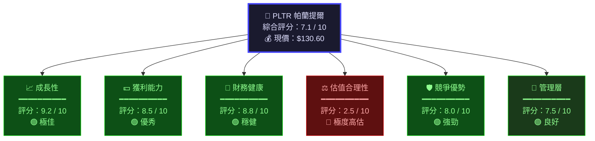

---

### 📡 ASCII 多維度雷達圖

```
                    成長性 (9.2)
                       ★★★★★★★★★☆
                    ╱      │      ╲
                  ╱        │        ╲
        管理層  ╱          │          ╲  獲利能力
        (7.5) ★━━━━━━━━━━━━━━━━━━━━━━★ (8.5)
             ╱╲           │           ╱╲
           ╱    ╲         │         ╱    ╲
         ╱        ╲       │       ╱        ╲
       ╱     ████████████████████████        ╲
      ★   ████████████████████████████    ★
競爭優勢  ████████████████████████████  財務健康
(8.0)  ████████████████████████████  (8.8)
       ╲     ████████████████████████        ╱
         ╲        ████████████████        ╱
           ╲        ████████████        ╱
             ╲           │           ╱
              ★━━━━━━━━━━━━━━━━━━━━━━★
                    估值 (2.5)
              ╲           │           ╱
                  ╲        │        ╱
                    ╲      │      ╱

  ╔══════════════════════════════════════╗
  ║  ████ 實際表現   ░░░░ 滿分基準(10)  ║
  ║  綜合評分：7.1/10  評級：🟡 謹慎買入 ║
  ╚══════════════════════════════════════╝
```

---

### 📊 各維度評分條視覺化

```
維度          評分    視覺化評分條（每格=0.5分）
─────────────────────────────────────────────────────────────
成長性         9.2   ▓▓▓▓▓▓▓▓▓▓▓▓▓▓▓▓▓▓░░  🟢 極強
獲利能力       8.5   ▓▓▓▓▓▓▓▓▓▓▓▓▓▓▓▓▓░░░  🟢 強
財務健康       8.8   ▓▓▓▓▓▓▓▓▓▓▓▓▓▓▓▓▓▓░░  🟢 強
競爭優勢       8.0   ▓▓▓▓▓▓▓▓▓▓▓▓▓▓▓▓░░░░  🟢 強
管理層         7.5   ▓▓▓▓▓▓▓▓▓▓▓▓▓▓▓░░░░░  🟢 良好
估值合理性     2.5   ▓▓▓▓▓░░░░░░░░░░░░░░░  🔴 高度警示
─────────────────────────────────────────────────────────────
綜合加權       7.1   ▓▓▓▓▓▓▓▓▓▓▓▓▓▓░░░░░░  🟡 謹慎
─────────────────────────────────────────────────────────────
滿分基準：     10.0  ▓▓▓▓▓▓▓▓▓▓▓▓▓▓▓▓▓▓▓▓
```

---

### 🎯 投資決策快速結論

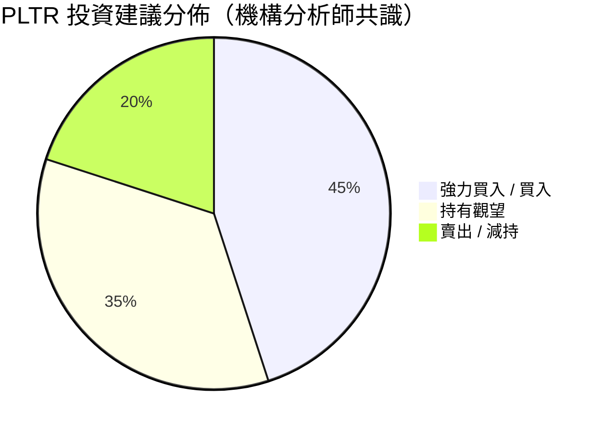

> 📌 **本報告結論**：`🟡 條件性持有 / 逢低謹慎布局` — 基本面極佳，但估值嚴重溢價，需等待合理進場時機

---

## 2. 六維度評分矩陣

### 📋 詳細評分表格

| 維度 | 評分 | 評級 | 核心依據 | 關鍵指標 |
|------|:----:|:----:|----------|----------|
| 📈 **成長性** | **9.2** | 🟢 極佳 | 營收年增率70%（TTM），AI驅動爆發式成長 | 收入 $4.48B TTM, YoY +70% |
| 💵 **獲利能力** | **8.5** | 🟢 優秀 | 毛利率82.4%，營業利益率40.9%，已穩定盈利 | ROE 26%, 淨利率 36.3% |
| 🏦 **財務健康** | **8.8** | 🟢 穩健 | 現金 $7.18B，負債極低，流動比率7.11 | 負債/股本 3.06%，零有息負債壓力 |
| ⚖️ **估值合理性** | **2.5** | 🔴 高估 | P/E 207x，P/S 69.8x，EV/EBITDA 212x，極度溢價 | 本益比遠超同業均值 |
| 🛡️ **競爭優勢** | **8.0** | 🟢 強勁 | 政府級AI平台壟斷，資料護城河深厚，轉換成本極高 | 唯一具備AIP+Gotham+Foundry完整生態 |
| 👔 **管理層** | **7.5** | 🟢 良好 | Karp執行力強，但薪酬結構及稀釋問題存疑 | 股票稀釋風險，長期願景清晰 |

---

### 📊 Unicode 評分條詳細視覺化

```
╔══════════════════════════════════════════════════════════════╗
║              PLTR 六維度量化評分儀表板                       ║
╠══════════════════════════════════════════════════════════════╣
║                                                              ║
║  成長性    [9.2/10] ██████████████████░░ ★★★★★            ║
║                      ←──極佳──→                              ║
║                                                              ║
║  獲利能力  [8.5/10] █████████████████░░░ ★★★★☆            ║
║                      ←──優秀──→                              ║
║                                                              ║
║  財務健康  [8.8/10] █████████████████░░░ ★★★★★            ║
║                      ←──穩健──→                              ║
║                                                              ║
║  估值      [2.5/10] █████░░░░░░░░░░░░░░░ ★☆☆☆☆  ⚠️HIGH  ║
║                      ←危險→                                  ║
║                                                              ║
║  競爭優勢  [8.0/10] ████████████████░░░░ ★★★★☆            ║
║                      ←──強勁──→                              ║
║                                                              ║
║  管理層    [7.5/10] ███████████████░░░░░ ★★★★☆            ║
║                      ←──良好──→                              ║
║                                                              ║
╠══════════════════════════════════════════════════════════════╣
║  加權綜合  [7.1/10] ██████████████░░░░░░ 🟡 謹慎投資       ║
╚══════════════════════════════════════════════════════════════╝
```

---

### 🎯 風險/報酬矩陣

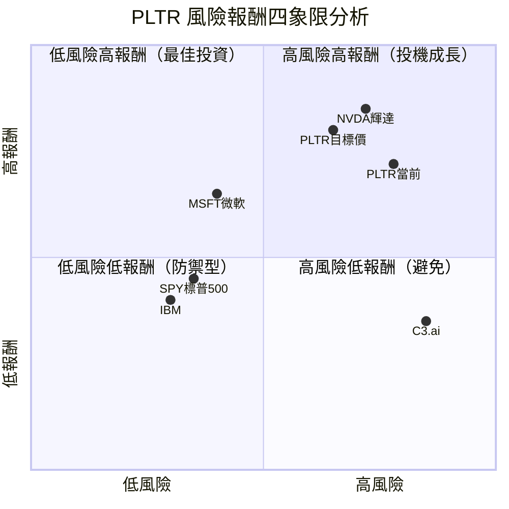

> 💡 **矩陣解讀**：PLTR 位於「高風險高報酬」象限，適合風險承受力強的成長型投資人，但估值風險不可忽視

---

## 3. 業務品質評估

### 🏗️ 商業模式架構

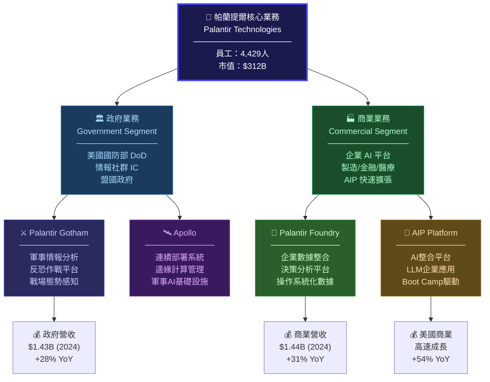

---

### 🛡️ 護城河評估

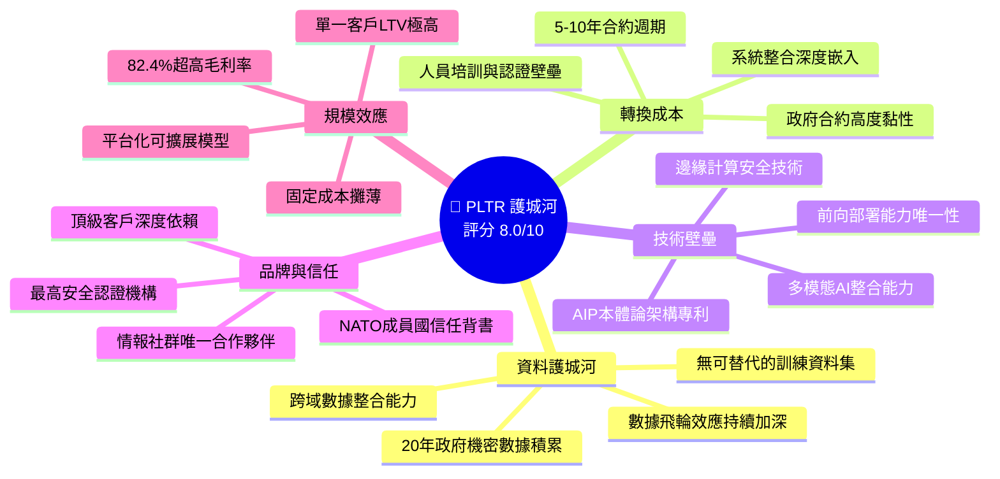

---

### 🏆 市場地位與競爭動態

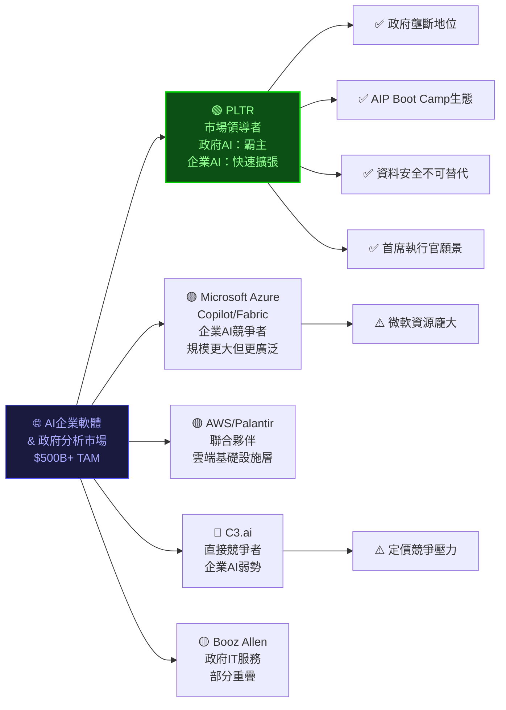

---

### 👔 管理層執行力評分

| 評估項目 | 評分 | 評級 | 說明 |
|----------|:----:|:----:|------|
| **CEO Alex Karp 願景** | 9.0 | 🟢 | 對AI未來的獨特洞見，政府關係無可匹敵 |
| **戰略執行能力** | 8.0 | 🟢 | AIP策略成功轉型，商業化加速驗證 |
| **資本配置** | 7.0 | 🟢 | 現金管理審慎，但股票回購不積極 |
| **股東利益保護** | 5.5 | 🟡 | 股票薪酬稀釋問題持續（SBC高達收入15%+） |
| **透明度與溝通** | 7.5 | 🟢 | 法說會坦率，但財務指引偶爾過於保守 |
| **人才招募與留任** | 7.0 | 🟢 | 頂尖工程人才，但小規模限制擴張速度 |
| **綜合管理評分** | **7.3** | 🟢 | 整體優秀，稀釋問題為主要隱患 |

---

## 4. 財務健康評估

### 📊 財務儀表板

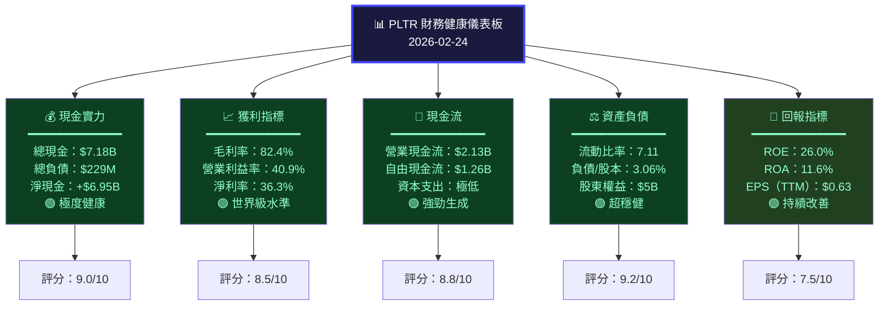

---

### 📈 獲利能力趨勢（近4年）

| 財務指標 | 2021 | 2022 | 2023 | 2024 | 趨勢 | 評級 |
|----------|:----:|:----:|:----:|:----:|:----:|:----:|
| **總營收** | $1.54B | $1.91B | $2.23B | $2.87B | ↗️ 持續成長 | 🟢 |
| **毛利潤** | $1.20B | $1.50B | $1.79B | $2.30B | ↗️ 強勁 | 🟢 |
| **毛利率** | 77.9% | 78.5% | 80.3% | 80.2% | ↗️ 擴張 | 🟢 |
| **營業收益** | -$411M | -$161M | +$120M | +$310M | ↗️ 大幅改善 | 🟢 |
| **淨利潤** | -$520M | -$374M | +$210M | +$462M | ↗️ 轉虧為盈 | 🟢 |
| **營業現金流** | $334M | $224M | $712M | $1.15B | ↗️ 爆發成長 | 🟢 |
| **自由現金流** | $321M | $184M | $697M | $1.14B | ↗️ 強勁 | 🟢 |
| **研發支出** | $387M | $360M | $405M | $508M | ↗️ 持續投入 | 🟡 |
| **EBITDA** | -$470M | -$139M | +$153M | +$342M | ↗️ 快速改善 | 🟢 |

---

### 🏛️ 資產負債表穩健度視覺化

```
╔══════════════════════════════════════════════════════════════════╗
║                  資產負債表健康指標（2024年底）                  ║
╠══════════════════════════════════════════════════════════════════╣
║                                                                  ║
║  流動比率      7.11  ████████████████████ (>2.0為健康) 🟢超強   ║
║  速動比率      ~6.5  ███████████████████░ (>1.0為健康) 🟢極佳   ║
║  負債/股本     3.06% █░░░░░░░░░░░░░░░░░░░ (<50%為低)  🟢極低   ║
║  現金覆蓋率    31x+  ████████████████████ 現金遠超負債  🟢頂級   ║
║  利息覆蓋率    N/A   ████████████████████ 幾乎無有息負債🟢      ║
║                                                                  ║
╠══════════════════════════════════════════════════════════════════╣
║  📊 資產結構分解（$6.34B總資產）                                 ║
║                                                                  ║
║  現金及等價物  $2.10B  ███████░░░░░░░░░░  33.1%               ║
║  短期投資      $4.08B  █████████████░░░░  64.3%  (含國庫券等)  ║
║  其他流動資產  $0.53B  ██░░░░░░░░░░░░░░░   8.4%               ║
║  長期資產      $0.41B  █░░░░░░░░░░░░░░░░   6.5%               ║
║                                                                  ║
╠══════════════════════════════════════════════════════════════════╣
║  💡 結論：資產負債表為近年少見的極度健康狀態，現金儲備充裕，     ║
║          幾乎無財務槓桿風險，具備強大的抗風險與擴張能力          ║
╚══════════════════════════════════════════════════════════════════╝
```

---

### 🌊 現金流生成分析

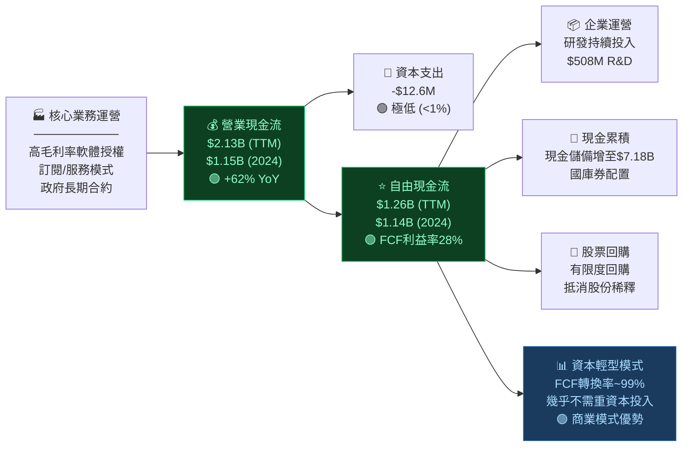

---

## 5. 成長性評估

### 🚀 成長軌跡分析

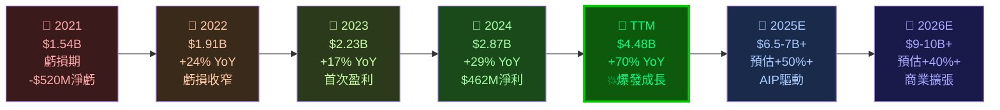

---

### 📊 歷史成長率 CAGR 分析

| 成長指標 | 1年 | 2年 CAGR | 3年 CAGR | 趨勢 | 評級 |
|----------|:---:|:--------:|:--------:|:----:|:----:|
| **總營收** | +70.0% | +46.5% | +23.1% | 📈 加速 | 🟢 |
| **毛利潤** | +65.8% | +43.2% | +24.0% | 📈 強勁 | 🟢 |
| **美國商業營收** | +54% | +40%+ | N/A | 📈 爆發 | 🟢 |
| **政府營收** | +28% | +25% | +20% | 📈 穩定 | 🟢 |
| **自由現金流** | +63.5% | +47.0% | N/A | 📈 快速 | 🟢 |
| **客戶數量** | +43% | +35% | +30% | 📈 擴張 | 🟢 |
| **每股盈餘** | +108% | +N/A | 虧轉盈 | 📈 翻轉 | 🟢 |

> 📌 **TTM營收 $4.48B vs 2024年報 $2.87B 差距**：反映Q1-Q2 2025爆發性成長加速，AIP商業化效應顯著

---

### 🔮 未來成長驅動力

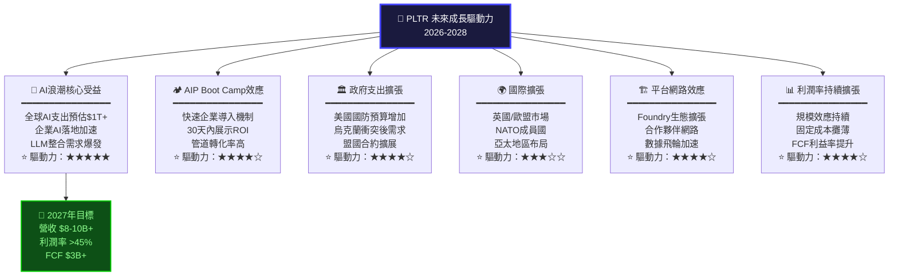

---

### 📊 市場份額趨勢視覺化

```
╔══════════════════════════════════════════════════════════════════╗
║             PLTR 市場滲透率增長趨勢                              ║
╠══════════════════════════════════════════════════════════════════╣
║                                                                  ║
║  美國政府AI分析市場（佔有率）                                    ║
║  2021: ████████████████░░░░░░░░  ~65%  🟢 領先                 ║
║  2022: ████████████████░░░░░░░░  ~62%  🟡 輕微下滑             ║
║  2023: █████████████████░░░░░░░  ~68%  🟢 回升                 ║
║  2024: ██████████████████░░░░░░  ~72%  🟢 持續擴大             ║
║                                                                  ║
║  美國商業AI平台市場（快速滲透）                                   ║
║  2022: ██░░░░░░░░░░░░░░░░░░░░░░   ~8%  起步期                  ║
║  2023: ████░░░░░░░░░░░░░░░░░░░░  ~15%  🟡 成長                 ║
║  2024: ████████░░░░░░░░░░░░░░░░  ~28%  🟢 快速擴張             ║
║  2025E:████████████░░░░░░░░░░░░  ~40%+ 🟢 加速                 ║
║                                                                  ║
║  客戶數量增長                                                    ║
║  2021: ██████░░░░░░░░░░░░░░░░░░  ~200客戶                      ║
║  2022: █████████░░░░░░░░░░░░░░░  ~300客戶                      ║
║  2023: ████████████░░░░░░░░░░░░  ~400客戶                      ║
║  2024: ████████████████░░░░░░░░  ~600客戶                      ║
║  2025E:████████████████████░░░░  ~900客戶 (預估)               ║
║                                                                  ║
╚══════════════════════════════════════════════════════════════════╝
```

---

## 6. 估值合理性評估

### ⚖️ 估值矩陣決策樹

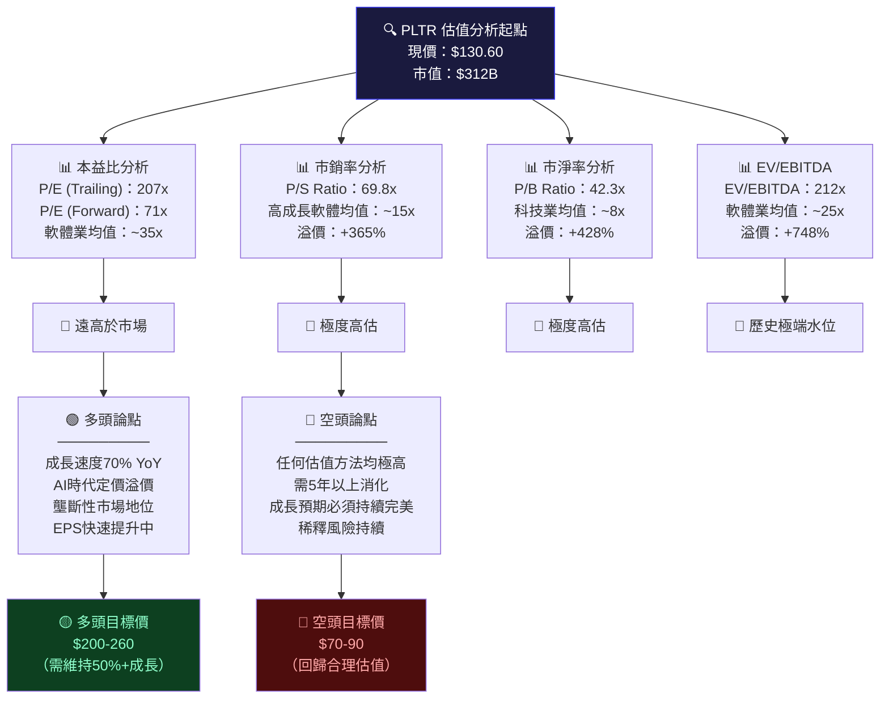

---

### 📋 多重估值法比較表格

| 估值方法 | 當前數值 | 同業均值 | 公允價值估計 | 溢/折價 | 評級 |
|----------|:--------:|:--------:|:------------:|:-------:|:----:|
| **P/E (Trailing)** | 207.3x | 35x | $10.6（理論值） | +492% 溢價 | 🔴 |
| **P/E (Forward)** | 71.5x | 35x | $63.9 | +104% 溢價 | 🔴 |
| **P/S Ratio** | 69.8x | 15x | $28.0 | +366% 溢價 | 🔴 |
| **P/B Ratio** | 42.3x | 8x | $24.6 | +431% 溢價 | 🔴 |
| **EV/EBITDA** | 212x | 25x | $15.2（理論值） | +748% 溢價 | 🔴 |
| **DCF（基準）** | — | — | $90-120 | 約-8~+0% | 🟡 |
| **DCF（樂觀）** | — | — | $150-200 | +15~+53% | 🟡 |
| **分析師目標均值** | — | — | $189.92 | +45.4% 上行 | 🟢 |
| **分析師目標高** | — | — | $260.00 | +99.1% 上行 | 🟢 |
| **分析師目標低** | — | — | $70.00 | -46.4% 下行 | 🔴 |

> ⚠️ **重要提醒**：PLTR 的估值溢價反映市場對AI成長的極度樂觀預期，需要未來數年維持高速成長才能合理化現有估值

---

### 📊 估值區間視覺化

```
╔══════════════════════════════════════════════════════════════════╗
║                  PLTR 估值區間分析圖（$）                        ║
╠══════════════════════════════════════════════════════════════════╣
║                                                                  ║
║  $  0  ──────────────────────────────────────────── $300        ║
║         │    │         │        │    │        │        │        ║
║        $50  $70       $120     $150 $190     $260     $300      ║
║         │    │         │        │    │        │        │        ║
║         │  🔴空頭     │🟡DCF  🟡│  🟢分析   🟢分析   │        ║
║         │  目標低     │基準  現價│  師均值   師高估   │        ║
║         │             │        │    │        │        │        ║
║  ━━━━━━━━━━━━━━━━━━━━━━━━━━━━━━━━━━━━━━━━━━━━━━━━━━━━━━━━━━━━  ║
║  極度低估│低估區間 │合理區間│ 現價 │略微高估│ 高估  │泡沫    ║
║  $0-50  │$50-90   │$90-140 │$130.6│$140-170│$170-220│$220+   ║
║         │         │        │  ⬆️  │        │        │        ║
║         │         │ ←──現價位於合理/略高估邊界──→            ║
║                                                                  ║
║  🔴 傳統估值法：極度高估（P/E 207x vs 行業35x）                 ║
║  🟡 DCF估值法：基準 $90-120，樂觀 $150-200                     ║
║  🟢 市場共識：$189.92（未來12個月目標）                         ║
╚══════════════════════════════════════════════════════════════════╝
```

---

### 🏆 同業估值比較

| 公司 | 股票代號 | P/E | P/S | 營收成長 | 毛利率 | 市值 | 評級 |
|------|----------|:---:|:---:|:--------:|:------:|:----:|:----:|
| **帕蘭提爾** | **PLTR** | **207x** | **69.8x** | **70%** | **82.4%** | **$312B** | 🟡 |
| 微軟 | MSFT | 32x | 12x | 16% | 69% | $3T | 🟢 |
| Salesforce | CRM | 42x | 8x | 9% | 77% | $280B | 🟢 |
| ServiceNow | NOW | 58x | 14x | 22% | 79% | $200B | 🟡 |
| C3.ai | AI | N/A | 9x | 26% | 59% | $5B | 🔴 |
| Snowflake | SNOW | N/A | 15x | 29% | 67% | $55B | 🟡 |
| 輝達 | NVDA | 35x | 20x | 114% | 75% | $3T | 🟢 |

> 📌 **結論**：PLTR 估值在同業中最高，僅有成長速度勉強可與輝達類比，但本益比遠超後者

---

## 7. 風險評估

### 🔥 風險熱圖

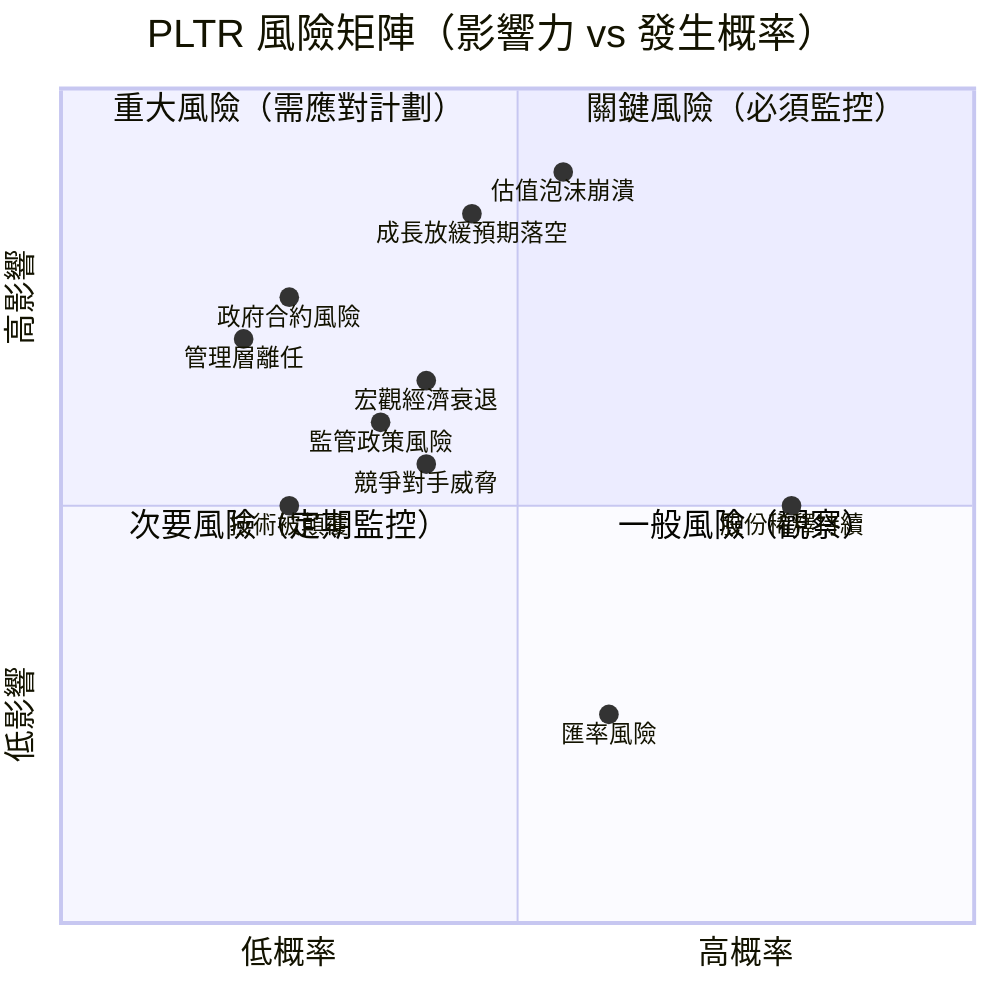

---

### 📋 風險評估詳細表格

| 風險類別 | 風險事項 | 發生概率 | 影響程度 | 風險等級 | 評級 |
|----------|----------|:--------:|:--------:|:--------:|:----:|
| **估值風險** | 高估值面臨修正，一旦成長放緩將大幅下跌 | 高 | 極高 | **⚠️ 關鍵** | 🔴 |
| **成長預期** | 70% YoY成長難以持續，市場期望值過高 | 中高 | 高 | **⚠️ 關鍵** | 🔴 |
| **股份稀釋** | 每年SBC約$400-600M，持續稀釋股東價值 | 高 | 中 | **⚠️ 重要** | 🔴 |
| **政府預算** | 美國防預算削減或合約重新招標風險 | 低中 | 高 | **⚠️ 重要** | 🟡 |
| **競爭加劇** | 微軟/亞馬遜/Google進入企業AI分析市場 | 中 | 中高 | **注意** | 🟡 |
| **監管風險** | 資料隱私法規、AI監管政策收緊 | 中 | 中 | **注意** | 🟡 |
| **宏觀風險** | 利率上升/經濟衰退影響企業IT支出 | 中 | 中高 | **注意** | 🟡 |
| **集中風險** | 政府客戶集中度高，單一客戶風險 | 低中 | 高 | **注意** | 🟡 |
| **人才風險** | 小規模團隊（4429人）制約高速擴張 | 中 | 中 | **觀察** | 🟡 |
| **技術顛覆** | 開源AI工具降低企業對商業平台需求 | 低 | 中高 | **觀察** | 🟢 |
| **匯率風險** | 國際業務匯率波動 | 高 | 低 | **一般** | 🟢 |
| **流動性風險** | 幾乎無此風險（$7.18B現金） | 極低 | 低 | **無憂** | 🟢 |

---

### 🛡️ 風險緩解措施

```
╔══════════════════════════════════════════════════════════════════╗
║                     風險緩解框架                                 ║
╠══════════════════════════════════════════════════════════════════╣
║                                                                  ║
║  🔴 關鍵風險緩解措施                                             ║
║  ┌─────────────────────────────────────────────────────────┐    ║
║  │ 1. 估值風險：分批建倉，設定停損，等待回調至DCF合理區間   │    ║
║  │ 2. 成長預期：每季追蹤AIP客戶新增數及NRR指標             │    ║
║  │ 3. 股份稀釋：關注每股FCF增長速度是否超過稀釋率          │    ║
║  └─────────────────────────────────────────────────────────┘    ║
║                                                                  ║
║  🟡 中等風險緩解措施                                             ║
║  ┌─────────────────────────────────────────────────────────┐    ║
║  │ 4. 政府風險：觀察政府業務成長率是否穩定於20%+           │    ║
║  │ 5. 競爭風險：追蹤AIP生態差異化是否維持                  │    ║
║  │ 6. 宏觀風險：持倉比例不超過投資組合15%                  │    ║
║  └─────────────────────────────────────────────────────────┘    ║
║                                                                  ║
║  🟢 公司天然護城河                                               ║
║  ┌─────────────────────────────────────────────────────────┐    ║
║  │ ✅ $7.18B現金 — 充足流動性緩衝                           │    ║
║  │ ✅ 零有意義負債 — 無財務危機風險                          │    ║
║  │ ✅ 政府合約黏性 — 多年期合約保護基本盤                   │    ║
║  │ ✅ 技術壁壘 — 數據護城河難以複製                         │    ║
║  └─────────────────────────────────────────────────────────┘    ║
╚══════════════════════════════════════════════════════════════════╝
```

---

## 8. 催化劑與觸發因素

### 📅 催化劑時間軸

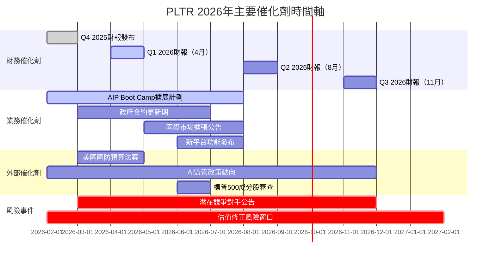

---

### 🔥 觸發因素分析

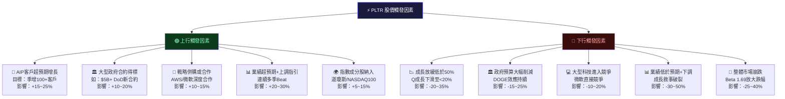

---

## 9. 投資建議

### 🎯 最終評級決策

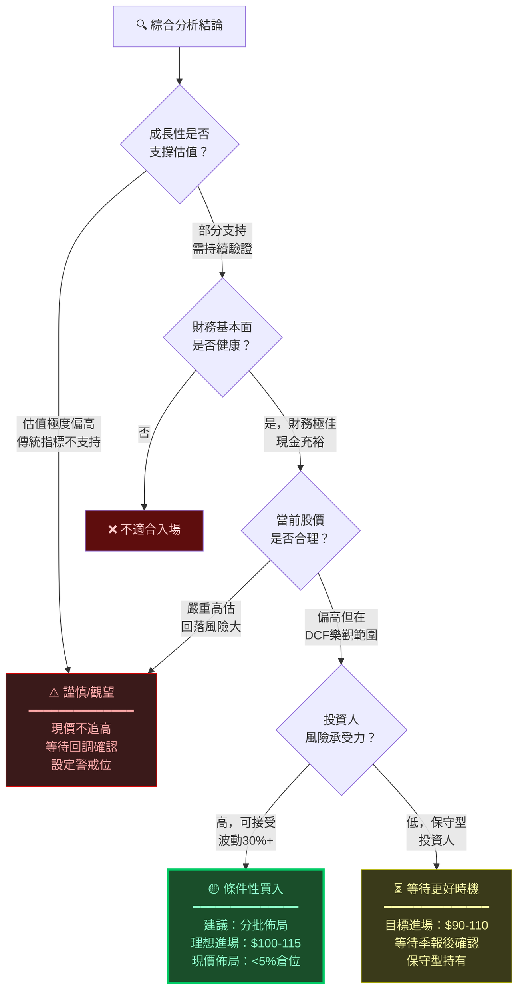

---

### ⭐ 綜合評級

```
╔══════════════════════════════════════════════════════════════════╗
║                                                                  ║
║         ★ ★ ★ ★ ☆   評級：4顆星（滿分5顆）                    ║
║                                                                  ║
║     🏢 PLTR 帕蘭提爾科技 — 最終投資評級                         ║
║     ━━━━━━━━━━━━━━━━━━━━━━━━━━━━━━━━━━━                         ║
║                                                                  ║
║     📊 綜合評分：7.1 / 10                                        ║
║     💡 投資評級：🟡 謹慎持有 / 逢低佈局                         ║
║     ⏱️  建議持倉期：3-5年長期                                    ║
║     💰 現價：$130.60                                             ║
║     🎯 12個月目標：$155-190（基準/樂觀）                         ║
║                                                                  ║
║  ┌──────────────────────────────────────────────────────────┐   ║
║  │  ✅ 買入理由：AI領域稀缺標的，成長確定性高，財務極健康  │   ║
║  │  ⚠️  風險提示：估值極度偏高，需接受高波動性             │   ║
║  │  📌 策略建議：分批佈局，$100-115為理想進場區間          │   ║
║  └──────────────────────────────────────────────────────────┘   ║
╚══════════════════════════════════════════════════════════════════╝
```

---

### 🎯 目標價區間

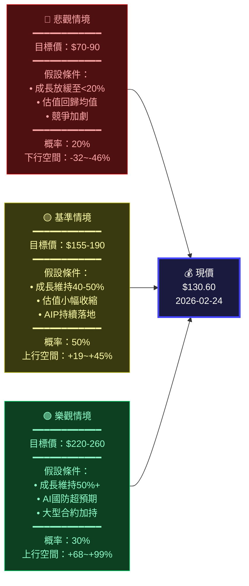

---

### 👥 投資人適配度

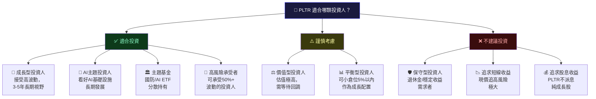

---

### 📋 建議持倉時間與操作策略

```
╔══════════════════════════════════════════════════════════════════╗
║                  PLTR 投資策略建議書                             ║
╠══════════════════════════════════════════════════════════════════╣
║                                                                  ║
║  ⏱️  建議持倉時間：3-5年長線                                     ║
║                                                                  ║
║  📌 分批建倉策略（適合積極型投資人）                             ║
║  ┌─────────────────────────────────────────────────────────┐    ║
║  │  第一批（20%倉位）：$115-125  若回調至此區間介入        │    ║
║  │  第二批（30%倉位）：$100-115  強力支撐區介入            │    ║
║  │  第三批（30%倉位）：$85-100   深度回調/市場恐慌時加倉   │    ║
║  │  第四批（20%倉位）：$130（現價）已持倉者維持            │    ║
║  └─────────────────────────────────────────────────────────┘    ║
║                                                                  ║
║  🎯 獲利了結策略                                                 ║
║  ┌─────────────────────────────────────────────────────────┐    ║
║  │  第一目標：$180-190（+38~45%）減倉30%                  │    ║
║  │  第二目標：$220-240（+68~84%）再減倉30%                │    ║
║  │  長期持有：剩餘40%持倉，目標$300+（3年以上）           │    ║
║  └─────────────────────────────────────────────────────────┘    ║
║                                                                  ║
║  🛡️ 停損設置                                                     ║
║  ┌─────────────────────────────────────────────────────────┐    ║
║  │  技術停損：$95（跌破則重新評估）                        │    ║
║  │  基本面停損：若季度成長率持續低於25% YoY 則減持        │    ║
║  │  估值停損：若AIP客戶數季增低於50家則觀察              │    ║
║  └─────────────────────────────────────────────────────────┘    ║
║                                                                  ║
║  📊 倉位建議（佔整體投資組合）                                   ║
║  ┌─────────────────────────────────────────────────────────┐    ║
║  │  保守型投資組合：0-3%                                   │    ║
║  │  平衡型投資組合：3-8%                                   │    ║
║  │  成長型投資組合：8-15%                                  │    ║
║  │  主題集中型：最高20%（高風險）                          │    ║
║  └─────────────────────────────────────────────────────────┘    ║
║                                                                  ║
║  🔍 每季追蹤指標                                                 ║
║  ┌─────────────────────────────────────────────────────────┐    ║
║  │  ① 美國商業客戶季度新增數（目標 >50/季）               │    ║
║  │  ② 美國商業營收成長率（目標 >40% YoY）                 │    ║
║  │  ③ 政府業務成長率（目標 >20% YoY）                     │    ║
║  │  ④ 調整後自由現金流利益率（目標 >25%）                 │    ║
║  │  ⑤ NRR/Net Revenue Retention（目標 >115%）             │    ║
║  └─────────────────────────────────────────────────────────┘    ║
╚══════════════════════════════════════════════════════════════════╝
```

---

### 📊 最終評分總結

```
╔══════════════════════════════════════════════════════════════════╗
║                  PLTR 最終評估卡片                               ║
╠════════════════════════╦═════════════════════════════════════════╣
║  股票代號              ║  PLTR（帕蘭提爾科技）                   ║
╠════════════════════════╬═════════════════════════════════════════╣
║  現價                  ║  $130.60                                 ║
╠════════════════════════╬═════════════════════════════════════════╣
║  市值                  ║  $312.35B                                ║
╠════════════════════════╬═════════════════════════════════════════╣
║  綜合評分              ║  7.1 / 10  🟡                           ║
╠════════════════════════╬═════════════════════════════════════════╣
║  成長性                ║  9.2 / 10  🟢 ████████████████████░░   ║
╠════════════════════════╬═════════════════════════════════════════╣
║  獲利能力              ║  8.5 / 10  🟢 █████████████████░░░░    ║
╠════════════════════════╬═════════════════════════════════════════╣
║  財務健康              ║  8.8 / 10  🟢 █████████████████░░░     ║
╠════════════════════════╬═════════════════════════════════════════╣
║  估值合理性            ║  2.5 / 10  🔴 █████░░░░░░░░░░░░░░░░    ║
╠════════════════════════╬═════════════════════════════════════════╣
║  競爭優勢              ║  8.0 / 10  🟢 ████████████████░░░░     ║
╠════════════════════════╬═════════════════════════════════════════╣
║  管理層                ║  7.5 / 10  🟢 ███████████████░░░░░     ║
╠════════════════════════╬═════════════════════════════════════════╣
║  最終評級              ║  ⭐⭐⭐⭐☆  謹慎持有 / 逢低佈局       ║
╠════════════════════════╬═════════════════════════════════════════╣
║  目標價（12個月）      ║  🐻 $70   🎯 $155-190   🐂 $220-260   ║
╠════════════════════════╬═════════════════════════════════════════╣
║  適合投資人            ║  成長型 / 高風險承受 / 3-5年長線       ║
╠════════════════════════╬═════════════════════════════════════════╣
║  關鍵監控指標          ║  AIP客戶增長 / 商業收入 / FCF利益率    ║
╚════════════════════════╩═════════════════════════════════════════╝

  核心投資命題：
  ┌─────────────────────────────────────────────────────────────┐
  │  PLTR 是 AI 時代政府與企業數據分析的稀缺核心資產，           │
  │  擁有近乎完美的財務結構與成長動能，唯一的核心挑戰是          │
  │  估值已預先反映5-7年的完美成長預期，現價進場需要具備         │
  │  極高的風險承受能力與長期投資視野。                          │
  │                                                               │
  │  建議策略：等待回調至 $100-115 分批佈局，或小倉位現價介入    │
  │  作為核心AI主題持股，嚴格監控季度基本面以驗證成長敘事。      │
  └─────────────────────────────────────────────────────────────┘
```

---

> ⚠️ **免責聲明**：本報告為 AI 自動生成，所有數據截至 2026-02-24，僅供研究與教育目的參考，**不構成任何投資建議**。股票投資存在風險，過往表現不代表未來回報，投資前請諮詢持牌財務顧問並進行獨立盡職調查。本報告作者對任何投資損失不承擔任何責任。