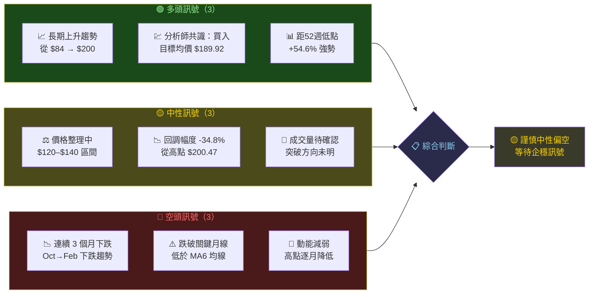
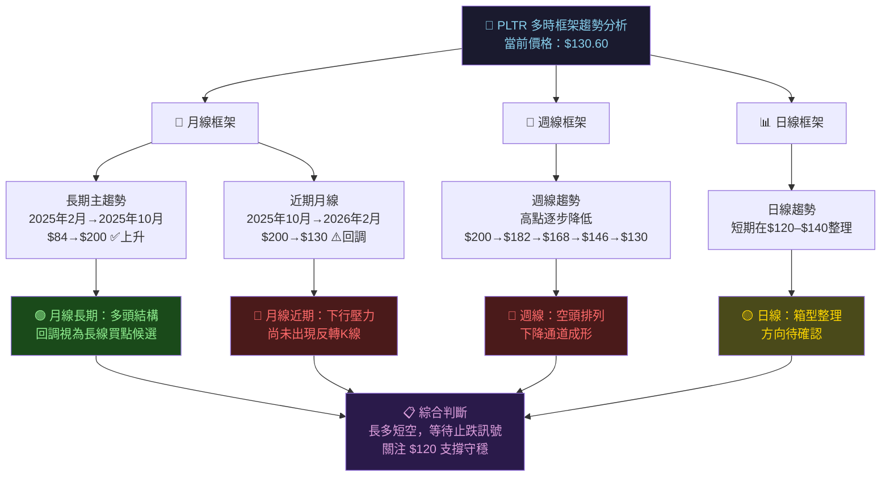
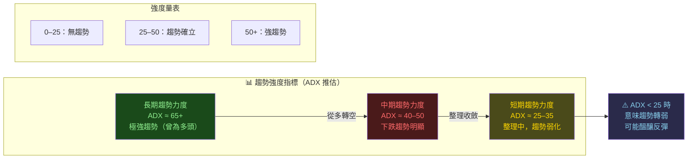
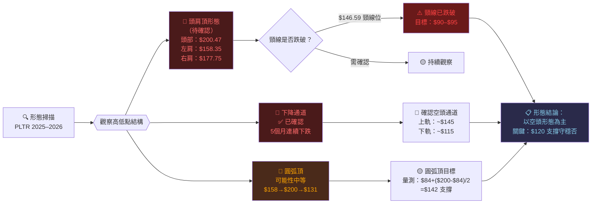
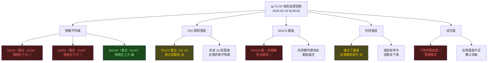
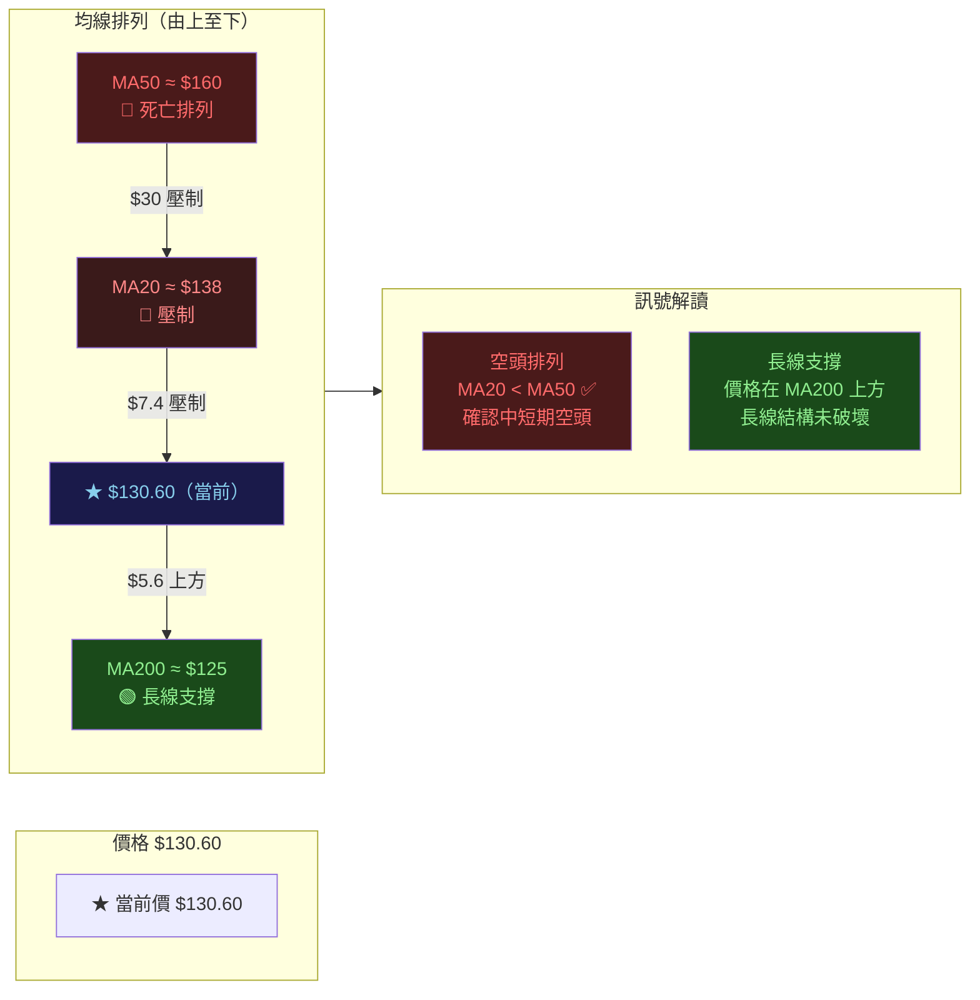
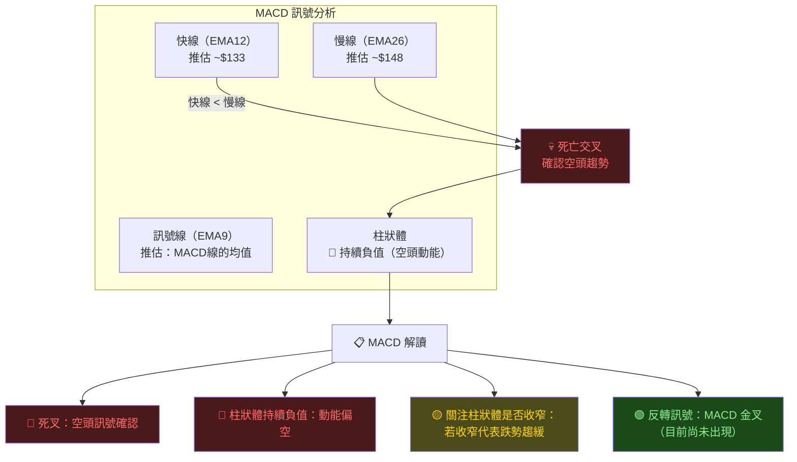
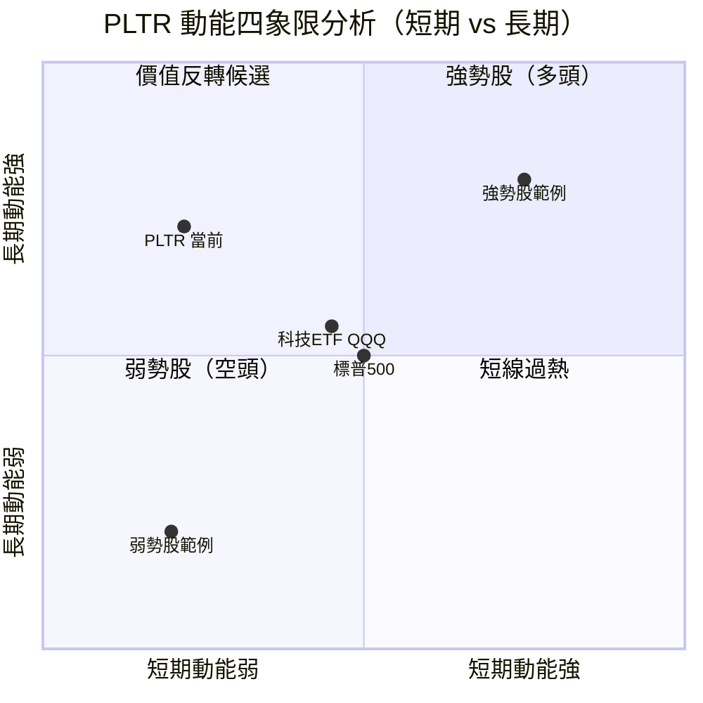
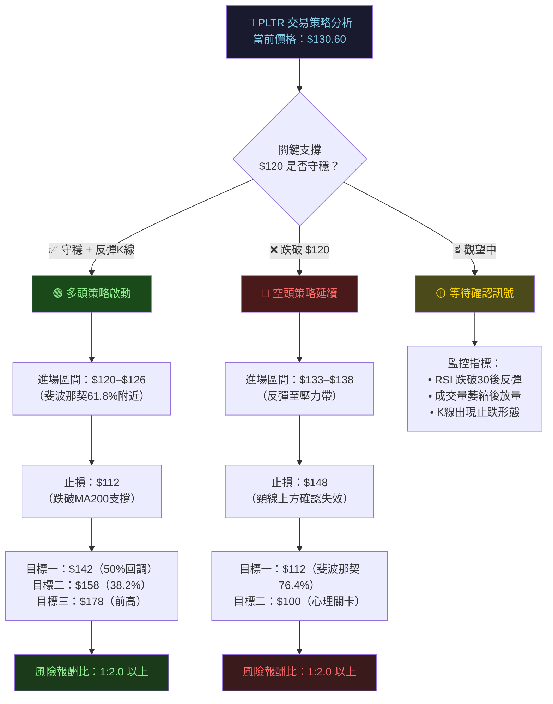
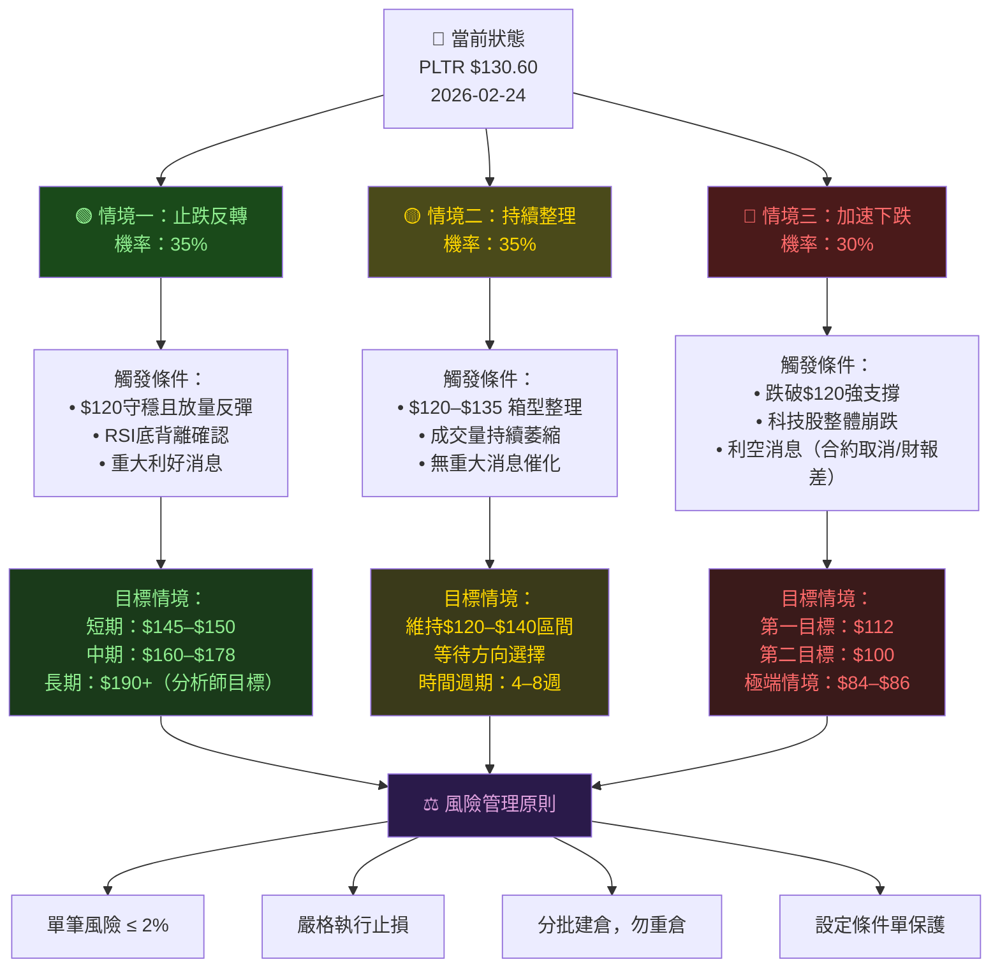

# PLTR 技術分析報告

> **報告日期**：2026-02-24 ｜ **語言**：繁體中文 ｜ **數據來源**：Yahoo Finance
> **當前價格**：$130.60 ｜ **52週區間**：$84.40 – $200.47

---

## 目錄

1. [技術面概覽](#1-技術面概覽)
2. [趨勢分析](#2-趨勢分析)
3. [圖表形態分析](#3-圖表形態分析)
4. [支撐與阻力](#4-支撐與阻力)
5. [技術指標深度解讀](#5-技術指標深度解讀)
6. [動能與波動率](#6-動能與波動率)
7. [多時框架總結](#7-多時框架總結)
8. [交易策略建議](#8-交易策略建議)
9. [風險提示與監控](#9-風險提示與監控)

---

## 1. 技術面概覽

### 🖥️ 技術訊號儀表板



---

### 📊 核心指標速覽表

| 指標類別 | 指標名稱 | 當前數值 | 狀態 | 訊號 |
|:---:|:---:|:---:|:---:|:---:|
| **價格** | 當前收盤價 | $130.60 | 3個月回調中 | 🔴 |
| **價格** | 52週最高 | $200.47 | 距高點 -34.8% | 🔴 |
| **價格** | 52週最低 | $84.40 | 距低點 +54.6% | 🟢 |
| **均線** | MA3（近3月均） | ~$148.28 | 價格在均線下 | 🔴 |
| **均線** | MA6（近6月均） | ~$164.38 | 價格在均線下 | 🔴 |
| **均線** | MA12（年均） | ~$148.05 | 接近均線下緣 | 🟡 |
| **動能** | 1個月動能 | -10.88% | 弱勢 | 🔴 |
| **動能** | 3個月動能 | -34.80% | 顯著弱勢 | 🔴 |
| **動能** | 12個月動能 | +53.77% | 長線仍強 | 🟢 |
| **估值** | 分析師目標均價 | $189.92 | 上行空間 +45.4% | 🟢 |
| **情緒** | 分析師評級 | 買入 | 機構樂觀 | 🟢 |
| **波動** | 近3月波動幅度 | ±$35 | 高波動 | 🟡 |

---

### 🎯 技術評分卡

```
╔══════════════════════════════════════════════════════════╗
║              PLTR  技術評分卡  2026-02-24                ║
╠══════════════════╦══════════════╦════════╦═══════════════╣
║  評估維度        ║  評分（/10） ║  等級  ║  說明         ║
╠══════════════════╬══════════════╬════════╬═══════════════╣
║  長期趨勢        ║     7.0      ║  良好  ║  年線上揚明顯 ║
║  中期趨勢        ║     3.5      ║  偏弱  ║  3月下跌通道  ║
║  短期動能        ║     3.0      ║  弱勢  ║  持續走低     ║
║  支撐強度        ║     5.5      ║  中性  ║  $120關鍵支撐 ║
║  形態完整性      ║     5.0      ║  中性  ║  整理形態中   ║
║  成交量配合      ║     4.5      ║  偏弱  ║  量能待確認   ║
║  分析師共識      ║     7.5      ║  良好  ║  目標+45.4%  ║
╠══════════════════╬══════════════╬════════╬═══════════════╣
║  綜合總分        ║     5.1/10   ║  中性  ║  謹慎觀望     ║
╚══════════════════╩══════════════╩════════╩═══════════════╝
```

**綜合技術評分進度條：**
```
總體評分  5.1/10  ▓▓▓▓▓░░░░░  51%  🟡 中性
多頭動能  3.2/10  ▓▓▓░░░░░░░  32%  🔴 偏弱
空頭壓力  6.8/10  ▓▓▓▓▓▓▓░░░  68%  🔴 偏強
長線展望  7.0/10  ▓▓▓▓▓▓▓░░░  70%  🟢 樂觀
```

---

## 2. 趨勢分析

### 📐 多時框趨勢判斷



---

### 📈 長期趨勢 — 12個月月線走勢圖

```
PLTR 月線收盤價走勢（2025年2月 → 2026年2月）
價格($)
 210 │                                    ◆ $200.47（歷史高點）
 200 │                                   ╱
 190 │                                  ╱
 182 │                                ╱     ╲
 177 │                               ╱    ◇$177
 168 │                              ╱   ╲  ╱
 160 │              ◆$158          ╱     ╲╱
 158 │             ╱              ╱
 147 │            ╱  ◆$156       ╱                    ◆$147
 137 │           ╱              ╱                        ╲
 136 │          ╱              ╱                          ╲
 132 │         ╱              ╱                           ◆$131←現在
 118 │        ◆             ╱
 110 │       ╱             ╱
  85 │ ◆────╱
  84 │ $85
     └──────────────────────────────────────────────────────────▶ 時間
       Feb  Mar  Apr  May  Jun  Jul  Aug  Sep  Oct  Nov  Dec  Jan  Feb
       2025                                                       2026

  ━━━━━━━━━━━━━━━━━━━━━━━━━━━━━━━━━━━━━━━━━━━━━━━━
  🟢 第一階段（Feb–Oct）：強勢上漲 +136.6%
  🔴 第二階段（Oct–Feb）：回調下跌  -34.8%
  ━━━━━━━━━━━━━━━━━━━━━━━━━━━━━━━━━━━━━━━━━━━━━━━━
```

---

### 📉 中期趨勢分析（近5個月下行通道）

```
價格($)   下行通道示意（2025年10月 → 2026年2月）
 205 │ ╔══════════════════════════════════════╗ ← 通道上軌
 200 │ ║ ◆ $200.47（高點）                    ║
 195 │ ║╲                                     ║
 190 │ ║ ╲                                    ║
 185 │ ║  ╲                                   ║
 180 │ ║   ╲  ◆$177                           ║
 175 │ ║    ╲                                 ║
 170 │ ║     ╲                                ║
 168 │ ║      ◆$168                           ║
 165 │ ║       ╲                              ║
 160 │ ║        ╲                             ║ ← 通道中軌（MA）
 155 │ ║         ╲                            ║
 150 │ ║          ╲                           ║
 147 │ ║           ◆$147                      ║
 140 │ ║            ╲                         ║
 135 │ ║             ╲                        ║
 131 │ ║              ◆$131 ← 當前            ║
 125 │ ╚══════════════════════════════════════╝ ← 通道下軌
     └──────────────────────────────────────────▶
       Oct    Nov    Dec    Jan    Feb
       2025                       2026

  📐 通道斜率：每月約下跌 $17–18
  ⚠️ 若跌破 $120，下一支撐見 $100
```

---

### 📊 趨勢強度評估



```
趨勢強度進度條（推估）：
長期（月線） ▓▓▓▓▓▓▓░░░  70%  🟢 強勢（多頭主結構）
中期（週線） ▓▓▓▓▓▓░░░░  60%  🔴 空頭壓力較大
短期（日線） ▓▓▓░░░░░░░  30%  🟡 整理弱化中
```

---

## 3. 圖表形態分析

### 🔍 形態識別流程圖



---

### 📊 ASCII 關鍵走勢示意圖（含形態標注）

```
PLTR 形態分析圖（2025年4月 → 2026年2月）
價格($)
        【左 肩】           【頭 部】   【右 肩】（未完整）
  205 │                        ★ $200.47
  200 │                       ╱ ╲
  195 │                      ╱   ╲
  190 │                     ╱     ╲
  185 │            ★$182   ╱       ╲
  180 │           ╱       ╱         ╲
  175 │          ╱       ╱        ★$178╲
  170 │         ╱       ╱              ╲
  165 │        ╱       ╱                ╲
  160 │   ★$158       ╱                  ╲
  158 │  ╱           ╱                    ╲
  150 │ ╱           ╱                      ╲
  147 │╱           ╱                    ★$147
  140 │           ╱           ══════════════════ ← 頸線 ~$146
  135 │          ╱              （頸線已跌破❗）
  131 │         ╱                           ★$131 ←現在
  125 │        ╱
  120 │       ╱                    ════════════ ← 強支撐 $120
  118 │    ★$118
  110 │
  100 │                            ════════════ ← 目標支撐 $100
      └─────────────────────────────────────────────────▶ 時間
        Apr  May  Jun  Jul  Aug  Sep  Oct  Nov  Dec  Jan  Feb
        2025                                               2026

  🔴 頭肩頂頸線（$146）已跌破 → 理論目標下行 $90–$96
  🟡 目前在 $120–$135 支撐帶整理
  🟢 若強力反彈站回 $146 → 形態失效，多頭重新主導
```

---

### 🕯️ K線形態分析

| 時段 | K線形態 | 方向含義 | 可信度 |
|:---:|:---:|:---:|:---:|
| 2025年10月 | **長上影線** | 高點拒絕，見頂訊號 | ⭐⭐⭐⭐ |
| 2025年11月 | **大陰線** | 確認反轉，空頭入場 | ⭐⭐⭐⭐⭐ |
| 2025年12月 | **小陽線（十字星）** | 短暫反彈，趨勢未變 | ⭐⭐⭐ |
| 2026年1月 | **中陰線** | 延續下跌通道 | ⭐⭐⭐⭐ |
| 2026年2月 | **陰線整理** | 跌勢持續，底部待確認 | ⭐⭐⭐ |

---

### 🎯 形態目標價計算

```
╔════════════════════════════════════════════════════════╗
║              形態理論目標價計算                         ║
╠════════════════╦════════════════╦══════════════════════╣
║  形態類型      ║  計算方式      ║  目標價              ║
╠════════════════╬════════════════╬══════════════════════╣
║  頭肩頂        ║  頸線-頭高差   ║  $146-($200-$146)   ║
║                ║               ║  = $92（下行目標）   ║
╠════════════════╬════════════════╬══════════════════════╣
║  下降通道下軌  ║  通道寬度投射  ║  ~$115（短期）      ║
╠════════════════╬════════════════╬══════════════════════╣
║  圓弧頂回測    ║  頂部50%回撤  ║  ~$142（反壓）      ║
╠════════════════╬════════════════╬══════════════════════╣
║  反彈目標（多）║  頸線回測      ║  $145–$150（壓力）  ║
╚════════════════╩════════════════╩══════════════════════╝
```

---

## 4. 支撐與阻力

### 🗺️ 關鍵價位分布圖（Unicode 視覺化）

```
PLTR 支撐阻力位分布圖
━━━━━━━━━━━━━━━━━━━━━━━━━━━━━━━━━━━━━━━━━━━━━━
$210 ▓▓▓▓▓▓▓▓▓░░░░░░░░░░░  🔴 強阻力帶（52週高點區）
$200 ▓▓▓▓▓▓▓▓▓░░░░░░░░░░░  🔴 歷史最高點 $200.47
     ░░░░░░░░░░░░░░░░░░░░
$178 ▓▓▓▓▓▓▓░░░░░░░░░░░░░  🔴 中強阻力（11月反彈高）
$175 ▓▓▓▓▓▓▓░░░░░░░░░░░░░  🔴 中強阻力帶
     ░░░░░░░░░░░░░░░░░░░░
$158 ▓▓▓▓▓░░░░░░░░░░░░░░░  🟡 中等阻力（7月整理位）
$150 ▓▓▓▓▓░░░░░░░░░░░░░░░  🟡 心理整數關卡
$146 ▓▓▓▓▓░░░░░░░░░░░░░░░  🔴 頭肩頂頸線（已跌破）
     ━━━━━━━━━━━━━━━━━━━━  ← 當前價格帶
$135 ░░░░░░░░░░░░░░░░░░░░  近期阻力
$131 ◀◀◀◀◀◀◀ 當前價 $130.60 ▶▶▶
$130 ▓▓▓░░░░░░░░░░░░░░░░░  🟡 近期整理區（支撐測試中）
     ░░░░░░░░░░░░░░░░░░░░
$120 ▓▓▓▓▓▓░░░░░░░░░░░░░░  🟢 關鍵支撐（必守）
$118 ▓▓▓▓▓▓░░░░░░░░░░░░░░  🟢 4月突破點支撐
     ░░░░░░░░░░░░░░░░░░░░
$100 ▓▓▓▓▓▓▓▓░░░░░░░░░░░░  🟢 強支撐（心理整數）
     ░░░░░░░░░░░░░░░░░░░░
 $84 ▓▓▓▓▓▓▓▓▓░░░░░░░░░░░  🟢 年度最低點（終極支撐）
━━━━━━━━━━━━━━━━━━━━━━━━━━━━━━━━━━━━━━━━━━━━━━
```

---

### 📈 阻力位詳細表格

| 等級 | 阻力價位 | 說明 | 突破難度 |
|:---:|:---:|:---:|:---:|
| 🟡 **近阻力** | $135.00 | 短期下降通道上軌 | ⭐⭐ |
| 🟡 **近阻力** | $140.00 | 心理關卡 | ⭐⭐ |
| 🔴 **中阻力** | $146–$148 | 頭肩頂頸線壓制 | ⭐⭐⭐⭐ |
| 🔴 **中阻力** | $157–$160 | 2025年7–8月整理區 | ⭐⭐⭐ |
| 🔴 **強阻力** | $177–$182 | 2025年9–11月高點群 | ⭐⭐⭐⭐⭐ |
| 🔴 **歷史高點** | $200.47 | 52週最高點 | ⭐⭐⭐⭐⭐ |

---

### 📉 支撐位詳細表格

| 等級 | 支撐價位 | 說明 | 守穩重要性 |
|:---:|:---:|:---:|:---:|
| 🟡 **近支撐** | $128–$130 | 當前整理底部 | ⭐⭐⭐ |
| 🟢 **中支撐** | $120–$122 | 4月上漲啟動區 | ⭐⭐⭐⭐ |
| 🟢 **中支撐** | $118.00 | 2025年4月整理高點 | ⭐⭐⭐⭐ |
| 🟢 **強支撐** | $100.00 | 心理整數關卡 | ⭐⭐⭐⭐⭐ |
| 🟢 **強支撐** | $84–$86 | 52週最低點區域 | ⭐⭐⭐⭐⭐ |

---

### 📐 支撐阻力 ASCII 視覺化圖

```
     ╔══════════════════════════════════════════════════╗
     ║           PLTR 支撐阻力雷達圖                    ║
     ╠══════════════════════════════════════════════════╣
$200 ║ ████████████████████████  🔴 強壓區頂           ║
$182 ║ ████████████████████      🔴 強阻力             ║
$158 ║ ████████████████          🔴 中阻力             ║
$146 ║ ══════════════════════════頸線（關鍵壓力）       ║
$135 ║ ────────────────────      🟡 弱阻力             ║
━━━━╬══ $130.60 ★ 當前價格 ═════════════════════════╣
$128 ║ ╌╌╌╌╌╌╌╌╌╌╌╌╌╌╌╌╌╌╌╌    🟡 近支撐             ║
$120 ║ ════════════════════════  🟢 關鍵支撐（必守）   ║
$100 ║ ████████████████████████  🟢 強支撐             ║
 $84 ║ ████████████████████████  🟢 底部強支撐         ║
     ╚══════════════════════════════════════════════════╝
```

---

### 📏 斐波那契回調位（從低點 $84.40 至高點 $200.47）

```
斐波那契回調水平計算（高點 $200.47 → 低點 $84.40，差值 $116.07）

  $200.47 ════ 0%    回調位（歷史高點）      🔴
  $186.65 ════ 11.8% 回調位                  🔴
  $173.45 ════ 23.6% 回調位（已跌破）        🔴
  $158.44 ════ 38.2% 回調位（已跌破）        🔴
  $142.44 ════ 50.0% 回調位（黃金中軸，已跌破）🟡
  $126.02 ════ 61.8% 回調位（🎯 關鍵！接近現價）🟡
  $112.23 ════ 76.4% 回調位（下行目標）      🟢
   $84.40 ════ 100%  回調位（年度最低點）    🟢

  ⚠️ 當前 $130.60 ≈ 介於 61.8%（$126）與 50%（$142）之間
  🎯 若跌破 $126，下一目標為 $112（76.4%回調位）
  🟢 若守穩 $126 並反彈，目標回測 $142（50%）
```

---

## 5. 技術指標深度解讀

### 📊 指標訊號總覽



---

### 📈 移動平均線排列分析



```
均線壓制力度：
MA200 (≈$125) ▓▓░░░░░░░░  20%  🟢 支撐（現價上方 $5.6）
MA20  (≈$138) ▓▓▓▓▓▓░░░░  60%  🔴 壓力（現價下方 $7.4）
MA50  (≈$160) ▓▓▓▓▓▓▓▓░░  80%  🔴 強壓（現價下方 $29）
```

---

### 📉 RSI（14）過買過賣分析

```
RSI 指標視覺化（推估值 ~37）

  超買區  ████████████████████ 70 ─────────────────── 超買線
         ████████████████████    （RSI > 70 警示）
         ███████████████████
  中性帶  ████████████████       50 ─── 中軸線
         ███████████████
         ████████████
  當前 ▶  ███████ ◀ RSI ≈ 37    37 ← 當前（接近超賣）
         ██████
         █████
  超賣線  ████ ────────────── 30 ─────────────────── 超賣線
         ██                     （RSI < 30 買入訊號）
  極超賣  █                  20

  📊 RSI 進度條（當前 37/100）：
  ▓▓▓▓▓▓▓░░░░░░░░░░░░░  37%  🟡 接近超賣，但尚未觸發

  🔍 RSI 解讀：
  • 37 接近超賣臨界，但未達 30
  • 超賣反彈條件：RSI 跌破 30 後反彈回 30 以上
  • 背離訊號：若價格創新低但 RSI 不創新低 → 看漲背離
  • 當前無明顯背離，趨勢延續空頭
```

---

### 📊 MACD（12/26/9）訊號解讀



```
MACD 柱狀體強度（負值區，推估）：
10月  ░░░░░░░░░░  0（高點，開始死叉）
11月  ▓▓▓▓▓░░░░░ -5  🔴
12月  ▓▓▓▓░░░░░░ -4  🔴（短暫收窄）
01月  ▓▓▓▓▓░░░░░ -5  🔴
02月  ▓▓▓▓▓▓░░░░ -6  🔴（仍在擴大）
```

---

### 📊 布林通道分析

```
布林通道示意圖（日線，推估參數：MA20±2σ）
價格($)

  155 │ ╔═══════════════════════════════════╗ ← 上軌 ~$155
  150 │ ║                                   ║
  145 │ ║                                   ║
  140 │ ║ ─ ─ ─ ─ ─ ─ ─ ─ ─ ─ ─ ─ ─ ─ ─ ║ ← 中軌(MA20) ~$138
  138 │ ║                                   ║
  135 │ ║                                   ║
  131 │ ║                    ● $130.60 ←現在║
  128 │ ║                                   ║
  125 │ ║                                   ║
  122 │ ╚═══════════════════════════════════╝ ← 下軌 ~$122
      └───────────────────────────────────────▶ 時間

  📊 布林通道解讀：
  上軌 ~$155  阻力位，超買警戒
  中軌 ~$138  MA20，均線壓制
  下軌 ~$122  🟡 接近下軌，反彈機率提升
  
  當前位置：接近下軌（$130 vs 下軌$122）
  → 超賣反彈候選，但需等待K線確認
  → 下軌彈力支撐介於 $122–$125
```

---

### 📊 成交量分析

```
成交量與價格配合度分析（月線觀察，相對強度）

月份    | 價格方向 | 量能估計 | 量價配合
--------|----------|----------|----------
Apr '25 | ↑ 上漲   | ██████   | 🟢 放量上漲（強勢）
May '25 | ↑ 上漲   | █████    | 🟢 量增價漲
Jun '25 | ↑ 上漲   | ████     | 🟢 溫和上漲
Jul '25 | ↑ 上漲   | ██████   | 🟢 放量突破
Aug '25 | → 平盤   | ████     | 🟡 量縮橫盤
Sep '25 | ↑ 上漲   | █████    | 🟢 再度放量
Oct '25 | ↑上漲見頂| ███████  | 🟡 高量見頂（警示）
Nov '25 | ↓ 下跌   | ████████ | 🔴 放量下跌（確認反轉）
Dec '25 | ↑ 反彈   | ███      | 🔴 量縮反彈（弱勢）
Jan '26 | ↓ 下跌   | █████    | 🔴 量增下跌
Feb '26 | ↓ 下跌   | ████     | 🟡 量縮下跌（跌勢趨緩？）

量價綜合判讀進度條：
多頭量能  ▓▓▓░░░░░░░  30%  🔴 不足
空頭量能  ▓▓▓▓▓▓▓░░░  70%  🔴 仍強

⚠️ 12月反彈為「量縮反彈」→ 不可信，為假彈
⚠️ 11月大量下跌 → 機構出貨訊號明顯
🟡 2月量縮下跌 → 拋壓略減，可能接近底部測試
```

---

## 6. 動能與波動率

### 🎯 動能評估 — 四象限圖



```
動能分析結論：
PLTR 落在【第二象限：價值反轉候選】
• 長期動能強（年線+54%）→ 基本面/機構支持仍在
• 短期動能弱（3個月-35%）→ 過度回調，但趨勢未反轉
• 等待短期動能回升信號（RSI止跌、MACD金叉）
```

---

### 📊 ATR 波動率分析

```
ATR（平均真實波幅）分析

推估 ATR14（日線）：~$5.0–$7.5
推估 ATR14（週線）：~$12–$18

ATR 波動強度：
日ATR  $6.0   ▓▓▓▓▓▓▓░░░  高波動  🔴
週ATR  $15.0  ▓▓▓▓▓▓▓░░░  高波動  🔴

波動率百分比（ATR/Price）：
每日波動率：6.0/130.6 = 4.6%  ← 極高波動（正常股票約1-2%）

╔═══════════════════════════════════════════════╗
║  波動率等級評估                               ║
╠════════════╦════════════╦═════════════════════╣
║  波動幅度  ║  日均幅度  ║  操作含義           ║
╠════════════╬════════════╬═════════════════════╣
║  高波動    ║ ±4.6%/天   ║ 止損需放寬          ║
║  週均波動  ║ ±11.5%/週  ║ 倉位需縮小          ║
║  月均波動  ║ ±15-20%/月 ║ 適合波段操作        ║
╚════════════╩════════════╩═════════════════════╝

▶ 建議倉位控制：單筆交易風險不超過總資金 2%
▶ 每筆止損距離建議：$8–$12（約1.5–2倍ATR）
```

---

### 📊 Beta 與市場相關性

| 指標 | 數值 | 說明 | 影響 |
|:---:|:---:|:---:|:---:|
| **Beta（推估）** | ~2.2 | 高Beta，大幅跑贏/跑輸大盤 | 🔴 高風險 |
| **與 SPY 相關性** | ~0.65 | 中高度正相關 | 🟡 受市場影響中等 |
| **與 QQQ 相關性** | ~0.72 | 科技股連動較強 | 🟡 科技情緒主導 |
| **與 AI 概念股** | ~0.80 | AI 題材高度相關 | 🟢 AI 景氣受益 |
| **年化波動率（推估）** | ~75–85% | 遠高於大盤~15% | 🔴 極高波動 |
| **夏普比率（推估）** | ~1.2 | 風險調整後報酬尚可 | 🟡 中等 |

---

## 7. 多時框架總結

### 📋 時框架評分矩陣

| 時間框架 | 趨勢方向 | 動能 | 均線 | RSI | MACD | 綜合評分 | 訊號 |
|:---:|:---:|:---:|:---:|:---:|:---:|:---:|:---:|
| **月線（長期）** | ↗ 多頭主結構 | 🟢 +54% | 🟢 在MA12上 | 🟡 中性 | 🟡 待觀察 | 6.5/10 | 🟢 |
| **週線（中期）** | ↘ 下跌通道 | 🔴 -35% | 🔴 跌破MA | 🔴 偏弱 | 🔴 死叉 | 3.0/10 | 🔴 |
| **日線（短期）** | → 橫向整理 | 🟡 收斂 | 🔴 在MA下 | 🟡 接近超賣 | 🔴 負值 | 4.0/10 | 🟡 |

---

### 🔢 綜合訊號矩陣

```
╔══════════════════════════════════════════════════════════════╗
║                    綜合訊號矩陣                              ║
╠══════════════╦══════════╦══════════╦══════════╦═════════════╣
║  指標        ║  月線    ║  週線    ║  日線    ║  權重訊號   ║
╠══════════════╬══════════╬══════════╬══════════╬═════════════╣
║  趨勢        ║  🟢 多頭  ║  🔴 空頭  ║  🟡 整理  ║  🟡 分歧    ║
║  移動平均    ║  🟢 上行  ║  🔴 壓制  ║  🔴 壓制  ║  🔴 偏空    ║
║  RSI         ║  🟡 中性  ║  🟡 偏低  ║  🟡 偏低  ║  🟡 中性    ║
║  MACD        ║  🟡 中性  ║  🔴 死叉  ║  🔴 死叉  ║  🔴 偏空    ║
║  成交量      ║  🟡 中性  ║  🔴 放量跌║  🟡 縮量  ║  🔴 偏空    ║
║  布林通道    ║  🟡 中性  ║  🟡 下軌  ║  🟡 下軌  ║  🟡 反彈候  ║
║  形態        ║  🔴 頭肩頂║  🔴 下通道║  🟡 橫盤  ║  🔴 偏空    ║
╠══════════════╬══════════╬══════════╬══════════╬═════════════╣
║  階段總評    ║  🟢 65分  ║  🔴 30分  ║  🟡 42分  ║  🟡 46/100  ║
╚══════════════╩══════════╩══════════╩══════════╩═════════════╝

整體傾向：🟡 中性偏空，但長線仍有支撐
操作建議：以空頭/觀望為主，等待日線反轉確認
```

---

## 8. 交易策略建議

### 🗺️ 策略決策流程圖



---

### 🟢 多頭策略詳細表格

| 項目 | 數值 | 說明 |
|:---:|:---:|:---|
| **策略類型** | 逢低布局 | 長線反彈操作 |
| **進場條件** | RSI < 30 且出現止跌K線 | 需量能配合確認 |
| **進場區間** | **$120 – $126** | 斐波那契61.8%支撐帶 |
| **最佳進場點** | **$122** | MA200附近強支撐 |
| **止損點** | **$112** | 跌破止損，控制虧損 |
| **目標一** | **$142** | +16.4%，斐波那契50%回調 |
| **目標二** | **$158** | +29.5%，38.2%回調位 |
| **目標三** | **$178** | +45.9%，前高測試 |
| **風險（元）** | -$10（進$122，損$112） | 最大虧損 |
| **報酬一（元）** | +$20（至$142） | 第一目標獲利 |
| **風險報酬比** | **1 : 2.0**（目標一） | 尚可接受 |
| **建議倉位** | 總資金 3–5% | 高波動股控倉 |
| **持倉週期** | 4–8週 | 中期反彈 |

---

### 🔴 空頭策略詳細表格

| 項目 | 數值 | 說明 |
|:---:|:---:|:---|
| **策略類型** | 反彈做空 | 等待反彈至壓力帶 |
| **進場條件** | 反彈至阻力區後出現陰線 | 量能不放大確認弱反彈 |
| **進場區間** | **$133 – $140** | 下降通道上軌阻力帶 |
| **最佳進場點** | **$136** | MA20壓制區附近 |
| **止損點** | **$148** | 頸線上方，形態失效 |
| **目標一** | **$120** | -11.8%，關鍵支撐測試 |
| **目標二** | **$112** | -17.6%，76.4%斐波那契 |
| **目標三** | **$100** | -26.5%，心理整數關卡 |
| **風險（元）** | -$12（進$136，損$148） | 最大虧損 |
| **報酬一（元）** | +$16（至$120） | 第一目標獲利 |
| **風險報酬比** | **1 : 1.3**（目標一）/ **1 : 3.0**（目標三） | 目標三較優 |
| **建議倉位** | 總資金 2–4% | 反向操作謹慎 |
| **持倉週期** | 2–6週 | 短中期空頭 |

---

### ⭐ 整體訊號強度評估

```
整體訊號強度評星：

多頭信號強度：★★☆☆☆  (2/5)  🔴 弱
空頭信號強度：★★★★☆  (4/5)  🔴 強
中性觀望評級：★★★★☆  (4/5)  🟡 建議等待

總體操作建議：★★★☆☆  謹慎中性
```


---

## 9. 風險提示與監控

### ✅ 關鍵監控指標 Checklist

```
╔═══════════════════════════════════════════════════════════════╗
║                  PLTR 關鍵監控清單                            ║
╠═══════════════════════════════════════════════════════════════╣
║  價格監控                                                     ║
║  ☐ $120 支撐是否守穩（最關鍵！跌破則空頭加速）               ║
║  ☐ $135 是否有效突破（突破則短期反彈確認）                    ║
║  ☐ $146 頸線是否重新站回（站回則頭肩頂形態失效）              ║
╠═══════════════════════════════════════════════════════════════╣
║  技術指標監控                                                 ║
║  ☐ RSI 是否跌破 30 後反彈（尋找底背離）                      ║
║  ☐ MACD 是否出現柱狀體收窄趨勢                               ║
║  ☐ 成交量是否在下跌中持續萎縮（量縮見底訊號）                 ║
║  ☐ 日線是否出現錘子線/吞沒形態等止跌K線                      ║
╠═══════════════════════════════════════════════════════════════╣
║  基本面/消息面監控                                             ║
║  ☐ AI 軍事/政府合約重大公告                                  ║
║  ☐ 季度財報（EPS/營收是否超預期）                             ║
║  ☐ 機構持股變化（13F 報告）                                  ║
║  ☐ 美國國防預算政策變化                                       ║
╠═══════════════════════════════════════════════════════════════╣
║  總體市場監控                                                 ║
║  ☐ 科技股 QQQ 走勢（相關性 0.72）                            ║
║  ☐ 美股整體情緒（VIX 指數）                                  ║
║  ☐ 利率環境變化（高利率壓制科技估值）                         ║
╚═══════════════════════════════════════════════════════════════╝
```

---

### ⚠️ 風險場景分析



---

### 📊 三大情境總結表

| 情境 | 機率 | 觸發條件 | 目標區間 | 操作建議 |
|:---:|:---:|:---|:---:|:---:|
| 🟢 **止跌反轉** | 35% | $120守穩+放量反彈+RSI底背離 | $145–$190 | 分批做多 |
| 🟡 **箱型整理** | 35% | 量縮橫盤，無明顯方向 | $120–$140 | 觀望等待 |
| 🔴 **加速下跌** | 30% | 跌破$120，放量下殺 | $100–$112 | 觀望/做空 |

```
情境機率視覺化：
🟢 反轉  ▓▓▓▓▓▓▓░░░░░░░░░░░░░  35%
🟡 整理  ▓▓▓▓▓▓▓░░░░░░░░░░░░░  35%
🔴 下跌  ▓▓▓▓▓▓░░░░░░░░░░░░░░  30%
```

---

```
════════════════════════════════════════════════════════════════
                    PLTR 技術分析摘要
════════════════════════════════════════════════════════════════
  當前價格  $130.60        日期  2026-02-24
  ────────────────────────────────────────────────────────────
  關鍵支撐  $120（必守）  $112（次要）  $100（強支撐）
  關鍵阻力  $135（近）    $146（頸線）  $158（中阻力）
  ────────────────────────────────────────────────────────────
  分析師目標  $189.92（+45.4% 上行空間）
  整體評級    🟡 謹慎中性偏空，等待止跌確認
  操作策略    短線觀望，長線分批佈局 $120–$126 區間
════════════════════════════════════════════════════════════════
```

---

> ⚠️ **免責聲明**：本報告為 AI 自動生成之技術分析，所有技術指標數值（RSI、MACD、均線等）均基於歷史價格數據推估，可能與實際數值存在差異。本報告**僅供研究參考，不構成任何投資建議**。投資涉及風險，決策前請諮詢專業財務顧問，並依據個人風險承受能力謹慎評估。過去績效不代表未來表現。