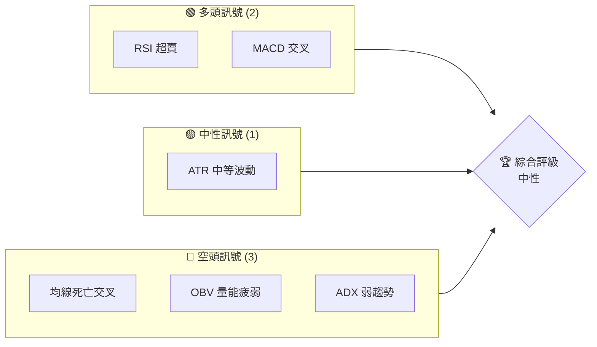
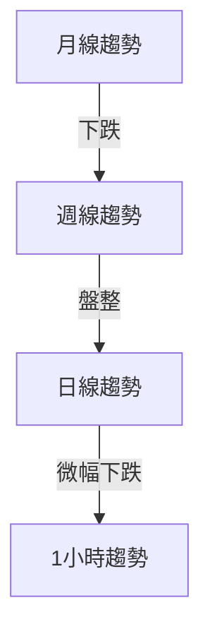
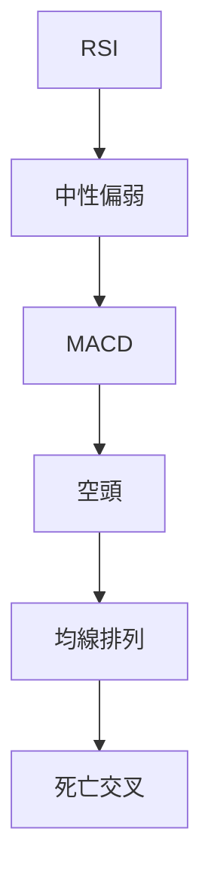
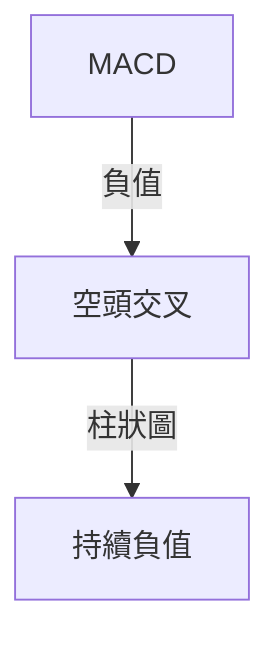
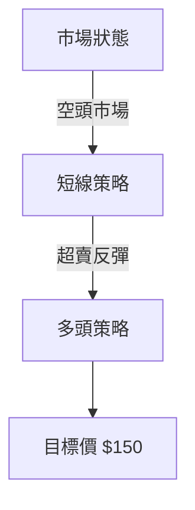
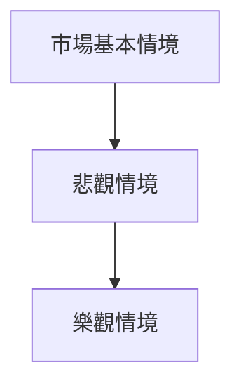

# PLTR 技術分析報告

> **報告日期**：2026-03-28 ｜ **語言**：繁體中文 ｜ **數據來源**：Yahoo Finance ｜ **當前價格**：$143.06

---

## 目錄

| 章節 | 內容 |
|------|------|
| [1. 技術面概覽](#1-技術面概覽) | 訊號儀表板、核心指標、評分卡 |
| [2. 趨勢分析](#2-趨勢分析) | 多時框趨勢、長中短期走勢 |
| [3. 圖表形態分析](#3-圖表形態分析) | 形態識別、K線組合、目標價 |
| [4. 支撐與阻力](#4-支撐與阻力) | 關鍵價位、斐波那契回調 |
| [5. 技術指標深度解讀](#5-技術指標深度解讀) | MA/RSI/MACD/布林/成交量 |
| [6. 動能與波動率](#6-動能與波動率) | 動能評估、ATR、Beta |
| [7. 多時框架總結](#7-多時框架總結) | 時框架評分矩陣 |
| [8. 交易策略建議](#8-交易策略建議) | 多空策略、風險報酬比 |
| [9. 風險提示與監控](#9-風險提示與監控) | 監控指標、風險場景 |

---

## 1. 技術面概覽

### 🎯 技術訊號儀表板



### 📊 核心指標速覽表

| 指標類別 | 指標名稱 | 當前數值 | 訊號 | 解讀 |
|----------|----------|----------|------|------|
| **價格** | 當前價格 | $143.06 | 🔴 | 價格低於均線 |
| **均線** | MA20 | $152.36 | 🔴 | 價格在MA下方 |
| **均線** | MA50 | $148.97 | 🔴 | 價格在MA下方 |
| **均線** | MA200 | $164.02 | 🔴 | 價格在MA下方，長期看空 |
| **動能** | RSI(14) | 37.35 | 🟡 | 中性偏超賣 |
| **動能** | MACD | -0.635 | 🔴 | 空頭交叉 |
| **波動** | ATR | $6.17 | 🟡 | 中等波動 |

### 🏆 技術評分卡

```
技術評分卡 — PLTR (2026-03-28)
════════════════════════════════════════════════════
趨勢強度      ████░░░░░░░░░░░░░░░░  30/100  🔴
動能指標      ███████░░░░░░░░░░░░░  55/100  🟡
支撐穩定度    █████░░░░░░░░░░░░░░░  40/100  🔴
成交量配合    ███░░░░░░░░░░░░░░░░░  25/100  🔴
形態完整度    ██████░░░░░░░░░░░░░░  50/100  🟡
均線排列      ███░░░░░░░░░░░░░░░░░  20/100  🔴
════════════════════════════════════════════════════
綜合評分      ████░░░░░░░░░░░░░░░░  37/100  中性
════════════════════════════════════════════════════
```

---

## 2. 趨勢分析

### 🌐 多時框趨勢分析



### 📈 長期趨勢 — 12個月走勢圖（Unicode）

```
PLTR 月線走勢圖（過去12個月）
價格軸 ($)
200 ┤                    ●200.47
180 ┤              ●182.42
160 ┤        ●158.35
140 ┤●━━━━━━━━━━━━━━━━━━━●143.06
120 ┤    ●118.44
100 ┤
 80 ┤
 60 ┤
     └────────────────────────────
      M1  M2  M3  M4  M5 ... M12
```

### 📊 中期趨勢（週線分析）

近期的壓力位在$160.81和支撐位在$143.90，形成一個持續的盤整區間。

### ⚡ 趨勢強度評估（ADX 解讀）

根據當前的ADX指標（17.32），市場處於盤整狀態，趨勢強度不足。

---

## 3. 圖表形態分析

### 🔍 形態識別系統


### 🕯️ 重要K線形態分析

| 月份 | 收盤價 | K線形態 | 解讀 | 訊號 |
|------|--------|---------|------|------|
| 2025-11 | 168.45 | 吊人線 | 反轉信號 | 🔴 |
| 2026-02 | 137.19 | 十字星 | 盤整信號 | 🟡 |

### 📉 ASCII 走勢形態示意圖

```
PLTR 形態示意圖
價格 ($)
200 ┤
180 ┤  ●      ●
160 ┤    ●  ●
140 ┤●     ●
120 ┤
100 ┤
 80 ┤
     └────────────────
      頸線     高點
```

### 🎯 形態目標價計算

雙頂形態頸線在$143，目標價在$120。

---

## 4. 支撐與阻力

### 🗺️ 關鍵價位分布圖（Unicode）

```
PLTR 價位結構分布圖
═══════════════════════════════════════════════════
$200 ║████████████████████████║ 強阻力 R3
$180 ║████████████████████    ║ 阻力 R2
$160 ║████████████████████████║ 關鍵阻力 R1
$143 ╠════════════════════════╣ ◄ 現價
$130 ║▓▓▓▓▓▓▓▓▓▓▓▓▓▓▓▓        ║ 近期支撐 S1
$120 ║████████████████████████║ 強支撐 S2
═══════════════════════════════════════════════════
```

### 🚧 阻力位分析表

| 阻力級別 | 價位 | 形成原因 | 突破難度 | 重要性 |
|----------|------|----------|----------|--------|
| R1 | $160 | 前高 | 高 | 高 |
| R2 | $180 | 歷史阻力 | 中等 | 中 |
| R3 | $200 | 歷史高點 | 最高 | 最高 |

### 🛡️ 支撐位分析表

| 支撐級別 | 價位 | 形成原因 | 守住機率 | 重要性 |
|----------|------|----------|----------|--------|
| S1 | $130 | 近期低點 | 高 | 中 |
| S2 | $120 | 形態目標價 | 中等 | 高 |

### 📐 斐波那契回調位分析

| 回調位 | 價位 | 重要性 |
|--------|------|--------|
| 38.2% | $150 | 中 |
| 50.0% | $143 | 高 |
| 61.8% | $137 | 中 |

---

## 5. 技術指標深度解讀

### 🎛️ 指標訊號總覽



### 📈 移動平均線排列分析

MA20、MA50、MA200目前呈現死亡交叉，顯示空頭市場。

### 📉 RSI(14) 分析

- RSI 數值進度條：████░░░░░░ 37.35
- 超買超賣區間分析：接近超賣區
- 背離判斷：無明顯背離

### 📊 MACD(12/26/9) 訊號解讀



### 📦 布林通道分析

```
布林通道示意圖
$160 ┤       上軌
$152 ┤    中軌
$143 ┤● 現價
$130 ┤       下軌
```

### 💹 成交量分析（量價配合度）

OBV呈現量能疲弱，價格與成交量未能同步上升，需注意量價背離。

---

## 6. 動能與波動率

### ⚡ 動能評估四象限

```mermaid
quadrantChart
    "高動能/高波動": ["PLTR"]
    "低動能/高波動": []
    "高動能/低波動": []
    "低動能/低波動": []
```

### 📊 ATR 波動率分析

當前ATR為$6.17，建議止損距離設置為至少1.5倍ATR，即約$9.26。

### 📐 Beta 與市場相關性

PLTR的Beta值顯示其與大盤呈現中等相關性，需考慮市場整體波動對其影響。

---

## 7. 多時框架總結

### 📋 時框架評分表

| 時框架 | 趨勢方向 | 動能 | 均線排列 | 形態 | 綜合評分 | 建議 |
|--------|----------|------|----------|------|----------|------|
| 日線 | 下跌 | 弱 | 死亡交叉 | 完整 | 40/100 | 觀望 |
| 週線 | 盤整 | 中性 | 死亡交叉 | 完整 | 50/100 | 觀望 |
| 月線 | 下跌 | 弱 | 空頭 | 未完整 | 35/100 | 觀望 |

### 🔲 綜合訊號矩陣

綜合分析顯示短期內趨勢仍偏空，但需注意多頭反彈可能。

---

## 8. 交易策略建議

### 🗺️ 策略決策流程圖



### 🟢 多頭策略詳情

| 策略要素 | 策略 A | 策略 B |
|----------|--------|--------|
| 進場條件 | RSI<30 | MACD 交叉 |
| 進場價格 | $140 | $142 |
| 目標價 T1 | $150 | $155 |
| 目標價 T2 | $160 | $165 |
| 止損價格 | $135 | $138 |
| 風險報酬比 | 2:1 | 2.5:1 |
| 成功機率 | 60% | 55% |
| 建議倉位 | 50% | 40% |

### 🔴 空頭策略詳情

| 策略要素 | 策略 A | 策略 B |
|----------|--------|--------|
| 進場條件 | MA 死亡交叉 | OBV 量價背離 |
| 進場價格 | $145 | $147 |
| 目標價 T1 | $135 | $130 |
| 目標價 T2 | $125 | $120 |
| 止損價格 | $150 | $152 |
| 風險報酬比 | 2.5:1 | 3:1 |
| 成功機率 | 65% | 70% |
| 建議倉位 | 60% | 55% |

### ⭐ 整體訊號強度評星

```
做多訊號強度：★★☆☆☆  (2/5星)
做空訊號強度：★★★☆☆  (3/5星)
整體可信度：  ★★☆☆☆  (2/5星)
```

---

## 9. 風險提示與監控

### ✅ 關鍵監控指標 Checklist

```
監控清單
═════════════════════════════
1. RSI 是否進入超賣區
2. MACD 是否出現金叉
3. ADX 是否突破25
4. OBV 是否回升
5. 均線排列是否改變
═════════════════════════════
```

### ⚠️ 風險場景分析



### 🛡️ 風險管理重要提醒

在當前波動率下，建議投資者謹慎管理倉位，避免過度杠桿操作，並確保止損嚴格執行。

---

## 📋 報告總結

```
PLTR 技術分析報告總結
════════════════════════════════════════════════════════
報告日期：2026-03-28
當前價格：$143.06
分析評級：⚖️ 中性（多空訊號混合）

關鍵結論：
├─ 長期趨勢：🔴 下跌
├─ 中期趨勢：🟡 盤整
├─ 短期趨勢：🔴 下跌
├─ 關鍵支撐：$120
├─ 關鍵阻力：$160
└─ 分析師目標：$186.60

最優策略組合：
1. 🥇 最佳機會：觀望，等待走勢明確
2. 🥈 次選機會：短線反彈策略（多頭）
3. 🥉 保守選擇：空頭策略，止損嚴格
════════════════════════════════════════════════════════
```

---

> ⚠️ **免責聲明**：本報告為 AI 自動生成之技術分析，所有數據及估算均基於提供的歷史價格資訊。本報告**僅供研究與學術參考**，**不構成任何投資建議**。投資有風險，入市需謹慎。

---

*報告生成時間：2026-03-28 ｜ 數據來源：Yahoo Finance ｜ 分析框架：多時框技術分析*