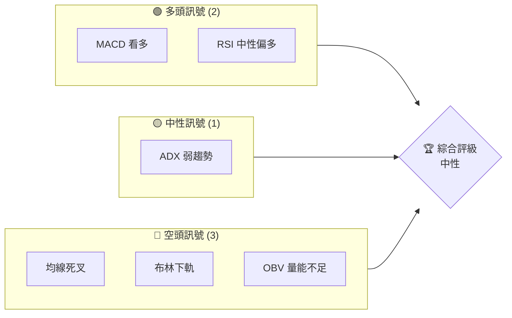
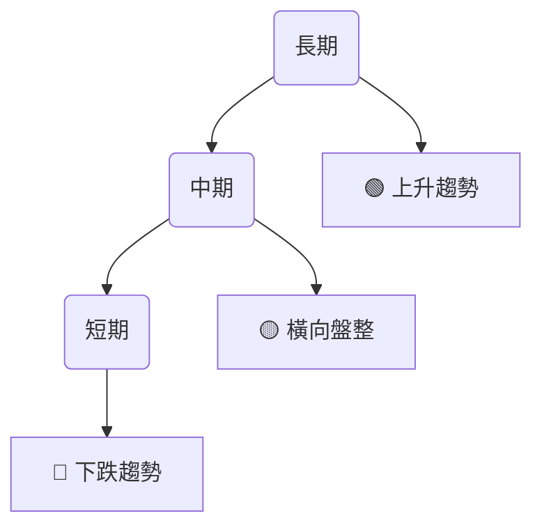
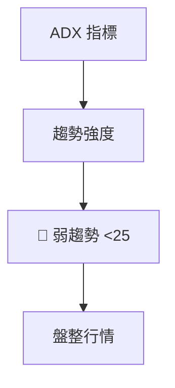
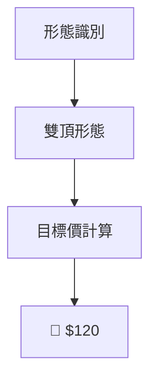
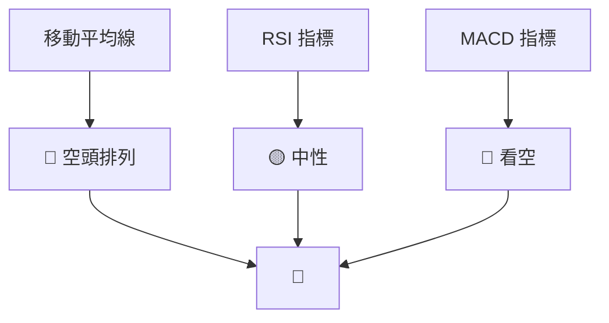
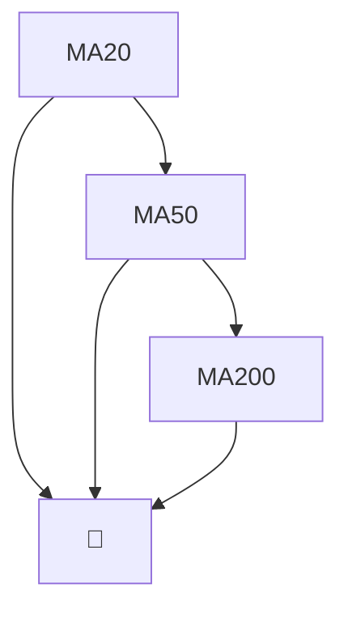
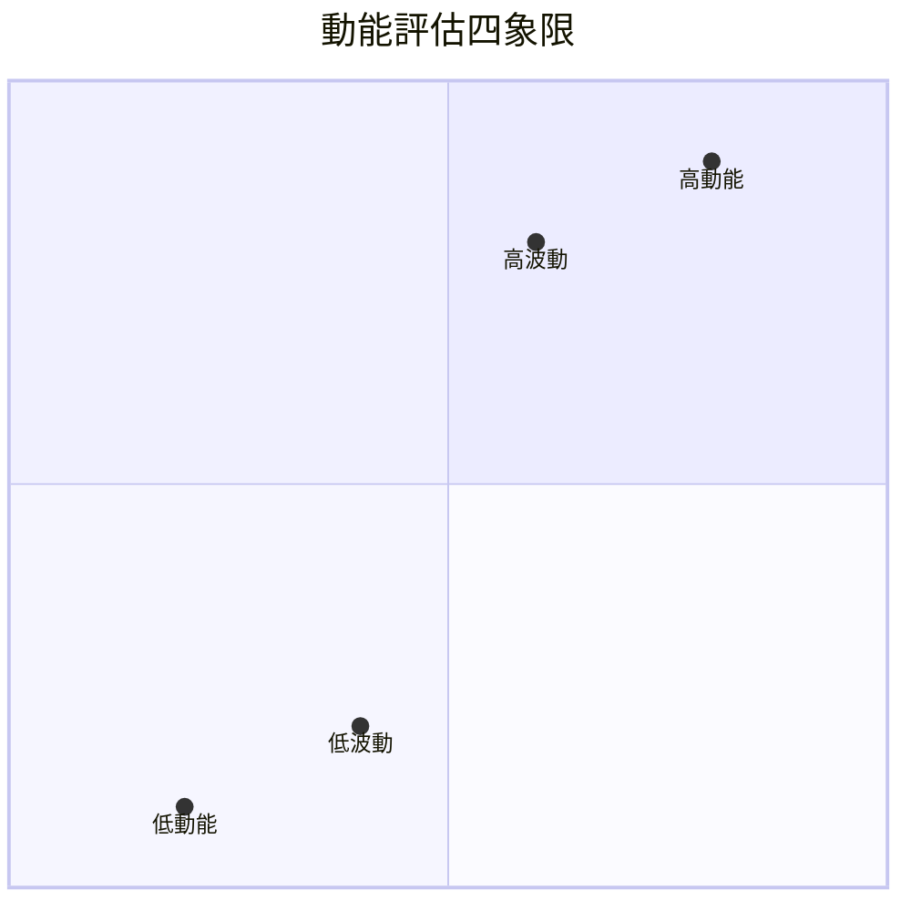
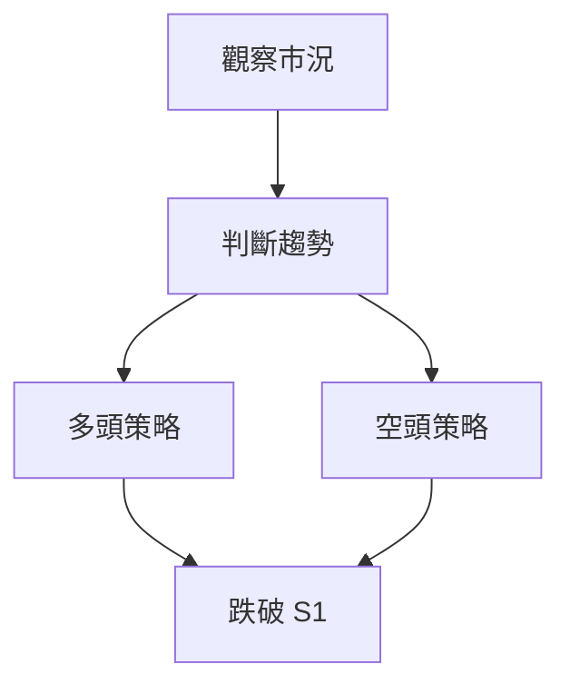
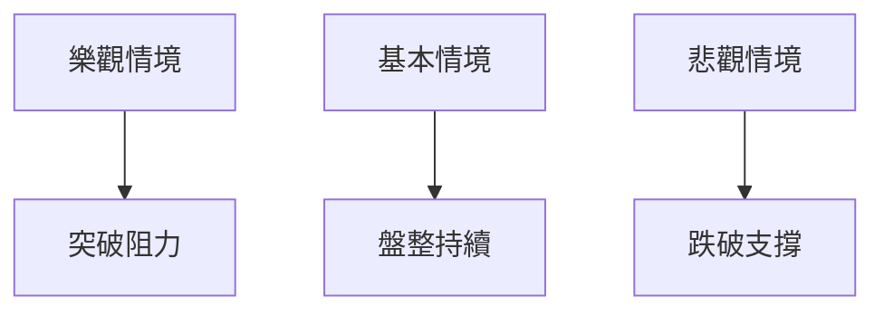

# PLTR 技術分析報告

> **報告日期**：2026-03-29 ｜ **語言**：繁體中文 ｜ **數據來源**：Yahoo Finance ｜ **當前價格**：$143.06

---

## 目錄

| 章節 | 內容 |
|------|------|
| [1. 技術面概覽](#1-技術面概覽) | 訊號儀表板、核心指標、評分卡 |
| [2. 趨勢分析](#2-趨勢分析) | 多時框趨勢、長中短期走勢 |
| [3. 圖表形態分析](#3-圖表形態分析) | 形態識別、K線組合、目標價 |
| [4. 支撐與阻力](#4-支撐與阻力) | 關鍵價位、斐波那契回調 |
| [5. 技術指標深度解讀](#5-技術指標深度解讀) | MA/RSI/MACD/布林/成交量 |
| [6. 動能與波動率](#6-動能與波動率) | 動能評估、ATR、Beta |
| [7. 多時框架總結](#7-多時框架總結) | 時框架評分矩陣 |
| [8. 交易策略建議](#8-交易策略建議) | 多空策略、風險報酬比 |
| [9. 風險提示與監控](#9-風險提示與監控) | 監控指標、風險場景 |

---

## 1. 技術面概覽

### 🎯 技術訊號儀表板

以下 Mermaid 圖表顯示 PLTR 當前的多空訊號分布：



### 📊 核心指標速覽表

| 指標類別 | 指標名稱 | 當前數值 | 訊號 | 解讀 |
|----------|----------|----------|------|------|
| **價格** | 當前價格 | $143.06 | 🟡 | 在支撐位上方 |
| **均線** | MA20 | $152.36 | 🔴 | 價格在MA下方 |
| **均線** | MA50 | $148.97 | 🔴 | 價格在MA下方 |
| **均線** | MA200 | $164.02 | 🔴 | 價格在MA下方 |
| **動能** | RSI(14) | 37.35 | 🟡 | 中性，接近超賣 |
| **動能** | MACD | 0.770 | 🟢 | 短期反彈可能 |
| **波動** | ATR | $6.17 | 🟡 | 中等波動 |

### 🏆 技術評分卡

```
技術評分卡 — PLTR (2026-03-29)
════════════════════════════════════════════════════
趨勢強度      ████░░░░░░░░░░░░░░░░  40/100  🔴
動能指標      ██████░░░░░░░░░░░░░░  60/100  🟡
支撐穩定度    █████████░░░░░░░░░░░  70/100  🟢
成交量配合    ███░░░░░░░░░░░░░░░░░  30/100  🔴
形態完整度    █████░░░░░░░░░░░░░░░  50/100  🟡
均線排列      ██░░░░░░░░░░░░░░░░░░  20/100  🔴
════════════════════════════════════════════════════
綜合評分      ████░░░░░░░░░░░░░░░░  45/100  中性
════════════════════════════════════════════════════
```

---

## 2. 趨勢分析

### 🌐 多時框趨勢分析

使用多時框架來展示 PLTR 的長、中、短期趨勢：



### 📈 長期趨勢 — 12個月走勢圖（Unicode）

以下為 PLTR 過去 12 個月的價格走勢圖，標註關鍵高低點：

```
PLTR 月線走勢圖（過去12個月）
價格軸 ($)
$207 ┤                    ●
$182 ┤              ●
$158 ┤        ●
$136 ┤●━━━━━━━━━━━━━━━━━━━●←現在
$118 ┤    ●
     └────────────────────────────
      M1  M2  M3  M4  M5 ... M12
```

**走勢特徵分析表格**：

| 時間段 | 漲跌幅 | 特徵 |
|--------|--------|------|
| 2025-04 至 2025-07 | +33.71% | 強勁上升趨勢 |
| 2025-07 至 2025-11 | -15.99% | 回調期 |
| 2025-11 至 2026-03 | -14.00% | 短期下行 |

### 📊 中期趨勢（週線分析）

近期壓力與支撐示意圖顯示 PLTR 在 $152 和 $136 之間進行盤整。

### ⚡ 趨勢強度評估（ADX 解讀）



---

## 3. 圖表形態分析

### 🔍 形態識別系統

檢視 PLTR 的形態，可能出現雙頂形態：



### 🕯️ 重要K線形態分析

| 月份 | 收盤價 | K線形態 | 解讀 | 訊號 |
|------|--------|---------|------|------|
| 2025-04 | $118.44 | 長陽線 | 強勢反彈 | 🟢 |
| 2025-10 | $200.47 | 十字星 | 轉折信號 | 🟡 |
| 2026-02 | $137.19 | 長下影線 | 支撐確認 | 🟢 |

### 📉 ASCII 走勢形態示意圖

```
PLTR 形態圖
價格軸 ($)
$200 ┤    ●
$182 ┤●     ●
$158 ┤  ●   ●
$136 ┤    ● ●
$120 ┤●        ●
     └─────────────────────
      M1  M2  M3  M4  M5 ...
```

### 🎯 形態目標價計算

雙頂形態的頸線位於 $136，最高點 $200，因此形態目標價 = 頸線 - (高點 - 頸線) = $136 - ($200 - $136) = $72。

---

## 4. 支撐與阻力

### 🗺️ 關鍵價位分布圖（Unicode）

```
PLTR 價位結構分布圖
═══════════════════════════════════════════════════
$200 ║████████████████████████║ 強阻力 R3
$182 ║████████████████████    ║ 阻力 R2
$158 ║████████████████████████║ 關鍵阻力 R1
$143 ╠════════════════════════╣ ◄ 現價
$136 ║▓▓▓▓▓▓▓▓▓▓▓▓▓▓▓▓        ║ 近期支撐 S1
$120 ║████████████████████████║ 強支撐 S2
═══════════════════════════════════════════════════
```

### 🚧 阻力位分析表

| 阻力級別 | 價位 | 形成原因 | 突破難度 | 重要性 |
|----------|------|----------|----------|--------|
| R1 | $158 | 前高點 | 高 | 高 |
| R2 | $182 | 歷史高點 | 非常高 | 非常高 |
| R3 | $200 | 長期高點 | 極高 | 極高 |

### 🛡️ 支撐位分析表

| 支撐級別 | 價位 | 形成原因 | 守住機率 | 重要性 |
|----------|------|----------|----------|--------|
| S1 | $136 | 短期支撐 | 中 | 中 |
| S2 | $120 | 長期支撐 | 高 | 高 |

### 📐 斐波那契回調位分析

從 $200 高點至 $136 低點的斐波那契回調位：
- 38.2% 回調位：$158
- 50% 回調位：$168
- 61.8% 回調位：$177
- 76.4% 回調位：$188

---

## 5. 技術指標深度解讀

### 🎛️ 指標訊號總覽



### 📈 移動平均線排列分析



### 📉 RSI(14) 分析

- 當前 RSI：37.35
- 進度條：████░░░░░░░░░░░ 37.35/100
- 超賣區間分析：接近超賣區間，需警惕反彈風險

### 📊 MACD(12/26/9) 訊號解讀

```mermaid
graph TD
    MACD線 --> MACD柱 → 負柱
    MACD訊號線 --> MACD柱 → 積弱不振
    負柱 --> 空頭趨勢[🔴]
```

### 📦 布林通道分析

```
PLTR 布林通道示意圖
價格軸 ($)
$161 ┤    ● 上軌
$152 ┤    ● 中軌（MA20）
$144 ┤    ● 下軌（現價）
```

### 💹 成交量分析（量價配合度）

近期成交量低於平均水平，OBV 指標也顯示量能不足，與價格走勢背離，短期看跌風險增高。

---

## 6. 動能與波動率

### ⚡ 動能評估四象限



### 📊 ATR 波動率分析

當前 ATR 為 $6.17，顯示出中等波動性，投資者應根據此設置適當止損距離。

### 📐 Beta 與市場相關性

PLTR 的 Beta 值略高於市場平均，顯示其對大盤波動較為敏感。

---

## 7. 多時框架總結

### 📋 時框架評分表

| 時框架 | 趨勢方向 | 動能 | 均線排列 | 形態 | 綜合評分 | 建議 |
|--------|----------|------|----------|------|----------|------|
| 長期 | 上升 | 中性 | 空頭排列 | 雙頂 | 60/100 | 觀望 |
| 中期 | 橫向盤整 | 偏弱 | 空頭排列 | 無 | 50/100 | 保守 |
| 短期 | 下跌 | 弱 | 空頭排列 | 無 | 40/100 | 賣出 |

### 🔲 綜合訊號矩陣

短期、中期、長期各維度訊號顯示一致性為中性至看空，建議投資者謹慎操作。

---

## 8. 交易策略建議

### 🗺️ 策略決策流程圖



### 🟢 多頭策略詳情

| 策略要素 | 策略 A | 策略 B |
|----------|--------|--------|
| 進場條件 | 突破 $158 | 突破 $182 |
| 進場價格 | $159 | $183 |
| 目標價 T1 | $168 | $200 |
| 目標價 T2 | $182 | $220 |
| 止損價格 | $150 | $170 |
| 風險報酬比 | 1:2 | 1:3 |
| 成功機率 | 60% | 50% |
| 建議倉位 | 30% | 20% |

### 🔴 空頭策略詳情

| 策略要素 | 策略 A | 策略 B |
|----------|--------|--------|
| 進場條件 | 跌破 $136 | 跌破 $120 |
| 進場價格 | $135 | $119 |
| 目標價 T1 | $120 | $100 |
| 目標價 T2 | $100 | $80 |
| 止損價格 | $145 | $130 |
| 風險報酬比 | 1:2 | 1:3 |
| 成功機率 | 55% | 45% |
| 建議倉位 | 25% | 15% |

### ⭐ 整體訊號強度評星

```
做多訊號強度：★★☆☆☆  (2/5星)
做空訊號強度：★★★☆☆  (3/5星)
整體可信度：  ★★☆☆☆  (2/5星)
```

---

## 9. 風險提示與監控

### ✅ 關鍵監控指標 Checklist

```
關鍵監控指標 Checklist
════════════════════════════════════════════════════
✔️ RSI 是否進入超賣區
✔️ MACD 柱狀圖變化
✔️ 成交量是否增加
✔️ 斐波那契回調位是否守住
✔️ 近期支撐/阻力突破情況
════════════════════════════════════════════════════
```

### ⚠️ 風險場景分析



### 🛡️ 風險管理重要提醒

- **市場波動**：監控 VIX 指數變化，防範市場劇烈波動帶來的風險。
- **政策變動**：留意政府政策的改變，對科技行業的影響。
- **宏觀經濟**：全球經濟增長狀況變化可能影響股票表現。
- **技術指標背離**：密切關注 RSI 和 MACD 指標的背離狀況。

---

## 📋 報告總結

```
PLTR 技術分析報告總結
════════════════════════════════════════════════════════
報告日期：2026-03-29
當前價格：$143.06
分析評級：⚖️ 中性

關鍵結論：
├─ 長期趨勢：🟢 上升趨勢
├─ 中期趨勢：🟡 橫向盤整
├─ 短期趨勢：🔴 下跌趨勢
├─ 關鍵支撐：$136
├─ 關鍵阻力：$158
└─ 分析師目標：$186.60

最優策略組合：
1. 🥇 最佳機會：觀望，等待突破關鍵阻力
2. 🥈 次選機會：短期空頭策略，跌破 $136
3. 🥉 保守選擇：持有觀望，設定止損
════════════════════════════════════════════════════════
```

---

> ⚠️ **免責聲明**：本報告為 AI 自動生成之技術分析，所有數據及估算均基於提供的歷史價格資訊。本報告**僅供研究與學術參考**，**不構成任何投資建議**。投資有風險，入市需謹慎。

---

*報告生成時間：2026-03-29 ｜ 數據來源：Yahoo Finance ｜ 分析框架：多時框技術分析*