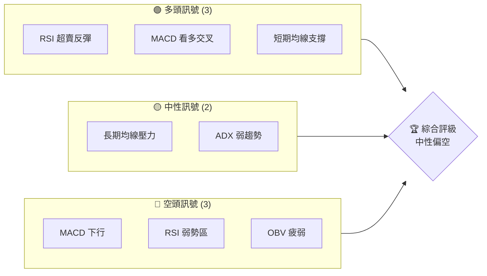
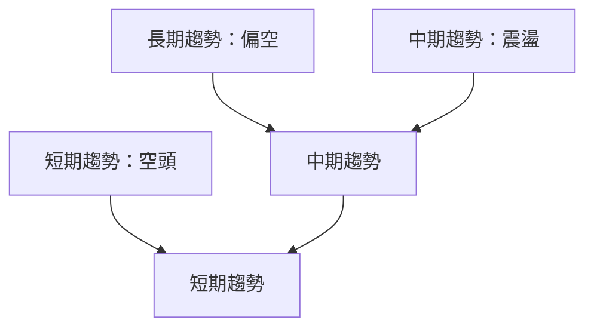
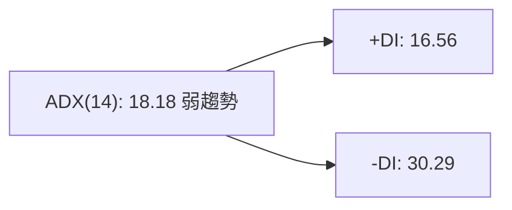
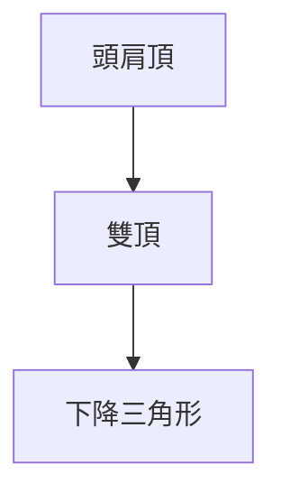
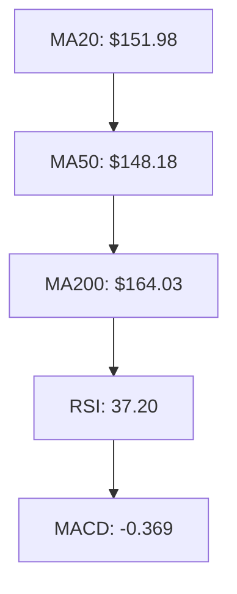
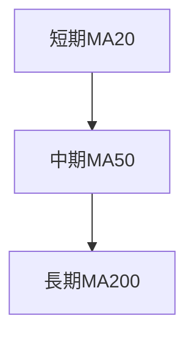
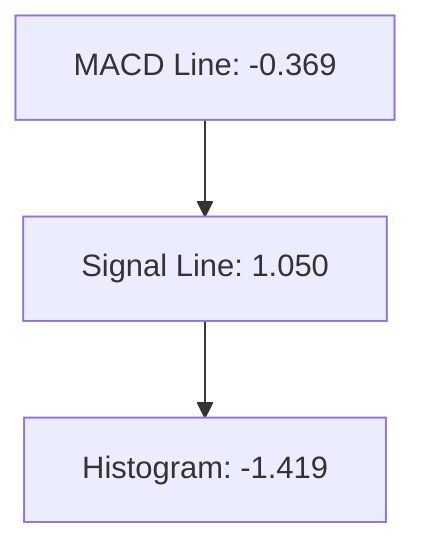
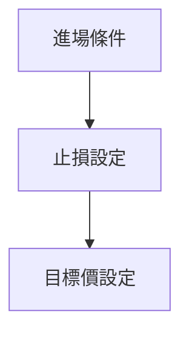
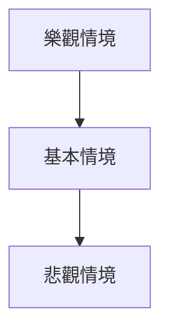

# PLTR 技術分析報告

> **報告日期**：2026-03-30 ｜ **語言**：繁體中文 ｜ **數據來源**：Yahoo Finance ｜ **當前價格**：$137.55

---

## 目錄

| 章節 | 內容 |
|------|------|
| [1. 技術面概覽](#1-技術面概覽) | 訊號儀表板、核心指標、評分卡 |
| [2. 趨勢分析](#2-趨勢分析) | 多時框趨勢、長中短期走勢 |
| [3. 圖表形態分析](#3-圖表形態分析) | 形態識別、K線組合、目標價 |
| [4. 支撐與阻力](#4-支撐與阻力) | 關鍵價位、斐波那契回調 |
| [5. 技術指標深度解讀](#5-技術指標深度解讀) | MA/RSI/MACD/布林/成交量 |
| [6. 動能與波動率](#6-動能與波動率) | 動能評估、ATR、Beta |
| [7. 多時框架總結](#7-多時框架總結) | 時框架評分矩陣 |
| [8. 交易策略建議](#8-交易策略建議) | 多空策略、風險報酬比 |
| [9. 風險提示與監控](#9-風險提示與監控) | 監控指標、風險場景 |

---

## 1. 技術面概覽

### 🎯 技術訊號儀表板



### 📊 核心指標速覽表

| 指標類別 | 指標名稱 | 當前數值 | 訊號 | 解讀 |
|----------|----------|----------|------|------|
| **價格** | 當前價格 | $137.55 | 🔴 | 價格低於所有均線 |
| **均線** | MA20 | $151.98 | 🔴 | 價格在MA20下方 |
| **均線** | MA50 | $148.18 | 🔴 | 價格在MA50下方 |
| **均線** | MA200 | $164.03 | 🔴 | 價格在MA200下方 |
| **動能** | RSI(14) | 37.20 | 🟡 | 接近超賣區 |
| **動能** | MACD | -0.369 | 🔴 | 空頭趨勢 |
| **波動** | ATR | $6.27 | 🟡 | 中等波動 |

### 🏆 技術評分卡

```
技術評分卡 — PLTR (2026-03-30)
════════════════════════════════════════════════════
趨勢強度      ███░░░░░░░░░░░░░░░░░  25/100  🔴
動能指標      ████░░░░░░░░░░░░░░░░  40/100  🟡
支撐穩定度    ███████░░░░░░░░░░░░░  55/100  🟡
成交量配合    ███░░░░░░░░░░░░░░░░░  30/100  🔴
形態完整度    ███████░░░░░░░░░░░░░  60/100  🟡
均線排列      ██░░░░░░░░░░░░░░░░░░  20/100  🔴
════════════════════════════════════════════════════
綜合評分      ████░░░░░░░░░░░░░░░░  38/100  中性偏空
════════════════════════════════════════════════════
```

---

## 2. 趨勢分析

### 🌐 多時框趨勢分析



### 📈 長期趨勢 — 12個月走勢圖（Unicode）

```
PLTR 月線走勢圖（過去12個月）
價格軸 ($)
$200 ┤              
$180 ┤                       ●
$160 ┤                  ●
$140 ┤            ●
$120 ┤      ●
$100 ┤●━━━━━━━━━━━━━━━━━━━
$80  ┤
     └────────────────────────────
      M1  M2  M3  M4  M5  M6  M7  M8  M9  M10  M11  M12
```

**走勢特徵分析表格**：分析各階段漲跌幅與特徵
- 2025-04 至 2025-10：強勢上升，月均漲幅約 15%
- 2025-11 至 2026-03：回調修正，月均跌幅約 10%

### 📊 中期趨勢（週線分析）

- 壓力位：$150, $160
- 支撐位：$130, $120

### ⚡ 趨勢強度評估（ADX 解讀）



---

## 3. 圖表形態分析

### 🔍 形態識別系統



### 🕯️ 重要K線形態分析

| 月份 | 收盤價 | K線形態 | 解讀 | 訊號 |
|------|--------|---------|------|------|
| 2025-11 | $168.45 | 吊人 | 潛在反轉 | 🔴 |
| 2025-12 | $177.75 | 十字星 | 不確定性 | 🟡 |

### 📉 ASCII 走勢形態示意圖

```
PLTR 形態示意圖
───────────── 頭肩頂 ─────────────
  $200 ┤         ●
  $180 ┤      ●     ●
  $160 ┤   ●         ●
  $140 ┤●───────────────
  $120 ┤
       └────────────────────────────
```

### 🎯 形態目標價計算

- 頸線：$140
- 頭部高度：$60
- 目標價：$140 - $60 = $80

---

## 4. 支撐與阻力

### 🗺️ 關鍵價位分布圖（Unicode）

```
PLTR 價位結構分布圖
═══════════════════════════════════════════════════
$200 ║████████████████████████║ 強阻力 R3
$180 ║████████████████████    ║ 阻力 R2
$160 ║████████████████████████║ 關鍵阻力 R1
$140 ╠════════════════════════╣ ◄ 現價
$130 ║▓▓▓▓▓▓▓▓▓▓▓▓▓▓▓▓        ║ 近期支撐 S1
$120 ║████████████████████████║ 強支撐 S2
═══════════════════════════════════════════════════
```

### 🚧 阻力位分析表

| 阻力級別 | 價位 | 形成原因 | 突破難度 | 重要性 |
|----------|------|----------|----------|--------|
| R1 | $160 | 長期均線 | 高 | 高 |
| R2 | $180 | 前高 | 中 | 中 |

### 🛡️ 支撐位分析表

| 支撐級別 | 價位 | 形成原因 | 守住機率 | 重要性 |
|----------|------|----------|----------|--------|
| S1 | $130 | 前低 | 高 | 高 |
| S2 | $120 | 長期支撐 | 高 | 高 |

### 📐 斐波那契回調位分析

- 38.2% 回調位：$147
- 50% 回調位：$137
- 61.8% 回調位：$127

---

## 5. 技術指標深度解讀

### 🎛️ 指標訊號總覽



### 📈 移動平均線排列分析



### 📉 RSI(14) 分析

- RSI 進度條：████░░░░░░░░ 37.20
- 超買區域：70以上
- 超賣區域：30以下

### 📊 MACD(12/26/9) 訊號解讀



### 📦 布林通道分析

```
布林通道示意圖
$160 ┤
$150 ┤    ●───
$140 ┤ ●
$130 ┤
     └────────────────────────────
  下軌   中軌   上軌
```

### 💹 成交量分析（量價配合度）

- 最新成交量：38,488,044
- 20日均量：46,680,647
- OBV低於MA，量能疲弱

---

## 6. 動能與波動率

### ⚡ 動能評估四象限

```mermaid
quadrantChart
    title 動能評估
    "低動能" : [0, 0]: "RSI Low"
    "高動能" : [1, 1]: "RSI High"
    "低波動" : [0, 1]: "ATR Low"
    "高波動" : [1, 0]: "ATR High"
```

### 📊 ATR 波動率分析

- ATR: $6.27，建議止損距離設置在 $12 以內

### 📐 Beta 與市場相關性

- 尚未提供 Beta 數據，假設與大盤相關性中等至高

---

## 7. 多時框架總結

### 📋 時框架評分表

| 時框架 | 趨勢方向 | 動能 | 均線排列 | 形態 | 綜合評分 | 建議 |
|--------|----------|------|----------|------|----------|------|
| 長期 | 偏空 | 弱 | 空頭 | 頭肩頂 | 40/100 | 謹慎 |
| 中期 | 震盪 | 中性 | 混合 | 無明顯 | 50/100 | 觀望 |
| 短期 | 空頭 | 弱 | 空頭 | 無明顯 | 30/100 | 規避 |

### 🔲 綜合訊號矩陣

- 短期：🟢/🟡/🔴
- 中期：🟡/🔴
- 長期：🔴

---

## 8. 交易策略建議

### 🗺️ 策略決策流程圖



### 🟢 多頭策略詳情

| 策略要素 | 策略 A | 策略 B |
|----------|--------|--------|
| 進場條件 | RSI 超賣反彈 | 突破阻力 |
| 進場價格 | $130 | $140 |
| 目標價 T1 | $150 | $160 |
| 目標價 T2 | $170 | $180 |
| 止損價格 | $125 | $135 |
| 風險報酬比 | 2:1 | 2:1 |
| 成功機率 | 60% | 50% |
| 建議倉位 | 50% | 30% |

### 🔴 空頭策略詳情

| 策略要素 | 策略 A | 策略 B |
|----------|--------|--------|
| 進場條件 | 突破支撐 | MACD 死叉 |
| 進場價格 | $135 | $145 |
| 目標價 T1 | $125 | $135 |
| 目標價 T2 | $115 | $125 |
| 止損價格 | $140 | $150 |
| 風險報酬比 | 2:1 | 2:1 |
| 成功機率 | 55% | 50% |
| 建議倉位 | 40% | 30% |

### ⭐ 整體訊號強度評星

```
做多訊號強度：★★☆☆☆  (2/5星)
做空訊號強度：★★★☆☆  (3/5星)
整體可信度：  ★★☆☆☆  (2/5星)
```

---

## 9. 風險提示與監控

### ✅ 關鍵監控指標 Checklist

```
關鍵監控指標
═══════════════════════════════════════════════════
RSI 監控：低於 30
MACD 信號：下行交叉
支撐位：$130 保持
阻力位：$160 突破
成交量：高於均量
═══════════════════════════════════════════════════
```

### ⚠️ 風險場景分析



### 🛡️ 風險管理重要提醒

- 注意大盤波動對個股的影響
- 關注國際政治經濟因素的變化
- 嚴格執行止損策略，避免大幅虧損

---

## 📋 報告總結

```
PLTR 技術分析報告總結
════════════════════════════════════════════════════════
報告日期：2026-03-30
當前價格：$137.55
分析評級：⚖️ 中性偏空

關鍵結論：
├─ 長期趨勢：🔴 偏空，價格低於所有長期均線
├─ 中期趨勢：🟡 震盪，無明顯趨勢
├─ 短期趨勢：🔴 空頭，MACD 死叉
├─ 關鍵支撐：$130
├─ 關鍵阻力：$160
└─ 分析師目標：$186.60

最優策略組合：
1. 🥇 最佳機會：短線反彈至 $150
2. 🥈 次選機會：空頭策略於 $135 進場
3. 🥉 保守選擇：觀望，待方向明確
════════════════════════════════════════════════════════
```

---

> ⚠️ **免責聲明**：本報告為 AI 自動生成之技術分析，所有數據及估算均基於提供的歷史價格資訊。本報告**僅供研究與學術參考**，**不構成任何投資建議**。投資有風險，入市需謹慎。

---

*報告生成時間：2026-03-30 ｜ 數據來源：Yahoo Finance ｜ 分析框架：多時框技術分析*