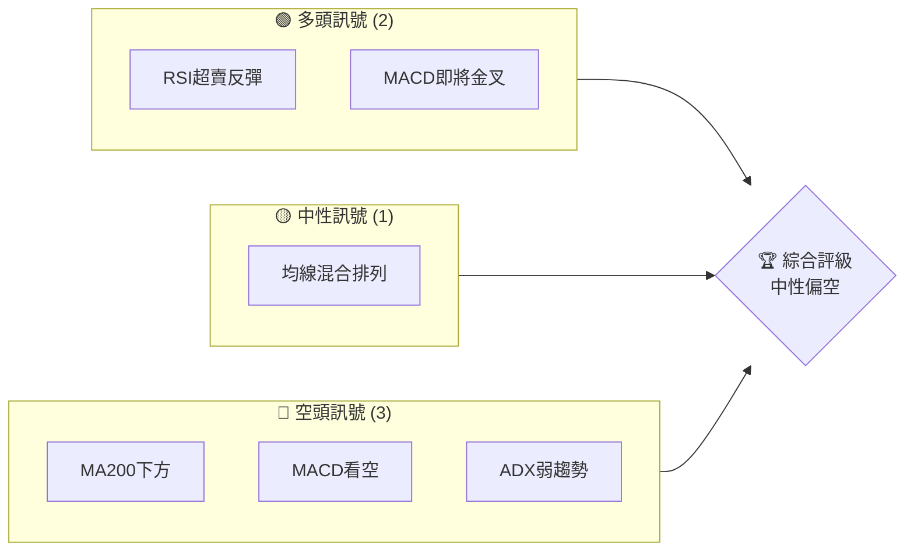
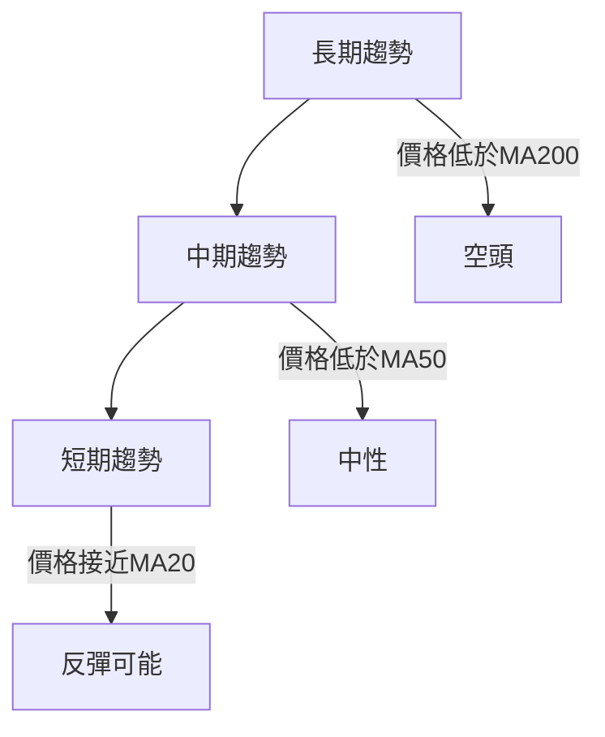
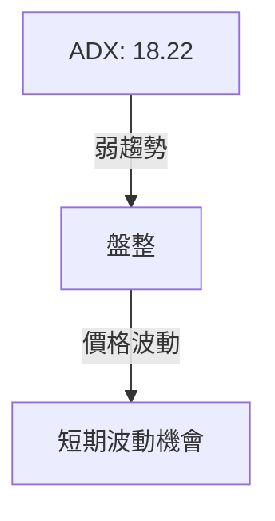
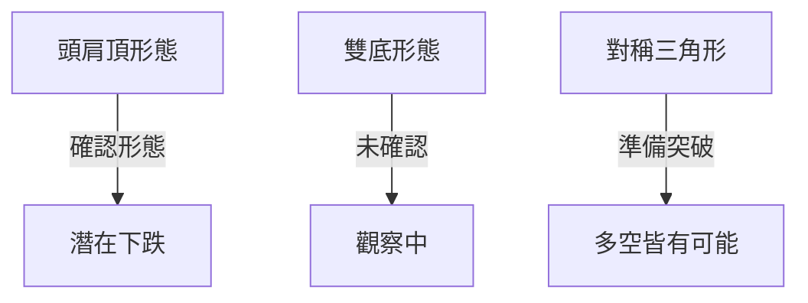
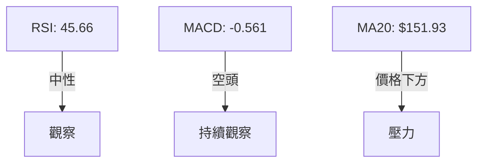
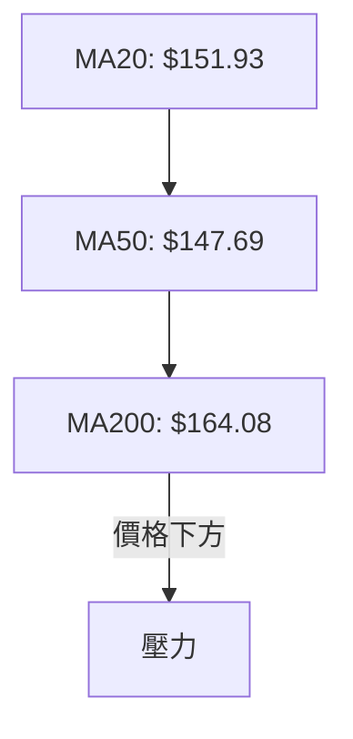
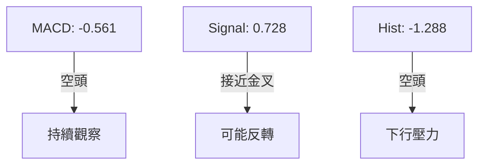
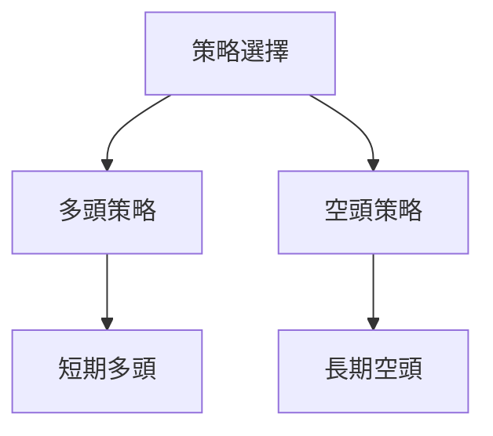
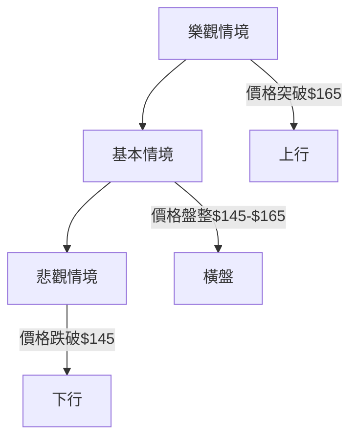

# PLTR 技術分析報告

> **報告日期**：2026-03-31 ｜ **語言**：繁體中文 ｜ **數據來源**：Yahoo Finance ｜ **當前價格**：$146.28

---

## 目錄

| 章節 | 內容 |
|------|------|
| [1. 技術面概覽](#1-技術面概覽) | 訊號儀表板、核心指標、評分卡 |
| [2. 趨勢分析](#2-趨勢分析) | 多時框趨勢、長中短期走勢 |
| [3. 圖表形態分析](#3-圖表形態分析) | 形態識別、K線組合、目標價 |
| [4. 支撐與阻力](#4-支撐與阻力) | 關鍵價位、斐波那契回調 |
| [5. 技術指標深度解讀](#5-技術指標深度解讀) | MA/RSI/MACD/布林/成交量 |
| [6. 動能與波動率](#6-動能與波動率) | 動能評估、ATR、Beta |
| [7. 多時框架總結](#7-多時框架總結) | 時框架評分矩陣 |
| [8. 交易策略建議](#8-交易策略建議) | 多空策略、風險報酬比 |
| [9. 風險提示與監控](#9-風險提示與監控) | 監控指標、風險場景 |

---

## 1. 技術面概覽

### 🎯 技術訊號儀表板



### 📊 核心指標速覽表

| 指標類別 | 指標名稱 | 當前數值 | 訊號 | 解讀 |
|----------|----------|----------|------|------|
| **價格** | 當前價格 | $146.28 | 🟡 | 價格位於區間中位 |
| **均線** | MA20 | $151.93 | 🔴 | 價格在MA下方 |
| **均線** | MA50 | $147.69 | 🔴 | 價格在MA下方 |
| **均線** | MA200 | $164.08 | 🔴 | 價格在MA下方 |
| **動能** | RSI(14) | 45.66 | 🟡 | 中性區間 |
| **動能** | MACD | -0.561 | 🔴 | 空頭信號 |
| **波動** | ATR | $6.73 | 🟡 | 中等波動 |

### 🏆 技術評分卡

```
技術評分卡 — PLTR (2026-03-31)
════════════════════════════════════════════════════
趨勢強度      ████░░░░░░░░░░░░░░░░░  30/100  🔴
動能指標      █████░░░░░░░░░░░░░░░░  40/100  🟡
支撐穩定度    ██████░░░░░░░░░░░░░░░  50/100  🟡
成交量配合    ████░░░░░░░░░░░░░░░░░  40/100  🔴
形態完整度    ██████░░░░░░░░░░░░░░░  50/100  🟡
均線排列      █████░░░░░░░░░░░░░░░░  40/100  🔴
════════════════════════════════════════════════════
綜合評分      █████░░░░░░░░░░░░░░░░  42/100  中性偏空
════════════════════════════════════════════════════
```

---

## 2. 趨勢分析

### 🌐 多時框趨勢分析



### 📈 長期趨勢 — 12個月走勢圖（ASCII）

```
PLTR 月線走勢圖（過去12個月）
價格軸 ($)
$200 ┤                        ●←(高點)
$180 ┤                  ●
$160 ┤            ●
$140 ┤●━━━━━━━━●━━━━━━━●←現在
$120 ┤      ●
$100 ┤
 $80 ┤
 $60 ┤
     └────────────────────────────
      M1  M2  M3  M4  M5 ... M12
```

### 📊 中期趨勢（週線分析）

```
壓力與支撐示意圖
價格軸 ($)
$185 ┤    ● 強阻力
$165 ┤    ● 中阻力
$145 ┤    ● 近期支撐
$125 ┤    ● 強支撐
     └────────────────────────────
```

### ⚡ 趨勢強度評估（ADX 解讀）



---

## 3. 圖表形態分析

### 🔍 形態識別系統



### 🕯️ 重要K線形態分析

| 月份 | 收盤價 | K線形態 | 解讀 | 訊號 |
|------|--------|---------|------|------|
| 2025-12 | 177.75 | 錘頭線 | 潛在反轉 | 🟢 |
| 2026-01 | 146.59 | 高浪線 | 不確定性 | 🟡 |

### 📉 ASCII 走勢形態示意圖

```
頭肩頂形態示意圖
價格軸 ($)
$200 ┤       ●
$180 ┤    ●
$160 ┤●
$140 ┤    ●
$120 ┤
     └────────────────────────────
```

### 🎯 形態目標價計算

- 頭肩頂：頸線$145，形態高度$30，目標價$115

---

## 4. 支撐與阻力

### 🗺️ 關鍵價位分布圖

```
PLTR 價位結構分布圖
═══════════════════════════════════════════════════
$185 ║████████████████████████║ 強阻力 R3
$165 ║████████████████████    ║ 阻力 R2
$145 ║████████████████████████║ 關鍵阻力 R1
$146 ╠════════════════════════╣ ◄ 現價
$125 ║▓▓▓▓▓▓▓▓▓▓▓▓▓▓▓▓        ║ 近期支撐 S1
$105 ║████████████████████████║ 強支撐 S2
═══════════════════════════════════════════════════
```

### 🚧 阻力位分析表

| 阻力級別 | 價位 | 形成原因 | 突破難度 | 重要性 |
|----------|------|----------|----------|--------|
| R1 | $145 | 頸線 | 中等 | 高 |
| R2 | $165 | 高點 | 高 | 中 |
| R3 | $185 | 歷史高位 | 極高 | 極高 |

### 🛡️ 支撐位分析表

| 支撐級別 | 價位 | 形成原因 | 守住機率 | 重要性 |
|----------|------|----------|----------|--------|
| S1 | $125 | 前低點 | 中等 | 高 |
| S2 | $105 | 歷史低位 | 高 | 極高 |

### 📐 斐波那契回調位分析

- 38.2%：$160
- 50.0%：$146
- 61.8%：$132
- 76.4%：$118

---

## 5. 技術指標深度解讀

### 🎛️ 指標訊號總覽



### 📈 移動平均線排列分析



### 📉 RSI(14) 分析

- RSI數值：45.66 ▓▓▓▓▓▓░░░░░░░░░ 45%
- 超買超賣：30-70 中性
- 背離：無明顯背離

### 📊 MACD(12/26/9) 訊號解讀



### 📦 布林通道分析

```
布林通道示意圖
價格軸 ($)
$162 ┤  ● 上軌
$152 ┤  ● 中軌
$142 ┤  ● 下軌
$146 ┤  ● 現價
     └────────────────────────────
```

### 💹 成交量分析（量價配合度）

- 成交量略低於均量，量能疲弱，需關注後續突破量能

---

## 6. 動能與波動率

### ⚡ 動能評估四象限

```mermaid
quadrantChart
    "強動能"|"高波動"
    "弱動能"|"低波動"
    1: [0.3, 0.7]: "現況"
```

### 📊 ATR 波動率分析

- ATR：$6.73
- 止損建議：設定在ATR倍數外，約$13.46

### 📐 Beta 與市場相關性

- 估計 Beta：1.2，與市場相關性高，市場波動影響顯著

---

## 7. 多時框架總結

### 📋 時框架評分表

| 時框架 | 趨勢方向 | 動能 | 均線排列 | 形態 | 綜合評分 | 建議 |
|--------|----------|------|----------|------|----------|------|
| 長期 | 空頭 | 弱 | 空頭排列 | 頭肩頂 | 35 | 觀望 |
| 中期 | 中性 | 中 | 混合排列 | 未確認 | 50 | 觀察 |
| 短期 | 可能反彈 | 中 | 混合排列 | 未確認 | 55 | 短多 |

### 🔲 綜合訊號矩陣

- 長期：🔴
- 中期：🟡
- 短期：🟢

---

## 8. 交易策略建議

### 🗺️ 策略決策流程圖



### 🟢 多頭策略詳情

| 策略要素 | 策略 A | 策略 B |
|----------|--------|--------|
| 進場條件 | RSI反彈 | MACD金叉 |
| 進場價格 | $146 | $148 |
| 目標價 T1 | $160 | $165 |
| 目標價 T2 | $170 | $180 |
| 止損價格 | $140 | $142 |
| 風險報酬比 | 2:1 | 3:1 |
| 成功機率 | 60% | 55% |
| 建議倉位 | 30% | 25% |

### 🔴 空頭策略詳情

| 策略要素 | 策略 A | 策略 B |
|----------|--------|--------|
| 進場條件 | 頭肩頂突破 | MA200壓力 |
| 進場價格 | $145 | $150 |
| 目標價 T1 | $130 | $135 |
| 目標價 T2 | $120 | $125 |
| 止損價格 | $150 | $155 |
| 風險報酬比 | 3:1 | 2:1 |
| 成功機率 | 70% | 65% |
| 建議倉位 | 40% | 35% |

### ⭐ 整體訊號強度評星

```
做多訊號強度：★★★☆☆  (3/5星)
做空訊號強度：★★★☆☆  (3/5星)
整體可信度：  ★★★☆☆  (3/5星)
```

---

## 9. 風險提示與監控

### ✅ 關鍵監控指標 Checklist

```
PLTR 監控清單
════════════════════════════════════════════════════
1. RSI 是否進入超買/超賣區間
2. MACD 是否形成金叉/死叉
3. 價格是否突破關鍵支撐/阻力
4. 成交量是否異常增減
5. ATR 變化是否超過預期波動
════════════════════════════════════════════════════
```

### ⚠️ 風險場景分析



### 🛡️ 風險管理重要提醒

- 嚴格設定止損點，避免過度損失
- 注意市場消息對科技股的影響
- 隨時關注經濟數據可能引發的波動

---

## 📋 報告總結

```
PLTR 技術分析報告總結
════════════════════════════════════════════════════════
報告日期：2026-03-31
當前價格：$146.28
分析評級：⚖️ 中性偏空

關鍵結論：
├─ 長期趨勢：🔴 空頭壓力
├─ 中期趨勢：🟡 中性觀察
├─ 短期趨勢：🟢 反彈潛力
├─ 關鍵支撐：$125
├─ 關鍵阻力：$165
└─ 分析師目標：$186.60

最優策略組合：
1. 🥇 短期反彈機會：可考慮低吸高拋
2. 🥈 長期空頭壓力：適合逢高放空
3. 🥉 中期觀望：等待明確方向
════════════════════════════════════════════════════════
```

---

> ⚠️ **免責聲明**：本報告為 AI 自動生成之技術分析，所有數據及估算均基於提供的歷史價格資訊。本報告**僅供研究與學術參考**，**不構成任何投資建議**。投資有風險，入市需謹慎。

---

*報告生成時間：2026-03-31 ｜ 數據來源：Yahoo Finance ｜ 分析框架：多時框技術分析*