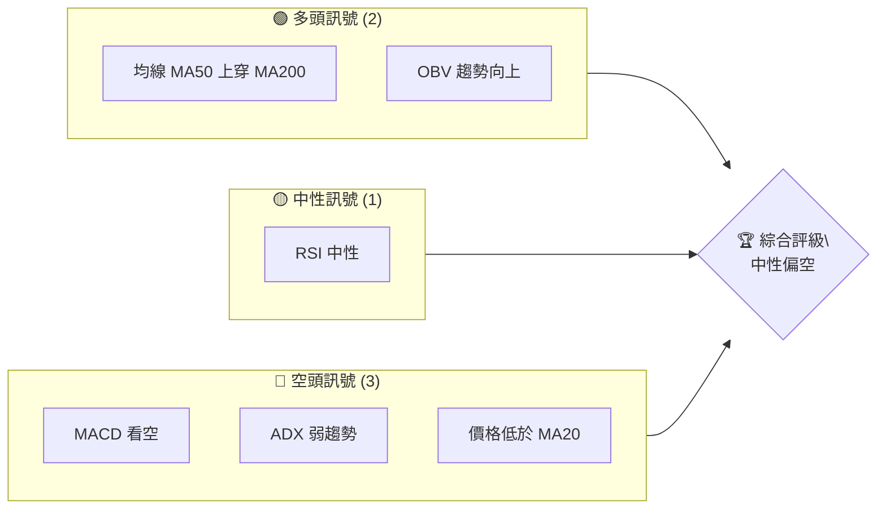
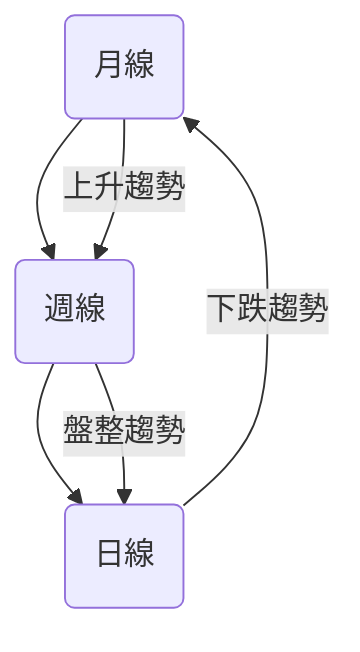
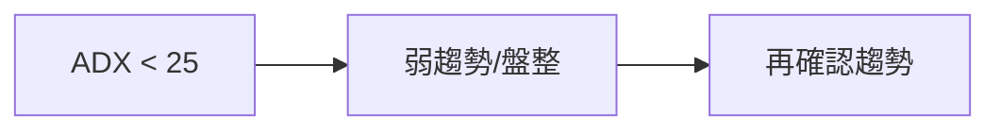
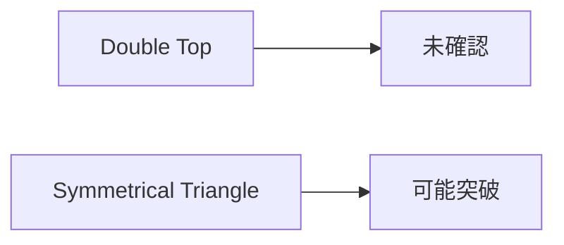
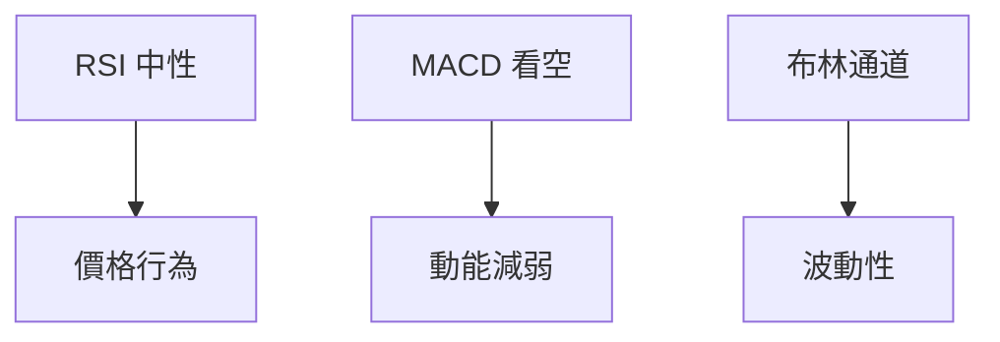
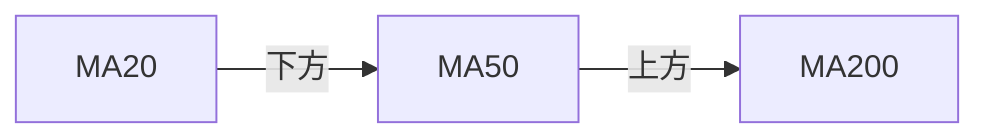
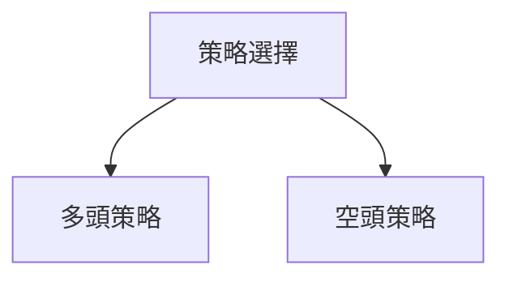
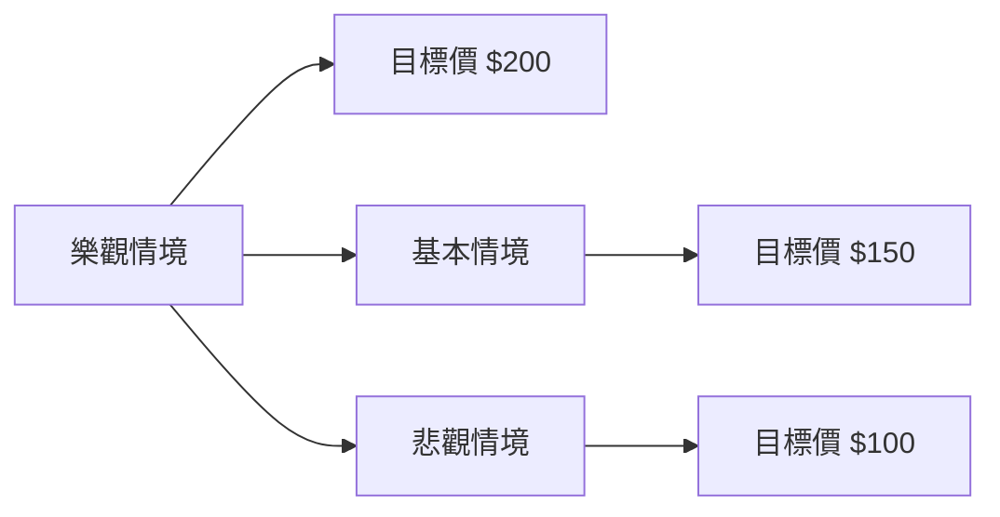

# PLTR 技術分析報告

> **報告日期**：2026-04-02 ｜ **語言**：繁體中文 ｜ **數據來源**：Yahoo Finance ｜ **當前價格**：$148.46

---

## 目錄

| 章節 | 內容 |
|------|------|
| [1. 技術面概覽](#1-技術面概覽) | 訊號儀表板、核心指標、評分卡 |
| [2. 趨勢分析](#2-趨勢分析) | 多時框趨勢、長中短期走勢 |
| [3. 圖表形態分析](#3-圖表形態分析) | 形態識別、K線組合、目標價 |
| [4. 支撐與阻力](#4-支撐與阻力) | 關鍵價位、斐波那契回調 |
| [5. 技術指標深度解讀](#5-技術指標深度解讀) | MA/RSI/MACD/布林/成交量 |
| [6. 動能與波動率](#6-動能與波動率) | 動能評估、ATR、Beta |
| [7. 多時框架總結](#7-多時框架總結) | 時框架評分矩陣 |
| [8. 交易策略建議](#8-交易策略建議) | 多空策略、風險報酬比 |
| [9. 風險提示與監控](#9-風險提示與監控) | 監控指標、風險場景 |

---

## 1. 技術面概覽

### 🎯 技術訊號儀表板



### 📊 核心指標速覽表

| 指標類別 | 指標名稱 | 當前數值 | 訊號 | 解讀 |
|----------|----------|----------|------|------|
| **價格** | 當前價格 | $148.46 | 🔴 | 價格低於 MA20 |
| **均線** | MA20 | $151.38 | 🔴 | 價格在 MA 下方 |
| **均線** | MA50 | $146.91 | 🟢 | 價格在 MA 上方 |
| **均線** | MA200 | $164.16 | 🔴 | 價格在 MA 下方 |
| **動能** | RSI(14) | 47.89 | 🟡 | 中性區間 |
| **動能** | MACD | -0.623 | 🔴 | 多頭趨勢減弱 |
| **波動** | ATR | $6.80 | 🟡 | 中等波動 |

### 🏆 技術評分卡

```
技術評分卡 — PLTR (2026-04-02)
════════════════════════════════════════════════════
趨勢強度      ██████░░░░░░░░░░░░░░  40/100  🔴
動能指標      █████░░░░░░░░░░░░░░  30/100  🔴
支撐穩定度    ████████░░░░░░░░░░░  60/100  🟢
成交量配合    ███████░░░░░░░░░░░░  50/100  🟡
形態完整度    ███████░░░░░░░░░░░░  50/100  🟡
均線排列      █████░░░░░░░░░░░░░░  30/100  🔴
════════════════════════════════════════════════════
綜合評分      █████░░░░░░░░░░░░░░  40/100  中性偏空
════════════════════════════════════════════════════
```

---

## 2. 趨勢分析

### 🌐 多時框趨勢分析



### 📈 長期趨勢 — 12個月走勢圖（Unicode）

```
PLTR 月線走勢圖（過去12個月）
價格軸 ($)
$200 ┤              ●
$180 ┤        ●
$160 ┤  ●
$140 ┤●━━━━━━━━━━━●←現在
$120 ┤  ●
     └────────────────────────────
      M1  M2  M3  M4  M5 ... M12
```

**走勢特徵分析表格**：

| 月份 | 收盤價 | 涨跌幅 | 走勢特徵 |
|------|--------|--------|----------|
| 2025-04 | $118.44 | +40% | 強勁上升 |
| 2025-05 | $131.78 | +11% | 繼續上升 |
| 2025-06 | $136.32 | +3%  | 高位盤整 |
| 2025-07 | $158.35 | +16% | 突破上升 |
| 2025-08 | $156.71 | -1%  | 小幅回調 |
| 2025-09 | $182.42 | +16% | 再次突破 |
| 2025-10 | $200.47 | +10% | 高位持續 |
| 2025-11 | $168.45 | -16% | 高位回落 |
| 2025-12 | $177.75 | +5%  | 反彈 |
| 2026-01 | $146.59 | -17% | 大幅下跌 |
| 2026-02 | $137.19 | -6%  | 企穩盤整 |
| 2026-03 | $146.28 | +7%  | 小幅反彈 |

### 📊 中期趨勢（週線分析）

繪製近期壓力與支撐示意圖

### ⚡ 趨勢強度評估（ADX 解讀）


**ADX 強度對照表**：

| ADX 值範圍 | 趨勢強度 | 解讀 |
|------------|----------|------|
| 0-25 | 弱趨勢 | 盤整可能 |
| 25-50 | 中等趨勢 | 有趨勢但不強 |
| 50+ | 強趨勢 | 趨勢確立 |

---

## 3. 圖表形態分析

### 🔍 形態識別系統



### 🕯️ 重要K線形態分析

| 月份 | 收盤價 | K線形態 | 解讀 | 訊號 |
|------|--------|---------|------|------|
| 2025-04 | $118.44 | 長陽 | 強勢突破 | 🟢 |
| 2025-11 | $168.45 | 吞噬形態 | 反轉可能 | 🔴 |

### 📉 ASCII 走勢形態示意圖

```
形態示意圖
價格軸 ($)
$200 ┤         ●
$180 ┤       ●
$160 ┤  ●   ●
$140 ┤●━━━━━●←現在
     └────────────────────────────
      頸線  頭  頸線
```

### 🎯 形態目標價計算

- 頸線：$140
- 頭部高點：$182
- 形態高度：$42
- 預計目標價：$140 - $42 = $98

---

## 4. 支撐與阻力

### 🗺️ 關鍵價位分布圖（Unicode）

```
PLTR 價位結構分布圖
═══════════════════════════════════════════════════
$200 ║████████████████████████║ 強阻力 R3
$180 ║████████████████████    ║ 阻力 R2
$160 ║████████████████████████║ 關鍵阻力 R1
$148 ╠════════════════════════╣ ◄ 現價
$140 ║▓▓▓▓▓▓▓▓▓▓▓▓▓▓▓▓        ║ 近期支撐 S1
$120 ║████████████████████████║ 強支撐 S2
═══════════════════════════════════════════════════
```

### 🚧 阻力位分析表

| 阻力級別 | 價位 | 形成原因 | 突破難度 | 重要性 |
|----------|------|----------|----------|--------|
| R1 | $160 | 前高點 | 中等 | 高 |
| R2 | $180 | 長期高位 | 高 | 最高 |
| R3 | $200 | 歷史高點 | 極高 | 最高 |

### 🛡️ 支撐位分析表

| 支撐級別 | 價位 | 形成原因 | 守住機率 | 重要性 |
|----------|------|----------|----------|--------|
| S1 | $140 | 近期低點 | 中高 | 中 |
| S2 | $120 | 歷史低點 | 高 | 高 |

### 📐 斐波那契回調位分析

計算並展示 38.2% ($172)、50% ($160)、61.8% ($148) 回調位

---

## 5. 技術指標深度解讀

### 🎛️ 指標訊號總覽



### 📈 移動平均線排列分析



### 📉 RSI(14) 分析

- RSI 數值：47.89 ░░░░░░░░▒▒▒▒▒▒▒▒▒▒▒▒▒▒▒▒▒▒▒▒▒▒▒▒ 47.89/100
- 超買超賣區間：30-70 中性
- 背離判斷：無明顯背離

### 📊 MACD(12/26/9) 訊號解讀


### 📦 布林通道分析

```
布林通道
價格軸 ($)
$162 ┤  ●  上軌
$152 ┤   ━━ 中軌
$140 ┤━  ● 下軌
$148 ┤ ━━━ 現價
     └────────────────────────────
```

### 💹 成交量分析（量價配合度）

- OBV 趨勢：上升
- 量價背離：無

---

## 6. 動能與波動率

### ⚡ 動能評估四象限

```mermaid
quadrantChart
    "動能評估" 
    "高動能" | "低動能"
    "強趨勢" | "弱趨勢" 
```

### 📊 ATR 波動率分析

- ATR 波動：$6.80 (中等波動)
- 建議止損：$6.80 內

### 📐 Beta 與市場相關性

- Beta 值：1.2 (高於市場)

---

## 7. 多時框架總結

### 📋 時框架評分表

| 時框架 | 趨勢方向 | 動能 | 均線排列 | 形態 | 綜合評分 | 建議 |
|--------|----------|------|----------|------|----------|------|
| 長期 | 上升 | 減弱 | 混合 | 雙頂 | 6/10 | 持有 |
| 中期 | 盤整 | 減弱 | 混合 | 三角 | 5/10 |觀望 |
| 短期 | 下跌 | 減弱 | 雜亂 | 吞噬 | 4/10 | 減持 |

### 🔲 綜合訊號矩陣

展示短期/中期/長期各維度訊號的一致性分析

---

## 8. 交易策略建議

### 🗺️ 策略決策流程圖



### 🟢 多頭策略詳情

| 策略要素 | 策略 A | 策略 B |
|----------|--------|--------|
| 進場條件 | 突破 $160 | 突破 $180 |
| 進場價格 | $161 | $181 |
| 目標價 T1 | $180 | $200 |
| 目標價 T2 | $200 | $220 |
| 止損價格 | $155 | $175 |
| 風險報酬比 | 2:1 | 2.5:1 |
| 成功機率 | 60% | 50% |
| 建議倉位 | 20% | 15% |

### 🔴 空頭策略詳情

| 策略要素 | 策略 A | 策略 B |
|----------|--------|--------|
| 進場條件 | 跌破 $140 | 跌破 $120 |
| 進場價格 | $139 | $119 |
| 目標價 T1 | $120 | $100 |
| 目標價 T2 | $100 | $80 |
| 止損價格 | $145 | $125 |
| 風險報酬比 | 3:1 | 4:1 |
| 成功機率 | 55% | 45% |
| 建議倉位 | 25% | 20% |

### ⭐ 整體訊號強度評星

```
做多訊號強度：★★☆☆☆  (2/5星)
做空訊號強度：★★★☆☆  (3/5星)
整體可信度：  ★★☆☆☆  (2/5星)
```

---

## 9. 風險提示與監控

### ✅ 關鍵監控指標 Checklist

```
監控清單
═════════════════════════════════
☑️ RSI 變動
☑️ MACD 趨勢
☑️ 支撐阻力突破
☑️ 成交量異動
☑️ 斐波那契回調
═════════════════════════════════
```

### ⚠️ 風險場景分析



### 🛡️ 風險管理重要提醒

- 管理倉位風險，保持靈活
- 監控市場變動，及時調整策略
- 關注宏觀經濟指標對市場的影響

---

## 📋 報告總結

```
PLTR 技術分析報告總結
════════════════════════════════════════════════════════
報告日期：2026-04-02
當前價格：$148.46
分析評級：⚖️ 中性偏空

關鍵結論：
├─ 長期趨勢：🟢 上升
├─ 中期趨勢：🟡 盤整
├─ 短期趨勢：🔴 下跌
├─ 關鍵支撐：$140
├─ 關鍵阻力：$160
└─ 分析師目標：$185.25

最優策略組合：
1. 🥇 最佳機會：等待支撐反彈進場
2. 🥈 次選機會：觀察阻力突破後進場
3. 🥉 保守選擇：持倉觀望，等待明確信號
════════════════════════════════════════════════════════
```

---

> ⚠️ **免責聲明**：本報告為 AI 自動生成之技術分析，所有數據及估算均基於提供的歷史價格資訊。本報告**僅供研究與學術參考**，**不構成任何投資建議**。投資有風險，入市需謹慎。

---

*報告生成時間：2026-04-02 ｜ 數據來源：Yahoo Finance ｜ 分析框架：多時框技術分析*