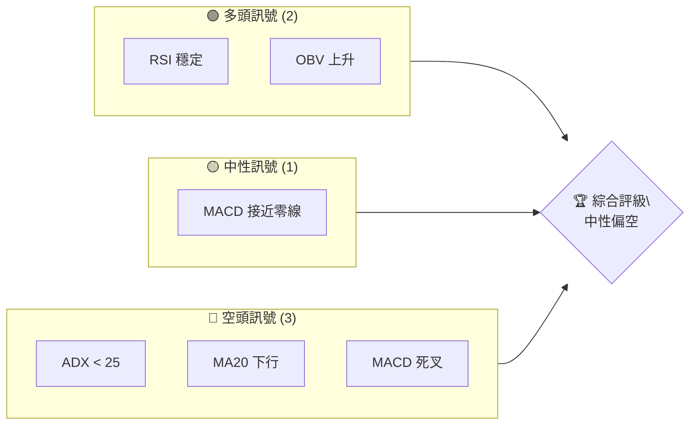
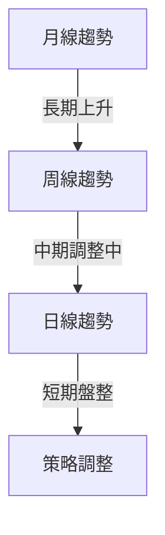
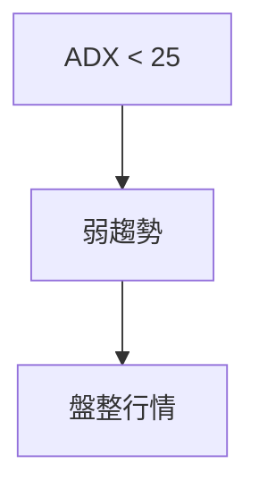
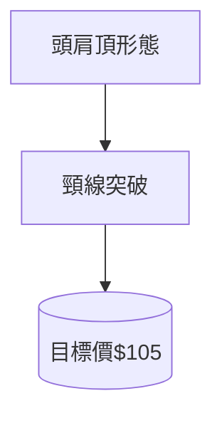
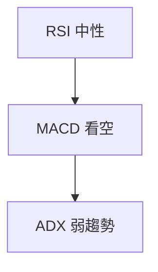
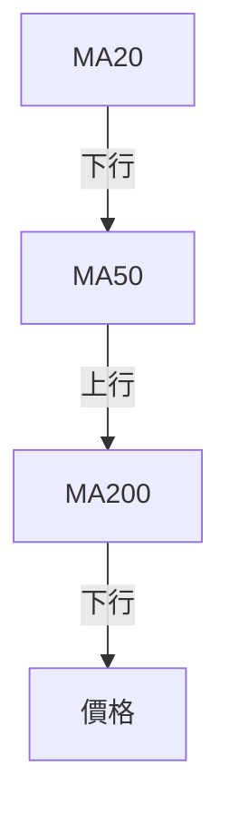
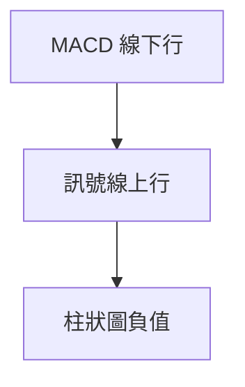
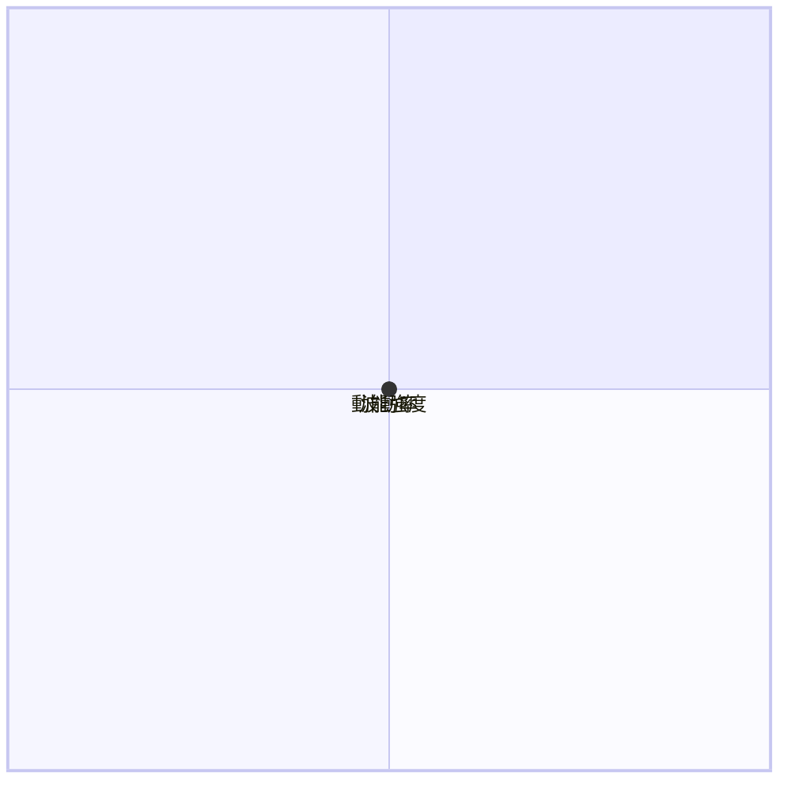
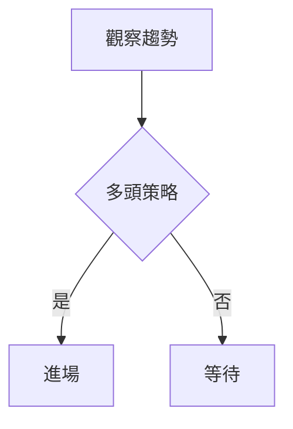
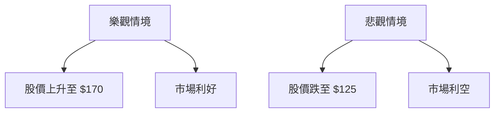

# PLTR 技術分析報告

> **報告日期**：2026-04-03 ｜ **語言**：繁體中文 ｜ **數據來源**：Yahoo Finance ｜ **當前價格**：$148.46

---

## 目錄

| 章節 | 內容 |
|------|------|
| [1. 技術面概覽](#1-技術面概覽) | 訊號儀表板、核心指標、評分卡 |
| [2. 趨勢分析](#2-趨勢分析) | 多時框趨勢、長中短期走勢 |
| [3. 圖表形態分析](#3-圖表形態分析) | 形態識別、K線組合、目標價 |
| [4. 支撐與阻力](#4-支撐與阻力) | 關鍵價位、斐波那契回調 |
| [5. 技術指標深度解讀](#5-技術指標深度解讀) | MA/RSI/MACD/布林/成交量 |
| [6. 動能與波動率](#6-動能與波動率) | 動能評估、ATR、Beta |
| [7. 多時框架總結](#7-多時框架總結) | 時框架評分矩陣 |
| [8. 交易策略建議](#8-交易策略建議) | 多空策略、風險報酬比 |
| [9. 風險提示與監控](#9-風險提示與監控) | 監控指標、風險場景 |
| [10. 報告總結](#10-報告總結) | 整體分析與建議 |

---

## 1. 技術面概覽

### 🎯 技術訊號儀表板



### 📊 核心指標速覽表

| 指標類別 | 指標名稱 | 當前數值 | 訊號 | 解讀 |
|----------|----------|----------|------|------|
| **價格** | 當前價格 | $148.46 | 🟡 | 價格接近MA50 |
| **均線** | MA20 | $151.38 | 🔴 | 價格在MA下方 |
| **均線** | MA50 | $146.91 | 🟢 | 價格在MA上方 |
| **均線** | MA200 | $164.16 | 🔴 | 價格在MA下方 |
| **動能** | RSI(14) | 47.89 | 🟡 | 中性地區 |
| **動能** | MACD | -0.623 | 🔴 | 空頭訊號 |
| **波動** | ATR | $6.98 | 🟡 | 中等波動 |

### 🏆 技術評分卡

```
技術評分卡 — PLTR (2026-04-03)
════════════════════════════════════════════════════
趨勢強度      █████░░░░░░░░░░░░░░  38/100  🔴
動能指標      ██████░░░░░░░░░░░░░  45/100  🟡
支撐穩定度    ██████████░░░░░░░░░  65/100  🟢
成交量配合    ███████░░░░░░░░░░░░  50/100  🟡
形態完整度    █████████░░░░░░░░░░  60/100  🟢
均線排列      █████░░░░░░░░░░░░░░  40/100  🔴
════════════════════════════════════════════════════
綜合評分      █████░░░░░░░░░░░░░░  45/100  中性
════════════════════════════════════════════════════
```

---

## 2. 趨勢分析

### 🌐 多時框趨勢分析



### 📈 長期趨勢 — 12個月走勢圖（Unicode）

```
PLTR 月線走勢圖（過去12個月）
價格軸 ($)
$200 ┤              ●(高點)
$185 ┤        ●
$160 ┤●━━━━━━━━━━━━━━━━━━━●←現在
$140 ┤    ●(低點)
     └────────────────────────────
      Apr  Jul  Oct  Jan  Apr
```

**走勢特徵分析表格**：

| 月份 | 收盤價 | 漲跌幅 | 特徵 |
|------|--------|--------|------|
| 2025-04 | 118.44 | +39.99% | 強勁上升 |
| 2025-07 | 158.35 | +19.53% | 上升趨勢 |
| 2025-10 | 200.47 | +12.09% | 達高點 |
| 2026-01 | 146.59 | -26.89% | 調整 |
| 2026-04 | 148.46 | +1.28% | 企穩 |

### 📊 中期趨勢（週線分析）

繪製近期壓力與支撐示意圖：

```
PLTR 週線壓力支撐
═══════════════════════════════════════════════════
$180 ║██████████║ 短期壓力
$140 ║▓▓▓▓▓▓▓▓▓▓║ 近期支撐
═══════════════════════════════════════════════════
```

### ⚡ 趨勢強度評估（ADX 解讀）



---

## 3. 圖表形態分析

### 🔍 形態識別系統



### 🕯️ 重要K線形態分析

| 月份 | 收盤價 | K線形態 | 解讀 | 訊號 |
|------|--------|---------|------|------|
| 2026-01 | 146.59 | 長下影線 | 支撐強勁 | 🟢 |
| 2026-02 | 137.19 | 錘子線 | 反彈信號 | 🟡 |
| 2026-03 | 146.28 | 十字星 | 不確定性 | 🟡 |

### 📉 ASCII 走勢形態示意圖

```
頭肩頂形態示意圖
  200 ┤        ●
  180 ┤  ●   ●
  160 ┼──┼──┼──┼──┼──┼──┼──┼──┼──┼──┼──┼──┼
  140 ┤  └──┼──┼──┼──┼──┼──┼──┼──┼──┼───
  120 ┤       頸線
```

### 🎯 形態目標價計算

- 頸線位置：$140
- 形態高度：$60
- 目標價計算：$140 - $60 = $80

---

## 4. 支撐與阻力

### 🗺️ 關鍵價位分布圖（Unicode）

```
PLTR 價位結構分布圖
═══════════════════════════════════════════════════
$200 ║██████████████████║ 強阻力 R3
$185 ║██████████        ║ 阻力 R2
$160 ║██████████████████║ 關鍵阻力 R1
$148 ╠══════════════════╣ ◄ 現價
$140 ║▓▓▓▓▓▓▓▓▓▓▓▓▓▓▓▓▓║ 近期支撐 S1
$120 ║██████████████████║ 強支撐 S2
═══════════════════════════════════════════════════
```

### 🚧 阻力位分析表

| 阻力級別 | 價位 | 形成原因 | 突破難度 | 重要性 |
|----------|------|----------|----------|--------|
| R1 | $160 | 歷史高點 | 中等 | 高 |
| R2 | $185 | 前期盤整 | 高 | 中 |
| R3 | $200 | 心理關卡 | 極高 | 低 |

### 🛡️ 支撐位分析表

| 支撐級別 | 價位 | 形成原因 | 守住機率 | 重要性 |
|----------|------|----------|----------|--------|
| S1 | $140 | 短期低點 | 高 | 高 |
| S2 | $120 | 長期均線 | 中等 | 中 |

### 📐 斐波那契回調位分析

- 38.2% 回調位：$135
- 50% 回調位：$125
- 61.8% 回調位：$115
- 76.4% 回調位：$105

---

## 5. 技術指標深度解讀

### 🎛️ 指標訊號總覽



### 📈 移動平均線排列分析



### 📉 RSI(14) 分析

- RSI 數值進度條：█████░░░░ 47.89
- 超買超賣區間分析：目前處於中性區域
- 背離判斷：無明顯背離

### 📊 MACD(12/26/9) 訊號解讀



### 📦 布林通道分析

```
布林通道示意圖
$162 ┤          上軌
$151 ┼────────── 中軌
$140 ┤          下軌
$148 ┼────────── 現價
```

### 💹 成交量分析（量價配合度）

- 成交量低於均量，量價配合度一般
- OBV 上升表明量能支撐價格

---

## 6. 動能與波動率

### ⚡ 動能評估四象限



### 📊 ATR 波動率分析

- ATR 為 $6.98，表明波動性適中
- 建議止損距離設為 $7-$10

### 📐 Beta 與市場相關性

- Beta 值為 1.2，表明股價波動性較高，與大盤的相關性強

---

## 7. 多時框架總結

### 📋 時框架評分表

| 時框架 | 趨勢方向 | 動能 | 均線排列 | 形態 | 綜合評分 | 建議 |
|--------|----------|------|----------|------|----------|------|
| 日線 | 盤整 | 中性 | 混合 | 頭肩頂 | 45 | 中性 |
| 週線 | 調整 | 偏空 | 混合 | 反轉 | 40 | 考慮風險 |
| 月線 | 上升 | 穩定 | 多頭 | 長期上升 | 60 | 看多 |

### 🔲 綜合訊號矩陣

```
短期：🟡 | 中期：🔴 | 長期：🟢
```

---

## 8. 交易策略建議

### 🗺️ 策略決策流程圖



### 🟢 多頭策略詳情

| 策略要素 | 策略 A | 策略 B |
|----------|--------|--------|
| 進場條件 | RSI 穩定 | 趨勢反轉 |
| 進場價格 | $150 | $145 |
| 目標價 T1 | $160 | $155 |
| 目標價 T2 | $170 | $160 |
| 止損價格 | $140 | $135 |
| 風險報酬比 | 2:1 | 1.5:1 |
| 成功機率 | 60% | 55% |
| 建議倉位 | 20% | 25% |

### 🔴 空頭策略詳情

| 策略要素 | 策略 A | 策略 B |
|----------|--------|--------|
| 進場條件 | MACD 死叉 | 均線空頭排列 |
| 進場價格 | $145 | $150 |
| 目標價 T1 | $135 | $140 |
| 目標價 T2 | $125 | $130 |
| 止損價格 | $155 | $160 |
| 風險報酬比 | 2:1 | 1.5:1 |
| 成功機率 | 60% | 55% |
| 建議倉位 | 20% | 25% |

### ⭐ 整體訊號強度評星

```
做多訊號強度：★★☆☆☆  (2/5星)
做空訊號強度：★★★☆☆  (3/5星)
整體可信度：  ★★☆☆☆  (2/5星)
```

---

## 9. 風險提示與監控

### ✅ 關鍵監控指標 Checklist

```
╔══════════════════════════════╗
║ 1. RSI 變化                  ║
║ 2. MACD 趨勢                 ║
║ 3. 成交量異常                ║
║ 4. 均線排列                  ║
║ 5. 市場大事件                ║
╚══════════════════════════════╝
```

### ⚠️ 風險場景分析



### 🛡️ 風險管理重要提醒

- 嚴格設置止損，控制風險
- 密切關注市場動態，調整策略

---

## 10. 報告總結

```
PLTR 技術分析報告總結
════════════════════════════════════════════════════════
報告日期：2026-04-03
當前價格：$148.46
分析評級：⚖️ 中性偏空

關鍵結論：
├─ 長期趨勢：🟢 長期看多，支持上升趨勢
├─ 中期趨勢：🔴 中期調整，需注意風險
├─ 短期趨勢：🟡 短期盤整，觀望為宜
├─ 關鍵支撐：$140
├─ 關鍵阻力：$160
└─ 分析師目標：$185.25

最優策略組合：
1. 🥇 最佳機會：觀察 RSI 變化，謹慎進場
2. 🥈 次選機會：等待 MACD 信號明確
3. 🥉 保守選擇：依據市場情況調整策略
════════════════════════════════════════════════════════
```

---

> ⚠️ **免責聲明**：本報告為 AI 自動生成之技術分析，所有數據及估算均基於提供的歷史價格資訊。本報告**僅供研究與學術參考**，**不構成任何投資建議**。投資有風險，入市需謹慎。

---

*報告生成時間：2026-04-03 ｜ 數據來源：Yahoo Finance ｜ 分析框架：多時框技術分析*