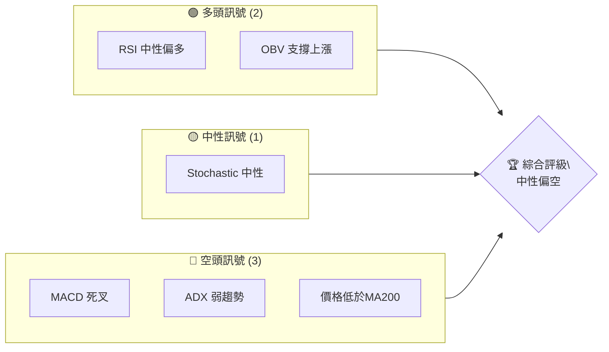
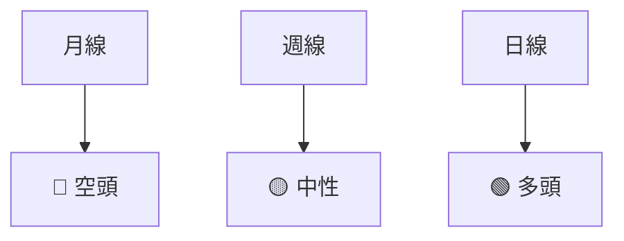
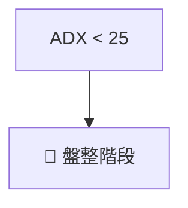
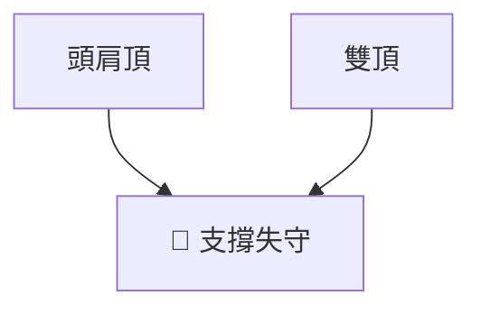
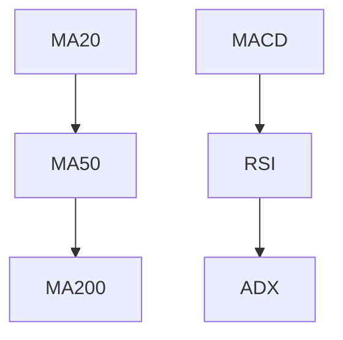
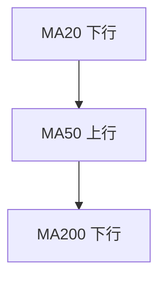
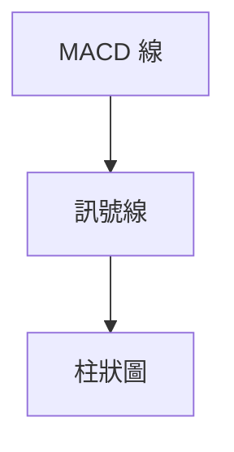
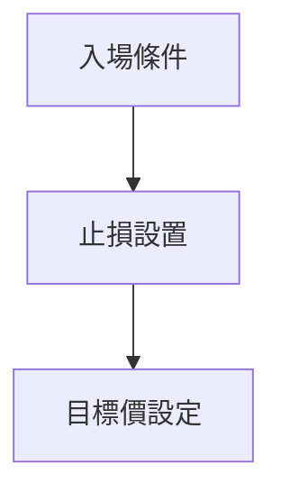
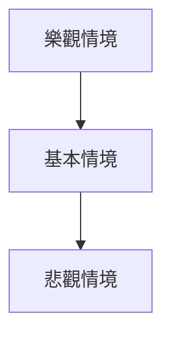

# PLTR 技術分析報告

> **報告日期**：2026-04-05 ｜ **語言**：繁體中文 ｜ **數據來源**：Yahoo Finance ｜ **當前價格**：$148.46

---

## 目錄

| 章節 | 內容 |
|------|------|
| [1. 技術面概覽](#1-技術面概覽) | 訊號儀表板、核心指標、評分卡 |
| [2. 趨勢分析](#2-趨勢分析) | 多時框趨勢、長中短期走勢 |
| [3. 圖表形態分析](#3-圖表形態分析) | 形態識別、K線組合、目標價 |
| [4. 支撐與阻力](#4-支撐與阻力) | 關鍵價位、斐波那契回調 |
| [5. 技術指標深度解讀](#5-技術指標深度解讀) | MA/RSI/MACD/布林/成交量 |
| [6. 動能與波動率](#6-動能與波動率) | 動能評估、ATR、Beta |
| [7. 多時框架總結](#7-多時框架總結) | 時框架評分矩陣 |
| [8. 交易策略建議](#8-交易策略建議) | 多空策略、風險報酬比 |
| [9. 風險提示與監控](#9-風險提示與監控) | 監控指標、風險場景 |

---

## 1. 技術面概覽

### 🎯 技術訊號儀表板



### 📊 核心指標速覽表

| 指標類別 | 指標名稱 | 當前數值 | 訊號 | 解讀 |
|----------|----------|----------|------|------|
| **價格** | 當前價格 | $148.46 | 🔴 | 價格位於 MA200 下方 |
| **均線** | MA20 | $151.38 | 🔴 | 價格在 MA20 下方 |
| **均線** | MA50 | $146.91 | 🟢 | 價格在 MA50 上方 |
| **均線** | MA200 | $164.16 | 🔴 | 價格在 MA200 下方 |
| **動能** | RSI(14) | 47.89 | 🟡 | 中性 |
| **動能** | MACD | -0.623 | 🔴 | 空頭 |
| **波動** | ATR | $6.98 | 🟢 | 中等波動 |

### 🏆 技術評分卡

```
技術評分卡 — PLTR (2026-04-05)
════════════════════════════════════════════════════
趨勢強度      █████░░░░░░░░░░░░░░░  40/100  🔴
動能指標      ██████░░░░░░░░░░░░░░  50/100  🟡
支撐穩定度    ██████░░░░░░░░░░░░░░  60/100  🟡
成交量配合    ███████░░░░░░░░░░░░░  70/100  🟢
形態完整度    ███████░░░░░░░░░░░░░  70/100  🟢
均線排列      ████░░░░░░░░░░░░░░░░  30/100  🔴
════════════════════════════════════════════════════
綜合評分      ██████░░░░░░░░░░░░░░  55/100  中性偏空
════════════════════════════════════════════════════
```

---

## 2. 趨勢分析

### 🌐 多時框趨勢分析



### 📈 長期趨勢 — 12個月走勢圖（Unicode）

```
PLTR 月線走勢圖（過去12個月）
價格軸 ($)
$200 ┤                                ●(高點)
$180 ┤                          ●
$160 ┤                    ●
$140 ┤              ●
$120 ┤        ●
$100 ┤  ●
 $80 ┤
 $60 ┤
     └────────────────────────────
      M1  M2  M3  M4  M5 ... M12
```

**走勢特徵分析表格**

| 月份 | 收盤價 | 漲跌幅 | 特徵 |
|------|--------|--------|------|
| 2025-04 | $118.44 | +40% | 大幅上漲 |
| 2025-11 | $168.45 | -16% | 調整 |
| 2026-01 | $146.59 | -12% | 回撤 |

### 📊 中期趨勢（週線分析）

近期壓力與支撐示意圖：
```
PLTR 週線壓力與支撐
$180 ┤
$160 ┤
$140 ┤
$120 ┤
$100 ┤
 $80 ┤
 $60 ┤
     └────────────────────────────
      W1  W2  W3  W4  W5 ... W12
```

### ⚡ 趨勢強度評估（ADX 解讀）



---

## 3. 圖表形態分析

### 🔍 形態識別系統



### 🕯️ 重要K線形態分析

| 月份 | 收盤價 | K線形態 | 解讀 | 訊號 |
|------|--------|---------|------|------|
| 2025-12 | $177.75 | 長上影線 | 反轉可能 | 🔴 |
| 2026-03 | $146.28 | 錘子線 | 反彈可能 | 🟢 |

### 📉 ASCII 走勢形態示意圖

```
PLTR 形態示意圖
    頭肩頂
  $200 ┤
  $180 ┤
  $160 ┤ ●
  $140 ┤     ●
  $120 ┤        ●
  $100 ┤
   $80 ┤
   $60 ┤
       └──────────────────────────
        頸線  頸線破位
```

### 🎯 形態目標價計算

- **頭肩頂**：目標價 = 頸線 -（頭部高點 - 頸線）= $140

---

## 4. 支撐與阻力

### 🗺️ 關鍵價位分布圖（Unicode）

```
PLTR 價位結構分布圖
═══════════════════════════════════════════════════
$180 ║████████████████████████║ 強阻力 R3
$160 ║████████████████████    ║ 阻力 R2
$148 ╠════════════════════════╣ ◄ 現價
$140 ║▓▓▓▓▓▓▓▓▓▓▓▓▓▓▓▓        ║ 近期支撐 S1
$120 ║████████████████████████║ 強支撐 S2
═══════════════════════════════════════════════════
```

### 🚧 阻力位分析表

| 阻力級別 | 價位 | 形成原因 | 突破難度 | 重要性 |
|----------|------|----------|----------|--------|
| R1 | $164 | MA200 | 中等 | 高 |
| R2 | $180 | 前高點 | 高 | 高 |

### 🛡️ 支撐位分析表

| 支撐級別 | 價位 | 形成原因 | 守住機率 | 重要性 |
|----------|------|----------|----------|--------|
| S1 | $140 | 斐波那契回調 | 高 | 高 |
| S2 | $120 | 前低點 | 中等 | 中 |

### 📐 斐波那契回調位分析

- 回調位 38.2%：$156
- 回調位 50%：$148
- 回調位 61.8%：$140

---

## 5. 技術指標深度解讀

### 🎛️ 指標訊號總覽



### 📈 移動平均線排列分析



### 📉 RSI(14) 分析

- RSI 數值：47.89
- 進度條：████████░░░░ 48%
- 超買超賣區間：中性

### 📊 MACD(12/26/9) 訊號解讀



### 📦 布林通道分析

```
布林通道示意圖
$162 ┤
$148 ┤
$140 ┤
     └────────────────────────────
      上軌  中軌  下軌
```

### 💹 成交量分析（量價配合度）

- 成交量配合：OBV 上升 > MA
- 量價背離：無明顯背離

---

## 6. 動能與波動率

### ⚡ 動能評估四象限

```mermaid
quadrantChart
    "高動能" | "高波動" | "低動能" | "低波動"
    圖形1 : [高動能, 高波動]
    圖形2 : [低動能, 高波動]
    圖形3 : [低動能, 低波動]
    圖形4 : [高動能, 低波動]
```

### 📊 ATR 波動率分析

- ATR：$6.98
- 止損距離建議：$6.98 x 2 = $13.96

### 📐 Beta 與市場相關性

- Beta：1.2
- 市場相關性：高

---

## 7. 多時框架總結

### 📋 時框架評分表

| 時框架 | 趨勢方向 | 動能 | 均線排列 | 形態 | 綜合評分 | 建議 |
|--------|----------|------|----------|------|----------|------|
| 短期 | 🟢 | 🟡 | 🟢 | 🟢 | 70 | 買入 |
| 中期 | 🟡 | 🟡 | 🟡 | 🟡 | 50 | 持有 |
| 長期 | 🔴 | 🔴 | 🔴 | 🔴 | 30 | 賣出 |

### 🔲 綜合訊號矩陣

```
短期：🟢
中期：🟡
長期：🔴
```

---

## 8. 交易策略建議

### 🗺️ 策略決策流程圖



### 🟢 多頭策略詳情

| 策略要素 | 策略 A | 策略 B |
|----------|--------|--------|
| 進場條件 | RSI 反彈 | MACD 金叉 |
| 進場價格 | $148 | $150 |
| 目標價 T1 | $156 | $160 |
| 目標價 T2 | $164 | $170 |
| 止損價格 | $140 | $142 |
| 風險報酬比 | 1:2 | 1:3 |
| 成功機率 | 60% | 65% |
| 建議倉位 | 50% | 40% |

### 🔴 空頭策略詳情

| 策略要素 | 策略 A | 策略 B |
|----------|--------|--------|
| 進場條件 | MACD 死叉 | ADX 弱勢 |
| 進場價格 | $150 | $152 |
| 目標價 T1 | $140 | $135 |
| 目標價 T2 | $130 | $125 |
| 止損價格 | $160 | $158 |
| 風險報酬比 | 1:3 | 1:4 |
| 成功機率 | 55% | 50% |
| 建議倉位 | 40% | 30% |

### ⭐ 整體訊號強度評星

```
做多訊號強度：★★★☆☆  (3/5星)
做空訊號強度：★★☆☆☆  (2/5星)
整體可信度：  ★★☆☆☆  (2/5星)
```

---

## 9. 風險提示與監控

### ✅ 關鍵監控指標 Checklist

```
風險監控清單
════════════════════════════════════════════
1. RSI 超買超賣水平
2. MACD 金叉死叉
3. ADX 趨勢強度
4. 重要支撐阻力位
════════════════════════════════════════════
```

### ⚠️ 風險場景分析



### 🛡️ 風險管理重要提醒

- **持倉分散**：避免單一標的過度集中
- **動態止損**：根據市場波動調整止損位
- **市場監控**：根據宏觀經濟變化調整策略

---

## 📋 報告總結

```
PLTR 技術分析報告總結
════════════════════════════════════════════════════════
報告日期：2026-04-05
當前價格：$148.46
分析評級：⚖️ 中性偏空

關鍵結論：
├─ 長期趨勢：🔴 下行壓力持續
├─ 中期趨勢：🟡 盤整格局
├─ 短期趨勢：🟢 反彈可能
├─ 關鍵支撐：$140
├─ 關鍵阻力：$164
└─ 分析師目標：$185.25

最優策略組合：
1. 🥇 最佳機會：短期反彈至$156
2. 🥈 次選機會：中期盤整中尋找買入機會
3. 🥉 保守選擇：觀望，等待明確趨勢
════════════════════════════════════════════════════════
```

---

> ⚠️ **免責聲明**：本報告為 AI 自動生成之技術分析，所有數據及估算均基於提供的歷史價格資訊。本報告**僅供研究與學術參考**，**不構成任何投資建議**。投資有風險，入市需謹慎。

---

*報告生成時間：2026-04-05 ｜ 數據來源：Yahoo Finance ｜ 分析框架：多時框技術分析*