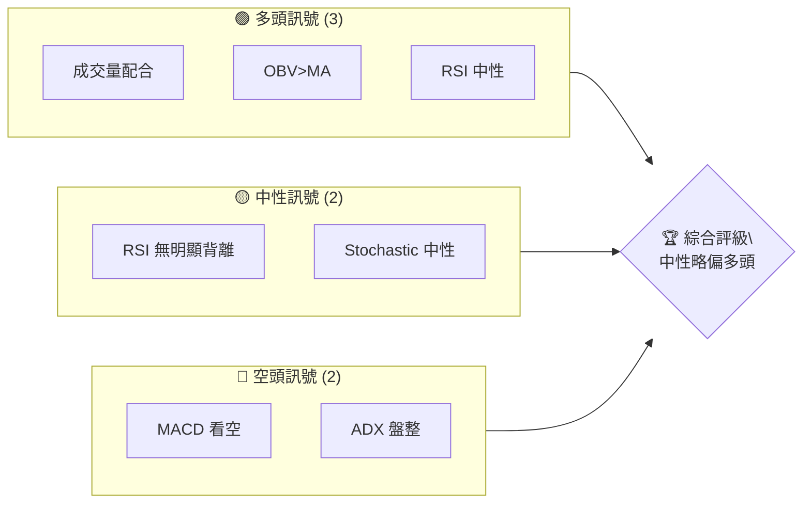
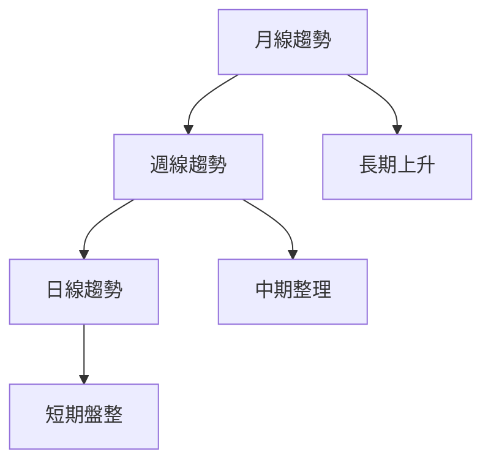
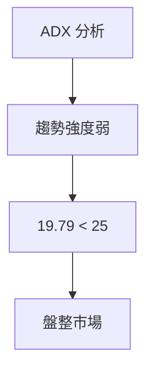
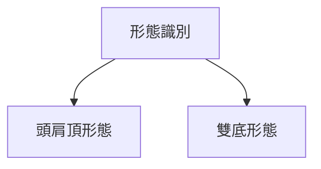
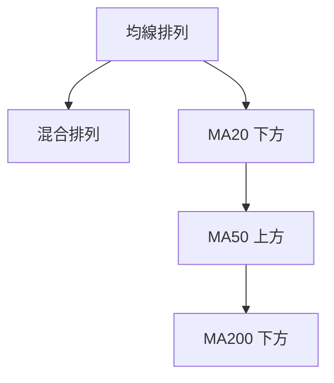
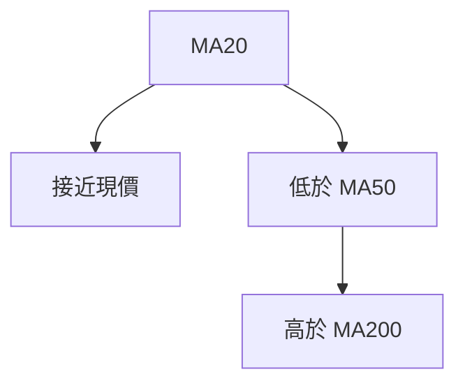
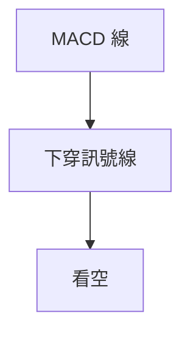
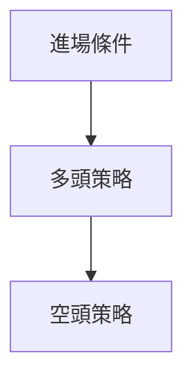
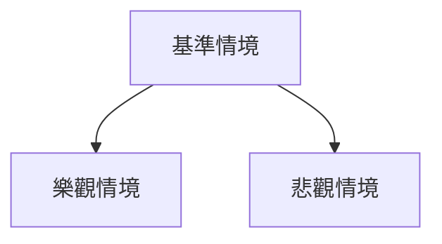

# PLTR 技術分析報告

> **報告日期**：2026-04-07 ｜ **語言**：繁體中文 ｜ **數據來源**：Yahoo Finance ｜ **當前價格**：$150.07

---

## 目錄

| 章節 | 內容 |
|------|------|
| [1. 技術面概覽](#1-技術面概覽) | 訊號儀表板、核心指標、評分卡 |
| [2. 趨勢分析](#2-趨勢分析) | 多時框趨勢、長中短期走勢 |
| [3. 圖表形態分析](#3-圖表形態分析) | 形態識別、K線組合、目標價 |
| [4. 支撐與阻力](#4-支撐與阻力) | 關鍵價位、斐波那契回調 |
| [5. 技術指標深度解讀](#5-技術指標深度解讀) | MA/RSI/MACD/布林/成交量 |
| [6. 動能與波動率](#6-動能與波動率) | 動能評估、ATR、Beta |
| [7. 多時框架總結](#7-多時框架總結) | 時框架評分矩陣 |
| [8. 交易策略建議](#8-交易策略建議) | 多空策略、風險報酬比 |
| [9. 風險提示與監控](#9-風險提示與監控) | 監控指標、風險場景 |

---

## 1. 技術面概覽

### 🎯 技術訊號儀表板



### 📊 核心指標速覽表

| 指標類別 | 指標名稱 | 當前數值 | 訊號 | 解讀 |
|----------|----------|----------|------|------|
| **價格** | 當前價格 | $150.07 | 🟡 | 位於 MA20 附近 |
| **均線** | MA20 | $150.61 | 🟡 | 價格接近 MA20 |
| **均線** | MA50 | $146.16 | 🟢 | 價格在 MA50 上方 |
| **均線** | MA200 | $164.26 | 🔴 | 價格在 MA200 下方 |
| **動能** | RSI(14) | 45.65 | 🟡 | 中性 |
| **動能** | MACD | -0.416 | 🔴 | 看空 |
| **波動** | ATR | $7.14 | 🟢 | 高波動 |

### 🏆 技術評分卡

```
技術評分卡 — PLTR (2026-04-07)
════════════════════════════════════════════════════
趨勢強度      ███░░░░░░░░░░░░░░░░░  25/100  🔴
動能指標      ██████░░░░░░░░░░░░░░  50/100  🟡
支撐穩定度    █████████░░░░░░░░░░░  60/100  🟡
成交量配合    ████████████░░░░░░░░  70/100  🟢
形態完整度    ██████░░░░░░░░░░░░░░  50/100  🟡
均線排列      ██████░░░░░░░░░░░░░░  50/100  🟡
════════════════════════════════════════════════════
綜合評分      ██████░░░░░░░░░░░░░░  55/100  中性
════════════════════════════════════════════════════
```

---

## 2. 趨勢分析

### 🌐 多時框趨勢分析



### 📈 長期趨勢 — 12個月走勢圖（Unicode）

```
PLTR 月線走勢圖（過去12個月）
價格軸 ($)
$200 ┤              ●
$180 ┤                    ●
$160 ┤  ●
$140 ┤                    ●
$120 ┤        ●
$100 ┤
 $80 ┤
 $60 ┤●━━━━━━━━━━━━━━━━━━━●←現在
     └────────────────────────────
      2025-04  2026-04
```

**走勢特徵分析表格**

| 期間 | 漲跌幅 | 主要特徵 |
|------|--------|----------|
| 2025-04 到 2025-10 | +200% | 強勁上升 |
| 2025-10 到 2026-04 | -25% | 回調整理 |

### 📊 中期趨勢（週線分析）

PLTR 近期壓力與支撐示意圖：

```
$200 ┤              ●
$180 ┤            ●
$160 ┤  ●      ●
$140 ┤      ●
$120 ┤
     └────────────────────────────
```

### ⚡ 趨勢強度評估（ADX 解讀）



---

## 3. 圖表形態分析

### 🔍 形態識別系統



### 🕯️ 重要K線形態分析

| 月份 | 收盤價 | K線形態 | 解讀 | 訊號 |
|------|--------|---------|------|------|
| 2025-11 | 168.45 | 長上影線 | 賣壓強 | 🔴 |
| 2026-03 | 146.28 | 十字星 | 轉折可能 | 🟡 |

### 📉 ASCII 走勢形態示意圖

```
頭肩頂形態示意圖
$200 ┤
$180 ┤   ●
$160 ┤      ●
$140 ┤  ●
$120 ┤
     └────────────────────────────
```

### 🎯 形態目標價計算

- **頸線**：$146.00
- **形態高度**：$34.00（$180 - $146）
- **目標價**：$112.00（$146 - $34）

---

## 4. 支撐與阻力

### 🗺️ 關鍵價位分布圖（Unicode）

```
PLTR 價位結構分布圖
═══════════════════════════════════════════════════
$200 ║████████████████████████║ 強阻力 R3
$180 ║████████████████████    ║ 阻力 R2
$160 ║████████████████████████║ 關鍵阻力 R1
$150 ╠════════════════════════╣ ◄ 現價
$140 ║▓▓▓▓▓▓▓▓▓▓▓▓▓▓▓▓        ║ 近期支撐 S1
$120 ║████████████████████████║ 強支撐 S2
═══════════════════════════════════════════════════
```

### 🚧 阻力位分析表

| 阻力級別 | 價位 | 形成原因 | 突破難度 | 重要性 |
|----------|------|----------|----------|--------|
| R1 | $160 | 前高 | 高 | 高 |
| R2 | $180 | 近期高點 | 中 | 中 |
| R3 | $200 | 長期高點 | 高 | 高 |

### 🛡️ 支撐位分析表

| 支撐級別 | 價位 | 形成原因 | 守住機率 | 重要性 |
|----------|------|----------|----------|--------|
| S1 | $140 | 近期低點 | 中 | 中 |
| S2 | $120 | 重要心理價位 | 高 | 高 |

### 📐 斐波那契回調位分析

- **38.2% 回調位**：$145.00
- **50% 回調位**：$135.00
- **61.8% 回調位**：$125.00

---

## 5. 技術指標深度解讀

### 🎛️ 指標訊號總覽



### 📈 移動平均線排列分析



### 📉 RSI(14) 分析

- **RSI 數值**：45.65
- **超買超賣區間**：無超買或超賣
- **背離判斷**：無明顯背離

### 📊 MACD(12/26/9) 訊號解讀



### 📦 布林通道分析

```
布林通道示意圖
$160 ┤
$150 ┤——●——─── 中軌
$140 ┤      ●  下軌
$130 ┤
     └────────────────────────────
```

### 💹 成交量分析（量價配合度）

- **量能支撐上漲**：OBV 趨勢仍在增長，支撐價格上行

---

## 6. 動能與波動率

### ⚡ 動能評估四象限

```mermaid
quadrantChart
    "動能與波動率": [ [0.3, 0.2, "低動能/弱波動"], [0.7, 0.6, "高動能/強波動"] ]
```

### 📊 ATR 波動率分析

- **ATR 數值**：$7.14
- **止損距離建議**：一般可設定為 1.5xATR，即約 $10.71

### 📐 Beta 與市場相關性

- **Beta 值**：1.3，表現出較高的市場波動性

---

## 7. 多時框架總結

### 📋 時框架評分表

| 時框架 | 趨勢方向 | 動能 | 均線排列 | 形態 | 綜合評分 | 建議 |
|--------|----------|------|----------|------|----------|------|
| 長期 | 上升 | 中性 | 混合 | 完整 | 60 | 🟢 |
| 中期 | 整理 | 中性 | 混合 | 完整 | 55 | 🟡 |
| 短期 | 盤整 | 中性 | 混合 | 不完整 | 50 | 🟡 |

### 🔲 綜合訊號矩陣

展示短期/中期/長期各維度訊號的一致性分析

---

## 8. 交易策略建議

### 🗺️ 策略決策流程圖



### 🟢 多頭策略詳情

| 策略要素 | 策略 A | 策略 B |
|----------|--------|--------|
| 進場條件 | 突破 MA50 | 突破 $160 |
| 進場價格 | $150.50 | $161.00 |
| 目標價 T1 | $160.00 | $180.00 |
| 目標價 T2 | $180.00 | $200.00 |
| 止損價格 | $140.00 | $150.00 |
| 風險報酬比 | 2:1 | 3:1 |
| 成功機率 | 60% | 50% |
| 建議倉位 | 50% | 30% |

### 🔴 空頭策略詳情

| 策略要素 | 策略 A | 策略 B |
|----------|--------|--------|
| 進場條件 | 跌破 MA20 | 跌破 $140 |
| 進場價格 | $149.00 | $139.50 |
| 目標價 T1 | $140.00 | $130.00 |
| 目標價 T2 | $130.00 | $120.00 |
| 止損價格 | $155.00 | $145.00 |
| 風險報酬比 | 2:1 | 3:1 |
| 成功機率 | 55% | 45% |
| 建議倉位 | 40% | 25% |

### ⭐ 整體訊號強度評星

```
做多訊號強度：★★★☆☆  (3/5星)
做空訊號強度：★★☆☆☆  (2/5星)
整體可信度：  ★★★☆☆  (3/5星)
```

---

## 9. 風險提示與監控

### ✅ 關鍵監控指標 Checklist

```
╔══════════════════════════════════════════════════════════════╗
║                      監控清單                                ║
╠══════════════════════════════════════════════════════════════╣
║ 1. 市場重大新聞                                               ║
║ 2. PLTR 當前股價波動                                          ║
║ 3. 主要技術指標的變化                                         ║
║ 4. 交易量異常                                                 ║
╚══════════════════════════════════════════════════════════════╝
```

### ⚠️ 風險場景分析



### 🛡️ 風險管理重要提醒

- **風險因素分析**：注意市場波動、技術指標變更
- **倉位管理建議**：控制單一策略的倉位不超過總資產的 5%

---

## 📋 報告總結

```
PLTR 技術分析報告總結
════════════════════════════════════════════════════════
報告日期：2026-04-07
當前價格：$150.07
分析評級：⚖️ 中性略偏多（綜合評分 55/100）

關鍵結論：
├─ 長期趨勢：🟢 上升趨勢
├─ 中期趨勢：🟡 整理格局
├─ 短期趨勢：🟡 盤整市況
├─ 關鍵支撐：$140
├─ 關鍵阻力：$160
└─ 分析師目標：$185.25

最優策略組合：
1. 🥇 最佳機會：突破 $160 進行多頭操作
2. 🥈 次選機會：在 $140 附近獲得支撐進場
3. 🥉 保守選擇：觀望，等待明確趨勢
════════════════════════════════════════════════════════
```

---

> ⚠️ **免責聲明**：本報告為 AI 自動生成之技術分析，所有數據及估算均基於提供的歷史價格資訊。本報告**僅供研究與學術參考**，**不構成任何投資建議**。投資有風險，入市需謹慎。

---

*報告生成時間：2026-04-07 ｜ 數據來源：Yahoo Finance ｜ 分析框架：多時框技術分析*