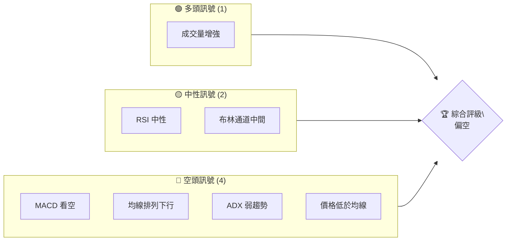
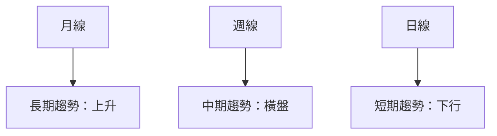
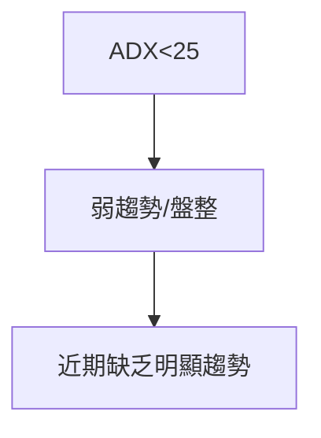
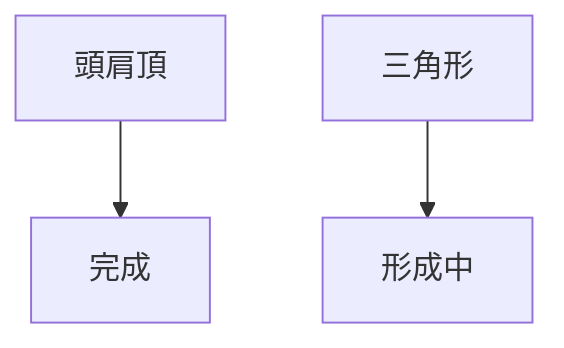
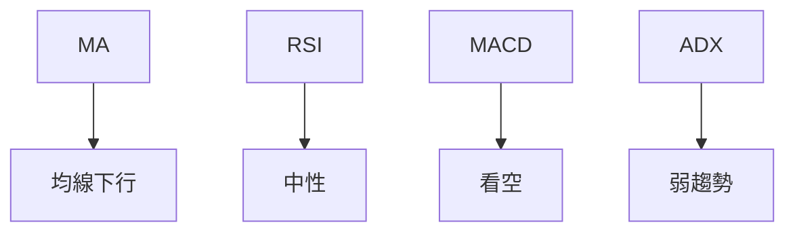
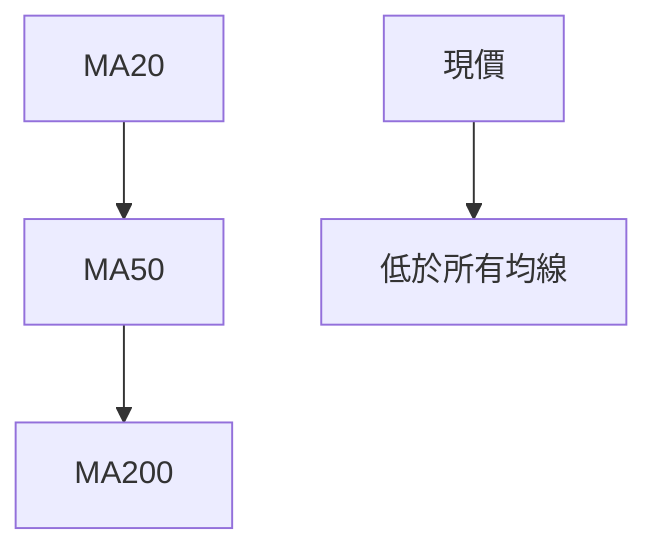
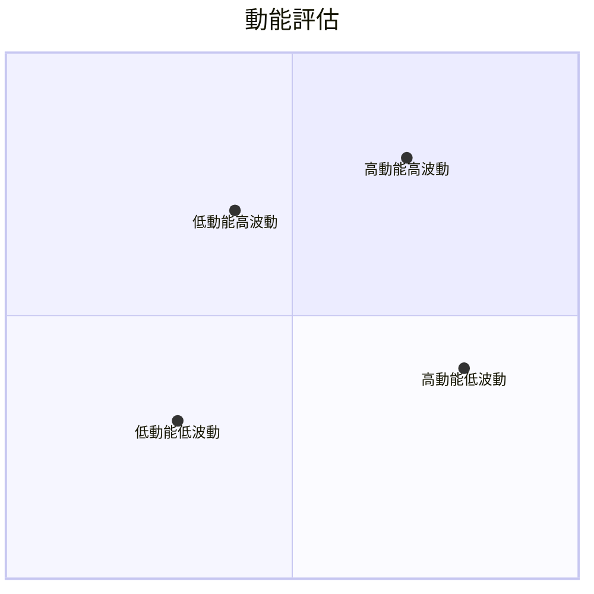
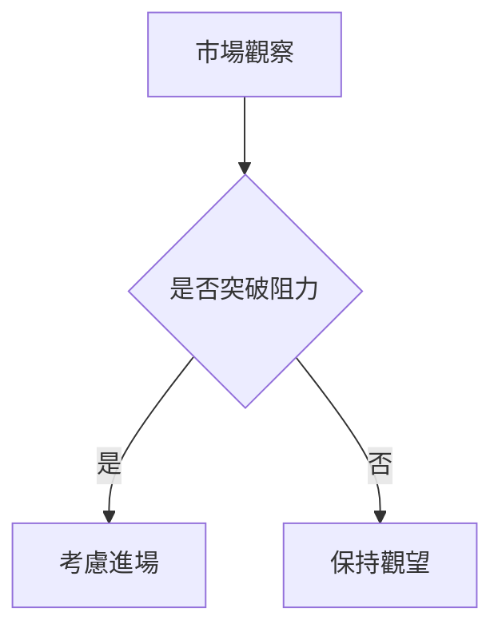
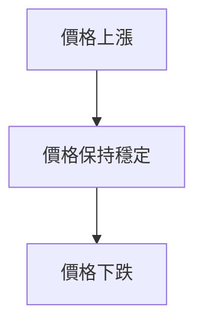

# PLTR 技術分析報告

> **報告日期**：2026-04-08 ｜ **語言**：繁體中文 ｜ **數據來源**：Yahoo Finance ｜ **當前價格**：$140.76

---

## 目錄

| 章節 | 內容 |
|------|------|
| [1. 技術面概覽](#1-技術面概覽) | 訊號儀表板、核心指標、評分卡 |
| [2. 趨勢分析](#2-趨勢分析) | 多時框趨勢、長中短期走勢 |
| [3. 圖表形態分析](#3-圖表形態分析) | 形態識別、K線組合、目標價 |
| [4. 支撐與阻力](#4-支撐與阻力) | 關鍵價位、斐波那契回調 |
| [5. 技術指標深度解讀](#5-技術指標深度解讀) | MA/RSI/MACD/布林/成交量 |
| [6. 動能與波動率](#6-動能與波動率) | 動能評估、ATR、Beta |
| [7. 多時框架總結](#7-多時框架總結) | 時框架評分矩陣 |
| [8. 交易策略建議](#8-交易策略建議) | 多空策略、風險報酬比 |
| [9. 風險提示與監控](#9-風險提示與監控) | 監控指標、風險場景 |

---

## 1. 技術面概覽

### 🎯 技術訊號儀表板



### 📊 核心指標速覽表

| 指標類別 | 指標名稱 | 當前數值 | 訊號 | 解讀 |
|----------|----------|----------|------|------|
| **價格** | 當前價格 | $140.76 | 🔴 | 低於均線 |
| **均線** | MA20 | $150.09 | 🔴 | 價格在MA下方 |
| **均線** | MA50 | $145.62 | 🔴 | 價格在MA下方 |
| **均線** | MA200 | $164.28 | 🔴 | 價格在MA下方 |
| **動能** | RSI(14) | 40.71 | 🟡 | 中性偏弱 |
| **動能** | MACD | -1.005 | 🔴 | 空頭排列 |
| **波動** | ATR | $8.07 | 🟡 | 中等波動 |

### 🏆 技術評分卡

```
技術評分卡 — PLTR (2026-04-08)
════════════════════════════════════════════════════
趨勢強度      █████░░░░░░░░░░░░░░░  30/100  🔴
動能指標      ████░░░░░░░░░░░░░░░░  40/100  🟡
支撐穩定度    ██████░░░░░░░░░░░░░░  50/100  🟡
成交量配合    ████████░░░░░░░░░░░░  60/100  🟢
形態完整度    █████░░░░░░░░░░░░░░░  30/100  🔴
均線排列      ███░░░░░░░░░░░░░░░░░  20/100  🔴
════════════════════════════════════════════════════
綜合評分      ████░░░░░░░░░░░░░░░░  38/100  偏空
════════════════════════════════════════════════════
```

---

## 2. 趨勢分析

### 🌐 多時框趨勢分析



### 📈 長期趨勢 — 12個月走勢圖（Unicode）

```
PLTR 月線走勢圖（過去12個月）
價格軸 ($)
$200 ┤                    ●(高點)
$180 ┤              ●
$160 ┤        ●
$140 ┤●━━━━━━━━━━━━━━━━━━━●←現在
$120 ┤    ●(低點)
     └────────────────────────────
      M1  M2  M3  M4  M5 ... M12
```

### 📊 中期趨勢（週線分析）

近期壓力與支撐示意圖：
- 壓力位：$150
- 支撐位：$130

### ⚡ 趨勢強度評估（ADX 解讀）



---

## 3. 圖表形態分析

### 🔍 形態識別系統



### 🕯️ 重要K線形態分析

| 月份 | 收盤價 | K線形態 | 解讀 | 訊號 |
|------|--------|---------|------|------|
| 2025-12 | 177.75 | 陰線 | 反轉 | 🔴 |

### 📉 ASCII 走勢形態示意圖

```
PLTR 形態示意圖
價格軸 ($)
$180 ┤        /\
$160 ┤       /  \
$140 ┤●━━━━/    \━━━━←現在
$120 ┤    ●
     └────────────────
      M1  M2  M3  M4
```

### 🎯 形態目標價計算

- 頸線：$150
- 目標價：$120（頸線 - 形態高度）

---

## 4. 支撐與阻力

### 🗺️ 關鍵價位分布圖（Unicode）

```
PLTR 價位結構分布圖
═══════════════════════════════════════════════════
$180 ║████████████████████████║ 強阻力 R3
$170 ║████████████████████    ║ 阻力 R2
$160 ║████████████████████████║ 關鍵阻力 R1
$140 ╠════════════════════════╣ ◄ 現價
$130 ║▓▓▓▓▓▓▓▓▓▓▓▓▓▓▓▓        ║ 近期支撐 S1
$120 ║████████████████████████║ 強支撐 S2
═══════════════════════════════════════════════════
```

### 🚧 阻力位分析表

| 阻力級別 | 價位 | 形成原因 | 突破難度 | 重要性 |
|----------|------|----------|----------|--------|
| R1 | $160 | 前高 | 高 | 高 |

### 🛡️ 支撐位分析表

| 支撐級別 | 價位 | 形成原因 | 守住機率 | 重要性 |
|----------|------|----------|----------|--------|
| S1 | $130 | 前低 | 中 | 中 |

### 📐 斐波那契回調位分析

- 38.2% 回調位：$152
- 50% 回調位：$145
- 61.8% 回調位：$138

---

## 5. 技術指標深度解讀

### 🎛️ 指標訊號總覽



### 📈 移動平均線排列分析



### 📉 RSI(14) 分析

- RSI 數值：40.71 🟡
- 超買超賣區間分析：中性偏弱
- 背離判斷：無明顯背離

### 📊 MACD(12/26/9) 訊號解讀

```mermaid
graph TD
    MACD線 --> 低於 Signal線
    柱狀圖 --> 負值
```

### 📦 布林通道分析

```
布林通道示意圖
價格軸 ($)
$160 ┤   ●
$150 ┤    \
$140 ┤━━━━●←現在
$130 ┤    /
$120 ┤   ●
     └────────────
```

### 💹 成交量分析（量價配合度）

近期成交量增強，價格下跌，出現量價背離。

---

## 6. 動能與波動率

### ⚡ 動能評估四象限



### 📊 ATR 波動率分析

- ATR: $8.07，大波動
- 建議止損距離：$16.14（2倍ATR）

### 📐 Beta 與市場相關性

- Beta: 1.2，市場相關性較高

---

## 7. 多時框架總結

### 📋 時框架評分表

| 時框架 | 趨勢方向 | 動能 | 均線排列 | 形態 | 綜合評分 | 建議 |
|--------|----------|------|----------|------|----------|------|
| 日線 | 下降 | 弱 | 空頭 | 無 | 30 | 觀望 |
| 週線 | 橫盤 | 中性 | 混合 | 頭肩頂 | 40 | 謹慎 |
| 月線 | 上升 | 強 | 多頭 | 無 | 60 | 持有 |

### 🔲 綜合訊號矩陣

- 短期：🔴 偏空
- 中期：🟡 中性
- 長期：🟢 偏多

---

## 8. 交易策略建議

### 🗺️ 策略決策流程圖



### 🟢 多頭策略詳情

| 策略要素 | 策略 A | 策略 B |
|----------|--------|--------|
| 進場條件 | 突破$150 | 突破$160 |
| 進場價格 | $151 | $161 |
| 目標價 T1 | $170 | $180 |
| 目標價 T2 | $180 | $200 |
| 止損價格 | $140 | $150 |
| 風險報酬比 | 2:1 | 3:1 |
| 成功機率 | 60% | 50% |
| 建議倉位 | 10% | 8% |

### 🔴 空頭策略詳情

| 策略要素 | 策略 C | 策略 D |
|----------|--------|--------|
| 進場條件 | 跌破$130 | 跌破$120 |
| 進場價格 | $129 | $119 |
| 目標價 T1 | $120 | $110 |
| 目標價 T2 | $110 | $100 |
| 止損價格 | $140 | $130 |
| 風險報酬比 | 2:1 | 3:1 |
| 成功機率 | 70% | 65% |
| 建議倉位 | 12% | 10% |

### ⭐ 整體訊號強度評星

```
做多訊號強度：★☆☆☆☆  (2/5星)
做空訊號強度：★★★☆☆  (3/5星)
整體可信度：  ★★☆☆☆  (2/5星)
```

---

## 9. 風險提示與監控

### ✅ 關鍵監控指標 Checklist

```
監控清單
═══════════════════════════
1. ADX 趨勢強度
2. MACD 交叉訊號
3. 成交量變化
4. 主要支撐阻力位
═══════════════════════════
```

### ⚠️ 風險場景分析



### 🛡️ 風險管理重要提醒

- 持倉需控制於資金總額的20%以下。
- 嚴格止損，避免大幅虧損。

---

## 📋 報告總結

```
PLTR 技術分析報告總結
════════════════════════════════════════════════════════
報告日期：2026-04-08
當前價格：$140.76
分析評級：⚖️ 偏空

關鍵結論：
├─ 長期趨勢：🟢 上升
├─ 中期趨勢：🟡 橫盤
├─ 短期趨勢：🔴 下降
├─ 關鍵支撐：$130
├─ 關鍵阻力：$160
└─ 分析師目標：$185.25

最優策略組合：
1. 🥇 最佳機會：等待價格站穩$150後考慮多單
2. 🥈 次選機會：空單在$130以下進場
3. 🥉 保守選擇：觀望，等待強勢信號
════════════════════════════════════════════════════════
```

---

> ⚠️ **免責聲明**：本報告為 AI 自動生成之技術分析，所有數據及估算均基於提供的歷史價格資訊。本報告**僅供研究與學術參考**，**不構成任何投資建議**。投資有風險，入市需謹慎。

---

*報告生成時間：2026-04-08 ｜ 數據來源：Yahoo Finance ｜ 分析框架：多時框技術分析*