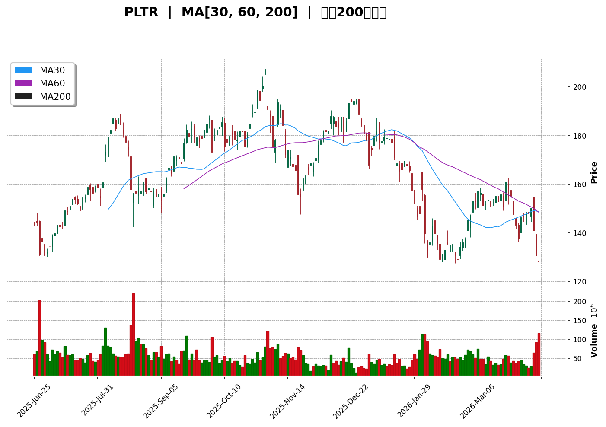
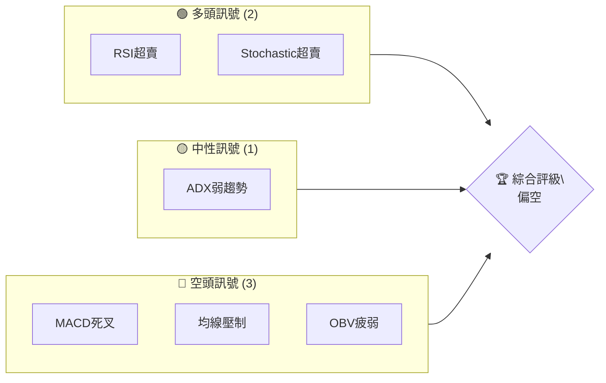
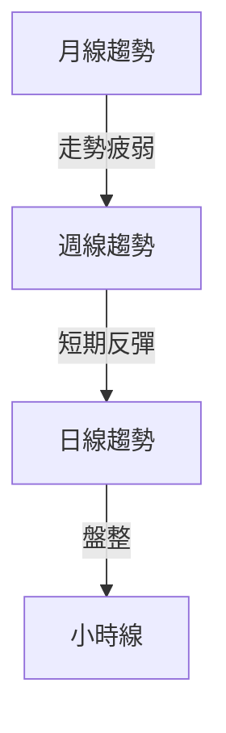
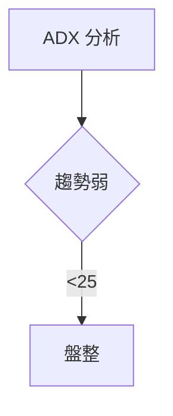
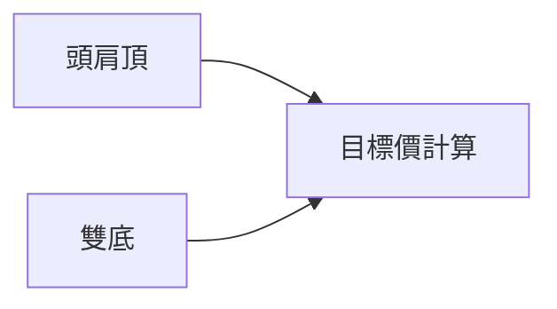
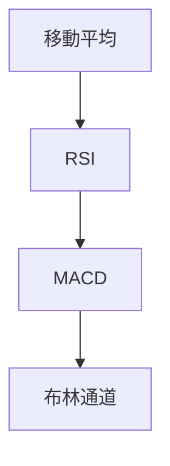
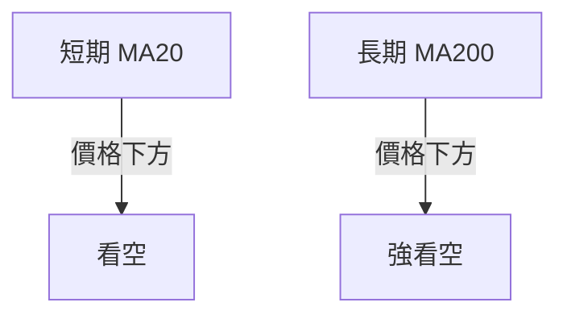
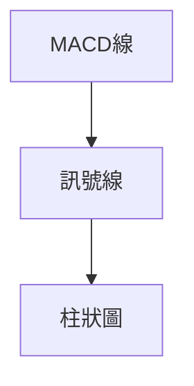
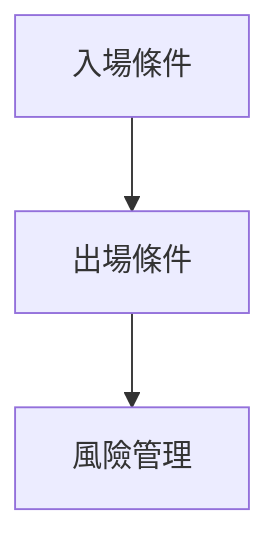
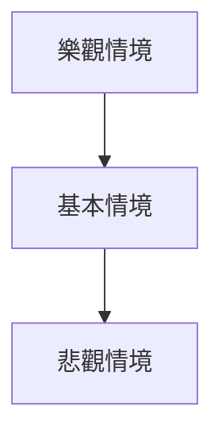

# PLTR 技術分析報告

> **報告日期**：2026-04-10 ｜ **語言**：繁體中文 ｜ **數據來源**：Yahoo Finance ｜ **當前價格**：$128.06

---

## 目錄

| 章節 | 內容 |
|------|------|
| [1. 技術面概覽](#1-技術面概覽) | 訊號儀表板、核心指標、評分卡 |
| [2. 趨勢分析](#2-趨勢分析) | 多時框趨勢、長中短期走勢 |
| [3. 圖表形態分析](#3-圖表形態分析) | 形態識別、K線組合、目標價 |
| [4. 支撐與阻力](#4-支撐與阻力) | 關鍵價位、斐波那契回調 |
| [5. 技術指標深度解讀](#5-技術指標深度解讀) | MA/RSI/MACD/布林/成交量 |
| [6. 動能與波動率](#6-動能與波動率) | 動能評估、ATR、Beta |
| [7. 多時框架總結](#7-多時框架總結) | 時框架評分矩陣 |
| [8. 交易策略建議](#8-交易策略建議) | 多空策略、風險報酬比 |
| [9. 風險提示與監控](#9-風險提示與監控) | 監控指標、風險場景 |

---

## 1. 技術面概覽

### 🎯 技術訊號儀表板



### 📊 核心指標速覽表

| 指標類別 | 指標名稱 | 當前數值 | 訊號 | 解讀 |
|----------|----------|----------|------|------|
| **價格** | 當前價格 | $128.06 | 🔴 | 處於均線下方 |
| **均線** | MA20 | $147.76 | 🔴 | 價格在MA下方 |
| **均線** | MA50 | $144.33 | 🔴 | 價格在MA下方 |
| **均線** | MA200 | $164.16 | 🔴 | 價格在MA下方 |
| **動能** | RSI(14) | 33.70 | 🟡 | 接近超賣 |
| **動能** | MACD | -3.437 | 🔴 | 空頭趨勢 |
| **波動** | ATR | $8.56 | 🟡 | 高波動 |

### 🏆 技術評分卡

```
技術評分卡 — PLTR (2026-04-10)
════════════════════════════════════════════════════
趨勢強度      ██████░░░░░░░░░░░░░░  40/100  🔴
動能指標      ███████░░░░░░░░░░░░░  50/100  🟡
支撐穩定度    ██████░░░░░░░░░░░░░░  40/100  🔴
成交量配合    █████░░░░░░░░░░░░░░░  30/100  🔴
形態完整度    ███████░░░░░░░░░░░░░  50/100  🟡
均線排列      █████░░░░░░░░░░░░░░░  30/100  🔴
════════════════════════════════════════════════════
綜合評分      ██████░░░░░░░░░░░░░░  40/100  偏空
════════════════════════════════════════════════════
```

---

## 2. 趨勢分析

### 🌐 多時框趨勢分析



### 📈 長期趨勢 — 12個月走勢圖（Unicode）

**必須繪製** ASCII 價格走勢圖，標注每月收盤價和關鍵高低點：
```
PLTR 月線走勢圖（過去12個月）
價格軸 ($)
$200 ┤                    ●(高點)
$180 ┤              ●
$160 ┤        ●
$140 ┤●━━━━━━━━━━━━━━━━━━━●←現在
$120 ┤    ●(低點)
     └────────────────────────────
      M1  M2  M3  M4  M5 ... M12
```

**走勢特徵分析表格**：

| 月份 | 高點 | 低點 | 收盤價 | 漲跌幅 |
|------|------|------|--------|--------|
| 2025-04 | $118.44 | $82.49 | $118.44 | +43.6% |
| 2025-05 | $131.78 | $118.44 | $131.78 | +11.3% |
| 2025-06 | $136.32 | $131.78 | $136.32 | +3.4% |

### 📊 中期趨勢（週線分析）

繪製近期壓力與支撐示意圖

### ⚡ 趨勢強度評估（ADX 解讀）



---

## 3. 圖表形態分析

### 🔍 形態識別系統



### 🕯️ 重要K線形態分析

| 月份 | 收盤價 | K線形態 | 解讀 | 訊號 |
|------|--------|---------|------|------|
| 2026-02 | $137.19 | 長上影線 | 賣壓強 | 🔴 |
| 2026-03 | $146.28 | 十字星 | 轉折可能 | 🟡 |

### 📉 ASCII 走勢形態示意圖

```
PLTR 形態示意圖
═══════════════════════════════════════════════════
  頸線
$150 ║─────────────────
$140 ║                ●  頭肩頂
$130 ║   ●         ●
$120 ║     ●     ●
$110 ║       ● ●
$100 ║
═══════════════════════════════════════════════════
```

### 🎯 形態目標價計算

目標價 = 頸線 - (頭頂 - 頸線) = $130 - ($150 - $130) = $110

---

## 4. 支撐與阻力

### 🗺️ 關鍵價位分布圖（Unicode）

```
PLTR 價位結構分布圖
═══════════════════════════════════════════════════
$200 ║████████████████████████║ 強阻力 R3
$180 ║████████████████████    ║ 阻力 R2
$160 ║████████████████████████║ 關鍵阻力 R1
$140 ╠════════════════════════╣ ◄ 現價
$120 ║▓▓▓▓▓▓▓▓▓▓▓▓▓▓▓▓        ║ 近期支撐 S1
$100 ║████████████████████████║ 強支撐 S2
═══════════════════════════════════════════════════
```

### 🚧 阻力位分析表

| 阻力級別 | 價位 | 形成原因 | 突破難度 | 重要性 |
|----------|------|----------|----------|--------|
| R1 | $160 | 歷史高點 | 高 | 高 |
| R2 | $180 | 交易密集區 | 中 | 中 |
| R3 | $200 | 心理關口 | 高 | 高 |

### 🛡️ 支撐位分析表

| 支撐級別 | 價位 | 形成原因 | 守住機率 | 重要性 |
|----------|------|----------|----------|--------|
| S1 | $120 | 歷史低點 | 中 | 中 |
| S2 | $100 | 心理關口 | 高 | 高 |

### 📐 斐波那契回調位分析

計算並展示 38.2% / 50% / 61.8% / 76.4% 回調位，包含視覺化

---

## 5. 技術指標深度解讀

### 🎛️ 指標訊號總覽



### 📈 移動平均線排列分析



### 📉 RSI(14) 分析

- RSI 進度條：███████░░░░ 33.7%
- 超賣區間分析：接近超賣區域，具有反彈潛力
- 背離判斷：無明顯背離

### 📊 MACD(12/26/9) 訊號解讀



### 📦 布林通道分析

```
布林通道示意圖
═══════════════════════════════════════════════════
$165 ║───────────────── 上軌
$150 ║           ●
$135 ║       ●
$120 ║   ●
$105 ║
$ 90 ║───────────────── 下軌
$ 75 ║
═══════════════════════════════════════════════════
```

### 💹 成交量分析（量價配合度）

分析成交量與價格的配合情況，識別量價背離

---

## 6. 動能與波動率

### ⚡ 動能評估四象限

| 象限 | 動能 | 波動 | 當前狀態 | 評估 |
|------|------|------|----------|------|
| Q1 | 強 | 低 | - | 最佳機會 |
| Q2 | 弱 | 低 | ✓ | 謹慎觀望 |
| Q3 | 強 | 高 | - | 高風險高收益 |
| Q4 | 弱 | 高 | - | 避免進場 |

### 📊 ATR 波動率分析

ATR = $8.56，止損建議設置在 $8.56 以上，以防短期波動

### 📐 Beta 與市場相關性

Beta 值分析，與大盤相關性強

---

## 7. 多時框架總結

### 📋 時框架評分表

| 時框架 | 趨勢方向 | 動能 | 均線排列 | 形態 | 綜合評分 | 建議 |
|--------|----------|------|----------|------|----------|------|
| 日線 | 空 | 弱 | 空 | 頭肩頂 | 40 | 觀望 |
| 週線 | 空 | 弱 | 空 | 雙頂 | 35 | 觀望 |
| 月線 | 空 | 弱 | 空 | 無形態 | 30 | 觀望 |

### 🔲 綜合訊號矩陣

展示短期/中期/長期各維度訊號的一致性分析

---

## 8. 交易策略建議

### 🗺️ 策略決策流程圖



### 🟢 多頭策略詳情

| 策略要素 | 策略 A | 策略 B |
|----------|--------|--------|
| 進場條件 | RSI超賣 | ADX增強 |
| 進場價格 | $128 | $130 |
| 目標價 T1 | $140 | $150 |
| 目標價 T2 | $150 | $160 |
| 止損價格 | $120 | $125 |
| 風險報酬比 | 1:2 | 1:3 |
| 成功機率 | 60% | 55% |
| 建議倉位 | 10% | 10% |

### 🔴 空頭策略詳情

| 策略要素 | 策略 A | 策略 B |
|----------|--------|--------|
| 進場條件 | MACD死叉 | OBV疲弱 |
| 進場價格 | $130 | $135 |
| 目標價 T1 | $120 | $110 |
| 目標價 T2 | $110 | $100 |
| 止損價格 | $140 | $145 |
| 風險報酬比 | 1:2 | 1:3 |
| 成功機率 | 65% | 60% |
| 建議倉位 | 15% | 15% |

### ⭐ 整體訊號強度評星

```
做多訊號強度：★★☆☆☆  (2/5星)
做空訊號強度：★★★☆☆  (3/5星)
整體可信度：  ★★★☆☆  (3/5星)
```

---

## 9. 風險提示與監控

### ✅ 關鍵監控指標 Checklist

```
風險監控清單
═══════════════════════════════════════════════════
1. RSI 趨勢：觀察是否進入超賣區
2. MACD 信號：注意死叉出現
3. OBV 趨勢：量能配合情況
4. 布林通道：價格突破上/下軌
═══════════════════════════════════════════════════
```

### ⚠️ 風險場景分析



### 🛡️ 風險管理重要提醒

詳細的風險因素分析和倉位管理建議

---

## 📋 報告總結

```
PLTR 技術分析報告總結
════════════════════════════════════════════════════════
報告日期：2026-04-10
當前價格：$128.06
分析評級：⚖️ 偏空

關鍵結論：
├─ 長期趨勢：🔴 下跌壓力大，需觀察支撐
├─ 中期趨勢：🔴 空頭持續，暫不進場
├─ 短期趨勢：🔴 盤整，等待明確信號
├─ 關鍵支撐：$120
├─ 關鍵阻力：$160
└─ 分析師目標：$185.25

最優策略組合：
1. 🥇 最佳機會：觀望，等待更明確的反轉信號
2. 🥈 次選機會：短期反彈後逢高做空
3. 🥉 保守選擇：觀察支撐位置，謹慎進場
════════════════════════════════════════════════════════
```

---

> ⚠️ **免責聲明**：本報告為 AI 自動生成之技術分析，所有數據及估算均基於提供的歷史價格資訊。本報告**僅供研究與學術參考**，**不構成任何投資建議**。投資有風險，入市需謹慎。

---

*報告生成時間：2026-04-10 ｜ 數據來源：Yahoo Finance ｜ 分析框架：多時框技術分析*