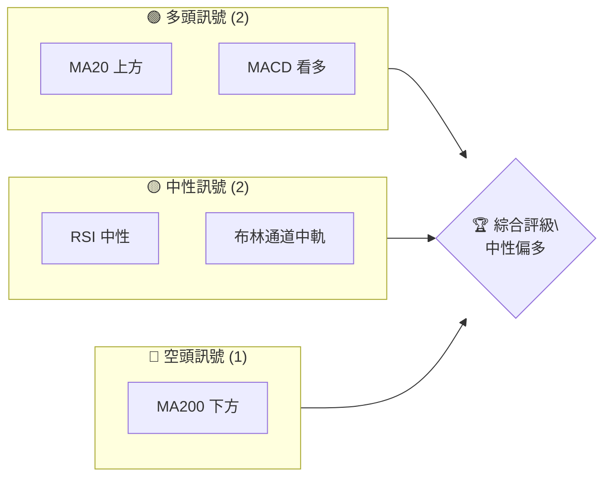
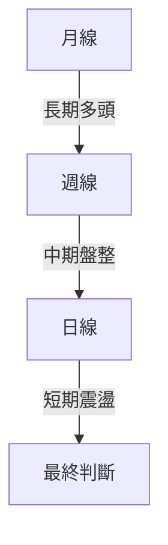
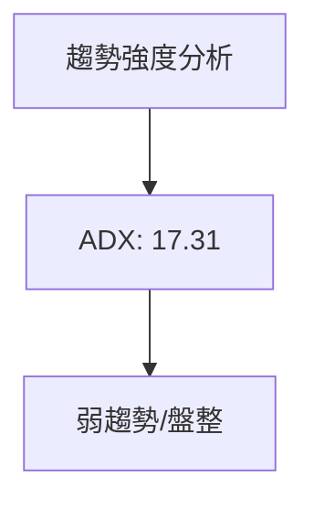
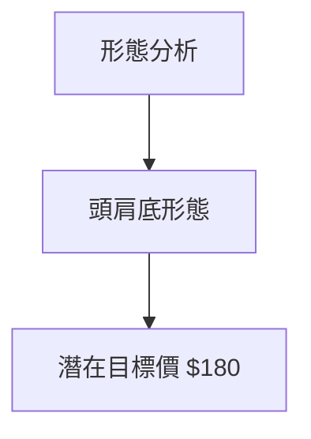
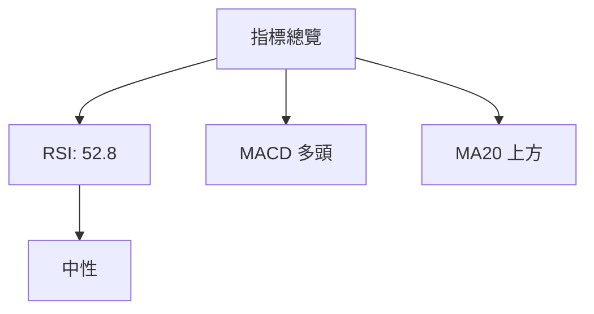
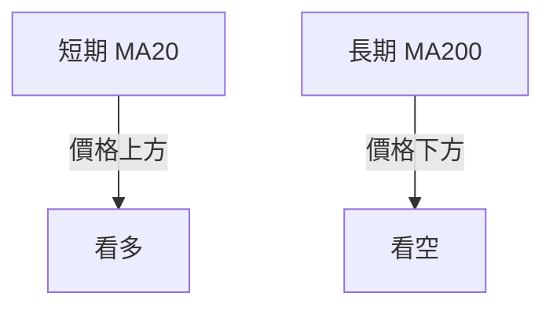
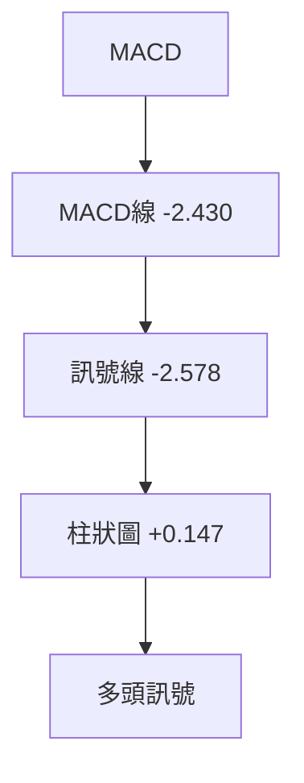
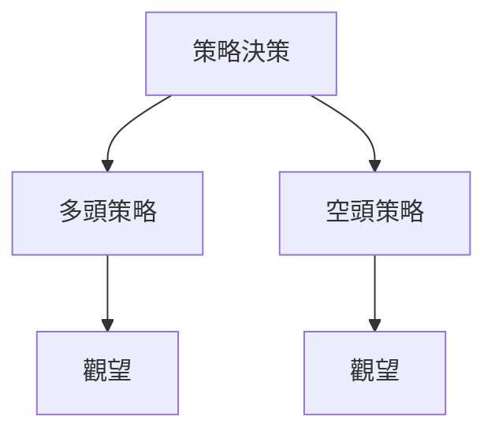
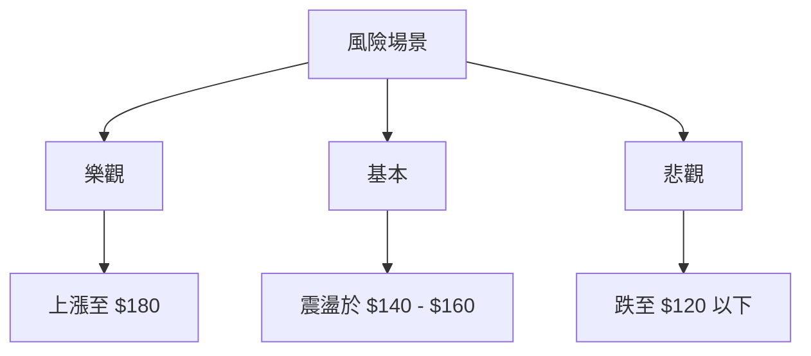

<details>
<summary>📊 靜態圖表 (點擊展開)</summary>

</details>

<html>
<head><meta charset="utf-8" /></head>
<body>
    <div>                        <script>window.PlotlyConfig = {MathJaxConfig: 'local'};</script>
        <script charset="utf-8" src="https://cdn.plot.ly/plotly-3.5.0.min.js" integrity="sha256-fHbNLP+GlIXN+efbQec78UkemUz3NJp7UmfGxC1tNxs=" crossorigin="anonymous"></script>                <div id="candlestick-chart" class="plotly-graph-div" style="height:500px; width:100%;"></div>            <script>                window.PLOTLYENV=window.PLOTLYENV || {};                                if (document.getElementById("candlestick-chart")) {                    Plotly.newPlot(                        "candlestick-chart",                        [{"close":{"dtype":"f8","bdata":"AAAAANeDYEAAAAAghctgQAAAAADXY2FAAAAAYLh2YUAAAAAAKeRhQAAAAAAA0GFAAAAAQDPDYUAAAADAzKRiQAAAAGCPkmJAAAAAwB7dYkAAAAAgrj9jQAAAAOCjMGNAAAAAoEf5YkAAAACAPaJiQAAAAAApVGNAAAAAIIVbY0AAAACgmdljQAAAAAApvGNAAAAAIK6HY0AAAAAghdNjQAAAAEAzy2NAAAAA4KNIY0AAAADAHhVkQAAAAOCjqGVAAAAAoEdxZkAAAABgZsZmQAAAAGC4XmdAAAAAgMLVZkAAAABACl9nQAAAAADXC2dAAAAA4KOgZkAAAACgcCVmQAAAAMD1wGVAAAAAAAC4Y0AAAADgUYBjQAAAAIDChWNAAAAAIK7XY0AAAACgcKVjQAAAAADXG2RAAAAAQAqXY0AAAAAA18NjQAAAAGC4lmNAAAAAQOGiY0AAAADAzFxjQAAAAOB6hGNAAAAAIIUjY0AAAABAM4NjQAAAACCFS2RAAAAAIK7XZEAAAAAghYtkQAAAAIDCbWVAAAAAYLhmZUAAAADgUUhlQAAAAGCPCmVAAAAAQAofZkAAAADgesxmQAAAAGCPamZAAAAAoJnRZkAAAACA63FmQAAAAADXY2ZAAAAAgD0yZkAAAAAghVtmQAAAAKBwzWZAAAAAYGYeZ0AAAACgmWFnQAAAAIA9omVAAAAAwPVwZkAAAACgcMVmQAAAAIDr8WZAAAAAQAovZ0AAAACAFO5lQAAAAGC4JmZAAAAAIK53ZkAAAAAA13NmQAAAAADXQ2ZAAAAAwMxEZkAAAABA4bJmQAAAAOBRsGZAAAAAIK7vZUAAAAAgXI9mQAAAAAApFGdAAAAAgMKlZ0AAAABAM7NnQAAAAIDr2WhAAAAAoJlRaEAAAABACg9pQAAAAIDC5WlAAAAAIK7XZ0AAAADAzHxnQAAAAKCZ4WVAAAAAgMI9ZkAAAAAghTNoQAAAAGC43mdAAAAAoHAFZ0AAAADgeoRlQAAAAOBRwGVAAAAAAABoZUAAAABgj+pkQAAAAKBwrWRAAAAAANd3Y0AAAABAM1tjQAAAAAAASGRAAAAAoJlxZEAAAADgo7hkQAAAAGBmDmVAAAAAIK7vZEAAAACAFFZlQAAAAGCPAmZAAAAAoHA9ZkAAAADgUbhmQAAAACCur2ZAAAAAQOG6ZkAAAADAHn1nQAAAAKBHcWdAAAAAgD3yZkAAAAAAAOhmQAAAAAAAeGdAAAAAoEcpZkAAAACAFDZnQAAAAAApLGhAAAAAIFw\u002faEAAAAAAKURoQAAAAKBwRWhAAAAAYLiWZ0AAAACAwgVnQAAAAEDhmmZAAAAAAAA4ZkAAAAAghftkQAAAAKBHwWVAAAAAYLh2ZkAAAACAwrVmQAAAACCFG2ZAAAAAIK4vZkAAAADAHm1mQAAAAGC4XmZAAAAAwMxMZkAAAACAPSJmQAAAAGC4XmVAAAAAwPUQZUAAAABgj6pkQAAAAMDMvGRAAAAAQDMzZUAAAABACu9kQAAAAGBmtmRAAAAAQDOrY0AAAAAghftiQAAAAEDhUmJAAAAA4FF4YkAAAAAAKbxjQAAAAKBHcWFAAAAA4FFAYEAAAADAzPxgQAAAAMAe3WFAAAAA4FFwYUAAAACAwvVgQAAAAAApJGBAAAAAwB5tYEAAAADgo6BgQAAAAAAp7GBAAAAA4HrcYEAAAAAgrudgQAAAAEAzU2BAAAAAQOEaYEAAAACAFMZgQAAAAIAU\u002fmBAAAAAgBQmYUAAAACgcCViQAAAAEAKZ2JAAAAAgBQmY0AAAACgcBVjQAAAAMAepWNAAAAAgMKNY0AAAADgeuRiQAAAAEAz82JAAAAAAAAwY0AAAABgZt5iQAAAAEAKF2NAAAAAYI9iY0AAAADgoxhjQAAAAIDCdWNAAAAAgMLVYkAAAABA4RpkQAAAAMD1WGNAAAAAYLheY0AAAACA63FiQAAAAIDr4WFAAAAAoJkxYUAAAADA9UhiQAAAACCuT2JAAAAAYLiOYkAAAACAwn1iQAAAAIA9wmJAAAAA4FGYYUAAAAAgrk9gQAAAAIDrAWBAAAAAANeLYEAAAABgZvZgQAAAAMDMxGFAAAAA4FHYYUAAAADgekxiQA=="},"high":{"dtype":"f8","bdata":"AAAAQDOzYEAAAAAA1\u002fNgQAAAAKBHaWFAAAAAIFx7YUAAAACgcOVhQAAAAMAeJWJAAAAAYI8SYkAAAABgZrJiQAAAAADX02JAAAAA4FHwYkAAAACAwnVjQAAAAKBwXWNAAAAAgBRuY0AAAACgR\u002fliQAAAAAAAYGNAAAAAACl0Y0AAAADgegxkQAAAAMD1CGRAAAAA4HoEZEAAAAAAKexjQAAAAOB6HGRAAAAAgBTGY0AAAADAzCxkQAAAAGCPCmZAAAAAgJeSZkAAAAAgXA9nQAAAACCuf2dAAAAAgMJlZ0AAAAAAAMBnQAAAAGC4rmdAAAAAYI8qZ0AAAAAAAIBmQAAAAMDMPGZAAAAAoJmJZUAAAABguI5jQAAAAEAKv2NAAAAAYGZmZEAAAABA4dJjQAAAAAApRGRAAAAAwMxMZEAAAAAgXMdjQAAAAKBwzWNAAAAA4HrMY0AAAADAzCRkQAAAAKBHoWNAAAAAQArfY0AAAACgmcljQAAAAAAAWGRAAAAAAAAgZUAAAADgp+5kQAAAAMD1cGVAAAAAoJl5ZUAAAACA62llQAAAAIDCNWVAAAAAoJlZZkAAAACgcA1nQAAAAAAAyGZAAAAAAAA4Z0AAAABAMxtnQAAAAIA9CmdAAAAAANeDZkAAAAAgXK9mQAAAAOCj2GZAAAAAwPVIZ0AAAABgZoZnQAAAAEDhWmdAAAAAYGbeZkAAAACAwkVnQAAAAOBRCGdAAAAAANdzZ0AAAABAM2NnQAAAAEAKZ2ZAAAAAQOHKZkAAAABAMwtnQAAAAIA9GmdAAAAAQOGyZkAAAABA4eJmQAAAAMByzGZAAAAAYLjGZkAAAACA67FmQAAAAKBwRWdAAAAAYI8aaEAAAADA9fhnQAAAAEAz+2hAAAAAoHD1aEAAAACAwoVpQAAAAOCj8GlAAAAAYGZ2aEAAAACAPcpnQAAAAEDh4mdAAAAAYGZWZkAAAACAwl1oQAAAAKCZHWhAAAAAYI\u002fSZ0AAAABgZtZmQAAAAKBHKWZAAAAAIK7HZUAAAABgj5plQAAAAEAzM2VAAAAAgD3SZUAAAAAghcNjQAAAAKBwpWRAAAAAwMyUZEAAAAAg2QplQAAAAKCZGWVAAAAAQDMjZUAAAAAAAPhlQAAAAMAePWZAAAAAgBROZkAAAABg5cRmQAAAAAAp\u002fGZAAAAAQDPbZkAAAADgesxnQAAAAKCZgWdAAAAAwMxQZ0AAAADA9XhnQAAAAAAAkGdAAAAAAAB4Z0AAAABgj2pnQAAAAAAAYGhAAAAAACncaEAAAAAA12toQAAAAKBwZWhAAAAAQDOLaEAAAABgZmZnQAAAAABUF2dAAAAAwPWwZkAAAABAM6tmQAAAAIA9+mVAAAAAgBSGZkAAAADA9WhnQAAAAMAeNWdAAAAAQApXZkAAAAAAANBmQAAAAEAzo2ZAAAAA4CKzZkAAAABAM5NmQAAAAIDCzWZAAAAAQAp\u002fZUAAAAAgri9lQAAAAAAAIGVAAAAAAACAZUAAAABA4VJlQAAAAIAULmVAAAAAoHChZEAAAAAAKbRjQAAAAAAA4GJAAAAAwMzsYkAAAAAAf6JkQAAAAEAze2NAAAAAIFw\u002fYUAAAADg+zVhQAAAAADXO2JAAAAAgOsxYkAAAAAAAGhhQAAAAOB6\u002fGBAAAAAgOuxYEAAAACAPcpgQAAAAODQnmFAAAAAwB4FYUAAAABguAZhQAAAAKBHgWBAAAAAIK5HYEAAAABA4QJhQAAAAOBRMGFAAAAAQDNDYUAAAADgemRiQAAAAAAAcGJAAAAA4KNQY0AAAAAAKYxjQAAAAGBmLmRAAAAAgBTOY0AAAAAgBpVjQAAAAIBoJWNAAAAAACl8Y0AAAACA61FjQAAAACCFO2NAAAAAAACYY0AAAACAFJZjQAAAAMDMhGNAAAAAwMyUY0AAAABgjyJkQAAAAMDMTGRAAAAA4KMIZEAAAAAA1yNjQAAAAGC4PmJAAAAAANcDYkAAAAAghXtiQAAAAKCZiWJAAAAA4FGQYkAAAAAghdNiQAAAAOCjyGJAAAAAwPWIY0AAAACgR3FhQAAAAGBmJmBAAAAAoHDNYEAAAACAPUJhQAAAAGCP0mFAAAAAoJkxYkAAAADA9YhiQA=="},"hovertemplate":"\u003cb\u003e%{x|%Y-%m-%d}\u003c\u002fb\u003e\u003cbr\u003e\u958b: $%{open:.2f}\u003cbr\u003e\u9ad8: $%{high:.2f}\u003cbr\u003e\u4f4e: $%{low:.2f}\u003cbr\u003e\u6536: $%{close:.2f}\u003cextra\u003e\u003c\u002fextra\u003e","low":{"dtype":"f8","bdata":"AAAAgBRGYEAAAADgUZBgQAAAAIA9imBAAAAAoEf5YEAAAADgeixhQAAAAMD1cGFAAAAAQAqvYUAAAABACsdhQAAAACCFa2JAAAAAYJF1YkAAAACAPdpiQAAAAMDM\u002fGJAAAAAIIXrYkAAAADg+yFiQAAAACAviWJAAAAAYGYSY0AAAABgj3JjQAAAAKBHIWNAAAAAwB5dY0AAAACA65FjQAAAACBcl2NAAAAAINvhYkAAAACAwr1jQAAAAEAKJ2VAAAAA4FFgZUAAAACgcEVmQAAAAMAeDWdAAAAAoHC9ZkAAAABAM8NmQAAAAEDh8mZAAAAAYGZmZkAAAAAAKaxlQAAAAOB6bGVAAAAAwMycY0AAAABA4cphQAAAAIDrOWNAAAAA4KP4YkAAAAAA16tiQAAAAIA9UmNAAAAAIFx\u002fY0AAAACgmRFjQAAAAAAAIGNAAAAAwPXIYkAAAABguBZjQAAAAMAeJWNAAAAAoEeBYkAAAABA4VpjQAAAAADXi2NAAAAAgBRuZEAAAABACmdkQAAAAOBRgGRAAAAAwB7tZEAAAABguB5lQAAAAOCjKGRAAAAA4HosZUAAAABguBZmQAAAAKBHSWZAAAAA4FEgZkAAAAAA1yNmQAAAAKBHyWVAAAAAwB7dZUAAAADAHiVmQAAAAEAKR2ZAAAAAAABwZkAAAABgZt5mQAAAAOCjWGVAAAAAYI86ZkAAAACgcG1mQAAAAGBmpmZAAAAAYGZ+ZkAAAADA9bBlQAAAAGBmrmVAAAAAgD1aZUAAAADgowBmQAAAAGBmDmZAAAAAYGa+ZUAAAACAFC5mQAAAAMDMVGZAAAAAoHAtZUAAAADgUeBlQAAAAEAz22ZAAAAA4KNwZ0AAAADA9VhnQAAAACCuz2dAAAAAANdDaEAAAACgcL1oQAAAAIA9OmlAAAAAgOsxZ0AAAABguKZmQAAAAMD10GVAAAAAwB4dZUAAAADgo\u002fBmQAAAAAApZGdAAAAAwMyMZkAAAABgZFdlQAAAAAAAkGRAAAAAgML1ZEAAAAAAALBkQAAAAKBwTWRAAAAA4KNMY0AAAACA63FiQAAAAAAAoGNAAAAAgMKRY0AAAAAAKXxkQAAAAAAAvGRAAAAAANdjZEAAAABA4TJlQAAAAGCPGmVAAAAAgMLNZUAAAADAHiVmQAAAAKBHcWZAAAAAACmMZkAAAAAAANhmQAAAAGC4hmZAAAAAIFg1ZkAAAADA9YBmQAAAAECLpGZAAAAAAAAQZkAAAADgUbBmQAAAACBcV2dAAAAAgMINaEAAAAAghfdnQAAAAGCPGmhAAAAAANeTZ0AAAADgevRmQAAAAGBmlmZAAAAAAAAoZkAAAABAM8tkQAAAAKBHeWVAAAAA4KPYZUAAAADAHjVmQAAAAADXy2VAAAAAAADYZUAAAABA4QpmQAAAAOB6BGZAAAAAYGa+ZUAAAADA9RBmQAAAAOBRQGVAAAAAIK7HZEAAAAAghSNkQAAAAGBmnmRAAAAAoJnJZEAAAABgZupkQAAAAIAUlmRAAAAAIK6nY0AAAAAA12NiQAAAAMByJGJAAAAAoO1UYkAAAAAA1yNjQAAAAIDC9WBAAAAAgD0KYEAAAABAM4tgQAAAAADV2GBAAAAA4KM4YUAAAABgZp5gQAAAAADXo19AAAAAgOmOX0AAAABgj9JfQAAAAADX22BAAAAA4FFgYEAAAACgcGVgQAAAAMD12F9AAAAAIK6XX0AAAACAwiVgQAAAAAAplGBAAAAAIFy\u002fYEAAAADgo5BhQAAAAGBmRmFAAAAAgOuBYkAAAAAghbNiQAAAAKBHyWJAAAAAQAofY0AAAADgesRiQAAAAGCPqmJAAAAAIFzfYkAAAABgj5JiQAAAAKBw5WJAAAAAANcDY0AAAAAghRNjQAAAAAAA0GJAAAAAQOGiYkAAAAAgridjQAAAAOB69GJAAAAAIFxbY0AAAAAAAGhiQAAAAIDrsWFAAAAAoJkJYUAAAABACl9hQAAAAEAKD2JAAAAAIK4\u002fYUAAAAAgMVRiQAAAAGBmDmJAAAAAoHBlYUAAAABACg9gQAAAACCFq15AAAAAwMwkYEAAAAAAAMBgQAAAAIDC3WBAAAAAwPVwYUAAAACgmelhQA=="},"name":"\u50f9\u683c","open":{"dtype":"f8","bdata":"AAAAQApvYEAAAAAghctgQAAAAAApzGBAAAAAwMxYYUAAAADA9XRhQAAAAIDr6WFAAAAAIIXDYUAAAABACtdhQAAAAIDCnWJAAAAAoJmpYkAAAACA6\u002fFiQAAAACCFW2NAAAAAACk8Y0AAAABAM9tiQAAAACCut2JAAAAAIFw\u002fY0AAAAAAKXRjQAAAAAAp\u002fGNAAAAAQOHWY0AAAAAgrqtjQAAAACCu\u002f2NAAAAAoJlhY0AAAADA9dBjQAAAAIDreWVAAAAAoJllZUAAAADgUaBmQAAAACCFF2dAAAAAQApPZ0AAAABgZhZnQAAAAAAAoGdAAAAAwB7NZkAAAABAM3dmQAAAAOCj6GVAAAAAIIVrZUAAAACgmQljQAAAAKBwpWNAAAAAgBRqY0AAAABAM4NjQAAAAOB6bGNAAAAAgD1KZEAAAAAAKbRjQAAAACBcn2NAAAAAYGbmYkAAAAAAAMBjQAAAACCuW2NAAAAAgD26Y0AAAADAHl1jQAAAAAAAqGNAAAAAAADAZEAAAAAgrudkQAAAAEAzq2RAAAAAQDMzZUAAAACgR2FlQAAAAOCjIGVAAAAA4KNIZUAAAACAPSJmQAAAAAApnGZAAAAA4FHQZkAAAADAHv1mQAAAAKCZ+WVAAAAAoJlhZkAAAADgenRmQAAAACBcX2ZAAAAAgD2qZkAAAABgZlZnQAAAAMDMTGdAAAAAgMJlZkAAAACA64lmQAAAAKCZ2WZAAAAAYI\u002fyZkAAAACgcCVnQAAAAIDCVWZAAAAAAAAAZkAAAADA9bRmQAAAAMD1uGZAAAAAAAA4ZkAAAAAgrm9mQAAAAIDrwWZAAAAAgMK9ZkAAAACAPe5lQAAAAAAp3GZAAAAAQAqfZ0AAAAAgXK9nQAAAAGCP4mdAAAAAoJnNaEAAAABgZuZoQAAAAKBwoWlAAAAAgD0CaEAAAAAAAKBnQAAAACCuf2dAAAAAwMykZUAAAACA6wlnQAAAAGC4ymdAAAAAYI\u002fSZ0AAAABA4bZmQAAAAEAz32RAAAAAwPVQZUAAAAAA1wtlQAAAAKCZ+WRAAAAAgD2CZUAAAADgUYBjQAAAAEAKr2NAAAAAgD0CZEAAAABAM9tkQAAAAOBR+GRAAAAAAACgZEAAAABA4TJlQAAAAOB6RGVAAAAAIK4LZkAAAAAgXEdmQAAAAGC4xmZAAAAAQAqfZkAAAABgZh5nQAAAAKCZGWdAAAAAgOs5Z0AAAABgjyJnQAAAAMD1tGZAAAAAQOF2Z0AAAADgUbBmQAAAACCuV2dAAAAAoEdhaEAAAABgZhpoQAAAAMAeJWhAAAAA4HpgaEAAAABAM1tnQAAAAEAzC2dAAAAAACmkZkAAAACgmalmQAAAAAAp3GVAAAAA4FH4ZUAAAACgmXlmQAAAACCuM2dAAAAA4KMgZkAAAACA6zVmQAAAAAAAXGZAAAAAAABEZkAAAABguFZmQAAAACCFa2ZAAAAAAAD0ZEAAAAAg3QxlQAAAAKCZHWVAAAAA4KPoZEAAAABguAZlQAAAACBc72RAAAAAwMyMZEAAAAAAKbRjQAAAAKCZwWJAAAAAgBTeYkAAAACgmaFkQAAAAMAebWNAAAAAgD0aYUAAAABgj+pgQAAAAGCPEmFAAAAAQOEeYkAAAADAzGBhQAAAACCF62BAAAAAoJn5X0AAAADgoxxgQAAAAOB6\u002fGBAAAAAgOuJYEAAAAAgrotgQAAAAKBHgWBAAAAAACkgYEAAAAAghVNgQAAAAEAKu2BAAAAAgD3CYEAAAADAzJhhQAAAAEAzw2FAAAAAgMKNYkAAAACAFB5jQAAAAIAUzmJAAAAAgBR2Y0AAAAAgrn9jQAAAAAAp7GJAAAAA4FEgY0AAAACgmSljQAAAAGBmDmNAAAAAwPUMY0AAAACAPV5jQAAAAEAzI2NAAAAAYGZmY0AAAAAgridjQAAAAIA9AmRAAAAAoHCtY0AAAACAwiFjQAAAAAApPGJAAAAA4KPoYUAAAADgo4BhQAAAAAAAYGJAAAAAIIXvYUAAAAAghYtiQAAAAGA5XGJAAAAA4HpYY0AAAADgo2xhQAAAACBcD2BAAAAAIFxHYEAAAAAAqs1gQAAAAKBHGWFAAAAAoEcJYkAAAACAFCpiQA=="},"x":["2025-07-02T00:00:00-04:00","2025-07-03T00:00:00-04:00","2025-07-07T00:00:00-04:00","2025-07-08T00:00:00-04:00","2025-07-09T00:00:00-04:00","2025-07-10T00:00:00-04:00","2025-07-11T00:00:00-04:00","2025-07-14T00:00:00-04:00","2025-07-15T00:00:00-04:00","2025-07-16T00:00:00-04:00","2025-07-17T00:00:00-04:00","2025-07-18T00:00:00-04:00","2025-07-21T00:00:00-04:00","2025-07-22T00:00:00-04:00","2025-07-23T00:00:00-04:00","2025-07-24T00:00:00-04:00","2025-07-25T00:00:00-04:00","2025-07-28T00:00:00-04:00","2025-07-29T00:00:00-04:00","2025-07-30T00:00:00-04:00","2025-07-31T00:00:00-04:00","2025-08-01T00:00:00-04:00","2025-08-04T00:00:00-04:00","2025-08-05T00:00:00-04:00","2025-08-06T00:00:00-04:00","2025-08-07T00:00:00-04:00","2025-08-08T00:00:00-04:00","2025-08-11T00:00:00-04:00","2025-08-12T00:00:00-04:00","2025-08-13T00:00:00-04:00","2025-08-14T00:00:00-04:00","2025-08-15T00:00:00-04:00","2025-08-18T00:00:00-04:00","2025-08-19T00:00:00-04:00","2025-08-20T00:00:00-04:00","2025-08-21T00:00:00-04:00","2025-08-22T00:00:00-04:00","2025-08-25T00:00:00-04:00","2025-08-26T00:00:00-04:00","2025-08-27T00:00:00-04:00","2025-08-28T00:00:00-04:00","2025-08-29T00:00:00-04:00","2025-09-02T00:00:00-04:00","2025-09-03T00:00:00-04:00","2025-09-04T00:00:00-04:00","2025-09-05T00:00:00-04:00","2025-09-08T00:00:00-04:00","2025-09-09T00:00:00-04:00","2025-09-10T00:00:00-04:00","2025-09-11T00:00:00-04:00","2025-09-12T00:00:00-04:00","2025-09-15T00:00:00-04:00","2025-09-16T00:00:00-04:00","2025-09-17T00:00:00-04:00","2025-09-18T00:00:00-04:00","2025-09-19T00:00:00-04:00","2025-09-22T00:00:00-04:00","2025-09-23T00:00:00-04:00","2025-09-24T00:00:00-04:00","2025-09-25T00:00:00-04:00","2025-09-26T00:00:00-04:00","2025-09-29T00:00:00-04:00","2025-09-30T00:00:00-04:00","2025-10-01T00:00:00-04:00","2025-10-02T00:00:00-04:00","2025-10-03T00:00:00-04:00","2025-10-06T00:00:00-04:00","2025-10-07T00:00:00-04:00","2025-10-08T00:00:00-04:00","2025-10-09T00:00:00-04:00","2025-10-10T00:00:00-04:00","2025-10-13T00:00:00-04:00","2025-10-14T00:00:00-04:00","2025-10-15T00:00:00-04:00","2025-10-16T00:00:00-04:00","2025-10-17T00:00:00-04:00","2025-10-20T00:00:00-04:00","2025-10-21T00:00:00-04:00","2025-10-22T00:00:00-04:00","2025-10-23T00:00:00-04:00","2025-10-24T00:00:00-04:00","2025-10-27T00:00:00-04:00","2025-10-28T00:00:00-04:00","2025-10-29T00:00:00-04:00","2025-10-30T00:00:00-04:00","2025-10-31T00:00:00-04:00","2025-11-03T00:00:00-05:00","2025-11-04T00:00:00-05:00","2025-11-05T00:00:00-05:00","2025-11-06T00:00:00-05:00","2025-11-07T00:00:00-05:00","2025-11-10T00:00:00-05:00","2025-11-11T00:00:00-05:00","2025-11-12T00:00:00-05:00","2025-11-13T00:00:00-05:00","2025-11-14T00:00:00-05:00","2025-11-17T00:00:00-05:00","2025-11-18T00:00:00-05:00","2025-11-19T00:00:00-05:00","2025-11-20T00:00:00-05:00","2025-11-21T00:00:00-05:00","2025-11-24T00:00:00-05:00","2025-11-25T00:00:00-05:00","2025-11-26T00:00:00-05:00","2025-11-28T00:00:00-05:00","2025-12-01T00:00:00-05:00","2025-12-02T00:00:00-05:00","2025-12-03T00:00:00-05:00","2025-12-04T00:00:00-05:00","2025-12-05T00:00:00-05:00","2025-12-08T00:00:00-05:00","2025-12-09T00:00:00-05:00","2025-12-10T00:00:00-05:00","2025-12-11T00:00:00-05:00","2025-12-12T00:00:00-05:00","2025-12-15T00:00:00-05:00","2025-12-16T00:00:00-05:00","2025-12-17T00:00:00-05:00","2025-12-18T00:00:00-05:00","2025-12-19T00:00:00-05:00","2025-12-22T00:00:00-05:00","2025-12-23T00:00:00-05:00","2025-12-24T00:00:00-05:00","2025-12-26T00:00:00-05:00","2025-12-29T00:00:00-05:00","2025-12-30T00:00:00-05:00","2025-12-31T00:00:00-05:00","2026-01-02T00:00:00-05:00","2026-01-05T00:00:00-05:00","2026-01-06T00:00:00-05:00","2026-01-07T00:00:00-05:00","2026-01-08T00:00:00-05:00","2026-01-09T00:00:00-05:00","2026-01-12T00:00:00-05:00","2026-01-13T00:00:00-05:00","2026-01-14T00:00:00-05:00","2026-01-15T00:00:00-05:00","2026-01-16T00:00:00-05:00","2026-01-20T00:00:00-05:00","2026-01-21T00:00:00-05:00","2026-01-22T00:00:00-05:00","2026-01-23T00:00:00-05:00","2026-01-26T00:00:00-05:00","2026-01-27T00:00:00-05:00","2026-01-28T00:00:00-05:00","2026-01-29T00:00:00-05:00","2026-01-30T00:00:00-05:00","2026-02-02T00:00:00-05:00","2026-02-03T00:00:00-05:00","2026-02-04T00:00:00-05:00","2026-02-05T00:00:00-05:00","2026-02-06T00:00:00-05:00","2026-02-09T00:00:00-05:00","2026-02-10T00:00:00-05:00","2026-02-11T00:00:00-05:00","2026-02-12T00:00:00-05:00","2026-02-13T00:00:00-05:00","2026-02-17T00:00:00-05:00","2026-02-18T00:00:00-05:00","2026-02-19T00:00:00-05:00","2026-02-20T00:00:00-05:00","2026-02-23T00:00:00-05:00","2026-02-24T00:00:00-05:00","2026-02-25T00:00:00-05:00","2026-02-26T00:00:00-05:00","2026-02-27T00:00:00-05:00","2026-03-02T00:00:00-05:00","2026-03-03T00:00:00-05:00","2026-03-04T00:00:00-05:00","2026-03-05T00:00:00-05:00","2026-03-06T00:00:00-05:00","2026-03-09T00:00:00-04:00","2026-03-10T00:00:00-04:00","2026-03-11T00:00:00-04:00","2026-03-12T00:00:00-04:00","2026-03-13T00:00:00-04:00","2026-03-16T00:00:00-04:00","2026-03-17T00:00:00-04:00","2026-03-18T00:00:00-04:00","2026-03-19T00:00:00-04:00","2026-03-20T00:00:00-04:00","2026-03-23T00:00:00-04:00","2026-03-24T00:00:00-04:00","2026-03-25T00:00:00-04:00","2026-03-26T00:00:00-04:00","2026-03-27T00:00:00-04:00","2026-03-30T00:00:00-04:00","2026-03-31T00:00:00-04:00","2026-04-01T00:00:00-04:00","2026-04-02T00:00:00-04:00","2026-04-06T00:00:00-04:00","2026-04-07T00:00:00-04:00","2026-04-08T00:00:00-04:00","2026-04-09T00:00:00-04:00","2026-04-10T00:00:00-04:00","2026-04-13T00:00:00-04:00","2026-04-14T00:00:00-04:00","2026-04-15T00:00:00-04:00","2026-04-16T00:00:00-04:00","2026-04-17T00:00:00-04:00"],"type":"candlestick"},{"hovertemplate":"MA30: $%{y:.2f}\u003cextra\u003e\u003c\u002fextra\u003e","line":{"color":"#2196F3","dash":"dash","width":2},"mode":"lines","name":"MA30","x":["2025-07-02T00:00:00-04:00","2025-07-03T00:00:00-04:00","2025-07-07T00:00:00-04:00","2025-07-08T00:00:00-04:00","2025-07-09T00:00:00-04:00","2025-07-10T00:00:00-04:00","2025-07-11T00:00:00-04:00","2025-07-14T00:00:00-04:00","2025-07-15T00:00:00-04:00","2025-07-16T00:00:00-04:00","2025-07-17T00:00:00-04:00","2025-07-18T00:00:00-04:00","2025-07-21T00:00:00-04:00","2025-07-22T00:00:00-04:00","2025-07-23T00:00:00-04:00","2025-07-24T00:00:00-04:00","2025-07-25T00:00:00-04:00","2025-07-28T00:00:00-04:00","2025-07-29T00:00:00-04:00","2025-07-30T00:00:00-04:00","2025-07-31T00:00:00-04:00","2025-08-01T00:00:00-04:00","2025-08-04T00:00:00-04:00","2025-08-05T00:00:00-04:00","2025-08-06T00:00:00-04:00","2025-08-07T00:00:00-04:00","2025-08-08T00:00:00-04:00","2025-08-11T00:00:00-04:00","2025-08-12T00:00:00-04:00","2025-08-13T00:00:00-04:00","2025-08-14T00:00:00-04:00","2025-08-15T00:00:00-04:00","2025-08-18T00:00:00-04:00","2025-08-19T00:00:00-04:00","2025-08-20T00:00:00-04:00","2025-08-21T00:00:00-04:00","2025-08-22T00:00:00-04:00","2025-08-25T00:00:00-04:00","2025-08-26T00:00:00-04:00","2025-08-27T00:00:00-04:00","2025-08-28T00:00:00-04:00","2025-08-29T00:00:00-04:00","2025-09-02T00:00:00-04:00","2025-09-03T00:00:00-04:00","2025-09-04T00:00:00-04:00","2025-09-05T00:00:00-04:00","2025-09-08T00:00:00-04:00","2025-09-09T00:00:00-04:00","2025-09-10T00:00:00-04:00","2025-09-11T00:00:00-04:00","2025-09-12T00:00:00-04:00","2025-09-15T00:00:00-04:00","2025-09-16T00:00:00-04:00","2025-09-17T00:00:00-04:00","2025-09-18T00:00:00-04:00","2025-09-19T00:00:00-04:00","2025-09-22T00:00:00-04:00","2025-09-23T00:00:00-04:00","2025-09-24T00:00:00-04:00","2025-09-25T00:00:00-04:00","2025-09-26T00:00:00-04:00","2025-09-29T00:00:00-04:00","2025-09-30T00:00:00-04:00","2025-10-01T00:00:00-04:00","2025-10-02T00:00:00-04:00","2025-10-03T00:00:00-04:00","2025-10-06T00:00:00-04:00","2025-10-07T00:00:00-04:00","2025-10-08T00:00:00-04:00","2025-10-09T00:00:00-04:00","2025-10-10T00:00:00-04:00","2025-10-13T00:00:00-04:00","2025-10-14T00:00:00-04:00","2025-10-15T00:00:00-04:00","2025-10-16T00:00:00-04:00","2025-10-17T00:00:00-04:00","2025-10-20T00:00:00-04:00","2025-10-21T00:00:00-04:00","2025-10-22T00:00:00-04:00","2025-10-23T00:00:00-04:00","2025-10-24T00:00:00-04:00","2025-10-27T00:00:00-04:00","2025-10-28T00:00:00-04:00","2025-10-29T00:00:00-04:00","2025-10-30T00:00:00-04:00","2025-10-31T00:00:00-04:00","2025-11-03T00:00:00-05:00","2025-11-04T00:00:00-05:00","2025-11-05T00:00:00-05:00","2025-11-06T00:00:00-05:00","2025-11-07T00:00:00-05:00","2025-11-10T00:00:00-05:00","2025-11-11T00:00:00-05:00","2025-11-12T00:00:00-05:00","2025-11-13T00:00:00-05:00","2025-11-14T00:00:00-05:00","2025-11-17T00:00:00-05:00","2025-11-18T00:00:00-05:00","2025-11-19T00:00:00-05:00","2025-11-20T00:00:00-05:00","2025-11-21T00:00:00-05:00","2025-11-24T00:00:00-05:00","2025-11-25T00:00:00-05:00","2025-11-26T00:00:00-05:00","2025-11-28T00:00:00-05:00","2025-12-01T00:00:00-05:00","2025-12-02T00:00:00-05:00","2025-12-03T00:00:00-05:00","2025-12-04T00:00:00-05:00","2025-12-05T00:00:00-05:00","2025-12-08T00:00:00-05:00","2025-12-09T00:00:00-05:00","2025-12-10T00:00:00-05:00","2025-12-11T00:00:00-05:00","2025-12-12T00:00:00-05:00","2025-12-15T00:00:00-05:00","2025-12-16T00:00:00-05:00","2025-12-17T00:00:00-05:00","2025-12-18T00:00:00-05:00","2025-12-19T00:00:00-05:00","2025-12-22T00:00:00-05:00","2025-12-23T00:00:00-05:00","2025-12-24T00:00:00-05:00","2025-12-26T00:00:00-05:00","2025-12-29T00:00:00-05:00","2025-12-30T00:00:00-05:00","2025-12-31T00:00:00-05:00","2026-01-02T00:00:00-05:00","2026-01-05T00:00:00-05:00","2026-01-06T00:00:00-05:00","2026-01-07T00:00:00-05:00","2026-01-08T00:00:00-05:00","2026-01-09T00:00:00-05:00","2026-01-12T00:00:00-05:00","2026-01-13T00:00:00-05:00","2026-01-14T00:00:00-05:00","2026-01-15T00:00:00-05:00","2026-01-16T00:00:00-05:00","2026-01-20T00:00:00-05:00","2026-01-21T00:00:00-05:00","2026-01-22T00:00:00-05:00","2026-01-23T00:00:00-05:00","2026-01-26T00:00:00-05:00","2026-01-27T00:00:00-05:00","2026-01-28T00:00:00-05:00","2026-01-29T00:00:00-05:00","2026-01-30T00:00:00-05:00","2026-02-02T00:00:00-05:00","2026-02-03T00:00:00-05:00","2026-02-04T00:00:00-05:00","2026-02-05T00:00:00-05:00","2026-02-06T00:00:00-05:00","2026-02-09T00:00:00-05:00","2026-02-10T00:00:00-05:00","2026-02-11T00:00:00-05:00","2026-02-12T00:00:00-05:00","2026-02-13T00:00:00-05:00","2026-02-17T00:00:00-05:00","2026-02-18T00:00:00-05:00","2026-02-19T00:00:00-05:00","2026-02-20T00:00:00-05:00","2026-02-23T00:00:00-05:00","2026-02-24T00:00:00-05:00","2026-02-25T00:00:00-05:00","2026-02-26T00:00:00-05:00","2026-02-27T00:00:00-05:00","2026-03-02T00:00:00-05:00","2026-03-03T00:00:00-05:00","2026-03-04T00:00:00-05:00","2026-03-05T00:00:00-05:00","2026-03-06T00:00:00-05:00","2026-03-09T00:00:00-04:00","2026-03-10T00:00:00-04:00","2026-03-11T00:00:00-04:00","2026-03-12T00:00:00-04:00","2026-03-13T00:00:00-04:00","2026-03-16T00:00:00-04:00","2026-03-17T00:00:00-04:00","2026-03-18T00:00:00-04:00","2026-03-19T00:00:00-04:00","2026-03-20T00:00:00-04:00","2026-03-23T00:00:00-04:00","2026-03-24T00:00:00-04:00","2026-03-25T00:00:00-04:00","2026-03-26T00:00:00-04:00","2026-03-27T00:00:00-04:00","2026-03-30T00:00:00-04:00","2026-03-31T00:00:00-04:00","2026-04-01T00:00:00-04:00","2026-04-02T00:00:00-04:00","2026-04-06T00:00:00-04:00","2026-04-07T00:00:00-04:00","2026-04-08T00:00:00-04:00","2026-04-09T00:00:00-04:00","2026-04-10T00:00:00-04:00","2026-04-13T00:00:00-04:00","2026-04-14T00:00:00-04:00","2026-04-15T00:00:00-04:00","2026-04-16T00:00:00-04:00","2026-04-17T00:00:00-04:00"],"y":{"dtype":"f8","bdata":"AAAAAAAA+H8AAAAAAAD4fwAAAAAAAPh\u002fAAAAAAAA+H8AAAAAAAD4fwAAAAAAAPh\u002fAAAAAAAA+H8AAAAAAAD4fwAAAAAAAPh\u002fAAAAAAAA+H8AAAAAAAD4fwAAAAAAAPh\u002fAAAAAAAA+H8AAAAAAAD4fwAAAAAAAPh\u002fAAAAAAAA+H8AAAAAAAD4fwAAAAAAAPh\u002fAAAAAAAA+H8AAAAAAAD4fwAAAAAAAPh\u002fAAAAAAAA+H8AAAAAAAD4fwAAAAAAAPh\u002fAAAAAAAA+H8AAAAAAAD4fwAAAAAAAPh\u002fAAAAAAAA+H8AAAAAAAD4f1VVVYUHq2NAvLu7ezDfY0B3d3d32gxkQJqZmTkXMmRAiYiIWFVFZEARERFxElNkQN7d3f2pYWRAIiIi0mlzZEARERHR93tkQN7d3c0TiWRAIiIiUkaPZEBVVVUVrpNkQKuqqioVl2RAvLu7a7ycZEBVVVVl9KJkQJqZmbmQpGRAvLu727KiZEBERESU0Z9kQKuqquqYpGRA3t3dHcyvZEAAAABA7rVkQFVVVfXhw2RAVVVVtfPVZEBVVVUlMeBkQCIiIjLs2mRAq6qqai7YZEDNzMxMYthkQM3MzMw+0GRA3t3dTRvQZEARERHhM8hkQHd3d0eawmRAMzMzM+y+ZEDv7u6uucBkQGZmZrasyWRAAAAAILDmZEDe3d0dzAdlQHd3dzfQGWVAVVVVRf0vZUAAAADwp0plQCIiItLbYmVAzczMfIaBZUAREREBAJRlQO\u002fu7t7dqWVAVVVV1QbCZUCrqqoKZdxlQLy7uwvX82VAIiIioowOZkCamZkZvSlmQDMzM1MqPmZAiYiIqH9HZkDe3d19sVhmQJqZmfnFZmZAq6qq+vB5ZkB3d3cXko5mQJqZmSkVr2ZAzczMrNXBZkCJiIi4HtVmQAAAAKDT8mZAq6qqCpD7ZkCrqqpqdQRnQJqZmQkeAGdAZmZmVoAAZ0AiIiISPBBnQAAAABBYGWdAIiIiEoMYZ0BVVVWlmwhnQDMzM1OcCWdAVVVVVccAZ0BmZmYG8\u002fBmQImIiJiZ3WZAAAAAsOS9ZkDv7u4+7qdmQKuqqir5l2ZAd3d3N7SGZkDv7u4+7ndmQBEREbGdbWZA3t3dzT5iZkARERFhnlZmQBEREaHTUGZA3t3dLWtTZkBERES0yFRmQGZmZkZvUWZAd3d395pJZkC8u7t7zUdmQFVVVQXIO2ZAAAAAwBEwZkCrqqqKsx1mQLy7u9v5CGZAvLu7G6H6ZUAiIiKiRfhlQCIiIvLSC2ZAq6qqqvEcZkCamZmpfx1mQERERDTsIGZA3t3d7cMlZkBmZmammzJmQCIiIrLkOWZAERERodNAZkCrqqpaZEFmQAAAADCWSmZAvLu7OyZkZkC8u7ubxIBmQM3MzBxakGZAmpmZqTifZkCrqqpKxa1mQJqZmTn7uGZAERERYZ7EZkC8u7uLbMtmQCIiInL2xWZAmpmZWfK7ZkDe3d3da6pmQBEREcHKmWZAvLu7a7yMZkAAAADw7nZmQJqZmSmjX2ZAq6qqWqtDZkCrqqrKLyJmQN7d3V1I9mVAVVVVtcjWZUCamZm5HrllQAAAANCwf2VAzczMvHQ7ZUAAAAAQWP1kQKuqqqqqxmRAiYiIyC+SZEDNzMwMdF5kQGZmZsZLJ2RA3t3d3d31Y0CamZk5tNBjQImIiHh3p2NA7+7unqh3Y0CJiIhoH0ZjQImIiFjHFGNAZmZmpuLgYkAzMzOTprBiQO\u002fu7j7DgmJAvLu7K85WYkB3d3dXxzRiQM3MzLx0G2JAVVVV5RcLYkDv7u7elv1hQFVVVUVE9GFAq6qq+jfmYUDNzMzMzNRhQAAAAJDCxWFAERERQafBYUAzMzPDrsBhQJqZmak4x2FAMzMzgwfPYUBEREQklMlhQAAAAHDL2mFAmpmZudfwYUAiIiICcgtiQO\u002fu7k4bGGJAERERMZYoYkCamZk5QjViQKuqqgoeRGJAvLu7q6pKYkCJiIiIz1hiQN7d3U2pZGJAIiIi0iJzYkCJiIgIrIBiQERERKRwlWJAiYiImCeiYkAAAABANZ5iQLy7u3vNlWJAzczMTKmQYkC8u7tbj4ZiQImIiOgmgWJAIiIi0gZ2YkBmZmb2U29iQA=="},"type":"scatter"},{"hovertemplate":"MA60: $%{y:.2f}\u003cextra\u003e\u003c\u002fextra\u003e","line":{"color":"#9C27B0","dash":"dash","width":2},"mode":"lines","name":"MA60","x":["2025-07-02T00:00:00-04:00","2025-07-03T00:00:00-04:00","2025-07-07T00:00:00-04:00","2025-07-08T00:00:00-04:00","2025-07-09T00:00:00-04:00","2025-07-10T00:00:00-04:00","2025-07-11T00:00:00-04:00","2025-07-14T00:00:00-04:00","2025-07-15T00:00:00-04:00","2025-07-16T00:00:00-04:00","2025-07-17T00:00:00-04:00","2025-07-18T00:00:00-04:00","2025-07-21T00:00:00-04:00","2025-07-22T00:00:00-04:00","2025-07-23T00:00:00-04:00","2025-07-24T00:00:00-04:00","2025-07-25T00:00:00-04:00","2025-07-28T00:00:00-04:00","2025-07-29T00:00:00-04:00","2025-07-30T00:00:00-04:00","2025-07-31T00:00:00-04:00","2025-08-01T00:00:00-04:00","2025-08-04T00:00:00-04:00","2025-08-05T00:00:00-04:00","2025-08-06T00:00:00-04:00","2025-08-07T00:00:00-04:00","2025-08-08T00:00:00-04:00","2025-08-11T00:00:00-04:00","2025-08-12T00:00:00-04:00","2025-08-13T00:00:00-04:00","2025-08-14T00:00:00-04:00","2025-08-15T00:00:00-04:00","2025-08-18T00:00:00-04:00","2025-08-19T00:00:00-04:00","2025-08-20T00:00:00-04:00","2025-08-21T00:00:00-04:00","2025-08-22T00:00:00-04:00","2025-08-25T00:00:00-04:00","2025-08-26T00:00:00-04:00","2025-08-27T00:00:00-04:00","2025-08-28T00:00:00-04:00","2025-08-29T00:00:00-04:00","2025-09-02T00:00:00-04:00","2025-09-03T00:00:00-04:00","2025-09-04T00:00:00-04:00","2025-09-05T00:00:00-04:00","2025-09-08T00:00:00-04:00","2025-09-09T00:00:00-04:00","2025-09-10T00:00:00-04:00","2025-09-11T00:00:00-04:00","2025-09-12T00:00:00-04:00","2025-09-15T00:00:00-04:00","2025-09-16T00:00:00-04:00","2025-09-17T00:00:00-04:00","2025-09-18T00:00:00-04:00","2025-09-19T00:00:00-04:00","2025-09-22T00:00:00-04:00","2025-09-23T00:00:00-04:00","2025-09-24T00:00:00-04:00","2025-09-25T00:00:00-04:00","2025-09-26T00:00:00-04:00","2025-09-29T00:00:00-04:00","2025-09-30T00:00:00-04:00","2025-10-01T00:00:00-04:00","2025-10-02T00:00:00-04:00","2025-10-03T00:00:00-04:00","2025-10-06T00:00:00-04:00","2025-10-07T00:00:00-04:00","2025-10-08T00:00:00-04:00","2025-10-09T00:00:00-04:00","2025-10-10T00:00:00-04:00","2025-10-13T00:00:00-04:00","2025-10-14T00:00:00-04:00","2025-10-15T00:00:00-04:00","2025-10-16T00:00:00-04:00","2025-10-17T00:00:00-04:00","2025-10-20T00:00:00-04:00","2025-10-21T00:00:00-04:00","2025-10-22T00:00:00-04:00","2025-10-23T00:00:00-04:00","2025-10-24T00:00:00-04:00","2025-10-27T00:00:00-04:00","2025-10-28T00:00:00-04:00","2025-10-29T00:00:00-04:00","2025-10-30T00:00:00-04:00","2025-10-31T00:00:00-04:00","2025-11-03T00:00:00-05:00","2025-11-04T00:00:00-05:00","2025-11-05T00:00:00-05:00","2025-11-06T00:00:00-05:00","2025-11-07T00:00:00-05:00","2025-11-10T00:00:00-05:00","2025-11-11T00:00:00-05:00","2025-11-12T00:00:00-05:00","2025-11-13T00:00:00-05:00","2025-11-14T00:00:00-05:00","2025-11-17T00:00:00-05:00","2025-11-18T00:00:00-05:00","2025-11-19T00:00:00-05:00","2025-11-20T00:00:00-05:00","2025-11-21T00:00:00-05:00","2025-11-24T00:00:00-05:00","2025-11-25T00:00:00-05:00","2025-11-26T00:00:00-05:00","2025-11-28T00:00:00-05:00","2025-12-01T00:00:00-05:00","2025-12-02T00:00:00-05:00","2025-12-03T00:00:00-05:00","2025-12-04T00:00:00-05:00","2025-12-05T00:00:00-05:00","2025-12-08T00:00:00-05:00","2025-12-09T00:00:00-05:00","2025-12-10T00:00:00-05:00","2025-12-11T00:00:00-05:00","2025-12-12T00:00:00-05:00","2025-12-15T00:00:00-05:00","2025-12-16T00:00:00-05:00","2025-12-17T00:00:00-05:00","2025-12-18T00:00:00-05:00","2025-12-19T00:00:00-05:00","2025-12-22T00:00:00-05:00","2025-12-23T00:00:00-05:00","2025-12-24T00:00:00-05:00","2025-12-26T00:00:00-05:00","2025-12-29T00:00:00-05:00","2025-12-30T00:00:00-05:00","2025-12-31T00:00:00-05:00","2026-01-02T00:00:00-05:00","2026-01-05T00:00:00-05:00","2026-01-06T00:00:00-05:00","2026-01-07T00:00:00-05:00","2026-01-08T00:00:00-05:00","2026-01-09T00:00:00-05:00","2026-01-12T00:00:00-05:00","2026-01-13T00:00:00-05:00","2026-01-14T00:00:00-05:00","2026-01-15T00:00:00-05:00","2026-01-16T00:00:00-05:00","2026-01-20T00:00:00-05:00","2026-01-21T00:00:00-05:00","2026-01-22T00:00:00-05:00","2026-01-23T00:00:00-05:00","2026-01-26T00:00:00-05:00","2026-01-27T00:00:00-05:00","2026-01-28T00:00:00-05:00","2026-01-29T00:00:00-05:00","2026-01-30T00:00:00-05:00","2026-02-02T00:00:00-05:00","2026-02-03T00:00:00-05:00","2026-02-04T00:00:00-05:00","2026-02-05T00:00:00-05:00","2026-02-06T00:00:00-05:00","2026-02-09T00:00:00-05:00","2026-02-10T00:00:00-05:00","2026-02-11T00:00:00-05:00","2026-02-12T00:00:00-05:00","2026-02-13T00:00:00-05:00","2026-02-17T00:00:00-05:00","2026-02-18T00:00:00-05:00","2026-02-19T00:00:00-05:00","2026-02-20T00:00:00-05:00","2026-02-23T00:00:00-05:00","2026-02-24T00:00:00-05:00","2026-02-25T00:00:00-05:00","2026-02-26T00:00:00-05:00","2026-02-27T00:00:00-05:00","2026-03-02T00:00:00-05:00","2026-03-03T00:00:00-05:00","2026-03-04T00:00:00-05:00","2026-03-05T00:00:00-05:00","2026-03-06T00:00:00-05:00","2026-03-09T00:00:00-04:00","2026-03-10T00:00:00-04:00","2026-03-11T00:00:00-04:00","2026-03-12T00:00:00-04:00","2026-03-13T00:00:00-04:00","2026-03-16T00:00:00-04:00","2026-03-17T00:00:00-04:00","2026-03-18T00:00:00-04:00","2026-03-19T00:00:00-04:00","2026-03-20T00:00:00-04:00","2026-03-23T00:00:00-04:00","2026-03-24T00:00:00-04:00","2026-03-25T00:00:00-04:00","2026-03-26T00:00:00-04:00","2026-03-27T00:00:00-04:00","2026-03-30T00:00:00-04:00","2026-03-31T00:00:00-04:00","2026-04-01T00:00:00-04:00","2026-04-02T00:00:00-04:00","2026-04-06T00:00:00-04:00","2026-04-07T00:00:00-04:00","2026-04-08T00:00:00-04:00","2026-04-09T00:00:00-04:00","2026-04-10T00:00:00-04:00","2026-04-13T00:00:00-04:00","2026-04-14T00:00:00-04:00","2026-04-15T00:00:00-04:00","2026-04-16T00:00:00-04:00","2026-04-17T00:00:00-04:00"],"y":{"dtype":"f8","bdata":"AAAAAAAA+H8AAAAAAAD4fwAAAAAAAPh\u002fAAAAAAAA+H8AAAAAAAD4fwAAAAAAAPh\u002fAAAAAAAA+H8AAAAAAAD4fwAAAAAAAPh\u002fAAAAAAAA+H8AAAAAAAD4fwAAAAAAAPh\u002fAAAAAAAA+H8AAAAAAAD4fwAAAAAAAPh\u002fAAAAAAAA+H8AAAAAAAD4fwAAAAAAAPh\u002fAAAAAAAA+H8AAAAAAAD4fwAAAAAAAPh\u002fAAAAAAAA+H8AAAAAAAD4fwAAAAAAAPh\u002fAAAAAAAA+H8AAAAAAAD4fwAAAAAAAPh\u002fAAAAAAAA+H8AAAAAAAD4fwAAAAAAAPh\u002fAAAAAAAA+H8AAAAAAAD4fwAAAAAAAPh\u002fAAAAAAAA+H8AAAAAAAD4fwAAAAAAAPh\u002fAAAAAAAA+H8AAAAAAAD4fwAAAAAAAPh\u002fAAAAAAAA+H8AAAAAAAD4fwAAAAAAAPh\u002fAAAAAAAA+H8AAAAAAAD4fwAAAAAAAPh\u002fAAAAAAAA+H8AAAAAAAD4fwAAAAAAAPh\u002fAAAAAAAA+H8AAAAAAAD4fwAAAAAAAPh\u002fAAAAAAAA+H8AAAAAAAD4fwAAAAAAAPh\u002fAAAAAAAA+H8AAAAAAAD4fwAAAAAAAPh\u002fAAAAAAAA+H8AAAAAAAD4f2ZmZubQNmRAd3d3Vw5PZEAzMzMTymZkQAAAAPjhfWRAREREvAKWZEB3d3dHb61kQKuqqhq9vWRAvLu7i7PRZECJiIjgT+NkQAAAAND39WRAd3d3Z2YIZUAzMzML1xNlQM3MzIR5IGVAiYiIoGEvZUAAAAC4rD9lQKuqquIzTGVA7+7uvp9YZUDv7u5Wx2RlQO\u002fu7p5hcWVAMzMz46V7ZUDv7u7eT4dlQHd3d\u002fdTlWVAAAAAWPKnZUBmZmaeYbdlQN7d3a0AxWVAvLu7CwLNZUCrqqqCwNZlQGZmZjaJ4WVARERErNXlZUDe3d2lVOZlQImIiChc4WVAzczMRLbfZUCJiIjgeuhlQDMzM2OC8WVAERERmZn\u002fZUCamZnhMwhmQFVVVUW2EWZAVVVVTWIYZkAzMzN7zR1mQFVVVbU6IGZAZmZmlrUfZkAAAAAg9x1mQM3MzITrIGZAZmZmhl0kZkDNzMykKSpmQGZmZl66MGZAAAAAuGU4ZkBVVVW9LUBmQCIiIvp+R2ZAMzMza3VNZkAREREZvVZmQAAAAKAaXGZAERER+cVhZkCamZnJL2tmQHd3d5dudWZAZmZmtvN4ZkCamZkhaXlmQN7d3b3mfWZAMzMzkxh7ZkBmZmaGXX5mQN7d3X34hWZAiYiIALmOZkDe3d3d3ZZmQCIiIiIinWZAAAAAgCOfZkDe3d2lm51mQKuqqoLAoWZAMzMze82gZkCJiIiwK5lmQEREROQXlGZA3t3ddQWRZkBVVVVtWZRmQLy7u6MplGZAiYiIcPaSZkDNzMzE2ZJmQFVVVXVMk2ZAd3d3l26TZkBmZmZ2BZFmQJqZmQlli2ZAvLu7w66HZkARERFJmn9mQLy7uwOddWZAmpmZsStrZkDe3d01Xl9mQHd3d5e1TWZAVVVVjd45ZkCrqqqq8R9mQM3MzByh\u002f2VAiYiI6LToZUDe3d0tsthlQBEREeHBxWVAvLu7MzOsZUDNzMzca41lQHd3d2\u002fLc2VAMzMz2\u002flbZUCamZnZh0hlQERERDyYMGVAd3d3v1gbZUAiIiJKDAllQERERNQG+WRAVVVVbeftZEAiIiICcuNkQKuqqrqQ0mRAAAAAqA3AZEDv7u7uNa9kQERERDzfnWRAZmZmRraNZECamZnxGYBkQHd3d5e1cGRAd3d3H4VjZEBmZmZeAVRkQDMzM4MHR2RAMzMzM3o5ZEBmZmbe3SVkQM3MzNyyEmRA3t3dTakCZEDv7u5Gb\u002fFjQLy7u4PA3mNAREREHOjSY0Dv7u5uWcFjQAAAACA+rWNAMzMzOyaWY0AREREJZYRjQM3MzPxib2NAzczM\u002fGJdY0AzMzMj20ljQImIiOi0NWNAzczMREQgY0ARERHhwRRjQDMzM2MQBmNAiYiIuGX1YkCJiIi4ZeNiQGZmZv4b1WJAd3d3H4XBYkCamZnpbadiQFVVVV1IjGJAREREvLtzYkCamZlZq11iQKuqqtJNTmJAvLu7W49AYkCrqqpqdTZiQA=="},"type":"scatter"},{"hovertemplate":"MA200: $%{y:.2f}\u003cextra\u003e\u003c\u002fextra\u003e","line":{"color":"#FF6F00","dash":"solid","width":2},"mode":"lines","name":"MA200","x":["2025-07-02T00:00:00-04:00","2025-07-03T00:00:00-04:00","2025-07-07T00:00:00-04:00","2025-07-08T00:00:00-04:00","2025-07-09T00:00:00-04:00","2025-07-10T00:00:00-04:00","2025-07-11T00:00:00-04:00","2025-07-14T00:00:00-04:00","2025-07-15T00:00:00-04:00","2025-07-16T00:00:00-04:00","2025-07-17T00:00:00-04:00","2025-07-18T00:00:00-04:00","2025-07-21T00:00:00-04:00","2025-07-22T00:00:00-04:00","2025-07-23T00:00:00-04:00","2025-07-24T00:00:00-04:00","2025-07-25T00:00:00-04:00","2025-07-28T00:00:00-04:00","2025-07-29T00:00:00-04:00","2025-07-30T00:00:00-04:00","2025-07-31T00:00:00-04:00","2025-08-01T00:00:00-04:00","2025-08-04T00:00:00-04:00","2025-08-05T00:00:00-04:00","2025-08-06T00:00:00-04:00","2025-08-07T00:00:00-04:00","2025-08-08T00:00:00-04:00","2025-08-11T00:00:00-04:00","2025-08-12T00:00:00-04:00","2025-08-13T00:00:00-04:00","2025-08-14T00:00:00-04:00","2025-08-15T00:00:00-04:00","2025-08-18T00:00:00-04:00","2025-08-19T00:00:00-04:00","2025-08-20T00:00:00-04:00","2025-08-21T00:00:00-04:00","2025-08-22T00:00:00-04:00","2025-08-25T00:00:00-04:00","2025-08-26T00:00:00-04:00","2025-08-27T00:00:00-04:00","2025-08-28T00:00:00-04:00","2025-08-29T00:00:00-04:00","2025-09-02T00:00:00-04:00","2025-09-03T00:00:00-04:00","2025-09-04T00:00:00-04:00","2025-09-05T00:00:00-04:00","2025-09-08T00:00:00-04:00","2025-09-09T00:00:00-04:00","2025-09-10T00:00:00-04:00","2025-09-11T00:00:00-04:00","2025-09-12T00:00:00-04:00","2025-09-15T00:00:00-04:00","2025-09-16T00:00:00-04:00","2025-09-17T00:00:00-04:00","2025-09-18T00:00:00-04:00","2025-09-19T00:00:00-04:00","2025-09-22T00:00:00-04:00","2025-09-23T00:00:00-04:00","2025-09-24T00:00:00-04:00","2025-09-25T00:00:00-04:00","2025-09-26T00:00:00-04:00","2025-09-29T00:00:00-04:00","2025-09-30T00:00:00-04:00","2025-10-01T00:00:00-04:00","2025-10-02T00:00:00-04:00","2025-10-03T00:00:00-04:00","2025-10-06T00:00:00-04:00","2025-10-07T00:00:00-04:00","2025-10-08T00:00:00-04:00","2025-10-09T00:00:00-04:00","2025-10-10T00:00:00-04:00","2025-10-13T00:00:00-04:00","2025-10-14T00:00:00-04:00","2025-10-15T00:00:00-04:00","2025-10-16T00:00:00-04:00","2025-10-17T00:00:00-04:00","2025-10-20T00:00:00-04:00","2025-10-21T00:00:00-04:00","2025-10-22T00:00:00-04:00","2025-10-23T00:00:00-04:00","2025-10-24T00:00:00-04:00","2025-10-27T00:00:00-04:00","2025-10-28T00:00:00-04:00","2025-10-29T00:00:00-04:00","2025-10-30T00:00:00-04:00","2025-10-31T00:00:00-04:00","2025-11-03T00:00:00-05:00","2025-11-04T00:00:00-05:00","2025-11-05T00:00:00-05:00","2025-11-06T00:00:00-05:00","2025-11-07T00:00:00-05:00","2025-11-10T00:00:00-05:00","2025-11-11T00:00:00-05:00","2025-11-12T00:00:00-05:00","2025-11-13T00:00:00-05:00","2025-11-14T00:00:00-05:00","2025-11-17T00:00:00-05:00","2025-11-18T00:00:00-05:00","2025-11-19T00:00:00-05:00","2025-11-20T00:00:00-05:00","2025-11-21T00:00:00-05:00","2025-11-24T00:00:00-05:00","2025-11-25T00:00:00-05:00","2025-11-26T00:00:00-05:00","2025-11-28T00:00:00-05:00","2025-12-01T00:00:00-05:00","2025-12-02T00:00:00-05:00","2025-12-03T00:00:00-05:00","2025-12-04T00:00:00-05:00","2025-12-05T00:00:00-05:00","2025-12-08T00:00:00-05:00","2025-12-09T00:00:00-05:00","2025-12-10T00:00:00-05:00","2025-12-11T00:00:00-05:00","2025-12-12T00:00:00-05:00","2025-12-15T00:00:00-05:00","2025-12-16T00:00:00-05:00","2025-12-17T00:00:00-05:00","2025-12-18T00:00:00-05:00","2025-12-19T00:00:00-05:00","2025-12-22T00:00:00-05:00","2025-12-23T00:00:00-05:00","2025-12-24T00:00:00-05:00","2025-12-26T00:00:00-05:00","2025-12-29T00:00:00-05:00","2025-12-30T00:00:00-05:00","2025-12-31T00:00:00-05:00","2026-01-02T00:00:00-05:00","2026-01-05T00:00:00-05:00","2026-01-06T00:00:00-05:00","2026-01-07T00:00:00-05:00","2026-01-08T00:00:00-05:00","2026-01-09T00:00:00-05:00","2026-01-12T00:00:00-05:00","2026-01-13T00:00:00-05:00","2026-01-14T00:00:00-05:00","2026-01-15T00:00:00-05:00","2026-01-16T00:00:00-05:00","2026-01-20T00:00:00-05:00","2026-01-21T00:00:00-05:00","2026-01-22T00:00:00-05:00","2026-01-23T00:00:00-05:00","2026-01-26T00:00:00-05:00","2026-01-27T00:00:00-05:00","2026-01-28T00:00:00-05:00","2026-01-29T00:00:00-05:00","2026-01-30T00:00:00-05:00","2026-02-02T00:00:00-05:00","2026-02-03T00:00:00-05:00","2026-02-04T00:00:00-05:00","2026-02-05T00:00:00-05:00","2026-02-06T00:00:00-05:00","2026-02-09T00:00:00-05:00","2026-02-10T00:00:00-05:00","2026-02-11T00:00:00-05:00","2026-02-12T00:00:00-05:00","2026-02-13T00:00:00-05:00","2026-02-17T00:00:00-05:00","2026-02-18T00:00:00-05:00","2026-02-19T00:00:00-05:00","2026-02-20T00:00:00-05:00","2026-02-23T00:00:00-05:00","2026-02-24T00:00:00-05:00","2026-02-25T00:00:00-05:00","2026-02-26T00:00:00-05:00","2026-02-27T00:00:00-05:00","2026-03-02T00:00:00-05:00","2026-03-03T00:00:00-05:00","2026-03-04T00:00:00-05:00","2026-03-05T00:00:00-05:00","2026-03-06T00:00:00-05:00","2026-03-09T00:00:00-04:00","2026-03-10T00:00:00-04:00","2026-03-11T00:00:00-04:00","2026-03-12T00:00:00-04:00","2026-03-13T00:00:00-04:00","2026-03-16T00:00:00-04:00","2026-03-17T00:00:00-04:00","2026-03-18T00:00:00-04:00","2026-03-19T00:00:00-04:00","2026-03-20T00:00:00-04:00","2026-03-23T00:00:00-04:00","2026-03-24T00:00:00-04:00","2026-03-25T00:00:00-04:00","2026-03-26T00:00:00-04:00","2026-03-27T00:00:00-04:00","2026-03-30T00:00:00-04:00","2026-03-31T00:00:00-04:00","2026-04-01T00:00:00-04:00","2026-04-02T00:00:00-04:00","2026-04-06T00:00:00-04:00","2026-04-07T00:00:00-04:00","2026-04-08T00:00:00-04:00","2026-04-09T00:00:00-04:00","2026-04-10T00:00:00-04:00","2026-04-13T00:00:00-04:00","2026-04-14T00:00:00-04:00","2026-04-15T00:00:00-04:00","2026-04-16T00:00:00-04:00","2026-04-17T00:00:00-04:00"],"y":{"dtype":"f8","bdata":"AAAAAAAA+H8AAAAAAAD4fwAAAAAAAPh\u002fAAAAAAAA+H8AAAAAAAD4fwAAAAAAAPh\u002fAAAAAAAA+H8AAAAAAAD4fwAAAAAAAPh\u002fAAAAAAAA+H8AAAAAAAD4fwAAAAAAAPh\u002fAAAAAAAA+H8AAAAAAAD4fwAAAAAAAPh\u002fAAAAAAAA+H8AAAAAAAD4fwAAAAAAAPh\u002fAAAAAAAA+H8AAAAAAAD4fwAAAAAAAPh\u002fAAAAAAAA+H8AAAAAAAD4fwAAAAAAAPh\u002fAAAAAAAA+H8AAAAAAAD4fwAAAAAAAPh\u002fAAAAAAAA+H8AAAAAAAD4fwAAAAAAAPh\u002fAAAAAAAA+H8AAAAAAAD4fwAAAAAAAPh\u002fAAAAAAAA+H8AAAAAAAD4fwAAAAAAAPh\u002fAAAAAAAA+H8AAAAAAAD4fwAAAAAAAPh\u002fAAAAAAAA+H8AAAAAAAD4fwAAAAAAAPh\u002fAAAAAAAA+H8AAAAAAAD4fwAAAAAAAPh\u002fAAAAAAAA+H8AAAAAAAD4fwAAAAAAAPh\u002fAAAAAAAA+H8AAAAAAAD4fwAAAAAAAPh\u002fAAAAAAAA+H8AAAAAAAD4fwAAAAAAAPh\u002fAAAAAAAA+H8AAAAAAAD4fwAAAAAAAPh\u002fAAAAAAAA+H8AAAAAAAD4fwAAAAAAAPh\u002fAAAAAAAA+H8AAAAAAAD4fwAAAAAAAPh\u002fAAAAAAAA+H8AAAAAAAD4fwAAAAAAAPh\u002fAAAAAAAA+H8AAAAAAAD4fwAAAAAAAPh\u002fAAAAAAAA+H8AAAAAAAD4fwAAAAAAAPh\u002fAAAAAAAA+H8AAAAAAAD4fwAAAAAAAPh\u002fAAAAAAAA+H8AAAAAAAD4fwAAAAAAAPh\u002fAAAAAAAA+H8AAAAAAAD4fwAAAAAAAPh\u002fAAAAAAAA+H8AAAAAAAD4fwAAAAAAAPh\u002fAAAAAAAA+H8AAAAAAAD4fwAAAAAAAPh\u002fAAAAAAAA+H8AAAAAAAD4fwAAAAAAAPh\u002fAAAAAAAA+H8AAAAAAAD4fwAAAAAAAPh\u002fAAAAAAAA+H8AAAAAAAD4fwAAAAAAAPh\u002fAAAAAAAA+H8AAAAAAAD4fwAAAAAAAPh\u002fAAAAAAAA+H8AAAAAAAD4fwAAAAAAAPh\u002fAAAAAAAA+H8AAAAAAAD4fwAAAAAAAPh\u002fAAAAAAAA+H8AAAAAAAD4fwAAAAAAAPh\u002fAAAAAAAA+H8AAAAAAAD4fwAAAAAAAPh\u002fAAAAAAAA+H8AAAAAAAD4fwAAAAAAAPh\u002fAAAAAAAA+H8AAAAAAAD4fwAAAAAAAPh\u002fAAAAAAAA+H8AAAAAAAD4fwAAAAAAAPh\u002fAAAAAAAA+H8AAAAAAAD4fwAAAAAAAPh\u002fAAAAAAAA+H8AAAAAAAD4fwAAAAAAAPh\u002fAAAAAAAA+H8AAAAAAAD4fwAAAAAAAPh\u002fAAAAAAAA+H8AAAAAAAD4fwAAAAAAAPh\u002fAAAAAAAA+H8AAAAAAAD4fwAAAAAAAPh\u002fAAAAAAAA+H8AAAAAAAD4fwAAAAAAAPh\u002fAAAAAAAA+H8AAAAAAAD4fwAAAAAAAPh\u002fAAAAAAAA+H8AAAAAAAD4fwAAAAAAAPh\u002fAAAAAAAA+H8AAAAAAAD4fwAAAAAAAPh\u002fAAAAAAAA+H8AAAAAAAD4fwAAAAAAAPh\u002fAAAAAAAA+H8AAAAAAAD4fwAAAAAAAPh\u002fAAAAAAAA+H8AAAAAAAD4fwAAAAAAAPh\u002fAAAAAAAA+H8AAAAAAAD4fwAAAAAAAPh\u002fAAAAAAAA+H8AAAAAAAD4fwAAAAAAAPh\u002fAAAAAAAA+H8AAAAAAAD4fwAAAAAAAPh\u002fAAAAAAAA+H8AAAAAAAD4fwAAAAAAAPh\u002fAAAAAAAA+H8AAAAAAAD4fwAAAAAAAPh\u002fAAAAAAAA+H8AAAAAAAD4fwAAAAAAAPh\u002fAAAAAAAA+H8AAAAAAAD4fwAAAAAAAPh\u002fAAAAAAAA+H8AAAAAAAD4fwAAAAAAAPh\u002fAAAAAAAA+H8AAAAAAAD4fwAAAAAAAPh\u002fAAAAAAAA+H8AAAAAAAD4fwAAAAAAAPh\u002fAAAAAAAA+H8AAAAAAAD4fwAAAAAAAPh\u002fAAAAAAAA+H8AAAAAAAD4fwAAAAAAAPh\u002fAAAAAAAA+H8AAAAAAAD4fwAAAAAAAPh\u002fAAAAAAAA+H8AAAAAAAD4fwAAAAAAAPh\u002fAAAAAAAA+H9cj8IZYodkQA=="},"type":"scatter"}],                        {"template":{"data":{"barpolar":[{"marker":{"line":{"color":"rgb(17,17,17)","width":0.5},"pattern":{"fillmode":"overlay","size":10,"solidity":0.2}},"type":"barpolar"}],"bar":[{"error_x":{"color":"#f2f5fa"},"error_y":{"color":"#f2f5fa"},"marker":{"line":{"color":"rgb(17,17,17)","width":0.5},"pattern":{"fillmode":"overlay","size":10,"solidity":0.2}},"type":"bar"}],"carpet":[{"aaxis":{"endlinecolor":"#A2B1C6","gridcolor":"#506784","linecolor":"#506784","minorgridcolor":"#506784","startlinecolor":"#A2B1C6"},"baxis":{"endlinecolor":"#A2B1C6","gridcolor":"#506784","linecolor":"#506784","minorgridcolor":"#506784","startlinecolor":"#A2B1C6"},"type":"carpet"}],"choropleth":[{"colorbar":{"outlinewidth":0,"ticks":""},"type":"choropleth"}],"contourcarpet":[{"colorbar":{"outlinewidth":0,"ticks":""},"type":"contourcarpet"}],"contour":[{"colorbar":{"outlinewidth":0,"ticks":""},"colorscale":[[0.0,"#0d0887"],[0.1111111111111111,"#46039f"],[0.2222222222222222,"#7201a8"],[0.3333333333333333,"#9c179e"],[0.4444444444444444,"#bd3786"],[0.5555555555555556,"#d8576b"],[0.6666666666666666,"#ed7953"],[0.7777777777777778,"#fb9f3a"],[0.8888888888888888,"#fdca26"],[1.0,"#f0f921"]],"type":"contour"}],"heatmap":[{"colorbar":{"outlinewidth":0,"ticks":""},"colorscale":[[0.0,"#0d0887"],[0.1111111111111111,"#46039f"],[0.2222222222222222,"#7201a8"],[0.3333333333333333,"#9c179e"],[0.4444444444444444,"#bd3786"],[0.5555555555555556,"#d8576b"],[0.6666666666666666,"#ed7953"],[0.7777777777777778,"#fb9f3a"],[0.8888888888888888,"#fdca26"],[1.0,"#f0f921"]],"type":"heatmap"}],"histogram2dcontour":[{"colorbar":{"outlinewidth":0,"ticks":""},"colorscale":[[0.0,"#0d0887"],[0.1111111111111111,"#46039f"],[0.2222222222222222,"#7201a8"],[0.3333333333333333,"#9c179e"],[0.4444444444444444,"#bd3786"],[0.5555555555555556,"#d8576b"],[0.6666666666666666,"#ed7953"],[0.7777777777777778,"#fb9f3a"],[0.8888888888888888,"#fdca26"],[1.0,"#f0f921"]],"type":"histogram2dcontour"}],"histogram2d":[{"colorbar":{"outlinewidth":0,"ticks":""},"colorscale":[[0.0,"#0d0887"],[0.1111111111111111,"#46039f"],[0.2222222222222222,"#7201a8"],[0.3333333333333333,"#9c179e"],[0.4444444444444444,"#bd3786"],[0.5555555555555556,"#d8576b"],[0.6666666666666666,"#ed7953"],[0.7777777777777778,"#fb9f3a"],[0.8888888888888888,"#fdca26"],[1.0,"#f0f921"]],"type":"histogram2d"}],"histogram":[{"marker":{"pattern":{"fillmode":"overlay","size":10,"solidity":0.2}},"type":"histogram"}],"mesh3d":[{"colorbar":{"outlinewidth":0,"ticks":""},"type":"mesh3d"}],"parcoords":[{"line":{"colorbar":{"outlinewidth":0,"ticks":""}},"type":"parcoords"}],"pie":[{"automargin":true,"type":"pie"}],"scatter3d":[{"line":{"colorbar":{"outlinewidth":0,"ticks":""}},"marker":{"colorbar":{"outlinewidth":0,"ticks":""}},"type":"scatter3d"}],"scattercarpet":[{"marker":{"colorbar":{"outlinewidth":0,"ticks":""}},"type":"scattercarpet"}],"scattergeo":[{"marker":{"colorbar":{"outlinewidth":0,"ticks":""}},"type":"scattergeo"}],"scattergl":[{"marker":{"line":{"color":"#283442"}},"type":"scattergl"}],"scattermapbox":[{"marker":{"colorbar":{"outlinewidth":0,"ticks":""}},"type":"scattermapbox"}],"scattermap":[{"marker":{"colorbar":{"outlinewidth":0,"ticks":""}},"type":"scattermap"}],"scatterpolargl":[{"marker":{"colorbar":{"outlinewidth":0,"ticks":""}},"type":"scatterpolargl"}],"scatterpolar":[{"marker":{"colorbar":{"outlinewidth":0,"ticks":""}},"type":"scatterpolar"}],"scatter":[{"marker":{"line":{"color":"#283442"}},"type":"scatter"}],"scatterternary":[{"marker":{"colorbar":{"outlinewidth":0,"ticks":""}},"type":"scatterternary"}],"surface":[{"colorbar":{"outlinewidth":0,"ticks":""},"colorscale":[[0.0,"#0d0887"],[0.1111111111111111,"#46039f"],[0.2222222222222222,"#7201a8"],[0.3333333333333333,"#9c179e"],[0.4444444444444444,"#bd3786"],[0.5555555555555556,"#d8576b"],[0.6666666666666666,"#ed7953"],[0.7777777777777778,"#fb9f3a"],[0.8888888888888888,"#fdca26"],[1.0,"#f0f921"]],"type":"surface"}],"table":[{"cells":{"fill":{"color":"#506784"},"line":{"color":"rgb(17,17,17)"}},"header":{"fill":{"color":"#2a3f5f"},"line":{"color":"rgb(17,17,17)"}},"type":"table"}]},"layout":{"annotationdefaults":{"arrowcolor":"#f2f5fa","arrowhead":0,"arrowwidth":1},"autotypenumbers":"strict","coloraxis":{"colorbar":{"outlinewidth":0,"ticks":""}},"colorscale":{"diverging":[[0,"#8e0152"],[0.1,"#c51b7d"],[0.2,"#de77ae"],[0.3,"#f1b6da"],[0.4,"#fde0ef"],[0.5,"#f7f7f7"],[0.6,"#e6f5d0"],[0.7,"#b8e186"],[0.8,"#7fbc41"],[0.9,"#4d9221"],[1,"#276419"]],"sequential":[[0.0,"#0d0887"],[0.1111111111111111,"#46039f"],[0.2222222222222222,"#7201a8"],[0.3333333333333333,"#9c179e"],[0.4444444444444444,"#bd3786"],[0.5555555555555556,"#d8576b"],[0.6666666666666666,"#ed7953"],[0.7777777777777778,"#fb9f3a"],[0.8888888888888888,"#fdca26"],[1.0,"#f0f921"]],"sequentialminus":[[0.0,"#0d0887"],[0.1111111111111111,"#46039f"],[0.2222222222222222,"#7201a8"],[0.3333333333333333,"#9c179e"],[0.4444444444444444,"#bd3786"],[0.5555555555555556,"#d8576b"],[0.6666666666666666,"#ed7953"],[0.7777777777777778,"#fb9f3a"],[0.8888888888888888,"#fdca26"],[1.0,"#f0f921"]]},"colorway":["#636efa","#EF553B","#00cc96","#ab63fa","#FFA15A","#19d3f3","#FF6692","#B6E880","#FF97FF","#FECB52"],"font":{"color":"#f2f5fa"},"geo":{"bgcolor":"rgb(17,17,17)","lakecolor":"rgb(17,17,17)","landcolor":"rgb(17,17,17)","showlakes":true,"showland":true,"subunitcolor":"#506784"},"hoverlabel":{"align":"left"},"hovermode":"closest","mapbox":{"style":"dark"},"paper_bgcolor":"rgb(17,17,17)","plot_bgcolor":"rgb(17,17,17)","polar":{"angularaxis":{"gridcolor":"#506784","linecolor":"#506784","ticks":""},"bgcolor":"rgb(17,17,17)","radialaxis":{"gridcolor":"#506784","linecolor":"#506784","ticks":""}},"scene":{"xaxis":{"backgroundcolor":"rgb(17,17,17)","gridcolor":"#506784","gridwidth":2,"linecolor":"#506784","showbackground":true,"ticks":"","zerolinecolor":"#C8D4E3"},"yaxis":{"backgroundcolor":"rgb(17,17,17)","gridcolor":"#506784","gridwidth":2,"linecolor":"#506784","showbackground":true,"ticks":"","zerolinecolor":"#C8D4E3"},"zaxis":{"backgroundcolor":"rgb(17,17,17)","gridcolor":"#506784","gridwidth":2,"linecolor":"#506784","showbackground":true,"ticks":"","zerolinecolor":"#C8D4E3"}},"shapedefaults":{"line":{"color":"#f2f5fa"}},"sliderdefaults":{"bgcolor":"#C8D4E3","bordercolor":"rgb(17,17,17)","borderwidth":1,"tickwidth":0},"ternary":{"aaxis":{"gridcolor":"#506784","linecolor":"#506784","ticks":""},"baxis":{"gridcolor":"#506784","linecolor":"#506784","ticks":""},"bgcolor":"rgb(17,17,17)","caxis":{"gridcolor":"#506784","linecolor":"#506784","ticks":""}},"title":{"x":0.05},"updatemenudefaults":{"bgcolor":"#506784","borderwidth":0},"xaxis":{"automargin":true,"gridcolor":"#283442","linecolor":"#506784","ticks":"","title":{"standoff":15},"zerolinecolor":"#283442","zerolinewidth":2},"yaxis":{"automargin":true,"gridcolor":"#283442","linecolor":"#506784","ticks":"","title":{"standoff":15},"zerolinecolor":"#283442","zerolinewidth":2}}},"xaxis":{"rangeslider":{"visible":false},"title":{"text":"\u65e5\u671f"}},"font":{"size":11},"title":{"text":"PLTR  |  MA(30\u002f60\u002f200)  |  \u6700\u8fd1200\u4ea4\u6613\u65e5"},"yaxis":{"title":{"text":"\u80a1\u50f9 (USD)"}},"hovermode":"x unified","height":500},                        {"responsive": true}                    )                };            </script>        </div>
</body>
</html>

# PLTR 技術分析報告

> **報告日期**：2026-04-17 ｜ **語言**：繁體中文 ｜ **數據來源**：Yahoo Finance ｜ **當前價格**：$146.39

---

## 目錄

| 章節 | 內容 |
|------|------|
| [1. 技術面概覽](#1-技術面概覽) | 訊號儀表板、核心指標、評分卡 |
| [2. 趨勢分析](#2-趨勢分析) | 多時框趨勢、長中短期走勢 |
| [3. 圖表形態分析](#3-圖表形態分析) | 形態識別、K線組合、目標價 |
| [4. 支撐與阻力](#4-支撐與阻力) | 關鍵價位、斐波那契回調 |
| [5. 技術指標深度解讀](#5-技術指標深度解讀) | MA/RSI/MACD/布林/成交量 |
| [6. 動能與波動率](#6-動能與波動率) | 動能評估、ATR、Beta |
| [7. 多時框架總結](#7-多時框架總結) | 時框架評分矩陣 |
| [8. 交易策略建議](#8-交易策略建議) | 多空策略、風險報酬比 |
| [9. 風險提示與監控](#9-風險提示與監控) | 監控指標、風險場景 |

---

## 1. 技術面概覽

### 🎯 技術訊號儀表板



### 📊 核心指標速覽表

| 指標類別 | 指標名稱 | 當前數值 | 訊號 | 解讀 |
|----------|----------|----------|------|------|
| **價格** | 當前價格 | $146.39 | 🟡 | 價格在均線間震盪 |
| **均線** | MA20 | $144.37 | 🟢 | 價格在MA20上方 |
| **均線** | MA50 | $143.45 | 🟢 | 價格在MA50上方 |
| **均線** | MA200 | $164.23 | 🔴 | 價格在MA200下方 |
| **動能** | RSI(14) | 52.80 | 🟡 | RSI中性，無超買超賣 |
| **動能** | MACD | -2.430 | 🟢 | MACD多頭交叉 |
| **波動** | ATR | $7.91 | 🟡 | 波動率中等 |

### 🏆 技術評分卡

```
技術評分卡 — PLTR (2026-04-17)
════════════════════════════════════════════════════
趨勢強度      ███████░░░░░░░░░░░░░  60/100  🟡
動能指標      ████████░░░░░░░░░░░░  70/100  🟢
支撐穩定度    ████████░░░░░░░░░░░░  65/100  🟡
成交量配合    ███████░░░░░░░░░░░░░  55/100  🟡
形態完整度    █████████░░░░░░░░░░░  75/100  🟢
均線排列      ██████░░░░░░░░░░░░░░  50/100  🔴
════════════════════════════════════════════════════
綜合評分      ███████░░░░░░░░░░░░░  62/100  中性
════════════════════════════════════════════════════
```

---

## 2. 趨勢分析

### 🌐 多時框趨勢分析



### 📈 長期趨勢 — 12個月走勢圖（Unicode）

```
PLTR 月線走勢圖（過去12個月）
價格軸 ($)
200 ┤                    ●
180 ┤              ●
160 ┤        ●
140 ┤●━━━━━━━━━━━━━━━━━━━●←現在
120 ┤    ●
     └────────────────────────────
      M1  M2  M3  M4  M5 ... M12
```

**走勢特徵分析表格**：

| 期間 | 起始價格 | 結束價格 | 漲跌幅 | 特徵 |
|------|----------|----------|--------|------|
| 2025-04 至 2026-04 | $118.44 | $146.39 | +23.6% | 長期上升 |

### 📊 中期趨勢（週線分析）

- 中期趨勢顯示價格在 $146.39 附近震盪，形成支撐於 $137.19，阻力於 $158.35。

### ⚡ 趨勢強度評估（ADX 解讀）



---

## 3. 圖表形態分析

### 🔍 形態識別系統



### 🕯️ 重要K線形態分析

| 月份 | 收盤價 | K線形態 | 解讀 | 訊號 |
|------|--------|---------|------|------|
| 2025-12 | $177.75 | 長陽線 | 買入信號 | 🟢 |
| 2026-03 | $146.28 | 十字星 | 轉折信號 | 🟡 |

### 📉 ASCII 走勢形態示意圖

```
頭肩底形態示意圖
價格軸 ($)
200 ┤                     ●
180 ┤               ●
160 ┤        ●
140 ┤●━━━━━━━━●━━━━━━━━━━━●←頸線
120 ┤    ●
     └────────────────────────────
      L1  L2  L3  頸線破位
```

### 🎯 形態目標價計算

- 頸線：$146.39
- 形態高度：$31.48
- 預測目標價：$146.39 + $31.48 = $177.87

---

## 4. 支撐與阻力

### 🗺️ 關鍵價位分布圖（Unicode）

```
PLTR 價位結構分布圖
═══════════════════════════════════════════════════
$200 ║████████████████████████║ 強阻力 R3
$182 ║████████████████████    ║ 阻力 R2
$158 ║████████████████████████║ 關鍵阻力 R1
$146 ╠════════════════════════╣ ◄ 現價
$137 ║▓▓▓▓▓▓▓▓▓▓▓▓▓▓▓▓        ║ 近期支撐 S1
$118 ║████████████████████████║ 強支撐 S2
═══════════════════════════════════════════════════
```

### 🚧 阻力位分析表

| 阻力級別 | 價位 | 形成原因 | 突破難度 | 重要性 |
|----------|------|----------|----------|--------|
| R1 | $158.35 | 前高 | 中 | 高 |
| R2 | $182.42 | 前高 | 高 | 高 |
| R3 | $200.47 | 歷史高點 | 極高 | 極高 |

### 🛡️ 支撐位分析表

| 支撐級別 | 價位 | 形成原因 | 守住機率 | 重要性 |
|----------|------|----------|----------|--------|
| S1 | $137.19 | 前低 | 高 | 高 |
| S2 | $118.44 | 長期支撐 | 極高 | 極高 |

### 📐 斐波那契回調位分析

- 38.2% 回調位：$145.97
- 50% 回調位：$137.19
- 61.8% 回調位：$128.41

---

## 5. 技術指標深度解讀

### 🎛️ 指標訊號總覽



### 📈 移動平均線排列分析



### 📉 RSI(14) 分析

- RSI 數值：52.80 ▓▓▓▓▓▓▓░░░░ 53%
- 無明顯背離，指標中性。

### 📊 MACD(12/26/9) 訊號解讀



### 📦 布林通道分析

```
布林通道示意圖
價格軸 ($)
161 ┤            ◎
144 ┤    ◎
127 ┤◎━━━━━━━━━━◎
    └─────────────────────
     下軌 中軌 上軌
```

- 現價 ($146.39) 介於布林中軌與上軌之間。

### 💹 成交量分析（量價配合度）

- OBV 大於均線，量能支撐價格上漲，配合度良好。

---

## 6. 動能與波動率

### ⚡ 動能評估四象限

| 象限 | 動能 | 波動 | 當前狀態 | 評估 |
|------|------|------|----------|------|
| Q1 | 強 | 低 | - | 最佳機會 |
| Q2 | 弱 | 低 | ✓ | 謹慎觀望 |
| Q3 | 強 | 高 | - | 高風險高收益 |
| Q4 | 弱 | 高 | - | 避免進場 |

### 📊 ATR 波動率分析

- ATR: $7.91，建議止損距離：$15.82（2倍ATR）

### 📐 Beta 與市場相關性

- Beta 未提供，需進一步分析與大盤相關性。

---

## 7. 多時框架總結

### 📋 時框架評分表

| 時框架 | 趨勢方向 | 動能 | 均線排列 | 形態 | 綜合評分 | 建議 |
|--------|----------|------|----------|------|----------|------|
| 長期 | 上升 | 強 | 中性 | 完整 | 70 | 觀望 |
| 中期 | 盤整 | 中性 | 偏多 | 部分 | 60 | 觀望 |
| 短期 | 震盪 | 中性 | 中性 | 完整 | 65 | 觀望 |

### 🔲 綜合訊號矩陣

- 短期：🟢 看多
- 中期：🟡 觀望
- 長期：🔴 看空

---

## 8. 交易策略建議

### 🗺️ 策略決策流程圖



### 🟢 多頭策略詳情

| 策略要素 | 策略 A | 策略 B |
|----------|--------|--------|
| 進場條件 | 突破 $150 | 支撐 $137 反彈 |
| 進場價格 | $150 | $137 |
| 目標價 T1 | $158 | $146 |
| 目標價 T2 | $182 | $158 |
| 止損價格 | $140 | $130 |
| 風險報酬比 | 1:2 | 1:1.5 |
| 成功機率 | 60% | 55% |
| 建議倉位 | 50% | 30% |

### 🔴 空頭策略詳情

| 策略要素 | 策略 A | 策略 B |
|----------|--------|--------|
| 進場條件 | 跌破 $140 | 阻力 $158 下跌 |
| 進場價格 | $140 | $158 |
| 目標價 T1 | $130 | $150 |
| 目標價 T2 | $118 | $137 |
| 止損價格 | $150 | $165 |
| 風險報酬比 | 1:2 | 1:1.5 |
| 成功機率 | 55% | 60% |
| 建議倉位 | 30% | 40% |

### ⭐ 整體訊號強度評星

```
做多訊號強度：★★★☆☆  (3/5星)
做空訊號強度：★★☆☆☆  (2/5星)
整體可信度：  ★★★☆☆  (3/5星)
```

---

## 9. 風險提示與監控

### ✅ 關鍵監控指標 Checklist

```
監控清單 — PLTR
════════════════════════════════════════════════════
1. RSI 過度波動                     □
2. MACD 柱狀圖反轉                 □
3. 成交量異常增加                  □
4. 關鍵支撐/阻力突破               □
5. 財報公佈前後價格異動            □
════════════════════════════════════════════════════
```

### ⚠️ 風險場景分析



### 🛡️ 風險管理重要提醒

- 注意財報公佈後的價格波動。
- 密切關注全球經濟政策變化對科技股的影響。
- 動用止損單以防突發行情。

---

## 📋 報告總結

```
PLTR 技術分析報告總結
════════════════════════════════════════════════════════
報告日期：2026-04-17
當前價格：$146.39
分析評級：⚖️ 中性

關鍵結論：
├─ 長期趨勢：🔴 看空，價格低於MA200
├─ 中期趨勢：🟡 觀望，價格震盪於支撐與阻力間
├─ 短期趨勢：🟢 看多，價格高於短期均線
├─ 關鍵支撐：$137.19
├─ 關鍵阻力：$158.35
└─ 分析師目標：$186.22

最優策略組合：
1. 🥇 突破 $150 進場多單
2. 🥈 支撐 $137 反彈進場多單
3. 🥉 跌破 $140 進場空單
════════════════════════════════════════════════════════
```

---

> ⚠️ **免責聲明**：本報告為 AI 自動生成之技術分析，所有數據及估算均基於提供的歷史價格資訊。本報告**僅供研究與學術參考**，**不構成任何投資建議**。投資有風險，入市需謹慎。

---

*報告生成時間：2026-04-17 ｜ 數據來源：Yahoo Finance ｜ 分析框架：多時框技術分析*