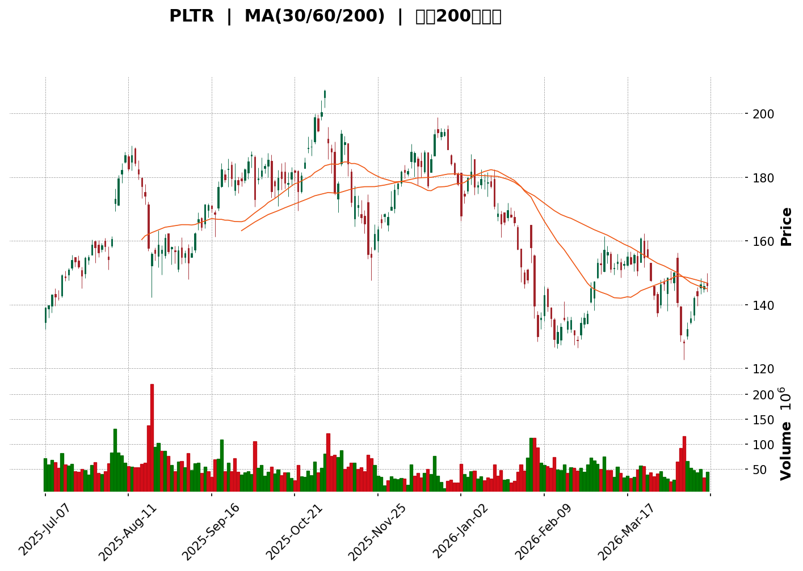
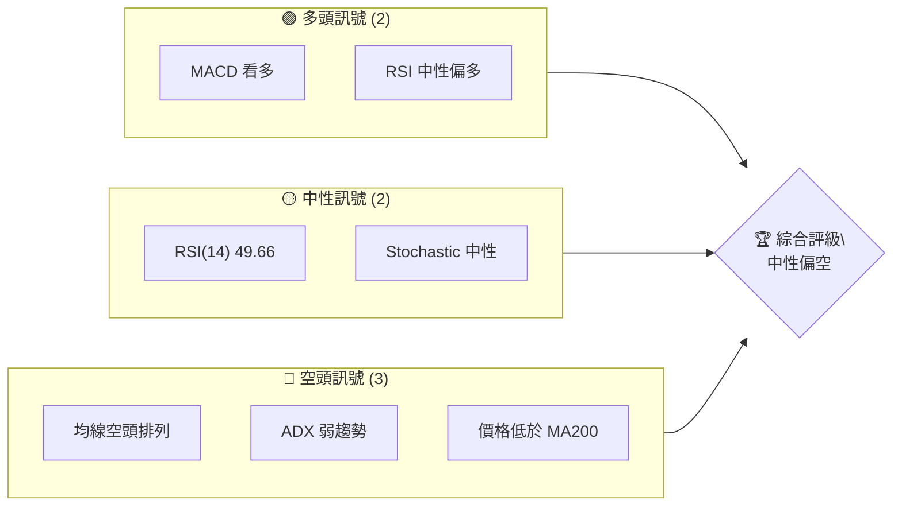
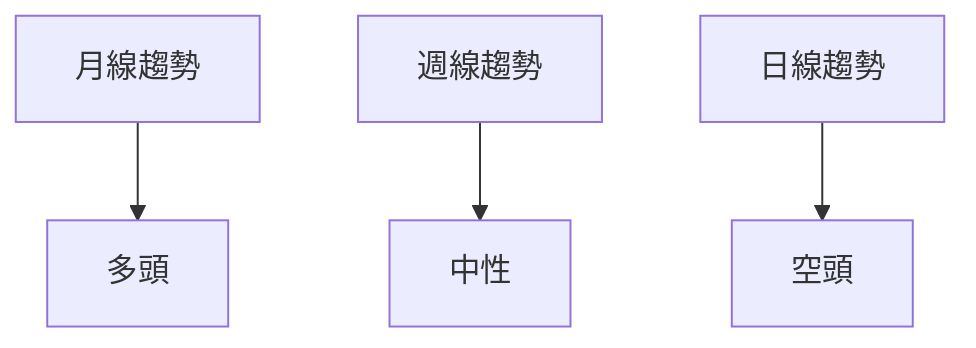
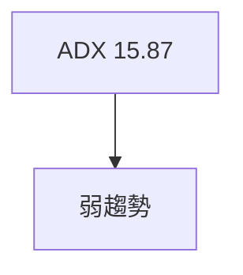
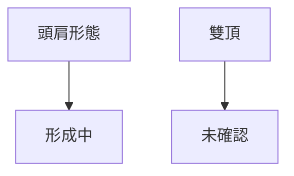
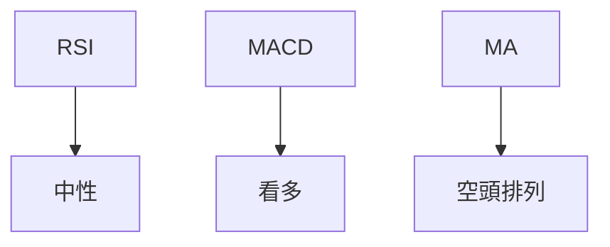
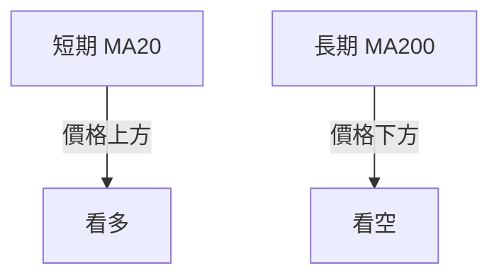
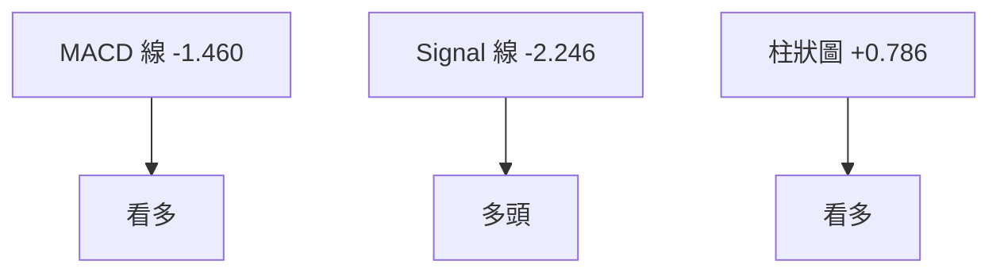
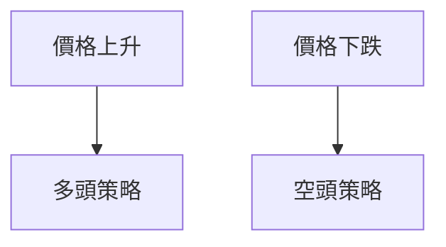
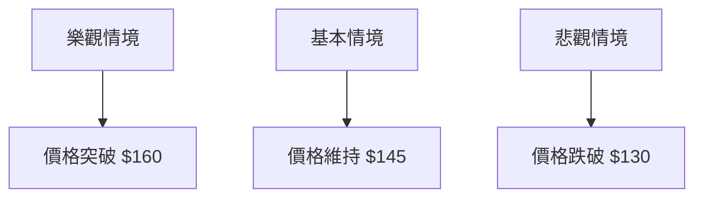

<details>
<summary>📊 靜態圖表 (點擊展開)</summary>

</details>

<html>
<head><meta charset="utf-8" /></head>
<body>
    <div>                        <script>window.PlotlyConfig = {MathJaxConfig: 'local'};</script>
        <script charset="utf-8" src="https://cdn.plot.ly/plotly-3.5.0.min.js" integrity="sha256-fHbNLP+GlIXN+efbQec78UkemUz3NJp7UmfGxC1tNxs=" crossorigin="anonymous"></script>                <div id="candlestick-chart" class="plotly-graph-div" style="height:500px; width:100%;"></div>            <script>                window.PLOTLYENV=window.PLOTLYENV || {};                                if (document.getElementById("candlestick-chart")) {                    Plotly.newPlot(                        "candlestick-chart",                        [{"close":{"dtype":"f8","bdata":"AAAAANdjYUAAAABguHZhQAAAAAAp5GFAAAAAAADQYUAAAABAM8NhQAAAAMDMpGJAAAAAYI+SYkAAAADAHt1iQAAAACCuP2NAAAAA4KMwY0AAAACgR\u002fliQAAAAIA9omJAAAAAAClUY0AAAAAghVtjQAAAAKCZ2WNAAAAAACm8Y0AAAAAgrodjQAAAACCF02NAAAAAQDPLY0AAAADgo0hjQAAAAMAeFWRAAAAA4KOoZUAAAACgR3FmQAAAAGBmxmZAAAAAYLheZ0AAAACAwtVmQAAAAEAKX2dAAAAAANcLZ0AAAADgo6BmQAAAAKBwJWZAAAAAwPXAZUAAAAAAALhjQAAAAOBRgGNAAAAAgMKFY0AAAAAgrtdjQAAAAKBwpWNAAAAAANcbZEAAAABACpdjQAAAAADXw2NAAAAAYLiWY0AAAABA4aJjQAAAAMDMXGNAAAAA4HqEY0AAAAAghSNjQAAAAEAzg2NAAAAAIIVLZEAAAAAgrtdkQAAAACCFi2RAAAAAgMJtZUAAAABguGZlQAAAAOBRSGVAAAAAYI8KZUAAAABACh9mQAAAAOB6zGZAAAAAYI9qZkAAAACgmdFmQAAAAIDrcWZAAAAAANdjZkAAAACAPTJmQAAAACCFW2ZAAAAAoHDNZkAAAABgZh5nQAAAAKCZYWdAAAAAgD2iZUAAAADA9XBmQAAAAKBwxWZAAAAAgOvxZkAAAABACi9nQAAAAIAU7mVAAAAAYLgmZkAAAAAgrndmQAAAAADXc2ZAAAAAANdDZkAAAADAzERmQAAAAEDhsmZAAAAA4FGwZkAAAAAgru9lQAAAACBcj2ZAAAAAACkUZ0AAAACAwqVnQAAAAEAzs2dAAAAAgOvZaEAAAACgmVFoQAAAAEAKD2lAAAAAgMLlaUAAAAAgrtdnQAAAAMDMfGdAAAAAoJnhZUAAAACAwj1mQAAAACCFM2hAAAAAYLjeZ0AAAACgcAVnQAAAAOB6hGVAAAAA4FHAZUAAAAAAAGhlQAAAAGCP6mRAAAAAoHCtZEAAAAAA13djQAAAAEAzW2NAAAAAAABIZEAAAACgmXFkQAAAAOCjuGRAAAAAYGYOZUAAAAAgru9kQAAAAIAUVmVAAAAAYI8CZkAAAACgcD1mQAAAAOBRuGZAAAAAIK6vZkAAAABA4bpmQAAAAMAefWdAAAAAoEdxZ0AAAACAPfJmQAAAAAAA6GZAAAAAAAB4Z0AAAACgRylmQAAAAIAUNmdAAAAAACksaEAAAAAgXD9oQAAAAAApRGhAAAAAoHBFaEAAAABguJZnQAAAAIDCBWdAAAAAQOGaZkAAAAAAADhmQAAAACCF+2RAAAAAoEfBZUAAAABguHZmQAAAAIDCtWZAAAAAIIUbZkAAAAAgri9mQAAAAMAebWZAAAAAYLheZkAAAADAzExmQAAAAIA9ImZAAAAAYLheZUAAAADA9RBlQAAAAGCPqmRAAAAAwMy8ZEAAAABAMzNlQAAAAEAK72RAAAAAYGa2ZEAAAABAM6tjQAAAACCF+2JAAAAAQOFSYkAAAADgUXhiQAAAAAApvGNAAAAAoEdxYUAAAADgUUBgQAAAAMDM\u002fGBAAAAAwB7dYUAAAADgUXBhQAAAAIDC9WBAAAAAACkkYEAAAADAHm1gQAAAAOCjoGBAAAAAACnsYEAAAADgetxgQAAAACCu52BAAAAAQDNTYEAAAABA4RpgQAAAAIAUxmBAAAAAgBT+YEAAAACAFCZhQAAAAKBwJWJAAAAAQApnYkAAAACAFCZjQAAAAKBwFWNAAAAAwB6lY0AAAACAwo1jQAAAAOB65GJAAAAAQDPzYkAAAAAAADBjQAAAAGBm3mJAAAAAQAoXY0AAAABgj2JjQAAAAOCjGGNAAAAAgMJ1Y0AAAACAwtViQAAAAEDhGmRAAAAAwPVYY0AAAABguF5jQAAAAIDrcWJAAAAAgOvhYUAAAACgmTFhQAAAAMD1SGJAAAAAIK5PYkAAAABguI5iQAAAAIDCfWJAAAAAgD3CYkAAAADgUZhhQAAAACCuT2BAAAAAgOsBYEAAAAAA14tgQAAAAGBm9mBAAAAAwMzEYUAAAADgUdhhQAAAAOB6TGJAAAAA4Ho8YkAAAABACj9iQA=="},"high":{"dtype":"f8","bdata":"AAAAoEdpYUAAAAAgXHthQAAAAKBw5WFAAAAAwB4lYkAAAABgjxJiQAAAAGBmsmJAAAAAANfTYkAAAADgUfBiQAAAAIDCdWNAAAAAoHBdY0AAAACAFG5jQAAAAKBH+WJAAAAAAABgY0AAAAAAKXRjQAAAAOB6DGRAAAAAwPUIZEAAAADgegRkQAAAAAAp7GNAAAAA4HocZEAAAACAFMZjQAAAAMDMLGRAAAAAYI8KZkAAAACAl5JmQAAAACBcD2dAAAAAIK5\u002fZ0AAAACAwmVnQAAAAAAAwGdAAAAAYLiuZ0AAAABgjypnQAAAAAAAgGZAAAAAwMw8ZkAAAACgmYllQAAAAGC4jmNAAAAAQAq\u002fY0AAAABgZmZkQAAAAEDh0mNAAAAAAClEZEAAAADAzExkQAAAACBcx2NAAAAAoHDNY0AAAADgesxjQAAAAMDMJGRAAAAAoEehY0AAAABACt9jQAAAAKCZyWNAAAAAAABYZEAAAAAAACBlQAAAAOCn7mRAAAAAwPVwZUAAAACgmXllQAAAAIDraWVAAAAAgMI1ZUAAAACgmVlmQAAAAKBwDWdAAAAAAADIZkAAAAAAADhnQAAAAEAzG2dAAAAAgD0KZ0AAAAAA14NmQAAAACBcr2ZAAAAA4KPYZkAAAADA9UhnQAAAAGBmhmdAAAAAQOFaZ0AAAABgZt5mQAAAAIDCRWdAAAAA4FEIZ0AAAAAA13NnQAAAAEAzY2dAAAAAQApnZkAAAABA4cpmQAAAAEAzC2dAAAAAgD0aZ0AAAABA4bJmQAAAAEDh4mZAAAAAwHLMZkAAAABguMZmQAAAAIDrsWZAAAAAoHBFZ0AAAABgjxpoQAAAAMD1+GdAAAAAQDP7aEAAAACgcPVoQAAAAIDChWlAAAAA4KPwaUAAAABgZnZoQAAAAIA9ymdAAAAAQOHiZ0AAAABgZlZmQAAAAIDCXWhAAAAAoJkdaEAAAABgj9JnQAAAAGBm1mZAAAAAoEcpZkAAAAAgrsdlQAAAAGCPmmVAAAAAQDMzZUAAAACAPdJlQAAAACCFw2NAAAAAoHClZEAAAADAzJRkQAAAACDZCmVAAAAAoJkZZUAAAABAMyNlQAAAAAAA+GVAAAAAwB49ZkAAAACAFE5mQAAAAGDlxGZAAAAAACn8ZkAAAABAM9tmQAAAAOB6zGdAAAAAoJmBZ0AAAADAzFBnQAAAAMD1eGdAAAAAAACQZ0AAAAAAAHhnQAAAAGCPamdAAAAAAABgaEAAAAAAKdxoQAAAAADXa2hAAAAAoHBlaEAAAABAM4toQAAAAGBmZmdAAAAAAFQXZ0AAAADA9bBmQAAAAEAzq2ZAAAAAgD36ZUAAAACAFIZmQAAAAMD1aGdAAAAAwB41Z0AAAABACldmQAAAAAAA0GZAAAAAQDOjZkAAAADgIrNmQAAAAEAzk2ZAAAAAgMLNZkAAAABACn9lQAAAACCuL2VAAAAAAAAgZUAAAAAAAIBlQAAAAEDhUmVAAAAAgBQuZUAAAACgcKFkQAAAAAAptGNAAAAAAADgYkAAAADAzOxiQAAAAAB\u002fomRAAAAAQDN7Y0AAAAAgXD9hQAAAAOD7NWFAAAAAANc7YkAAAACA6zFiQAAAAAAAaGFAAAAA4Hr8YEAAAACA67FgQAAAAIA9ymBAAAAA4NCeYUAAAADAHgVhQAAAAGC4BmFAAAAAoEeBYEAAAAAgrkdgQAAAAEDhAmFAAAAA4FEwYUAAAABAM0NhQAAAAOB6ZGJAAAAAAABwYkAAAADgo1BjQAAAAAApjGNAAAAAYGYuZEAAAACAFM5jQAAAACAGlWNAAAAAgGglY0AAAAAAKXxjQAAAAIDrUWNAAAAAIIU7Y0AAAAAAAJhjQAAAAIAUlmNAAAAAwMyEY0AAAADAzJRjQAAAAGCPImRAAAAAwMxMZEAAAADgowhkQAAAAADXI2NAAAAAYLg+YkAAAAAA1wNiQAAAACCFe2JAAAAAoJmJYkAAAADgUZBiQAAAACCF02JAAAAA4KPIYkAAAADA9YhjQAAAAKBHcWFAAAAAYGYmYEAAAACgcM1gQAAAAIA9QmFAAAAAYI\u002fSYUAAAACgmTFiQAAAAMD1iGJAAAAAYGZmYkAAAAAA17tiQA=="},"hovertemplate":"\u003cb\u003e%{x|%Y-%m-%d}\u003c\u002fb\u003e\u003cbr\u003e\u958b: $%{open:.2f}\u003cbr\u003e\u9ad8: $%{high:.2f}\u003cbr\u003e\u4f4e: $%{low:.2f}\u003cbr\u003e\u6536: $%{close:.2f}\u003cextra\u003e\u003c\u002fextra\u003e","low":{"dtype":"f8","bdata":"AAAAgD2KYEAAAACgR\u002flgQAAAAOB6LGFAAAAAwPVwYUAAAABACq9hQAAAAEAKx2FAAAAAIIVrYkAAAABgkXViQAAAAIA92mJAAAAAwMz8YkAAAAAghetiQAAAAOD7IWJAAAAAIC+JYkAAAABgZhJjQAAAAGCPcmNAAAAAoEchY0AAAADAHl1jQAAAAIDrkWNAAAAAIFyXY0AAAAAg2+FiQAAAAIDCvWNAAAAAQAonZUAAAADgUWBlQAAAAKBwRWZAAAAAwB4NZ0AAAACgcL1mQAAAAEAzw2ZAAAAAQOHyZkAAAABgZmZmQAAAAAAprGVAAAAA4HpsZUAAAADAzJxjQAAAAEDhymFAAAAAgOs5Y0AAAADgo\u002fhiQAAAAADXq2JAAAAAgD1SY0AAAAAgXH9jQAAAAKCZEWNAAAAAAAAgY0AAAADA9chiQAAAAGC4FmNAAAAAwB4lY0AAAACgR4FiQAAAAEDhWmNAAAAAANeLY0AAAACAFG5kQAAAAEAKZ2RAAAAA4FGAZEAAAADAHu1kQAAAAGC4HmVAAAAA4KMoZEAAAADgeixlQAAAAGC4FmZAAAAAoEdJZkAAAADgUSBmQAAAAADXI2ZAAAAAoEfJZUAAAADAHt1lQAAAAMAeJWZAAAAAQApHZkAAAAAAAHBmQAAAAGBm3mZAAAAA4KNYZUAAAABgjzpmQAAAAKBwbWZAAAAAYGamZkAAAABgZn5mQAAAAMD1sGVAAAAAYGauZUAAAACAPVplQAAAAOCjAGZAAAAAYGYOZkAAAABgZr5lQAAAAIAULmZAAAAAwMxUZkAAAACgcC1lQAAAAOBR4GVAAAAAQDPbZkAAAADgo3BnQAAAAMD1WGdAAAAAIK7PZ0AAAAAA10NoQAAAAKBwvWhAAAAAgD06aUAAAACA6zFnQAAAAGC4pmZAAAAAwPXQZUAAAADAHh1lQAAAAOCj8GZAAAAAAClkZ0AAAADAzIxmQAAAAGBkV2VAAAAAAACQZEAAAACAwvVkQAAAAAAAsGRAAAAAoHBNZEAAAADgo0xjQAAAAIDrcWJAAAAAAACgY0AAAACAwpFjQAAAAAApfGRAAAAAAAC8ZEAAAAAA12NkQAAAAEDhMmVAAAAAYI8aZUAAAACAws1lQAAAAMAeJWZAAAAAoEdxZkAAAAAAKYxmQAAAAAAA2GZAAAAAYLiGZkAAAAAgWDVmQAAAAMD1gGZAAAAAQIukZkAAAAAAABBmQAAAAOBRsGZAAAAAIFxXZ0AAAACAwg1oQAAAACCF92dAAAAAYI8aaEAAAAAA15NnQAAAAOB69GZAAAAAYGaWZkAAAAAAAChmQAAAAEAzy2RAAAAAoEd5ZUAAAADgo9hlQAAAAMAeNWZAAAAAANfLZUAAAAAAANhlQAAAAEDhCmZAAAAA4HoEZkAAAABgZr5lQAAAAMD1EGZAAAAA4FFAZUAAAAAgrsdkQAAAACCFI2RAAAAAYGaeZEAAAACgmclkQAAAAGBm6mRAAAAAgBSWZEAAAAAgrqdjQAAAAADXY2JAAAAAwHIkYkAAAACg7VRiQAAAAADXI2NAAAAAgML1YEAAAACAPQpgQAAAAEAzi2BAAAAAANXYYEAAAADgozhhQAAAAGBmnmBAAAAAANejX0AAAACA6Y5fQAAAAGCP0l9AAAAAANfbYEAAAADgUWBgQAAAAKBwZWBAAAAAwPXYX0AAAAAgrpdfQAAAAIDCJWBAAAAAACmUYEAAAAAgXL9gQAAAAOCjkGFAAAAAYGZGYUAAAACA64FiQAAAACCFs2JAAAAAoEfJYkAAAABACh9jQAAAAOB6xGJAAAAAYI+qYkAAAAAgXN9iQAAAAGCPkmJAAAAAoHDlYkAAAAAA1wNjQAAAACCFE2NAAAAAAADQYkAAAABA4aJiQAAAACCuJ2NAAAAA4Hr0YkAAAAAgXFtjQAAAAAAAaGJAAAAAgOuxYUAAAACgmQlhQAAAAEAKX2FAAAAAQAoPYkAAAAAgrj9hQAAAACAxVGJAAAAAYGYOYkAAAACgcGVhQAAAAEAKD2BAAAAAIIWrXkAAAADAzCRgQAAAAAAAwGBAAAAAgMLdYEAAAADA9XBhQAAAAKCZ6WFAAAAAYI\u002f6YUAAAADA9\u002f9hQA=="},"name":"\u50f9\u683c","open":{"dtype":"f8","bdata":"AAAAACnMYEAAAADAzFhhQAAAAMD1dGFAAAAAgOvpYUAAAAAghcNhQAAAAEAK12FAAAAAgMKdYkAAAACgmaliQAAAAIDr8WJAAAAAIIVbY0AAAAAAKTxjQAAAAEAz22JAAAAAIK63YkAAAAAgXD9jQAAAAAApdGNAAAAAACn8Y0AAAABA4dZjQAAAACCuq2NAAAAAIK7\u002fY0AAAACgmWFjQAAAAMD10GNAAAAAgOt5ZUAAAACgmWVlQAAAAOBRoGZAAAAAIIUXZ0AAAABACk9nQAAAAGBmFmdAAAAAAACgZ0AAAADAHs1mQAAAAEAzd2ZAAAAA4KPoZUAAAAAghWtlQAAAAKCZCWNAAAAAoHClY0AAAACAFGpjQAAAAEAzg2NAAAAA4HpsY0AAAACAPUpkQAAAAAAptGNAAAAAIFyfY0AAAABgZuZiQAAAAAAAwGNAAAAAIK5bY0AAAACAPbpjQAAAAMAeXWNAAAAAAACoY0AAAAAAAMBkQAAAACCu52RAAAAAQDOrZEAAAABAMzNlQAAAAKBHYWVAAAAA4KMgZUAAAADgo0hlQAAAAIA9ImZAAAAAACmcZkAAAADgUdBmQAAAAMAe\u002fWZAAAAAoJn5ZUAAAACgmWFmQAAAAOB6dGZAAAAAIFxfZkAAAACAPapmQAAAAGBmVmdAAAAAwMxMZ0AAAACAwmVmQAAAAIDriWZAAAAAoJnZZkAAAABgj\u002fJmQAAAAKBwJWdAAAAAgMJVZkAAAAAAAABmQAAAAMD1tGZAAAAAwPW4ZkAAAAAAADhmQAAAACCub2ZAAAAAgOvBZkAAAACAwr1mQAAAAIA97mVAAAAAACncZkAAAABACp9nQAAAACBcr2dAAAAAYI\u002fiZ0AAAACgmc1oQAAAAGBm5mhAAAAAoHChaUAAAACAPQJoQAAAAAAAoGdAAAAAIK5\u002fZ0AAAADAzKRlQAAAAIDrCWdAAAAAYLjKZ0AAAABgj9JnQAAAAEDhtmZAAAAAQDPfZEAAAADA9VBlQAAAAADXC2VAAAAAoJn5ZEAAAACAPYJlQAAAAOBRgGNAAAAAQAqvY0AAAACAPQJkQAAAAEAz22RAAAAA4FH4ZEAAAAAAAKBkQAAAAEDhMmVAAAAA4HpEZUAAAAAgrgtmQAAAACBcR2ZAAAAAYLjGZkAAAABACp9mQAAAAGBmHmdAAAAAoJkZZ0AAAACA6zlnQAAAAGCPImdAAAAAwPW0ZkAAAABA4XZnQAAAAOBRsGZAAAAAIK5XZ0AAAACgR2FoQAAAAGBmGmhAAAAAwB4laEAAAADgemBoQAAAAEAzW2dAAAAAQDMLZ0AAAAAAKaRmQAAAAKCZqWZAAAAAACncZUAAAADgUfhlQAAAAKCZeWZAAAAAIK4zZ0AAAADgoyBmQAAAAIDrNWZAAAAAAABcZkAAAAAAAERmQAAAAGC4VmZAAAAAIIVrZkAAAAAAAPRkQAAAACDdDGVAAAAAoJkdZUAAAADgo+hkQAAAAGC4BmVAAAAAIFzvZEAAAADAzIxkQAAAAAAptGNAAAAAoJnBYkAAAACAFN5iQAAAAKCZoWRAAAAAwB5tY0AAAACAPRphQAAAAGCP6mBAAAAAYI8SYUAAAABA4R5iQAAAAMDMYGFAAAAAIIXrYEAAAACgmflfQAAAAOCjHGBAAAAA4Hr8YEAAAACA64lgQAAAACCui2BAAAAAoEeBYEAAAAAAKSBgQAAAACCFU2BAAAAAQAq7YEAAAACAPcJgQAAAAMDMmGFAAAAAQDPDYUAAAACAwo1iQAAAAIAUHmNAAAAAgBTOYkAAAACAFHZjQAAAACCuf2NAAAAAACnsYkAAAADgUSBjQAAAAKCZKWNAAAAAYGYOY0AAAADA9QxjQAAAAIA9XmNAAAAAQDMjY0AAAABgZmZjQAAAACCuJ2NAAAAAgD0CZEAAAACgcK1jQAAAAIDCIWNAAAAAACk8YkAAAADgo+hhQAAAAOCjgGFAAAAAAABgYkAAAAAghe9hQAAAACCFi2JAAAAAYDlcYkAAAADgelhjQAAAAOCjbGFAAAAAIFwPYEAAAAAgXEdgQAAAAACqzWBAAAAAoEcZYUAAAACgRwliQAAAAIAUKmJAAAAAAAAgYkAAAABgj1piQA=="},"x":["2025-07-07T00:00:00-04:00","2025-07-08T00:00:00-04:00","2025-07-09T00:00:00-04:00","2025-07-10T00:00:00-04:00","2025-07-11T00:00:00-04:00","2025-07-14T00:00:00-04:00","2025-07-15T00:00:00-04:00","2025-07-16T00:00:00-04:00","2025-07-17T00:00:00-04:00","2025-07-18T00:00:00-04:00","2025-07-21T00:00:00-04:00","2025-07-22T00:00:00-04:00","2025-07-23T00:00:00-04:00","2025-07-24T00:00:00-04:00","2025-07-25T00:00:00-04:00","2025-07-28T00:00:00-04:00","2025-07-29T00:00:00-04:00","2025-07-30T00:00:00-04:00","2025-07-31T00:00:00-04:00","2025-08-01T00:00:00-04:00","2025-08-04T00:00:00-04:00","2025-08-05T00:00:00-04:00","2025-08-06T00:00:00-04:00","2025-08-07T00:00:00-04:00","2025-08-08T00:00:00-04:00","2025-08-11T00:00:00-04:00","2025-08-12T00:00:00-04:00","2025-08-13T00:00:00-04:00","2025-08-14T00:00:00-04:00","2025-08-15T00:00:00-04:00","2025-08-18T00:00:00-04:00","2025-08-19T00:00:00-04:00","2025-08-20T00:00:00-04:00","2025-08-21T00:00:00-04:00","2025-08-22T00:00:00-04:00","2025-08-25T00:00:00-04:00","2025-08-26T00:00:00-04:00","2025-08-27T00:00:00-04:00","2025-08-28T00:00:00-04:00","2025-08-29T00:00:00-04:00","2025-09-02T00:00:00-04:00","2025-09-03T00:00:00-04:00","2025-09-04T00:00:00-04:00","2025-09-05T00:00:00-04:00","2025-09-08T00:00:00-04:00","2025-09-09T00:00:00-04:00","2025-09-10T00:00:00-04:00","2025-09-11T00:00:00-04:00","2025-09-12T00:00:00-04:00","2025-09-15T00:00:00-04:00","2025-09-16T00:00:00-04:00","2025-09-17T00:00:00-04:00","2025-09-18T00:00:00-04:00","2025-09-19T00:00:00-04:00","2025-09-22T00:00:00-04:00","2025-09-23T00:00:00-04:00","2025-09-24T00:00:00-04:00","2025-09-25T00:00:00-04:00","2025-09-26T00:00:00-04:00","2025-09-29T00:00:00-04:00","2025-09-30T00:00:00-04:00","2025-10-01T00:00:00-04:00","2025-10-02T00:00:00-04:00","2025-10-03T00:00:00-04:00","2025-10-06T00:00:00-04:00","2025-10-07T00:00:00-04:00","2025-10-08T00:00:00-04:00","2025-10-09T00:00:00-04:00","2025-10-10T00:00:00-04:00","2025-10-13T00:00:00-04:00","2025-10-14T00:00:00-04:00","2025-10-15T00:00:00-04:00","2025-10-16T00:00:00-04:00","2025-10-17T00:00:00-04:00","2025-10-20T00:00:00-04:00","2025-10-21T00:00:00-04:00","2025-10-22T00:00:00-04:00","2025-10-23T00:00:00-04:00","2025-10-24T00:00:00-04:00","2025-10-27T00:00:00-04:00","2025-10-28T00:00:00-04:00","2025-10-29T00:00:00-04:00","2025-10-30T00:00:00-04:00","2025-10-31T00:00:00-04:00","2025-11-03T00:00:00-05:00","2025-11-04T00:00:00-05:00","2025-11-05T00:00:00-05:00","2025-11-06T00:00:00-05:00","2025-11-07T00:00:00-05:00","2025-11-10T00:00:00-05:00","2025-11-11T00:00:00-05:00","2025-11-12T00:00:00-05:00","2025-11-13T00:00:00-05:00","2025-11-14T00:00:00-05:00","2025-11-17T00:00:00-05:00","2025-11-18T00:00:00-05:00","2025-11-19T00:00:00-05:00","2025-11-20T00:00:00-05:00","2025-11-21T00:00:00-05:00","2025-11-24T00:00:00-05:00","2025-11-25T00:00:00-05:00","2025-11-26T00:00:00-05:00","2025-11-28T00:00:00-05:00","2025-12-01T00:00:00-05:00","2025-12-02T00:00:00-05:00","2025-12-03T00:00:00-05:00","2025-12-04T00:00:00-05:00","2025-12-05T00:00:00-05:00","2025-12-08T00:00:00-05:00","2025-12-09T00:00:00-05:00","2025-12-10T00:00:00-05:00","2025-12-11T00:00:00-05:00","2025-12-12T00:00:00-05:00","2025-12-15T00:00:00-05:00","2025-12-16T00:00:00-05:00","2025-12-17T00:00:00-05:00","2025-12-18T00:00:00-05:00","2025-12-19T00:00:00-05:00","2025-12-22T00:00:00-05:00","2025-12-23T00:00:00-05:00","2025-12-24T00:00:00-05:00","2025-12-26T00:00:00-05:00","2025-12-29T00:00:00-05:00","2025-12-30T00:00:00-05:00","2025-12-31T00:00:00-05:00","2026-01-02T00:00:00-05:00","2026-01-05T00:00:00-05:00","2026-01-06T00:00:00-05:00","2026-01-07T00:00:00-05:00","2026-01-08T00:00:00-05:00","2026-01-09T00:00:00-05:00","2026-01-12T00:00:00-05:00","2026-01-13T00:00:00-05:00","2026-01-14T00:00:00-05:00","2026-01-15T00:00:00-05:00","2026-01-16T00:00:00-05:00","2026-01-20T00:00:00-05:00","2026-01-21T00:00:00-05:00","2026-01-22T00:00:00-05:00","2026-01-23T00:00:00-05:00","2026-01-26T00:00:00-05:00","2026-01-27T00:00:00-05:00","2026-01-28T00:00:00-05:00","2026-01-29T00:00:00-05:00","2026-01-30T00:00:00-05:00","2026-02-02T00:00:00-05:00","2026-02-03T00:00:00-05:00","2026-02-04T00:00:00-05:00","2026-02-05T00:00:00-05:00","2026-02-06T00:00:00-05:00","2026-02-09T00:00:00-05:00","2026-02-10T00:00:00-05:00","2026-02-11T00:00:00-05:00","2026-02-12T00:00:00-05:00","2026-02-13T00:00:00-05:00","2026-02-17T00:00:00-05:00","2026-02-18T00:00:00-05:00","2026-02-19T00:00:00-05:00","2026-02-20T00:00:00-05:00","2026-02-23T00:00:00-05:00","2026-02-24T00:00:00-05:00","2026-02-25T00:00:00-05:00","2026-02-26T00:00:00-05:00","2026-02-27T00:00:00-05:00","2026-03-02T00:00:00-05:00","2026-03-03T00:00:00-05:00","2026-03-04T00:00:00-05:00","2026-03-05T00:00:00-05:00","2026-03-06T00:00:00-05:00","2026-03-09T00:00:00-04:00","2026-03-10T00:00:00-04:00","2026-03-11T00:00:00-04:00","2026-03-12T00:00:00-04:00","2026-03-13T00:00:00-04:00","2026-03-16T00:00:00-04:00","2026-03-17T00:00:00-04:00","2026-03-18T00:00:00-04:00","2026-03-19T00:00:00-04:00","2026-03-20T00:00:00-04:00","2026-03-23T00:00:00-04:00","2026-03-24T00:00:00-04:00","2026-03-25T00:00:00-04:00","2026-03-26T00:00:00-04:00","2026-03-27T00:00:00-04:00","2026-03-30T00:00:00-04:00","2026-03-31T00:00:00-04:00","2026-04-01T00:00:00-04:00","2026-04-02T00:00:00-04:00","2026-04-06T00:00:00-04:00","2026-04-07T00:00:00-04:00","2026-04-08T00:00:00-04:00","2026-04-09T00:00:00-04:00","2026-04-10T00:00:00-04:00","2026-04-13T00:00:00-04:00","2026-04-14T00:00:00-04:00","2026-04-15T00:00:00-04:00","2026-04-16T00:00:00-04:00","2026-04-17T00:00:00-04:00","2026-04-20T00:00:00-04:00","2026-04-21T00:00:00-04:00"],"type":"candlestick"},{"hovertemplate":"MA30: $%{y:.2f}\u003cextra\u003e\u003c\u002fextra\u003e","line":{"color":"#2196F3","dash":"dash","width":2},"mode":"lines","name":"MA30","x":["2025-07-07T00:00:00-04:00","2025-07-08T00:00:00-04:00","2025-07-09T00:00:00-04:00","2025-07-10T00:00:00-04:00","2025-07-11T00:00:00-04:00","2025-07-14T00:00:00-04:00","2025-07-15T00:00:00-04:00","2025-07-16T00:00:00-04:00","2025-07-17T00:00:00-04:00","2025-07-18T00:00:00-04:00","2025-07-21T00:00:00-04:00","2025-07-22T00:00:00-04:00","2025-07-23T00:00:00-04:00","2025-07-24T00:00:00-04:00","2025-07-25T00:00:00-04:00","2025-07-28T00:00:00-04:00","2025-07-29T00:00:00-04:00","2025-07-30T00:00:00-04:00","2025-07-31T00:00:00-04:00","2025-08-01T00:00:00-04:00","2025-08-04T00:00:00-04:00","2025-08-05T00:00:00-04:00","2025-08-06T00:00:00-04:00","2025-08-07T00:00:00-04:00","2025-08-08T00:00:00-04:00","2025-08-11T00:00:00-04:00","2025-08-12T00:00:00-04:00","2025-08-13T00:00:00-04:00","2025-08-14T00:00:00-04:00","2025-08-15T00:00:00-04:00","2025-08-18T00:00:00-04:00","2025-08-19T00:00:00-04:00","2025-08-20T00:00:00-04:00","2025-08-21T00:00:00-04:00","2025-08-22T00:00:00-04:00","2025-08-25T00:00:00-04:00","2025-08-26T00:00:00-04:00","2025-08-27T00:00:00-04:00","2025-08-28T00:00:00-04:00","2025-08-29T00:00:00-04:00","2025-09-02T00:00:00-04:00","2025-09-03T00:00:00-04:00","2025-09-04T00:00:00-04:00","2025-09-05T00:00:00-04:00","2025-09-08T00:00:00-04:00","2025-09-09T00:00:00-04:00","2025-09-10T00:00:00-04:00","2025-09-11T00:00:00-04:00","2025-09-12T00:00:00-04:00","2025-09-15T00:00:00-04:00","2025-09-16T00:00:00-04:00","2025-09-17T00:00:00-04:00","2025-09-18T00:00:00-04:00","2025-09-19T00:00:00-04:00","2025-09-22T00:00:00-04:00","2025-09-23T00:00:00-04:00","2025-09-24T00:00:00-04:00","2025-09-25T00:00:00-04:00","2025-09-26T00:00:00-04:00","2025-09-29T00:00:00-04:00","2025-09-30T00:00:00-04:00","2025-10-01T00:00:00-04:00","2025-10-02T00:00:00-04:00","2025-10-03T00:00:00-04:00","2025-10-06T00:00:00-04:00","2025-10-07T00:00:00-04:00","2025-10-08T00:00:00-04:00","2025-10-09T00:00:00-04:00","2025-10-10T00:00:00-04:00","2025-10-13T00:00:00-04:00","2025-10-14T00:00:00-04:00","2025-10-15T00:00:00-04:00","2025-10-16T00:00:00-04:00","2025-10-17T00:00:00-04:00","2025-10-20T00:00:00-04:00","2025-10-21T00:00:00-04:00","2025-10-22T00:00:00-04:00","2025-10-23T00:00:00-04:00","2025-10-24T00:00:00-04:00","2025-10-27T00:00:00-04:00","2025-10-28T00:00:00-04:00","2025-10-29T00:00:00-04:00","2025-10-30T00:00:00-04:00","2025-10-31T00:00:00-04:00","2025-11-03T00:00:00-05:00","2025-11-04T00:00:00-05:00","2025-11-05T00:00:00-05:00","2025-11-06T00:00:00-05:00","2025-11-07T00:00:00-05:00","2025-11-10T00:00:00-05:00","2025-11-11T00:00:00-05:00","2025-11-12T00:00:00-05:00","2025-11-13T00:00:00-05:00","2025-11-14T00:00:00-05:00","2025-11-17T00:00:00-05:00","2025-11-18T00:00:00-05:00","2025-11-19T00:00:00-05:00","2025-11-20T00:00:00-05:00","2025-11-21T00:00:00-05:00","2025-11-24T00:00:00-05:00","2025-11-25T00:00:00-05:00","2025-11-26T00:00:00-05:00","2025-11-28T00:00:00-05:00","2025-12-01T00:00:00-05:00","2025-12-02T00:00:00-05:00","2025-12-03T00:00:00-05:00","2025-12-04T00:00:00-05:00","2025-12-05T00:00:00-05:00","2025-12-08T00:00:00-05:00","2025-12-09T00:00:00-05:00","2025-12-10T00:00:00-05:00","2025-12-11T00:00:00-05:00","2025-12-12T00:00:00-05:00","2025-12-15T00:00:00-05:00","2025-12-16T00:00:00-05:00","2025-12-17T00:00:00-05:00","2025-12-18T00:00:00-05:00","2025-12-19T00:00:00-05:00","2025-12-22T00:00:00-05:00","2025-12-23T00:00:00-05:00","2025-12-24T00:00:00-05:00","2025-12-26T00:00:00-05:00","2025-12-29T00:00:00-05:00","2025-12-30T00:00:00-05:00","2025-12-31T00:00:00-05:00","2026-01-02T00:00:00-05:00","2026-01-05T00:00:00-05:00","2026-01-06T00:00:00-05:00","2026-01-07T00:00:00-05:00","2026-01-08T00:00:00-05:00","2026-01-09T00:00:00-05:00","2026-01-12T00:00:00-05:00","2026-01-13T00:00:00-05:00","2026-01-14T00:00:00-05:00","2026-01-15T00:00:00-05:00","2026-01-16T00:00:00-05:00","2026-01-20T00:00:00-05:00","2026-01-21T00:00:00-05:00","2026-01-22T00:00:00-05:00","2026-01-23T00:00:00-05:00","2026-01-26T00:00:00-05:00","2026-01-27T00:00:00-05:00","2026-01-28T00:00:00-05:00","2026-01-29T00:00:00-05:00","2026-01-30T00:00:00-05:00","2026-02-02T00:00:00-05:00","2026-02-03T00:00:00-05:00","2026-02-04T00:00:00-05:00","2026-02-05T00:00:00-05:00","2026-02-06T00:00:00-05:00","2026-02-09T00:00:00-05:00","2026-02-10T00:00:00-05:00","2026-02-11T00:00:00-05:00","2026-02-12T00:00:00-05:00","2026-02-13T00:00:00-05:00","2026-02-17T00:00:00-05:00","2026-02-18T00:00:00-05:00","2026-02-19T00:00:00-05:00","2026-02-20T00:00:00-05:00","2026-02-23T00:00:00-05:00","2026-02-24T00:00:00-05:00","2026-02-25T00:00:00-05:00","2026-02-26T00:00:00-05:00","2026-02-27T00:00:00-05:00","2026-03-02T00:00:00-05:00","2026-03-03T00:00:00-05:00","2026-03-04T00:00:00-05:00","2026-03-05T00:00:00-05:00","2026-03-06T00:00:00-05:00","2026-03-09T00:00:00-04:00","2026-03-10T00:00:00-04:00","2026-03-11T00:00:00-04:00","2026-03-12T00:00:00-04:00","2026-03-13T00:00:00-04:00","2026-03-16T00:00:00-04:00","2026-03-17T00:00:00-04:00","2026-03-18T00:00:00-04:00","2026-03-19T00:00:00-04:00","2026-03-20T00:00:00-04:00","2026-03-23T00:00:00-04:00","2026-03-24T00:00:00-04:00","2026-03-25T00:00:00-04:00","2026-03-26T00:00:00-04:00","2026-03-27T00:00:00-04:00","2026-03-30T00:00:00-04:00","2026-03-31T00:00:00-04:00","2026-04-01T00:00:00-04:00","2026-04-02T00:00:00-04:00","2026-04-06T00:00:00-04:00","2026-04-07T00:00:00-04:00","2026-04-08T00:00:00-04:00","2026-04-09T00:00:00-04:00","2026-04-10T00:00:00-04:00","2026-04-13T00:00:00-04:00","2026-04-14T00:00:00-04:00","2026-04-15T00:00:00-04:00","2026-04-16T00:00:00-04:00","2026-04-17T00:00:00-04:00","2026-04-20T00:00:00-04:00","2026-04-21T00:00:00-04:00"],"y":{"dtype":"f8","bdata":"AAAAAAAA+H8AAAAAAAD4fwAAAAAAAPh\u002fAAAAAAAA+H8AAAAAAAD4fwAAAAAAAPh\u002fAAAAAAAA+H8AAAAAAAD4fwAAAAAAAPh\u002fAAAAAAAA+H8AAAAAAAD4fwAAAAAAAPh\u002fAAAAAAAA+H8AAAAAAAD4fwAAAAAAAPh\u002fAAAAAAAA+H8AAAAAAAD4fwAAAAAAAPh\u002fAAAAAAAA+H8AAAAAAAD4fwAAAAAAAPh\u002fAAAAAAAA+H8AAAAAAAD4fwAAAAAAAPh\u002fAAAAAAAA+H8AAAAAAAD4fwAAAAAAAPh\u002fAAAAAAAA+H8AAAAAAAD4f3d3d3faDGRAmpmZORcyZECJiIhYVUVkQBEREXESU2RA3t3d\u002falhZEAiIiLSaXNkQBEREdH3e2RA3t3dzROJZEAiIiJSRo9kQFVVVRWuk2RAq6qqKhWXZEC8u7trvJxkQFVVVWX0omRAmpmZuZCkZEC8u7vbsqJkQERERJTRn2RAq6qq6pikZEDe3d0dzK9kQAAAAEDutWRAVVVV9eHDZEBVVVW189VkQFVVVSUx4GRAIiIiMuzaZECrqqpqLthkQM3MzExi2GRAzczMzD7QZEDe3d1NG9BkQBEREeEzyGRAd3d3R5rCZEAzMzMz7L5kQO\u002fu7q65wGRAZmZmtqzJZEAAAAAgsOZkQN7d3R3MB2VAd3d3N9AZZUBVVVVF\u002fS9lQAAAAPCnSmVAIiIi0ttiZUDNzMx8hoFlQBEREQEAlGVA7+7u3t2pZUBVVVXVBsJlQKuqqgpl3GVAvLu7C9fzZUAiIiKijA5mQJqZmRm9KWZAMzMzUyo+ZkCJiIiof0dmQN7d3X2xWGZAmpmZ+cVmZkCrqqr68HlmQHd3dxeSjmZAmpmZKRWvZkDNzMys1cFmQImIiLge1WZAAAAAoNPyZkCrqqoKkPtmQKuqqmp1BGdAmpmZCR4AZ0BmZmZWgABnQCIiIhI8EGdAAAAAEFgZZ0AiIiISgxhnQFVVVaWbCGdAMzMzU5wJZ0BVVVVVxwBnQGZmZgbz8GZAiYiImJndZkAAAACw5L1mQO\u002fu7j7up2ZAq6qqKvmXZkB3d3c3tIZmQO\u002fu7j7ud2ZAERERsZ1tZkDe3d3NPmJmQBEREWGeVmZAERERodNQZkDe3d0ta1NmQERERLTIVGZAZmZmRm9RZkB3d3f3mklmQLy7u3vNR2ZAVVVVBcg7ZkAAAADAETBmQKuqqoqzHWZAvLu72\u002fkIZkC8u7sbofplQCIiIqJF+GVAIiIi8tILZkCrqqqq8RxmQJqZmal\u002fHWZARERENOwgZkDe3d3twyVmQGZmZqabMmZAIiIisuQ5ZkARERGh00BmQKuqqlpkQWZAAAAAMJZKZkC8u7s7JmRmQLy7u5vEgGZAzczMHFqQZkCamZmpOJ9mQKuqqkrFrWZAmpmZOfu4ZkARERFhnsRmQLy7u4tsy2ZAIiIicvbFZkCamZlZ8rtmQN7d3d1rqmZAERERwcqZZkC8u7trvIxmQAAAAPDudmZAmpmZKaNfZkCrqqpaq0NmQKuqqsovImZA3t3dXUj2ZUBVVVW1yNZlQJqZmbkeuWVAAAAA0LB\u002fZUDNzMy8dDtlQAAAABBY\u002fWRAq6qqqqrGZECJiIjIL5JkQM3MzAx0XmRAZmZmxksnZEDe3d3d3fVjQJqZmTm00GNAiYiIeHenY0Dv7u6eqHdjQImIiGgfRmNAiYiIWMcUY0BmZmam4uBiQDMzM5OmsGJA7+7uPsOCYkC8u7srzlZiQHd3d1fHNGJAzczMvHQbYkBVVVXlFwtiQO\u002fu7t6W\u002fWFAVVVVRUT0YUCrqqr6N+ZhQM3MzMzM1GFAAAAAkMLFYUARERFBp8FhQDMzM8OuwGFAmpmZqTjHYUAzMzODB89hQERERCSUyWFAAAAAcMvaYUCamZm51\u002fBhQCIiIgJyC2JA7+7uThsYYkARERExlihiQJqZmTlCNWJAq6qqCh5EYkC8u7urqkpiQImIiIjPWGJA3t3dTalkYkAiIiLSInNiQImIiAisgGJAREREpHCVYkCJiIiYJ6JiQAAAAEA1nmJAvLu7e82VYkDNzMxMqZBiQLy7u1uPhmJAiYiI6CaBYkAiIiLSBnZiQGZmZvZTb2JAAAAAgE5jYkCamZk5JlhiQA=="},"type":"scatter"},{"hovertemplate":"MA60: $%{y:.2f}\u003cextra\u003e\u003c\u002fextra\u003e","line":{"color":"#9C27B0","dash":"dash","width":2},"mode":"lines","name":"MA60","x":["2025-07-07T00:00:00-04:00","2025-07-08T00:00:00-04:00","2025-07-09T00:00:00-04:00","2025-07-10T00:00:00-04:00","2025-07-11T00:00:00-04:00","2025-07-14T00:00:00-04:00","2025-07-15T00:00:00-04:00","2025-07-16T00:00:00-04:00","2025-07-17T00:00:00-04:00","2025-07-18T00:00:00-04:00","2025-07-21T00:00:00-04:00","2025-07-22T00:00:00-04:00","2025-07-23T00:00:00-04:00","2025-07-24T00:00:00-04:00","2025-07-25T00:00:00-04:00","2025-07-28T00:00:00-04:00","2025-07-29T00:00:00-04:00","2025-07-30T00:00:00-04:00","2025-07-31T00:00:00-04:00","2025-08-01T00:00:00-04:00","2025-08-04T00:00:00-04:00","2025-08-05T00:00:00-04:00","2025-08-06T00:00:00-04:00","2025-08-07T00:00:00-04:00","2025-08-08T00:00:00-04:00","2025-08-11T00:00:00-04:00","2025-08-12T00:00:00-04:00","2025-08-13T00:00:00-04:00","2025-08-14T00:00:00-04:00","2025-08-15T00:00:00-04:00","2025-08-18T00:00:00-04:00","2025-08-19T00:00:00-04:00","2025-08-20T00:00:00-04:00","2025-08-21T00:00:00-04:00","2025-08-22T00:00:00-04:00","2025-08-25T00:00:00-04:00","2025-08-26T00:00:00-04:00","2025-08-27T00:00:00-04:00","2025-08-28T00:00:00-04:00","2025-08-29T00:00:00-04:00","2025-09-02T00:00:00-04:00","2025-09-03T00:00:00-04:00","2025-09-04T00:00:00-04:00","2025-09-05T00:00:00-04:00","2025-09-08T00:00:00-04:00","2025-09-09T00:00:00-04:00","2025-09-10T00:00:00-04:00","2025-09-11T00:00:00-04:00","2025-09-12T00:00:00-04:00","2025-09-15T00:00:00-04:00","2025-09-16T00:00:00-04:00","2025-09-17T00:00:00-04:00","2025-09-18T00:00:00-04:00","2025-09-19T00:00:00-04:00","2025-09-22T00:00:00-04:00","2025-09-23T00:00:00-04:00","2025-09-24T00:00:00-04:00","2025-09-25T00:00:00-04:00","2025-09-26T00:00:00-04:00","2025-09-29T00:00:00-04:00","2025-09-30T00:00:00-04:00","2025-10-01T00:00:00-04:00","2025-10-02T00:00:00-04:00","2025-10-03T00:00:00-04:00","2025-10-06T00:00:00-04:00","2025-10-07T00:00:00-04:00","2025-10-08T00:00:00-04:00","2025-10-09T00:00:00-04:00","2025-10-10T00:00:00-04:00","2025-10-13T00:00:00-04:00","2025-10-14T00:00:00-04:00","2025-10-15T00:00:00-04:00","2025-10-16T00:00:00-04:00","2025-10-17T00:00:00-04:00","2025-10-20T00:00:00-04:00","2025-10-21T00:00:00-04:00","2025-10-22T00:00:00-04:00","2025-10-23T00:00:00-04:00","2025-10-24T00:00:00-04:00","2025-10-27T00:00:00-04:00","2025-10-28T00:00:00-04:00","2025-10-29T00:00:00-04:00","2025-10-30T00:00:00-04:00","2025-10-31T00:00:00-04:00","2025-11-03T00:00:00-05:00","2025-11-04T00:00:00-05:00","2025-11-05T00:00:00-05:00","2025-11-06T00:00:00-05:00","2025-11-07T00:00:00-05:00","2025-11-10T00:00:00-05:00","2025-11-11T00:00:00-05:00","2025-11-12T00:00:00-05:00","2025-11-13T00:00:00-05:00","2025-11-14T00:00:00-05:00","2025-11-17T00:00:00-05:00","2025-11-18T00:00:00-05:00","2025-11-19T00:00:00-05:00","2025-11-20T00:00:00-05:00","2025-11-21T00:00:00-05:00","2025-11-24T00:00:00-05:00","2025-11-25T00:00:00-05:00","2025-11-26T00:00:00-05:00","2025-11-28T00:00:00-05:00","2025-12-01T00:00:00-05:00","2025-12-02T00:00:00-05:00","2025-12-03T00:00:00-05:00","2025-12-04T00:00:00-05:00","2025-12-05T00:00:00-05:00","2025-12-08T00:00:00-05:00","2025-12-09T00:00:00-05:00","2025-12-10T00:00:00-05:00","2025-12-11T00:00:00-05:00","2025-12-12T00:00:00-05:00","2025-12-15T00:00:00-05:00","2025-12-16T00:00:00-05:00","2025-12-17T00:00:00-05:00","2025-12-18T00:00:00-05:00","2025-12-19T00:00:00-05:00","2025-12-22T00:00:00-05:00","2025-12-23T00:00:00-05:00","2025-12-24T00:00:00-05:00","2025-12-26T00:00:00-05:00","2025-12-29T00:00:00-05:00","2025-12-30T00:00:00-05:00","2025-12-31T00:00:00-05:00","2026-01-02T00:00:00-05:00","2026-01-05T00:00:00-05:00","2026-01-06T00:00:00-05:00","2026-01-07T00:00:00-05:00","2026-01-08T00:00:00-05:00","2026-01-09T00:00:00-05:00","2026-01-12T00:00:00-05:00","2026-01-13T00:00:00-05:00","2026-01-14T00:00:00-05:00","2026-01-15T00:00:00-05:00","2026-01-16T00:00:00-05:00","2026-01-20T00:00:00-05:00","2026-01-21T00:00:00-05:00","2026-01-22T00:00:00-05:00","2026-01-23T00:00:00-05:00","2026-01-26T00:00:00-05:00","2026-01-27T00:00:00-05:00","2026-01-28T00:00:00-05:00","2026-01-29T00:00:00-05:00","2026-01-30T00:00:00-05:00","2026-02-02T00:00:00-05:00","2026-02-03T00:00:00-05:00","2026-02-04T00:00:00-05:00","2026-02-05T00:00:00-05:00","2026-02-06T00:00:00-05:00","2026-02-09T00:00:00-05:00","2026-02-10T00:00:00-05:00","2026-02-11T00:00:00-05:00","2026-02-12T00:00:00-05:00","2026-02-13T00:00:00-05:00","2026-02-17T00:00:00-05:00","2026-02-18T00:00:00-05:00","2026-02-19T00:00:00-05:00","2026-02-20T00:00:00-05:00","2026-02-23T00:00:00-05:00","2026-02-24T00:00:00-05:00","2026-02-25T00:00:00-05:00","2026-02-26T00:00:00-05:00","2026-02-27T00:00:00-05:00","2026-03-02T00:00:00-05:00","2026-03-03T00:00:00-05:00","2026-03-04T00:00:00-05:00","2026-03-05T00:00:00-05:00","2026-03-06T00:00:00-05:00","2026-03-09T00:00:00-04:00","2026-03-10T00:00:00-04:00","2026-03-11T00:00:00-04:00","2026-03-12T00:00:00-04:00","2026-03-13T00:00:00-04:00","2026-03-16T00:00:00-04:00","2026-03-17T00:00:00-04:00","2026-03-18T00:00:00-04:00","2026-03-19T00:00:00-04:00","2026-03-20T00:00:00-04:00","2026-03-23T00:00:00-04:00","2026-03-24T00:00:00-04:00","2026-03-25T00:00:00-04:00","2026-03-26T00:00:00-04:00","2026-03-27T00:00:00-04:00","2026-03-30T00:00:00-04:00","2026-03-31T00:00:00-04:00","2026-04-01T00:00:00-04:00","2026-04-02T00:00:00-04:00","2026-04-06T00:00:00-04:00","2026-04-07T00:00:00-04:00","2026-04-08T00:00:00-04:00","2026-04-09T00:00:00-04:00","2026-04-10T00:00:00-04:00","2026-04-13T00:00:00-04:00","2026-04-14T00:00:00-04:00","2026-04-15T00:00:00-04:00","2026-04-16T00:00:00-04:00","2026-04-17T00:00:00-04:00","2026-04-20T00:00:00-04:00","2026-04-21T00:00:00-04:00"],"y":{"dtype":"f8","bdata":"AAAAAAAA+H8AAAAAAAD4fwAAAAAAAPh\u002fAAAAAAAA+H8AAAAAAAD4fwAAAAAAAPh\u002fAAAAAAAA+H8AAAAAAAD4fwAAAAAAAPh\u002fAAAAAAAA+H8AAAAAAAD4fwAAAAAAAPh\u002fAAAAAAAA+H8AAAAAAAD4fwAAAAAAAPh\u002fAAAAAAAA+H8AAAAAAAD4fwAAAAAAAPh\u002fAAAAAAAA+H8AAAAAAAD4fwAAAAAAAPh\u002fAAAAAAAA+H8AAAAAAAD4fwAAAAAAAPh\u002fAAAAAAAA+H8AAAAAAAD4fwAAAAAAAPh\u002fAAAAAAAA+H8AAAAAAAD4fwAAAAAAAPh\u002fAAAAAAAA+H8AAAAAAAD4fwAAAAAAAPh\u002fAAAAAAAA+H8AAAAAAAD4fwAAAAAAAPh\u002fAAAAAAAA+H8AAAAAAAD4fwAAAAAAAPh\u002fAAAAAAAA+H8AAAAAAAD4fwAAAAAAAPh\u002fAAAAAAAA+H8AAAAAAAD4fwAAAAAAAPh\u002fAAAAAAAA+H8AAAAAAAD4fwAAAAAAAPh\u002fAAAAAAAA+H8AAAAAAAD4fwAAAAAAAPh\u002fAAAAAAAA+H8AAAAAAAD4fwAAAAAAAPh\u002fAAAAAAAA+H8AAAAAAAD4fwAAAAAAAPh\u002fAAAAAAAA+H8AAAAAAAD4fzMzMxPKZmRAAAAA+OF9ZEBERES8ApZkQHd3d0dvrWRAq6qqGr29ZEC8u7uLs9FkQImIiOBP42RAAAAA0Pf1ZEB3d3dnZghlQDMzMwvXE2VAzczMhHkgZUCJiIigYS9lQAAAALisP2VAq6qq4jNMZUDv7u6+n1hlQO\u002fu7lbHZGVA7+7unmFxZUAzMzPjpXtlQO\u002fu7t5Ph2VAd3d391OVZUAAAABY8qdlQGZmZp5ht2VA3t3drQDFZUC8u7sLAs1lQKuqqoLA1mVAZmZmNonhZUBERESs1eVlQN7d3aVU5mVAiYiIKFzhZUDNzMxEtt9lQImIiOB66GVAMzMzY4LxZUARERGZmf9lQJqZmeEzCGZAVVVVRbYRZkBVVVVNYhhmQDMzM3vNHWZAVVVVtTogZkBmZmaWtR9mQAAAACD3HWZAzczMhOsgZkBmZmaGXSRmQM3MzKQpKmZAZmZmXrowZkAAAAC4ZThmQFVVVb0tQGZAIiIi+n5HZkAzMzNrdU1mQBERERm9VmZAAAAAoBpcZkARERH5xWFmQJqZmckva2ZAd3d3l251ZkBmZma283hmQJqZmSFpeWZA3t3dveZ9ZkAzMzOTGHtmQGZmZoZdfmZA3t3dffiFZkCJiIgAuY5mQN7d3d3dlmZAIiIiIiKdZkAAAACAI59mQN7d3aWbnWZAq6qqgsChZkAzMzN7zaBmQImIiLArmWZARERE5BeUZkDe3d11BZFmQFVVVW1ZlGZAvLu7oymUZkCJiIhw9pJmQM3MzMTZkmZAVVVVdUyTZkB3d3eXbpNmQGZmZnYFkWZAmpmZCWWLZkC8u7vDrodmQBEREUmaf2ZAvLu7A511ZkCamZmxK2tmQN7d3TVeX2ZAd3d3l7VNZkBVVVWN3jlmQKuqqqrxH2ZAzczMHKH\u002fZUCJiIjotOhlQN7d3S2y2GVAERER4cHFZUC8u7szM6xlQM3MzNxrjWVAd3d3b8tzZUAzMzPb+VtlQJqZmdmHSGVAREREPJgwZUB3d3e\u002fWBtlQCIiIkoMCWVARERE1Ab5ZEBVVVVt5+1kQCIiIgJy42RAq6qqupDSZEAAAACoDcBkQO\u002fu7u41r2RAREREPN+dZEBmZmZGto1kQJqZmfEZgGRAd3d3l7VwZEB3d3cfhWNkQGZmZl4BVGRAMzMzgwdHZEAzMzMzejlkQGZmZt7dJWRAzczM3LISZEDe3d1NqQJkQO\u002fu7kZv8WNAvLu7g8DeY0BEREQc6NJjQO\u002fu7m5ZwWNAAAAAID6tY0AzMzM7JpZjQBEREQllhGNAzczM\u002fGJvY0DNzMz8Yl1jQDMzMyPbSWNAiYiI6LQ1Y0DNzMxERCBjQBEREeHBFGNAMzMzYxAGY0CJiIi4ZfViQImIiLhl42JAZmZm\u002fhvVYkB3d3cfhcFiQJqZmeltp2JAVVVVXUiMYkBERES8u3NiQJqZmVmrXWJAq6qq0k1OYkC8u7tbj0BiQKuqqmp1NmJAq6qqYskrYkAiIiIaLx9iQA=="},"type":"scatter"},{"hovertemplate":"MA200: $%{y:.2f}\u003cextra\u003e\u003c\u002fextra\u003e","line":{"color":"#FF6F00","dash":"solid","width":2},"mode":"lines","name":"MA200","x":["2025-07-07T00:00:00-04:00","2025-07-08T00:00:00-04:00","2025-07-09T00:00:00-04:00","2025-07-10T00:00:00-04:00","2025-07-11T00:00:00-04:00","2025-07-14T00:00:00-04:00","2025-07-15T00:00:00-04:00","2025-07-16T00:00:00-04:00","2025-07-17T00:00:00-04:00","2025-07-18T00:00:00-04:00","2025-07-21T00:00:00-04:00","2025-07-22T00:00:00-04:00","2025-07-23T00:00:00-04:00","2025-07-24T00:00:00-04:00","2025-07-25T00:00:00-04:00","2025-07-28T00:00:00-04:00","2025-07-29T00:00:00-04:00","2025-07-30T00:00:00-04:00","2025-07-31T00:00:00-04:00","2025-08-01T00:00:00-04:00","2025-08-04T00:00:00-04:00","2025-08-05T00:00:00-04:00","2025-08-06T00:00:00-04:00","2025-08-07T00:00:00-04:00","2025-08-08T00:00:00-04:00","2025-08-11T00:00:00-04:00","2025-08-12T00:00:00-04:00","2025-08-13T00:00:00-04:00","2025-08-14T00:00:00-04:00","2025-08-15T00:00:00-04:00","2025-08-18T00:00:00-04:00","2025-08-19T00:00:00-04:00","2025-08-20T00:00:00-04:00","2025-08-21T00:00:00-04:00","2025-08-22T00:00:00-04:00","2025-08-25T00:00:00-04:00","2025-08-26T00:00:00-04:00","2025-08-27T00:00:00-04:00","2025-08-28T00:00:00-04:00","2025-08-29T00:00:00-04:00","2025-09-02T00:00:00-04:00","2025-09-03T00:00:00-04:00","2025-09-04T00:00:00-04:00","2025-09-05T00:00:00-04:00","2025-09-08T00:00:00-04:00","2025-09-09T00:00:00-04:00","2025-09-10T00:00:00-04:00","2025-09-11T00:00:00-04:00","2025-09-12T00:00:00-04:00","2025-09-15T00:00:00-04:00","2025-09-16T00:00:00-04:00","2025-09-17T00:00:00-04:00","2025-09-18T00:00:00-04:00","2025-09-19T00:00:00-04:00","2025-09-22T00:00:00-04:00","2025-09-23T00:00:00-04:00","2025-09-24T00:00:00-04:00","2025-09-25T00:00:00-04:00","2025-09-26T00:00:00-04:00","2025-09-29T00:00:00-04:00","2025-09-30T00:00:00-04:00","2025-10-01T00:00:00-04:00","2025-10-02T00:00:00-04:00","2025-10-03T00:00:00-04:00","2025-10-06T00:00:00-04:00","2025-10-07T00:00:00-04:00","2025-10-08T00:00:00-04:00","2025-10-09T00:00:00-04:00","2025-10-10T00:00:00-04:00","2025-10-13T00:00:00-04:00","2025-10-14T00:00:00-04:00","2025-10-15T00:00:00-04:00","2025-10-16T00:00:00-04:00","2025-10-17T00:00:00-04:00","2025-10-20T00:00:00-04:00","2025-10-21T00:00:00-04:00","2025-10-22T00:00:00-04:00","2025-10-23T00:00:00-04:00","2025-10-24T00:00:00-04:00","2025-10-27T00:00:00-04:00","2025-10-28T00:00:00-04:00","2025-10-29T00:00:00-04:00","2025-10-30T00:00:00-04:00","2025-10-31T00:00:00-04:00","2025-11-03T00:00:00-05:00","2025-11-04T00:00:00-05:00","2025-11-05T00:00:00-05:00","2025-11-06T00:00:00-05:00","2025-11-07T00:00:00-05:00","2025-11-10T00:00:00-05:00","2025-11-11T00:00:00-05:00","2025-11-12T00:00:00-05:00","2025-11-13T00:00:00-05:00","2025-11-14T00:00:00-05:00","2025-11-17T00:00:00-05:00","2025-11-18T00:00:00-05:00","2025-11-19T00:00:00-05:00","2025-11-20T00:00:00-05:00","2025-11-21T00:00:00-05:00","2025-11-24T00:00:00-05:00","2025-11-25T00:00:00-05:00","2025-11-26T00:00:00-05:00","2025-11-28T00:00:00-05:00","2025-12-01T00:00:00-05:00","2025-12-02T00:00:00-05:00","2025-12-03T00:00:00-05:00","2025-12-04T00:00:00-05:00","2025-12-05T00:00:00-05:00","2025-12-08T00:00:00-05:00","2025-12-09T00:00:00-05:00","2025-12-10T00:00:00-05:00","2025-12-11T00:00:00-05:00","2025-12-12T00:00:00-05:00","2025-12-15T00:00:00-05:00","2025-12-16T00:00:00-05:00","2025-12-17T00:00:00-05:00","2025-12-18T00:00:00-05:00","2025-12-19T00:00:00-05:00","2025-12-22T00:00:00-05:00","2025-12-23T00:00:00-05:00","2025-12-24T00:00:00-05:00","2025-12-26T00:00:00-05:00","2025-12-29T00:00:00-05:00","2025-12-30T00:00:00-05:00","2025-12-31T00:00:00-05:00","2026-01-02T00:00:00-05:00","2026-01-05T00:00:00-05:00","2026-01-06T00:00:00-05:00","2026-01-07T00:00:00-05:00","2026-01-08T00:00:00-05:00","2026-01-09T00:00:00-05:00","2026-01-12T00:00:00-05:00","2026-01-13T00:00:00-05:00","2026-01-14T00:00:00-05:00","2026-01-15T00:00:00-05:00","2026-01-16T00:00:00-05:00","2026-01-20T00:00:00-05:00","2026-01-21T00:00:00-05:00","2026-01-22T00:00:00-05:00","2026-01-23T00:00:00-05:00","2026-01-26T00:00:00-05:00","2026-01-27T00:00:00-05:00","2026-01-28T00:00:00-05:00","2026-01-29T00:00:00-05:00","2026-01-30T00:00:00-05:00","2026-02-02T00:00:00-05:00","2026-02-03T00:00:00-05:00","2026-02-04T00:00:00-05:00","2026-02-05T00:00:00-05:00","2026-02-06T00:00:00-05:00","2026-02-09T00:00:00-05:00","2026-02-10T00:00:00-05:00","2026-02-11T00:00:00-05:00","2026-02-12T00:00:00-05:00","2026-02-13T00:00:00-05:00","2026-02-17T00:00:00-05:00","2026-02-18T00:00:00-05:00","2026-02-19T00:00:00-05:00","2026-02-20T00:00:00-05:00","2026-02-23T00:00:00-05:00","2026-02-24T00:00:00-05:00","2026-02-25T00:00:00-05:00","2026-02-26T00:00:00-05:00","2026-02-27T00:00:00-05:00","2026-03-02T00:00:00-05:00","2026-03-03T00:00:00-05:00","2026-03-04T00:00:00-05:00","2026-03-05T00:00:00-05:00","2026-03-06T00:00:00-05:00","2026-03-09T00:00:00-04:00","2026-03-10T00:00:00-04:00","2026-03-11T00:00:00-04:00","2026-03-12T00:00:00-04:00","2026-03-13T00:00:00-04:00","2026-03-16T00:00:00-04:00","2026-03-17T00:00:00-04:00","2026-03-18T00:00:00-04:00","2026-03-19T00:00:00-04:00","2026-03-20T00:00:00-04:00","2026-03-23T00:00:00-04:00","2026-03-24T00:00:00-04:00","2026-03-25T00:00:00-04:00","2026-03-26T00:00:00-04:00","2026-03-27T00:00:00-04:00","2026-03-30T00:00:00-04:00","2026-03-31T00:00:00-04:00","2026-04-01T00:00:00-04:00","2026-04-02T00:00:00-04:00","2026-04-06T00:00:00-04:00","2026-04-07T00:00:00-04:00","2026-04-08T00:00:00-04:00","2026-04-09T00:00:00-04:00","2026-04-10T00:00:00-04:00","2026-04-13T00:00:00-04:00","2026-04-14T00:00:00-04:00","2026-04-15T00:00:00-04:00","2026-04-16T00:00:00-04:00","2026-04-17T00:00:00-04:00","2026-04-20T00:00:00-04:00","2026-04-21T00:00:00-04:00"],"y":{"dtype":"f8","bdata":"AAAAAAAA+H8AAAAAAAD4fwAAAAAAAPh\u002fAAAAAAAA+H8AAAAAAAD4fwAAAAAAAPh\u002fAAAAAAAA+H8AAAAAAAD4fwAAAAAAAPh\u002fAAAAAAAA+H8AAAAAAAD4fwAAAAAAAPh\u002fAAAAAAAA+H8AAAAAAAD4fwAAAAAAAPh\u002fAAAAAAAA+H8AAAAAAAD4fwAAAAAAAPh\u002fAAAAAAAA+H8AAAAAAAD4fwAAAAAAAPh\u002fAAAAAAAA+H8AAAAAAAD4fwAAAAAAAPh\u002fAAAAAAAA+H8AAAAAAAD4fwAAAAAAAPh\u002fAAAAAAAA+H8AAAAAAAD4fwAAAAAAAPh\u002fAAAAAAAA+H8AAAAAAAD4fwAAAAAAAPh\u002fAAAAAAAA+H8AAAAAAAD4fwAAAAAAAPh\u002fAAAAAAAA+H8AAAAAAAD4fwAAAAAAAPh\u002fAAAAAAAA+H8AAAAAAAD4fwAAAAAAAPh\u002fAAAAAAAA+H8AAAAAAAD4fwAAAAAAAPh\u002fAAAAAAAA+H8AAAAAAAD4fwAAAAAAAPh\u002fAAAAAAAA+H8AAAAAAAD4fwAAAAAAAPh\u002fAAAAAAAA+H8AAAAAAAD4fwAAAAAAAPh\u002fAAAAAAAA+H8AAAAAAAD4fwAAAAAAAPh\u002fAAAAAAAA+H8AAAAAAAD4fwAAAAAAAPh\u002fAAAAAAAA+H8AAAAAAAD4fwAAAAAAAPh\u002fAAAAAAAA+H8AAAAAAAD4fwAAAAAAAPh\u002fAAAAAAAA+H8AAAAAAAD4fwAAAAAAAPh\u002fAAAAAAAA+H8AAAAAAAD4fwAAAAAAAPh\u002fAAAAAAAA+H8AAAAAAAD4fwAAAAAAAPh\u002fAAAAAAAA+H8AAAAAAAD4fwAAAAAAAPh\u002fAAAAAAAA+H8AAAAAAAD4fwAAAAAAAPh\u002fAAAAAAAA+H8AAAAAAAD4fwAAAAAAAPh\u002fAAAAAAAA+H8AAAAAAAD4fwAAAAAAAPh\u002fAAAAAAAA+H8AAAAAAAD4fwAAAAAAAPh\u002fAAAAAAAA+H8AAAAAAAD4fwAAAAAAAPh\u002fAAAAAAAA+H8AAAAAAAD4fwAAAAAAAPh\u002fAAAAAAAA+H8AAAAAAAD4fwAAAAAAAPh\u002fAAAAAAAA+H8AAAAAAAD4fwAAAAAAAPh\u002fAAAAAAAA+H8AAAAAAAD4fwAAAAAAAPh\u002fAAAAAAAA+H8AAAAAAAD4fwAAAAAAAPh\u002fAAAAAAAA+H8AAAAAAAD4fwAAAAAAAPh\u002fAAAAAAAA+H8AAAAAAAD4fwAAAAAAAPh\u002fAAAAAAAA+H8AAAAAAAD4fwAAAAAAAPh\u002fAAAAAAAA+H8AAAAAAAD4fwAAAAAAAPh\u002fAAAAAAAA+H8AAAAAAAD4fwAAAAAAAPh\u002fAAAAAAAA+H8AAAAAAAD4fwAAAAAAAPh\u002fAAAAAAAA+H8AAAAAAAD4fwAAAAAAAPh\u002fAAAAAAAA+H8AAAAAAAD4fwAAAAAAAPh\u002fAAAAAAAA+H8AAAAAAAD4fwAAAAAAAPh\u002fAAAAAAAA+H8AAAAAAAD4fwAAAAAAAPh\u002fAAAAAAAA+H8AAAAAAAD4fwAAAAAAAPh\u002fAAAAAAAA+H8AAAAAAAD4fwAAAAAAAPh\u002fAAAAAAAA+H8AAAAAAAD4fwAAAAAAAPh\u002fAAAAAAAA+H8AAAAAAAD4fwAAAAAAAPh\u002fAAAAAAAA+H8AAAAAAAD4fwAAAAAAAPh\u002fAAAAAAAA+H8AAAAAAAD4fwAAAAAAAPh\u002fAAAAAAAA+H8AAAAAAAD4fwAAAAAAAPh\u002fAAAAAAAA+H8AAAAAAAD4fwAAAAAAAPh\u002fAAAAAAAA+H8AAAAAAAD4fwAAAAAAAPh\u002fAAAAAAAA+H8AAAAAAAD4fwAAAAAAAPh\u002fAAAAAAAA+H8AAAAAAAD4fwAAAAAAAPh\u002fAAAAAAAA+H8AAAAAAAD4fwAAAAAAAPh\u002fAAAAAAAA+H8AAAAAAAD4fwAAAAAAAPh\u002fAAAAAAAA+H8AAAAAAAD4fwAAAAAAAPh\u002fAAAAAAAA+H8AAAAAAAD4fwAAAAAAAPh\u002fAAAAAAAA+H8AAAAAAAD4fwAAAAAAAPh\u002fAAAAAAAA+H8AAAAAAAD4fwAAAAAAAPh\u002fAAAAAAAA+H8AAAAAAAD4fwAAAAAAAPh\u002fAAAAAAAA+H8AAAAAAAD4fwAAAAAAAPh\u002fAAAAAAAA+H8AAAAAAAD4fwAAAAAAAPh\u002fAAAAAAAA+H9mZmaqcYtkQA=="},"type":"scatter"}],                        {"template":{"data":{"barpolar":[{"marker":{"line":{"color":"rgb(17,17,17)","width":0.5},"pattern":{"fillmode":"overlay","size":10,"solidity":0.2}},"type":"barpolar"}],"bar":[{"error_x":{"color":"#f2f5fa"},"error_y":{"color":"#f2f5fa"},"marker":{"line":{"color":"rgb(17,17,17)","width":0.5},"pattern":{"fillmode":"overlay","size":10,"solidity":0.2}},"type":"bar"}],"carpet":[{"aaxis":{"endlinecolor":"#A2B1C6","gridcolor":"#506784","linecolor":"#506784","minorgridcolor":"#506784","startlinecolor":"#A2B1C6"},"baxis":{"endlinecolor":"#A2B1C6","gridcolor":"#506784","linecolor":"#506784","minorgridcolor":"#506784","startlinecolor":"#A2B1C6"},"type":"carpet"}],"choropleth":[{"colorbar":{"outlinewidth":0,"ticks":""},"type":"choropleth"}],"contourcarpet":[{"colorbar":{"outlinewidth":0,"ticks":""},"type":"contourcarpet"}],"contour":[{"colorbar":{"outlinewidth":0,"ticks":""},"colorscale":[[0.0,"#0d0887"],[0.1111111111111111,"#46039f"],[0.2222222222222222,"#7201a8"],[0.3333333333333333,"#9c179e"],[0.4444444444444444,"#bd3786"],[0.5555555555555556,"#d8576b"],[0.6666666666666666,"#ed7953"],[0.7777777777777778,"#fb9f3a"],[0.8888888888888888,"#fdca26"],[1.0,"#f0f921"]],"type":"contour"}],"heatmap":[{"colorbar":{"outlinewidth":0,"ticks":""},"colorscale":[[0.0,"#0d0887"],[0.1111111111111111,"#46039f"],[0.2222222222222222,"#7201a8"],[0.3333333333333333,"#9c179e"],[0.4444444444444444,"#bd3786"],[0.5555555555555556,"#d8576b"],[0.6666666666666666,"#ed7953"],[0.7777777777777778,"#fb9f3a"],[0.8888888888888888,"#fdca26"],[1.0,"#f0f921"]],"type":"heatmap"}],"histogram2dcontour":[{"colorbar":{"outlinewidth":0,"ticks":""},"colorscale":[[0.0,"#0d0887"],[0.1111111111111111,"#46039f"],[0.2222222222222222,"#7201a8"],[0.3333333333333333,"#9c179e"],[0.4444444444444444,"#bd3786"],[0.5555555555555556,"#d8576b"],[0.6666666666666666,"#ed7953"],[0.7777777777777778,"#fb9f3a"],[0.8888888888888888,"#fdca26"],[1.0,"#f0f921"]],"type":"histogram2dcontour"}],"histogram2d":[{"colorbar":{"outlinewidth":0,"ticks":""},"colorscale":[[0.0,"#0d0887"],[0.1111111111111111,"#46039f"],[0.2222222222222222,"#7201a8"],[0.3333333333333333,"#9c179e"],[0.4444444444444444,"#bd3786"],[0.5555555555555556,"#d8576b"],[0.6666666666666666,"#ed7953"],[0.7777777777777778,"#fb9f3a"],[0.8888888888888888,"#fdca26"],[1.0,"#f0f921"]],"type":"histogram2d"}],"histogram":[{"marker":{"pattern":{"fillmode":"overlay","size":10,"solidity":0.2}},"type":"histogram"}],"mesh3d":[{"colorbar":{"outlinewidth":0,"ticks":""},"type":"mesh3d"}],"parcoords":[{"line":{"colorbar":{"outlinewidth":0,"ticks":""}},"type":"parcoords"}],"pie":[{"automargin":true,"type":"pie"}],"scatter3d":[{"line":{"colorbar":{"outlinewidth":0,"ticks":""}},"marker":{"colorbar":{"outlinewidth":0,"ticks":""}},"type":"scatter3d"}],"scattercarpet":[{"marker":{"colorbar":{"outlinewidth":0,"ticks":""}},"type":"scattercarpet"}],"scattergeo":[{"marker":{"colorbar":{"outlinewidth":0,"ticks":""}},"type":"scattergeo"}],"scattergl":[{"marker":{"line":{"color":"#283442"}},"type":"scattergl"}],"scattermapbox":[{"marker":{"colorbar":{"outlinewidth":0,"ticks":""}},"type":"scattermapbox"}],"scattermap":[{"marker":{"colorbar":{"outlinewidth":0,"ticks":""}},"type":"scattermap"}],"scatterpolargl":[{"marker":{"colorbar":{"outlinewidth":0,"ticks":""}},"type":"scatterpolargl"}],"scatterpolar":[{"marker":{"colorbar":{"outlinewidth":0,"ticks":""}},"type":"scatterpolar"}],"scatter":[{"marker":{"line":{"color":"#283442"}},"type":"scatter"}],"scatterternary":[{"marker":{"colorbar":{"outlinewidth":0,"ticks":""}},"type":"scatterternary"}],"surface":[{"colorbar":{"outlinewidth":0,"ticks":""},"colorscale":[[0.0,"#0d0887"],[0.1111111111111111,"#46039f"],[0.2222222222222222,"#7201a8"],[0.3333333333333333,"#9c179e"],[0.4444444444444444,"#bd3786"],[0.5555555555555556,"#d8576b"],[0.6666666666666666,"#ed7953"],[0.7777777777777778,"#fb9f3a"],[0.8888888888888888,"#fdca26"],[1.0,"#f0f921"]],"type":"surface"}],"table":[{"cells":{"fill":{"color":"#506784"},"line":{"color":"rgb(17,17,17)"}},"header":{"fill":{"color":"#2a3f5f"},"line":{"color":"rgb(17,17,17)"}},"type":"table"}]},"layout":{"annotationdefaults":{"arrowcolor":"#f2f5fa","arrowhead":0,"arrowwidth":1},"autotypenumbers":"strict","coloraxis":{"colorbar":{"outlinewidth":0,"ticks":""}},"colorscale":{"diverging":[[0,"#8e0152"],[0.1,"#c51b7d"],[0.2,"#de77ae"],[0.3,"#f1b6da"],[0.4,"#fde0ef"],[0.5,"#f7f7f7"],[0.6,"#e6f5d0"],[0.7,"#b8e186"],[0.8,"#7fbc41"],[0.9,"#4d9221"],[1,"#276419"]],"sequential":[[0.0,"#0d0887"],[0.1111111111111111,"#46039f"],[0.2222222222222222,"#7201a8"],[0.3333333333333333,"#9c179e"],[0.4444444444444444,"#bd3786"],[0.5555555555555556,"#d8576b"],[0.6666666666666666,"#ed7953"],[0.7777777777777778,"#fb9f3a"],[0.8888888888888888,"#fdca26"],[1.0,"#f0f921"]],"sequentialminus":[[0.0,"#0d0887"],[0.1111111111111111,"#46039f"],[0.2222222222222222,"#7201a8"],[0.3333333333333333,"#9c179e"],[0.4444444444444444,"#bd3786"],[0.5555555555555556,"#d8576b"],[0.6666666666666666,"#ed7953"],[0.7777777777777778,"#fb9f3a"],[0.8888888888888888,"#fdca26"],[1.0,"#f0f921"]]},"colorway":["#636efa","#EF553B","#00cc96","#ab63fa","#FFA15A","#19d3f3","#FF6692","#B6E880","#FF97FF","#FECB52"],"font":{"color":"#f2f5fa"},"geo":{"bgcolor":"rgb(17,17,17)","lakecolor":"rgb(17,17,17)","landcolor":"rgb(17,17,17)","showlakes":true,"showland":true,"subunitcolor":"#506784"},"hoverlabel":{"align":"left"},"hovermode":"closest","mapbox":{"style":"dark"},"paper_bgcolor":"rgb(17,17,17)","plot_bgcolor":"rgb(17,17,17)","polar":{"angularaxis":{"gridcolor":"#506784","linecolor":"#506784","ticks":""},"bgcolor":"rgb(17,17,17)","radialaxis":{"gridcolor":"#506784","linecolor":"#506784","ticks":""}},"scene":{"xaxis":{"backgroundcolor":"rgb(17,17,17)","gridcolor":"#506784","gridwidth":2,"linecolor":"#506784","showbackground":true,"ticks":"","zerolinecolor":"#C8D4E3"},"yaxis":{"backgroundcolor":"rgb(17,17,17)","gridcolor":"#506784","gridwidth":2,"linecolor":"#506784","showbackground":true,"ticks":"","zerolinecolor":"#C8D4E3"},"zaxis":{"backgroundcolor":"rgb(17,17,17)","gridcolor":"#506784","gridwidth":2,"linecolor":"#506784","showbackground":true,"ticks":"","zerolinecolor":"#C8D4E3"}},"shapedefaults":{"line":{"color":"#f2f5fa"}},"sliderdefaults":{"bgcolor":"#C8D4E3","bordercolor":"rgb(17,17,17)","borderwidth":1,"tickwidth":0},"ternary":{"aaxis":{"gridcolor":"#506784","linecolor":"#506784","ticks":""},"baxis":{"gridcolor":"#506784","linecolor":"#506784","ticks":""},"bgcolor":"rgb(17,17,17)","caxis":{"gridcolor":"#506784","linecolor":"#506784","ticks":""}},"title":{"x":0.05},"updatemenudefaults":{"bgcolor":"#506784","borderwidth":0},"xaxis":{"automargin":true,"gridcolor":"#283442","linecolor":"#506784","ticks":"","title":{"standoff":15},"zerolinecolor":"#283442","zerolinewidth":2},"yaxis":{"automargin":true,"gridcolor":"#283442","linecolor":"#506784","ticks":"","title":{"standoff":15},"zerolinecolor":"#283442","zerolinewidth":2}}},"xaxis":{"rangeslider":{"visible":false},"title":{"text":"\u65e5\u671f"}},"font":{"size":11},"title":{"text":"PLTR  |  MA(30\u002f60\u002f200)  |  \u6700\u8fd1200\u4ea4\u6613\u65e5"},"yaxis":{"title":{"text":"\u80a1\u50f9 (USD)"}},"hovermode":"x unified","height":500},                        {"responsive": true}                    )                };            </script>        </div>
</body>
</html>

# PLTR 技術分析報告

> **報告日期**：2026-04-21 ｜ **語言**：繁體中文 ｜ **數據來源**：Yahoo Finance ｜ **當前價格**：$145.97

---

## 目錄

| 章節 | 內容 |
|------|------|
| [1. 技術面概覽](#1-技術面概覽) | 訊號儀表板、核心指標、評分卡 |
| [2. 趨勢分析](#2-趨勢分析) | 多時框趨勢、長中短期走勢 |
| [3. 圖表形態分析](#3-圖表形態分析) | 形態識別、K線組合、目標價 |
| [4. 支撐與阻力](#4-支撐與阻力) | 關鍵價位、斐波那契回調 |
| [5. 技術指標深度解讀](#5-技術指標深度解讀) | MA/RSI/MACD/布林/成交量 |
| [6. 動能與波動率](#6-動能與波動率) | 動能評估、ATR、Beta |
| [7. 多時框架總結](#7-多時框架總結) | 時框架評分矩陣 |
| [8. 交易策略建議](#8-交易策略建議) | 多空策略、風險報酬比 |
| [9. 風險提示與監控](#9-風險提示與監控) | 監控指標、風險場景 |

---

## 1. 技術面概覽

### 🎯 技術訊號儀表板



### 📊 核心指標速覽表

| 指標類別 | 指標名稱 | 當前數值 | 訊號 | 解讀 |
|----------|----------|----------|------|------|
| **價格** | 當前價格 | $145.97 | 🟡 | 位於多空分界 |
| **均線** | MA20 | $143.38 | 🟢 | 價格在MA20上方 |
| **均線** | MA50 | $143.97 | 🟢 | 價格在MA50上方 |
| **均線** | MA200 | $164.36 | 🔴 | 價格在MA200下方 |
| **動能** | RSI(14) | 49.66 | 🟡 | 中性 |
| **動能** | MACD | -1.460 | 🟢 | 看多 |
| **波動** | ATR | $7.28 | 🟡 | 中等波動 |

### 🏆 技術評分卡

```
技術評分卡 — PLTR (2026-04-21)
════════════════════════════════════════════════════
趨勢強度      ███░░░░░░░░░░░░░░░░░░  20/100  🔴
動能指標      █████░░░░░░░░░░░░░░░░  40/100  🟡
支撐穩定度    ███████░░░░░░░░░░░░░░  60/100  🟢
成交量配合    █████░░░░░░░░░░░░░░░░  40/100  🟡
形態完整度    ██████░░░░░░░░░░░░░░░  50/100  🟡
均線排列      ████░░░░░░░░░░░░░░░░░  30/100  🔴
════════════════════════════════════════════════════
綜合評分      █████░░░░░░░░░░░░░░░░  40/100  中性偏空
════════════════════════════════════════════════════
```

---

## 2. 趨勢分析

### 🌐 多時框趨勢分析



### 📈 長期趨勢 — 12個月走勢圖（Unicode）

```
PLTR 月線走勢圖（過去12個月）
價格軸 ($)
$200 ┤                    ●
$180 ┤              ●
$160 ┤        ●
$140 ┤●━━━━━━━━━━━━━━━━━━━●←現在
$120 ┤    ●
$100 ┤●
     └────────────────────────────
      M1  M2  M3  M4  M5 ... M12
```

### 📊 中期趨勢（週線分析）

- 近期壓力位：$177.75
- 支撐位：$135.24

### ⚡ 趨勢強度評估（ADX 解讀）



- 多頭指數 +DI: 27.85
- 空頭指數 -DI: 23.11

---

## 3. 圖表形態分析

### 🔍 形態識別系統



### 🕯️ 重要K線形態分析

| 月份 | 收盤價 | K線形態 | 解讀 | 訊號 |
|------|--------|---------|------|------|
| 2026-03 | $146.28 | 上影線 | 多頭力弱 | 🔴 |
| 2026-04 | $145.97 | 十字星 | 觀望 | 🟡 |

### 📉 ASCII 走勢形態示意圖

```
PLTR 頭肩形態示意圖
價格軸 ($)
$200 ┤       ●
$180 ┤    ●
$160 ┤ ●
$140 ┼─────────────●
$120 ┤    ●
     └───────────────
      左肩   頸線   右肩
```

### 🎯 形態目標價計算

- 頸線位置：$140
- 頭部高度：$60
- 目標價：$80

---

## 4. 支撐與阻力

### 🗺️ 關鍵價位分布圖（Unicode）

```
PLTR 價位結構分布圖
═══════════════════════════════════════════════════
$200 ║████████████████████████║ 強阻力 R3
$180 ║████████████████████    ║ 阻力 R2
$160 ║████████████████████████║ 關鍵阻力 R1
$145 ╠════════════════════════╣ ◄ 現價
$130 ║▓▓▓▓▓▓▓▓▓▓▓▓▓▓▓▓        ║ 近期支撐 S1
$120 ║████████████████████████║ 強支撐 S2
═══════════════════════════════════════════════════
```

### 🚧 阻力位分析表

| 阻力級別 | 價位 | 形成原因 | 突破難度 | 重要性 |
|----------|------|----------|----------|--------|
| R1 | $160 | 前高 | 高 | 高 |
| R2 | $180 | 歷史高點 | 中 | 中 |

### 🛡️ 支撐位分析表

| 支撐級別 | 價位 | 形成原因 | 守住機率 | 重要性 |
|----------|------|----------|----------|--------|
| S1 | $130 | 前低 | 高 | 高 |
| S2 | $120 | 多重支撐 | 中 | 中 |

### 📐 斐波那契回調位分析

- 38.2% 回調位：$162
- 50% 回調位：$150
- 61.8% 回調位：$138
- 76.4% 回調位：$124

---

## 5. 技術指標深度解讀

### 🎛️ 指標訊號總覽



### 📈 移動平均線排列分析



- MA20：$143.38
- MA50：$143.97
- MA200：$164.36

### 📉 RSI(14) 分析

- RSI 數值：49.66
- 進度條：██████░░░░ 50%
- 超買超賣區間：30-70
- 背離判斷：無明顯背離

### 📊 MACD(12/26/9) 訊號解讀



### 📦 布林通道分析

```
布林通道示意圖
價格軸 ($)
$160 ┤       上軌
$150 ┤
$140 ┼─────────現價
$130 ┤       下軌
     └───────────────
```

- 上軌：$158.16
- 中軌：$143.38
- 下軌：$128.61

### 💹 成交量分析（量價配合度）

- 最新成交量：44,607,060
- 20日均量：49,604,308
- OBV：量能支撐上漲

---

## 6. 動能與波動率

### ⚡ 動能評估四象限

| 象限 | 動能 | 波動 | 當前狀態 | 評估 |
|------|------|------|----------|------|
| Q1 | 強 | 低 | - | 最佳機會 |
| Q2 | 弱 | 低 | ✓ | 謹慎觀望 |
| Q3 | 強 | 高 | - | 高風險高收益 |
| Q4 | 弱 | 高 | - | 避免進場 |

### 📊 ATR 波動率分析

- ATR：$7.28
- 建議止損距離：$14.56（2倍ATR）

### 📐 Beta 與市場相關性

- 市場相關性：中等

---

## 7. 多時框架總結

### 📋 時框架評分表

| 時框架 | 趨勢方向 | 動能 | 均線排列 | 形態 | 綜合評分 | 建議 |
|--------|----------|------|----------|------|----------|------|
| 月線 | 多頭 | 中性 | 看多 | 頭肩底 | 60 | 觀望 |
| 週線 | 中性 | 中性 | 中性 | 無形態 | 50 | 觀望 |
| 日線 | 空頭 | 弱勢 | 看空 | 無形態 | 40 | 觀望 |

### 🔲 綜合訊號矩陣

- 長期：🟢
- 中期：🟡
- 短期：🔴

---

## 8. 交易策略建議

### 🗺️ 策略決策流程圖



### 🟢 多頭策略詳情

| 策略要素 | 策略 A | 策略 B |
|----------|--------|--------|
| 進場條件 | 突破 $150 | 突破 $160 |
| 進場價格 | $150 | $160 |
| 目標價 T1 | $160 | $180 |
| 目標價 T2 | $180 | $200 |
| 止損價格 | $140 | $150 |
| 風險報酬比 | 1:2 | 1:3 |
| 成功機率 | 60% | 50% |
| 建議倉位 | 30% | 20% |

### 🔴 空頭策略詳情

| 策略要素 | 策略 A | 策略 B |
|----------|--------|--------|
| 進場條件 | 跌破 $140 | 跌破 $130 |
| 進場價格 | $140 | $130 |
| 目標價 T1 | $130 | $120 |
| 目標價 T2 | $120 | $110 |
| 止損價格 | $150 | $140 |
| 風險報酬比 | 1:2 | 1:3 |
| 成功機率 | 50% | 40% |
| 建議倉位 | 20% | 30% |

### ⭐ 整體訊號強度評星

```
做多訊號強度：★★☆☆☆  (2/5星)
做空訊號強度：★★★☆☆  (3/5星)
整體可信度：  ★★☆☆☆  (2/5星)
```

---

## 9. 風險提示與監控

### ✅ 關鍵監控指標 Checklist

```
╔════════════════════════════════════════════════════╗
║ 監控指標 Checklist                                ║
╠════════════════════════════════════════════════════╣
║ - MACD 轉向                                        ║
║ - 成交量增長                                      ║
║ - RSI 超買/超賣                                    ║
║ - 支撐/阻力位突破                                  ║
╚════════════════════════════════════════════════════╝
```

### ⚠️ 風險場景分析



### 🛡️ 風險管理重要提醒

- 控制倉位：不超過資金總額的30%
- 嚴格執行止損：根據ATR設置止損點
- 定期檢查技術指標的變動

---

## 📋 報告總結

```
PLTR 技術分析報告總結
════════════════════════════════════════════════════════
報告日期：2026-04-21
當前價格：$145.97
分析評級：⚖️ 中性偏空

關鍵結論：
├─ 長期趨勢：🟢 多頭
├─ 中期趨勢：🟡 中性
├─ 短期趨勢：🔴 空頭
├─ 關鍵支撐：$130
├─ 關鍵阻力：$160
└─ 分析師目標：$186.47

最優策略組合：
1. 🥇 最佳機會：價格突破$160後進場
2. 🥈 次選機會：價格跌破$130後進場
3. 🥉 保守選擇：觀望等待明確趨勢
════════════════════════════════════════════════════════
```

---

> ⚠️ **免責聲明**：本報告為 AI 自動生成之技術分析，所有數據及估算均基於提供的歷史價格資訊。本報告**僅供研究與學術參考**，**不構成任何投資建議**。投資有風險，入市需謹慎。

---

*報告生成時間：2026-04-21 ｜ 數據來源：Yahoo Finance ｜ 分析框架：多時框技術分析*