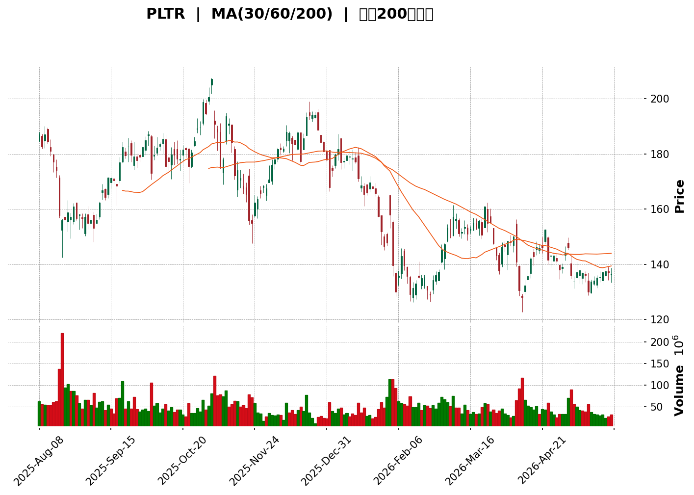
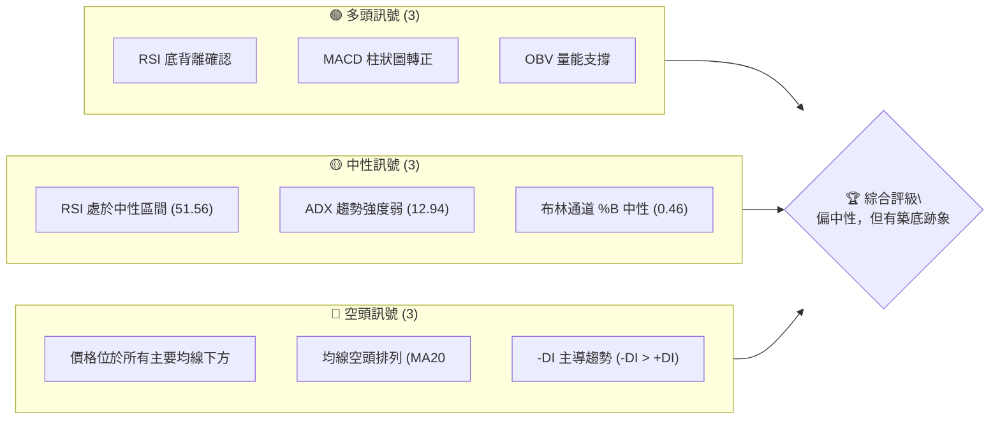
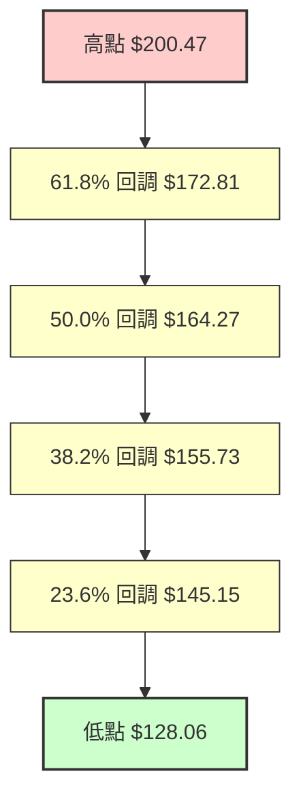
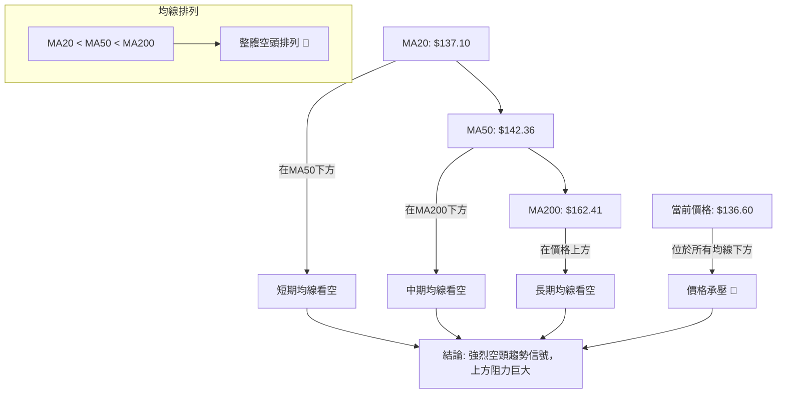

<details>
<summary>📊 靜態圖表 (點擊展開)</summary>

</details>

<html>
<head><meta charset="utf-8" /></head>
<body>
    <div>                        <script>window.PlotlyConfig = {MathJaxConfig: 'local'};</script>
        <script charset="utf-8" src="https://cdn.plot.ly/plotly-3.5.0.min.js" integrity="sha256-fHbNLP+GlIXN+efbQec78UkemUz3NJp7UmfGxC1tNxs=" crossorigin="anonymous"></script>                <div id="candlestick-chart" class="plotly-graph-div" style="height:500px; width:100%;"></div>            <script>                window.PLOTLYENV=window.PLOTLYENV || {};                                if (document.getElementById("candlestick-chart")) {                    Plotly.newPlot(                        "candlestick-chart",                        [{"close":{"dtype":"f8","bdata":"AAAAYLheZ0AAAACAwtVmQAAAAEAKX2dAAAAAANcLZ0AAAADgo6BmQAAAAKBwJWZAAAAAwPXAZUAAAAAAALhjQAAAAOBRgGNAAAAAgMKFY0AAAAAgrtdjQAAAAKBwpWNAAAAAANcbZEAAAABACpdjQAAAAADXw2NAAAAAYLiWY0AAAABA4aJjQAAAAMDMXGNAAAAA4HqEY0AAAAAghSNjQAAAAEAzg2NAAAAAIIVLZEAAAAAgrtdkQAAAACCFi2RAAAAAgMJtZUAAAABguGZlQAAAAOBRSGVAAAAAYI8KZUAAAABACh9mQAAAAOB6zGZAAAAAYI9qZkAAAACgmdFmQAAAAIDrcWZAAAAAANdjZkAAAACAPTJmQAAAACCFW2ZAAAAAoHDNZkAAAABgZh5nQAAAAKCZYWdAAAAAgD2iZUAAAADA9XBmQAAAAKBwxWZAAAAAgOvxZkAAAABACi9nQAAAAIAU7mVAAAAAYLgmZkAAAAAgrndmQAAAAADXc2ZAAAAAANdDZkAAAADAzERmQAAAAEDhsmZAAAAA4FGwZkAAAAAgru9lQAAAACBcj2ZAAAAAACkUZ0AAAACAwqVnQAAAAEAzs2dAAAAAgOvZaEAAAACgmVFoQAAAAEAKD2lAAAAAgMLlaUAAAAAgrtdnQAAAAMDMfGdAAAAAoJnhZUAAAACAwj1mQAAAACCFM2hAAAAAYLjeZ0AAAACgcAVnQAAAAOB6hGVAAAAA4FHAZUAAAAAAAGhlQAAAAGCP6mRAAAAAoHCtZEAAAAAA13djQAAAAEAzW2NAAAAAAABIZEAAAACgmXFkQAAAAOCjuGRAAAAAYGYOZUAAAAAgru9kQAAAAIAUVmVAAAAAYI8CZkAAAACgcD1mQAAAAOBRuGZAAAAAIK6vZkAAAABA4bpmQAAAAMAefWdAAAAAoEdxZ0AAAACAPfJmQAAAAAAA6GZAAAAAAAB4Z0AAAACgRylmQAAAAIAUNmdAAAAAACksaEAAAAAgXD9oQAAAAAApRGhAAAAAoHBFaEAAAABguJZnQAAAAIDCBWdAAAAAQOGaZkAAAAAAADhmQAAAACCF+2RAAAAAoEfBZUAAAABguHZmQAAAAIDCtWZAAAAAIIUbZkAAAAAgri9mQAAAAMAebWZAAAAAYLheZkAAAADAzExmQAAAAIA9ImZAAAAAYLheZUAAAADA9RBlQAAAAGCPqmRAAAAAwMy8ZEAAAABAMzNlQAAAAEAK72RAAAAAYGa2ZEAAAABAM6tjQAAAACCF+2JAAAAAQOFSYkAAAADgUXhiQAAAAAApvGNAAAAAoEdxYUAAAADgUUBgQAAAAMDM\u002fGBAAAAAwB7dYUAAAADgUXBhQAAAAIDC9WBAAAAAACkkYEAAAADAHm1gQAAAAOCjoGBAAAAAACnsYEAAAADgetxgQAAAACCu52BAAAAAQDNTYEAAAABA4RpgQAAAAIAUxmBAAAAAgBT+YEAAAACAFCZhQAAAAKBwJWJAAAAAQApnYkAAAACAFCZjQAAAAKBwFWNAAAAAwB6lY0AAAACAwo1jQAAAAOB65GJAAAAAQDPzYkAAAAAAADBjQAAAAGBm3mJAAAAAQAoXY0AAAABgj2JjQAAAAOCjGGNAAAAAgMJ1Y0AAAACAwtViQAAAAEDhGmRAAAAAwPVYY0AAAABguF5jQAAAAIDrcWJAAAAAgOvhYUAAAACgmTFhQAAAAMD1SGJAAAAAIK5PYkAAAABguI5iQAAAAIDCfWJAAAAAgD3CYkAAAADgUZhhQAAAACCuT2BAAAAAgOsBYEAAAAAA14tgQAAAAGBm9mBAAAAAwMzEYUAAAADgUdhhQAAAAOB6TGJAAAAA4Ho8YkAAAABACj9iQAAAAADXE2NAAAAAgD2yYUAAAABA4eJhQAAAAEAz42FAAAAAgMKlYUAAAABACj9hQAAAACCFY2FAAAAAgD0CYkAAAADA9UBiQAAAAMAe\u002fWBAAAAAoEe5YEAAAACgmSFhQAAAAKCZOWFAAAAA4HocYUAAAAAAAABhQAAAAKCZQWBAAAAAIFy3YEAAAAAgrr9gQAAAAOB65GBAAAAA4FHoYEAAAADAzCRhQAAAAKBHLWFAAAAAACkcYUAAAABAMxNhQA=="},"high":{"dtype":"f8","bdata":"AAAAIK5\u002fZ0AAAACAwmVnQAAAAAAAwGdAAAAAYLiuZ0AAAABgjypnQAAAAAAAgGZAAAAAwMw8ZkAAAACgmYllQAAAAGC4jmNAAAAAQAq\u002fY0AAAABgZmZkQAAAAEDh0mNAAAAAAClEZEAAAADAzExkQAAAACBcx2NAAAAAoHDNY0AAAADgesxjQAAAAMDMJGRAAAAAoEehY0AAAABACt9jQAAAAKCZyWNAAAAAAABYZEAAAAAAACBlQAAAAOCn7mRAAAAAwPVwZUAAAACgmXllQAAAAIDraWVAAAAAgMI1ZUAAAACgmVlmQAAAAKBwDWdAAAAAAADIZkAAAAAAADhnQAAAAEAzG2dAAAAAgD0KZ0AAAAAA14NmQAAAACBcr2ZAAAAA4KPYZkAAAADA9UhnQAAAAGBmhmdAAAAAQOFaZ0AAAABgZt5mQAAAAIDCRWdAAAAA4FEIZ0AAAAAA13NnQAAAAEAzY2dAAAAAQApnZkAAAABA4cpmQAAAAEAzC2dAAAAAgD0aZ0AAAABA4bJmQAAAAEDh4mZAAAAAwHLMZkAAAABguMZmQAAAAIDrsWZAAAAAoHBFZ0AAAABgjxpoQAAAAMD1+GdAAAAAQDP7aEAAAACgcPVoQAAAAIDChWlAAAAA4KPwaUAAAABgZnZoQAAAAIA9ymdAAAAAQOHiZ0AAAABgZlZmQAAAAIDCXWhAAAAAoJkdaEAAAABgj9JnQAAAAGBm1mZAAAAAoEcpZkAAAAAgrsdlQAAAAGCPmmVAAAAAQDMzZUAAAACAPdJlQAAAACCFw2NAAAAAoHClZEAAAADAzJRkQAAAACDZCmVAAAAAoJkZZUAAAABAMyNlQAAAAAAA+GVAAAAAwB49ZkAAAACAFE5mQAAAAGDlxGZAAAAAACn8ZkAAAABAM9tmQAAAAOB6zGdAAAAAoJmBZ0AAAADAzFBnQAAAAMD1eGdAAAAAAACQZ0AAAAAAAHhnQAAAAGCPamdAAAAAAABgaEAAAAAAKdxoQAAAAADXa2hAAAAAoHBlaEAAAABAM4toQAAAAGBmZmdAAAAAAFQXZ0AAAADA9bBmQAAAAEAzq2ZAAAAAgD36ZUAAAACAFIZmQAAAAMD1aGdAAAAAwB41Z0AAAABACldmQAAAAAAA0GZAAAAAQDOjZkAAAADgIrNmQAAAAEAzk2ZAAAAAgMLNZkAAAABACn9lQAAAACCuL2VAAAAAAAAgZUAAAAAAAIBlQAAAAEDhUmVAAAAAgBQuZUAAAACgcKFkQAAAAAAptGNAAAAAAADgYkAAAADAzOxiQAAAAAB\u002fomRAAAAAQDN7Y0AAAAAgXD9hQAAAAOD7NWFAAAAAANc7YkAAAACA6zFiQAAAAAAAaGFAAAAA4Hr8YEAAAACA67FgQAAAAIA9ymBAAAAA4NCeYUAAAADAHgVhQAAAAGC4BmFAAAAAoEeBYEAAAAAgrkdgQAAAAEDhAmFAAAAA4FEwYUAAAABAM0NhQAAAAOB6ZGJAAAAAAABwYkAAAADgo1BjQAAAAAApjGNAAAAAYGYuZEAAAACAFM5jQAAAACAGlWNAAAAAgGglY0AAAAAAKXxjQAAAAIDrUWNAAAAAIIU7Y0AAAAAAAJhjQAAAAIAUlmNAAAAAwMyEY0AAAADAzJRjQAAAAGCPImRAAAAAwMxMZEAAAADgowhkQAAAAADXI2NAAAAAYLg+YkAAAAAA1wNiQAAAACCFe2JAAAAAoJmJYkAAAADgUZBiQAAAACCF02JAAAAA4KPIYkAAAADA9YhjQAAAAKBHcWFAAAAAYGYmYEAAAACgcM1gQAAAAIA9QmFAAAAAYI\u002fSYUAAAACgmTFiQAAAAMD1iGJAAAAAYGZmYkAAAAAA17tiQAAAAIDCFWNAAAAAoEfJYkAAAABgj+phQAAAAIA9ImJAAAAAQDP7YUAAAADgUXhhQAAAAGBmhmFAAAAAgBROYkAAAADgerRiQAAAACBc32FAAAAAYGb2YEAAAABgZp5hQAAAAAApPGFAAAAA4HokYUAAAACAwi1hQAAAACCuH2FAAAAAIFzPYEAAAADgevRgQAAAAIDr\u002fWBAAAAAQAovYUAAAAAgridhQAAAAKCZUWFAAAAA4KNgYUAAAACAwlVhQA=="},"hovertemplate":"\u003cb\u003e%{x|%Y-%m-%d}\u003c\u002fb\u003e\u003cbr\u003e\u958b: $%{open:.2f}\u003cbr\u003e\u9ad8: $%{high:.2f}\u003cbr\u003e\u4f4e: $%{low:.2f}\u003cbr\u003e\u6536: $%{close:.2f}\u003cextra\u003e\u003c\u002fextra\u003e","low":{"dtype":"f8","bdata":"AAAAwB4NZ0AAAACgcL1mQAAAAEAzw2ZAAAAAQOHyZkAAAABgZmZmQAAAAAAprGVAAAAA4HpsZUAAAADAzJxjQAAAAEDhymFAAAAAgOs5Y0AAAADgo\u002fhiQAAAAADXq2JAAAAAgD1SY0AAAAAgXH9jQAAAAKCZEWNAAAAAAAAgY0AAAADA9chiQAAAAGC4FmNAAAAAwB4lY0AAAACgR4FiQAAAAEDhWmNAAAAAANeLY0AAAACAFG5kQAAAAEAKZ2RAAAAA4FGAZEAAAADAHu1kQAAAAGC4HmVAAAAA4KMoZEAAAADgeixlQAAAAGC4FmZAAAAAoEdJZkAAAADgUSBmQAAAAADXI2ZAAAAAoEfJZUAAAADAHt1lQAAAAMAeJWZAAAAAQApHZkAAAAAAAHBmQAAAAGBm3mZAAAAA4KNYZUAAAABgjzpmQAAAAKBwbWZAAAAAYGamZkAAAABgZn5mQAAAAMD1sGVAAAAAYGauZUAAAACAPVplQAAAAOCjAGZAAAAAYGYOZkAAAABgZr5lQAAAAIAULmZAAAAAwMxUZkAAAACgcC1lQAAAAOBR4GVAAAAAQDPbZkAAAADgo3BnQAAAAMD1WGdAAAAAIK7PZ0AAAAAA10NoQAAAAKBwvWhAAAAAgD06aUAAAACA6zFnQAAAAGC4pmZAAAAAwPXQZUAAAADAHh1lQAAAAOCj8GZAAAAAAClkZ0AAAADAzIxmQAAAAGBkV2VAAAAAAACQZEAAAACAwvVkQAAAAAAAsGRAAAAAoHBNZEAAAADgo0xjQAAAAIDrcWJAAAAAAACgY0AAAACAwpFjQAAAAAApfGRAAAAAAAC8ZEAAAAAA12NkQAAAAEDhMmVAAAAAYI8aZUAAAACAws1lQAAAAMAeJWZAAAAAoEdxZkAAAAAAKYxmQAAAAAAA2GZAAAAAYLiGZkAAAAAgWDVmQAAAAMD1gGZAAAAAQIukZkAAAAAAABBmQAAAAOBRsGZAAAAAIFxXZ0AAAACAwg1oQAAAACCF92dAAAAAYI8aaEAAAAAA15NnQAAAAOB69GZAAAAAYGaWZkAAAAAAAChmQAAAAEAzy2RAAAAAoEd5ZUAAAADgo9hlQAAAAMAeNWZAAAAAANfLZUAAAAAAANhlQAAAAEDhCmZAAAAA4HoEZkAAAABgZr5lQAAAAMD1EGZAAAAA4FFAZUAAAAAgrsdkQAAAACCFI2RAAAAAYGaeZEAAAACgmclkQAAAAGBm6mRAAAAAgBSWZEAAAAAgrqdjQAAAAADXY2JAAAAAwHIkYkAAAACg7VRiQAAAAADXI2NAAAAAgML1YEAAAACAPQpgQAAAAEAzi2BAAAAAANXYYEAAAADgozhhQAAAAGBmnmBAAAAAANejX0AAAACA6Y5fQAAAAGCP0l9AAAAAANfbYEAAAADgUWBgQAAAAKBwZWBAAAAAwPXYX0AAAAAgrpdfQAAAAIDCJWBAAAAAACmUYEAAAAAgXL9gQAAAAOCjkGFAAAAAYGZGYUAAAACA64FiQAAAACCFs2JAAAAAoEfJYkAAAABACh9jQAAAAOB6xGJAAAAAYI+qYkAAAAAgXN9iQAAAAGCPkmJAAAAAoHDlYkAAAAAA1wNjQAAAACCFE2NAAAAAAADQYkAAAABA4aJiQAAAACCuJ2NAAAAA4Hr0YkAAAAAgXFtjQAAAAAAAaGJAAAAAgOuxYUAAAACgmQlhQAAAAEAKX2FAAAAAQAoPYkAAAAAgrj9hQAAAACAxVGJAAAAAYGYOYkAAAACgcGVhQAAAAEAKD2BAAAAAIIWrXkAAAADAzCRgQAAAAAAAwGBAAAAAgMLdYEAAAADA9XBhQAAAAKCZ6WFAAAAAYI\u002f6YUAAAADA9\u002f9hQAAAAMAebWJAAAAAoHB9YUAAAACAwl1hQAAAAOBRoGFAAAAAoHCNYUAAAACAwtVgQAAAAMDMFGFAAAAA4HqsYUAAAABAMydiQAAAAEAK12BAAAAAwMxkYEAAAADA9dhgQAAAAOCjoGBAAAAAAKyYYEAAAABguK5gQAAAAAAAGGBAAAAAYGYuYEAAAACgR4lgQAAAAGCPamBAAAAAQDOzYEAAAACgcI1gQAAAAKBw7WBAAAAAoJnJYEAAAACgmalgQA=="},"name":"\u50f9\u683c","open":{"dtype":"f8","bdata":"AAAAIIUXZ0AAAABACk9nQAAAAGBmFmdAAAAAAACgZ0AAAADAHs1mQAAAAEAzd2ZAAAAA4KPoZUAAAAAghWtlQAAAAKCZCWNAAAAAoHClY0AAAACAFGpjQAAAAEAzg2NAAAAA4HpsY0AAAACAPUpkQAAAAAAptGNAAAAAIFyfY0AAAABgZuZiQAAAAAAAwGNAAAAAIK5bY0AAAACAPbpjQAAAAMAeXWNAAAAAAACoY0AAAAAAAMBkQAAAACCu52RAAAAAQDOrZEAAAABAMzNlQAAAAKBHYWVAAAAA4KMgZUAAAADgo0hlQAAAAIA9ImZAAAAAACmcZkAAAADgUdBmQAAAAMAe\u002fWZAAAAAoJn5ZUAAAACgmWFmQAAAAOB6dGZAAAAAIFxfZkAAAACAPapmQAAAAGBmVmdAAAAAwMxMZ0AAAACAwmVmQAAAAIDriWZAAAAAoJnZZkAAAABgj\u002fJmQAAAAKBwJWdAAAAAgMJVZkAAAAAAAABmQAAAAMD1tGZAAAAAwPW4ZkAAAAAAADhmQAAAACCub2ZAAAAAgOvBZkAAAACAwr1mQAAAAIA97mVAAAAAACncZkAAAABACp9nQAAAACBcr2dAAAAAYI\u002fiZ0AAAACgmc1oQAAAAGBm5mhAAAAAoHChaUAAAACAPQJoQAAAAAAAoGdAAAAAIK5\u002fZ0AAAADAzKRlQAAAAIDrCWdAAAAAYLjKZ0AAAABgj9JnQAAAAEDhtmZAAAAAQDPfZEAAAADA9VBlQAAAAADXC2VAAAAAoJn5ZEAAAACAPYJlQAAAAOBRgGNAAAAAQAqvY0AAAACAPQJkQAAAAEAz22RAAAAA4FH4ZEAAAAAAAKBkQAAAAEDhMmVAAAAA4HpEZUAAAAAgrgtmQAAAACBcR2ZAAAAAYLjGZkAAAABACp9mQAAAAGBmHmdAAAAAoJkZZ0AAAACA6zlnQAAAAGCPImdAAAAAwPW0ZkAAAABA4XZnQAAAAOBRsGZAAAAAIK5XZ0AAAACgR2FoQAAAAGBmGmhAAAAAwB4laEAAAADgemBoQAAAAEAzW2dAAAAAQDMLZ0AAAAAAKaRmQAAAAKCZqWZAAAAAACncZUAAAADgUfhlQAAAAKCZeWZAAAAAIK4zZ0AAAADgoyBmQAAAAIDrNWZAAAAAAABcZkAAAAAAAERmQAAAAGC4VmZAAAAAIIVrZkAAAAAAAPRkQAAAACDdDGVAAAAAoJkdZUAAAADgo+hkQAAAAGC4BmVAAAAAIFzvZEAAAADAzIxkQAAAAAAptGNAAAAAoJnBYkAAAACAFN5iQAAAAKCZoWRAAAAAwB5tY0AAAACAPRphQAAAAGCP6mBAAAAAYI8SYUAAAABA4R5iQAAAAMDMYGFAAAAAIIXrYEAAAACgmflfQAAAAOCjHGBAAAAA4Hr8YEAAAACA64lgQAAAACCui2BAAAAAoEeBYEAAAAAAKSBgQAAAACCFU2BAAAAAQAq7YEAAAACAPcJgQAAAAMDMmGFAAAAAQDPDYUAAAACAwo1iQAAAAIAUHmNAAAAAgBTOYkAAAACAFHZjQAAAACCuf2NAAAAAACnsYkAAAADgUSBjQAAAAKCZKWNAAAAAYGYOY0AAAADA9QxjQAAAAIA9XmNAAAAAQDMjY0AAAABgZmZjQAAAACCuJ2NAAAAAgD0CZEAAAACgcK1jQAAAAIDCIWNAAAAAACk8YkAAAADgo+hhQAAAAOCjgGFAAAAAAABgYkAAAAAghe9hQAAAACCFi2JAAAAAYDlcYkAAAADgelhjQAAAAOCjbGFAAAAAIFwPYEAAAAAgXEdgQAAAAACqzWBAAAAAoEcZYUAAAACgRwliQAAAAIAUKmJAAAAAAAAgYkAAAACA61liQAAAACCFi2JAAAAAYGa2YkAAAABguN5hQAAAAAAAqGFAAAAAoJnJYUAAAADgUXhhQAAAAEAzT2FAAAAAAADoYUAAAAAAAHhiQAAAAKBwiWFAAAAAYLi2YEAAAABAM+NgQAAAACCu+2BAAAAAwB7dYEAAAABAMxNhQAAAACAxwGBAAAAAwMw0YEAAAACgmZlgQAAAAAAAkGBAAAAAoHDlYEAAAADgo8RgQAAAAKCZ+WBAAAAAoJktYUAAAACgcAVhQA=="},"x":["2025-08-08T00:00:00-04:00","2025-08-11T00:00:00-04:00","2025-08-12T00:00:00-04:00","2025-08-13T00:00:00-04:00","2025-08-14T00:00:00-04:00","2025-08-15T00:00:00-04:00","2025-08-18T00:00:00-04:00","2025-08-19T00:00:00-04:00","2025-08-20T00:00:00-04:00","2025-08-21T00:00:00-04:00","2025-08-22T00:00:00-04:00","2025-08-25T00:00:00-04:00","2025-08-26T00:00:00-04:00","2025-08-27T00:00:00-04:00","2025-08-28T00:00:00-04:00","2025-08-29T00:00:00-04:00","2025-09-02T00:00:00-04:00","2025-09-03T00:00:00-04:00","2025-09-04T00:00:00-04:00","2025-09-05T00:00:00-04:00","2025-09-08T00:00:00-04:00","2025-09-09T00:00:00-04:00","2025-09-10T00:00:00-04:00","2025-09-11T00:00:00-04:00","2025-09-12T00:00:00-04:00","2025-09-15T00:00:00-04:00","2025-09-16T00:00:00-04:00","2025-09-17T00:00:00-04:00","2025-09-18T00:00:00-04:00","2025-09-19T00:00:00-04:00","2025-09-22T00:00:00-04:00","2025-09-23T00:00:00-04:00","2025-09-24T00:00:00-04:00","2025-09-25T00:00:00-04:00","2025-09-26T00:00:00-04:00","2025-09-29T00:00:00-04:00","2025-09-30T00:00:00-04:00","2025-10-01T00:00:00-04:00","2025-10-02T00:00:00-04:00","2025-10-03T00:00:00-04:00","2025-10-06T00:00:00-04:00","2025-10-07T00:00:00-04:00","2025-10-08T00:00:00-04:00","2025-10-09T00:00:00-04:00","2025-10-10T00:00:00-04:00","2025-10-13T00:00:00-04:00","2025-10-14T00:00:00-04:00","2025-10-15T00:00:00-04:00","2025-10-16T00:00:00-04:00","2025-10-17T00:00:00-04:00","2025-10-20T00:00:00-04:00","2025-10-21T00:00:00-04:00","2025-10-22T00:00:00-04:00","2025-10-23T00:00:00-04:00","2025-10-24T00:00:00-04:00","2025-10-27T00:00:00-04:00","2025-10-28T00:00:00-04:00","2025-10-29T00:00:00-04:00","2025-10-30T00:00:00-04:00","2025-10-31T00:00:00-04:00","2025-11-03T00:00:00-05:00","2025-11-04T00:00:00-05:00","2025-11-05T00:00:00-05:00","2025-11-06T00:00:00-05:00","2025-11-07T00:00:00-05:00","2025-11-10T00:00:00-05:00","2025-11-11T00:00:00-05:00","2025-11-12T00:00:00-05:00","2025-11-13T00:00:00-05:00","2025-11-14T00:00:00-05:00","2025-11-17T00:00:00-05:00","2025-11-18T00:00:00-05:00","2025-11-19T00:00:00-05:00","2025-11-20T00:00:00-05:00","2025-11-21T00:00:00-05:00","2025-11-24T00:00:00-05:00","2025-11-25T00:00:00-05:00","2025-11-26T00:00:00-05:00","2025-11-28T00:00:00-05:00","2025-12-01T00:00:00-05:00","2025-12-02T00:00:00-05:00","2025-12-03T00:00:00-05:00","2025-12-04T00:00:00-05:00","2025-12-05T00:00:00-05:00","2025-12-08T00:00:00-05:00","2025-12-09T00:00:00-05:00","2025-12-10T00:00:00-05:00","2025-12-11T00:00:00-05:00","2025-12-12T00:00:00-05:00","2025-12-15T00:00:00-05:00","2025-12-16T00:00:00-05:00","2025-12-17T00:00:00-05:00","2025-12-18T00:00:00-05:00","2025-12-19T00:00:00-05:00","2025-12-22T00:00:00-05:00","2025-12-23T00:00:00-05:00","2025-12-24T00:00:00-05:00","2025-12-26T00:00:00-05:00","2025-12-29T00:00:00-05:00","2025-12-30T00:00:00-05:00","2025-12-31T00:00:00-05:00","2026-01-02T00:00:00-05:00","2026-01-05T00:00:00-05:00","2026-01-06T00:00:00-05:00","2026-01-07T00:00:00-05:00","2026-01-08T00:00:00-05:00","2026-01-09T00:00:00-05:00","2026-01-12T00:00:00-05:00","2026-01-13T00:00:00-05:00","2026-01-14T00:00:00-05:00","2026-01-15T00:00:00-05:00","2026-01-16T00:00:00-05:00","2026-01-20T00:00:00-05:00","2026-01-21T00:00:00-05:00","2026-01-22T00:00:00-05:00","2026-01-23T00:00:00-05:00","2026-01-26T00:00:00-05:00","2026-01-27T00:00:00-05:00","2026-01-28T00:00:00-05:00","2026-01-29T00:00:00-05:00","2026-01-30T00:00:00-05:00","2026-02-02T00:00:00-05:00","2026-02-03T00:00:00-05:00","2026-02-04T00:00:00-05:00","2026-02-05T00:00:00-05:00","2026-02-06T00:00:00-05:00","2026-02-09T00:00:00-05:00","2026-02-10T00:00:00-05:00","2026-02-11T00:00:00-05:00","2026-02-12T00:00:00-05:00","2026-02-13T00:00:00-05:00","2026-02-17T00:00:00-05:00","2026-02-18T00:00:00-05:00","2026-02-19T00:00:00-05:00","2026-02-20T00:00:00-05:00","2026-02-23T00:00:00-05:00","2026-02-24T00:00:00-05:00","2026-02-25T00:00:00-05:00","2026-02-26T00:00:00-05:00","2026-02-27T00:00:00-05:00","2026-03-02T00:00:00-05:00","2026-03-03T00:00:00-05:00","2026-03-04T00:00:00-05:00","2026-03-05T00:00:00-05:00","2026-03-06T00:00:00-05:00","2026-03-09T00:00:00-04:00","2026-03-10T00:00:00-04:00","2026-03-11T00:00:00-04:00","2026-03-12T00:00:00-04:00","2026-03-13T00:00:00-04:00","2026-03-16T00:00:00-04:00","2026-03-17T00:00:00-04:00","2026-03-18T00:00:00-04:00","2026-03-19T00:00:00-04:00","2026-03-20T00:00:00-04:00","2026-03-23T00:00:00-04:00","2026-03-24T00:00:00-04:00","2026-03-25T00:00:00-04:00","2026-03-26T00:00:00-04:00","2026-03-27T00:00:00-04:00","2026-03-30T00:00:00-04:00","2026-03-31T00:00:00-04:00","2026-04-01T00:00:00-04:00","2026-04-02T00:00:00-04:00","2026-04-06T00:00:00-04:00","2026-04-07T00:00:00-04:00","2026-04-08T00:00:00-04:00","2026-04-09T00:00:00-04:00","2026-04-10T00:00:00-04:00","2026-04-13T00:00:00-04:00","2026-04-14T00:00:00-04:00","2026-04-15T00:00:00-04:00","2026-04-16T00:00:00-04:00","2026-04-17T00:00:00-04:00","2026-04-20T00:00:00-04:00","2026-04-21T00:00:00-04:00","2026-04-22T00:00:00-04:00","2026-04-23T00:00:00-04:00","2026-04-24T00:00:00-04:00","2026-04-27T00:00:00-04:00","2026-04-28T00:00:00-04:00","2026-04-29T00:00:00-04:00","2026-04-30T00:00:00-04:00","2026-05-01T00:00:00-04:00","2026-05-04T00:00:00-04:00","2026-05-05T00:00:00-04:00","2026-05-06T00:00:00-04:00","2026-05-07T00:00:00-04:00","2026-05-08T00:00:00-04:00","2026-05-11T00:00:00-04:00","2026-05-12T00:00:00-04:00","2026-05-13T00:00:00-04:00","2026-05-14T00:00:00-04:00","2026-05-15T00:00:00-04:00","2026-05-18T00:00:00-04:00","2026-05-19T00:00:00-04:00","2026-05-20T00:00:00-04:00","2026-05-21T00:00:00-04:00","2026-05-22T00:00:00-04:00","2026-05-26T00:00:00-04:00"],"type":"candlestick"},{"hovertemplate":"MA30: $%{y:.2f}\u003cextra\u003e\u003c\u002fextra\u003e","line":{"color":"#2196F3","dash":"dash","width":2},"mode":"lines","name":"MA30","x":["2025-08-08T00:00:00-04:00","2025-08-11T00:00:00-04:00","2025-08-12T00:00:00-04:00","2025-08-13T00:00:00-04:00","2025-08-14T00:00:00-04:00","2025-08-15T00:00:00-04:00","2025-08-18T00:00:00-04:00","2025-08-19T00:00:00-04:00","2025-08-20T00:00:00-04:00","2025-08-21T00:00:00-04:00","2025-08-22T00:00:00-04:00","2025-08-25T00:00:00-04:00","2025-08-26T00:00:00-04:00","2025-08-27T00:00:00-04:00","2025-08-28T00:00:00-04:00","2025-08-29T00:00:00-04:00","2025-09-02T00:00:00-04:00","2025-09-03T00:00:00-04:00","2025-09-04T00:00:00-04:00","2025-09-05T00:00:00-04:00","2025-09-08T00:00:00-04:00","2025-09-09T00:00:00-04:00","2025-09-10T00:00:00-04:00","2025-09-11T00:00:00-04:00","2025-09-12T00:00:00-04:00","2025-09-15T00:00:00-04:00","2025-09-16T00:00:00-04:00","2025-09-17T00:00:00-04:00","2025-09-18T00:00:00-04:00","2025-09-19T00:00:00-04:00","2025-09-22T00:00:00-04:00","2025-09-23T00:00:00-04:00","2025-09-24T00:00:00-04:00","2025-09-25T00:00:00-04:00","2025-09-26T00:00:00-04:00","2025-09-29T00:00:00-04:00","2025-09-30T00:00:00-04:00","2025-10-01T00:00:00-04:00","2025-10-02T00:00:00-04:00","2025-10-03T00:00:00-04:00","2025-10-06T00:00:00-04:00","2025-10-07T00:00:00-04:00","2025-10-08T00:00:00-04:00","2025-10-09T00:00:00-04:00","2025-10-10T00:00:00-04:00","2025-10-13T00:00:00-04:00","2025-10-14T00:00:00-04:00","2025-10-15T00:00:00-04:00","2025-10-16T00:00:00-04:00","2025-10-17T00:00:00-04:00","2025-10-20T00:00:00-04:00","2025-10-21T00:00:00-04:00","2025-10-22T00:00:00-04:00","2025-10-23T00:00:00-04:00","2025-10-24T00:00:00-04:00","2025-10-27T00:00:00-04:00","2025-10-28T00:00:00-04:00","2025-10-29T00:00:00-04:00","2025-10-30T00:00:00-04:00","2025-10-31T00:00:00-04:00","2025-11-03T00:00:00-05:00","2025-11-04T00:00:00-05:00","2025-11-05T00:00:00-05:00","2025-11-06T00:00:00-05:00","2025-11-07T00:00:00-05:00","2025-11-10T00:00:00-05:00","2025-11-11T00:00:00-05:00","2025-11-12T00:00:00-05:00","2025-11-13T00:00:00-05:00","2025-11-14T00:00:00-05:00","2025-11-17T00:00:00-05:00","2025-11-18T00:00:00-05:00","2025-11-19T00:00:00-05:00","2025-11-20T00:00:00-05:00","2025-11-21T00:00:00-05:00","2025-11-24T00:00:00-05:00","2025-11-25T00:00:00-05:00","2025-11-26T00:00:00-05:00","2025-11-28T00:00:00-05:00","2025-12-01T00:00:00-05:00","2025-12-02T00:00:00-05:00","2025-12-03T00:00:00-05:00","2025-12-04T00:00:00-05:00","2025-12-05T00:00:00-05:00","2025-12-08T00:00:00-05:00","2025-12-09T00:00:00-05:00","2025-12-10T00:00:00-05:00","2025-12-11T00:00:00-05:00","2025-12-12T00:00:00-05:00","2025-12-15T00:00:00-05:00","2025-12-16T00:00:00-05:00","2025-12-17T00:00:00-05:00","2025-12-18T00:00:00-05:00","2025-12-19T00:00:00-05:00","2025-12-22T00:00:00-05:00","2025-12-23T00:00:00-05:00","2025-12-24T00:00:00-05:00","2025-12-26T00:00:00-05:00","2025-12-29T00:00:00-05:00","2025-12-30T00:00:00-05:00","2025-12-31T00:00:00-05:00","2026-01-02T00:00:00-05:00","2026-01-05T00:00:00-05:00","2026-01-06T00:00:00-05:00","2026-01-07T00:00:00-05:00","2026-01-08T00:00:00-05:00","2026-01-09T00:00:00-05:00","2026-01-12T00:00:00-05:00","2026-01-13T00:00:00-05:00","2026-01-14T00:00:00-05:00","2026-01-15T00:00:00-05:00","2026-01-16T00:00:00-05:00","2026-01-20T00:00:00-05:00","2026-01-21T00:00:00-05:00","2026-01-22T00:00:00-05:00","2026-01-23T00:00:00-05:00","2026-01-26T00:00:00-05:00","2026-01-27T00:00:00-05:00","2026-01-28T00:00:00-05:00","2026-01-29T00:00:00-05:00","2026-01-30T00:00:00-05:00","2026-02-02T00:00:00-05:00","2026-02-03T00:00:00-05:00","2026-02-04T00:00:00-05:00","2026-02-05T00:00:00-05:00","2026-02-06T00:00:00-05:00","2026-02-09T00:00:00-05:00","2026-02-10T00:00:00-05:00","2026-02-11T00:00:00-05:00","2026-02-12T00:00:00-05:00","2026-02-13T00:00:00-05:00","2026-02-17T00:00:00-05:00","2026-02-18T00:00:00-05:00","2026-02-19T00:00:00-05:00","2026-02-20T00:00:00-05:00","2026-02-23T00:00:00-05:00","2026-02-24T00:00:00-05:00","2026-02-25T00:00:00-05:00","2026-02-26T00:00:00-05:00","2026-02-27T00:00:00-05:00","2026-03-02T00:00:00-05:00","2026-03-03T00:00:00-05:00","2026-03-04T00:00:00-05:00","2026-03-05T00:00:00-05:00","2026-03-06T00:00:00-05:00","2026-03-09T00:00:00-04:00","2026-03-10T00:00:00-04:00","2026-03-11T00:00:00-04:00","2026-03-12T00:00:00-04:00","2026-03-13T00:00:00-04:00","2026-03-16T00:00:00-04:00","2026-03-17T00:00:00-04:00","2026-03-18T00:00:00-04:00","2026-03-19T00:00:00-04:00","2026-03-20T00:00:00-04:00","2026-03-23T00:00:00-04:00","2026-03-24T00:00:00-04:00","2026-03-25T00:00:00-04:00","2026-03-26T00:00:00-04:00","2026-03-27T00:00:00-04:00","2026-03-30T00:00:00-04:00","2026-03-31T00:00:00-04:00","2026-04-01T00:00:00-04:00","2026-04-02T00:00:00-04:00","2026-04-06T00:00:00-04:00","2026-04-07T00:00:00-04:00","2026-04-08T00:00:00-04:00","2026-04-09T00:00:00-04:00","2026-04-10T00:00:00-04:00","2026-04-13T00:00:00-04:00","2026-04-14T00:00:00-04:00","2026-04-15T00:00:00-04:00","2026-04-16T00:00:00-04:00","2026-04-17T00:00:00-04:00","2026-04-20T00:00:00-04:00","2026-04-21T00:00:00-04:00","2026-04-22T00:00:00-04:00","2026-04-23T00:00:00-04:00","2026-04-24T00:00:00-04:00","2026-04-27T00:00:00-04:00","2026-04-28T00:00:00-04:00","2026-04-29T00:00:00-04:00","2026-04-30T00:00:00-04:00","2026-05-01T00:00:00-04:00","2026-05-04T00:00:00-04:00","2026-05-05T00:00:00-04:00","2026-05-06T00:00:00-04:00","2026-05-07T00:00:00-04:00","2026-05-08T00:00:00-04:00","2026-05-11T00:00:00-04:00","2026-05-12T00:00:00-04:00","2026-05-13T00:00:00-04:00","2026-05-14T00:00:00-04:00","2026-05-15T00:00:00-04:00","2026-05-18T00:00:00-04:00","2026-05-19T00:00:00-04:00","2026-05-20T00:00:00-04:00","2026-05-21T00:00:00-04:00","2026-05-22T00:00:00-04:00","2026-05-26T00:00:00-04:00"],"y":{"dtype":"f8","bdata":"AAAAAAAA+H8AAAAAAAD4fwAAAAAAAPh\u002fAAAAAAAA+H8AAAAAAAD4fwAAAAAAAPh\u002fAAAAAAAA+H8AAAAAAAD4fwAAAAAAAPh\u002fAAAAAAAA+H8AAAAAAAD4fwAAAAAAAPh\u002fAAAAAAAA+H8AAAAAAAD4fwAAAAAAAPh\u002fAAAAAAAA+H8AAAAAAAD4fwAAAAAAAPh\u002fAAAAAAAA+H8AAAAAAAD4fwAAAAAAAPh\u002fAAAAAAAA+H8AAAAAAAD4fwAAAAAAAPh\u002fAAAAAAAA+H8AAAAAAAD4fwAAAAAAAPh\u002fAAAAAAAA+H8AAAAAAAD4f83MzExi2GRAzczMzD7QZEDe3d1NG9BkQBEREeEzyGRAd3d3R5rCZEAzMzMz7L5kQO\u002fu7q65wGRAZmZmtqzJZEAAAAAgsOZkQN7d3R3MB2VAd3d3N9AZZUBVVVVF\u002fS9lQAAAAPCnSmVAIiIi0ttiZUDNzMx8hoFlQBEREQEAlGVA7+7u3t2pZUBVVVXVBsJlQKuqqgpl3GVAvLu7C9fzZUAiIiKijA5mQJqZmRm9KWZAMzMzUyo+ZkCJiIiof0dmQN7d3X2xWGZAmpmZ+cVmZkCrqqr68HlmQHd3dxeSjmZAmpmZKRWvZkDNzMys1cFmQImIiLge1WZAAAAAoNPyZkCrqqoKkPtmQKuqqmp1BGdAmpmZCR4AZ0BmZmZWgABnQCIiIhI8EGdAAAAAEFgZZ0AiIiISgxhnQFVVVaWbCGdAMzMzU5wJZ0BVVVVVxwBnQGZmZgbz8GZAiYiImJndZkAAAACw5L1mQO\u002fu7j7up2ZAq6qqKvmXZkB3d3c3tIZmQO\u002fu7j7ud2ZAERERsZ1tZkDe3d3NPmJmQBEREWGeVmZAERERodNQZkDe3d0ta1NmQERERLTIVGZAZmZmRm9RZkB3d3f3mklmQLy7u3vNR2ZAVVVVBcg7ZkAAAADAETBmQKuqqoqzHWZAvLu72\u002fkIZkC8u7sbofplQCIiIqJF+GVAIiIi8tILZkCrqqqq8RxmQJqZmal\u002fHWZARERENOwgZkDe3d3twyVmQGZmZqabMmZAIiIisuQ5ZkARERGh00BmQKuqqlpkQWZAAAAAMJZKZkC8u7s7JmRmQLy7u5vEgGZAzczMHFqQZkCamZmpOJ9mQKuqqkrFrWZAmpmZOfu4ZkARERFhnsRmQLy7u4tsy2ZAIiIicvbFZkCamZlZ8rtmQN7d3d1rqmZAERERwcqZZkC8u7trvIxmQAAAAPDudmZAmpmZKaNfZkCrqqpaq0NmQKuqqsovImZA3t3dXUj2ZUBVVVW1yNZlQJqZmbkeuWVAAAAA0LB\u002fZUDNzMy8dDtlQAAAABBY\u002fWRAq6qqqqrGZECJiIjIL5JkQM3MzAx0XmRAZmZmxksnZEDe3d3d3fVjQJqZmTm00GNAiYiIeHenY0Dv7u6eqHdjQImIiGgfRmNAiYiIWMcUY0BmZmam4uBiQDMzM5OmsGJA7+7uPsOCYkC8u7srzlZiQHd3d1fHNGJAzczMvHQbYkBVVVXlFwtiQO\u002fu7t6W\u002fWFAVVVVRUT0YUCrqqr6N+ZhQM3MzMzM1GFAAAAAkMLFYUARERFBp8FhQDMzM8OuwGFAmpmZqTjHYUAzMzODB89hQERERCSUyWFAAAAAcMvaYUCamZm51\u002fBhQCIiIgJyC2JA7+7uThsYYkARERExlihiQJqZmTlCNWJAq6qqCh5EYkC8u7urqkpiQImIiIjPWGJA3t3dTalkYkAiIiLSInNiQImIiAisgGJAREREpHCVYkCJiIiYJ6JiQAAAAEA1nmJAvLu7e82VYkDNzMxMqZBiQLy7u1uPhmJAiYiI6CaBYkAiIiLSBnZiQGZmZvZTb2JAAAAAgE5jYkCamZk5JlhiQM3MzFy6WWJAERERgQdPYkARERHh7ENiQO\u002fu7k6NO2JA3t3dHT4vYkAiIiLy\u002fRxiQKuqqtprDmJA3t3djQkCYkC8u7vLE\u002f1hQO\u002fu7j584mFAMzMzkxjMYUAzMzPz\u002fbhhQCIiItKUrmFAAAAAAACoYUDv7u6+WKZhQAAAAOAIlWFAq6qqimyHYUBERERE\u002fXdhQO\u002fu7r5YamFAAAAAoIxaYUCrqqraslZhQGZmZtYVXmFAmpmZSX5nYUDNzMxcAWxhQA=="},"type":"scatter"},{"hovertemplate":"MA60: $%{y:.2f}\u003cextra\u003e\u003c\u002fextra\u003e","line":{"color":"#9C27B0","dash":"dash","width":2},"mode":"lines","name":"MA60","x":["2025-08-08T00:00:00-04:00","2025-08-11T00:00:00-04:00","2025-08-12T00:00:00-04:00","2025-08-13T00:00:00-04:00","2025-08-14T00:00:00-04:00","2025-08-15T00:00:00-04:00","2025-08-18T00:00:00-04:00","2025-08-19T00:00:00-04:00","2025-08-20T00:00:00-04:00","2025-08-21T00:00:00-04:00","2025-08-22T00:00:00-04:00","2025-08-25T00:00:00-04:00","2025-08-26T00:00:00-04:00","2025-08-27T00:00:00-04:00","2025-08-28T00:00:00-04:00","2025-08-29T00:00:00-04:00","2025-09-02T00:00:00-04:00","2025-09-03T00:00:00-04:00","2025-09-04T00:00:00-04:00","2025-09-05T00:00:00-04:00","2025-09-08T00:00:00-04:00","2025-09-09T00:00:00-04:00","2025-09-10T00:00:00-04:00","2025-09-11T00:00:00-04:00","2025-09-12T00:00:00-04:00","2025-09-15T00:00:00-04:00","2025-09-16T00:00:00-04:00","2025-09-17T00:00:00-04:00","2025-09-18T00:00:00-04:00","2025-09-19T00:00:00-04:00","2025-09-22T00:00:00-04:00","2025-09-23T00:00:00-04:00","2025-09-24T00:00:00-04:00","2025-09-25T00:00:00-04:00","2025-09-26T00:00:00-04:00","2025-09-29T00:00:00-04:00","2025-09-30T00:00:00-04:00","2025-10-01T00:00:00-04:00","2025-10-02T00:00:00-04:00","2025-10-03T00:00:00-04:00","2025-10-06T00:00:00-04:00","2025-10-07T00:00:00-04:00","2025-10-08T00:00:00-04:00","2025-10-09T00:00:00-04:00","2025-10-10T00:00:00-04:00","2025-10-13T00:00:00-04:00","2025-10-14T00:00:00-04:00","2025-10-15T00:00:00-04:00","2025-10-16T00:00:00-04:00","2025-10-17T00:00:00-04:00","2025-10-20T00:00:00-04:00","2025-10-21T00:00:00-04:00","2025-10-22T00:00:00-04:00","2025-10-23T00:00:00-04:00","2025-10-24T00:00:00-04:00","2025-10-27T00:00:00-04:00","2025-10-28T00:00:00-04:00","2025-10-29T00:00:00-04:00","2025-10-30T00:00:00-04:00","2025-10-31T00:00:00-04:00","2025-11-03T00:00:00-05:00","2025-11-04T00:00:00-05:00","2025-11-05T00:00:00-05:00","2025-11-06T00:00:00-05:00","2025-11-07T00:00:00-05:00","2025-11-10T00:00:00-05:00","2025-11-11T00:00:00-05:00","2025-11-12T00:00:00-05:00","2025-11-13T00:00:00-05:00","2025-11-14T00:00:00-05:00","2025-11-17T00:00:00-05:00","2025-11-18T00:00:00-05:00","2025-11-19T00:00:00-05:00","2025-11-20T00:00:00-05:00","2025-11-21T00:00:00-05:00","2025-11-24T00:00:00-05:00","2025-11-25T00:00:00-05:00","2025-11-26T00:00:00-05:00","2025-11-28T00:00:00-05:00","2025-12-01T00:00:00-05:00","2025-12-02T00:00:00-05:00","2025-12-03T00:00:00-05:00","2025-12-04T00:00:00-05:00","2025-12-05T00:00:00-05:00","2025-12-08T00:00:00-05:00","2025-12-09T00:00:00-05:00","2025-12-10T00:00:00-05:00","2025-12-11T00:00:00-05:00","2025-12-12T00:00:00-05:00","2025-12-15T00:00:00-05:00","2025-12-16T00:00:00-05:00","2025-12-17T00:00:00-05:00","2025-12-18T00:00:00-05:00","2025-12-19T00:00:00-05:00","2025-12-22T00:00:00-05:00","2025-12-23T00:00:00-05:00","2025-12-24T00:00:00-05:00","2025-12-26T00:00:00-05:00","2025-12-29T00:00:00-05:00","2025-12-30T00:00:00-05:00","2025-12-31T00:00:00-05:00","2026-01-02T00:00:00-05:00","2026-01-05T00:00:00-05:00","2026-01-06T00:00:00-05:00","2026-01-07T00:00:00-05:00","2026-01-08T00:00:00-05:00","2026-01-09T00:00:00-05:00","2026-01-12T00:00:00-05:00","2026-01-13T00:00:00-05:00","2026-01-14T00:00:00-05:00","2026-01-15T00:00:00-05:00","2026-01-16T00:00:00-05:00","2026-01-20T00:00:00-05:00","2026-01-21T00:00:00-05:00","2026-01-22T00:00:00-05:00","2026-01-23T00:00:00-05:00","2026-01-26T00:00:00-05:00","2026-01-27T00:00:00-05:00","2026-01-28T00:00:00-05:00","2026-01-29T00:00:00-05:00","2026-01-30T00:00:00-05:00","2026-02-02T00:00:00-05:00","2026-02-03T00:00:00-05:00","2026-02-04T00:00:00-05:00","2026-02-05T00:00:00-05:00","2026-02-06T00:00:00-05:00","2026-02-09T00:00:00-05:00","2026-02-10T00:00:00-05:00","2026-02-11T00:00:00-05:00","2026-02-12T00:00:00-05:00","2026-02-13T00:00:00-05:00","2026-02-17T00:00:00-05:00","2026-02-18T00:00:00-05:00","2026-02-19T00:00:00-05:00","2026-02-20T00:00:00-05:00","2026-02-23T00:00:00-05:00","2026-02-24T00:00:00-05:00","2026-02-25T00:00:00-05:00","2026-02-26T00:00:00-05:00","2026-02-27T00:00:00-05:00","2026-03-02T00:00:00-05:00","2026-03-03T00:00:00-05:00","2026-03-04T00:00:00-05:00","2026-03-05T00:00:00-05:00","2026-03-06T00:00:00-05:00","2026-03-09T00:00:00-04:00","2026-03-10T00:00:00-04:00","2026-03-11T00:00:00-04:00","2026-03-12T00:00:00-04:00","2026-03-13T00:00:00-04:00","2026-03-16T00:00:00-04:00","2026-03-17T00:00:00-04:00","2026-03-18T00:00:00-04:00","2026-03-19T00:00:00-04:00","2026-03-20T00:00:00-04:00","2026-03-23T00:00:00-04:00","2026-03-24T00:00:00-04:00","2026-03-25T00:00:00-04:00","2026-03-26T00:00:00-04:00","2026-03-27T00:00:00-04:00","2026-03-30T00:00:00-04:00","2026-03-31T00:00:00-04:00","2026-04-01T00:00:00-04:00","2026-04-02T00:00:00-04:00","2026-04-06T00:00:00-04:00","2026-04-07T00:00:00-04:00","2026-04-08T00:00:00-04:00","2026-04-09T00:00:00-04:00","2026-04-10T00:00:00-04:00","2026-04-13T00:00:00-04:00","2026-04-14T00:00:00-04:00","2026-04-15T00:00:00-04:00","2026-04-16T00:00:00-04:00","2026-04-17T00:00:00-04:00","2026-04-20T00:00:00-04:00","2026-04-21T00:00:00-04:00","2026-04-22T00:00:00-04:00","2026-04-23T00:00:00-04:00","2026-04-24T00:00:00-04:00","2026-04-27T00:00:00-04:00","2026-04-28T00:00:00-04:00","2026-04-29T00:00:00-04:00","2026-04-30T00:00:00-04:00","2026-05-01T00:00:00-04:00","2026-05-04T00:00:00-04:00","2026-05-05T00:00:00-04:00","2026-05-06T00:00:00-04:00","2026-05-07T00:00:00-04:00","2026-05-08T00:00:00-04:00","2026-05-11T00:00:00-04:00","2026-05-12T00:00:00-04:00","2026-05-13T00:00:00-04:00","2026-05-14T00:00:00-04:00","2026-05-15T00:00:00-04:00","2026-05-18T00:00:00-04:00","2026-05-19T00:00:00-04:00","2026-05-20T00:00:00-04:00","2026-05-21T00:00:00-04:00","2026-05-22T00:00:00-04:00","2026-05-26T00:00:00-04:00"],"y":{"dtype":"f8","bdata":"AAAAAAAA+H8AAAAAAAD4fwAAAAAAAPh\u002fAAAAAAAA+H8AAAAAAAD4fwAAAAAAAPh\u002fAAAAAAAA+H8AAAAAAAD4fwAAAAAAAPh\u002fAAAAAAAA+H8AAAAAAAD4fwAAAAAAAPh\u002fAAAAAAAA+H8AAAAAAAD4fwAAAAAAAPh\u002fAAAAAAAA+H8AAAAAAAD4fwAAAAAAAPh\u002fAAAAAAAA+H8AAAAAAAD4fwAAAAAAAPh\u002fAAAAAAAA+H8AAAAAAAD4fwAAAAAAAPh\u002fAAAAAAAA+H8AAAAAAAD4fwAAAAAAAPh\u002fAAAAAAAA+H8AAAAAAAD4fwAAAAAAAPh\u002fAAAAAAAA+H8AAAAAAAD4fwAAAAAAAPh\u002fAAAAAAAA+H8AAAAAAAD4fwAAAAAAAPh\u002fAAAAAAAA+H8AAAAAAAD4fwAAAAAAAPh\u002fAAAAAAAA+H8AAAAAAAD4fwAAAAAAAPh\u002fAAAAAAAA+H8AAAAAAAD4fwAAAAAAAPh\u002fAAAAAAAA+H8AAAAAAAD4fwAAAAAAAPh\u002fAAAAAAAA+H8AAAAAAAD4fwAAAAAAAPh\u002fAAAAAAAA+H8AAAAAAAD4fwAAAAAAAPh\u002fAAAAAAAA+H8AAAAAAAD4fwAAAAAAAPh\u002fAAAAAAAA+H8AAAAAAAD4f6uqqoLA1mVAZmZmNonhZUBERESs1eVlQN7d3aVU5mVAiYiIKFzhZUDNzMxEtt9lQImIiOB66GVAMzMzY4LxZUARERGZmf9lQJqZmeEzCGZAVVVVRbYRZkBVVVVNYhhmQDMzM3vNHWZAVVVVtTogZkBmZmaWtR9mQAAAACD3HWZAzczMhOsgZkBmZmaGXSRmQM3MzKQpKmZAZmZmXrowZkAAAAC4ZThmQFVVVb0tQGZAIiIi+n5HZkAzMzNrdU1mQBERERm9VmZAAAAAoBpcZkARERH5xWFmQJqZmckva2ZAd3d3l251ZkBmZma283hmQJqZmSFpeWZA3t3dveZ9ZkAzMzOTGHtmQGZmZoZdfmZA3t3dffiFZkCJiIgAuY5mQN7d3d3dlmZAIiIiIiKdZkAAAACAI59mQN7d3aWbnWZAq6qqgsChZkAzMzN7zaBmQImIiLArmWZARERE5BeUZkDe3d11BZFmQFVVVW1ZlGZAvLu7oymUZkCJiIhw9pJmQM3MzMTZkmZAVVVVdUyTZkB3d3eXbpNmQGZmZnYFkWZAmpmZCWWLZkC8u7vDrodmQBEREUmaf2ZAvLu7A511ZkCamZmxK2tmQN7d3TVeX2ZAd3d3l7VNZkBVVVWN3jlmQKuqqqrxH2ZAzczMHKH\u002fZUCJiIjotOhlQN7d3S2y2GVAERER4cHFZUC8u7szM6xlQM3MzNxrjWVAd3d3b8tzZUAzMzPb+VtlQJqZmdmHSGVAREREPJgwZUB3d3e\u002fWBtlQCIiIkoMCWVARERE1Ab5ZEBVVVVt5+1kQCIiIgJy42RAq6qqupDSZEAAAACoDcBkQO\u002fu7u41r2RAREREPN+dZEBmZmZGto1kQJqZmfEZgGRAd3d3l7VwZEB3d3cfhWNkQGZmZl4BVGRAMzMzgwdHZEAzMzMzejlkQGZmZt7dJWRAzczM3LISZEDe3d1NqQJkQO\u002fu7kZv8WNAvLu7g8DeY0BEREQc6NJjQO\u002fu7m5ZwWNAAAAAID6tY0AzMzM7JpZjQBEREQllhGNAzczM\u002fGJvY0DNzMz8Yl1jQDMzMyPbSWNAiYiI6LQ1Y0DNzMxERCBjQBEREeHBFGNAMzMzYxAGY0CJiIi4ZfViQImIiLhl42JAZmZm\u002fhvVYkB3d3cfhcFiQJqZmeltp2JAVVVVXUiMYkBERES8u3NiQJqZmVmrXWJAq6qq0k1OYkC8u7tbj0BiQKuqqmp1NmJAq6qqYskrYkAiIiIaLx9iQM3MzJRDF2JAiYiICGUKYkARERERygJiQBEREQke\u002fmFAvLu7Yzv7YUCrqqq6AvZhQHd3d\u002f\u002f\u002f62FA7+7ufmruYUCrqqrC9fZhQImIiCD39mFAERER8RnyYUAiIiISyvBhQN7d3YXr8WFAVVVVBQ\u002f2YUBVVVW1gfhhQERERDTs9mFARERE7Ar2YUAzMzMLkPVhQLy7u2OC9WFAIiIiov73YUCamZk5bfxhQDMzM4sl\u002fmFAq6qq4qX+YUDNzMxUVf5hQA=="},"type":"scatter"},{"hovertemplate":"MA200: $%{y:.2f}\u003cextra\u003e\u003c\u002fextra\u003e","line":{"color":"#FF6F00","dash":"solid","width":2},"mode":"lines","name":"MA200","x":["2025-08-08T00:00:00-04:00","2025-08-11T00:00:00-04:00","2025-08-12T00:00:00-04:00","2025-08-13T00:00:00-04:00","2025-08-14T00:00:00-04:00","2025-08-15T00:00:00-04:00","2025-08-18T00:00:00-04:00","2025-08-19T00:00:00-04:00","2025-08-20T00:00:00-04:00","2025-08-21T00:00:00-04:00","2025-08-22T00:00:00-04:00","2025-08-25T00:00:00-04:00","2025-08-26T00:00:00-04:00","2025-08-27T00:00:00-04:00","2025-08-28T00:00:00-04:00","2025-08-29T00:00:00-04:00","2025-09-02T00:00:00-04:00","2025-09-03T00:00:00-04:00","2025-09-04T00:00:00-04:00","2025-09-05T00:00:00-04:00","2025-09-08T00:00:00-04:00","2025-09-09T00:00:00-04:00","2025-09-10T00:00:00-04:00","2025-09-11T00:00:00-04:00","2025-09-12T00:00:00-04:00","2025-09-15T00:00:00-04:00","2025-09-16T00:00:00-04:00","2025-09-17T00:00:00-04:00","2025-09-18T00:00:00-04:00","2025-09-19T00:00:00-04:00","2025-09-22T00:00:00-04:00","2025-09-23T00:00:00-04:00","2025-09-24T00:00:00-04:00","2025-09-25T00:00:00-04:00","2025-09-26T00:00:00-04:00","2025-09-29T00:00:00-04:00","2025-09-30T00:00:00-04:00","2025-10-01T00:00:00-04:00","2025-10-02T00:00:00-04:00","2025-10-03T00:00:00-04:00","2025-10-06T00:00:00-04:00","2025-10-07T00:00:00-04:00","2025-10-08T00:00:00-04:00","2025-10-09T00:00:00-04:00","2025-10-10T00:00:00-04:00","2025-10-13T00:00:00-04:00","2025-10-14T00:00:00-04:00","2025-10-15T00:00:00-04:00","2025-10-16T00:00:00-04:00","2025-10-17T00:00:00-04:00","2025-10-20T00:00:00-04:00","2025-10-21T00:00:00-04:00","2025-10-22T00:00:00-04:00","2025-10-23T00:00:00-04:00","2025-10-24T00:00:00-04:00","2025-10-27T00:00:00-04:00","2025-10-28T00:00:00-04:00","2025-10-29T00:00:00-04:00","2025-10-30T00:00:00-04:00","2025-10-31T00:00:00-04:00","2025-11-03T00:00:00-05:00","2025-11-04T00:00:00-05:00","2025-11-05T00:00:00-05:00","2025-11-06T00:00:00-05:00","2025-11-07T00:00:00-05:00","2025-11-10T00:00:00-05:00","2025-11-11T00:00:00-05:00","2025-11-12T00:00:00-05:00","2025-11-13T00:00:00-05:00","2025-11-14T00:00:00-05:00","2025-11-17T00:00:00-05:00","2025-11-18T00:00:00-05:00","2025-11-19T00:00:00-05:00","2025-11-20T00:00:00-05:00","2025-11-21T00:00:00-05:00","2025-11-24T00:00:00-05:00","2025-11-25T00:00:00-05:00","2025-11-26T00:00:00-05:00","2025-11-28T00:00:00-05:00","2025-12-01T00:00:00-05:00","2025-12-02T00:00:00-05:00","2025-12-03T00:00:00-05:00","2025-12-04T00:00:00-05:00","2025-12-05T00:00:00-05:00","2025-12-08T00:00:00-05:00","2025-12-09T00:00:00-05:00","2025-12-10T00:00:00-05:00","2025-12-11T00:00:00-05:00","2025-12-12T00:00:00-05:00","2025-12-15T00:00:00-05:00","2025-12-16T00:00:00-05:00","2025-12-17T00:00:00-05:00","2025-12-18T00:00:00-05:00","2025-12-19T00:00:00-05:00","2025-12-22T00:00:00-05:00","2025-12-23T00:00:00-05:00","2025-12-24T00:00:00-05:00","2025-12-26T00:00:00-05:00","2025-12-29T00:00:00-05:00","2025-12-30T00:00:00-05:00","2025-12-31T00:00:00-05:00","2026-01-02T00:00:00-05:00","2026-01-05T00:00:00-05:00","2026-01-06T00:00:00-05:00","2026-01-07T00:00:00-05:00","2026-01-08T00:00:00-05:00","2026-01-09T00:00:00-05:00","2026-01-12T00:00:00-05:00","2026-01-13T00:00:00-05:00","2026-01-14T00:00:00-05:00","2026-01-15T00:00:00-05:00","2026-01-16T00:00:00-05:00","2026-01-20T00:00:00-05:00","2026-01-21T00:00:00-05:00","2026-01-22T00:00:00-05:00","2026-01-23T00:00:00-05:00","2026-01-26T00:00:00-05:00","2026-01-27T00:00:00-05:00","2026-01-28T00:00:00-05:00","2026-01-29T00:00:00-05:00","2026-01-30T00:00:00-05:00","2026-02-02T00:00:00-05:00","2026-02-03T00:00:00-05:00","2026-02-04T00:00:00-05:00","2026-02-05T00:00:00-05:00","2026-02-06T00:00:00-05:00","2026-02-09T00:00:00-05:00","2026-02-10T00:00:00-05:00","2026-02-11T00:00:00-05:00","2026-02-12T00:00:00-05:00","2026-02-13T00:00:00-05:00","2026-02-17T00:00:00-05:00","2026-02-18T00:00:00-05:00","2026-02-19T00:00:00-05:00","2026-02-20T00:00:00-05:00","2026-02-23T00:00:00-05:00","2026-02-24T00:00:00-05:00","2026-02-25T00:00:00-05:00","2026-02-26T00:00:00-05:00","2026-02-27T00:00:00-05:00","2026-03-02T00:00:00-05:00","2026-03-03T00:00:00-05:00","2026-03-04T00:00:00-05:00","2026-03-05T00:00:00-05:00","2026-03-06T00:00:00-05:00","2026-03-09T00:00:00-04:00","2026-03-10T00:00:00-04:00","2026-03-11T00:00:00-04:00","2026-03-12T00:00:00-04:00","2026-03-13T00:00:00-04:00","2026-03-16T00:00:00-04:00","2026-03-17T00:00:00-04:00","2026-03-18T00:00:00-04:00","2026-03-19T00:00:00-04:00","2026-03-20T00:00:00-04:00","2026-03-23T00:00:00-04:00","2026-03-24T00:00:00-04:00","2026-03-25T00:00:00-04:00","2026-03-26T00:00:00-04:00","2026-03-27T00:00:00-04:00","2026-03-30T00:00:00-04:00","2026-03-31T00:00:00-04:00","2026-04-01T00:00:00-04:00","2026-04-02T00:00:00-04:00","2026-04-06T00:00:00-04:00","2026-04-07T00:00:00-04:00","2026-04-08T00:00:00-04:00","2026-04-09T00:00:00-04:00","2026-04-10T00:00:00-04:00","2026-04-13T00:00:00-04:00","2026-04-14T00:00:00-04:00","2026-04-15T00:00:00-04:00","2026-04-16T00:00:00-04:00","2026-04-17T00:00:00-04:00","2026-04-20T00:00:00-04:00","2026-04-21T00:00:00-04:00","2026-04-22T00:00:00-04:00","2026-04-23T00:00:00-04:00","2026-04-24T00:00:00-04:00","2026-04-27T00:00:00-04:00","2026-04-28T00:00:00-04:00","2026-04-29T00:00:00-04:00","2026-04-30T00:00:00-04:00","2026-05-01T00:00:00-04:00","2026-05-04T00:00:00-04:00","2026-05-05T00:00:00-04:00","2026-05-06T00:00:00-04:00","2026-05-07T00:00:00-04:00","2026-05-08T00:00:00-04:00","2026-05-11T00:00:00-04:00","2026-05-12T00:00:00-04:00","2026-05-13T00:00:00-04:00","2026-05-14T00:00:00-04:00","2026-05-15T00:00:00-04:00","2026-05-18T00:00:00-04:00","2026-05-19T00:00:00-04:00","2026-05-20T00:00:00-04:00","2026-05-21T00:00:00-04:00","2026-05-22T00:00:00-04:00","2026-05-26T00:00:00-04:00"],"y":{"dtype":"f8","bdata":"AAAAAAAA+H8AAAAAAAD4fwAAAAAAAPh\u002fAAAAAAAA+H8AAAAAAAD4fwAAAAAAAPh\u002fAAAAAAAA+H8AAAAAAAD4fwAAAAAAAPh\u002fAAAAAAAA+H8AAAAAAAD4fwAAAAAAAPh\u002fAAAAAAAA+H8AAAAAAAD4fwAAAAAAAPh\u002fAAAAAAAA+H8AAAAAAAD4fwAAAAAAAPh\u002fAAAAAAAA+H8AAAAAAAD4fwAAAAAAAPh\u002fAAAAAAAA+H8AAAAAAAD4fwAAAAAAAPh\u002fAAAAAAAA+H8AAAAAAAD4fwAAAAAAAPh\u002fAAAAAAAA+H8AAAAAAAD4fwAAAAAAAPh\u002fAAAAAAAA+H8AAAAAAAD4fwAAAAAAAPh\u002fAAAAAAAA+H8AAAAAAAD4fwAAAAAAAPh\u002fAAAAAAAA+H8AAAAAAAD4fwAAAAAAAPh\u002fAAAAAAAA+H8AAAAAAAD4fwAAAAAAAPh\u002fAAAAAAAA+H8AAAAAAAD4fwAAAAAAAPh\u002fAAAAAAAA+H8AAAAAAAD4fwAAAAAAAPh\u002fAAAAAAAA+H8AAAAAAAD4fwAAAAAAAPh\u002fAAAAAAAA+H8AAAAAAAD4fwAAAAAAAPh\u002fAAAAAAAA+H8AAAAAAAD4fwAAAAAAAPh\u002fAAAAAAAA+H8AAAAAAAD4fwAAAAAAAPh\u002fAAAAAAAA+H8AAAAAAAD4fwAAAAAAAPh\u002fAAAAAAAA+H8AAAAAAAD4fwAAAAAAAPh\u002fAAAAAAAA+H8AAAAAAAD4fwAAAAAAAPh\u002fAAAAAAAA+H8AAAAAAAD4fwAAAAAAAPh\u002fAAAAAAAA+H8AAAAAAAD4fwAAAAAAAPh\u002fAAAAAAAA+H8AAAAAAAD4fwAAAAAAAPh\u002fAAAAAAAA+H8AAAAAAAD4fwAAAAAAAPh\u002fAAAAAAAA+H8AAAAAAAD4fwAAAAAAAPh\u002fAAAAAAAA+H8AAAAAAAD4fwAAAAAAAPh\u002fAAAAAAAA+H8AAAAAAAD4fwAAAAAAAPh\u002fAAAAAAAA+H8AAAAAAAD4fwAAAAAAAPh\u002fAAAAAAAA+H8AAAAAAAD4fwAAAAAAAPh\u002fAAAAAAAA+H8AAAAAAAD4fwAAAAAAAPh\u002fAAAAAAAA+H8AAAAAAAD4fwAAAAAAAPh\u002fAAAAAAAA+H8AAAAAAAD4fwAAAAAAAPh\u002fAAAAAAAA+H8AAAAAAAD4fwAAAAAAAPh\u002fAAAAAAAA+H8AAAAAAAD4fwAAAAAAAPh\u002fAAAAAAAA+H8AAAAAAAD4fwAAAAAAAPh\u002fAAAAAAAA+H8AAAAAAAD4fwAAAAAAAPh\u002fAAAAAAAA+H8AAAAAAAD4fwAAAAAAAPh\u002fAAAAAAAA+H8AAAAAAAD4fwAAAAAAAPh\u002fAAAAAAAA+H8AAAAAAAD4fwAAAAAAAPh\u002fAAAAAAAA+H8AAAAAAAD4fwAAAAAAAPh\u002fAAAAAAAA+H8AAAAAAAD4fwAAAAAAAPh\u002fAAAAAAAA+H8AAAAAAAD4fwAAAAAAAPh\u002fAAAAAAAA+H8AAAAAAAD4fwAAAAAAAPh\u002fAAAAAAAA+H8AAAAAAAD4fwAAAAAAAPh\u002fAAAAAAAA+H8AAAAAAAD4fwAAAAAAAPh\u002fAAAAAAAA+H8AAAAAAAD4fwAAAAAAAPh\u002fAAAAAAAA+H8AAAAAAAD4fwAAAAAAAPh\u002fAAAAAAAA+H8AAAAAAAD4fwAAAAAAAPh\u002fAAAAAAAA+H8AAAAAAAD4fwAAAAAAAPh\u002fAAAAAAAA+H8AAAAAAAD4fwAAAAAAAPh\u002fAAAAAAAA+H8AAAAAAAD4fwAAAAAAAPh\u002fAAAAAAAA+H8AAAAAAAD4fwAAAAAAAPh\u002fAAAAAAAA+H8AAAAAAAD4fwAAAAAAAPh\u002fAAAAAAAA+H8AAAAAAAD4fwAAAAAAAPh\u002fAAAAAAAA+H8AAAAAAAD4fwAAAAAAAPh\u002fAAAAAAAA+H8AAAAAAAD4fwAAAAAAAPh\u002fAAAAAAAA+H8AAAAAAAD4fwAAAAAAAPh\u002fAAAAAAAA+H8AAAAAAAD4fwAAAAAAAPh\u002fAAAAAAAA+H8AAAAAAAD4fwAAAAAAAPh\u002fAAAAAAAA+H8AAAAAAAD4fwAAAAAAAPh\u002fAAAAAAAA+H8AAAAAAAD4fwAAAAAAAPh\u002fAAAAAAAA+H8AAAAAAAD4fwAAAAAAAPh\u002fAAAAAAAA+H8AAAAAAAD4fwAAAAAAAPh\u002fAAAAAAAA+H8fhetl90xkQA=="},"type":"scatter"}],                        {"template":{"data":{"barpolar":[{"marker":{"line":{"color":"rgb(17,17,17)","width":0.5},"pattern":{"fillmode":"overlay","size":10,"solidity":0.2}},"type":"barpolar"}],"bar":[{"error_x":{"color":"#f2f5fa"},"error_y":{"color":"#f2f5fa"},"marker":{"line":{"color":"rgb(17,17,17)","width":0.5},"pattern":{"fillmode":"overlay","size":10,"solidity":0.2}},"type":"bar"}],"carpet":[{"aaxis":{"endlinecolor":"#A2B1C6","gridcolor":"#506784","linecolor":"#506784","minorgridcolor":"#506784","startlinecolor":"#A2B1C6"},"baxis":{"endlinecolor":"#A2B1C6","gridcolor":"#506784","linecolor":"#506784","minorgridcolor":"#506784","startlinecolor":"#A2B1C6"},"type":"carpet"}],"choropleth":[{"colorbar":{"outlinewidth":0,"ticks":""},"type":"choropleth"}],"contourcarpet":[{"colorbar":{"outlinewidth":0,"ticks":""},"type":"contourcarpet"}],"contour":[{"colorbar":{"outlinewidth":0,"ticks":""},"colorscale":[[0.0,"#0d0887"],[0.1111111111111111,"#46039f"],[0.2222222222222222,"#7201a8"],[0.3333333333333333,"#9c179e"],[0.4444444444444444,"#bd3786"],[0.5555555555555556,"#d8576b"],[0.6666666666666666,"#ed7953"],[0.7777777777777778,"#fb9f3a"],[0.8888888888888888,"#fdca26"],[1.0,"#f0f921"]],"type":"contour"}],"heatmap":[{"colorbar":{"outlinewidth":0,"ticks":""},"colorscale":[[0.0,"#0d0887"],[0.1111111111111111,"#46039f"],[0.2222222222222222,"#7201a8"],[0.3333333333333333,"#9c179e"],[0.4444444444444444,"#bd3786"],[0.5555555555555556,"#d8576b"],[0.6666666666666666,"#ed7953"],[0.7777777777777778,"#fb9f3a"],[0.8888888888888888,"#fdca26"],[1.0,"#f0f921"]],"type":"heatmap"}],"histogram2dcontour":[{"colorbar":{"outlinewidth":0,"ticks":""},"colorscale":[[0.0,"#0d0887"],[0.1111111111111111,"#46039f"],[0.2222222222222222,"#7201a8"],[0.3333333333333333,"#9c179e"],[0.4444444444444444,"#bd3786"],[0.5555555555555556,"#d8576b"],[0.6666666666666666,"#ed7953"],[0.7777777777777778,"#fb9f3a"],[0.8888888888888888,"#fdca26"],[1.0,"#f0f921"]],"type":"histogram2dcontour"}],"histogram2d":[{"colorbar":{"outlinewidth":0,"ticks":""},"colorscale":[[0.0,"#0d0887"],[0.1111111111111111,"#46039f"],[0.2222222222222222,"#7201a8"],[0.3333333333333333,"#9c179e"],[0.4444444444444444,"#bd3786"],[0.5555555555555556,"#d8576b"],[0.6666666666666666,"#ed7953"],[0.7777777777777778,"#fb9f3a"],[0.8888888888888888,"#fdca26"],[1.0,"#f0f921"]],"type":"histogram2d"}],"histogram":[{"marker":{"pattern":{"fillmode":"overlay","size":10,"solidity":0.2}},"type":"histogram"}],"mesh3d":[{"colorbar":{"outlinewidth":0,"ticks":""},"type":"mesh3d"}],"parcoords":[{"line":{"colorbar":{"outlinewidth":0,"ticks":""}},"type":"parcoords"}],"pie":[{"automargin":true,"type":"pie"}],"scatter3d":[{"line":{"colorbar":{"outlinewidth":0,"ticks":""}},"marker":{"colorbar":{"outlinewidth":0,"ticks":""}},"type":"scatter3d"}],"scattercarpet":[{"marker":{"colorbar":{"outlinewidth":0,"ticks":""}},"type":"scattercarpet"}],"scattergeo":[{"marker":{"colorbar":{"outlinewidth":0,"ticks":""}},"type":"scattergeo"}],"scattergl":[{"marker":{"line":{"color":"#283442"}},"type":"scattergl"}],"scattermapbox":[{"marker":{"colorbar":{"outlinewidth":0,"ticks":""}},"type":"scattermapbox"}],"scattermap":[{"marker":{"colorbar":{"outlinewidth":0,"ticks":""}},"type":"scattermap"}],"scatterpolargl":[{"marker":{"colorbar":{"outlinewidth":0,"ticks":""}},"type":"scatterpolargl"}],"scatterpolar":[{"marker":{"colorbar":{"outlinewidth":0,"ticks":""}},"type":"scatterpolar"}],"scatter":[{"marker":{"line":{"color":"#283442"}},"type":"scatter"}],"scatterternary":[{"marker":{"colorbar":{"outlinewidth":0,"ticks":""}},"type":"scatterternary"}],"surface":[{"colorbar":{"outlinewidth":0,"ticks":""},"colorscale":[[0.0,"#0d0887"],[0.1111111111111111,"#46039f"],[0.2222222222222222,"#7201a8"],[0.3333333333333333,"#9c179e"],[0.4444444444444444,"#bd3786"],[0.5555555555555556,"#d8576b"],[0.6666666666666666,"#ed7953"],[0.7777777777777778,"#fb9f3a"],[0.8888888888888888,"#fdca26"],[1.0,"#f0f921"]],"type":"surface"}],"table":[{"cells":{"fill":{"color":"#506784"},"line":{"color":"rgb(17,17,17)"}},"header":{"fill":{"color":"#2a3f5f"},"line":{"color":"rgb(17,17,17)"}},"type":"table"}]},"layout":{"annotationdefaults":{"arrowcolor":"#f2f5fa","arrowhead":0,"arrowwidth":1},"autotypenumbers":"strict","coloraxis":{"colorbar":{"outlinewidth":0,"ticks":""}},"colorscale":{"diverging":[[0,"#8e0152"],[0.1,"#c51b7d"],[0.2,"#de77ae"],[0.3,"#f1b6da"],[0.4,"#fde0ef"],[0.5,"#f7f7f7"],[0.6,"#e6f5d0"],[0.7,"#b8e186"],[0.8,"#7fbc41"],[0.9,"#4d9221"],[1,"#276419"]],"sequential":[[0.0,"#0d0887"],[0.1111111111111111,"#46039f"],[0.2222222222222222,"#7201a8"],[0.3333333333333333,"#9c179e"],[0.4444444444444444,"#bd3786"],[0.5555555555555556,"#d8576b"],[0.6666666666666666,"#ed7953"],[0.7777777777777778,"#fb9f3a"],[0.8888888888888888,"#fdca26"],[1.0,"#f0f921"]],"sequentialminus":[[0.0,"#0d0887"],[0.1111111111111111,"#46039f"],[0.2222222222222222,"#7201a8"],[0.3333333333333333,"#9c179e"],[0.4444444444444444,"#bd3786"],[0.5555555555555556,"#d8576b"],[0.6666666666666666,"#ed7953"],[0.7777777777777778,"#fb9f3a"],[0.8888888888888888,"#fdca26"],[1.0,"#f0f921"]]},"colorway":["#636efa","#EF553B","#00cc96","#ab63fa","#FFA15A","#19d3f3","#FF6692","#B6E880","#FF97FF","#FECB52"],"font":{"color":"#f2f5fa"},"geo":{"bgcolor":"rgb(17,17,17)","lakecolor":"rgb(17,17,17)","landcolor":"rgb(17,17,17)","showlakes":true,"showland":true,"subunitcolor":"#506784"},"hoverlabel":{"align":"left"},"hovermode":"closest","mapbox":{"style":"dark"},"paper_bgcolor":"rgb(17,17,17)","plot_bgcolor":"rgb(17,17,17)","polar":{"angularaxis":{"gridcolor":"#506784","linecolor":"#506784","ticks":""},"bgcolor":"rgb(17,17,17)","radialaxis":{"gridcolor":"#506784","linecolor":"#506784","ticks":""}},"scene":{"xaxis":{"backgroundcolor":"rgb(17,17,17)","gridcolor":"#506784","gridwidth":2,"linecolor":"#506784","showbackground":true,"ticks":"","zerolinecolor":"#C8D4E3"},"yaxis":{"backgroundcolor":"rgb(17,17,17)","gridcolor":"#506784","gridwidth":2,"linecolor":"#506784","showbackground":true,"ticks":"","zerolinecolor":"#C8D4E3"},"zaxis":{"backgroundcolor":"rgb(17,17,17)","gridcolor":"#506784","gridwidth":2,"linecolor":"#506784","showbackground":true,"ticks":"","zerolinecolor":"#C8D4E3"}},"shapedefaults":{"line":{"color":"#f2f5fa"}},"sliderdefaults":{"bgcolor":"#C8D4E3","bordercolor":"rgb(17,17,17)","borderwidth":1,"tickwidth":0},"ternary":{"aaxis":{"gridcolor":"#506784","linecolor":"#506784","ticks":""},"baxis":{"gridcolor":"#506784","linecolor":"#506784","ticks":""},"bgcolor":"rgb(17,17,17)","caxis":{"gridcolor":"#506784","linecolor":"#506784","ticks":""}},"title":{"x":0.05},"updatemenudefaults":{"bgcolor":"#506784","borderwidth":0},"xaxis":{"automargin":true,"gridcolor":"#283442","linecolor":"#506784","ticks":"","title":{"standoff":15},"zerolinecolor":"#283442","zerolinewidth":2},"yaxis":{"automargin":true,"gridcolor":"#283442","linecolor":"#506784","ticks":"","title":{"standoff":15},"zerolinecolor":"#283442","zerolinewidth":2}}},"xaxis":{"rangeslider":{"visible":false},"title":{"text":"\u65e5\u671f"}},"font":{"size":11},"title":{"text":"PLTR  |  MA(30\u002f60\u002f200)  |  \u6700\u8fd1200\u4ea4\u6613\u65e5"},"yaxis":{"title":{"text":"\u80a1\u50f9 (USD)"}},"hovermode":"x unified","height":500},                        {"responsive": true}                    )                };            </script>        </div>
</body>
</html>

# PLTR 技術分析報告

> **報告日期**：2026-05-26 ｜ **語言**：繁體中文 ｜ **數據來源**：提供數據 ｜ **當前價格**：$136.60

---

## 目錄

| 章節 | 內容 |
|------|------|
| [1. 技術面概覽](#1-技術面概覽) | 訊號儀表板、核心指標、評分卡 |
| [2. 趨勢分析](#2-趨勢分析) | 多時框趨勢、長中短期走勢 |
| [3. 圖表形態分析](#3-圖表形態分析) | 形態識別、K線組合、目標價 |
| [4. 支撐與阻力](#4-支撐與阻力) | 關鍵價位、斐波那契回調 |
| [5. 技術指標深度解讀](#5-技術指標深度解讀) | MA/RSI/MACD/布林/成交量 |
| [6. 動能與波動率](#6-動能與波動率) | 動能評估、ATR、Beta |
| [7. 多時框架總結](#7-多時框架總結) | 時框架評分矩陣 |
| [8. 交易策略建議](#8-交易策略建議) | 多空策略、風險報酬比 |
| [9. 風險提示與監控](#9-風險提示與監控) | 監控指標、風險場景 |
| [📋 報告總結](#-報告總結) | 綜合評級與關鍵結論 |

---

## 1. 技術面概覽

本章節將對 PLTR 當前的技術面狀況進行快速而全面的概覽，透過訊號儀表板、核心指標速覽表及技術評分卡，為投資者提供初步的判斷依據。

### 🎯 技術訊號儀表板

以下 Mermaid 圖表展示了 PLTR 當前主要技術指標的多空訊號分佈，旨在提供一個高層次的綜合判斷。



**解讀**：
PLTR 目前的多空訊號呈現膠著狀態。雖然短期內出現了數個多頭築底的訊號，例如 RSI 的底背離、MACD 柱狀圖轉正以及 OBV 的量能支撐，顯示市場可能正在積蓄上漲動能。然而，從中期和長期來看，價格仍然位於所有主要移動平均線下方，且均線呈現標準的空頭排列，加上 ADX 指示趨勢強度較弱且空頭佔優，表明整體下行壓力仍未完全解除。當前市場處於一個弱勢盤整中，等待方向選擇。

### 📊 核心指標速覽表

下表彙整了 PLTR 當前的關鍵技術指標數值及其訊號，為後續的詳細分析奠定基礎。

| 指標類別 | 指標名稱 | 當前數值 | 訊號 | 解讀 |
|----------|----------|----------|------|------|
| **價格** | 當前價格 | $136.60 | 🟡 | 位於52週區間的19.9%，接近低點區域 |
| **均線** | MA20 | $137.10 | 🔴 | 價格位於短期均線下方，短期壓力 |
| **均線** | MA50 | $142.36 | 🔴 | 價格位於中期均線下方，中期壓力 |
| **均線** | MA200 | $162.41 | 🔴 | 價格位於長期均線下方，長期壓力 |
| **動能** | RSI(14) | 51.56 | 🟡 | 處於中性區間，無明顯超買超賣，但存在底背離 |
| **動能** | MACD | -1.700 (MACD線) | 🟢 | MACD柱狀圖為 +0.408，顯示動能轉強，可能形成金叉 |
| **波動** | ATR(14) | $4.92 | 🟡 | 佔股價3.60%，波動性適中 |
| **趨勢** | ADX(14) | 12.94 | 🟡 | 趨勢強度極弱，市場處於盤整或無趨勢狀態 |
| **趨勢** | +DI/-DI | +DI: 18.05 / -DI: 25.13 | 🔴 | 空頭力量較強，主導當前弱勢趨勢 |
| **成交量** | 量比 (20日) | 0.78x | 🔴 | 當前成交量低於20日均量，交投清淡 |
| **量能** | OBV趨勢 | OBV > MA | 🟢 | 量能累積趨勢良好，支撐價格上漲潛力 |

### 🏆 技術評分卡

本評分卡綜合考量了各項技術指標，對 PLTR 的整體技術面給出量化評估。

```
╔══════════════════════════════════════════════════════════════╗
║              技術評分卡 — PLTR (2026-05-26)                  ║
╠══════════════════════════════════════════════════════════════╣
║ 趨勢強度      ████░░░░░░░░░░░░░░░░  20/100  🔴 (ADX弱，空頭主導) ║
║ 動能指標      ██████████░░░░░░░░░░  50/100  🟡 (RSI中性，MACD轉強)║
║ 支撐穩定度    ████████████░░░░░░░░  60/100  🟡 (近期有強支撐測試) ║
║ 成交量配合    ██████████░░░░░░░░░░  50/100  🟡 (OBV良好，但現量低)║
║ 形態完整度    ██████░░░░░░░░░░░░░░  30/100  🔴 (無明確築底形態) ║
║ 均線排列      ██░░░░░░░░░░░░░░░░░░  10/100  🔴 (標準空頭排列)   ║
╠══════════════════════════════════════════════════════════════╣
║ 綜合評分      ██████░░░░░░░░░░░░░░  37/100  ⚖️ 偏空震盪       ║
╚══════════════════════════════════════════════════════════════╝
```

**綜合評級**：當前 PLTR 的技術評分顯示其處於偏空震盪的格局。儘管部分動能指標和量能顯示出潛在的築底跡象，但整體趨勢強度極弱，且均線系統呈現明確的空頭排列，對股價構成強大壓力。市場需要更強勁的多頭力量來扭轉當前頹勢。

---

## 2. 趨勢分析

本章節將從多個時間框架深入分析 PLTR 的價格趨勢，從長期宏觀視角到短期微觀動態，以全面理解其市場定位和未來潛在走向。

### 🌐 多時框趨勢分析

以下 Mermaid 圖表展示了 PLTR 在不同時間框架下的趨勢判斷，從月線到日線層層遞進，揭示其整體市場結構。

```mermaid
graph TD
    A[月線趨勢: 長期上升趨勢中的深度回調] --> B{趨勢判斷}
    B --> C[週線趨勢: 中期下跌趨勢，尋求築底]
    C --> D[日線趨勢: 短期盤整，底部震盪，有反彈動能]

    subgraph 長期趨勢 (月線)
        L1[2024年低點至2025年10月高點: 強勁上升]
        L2[2025年10月至今: 大幅回調，但尚未破壞長期結構]
    end

    subgraph 中期趨勢 (週線)
        M1[2025年10月高點 ($200.47) 後形成下降通道]
        M2[價格跌破MA200，進入熊市區間]
        M3[近期在 $130 區域找到初步支撐，形成區間震盪]
    end

    subgraph 短期趨勢 (日線)
        S1[過去一個月在 $130-$145 區間震盪]
        S2[MA20/MA50/MA200空頭排列，短期反彈面臨均線壓力]
        S3[RSI底背離與MACD柱狀圖轉正，顯示短期有上行潛力]
    end

    L1 & L2 --> B
    M1 & M2 & M3 --> C
    S1 & S2 & S3 --> D
```

**解讀**：
PLTR 的長期走勢顯示，自2024年初以來經歷了一輪強勁的上升趨勢，直到2025年10月達到高點 $200.47。隨後，股票進入了深度回調階段，但從月線級別來看，這仍可被視為長期上升趨勢中的健康修正，尚未完全破壞其長期多頭結構。

中期趨勢（週線）則明顯處於下跌通道。從2025年10月的峰值開始，股價一路下行，並跌破了關鍵的200週移動平均線，這通常被視為進入熊市階段的訊號。近期，PLTR 在 $130 附近找到了初步的支撐，市場正試圖在此區域築底。

短期趨勢（日線）表現為在 $130-$145 之間的一個盤整區間。儘管日線級別的移動平均線呈現空頭排列，表明短期內上方壓力沉重，但 RSI 的底背離和 MACD 柱狀圖轉正等跡象，暗示著短期內存在反彈的動能，或者至少是下跌趨勢的暫時停頓。

### 📈 長期趨勢 — 12個月走勢圖（Unicode）

以下 ASCII 圖表展示了 PLTR 過去 12 個月的月線收盤價走勢，並標註了關鍵的高點和低點。

```
PLTR 月線走勢圖（過去12個月：2025-05 至 2026-05）
價格軸 ($)
$200.47 ┤                                   ●(2025-10 高點)
$190.00 ┤                                 ╱
$180.00 ┤                       ●───────
$170.00 ┤                     ╱   ╲       ●
$160.00 ┤                 ●           ╲       ╲
$150.00 ┤           ●                   ╲       ●
$140.00 ┤       ●                       ╲   ●
$136.60 ┤ ●────────────────────────────────●←現在
$130.00 ┤ ●(2025-05 低點)             ●
        └──────────────────────────────────────────────────────────
         25-05 25-06 25-07 25-08 25-09 25-10 25-11 25-12 26-01 26-02 26-03 26-04 26-05
                                                                  (26-02 低點)

**關鍵點位**：
- **12個月高點**：$200.47 (2025年10月)
- **12個月低點**：$131.41 (2026年02月)
- **當前價格**：$136.60
```

**走勢特徵分析表格**：

| 時間區間       | 漲跌幅  | 特徵描述                                                               | 趨勢判斷 |
|----------------|---------|------------------------------------------------------------------------|----------|
| 2025-05 ~ 2025-10 | +52.13% | 強勁上升趨勢，從 $131.78 迅速攀升至 $200.47，量價配合良好，動能充沛。 | 🟢 多頭   |
| 2025-10 ~ 2026-02 | -34.46% | 快速深度回調，從 $200.47 跌至 $131.41，伴隨恐慌性拋售，成交量放大。 | 🔴 空頭   |
| 2026-02 ~ 2026-05 | +3.95%  | 在 $131.41 附近築底，價格在窄幅區間內震盪，顯示市場情緒趨於謹慎。 | 🟡 盤整   |

**總結**：PLTR 在過去一年中經歷了「急漲 - 急跌 - 盤整」的三個階段。目前正處於回調後的盤整築底階段，短期內市場情緒較為觀望，等待進一步的方向性突破。

### 📊 中期趨勢（週線分析）

中期來看，PLTR 自2025年10月達到 $200.47 的高點後，便進入了明顯的下跌趨勢。股價持續受到下降趨勢線和主要移動平均線（如50週均線和200週均線）的壓制。

**近期壓力與支撐示意圖**：
```
PLTR 週線壓力與支撐示意圖
═══════════════════════════════════════════════════════════════
$162.41 ║─────────────── R3 (MA200)
$142.36 ║─────────────── R2 (MA50)
$137.10 ║─────────────── R1 (MA20)
$136.60 ╠═══════════════════════════════════════════════╣ ◄ 現價
$129.96 ║─────────────── S1 (布林下軌)
$128.06 ║─────────────── S2 (近期低點)
$118.93 ║─────────────── S3 (52W 低點)
═══════════════════════════════════════════════════════════════
```
**分析**：
- 中期下跌趨勢中，價格在 $130-$140 區間尋求支撐。
- 週線級別的 MA20、MA50、MA200 均線呈現空頭排列，且均位於當前股價上方，構成強大的中期阻力。
- 尤其 MA50 ($142.36) 是近期反彈需要突破的關鍵中期阻力，若能成功站穩其上，中期趨勢有望改善。
- 下方 $128.06 (近期低點) 和 $118.93 (52週低點) 是重要的中期支撐區域，若跌破將確認中期趨勢進一步惡化。

### ⚡ 趨勢強度評估（ADX 解讀）

ADX (Average Directional Index) 用於衡量趨勢的強度，而非方向。當前 PLTR 的 ADX(14) 數值為 **12.94**。

```mermaid
graph TD
    A[ADX(14) = 12.94] --> B{ADX 數值判斷}
    B --> C{ADX < 20-25: 弱趨勢或盤整}
    C --> D[結論: PLTR 處於弱趨勢或盤整行情]

    E[+DI = 18.05] --> F{方向判斷}
    G[-DI = 25.13] --> F
    F --> H[結論: -DI > +DI，空頭力量主導當前弱勢趨勢]

    H --> I[綜合判斷: 市場缺乏明確方向，空頭佔優但力度不足]
```

**ADX 強度對照表**：

| ADX 數值區間 | 趨勢強度 | 市場狀態 |
|--------------|----------|----------|
| 0 - 20       | 弱趨勢   | 盤整、無趨勢或趨勢反轉初期 |
| 20 - 25      | 趨勢啟動 | 新趨勢開始形成 |
| 25 - 50      | 強趨勢   | 明確的趨勢行情 (無論多空) |
| 50 - 75      | 非常強勢 | 極強的趨勢行情 |
| 75 - 100     | 極端強勢 | 市場過熱或過冷 |

**解讀**：
PLTR 當前的 ADX(14) 為 12.94，遠低於 25 的閾值，這明確指示當前市場處於一個**極弱的趨勢行情或盤整狀態**。這與我們在多時框架分析中觀察到的日線級別盤整相符。市場缺乏明確的方向性動能，多空雙方力量均不強勁，導致股價在一個相對窄幅的區間內震盪。

進一步觀察方向移動指標 (+DI 和 -DI)：
- +DI (多頭動能) = 18.05
- -DI (空頭動能) = 25.13

由於 -DI (25.13) 明顯高於 +DI (18.05)，這表明在當前的弱勢趨勢中，**空頭力量仍然佔據主導地位**。儘管趨勢整體疲弱，但潛在的下行壓力仍然存在。投資者應警惕在盤整區間內向下突破的風險，除非 ADX 數值開始上升且 +DI 能夠有效超越 -DI。

---

## 3. 圖表形態分析

本章節將仔細檢視 PLTR 的價格圖表，識別潛在的圖表形態和 K 線組合，從而預測未來的價格走勢和潛在的目標價位。

### 🔍 形態識別系統

在當前的弱勢盤整行情中，PLTR 尚未形成非常明確且經典的大型反轉或持續形態。然而，我們可以觀察到一些潛在的築底或整理形態。

```mermaid
graph TD
    A[圖表形態識別] --> B{當前價格行為}
    B --> C[在 $130-$145 區間震盪]
    C --> D{潛在形態}
    D --> E[矩形整理/區間震盪]
    D --> F[潛在雙重底/W底 (需確認)]
    D --> G[下降楔形 (若能突破)]

    E --> E1[表明市場缺乏方向，等待突破]
    F --> F1[若能有效突破頸線，則為看漲反轉]
    G --> G1[通常為看漲反轉形態]

    style E fill:#f9f,stroke:#333,stroke-width:2px
    style F fill:#9f9,stroke:#333,stroke-width:2px
    style G fill:#9cf,stroke:#333,stroke-width:2px
```

**解讀**：
1.  **矩形整理/區間震盪**：這是目前最顯著的形態。自2026年2月以來，PLTR 股價在 $128.06 (低點) 至 $157.16 (高點) 之間進行了多次往返，近期則集中在 $130-$145 區間。這種形態表明多空雙方力量均衡，市場正在積蓄能量，等待一個催化劑來決定方向。突破矩形上沿或下沿將預示著新的趨勢。
2.  **潛在雙重底/W底**：觀察近期週線數據，PLTR 在2026年2月初觸及 $131.41，隨後反彈至 $157.16，之後在4月中旬再次下探至 $128.06，並在5月再次反彈至 $136.88。這兩個低點 $131.41 和 $128.06 構成了一個潛在的雙重底形態的底部結構。如果價格能夠有效突破 $157.16 這一頸線，則雙重底形態將被確認，預示著強勁的反轉。
3.  **下降楔形**：從2025年10月的高點 $200.47 到現在，如果將高點和低點連接起來，可能會形成一個收斂的下降楔形。下降楔形通常被視為看漲反轉形態，其突破通常伴隨著強勁的上漲。然而，這需要更長的趨勢線來確認。

### 🕯️ 重要K線形態分析

分析近20週的收盤走勢，我們可以觀察到一些關鍵的 K 線組合和單根 K 線形態，它們提供了市場情緒變化的線索。

| 月份       | 收盤價 | K線形態 (週) | 解讀                                                                 | 訊號 |
|------------|--------|--------------|----------------------------------------------------------------------|------|
| 2026-02-01 | $146.59 | 大陰線       | 帶有長上影線，表明空頭力量強勁，多頭反攻失敗，市場情緒悲觀。         | 🔴   |
| 2026-02-08 | $135.90 | 錘子線/小陽線 | 價格下跌後出現長下影線，表明下方有買盤支撐，初步止跌信號。           | 🟢   |
| 2026-02-15 | $131.41 | 小陰線       | 價格繼續探底，但跌幅收窄，顯示空頭力量減弱。                         | 🟡   |
| 2026-02-22 | $135.24 | 長陽線       | 價格從低位強勁反彈，吞噬前幾週跌幅，顯示多頭力量回歸。               | 🟢   |
| 2026-03-08 | $157.16 | 大陽線       | 強勢突破，MACD柱狀圖轉正，RSI進入超買區，市場情緒極度樂觀。          | 🟢   |
| 2026-03-15 | $150.95 | 烏雲蓋頂     | 價格衝高回落，收盤價跌破前一陽線實體一半，是看跌反轉信號。           | 🔴   |
| 2026-04-12 | $128.06 | 大陰線       | 伴隨大量，確認下跌動能強勁，跌破前期支撐，市場情緒悲觀。             | 🔴   |
| 2026-04-19 | $146.39 | 吞噬陽線     | 在大幅下跌後出現，完全吞噬前一週陰線，強烈的看漲反轉信號。           | 🟢   |
| 2026-05-17 | $133.99 | 倒錘子線/十字星 | 價格下跌後出現，長上影線或實體極小，表明多空力量均衡，方向不明。     | 🟡   |
| 2026-05-31 | $136.60 | 小陽線       | 實體較小，成交量萎縮，顯示在當前價位多空雙方都較為謹慎。             | 🟡   |

**總結**：PLTR 在經歷了多次大幅波動後，近期 K 線形態顯示出在 $130 附近有較強的買盤支撐 (如2026-02-08的錘子線、2026-04-19的吞噬陽線)，但上方 $150-$160 區域的壓力也十分明顯 (如2026-03-15的烏雲蓋頂)。目前的 K 線形態 (小陽線，量能萎縮) 表明市場在等待新的催化劑，處於方向選擇的關鍵時刻。

### 📉 ASCII 走勢形態示意圖

以下 ASCII 圖表展示了 PLTR 近期的潛在雙重底形態和矩形整理區間。

```
PLTR 近期走勢形態示意圖 (週線)
價格軸 ($)
$160 ┤             ╱╲
$150 ┤          ╱    ╲
$140 ┤        ╱        ╲     ┌───┐
$130 ┤───────╱───────────╲───┴───┴───────
$120 ┤      W1           W2
     └────────────────────────────────────
      時間軸 (週)

示意圖解讀：
- W1: 2026年2月低點 ($131.41)
- W2: 2026年4月低點 ($128.06)
- 虛線: 潛在的頸線 ($157.16)
- 矩形框: 近期 $130-$145 的整理區間
```

**分析**：
圖中描繪了 PLTR 在 $130 附近形成的潛在雙重底 (W底) 形態。兩個低點 W1 ($131.41) 和 W2 ($128.06) 形成於相近的價格水平，顯示該區域存在較強的買盤支撐。若價格能成功突破頸線 $157.16，則雙重底形態將被確認，並預示著一輪上漲行情。目前價格在 W2 之後的矩形整理區間內運行，等待向上突破。

### 🎯 形態目標價計算

基於上述識別的潛在形態，我們可以計算其理論目標價。

**1. 潛在雙重底 (W底) 形態**：
*   **形態低點**：取最低點 $128.06 (2026年4月12日週收盤價)。
*   **頸線價位**：取兩個底部之間的高點，即 $157.16 (2026年3月8日週收盤價)。
*   **形態高度**：頸線價位 - 形態低點 = $157.16 - $128.06 = $29.10。
*   **理論目標價**：頸線價位 + 形態高度 = $157.16 + $29.10 = **$186.26**。

**2. 矩形整理/區間震盪形態**：
*   **區間下沿 (支撐)**：約 $130.00
*   **區間上沿 (阻力)**：約 $145.00
*   **區間高度**：$145.00 - $130.00 = $15.00

*   **向上突破目標價**：區間上沿 + 區間高度 = $145.00 + $15.00 = **$160.00**。
*   **向下突破目標價**：區間下沿 - 區間高度 = $130.00 - $15.00 = **$115.00**。

**注意事項**：這些目標價是基於形態的理論計算，實際走勢可能受到市場情緒、基本面消息等多方面影響。雙重底形態的確認需要價格突破頸線 $157.16 並伴隨成交量放大。矩形整理形態的突破也需要放量確認。

---

## 4. 支撐與阻力

支撐與阻力位是技術分析的核心，它們標誌著價格趨勢可能反轉或暫停的關鍵區域。本章節將詳細分析 PLTR 的關鍵價位，並結合斐波那契回調進行多角度驗證。

### 🗺️ 關鍵價位分布圖（Unicode）

以下 ASCII 圖表展示了 PLTR 當前的價位結構，標註了重要的支撐和阻力區域。

```
PLTR 價位結構分布圖 (2026-05-26)
═══════════════════════════════════════════════════════════════
$207.52 ║████████████████████████║ 52週高點 / 極強阻力 R4
$186.26 ║████████████████████    ║ 形態目標阻力 R3 (雙重底)
$162.41 ║████████████████████████║ 長期均線阻力 R2 (MA200)
$157.16 ║████████████████████████║ 關鍵形態阻力 R1 (W底頸線)
$144.24 ║████████████████████    ║ 布林上軌 / 近期阻力
$142.36 ║████████████████████    ║ 中期均線阻力 R1 (MA50)
$137.10 ║████████████████████    ║ 短期均線阻力 R1 (MA20)
$136.60 ╠════════════════════════╣ ◄ 現價
$129.96 ║▓▓▓▓▓▓▓▓▓▓▓▓▓▓▓▓        ║ 布林下軌 / 近期支撐 S1
$128.06 ║▓▓▓▓▓▓▓▓▓▓▓▓▓▓▓▓        ║ 近期絕對低點 S2
$118.93 ║████████████████████████║ 52週低點 / 強支撐 S3
$70.00  ║████████████████████████║ 分析師最低目標價 S4
═══════════════════════════════════════════════════════════════
```

**解讀**：
PLTR 目前的價格 $136.60 正處於多個短期均線和布林通道中軌的下方，顯示上方壓力重重。下方則有布林下軌和近期低點提供支撐。長期來看，52週高點和低點構成了其主要交易區間的極限。

### 🚧 阻力位分析表

以下表格詳細列出了 PLTR 的主要阻力位及其形成原因、突破難度和重要性。

| 阻力級別 | 價位     | 形成原因                                       | 突破難度 | 重要性 |
|----------|----------|------------------------------------------------|----------|--------|
| **R1**   | $137.10  | MA20 / 布林中軌                                | 中等     | 短期關鍵 |
| **R2**   | $142.36  | MA50                                           | 中等     | 中期關鍵 |
| **R3**   | $144.24  | 布林上軌                                       | 中等     | 短期波動區間上限 |
| **R4**   | $157.16  | 潛在雙重底頸線 / 2026年3月高點                 | 高       | 極為關鍵的反轉確認點 |
| **R5**   | $162.41  | MA200                                          | 高       | 長期趨勢阻力 |
| **R6**   | $186.26  | 雙重底形態理論目標價                           | 極高     | 強勁上漲後的目標 |
| **R7**   | $207.52  | 52週高點 / 歷史高點附近                        | 極高     | 絕對阻力 |

**分析**：
當前 PLTR 面臨的最近阻力是其短期移動平均線 MA20 ($137.10)。若能突破並站穩此位，則將挑戰 MA50 ($142.36) 和布林上軌 ($144.24)。真正的挑戰在於突破 $157.16 的潛在雙重底頸線，這不僅是近期高點，也是形態反轉的關鍵。MA200 ($162.41) 則代表了長期空頭趨勢的強大壓制。

### 🛡️ 支撐位分析表

以下表格詳細列出了 PLTR 的主要支撐位及其形成原因、守住機率和重要性。

| 支撐級別 | 價位     | 形成原因                                       | 守住機率 | 重要性 |
|----------|----------|------------------------------------------------|----------|--------|
| **S1**   | $129.96  | 布林下軌                                       | 中等     | 短期關鍵 |
| **S2**   | $128.06  | 近期絕對低點 (2026年4月12日) / 潛在雙重底底部 | 高       | 極為關鍵的築底區間 |
| **S3**   | $118.93  | 52週低點                                       | 較高     | 強勁心理支撐 |
| **S4**   | $70.00   | 分析師最低目標價                               | 中等     | 極端悲觀情境下的支撐 |

**分析**：
PLTR 目前的最近支撐位於布林下軌 ($129.96) 和近期絕對低點 $128.06 附近。這個區域是過去幾個月價格多次觸及並反彈的關鍵區域，形成了潛在的底部結構。如果這個區域能夠有效守住，將為後續的反彈奠定基礎。一旦跌破 $128.06，則下一個重要支撐將是 52週低點 $118.93，這將意味著當前築底努力失敗，並可能開啟新一輪下跌。

### 📐 斐波那契回調位分析

我們將選取 PLTR 從2025年10月高點 $200.47 到2026年4月低點 $128.06 這一波下跌趨勢進行斐波那契回調分析，以識別潛在的反彈阻力位。

*   **高點 (100%)**：$200.47 (2025-10)
*   **低點 (0%)**：$128.06 (2026-04-12)
*   **下跌幅度**：$200.47 - $128.06 = $72.41

**斐波那契回調位計算**：
*   **23.6% 回調**：$128.06 + ($72.41 * 0.236) = $128.06 + $17.09 = **$145.15**
*   **38.2% 回調**：$128.06 + ($72.41 * 0.382) = $128.06 + $27.67 = **$155.73**
*   **50.0% 回調**：$128.06 + ($72.41 * 0.500) = $128.06 + $36.21 = **$164.27**
*   **61.8% 回調**：$128.06 + ($72.41 * 0.618) = $128.06 + $44.75 = **$172.81**

**視覺化**：


**分析**：
當前價格 $136.60 位於 23.6% 回調位 ($145.15) 之下。
*   **$145.15 (23.6% 回調)**：這是反彈的初步阻力，若能突破，顯示短期動能增強。此價位與布林上軌 ($144.24) 和近期矩形整理上沿 $145.00 非常接近，形成一個強大的短期阻力區。
*   **$155.73 (38.2% 回調)**：若能突破 23.6% 回調位，下一個重要阻力是 38.2% 回調位。此價位與潛在雙重底頸線 ($157.16) 接近，是判斷反彈力度的關鍵。
*   **$164.27 (50.0% 回調)**：通常被視為一個重要的心理關口，若能反彈至此，將暗示下跌趨勢可能已經結束，市場進入盤整或反轉階段。此價位與 MA200 ($162.41) 接近，是長期趨勢反轉的關鍵阻力。

這些斐波那契回調位與之前識別的關鍵阻力位相互印證，提供了多重確認，增強了這些價位的可靠性。

---

## 5. 技術指標深度解讀

本章節將對 PLTR 的核心技術指標進行更為細緻的分析，探討它們如何相互作用，共同描繪出當前的市場圖景。

### 🎛️ 指標訊號總覽

以下 Mermaid 圖表展示了各個技術指標之間的訊號關係和其對整體市場判斷的影響。

```mermaid
graph TD
    P[當前價格: $136.60] --> M[均線系統]
    P --> R[RSI(14)]
    P --> C[MACD]
    P --> B[布林通道]
    P --> V[成交量/OBV]
    P --> A[ADX]

    M --> M1[MA20 $137.10]
    M --> M2[MA50 $142.36]
    M --> M3[MA200 $162.41]
    M1 --> M_BEAR[均線空頭排列: 🔴]
    M2 --> M_BEAR
    M3 --> M_BEAR

    R --> R_VAL[RSI: 51.56 🟡]
    R --> R_DIV[RSI 底背離: 🟢]

    C --> C_MACD[-1.700]
    C --> C_SIG[-2.108]
    C --> C_HIST[+0.408 🟢]
    C_HIST --> C_BULL[MACD動能轉強: 🟢]

    B --> B_UP[$144.24]
    B --> B_MID[$137.10]
    B --> B_LOW[$129.96]
    B --> B_POS[價格在BB中軌下方，接近下軌 🟡]

    V --> V_CUR[31.5M]
    V --> V_AVG[20日均量: 40.6M 🔴 (量縮)]
    V --> V_OBV[OBV趨勢: OBV > MA 🟢 (量能支撐)]

    A --> A_ADX[ADX: 12.94 🟡 (弱趨勢)]
    A --> A_DI_PLUS[+DI: 18.05]
    A --> A_DI_MINUS[-DI: 25.13]
    A_DI_MINUS --> A_BEAR_DOM[空頭主導 🔴]

    M_BEAR & R_DIV & C_BULL & B_POS & V_OBV & A_ADX & A_BEAR_DOM --> S[綜合訊號]
    S --> S_FINAL[市場處於弱勢盤整，短期有反彈潛力，但中期壓力重重]
```

**解讀**：
整體而言，PLTR 的技術指標呈現出複雜的局面。均線系統發出強烈的空頭訊號，價格被長期均線壓制。然而，RSI 的底背離、MACD 柱狀圖轉正以及 OBV 的量能支撐，都在暗示短期內存在反彈的潛力。ADX 則確認了當前市場缺乏明確趨勢，處於盤整狀態，但空頭在弱勢中略佔上風。這意味著市場可能正在築底，但需要更強勁的多頭力量才能成功反轉。

### 📈 移動平均線排列分析

PLTR 的移動平均線系統當前呈現經典的空頭排列，這是一個重要的熊市訊號。



**分析**：
- **MA20 ($137.10)**：當前股價 $136.60 位於 MA20 之下，表明短期走勢偏弱。MA20 構成近期反彈的直接壓力。
- **MA50 ($142.36)**：股價同時位於 MA50 之下，且 MA20 位於 MA50 之下，形成短期與中期均線的死亡交叉，進一步確認中期下跌趨勢。MA50 是中期反彈的關鍵阻力。
- **MA200 ($162.41)**：股價遠低於 MA200，且所有短期和中期均線均位於 MA200 之下，這是典型的空頭排列。MA200 代表了長期趨勢的強大阻力，若要扭轉長期頹勢，股價必須突破並站穩 MA200。

**結論**：均線系統發出強烈的空頭訊號，表明 PLTR 目前處於一個明顯的下跌趨勢中，且上方阻力重重。任何反彈都將面臨來自這些均線的壓制。

### 📉 RSI(14) 分析

RSI(14) 當前數值為 **51.56**。

**RSI 數值進度條**：
```
RSI(14) 強度：▓▓▓▓▓▓▓▓▓▓▓░░░░░░░░░░  51.56 (中性)
```

**超買超賣區間分析**：
- RSI 數值 51.56 位於 30-70 的中性區間內，既非超買也非超賣。這表明市場目前沒有極端的多頭或空頭情緒，處於一個相對平衡的狀態。
- 過去幾週，RSI 曾多次觸及或接近 30 的超賣區 (如2026-02-01的14.3，2026-04-12的33.7)，顯示市場曾出現較為悲觀的情緒，但隨後均有所反彈，未能持續跌破超賣區。

**背離判斷**：
- **⚠️ 底背離 (Bullish Divergence)**：根據提供的數據，RSI 存在底背離。
  - 觀察近20週數據：
    - 價格低點：2026-02-15 ($131.41) -> 2026-04-12 ($128.06)。價格創下新低。
    - RSI 數值：2026-02-15 (29.7) -> 2026-04-12 (33.7)。RSI 卻呈現上升趨勢 (或至少沒有創下新低)。
  - **結論**：價格創新低，但 RSI 未創新低，這形成了明顯的**底背離**。這是一個強烈的看漲反轉訊號，表明儘管價格下跌，但下跌動能正在減弱，市場可能正在築底，預示著潛在的反彈或趨勢反轉。

### 📊 MACD(12/26/9) 訊號解讀

MACD 當前數值為：
- MACD 線 (DIF): -1.700
- MACD Signal 線 (DEA): -2.108
- MACD 柱狀圖 (Histogram): +0.408

```mermaid
graph TD
    MACD_LINE[MACD線: -1.700] -->|趨勢方向| SIGNAL_LINE[訊號線: -2.108]
    MACD_LINE -->|與訊號線關係| HISTOGRAM[MACD柱狀圖: +0.408]

    HISTOGRAM --> HIST_POSITIVE[柱狀圖為正值: 🟢]
    HIST_POSITIVE --> BULLISH_MOMENTUM[多頭動能增強]

    MACD_LINE -->|向上穿越| SIGNAL_LINE_CROSS{MACD線是否上穿訊號線?}
    SIGNAL_LINE_CROSS -->|是 (MACD > Signal)| GOLDEN_CROSS[潛