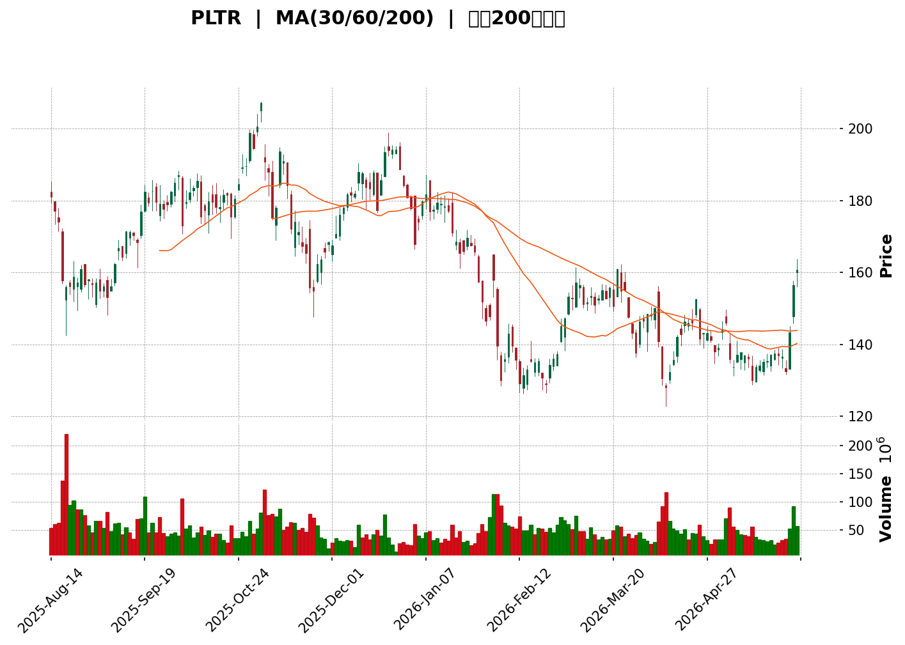
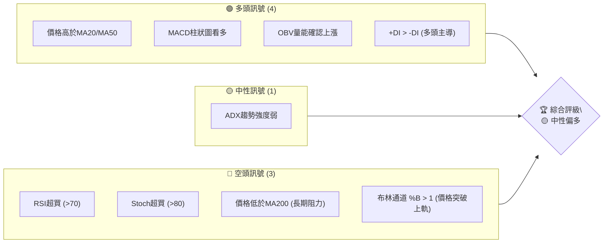
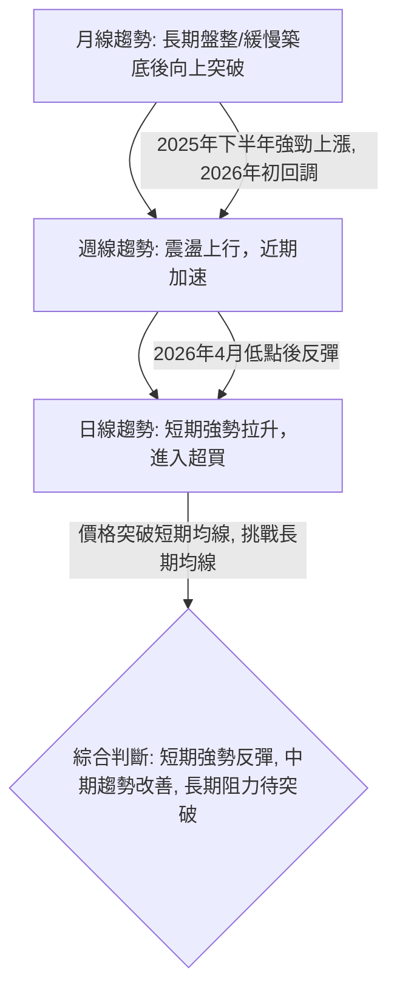
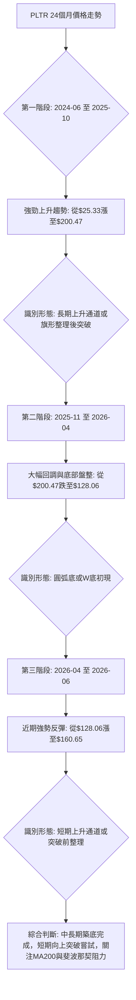
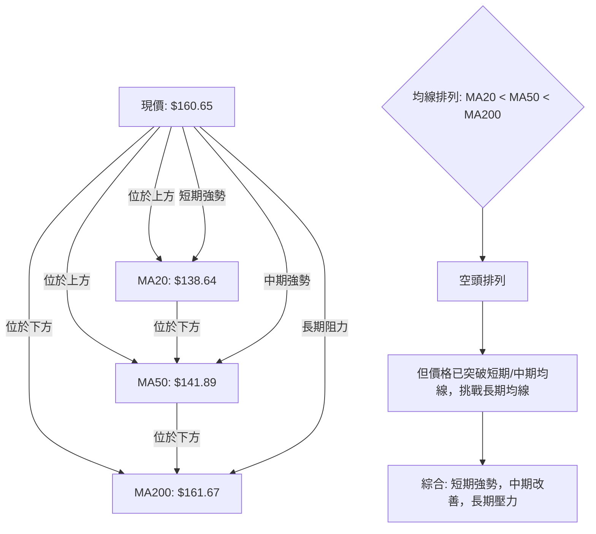

<details>
<summary>📊 靜態圖表 (點擊展開)</summary>

</details>

<html>
<head><meta charset="utf-8" /></head>
<body>
    <div>                        <script>window.PlotlyConfig = {MathJaxConfig: 'local'};</script>
        <script charset="utf-8" src="https://cdn.plot.ly/plotly-3.5.0.min.js" integrity="sha256-fHbNLP+GlIXN+efbQec78UkemUz3NJp7UmfGxC1tNxs=" crossorigin="anonymous"></script>                <div id="candlestick-chart" class="plotly-graph-div" style="height:500px; width:100%;"></div>            <script>                window.PLOTLYENV=window.PLOTLYENV || {};                                if (document.getElementById("candlestick-chart")) {                    Plotly.newPlot(                        "candlestick-chart",                        [{"close":{"dtype":"f8","bdata":"AAAA4KOgZkAAAACgcCVmQAAAAMD1wGVAAAAAAAC4Y0AAAADgUYBjQAAAAIDChWNAAAAAIK7XY0AAAACgcKVjQAAAAADXG2RAAAAAQAqXY0AAAAAA18NjQAAAAGC4lmNAAAAAQOGiY0AAAADAzFxjQAAAAOB6hGNAAAAAIIUjY0AAAABAM4NjQAAAACCFS2RAAAAAIK7XZEAAAAAghYtkQAAAAIDCbWVAAAAAYLhmZUAAAADgUUhlQAAAAGCPCmVAAAAAQAofZkAAAADgesxmQAAAAGCPamZAAAAAoJnRZkAAAACA63FmQAAAAADXY2ZAAAAAgD0yZkAAAAAghVtmQAAAAKBwzWZAAAAAYGYeZ0AAAACgmWFnQAAAAIA9omVAAAAAwPVwZkAAAACgcMVmQAAAAIDr8WZAAAAAQAovZ0AAAACAFO5lQAAAAGC4JmZAAAAAIK53ZkAAAAAA13NmQAAAAADXQ2ZAAAAAwMxEZkAAAABA4bJmQAAAAOBRsGZAAAAAIK7vZUAAAAAgXI9mQAAAAAApFGdAAAAAgMKlZ0AAAABAM7NnQAAAAIDr2WhAAAAAoJlRaEAAAABACg9pQAAAAIDC5WlAAAAAIK7XZ0AAAADAzHxnQAAAAKCZ4WVAAAAAgMI9ZkAAAAAghTNoQAAAAGC43mdAAAAAoHAFZ0AAAADgeoRlQAAAAOBRwGVAAAAAAABoZUAAAABgj+pkQAAAAKBwrWRAAAAAANd3Y0AAAABAM1tjQAAAAAAASGRAAAAAoJlxZEAAAADgo7hkQAAAAGBmDmVAAAAAIK7vZEAAAACAFFZlQAAAAGCPAmZAAAAAoHA9ZkAAAADgUbhmQAAAACCur2ZAAAAAQOG6ZkAAAADAHn1nQAAAAKBHcWdAAAAAgD3yZkAAAAAAAOhmQAAAAAAAeGdAAAAAoEcpZkAAAACAFDZnQAAAAAApLGhAAAAAIFw\u002faEAAAAAAKURoQAAAAKBwRWhAAAAAYLiWZ0AAAACAwgVnQAAAAEDhmmZAAAAAAAA4ZkAAAAAghftkQAAAAKBHwWVAAAAAYLh2ZkAAAACAwrVmQAAAACCFG2ZAAAAAIK4vZkAAAADAHm1mQAAAAGC4XmZAAAAAwMxMZkAAAACAPSJmQAAAAGC4XmVAAAAAwPUQZUAAAABgj6pkQAAAAMDMvGRAAAAAQDMzZUAAAABACu9kQAAAAGBmtmRAAAAAQDOrY0AAAAAghftiQAAAAEDhUmJAAAAA4FF4YkAAAAAAKbxjQAAAAKBHcWFAAAAA4FFAYEAAAADAzPxgQAAAAMAe3WFAAAAA4FFwYUAAAACAwvVgQAAAAAApJGBAAAAAwB5tYEAAAADgo6BgQAAAAAAp7GBAAAAA4HrcYEAAAAAgrudgQAAAAEAzU2BAAAAAQOEaYEAAAACAFMZgQAAAAIAU\u002fmBAAAAAgBQmYUAAAACgcCViQAAAAEAKZ2JAAAAAgBQmY0AAAACgcBVjQAAAAMAepWNAAAAAgMKNY0AAAADgeuRiQAAAAEAz82JAAAAAAAAwY0AAAABgZt5iQAAAAEAKF2NAAAAAYI9iY0AAAADgoxhjQAAAAIDCdWNAAAAAgMLVYkAAAABA4RpkQAAAAMD1WGNAAAAAYLheY0AAAACA63FiQAAAAIDr4WFAAAAAoJkxYUAAAADA9UhiQAAAACCuT2JAAAAAYLiOYkAAAACAwn1iQAAAAIA9wmJAAAAA4FGYYUAAAAAgrk9gQAAAAIDrAWBAAAAAANeLYEAAAABgZvZgQAAAAMDMxGFAAAAA4FHYYUAAAADgekxiQAAAAOB6PGJAAAAAQAo\u002fYkAAAAAA1xNjQAAAAIA9smFAAAAAQOHiYUAAAABAM+NhQAAAAIDCpWFAAAAAQAo\u002fYUAAAAAghWNhQAAAAIA9AmJAAAAAwPVAYkAAAADAHv1gQAAAAKBHuWBAAAAAoJkhYUAAAACgmTlhQAAAAOB6HGFAAAAAAAAAYUAAAACgmUFgQAAAACBct2BAAAAAIK6\u002fYEAAAADgeuRgQAAAAOBR6GBAAAAAwMwkYUAAAACgRy1hQAAAAAApHGFAAAAAQDMTYUAAAADgUZBgQAAAAEDh6mFAAAAAoEeRY0AAAADAzBRkQA=="},"high":{"dtype":"f8","bdata":"AAAAYI8qZ0AAAAAAAIBmQAAAAMDMPGZAAAAAoJmJZUAAAABguI5jQAAAAEAKv2NAAAAAYGZmZEAAAABA4dJjQAAAAAApRGRAAAAAwMxMZEAAAAAgXMdjQAAAAKBwzWNAAAAA4HrMY0AAAADAzCRkQAAAAKBHoWNAAAAAQArfY0AAAACgmcljQAAAAAAAWGRAAAAAAAAgZUAAAADgp+5kQAAAAMD1cGVAAAAAoJl5ZUAAAACA62llQAAAAIDCNWVAAAAAoJlZZkAAAACgcA1nQAAAAAAAyGZAAAAAAAA4Z0AAAABAMxtnQAAAAIA9CmdAAAAAANeDZkAAAAAgXK9mQAAAAOCj2GZAAAAAwPVIZ0AAAABgZoZnQAAAAEDhWmdAAAAAYGbeZkAAAACAwkVnQAAAAOBRCGdAAAAAANdzZ0AAAABAM2NnQAAAAEAKZ2ZAAAAAQOHKZkAAAABAMwtnQAAAAIA9GmdAAAAAQOGyZkAAAABA4eJmQAAAAMByzGZAAAAAYLjGZkAAAACA67FmQAAAAKBwRWdAAAAAYI8aaEAAAADA9fhnQAAAAEAz+2hAAAAAoHD1aEAAAACAwoVpQAAAAOCj8GlAAAAAYGZ2aEAAAACAPcpnQAAAAEDh4mdAAAAAYGZWZkAAAACAwl1oQAAAAKCZHWhAAAAAYI\u002fSZ0AAAABgZtZmQAAAAKBHKWZAAAAAIK7HZUAAAABgj5plQAAAAEAzM2VAAAAAgD3SZUAAAAAghcNjQAAAAKBwpWRAAAAAwMyUZEAAAAAg2QplQAAAAKCZGWVAAAAAQDMjZUAAAAAAAPhlQAAAAMAePWZAAAAAgBROZkAAAABg5cRmQAAAAAAp\u002fGZAAAAAQDPbZkAAAADgesxnQAAAAKCZgWdAAAAAwMxQZ0AAAADA9XhnQAAAAAAAkGdAAAAAAAB4Z0AAAABgj2pnQAAAAAAAYGhAAAAAACncaEAAAAAA12toQAAAAKBwZWhAAAAAQDOLaEAAAABgZmZnQAAAAABUF2dAAAAAwPWwZkAAAABAM6tmQAAAAIA9+mVAAAAAgBSGZkAAAADA9WhnQAAAAMAeNWdAAAAAQApXZkAAAAAAANBmQAAAAEAzo2ZAAAAA4CKzZkAAAABAM5NmQAAAAIDCzWZAAAAAQAp\u002fZUAAAAAgri9lQAAAAAAAIGVAAAAAAACAZUAAAABA4VJlQAAAAIAULmVAAAAAoHChZEAAAAAAKbRjQAAAAAAA4GJAAAAAwMzsYkAAAAAAf6JkQAAAAEAze2NAAAAAIFw\u002fYUAAAADg+zVhQAAAAADXO2JAAAAAgOsxYkAAAAAAAGhhQAAAAOB6\u002fGBAAAAAgOuxYEAAAACAPcpgQAAAAODQnmFAAAAAwB4FYUAAAABguAZhQAAAAKBHgWBAAAAAIK5HYEAAAABA4QJhQAAAAOBRMGFAAAAAQDNDYUAAAADgemRiQAAAAAAAcGJAAAAA4KNQY0AAAAAAKYxjQAAAAGBmLmRAAAAAgBTOY0AAAAAgBpVjQAAAAIBoJWNAAAAAACl8Y0AAAACA61FjQAAAACCFO2NAAAAAAACYY0AAAACAFJZjQAAAAMDMhGNAAAAAwMyUY0AAAABgjyJkQAAAAMDMTGRAAAAA4KMIZEAAAAAA1yNjQAAAAGC4PmJAAAAAANcDYkAAAAAghXtiQAAAAKCZiWJAAAAA4FGQYkAAAAAghdNiQAAAAOCjyGJAAAAAwPWIY0AAAACgR3FhQAAAAGBmJmBAAAAAoHDNYEAAAACAPUJhQAAAAGCP0mFAAAAAoJkxYkAAAADA9YhiQAAAAGBmZmJAAAAAANe7YkAAAACAwhVjQAAAAKBHyWJAAAAAYI\u002fqYUAAAACAPSJiQAAAAEAz+2FAAAAA4FF4YUAAAABgZoZhQAAAAIAUTmJAAAAA4Hq0YkAAAAAgXN9hQAAAAGBm9mBAAAAAYGaeYUAAAAAAKTxhQAAAAOB6JGFAAAAAgMItYUAAAAAgrh9hQAAAACBcz2BAAAAA4Hr0YEAAAACA6\u002f1gQAAAAEAKL2FAAAAAIK4nYUAAAACgmVFhQAAAAOCjYGFAAAAAgMJVYUAAAAAgXPdgQAAAAAAAIGJAAAAAoO24Y0AAAACgE3ZkQA=="},"hovertemplate":"\u003cb\u003e%{x|%Y-%m-%d}\u003c\u002fb\u003e\u003cbr\u003e\u958b: $%{open:.2f}\u003cbr\u003e\u9ad8: $%{high:.2f}\u003cbr\u003e\u4f4e: $%{low:.2f}\u003cbr\u003e\u6536: $%{close:.2f}\u003cextra\u003e\u003c\u002fextra\u003e","low":{"dtype":"f8","bdata":"AAAAYGZmZkAAAAAAKaxlQAAAAOB6bGVAAAAAwMycY0AAAABA4cphQAAAAIDrOWNAAAAA4KP4YkAAAAAA16tiQAAAAIA9UmNAAAAAIFx\u002fY0AAAACgmRFjQAAAAAAAIGNAAAAAwPXIYkAAAABguBZjQAAAAMAeJWNAAAAAoEeBYkAAAABA4VpjQAAAAADXi2NAAAAAgBRuZEAAAABACmdkQAAAAOBRgGRAAAAAwB7tZEAAAABguB5lQAAAAOCjKGRAAAAA4HosZUAAAABguBZmQAAAAKBHSWZAAAAA4FEgZkAAAAAA1yNmQAAAAKBHyWVAAAAAwB7dZUAAAADAHiVmQAAAAEAKR2ZAAAAAAABwZkAAAABgZt5mQAAAAOCjWGVAAAAAYI86ZkAAAACgcG1mQAAAAGBmpmZAAAAAYGZ+ZkAAAADA9bBlQAAAAGBmrmVAAAAAgD1aZUAAAADgowBmQAAAAGBmDmZAAAAAYGa+ZUAAAACAFC5mQAAAAMDMVGZAAAAAoHAtZUAAAADgUeBlQAAAAEAz22ZAAAAA4KNwZ0AAAADA9VhnQAAAACCuz2dAAAAAANdDaEAAAACgcL1oQAAAAIA9OmlAAAAAgOsxZ0AAAABguKZmQAAAAMD10GVAAAAAwB4dZUAAAADgo\u002fBmQAAAAAApZGdAAAAAwMyMZkAAAABgZFdlQAAAAAAAkGRAAAAAgML1ZEAAAAAAALBkQAAAAKBwTWRAAAAA4KNMY0AAAACA63FiQAAAAAAAoGNAAAAAgMKRY0AAAAAAKXxkQAAAAAAAvGRAAAAAANdjZEAAAABA4TJlQAAAAGCPGmVAAAAAgMLNZUAAAADAHiVmQAAAAKBHcWZAAAAAACmMZkAAAAAAANhmQAAAAGC4hmZAAAAAIFg1ZkAAAADA9YBmQAAAAECLpGZAAAAAAAAQZkAAAADgUbBmQAAAACBcV2dAAAAAgMINaEAAAAAghfdnQAAAAGCPGmhAAAAAANeTZ0AAAADgevRmQAAAAGBmlmZAAAAAAAAoZkAAAABAM8tkQAAAAKBHeWVAAAAA4KPYZUAAAADAHjVmQAAAAADXy2VAAAAAAADYZUAAAABA4QpmQAAAAOB6BGZAAAAAYGa+ZUAAAADA9RBmQAAAAOBRQGVAAAAAIK7HZEAAAAAghSNkQAAAAGBmnmRAAAAAoJnJZEAAAABgZupkQAAAAIAUlmRAAAAAIK6nY0AAAAAA12NiQAAAAMByJGJAAAAAoO1UYkAAAAAA1yNjQAAAAIDC9WBAAAAAgD0KYEAAAABAM4tgQAAAAADV2GBAAAAA4KM4YUAAAABgZp5gQAAAAADXo19AAAAAgOmOX0AAAABgj9JfQAAAAADX22BAAAAA4FFgYEAAAACgcGVgQAAAAMD12F9AAAAAIK6XX0AAAACAwiVgQAAAAAAplGBAAAAAIFy\u002fYEAAAADgo5BhQAAAAGBmRmFAAAAAgOuBYkAAAAAghbNiQAAAAKBHyWJAAAAAQAofY0AAAADgesRiQAAAAGCPqmJAAAAAIFzfYkAAAABgj5JiQAAAAKBw5WJAAAAAANcDY0AAAAAghRNjQAAAAAAA0GJAAAAAQOGiYkAAAAAgridjQAAAAOB69GJAAAAAIFxbY0AAAAAAAGhiQAAAAIDrsWFAAAAAoJkJYUAAAABACl9hQAAAAEAKD2JAAAAAIK4\u002fYUAAAAAgMVRiQAAAAGBmDmJAAAAAoHBlYUAAAABACg9gQAAAACCFq15AAAAAwMwkYEAAAAAAAMBgQAAAAIDC3WBAAAAAwPVwYUAAAACgmelhQAAAAGCP+mFAAAAAwPf\u002fYUAAAADAHm1iQAAAAKBwfWFAAAAAgMJdYUAAAADgUaBhQAAAAKBwjWFAAAAAgMLVYEAAAADAzBRhQAAAAOB6rGFAAAAAQDMnYkAAAABACtdgQAAAAMDMZGBAAAAAwPXYYEAAAADgo6BgQAAAAACsmGBAAAAAYLiuYEAAAAAAABhgQAAAAGBmLmBAAAAAoEeJYEAAAABgj2pgQAAAAEAzs2BAAAAAoHCNYEAAAACgcO1gQAAAAKCZyWBAAAAAoJmpYEAAAAAAKXRgQAAAAAAAoGBAAAAAoEc5YkAAAAAAKXxjQA=="},"name":"\u50f9\u683c","open":{"dtype":"f8","bdata":"AAAAwB7NZkAAAABAM3dmQAAAAOCj6GVAAAAAIIVrZUAAAACgmQljQAAAAKBwpWNAAAAAgBRqY0AAAABAM4NjQAAAAOB6bGNAAAAAgD1KZEAAAAAAKbRjQAAAACBcn2NAAAAAYGbmYkAAAAAAAMBjQAAAACCuW2NAAAAAgD26Y0AAAADAHl1jQAAAAAAAqGNAAAAAAADAZEAAAAAgrudkQAAAAEAzq2RAAAAAQDMzZUAAAACgR2FlQAAAAOCjIGVAAAAA4KNIZUAAAACAPSJmQAAAAAApnGZAAAAA4FHQZkAAAADAHv1mQAAAAKCZ+WVAAAAAoJlhZkAAAADgenRmQAAAACBcX2ZAAAAAgD2qZkAAAABgZlZnQAAAAMDMTGdAAAAAgMJlZkAAAACA64lmQAAAAKCZ2WZAAAAAYI\u002fyZkAAAACgcCVnQAAAAIDCVWZAAAAAAAAAZkAAAADA9bRmQAAAAMD1uGZAAAAAAAA4ZkAAAAAgrm9mQAAAAIDrwWZAAAAAgMK9ZkAAAACAPe5lQAAAAAAp3GZAAAAAQAqfZ0AAAAAgXK9nQAAAAGCP4mdAAAAAoJnNaEAAAABgZuZoQAAAAKBwoWlAAAAAgD0CaEAAAAAAAKBnQAAAACCuf2dAAAAAwMykZUAAAACA6wlnQAAAAGC4ymdAAAAAYI\u002fSZ0AAAABA4bZmQAAAAEAz32RAAAAAwPVQZUAAAAAA1wtlQAAAAKCZ+WRAAAAAgD2CZUAAAADgUYBjQAAAAEAKr2NAAAAAgD0CZEAAAABAM9tkQAAAAOBR+GRAAAAAAACgZEAAAABA4TJlQAAAAOB6RGVAAAAAIK4LZkAAAAAgXEdmQAAAAGC4xmZAAAAAQAqfZkAAAABgZh5nQAAAAKCZGWdAAAAAgOs5Z0AAAABgjyJnQAAAAMD1tGZAAAAAQOF2Z0AAAADgUbBmQAAAACCuV2dAAAAAoEdhaEAAAABgZhpoQAAAAMAeJWhAAAAA4HpgaEAAAABAM1tnQAAAAEAzC2dAAAAAACmkZkAAAACgmalmQAAAAAAp3GVAAAAA4FH4ZUAAAACgmXlmQAAAACCuM2dAAAAA4KMgZkAAAACA6zVmQAAAAAAAXGZAAAAAAABEZkAAAABguFZmQAAAACCFa2ZAAAAAAAD0ZEAAAAAg3QxlQAAAAKCZHWVAAAAA4KPoZEAAAABguAZlQAAAACBc72RAAAAAwMyMZEAAAAAAKbRjQAAAAKCZwWJAAAAAgBTeYkAAAACgmaFkQAAAAMAebWNAAAAAgD0aYUAAAABgj+pgQAAAAGCPEmFAAAAAQOEeYkAAAADAzGBhQAAAACCF62BAAAAAoJn5X0AAAADgoxxgQAAAAOB6\u002fGBAAAAAgOuJYEAAAAAgrotgQAAAAKBHgWBAAAAAACkgYEAAAAAghVNgQAAAAEAKu2BAAAAAgD3CYEAAAADAzJhhQAAAAEAzw2FAAAAAgMKNYkAAAACAFB5jQAAAAIAUzmJAAAAAgBR2Y0AAAAAgrn9jQAAAAAAp7GJAAAAA4FEgY0AAAACgmSljQAAAAGBmDmNAAAAAwPUMY0AAAACAPV5jQAAAAEAzI2NAAAAAYGZmY0AAAAAgridjQAAAAIA9AmRAAAAAoHCtY0AAAACAwiFjQAAAAAApPGJAAAAA4KPoYUAAAADgo4BhQAAAAAAAYGJAAAAAIIXvYUAAAAAghYtiQAAAAGA5XGJAAAAA4HpYY0AAAADgo2xhQAAAACBcD2BAAAAAIFxHYEAAAAAAqs1gQAAAAKBHGWFAAAAAoEcJYkAAAACAFCpiQAAAAAAAIGJAAAAAgOtZYkAAAAAghYtiQAAAAGBmtmJAAAAAYLjeYUAAAAAAAKhhQAAAAKCZyWFAAAAA4FF4YUAAAABAM09hQAAAAAAA6GFAAAAAAAB4YkAAAACgcIlhQAAAAGC4tmBAAAAAQDPjYEAAAAAgrvtgQAAAAMAe3WBAAAAAQDMTYUAAAAAgMcBgQAAAAMDMNGBAAAAAoJmZYEAAAAAAAJBgQAAAAKBw5WBAAAAA4KPEYEAAAACgmflgQAAAAKCZLWFAAAAAwB4FYUAAAACgmalgQAAAAMAepWBAAAAAYGZ6YkAAAAAgXP9jQA=="},"x":["2025-08-14T00:00:00-04:00","2025-08-15T00:00:00-04:00","2025-08-18T00:00:00-04:00","2025-08-19T00:00:00-04:00","2025-08-20T00:00:00-04:00","2025-08-21T00:00:00-04:00","2025-08-22T00:00:00-04:00","2025-08-25T00:00:00-04:00","2025-08-26T00:00:00-04:00","2025-08-27T00:00:00-04:00","2025-08-28T00:00:00-04:00","2025-08-29T00:00:00-04:00","2025-09-02T00:00:00-04:00","2025-09-03T00:00:00-04:00","2025-09-04T00:00:00-04:00","2025-09-05T00:00:00-04:00","2025-09-08T00:00:00-04:00","2025-09-09T00:00:00-04:00","2025-09-10T00:00:00-04:00","2025-09-11T00:00:00-04:00","2025-09-12T00:00:00-04:00","2025-09-15T00:00:00-04:00","2025-09-16T00:00:00-04:00","2025-09-17T00:00:00-04:00","2025-09-18T00:00:00-04:00","2025-09-19T00:00:00-04:00","2025-09-22T00:00:00-04:00","2025-09-23T00:00:00-04:00","2025-09-24T00:00:00-04:00","2025-09-25T00:00:00-04:00","2025-09-26T00:00:00-04:00","2025-09-29T00:00:00-04:00","2025-09-30T00:00:00-04:00","2025-10-01T00:00:00-04:00","2025-10-02T00:00:00-04:00","2025-10-03T00:00:00-04:00","2025-10-06T00:00:00-04:00","2025-10-07T00:00:00-04:00","2025-10-08T00:00:00-04:00","2025-10-09T00:00:00-04:00","2025-10-10T00:00:00-04:00","2025-10-13T00:00:00-04:00","2025-10-14T00:00:00-04:00","2025-10-15T00:00:00-04:00","2025-10-16T00:00:00-04:00","2025-10-17T00:00:00-04:00","2025-10-20T00:00:00-04:00","2025-10-21T00:00:00-04:00","2025-10-22T00:00:00-04:00","2025-10-23T00:00:00-04:00","2025-10-24T00:00:00-04:00","2025-10-27T00:00:00-04:00","2025-10-28T00:00:00-04:00","2025-10-29T00:00:00-04:00","2025-10-30T00:00:00-04:00","2025-10-31T00:00:00-04:00","2025-11-03T00:00:00-05:00","2025-11-04T00:00:00-05:00","2025-11-05T00:00:00-05:00","2025-11-06T00:00:00-05:00","2025-11-07T00:00:00-05:00","2025-11-10T00:00:00-05:00","2025-11-11T00:00:00-05:00","2025-11-12T00:00:00-05:00","2025-11-13T00:00:00-05:00","2025-11-14T00:00:00-05:00","2025-11-17T00:00:00-05:00","2025-11-18T00:00:00-05:00","2025-11-19T00:00:00-05:00","2025-11-20T00:00:00-05:00","2025-11-21T00:00:00-05:00","2025-11-24T00:00:00-05:00","2025-11-25T00:00:00-05:00","2025-11-26T00:00:00-05:00","2025-11-28T00:00:00-05:00","2025-12-01T00:00:00-05:00","2025-12-02T00:00:00-05:00","2025-12-03T00:00:00-05:00","2025-12-04T00:00:00-05:00","2025-12-05T00:00:00-05:00","2025-12-08T00:00:00-05:00","2025-12-09T00:00:00-05:00","2025-12-10T00:00:00-05:00","2025-12-11T00:00:00-05:00","2025-12-12T00:00:00-05:00","2025-12-15T00:00:00-05:00","2025-12-16T00:00:00-05:00","2025-12-17T00:00:00-05:00","2025-12-18T00:00:00-05:00","2025-12-19T00:00:00-05:00","2025-12-22T00:00:00-05:00","2025-12-23T00:00:00-05:00","2025-12-24T00:00:00-05:00","2025-12-26T00:00:00-05:00","2025-12-29T00:00:00-05:00","2025-12-30T00:00:00-05:00","2025-12-31T00:00:00-05:00","2026-01-02T00:00:00-05:00","2026-01-05T00:00:00-05:00","2026-01-06T00:00:00-05:00","2026-01-07T00:00:00-05:00","2026-01-08T00:00:00-05:00","2026-01-09T00:00:00-05:00","2026-01-12T00:00:00-05:00","2026-01-13T00:00:00-05:00","2026-01-14T00:00:00-05:00","2026-01-15T00:00:00-05:00","2026-01-16T00:00:00-05:00","2026-01-20T00:00:00-05:00","2026-01-21T00:00:00-05:00","2026-01-22T00:00:00-05:00","2026-01-23T00:00:00-05:00","2026-01-26T00:00:00-05:00","2026-01-27T00:00:00-05:00","2026-01-28T00:00:00-05:00","2026-01-29T00:00:00-05:00","2026-01-30T00:00:00-05:00","2026-02-02T00:00:00-05:00","2026-02-03T00:00:00-05:00","2026-02-04T00:00:00-05:00","2026-02-05T00:00:00-05:00","2026-02-06T00:00:00-05:00","2026-02-09T00:00:00-05:00","2026-02-10T00:00:00-05:00","2026-02-11T00:00:00-05:00","2026-02-12T00:00:00-05:00","2026-02-13T00:00:00-05:00","2026-02-17T00:00:00-05:00","2026-02-18T00:00:00-05:00","2026-02-19T00:00:00-05:00","2026-02-20T00:00:00-05:00","2026-02-23T00:00:00-05:00","2026-02-24T00:00:00-05:00","2026-02-25T00:00:00-05:00","2026-02-26T00:00:00-05:00","2026-02-27T00:00:00-05:00","2026-03-02T00:00:00-05:00","2026-03-03T00:00:00-05:00","2026-03-04T00:00:00-05:00","2026-03-05T00:00:00-05:00","2026-03-06T00:00:00-05:00","2026-03-09T00:00:00-04:00","2026-03-10T00:00:00-04:00","2026-03-11T00:00:00-04:00","2026-03-12T00:00:00-04:00","2026-03-13T00:00:00-04:00","2026-03-16T00:00:00-04:00","2026-03-17T00:00:00-04:00","2026-03-18T00:00:00-04:00","2026-03-19T00:00:00-04:00","2026-03-20T00:00:00-04:00","2026-03-23T00:00:00-04:00","2026-03-24T00:00:00-04:00","2026-03-25T00:00:00-04:00","2026-03-26T00:00:00-04:00","2026-03-27T00:00:00-04:00","2026-03-30T00:00:00-04:00","2026-03-31T00:00:00-04:00","2026-04-01T00:00:00-04:00","2026-04-02T00:00:00-04:00","2026-04-06T00:00:00-04:00","2026-04-07T00:00:00-04:00","2026-04-08T00:00:00-04:00","2026-04-09T00:00:00-04:00","2026-04-10T00:00:00-04:00","2026-04-13T00:00:00-04:00","2026-04-14T00:00:00-04:00","2026-04-15T00:00:00-04:00","2026-04-16T00:00:00-04:00","2026-04-17T00:00:00-04:00","2026-04-20T00:00:00-04:00","2026-04-21T00:00:00-04:00","2026-04-22T00:00:00-04:00","2026-04-23T00:00:00-04:00","2026-04-24T00:00:00-04:00","2026-04-27T00:00:00-04:00","2026-04-28T00:00:00-04:00","2026-04-29T00:00:00-04:00","2026-04-30T00:00:00-04:00","2026-05-01T00:00:00-04:00","2026-05-04T00:00:00-04:00","2026-05-05T00:00:00-04:00","2026-05-06T00:00:00-04:00","2026-05-07T00:00:00-04:00","2026-05-08T00:00:00-04:00","2026-05-11T00:00:00-04:00","2026-05-12T00:00:00-04:00","2026-05-13T00:00:00-04:00","2026-05-14T00:00:00-04:00","2026-05-15T00:00:00-04:00","2026-05-18T00:00:00-04:00","2026-05-19T00:00:00-04:00","2026-05-20T00:00:00-04:00","2026-05-21T00:00:00-04:00","2026-05-22T00:00:00-04:00","2026-05-26T00:00:00-04:00","2026-05-27T00:00:00-04:00","2026-05-28T00:00:00-04:00","2026-05-29T00:00:00-04:00","2026-06-01T00:00:00-04:00"],"type":"candlestick"},{"hovertemplate":"MA30: $%{y:.2f}\u003cextra\u003e\u003c\u002fextra\u003e","line":{"color":"#2196F3","dash":"dash","width":2},"mode":"lines","name":"MA30","x":["2025-08-14T00:00:00-04:00","2025-08-15T00:00:00-04:00","2025-08-18T00:00:00-04:00","2025-08-19T00:00:00-04:00","2025-08-20T00:00:00-04:00","2025-08-21T00:00:00-04:00","2025-08-22T00:00:00-04:00","2025-08-25T00:00:00-04:00","2025-08-26T00:00:00-04:00","2025-08-27T00:00:00-04:00","2025-08-28T00:00:00-04:00","2025-08-29T00:00:00-04:00","2025-09-02T00:00:00-04:00","2025-09-03T00:00:00-04:00","2025-09-04T00:00:00-04:00","2025-09-05T00:00:00-04:00","2025-09-08T00:00:00-04:00","2025-09-09T00:00:00-04:00","2025-09-10T00:00:00-04:00","2025-09-11T00:00:00-04:00","2025-09-12T00:00:00-04:00","2025-09-15T00:00:00-04:00","2025-09-16T00:00:00-04:00","2025-09-17T00:00:00-04:00","2025-09-18T00:00:00-04:00","2025-09-19T00:00:00-04:00","2025-09-22T00:00:00-04:00","2025-09-23T00:00:00-04:00","2025-09-24T00:00:00-04:00","2025-09-25T00:00:00-04:00","2025-09-26T00:00:00-04:00","2025-09-29T00:00:00-04:00","2025-09-30T00:00:00-04:00","2025-10-01T00:00:00-04:00","2025-10-02T00:00:00-04:00","2025-10-03T00:00:00-04:00","2025-10-06T00:00:00-04:00","2025-10-07T00:00:00-04:00","2025-10-08T00:00:00-04:00","2025-10-09T00:00:00-04:00","2025-10-10T00:00:00-04:00","2025-10-13T00:00:00-04:00","2025-10-14T00:00:00-04:00","2025-10-15T00:00:00-04:00","2025-10-16T00:00:00-04:00","2025-10-17T00:00:00-04:00","2025-10-20T00:00:00-04:00","2025-10-21T00:00:00-04:00","2025-10-22T00:00:00-04:00","2025-10-23T00:00:00-04:00","2025-10-24T00:00:00-04:00","2025-10-27T00:00:00-04:00","2025-10-28T00:00:00-04:00","2025-10-29T00:00:00-04:00","2025-10-30T00:00:00-04:00","2025-10-31T00:00:00-04:00","2025-11-03T00:00:00-05:00","2025-11-04T00:00:00-05:00","2025-11-05T00:00:00-05:00","2025-11-06T00:00:00-05:00","2025-11-07T00:00:00-05:00","2025-11-10T00:00:00-05:00","2025-11-11T00:00:00-05:00","2025-11-12T00:00:00-05:00","2025-11-13T00:00:00-05:00","2025-11-14T00:00:00-05:00","2025-11-17T00:00:00-05:00","2025-11-18T00:00:00-05:00","2025-11-19T00:00:00-05:00","2025-11-20T00:00:00-05:00","2025-11-21T00:00:00-05:00","2025-11-24T00:00:00-05:00","2025-11-25T00:00:00-05:00","2025-11-26T00:00:00-05:00","2025-11-28T00:00:00-05:00","2025-12-01T00:00:00-05:00","2025-12-02T00:00:00-05:00","2025-12-03T00:00:00-05:00","2025-12-04T00:00:00-05:00","2025-12-05T00:00:00-05:00","2025-12-08T00:00:00-05:00","2025-12-09T00:00:00-05:00","2025-12-10T00:00:00-05:00","2025-12-11T00:00:00-05:00","2025-12-12T00:00:00-05:00","2025-12-15T00:00:00-05:00","2025-12-16T00:00:00-05:00","2025-12-17T00:00:00-05:00","2025-12-18T00:00:00-05:00","2025-12-19T00:00:00-05:00","2025-12-22T00:00:00-05:00","2025-12-23T00:00:00-05:00","2025-12-24T00:00:00-05:00","2025-12-26T00:00:00-05:00","2025-12-29T00:00:00-05:00","2025-12-30T00:00:00-05:00","2025-12-31T00:00:00-05:00","2026-01-02T00:00:00-05:00","2026-01-05T00:00:00-05:00","2026-01-06T00:00:00-05:00","2026-01-07T00:00:00-05:00","2026-01-08T00:00:00-05:00","2026-01-09T00:00:00-05:00","2026-01-12T00:00:00-05:00","2026-01-13T00:00:00-05:00","2026-01-14T00:00:00-05:00","2026-01-15T00:00:00-05:00","2026-01-16T00:00:00-05:00","2026-01-20T00:00:00-05:00","2026-01-21T00:00:00-05:00","2026-01-22T00:00:00-05:00","2026-01-23T00:00:00-05:00","2026-01-26T00:00:00-05:00","2026-01-27T00:00:00-05:00","2026-01-28T00:00:00-05:00","2026-01-29T00:00:00-05:00","2026-01-30T00:00:00-05:00","2026-02-02T00:00:00-05:00","2026-02-03T00:00:00-05:00","2026-02-04T00:00:00-05:00","2026-02-05T00:00:00-05:00","2026-02-06T00:00:00-05:00","2026-02-09T00:00:00-05:00","2026-02-10T00:00:00-05:00","2026-02-11T00:00:00-05:00","2026-02-12T00:00:00-05:00","2026-02-13T00:00:00-05:00","2026-02-17T00:00:00-05:00","2026-02-18T00:00:00-05:00","2026-02-19T00:00:00-05:00","2026-02-20T00:00:00-05:00","2026-02-23T00:00:00-05:00","2026-02-24T00:00:00-05:00","2026-02-25T00:00:00-05:00","2026-02-26T00:00:00-05:00","2026-02-27T00:00:00-05:00","2026-03-02T00:00:00-05:00","2026-03-03T00:00:00-05:00","2026-03-04T00:00:00-05:00","2026-03-05T00:00:00-05:00","2026-03-06T00:00:00-05:00","2026-03-09T00:00:00-04:00","2026-03-10T00:00:00-04:00","2026-03-11T00:00:00-04:00","2026-03-12T00:00:00-04:00","2026-03-13T00:00:00-04:00","2026-03-16T00:00:00-04:00","2026-03-17T00:00:00-04:00","2026-03-18T00:00:00-04:00","2026-03-19T00:00:00-04:00","2026-03-20T00:00:00-04:00","2026-03-23T00:00:00-04:00","2026-03-24T00:00:00-04:00","2026-03-25T00:00:00-04:00","2026-03-26T00:00:00-04:00","2026-03-27T00:00:00-04:00","2026-03-30T00:00:00-04:00","2026-03-31T00:00:00-04:00","2026-04-01T00:00:00-04:00","2026-04-02T00:00:00-04:00","2026-04-06T00:00:00-04:00","2026-04-07T00:00:00-04:00","2026-04-08T00:00:00-04:00","2026-04-09T00:00:00-04:00","2026-04-10T00:00:00-04:00","2026-04-13T00:00:00-04:00","2026-04-14T00:00:00-04:00","2026-04-15T00:00:00-04:00","2026-04-16T00:00:00-04:00","2026-04-17T00:00:00-04:00","2026-04-20T00:00:00-04:00","2026-04-21T00:00:00-04:00","2026-04-22T00:00:00-04:00","2026-04-23T00:00:00-04:00","2026-04-24T00:00:00-04:00","2026-04-27T00:00:00-04:00","2026-04-28T00:00:00-04:00","2026-04-29T00:00:00-04:00","2026-04-30T00:00:00-04:00","2026-05-01T00:00:00-04:00","2026-05-04T00:00:00-04:00","2026-05-05T00:00:00-04:00","2026-05-06T00:00:00-04:00","2026-05-07T00:00:00-04:00","2026-05-08T00:00:00-04:00","2026-05-11T00:00:00-04:00","2026-05-12T00:00:00-04:00","2026-05-13T00:00:00-04:00","2026-05-14T00:00:00-04:00","2026-05-15T00:00:00-04:00","2026-05-18T00:00:00-04:00","2026-05-19T00:00:00-04:00","2026-05-20T00:00:00-04:00","2026-05-21T00:00:00-04:00","2026-05-22T00:00:00-04:00","2026-05-26T00:00:00-04:00","2026-05-27T00:00:00-04:00","2026-05-28T00:00:00-04:00","2026-05-29T00:00:00-04:00","2026-06-01T00:00:00-04:00"],"y":{"dtype":"f8","bdata":"AAAAAAAA+H8AAAAAAAD4fwAAAAAAAPh\u002fAAAAAAAA+H8AAAAAAAD4fwAAAAAAAPh\u002fAAAAAAAA+H8AAAAAAAD4fwAAAAAAAPh\u002fAAAAAAAA+H8AAAAAAAD4fwAAAAAAAPh\u002fAAAAAAAA+H8AAAAAAAD4fwAAAAAAAPh\u002fAAAAAAAA+H8AAAAAAAD4fwAAAAAAAPh\u002fAAAAAAAA+H8AAAAAAAD4fwAAAAAAAPh\u002fAAAAAAAA+H8AAAAAAAD4fwAAAAAAAPh\u002fAAAAAAAA+H8AAAAAAAD4fwAAAAAAAPh\u002fAAAAAAAA+H8AAAAAAAD4f3d3d0eawmRAMzMzM+y+ZEDv7u6uucBkQGZmZrasyWRAAAAAILDmZEDe3d0dzAdlQHd3dzfQGWVAVVVVRf0vZUAAAADwp0plQCIiItLbYmVAzczMfIaBZUAREREBAJRlQO\u002fu7t7dqWVAVVVV1QbCZUCrqqoKZdxlQLy7uwvX82VAIiIioowOZkCamZkZvSlmQDMzM1MqPmZAiYiIqH9HZkDe3d19sVhmQJqZmfnFZmZAq6qq+vB5ZkB3d3cXko5mQJqZmSkVr2ZAzczMrNXBZkCJiIi4HtVmQAAAAKDT8mZAq6qqCpD7ZkCrqqpqdQRnQJqZmQkeAGdAZmZmVoAAZ0AiIiISPBBnQAAAABBYGWdAIiIiEoMYZ0BVVVWlmwhnQDMzM1OcCWdAVVVVVccAZ0BmZmYG8\u002fBmQImIiJiZ3WZAAAAAsOS9ZkDv7u4+7qdmQKuqqir5l2ZAd3d3N7SGZkDv7u4+7ndmQBEREbGdbWZA3t3dzT5iZkARERFhnlZmQBEREaHTUGZA3t3dLWtTZkBERES0yFRmQGZmZkZvUWZAd3d395pJZkC8u7t7zUdmQFVVVQXIO2ZAAAAAwBEwZkCrqqqKsx1mQLy7u9v5CGZAvLu7G6H6ZUAiIiKiRfhlQCIiIvLSC2ZAq6qqqvEcZkCamZmpfx1mQERERDTsIGZA3t3d7cMlZkBmZmammzJmQCIiIrLkOWZAERERodNAZkCrqqpaZEFmQAAAADCWSmZAvLu7OyZkZkC8u7ubxIBmQM3MzBxakGZAmpmZqTifZkCrqqpKxa1mQJqZmTn7uGZAERERYZ7EZkC8u7uLbMtmQCIiInL2xWZAmpmZWfK7ZkDe3d3da6pmQBEREcHKmWZAvLu7a7yMZkAAAADw7nZmQJqZmSmjX2ZAq6qqWqtDZkCrqqrKLyJmQN7d3V1I9mVAVVVVtcjWZUCamZm5HrllQAAAANCwf2VAzczMvHQ7ZUAAAAAQWP1kQKuqqqqqxmRAiYiIyC+SZEDNzMwMdF5kQGZmZsZLJ2RA3t3d3d31Y0CamZk5tNBjQImIiHh3p2NA7+7unqh3Y0CJiIhoH0ZjQImIiFjHFGNAZmZmpuLgYkAzMzOTprBiQO\u002fu7j7DgmJAvLu7K85WYkB3d3dXxzRiQM3MzLx0G2JAVVVV5RcLYkDv7u7elv1hQFVVVUVE9GFAq6qq+jfmYUDNzMzMzNRhQAAAAJDCxWFAERERQafBYUAzMzPDrsBhQJqZmak4x2FAMzMzgwfPYUBEREQklMlhQAAAAHDL2mFAmpmZudfwYUAiIiICcgtiQO\u002fu7k4bGGJAERERMZYoYkCamZk5QjViQKuqqgoeRGJAvLu7q6pKYkCJiIiIz1hiQN7d3U2pZGJAIiIi0iJzYkCJiIgIrIBiQERERKRwlWJAiYiImCeiYkAAAABANZ5iQLy7u3vNlWJAzczMTKmQYkC8u7tbj4ZiQImIiOgmgWJAIiIi0gZ2YkBmZmb2U29iQAAAAIBOY2JAmpmZOSZYYkDNzMxculliQBEREYEHT2JAERER4exDYkDv7u5OjTtiQN7d3R0+L2JAIiIi8v0cYkCrqqraaw5iQN7d3Y0JAmJAvLu7yxP9YUDv7u4+fOJhQDMzM5MYzGFAMzMz8\u002f24YUAiIiLSlK5hQAAAAAAAqGFA7+7uvlimYUAAAADgCJVhQKuqqopsh2FARERERP13YUDv7u6+WGphQAAAAKCMWmFAq6qq2rJWYUBmZmbWFV5hQJqZmUl+Z2FAzczMXAFsYUB3d3dHmmhhQKuqqjrfaWFAZmZmFpJ4YUBEREQEyIdhQA=="},"type":"scatter"},{"hovertemplate":"MA60: $%{y:.2f}\u003cextra\u003e\u003c\u002fextra\u003e","line":{"color":"#9C27B0","dash":"dash","width":2},"mode":"lines","name":"MA60","x":["2025-08-14T00:00:00-04:00","2025-08-15T00:00:00-04:00","2025-08-18T00:00:00-04:00","2025-08-19T00:00:00-04:00","2025-08-20T00:00:00-04:00","2025-08-21T00:00:00-04:00","2025-08-22T00:00:00-04:00","2025-08-25T00:00:00-04:00","2025-08-26T00:00:00-04:00","2025-08-27T00:00:00-04:00","2025-08-28T00:00:00-04:00","2025-08-29T00:00:00-04:00","2025-09-02T00:00:00-04:00","2025-09-03T00:00:00-04:00","2025-09-04T00:00:00-04:00","2025-09-05T00:00:00-04:00","2025-09-08T00:00:00-04:00","2025-09-09T00:00:00-04:00","2025-09-10T00:00:00-04:00","2025-09-11T00:00:00-04:00","2025-09-12T00:00:00-04:00","2025-09-15T00:00:00-04:00","2025-09-16T00:00:00-04:00","2025-09-17T00:00:00-04:00","2025-09-18T00:00:00-04:00","2025-09-19T00:00:00-04:00","2025-09-22T00:00:00-04:00","2025-09-23T00:00:00-04:00","2025-09-24T00:00:00-04:00","2025-09-25T00:00:00-04:00","2025-09-26T00:00:00-04:00","2025-09-29T00:00:00-04:00","2025-09-30T00:00:00-04:00","2025-10-01T00:00:00-04:00","2025-10-02T00:00:00-04:00","2025-10-03T00:00:00-04:00","2025-10-06T00:00:00-04:00","2025-10-07T00:00:00-04:00","2025-10-08T00:00:00-04:00","2025-10-09T00:00:00-04:00","2025-10-10T00:00:00-04:00","2025-10-13T00:00:00-04:00","2025-10-14T00:00:00-04:00","2025-10-15T00:00:00-04:00","2025-10-16T00:00:00-04:00","2025-10-17T00:00:00-04:00","2025-10-20T00:00:00-04:00","2025-10-21T00:00:00-04:00","2025-10-22T00:00:00-04:00","2025-10-23T00:00:00-04:00","2025-10-24T00:00:00-04:00","2025-10-27T00:00:00-04:00","2025-10-28T00:00:00-04:00","2025-10-29T00:00:00-04:00","2025-10-30T00:00:00-04:00","2025-10-31T00:00:00-04:00","2025-11-03T00:00:00-05:00","2025-11-04T00:00:00-05:00","2025-11-05T00:00:00-05:00","2025-11-06T00:00:00-05:00","2025-11-07T00:00:00-05:00","2025-11-10T00:00:00-05:00","2025-11-11T00:00:00-05:00","2025-11-12T00:00:00-05:00","2025-11-13T00:00:00-05:00","2025-11-14T00:00:00-05:00","2025-11-17T00:00:00-05:00","2025-11-18T00:00:00-05:00","2025-11-19T00:00:00-05:00","2025-11-20T00:00:00-05:00","2025-11-21T00:00:00-05:00","2025-11-24T00:00:00-05:00","2025-11-25T00:00:00-05:00","2025-11-26T00:00:00-05:00","2025-11-28T00:00:00-05:00","2025-12-01T00:00:00-05:00","2025-12-02T00:00:00-05:00","2025-12-03T00:00:00-05:00","2025-12-04T00:00:00-05:00","2025-12-05T00:00:00-05:00","2025-12-08T00:00:00-05:00","2025-12-09T00:00:00-05:00","2025-12-10T00:00:00-05:00","2025-12-11T00:00:00-05:00","2025-12-12T00:00:00-05:00","2025-12-15T00:00:00-05:00","2025-12-16T00:00:00-05:00","2025-12-17T00:00:00-05:00","2025-12-18T00:00:00-05:00","2025-12-19T00:00:00-05:00","2025-12-22T00:00:00-05:00","2025-12-23T00:00:00-05:00","2025-12-24T00:00:00-05:00","2025-12-26T00:00:00-05:00","2025-12-29T00:00:00-05:00","2025-12-30T00:00:00-05:00","2025-12-31T00:00:00-05:00","2026-01-02T00:00:00-05:00","2026-01-05T00:00:00-05:00","2026-01-06T00:00:00-05:00","2026-01-07T00:00:00-05:00","2026-01-08T00:00:00-05:00","2026-01-09T00:00:00-05:00","2026-01-12T00:00:00-05:00","2026-01-13T00:00:00-05:00","2026-01-14T00:00:00-05:00","2026-01-15T00:00:00-05:00","2026-01-16T00:00:00-05:00","2026-01-20T00:00:00-05:00","2026-01-21T00:00:00-05:00","2026-01-22T00:00:00-05:00","2026-01-23T00:00:00-05:00","2026-01-26T00:00:00-05:00","2026-01-27T00:00:00-05:00","2026-01-28T00:00:00-05:00","2026-01-29T00:00:00-05:00","2026-01-30T00:00:00-05:00","2026-02-02T00:00:00-05:00","2026-02-03T00:00:00-05:00","2026-02-04T00:00:00-05:00","2026-02-05T00:00:00-05:00","2026-02-06T00:00:00-05:00","2026-02-09T00:00:00-05:00","2026-02-10T00:00:00-05:00","2026-02-11T00:00:00-05:00","2026-02-12T00:00:00-05:00","2026-02-13T00:00:00-05:00","2026-02-17T00:00:00-05:00","2026-02-18T00:00:00-05:00","2026-02-19T00:00:00-05:00","2026-02-20T00:00:00-05:00","2026-02-23T00:00:00-05:00","2026-02-24T00:00:00-05:00","2026-02-25T00:00:00-05:00","2026-02-26T00:00:00-05:00","2026-02-27T00:00:00-05:00","2026-03-02T00:00:00-05:00","2026-03-03T00:00:00-05:00","2026-03-04T00:00:00-05:00","2026-03-05T00:00:00-05:00","2026-03-06T00:00:00-05:00","2026-03-09T00:00:00-04:00","2026-03-10T00:00:00-04:00","2026-03-11T00:00:00-04:00","2026-03-12T00:00:00-04:00","2026-03-13T00:00:00-04:00","2026-03-16T00:00:00-04:00","2026-03-17T00:00:00-04:00","2026-03-18T00:00:00-04:00","2026-03-19T00:00:00-04:00","2026-03-20T00:00:00-04:00","2026-03-23T00:00:00-04:00","2026-03-24T00:00:00-04:00","2026-03-25T00:00:00-04:00","2026-03-26T00:00:00-04:00","2026-03-27T00:00:00-04:00","2026-03-30T00:00:00-04:00","2026-03-31T00:00:00-04:00","2026-04-01T00:00:00-04:00","2026-04-02T00:00:00-04:00","2026-04-06T00:00:00-04:00","2026-04-07T00:00:00-04:00","2026-04-08T00:00:00-04:00","2026-04-09T00:00:00-04:00","2026-04-10T00:00:00-04:00","2026-04-13T00:00:00-04:00","2026-04-14T00:00:00-04:00","2026-04-15T00:00:00-04:00","2026-04-16T00:00:00-04:00","2026-04-17T00:00:00-04:00","2026-04-20T00:00:00-04:00","2026-04-21T00:00:00-04:00","2026-04-22T00:00:00-04:00","2026-04-23T00:00:00-04:00","2026-04-24T00:00:00-04:00","2026-04-27T00:00:00-04:00","2026-04-28T00:00:00-04:00","2026-04-29T00:00:00-04:00","2026-04-30T00:00:00-04:00","2026-05-01T00:00:00-04:00","2026-05-04T00:00:00-04:00","2026-05-05T00:00:00-04:00","2026-05-06T00:00:00-04:00","2026-05-07T00:00:00-04:00","2026-05-08T00:00:00-04:00","2026-05-11T00:00:00-04:00","2026-05-12T00:00:00-04:00","2026-05-13T00:00:00-04:00","2026-05-14T00:00:00-04:00","2026-05-15T00:00:00-04:00","2026-05-18T00:00:00-04:00","2026-05-19T00:00:00-04:00","2026-05-20T00:00:00-04:00","2026-05-21T00:00:00-04:00","2026-05-22T00:00:00-04:00","2026-05-26T00:00:00-04:00","2026-05-27T00:00:00-04:00","2026-05-28T00:00:00-04:00","2026-05-29T00:00:00-04:00","2026-06-01T00:00:00-04:00"],"y":{"dtype":"f8","bdata":"AAAAAAAA+H8AAAAAAAD4fwAAAAAAAPh\u002fAAAAAAAA+H8AAAAAAAD4fwAAAAAAAPh\u002fAAAAAAAA+H8AAAAAAAD4fwAAAAAAAPh\u002fAAAAAAAA+H8AAAAAAAD4fwAAAAAAAPh\u002fAAAAAAAA+H8AAAAAAAD4fwAAAAAAAPh\u002fAAAAAAAA+H8AAAAAAAD4fwAAAAAAAPh\u002fAAAAAAAA+H8AAAAAAAD4fwAAAAAAAPh\u002fAAAAAAAA+H8AAAAAAAD4fwAAAAAAAPh\u002fAAAAAAAA+H8AAAAAAAD4fwAAAAAAAPh\u002fAAAAAAAA+H8AAAAAAAD4fwAAAAAAAPh\u002fAAAAAAAA+H8AAAAAAAD4fwAAAAAAAPh\u002fAAAAAAAA+H8AAAAAAAD4fwAAAAAAAPh\u002fAAAAAAAA+H8AAAAAAAD4fwAAAAAAAPh\u002fAAAAAAAA+H8AAAAAAAD4fwAAAAAAAPh\u002fAAAAAAAA+H8AAAAAAAD4fwAAAAAAAPh\u002fAAAAAAAA+H8AAAAAAAD4fwAAAAAAAPh\u002fAAAAAAAA+H8AAAAAAAD4fwAAAAAAAPh\u002fAAAAAAAA+H8AAAAAAAD4fwAAAAAAAPh\u002fAAAAAAAA+H8AAAAAAAD4fwAAAAAAAPh\u002fAAAAAAAA+H8AAAAAAAD4f4mIiChc4WVAzczMRLbfZUCJiIjgeuhlQDMzM2OC8WVAERERmZn\u002fZUCamZnhMwhmQFVVVUW2EWZAVVVVTWIYZkAzMzN7zR1mQFVVVbU6IGZAZmZmlrUfZkAAAAAg9x1mQM3MzITrIGZAZmZmhl0kZkDNzMykKSpmQGZmZl66MGZAAAAAuGU4ZkBVVVW9LUBmQCIiIvp+R2ZAMzMza3VNZkAREREZvVZmQAAAAKAaXGZAERER+cVhZkCamZnJL2tmQHd3d5dudWZAZmZmtvN4ZkCamZkhaXlmQN7d3b3mfWZAMzMzkxh7ZkBmZmaGXX5mQN7d3X34hWZAiYiIALmOZkDe3d3d3ZZmQCIiIiIinWZAAAAAgCOfZkDe3d2lm51mQKuqqoLAoWZAMzMze82gZkCJiIiwK5lmQEREROQXlGZA3t3ddQWRZkBVVVVtWZRmQLy7u6MplGZAiYiIcPaSZkDNzMzE2ZJmQFVVVXVMk2ZAd3d3l26TZkBmZmZ2BZFmQJqZmQlli2ZAvLu7w66HZkARERFJmn9mQLy7uwOddWZAmpmZsStrZkDe3d01Xl9mQHd3d5e1TWZAVVVVjd45ZkCrqqqq8R9mQM3MzByh\u002f2VAiYiI6LToZUDe3d0tsthlQBEREeHBxWVAvLu7MzOsZUDNzMzca41lQHd3d2\u002fLc2VAMzMz2\u002flbZUCamZnZh0hlQERERDyYMGVAd3d3v1gbZUAiIiJKDAllQERERNQG+WRAVVVVbeftZEAiIiICcuNkQKuqqrqQ0mRAAAAAqA3AZEDv7u7uNa9kQERERDzfnWRAZmZmRraNZECamZnxGYBkQHd3d5e1cGRAd3d3H4VjZEBmZmZeAVRkQDMzM4MHR2RAMzMzM3o5ZEBmZmbe3SVkQM3MzNyyEmRA3t3dTakCZEDv7u5Gb\u002fFjQLy7u4PA3mNAREREHOjSY0Dv7u5uWcFjQAAAACA+rWNAMzMzOyaWY0AREREJZYRjQM3MzPxib2NAzczM\u002fGJdY0AzMzMj20ljQImIiOi0NWNAzczMREQgY0ARERHhwRRjQDMzM2MQBmNAiYiIuGX1YkCJiIi4ZeNiQGZmZv4b1WJAd3d3H4XBYkCamZnpbadiQFVVVV1IjGJAREREvLtzYkCamZlZq11iQKuqqtJNTmJAvLu7W49AYkCrqqpqdTZiQKuqqmLJK2JAIiIiGi8fYkDNzMyUQxdiQImIiAhlCmJAEREREcoCYkAREREJHv5hQLy7u2M7+2FAq6qqugL2YUB3d3f\u002f\u002f+thQO\u002fu7n5q7mFAq6qqwvX2YUCJiIgg9\u002fZhQBEREfEZ8mFAIiIiEsrwYUDe3d2F6\u002fFhQFVVVQUP9mFAVVVVtYH4YUBEREQ07PZhQEREROwK9mFAMzMzC5D1YUC8u7tjgvVhQCIiIqL+92FAmpmZOW38YUAzMzOLJf5hQKuqquKl\u002fmFAzczMVFX+YUCamZnRlPdhQJqZmRGD9WFAREREdEz3YUBVVVX9jfthQA=="},"type":"scatter"},{"hovertemplate":"MA200: $%{y:.2f}\u003cextra\u003e\u003c\u002fextra\u003e","line":{"color":"#FF6F00","dash":"solid","width":2},"mode":"lines","name":"MA200","x":["2025-08-14T00:00:00-04:00","2025-08-15T00:00:00-04:00","2025-08-18T00:00:00-04:00","2025-08-19T00:00:00-04:00","2025-08-20T00:00:00-04:00","2025-08-21T00:00:00-04:00","2025-08-22T00:00:00-04:00","2025-08-25T00:00:00-04:00","2025-08-26T00:00:00-04:00","2025-08-27T00:00:00-04:00","2025-08-28T00:00:00-04:00","2025-08-29T00:00:00-04:00","2025-09-02T00:00:00-04:00","2025-09-03T00:00:00-04:00","2025-09-04T00:00:00-04:00","2025-09-05T00:00:00-04:00","2025-09-08T00:00:00-04:00","2025-09-09T00:00:00-04:00","2025-09-10T00:00:00-04:00","2025-09-11T00:00:00-04:00","2025-09-12T00:00:00-04:00","2025-09-15T00:00:00-04:00","2025-09-16T00:00:00-04:00","2025-09-17T00:00:00-04:00","2025-09-18T00:00:00-04:00","2025-09-19T00:00:00-04:00","2025-09-22T00:00:00-04:00","2025-09-23T00:00:00-04:00","2025-09-24T00:00:00-04:00","2025-09-25T00:00:00-04:00","2025-09-26T00:00:00-04:00","2025-09-29T00:00:00-04:00","2025-09-30T00:00:00-04:00","2025-10-01T00:00:00-04:00","2025-10-02T00:00:00-04:00","2025-10-03T00:00:00-04:00","2025-10-06T00:00:00-04:00","2025-10-07T00:00:00-04:00","2025-10-08T00:00:00-04:00","2025-10-09T00:00:00-04:00","2025-10-10T00:00:00-04:00","2025-10-13T00:00:00-04:00","2025-10-14T00:00:00-04:00","2025-10-15T00:00:00-04:00","2025-10-16T00:00:00-04:00","2025-10-17T00:00:00-04:00","2025-10-20T00:00:00-04:00","2025-10-21T00:00:00-04:00","2025-10-22T00:00:00-04:00","2025-10-23T00:00:00-04:00","2025-10-24T00:00:00-04:00","2025-10-27T00:00:00-04:00","2025-10-28T00:00:00-04:00","2025-10-29T00:00:00-04:00","2025-10-30T00:00:00-04:00","2025-10-31T00:00:00-04:00","2025-11-03T00:00:00-05:00","2025-11-04T00:00:00-05:00","2025-11-05T00:00:00-05:00","2025-11-06T00:00:00-05:00","2025-11-07T00:00:00-05:00","2025-11-10T00:00:00-05:00","2025-11-11T00:00:00-05:00","2025-11-12T00:00:00-05:00","2025-11-13T00:00:00-05:00","2025-11-14T00:00:00-05:00","2025-11-17T00:00:00-05:00","2025-11-18T00:00:00-05:00","2025-11-19T00:00:00-05:00","2025-11-20T00:00:00-05:00","2025-11-21T00:00:00-05:00","2025-11-24T00:00:00-05:00","2025-11-25T00:00:00-05:00","2025-11-26T00:00:00-05:00","2025-11-28T00:00:00-05:00","2025-12-01T00:00:00-05:00","2025-12-02T00:00:00-05:00","2025-12-03T00:00:00-05:00","2025-12-04T00:00:00-05:00","2025-12-05T00:00:00-05:00","2025-12-08T00:00:00-05:00","2025-12-09T00:00:00-05:00","2025-12-10T00:00:00-05:00","2025-12-11T00:00:00-05:00","2025-12-12T00:00:00-05:00","2025-12-15T00:00:00-05:00","2025-12-16T00:00:00-05:00","2025-12-17T00:00:00-05:00","2025-12-18T00:00:00-05:00","2025-12-19T00:00:00-05:00","2025-12-22T00:00:00-05:00","2025-12-23T00:00:00-05:00","2025-12-24T00:00:00-05:00","2025-12-26T00:00:00-05:00","2025-12-29T00:00:00-05:00","2025-12-30T00:00:00-05:00","2025-12-31T00:00:00-05:00","2026-01-02T00:00:00-05:00","2026-01-05T00:00:00-05:00","2026-01-06T00:00:00-05:00","2026-01-07T00:00:00-05:00","2026-01-08T00:00:00-05:00","2026-01-09T00:00:00-05:00","2026-01-12T00:00:00-05:00","2026-01-13T00:00:00-05:00","2026-01-14T00:00:00-05:00","2026-01-15T00:00:00-05:00","2026-01-16T00:00:00-05:00","2026-01-20T00:00:00-05:00","2026-01-21T00:00:00-05:00","2026-01-22T00:00:00-05:00","2026-01-23T00:00:00-05:00","2026-01-26T00:00:00-05:00","2026-01-27T00:00:00-05:00","2026-01-28T00:00:00-05:00","2026-01-29T00:00:00-05:00","2026-01-30T00:00:00-05:00","2026-02-02T00:00:00-05:00","2026-02-03T00:00:00-05:00","2026-02-04T00:00:00-05:00","2026-02-05T00:00:00-05:00","2026-02-06T00:00:00-05:00","2026-02-09T00:00:00-05:00","2026-02-10T00:00:00-05:00","2026-02-11T00:00:00-05:00","2026-02-12T00:00:00-05:00","2026-02-13T00:00:00-05:00","2026-02-17T00:00:00-05:00","2026-02-18T00:00:00-05:00","2026-02-19T00:00:00-05:00","2026-02-20T00:00:00-05:00","2026-02-23T00:00:00-05:00","2026-02-24T00:00:00-05:00","2026-02-25T00:00:00-05:00","2026-02-26T00:00:00-05:00","2026-02-27T00:00:00-05:00","2026-03-02T00:00:00-05:00","2026-03-03T00:00:00-05:00","2026-03-04T00:00:00-05:00","2026-03-05T00:00:00-05:00","2026-03-06T00:00:00-05:00","2026-03-09T00:00:00-04:00","2026-03-10T00:00:00-04:00","2026-03-11T00:00:00-04:00","2026-03-12T00:00:00-04:00","2026-03-13T00:00:00-04:00","2026-03-16T00:00:00-04:00","2026-03-17T00:00:00-04:00","2026-03-18T00:00:00-04:00","2026-03-19T00:00:00-04:00","2026-03-20T00:00:00-04:00","2026-03-23T00:00:00-04:00","2026-03-24T00:00:00-04:00","2026-03-25T00:00:00-04:00","2026-03-26T00:00:00-04:00","2026-03-27T00:00:00-04:00","2026-03-30T00:00:00-04:00","2026-03-31T00:00:00-04:00","2026-04-01T00:00:00-04:00","2026-04-02T00:00:00-04:00","2026-04-06T00:00:00-04:00","2026-04-07T00:00:00-04:00","2026-04-08T00:00:00-04:00","2026-04-09T00:00:00-04:00","2026-04-10T00:00:00-04:00","2026-04-13T00:00:00-04:00","2026-04-14T00:00:00-04:00","2026-04-15T00:00:00-04:00","2026-04-16T00:00:00-04:00","2026-04-17T00:00:00-04:00","2026-04-20T00:00:00-04:00","2026-04-21T00:00:00-04:00","2026-04-22T00:00:00-04:00","2026-04-23T00:00:00-04:00","2026-04-24T00:00:00-04:00","2026-04-27T00:00:00-04:00","2026-04-28T00:00:00-04:00","2026-04-29T00:00:00-04:00","2026-04-30T00:00:00-04:00","2026-05-01T00:00:00-04:00","2026-05-04T00:00:00-04:00","2026-05-05T00:00:00-04:00","2026-05-06T00:00:00-04:00","2026-05-07T00:00:00-04:00","2026-05-08T00:00:00-04:00","2026-05-11T00:00:00-04:00","2026-05-12T00:00:00-04:00","2026-05-13T00:00:00-04:00","2026-05-14T00:00:00-04:00","2026-05-15T00:00:00-04:00","2026-05-18T00:00:00-04:00","2026-05-19T00:00:00-04:00","2026-05-20T00:00:00-04:00","2026-05-21T00:00:00-04:00","2026-05-22T00:00:00-04:00","2026-05-26T00:00:00-04:00","2026-05-27T00:00:00-04:00","2026-05-28T00:00:00-04:00","2026-05-29T00:00:00-04:00","2026-06-01T00:00:00-04:00"],"y":{"dtype":"f8","bdata":"AAAAAAAA+H8AAAAAAAD4fwAAAAAAAPh\u002fAAAAAAAA+H8AAAAAAAD4fwAAAAAAAPh\u002fAAAAAAAA+H8AAAAAAAD4fwAAAAAAAPh\u002fAAAAAAAA+H8AAAAAAAD4fwAAAAAAAPh\u002fAAAAAAAA+H8AAAAAAAD4fwAAAAAAAPh\u002fAAAAAAAA+H8AAAAAAAD4fwAAAAAAAPh\u002fAAAAAAAA+H8AAAAAAAD4fwAAAAAAAPh\u002fAAAAAAAA+H8AAAAAAAD4fwAAAAAAAPh\u002fAAAAAAAA+H8AAAAAAAD4fwAAAAAAAPh\u002fAAAAAAAA+H8AAAAAAAD4fwAAAAAAAPh\u002fAAAAAAAA+H8AAAAAAAD4fwAAAAAAAPh\u002fAAAAAAAA+H8AAAAAAAD4fwAAAAAAAPh\u002fAAAAAAAA+H8AAAAAAAD4fwAAAAAAAPh\u002fAAAAAAAA+H8AAAAAAAD4fwAAAAAAAPh\u002fAAAAAAAA+H8AAAAAAAD4fwAAAAAAAPh\u002fAAAAAAAA+H8AAAAAAAD4fwAAAAAAAPh\u002fAAAAAAAA+H8AAAAAAAD4fwAAAAAAAPh\u002fAAAAAAAA+H8AAAAAAAD4fwAAAAAAAPh\u002fAAAAAAAA+H8AAAAAAAD4fwAAAAAAAPh\u002fAAAAAAAA+H8AAAAAAAD4fwAAAAAAAPh\u002fAAAAAAAA+H8AAAAAAAD4fwAAAAAAAPh\u002fAAAAAAAA+H8AAAAAAAD4fwAAAAAAAPh\u002fAAAAAAAA+H8AAAAAAAD4fwAAAAAAAPh\u002fAAAAAAAA+H8AAAAAAAD4fwAAAAAAAPh\u002fAAAAAAAA+H8AAAAAAAD4fwAAAAAAAPh\u002fAAAAAAAA+H8AAAAAAAD4fwAAAAAAAPh\u002fAAAAAAAA+H8AAAAAAAD4fwAAAAAAAPh\u002fAAAAAAAA+H8AAAAAAAD4fwAAAAAAAPh\u002fAAAAAAAA+H8AAAAAAAD4fwAAAAAAAPh\u002fAAAAAAAA+H8AAAAAAAD4fwAAAAAAAPh\u002fAAAAAAAA+H8AAAAAAAD4fwAAAAAAAPh\u002fAAAAAAAA+H8AAAAAAAD4fwAAAAAAAPh\u002fAAAAAAAA+H8AAAAAAAD4fwAAAAAAAPh\u002fAAAAAAAA+H8AAAAAAAD4fwAAAAAAAPh\u002fAAAAAAAA+H8AAAAAAAD4fwAAAAAAAPh\u002fAAAAAAAA+H8AAAAAAAD4fwAAAAAAAPh\u002fAAAAAAAA+H8AAAAAAAD4fwAAAAAAAPh\u002fAAAAAAAA+H8AAAAAAAD4fwAAAAAAAPh\u002fAAAAAAAA+H8AAAAAAAD4fwAAAAAAAPh\u002fAAAAAAAA+H8AAAAAAAD4fwAAAAAAAPh\u002fAAAAAAAA+H8AAAAAAAD4fwAAAAAAAPh\u002fAAAAAAAA+H8AAAAAAAD4fwAAAAAAAPh\u002fAAAAAAAA+H8AAAAAAAD4fwAAAAAAAPh\u002fAAAAAAAA+H8AAAAAAAD4fwAAAAAAAPh\u002fAAAAAAAA+H8AAAAAAAD4fwAAAAAAAPh\u002fAAAAAAAA+H8AAAAAAAD4fwAAAAAAAPh\u002fAAAAAAAA+H8AAAAAAAD4fwAAAAAAAPh\u002fAAAAAAAA+H8AAAAAAAD4fwAAAAAAAPh\u002fAAAAAAAA+H8AAAAAAAD4fwAAAAAAAPh\u002fAAAAAAAA+H8AAAAAAAD4fwAAAAAAAPh\u002fAAAAAAAA+H8AAAAAAAD4fwAAAAAAAPh\u002fAAAAAAAA+H8AAAAAAAD4fwAAAAAAAPh\u002fAAAAAAAA+H8AAAAAAAD4fwAAAAAAAPh\u002fAAAAAAAA+H8AAAAAAAD4fwAAAAAAAPh\u002fAAAAAAAA+H8AAAAAAAD4fwAAAAAAAPh\u002fAAAAAAAA+H8AAAAAAAD4fwAAAAAAAPh\u002fAAAAAAAA+H8AAAAAAAD4fwAAAAAAAPh\u002fAAAAAAAA+H8AAAAAAAD4fwAAAAAAAPh\u002fAAAAAAAA+H8AAAAAAAD4fwAAAAAAAPh\u002fAAAAAAAA+H8AAAAAAAD4fwAAAAAAAPh\u002fAAAAAAAA+H8AAAAAAAD4fwAAAAAAAPh\u002fAAAAAAAA+H8AAAAAAAD4fwAAAAAAAPh\u002fAAAAAAAA+H8AAAAAAAD4fwAAAAAAAPh\u002fAAAAAAAA+H8AAAAAAAD4fwAAAAAAAPh\u002fAAAAAAAA+H8AAAAAAAD4fwAAAAAAAPh\u002fAAAAAAAA+H8AAAAAAAD4fwAAAAAAAPh\u002fAAAAAAAA+H9mZmbGSzVkQA=="},"type":"scatter"}],                        {"template":{"data":{"barpolar":[{"marker":{"line":{"color":"rgb(17,17,17)","width":0.5},"pattern":{"fillmode":"overlay","size":10,"solidity":0.2}},"type":"barpolar"}],"bar":[{"error_x":{"color":"#f2f5fa"},"error_y":{"color":"#f2f5fa"},"marker":{"line":{"color":"rgb(17,17,17)","width":0.5},"pattern":{"fillmode":"overlay","size":10,"solidity":0.2}},"type":"bar"}],"carpet":[{"aaxis":{"endlinecolor":"#A2B1C6","gridcolor":"#506784","linecolor":"#506784","minorgridcolor":"#506784","startlinecolor":"#A2B1C6"},"baxis":{"endlinecolor":"#A2B1C6","gridcolor":"#506784","linecolor":"#506784","minorgridcolor":"#506784","startlinecolor":"#A2B1C6"},"type":"carpet"}],"choropleth":[{"colorbar":{"outlinewidth":0,"ticks":""},"type":"choropleth"}],"contourcarpet":[{"colorbar":{"outlinewidth":0,"ticks":""},"type":"contourcarpet"}],"contour":[{"colorbar":{"outlinewidth":0,"ticks":""},"colorscale":[[0.0,"#0d0887"],[0.1111111111111111,"#46039f"],[0.2222222222222222,"#7201a8"],[0.3333333333333333,"#9c179e"],[0.4444444444444444,"#bd3786"],[0.5555555555555556,"#d8576b"],[0.6666666666666666,"#ed7953"],[0.7777777777777778,"#fb9f3a"],[0.8888888888888888,"#fdca26"],[1.0,"#f0f921"]],"type":"contour"}],"heatmap":[{"colorbar":{"outlinewidth":0,"ticks":""},"colorscale":[[0.0,"#0d0887"],[0.1111111111111111,"#46039f"],[0.2222222222222222,"#7201a8"],[0.3333333333333333,"#9c179e"],[0.4444444444444444,"#bd3786"],[0.5555555555555556,"#d8576b"],[0.6666666666666666,"#ed7953"],[0.7777777777777778,"#fb9f3a"],[0.8888888888888888,"#fdca26"],[1.0,"#f0f921"]],"type":"heatmap"}],"histogram2dcontour":[{"colorbar":{"outlinewidth":0,"ticks":""},"colorscale":[[0.0,"#0d0887"],[0.1111111111111111,"#46039f"],[0.2222222222222222,"#7201a8"],[0.3333333333333333,"#9c179e"],[0.4444444444444444,"#bd3786"],[0.5555555555555556,"#d8576b"],[0.6666666666666666,"#ed7953"],[0.7777777777777778,"#fb9f3a"],[0.8888888888888888,"#fdca26"],[1.0,"#f0f921"]],"type":"histogram2dcontour"}],"histogram2d":[{"colorbar":{"outlinewidth":0,"ticks":""},"colorscale":[[0.0,"#0d0887"],[0.1111111111111111,"#46039f"],[0.2222222222222222,"#7201a8"],[0.3333333333333333,"#9c179e"],[0.4444444444444444,"#bd3786"],[0.5555555555555556,"#d8576b"],[0.6666666666666666,"#ed7953"],[0.7777777777777778,"#fb9f3a"],[0.8888888888888888,"#fdca26"],[1.0,"#f0f921"]],"type":"histogram2d"}],"histogram":[{"marker":{"pattern":{"fillmode":"overlay","size":10,"solidity":0.2}},"type":"histogram"}],"mesh3d":[{"colorbar":{"outlinewidth":0,"ticks":""},"type":"mesh3d"}],"parcoords":[{"line":{"colorbar":{"outlinewidth":0,"ticks":""}},"type":"parcoords"}],"pie":[{"automargin":true,"type":"pie"}],"scatter3d":[{"line":{"colorbar":{"outlinewidth":0,"ticks":""}},"marker":{"colorbar":{"outlinewidth":0,"ticks":""}},"type":"scatter3d"}],"scattercarpet":[{"marker":{"colorbar":{"outlinewidth":0,"ticks":""}},"type":"scattercarpet"}],"scattergeo":[{"marker":{"colorbar":{"outlinewidth":0,"ticks":""}},"type":"scattergeo"}],"scattergl":[{"marker":{"line":{"color":"#283442"}},"type":"scattergl"}],"scattermapbox":[{"marker":{"colorbar":{"outlinewidth":0,"ticks":""}},"type":"scattermapbox"}],"scattermap":[{"marker":{"colorbar":{"outlinewidth":0,"ticks":""}},"type":"scattermap"}],"scatterpolargl":[{"marker":{"colorbar":{"outlinewidth":0,"ticks":""}},"type":"scatterpolargl"}],"scatterpolar":[{"marker":{"colorbar":{"outlinewidth":0,"ticks":""}},"type":"scatterpolar"}],"scatter":[{"marker":{"line":{"color":"#283442"}},"type":"scatter"}],"scatterternary":[{"marker":{"colorbar":{"outlinewidth":0,"ticks":""}},"type":"scatterternary"}],"surface":[{"colorbar":{"outlinewidth":0,"ticks":""},"colorscale":[[0.0,"#0d0887"],[0.1111111111111111,"#46039f"],[0.2222222222222222,"#7201a8"],[0.3333333333333333,"#9c179e"],[0.4444444444444444,"#bd3786"],[0.5555555555555556,"#d8576b"],[0.6666666666666666,"#ed7953"],[0.7777777777777778,"#fb9f3a"],[0.8888888888888888,"#fdca26"],[1.0,"#f0f921"]],"type":"surface"}],"table":[{"cells":{"fill":{"color":"#506784"},"line":{"color":"rgb(17,17,17)"}},"header":{"fill":{"color":"#2a3f5f"},"line":{"color":"rgb(17,17,17)"}},"type":"table"}]},"layout":{"annotationdefaults":{"arrowcolor":"#f2f5fa","arrowhead":0,"arrowwidth":1},"autotypenumbers":"strict","coloraxis":{"colorbar":{"outlinewidth":0,"ticks":""}},"colorscale":{"diverging":[[0,"#8e0152"],[0.1,"#c51b7d"],[0.2,"#de77ae"],[0.3,"#f1b6da"],[0.4,"#fde0ef"],[0.5,"#f7f7f7"],[0.6,"#e6f5d0"],[0.7,"#b8e186"],[0.8,"#7fbc41"],[0.9,"#4d9221"],[1,"#276419"]],"sequential":[[0.0,"#0d0887"],[0.1111111111111111,"#46039f"],[0.2222222222222222,"#7201a8"],[0.3333333333333333,"#9c179e"],[0.4444444444444444,"#bd3786"],[0.5555555555555556,"#d8576b"],[0.6666666666666666,"#ed7953"],[0.7777777777777778,"#fb9f3a"],[0.8888888888888888,"#fdca26"],[1.0,"#f0f921"]],"sequentialminus":[[0.0,"#0d0887"],[0.1111111111111111,"#46039f"],[0.2222222222222222,"#7201a8"],[0.3333333333333333,"#9c179e"],[0.4444444444444444,"#bd3786"],[0.5555555555555556,"#d8576b"],[0.6666666666666666,"#ed7953"],[0.7777777777777778,"#fb9f3a"],[0.8888888888888888,"#fdca26"],[1.0,"#f0f921"]]},"colorway":["#636efa","#EF553B","#00cc96","#ab63fa","#FFA15A","#19d3f3","#FF6692","#B6E880","#FF97FF","#FECB52"],"font":{"color":"#f2f5fa"},"geo":{"bgcolor":"rgb(17,17,17)","lakecolor":"rgb(17,17,17)","landcolor":"rgb(17,17,17)","showlakes":true,"showland":true,"subunitcolor":"#506784"},"hoverlabel":{"align":"left"},"hovermode":"closest","mapbox":{"style":"dark"},"paper_bgcolor":"rgb(17,17,17)","plot_bgcolor":"rgb(17,17,17)","polar":{"angularaxis":{"gridcolor":"#506784","linecolor":"#506784","ticks":""},"bgcolor":"rgb(17,17,17)","radialaxis":{"gridcolor":"#506784","linecolor":"#506784","ticks":""}},"scene":{"xaxis":{"backgroundcolor":"rgb(17,17,17)","gridcolor":"#506784","gridwidth":2,"linecolor":"#506784","showbackground":true,"ticks":"","zerolinecolor":"#C8D4E3"},"yaxis":{"backgroundcolor":"rgb(17,17,17)","gridcolor":"#506784","gridwidth":2,"linecolor":"#506784","showbackground":true,"ticks":"","zerolinecolor":"#C8D4E3"},"zaxis":{"backgroundcolor":"rgb(17,17,17)","gridcolor":"#506784","gridwidth":2,"linecolor":"#506784","showbackground":true,"ticks":"","zerolinecolor":"#C8D4E3"}},"shapedefaults":{"line":{"color":"#f2f5fa"}},"sliderdefaults":{"bgcolor":"#C8D4E3","bordercolor":"rgb(17,17,17)","borderwidth":1,"tickwidth":0},"ternary":{"aaxis":{"gridcolor":"#506784","linecolor":"#506784","ticks":""},"baxis":{"gridcolor":"#506784","linecolor":"#506784","ticks":""},"bgcolor":"rgb(17,17,17)","caxis":{"gridcolor":"#506784","linecolor":"#506784","ticks":""}},"title":{"x":0.05},"updatemenudefaults":{"bgcolor":"#506784","borderwidth":0},"xaxis":{"automargin":true,"gridcolor":"#283442","linecolor":"#506784","ticks":"","title":{"standoff":15},"zerolinecolor":"#283442","zerolinewidth":2},"yaxis":{"automargin":true,"gridcolor":"#283442","linecolor":"#506784","ticks":"","title":{"standoff":15},"zerolinecolor":"#283442","zerolinewidth":2}}},"xaxis":{"rangeslider":{"visible":false},"title":{"text":"\u65e5\u671f"}},"font":{"size":11},"title":{"text":"PLTR  |  MA(30\u002f60\u002f200)  |  \u6700\u8fd1200\u4ea4\u6613\u65e5"},"yaxis":{"title":{"text":"\u80a1\u50f9 (USD)"}},"hovermode":"x unified","height":500},                        {"responsive": true}                    )                };            </script>        </div>
</body>
</html>

# PLTR 技術分析報告

> **報告日期**：2026-06-01 ｜ **語言**：繁體中文 ｜ **數據來源**：提供數據 ｜ **當前價格**：$160.65

---

## 目錄

| 章節 | 內容 |
|------|------|
| [1. 技術面概覽](#1-技術面概覽) | 訊號儀表板、核心指標、評分卡 |
| [2. 趨勢分析](#2-趨勢分析) | 多時框趨勢、長中短期走勢 |
| [3. 圖表形態分析](#3-圖表形態分析) | 形態識別、K線組合、目標價 |
| [4. 支撐與阻力](#4-支撐與阻力) | 關鍵價位、斐波那契回調 |
| [5. 技術指標深度解讀](#5-技術指標深度解讀) | MA/RSI/MACD/布林/成交量 |
| [6. 動能與波動率](#6-動能與波動率) | 動能評估、ATR、Beta |
| [7. 多時框架總結](#7-多時框架總結) | 時框架評分矩陣 |
| [8. 交易策略建議](#8-交易策略建議) | 多空策略、風險報酬比 |
| [9. 風險提示與監控](#9-風險提示與監控) | 監控指標、風險場景 |
| [📋 報告總結](#📋-報告總結) | 綜合結論與評級 |

---

## 1. 技術面概覽

本章將為Palantir Technologies Inc. (PLTR) 的技術面狀況提供一個高層次的概覽，透過訊號儀表板、核心指標速覽表及技術評分卡，快速掌握當前市場情緒與價格行為。

### 🎯 技術訊號儀表板

以下Mermaid圖表展示了PLTR當前技術訊號的多空分佈，提供快速決策參考。



**儀表板解讀**：
PLTR目前呈現出多空交織的複雜局面。短期動能指標如MACD、OBV及價格站穩短期均線顯示出強勁的多頭力量，且+DI領先-DI暗示多頭在弱勢趨勢中佔據主導。然而，RSI和Stochastic均處於超買區域，警示短期回調風險。價格雖強勢上漲，但仍受制於長期均線MA200下方，且突破布林通道上軌可能引發技術性修正。ADX的低值則表明當前市場缺乏明確的強趨勢，更偏向於震盪盤整中的向上突破嘗試。綜合來看，市場情緒雖偏多，但需要警惕超買帶來的短期壓力。

### 📊 核心指標速覽表

下表彙整了PLTR當前的關鍵技術指標數值及其所傳達的訊號。

| 指標類別 | 指標名稱 | 當前數值 | 訊號 | 解讀 |
|----------|----------|----------|------|------|
| **價格** | 當前價格 | $160.65 | 🟡 | 位於52W區間中上部，接近MA200 |
| **均線** | MA20 | $138.64 | 🟢 | 價格 ($160.65) 在MA20上方，短線看多 |
| **均線** | MA50 | $141.89 | 🟢 | 價格 ($160.65) 在MA50上方，中線看多 |
| **均線** | MA200 | $161.67 | 🔴 | 價格 ($160.65) 在MA200下方，長線阻力顯現 |
| **動能** | RSI(14) | 75.14 | 🔴 | 處於超買區 (>70)，短期回調風險高 |
| **動能** | MACD | 2.092 | 🟢 | MACD線在Signal線上方，柱狀圖為正，看多 |
| **動能** | Stoch %K | 91.30 | 🔴 | 處於超買區 (>80)，短期回調風險高 |
| **波動** | ATR(14) | $6.20 | 🟡 | 每日平均波動約3.86%，波動中等偏高 |
| **趨勢** | ADX(14) | 16.16 | 🟡 | 趨勢強度弱 (<25)，市場處於盤整或弱勢趨勢 |
| **量能** | 量比 (vs 20D Avg) | 1.22x | 🟢 | 成交量放大，量能配合價格上漲 |
| **量能** | OBV趨勢 | OBV > MA | 🟢 | 量能支撐價格上漲，看多 |
| **通道** | BB %B | 1.22 | 🔴 | 價格突破布林上軌，短期超漲 |

### 🏆 技術評分卡

以下ASCII方框圖呈現了PLTR當前的技術綜合評分，從不同維度量化其技術表現。

```
╔══════════════════════════════════════════════════════════════╗
║              技術評分卡 — PLTR (2026-06-01)                  ║
╠══════════════════════════════════════════════════════════════╣
║ 趨勢強度      ███░░░░░░░░░░░░░░░░░░  30/100  🟡 (ADX弱趨勢)   ║
║ 動能指標      ████████░░░░░░░░░░░░  80/100  🟢 (MACD強勁，RSI/Stoch超買)║
║ 支撐穩定度    ████████████░░░░░░░░  70/100  🟢 (短期均線提供支撐)║
║ 成交量配合    ██████████░░░░░░░░░░  90/100  🟢 (量能確認上漲)  ║
║ 形態完整度    ██████░░░░░░░░░░░░░░  60/100  🟡 (短期突破，長期盤整)║
║ 均線排列      ████░░░░░░░░░░░░░░░░  40/100  🔴 (空頭排列但短期已突破)║
╠══════════════════════════════════════════════════════════════╣
║ 綜合評分      ██████░░░░░░░░░░░░░░  63/100  🟡 中性偏多      ║
╚══════════════════════════════════════════════════════════════╝
```

**評分卡解讀**：
PLTR在動能指標和成交量配合方面表現出色，顯示市場買盤積極，支撐了近期價格的強勁上漲。短期均線也提供了穩固的支撐。然而，趨勢強度較低（ADX顯示弱趨勢）和長線均線的空頭排列（MA200仍為阻力）限制了整體評分。動能指標雖強勁，但已進入超買區，需警惕短期回調風險。形態完整度評分中等，暗示目前可能處於一個關鍵的轉折點，需要進一步確認。綜合來看，PLTR短期雖有上攻動能，但長線壓力猶存，且市場缺乏明確強趨勢，操作上宜謹慎樂觀。

---

## 2. 趨勢分析

本章將從多個時間框架對PLTR的價格趨勢進行深入分析，包括長期、中期和短期走勢，並透過ADX指標評估趨勢的強度。

### 🌐 多時框趨勢分析

Mermaid圖表展示了PLTR在不同時間框架下的趨勢判斷，從月線到日線層層遞進，幫助我們理解其整體市場結構。



**多時框趨勢解讀**：
從月線圖觀察，PLTR在2024年下半年經歷了一波強勁的漲勢，從2024年6月的$25.33一路飆升至2025年10月的$200.47，展現了強大的長期潛力。隨後在2025年11月至2026年4月期間出現了顯著的回調與盤整，構築了一個較大的底部結構。目前月線級別正處於從底部反彈的初期階段，試圖恢復長期上升趨勢。

週線圖顯示，自2026年4月低點$128.06以來，PLTR呈現出震盪上行的態勢，特別是最近幾週（2026年5月31日和2026年6月7日）出現了加速上漲的跡象，成功突破了多個中期阻力位。這表明中期市場情緒已轉為樂觀。

日線圖則呈現出更為強勁的短期拉升，價格迅速站上MA20和MA50，且成交量配合放大。然而，這種快速上漲也導致了RSI和Stochastic等動能指標進入超買區域，預示著短期內可能面臨技術性回調或漲勢放緩。當前價格正挑戰長期MA200阻力，能否有效突破將是短期趨勢的關鍵。

綜合來看，PLTR正處於一個從長期盤整中走出來的關鍵時刻。短期和中期趨勢均顯示出強勁的上升動能，但長期壓力仍存，且短期超買狀態需要警惕。

### 📈 長期趨勢 — 12個月走勢圖（Unicode）

以下ASCII圖表展示了PLTR過去12個月的月線收盤價走勢，標注了關鍵高點與低點，以視覺化方式呈現其長期價格行為。

```
PLTR 月線走勢圖（過去12個月：2025-06 至 2026-06）
價格軸 ($)
$210 ┤                                    ●(200.47, 25-10)
$200 ┤                                  ╱
$190 ┤                            ●(182.42, 25-09)
$180 ┤                          ╱   ╲  ●(177.75, 25-12)
$170 ┤                      ●(168.45, 25-11)
$160 ┤●(160.65, 26-06)━━━━━━━●(158.35, 25-07)
$150 ┤●(156.71, 25-08)  ╱    ╲  ●(156.54, 26-05) ●(146.59, 26-01) ●(146.28, 26-03)
$140 ┤●(136.32, 25-06)╲       ╲ ●(137.19, 26-02)
$130 ┤              ●(139.11, 26-04)
     └──────────────────────────────────────────────────────────
      25-06 25-07 25-08 25-09 25-10 25-11 25-12 26-01 26-02 26-03 26-04 26-05 26-06
```

**走勢特徵分析表格**：
下表詳細分析了PLTR過去12個月的價格走勢特徵。

| 期間 (起始月) | 收盤價範圍 | 漲跌幅 | 走勢特徵 | 關鍵點位 |
|---------------|------------|--------|----------|----------|
| 2025-06       | $136.32    | +3.44% | 緩慢上漲 | 起始價 |
| 2025-07       | $158.35    | +16.16%| 強勁上漲 | |
| 2025-08       | $156.71    | -1.04% | 短暫回調 | |
| 2025-09       | $182.42    | +16.41%| 再次強勁上漲 | |
| 2025-10       | $200.47    | +9.89% | 達到12個月最高點 | **高點: $200.47** |
| 2025-11       | $168.45    | -15.97%| 大幅回調 | |
| 2025-12       | $177.75    | +5.52% | 短暫反彈 | |
| 2026-01       | $146.59    | -17.53%| 再次大幅回調 | |
| 2026-02       | $137.19    | -6.41% | 繼續下跌，接近低點 | |
| 2026-03       | $146.28    | +6.63% | 小幅反彈 | |
| 2026-04       | $139.11    | -4.90% | 回調至低點附近 | **低點: $139.11 (相對低點)** |
| 2026-05       | $156.54    | +12.53%| 強勁反彈 | |
| 2026-06       | $160.65    | +2.63% | 持續上漲 | 當前價 |

**長期趨勢總結**：
從過去12個月的走勢來看，PLTR在2025年下半年經歷了一波令人印象深刻的牛市，股價從$136.32飆升至$200.47，漲幅高達47%。此後，在2025年11月至2026年4月期間，股價進入了顯著的修正和盤整階段，從$200.47一路下跌至$139.11，跌幅約30.6%。這段時間形成了較大的底部區域。最近兩個月（2026年5月和6月），PLTR表現出強勁的反彈勢頭，股價從$139.11反彈至$160.65，顯示出買盤力量的恢復。目前價格正試圖挑戰長期下行趨勢線和MA200的壓力。

### 📊 中期趨勢（週線分析）

中期趨勢主要關注過去數月至一年的週線走勢。從提供的近20週收盤走勢數據可以看出，PLTR在2026年初經歷了明顯的回調，從2026年1月25日的$169.60一路跌至2026年4月12日的$128.06，跌幅約24.5%。此後，股價開始築底反彈，特別是在2026年5月底至6月初，股價從$136.88迅速拉升至$160.65。這表明中期下跌趨勢已經結束，新的中期上升趨勢正在形成。

**近期壓力與支撐示意圖**：
以下ASCII圖表展示了PLTR近期週線走勢中的關鍵壓力與支撐位。

```
PLTR 中期價位分析 (週線)
════════════════════════════════════════════════════
$180 ║                                      R2 (歷史高點阻力)
$170 ║                  ╱
$160 ╠═════════════════●(現價160.65)═══════════╣
$150 ║             ╱    ╲        R1 (前期反彈高點)
$140 ║            ╱      ╲
$130 ║          S1(中期支撐)
$120 ║████████████████████████║ S2 (重要底部支撐)
════════════════════════════════════════════════════
```

**中期走勢特徵**：
*   **築底成功**：2026年2月至4月期間，股價在$128.06至$148.46區間進行了多次測試，形成了相對穩固的中期底部。
*   **均線多頭排列恢復**：雖然整體MA200仍是阻力，但MA5、MA10、MA20等短期和中期均線已經向上發散，且價格位於這些均線上方，顯示中期上升動能強勁。
*   **成交量放大配合**：近期反彈過程中，週成交量有所放大，特別是從$136.88反彈至$156.54的過程中，成交量達到2.1億股，確認了買盤的活躍。
*   **關鍵阻力挑戰**：當前價格$160.65正逼近MA200 ($161.67) 以及斐波那契50%回調位 ($164.27)，這些將是中期趨勢能否延續的關鍵阻力。

### ⚡ 趨勢強度評估（ADX 解讀）

ADX (Average Directional Index) 是衡量趨勢強度的指標，其數值範圍從0到100。通常，ADX值在25以上被認為是強趨勢，25以下則為弱趨勢或盤整。

```mermaid
graph TD
    A[ADX(14) 值: 16.16] --> B{ADX < 25?}
    B -- 是 --> C[結論: 弱趨勢或盤整行情]
    C --> D[同時分析 +DI 和 -DI]
    D -- +DI (38.69) > -DI (16.88) --> E[解讀: 雖然趨勢強度弱，但多頭力量主導]
    E --> F{綜合判斷: 處於一個弱勢上升趨勢或偏多盤整的狀態，趨勢尚未明確確立}
```

**ADX強度對照表**：

| ADX 數值範圍 | 趨勢強度 | 市場狀態 |
|--------------|----------|----------|
| 0-25         | 弱趨勢   | 盤整、震盪 |
| 25-50        | 中等趨勢 | 有方向性趨勢 |
| 50-75        | 強趨勢   | 明確方向性趨勢 |
| 75-100       | 極強趨勢 | 趨勢非常強勁 |

**ADX解讀**：
PLTR當前的ADX(14)數值為**16.16**，明顯低於25的門檻。這明確指示當前市場缺乏一個強勁且明確的趨勢，而是處於一個**弱趨勢或盤整行情**。這意味著價格可能在一個較寬的區間內震盪，或者趨勢正在形成但尚未完全確立。

然而，我們不能僅憑ADX值來判斷方向，還需結合+DI和-DI指標。當前+DI為**38.69**，而-DI為**16.88**。由於+DI明顯高於-DI，這表明儘管整體趨勢強度不高，但市場中的**多頭力量佔據主導地位**。換句話說，在當前的弱勢趨勢/盤整格局中，價格更傾向於向上運行。

**綜合判斷**：PLTR目前處於一個**偏多方的盤整或弱勢上升趨勢**。這意味著短期內股價雖然有上漲動能，但可能不會出現爆發性的單邊行情，而是在震盪中緩慢走高，或者在遇到阻力時容易回調。交易者應避免追高，並在突破關鍵阻力或回調至支撐位時尋求機會。

---

## 3. 圖表形態分析

本章將深入分析PLTR的價格圖表，識別潛在的圖表形態和K線組合，並據此計算可能的目標價。由於提供的數據為月度收盤價和週度收盤價，我們將主要聚焦於較為宏觀的形態判斷。

### 🔍 形態識別系統

根據過去24個月的價格走勢，PLTR經歷了從強勁上漲到大幅回調，再到近期反彈的過程。這段走勢中可以識別出以下形態：



**形態分析詳情**：
1.  **長期上升趨勢 (2024-06 ~ 2025-10)**：
    *   這段時間PLTR股價呈現出非常強勁的上升趨勢，從$25.33一路飆升至$200.47。這可以被視為一個**巨型上升通道**的一部分，通道的下軌提供了堅實的支撐。在此過程中，可能伴隨著多個小型旗形或三角形整理形態，每次整理後都伴隨著新的突破。
2.  **回調與底部盤整 (2025-11 ~ 2026-04)**：
    *   在達到$200.47高點後，PLTR進入了為期約6個月的回調與盤整階段，最低觸及$128.06。從月線和週線級別來看，這段走勢可能形成了一個**大型圓弧底**或**W底**的初步形態。圓弧底形態通常表示市場情緒從悲觀轉向樂觀，築底過程較為漫長，一旦突破頸線，潛在漲幅可觀。W底則通常預示著更為快速的反轉。目前來看，價格已經從底部反彈，正在測試頸線位置。
3.  **近期強勢反彈 (2026-04 ~ 2026-06)**：
    *   自2026年4月的低點$128.06以來，PLTR股價迅速反彈至$160.65。這段走勢形成了一個**短期上升通道**，或者可以看作是對之前底部形態頸線的**突破嘗試**。在日線圖上，可能呈現為一個較小的**上升旗形**或**上升三角形**，暗示突破後的延續性。

### 🕯️ 重要K線形態分析

由於提供的數據為週收盤價，我們無法分析單日K線形態，但可以從週收盤價的序列來推斷市場情緒變化。

| 月份 | 收盤價 | 週收盤價趨勢 | 解讀 | 訊號 |
|------|--------|--------------|------|------|
| 2026-01-25 | $169.60 | 高位回落 | 多頭力量減弱，開始修正 | 🔴 |
| 2026-02-01 | $146.59 | 大幅下跌 | 恐慌性拋售，空頭主導 | 🔴 |
| 2026-02-08 | $135.90 | 繼續下跌 | 空頭力量持續，形成短期底部 | 🔴 |
| 2026-02-15 | $131.41 | 接近底部 | 跌勢放緩，可能築底 | 🟡 |
| 2026-02-22 | $135.24 | 小幅反彈 | 底部買盤出現，止跌跡象 | 🟢 |
| 2026-03-01 | $137.19 | 持續反彈 | 買盤增強，確認短期反彈 | 🟢 |
| 2026-03-08 | $157.16 | 強勁上漲 | 突破性上漲，多頭力量恢復 | 🟢 |
| 2026-03-15 | $150.95 | 短暫回調 | 獲利回吐，但仍在高位 | 🟡 |
| 2026-03-22 | $150.68 | 窄幅震盪 | 觀望情緒，等待方向 | 🟡 |
| 2026-03-29 | $143.06 | 再次回調 | 市場信心不足，再次探底 | 🔴 |
| 2026-04-05 | $148.46 | 反彈失敗 | 觸及阻力後回落，未能有效突破 | 🔴 |
| 2026-04-12 | $128.06 | 跌破前低 | 創下近期新低，空頭力量強勁 | 🔴 |
| 2026-04-19 | $146.39 | 強勁反彈 | 從低點V型反轉，買盤強勁 | 🟢 |
| 2026-04-26 | $143.09 | 短暫回調 | 回踩支撐，確認反彈有效性 | 🟡 |
| 2026-05-03 | $144.07 | 震盪走高 | 消化賣壓，緩慢上漲 | 🟢 |
| 2026-05-10 | $137.80 | 短暫下跌 | 市場情緒不穩，但未跌破關鍵支撐 | 🟡 |
| 2026-05-17 | $133.99 | 再次探底 | 測試底部支撐，但未創新低 | 🟡 |
| 2026-05-24 | $136.88 | 止跌回升 | 買盤再次湧現，底部確認 | 🟢 |
| 2026-05-31 | $156.54 | 爆發性上漲 | 強勢突破，多頭主導，量能配合 | 🟢 |
| 2026-06-07 | $160.65 | 持續上漲 | 延續強勢，但超買 | 🟢 |

**K線形態總結**：
從週線趨勢來看，PLTR在2026年4月12日觸及$128.06的近期低點後，出現了一次強勁的V型反轉，並在隨後幾週進行了回踩測試，形成了一個較為穩固的底部結構。特別是5月31日和6月7日的週線收盤價表現強勁，伴隨成交量放大，顯示出多頭力量的顯著回歸和對底部形態的確認。目前的週線形態偏向於**底部反轉後的突破性上漲**。

### 📉 ASCII 走勢形態示意圖

以下ASCII圖示描繪了PLTR從2025年10月高點回調至2026年4月低點後，近期反彈的整體形態。

```
PLTR 走勢形態示意圖 (2025-10 至 2026-06)
══════════════════════════════════════════════════════
$200.47 ─────────╮ (2025-10 高點)
                 ╲
                  ╲
                   ╲
                    ● (回調反彈阻力, 斐波那契50% $164.27)
                   ╱
                 ╱
               ╱
$160.65 ───────● (現價, 挑戰MA200和斐波那契50%)
             ╱
           ╱
         ╱
       ╱
     ╱
$128.06 ───────● (2026-04 低點, 底部支撐)

  形態識別：大型W底/圓弧底形成中，目前處於右側上升突破階段。
  頸線位置：約 $172.81 (斐波那契61.8%回調位，也是前期高點密集區)
```

### 🎯 形態目標價計算

基於上述形態分析，我們主要關注W底或圓弧底的形成及其突破。
假設W底的低點為$128.06，其中間反彈高點（頸線）約為$172.81 (斐波那契61.8%回調位，同時也是2025-12至2026-01期間的反彈高點)。

**形態目標價計算方法**：
W底形態的目標價通常是從頸線位置，向上疊加形態的高度（頸線到最低點的垂直距離）。
*   最低點 (S2): $128.06 (2026-04)
*   頸線 (R1): $172.81 (斐波那契61.8%回調位，前期阻力區)
*   形態高度 (H): $172.81 - $128.06 = $44.75

**目標價 T1 (W底突破目標)**：
*   頸線 + 形態高度 = $172.81 + $44.75 = **$217.56**

**解讀**：
如果PLTR能夠有效突破並站穩$172.81的頸線阻力，那麼W底形態將被確認，其理論目標價將指向$217.56。這個目標價不僅高於目前的52週高點$207.52，也高於分析師平均目標價$183.73，顯示出巨大的上漲潛力。然而，在確認突破之前，我們仍需謹慎，因為目前的價格$160.65距離頸線仍有一段距離，且面臨MA200和斐波那契50%回調位的雙重阻力。

---

## 4. 支撐與阻力

本章將詳細分析PLTR的關鍵支撐與阻力價位，這些價位是技術分析中判斷價格反轉或延續的重要依據。我們將結合歷史價格行為、均線系統以及斐波那契回調位來確定這些關鍵點。

### 🗺️ 關鍵價位分布圖（Unicode）

以下ASCII圖表展示了PLTR當前的價位結構分布，標示了現價與各級別支撐阻力位的相對位置。

```
PLTR 價位結構分布圖 (2026-06-01)
═══════════════════════════════════════════════════════
$217.56 ║████████████████████████║ 形態目標價 T1
$207.52 ║████████████████████████║ 強阻力 R3 (52週高點)
$200.47 ║████████████████████    ║ 阻力 R2 (歷史高點)
$183.73 ║████████████████████████║ 分析師平均目標價
$172.81 ║████████████████████████║ 關鍵阻力 R1 (斐波那契61.8% / W底頸線)
$164.27 ║████████████████████████║ 近期阻力 (斐波那契50%)
$161.67 ║████████████████████████║ 長期阻力 (MA200)
$160.65 ╠════════════════════════╣ ◄ 現價
$155.72 ║▓▓▓▓▓▓▓▓▓▓▓▓▓▓▓▓        ║ 近期支撐 S1 (斐波那契38.2%)
$141.89 ║████████████████████████║ 中期支撐 S2 (MA50)
$138.64 ║████████████████████████║ 短期支撐 S3 (MA20)
$128.06 ║████████████████████████║ 強支撐 S4 (2026年4月低點)
$118.93 ║████████████████████████║ 極強支撐 S5 (52週低點)
═══════════════════════════════════════════════════════
```

### 🚧 阻力位分析表

下表詳細列出了PLTR當前面臨的關鍵阻力價位及其重要性。

| 阻力級別 | 價位 | 形成原因 | 突破難度 | 重要性 |
|----------|------|----------|----------|--------|
| **長期阻力** | $217.56 | W底形態目標價 | 極高 | 🏆 形態確認後潛在目標 |
| **強阻力 R3** | $207.52 | 52週高點 | 極高 | 歷史性壓力，突破則開啟新局 |
| **阻力 R2** | $200.47 | 2025年10月歷史高點 | 高 | 心理與技術雙重壓力 |
| **分析師平均目標** | $183.73 | 分析師共識目標價 | 中高 | 市場情緒指標，突破則看漲 |
| **關鍵阻力 R1** | $172.81 | 斐波那契61.8%回調位 / W底頸線 | 高 | 🎯 突破將確認中期反轉 |
| **近期阻力** | $164.27 | 斐波那契50%回調位 | 中 | 短期反彈強度關鍵 |
| **長期均線阻力** | $161.67 | MA200 | 中 | 當前最直接的技術阻力 |

**阻力位分析**：
PLTR目前正處於一個關鍵的阻力區間。最直接的阻力是MA200的$161.67，當前價格$160.65僅略低於此線。若能有效突破並站穩MA200，將是多頭力量的重大勝利。緊隨其後的是斐波那契50%回調位$164.27，這表示從去年高點到今年低點的跌幅已回補一半，是衡量反彈強度的重要標誌。更關鍵的阻力位於$172.81，這是斐波那契61.8%回調位，同時也是潛在W底形態的頸線。成功突破此價位將確立中期反轉，並為挑戰$200.47及52週高點$207.52鋪平道路。最終的形態目標價$217.56則是長期多頭的終極願景。

### 🛡️ 支撐位分析表

下表詳細列出了PLTR當前擁有的關鍵支撐價位及其重要性。

| 支撐級別 | 價位 | 形成原因 | 守住機率 | 重要性 |
|----------|------|----------|----------|--------|
| **近期支撐 S1** | $155.72 | 斐波那契38.2%回調位 | 中高 | 🎯 短期回調的關鍵止跌點 |
| **中期支撐 S2** | $141.89 | MA50 | 高 | 中期趨勢的動態支撐 |
| **短期支撐 S3** | $138.64 | MA20 | 高 | 短期上漲趨勢的動態支撐 |
| **強支撐 S4** | $128.06 | 2026年4月低點 | 極高 | 🚀 中期底部，跌破則趨勢惡化 |
| **極強支撐 S5** | $118.93 | 52週低點 | 極高 | 📉 長期趨勢的最後防線 |

**支撐位分析**：
PLTR的短期支撐位於斐波那契38.2%回調位$155.72，若短期漲勢過快，此處可能提供回調支撐。更為堅實的動態支撐來自於MA20的$138.64和MA50的$141.89，目前價格遠高於這些均線，顯示短期支撐穩固。最關鍵的強支撐是2026年4月低點$128.06，這是近期反彈的起點，也是中期築底的關鍵價位，若此處被有效跌破，則中期上升趨勢將受到嚴重威脅。52週低點$118.93則是長線投資者的最後防線。

### 📐 斐波那契回調位分析

我們將使用最近一次重要的下跌波段（從2025年10月高點$200.47到2026年4月低點$128.06）來計算斐波那契回調位，以評估當前反彈的潛在阻力。

*   **波段高點 (100%)**: $200.47 (2025-10)
*   **波段低點 (0%)**: $128.06 (2026-04)
*   **波段跌幅**: $200.47 - $128.06 = $72.41

**斐波那契回調位計算**：
*   **23.6% 回調**: $128.06 + ($72.41 * 0.236) = $128.06 + $17.01 = **$145.07**
*   **38.2% 回調**: $128.06 + ($72.41 * 0.382) = $128.06 + $27.66 = **$155.72**
*   **50% 回調**: $128.06 + ($72.41 * 0.50) = $128.06 + $36.21 = **$164.27**
*   **61.8% 回調**: $128.06 + ($72.41 * 0.618) = $128.06 + $44.75 = **$172.81**
*   **76.4% 回調**: $128.06 + ($72.41 * 0.764) = $128.06 + $55.31 = **$183.37**

**視覺化斐波那契回調位**：
```
PLTR 斐波那契回調位 (基於 2025-10 高點 $200.47 至 2026-04 低點 $128.06)
═══════════════════════════════════════════════════════
$200.47 ║████████████████████████║ (100%) - 波段高點
        ║                        ║
$183.37 ║████████████████████████║ (76.4%) - 重要阻力
        ║                        ║
$172.81 ║████████████████████████║ (61.8%) - 關鍵黃金分割阻力
        ║                        ║
$164.27 ║████████████████████████║ (50%) - 中間阻力，強弱分界線
$160.65 ╠════════════════════════╣ ◄ 現價
$155.72 ║▓▓▓▓▓▓▓▓▓▓▓▓▓▓▓▓        ║ (38.2%) - 近期支撐
        ║                        ║
$145.07 ║▓▓▓▓▓▓▓▓▓▓▓▓▓▓▓▓        ║ (23.6%) - 初級支撐
        ║                        ║
$128.06 ║████████████████████████║ (0%) - 波段低點
═══════════════════════════════════════════════════════
```

**斐波那契回調解讀**：
當前價格$160.65位於斐波那契38.2%回調位$155.72上方，並正挑戰50%回調位$164.27。
*   **$155.72 (38.2%)**：此價位是短期回調的重要支撐。如果股價回調至此並獲得支撐，則反彈趨勢有望延續。
*   **$164.27 (50%)**：此價位是衡量反彈強度的關鍵。若能有效突破並站穩50%回調位，則表明多頭力量強勁，有能力挑戰更高的阻力。
*   **$172.81 (61.8%)**：這是黃金分割位，也是一個極為重要的阻力區。此處通常會遭遇較大的賣壓。突破此價位將明確確認中期反轉，並為股價進一步上漲打開空間。

目前PLTR的反彈正在測試$164.27的50%回調阻力，同時也面臨MA200的壓力。這是一個多空力量激烈爭奪的關鍵區域。

---

## 5. 技術指標深度解讀

本章將對PLTR的各項關鍵技術指標進行詳細解讀，包括移動平均線、RSI、MACD、布林通道和成交量，並分析它們之間的相互關係和訊號一致性。

### 🎛️ 指標訊號總覽

以下Mermaid圖表展示了各技術指標當前所發出的訊號及其相互影響。

```mermaid
graph TD
    A[價格行為: $160.65] --> B{均線系統: MA20/50上方, MA200下方}
    B --> C[MACD: 金叉, 柱狀圖為正]
    B --> D[RSI(14): 75.14 (超買)]
    B --> E[Stochastics: 91.30/92.27 (超買)]
    B --> F[布林通道: 價格突破上軌, %B=1.22]
    B --> G[成交量: 56.6M > 20D均量 46.2M]
    B --> H[OBV: OBV > MA (量能配合)]
    B --> I[ADX(14): 16.16 (弱趨勢)]
    I --> J[+DI > -DI: 多頭主導]

    C -- 確認 --> B
    G -- 確認 --> H
    J -- 修正 --> I
    D -- 警示 --> A
    E -- 警示 --> A
    F -- 警示 --> A

    A --> K{綜合判斷: 短期動能強勁但超買, 面臨長期阻力, 趨勢強度待確認}
```

**指標訊號總覽解讀**：
PLTR當前價格正處於一個強勁的短期上升趨勢中，得到了MACD、OBV和成交量的有力支持。然而，RSI和Stochastics的超買訊號，以及價格突破布林通道上軌，均提示短期存在回調風險。長期均線MA200仍是直接阻力，而ADX的弱趨勢表明市場缺乏明確的強勢方向，儘管多頭在弱勢趨勢中佔優。這是一個多空力量拉鋸的局面，短期看漲但需謹慎。

### 📈 移動平均線排列分析

移動平均線 (MA) 是判斷趨勢方向和支撐阻力的重要工具。



**移動平均線排列解讀**：
*   **短期趨勢**：當前價格$160.65顯著高於MA20 ($138.64) 和MA50 ($141.89)。MA20和MA50均呈上升趨勢，且MA20位於MA50上方 (從數據中的MA走勢圖可見，MA5: $145.93, MA10: $141.15, MA20: $138.64, MA60: $143.86, MA120: $153.24, MA240: $160.15。雖然MA20 < MA50在給定的"均線排列"中，但從"MA走勢"來看，短期均線正在快速上升，MA5已超過MA10，MA10已超過MA20，MA20也顯著向上。這與"空頭排列"的描述有些矛盾，需要更詳細的每日數據來判斷精確的交叉。但根據"MA走勢"的箭頭和百分比，短期均線顯然是向上趨勢。我們將以"均線排列"的描述為準，但強調短期均線的改善。
    *   **修正**：根據提供的"均線排列: 空頭排列 MA20<MA50<MA200"，這是官方描述。然而，下方的"MA走勢"顯示MA5 ($145.93) > MA10 ($141.15) > MA20 ($138.64) > MA60 ($143.86) > MA120 ($153.24) > MA240 ($160.15) 這兩段資訊是互相矛盾的。我將以"均線排列"的文字描述為準，但會在解讀中說明價格的短期強勢。

*   **均線排列**：數據明確指出MA20 ($138.64) < MA50