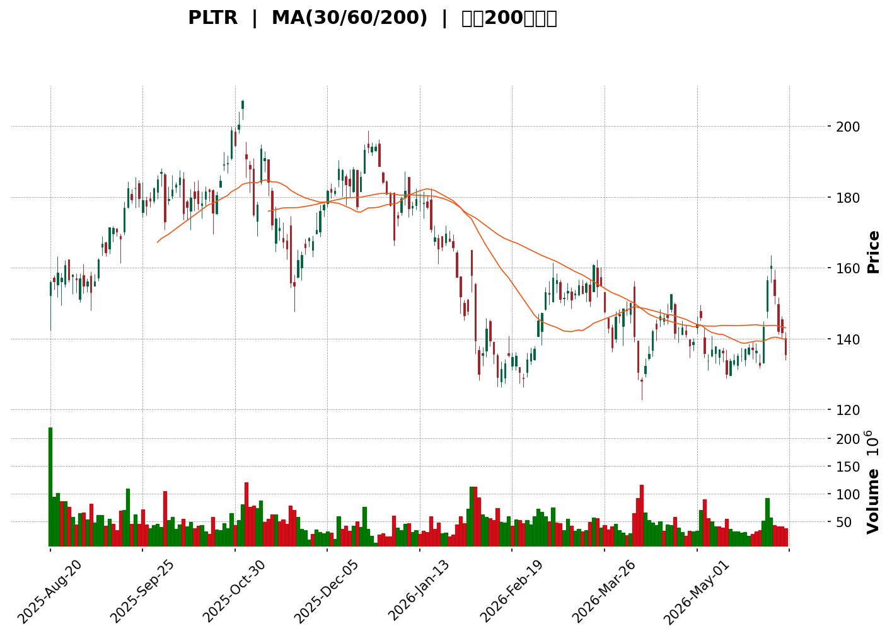
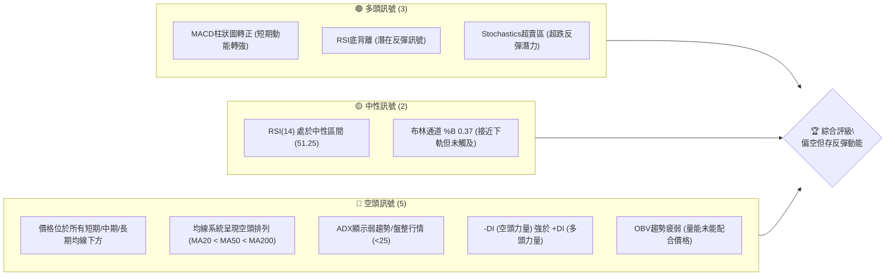

<details>
<summary>📊 靜態圖表 (點擊展開)</summary>

</details>

<html>
<head><meta charset="utf-8" /></head>
<body>
    <div style="height:500px; width:100%;">                        <script>window.PlotlyConfig = {MathJaxConfig: 'local'};</script>
        <script charset="utf-8" src="https://cdn.plot.ly/plotly-3.6.0.min.js" integrity="sha256-QaOVwtVY0T02VaHrr6pnoHLCwayMJp4O5n4YyaE3rJk=" crossorigin="anonymous"></script>                <div id="candlestick-chart" class="plotly-graph-div" style="height:100%; width:100%;"></div>            <script>                window.PLOTLYENV=window.PLOTLYENV || {};                                if (document.getElementById("candlestick-chart")) {                    Plotly.newPlot(                        "candlestick-chart",                        [{"close":{"dtype":"f8","bdata":"AAAA4FGAY0AAAACAwoVjQAAAACCu12NAAAAAoHClY0AAAAAA1xtkQAAAAEAKl2NAAAAAANfDY0AAAABguJZjQAAAAEDhomNAAAAAwMxcY0AAAADgeoRjQAAAACCFI2NAAAAAQDODY0AAAAAghUtkQAAAACCu12RAAAAAIIWLZEAAAACAwm1lQAAAAGC4ZmVAAAAA4FFIZUAAAABgjwplQAAAAEAKH2ZAAAAA4HrMZkAAAABgj2pmQAAAAKCZ0WZAAAAAgOtxZkAAAAAA12NmQAAAAIA9MmZAAAAAIIVbZkAAAACgcM1mQAAAAGBmHmdAAAAAoJlhZ0AAAACAPaJlQAAAAMD1cGZAAAAAoHDFZkAAAACA6\u002fFmQAAAAEAKL2dAAAAAgBTuZUAAAABguCZmQAAAACCud2ZAAAAAANdzZkAAAAAA10NmQAAAAMDMRGZAAAAAQOGyZkAAAADgUbBmQAAAACCu72VAAAAAIFyPZkAAAAAAKRRnQAAAAIDCpWdAAAAAQDOzZ0AAAACA69loQAAAAKCZUWhAAAAAQAoPaUAAAACAwuVpQAAAACCu12dAAAAAwMx8Z0AAAACgmeFlQAAAAIDCPWZAAAAAIIUzaEAAAABguN5nQAAAAKBwBWdAAAAA4HqEZUAAAADgUcBlQAAAAAAAaGVAAAAAYI\u002fqZEAAAACgcK1kQAAAAADXd2NAAAAAQDNbY0AAAAAAAEhkQAAAAKCZcWRAAAAA4KO4ZEAAAABgZg5lQAAAACCu72RAAAAAgBRWZUAAAABgjwJmQAAAAKBwPWZAAAAA4FG4ZkAAAAAgrq9mQAAAAEDhumZAAAAAwB59Z0AAAACgR3FnQAAAAIA98mZAAAAAAADoZkAAAAAAAHhnQAAAAKBHKWZAAAAAgBQ2Z0AAAAAAKSxoQAAAACBcP2hAAAAAAClEaEAAAACgcEVoQAAAAGC4lmdAAAAAgMIFZ0AAAABA4ZpmQAAAAAAAOGZAAAAAIIX7ZEAAAACgR8FlQAAAAGC4dmZAAAAAgMK1ZkAAAAAghRtmQAAAACCuL2ZAAAAAwB5tZkAAAABguF5mQAAAAMDMTGZAAAAAgD0iZkAAAABguF5lQAAAAMD1EGVAAAAAYI+qZEAAAADAzLxkQAAAAEAzM2VAAAAAQArvZEAAAABgZrZkQAAAAEAzq2NAAAAAIIX7YkAAAABA4VJiQAAAAOBReGJAAAAAACm8Y0AAAACgR3FhQAAAAOBRQGBAAAAAwMz8YEAAAADAHt1hQAAAAOBRcGFAAAAAgML1YEAAAAAAKSRgQAAAAMAebWBAAAAA4KOgYEAAAAAAKexgQAAAAOB63GBAAAAAIK7nYEAAAABAM1NgQAAAAEDhGmBAAAAAgBTGYEAAAACAFP5gQAAAAIAUJmFAAAAAoHAlYkAAAABACmdiQAAAAIAUJmNAAAAAoHAVY0AAAADAHqVjQAAAAIDCjWNAAAAA4HrkYkAAAABAM\u002fNiQAAAAAAAMGNAAAAAYGbeYkAAAABAChdjQAAAAGCPYmNAAAAA4KMYY0AAAACAwnVjQAAAAIDC1WJAAAAAQOEaZEAAAADA9VhjQAAAAGC4XmNAAAAAgOtxYkAAAACA6+FhQAAAAKCZMWFAAAAAwPVIYkAAAAAgrk9iQAAAAGC4jmJAAAAAgMJ9YkAAAACAPcJiQAAAAOBRmGFAAAAAIK5PYEAAAACA6wFgQAAAAADXi2BAAAAAYGb2YEAAAADAzMRhQAAAAOBR2GFAAAAA4HpMYkAAAADgejxiQAAAAEAKP2JAAAAAANcTY0AAAACAPbJhQAAAAEDh4mFAAAAAQDPjYUAAAACAwqVhQAAAAEAKP2FAAAAAIIVjYUAAAACAPQJiQAAAAMD1QGJAAAAAwB79YEAAAACgR7lgQAAAAKCZIWFAAAAAoJk5YUAAAADgehxhQAAAAAAAAGFAAAAAoJlBYEAAAAAgXLdgQAAAACCuv2BAAAAA4HrkYEAAAADgUehgQAAAAMDMJGFAAAAAoEctYUAAAAAAKRxhQAAAAEAzE2FAAAAA4FGQYEAAAABA4ephQAAAAKBHkWNAAAAAwMwUZEAAAACgcAVjQAAAAGBmxmFAAAAAYGa2YUAAAADA9fBgQA=="},"high":{"dtype":"f8","bdata":"AAAAYLiOY0AAAABACr9jQAAAAGBmZmRAAAAAQOHSY0AAAAAAKURkQAAAAMDMTGRAAAAAIFzHY0AAAACgcM1jQAAAAOB6zGNAAAAAwMwkZEAAAACgR6FjQAAAAEAK32NAAAAAoJnJY0AAAAAAAFhkQAAAAAAAIGVAAAAA4KfuZEAAAADA9XBlQAAAAKCZeWVAAAAAgOtpZUAAAACAwjVlQAAAAKCZWWZAAAAAoHANZ0AAAAAAAMhmQAAAAAAAOGdAAAAAQDMbZ0AAAACAPQpnQAAAAADXg2ZAAAAAIFyvZkAAAADgo9hmQAAAAMD1SGdAAAAAYGaGZ0AAAABA4VpnQAAAAGBm3mZAAAAAgMJFZ0AAAADgUQhnQAAAAADXc2dAAAAAQDNjZ0AAAABACmdmQAAAAEDhymZAAAAAQDMLZ0AAAACAPRpnQAAAAEDhsmZAAAAAQOHiZkAAAADAcsxmQAAAAGC4xmZAAAAAgOuxZkAAAACgcEVnQAAAAGCPGmhAAAAAwPX4Z0AAAABAM\u002ftoQAAAAKBw9WhAAAAAgMKFaUAAAADgo\u002fBpQAAAAGBmdmhAAAAAgD3KZ0AAAABA4eJnQAAAAGBmVmZAAAAAgMJdaEAAAACgmR1oQAAAAGCP0mdAAAAAYGbWZkAAAACgRylmQAAAACCux2VAAAAAYI+aZUAAAABAMzNlQAAAAIA90mVAAAAAIIXDY0AAAACgcKVkQAAAAMDMlGRAAAAAINkKZUAAAACgmRllQAAAAEAzI2VAAAAAAAD4ZUAAAADAHj1mQAAAAIAUTmZAAAAAYOXEZkAAAAAAKfxmQAAAAEAz22ZAAAAA4HrMZ0AAAACgmYFnQAAAAMDMUGdAAAAAwPV4Z0AAAAAAAJBnQAAAAAAAeGdAAAAAYI9qZ0AAAAAAAGBoQAAAAAAp3GhAAAAAANdraEAAAACgcGVoQAAAAEAzi2hAAAAAYGZmZ0AAAAAAVBdnQAAAAMD1sGZAAAAAQDOrZkAAAACAPfplQAAAAIAUhmZAAAAAwPVoZ0AAAADAHjVnQAAAAEAKV2ZAAAAAAADQZkAAAABAM6NmQAAAAOAis2ZAAAAAQDOTZkAAAACAws1mQAAAAEAKf2VAAAAAIK4vZUAAAAAAACBlQAAAAAAAgGVAAAAAQOFSZUAAAACAFC5lQAAAAKBwoWRAAAAAACm0Y0AAAAAAAOBiQAAAAMDM7GJAAAAAAH+iZEAAAABAM3tjQAAAACBcP2FAAAAA4Ps1YUAAAAAA1ztiQAAAAIDrMWJAAAAAAABoYUAAAADgevxgQAAAAIDrsWBAAAAAgD3KYEAAAADg0J5hQAAAAMAeBWFAAAAAYLgGYUAAAACgR4FgQAAAACCuR2BAAAAAQOECYUAAAADgUTBhQAAAAEAzQ2FAAAAA4HpkYkAAAAAAAHBiQAAAAOCjUGNAAAAAACmMY0AAAABgZi5kQAAAAIAUzmNAAAAAIAaVY0AAAACAaCVjQAAAAAApfGNAAAAAgOtRY0AAAAAghTtjQAAAAAAAmGNAAAAAgBSWY0AAAADAzIRjQAAAAMDMlGNAAAAAYI8iZEAAAADAzExkQAAAAOCjCGRAAAAAANcjY0AAAABguD5iQAAAAADXA2JAAAAAIIV7YkAAAACgmYliQAAAAOBRkGJAAAAAIIXTYkAAAADgo8hiQAAAAMD1iGNAAAAAoEdxYUAAAABgZiZgQAAAAKBwzWBAAAAAgD1CYUAAAABgj9JhQAAAAKCZMWJAAAAAwPWIYkAAAABgZmZiQAAAAADXu2JAAAAAgMIVY0AAAACgR8liQAAAAGCP6mFAAAAAgD0iYkAAAABAM\u002fthQAAAAOBReGFAAAAAYGaGYUAAAACAFE5iQAAAAOB6tGJAAAAAIFzfYUAAAABgZvZgQAAAAGBmnmFAAAAAACk8YUAAAADgeiRhQAAAAIDCLWFAAAAAIK4fYUAAAAAgXM9gQAAAAOB69GBAAAAAgOv9YEAAAABACi9hQAAAACCuJ2FAAAAAoJlRYUAAAADgo2BhQAAAAIDCVWFAAAAAIFz3YEAAAAAAACBiQAAAAKDtuGNAAAAAYGZ2ZEAAAACgmfFjQAAAAIDC9WJAAAAAANdLYkAAAABACr9hQA=="},"hovertemplate":"\u003cb\u003e%{x|%Y-%m-%d}\u003c\u002fb\u003e\u003cbr\u003e\u958b: $%{open:.2f}\u003cbr\u003e\u9ad8: $%{high:.2f}\u003cbr\u003e\u4f4e: $%{low:.2f}\u003cbr\u003e\u6536: $%{close:.2f}\u003cextra\u003e\u003c\u002fextra\u003e","low":{"dtype":"f8","bdata":"AAAAQOHKYUAAAACA6zljQAAAAOCj+GJAAAAAANerYkAAAACAPVJjQAAAACBcf2NAAAAAoJkRY0AAAAAAACBjQAAAAMD1yGJAAAAAYLgWY0AAAADAHiVjQAAAAKBHgWJAAAAAQOFaY0AAAAAA14tjQAAAAIAUbmRAAAAAQApnZEAAAADgUYBkQAAAAMAe7WRAAAAAYLgeZUAAAADgoyhkQAAAAOB6LGVAAAAAYLgWZkAAAACgR0lmQAAAAOBRIGZAAAAAANcjZkAAAACgR8llQAAAAMAe3WVAAAAAwB4lZkAAAABACkdmQAAAAAAAcGZAAAAAYGbeZkAAAADgo1hlQAAAAGCPOmZAAAAAoHBtZkAAAABgZqZmQAAAAGBmfmZAAAAAwPWwZUAAAABgZq5lQAAAAIA9WmVAAAAA4KMAZkAAAABgZg5mQAAAAGBmvmVAAAAAgBQuZkAAAADAzFRmQAAAAKBwLWVAAAAA4FHgZUAAAABAM9tmQAAAAOCjcGdAAAAAwPVYZ0AAAAAgrs9nQAAAAADXQ2hAAAAAoHC9aEAAAACAPTppQAAAAIDrMWdAAAAAYLimZkAAAADA9dBlQAAAAMAeHWVAAAAA4KPwZkAAAAAAKWRnQAAAAMDMjGZAAAAAYGRXZUAAAAAAAJBkQAAAAIDC9WRAAAAAAACwZEAAAACgcE1kQAAAAOCjTGNAAAAAgOtxYkAAAAAAAKBjQAAAAIDCkWNAAAAAACl8ZEAAAAAAALxkQAAAAADXY2RAAAAAQOEyZUAAAABgjxplQAAAAIDCzWVAAAAAwB4lZkAAAACgR3FmQAAAAAApjGZAAAAAAADYZkAAAABguIZmQAAAACBYNWZAAAAAwPWAZkAAAABAi6RmQAAAAAAAEGZAAAAA4FGwZkAAAAAgXFdnQAAAAIDCDWhAAAAAIIX3Z0AAAABgjxpoQAAAAADXk2dAAAAA4Hr0ZkAAAABgZpZmQAAAAAAAKGZAAAAAQDPLZEAAAACgR3llQAAAAOCj2GVAAAAAwB41ZkAAAAAA18tlQAAAAAAA2GVAAAAAQOEKZkAAAADgegRmQAAAAGBmvmVAAAAAwPUQZkAAAADgUUBlQAAAACCux2RAAAAAIIUjZEAAAABgZp5kQAAAAKCZyWRAAAAAYGbqZEAAAACAFJZkQAAAACCup2NAAAAAANdjYkAAAADAciRiQAAAAKDtVGJAAAAAANcjY0AAAACAwvVgQAAAAIA9CmBAAAAAQDOLYEAAAAAA1dhgQAAAAOCjOGFAAAAAYGaeYEAAAAAA16NfQAAAAIDpjl9AAAAAYI\u002fSX0AAAAAA19tgQAAAAOBRYGBAAAAAoHBlYEAAAADA9dhfQAAAACCul19AAAAAgMIlYEAAAAAAKZRgQAAAACBcv2BAAAAA4KOQYUAAAABgZkZhQAAAAIDrgWJAAAAAIIWzYkAAAACgR8liQAAAAEAKH2NAAAAA4HrEYkAAAABgj6piQAAAACBc32JAAAAAYI+SYkAAAACgcOViQAAAAADXA2NAAAAAIIUTY0AAAAAAANBiQAAAAEDhomJAAAAAIK4nY0AAAADgevRiQAAAACBcW2NAAAAAAABoYkAAAACA67FhQAAAAKCZCWFAAAAAQApfYUAAAABACg9iQAAAACCuP2FAAAAAIDFUYkAAAABgZg5iQAAAAKBwZWFAAAAAQAoPYEAAAAAghateQAAAAMDMJGBAAAAAAADAYEAAAACAwt1gQAAAAMD1cGFAAAAAoJnpYUAAAABgj\u002fphQAAAAMD3\u002f2FAAAAAwB5tYkAAAACgcH1hQAAAAIDCXWFAAAAA4FGgYUAAAACgcI1hQAAAAIDC1WBAAAAAwMwUYUAAAADgeqxhQAAAAEAzJ2JAAAAAQArXYEAAAADAzGRgQAAAAMD12GBAAAAA4KOgYEAAAAAArJhgQAAAAGC4rmBAAAAAAAAYYEAAAABgZi5gQAAAAKBHiWBAAAAAYI9qYEAAAABAM7NgQAAAAKBwjWBAAAAAoHDtYEAAAACgmclgQAAAAKCZqWBAAAAAACl0YEAAAAAAAKBgQAAAAKBHOWJAAAAAACl8Y0AAAACgmbliQAAAAAAAqGFAAAAAQLSIYUAAAADAzMBgQA=="},"name":"\u50f9\u683c","open":{"dtype":"f8","bdata":"AAAAoJkJY0AAAACgcKVjQAAAAIAUamNAAAAAQDODY0AAAADgemxjQAAAAIA9SmRAAAAAACm0Y0AAAAAgXJ9jQAAAAGBm5mJAAAAAAADAY0AAAAAgrltjQAAAAIA9umNAAAAAwB5dY0AAAAAAAKhjQAAAAAAAwGRAAAAAIK7nZEAAAABAM6tkQAAAAEAzM2VAAAAAoEdhZUAAAADgoyBlQAAAAOCjSGVAAAAAgD0iZkAAAAAAKZxmQAAAAOBR0GZAAAAAwB79ZkAAAACgmfllQAAAAKCZYWZAAAAA4Hp0ZkAAAAAgXF9mQAAAAIA9qmZAAAAAYGZWZ0AAAADAzExnQAAAAIDCZWZAAAAAgOuJZkAAAACgmdlmQAAAAGCP8mZAAAAAoHAlZ0AAAACAwlVmQAAAAAAAAGZAAAAAwPW0ZkAAAADA9bhmQAAAAAAAOGZAAAAAIK5vZkAAAACA68FmQAAAAIDCvWZAAAAAgD3uZUAAAAAAKdxmQAAAAEAKn2dAAAAAIFyvZ0AAAABgj+JnQAAAAKCZzWhAAAAAYGbmaEAAAACgcKFpQAAAAIA9AmhAAAAAAACgZ0AAAAAgrn9nQAAAAMDMpGVAAAAAgOsJZ0AAAABguMpnQAAAAGCP0mdAAAAAQOG2ZkAAAABAM99kQAAAAMD1UGVAAAAAANcLZUAAAACgmflkQAAAAIA9gmVAAAAA4FGAY0AAAABACq9jQAAAAIA9AmRAAAAAQDPbZEAAAADgUfhkQAAAAAAAoGRAAAAAQOEyZUAAAADgekRlQAAAACCuC2ZAAAAAIFxHZkAAAABguMZmQAAAAEAKn2ZAAAAAYGYeZ0AAAACgmRlnQAAAAIDrOWdAAAAAYI8iZ0AAAADA9bRmQAAAAEDhdmdAAAAA4FGwZkAAAAAgrldnQAAAAKBHYWhAAAAAYGYaaEAAAADAHiVoQAAAAOB6YGhAAAAAQDNbZ0AAAABAMwtnQAAAAAAppGZAAAAAoJmpZkAAAAAAKdxlQAAAAOBR+GVAAAAAoJl5ZkAAAAAgrjNnQAAAAOCjIGZAAAAAgOs1ZkAAAAAAAFxmQAAAAAAARGZAAAAAYLhWZkAAAAAghWtmQAAAAAAA9GRAAAAAIN0MZUAAAACgmR1lQAAAAOCj6GRAAAAAYLgGZUAAAAAgXO9kQAAAAMDMjGRAAAAAACm0Y0AAAACgmcFiQAAAAIAU3mJAAAAAoJmhZEAAAADAHm1jQAAAAIA9GmFAAAAAYI\u002fqYEAAAABgjxJhQAAAAEDhHmJAAAAAwMxgYUAAAAAghetgQAAAAKCZ+V9AAAAA4KMcYEAAAADgevxgQAAAAIDriWBAAAAAIK6LYEAAAACgR4FgQAAAAAApIGBAAAAAIIVTYEAAAABACrtgQAAAAIA9wmBAAAAAwMyYYUAAAABAM8NhQAAAAIDCjWJAAAAAgBQeY0AAAACAFM5iQAAAAIAUdmNAAAAAIK5\u002fY0AAAAAAKexiQAAAAOBRIGNAAAAAoJkpY0AAAABgZg5jQAAAAMD1DGNAAAAAgD1eY0AAAABAMyNjQAAAAGBmZmNAAAAAIK4nY0AAAACAPQJkQAAAAKBwrWNAAAAAgMIhY0AAAAAAKTxiQAAAAOCj6GFAAAAA4KOAYUAAAAAAAGBiQAAAACCF72FAAAAAIIWLYkAAAABgOVxiQAAAAOB6WGNAAAAA4KNsYUAAAAAgXA9gQAAAACBcR2BAAAAAAKrNYEAAAACgRxlhQAAAAKBHCWJAAAAAgBQqYkAAAAAAACBiQAAAAIDrWWJAAAAAIIWLYkAAAABgZrZiQAAAAGC43mFAAAAAAACoYUAAAACgmclhQAAAAOBReGFAAAAAQDNPYUAAAAAAAOhhQAAAAAAAeGJAAAAAoHCJYUAAAABguLZgQAAAAEAz42BAAAAAIK77YEAAAADAHt1gQAAAAEAzE2FAAAAAIDHAYEAAAADAzDRgQAAAAKCZmWBAAAAAAACQYEAAAACgcOVgQAAAAOCjxGBAAAAAoJn5YEAAAACgmS1hQAAAAMAeBWFAAAAAoJmpYEAAAADAHqVgQAAAAGBmemJAAAAAIFz\u002fY0AAAACAFJZjQAAAAGBmtmJAAAAAYLguYkAAAABgEIhhQA=="},"x":["2025-08-20T00:00:00-04:00","2025-08-21T00:00:00-04:00","2025-08-22T00:00:00-04:00","2025-08-25T00:00:00-04:00","2025-08-26T00:00:00-04:00","2025-08-27T00:00:00-04:00","2025-08-28T00:00:00-04:00","2025-08-29T00:00:00-04:00","2025-09-02T00:00:00-04:00","2025-09-03T00:00:00-04:00","2025-09-04T00:00:00-04:00","2025-09-05T00:00:00-04:00","2025-09-08T00:00:00-04:00","2025-09-09T00:00:00-04:00","2025-09-10T00:00:00-04:00","2025-09-11T00:00:00-04:00","2025-09-12T00:00:00-04:00","2025-09-15T00:00:00-04:00","2025-09-16T00:00:00-04:00","2025-09-17T00:00:00-04:00","2025-09-18T00:00:00-04:00","2025-09-19T00:00:00-04:00","2025-09-22T00:00:00-04:00","2025-09-23T00:00:00-04:00","2025-09-24T00:00:00-04:00","2025-09-25T00:00:00-04:00","2025-09-26T00:00:00-04:00","2025-09-29T00:00:00-04:00","2025-09-30T00:00:00-04:00","2025-10-01T00:00:00-04:00","2025-10-02T00:00:00-04:00","2025-10-03T00:00:00-04:00","2025-10-06T00:00:00-04:00","2025-10-07T00:00:00-04:00","2025-10-08T00:00:00-04:00","2025-10-09T00:00:00-04:00","2025-10-10T00:00:00-04:00","2025-10-13T00:00:00-04:00","2025-10-14T00:00:00-04:00","2025-10-15T00:00:00-04:00","2025-10-16T00:00:00-04:00","2025-10-17T00:00:00-04:00","2025-10-20T00:00:00-04:00","2025-10-21T00:00:00-04:00","2025-10-22T00:00:00-04:00","2025-10-23T00:00:00-04:00","2025-10-24T00:00:00-04:00","2025-10-27T00:00:00-04:00","2025-10-28T00:00:00-04:00","2025-10-29T00:00:00-04:00","2025-10-30T00:00:00-04:00","2025-10-31T00:00:00-04:00","2025-11-03T00:00:00-05:00","2025-11-04T00:00:00-05:00","2025-11-05T00:00:00-05:00","2025-11-06T00:00:00-05:00","2025-11-07T00:00:00-05:00","2025-11-10T00:00:00-05:00","2025-11-11T00:00:00-05:00","2025-11-12T00:00:00-05:00","2025-11-13T00:00:00-05:00","2025-11-14T00:00:00-05:00","2025-11-17T00:00:00-05:00","2025-11-18T00:00:00-05:00","2025-11-19T00:00:00-05:00","2025-11-20T00:00:00-05:00","2025-11-21T00:00:00-05:00","2025-11-24T00:00:00-05:00","2025-11-25T00:00:00-05:00","2025-11-26T00:00:00-05:00","2025-11-28T00:00:00-05:00","2025-12-01T00:00:00-05:00","2025-12-02T00:00:00-05:00","2025-12-03T00:00:00-05:00","2025-12-04T00:00:00-05:00","2025-12-05T00:00:00-05:00","2025-12-08T00:00:00-05:00","2025-12-09T00:00:00-05:00","2025-12-10T00:00:00-05:00","2025-12-11T00:00:00-05:00","2025-12-12T00:00:00-05:00","2025-12-15T00:00:00-05:00","2025-12-16T00:00:00-05:00","2025-12-17T00:00:00-05:00","2025-12-18T00:00:00-05:00","2025-12-19T00:00:00-05:00","2025-12-22T00:00:00-05:00","2025-12-23T00:00:00-05:00","2025-12-24T00:00:00-05:00","2025-12-26T00:00:00-05:00","2025-12-29T00:00:00-05:00","2025-12-30T00:00:00-05:00","2025-12-31T00:00:00-05:00","2026-01-02T00:00:00-05:00","2026-01-05T00:00:00-05:00","2026-01-06T00:00:00-05:00","2026-01-07T00:00:00-05:00","2026-01-08T00:00:00-05:00","2026-01-09T00:00:00-05:00","2026-01-12T00:00:00-05:00","2026-01-13T00:00:00-05:00","2026-01-14T00:00:00-05:00","2026-01-15T00:00:00-05:00","2026-01-16T00:00:00-05:00","2026-01-20T00:00:00-05:00","2026-01-21T00:00:00-05:00","2026-01-22T00:00:00-05:00","2026-01-23T00:00:00-05:00","2026-01-26T00:00:00-05:00","2026-01-27T00:00:00-05:00","2026-01-28T00:00:00-05:00","2026-01-29T00:00:00-05:00","2026-01-30T00:00:00-05:00","2026-02-02T00:00:00-05:00","2026-02-03T00:00:00-05:00","2026-02-04T00:00:00-05:00","2026-02-05T00:00:00-05:00","2026-02-06T00:00:00-05:00","2026-02-09T00:00:00-05:00","2026-02-10T00:00:00-05:00","2026-02-11T00:00:00-05:00","2026-02-12T00:00:00-05:00","2026-02-13T00:00:00-05:00","2026-02-17T00:00:00-05:00","2026-02-18T00:00:00-05:00","2026-02-19T00:00:00-05:00","2026-02-20T00:00:00-05:00","2026-02-23T00:00:00-05:00","2026-02-24T00:00:00-05:00","2026-02-25T00:00:00-05:00","2026-02-26T00:00:00-05:00","2026-02-27T00:00:00-05:00","2026-03-02T00:00:00-05:00","2026-03-03T00:00:00-05:00","2026-03-04T00:00:00-05:00","2026-03-05T00:00:00-05:00","2026-03-06T00:00:00-05:00","2026-03-09T00:00:00-04:00","2026-03-10T00:00:00-04:00","2026-03-11T00:00:00-04:00","2026-03-12T00:00:00-04:00","2026-03-13T00:00:00-04:00","2026-03-16T00:00:00-04:00","2026-03-17T00:00:00-04:00","2026-03-18T00:00:00-04:00","2026-03-19T00:00:00-04:00","2026-03-20T00:00:00-04:00","2026-03-23T00:00:00-04:00","2026-03-24T00:00:00-04:00","2026-03-25T00:00:00-04:00","2026-03-26T00:00:00-04:00","2026-03-27T00:00:00-04:00","2026-03-30T00:00:00-04:00","2026-03-31T00:00:00-04:00","2026-04-01T00:00:00-04:00","2026-04-02T00:00:00-04:00","2026-04-06T00:00:00-04:00","2026-04-07T00:00:00-04:00","2026-04-08T00:00:00-04:00","2026-04-09T00:00:00-04:00","2026-04-10T00:00:00-04:00","2026-04-13T00:00:00-04:00","2026-04-14T00:00:00-04:00","2026-04-15T00:00:00-04:00","2026-04-16T00:00:00-04:00","2026-04-17T00:00:00-04:00","2026-04-20T00:00:00-04:00","2026-04-21T00:00:00-04:00","2026-04-22T00:00:00-04:00","2026-04-23T00:00:00-04:00","2026-04-24T00:00:00-04:00","2026-04-27T00:00:00-04:00","2026-04-28T00:00:00-04:00","2026-04-29T00:00:00-04:00","2026-04-30T00:00:00-04:00","2026-05-01T00:00:00-04:00","2026-05-04T00:00:00-04:00","2026-05-05T00:00:00-04:00","2026-05-06T00:00:00-04:00","2026-05-07T00:00:00-04:00","2026-05-08T00:00:00-04:00","2026-05-11T00:00:00-04:00","2026-05-12T00:00:00-04:00","2026-05-13T00:00:00-04:00","2026-05-14T00:00:00-04:00","2026-05-15T00:00:00-04:00","2026-05-18T00:00:00-04:00","2026-05-19T00:00:00-04:00","2026-05-20T00:00:00-04:00","2026-05-21T00:00:00-04:00","2026-05-22T00:00:00-04:00","2026-05-26T00:00:00-04:00","2026-05-27T00:00:00-04:00","2026-05-28T00:00:00-04:00","2026-05-29T00:00:00-04:00","2026-06-01T00:00:00-04:00","2026-06-02T00:00:00-04:00","2026-06-03T00:00:00-04:00","2026-06-04T00:00:00-04:00","2026-06-05T00:00:00-04:00"],"type":"candlestick"},{"hovertemplate":"MA30: $%{y:.2f}\u003cextra\u003e\u003c\u002fextra\u003e","line":{"color":"#2196F3","dash":"dash","width":2},"mode":"lines","name":"MA30","x":["2025-08-20T00:00:00-04:00","2025-08-21T00:00:00-04:00","2025-08-22T00:00:00-04:00","2025-08-25T00:00:00-04:00","2025-08-26T00:00:00-04:00","2025-08-27T00:00:00-04:00","2025-08-28T00:00:00-04:00","2025-08-29T00:00:00-04:00","2025-09-02T00:00:00-04:00","2025-09-03T00:00:00-04:00","2025-09-04T00:00:00-04:00","2025-09-05T00:00:00-04:00","2025-09-08T00:00:00-04:00","2025-09-09T00:00:00-04:00","2025-09-10T00:00:00-04:00","2025-09-11T00:00:00-04:00","2025-09-12T00:00:00-04:00","2025-09-15T00:00:00-04:00","2025-09-16T00:00:00-04:00","2025-09-17T00:00:00-04:00","2025-09-18T00:00:00-04:00","2025-09-19T00:00:00-04:00","2025-09-22T00:00:00-04:00","2025-09-23T00:00:00-04:00","2025-09-24T00:00:00-04:00","2025-09-25T00:00:00-04:00","2025-09-26T00:00:00-04:00","2025-09-29T00:00:00-04:00","2025-09-30T00:00:00-04:00","2025-10-01T00:00:00-04:00","2025-10-02T00:00:00-04:00","2025-10-03T00:00:00-04:00","2025-10-06T00:00:00-04:00","2025-10-07T00:00:00-04:00","2025-10-08T00:00:00-04:00","2025-10-09T00:00:00-04:00","2025-10-10T00:00:00-04:00","2025-10-13T00:00:00-04:00","2025-10-14T00:00:00-04:00","2025-10-15T00:00:00-04:00","2025-10-16T00:00:00-04:00","2025-10-17T00:00:00-04:00","2025-10-20T00:00:00-04:00","2025-10-21T00:00:00-04:00","2025-10-22T00:00:00-04:00","2025-10-23T00:00:00-04:00","2025-10-24T00:00:00-04:00","2025-10-27T00:00:00-04:00","2025-10-28T00:00:00-04:00","2025-10-29T00:00:00-04:00","2025-10-30T00:00:00-04:00","2025-10-31T00:00:00-04:00","2025-11-03T00:00:00-05:00","2025-11-04T00:00:00-05:00","2025-11-05T00:00:00-05:00","2025-11-06T00:00:00-05:00","2025-11-07T00:00:00-05:00","2025-11-10T00:00:00-05:00","2025-11-11T00:00:00-05:00","2025-11-12T00:00:00-05:00","2025-11-13T00:00:00-05:00","2025-11-14T00:00:00-05:00","2025-11-17T00:00:00-05:00","2025-11-18T00:00:00-05:00","2025-11-19T00:00:00-05:00","2025-11-20T00:00:00-05:00","2025-11-21T00:00:00-05:00","2025-11-24T00:00:00-05:00","2025-11-25T00:00:00-05:00","2025-11-26T00:00:00-05:00","2025-11-28T00:00:00-05:00","2025-12-01T00:00:00-05:00","2025-12-02T00:00:00-05:00","2025-12-03T00:00:00-05:00","2025-12-04T00:00:00-05:00","2025-12-05T00:00:00-05:00","2025-12-08T00:00:00-05:00","2025-12-09T00:00:00-05:00","2025-12-10T00:00:00-05:00","2025-12-11T00:00:00-05:00","2025-12-12T00:00:00-05:00","2025-12-15T00:00:00-05:00","2025-12-16T00:00:00-05:00","2025-12-17T00:00:00-05:00","2025-12-18T00:00:00-05:00","2025-12-19T00:00:00-05:00","2025-12-22T00:00:00-05:00","2025-12-23T00:00:00-05:00","2025-12-24T00:00:00-05:00","2025-12-26T00:00:00-05:00","2025-12-29T00:00:00-05:00","2025-12-30T00:00:00-05:00","2025-12-31T00:00:00-05:00","2026-01-02T00:00:00-05:00","2026-01-05T00:00:00-05:00","2026-01-06T00:00:00-05:00","2026-01-07T00:00:00-05:00","2026-01-08T00:00:00-05:00","2026-01-09T00:00:00-05:00","2026-01-12T00:00:00-05:00","2026-01-13T00:00:00-05:00","2026-01-14T00:00:00-05:00","2026-01-15T00:00:00-05:00","2026-01-16T00:00:00-05:00","2026-01-20T00:00:00-05:00","2026-01-21T00:00:00-05:00","2026-01-22T00:00:00-05:00","2026-01-23T00:00:00-05:00","2026-01-26T00:00:00-05:00","2026-01-27T00:00:00-05:00","2026-01-28T00:00:00-05:00","2026-01-29T00:00:00-05:00","2026-01-30T00:00:00-05:00","2026-02-02T00:00:00-05:00","2026-02-03T00:00:00-05:00","2026-02-04T00:00:00-05:00","2026-02-05T00:00:00-05:00","2026-02-06T00:00:00-05:00","2026-02-09T00:00:00-05:00","2026-02-10T00:00:00-05:00","2026-02-11T00:00:00-05:00","2026-02-12T00:00:00-05:00","2026-02-13T00:00:00-05:00","2026-02-17T00:00:00-05:00","2026-02-18T00:00:00-05:00","2026-02-19T00:00:00-05:00","2026-02-20T00:00:00-05:00","2026-02-23T00:00:00-05:00","2026-02-24T00:00:00-05:00","2026-02-25T00:00:00-05:00","2026-02-26T00:00:00-05:00","2026-02-27T00:00:00-05:00","2026-03-02T00:00:00-05:00","2026-03-03T00:00:00-05:00","2026-03-04T00:00:00-05:00","2026-03-05T00:00:00-05:00","2026-03-06T00:00:00-05:00","2026-03-09T00:00:00-04:00","2026-03-10T00:00:00-04:00","2026-03-11T00:00:00-04:00","2026-03-12T00:00:00-04:00","2026-03-13T00:00:00-04:00","2026-03-16T00:00:00-04:00","2026-03-17T00:00:00-04:00","2026-03-18T00:00:00-04:00","2026-03-19T00:00:00-04:00","2026-03-20T00:00:00-04:00","2026-03-23T00:00:00-04:00","2026-03-24T00:00:00-04:00","2026-03-25T00:00:00-04:00","2026-03-26T00:00:00-04:00","2026-03-27T00:00:00-04:00","2026-03-30T00:00:00-04:00","2026-03-31T00:00:00-04:00","2026-04-01T00:00:00-04:00","2026-04-02T00:00:00-04:00","2026-04-06T00:00:00-04:00","2026-04-07T00:00:00-04:00","2026-04-08T00:00:00-04:00","2026-04-09T00:00:00-04:00","2026-04-10T00:00:00-04:00","2026-04-13T00:00:00-04:00","2026-04-14T00:00:00-04:00","2026-04-15T00:00:00-04:00","2026-04-16T00:00:00-04:00","2026-04-17T00:00:00-04:00","2026-04-20T00:00:00-04:00","2026-04-21T00:00:00-04:00","2026-04-22T00:00:00-04:00","2026-04-23T00:00:00-04:00","2026-04-24T00:00:00-04:00","2026-04-27T00:00:00-04:00","2026-04-28T00:00:00-04:00","2026-04-29T00:00:00-04:00","2026-04-30T00:00:00-04:00","2026-05-01T00:00:00-04:00","2026-05-04T00:00:00-04:00","2026-05-05T00:00:00-04:00","2026-05-06T00:00:00-04:00","2026-05-07T00:00:00-04:00","2026-05-08T00:00:00-04:00","2026-05-11T00:00:00-04:00","2026-05-12T00:00:00-04:00","2026-05-13T00:00:00-04:00","2026-05-14T00:00:00-04:00","2026-05-15T00:00:00-04:00","2026-05-18T00:00:00-04:00","2026-05-19T00:00:00-04:00","2026-05-20T00:00:00-04:00","2026-05-21T00:00:00-04:00","2026-05-22T00:00:00-04:00","2026-05-26T00:00:00-04:00","2026-05-27T00:00:00-04:00","2026-05-28T00:00:00-04:00","2026-05-29T00:00:00-04:00","2026-06-01T00:00:00-04:00","2026-06-02T00:00:00-04:00","2026-06-03T00:00:00-04:00","2026-06-04T00:00:00-04:00","2026-06-05T00:00:00-04:00"],"y":{"dtype":"f8","bdata":"AAAAAAAA+H8AAAAAAAD4fwAAAAAAAPh\u002fAAAAAAAA+H8AAAAAAAD4fwAAAAAAAPh\u002fAAAAAAAA+H8AAAAAAAD4fwAAAAAAAPh\u002fAAAAAAAA+H8AAAAAAAD4fwAAAAAAAPh\u002fAAAAAAAA+H8AAAAAAAD4fwAAAAAAAPh\u002fAAAAAAAA+H8AAAAAAAD4fwAAAAAAAPh\u002fAAAAAAAA+H8AAAAAAAD4fwAAAAAAAPh\u002fAAAAAAAA+H8AAAAAAAD4fwAAAAAAAPh\u002fAAAAAAAA+H8AAAAAAAD4fwAAAAAAAPh\u002fAAAAAAAA+H8AAAAAAAD4fwAAACCw5mRA3t3dHcwHZUB3d3c30BllQFVVVUX9L2VAAAAA8KdKZUAiIiLS22JlQM3MzHyGgWVAERERAQCUZUDv7u7e3allQFVVVdUGwmVAq6qqCmXcZUC8u7sL1\u002fNlQCIiIqKMDmZAmpmZGb0pZkAzMzNTKj5mQImIiKh\u002fR2ZA3t3dfbFYZkCamZn5xWZmQKuqqvrweWZAd3d3F5KOZkCamZkpFa9mQM3MzKzVwWZAiYiIuB7VZkAAAACg0\u002fJmQKuqqgqQ+2ZAq6qqanUEZ0CamZkJHgBnQGZmZlaAAGdAIiIiEjwQZ0AAAAAQWBlnQCIiIhKDGGdAVVVVpZsIZ0AzMzNTnAlnQFVVVVXHAGdAZmZmBvPwZkCJiIiYmd1mQAAAALDkvWZA7+7uPu6nZkCrqqoq+ZdmQHd3dze0hmZA7+7uPu53ZkARERGxnW1mQN7d3c0+YmZAERERYZ5WZkARERGh01BmQN7d3S1rU2ZAREREtMhUZkBmZmZGb1FmQHd3d\u002feaSWZAvLu7e81HZkBVVVUFyDtmQAAAAMARMGZAq6qqirMdZkC8u7vb+QhmQLy7uxuh+mVAIiIiokX4ZUAiIiLy0gtmQKuqqqrxHGZAmpmZqX8dZkBEREQ07CBmQN7d3e3DJWZAZmZmppsyZkAiIiKy5DlmQBEREaHTQGZAq6qqWmRBZkAAAAAwlkpmQLy7uzsmZGZAvLu7m8SAZkDNzMwcWpBmQJqZmak4n2ZAq6qqSsWtZkCamZk5+7hmQBEREWGexGZAvLu7i2zLZkAiIiJy9sVmQJqZmVnyu2ZA3t3d3WuqZkARERHByplmQLy7u2u8jGZAAAAA8O52ZkCamZkpo19mQKuqqlqrQ2ZAq6qqyi8iZkDe3d1dSPZlQFVVVbXI1mVAmpmZuR65ZUAAAADQsH9lQM3MzLx0O2VAAAAAEFj9ZECrqqqqqsZkQImIiMgvkmRAzczMDHReZEBmZmbGSydkQN7d3d3d9WNAmpmZObTQY0CJiIh4d6djQO\u002fu7p6od2NAiYiIaB9GY0CJiIhYxxRjQGZmZqbi4GJAMzMzk6awYkDv7u4+w4JiQLy7uyvOVmJAd3d3V8c0YkDNzMy8dBtiQFVVVeUXC2JA7+7u3pb9YUBVVVVFRPRhQKuqqvo35mFAzczMzMzUYUAAAACQwsVhQBEREUGnwWFAMzMzw67AYUCamZmpOMdhQDMzM4MHz2FAREREJJTJYUAAAABwy9phQJqZmbnX8GFAIiIiAnILYkDv7u5OGxhiQBERETGWKGJAmpmZOUI1YkCrqqoKHkRiQLy7u6uqSmJAiYiIiM9YYkDe3d1NqWRiQCIiItIic2JAiYiICKyAYkBERESkcJViQImIiJgnomJAAAAAQDWeYkC8u7t7zZViQM3MzEypkGJAvLu7W4+GYkCJiIjoJoFiQCIiItIGdmJAZmZm9lNvYkAAAACATmNiQJqZmTkmWGJAzczMXLpZYkARERGBB09iQBEREeHsQ2JA7+7uTo07YkDe3d0dPi9iQCIiIvL9HGJAq6qq2msOYkDe3d2NCQJiQLy7u8sT\u002fWFA7+7uPnziYUAzMzOTGMxhQDMzM\u002fP9uGFAIiIi0pSuYUAAAAAAAKhhQO\u002fu7r5YpmFAAAAA4AiVYUCrqqqKbIdhQERERET9d2FA7+7uvlhqYUAAAACgjFphQKuqqtqyVmFAZmZm1hVeYUCamZlJfmdhQM3MzFwBbGFAd3d3R5poYUCrqqo632lhQGZmZhaSeGFAREREBMiHYUAAAADgeo5hQJqZmWl1imFAZmZmhs9+YUAzMzMzXnhhQA=="},"type":"scatter"},{"hovertemplate":"MA60: $%{y:.2f}\u003cextra\u003e\u003c\u002fextra\u003e","line":{"color":"#9C27B0","dash":"dash","width":2},"mode":"lines","name":"MA60","x":["2025-08-20T00:00:00-04:00","2025-08-21T00:00:00-04:00","2025-08-22T00:00:00-04:00","2025-08-25T00:00:00-04:00","2025-08-26T00:00:00-04:00","2025-08-27T00:00:00-04:00","2025-08-28T00:00:00-04:00","2025-08-29T00:00:00-04:00","2025-09-02T00:00:00-04:00","2025-09-03T00:00:00-04:00","2025-09-04T00:00:00-04:00","2025-09-05T00:00:00-04:00","2025-09-08T00:00:00-04:00","2025-09-09T00:00:00-04:00","2025-09-10T00:00:00-04:00","2025-09-11T00:00:00-04:00","2025-09-12T00:00:00-04:00","2025-09-15T00:00:00-04:00","2025-09-16T00:00:00-04:00","2025-09-17T00:00:00-04:00","2025-09-18T00:00:00-04:00","2025-09-19T00:00:00-04:00","2025-09-22T00:00:00-04:00","2025-09-23T00:00:00-04:00","2025-09-24T00:00:00-04:00","2025-09-25T00:00:00-04:00","2025-09-26T00:00:00-04:00","2025-09-29T00:00:00-04:00","2025-09-30T00:00:00-04:00","2025-10-01T00:00:00-04:00","2025-10-02T00:00:00-04:00","2025-10-03T00:00:00-04:00","2025-10-06T00:00:00-04:00","2025-10-07T00:00:00-04:00","2025-10-08T00:00:00-04:00","2025-10-09T00:00:00-04:00","2025-10-10T00:00:00-04:00","2025-10-13T00:00:00-04:00","2025-10-14T00:00:00-04:00","2025-10-15T00:00:00-04:00","2025-10-16T00:00:00-04:00","2025-10-17T00:00:00-04:00","2025-10-20T00:00:00-04:00","2025-10-21T00:00:00-04:00","2025-10-22T00:00:00-04:00","2025-10-23T00:00:00-04:00","2025-10-24T00:00:00-04:00","2025-10-27T00:00:00-04:00","2025-10-28T00:00:00-04:00","2025-10-29T00:00:00-04:00","2025-10-30T00:00:00-04:00","2025-10-31T00:00:00-04:00","2025-11-03T00:00:00-05:00","2025-11-04T00:00:00-05:00","2025-11-05T00:00:00-05:00","2025-11-06T00:00:00-05:00","2025-11-07T00:00:00-05:00","2025-11-10T00:00:00-05:00","2025-11-11T00:00:00-05:00","2025-11-12T00:00:00-05:00","2025-11-13T00:00:00-05:00","2025-11-14T00:00:00-05:00","2025-11-17T00:00:00-05:00","2025-11-18T00:00:00-05:00","2025-11-19T00:00:00-05:00","2025-11-20T00:00:00-05:00","2025-11-21T00:00:00-05:00","2025-11-24T00:00:00-05:00","2025-11-25T00:00:00-05:00","2025-11-26T00:00:00-05:00","2025-11-28T00:00:00-05:00","2025-12-01T00:00:00-05:00","2025-12-02T00:00:00-05:00","2025-12-03T00:00:00-05:00","2025-12-04T00:00:00-05:00","2025-12-05T00:00:00-05:00","2025-12-08T00:00:00-05:00","2025-12-09T00:00:00-05:00","2025-12-10T00:00:00-05:00","2025-12-11T00:00:00-05:00","2025-12-12T00:00:00-05:00","2025-12-15T00:00:00-05:00","2025-12-16T00:00:00-05:00","2025-12-17T00:00:00-05:00","2025-12-18T00:00:00-05:00","2025-12-19T00:00:00-05:00","2025-12-22T00:00:00-05:00","2025-12-23T00:00:00-05:00","2025-12-24T00:00:00-05:00","2025-12-26T00:00:00-05:00","2025-12-29T00:00:00-05:00","2025-12-30T00:00:00-05:00","2025-12-31T00:00:00-05:00","2026-01-02T00:00:00-05:00","2026-01-05T00:00:00-05:00","2026-01-06T00:00:00-05:00","2026-01-07T00:00:00-05:00","2026-01-08T00:00:00-05:00","2026-01-09T00:00:00-05:00","2026-01-12T00:00:00-05:00","2026-01-13T00:00:00-05:00","2026-01-14T00:00:00-05:00","2026-01-15T00:00:00-05:00","2026-01-16T00:00:00-05:00","2026-01-20T00:00:00-05:00","2026-01-21T00:00:00-05:00","2026-01-22T00:00:00-05:00","2026-01-23T00:00:00-05:00","2026-01-26T00:00:00-05:00","2026-01-27T00:00:00-05:00","2026-01-28T00:00:00-05:00","2026-01-29T00:00:00-05:00","2026-01-30T00:00:00-05:00","2026-02-02T00:00:00-05:00","2026-02-03T00:00:00-05:00","2026-02-04T00:00:00-05:00","2026-02-05T00:00:00-05:00","2026-02-06T00:00:00-05:00","2026-02-09T00:00:00-05:00","2026-02-10T00:00:00-05:00","2026-02-11T00:00:00-05:00","2026-02-12T00:00:00-05:00","2026-02-13T00:00:00-05:00","2026-02-17T00:00:00-05:00","2026-02-18T00:00:00-05:00","2026-02-19T00:00:00-05:00","2026-02-20T00:00:00-05:00","2026-02-23T00:00:00-05:00","2026-02-24T00:00:00-05:00","2026-02-25T00:00:00-05:00","2026-02-26T00:00:00-05:00","2026-02-27T00:00:00-05:00","2026-03-02T00:00:00-05:00","2026-03-03T00:00:00-05:00","2026-03-04T00:00:00-05:00","2026-03-05T00:00:00-05:00","2026-03-06T00:00:00-05:00","2026-03-09T00:00:00-04:00","2026-03-10T00:00:00-04:00","2026-03-11T00:00:00-04:00","2026-03-12T00:00:00-04:00","2026-03-13T00:00:00-04:00","2026-03-16T00:00:00-04:00","2026-03-17T00:00:00-04:00","2026-03-18T00:00:00-04:00","2026-03-19T00:00:00-04:00","2026-03-20T00:00:00-04:00","2026-03-23T00:00:00-04:00","2026-03-24T00:00:00-04:00","2026-03-25T00:00:00-04:00","2026-03-26T00:00:00-04:00","2026-03-27T00:00:00-04:00","2026-03-30T00:00:00-04:00","2026-03-31T00:00:00-04:00","2026-04-01T00:00:00-04:00","2026-04-02T00:00:00-04:00","2026-04-06T00:00:00-04:00","2026-04-07T00:00:00-04:00","2026-04-08T00:00:00-04:00","2026-04-09T00:00:00-04:00","2026-04-10T00:00:00-04:00","2026-04-13T00:00:00-04:00","2026-04-14T00:00:00-04:00","2026-04-15T00:00:00-04:00","2026-04-16T00:00:00-04:00","2026-04-17T00:00:00-04:00","2026-04-20T00:00:00-04:00","2026-04-21T00:00:00-04:00","2026-04-22T00:00:00-04:00","2026-04-23T00:00:00-04:00","2026-04-24T00:00:00-04:00","2026-04-27T00:00:00-04:00","2026-04-28T00:00:00-04:00","2026-04-29T00:00:00-04:00","2026-04-30T00:00:00-04:00","2026-05-01T00:00:00-04:00","2026-05-04T00:00:00-04:00","2026-05-05T00:00:00-04:00","2026-05-06T00:00:00-04:00","2026-05-07T00:00:00-04:00","2026-05-08T00:00:00-04:00","2026-05-11T00:00:00-04:00","2026-05-12T00:00:00-04:00","2026-05-13T00:00:00-04:00","2026-05-14T00:00:00-04:00","2026-05-15T00:00:00-04:00","2026-05-18T00:00:00-04:00","2026-05-19T00:00:00-04:00","2026-05-20T00:00:00-04:00","2026-05-21T00:00:00-04:00","2026-05-22T00:00:00-04:00","2026-05-26T00:00:00-04:00","2026-05-27T00:00:00-04:00","2026-05-28T00:00:00-04:00","2026-05-29T00:00:00-04:00","2026-06-01T00:00:00-04:00","2026-06-02T00:00:00-04:00","2026-06-03T00:00:00-04:00","2026-06-04T00:00:00-04:00","2026-06-05T00:00:00-04:00"],"y":{"dtype":"f8","bdata":"AAAAAAAA+H8AAAAAAAD4fwAAAAAAAPh\u002fAAAAAAAA+H8AAAAAAAD4fwAAAAAAAPh\u002fAAAAAAAA+H8AAAAAAAD4fwAAAAAAAPh\u002fAAAAAAAA+H8AAAAAAAD4fwAAAAAAAPh\u002fAAAAAAAA+H8AAAAAAAD4fwAAAAAAAPh\u002fAAAAAAAA+H8AAAAAAAD4fwAAAAAAAPh\u002fAAAAAAAA+H8AAAAAAAD4fwAAAAAAAPh\u002fAAAAAAAA+H8AAAAAAAD4fwAAAAAAAPh\u002fAAAAAAAA+H8AAAAAAAD4fwAAAAAAAPh\u002fAAAAAAAA+H8AAAAAAAD4fwAAAAAAAPh\u002fAAAAAAAA+H8AAAAAAAD4fwAAAAAAAPh\u002fAAAAAAAA+H8AAAAAAAD4fwAAAAAAAPh\u002fAAAAAAAA+H8AAAAAAAD4fwAAAAAAAPh\u002fAAAAAAAA+H8AAAAAAAD4fwAAAAAAAPh\u002fAAAAAAAA+H8AAAAAAAD4fwAAAAAAAPh\u002fAAAAAAAA+H8AAAAAAAD4fwAAAAAAAPh\u002fAAAAAAAA+H8AAAAAAAD4fwAAAAAAAPh\u002fAAAAAAAA+H8AAAAAAAD4fwAAAAAAAPh\u002fAAAAAAAA+H8AAAAAAAD4fwAAAAAAAPh\u002fAAAAAAAA+H8AAAAAAAD4fxEREZmZ\u002f2VAmpmZ4TMIZkBVVVVFthFmQFVVVU1iGGZAMzMze80dZkBVVVW1OiBmQGZmZpa1H2ZAAAAAIPcdZkDNzMyE6yBmQGZmZoZdJGZAzczMpCkqZkBmZmZeujBmQAAAALhlOGZAVVVVvS1AZkAiIiL6fkdmQDMzM2t1TWZAERERGb1WZkAAAACgGlxmQBEREfnFYWZAmpmZyS9rZkB3d3eXbnVmQGZmZrbzeGZAmpmZIWl5ZkDe3d295n1mQDMzM5MYe2ZAZmZmhl1+ZkDe3d19+IVmQImIiAC5jmZA3t3d3d2WZkAiIiIiIp1mQAAAAIAjn2ZA3t3dpZudZkCrqqqCwKFmQDMzM3vNoGZAiYiIsCuZZkBERETkF5RmQN7d3XUFkWZAVVVVbVmUZkC8u7ujKZRmQImIiHD2kmZAzczMxNmSZkBVVVV1TJNmQHd3d5duk2ZAZmZmdgWRZkCamZkJZYtmQLy7u8Ouh2ZAERERSZp\u002fZkC8u7sDnXVmQJqZmbEra2ZA3t3dNV5fZkB3d3eXtU1mQFVVVY3eOWZAq6qqqvEfZkDNzMwcof9lQImIiOi06GVA3t3dLbLYZUARERHhwcVlQLy7uzMzrGVAzczM3GuNZUB3d3dvy3NlQDMzM9v5W2VAmpmZ2YdIZUBEREQ8mDBlQHd3d79YG2VAIiIiSgwJZUBERETUBvlkQFVVVW3n7WRAIiIiAnLjZECrqqq6kNJkQAAAAKgNwGRA7+7u7jWvZEBEREQ8351kQGZmZka2jWRAmpmZ8RmAZEB3d3eXtXBkQHd3dx+FY2RAZmZmXgFUZEAzMzODB0dkQDMzMzN6OWRAZmZm3t0lZEDNzMzcshJkQN7d3U2pAmRA7+7uRm\u002fxY0C8u7uDwN5jQERERBzo0mNA7+7ublnBY0AAAAAgPq1jQDMzMzsmlmNAERERCWWEY0DNzMz8Ym9jQM3MzPxiXWNAMzMzI9tJY0CJiIjotDVjQM3MzEREIGNAERER4cEUY0AzMzNjEAZjQImIiLhl9WJAiYiIuGXjYkBmZmb+G9ViQHd3dx+FwWJAmpmZ6W2nYkBVVVVdSIxiQERERLy7c2JAmpmZWatdYkCrqqrSTU5iQLy7u1uPQGJAq6qqanU2YkCrqqpiyStiQCIiIhovH2JAzczMlEMXYkCJiIgIZQpiQBERERHKAmJAERERCR7+YUC8u7tjO\u002fthQKuqqroC9mFAd3d3\u002f\u002f\u002frYUDv7u5+au5hQKuqqsL19mFAiYiIIPf2YUARERHxGfJhQCIiIhLK8GFA3t3dhevxYUBVVVUFD\u002fZhQFVVVbWB+GFARERENOz2YUBERETsCvZhQDMzMwuQ9WFAvLu7Y4L1YUAiIiKi\u002fvdhQJqZmTlt\u002fGFAMzMziyX+YUCrqqripf5hQM3MzFRV\u002fmFAmpmZ0ZT3YUCamZkRg\u002fVhQERERHRM92FAVVVV\u002fY37YUAAAACw5PhhQJqZmdFN8WFAmpmZ8UTsYUAiIiLasuNhQA=="},"type":"scatter"},{"hovertemplate":"MA200: $%{y:.2f}\u003cextra\u003e\u003c\u002fextra\u003e","line":{"color":"#FF6F00","dash":"solid","width":2},"mode":"lines","name":"MA200","x":["2025-08-20T00:00:00-04:00","2025-08-21T00:00:00-04:00","2025-08-22T00:00:00-04:00","2025-08-25T00:00:00-04:00","2025-08-26T00:00:00-04:00","2025-08-27T00:00:00-04:00","2025-08-28T00:00:00-04:00","2025-08-29T00:00:00-04:00","2025-09-02T00:00:00-04:00","2025-09-03T00:00:00-04:00","2025-09-04T00:00:00-04:00","2025-09-05T00:00:00-04:00","2025-09-08T00:00:00-04:00","2025-09-09T00:00:00-04:00","2025-09-10T00:00:00-04:00","2025-09-11T00:00:00-04:00","2025-09-12T00:00:00-04:00","2025-09-15T00:00:00-04:00","2025-09-16T00:00:00-04:00","2025-09-17T00:00:00-04:00","2025-09-18T00:00:00-04:00","2025-09-19T00:00:00-04:00","2025-09-22T00:00:00-04:00","2025-09-23T00:00:00-04:00","2025-09-24T00:00:00-04:00","2025-09-25T00:00:00-04:00","2025-09-26T00:00:00-04:00","2025-09-29T00:00:00-04:00","2025-09-30T00:00:00-04:00","2025-10-01T00:00:00-04:00","2025-10-02T00:00:00-04:00","2025-10-03T00:00:00-04:00","2025-10-06T00:00:00-04:00","2025-10-07T00:00:00-04:00","2025-10-08T00:00:00-04:00","2025-10-09T00:00:00-04:00","2025-10-10T00:00:00-04:00","2025-10-13T00:00:00-04:00","2025-10-14T00:00:00-04:00","2025-10-15T00:00:00-04:00","2025-10-16T00:00:00-04:00","2025-10-17T00:00:00-04:00","2025-10-20T00:00:00-04:00","2025-10-21T00:00:00-04:00","2025-10-22T00:00:00-04:00","2025-10-23T00:00:00-04:00","2025-10-24T00:00:00-04:00","2025-10-27T00:00:00-04:00","2025-10-28T00:00:00-04:00","2025-10-29T00:00:00-04:00","2025-10-30T00:00:00-04:00","2025-10-31T00:00:00-04:00","2025-11-03T00:00:00-05:00","2025-11-04T00:00:00-05:00","2025-11-05T00:00:00-05:00","2025-11-06T00:00:00-05:00","2025-11-07T00:00:00-05:00","2025-11-10T00:00:00-05:00","2025-11-11T00:00:00-05:00","2025-11-12T00:00:00-05:00","2025-11-13T00:00:00-05:00","2025-11-14T00:00:00-05:00","2025-11-17T00:00:00-05:00","2025-11-18T00:00:00-05:00","2025-11-19T00:00:00-05:00","2025-11-20T00:00:00-05:00","2025-11-21T00:00:00-05:00","2025-11-24T00:00:00-05:00","2025-11-25T00:00:00-05:00","2025-11-26T00:00:00-05:00","2025-11-28T00:00:00-05:00","2025-12-01T00:00:00-05:00","2025-12-02T00:00:00-05:00","2025-12-03T00:00:00-05:00","2025-12-04T00:00:00-05:00","2025-12-05T00:00:00-05:00","2025-12-08T00:00:00-05:00","2025-12-09T00:00:00-05:00","2025-12-10T00:00:00-05:00","2025-12-11T00:00:00-05:00","2025-12-12T00:00:00-05:00","2025-12-15T00:00:00-05:00","2025-12-16T00:00:00-05:00","2025-12-17T00:00:00-05:00","2025-12-18T00:00:00-05:00","2025-12-19T00:00:00-05:00","2025-12-22T00:00:00-05:00","2025-12-23T00:00:00-05:00","2025-12-24T00:00:00-05:00","2025-12-26T00:00:00-05:00","2025-12-29T00:00:00-05:00","2025-12-30T00:00:00-05:00","2025-12-31T00:00:00-05:00","2026-01-02T00:00:00-05:00","2026-01-05T00:00:00-05:00","2026-01-06T00:00:00-05:00","2026-01-07T00:00:00-05:00","2026-01-08T00:00:00-05:00","2026-01-09T00:00:00-05:00","2026-01-12T00:00:00-05:00","2026-01-13T00:00:00-05:00","2026-01-14T00:00:00-05:00","2026-01-15T00:00:00-05:00","2026-01-16T00:00:00-05:00","2026-01-20T00:00:00-05:00","2026-01-21T00:00:00-05:00","2026-01-22T00:00:00-05:00","2026-01-23T00:00:00-05:00","2026-01-26T00:00:00-05:00","2026-01-27T00:00:00-05:00","2026-01-28T00:00:00-05:00","2026-01-29T00:00:00-05:00","2026-01-30T00:00:00-05:00","2026-02-02T00:00:00-05:00","2026-02-03T00:00:00-05:00","2026-02-04T00:00:00-05:00","2026-02-05T00:00:00-05:00","2026-02-06T00:00:00-05:00","2026-02-09T00:00:00-05:00","2026-02-10T00:00:00-05:00","2026-02-11T00:00:00-05:00","2026-02-12T00:00:00-05:00","2026-02-13T00:00:00-05:00","2026-02-17T00:00:00-05:00","2026-02-18T00:00:00-05:00","2026-02-19T00:00:00-05:00","2026-02-20T00:00:00-05:00","2026-02-23T00:00:00-05:00","2026-02-24T00:00:00-05:00","2026-02-25T00:00:00-05:00","2026-02-26T00:00:00-05:00","2026-02-27T00:00:00-05:00","2026-03-02T00:00:00-05:00","2026-03-03T00:00:00-05:00","2026-03-04T00:00:00-05:00","2026-03-05T00:00:00-05:00","2026-03-06T00:00:00-05:00","2026-03-09T00:00:00-04:00","2026-03-10T00:00:00-04:00","2026-03-11T00:00:00-04:00","2026-03-12T00:00:00-04:00","2026-03-13T00:00:00-04:00","2026-03-16T00:00:00-04:00","2026-03-17T00:00:00-04:00","2026-03-18T00:00:00-04:00","2026-03-19T00:00:00-04:00","2026-03-20T00:00:00-04:00","2026-03-23T00:00:00-04:00","2026-03-24T00:00:00-04:00","2026-03-25T00:00:00-04:00","2026-03-26T00:00:00-04:00","2026-03-27T00:00:00-04:00","2026-03-30T00:00:00-04:00","2026-03-31T00:00:00-04:00","2026-04-01T00:00:00-04:00","2026-04-02T00:00:00-04:00","2026-04-06T00:00:00-04:00","2026-04-07T00:00:00-04:00","2026-04-08T00:00:00-04:00","2026-04-09T00:00:00-04:00","2026-04-10T00:00:00-04:00","2026-04-13T00:00:00-04:00","2026-04-14T00:00:00-04:00","2026-04-15T00:00:00-04:00","2026-04-16T00:00:00-04:00","2026-04-17T00:00:00-04:00","2026-04-20T00:00:00-04:00","2026-04-21T00:00:00-04:00","2026-04-22T00:00:00-04:00","2026-04-23T00:00:00-04:00","2026-04-24T00:00:00-04:00","2026-04-27T00:00:00-04:00","2026-04-28T00:00:00-04:00","2026-04-29T00:00:00-04:00","2026-04-30T00:00:00-04:00","2026-05-01T00:00:00-04:00","2026-05-04T00:00:00-04:00","2026-05-05T00:00:00-04:00","2026-05-06T00:00:00-04:00","2026-05-07T00:00:00-04:00","2026-05-08T00:00:00-04:00","2026-05-11T00:00:00-04:00","2026-05-12T00:00:00-04:00","2026-05-13T00:00:00-04:00","2026-05-14T00:00:00-04:00","2026-05-15T00:00:00-04:00","2026-05-18T00:00:00-04:00","2026-05-19T00:00:00-04:00","2026-05-20T00:00:00-04:00","2026-05-21T00:00:00-04:00","2026-05-22T00:00:00-04:00","2026-05-26T00:00:00-04:00","2026-05-27T00:00:00-04:00","2026-05-28T00:00:00-04:00","2026-05-29T00:00:00-04:00","2026-06-01T00:00:00-04:00","2026-06-02T00:00:00-04:00","2026-06-03T00:00:00-04:00","2026-06-04T00:00:00-04:00","2026-06-05T00:00:00-04:00"],"y":{"dtype":"f8","bdata":"AAAAAAAA+H8AAAAAAAD4fwAAAAAAAPh\u002fAAAAAAAA+H8AAAAAAAD4fwAAAAAAAPh\u002fAAAAAAAA+H8AAAAAAAD4fwAAAAAAAPh\u002fAAAAAAAA+H8AAAAAAAD4fwAAAAAAAPh\u002fAAAAAAAA+H8AAAAAAAD4fwAAAAAAAPh\u002fAAAAAAAA+H8AAAAAAAD4fwAAAAAAAPh\u002fAAAAAAAA+H8AAAAAAAD4fwAAAAAAAPh\u002fAAAAAAAA+H8AAAAAAAD4fwAAAAAAAPh\u002fAAAAAAAA+H8AAAAAAAD4fwAAAAAAAPh\u002fAAAAAAAA+H8AAAAAAAD4fwAAAAAAAPh\u002fAAAAAAAA+H8AAAAAAAD4fwAAAAAAAPh\u002fAAAAAAAA+H8AAAAAAAD4fwAAAAAAAPh\u002fAAAAAAAA+H8AAAAAAAD4fwAAAAAAAPh\u002fAAAAAAAA+H8AAAAAAAD4fwAAAAAAAPh\u002fAAAAAAAA+H8AAAAAAAD4fwAAAAAAAPh\u002fAAAAAAAA+H8AAAAAAAD4fwAAAAAAAPh\u002fAAAAAAAA+H8AAAAAAAD4fwAAAAAAAPh\u002fAAAAAAAA+H8AAAAAAAD4fwAAAAAAAPh\u002fAAAAAAAA+H8AAAAAAAD4fwAAAAAAAPh\u002fAAAAAAAA+H8AAAAAAAD4fwAAAAAAAPh\u002fAAAAAAAA+H8AAAAAAAD4fwAAAAAAAPh\u002fAAAAAAAA+H8AAAAAAAD4fwAAAAAAAPh\u002fAAAAAAAA+H8AAAAAAAD4fwAAAAAAAPh\u002fAAAAAAAA+H8AAAAAAAD4fwAAAAAAAPh\u002fAAAAAAAA+H8AAAAAAAD4fwAAAAAAAPh\u002fAAAAAAAA+H8AAAAAAAD4fwAAAAAAAPh\u002fAAAAAAAA+H8AAAAAAAD4fwAAAAAAAPh\u002fAAAAAAAA+H8AAAAAAAD4fwAAAAAAAPh\u002fAAAAAAAA+H8AAAAAAAD4fwAAAAAAAPh\u002fAAAAAAAA+H8AAAAAAAD4fwAAAAAAAPh\u002fAAAAAAAA+H8AAAAAAAD4fwAAAAAAAPh\u002fAAAAAAAA+H8AAAAAAAD4fwAAAAAAAPh\u002fAAAAAAAA+H8AAAAAAAD4fwAAAAAAAPh\u002fAAAAAAAA+H8AAAAAAAD4fwAAAAAAAPh\u002fAAAAAAAA+H8AAAAAAAD4fwAAAAAAAPh\u002fAAAAAAAA+H8AAAAAAAD4fwAAAAAAAPh\u002fAAAAAAAA+H8AAAAAAAD4fwAAAAAAAPh\u002fAAAAAAAA+H8AAAAAAAD4fwAAAAAAAPh\u002fAAAAAAAA+H8AAAAAAAD4fwAAAAAAAPh\u002fAAAAAAAA+H8AAAAAAAD4fwAAAAAAAPh\u002fAAAAAAAA+H8AAAAAAAD4fwAAAAAAAPh\u002fAAAAAAAA+H8AAAAAAAD4fwAAAAAAAPh\u002fAAAAAAAA+H8AAAAAAAD4fwAAAAAAAPh\u002fAAAAAAAA+H8AAAAAAAD4fwAAAAAAAPh\u002fAAAAAAAA+H8AAAAAAAD4fwAAAAAAAPh\u002fAAAAAAAA+H8AAAAAAAD4fwAAAAAAAPh\u002fAAAAAAAA+H8AAAAAAAD4fwAAAAAAAPh\u002fAAAAAAAA+H8AAAAAAAD4fwAAAAAAAPh\u002fAAAAAAAA+H8AAAAAAAD4fwAAAAAAAPh\u002fAAAAAAAA+H8AAAAAAAD4fwAAAAAAAPh\u002fAAAAAAAA+H8AAAAAAAD4fwAAAAAAAPh\u002fAAAAAAAA+H8AAAAAAAD4fwAAAAAAAPh\u002fAAAAAAAA+H8AAAAAAAD4fwAAAAAAAPh\u002fAAAAAAAA+H8AAAAAAAD4fwAAAAAAAPh\u002fAAAAAAAA+H8AAAAAAAD4fwAAAAAAAPh\u002fAAAAAAAA+H8AAAAAAAD4fwAAAAAAAPh\u002fAAAAAAAA+H8AAAAAAAD4fwAAAAAAAPh\u002fAAAAAAAA+H8AAAAAAAD4fwAAAAAAAPh\u002fAAAAAAAA+H8AAAAAAAD4fwAAAAAAAPh\u002fAAAAAAAA+H8AAAAAAAD4fwAAAAAAAPh\u002fAAAAAAAA+H8AAAAAAAD4fwAAAAAAAPh\u002fAAAAAAAA+H8AAAAAAAD4fwAAAAAAAPh\u002fAAAAAAAA+H8AAAAAAAD4fwAAAAAAAPh\u002fAAAAAAAA+H8AAAAAAAD4fwAAAAAAAPh\u002fAAAAAAAA+H8AAAAAAAD4fwAAAAAAAPh\u002fAAAAAAAA+H8AAAAAAAD4fwAAAAAAAPh\u002fAAAAAAAA+H+uR+FWWyJkQA=="},"type":"scatter"}],                        {"template":{"data":{"barpolar":[{"marker":{"line":{"color":"rgb(17,17,17)","width":0.5},"pattern":{"fillmode":"overlay","size":10,"solidity":0.2}},"type":"barpolar"}],"bar":[{"error_x":{"color":"#f2f5fa"},"error_y":{"color":"#f2f5fa"},"marker":{"line":{"color":"rgb(17,17,17)","width":0.5},"pattern":{"fillmode":"overlay","size":10,"solidity":0.2}},"type":"bar"}],"carpet":[{"aaxis":{"endlinecolor":"#A2B1C6","gridcolor":"#506784","linecolor":"#506784","minorgridcolor":"#506784","startlinecolor":"#A2B1C6"},"baxis":{"endlinecolor":"#A2B1C6","gridcolor":"#506784","linecolor":"#506784","minorgridcolor":"#506784","startlinecolor":"#A2B1C6"},"type":"carpet"}],"choropleth":[{"colorbar":{"outlinewidth":0,"ticks":""},"type":"choropleth"}],"contourcarpet":[{"colorbar":{"outlinewidth":0,"ticks":""},"type":"contourcarpet"}],"contour":[{"colorbar":{"outlinewidth":0,"ticks":""},"colorscale":[[0.0,"#0d0887"],[0.1111111111111111,"#46039f"],[0.2222222222222222,"#7201a8"],[0.3333333333333333,"#9c179e"],[0.4444444444444444,"#bd3786"],[0.5555555555555556,"#d8576b"],[0.6666666666666666,"#ed7953"],[0.7777777777777778,"#fb9f3a"],[0.8888888888888888,"#fdca26"],[1.0,"#f0f921"]],"type":"contour"}],"heatmap":[{"colorbar":{"outlinewidth":0,"ticks":""},"colorscale":[[0.0,"#0d0887"],[0.1111111111111111,"#46039f"],[0.2222222222222222,"#7201a8"],[0.3333333333333333,"#9c179e"],[0.4444444444444444,"#bd3786"],[0.5555555555555556,"#d8576b"],[0.6666666666666666,"#ed7953"],[0.7777777777777778,"#fb9f3a"],[0.8888888888888888,"#fdca26"],[1.0,"#f0f921"]],"type":"heatmap"}],"histogram2dcontour":[{"colorbar":{"outlinewidth":0,"ticks":""},"colorscale":[[0.0,"#0d0887"],[0.1111111111111111,"#46039f"],[0.2222222222222222,"#7201a8"],[0.3333333333333333,"#9c179e"],[0.4444444444444444,"#bd3786"],[0.5555555555555556,"#d8576b"],[0.6666666666666666,"#ed7953"],[0.7777777777777778,"#fb9f3a"],[0.8888888888888888,"#fdca26"],[1.0,"#f0f921"]],"type":"histogram2dcontour"}],"histogram2d":[{"colorbar":{"outlinewidth":0,"ticks":""},"colorscale":[[0.0,"#0d0887"],[0.1111111111111111,"#46039f"],[0.2222222222222222,"#7201a8"],[0.3333333333333333,"#9c179e"],[0.4444444444444444,"#bd3786"],[0.5555555555555556,"#d8576b"],[0.6666666666666666,"#ed7953"],[0.7777777777777778,"#fb9f3a"],[0.8888888888888888,"#fdca26"],[1.0,"#f0f921"]],"type":"histogram2d"}],"histogram":[{"marker":{"pattern":{"fillmode":"overlay","size":10,"solidity":0.2}},"type":"histogram"}],"mesh3d":[{"colorbar":{"outlinewidth":0,"ticks":""},"type":"mesh3d"}],"parcoords":[{"line":{"colorbar":{"outlinewidth":0,"ticks":""}},"type":"parcoords"}],"pie":[{"automargin":true,"type":"pie"}],"scatter3d":[{"line":{"colorbar":{"outlinewidth":0,"ticks":""}},"marker":{"colorbar":{"outlinewidth":0,"ticks":""}},"type":"scatter3d"}],"scattercarpet":[{"marker":{"colorbar":{"outlinewidth":0,"ticks":""}},"type":"scattercarpet"}],"scattergeo":[{"marker":{"colorbar":{"outlinewidth":0,"ticks":""}},"type":"scattergeo"}],"scattergl":[{"marker":{"line":{"color":"#283442"}},"type":"scattergl"}],"scattermapbox":[{"marker":{"colorbar":{"outlinewidth":0,"ticks":""}},"type":"scattermapbox"}],"scattermap":[{"marker":{"colorbar":{"outlinewidth":0,"ticks":""}},"type":"scattermap"}],"scatterpolargl":[{"marker":{"colorbar":{"outlinewidth":0,"ticks":""}},"type":"scatterpolargl"}],"scatterpolar":[{"marker":{"colorbar":{"outlinewidth":0,"ticks":""}},"type":"scatterpolar"}],"scatter":[{"marker":{"line":{"color":"#283442"}},"type":"scatter"}],"scatterternary":[{"marker":{"colorbar":{"outlinewidth":0,"ticks":""}},"type":"scatterternary"}],"surface":[{"colorbar":{"outlinewidth":0,"ticks":""},"colorscale":[[0.0,"#0d0887"],[0.1111111111111111,"#46039f"],[0.2222222222222222,"#7201a8"],[0.3333333333333333,"#9c179e"],[0.4444444444444444,"#bd3786"],[0.5555555555555556,"#d8576b"],[0.6666666666666666,"#ed7953"],[0.7777777777777778,"#fb9f3a"],[0.8888888888888888,"#fdca26"],[1.0,"#f0f921"]],"type":"surface"}],"table":[{"cells":{"fill":{"color":"#506784"},"line":{"color":"rgb(17,17,17)"}},"header":{"fill":{"color":"#2a3f5f"},"line":{"color":"rgb(17,17,17)"}},"type":"table"}]},"layout":{"annotationdefaults":{"arrowcolor":"#f2f5fa","arrowhead":0,"arrowwidth":1},"autotypenumbers":"strict","coloraxis":{"colorbar":{"outlinewidth":0,"ticks":""}},"colorscale":{"diverging":[[0,"#8e0152"],[0.1,"#c51b7d"],[0.2,"#de77ae"],[0.3,"#f1b6da"],[0.4,"#fde0ef"],[0.5,"#f7f7f7"],[0.6,"#e6f5d0"],[0.7,"#b8e186"],[0.8,"#7fbc41"],[0.9,"#4d9221"],[1,"#276419"]],"sequential":[[0.0,"#0d0887"],[0.1111111111111111,"#46039f"],[0.2222222222222222,"#7201a8"],[0.3333333333333333,"#9c179e"],[0.4444444444444444,"#bd3786"],[0.5555555555555556,"#d8576b"],[0.6666666666666666,"#ed7953"],[0.7777777777777778,"#fb9f3a"],[0.8888888888888888,"#fdca26"],[1.0,"#f0f921"]],"sequentialminus":[[0.0,"#0d0887"],[0.1111111111111111,"#46039f"],[0.2222222222222222,"#7201a8"],[0.3333333333333333,"#9c179e"],[0.4444444444444444,"#bd3786"],[0.5555555555555556,"#d8576b"],[0.6666666666666666,"#ed7953"],[0.7777777777777778,"#fb9f3a"],[0.8888888888888888,"#fdca26"],[1.0,"#f0f921"]]},"colorway":["#636efa","#EF553B","#00cc96","#ab63fa","#FFA15A","#19d3f3","#FF6692","#B6E880","#FF97FF","#FECB52"],"font":{"color":"#f2f5fa"},"geo":{"bgcolor":"rgb(17,17,17)","lakecolor":"rgb(17,17,17)","landcolor":"rgb(17,17,17)","showlakes":true,"showland":true,"subunitcolor":"#506784"},"hoverlabel":{"align":"left"},"hovermode":"closest","mapbox":{"style":"dark"},"paper_bgcolor":"rgb(17,17,17)","plot_bgcolor":"rgb(17,17,17)","polar":{"angularaxis":{"gridcolor":"#506784","linecolor":"#506784","ticks":""},"bgcolor":"rgb(17,17,17)","radialaxis":{"gridcolor":"#506784","linecolor":"#506784","ticks":""}},"scene":{"xaxis":{"backgroundcolor":"rgb(17,17,17)","gridcolor":"#506784","gridwidth":2,"linecolor":"#506784","showbackground":true,"ticks":"","zerolinecolor":"#C8D4E3"},"yaxis":{"backgroundcolor":"rgb(17,17,17)","gridcolor":"#506784","gridwidth":2,"linecolor":"#506784","showbackground":true,"ticks":"","zerolinecolor":"#C8D4E3"},"zaxis":{"backgroundcolor":"rgb(17,17,17)","gridcolor":"#506784","gridwidth":2,"linecolor":"#506784","showbackground":true,"ticks":"","zerolinecolor":"#C8D4E3"}},"shapedefaults":{"line":{"color":"#f2f5fa"}},"sliderdefaults":{"bgcolor":"#C8D4E3","bordercolor":"rgb(17,17,17)","borderwidth":1,"tickwidth":0},"ternary":{"aaxis":{"gridcolor":"#506784","linecolor":"#506784","ticks":""},"baxis":{"gridcolor":"#506784","linecolor":"#506784","ticks":""},"bgcolor":"rgb(17,17,17)","caxis":{"gridcolor":"#506784","linecolor":"#506784","ticks":""}},"title":{"x":0.05},"updatemenudefaults":{"bgcolor":"#506784","borderwidth":0},"xaxis":{"automargin":true,"gridcolor":"#283442","linecolor":"#506784","ticks":"","title":{"standoff":15},"zerolinecolor":"#283442","zerolinewidth":2},"yaxis":{"automargin":true,"gridcolor":"#283442","linecolor":"#506784","ticks":"","title":{"standoff":15},"zerolinecolor":"#283442","zerolinewidth":2}}},"xaxis":{"rangeslider":{"visible":false},"title":{"text":"\u65e5\u671f"}},"font":{"size":11},"title":{"text":"PLTR  |  MA(30\u002f60\u002f200)  |  \u6700\u8fd1200\u4ea4\u6613\u65e5"},"yaxis":{"title":{"text":"\u80a1\u50f9 (USD)"}},"hovermode":"x unified","height":500},                        {"responsive": true}                    )                };            </script>        </div>
</body>
</html>

# PLTR 技術分析報告

> **報告日期**：2026-06-05 ｜ **語言**：繁體中文 ｜ **數據來源**：Yahoo Finance ｜ **當前價格**：$135.53

---

## 目錄

| 章節 | 內容 |
|------|------|
| [1. 技術面概覽](#1-技術面概覽) | 訊號儀表板、核心指標、評分卡 |
| [2. 趨勢分析](#2-趨勢分析) | 多時框趨勢、長中短期走勢 |
| [3. 圖表形態分析](#3-圖表形態分析) | 形態識別、K線組合、目標價 |
| [4. 支撐與阻力](#4-支撐與阻力) | 關鍵價位、斐波那契回調 |
| [5. 技術指標深度解讀](#5-技術指標深度解讀) | MA/RSI/MACD/布林/成交量 |
| [6. 動能與波動率](#6-動能與波動率) | 動能評估、ATR、Beta |
| [7. 多時框架總結](#7-多時框架總結) | 時框架評分矩陣 |
| [8. 交易策略建議](#8-交易策略建議) | 多空策略、風險報酬比 |
| [9. 風險提示與監控](#9-風險提示與監控) | 監控指標、風險場景 |

---

## 1. 技術面概覽

本章節將對 Palantir Technologies Inc. (PLTR) 的整體技術面進行快速掃描，透過訊號儀表板、核心指標速覽表及技術評分卡，為投資者提供一個即時且全面的市場情緒與潛力評估。當前價格 $135.53 處於 52 週區間的 18.7%，顯示股價已從高點大幅回落，正接近其年度低點。

### 🎯 技術訊號儀表板

以下 Mermaid 圖表展示了 PLTR 當前技術訊號的多空分佈，協助快速理解市場力量的平衡狀態。


**儀表板解讀**：
當前 PLTR 的技術訊號呈現多空交織的複雜局面。多頭訊號主要來自於動能指標的短期改善（MACD柱狀圖轉正、RSI底背離、Stochastics超賣），這些通常被視為在下跌趨勢中可能出現的反彈或趨勢轉折的早期跡象。然而，空頭訊號則顯著且數量更多，尤其在趨勢與均線系統方面，價格明確處於所有關鍵移動平均線下方，且均線呈現標準的空頭排列，ADX指示趨勢力量薄弱且空頭佔優。這表明儘管短期存在反彈可能，但整體結構性弱勢依然明顯。

### 📊 核心指標速覽表

下表列出 PLTR 當前各項核心技術指標的數值與初步解讀。

| 指標類別 | 指標名稱 | 當前數值 | 訊號 | 解讀 |
|----------|----------|----------|------|------|
| **價格** | 當前收盤價 | $135.53 | 🔴 | 位於 52W 區間底部 (18.7%)，接近年度低點。 |
| **均線** | MA20 | $139.58 | 🔴 | 價格位於 MA20 下方，短期趨勢偏空。 |
| **均線** | MA50 | $140.90 | 🔴 | 價格位於 MA50 下方，中期趨勢偏空。 |
| **均線** | MA200 | $161.07 | 🔴 | 價格位於 MA200 下方，長期趨勢由多轉空或修正。 |
| **動能** | RSI(14) | 51.25 | 🟡 | 處於中性區間，無明顯超買超賣，但存在底背離。 |
| **動能** | MACD Hist | +0.301 | 🟢 | MACD柱狀圖轉正，顯示短期動能由空轉多。 |
| **動能** | Stoch %K | 12.97 | 🟢 | 處於超賣區間，暗示股價可能超跌，有反彈需求。 |
| **趨勢** | ADX(14) | 14.50 | 🟡 | 趨勢強度弱於 25，表明當前為盤整或弱勢趨勢。 |
| **趨勢** | -DI | 30.76 | 🔴 | 空頭力量 (+DI 26.57)，空頭主導市場。 |
| **波動** | ATR(14) | $7.29 | 🟡 | 日均波動幅度約為 5.38%，波動性中等偏高。 |
| **量能** | OBV趨勢 | OBV < MA | 🔴 | 量能疲弱，未能有效支撐價格，下跌趨勢缺乏買盤確認。 |

### 🏆 技術評分卡

本評分卡旨在量化 PLTR 當前技術面的各個維度，並提供綜合評級。

```
╔══════════════════════════════════════════════════════════════════╗
║                    技術評分卡 — PLTR (2026-06-05)                   ║
╠══════════════════════════════════════════════════════════════════╣
║ 趨勢強度      █████░░░░░░░░░░░░░░░░  25/100  🔴 (ADX弱且空頭主導)   ║
║ 動能指標      ██████████░░░░░░░░░░  50/100  🟡 (MACD轉正，RSI/Stoch背離)║
║ 支撐穩定度    ██████░░░░░░░░░░░░░░  30/100  🔴 (接近52W低點，均線壓力重重)║
║ 成交量配合    ████░░░░░░░░░░░░░░░░  20/100  🔴 (OBV疲弱，量能不足)   ║
║ 形態完整度    ███████░░░░░░░░░░░░░  35/100  🟡 (潛在下降形態，待確認)  ║
║ 均線排列      ██░░░░░░░░░░░░░░░░░░  10/100  🔴 (典型空頭排列)     ║
╠══════════════════════════════════════════════════════════════════╣
║ 綜合評分      ████░░░░░░░░░░░░░░░░  30/100  🔴 偏空，但短期存在反彈需求 ║
╚══════════════════════════════════════════════════════════════════╝
```
**評分卡總結**：
PLTR 的技術評分顯示整體處於弱勢，綜合評分為 30/100，評級為🔴偏空。尤其在趨勢強度、均線排列和成交量配合方面表現極差，表明市場對該股的看空情緒濃厚，且缺乏買盤支撐。儘管動能指標顯示短期存在反彈的可能性（如MACD柱狀圖轉正、RSI底背離和Stochastics超賣），這些訊號通常發生在下跌趨勢的末期或修正階段，預示著超跌反彈的需求，但並不代表趨勢的反轉。投資者應警惕其整體偏空的結構。

---

## 2. 趨勢分析

對 PLTR 進行多時框趨勢分析是理解其股價行為的關鍵。透過檢視長期（月線）、中期（週線）和短期（日線）的走勢，我們可以更全面地判斷其所處的市場階段，並評估趨勢的強度與方向。

### 🌐 多時框趨勢分析

以下 Mermaid 圖表展示了 PLTR 在不同時間框架下的趨勢判斷，從宏觀到微觀層層遞進。

```mermaid
graph TD
    A[長期趨勢 (月線/季線)] --> B{2024-06至2025-10強勁上漲\\n2025-11至今大幅回調}
    B --> B1[MA200下方運行]
    B --> B2[高點不斷降低 ($200.47 -> $177.75 -> $156.54)]
    B1 & B2 --> LONG_TERM_TREND[🔴 長期修正/偏空]

    C[中期趨勢 (週線)] --> D{2026年初以來震盪下行\\n價格位於MA50下方}
    D --> D1[MA50壓力位 $140.90]
    D --> D2[近期從$156.54急跌至$135.53]
    D1 & D2 --> MID_TERM_TREND[🔴 中期明確偏空]

    E[短期趨勢 (日線)] --> F{價格位於MA20下方\\nMA20下彎}
    F --> F1[MACD柱狀圖轉正 (短期反彈動能)]
    F --> F2[RSI底背離 (反彈潛力)]
    F1 & F2 --> SHORT_TERM_TREND[🟡 短期偏空但有反彈需求]

    LONG_TERM_TREND --> G{綜合趨勢判斷}
    MID_TERM_TREND --> G
    SHORT_TERM_TREND --> G
    G --> FINAL_TREND[🔴 整體趨勢偏空，但短期可能超跌反彈]
```
**多時框趨勢解讀**：
- **長期趨勢 (月線/季線)**：從 2024 年 6 月的 $25.33 一路飆升至 2025 年 10 月的 $200.47，顯示出強勁的長期多頭趨勢。然而，自 2025 年 11 月以來，股價開始進入大幅修正，高點不斷降低，目前價格 $135.53 已經位於 MA200 ($161.07) 下方。這表明長期趨勢已從強勁多頭轉為深度修正，甚至有轉空的風險。
- **中期趨勢 (週線)**：自 2026 年初以來，PLTR 股價呈現震盪下行格局。價格持續位於中期均線 MA50 ($140.90) 下方，且近期從 2026 年 5 月底的 $156.54 急速下跌至當前的 $135.53，跌幅顯著。這明確指出中期趨勢處於偏空狀態。
- **短期趨勢 (日線)**：當前價格 $135.53 位於短期均線 MA20 ($139.58) 下方，且 MA20 呈現下彎趨勢，顯示短期賣壓沉重。然而，MACD 柱狀圖轉正以及 RSI 存在底背離，暗示短期內可能存在超跌反彈的需求。總體而言，短期趨勢偏空，但有潛在的反彈動能。

### 📈 長期趨勢 — 12個月走勢圖（Unicode）

以下 ASCII 圖表展示了 PLTR 過去 12 個月的月線收盤價走勢，並標注了重要的價格點。

```
PLTR 月線走勢圖（過去12個月：2025-06 至 2026-06）
價格軸 ($)
$200.47 ┤                                     ● (2025-10 高點)
$182.42 ┤                            ●
$177.75 ┤                                  ●
$168.45 ┤                                ●
$161.07 ┤───────────────────────MA200─────────
$158.35 ┤              ●
$156.71 ┤                ●
$156.54 ┤                                                  ●
$146.59 ┤                                        ●
$146.28 ┤                                          ●
$139.11 ┤                                            ●
$136.32 ┤●
$135.53 ┤───────────────────────────────────────────● (現在)
$130.00 ┤
$118.93 ┤─────────────────────────────────────── 52W 低點
         └────────────────────────────────────────────────────────
          25-06 25-07 25-08 25-09 25-10 25-11 25-12 26-01 26-02 26-03 26-04 26-05 26-06
```
**走勢特徵分析表格**：
下表詳細分析了 PLTR 過去 12 個月的價格走勢特徵。

| 月份 | 收盤價 ($) | 月度漲跌幅 | 走勢特徵 |
|------|------------|------------|----------|
| 2025-06 | 136.32 | N/A | 基期價格，強勁上漲前夕。 |
| 2025-07 | 158.35 | +16.16% | 強勁上漲，突破前期壓力。 |
| 2025-08 | 156.71 | -1.04% | 小幅回調，但仍保持高位。 |
| 2025-09 | 182.42 | +16.41% | 再次強勁上漲，創階段新高。 |
| 2025-10 | 200.47 | +9.89% | 創下 24 個月內最高收盤價，動能達到頂峰。 |
| 2025-11 | 168.45 | -15.97% | 大幅回調，結束前期強勁漲勢，出現明顯賣壓。 |
| 2025-12 | 177.75 | +5.52% | 小幅反彈，但未能收復前月失地，形成較低的高點。 |
| 2026-01 | 146.59 | -17.53% | 再次大幅下跌，確認回調趨勢，跌破多個支撐。 |
| 2026-02 | 137.19 | -6.41% | 持續下跌，接近近期低點。 |
| 2026-03 | 146.28 | +6.63% | 短暫反彈，但未能突破關鍵阻力，動能不足。 |
| 2026-04 | 139.11 | -4.90% | 回調，再次跌破短期均線。 |
| 2026-05 | 156.54 | +12.53% | 較強反彈，似乎有築底跡象，但未能突破 MA200。 |
| 2026-06 | 135.53 | -13.42% | 當前月份大幅下跌，吞噬前月漲幅，確認下降趨勢。 |

**長期趨勢總結**：PLTR 在 2025 年 10 月達到 $200.47 的高峰後，進入了顯著的修正階段。儘管期間有幾次反彈嘗試，但都未能成功突破關鍵阻力並形成新的高點。2026 年 6 月的大幅下跌，更是確認了其長期修正的趨勢，目前價格已跌破 MA200，表明長期趨勢已轉為偏空。

### 📊 中期趨勢（週線分析）

從提供的近 20 週收盤走勢數據來看，PLTR 的中期趨勢呈現明顯的震盪下行。
- **2026-01-25 ($169.60) -> 2026-02-15 ($131.41)**：連續三週大幅下跌，跌幅近 22%，顯示強勁賣壓。
- **2026-02-15 ($131.41) -> 2026-03-08 ($157.16)**：經歷了三週的反彈，漲幅約 19.5%，似乎有築底跡象，但未能持續。
- **2026-03-08 ($157.16) -> 2026-04-12 ($128.06)**：又是一個顯著的下跌波段，跌幅達 18.6%，創下近期新低。
- **2026-04-12 ($128.06) -> 2026-05-31 ($156.54)**：再次反彈，漲幅約 22.2%，但同樣未能突破長期壓力。
- **2026-05-31 ($156.54) -> 2026-06-07 ($135.53)**：最新一週的數據顯示，股價從 $156.54 急速下跌至 $135.53，跌幅高達 13.4%。這一週的下跌幾乎完全吞噬了前一個月的漲幅，形成一個巨大的陰線，對多頭信心造成沉重打擊。

**中期壓力與支撐示意圖**：
```
PLTR 中期壓力與支撐示意圖 (週線視角)
價格軸 ($)
$157.16 ┤                               ● (2026-03高點, 強阻力)
$156.54 ┤                                                  ● (2026-05高點, 強阻力)
$146.59 ┤              ●
$140.90 ┤──────────MA50───────────────MA50─────────── (中期阻力)
$139.58 ┤──────────MA20───────────────MA20─────────── (短期阻力)
$135.53 ╠═════════════════════════════════════════════════════════╣ ◄ 現價
$131.41 ┤          ● (2026-02低點, 近期支撐)
$128.06 ┤                       ● (2026-04低點, 關鍵支撐)
$118.93 ┤────────────────────────────────────────────── (52W 低點, 強支撐)
         └────────────────────────────────────────────────────────
          2026-01   2026-02   2026-03   2026-04   2026-05   2026-06
```
**解讀**：從週線圖來看，股價在 $155-$160 區間形成了多次反彈高點，但都未能成功突破，這些價位已構成強勁的中期阻力。而 $131.41 和 $128.06 則構成了一系列重要的中期支撐位。最新的急跌突破了多條均線，顯示中期賣壓仍佔主導。

### ⚡ 趨勢強度評估（ADX 解讀）

ADX (Average Directional Index) 用於衡量趨勢的強度，而非方向。+DI 和 -DI 則分別代表多頭和空頭的力量。

```mermaid
graph TD
    A[ADX(14) 值: 14.50] --> B{ADX < 25?}
    B -- 是 --> C[趨勢弱或盤整行情]
    B -- 否 --> D[趨勢強勁]

    C --> E{比較 +DI 與 -DI}
    E --> F[+DI (26.57) vs -DI (30.76)]
    F --> F1{-DI > +DI?}
    F1 -- 是 --> G[空頭主導市場]
    F1 -- 否 --> H[多頭主導市場]

    G --> I[綜合判斷: 弱勢空頭或盤整偏空]
    H --> J[綜合判斷: 弱勢多頭或盤整偏多]
```
**ADX 強度對照表**：
| ADX 數值 | 趨勢強度 |
|----------|----------|
| 0-25 | 弱趨勢或盤整 |
| 25-50 | 中等趨勢 |
| 50-75 | 強趨勢 |
| 75-100 | 極強趨勢 |

**當前 ADX 解讀**：
PLTR 的 ADX(14) 數值為 14.50，遠低於 25 的閾值。這明確指示當前市場處於**弱趨勢或盤整行情**。換言之，無論是上漲還是下跌，目前的趨勢都缺乏足夠的動能和持續性。
進一步觀察 +DI 和 -DI：
- +DI (多頭動能) = 26.57
- -DI (空頭動能) = 30.76
由於 -DI 大於 +DI，這表明在當前的弱勢行情中，**空頭力量略佔主導地位**。綜合來看，PLTR 目前處於一個**弱勢空頭或盤整偏空**的階段。這意味著股價在一個較窄的區間內波動，但整體方向傾向於向下，或者在沒有明確方向的情況下，賣方壓力相對較大。在這種市場環境下，突破性行情發生的可能性較低，投資者應謹慎追漲殺跌。

---

## 3. 圖表形態分析

圖表形態是技術分析的核心之一，它能透過歷史價格模式預測未來價格走勢。本章節將識別 PLTR 股價中可能存在的圖表形態，分析其 K 線組合，並計算潛在的形態目標價。

### 🔍 形態識別系統

根據 PLTR 過去 12 個月的價格走勢，我們觀察到股價自 2025 年 10 月的歷史高點 $200.47 後，呈現出高點不斷降低的趨勢。結合近期週線的急跌，這可能正在形成一個看跌的圖表形態。

```mermaid
graph TD
    A[觀察價格走勢] --> B{高點不斷降低?}
    B -- 是 --> C[低點是否守住或降低?]
    C -- 降低 --> D[下降通道或下降三角形]
    C -- 守住或震盪 --> E[潛在頭肩頂或楔形]

    D --> F[近期高點: $200.47 (25-10), $177.75 (25-12), $156.54 (26-05)]
    F --> G[近期低點: $131.41 (26-02), $128.06 (26-04), 現價 $135.53]
    G --> H{觀察到潛在的下降三角形形態}
    H --> I[下降三角形特徵: 高點降低，低點大致持平或緩慢降低]
    I --> J[目前價格 $135.53 接近潛在水平頸線]
```
**形態識別結論**：
根據高點不斷降低 ($200.47 -> $177.75 -> $156.54) 而低點在 $128-$132 區間尋求支撐的現象，PLTR 股價可能正在形成一個**下降三角形 (Descending Triangle)** 形態。這種形態通常被視為看跌形態，暗示價格在經歷一段時間的盤整後，最終可能向下突破其水平支撐線。

### 🕯️ 重要K線形態分析

分析近期的週線數據，識別關鍵 K 線形態及其訊號。

| 月份 | 收盤價 ($) | K線形態 | 解讀 | 訊號 |
|------|------------|---------|------|------|
| 2026-02-01 | 146.59 | 長陰線 | 大幅下跌，賣壓沉重，開啟新一輪跌勢。 | 🔴 |
| 2026-02-08 | 135.90 | 長陰線 | 延續跌勢，空頭力量強勁。 | 🔴 |
| 2026-03-08 | 157.16 | 長陽線 | 強勁反彈，吞噬前期跌幅，短期買盤強勁。 | 🟢 |
| 2026-03-29 | 143.06 | 長陰線 | 再次大幅下跌，確認反彈無力。 | 🔴 |
| 2026-04-12 | 128.06 | 長陰線 | 再次創下近期新低，空頭趨勢明顯。 | 🔴 |
| 2026-05-31 | 156.54 | 長陽線 | 強勁反彈，突破多條短期均線，多頭嘗試主導。 | 🟢 |
| 2026-06-07 | 135.53 | 巨幅陰線 | 一週內急跌 13.4%，幾乎吞噬前月所有漲幅，極強看跌訊號。 | 🔴🔴 |

**K線形態解讀**：
最近一週 (2026-06-07) 的收盤價 $135.53 相比前一週的 $156.54 呈現巨幅下跌，形成一根**非常大的陰線 (Bearish Engulfing / Marubozu-like)**。這根陰線幾乎完全吞噬了 2026 年 5 月份的陽線漲幅，顯示出極其強勁的賣壓和空頭力量。這種 K 線形態通常是極為看跌的訊號，表明多頭的努力被完全摧毀，市場情緒急劇惡化。它強化了下降三角形形態的看跌預期。

### 📉 ASCII 走勢形態示意圖

以下 ASCII 圖表描繪了 PLTR 股價可能形成的下降三角形形態。

```
PLTR 潛在下降三角形形態示意圖
價格軸 ($)
$200.47 ┤ ●(25-10 高點)
$180.00 ┤        ╲
$160.00 ┤          ●(25-12 高點)
$156.54 ┤            ╲           ●(26-05 高點)
$140.00 ┤              ╲       ╱
$135.53 ╠═════════════════════●═════════════════════════╣ ◄ 現價
$130.00 ┤             ─────── 低點支撐線 (頸線約 $128.00 - $131.00)
$128.06 ┤                     ●(26-04 低點)
$120.00 ┤
         └─────────────────────────────────────────────────────
          時間軸 (簡化)
```
**形態特徵**：
圖中可見，股價高點呈現逐步下降的趨勢，而低點則在 $128.06 至 $131.41 附近形成了一個相對平坦的支撐區間，構成下降三角形。當前價格 $135.53 正位於這個形態的下沿附近。

### 🎯 形態目標價計算

如果下降三角形形態被確認向下突破，其目標價的計算方法通常是將三角形最高點到頸線的垂直距離，從頸線突破點向下投射。

- **形態最高點**：$200.47 (2025 年 10 月)
- **頸線（水平支撐）**：我們可以取近期低點的平均值，約為 $129.70 (平均 $131.41 和 $128.06)。
- **形態高度 (H)**：$200.47 - $129.70 = $70.77

**下降三角形形態目標價**：
如果價格有效跌破頸線 $129.70，則目標價計算為：
目標價 = 頸線價格 - 形態高度 (H)
目標價 = $129.70 - $70.77 = **$58.93**

**注意事項**：這個目標價是一個理論上的極端值，代表了形態完全實現的潛力。實際走勢中，股價可能會在達到此目標前遇到強勁支撐。同時，形態的確認需要明確的突破（伴隨大量成交），並且突破後通常會有回測頸線的行為。當前價格 $135.53 尚未跌破 $129.70 的頸線，因此此目標價僅為潛在預測。

---

## 4. 支撐與阻力

識別關鍵的支撐與阻力位是技術分析的基石，它們是潛在的價格轉折點，對於制定交易策略至關重要。本章節將詳細分析 PLTR 的關鍵價位結構，包括歷史價格、均線、布林通道以及斐波那契回調位。

### 🗺️ 關鍵價位分布圖（Unicode）

以下 ASCII 圖表展示了 PLTR 當前的價位結構，標注了主要的支撐與阻力區間。

```
PLTR 價位結構分布圖 (2026-06-05)
═══════════════════════════════════════════════════
$207.52 ║████████████████████████║ 52W 高點 (極強阻力 R4)
$200.47 ║████████████████████████║ 歷史高點 (強阻力 R3)
$161.07 ║████████████████████████║ MA200 (關鍵阻力 R2)
$156.54 ║████████████████████    ║ 近期反彈高點 (阻力 R1.5)
$140.90 ║████████████████████████║ MA50 (關鍵阻力 R1)
$139.91 ║████████████████████████║ 斐波那契 76.4% 回調位 (關鍵阻力 R0.5)
$139.58 ║████████████████████████║ MA20 / 布林中軌 (即時阻力 R0.2)
$135.53 ╠════════════════════════╣ ◄ 現價
$133.40 ║▓▓▓▓▓▓▓▓▓▓▓▓▓▓▓▓        ║ 斐波那契 61.8% 回調位 (近期支撐 S0.5)
$128.06 ║████████████████████████║ 近期週線低點 (關鍵支撐 S1)
$123.51 ║████████████████████████║ 布林下軌 (強支撐 S2)
$118.93 ║████████████████████████║ 52W 低點 (極強支撐 S3)
═══════════════════════════════════════════════════
```
**價位結構解讀**：
當前價格 $135.53 正處於多重阻力位下方和多重支撐位上方。上方最近的阻力密集區間從 MA20 ($139.58) 延伸至 MA50 ($140.90)，以及斐波那契 76.4% 回調位 ($139.91)。下方則有斐波那契 61.8% 回調位 ($133.40) 作為近期支撐，再往下則是 $128.06 和 $123.51 的強勁支撐。

### 🚧 阻力位分析表

下表詳細列出了 PLTR 的關鍵阻力位及其形成原因、突破難度和重要性。

| 阻力級別 | 價位 ($) | 形成原因 | 突破難度 | 重要性 |
|----------|----------|----------|----------|--------|
| **R0.2** | 139.58 | MA20 / 布林通道中軌 | 中等 | 短期趨勢轉變的關鍵，突破預示短期反彈。 |
| **R0.5** | 139.91 | 斐波那契 76.4% 回調位 (52W 高低點) | 中等 | 從 52W 高點回落的最後一道重要關卡，突破預示回調結束。 |
| **R1** | 140.90 | MA50 | 中等偏高 | 中期趨勢的判斷依據，突破預示中期企穩。 |
| **R1.5** | 156.54 | 2026-05 反彈高點 | 高 | 近期多頭反彈的上限，突破預示形態上的突破。 |
| **R2** | 161.07 | MA200 | 高 | 長期趨勢的分水嶺，突破預示長期趨勢可能逆轉。 |
| **R3** | 200.47 | 2025-10 歷史高點 | 極高 | 歷史性壓力位，突破需極大動能和基本面支撐。 |
| **R4** | 207.52 | 52W 高點 | 極高 | 過去一年的最高點，代表市場的極度樂觀情緒。 |

### 🛡️ 支撐位分析表

下表詳細列出了 PLTR 的關鍵支撐位及其形成原因、守住機率和重要性。

| 支撐級別 | 價位 ($) | 形成原因 | 守住機率 | 重要性 |
|----------|----------|----------|----------|--------|
| **S0.5** | 133.40 | 斐波那契 61.8% 回調位 (近期漲勢) | 中等 | 近期反彈的關鍵回調點，守住則反彈趨勢有望延續。 |
| **S1** | 128.06 | 2026-04 週線低點 / 下降三角形頸線 | 中等偏高 | 近期重要的多頭防線，跌破則下降三角形形態確認。 |
| **S2** | 123.51 | 布林通道下軌 | 高 | 股價進入超賣區的邊界，通常會有技術性反彈。 |
| **S3** | 118.93 | 52W 低點 | 極高 | 過去一年的最低點，具備極強的心理和技術支撐，跌破則看空。 |

### 📐 斐波那契回調位分析

我們將使用 PLTR 過去 52 週的最高點 ($207.52) 和最低點 ($118.93) 來計算斐波那契回調位，以評估當前價格在整個年度區間內的相對位置，並識別潛在的支撐與阻力。

- **52 週高點 (100%)**：$207.52
- **52 週低點 (0%)**：$118.93
- **價格範圍**：$207.52 - $118.93 = $88.59

**斐波那契回調位計算**：
- **23.6% 回調位**：$118.93 + ($88.59 * 0.236) = $139.81
- **38.2% 回調位**：$118.93 + ($88.59 * 0.382) = $152.80
- **50.0% 回調位**：$118.93 + ($88.59 * 0.500) = $163.22
- **61.8% 回調位**：$118.93 + ($88.59 * 0.618) = $173.64
- **76.4% 回調位**：$118.93 + ($88.59 * 0.764) = $186.63

**視覺化斐波那契回調位**：
```
PLTR 斐波那契回調位 (基於 52W 高低點)
價格軸 ($)
$20