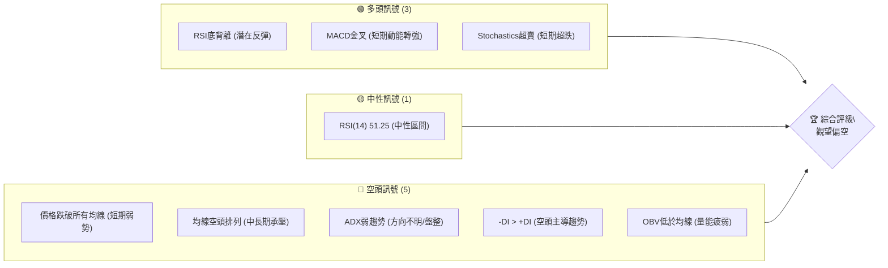
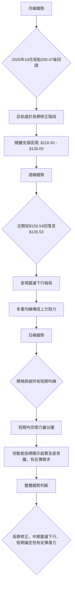
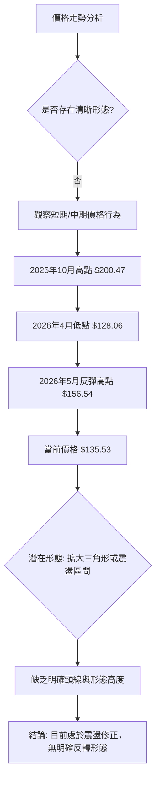
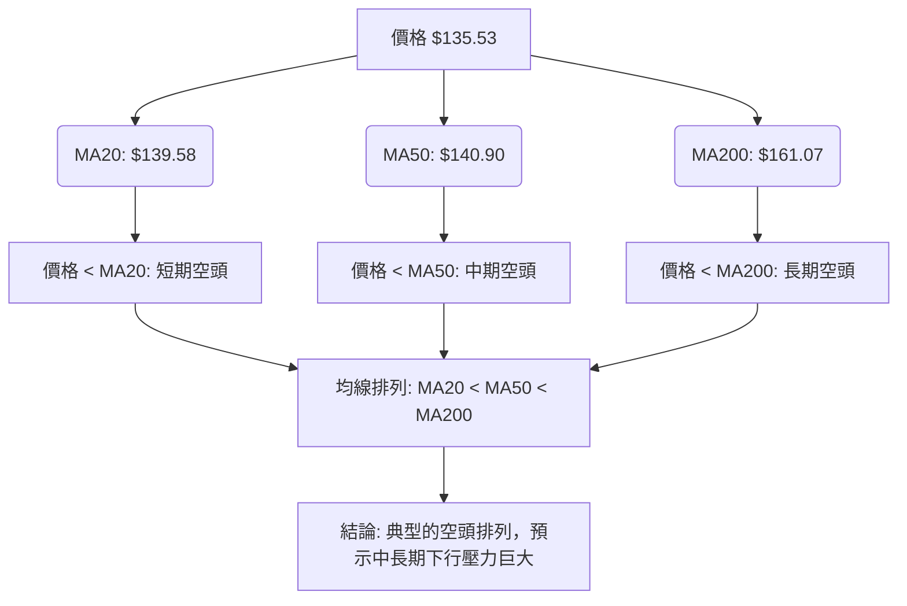

<details>
<summary>📊 靜態圖表 (點擊展開)</summary>

</details>

<html>
<head><meta charset="utf-8" /></head>
<body>
    <div style="height:500px; width:100%;">                        <script>window.PlotlyConfig = {MathJaxConfig: 'local'};</script>
        <script charset="utf-8" src="https://cdn.plot.ly/plotly-3.6.0.min.js" integrity="sha256-QaOVwtVY0T02VaHrr6pnoHLCwayMJp4O5n4YyaE3rJk=" crossorigin="anonymous"></script>                <div id="candlestick-chart" class="plotly-graph-div" style="height:100%; width:100%;"></div>            <script>                window.PLOTLYENV=window.PLOTLYENV || {};                                if (document.getElementById("candlestick-chart")) {                    Plotly.newPlot(                        "candlestick-chart",                        [{"close":{"dtype":"f8","bdata":"AAAA4FGAY0AAAACAwoVjQAAAACCu12NAAAAAoHClY0AAAAAA1xtkQAAAAEAKl2NAAAAAANfDY0AAAABguJZjQAAAAEDhomNAAAAAwMxcY0AAAADgeoRjQAAAACCFI2NAAAAAQDODY0AAAAAghUtkQAAAACCu12RAAAAAIIWLZEAAAACAwm1lQAAAAGC4ZmVAAAAA4FFIZUAAAABgjwplQAAAAEAKH2ZAAAAA4HrMZkAAAABgj2pmQAAAAKCZ0WZAAAAAgOtxZkAAAAAA12NmQAAAAIA9MmZAAAAAIIVbZkAAAACgcM1mQAAAAGBmHmdAAAAAoJlhZ0AAAACAPaJlQAAAAMD1cGZAAAAAoHDFZkAAAACA6\u002fFmQAAAAEAKL2dAAAAAgBTuZUAAAABguCZmQAAAACCud2ZAAAAAANdzZkAAAAAA10NmQAAAAMDMRGZAAAAAQOGyZkAAAADgUbBmQAAAACCu72VAAAAAIFyPZkAAAAAAKRRnQAAAAIDCpWdAAAAAQDOzZ0AAAACA69loQAAAAKCZUWhAAAAAQAoPaUAAAACAwuVpQAAAACCu12dAAAAAwMx8Z0AAAACgmeFlQAAAAIDCPWZAAAAAIIUzaEAAAABguN5nQAAAAKBwBWdAAAAA4HqEZUAAAADgUcBlQAAAAAAAaGVAAAAAYI\u002fqZEAAAACgcK1kQAAAAADXd2NAAAAAQDNbY0AAAAAAAEhkQAAAAKCZcWRAAAAA4KO4ZEAAAABgZg5lQAAAACCu72RAAAAAgBRWZUAAAABgjwJmQAAAAKBwPWZAAAAA4FG4ZkAAAAAgrq9mQAAAAEDhumZAAAAAwB59Z0AAAACgR3FnQAAAAIA98mZAAAAAAADoZkAAAAAAAHhnQAAAAKBHKWZAAAAAgBQ2Z0AAAAAAKSxoQAAAACBcP2hAAAAAAClEaEAAAACgcEVoQAAAAGC4lmdAAAAAgMIFZ0AAAABA4ZpmQAAAAAAAOGZAAAAAIIX7ZEAAAACgR8FlQAAAAGC4dmZAAAAAgMK1ZkAAAAAghRtmQAAAACCuL2ZAAAAAwB5tZkAAAABguF5mQAAAAMDMTGZAAAAAgD0iZkAAAABguF5lQAAAAMD1EGVAAAAAYI+qZEAAAADAzLxkQAAAAEAzM2VAAAAAQArvZEAAAABgZrZkQAAAAEAzq2NAAAAAIIX7YkAAAABA4VJiQAAAAOBReGJAAAAAACm8Y0AAAACgR3FhQAAAAOBRQGBAAAAAwMz8YEAAAADAHt1hQAAAAOBRcGFAAAAAgML1YEAAAAAAKSRgQAAAAMAebWBAAAAA4KOgYEAAAAAAKexgQAAAAOB63GBAAAAAIK7nYEAAAABAM1NgQAAAAEDhGmBAAAAAgBTGYEAAAACAFP5gQAAAAIAUJmFAAAAAoHAlYkAAAABACmdiQAAAAIAUJmNAAAAAoHAVY0AAAADAHqVjQAAAAIDCjWNAAAAA4HrkYkAAAABAM\u002fNiQAAAAAAAMGNAAAAAYGbeYkAAAABAChdjQAAAAGCPYmNAAAAA4KMYY0AAAACAwnVjQAAAAIDC1WJAAAAAQOEaZEAAAADA9VhjQAAAAGC4XmNAAAAAgOtxYkAAAACA6+FhQAAAAKCZMWFAAAAAwPVIYkAAAAAgrk9iQAAAAGC4jmJAAAAAgMJ9YkAAAACAPcJiQAAAAOBRmGFAAAAAIK5PYEAAAACA6wFgQAAAAADXi2BAAAAAYGb2YEAAAADAzMRhQAAAAOBR2GFAAAAA4HpMYkAAAADgejxiQAAAAEAKP2JAAAAAANcTY0AAAACAPbJhQAAAAEDh4mFAAAAAQDPjYUAAAACAwqVhQAAAAEAKP2FAAAAAIIVjYUAAAACAPQJiQAAAAMD1QGJAAAAAwB79YEAAAACgR7lgQAAAAKCZIWFAAAAAoJk5YUAAAADgehxhQAAAAAAAAGFAAAAAoJlBYEAAAAAgXLdgQAAAACCuv2BAAAAA4HrkYEAAAADgUehgQAAAAMDMJGFAAAAAoEctYUAAAAAAKRxhQAAAAEAzE2FAAAAA4FGQYEAAAABA4ephQAAAAKBHkWNAAAAAwMwUZEAAAACgcAVjQAAAAGBmxmFAAAAAYGa2YUAAAADA9fBgQA=="},"high":{"dtype":"f8","bdata":"AAAAYLiOY0AAAABACr9jQAAAAGBmZmRAAAAAQOHSY0AAAAAAKURkQAAAAMDMTGRAAAAAIFzHY0AAAACgcM1jQAAAAOB6zGNAAAAAwMwkZEAAAACgR6FjQAAAAEAK32NAAAAAoJnJY0AAAAAAAFhkQAAAAAAAIGVAAAAA4KfuZEAAAADA9XBlQAAAAKCZeWVAAAAAgOtpZUAAAACAwjVlQAAAAKCZWWZAAAAAoHANZ0AAAAAAAMhmQAAAAAAAOGdAAAAAQDMbZ0AAAACAPQpnQAAAAADXg2ZAAAAAIFyvZkAAAADgo9hmQAAAAMD1SGdAAAAAYGaGZ0AAAABA4VpnQAAAAGBm3mZAAAAAgMJFZ0AAAADgUQhnQAAAAADXc2dAAAAAQDNjZ0AAAABACmdmQAAAAEDhymZAAAAAQDMLZ0AAAACAPRpnQAAAAEDhsmZAAAAAQOHiZkAAAADAcsxmQAAAAGC4xmZAAAAAgOuxZkAAAACgcEVnQAAAAGCPGmhAAAAAwPX4Z0AAAABAM\u002ftoQAAAAKBw9WhAAAAAgMKFaUAAAADgo\u002fBpQAAAAGBmdmhAAAAAgD3KZ0AAAABA4eJnQAAAAGBmVmZAAAAAgMJdaEAAAACgmR1oQAAAAGCP0mdAAAAAYGbWZkAAAACgRylmQAAAACCux2VAAAAAYI+aZUAAAABAMzNlQAAAAIA90mVAAAAAIIXDY0AAAACgcKVkQAAAAMDMlGRAAAAAINkKZUAAAACgmRllQAAAAEAzI2VAAAAAAAD4ZUAAAADAHj1mQAAAAIAUTmZAAAAAYOXEZkAAAAAAKfxmQAAAAEAz22ZAAAAA4HrMZ0AAAACgmYFnQAAAAMDMUGdAAAAAwPV4Z0AAAAAAAJBnQAAAAAAAeGdAAAAAYI9qZ0AAAAAAAGBoQAAAAAAp3GhAAAAAANdraEAAAACgcGVoQAAAAEAzi2hAAAAAYGZmZ0AAAAAAVBdnQAAAAMD1sGZAAAAAQDOrZkAAAACAPfplQAAAAIAUhmZAAAAAwPVoZ0AAAADAHjVnQAAAAEAKV2ZAAAAAAADQZkAAAABAM6NmQAAAAOAis2ZAAAAAQDOTZkAAAACAws1mQAAAAEAKf2VAAAAAIK4vZUAAAAAAACBlQAAAAAAAgGVAAAAAQOFSZUAAAACAFC5lQAAAAKBwoWRAAAAAACm0Y0AAAAAAAOBiQAAAAMDM7GJAAAAAAH+iZEAAAABAM3tjQAAAACBcP2FAAAAA4Ps1YUAAAAAA1ztiQAAAAIDrMWJAAAAAAABoYUAAAADgevxgQAAAAIDrsWBAAAAAgD3KYEAAAADg0J5hQAAAAMAeBWFAAAAAYLgGYUAAAACgR4FgQAAAACCuR2BAAAAAQOECYUAAAADgUTBhQAAAAEAzQ2FAAAAA4HpkYkAAAAAAAHBiQAAAAOCjUGNAAAAAACmMY0AAAABgZi5kQAAAAIAUzmNAAAAAIAaVY0AAAACAaCVjQAAAAAApfGNAAAAAgOtRY0AAAAAghTtjQAAAAAAAmGNAAAAAgBSWY0AAAADAzIRjQAAAAMDMlGNAAAAAYI8iZEAAAADAzExkQAAAAOCjCGRAAAAAANcjY0AAAABguD5iQAAAAADXA2JAAAAAIIV7YkAAAACgmYliQAAAAOBRkGJAAAAAIIXTYkAAAADgo8hiQAAAAMD1iGNAAAAAoEdxYUAAAABgZiZgQAAAAKBwzWBAAAAAgD1CYUAAAABgj9JhQAAAAKCZMWJAAAAAwPWIYkAAAABgZmZiQAAAAADXu2JAAAAAgMIVY0AAAACgR8liQAAAAGCP6mFAAAAAgD0iYkAAAABAM\u002fthQAAAAOBReGFAAAAAYGaGYUAAAACAFE5iQAAAAOB6tGJAAAAAIFzfYUAAAABgZvZgQAAAAGBmnmFAAAAAACk8YUAAAADgeiRhQAAAAIDCLWFAAAAAIK4fYUAAAAAgXM9gQAAAAOB69GBAAAAAgOv9YEAAAABACi9hQAAAACCuJ2FAAAAAoJlRYUAAAADgo2BhQAAAAIDCVWFAAAAAIFz3YEAAAAAAACBiQAAAAKDtuGNAAAAAYGZ2ZEAAAACgmfFjQAAAAIDC9WJAAAAAANdLYkAAAABACr9hQA=="},"hovertemplate":"\u003cb\u003e%{x|%Y-%m-%d}\u003c\u002fb\u003e\u003cbr\u003e\u958b: $%{open:.2f}\u003cbr\u003e\u9ad8: $%{high:.2f}\u003cbr\u003e\u4f4e: $%{low:.2f}\u003cbr\u003e\u6536: $%{close:.2f}\u003cextra\u003e\u003c\u002fextra\u003e","low":{"dtype":"f8","bdata":"AAAAQOHKYUAAAACA6zljQAAAAOCj+GJAAAAAANerYkAAAACAPVJjQAAAACBcf2NAAAAAoJkRY0AAAAAAACBjQAAAAMD1yGJAAAAAYLgWY0AAAADAHiVjQAAAAKBHgWJAAAAAQOFaY0AAAAAA14tjQAAAAIAUbmRAAAAAQApnZEAAAADgUYBkQAAAAMAe7WRAAAAAYLgeZUAAAADgoyhkQAAAAOB6LGVAAAAAYLgWZkAAAACgR0lmQAAAAOBRIGZAAAAAANcjZkAAAACgR8llQAAAAMAe3WVAAAAAwB4lZkAAAABACkdmQAAAAAAAcGZAAAAAYGbeZkAAAADgo1hlQAAAAGCPOmZAAAAAoHBtZkAAAABgZqZmQAAAAGBmfmZAAAAAwPWwZUAAAABgZq5lQAAAAIA9WmVAAAAA4KMAZkAAAABgZg5mQAAAAGBmvmVAAAAAgBQuZkAAAADAzFRmQAAAAKBwLWVAAAAA4FHgZUAAAABAM9tmQAAAAOCjcGdAAAAAwPVYZ0AAAAAgrs9nQAAAAADXQ2hAAAAAoHC9aEAAAACAPTppQAAAAIDrMWdAAAAAYLimZkAAAADA9dBlQAAAAMAeHWVAAAAA4KPwZkAAAAAAKWRnQAAAAMDMjGZAAAAAYGRXZUAAAAAAAJBkQAAAAIDC9WRAAAAAAACwZEAAAACgcE1kQAAAAOCjTGNAAAAAgOtxYkAAAAAAAKBjQAAAAIDCkWNAAAAAACl8ZEAAAAAAALxkQAAAAADXY2RAAAAAQOEyZUAAAABgjxplQAAAAIDCzWVAAAAAwB4lZkAAAACgR3FmQAAAAAApjGZAAAAAAADYZkAAAABguIZmQAAAACBYNWZAAAAAwPWAZkAAAABAi6RmQAAAAAAAEGZAAAAA4FGwZkAAAAAgXFdnQAAAAIDCDWhAAAAAIIX3Z0AAAABgjxpoQAAAAADXk2dAAAAA4Hr0ZkAAAABgZpZmQAAAAAAAKGZAAAAAQDPLZEAAAACgR3llQAAAAOCj2GVAAAAAwB41ZkAAAAAA18tlQAAAAAAA2GVAAAAAQOEKZkAAAADgegRmQAAAAGBmvmVAAAAAwPUQZkAAAADgUUBlQAAAACCux2RAAAAAIIUjZEAAAABgZp5kQAAAAKCZyWRAAAAAYGbqZEAAAACAFJZkQAAAACCup2NAAAAAANdjYkAAAADAciRiQAAAAKDtVGJAAAAAANcjY0AAAACAwvVgQAAAAIA9CmBAAAAAQDOLYEAAAAAA1dhgQAAAAOCjOGFAAAAAYGaeYEAAAAAA16NfQAAAAIDpjl9AAAAAYI\u002fSX0AAAAAA19tgQAAAAOBRYGBAAAAAoHBlYEAAAADA9dhfQAAAACCul19AAAAAgMIlYEAAAAAAKZRgQAAAACBcv2BAAAAA4KOQYUAAAABgZkZhQAAAAIDrgWJAAAAAIIWzYkAAAACgR8liQAAAAEAKH2NAAAAA4HrEYkAAAABgj6piQAAAACBc32JAAAAAYI+SYkAAAACgcOViQAAAAADXA2NAAAAAIIUTY0AAAAAAANBiQAAAAEDhomJAAAAAIK4nY0AAAADgevRiQAAAACBcW2NAAAAAAABoYkAAAACA67FhQAAAAKCZCWFAAAAAQApfYUAAAABACg9iQAAAACCuP2FAAAAAIDFUYkAAAABgZg5iQAAAAKBwZWFAAAAAQAoPYEAAAAAghateQAAAAMDMJGBAAAAAAADAYEAAAACAwt1gQAAAAMD1cGFAAAAAoJnpYUAAAABgj\u002fphQAAAAMD3\u002f2FAAAAAwB5tYkAAAACgcH1hQAAAAIDCXWFAAAAA4FGgYUAAAACgcI1hQAAAAIDC1WBAAAAAwMwUYUAAAADgeqxhQAAAAEAzJ2JAAAAAQArXYEAAAADAzGRgQAAAAMD12GBAAAAA4KOgYEAAAAAArJhgQAAAAGC4rmBAAAAAAAAYYEAAAABgZi5gQAAAAKBHiWBAAAAAYI9qYEAAAABAM7NgQAAAAKBwjWBAAAAAoHDtYEAAAACgmclgQAAAAKCZqWBAAAAAACl0YEAAAAAAAKBgQAAAAKBHOWJAAAAAACl8Y0AAAACgmbliQAAAAAAAqGFAAAAAQLSIYUAAAADAzMBgQA=="},"name":"\u50f9\u683c","open":{"dtype":"f8","bdata":"AAAAoJkJY0AAAACgcKVjQAAAAIAUamNAAAAAQDODY0AAAADgemxjQAAAAIA9SmRAAAAAACm0Y0AAAAAgXJ9jQAAAAGBm5mJAAAAAAADAY0AAAAAgrltjQAAAAIA9umNAAAAAwB5dY0AAAAAAAKhjQAAAAAAAwGRAAAAAIK7nZEAAAABAM6tkQAAAAEAzM2VAAAAAoEdhZUAAAADgoyBlQAAAAOCjSGVAAAAAgD0iZkAAAAAAKZxmQAAAAOBR0GZAAAAAwB79ZkAAAACgmfllQAAAAKCZYWZAAAAA4Hp0ZkAAAAAgXF9mQAAAAIA9qmZAAAAAYGZWZ0AAAADAzExnQAAAAIDCZWZAAAAAgOuJZkAAAACgmdlmQAAAAGCP8mZAAAAAoHAlZ0AAAACAwlVmQAAAAAAAAGZAAAAAwPW0ZkAAAADA9bhmQAAAAAAAOGZAAAAAIK5vZkAAAACA68FmQAAAAIDCvWZAAAAAgD3uZUAAAAAAKdxmQAAAAEAKn2dAAAAAIFyvZ0AAAABgj+JnQAAAAKCZzWhAAAAAYGbmaEAAAACgcKFpQAAAAIA9AmhAAAAAAACgZ0AAAAAgrn9nQAAAAMDMpGVAAAAAgOsJZ0AAAABguMpnQAAAAGCP0mdAAAAAQOG2ZkAAAABAM99kQAAAAMD1UGVAAAAAANcLZUAAAACgmflkQAAAAIA9gmVAAAAA4FGAY0AAAABACq9jQAAAAIA9AmRAAAAAQDPbZEAAAADgUfhkQAAAAAAAoGRAAAAAQOEyZUAAAADgekRlQAAAACCuC2ZAAAAAIFxHZkAAAABguMZmQAAAAEAKn2ZAAAAAYGYeZ0AAAACgmRlnQAAAAIDrOWdAAAAAYI8iZ0AAAADA9bRmQAAAAEDhdmdAAAAA4FGwZkAAAAAgrldnQAAAAKBHYWhAAAAAYGYaaEAAAADAHiVoQAAAAOB6YGhAAAAAQDNbZ0AAAABAMwtnQAAAAAAppGZAAAAAoJmpZkAAAAAAKdxlQAAAAOBR+GVAAAAAoJl5ZkAAAAAgrjNnQAAAAOCjIGZAAAAAgOs1ZkAAAAAAAFxmQAAAAAAARGZAAAAAYLhWZkAAAAAghWtmQAAAAAAA9GRAAAAAIN0MZUAAAACgmR1lQAAAAOCj6GRAAAAAYLgGZUAAAAAgXO9kQAAAAMDMjGRAAAAAACm0Y0AAAACgmcFiQAAAAIAU3mJAAAAAoJmhZEAAAADAHm1jQAAAAIA9GmFAAAAAYI\u002fqYEAAAABgjxJhQAAAAEDhHmJAAAAAwMxgYUAAAAAghetgQAAAAKCZ+V9AAAAA4KMcYEAAAADgevxgQAAAAIDriWBAAAAAIK6LYEAAAACgR4FgQAAAAAApIGBAAAAAIIVTYEAAAABACrtgQAAAAIA9wmBAAAAAwMyYYUAAAABAM8NhQAAAAIDCjWJAAAAAgBQeY0AAAACAFM5iQAAAAIAUdmNAAAAAIK5\u002fY0AAAAAAKexiQAAAAOBRIGNAAAAAoJkpY0AAAABgZg5jQAAAAMD1DGNAAAAAgD1eY0AAAABAMyNjQAAAAGBmZmNAAAAAIK4nY0AAAACAPQJkQAAAAKBwrWNAAAAAgMIhY0AAAAAAKTxiQAAAAOCj6GFAAAAA4KOAYUAAAAAAAGBiQAAAACCF72FAAAAAIIWLYkAAAABgOVxiQAAAAOB6WGNAAAAA4KNsYUAAAAAgXA9gQAAAACBcR2BAAAAAAKrNYEAAAACgRxlhQAAAAKBHCWJAAAAAgBQqYkAAAAAAACBiQAAAAIDrWWJAAAAAIIWLYkAAAABgZrZiQAAAAGC43mFAAAAAAACoYUAAAACgmclhQAAAAOBReGFAAAAAQDNPYUAAAAAAAOhhQAAAAAAAeGJAAAAAoHCJYUAAAABguLZgQAAAAEAz42BAAAAAIK77YEAAAADAHt1gQAAAAEAzE2FAAAAAIDHAYEAAAADAzDRgQAAAAKCZmWBAAAAAAACQYEAAAACgcOVgQAAAAOCjxGBAAAAAoJn5YEAAAACgmS1hQAAAAMAeBWFAAAAAoJmpYEAAAADAHqVgQAAAAGBmemJAAAAAIFz\u002fY0AAAACAFJZjQAAAAGBmtmJAAAAAYLguYkAAAABgZophQA=="},"x":["2025-08-20T00:00:00-04:00","2025-08-21T00:00:00-04:00","2025-08-22T00:00:00-04:00","2025-08-25T00:00:00-04:00","2025-08-26T00:00:00-04:00","2025-08-27T00:00:00-04:00","2025-08-28T00:00:00-04:00","2025-08-29T00:00:00-04:00","2025-09-02T00:00:00-04:00","2025-09-03T00:00:00-04:00","2025-09-04T00:00:00-04:00","2025-09-05T00:00:00-04:00","2025-09-08T00:00:00-04:00","2025-09-09T00:00:00-04:00","2025-09-10T00:00:00-04:00","2025-09-11T00:00:00-04:00","2025-09-12T00:00:00-04:00","2025-09-15T00:00:00-04:00","2025-09-16T00:00:00-04:00","2025-09-17T00:00:00-04:00","2025-09-18T00:00:00-04:00","2025-09-19T00:00:00-04:00","2025-09-22T00:00:00-04:00","2025-09-23T00:00:00-04:00","2025-09-24T00:00:00-04:00","2025-09-25T00:00:00-04:00","2025-09-26T00:00:00-04:00","2025-09-29T00:00:00-04:00","2025-09-30T00:00:00-04:00","2025-10-01T00:00:00-04:00","2025-10-02T00:00:00-04:00","2025-10-03T00:00:00-04:00","2025-10-06T00:00:00-04:00","2025-10-07T00:00:00-04:00","2025-10-08T00:00:00-04:00","2025-10-09T00:00:00-04:00","2025-10-10T00:00:00-04:00","2025-10-13T00:00:00-04:00","2025-10-14T00:00:00-04:00","2025-10-15T00:00:00-04:00","2025-10-16T00:00:00-04:00","2025-10-17T00:00:00-04:00","2025-10-20T00:00:00-04:00","2025-10-21T00:00:00-04:00","2025-10-22T00:00:00-04:00","2025-10-23T00:00:00-04:00","2025-10-24T00:00:00-04:00","2025-10-27T00:00:00-04:00","2025-10-28T00:00:00-04:00","2025-10-29T00:00:00-04:00","2025-10-30T00:00:00-04:00","2025-10-31T00:00:00-04:00","2025-11-03T00:00:00-05:00","2025-11-04T00:00:00-05:00","2025-11-05T00:00:00-05:00","2025-11-06T00:00:00-05:00","2025-11-07T00:00:00-05:00","2025-11-10T00:00:00-05:00","2025-11-11T00:00:00-05:00","2025-11-12T00:00:00-05:00","2025-11-13T00:00:00-05:00","2025-11-14T00:00:00-05:00","2025-11-17T00:00:00-05:00","2025-11-18T00:00:00-05:00","2025-11-19T00:00:00-05:00","2025-11-20T00:00:00-05:00","2025-11-21T00:00:00-05:00","2025-11-24T00:00:00-05:00","2025-11-25T00:00:00-05:00","2025-11-26T00:00:00-05:00","2025-11-28T00:00:00-05:00","2025-12-01T00:00:00-05:00","2025-12-02T00:00:00-05:00","2025-12-03T00:00:00-05:00","2025-12-04T00:00:00-05:00","2025-12-05T00:00:00-05:00","2025-12-08T00:00:00-05:00","2025-12-09T00:00:00-05:00","2025-12-10T00:00:00-05:00","2025-12-11T00:00:00-05:00","2025-12-12T00:00:00-05:00","2025-12-15T00:00:00-05:00","2025-12-16T00:00:00-05:00","2025-12-17T00:00:00-05:00","2025-12-18T00:00:00-05:00","2025-12-19T00:00:00-05:00","2025-12-22T00:00:00-05:00","2025-12-23T00:00:00-05:00","2025-12-24T00:00:00-05:00","2025-12-26T00:00:00-05:00","2025-12-29T00:00:00-05:00","2025-12-30T00:00:00-05:00","2025-12-31T00:00:00-05:00","2026-01-02T00:00:00-05:00","2026-01-05T00:00:00-05:00","2026-01-06T00:00:00-05:00","2026-01-07T00:00:00-05:00","2026-01-08T00:00:00-05:00","2026-01-09T00:00:00-05:00","2026-01-12T00:00:00-05:00","2026-01-13T00:00:00-05:00","2026-01-14T00:00:00-05:00","2026-01-15T00:00:00-05:00","2026-01-16T00:00:00-05:00","2026-01-20T00:00:00-05:00","2026-01-21T00:00:00-05:00","2026-01-22T00:00:00-05:00","2026-01-23T00:00:00-05:00","2026-01-26T00:00:00-05:00","2026-01-27T00:00:00-05:00","2026-01-28T00:00:00-05:00","2026-01-29T00:00:00-05:00","2026-01-30T00:00:00-05:00","2026-02-02T00:00:00-05:00","2026-02-03T00:00:00-05:00","2026-02-04T00:00:00-05:00","2026-02-05T00:00:00-05:00","2026-02-06T00:00:00-05:00","2026-02-09T00:00:00-05:00","2026-02-10T00:00:00-05:00","2026-02-11T00:00:00-05:00","2026-02-12T00:00:00-05:00","2026-02-13T00:00:00-05:00","2026-02-17T00:00:00-05:00","2026-02-18T00:00:00-05:00","2026-02-19T00:00:00-05:00","2026-02-20T00:00:00-05:00","2026-02-23T00:00:00-05:00","2026-02-24T00:00:00-05:00","2026-02-25T00:00:00-05:00","2026-02-26T00:00:00-05:00","2026-02-27T00:00:00-05:00","2026-03-02T00:00:00-05:00","2026-03-03T00:00:00-05:00","2026-03-04T00:00:00-05:00","2026-03-05T00:00:00-05:00","2026-03-06T00:00:00-05:00","2026-03-09T00:00:00-04:00","2026-03-10T00:00:00-04:00","2026-03-11T00:00:00-04:00","2026-03-12T00:00:00-04:00","2026-03-13T00:00:00-04:00","2026-03-16T00:00:00-04:00","2026-03-17T00:00:00-04:00","2026-03-18T00:00:00-04:00","2026-03-19T00:00:00-04:00","2026-03-20T00:00:00-04:00","2026-03-23T00:00:00-04:00","2026-03-24T00:00:00-04:00","2026-03-25T00:00:00-04:00","2026-03-26T00:00:00-04:00","2026-03-27T00:00:00-04:00","2026-03-30T00:00:00-04:00","2026-03-31T00:00:00-04:00","2026-04-01T00:00:00-04:00","2026-04-02T00:00:00-04:00","2026-04-06T00:00:00-04:00","2026-04-07T00:00:00-04:00","2026-04-08T00:00:00-04:00","2026-04-09T00:00:00-04:00","2026-04-10T00:00:00-04:00","2026-04-13T00:00:00-04:00","2026-04-14T00:00:00-04:00","2026-04-15T00:00:00-04:00","2026-04-16T00:00:00-04:00","2026-04-17T00:00:00-04:00","2026-04-20T00:00:00-04:00","2026-04-21T00:00:00-04:00","2026-04-22T00:00:00-04:00","2026-04-23T00:00:00-04:00","2026-04-24T00:00:00-04:00","2026-04-27T00:00:00-04:00","2026-04-28T00:00:00-04:00","2026-04-29T00:00:00-04:00","2026-04-30T00:00:00-04:00","2026-05-01T00:00:00-04:00","2026-05-04T00:00:00-04:00","2026-05-05T00:00:00-04:00","2026-05-06T00:00:00-04:00","2026-05-07T00:00:00-04:00","2026-05-08T00:00:00-04:00","2026-05-11T00:00:00-04:00","2026-05-12T00:00:00-04:00","2026-05-13T00:00:00-04:00","2026-05-14T00:00:00-04:00","2026-05-15T00:00:00-04:00","2026-05-18T00:00:00-04:00","2026-05-19T00:00:00-04:00","2026-05-20T00:00:00-04:00","2026-05-21T00:00:00-04:00","2026-05-22T00:00:00-04:00","2026-05-26T00:00:00-04:00","2026-05-27T00:00:00-04:00","2026-05-28T00:00:00-04:00","2026-05-29T00:00:00-04:00","2026-06-01T00:00:00-04:00","2026-06-02T00:00:00-04:00","2026-06-03T00:00:00-04:00","2026-06-04T00:00:00-04:00","2026-06-05T00:00:00-04:00"],"type":"candlestick"},{"hovertemplate":"MA30: $%{y:.2f}\u003cextra\u003e\u003c\u002fextra\u003e","line":{"color":"#2196F3","dash":"dash","width":2},"mode":"lines","name":"MA30","x":["2025-08-20T00:00:00-04:00","2025-08-21T00:00:00-04:00","2025-08-22T00:00:00-04:00","2025-08-25T00:00:00-04:00","2025-08-26T00:00:00-04:00","2025-08-27T00:00:00-04:00","2025-08-28T00:00:00-04:00","2025-08-29T00:00:00-04:00","2025-09-02T00:00:00-04:00","2025-09-03T00:00:00-04:00","2025-09-04T00:00:00-04:00","2025-09-05T00:00:00-04:00","2025-09-08T00:00:00-04:00","2025-09-09T00:00:00-04:00","2025-09-10T00:00:00-04:00","2025-09-11T00:00:00-04:00","2025-09-12T00:00:00-04:00","2025-09-15T00:00:00-04:00","2025-09-16T00:00:00-04:00","2025-09-17T00:00:00-04:00","2025-09-18T00:00:00-04:00","2025-09-19T00:00:00-04:00","2025-09-22T00:00:00-04:00","2025-09-23T00:00:00-04:00","2025-09-24T00:00:00-04:00","2025-09-25T00:00:00-04:00","2025-09-26T00:00:00-04:00","2025-09-29T00:00:00-04:00","2025-09-30T00:00:00-04:00","2025-10-01T00:00:00-04:00","2025-10-02T00:00:00-04:00","2025-10-03T00:00:00-04:00","2025-10-06T00:00:00-04:00","2025-10-07T00:00:00-04:00","2025-10-08T00:00:00-04:00","2025-10-09T00:00:00-04:00","2025-10-10T00:00:00-04:00","2025-10-13T00:00:00-04:00","2025-10-14T00:00:00-04:00","2025-10-15T00:00:00-04:00","2025-10-16T00:00:00-04:00","2025-10-17T00:00:00-04:00","2025-10-20T00:00:00-04:00","2025-10-21T00:00:00-04:00","2025-10-22T00:00:00-04:00","2025-10-23T00:00:00-04:00","2025-10-24T00:00:00-04:00","2025-10-27T00:00:00-04:00","2025-10-28T00:00:00-04:00","2025-10-29T00:00:00-04:00","2025-10-30T00:00:00-04:00","2025-10-31T00:00:00-04:00","2025-11-03T00:00:00-05:00","2025-11-04T00:00:00-05:00","2025-11-05T00:00:00-05:00","2025-11-06T00:00:00-05:00","2025-11-07T00:00:00-05:00","2025-11-10T00:00:00-05:00","2025-11-11T00:00:00-05:00","2025-11-12T00:00:00-05:00","2025-11-13T00:00:00-05:00","2025-11-14T00:00:00-05:00","2025-11-17T00:00:00-05:00","2025-11-18T00:00:00-05:00","2025-11-19T00:00:00-05:00","2025-11-20T00:00:00-05:00","2025-11-21T00:00:00-05:00","2025-11-24T00:00:00-05:00","2025-11-25T00:00:00-05:00","2025-11-26T00:00:00-05:00","2025-11-28T00:00:00-05:00","2025-12-01T00:00:00-05:00","2025-12-02T00:00:00-05:00","2025-12-03T00:00:00-05:00","2025-12-04T00:00:00-05:00","2025-12-05T00:00:00-05:00","2025-12-08T00:00:00-05:00","2025-12-09T00:00:00-05:00","2025-12-10T00:00:00-05:00","2025-12-11T00:00:00-05:00","2025-12-12T00:00:00-05:00","2025-12-15T00:00:00-05:00","2025-12-16T00:00:00-05:00","2025-12-17T00:00:00-05:00","2025-12-18T00:00:00-05:00","2025-12-19T00:00:00-05:00","2025-12-22T00:00:00-05:00","2025-12-23T00:00:00-05:00","2025-12-24T00:00:00-05:00","2025-12-26T00:00:00-05:00","2025-12-29T00:00:00-05:00","2025-12-30T00:00:00-05:00","2025-12-31T00:00:00-05:00","2026-01-02T00:00:00-05:00","2026-01-05T00:00:00-05:00","2026-01-06T00:00:00-05:00","2026-01-07T00:00:00-05:00","2026-01-08T00:00:00-05:00","2026-01-09T00:00:00-05:00","2026-01-12T00:00:00-05:00","2026-01-13T00:00:00-05:00","2026-01-14T00:00:00-05:00","2026-01-15T00:00:00-05:00","2026-01-16T00:00:00-05:00","2026-01-20T00:00:00-05:00","2026-01-21T00:00:00-05:00","2026-01-22T00:00:00-05:00","2026-01-23T00:00:00-05:00","2026-01-26T00:00:00-05:00","2026-01-27T00:00:00-05:00","2026-01-28T00:00:00-05:00","2026-01-29T00:00:00-05:00","2026-01-30T00:00:00-05:00","2026-02-02T00:00:00-05:00","2026-02-03T00:00:00-05:00","2026-02-04T00:00:00-05:00","2026-02-05T00:00:00-05:00","2026-02-06T00:00:00-05:00","2026-02-09T00:00:00-05:00","2026-02-10T00:00:00-05:00","2026-02-11T00:00:00-05:00","2026-02-12T00:00:00-05:00","2026-02-13T00:00:00-05:00","2026-02-17T00:00:00-05:00","2026-02-18T00:00:00-05:00","2026-02-19T00:00:00-05:00","2026-02-20T00:00:00-05:00","2026-02-23T00:00:00-05:00","2026-02-24T00:00:00-05:00","2026-02-25T00:00:00-05:00","2026-02-26T00:00:00-05:00","2026-02-27T00:00:00-05:00","2026-03-02T00:00:00-05:00","2026-03-03T00:00:00-05:00","2026-03-04T00:00:00-05:00","2026-03-05T00:00:00-05:00","2026-03-06T00:00:00-05:00","2026-03-09T00:00:00-04:00","2026-03-10T00:00:00-04:00","2026-03-11T00:00:00-04:00","2026-03-12T00:00:00-04:00","2026-03-13T00:00:00-04:00","2026-03-16T00:00:00-04:00","2026-03-17T00:00:00-04:00","2026-03-18T00:00:00-04:00","2026-03-19T00:00:00-04:00","2026-03-20T00:00:00-04:00","2026-03-23T00:00:00-04:00","2026-03-24T00:00:00-04:00","2026-03-25T00:00:00-04:00","2026-03-26T00:00:00-04:00","2026-03-27T00:00:00-04:00","2026-03-30T00:00:00-04:00","2026-03-31T00:00:00-04:00","2026-04-01T00:00:00-04:00","2026-04-02T00:00:00-04:00","2026-04-06T00:00:00-04:00","2026-04-07T00:00:00-04:00","2026-04-08T00:00:00-04:00","2026-04-09T00:00:00-04:00","2026-04-10T00:00:00-04:00","2026-04-13T00:00:00-04:00","2026-04-14T00:00:00-04:00","2026-04-15T00:00:00-04:00","2026-04-16T00:00:00-04:00","2026-04-17T00:00:00-04:00","2026-04-20T00:00:00-04:00","2026-04-21T00:00:00-04:00","2026-04-22T00:00:00-04:00","2026-04-23T00:00:00-04:00","2026-04-24T00:00:00-04:00","2026-04-27T00:00:00-04:00","2026-04-28T00:00:00-04:00","2026-04-29T00:00:00-04:00","2026-04-30T00:00:00-04:00","2026-05-01T00:00:00-04:00","2026-05-04T00:00:00-04:00","2026-05-05T00:00:00-04:00","2026-05-06T00:00:00-04:00","2026-05-07T00:00:00-04:00","2026-05-08T00:00:00-04:00","2026-05-11T00:00:00-04:00","2026-05-12T00:00:00-04:00","2026-05-13T00:00:00-04:00","2026-05-14T00:00:00-04:00","2026-05-15T00:00:00-04:00","2026-05-18T00:00:00-04:00","2026-05-19T00:00:00-04:00","2026-05-20T00:00:00-04:00","2026-05-21T00:00:00-04:00","2026-05-22T00:00:00-04:00","2026-05-26T00:00:00-04:00","2026-05-27T00:00:00-04:00","2026-05-28T00:00:00-04:00","2026-05-29T00:00:00-04:00","2026-06-01T00:00:00-04:00","2026-06-02T00:00:00-04:00","2026-06-03T00:00:00-04:00","2026-06-04T00:00:00-04:00","2026-06-05T00:00:00-04:00"],"y":{"dtype":"f8","bdata":"AAAAAAAA+H8AAAAAAAD4fwAAAAAAAPh\u002fAAAAAAAA+H8AAAAAAAD4fwAAAAAAAPh\u002fAAAAAAAA+H8AAAAAAAD4fwAAAAAAAPh\u002fAAAAAAAA+H8AAAAAAAD4fwAAAAAAAPh\u002fAAAAAAAA+H8AAAAAAAD4fwAAAAAAAPh\u002fAAAAAAAA+H8AAAAAAAD4fwAAAAAAAPh\u002fAAAAAAAA+H8AAAAAAAD4fwAAAAAAAPh\u002fAAAAAAAA+H8AAAAAAAD4fwAAAAAAAPh\u002fAAAAAAAA+H8AAAAAAAD4fwAAAAAAAPh\u002fAAAAAAAA+H8AAAAAAAD4fwAAACCw5mRA3t3dHcwHZUB3d3c30BllQFVVVUX9L2VAAAAA8KdKZUAiIiLS22JlQM3MzHyGgWVAERERAQCUZUDv7u7e3allQFVVVdUGwmVAq6qqCmXcZUC8u7sL1\u002fNlQCIiIqKMDmZAmpmZGb0pZkAzMzNTKj5mQImIiKh\u002fR2ZA3t3dfbFYZkCamZn5xWZmQKuqqvrweWZAd3d3F5KOZkCamZkpFa9mQM3MzKzVwWZAiYiIuB7VZkAAAACg0\u002fJmQKuqqgqQ+2ZAq6qqanUEZ0CamZkJHgBnQGZmZlaAAGdAIiIiEjwQZ0AAAAAQWBlnQCIiIhKDGGdAVVVVpZsIZ0AzMzNTnAlnQFVVVVXHAGdAZmZmBvPwZkCJiIiYmd1mQAAAALDkvWZA7+7uPu6nZkCrqqoq+ZdmQHd3dze0hmZA7+7uPu53ZkARERGxnW1mQN7d3c0+YmZAERERYZ5WZkARERGh01BmQN7d3S1rU2ZAREREtMhUZkBmZmZGb1FmQHd3d\u002feaSWZAvLu7e81HZkBVVVUFyDtmQAAAAMARMGZAq6qqirMdZkC8u7vb+QhmQLy7uxuh+mVAIiIiokX4ZUAiIiLy0gtmQKuqqqrxHGZAmpmZqX8dZkBEREQ07CBmQN7d3e3DJWZAZmZmppsyZkAiIiKy5DlmQBEREaHTQGZAq6qqWmRBZkAAAAAwlkpmQLy7uzsmZGZAvLu7m8SAZkDNzMwcWpBmQJqZmak4n2ZAq6qqSsWtZkCamZk5+7hmQBEREWGexGZAvLu7i2zLZkAiIiJy9sVmQJqZmVnyu2ZA3t3d3WuqZkARERHByplmQLy7u2u8jGZAAAAA8O52ZkCamZkpo19mQKuqqlqrQ2ZAq6qqyi8iZkDe3d1dSPZlQFVVVbXI1mVAmpmZuR65ZUAAAADQsH9lQM3MzLx0O2VAAAAAEFj9ZECrqqqqqsZkQImIiMgvkmRAzczMDHReZEBmZmbGSydkQN7d3d3d9WNAmpmZObTQY0CJiIh4d6djQO\u002fu7p6od2NAiYiIaB9GY0CJiIhYxxRjQGZmZqbi4GJAMzMzk6awYkDv7u4+w4JiQLy7uyvOVmJAd3d3V8c0YkDNzMy8dBtiQFVVVeUXC2JA7+7u3pb9YUBVVVVFRPRhQKuqqvo35mFAzczMzMzUYUAAAACQwsVhQBEREUGnwWFAMzMzw67AYUCamZmpOMdhQDMzM4MHz2FAREREJJTJYUAAAABwy9phQJqZmbnX8GFAIiIiAnILYkDv7u5OGxhiQBERETGWKGJAmpmZOUI1YkCrqqoKHkRiQLy7u6uqSmJAiYiIiM9YYkDe3d1NqWRiQCIiItIic2JAiYiICKyAYkBERESkcJViQImIiJgnomJAAAAAQDWeYkC8u7t7zZViQM3MzEypkGJAvLu7W4+GYkCJiIjoJoFiQCIiItIGdmJAZmZm9lNvYkAAAACATmNiQJqZmTkmWGJAzczMXLpZYkARERGBB09iQBEREeHsQ2JA7+7uTo07YkDe3d0dPi9iQCIiIvL9HGJAq6qq2msOYkDe3d2NCQJiQLy7u8sT\u002fWFA7+7uPnziYUAzMzOTGMxhQDMzM\u002fP9uGFAIiIi0pSuYUAAAAAAAKhhQO\u002fu7r5YpmFAAAAA4AiVYUCrqqqKbIdhQERERET9d2FA7+7uvlhqYUAAAACgjFphQKuqqtqyVmFAZmZm1hVeYUCamZlJfmdhQM3MzFwBbGFAd3d3R5poYUCrqqo632lhQGZmZhaSeGFAREREBMiHYUAAAADgeo5hQJqZmWl1imFAZmZmhs9+YUAzMzMzXnhhQA=="},"type":"scatter"},{"hovertemplate":"MA60: $%{y:.2f}\u003cextra\u003e\u003c\u002fextra\u003e","line":{"color":"#9C27B0","dash":"dash","width":2},"mode":"lines","name":"MA60","x":["2025-08-20T00:00:00-04:00","2025-08-21T00:00:00-04:00","2025-08-22T00:00:00-04:00","2025-08-25T00:00:00-04:00","2025-08-26T00:00:00-04:00","2025-08-27T00:00:00-04:00","2025-08-28T00:00:00-04:00","2025-08-29T00:00:00-04:00","2025-09-02T00:00:00-04:00","2025-09-03T00:00:00-04:00","2025-09-04T00:00:00-04:00","2025-09-05T00:00:00-04:00","2025-09-08T00:00:00-04:00","2025-09-09T00:00:00-04:00","2025-09-10T00:00:00-04:00","2025-09-11T00:00:00-04:00","2025-09-12T00:00:00-04:00","2025-09-15T00:00:00-04:00","2025-09-16T00:00:00-04:00","2025-09-17T00:00:00-04:00","2025-09-18T00:00:00-04:00","2025-09-19T00:00:00-04:00","2025-09-22T00:00:00-04:00","2025-09-23T00:00:00-04:00","2025-09-24T00:00:00-04:00","2025-09-25T00:00:00-04:00","2025-09-26T00:00:00-04:00","2025-09-29T00:00:00-04:00","2025-09-30T00:00:00-04:00","2025-10-01T00:00:00-04:00","2025-10-02T00:00:00-04:00","2025-10-03T00:00:00-04:00","2025-10-06T00:00:00-04:00","2025-10-07T00:00:00-04:00","2025-10-08T00:00:00-04:00","2025-10-09T00:00:00-04:00","2025-10-10T00:00:00-04:00","2025-10-13T00:00:00-04:00","2025-10-14T00:00:00-04:00","2025-10-15T00:00:00-04:00","2025-10-16T00:00:00-04:00","2025-10-17T00:00:00-04:00","2025-10-20T00:00:00-04:00","2025-10-21T00:00:00-04:00","2025-10-22T00:00:00-04:00","2025-10-23T00:00:00-04:00","2025-10-24T00:00:00-04:00","2025-10-27T00:00:00-04:00","2025-10-28T00:00:00-04:00","2025-10-29T00:00:00-04:00","2025-10-30T00:00:00-04:00","2025-10-31T00:00:00-04:00","2025-11-03T00:00:00-05:00","2025-11-04T00:00:00-05:00","2025-11-05T00:00:00-05:00","2025-11-06T00:00:00-05:00","2025-11-07T00:00:00-05:00","2025-11-10T00:00:00-05:00","2025-11-11T00:00:00-05:00","2025-11-12T00:00:00-05:00","2025-11-13T00:00:00-05:00","2025-11-14T00:00:00-05:00","2025-11-17T00:00:00-05:00","2025-11-18T00:00:00-05:00","2025-11-19T00:00:00-05:00","2025-11-20T00:00:00-05:00","2025-11-21T00:00:00-05:00","2025-11-24T00:00:00-05:00","2025-11-25T00:00:00-05:00","2025-11-26T00:00:00-05:00","2025-11-28T00:00:00-05:00","2025-12-01T00:00:00-05:00","2025-12-02T00:00:00-05:00","2025-12-03T00:00:00-05:00","2025-12-04T00:00:00-05:00","2025-12-05T00:00:00-05:00","2025-12-08T00:00:00-05:00","2025-12-09T00:00:00-05:00","2025-12-10T00:00:00-05:00","2025-12-11T00:00:00-05:00","2025-12-12T00:00:00-05:00","2025-12-15T00:00:00-05:00","2025-12-16T00:00:00-05:00","2025-12-17T00:00:00-05:00","2025-12-18T00:00:00-05:00","2025-12-19T00:00:00-05:00","2025-12-22T00:00:00-05:00","2025-12-23T00:00:00-05:00","2025-12-24T00:00:00-05:00","2025-12-26T00:00:00-05:00","2025-12-29T00:00:00-05:00","2025-12-30T00:00:00-05:00","2025-12-31T00:00:00-05:00","2026-01-02T00:00:00-05:00","2026-01-05T00:00:00-05:00","2026-01-06T00:00:00-05:00","2026-01-07T00:00:00-05:00","2026-01-08T00:00:00-05:00","2026-01-09T00:00:00-05:00","2026-01-12T00:00:00-05:00","2026-01-13T00:00:00-05:00","2026-01-14T00:00:00-05:00","2026-01-15T00:00:00-05:00","2026-01-16T00:00:00-05:00","2026-01-20T00:00:00-05:00","2026-01-21T00:00:00-05:00","2026-01-22T00:00:00-05:00","2026-01-23T00:00:00-05:00","2026-01-26T00:00:00-05:00","2026-01-27T00:00:00-05:00","2026-01-28T00:00:00-05:00","2026-01-29T00:00:00-05:00","2026-01-30T00:00:00-05:00","2026-02-02T00:00:00-05:00","2026-02-03T00:00:00-05:00","2026-02-04T00:00:00-05:00","2026-02-05T00:00:00-05:00","2026-02-06T00:00:00-05:00","2026-02-09T00:00:00-05:00","2026-02-10T00:00:00-05:00","2026-02-11T00:00:00-05:00","2026-02-12T00:00:00-05:00","2026-02-13T00:00:00-05:00","2026-02-17T00:00:00-05:00","2026-02-18T00:00:00-05:00","2026-02-19T00:00:00-05:00","2026-02-20T00:00:00-05:00","2026-02-23T00:00:00-05:00","2026-02-24T00:00:00-05:00","2026-02-25T00:00:00-05:00","2026-02-26T00:00:00-05:00","2026-02-27T00:00:00-05:00","2026-03-02T00:00:00-05:00","2026-03-03T00:00:00-05:00","2026-03-04T00:00:00-05:00","2026-03-05T00:00:00-05:00","2026-03-06T00:00:00-05:00","2026-03-09T00:00:00-04:00","2026-03-10T00:00:00-04:00","2026-03-11T00:00:00-04:00","2026-03-12T00:00:00-04:00","2026-03-13T00:00:00-04:00","2026-03-16T00:00:00-04:00","2026-03-17T00:00:00-04:00","2026-03-18T00:00:00-04:00","2026-03-19T00:00:00-04:00","2026-03-20T00:00:00-04:00","2026-03-23T00:00:00-04:00","2026-03-24T00:00:00-04:00","2026-03-25T00:00:00-04:00","2026-03-26T00:00:00-04:00","2026-03-27T00:00:00-04:00","2026-03-30T00:00:00-04:00","2026-03-31T00:00:00-04:00","2026-04-01T00:00:00-04:00","2026-04-02T00:00:00-04:00","2026-04-06T00:00:00-04:00","2026-04-07T00:00:00-04:00","2026-04-08T00:00:00-04:00","2026-04-09T00:00:00-04:00","2026-04-10T00:00:00-04:00","2026-04-13T00:00:00-04:00","2026-04-14T00:00:00-04:00","2026-04-15T00:00:00-04:00","2026-04-16T00:00:00-04:00","2026-04-17T00:00:00-04:00","2026-04-20T00:00:00-04:00","2026-04-21T00:00:00-04:00","2026-04-22T00:00:00-04:00","2026-04-23T00:00:00-04:00","2026-04-24T00:00:00-04:00","2026-04-27T00:00:00-04:00","2026-04-28T00:00:00-04:00","2026-04-29T00:00:00-04:00","2026-04-30T00:00:00-04:00","2026-05-01T00:00:00-04:00","2026-05-04T00:00:00-04:00","2026-05-05T00:00:00-04:00","2026-05-06T00:00:00-04:00","2026-05-07T00:00:00-04:00","2026-05-08T00:00:00-04:00","2026-05-11T00:00:00-04:00","2026-05-12T00:00:00-04:00","2026-05-13T00:00:00-04:00","2026-05-14T00:00:00-04:00","2026-05-15T00:00:00-04:00","2026-05-18T00:00:00-04:00","2026-05-19T00:00:00-04:00","2026-05-20T00:00:00-04:00","2026-05-21T00:00:00-04:00","2026-05-22T00:00:00-04:00","2026-05-26T00:00:00-04:00","2026-05-27T00:00:00-04:00","2026-05-28T00:00:00-04:00","2026-05-29T00:00:00-04:00","2026-06-01T00:00:00-04:00","2026-06-02T00:00:00-04:00","2026-06-03T00:00:00-04:00","2026-06-04T00:00:00-04:00","2026-06-05T00:00:00-04:00"],"y":{"dtype":"f8","bdata":"AAAAAAAA+H8AAAAAAAD4fwAAAAAAAPh\u002fAAAAAAAA+H8AAAAAAAD4fwAAAAAAAPh\u002fAAAAAAAA+H8AAAAAAAD4fwAAAAAAAPh\u002fAAAAAAAA+H8AAAAAAAD4fwAAAAAAAPh\u002fAAAAAAAA+H8AAAAAAAD4fwAAAAAAAPh\u002fAAAAAAAA+H8AAAAAAAD4fwAAAAAAAPh\u002fAAAAAAAA+H8AAAAAAAD4fwAAAAAAAPh\u002fAAAAAAAA+H8AAAAAAAD4fwAAAAAAAPh\u002fAAAAAAAA+H8AAAAAAAD4fwAAAAAAAPh\u002fAAAAAAAA+H8AAAAAAAD4fwAAAAAAAPh\u002fAAAAAAAA+H8AAAAAAAD4fwAAAAAAAPh\u002fAAAAAAAA+H8AAAAAAAD4fwAAAAAAAPh\u002fAAAAAAAA+H8AAAAAAAD4fwAAAAAAAPh\u002fAAAAAAAA+H8AAAAAAAD4fwAAAAAAAPh\u002fAAAAAAAA+H8AAAAAAAD4fwAAAAAAAPh\u002fAAAAAAAA+H8AAAAAAAD4fwAAAAAAAPh\u002fAAAAAAAA+H8AAAAAAAD4fwAAAAAAAPh\u002fAAAAAAAA+H8AAAAAAAD4fwAAAAAAAPh\u002fAAAAAAAA+H8AAAAAAAD4fwAAAAAAAPh\u002fAAAAAAAA+H8AAAAAAAD4fxEREZmZ\u002f2VAmpmZ4TMIZkBVVVVFthFmQFVVVU1iGGZAMzMze80dZkBVVVW1OiBmQGZmZpa1H2ZAAAAAIPcdZkDNzMyE6yBmQGZmZoZdJGZAzczMpCkqZkBmZmZeujBmQAAAALhlOGZAVVVVvS1AZkAiIiL6fkdmQDMzM2t1TWZAERERGb1WZkAAAACgGlxmQBEREfnFYWZAmpmZyS9rZkB3d3eXbnVmQGZmZrbzeGZAmpmZIWl5ZkDe3d295n1mQDMzM5MYe2ZAZmZmhl1+ZkDe3d19+IVmQImIiAC5jmZA3t3d3d2WZkAiIiIiIp1mQAAAAIAjn2ZA3t3dpZudZkCrqqqCwKFmQDMzM3vNoGZAiYiIsCuZZkBERETkF5RmQN7d3XUFkWZAVVVVbVmUZkC8u7ujKZRmQImIiHD2kmZAzczMxNmSZkBVVVV1TJNmQHd3d5duk2ZAZmZmdgWRZkCamZkJZYtmQLy7u8Ouh2ZAERERSZp\u002fZkC8u7sDnXVmQJqZmbEra2ZA3t3dNV5fZkB3d3eXtU1mQFVVVY3eOWZAq6qqqvEfZkDNzMwcof9lQImIiOi06GVA3t3dLbLYZUARERHhwcVlQLy7uzMzrGVAzczM3GuNZUB3d3dvy3NlQDMzM9v5W2VAmpmZ2YdIZUBEREQ8mDBlQHd3d79YG2VAIiIiSgwJZUBERETUBvlkQFVVVW3n7WRAIiIiAnLjZECrqqq6kNJkQAAAAKgNwGRA7+7u7jWvZEBEREQ8351kQGZmZka2jWRAmpmZ8RmAZEB3d3eXtXBkQHd3dx+FY2RAZmZmXgFUZEAzMzODB0dkQDMzMzN6OWRAZmZm3t0lZEDNzMzcshJkQN7d3U2pAmRA7+7uRm\u002fxY0C8u7uDwN5jQERERBzo0mNA7+7ublnBY0AAAAAgPq1jQDMzMzsmlmNAERERCWWEY0DNzMz8Ym9jQM3MzPxiXWNAMzMzI9tJY0CJiIjotDVjQM3MzEREIGNAERER4cEUY0AzMzNjEAZjQImIiLhl9WJAiYiIuGXjYkBmZmb+G9ViQHd3dx+FwWJAmpmZ6W2nYkBVVVVdSIxiQERERLy7c2JAmpmZWatdYkCrqqrSTU5iQLy7u1uPQGJAq6qqanU2YkCrqqpiyStiQCIiIhovH2JAzczMlEMXYkCJiIgIZQpiQBERERHKAmJAERERCR7+YUC8u7tjO\u002fthQKuqqroC9mFAd3d3\u002f\u002f\u002frYUDv7u5+au5hQKuqqsL19mFAiYiIIPf2YUARERHxGfJhQCIiIhLK8GFA3t3dhevxYUBVVVUFD\u002fZhQFVVVbWB+GFARERENOz2YUBERETsCvZhQDMzMwuQ9WFAvLu7Y4L1YUAiIiKi\u002fvdhQJqZmTlt\u002fGFAMzMziyX+YUCrqqripf5hQM3MzFRV\u002fmFAmpmZ0ZT3YUCamZkRg\u002fVhQERERHRM92FAVVVV\u002fY37YUAAAACw5PhhQJqZmdFN8WFAmpmZ8UTsYUAiIiLasuNhQA=="},"type":"scatter"},{"hovertemplate":"MA200: $%{y:.2f}\u003cextra\u003e\u003c\u002fextra\u003e","line":{"color":"#FF6F00","dash":"solid","width":2},"mode":"lines","name":"MA200","x":["2025-08-20T00:00:00-04:00","2025-08-21T00:00:00-04:00","2025-08-22T00:00:00-04:00","2025-08-25T00:00:00-04:00","2025-08-26T00:00:00-04:00","2025-08-27T00:00:00-04:00","2025-08-28T00:00:00-04:00","2025-08-29T00:00:00-04:00","2025-09-02T00:00:00-04:00","2025-09-03T00:00:00-04:00","2025-09-04T00:00:00-04:00","2025-09-05T00:00:00-04:00","2025-09-08T00:00:00-04:00","2025-09-09T00:00:00-04:00","2025-09-10T00:00:00-04:00","2025-09-11T00:00:00-04:00","2025-09-12T00:00:00-04:00","2025-09-15T00:00:00-04:00","2025-09-16T00:00:00-04:00","2025-09-17T00:00:00-04:00","2025-09-18T00:00:00-04:00","2025-09-19T00:00:00-04:00","2025-09-22T00:00:00-04:00","2025-09-23T00:00:00-04:00","2025-09-24T00:00:00-04:00","2025-09-25T00:00:00-04:00","2025-09-26T00:00:00-04:00","2025-09-29T00:00:00-04:00","2025-09-30T00:00:00-04:00","2025-10-01T00:00:00-04:00","2025-10-02T00:00:00-04:00","2025-10-03T00:00:00-04:00","2025-10-06T00:00:00-04:00","2025-10-07T00:00:00-04:00","2025-10-08T00:00:00-04:00","2025-10-09T00:00:00-04:00","2025-10-10T00:00:00-04:00","2025-10-13T00:00:00-04:00","2025-10-14T00:00:00-04:00","2025-10-15T00:00:00-04:00","2025-10-16T00:00:00-04:00","2025-10-17T00:00:00-04:00","2025-10-20T00:00:00-04:00","2025-10-21T00:00:00-04:00","2025-10-22T00:00:00-04:00","2025-10-23T00:00:00-04:00","2025-10-24T00:00:00-04:00","2025-10-27T00:00:00-04:00","2025-10-28T00:00:00-04:00","2025-10-29T00:00:00-04:00","2025-10-30T00:00:00-04:00","2025-10-31T00:00:00-04:00","2025-11-03T00:00:00-05:00","2025-11-04T00:00:00-05:00","2025-11-05T00:00:00-05:00","2025-11-06T00:00:00-05:00","2025-11-07T00:00:00-05:00","2025-11-10T00:00:00-05:00","2025-11-11T00:00:00-05:00","2025-11-12T00:00:00-05:00","2025-11-13T00:00:00-05:00","2025-11-14T00:00:00-05:00","2025-11-17T00:00:00-05:00","2025-11-18T00:00:00-05:00","2025-11-19T00:00:00-05:00","2025-11-20T00:00:00-05:00","2025-11-21T00:00:00-05:00","2025-11-24T00:00:00-05:00","2025-11-25T00:00:00-05:00","2025-11-26T00:00:00-05:00","2025-11-28T00:00:00-05:00","2025-12-01T00:00:00-05:00","2025-12-02T00:00:00-05:00","2025-12-03T00:00:00-05:00","2025-12-04T00:00:00-05:00","2025-12-05T00:00:00-05:00","2025-12-08T00:00:00-05:00","2025-12-09T00:00:00-05:00","2025-12-10T00:00:00-05:00","2025-12-11T00:00:00-05:00","2025-12-12T00:00:00-05:00","2025-12-15T00:00:00-05:00","2025-12-16T00:00:00-05:00","2025-12-17T00:00:00-05:00","2025-12-18T00:00:00-05:00","2025-12-19T00:00:00-05:00","2025-12-22T00:00:00-05:00","2025-12-23T00:00:00-05:00","2025-12-24T00:00:00-05:00","2025-12-26T00:00:00-05:00","2025-12-29T00:00:00-05:00","2025-12-30T00:00:00-05:00","2025-12-31T00:00:00-05:00","2026-01-02T00:00:00-05:00","2026-01-05T00:00:00-05:00","2026-01-06T00:00:00-05:00","2026-01-07T00:00:00-05:00","2026-01-08T00:00:00-05:00","2026-01-09T00:00:00-05:00","2026-01-12T00:00:00-05:00","2026-01-13T00:00:00-05:00","2026-01-14T00:00:00-05:00","2026-01-15T00:00:00-05:00","2026-01-16T00:00:00-05:00","2026-01-20T00:00:00-05:00","2026-01-21T00:00:00-05:00","2026-01-22T00:00:00-05:00","2026-01-23T00:00:00-05:00","2026-01-26T00:00:00-05:00","2026-01-27T00:00:00-05:00","2026-01-28T00:00:00-05:00","2026-01-29T00:00:00-05:00","2026-01-30T00:00:00-05:00","2026-02-02T00:00:00-05:00","2026-02-03T00:00:00-05:00","2026-02-04T00:00:00-05:00","2026-02-05T00:00:00-05:00","2026-02-06T00:00:00-05:00","2026-02-09T00:00:00-05:00","2026-02-10T00:00:00-05:00","2026-02-11T00:00:00-05:00","2026-02-12T00:00:00-05:00","2026-02-13T00:00:00-05:00","2026-02-17T00:00:00-05:00","2026-02-18T00:00:00-05:00","2026-02-19T00:00:00-05:00","2026-02-20T00:00:00-05:00","2026-02-23T00:00:00-05:00","2026-02-24T00:00:00-05:00","2026-02-25T00:00:00-05:00","2026-02-26T00:00:00-05:00","2026-02-27T00:00:00-05:00","2026-03-02T00:00:00-05:00","2026-03-03T00:00:00-05:00","2026-03-04T00:00:00-05:00","2026-03-05T00:00:00-05:00","2026-03-06T00:00:00-05:00","2026-03-09T00:00:00-04:00","2026-03-10T00:00:00-04:00","2026-03-11T00:00:00-04:00","2026-03-12T00:00:00-04:00","2026-03-13T00:00:00-04:00","2026-03-16T00:00:00-04:00","2026-03-17T00:00:00-04:00","2026-03-18T00:00:00-04:00","2026-03-19T00:00:00-04:00","2026-03-20T00:00:00-04:00","2026-03-23T00:00:00-04:00","2026-03-24T00:00:00-04:00","2026-03-25T00:00:00-04:00","2026-03-26T00:00:00-04:00","2026-03-27T00:00:00-04:00","2026-03-30T00:00:00-04:00","2026-03-31T00:00:00-04:00","2026-04-01T00:00:00-04:00","2026-04-02T00:00:00-04:00","2026-04-06T00:00:00-04:00","2026-04-07T00:00:00-04:00","2026-04-08T00:00:00-04:00","2026-04-09T00:00:00-04:00","2026-04-10T00:00:00-04:00","2026-04-13T00:00:00-04:00","2026-04-14T00:00:00-04:00","2026-04-15T00:00:00-04:00","2026-04-16T00:00:00-04:00","2026-04-17T00:00:00-04:00","2026-04-20T00:00:00-04:00","2026-04-21T00:00:00-04:00","2026-04-22T00:00:00-04:00","2026-04-23T00:00:00-04:00","2026-04-24T00:00:00-04:00","2026-04-27T00:00:00-04:00","2026-04-28T00:00:00-04:00","2026-04-29T00:00:00-04:00","2026-04-30T00:00:00-04:00","2026-05-01T00:00:00-04:00","2026-05-04T00:00:00-04:00","2026-05-05T00:00:00-04:00","2026-05-06T00:00:00-04:00","2026-05-07T00:00:00-04:00","2026-05-08T00:00:00-04:00","2026-05-11T00:00:00-04:00","2026-05-12T00:00:00-04:00","2026-05-13T00:00:00-04:00","2026-05-14T00:00:00-04:00","2026-05-15T00:00:00-04:00","2026-05-18T00:00:00-04:00","2026-05-19T00:00:00-04:00","2026-05-20T00:00:00-04:00","2026-05-21T00:00:00-04:00","2026-05-22T00:00:00-04:00","2026-05-26T00:00:00-04:00","2026-05-27T00:00:00-04:00","2026-05-28T00:00:00-04:00","2026-05-29T00:00:00-04:00","2026-06-01T00:00:00-04:00","2026-06-02T00:00:00-04:00","2026-06-03T00:00:00-04:00","2026-06-04T00:00:00-04:00","2026-06-05T00:00:00-04:00"],"y":{"dtype":"f8","bdata":"AAAAAAAA+H8AAAAAAAD4fwAAAAAAAPh\u002fAAAAAAAA+H8AAAAAAAD4fwAAAAAAAPh\u002fAAAAAAAA+H8AAAAAAAD4fwAAAAAAAPh\u002fAAAAAAAA+H8AAAAAAAD4fwAAAAAAAPh\u002fAAAAAAAA+H8AAAAAAAD4fwAAAAAAAPh\u002fAAAAAAAA+H8AAAAAAAD4fwAAAAAAAPh\u002fAAAAAAAA+H8AAAAAAAD4fwAAAAAAAPh\u002fAAAAAAAA+H8AAAAAAAD4fwAAAAAAAPh\u002fAAAAAAAA+H8AAAAAAAD4fwAAAAAAAPh\u002fAAAAAAAA+H8AAAAAAAD4fwAAAAAAAPh\u002fAAAAAAAA+H8AAAAAAAD4fwAAAAAAAPh\u002fAAAAAAAA+H8AAAAAAAD4fwAAAAAAAPh\u002fAAAAAAAA+H8AAAAAAAD4fwAAAAAAAPh\u002fAAAAAAAA+H8AAAAAAAD4fwAAAAAAAPh\u002fAAAAAAAA+H8AAAAAAAD4fwAAAAAAAPh\u002fAAAAAAAA+H8AAAAAAAD4fwAAAAAAAPh\u002fAAAAAAAA+H8AAAAAAAD4fwAAAAAAAPh\u002fAAAAAAAA+H8AAAAAAAD4fwAAAAAAAPh\u002fAAAAAAAA+H8AAAAAAAD4fwAAAAAAAPh\u002fAAAAAAAA+H8AAAAAAAD4fwAAAAAAAPh\u002fAAAAAAAA+H8AAAAAAAD4fwAAAAAAAPh\u002fAAAAAAAA+H8AAAAAAAD4fwAAAAAAAPh\u002fAAAAAAAA+H8AAAAAAAD4fwAAAAAAAPh\u002fAAAAAAAA+H8AAAAAAAD4fwAAAAAAAPh\u002fAAAAAAAA+H8AAAAAAAD4fwAAAAAAAPh\u002fAAAAAAAA+H8AAAAAAAD4fwAAAAAAAPh\u002fAAAAAAAA+H8AAAAAAAD4fwAAAAAAAPh\u002fAAAAAAAA+H8AAAAAAAD4fwAAAAAAAPh\u002fAAAAAAAA+H8AAAAAAAD4fwAAAAAAAPh\u002fAAAAAAAA+H8AAAAAAAD4fwAAAAAAAPh\u002fAAAAAAAA+H8AAAAAAAD4fwAAAAAAAPh\u002fAAAAAAAA+H8AAAAAAAD4fwAAAAAAAPh\u002fAAAAAAAA+H8AAAAAAAD4fwAAAAAAAPh\u002fAAAAAAAA+H8AAAAAAAD4fwAAAAAAAPh\u002fAAAAAAAA+H8AAAAAAAD4fwAAAAAAAPh\u002fAAAAAAAA+H8AAAAAAAD4fwAAAAAAAPh\u002fAAAAAAAA+H8AAAAAAAD4fwAAAAAAAPh\u002fAAAAAAAA+H8AAAAAAAD4fwAAAAAAAPh\u002fAAAAAAAA+H8AAAAAAAD4fwAAAAAAAPh\u002fAAAAAAAA+H8AAAAAAAD4fwAAAAAAAPh\u002fAAAAAAAA+H8AAAAAAAD4fwAAAAAAAPh\u002fAAAAAAAA+H8AAAAAAAD4fwAAAAAAAPh\u002fAAAAAAAA+H8AAAAAAAD4fwAAAAAAAPh\u002fAAAAAAAA+H8AAAAAAAD4fwAAAAAAAPh\u002fAAAAAAAA+H8AAAAAAAD4fwAAAAAAAPh\u002fAAAAAAAA+H8AAAAAAAD4fwAAAAAAAPh\u002fAAAAAAAA+H8AAAAAAAD4fwAAAAAAAPh\u002fAAAAAAAA+H8AAAAAAAD4fwAAAAAAAPh\u002fAAAAAAAA+H8AAAAAAAD4fwAAAAAAAPh\u002fAAAAAAAA+H8AAAAAAAD4fwAAAAAAAPh\u002fAAAAAAAA+H8AAAAAAAD4fwAAAAAAAPh\u002fAAAAAAAA+H8AAAAAAAD4fwAAAAAAAPh\u002fAAAAAAAA+H8AAAAAAAD4fwAAAAAAAPh\u002fAAAAAAAA+H8AAAAAAAD4fwAAAAAAAPh\u002fAAAAAAAA+H8AAAAAAAD4fwAAAAAAAPh\u002fAAAAAAAA+H8AAAAAAAD4fwAAAAAAAPh\u002fAAAAAAAA+H8AAAAAAAD4fwAAAAAAAPh\u002fAAAAAAAA+H8AAAAAAAD4fwAAAAAAAPh\u002fAAAAAAAA+H8AAAAAAAD4fwAAAAAAAPh\u002fAAAAAAAA+H8AAAAAAAD4fwAAAAAAAPh\u002fAAAAAAAA+H8AAAAAAAD4fwAAAAAAAPh\u002fAAAAAAAA+H8AAAAAAAD4fwAAAAAAAPh\u002fAAAAAAAA+H8AAAAAAAD4fwAAAAAAAPh\u002fAAAAAAAA+H8AAAAAAAD4fwAAAAAAAPh\u002fAAAAAAAA+H8AAAAAAAD4fwAAAAAAAPh\u002fAAAAAAAA+H8AAAAAAAD4fwAAAAAAAPh\u002fAAAAAAAA+H+uR+FWWyJkQA=="},"type":"scatter"}],                        {"template":{"data":{"barpolar":[{"marker":{"line":{"color":"rgb(17,17,17)","width":0.5},"pattern":{"fillmode":"overlay","size":10,"solidity":0.2}},"type":"barpolar"}],"bar":[{"error_x":{"color":"#f2f5fa"},"error_y":{"color":"#f2f5fa"},"marker":{"line":{"color":"rgb(17,17,17)","width":0.5},"pattern":{"fillmode":"overlay","size":10,"solidity":0.2}},"type":"bar"}],"carpet":[{"aaxis":{"endlinecolor":"#A2B1C6","gridcolor":"#506784","linecolor":"#506784","minorgridcolor":"#506784","startlinecolor":"#A2B1C6"},"baxis":{"endlinecolor":"#A2B1C6","gridcolor":"#506784","linecolor":"#506784","minorgridcolor":"#506784","startlinecolor":"#A2B1C6"},"type":"carpet"}],"choropleth":[{"colorbar":{"outlinewidth":0,"ticks":""},"type":"choropleth"}],"contourcarpet":[{"colorbar":{"outlinewidth":0,"ticks":""},"type":"contourcarpet"}],"contour":[{"colorbar":{"outlinewidth":0,"ticks":""},"colorscale":[[0.0,"#0d0887"],[0.1111111111111111,"#46039f"],[0.2222222222222222,"#7201a8"],[0.3333333333333333,"#9c179e"],[0.4444444444444444,"#bd3786"],[0.5555555555555556,"#d8576b"],[0.6666666666666666,"#ed7953"],[0.7777777777777778,"#fb9f3a"],[0.8888888888888888,"#fdca26"],[1.0,"#f0f921"]],"type":"contour"}],"heatmap":[{"colorbar":{"outlinewidth":0,"ticks":""},"colorscale":[[0.0,"#0d0887"],[0.1111111111111111,"#46039f"],[0.2222222222222222,"#7201a8"],[0.3333333333333333,"#9c179e"],[0.4444444444444444,"#bd3786"],[0.5555555555555556,"#d8576b"],[0.6666666666666666,"#ed7953"],[0.7777777777777778,"#fb9f3a"],[0.8888888888888888,"#fdca26"],[1.0,"#f0f921"]],"type":"heatmap"}],"histogram2dcontour":[{"colorbar":{"outlinewidth":0,"ticks":""},"colorscale":[[0.0,"#0d0887"],[0.1111111111111111,"#46039f"],[0.2222222222222222,"#7201a8"],[0.3333333333333333,"#9c179e"],[0.4444444444444444,"#bd3786"],[0.5555555555555556,"#d8576b"],[0.6666666666666666,"#ed7953"],[0.7777777777777778,"#fb9f3a"],[0.8888888888888888,"#fdca26"],[1.0,"#f0f921"]],"type":"histogram2dcontour"}],"histogram2d":[{"colorbar":{"outlinewidth":0,"ticks":""},"colorscale":[[0.0,"#0d0887"],[0.1111111111111111,"#46039f"],[0.2222222222222222,"#7201a8"],[0.3333333333333333,"#9c179e"],[0.4444444444444444,"#bd3786"],[0.5555555555555556,"#d8576b"],[0.6666666666666666,"#ed7953"],[0.7777777777777778,"#fb9f3a"],[0.8888888888888888,"#fdca26"],[1.0,"#f0f921"]],"type":"histogram2d"}],"histogram":[{"marker":{"pattern":{"fillmode":"overlay","size":10,"solidity":0.2}},"type":"histogram"}],"mesh3d":[{"colorbar":{"outlinewidth":0,"ticks":""},"type":"mesh3d"}],"parcoords":[{"line":{"colorbar":{"outlinewidth":0,"ticks":""}},"type":"parcoords"}],"pie":[{"automargin":true,"type":"pie"}],"scatter3d":[{"line":{"colorbar":{"outlinewidth":0,"ticks":""}},"marker":{"colorbar":{"outlinewidth":0,"ticks":""}},"type":"scatter3d"}],"scattercarpet":[{"marker":{"colorbar":{"outlinewidth":0,"ticks":""}},"type":"scattercarpet"}],"scattergeo":[{"marker":{"colorbar":{"outlinewidth":0,"ticks":""}},"type":"scattergeo"}],"scattergl":[{"marker":{"line":{"color":"#283442"}},"type":"scattergl"}],"scattermapbox":[{"marker":{"colorbar":{"outlinewidth":0,"ticks":""}},"type":"scattermapbox"}],"scattermap":[{"marker":{"colorbar":{"outlinewidth":0,"ticks":""}},"type":"scattermap"}],"scatterpolargl":[{"marker":{"colorbar":{"outlinewidth":0,"ticks":""}},"type":"scatterpolargl"}],"scatterpolar":[{"marker":{"colorbar":{"outlinewidth":0,"ticks":""}},"type":"scatterpolar"}],"scatter":[{"marker":{"line":{"color":"#283442"}},"type":"scatter"}],"scatterternary":[{"marker":{"colorbar":{"outlinewidth":0,"ticks":""}},"type":"scatterternary"}],"surface":[{"colorbar":{"outlinewidth":0,"ticks":""},"colorscale":[[0.0,"#0d0887"],[0.1111111111111111,"#46039f"],[0.2222222222222222,"#7201a8"],[0.3333333333333333,"#9c179e"],[0.4444444444444444,"#bd3786"],[0.5555555555555556,"#d8576b"],[0.6666666666666666,"#ed7953"],[0.7777777777777778,"#fb9f3a"],[0.8888888888888888,"#fdca26"],[1.0,"#f0f921"]],"type":"surface"}],"table":[{"cells":{"fill":{"color":"#506784"},"line":{"color":"rgb(17,17,17)"}},"header":{"fill":{"color":"#2a3f5f"},"line":{"color":"rgb(17,17,17)"}},"type":"table"}]},"layout":{"annotationdefaults":{"arrowcolor":"#f2f5fa","arrowhead":0,"arrowwidth":1},"autotypenumbers":"strict","coloraxis":{"colorbar":{"outlinewidth":0,"ticks":""}},"colorscale":{"diverging":[[0,"#8e0152"],[0.1,"#c51b7d"],[0.2,"#de77ae"],[0.3,"#f1b6da"],[0.4,"#fde0ef"],[0.5,"#f7f7f7"],[0.6,"#e6f5d0"],[0.7,"#b8e186"],[0.8,"#7fbc41"],[0.9,"#4d9221"],[1,"#276419"]],"sequential":[[0.0,"#0d0887"],[0.1111111111111111,"#46039f"],[0.2222222222222222,"#7201a8"],[0.3333333333333333,"#9c179e"],[0.4444444444444444,"#bd3786"],[0.5555555555555556,"#d8576b"],[0.6666666666666666,"#ed7953"],[0.7777777777777778,"#fb9f3a"],[0.8888888888888888,"#fdca26"],[1.0,"#f0f921"]],"sequentialminus":[[0.0,"#0d0887"],[0.1111111111111111,"#46039f"],[0.2222222222222222,"#7201a8"],[0.3333333333333333,"#9c179e"],[0.4444444444444444,"#bd3786"],[0.5555555555555556,"#d8576b"],[0.6666666666666666,"#ed7953"],[0.7777777777777778,"#fb9f3a"],[0.8888888888888888,"#fdca26"],[1.0,"#f0f921"]]},"colorway":["#636efa","#EF553B","#00cc96","#ab63fa","#FFA15A","#19d3f3","#FF6692","#B6E880","#FF97FF","#FECB52"],"font":{"color":"#f2f5fa"},"geo":{"bgcolor":"rgb(17,17,17)","lakecolor":"rgb(17,17,17)","landcolor":"rgb(17,17,17)","showlakes":true,"showland":true,"subunitcolor":"#506784"},"hoverlabel":{"align":"left"},"hovermode":"closest","mapbox":{"style":"dark"},"paper_bgcolor":"rgb(17,17,17)","plot_bgcolor":"rgb(17,17,17)","polar":{"angularaxis":{"gridcolor":"#506784","linecolor":"#506784","ticks":""},"bgcolor":"rgb(17,17,17)","radialaxis":{"gridcolor":"#506784","linecolor":"#506784","ticks":""}},"scene":{"xaxis":{"backgroundcolor":"rgb(17,17,17)","gridcolor":"#506784","gridwidth":2,"linecolor":"#506784","showbackground":true,"ticks":"","zerolinecolor":"#C8D4E3"},"yaxis":{"backgroundcolor":"rgb(17,17,17)","gridcolor":"#506784","gridwidth":2,"linecolor":"#506784","showbackground":true,"ticks":"","zerolinecolor":"#C8D4E3"},"zaxis":{"backgroundcolor":"rgb(17,17,17)","gridcolor":"#506784","gridwidth":2,"linecolor":"#506784","showbackground":true,"ticks":"","zerolinecolor":"#C8D4E3"}},"shapedefaults":{"line":{"color":"#f2f5fa"}},"sliderdefaults":{"bgcolor":"#C8D4E3","bordercolor":"rgb(17,17,17)","borderwidth":1,"tickwidth":0},"ternary":{"aaxis":{"gridcolor":"#506784","linecolor":"#506784","ticks":""},"baxis":{"gridcolor":"#506784","linecolor":"#506784","ticks":""},"bgcolor":"rgb(17,17,17)","caxis":{"gridcolor":"#506784","linecolor":"#506784","ticks":""}},"title":{"x":0.05},"updatemenudefaults":{"bgcolor":"#506784","borderwidth":0},"xaxis":{"automargin":true,"gridcolor":"#283442","linecolor":"#506784","ticks":"","title":{"standoff":15},"zerolinecolor":"#283442","zerolinewidth":2},"yaxis":{"automargin":true,"gridcolor":"#283442","linecolor":"#506784","ticks":"","title":{"standoff":15},"zerolinecolor":"#283442","zerolinewidth":2}}},"xaxis":{"rangeslider":{"visible":false},"title":{"text":"\u65e5\u671f"}},"font":{"size":11},"title":{"text":"PLTR  |  MA(30\u002f60\u002f200)  |  \u6700\u8fd1200\u4ea4\u6613\u65e5"},"yaxis":{"title":{"text":"\u80a1\u50f9 (USD)"}},"hovermode":"x unified","height":500},                        {"responsive": true}                    )                };            </script>        </div>
</body>
</html>

# PLTR 技術分析報告

> **報告日期**：2026-06-06 ｜ **語言**：繁體中文 ｜ **數據來源**：Yahoo Finance ｜ **當前價格**：$135.53

---

## 目錄

| 章節 | 內容 |
|------|------|
| [1. 技術面概覽](#1-技術面概覽) | 訊號儀表板、核心指標、評分卡 |
| [2. 趨勢分析](#2-趨勢分析) | 多時框趨勢、長中短期走勢 |
| [3. 圖表形態分析](#3-圖表形態分析) | 形態識別、K線組合、目標價 |
| [4. 支撐與阻力](#4-支撐與阻力) | 關鍵價位、斐波那契回調 |
| [5. 技術指標深度解讀](#5-技術指標深度解讀) | MA/RSI/MACD/布林/成交量 |
| [6. 動能與波動率](#6-動能與波動率) | 動能評估、ATR、Beta |
| [7. 多時框架總結](#7-多時框架總結) | 時框架評分矩陣 |
| [8. 交易策略建議](#8-交易策略建議) | 多空策略、風險報酬比 |
| [9. 風險提示與監控](#9-風險提示與監控) | 監控指標、風險場景 |

---

## 1. 技術面概覽

本章節提供 Palantir Technologies Inc. (PLTR) 當前技術面的鳥瞰圖，透過整合性的訊號儀表板、核心指標速覽及專業評分卡，幫助投資者快速掌握其市場定位與潛在交易機會。

### 🎯 技術訊號儀表板

以下 Mermaid 圖表匯總了 PLTR 當前各項技術指標所發出的多空訊號，旨在提供一個直觀的綜合評級。



**儀表板解讀**：
PLTR 當前技術面呈現多空交織的複雜局面。多頭訊號主要來自於動能指標的底部跡象，例如 RSI 的底背離暗示潛在的反彈需求，MACD 柱狀圖轉正並形成金叉，以及隨機指標 Stochastics 進入超賣區，這些都指出短期內存在技術性反彈的可能性。然而，空頭訊號則更為廣泛且具結構性，包括價格明顯跌破短期、中期、長期所有移動平均線，且均線呈現空頭排列，這在中長期趨勢上構成顯著壓力。ADX 指標顯示趨勢強度微弱，且空頭力量 (-DI) 略佔上風，配合疲弱的 OBV 量能，表明當前市場缺乏明確的多頭動能。整體而言，雖然短期存在反彈機會，但中長期趨勢仍偏向空頭。

### 📊 核心指標速覽表

下表列出了 PLTR 當前最關鍵的技術指標數值及其初步解讀。

| 指標類別 | 指標名稱 | 當前數值 | 訊號 | 解讀 |
|----------|----------|----------|------|------|
| **價格** | 當前價格 | $135.53 | 🔴 | 位於多數均線下方，顯示短期弱勢 |
| **均線** | MA20 | $139.58 | 🔴 | 價格低於MA20，短期趨勢偏空 |
| **均線** | MA50 | $140.90 | 🔴 | 價格低於MA50，中期趨勢偏空 |
| **均線** | MA200 | $161.07 | 🔴 | 價格低於MA200，長期趨勢受壓 |
| **動能** | RSI(14) | 51.25 | 🟡 | 位於中性區間，無明顯超買超賣 |
| **動能** | MACD | 1.094 | 🟢 | MACD線在訊號線上方，柱狀圖為正，短期多頭動能增強 |
| **波動** | ATR(14) | $7.29 | 🟡 | 每日波動約5.38%，屬於中等波動水平 |
| **趨勢** | ADX(14) | 14.50 | 🔴 | 趨勢強度較弱，市場處於盤整或無明確方向 |
| **量能** | OBV趨勢 | OBV < MA | 🔴 | 量能未能配合價格上漲，交易量疲弱 |

### 🏆 技術評分卡

這張評分卡綜合評估了 PLTR 在各個技術維度上的表現，並給出一個總體評分。

```
╔══════════════════════════════════════════════════════════════╗
║                 PLTR 技術評分卡 (2026-06-06)                 ║
╠══════════════════════════════════════════════════════════════╣
║ 趨勢強度      ███░░░░░░░░░░░░░░░░░░  15/100  🔴 (ADX顯示弱趨勢且空頭主導)   ║
║ 動能指標      ████████░░░░░░░░░░░░  40/100  🟡 (RSI中性，MACD金叉但Stoch超賣)║
║ 支撐穩定度    █████████░░░░░░░░░░░  45/100  🟡 (接近多重歷史支撐，但破位風險高)║
║ 成交量配合    ████░░░░░░░░░░░░░░░░  20/100  🔴 (OBV趨勢疲弱，量能不足)     ║
║ 形態完整度    ██████░░░░░░░░░░░░░░  30/100  🟡 (短期無明確反轉形態，趨勢不明)║
║ 均線排列      ██░░░░░░░░░░░░░░░░░░  10/100  🔴 (空頭排列，價格在所有均線下方)║
╠══════════════════════════════════════════════════════════════╣
║ 綜合評分      ████░░░░░░░░░░░░░░░░  27/100  ⚖️ 觀望偏空                      ║
╚══════════════════════════════════════════════════════════════╝
```

**評分卡總結**：
PLTR 的技術評分卡顯示其整體技術面較為疲弱，綜合評分為 27/100，評級為「觀望偏空」。趨勢強度和均線排列得分極低，明確指示了當前市場處於弱勢。動能指標雖有短期反彈跡象，但整體力度不足，且成交量未能有效配合，顯示市場買盤意願不強。支撐穩定度雖然接近一些關鍵歷史支撐位，但由於趨勢的疲軟，這些支撐的可靠性受到挑戰。在當前情境下，建議投資者保持謹慎，避免盲目進場。

---

## 2. 趨勢分析

本章將從多個時間框架深入分析 PLTR 的價格趨勢，從宏觀的長期走勢到微觀的短期波動，並結合 ADX 指標評估趨勢強度。

### 🌐 多時框趨勢分析

以下 Mermaid 圖展示了 PLTR 在不同時間框架下的趨勢判斷，從月線、週線到日線，層層遞進地分析其走勢。



**多時框解讀**：
- **月線趨勢 (長期)**：PLTR 在 2025 年 10 月達到 $200.47 的高點後，進入了漫長的修正階段。儘管期間有所反彈，但整體呈現高點降低的態勢。當前價格 $135.53 較其高點已大幅回落，目前正測試其長期上升趨勢中的關鍵支撐區間。長期來看，市場正在消化前期的漲幅，尚未形成明確的長期上漲趨勢。
- **週線趨勢 (中期)**：從週線圖來看，PLTR 近期表現為震盪下行。在 2026 年 5 月底曾反彈至 $156.54，隨後又迅速回落至當前水平，顯示上方賣壓沉重。多條週線移動平均線（如 MA20、MA50）已形成下降趨勢，並對價格構成阻力。市場呈現出缺乏連續性上漲動能的特徵。
- **日線趨勢 (短期)**：在日線層面，PLTR 表現出明顯的短期弱勢，價格已跌破 MA20、MA50 等短期移動平均線。空頭力量在短期內佔據主導地位。然而，值得注意的是，一些動能指標（如 RSI 和 Stochastics）顯示出超賣和底背離的跡象，這暗示短期內可能存在技術性反彈的需求，但這種反彈的持續性仍需觀察。

### 📈 長期趨勢 — 12個月走勢圖（Unicode）

以下 ASCII 圖展示了 PLTR 過去 12 個月的月線收盤價走勢，標注了關鍵的高點和低點。

```
PLTR 月線走勢圖（過去12個月）
價格軸 ($)
$200.47 ┤                                 ●(2025-10 高點)
$182.42 ┤                          ●
$177.75 ┤                                     ●
$168.45 ┤                                ●
$158.35 ┤                  ●
$156.71 ┤                    ●
$156.54 ┤                                                  ●
$146.59 ┤                                        ●
$146.28 ┤                                            ●
$139.11 ┤                                              ●
$137.19 ┤                                          ●
$136.32 ┤●
$135.53 ┤                                                    ●←現在
$128.06 ┤                                     ●(2026-04 低點)
$118.93 ┤
        └────────────────────────────────────────────────────────────
         2025-06 07  08  09  10  11  12  2026-01 02  03  04  05  06
```

**走勢特徵分析表格**：
下表詳細分析了 PLTR 過去 12 個月的價格走勢特徵、漲跌幅及關鍵轉折點。

| 階段 | 時間區間 | 起始價 | 結束價 | 漲跌幅 | 走勢特徵 | 關鍵事件/觀察 |
|------|----------|--------|--------|--------|------------|----------------|
| 1 | 2025-06 至 2025-10 | $136.32 | $200.47 | +47.06% | 強勁上漲趨勢 | 受市場熱情和 AI 概念股帶動，創下近年新高。 |
| 2 | 2025-10 至 2026-02 | $200.47 | $137.19 | -31.56% | 快速回調/修正 | 達到高點後迅速回落，市場獲利了結壓力大。 |
| 3 | 2026-02 至 2026-05 | $137.19 | $156.54 | +14.10% | 震盪反彈 | 在低位獲得支撐後嘗試反彈，但未能突破前期高點。 |
| 4 | 2026-05 至 2026-06 | $156.54 | $135.53 | -13.42% | 再次回落 | 反彈動能不足，再次向下探底，顯示賣壓依然沉重。 |

**長期趨勢總結**：
PLTR 經歷了 2025 年下半年的強勁上漲後，在 2025 年 10 月達到 $200.47 的階段性高點。隨後進入了為期數月的修正階段，期間雖有反彈，但未能扭轉整體回落的趨勢。目前價格 $135.53 處於過去一年價格區間的中下部，且近期走勢疲軟，顯示長期多頭動能不足，市場處於消化前期漲幅的盤整或修正階段。

### 📊 中期趨勢（週線分析）

中期趨勢主要透過週線圖來觀察，它能幫助我們識別持續數週到數月的價格模式和支撐阻力。

```
PLTR 近期週線壓力與支撐示意圖
═══════════════════════════════════════════════════════════════
$160.00 ║           ┌───┐
$156.54 ║           │ 高 │ (5月底高點) ◄─ 關鍵阻力
$150.00 ║           └───┘
$145.00 ║     ┌─────────┐
$140.00 ║     │         │
$139.58 ║     │  MA20   │ (短期均線阻力)
$135.53 ╠═════▼─────────▼═════════════════════════════════► 現價
$130.00 ║     │         │
$128.06 ║     └─────────┘ (4月中旬低點) ◄─ 近期支撐
$125.00 ║
$123.51 ║─────────────────────────────── (布林下軌支撐)
$120.00 ║
$118.93 ║─────────────────────────────── (52週低點支撐)
═══════════════════════════════════════════════════════════════
```

**中期趨勢解讀**：
PLTR 的中期趨勢在 $128.06 (2026-04 低點) 和 $156.54 (2026-05 高點) 之間形成了一個震盪區間。目前的價格 $135.53 處於該區間的下半部分，並面臨來自 MA20 ($139.58) 和 MA50 ($140.90) 的雙重阻力。這些移動平均線的下行趨勢進一步確認了中期市場的疲軟。若能有效突破並站穩在這些均線之上，則中期趨勢有望轉強；反之，若跌破 $128.06 的支撐，則可能進一步探底。

### ⚡ 趨勢強度評估（ADX 解讀）

ADX (Average Directional Index) 指標用於衡量趨勢的強度，而非方向。結合 +DI 和 -DI 則可判斷趨勢方向。

```mermaid
graph TD
    A[ADX(14) = 14.50] --> B{ADX < 25?}
    B -- 是 --> C[趨勢強度弱 / 盤整行情]
    C --> D{比較 +DI 與 -DI}
    D -- +DI (26.57) < -DI (30.76) --> E[空頭力量主導]
    E --> F[結論: 市場處於弱勢盤整，空頭略佔優勢]
    F --> G[交易策略: 不適合趨勢追蹤，更適合區間操作或等待突破]
```

**ADX 強度對照表**：

| ADX 數值範圍 | 趨勢強度 | 市場狀態 | 建議交易策略 |
|--------------|----------|----------|--------------|
| 0-25 | 弱趨勢 | 盤整/無趨勢 | 觀望或區間操作 |
| 25-50 | 中等趨勢 | 趨勢形成 | 順勢交易 |
| 50-75 | 強趨勢 | 趨勢確立 | 積極順勢交易 |
| 75-100 | 極強趨勢 | 趨勢成熟/末期 | 警惕反轉風險 |

**ADX 解讀**：
PLTR 的 ADX(14) 數值為 14.50，遠低於 25 的閾值，明確指示當前市場處於**弱趨勢或盤整行情**。這意味著市場缺乏足夠的動能來支持一個明確的單邊趨勢，價格很可能在一個區間內震盪。
進一步觀察 +DI (26.57) 和 -DI (30.76)，我們發現 -DI 略高於 +DI。這表明在當前的弱勢市場中，**空頭力量略佔主導地位**。雖然 ADX 本身不強，但空頭的相對優勢意味著價格在盤整中更傾向於向下測試支撐。
**結論**：PLTR 目前不適合採用趨勢追蹤策略。投資者應警惕價格在區間內震盪，並可能在弱勢中向下突破。

---

## 3. 圖表形態分析

圖表形態是價格行為的重要組成部分，它們能揭示市場參與者的心理和潛在的價格轉折點。本章將分析 PLTR 是否存在可識別的圖表形態，並據此推斷潛在的目標價。

### 🔍 形態識別系統

根據提供的月線和週線數據，目前 PLTR 尚未形成一個教科書般的清晰大型反轉或持續形態 (如頭肩頂/底、雙頂/底)。然而，我們可以觀察到一些潛在的盤整或修正形態。



**形態分析解讀**：
從 PLTR 過去一年的走勢來看，在達到 $200.47 的高點後，價格進入了明顯的修正階段。儘管中間有數次反彈，但高點未能持續突破，低點則不斷被測試。近期從 $156.54 的反彈高點迅速回落至 $135.53，顯示出市場的猶豫和不確定性。
目前尚未形成清晰的傳統反轉形態（如頭肩頂或雙頂），但可以將其視為一個**大型的震盪修正區間**。價格在 $128.06 至 $156.54 之間波動，且上方 $200.47 形成了一個強大的長期阻力。這種修正區間的特點是高低點可能不規則，市場在尋找新的平衡點。短期內，近期從 $156.54 的下跌，如果不能迅速收復，則可能構成一個小型雙頂或 M 形頂的右肩，但其確認需要進一步跌破關鍵支撐。

### 🕯️ 重要K線形態分析

K線形態能提供短期市場情緒的直接線索。分析最近幾週的收盤價，我們可以看到一些值得關注的價格行為。

| 日期 | 收盤價 | K線形態 | 解讀 | 訊號 |
|------|--------|---------|------|------|
| 2026-05-31 | $156.54 | 大陽線/看漲吞噬 | 強勁反彈，市場買盤意願一度強烈，形成短期高點。 | 🟢 |
| 2026-06-07 | $135.53 | 大陰線/烏雲蓋頂 | 在前一週大陽線之後出現大幅下跌，覆蓋了大部分漲幅，顯示賣壓沉重。 | 🔴 |

**K線形態解讀**：
在 2026 年 5 月 31 日，PLTR 錄得一根強勁的大陽線，收盤於 $156.54，這顯示出市場在月底有一波強勁的買盤推動。然而，緊接著在 2026 年 6 月 7 日，股價卻大幅下跌至 $135.53，形成一根吞噬了前一週大部分漲幅的大陰線。這種形態在技術分析中被稱為「烏雲蓋頂」或「看跌吞噬」的變體，是一個強烈的看跌反轉訊號，尤其是在價格嘗試反彈之後出現，表明上方的賣壓非常沉重，多頭動能迅速枯竭。這進一步確認了短期內空頭的控制力。

### 📉 ASCII 走勢形態示意圖

以下 ASCII 圖展示了 PLTR 近期從 $156.54 高點回落的走勢，暗示了一個潛在的短期頂部形態。

```
PLTR 近期走勢形態示意圖
═══════════════════════════════════════════════════════════════
$160.00 ║                                  ● (2026-05-31 高點 $156.54)
$155.00 ║                                 /
$150.00 ║                                /
$145.00 ║                               /
$140.00 ║                              /
$135.53 ╠════════════════════════════════● (當前價格 $135.53)
$130.00 ║                             /
$128.06 ║                            ● (2026-04-12 低點 $128.06)
$125.00 ║
═══════════════════════════════════════════════════════════════
                時間軸 (近期數週)
```

**形態示意圖解讀**：
從示意圖中可以看出，PLTR 在 2026 年 4 月中旬觸及 $128.06 的低點後，經歷了一波反彈，最高達到 $156.54。然而，在觸及此高點後，價格未能持續上漲，反而迅速回落至 $135.53。這種「V形反彈後迅速回落」的走勢，如果未能守住關鍵支撐並繼續下行，則可能演變成一個短期「M」形頂部形態的右側。這表明市場在 $156.54 附近存在顯著的賣壓，阻止了價格的進一步上漲。

### 🎯 形態目標價計算

由於目前沒有一個標準的、清晰的圖表反轉形態（如頭肩頂或雙頂），我們無法直接套用其經典的形態目標價計算方法。然而，我們可以基於觀察到的「震盪區間」和「短期反轉跡象」來推測潛在目標價。

**基於近期震盪區間的目標價推測**：
- **近期高點 (阻力)**：$156.54 (2026-05-31)
- **近期低點 (支撐)**：$128.06 (2026-04-12)
- **區間大小**：$156.54 - $128.06 = $28.48

1.  **若跌破區間支撐 ($128.06)**：
    如果 PLTR 跌破 $128.06 的關鍵支撐，則可能意味著這個盤整區間的向下突破。
    -   **形態目標價**：$128.06 - $28.48 = $99.58
    -   **解讀**：這個目標價較為激進，但若區間突破且伴隨大量，則有機會實現。這將是對長期上升趨勢的重大考驗。

2.  **若反彈並突破區間阻力 ($156.54)**：
    如果 PLTR 能夠在當前位置獲得支撐並向上反彈，突破 $156.54 的阻力。
    -   **形態目標價**：$156.54 + $28.48 = $185.02
    -   **解讀**：這將表明市場成功扭轉了短期頹勢，並有可能挑戰前期的更高阻力位。

**綜合考量**：
鑑於當前股價 $135.53 處於區間下半部分，且近期 K 線形態為看跌反轉，MACD 雖金叉但 ADX 弱勢，**跌破 $128.06 支撐的風險較高**。因此，短期內需要警惕向下測試甚至突破 $128.06 的可能性，屆時 $99.58 將是一個潛在的極端目標。在缺乏明確反轉形態的情況下，目前更應關注關鍵支撐阻力位的得失。

---

## 4. 支撐與阻力

支撐與阻力是技術分析的核心概念，它們是價格在歷史上多次反轉或停頓的關鍵價位。本章將詳細識別 PLTR 的關鍵支撐與阻力位，並結合斐波那契回調進行分析。

### 🗺️ 關鍵價位分布圖（Unicode）

以下 ASCII 圖展示了 PLTR 當前的價格結構，標注了主要的支撐位和阻力位。

```
PLTR 價位結構分布圖
═══════════════════════════════════════════════════════════════
$207.52 ║████████████████████████║ 極強阻力 R4 (52週高點)
$200.47 ║████████████████████████║ 強阻力 R3 (2025-10 月線高點)
$182.42 ║████████████████████    ║ 阻力 R2 (2025-09 月線高點)
$161.07 ║████████████████████████║ 關鍵阻力 R1 (MA200 / 2026-05 高點 $156.54 附近)
$139.58 ║▓▓▓▓▓▓▓▓▓▓▓▓▓▓▓▓▓▓▓▓▓▓▓▓║ 短期阻力 (MA20, MA50)
$135.53 ╠════════════════════════╣ ◄ 現價
$134.79 ║▓▓▓▓▓▓▓▓▓▓▓▓▓▓▓▓        ║ 近期支撐 S1 (斐波那契76.4%回調)
$128.06 ║████████████████████████║ 強支撐 S2 (2026-04 月線低點)
$123.51 ║▓▓▓▓▓▓▓▓▓▓▓▓▓▓▓▓        ║ 短期支撐 (布林下軌)
$118.93 ║████████████████████████║ 極強支撐 S3 (52週低點)
═══════════════════════════════════════════════════════════════
```

**價位結構解讀**：
PLTR 目前的價格 $135.53 處於多重阻力之下，而下方則有多層支撐。短期阻力主要來自於移動平均線 (MA20, MA50) 和斐波那契回調位。關鍵支撐位於 $128.06 (2026-04 低點) 和 $118.93 (52週低點)。價格若能突破上方阻力，則有機會挑戰更高的歷史高點；反之，若跌破下方關鍵支撐，則可能面臨更深的回調。

### 🚧 阻力位分析表

| 阻力級別 | 價位 | 形成原因 | 突破難度 | 重要性 |
|----------|------|----------|----------|--------|
| **短期阻力** | $139.58 | MA20 (20日移動平均線) | 中等 | 🟢 (短期趨勢轉強的初步考驗) |
| **短期阻力** | $140.90 | MA50 (50日移動平均線) | 中等 | 🟢 (中期趨勢轉強的關鍵) |
| **關鍵阻力R1** | $155.65 | 布林通道上軌 / 2026-05 高點 $156.54 附近 | 高 | 🟡 (近期高點，突破需大量能) |
| **中期阻力R2** | $161.07 | MA200 (200日移動平均線) | 高 | 🔴 (長期趨勢轉強的門檻) |
| **強阻力R3** | $182.42 | 2025-09 月線高點 | 很高 | 🔴 (市場情緒的重大考驗) |
| **極強阻力R4** | $200.47 | 2025-10 月線高點 | 極高 | 🔴 (歷史高點，強大心理阻力) |

**阻力位解讀**：
PLTR 當前股價 $135.53 面臨多重阻力。最直接的短期阻力來自於 MA20 ($139.58) 和 MA50 ($140.90)，價格若要反彈，必須先有效站穩這些均線之上。關鍵阻力 R1 位於 $155.65 - $156.54 區間，這是布林通道上軌和近期反彈高點的匯聚處，突破此處需要顯著的買盤力量和成交量配合。MA200 ($161.07) 則構成了中期趨勢能否轉強的重要門檻。更上方的 $182.42 和 $200.47 則是歷史性高點，代表了極強的心理和技術阻力，短期內難以觸及。

### 🛡️ 支撐位分析表

| 支撐級別 | 價位 | 形成原因 | 守住機率 | 重要性 |
|----------|------|----------|----------|--------|
| **短期支撐S1** | $134.79 | 斐波那契76.4%回調位 | 中等 | 🟡 (近期回調的關鍵點) |
| **關鍵支撐S2** | $128.06 | 2026-04 月線低點 / 歷史交易密集區 | 高 | 🟢 (多頭防線，跌破則趨勢惡化) |
| **強支撐S3** | $123.51 | 布林通道下軌 | 高 | 🟢 (技術性反彈的潛在區域) |
| **極強支撐S4** | $118.93 | 52週低點 | 很高 | 🟢 (長期趨勢的最後防線) |

**支撐位解讀**：
PLTR 當前價格 $135.53 距離其第一個短期支撐 $134.79 斐波那契76.4%回調位非常接近，這是一個重要的測試點。更關鍵的支撐位於 $128.06，這是 2026 年 4 月的月線低點，也是一個歷史交易密集區，預計會有多頭在此防守。布林通道下軌 $123.51 也提供了一個動態支撐，若價格跌至此處，可能會引發技術性買盤。最為重要的長期支撐是 52 週低點 $118.93，這是多頭的最後防線，一旦跌破，將對 PLTR 的長期走勢構成嚴重威脅。

### 📐 斐波那契回調位分析

我們將基於 PLTR 從 2026 年 4 月低點 ($128.06) 到 2026 年 5 月高點 ($156.54) 的最新一波反彈進行斐波那契回調分析，以識別潛在的支撐位。

-   **近期波段高點 (100%)**：$156.54 (2026-05-31)
-   **近期波段低點 (0%)**：$128.06 (2026-04-12)
-   **波段範圍**：$156.54 - $128.06 = $28.48

**斐波那契回調位計算**：
-   **23.6% 回調**：$156.54 - ($28.48 * 0.236) = $156.54 - $6.72 = **$149.82**
    -   解讀：價格已跌破此位，顯示回調力度較強。
-   **38.2% 回調**：$156.54 - ($28.48 * 0.382) = $156.54 - $10.88 = **$145.66**
    -   解讀：價格已跌破此位，確認了回調的持續性。
-   **50% 回調**：$156.54 - ($28.48 * 0.50) = $156.54 - $14.24 = **$142.30**
    -   解讀：價格已跌破此位，表明多頭未能守住一半的漲幅。
-   **61.8% 回調 (黃金分割)**：$156.54 - ($28.48 * 0.618) = $156.54 - $17.50 = **$139.04**
    -   解讀：價格已跌破此位，這是許多交易者視為關鍵的支撐位，跌破表示技術面進一步惡化。此位也接近 MA20/MA50 阻力。
-   **76.4% 回調**：$156.54 - ($28.48 * 0.764) = $156.54 - $21.75 = **$134.79**
    -   解讀：**當前價格 $135.53 正處於此回調位附近。**這是非常重要的觀察點，若能在此獲得支撐並反彈，則可能形成雙底或更強的反彈；若跌破此位，則下一個目標將是波段低點 $128.06。

**斐波那契回調視覺化**：

```
PLTR 斐波那契回調示意圖 (從 $128.06 至 $156.54)
═══════════════════════════════════════════════════════════════
$156.54 ║─────────────────── 高點 (100%)
$149.82 ║▓▓▓▓▓▓▓▓▓▓▓▓▓▓▓▓▓▓▓ 23.6%
$145.66 ║▓▓▓▓▓▓▓▓▓▓▓▓▓▓▓▓▓▓▓ 38.2%
$142.30 ║▓▓▓▓▓▓▓▓▓▓▓▓▓▓▓▓▓▓▓ 50.0%
$139.04 ║▓▓▓▓▓▓▓▓▓▓▓▓▓▓▓▓▓▓▓ 61.8% (黃金分割)
$135.53 ╠═══════════════════╣ ◄ 現價
$134.79 ║▓▓▓▓▓▓▓▓▓▓▓▓▓▓▓▓▓▓▓ 76.4%
$128.06 ║─────────────────── 低點 (0%)
═══════════════════════════════════════════════════════════════
```

**結論**：
PLTR 當前價格 $135.53 已經深幅回調，處於 76.4% 斐波那契回調位 $134.79 附近。這是一個非常關鍵的支撐區域。如果此位能夠守住，則可能引發一波技術性反彈。但若跌破，則下一個重要的考驗將是 2026 年 4 月的低點 $128.06。

---

## 5. 技術指標深度解讀

本章將對 PLTR 的多個關鍵技術指標進行深入分析，包括移動平均線、RSI、MACD、布林通道和成交量，並探討它們之間的相互關係和訊號一致性。

### 🎛️ 指標訊號總覽

以下 Mermaid 圖展示了各主要技術指標當前發出的訊號及其主要影響。

```mermaid
graph TD
    A[價格 $135.53] --> B[均線系統]
    B --> B1[MA20 ($139.58) 🔴]
    B --> B2[MA50 ($140.90) 🔴]
    B --> B3[MA200 ($161.07) 🔴]
    B1 & B2 & B3 --> B4[空頭排列，價格在所有均線下方: 🔴強烈看空]

    A --> C[動能指標]
    C --> C1[RSI(14) 51.25 🟡]
    C --> C2[RSI 背離: 底背離 🟢]
    C --> C3[MACD 1.094 > Signal 0.793 🟢]
    C --> C4[MACD Hist +0.301 🟢]
    C --> C5[Stoch %K 12.97, %D 27.41 (超賣) 🟢]
    C1 & C2 & C3 & C4 & C5 --> C6[動能指標顯示短期超跌反彈潛力: 🟢偏多]

    A --> D[趨勢強度/波動率]
    D --> D1[ADX(14) 14.50 (弱趨勢) 🔴]
    D --> D2[+DI 26.57 < -DI 30.76 (空頭主導) 🔴]
    D --> D3[ATR(14) $7.29 (中等波動) 🟡]
    D1 & D2 & D3 --> D4[趨勢弱，空頭佔優，波動中等: 🔴偏空]

    A --> E[成交量/布林通道]
    E --> E1[最新成交量 < 均量 (量能疲弱) 🔴]
    E --> E2[OBV < MA (量能疲弱) 🔴]
    E --> E3[BB %B 0.37 (接近下軌) 🟡]
    E1 & E2 & E3 --> E4[成交量萎縮，布林接近下軌: 🔴偏空]

    B4 & C6 & D4 & E4 --> F[綜合判斷: 結構性疲弱，短期有反彈需求，但反彈空間受限。]
```

**指標訊號總覽解讀**：
PLTR 的技術指標呈現明顯的分歧。均線系統、趨勢強度指標 ADX 和成交量指標 OBV 均發出強烈的看空訊號，顯示股票處於結構性弱勢，且缺乏買盤支撐。價格跌破所有主要移動平均線，且均線呈現空頭排列，是中長期趨勢惡化的明確標誌。ADX 顯示當前市場缺乏明確趨勢，但其中空頭力量 (-DI) 佔優，進一步確認了弱勢。
然而，動能指標卻發出短期看多訊號。RSI 雖然處於中性區間，但數據明確指出存在**底背離 (Bullish Divergence)**，這是一個重要的潛在反轉訊號。MACD 形成金叉且柱狀圖轉正，Stochastics 進入超賣區，這些都暗示短期內可能會有技術性反彈。
這種分歧表明，PLTR 目前處於一個複雜的階段：中長期趨勢疲軟，但短期內由於超跌和動能指標的改善，存在反彈需求。投資者應警惕反彈的高度和持續性，因為上方阻力重重。

### 📈 移動平均線排列分析

移動平均線 (MA) 是判斷趨勢方向和強度的重要工具。其排列方式能直觀反映市場的多空力量對比。



**移動平均線走勢圖**：
以下是各均線的近期走勢圖，配合當前價格，更清晰地展現了均線的壓力。

```
PLTR 移動平均線走勢圖
═══════════════════════════════════════════════════════════════
$165.00 ║                                      MA240 ─┐
$160.22 ║█████████████████████████████████████████████████████ MA240
$151.85 ║███████████████████████████████████████ MA120 ─┐
$146.45 ║██████████████████████████████████ MA5 ─┐
$143.81 ║████████████████████████████████████ MA10 ─┐
$143.12 ║██████████████████████████████████████ MA60 ─┐
$140.90 ║████████████████████████████████████████ MA50 ─┐
$139.58 ║██████████████████████████████████████████ MA20 ─┐
$135.53 ╠═════════════════════════════════════════════════════► 現價
═══════════════════════════════════════════════════════════════
```

**均線排列分析**：
PLTR 當前價格 $135.53 位於所有主要移動平均線（MA20, MA50, MA200）的下方。更重要的是，移動平均線本身呈現出**典型的空頭排列**：MA20 ($139.58) < MA50 ($140.90) < MA200 ($161.07)。這種排列是強烈看跌的訊號，表明短期、中期和長期趨勢均處於下降通道中。
-   **短期影響**：價格難以突破 MA20 和 MA50，這些均線將作為直接阻力，限制任何反彈的高度。
-   **中期影響**：MA50 跌破 MA200（死亡交叉，如果尚未發生）將會進一步確認中期趨勢的惡化。
-   **長期影響**：價格遠低於 MA200，表明股票的長期基本面或市場情緒受到了嚴重打擊。
**結論**：均線系統發出的訊號是極其悲觀的，對 PLTR 的中長期走勢構成巨大壓力。

### 📉 RSI(14) 分析

相對強弱指標 (RSI) 用於衡量價格變動的速度和變化，以識別超買或超賣狀況，並判斷動能。

**RSI 數值進度條展示**：
RSI(14): 51.25
██████████▓▓▓▓▓▓▓▓▓░░░░░░░░░░░░░░░░░░░░ (51.25/100) 🟡 中性

**超買超賣區間分析**：
-   **RSI 數值 51.25**：位於 30-70 的中性區間，既不超買也不超賣。這本身並未提供明確的買賣訊號。
-   **近期波動**：從數據來看，RSI 在 2026-02-01 曾低至 14.3 (極度超賣)，隨後反彈至 2026-03-08 的 81.7 (極度超買)，之後又回落。這表明 PLTR 股價波動劇烈，RSI 能夠快速進入超買超賣區。目前的 51.25 數值是從 2026-05-31 的 71.3 (超買邊緣) 迅速回落的結果，顯示多頭動能在最近一週迅速消退。

**背離判斷（頂背離/底背離）**：
數據明確指出：**RSI 背離: ⚠️ 底背離 (Bullish Divergence)**。
-   **底背離 (Bullish Divergence) 解讀**：這是一個重要的看漲反轉訊號。底背離發生時，價格創下新低（或更低的低點），但 RSI